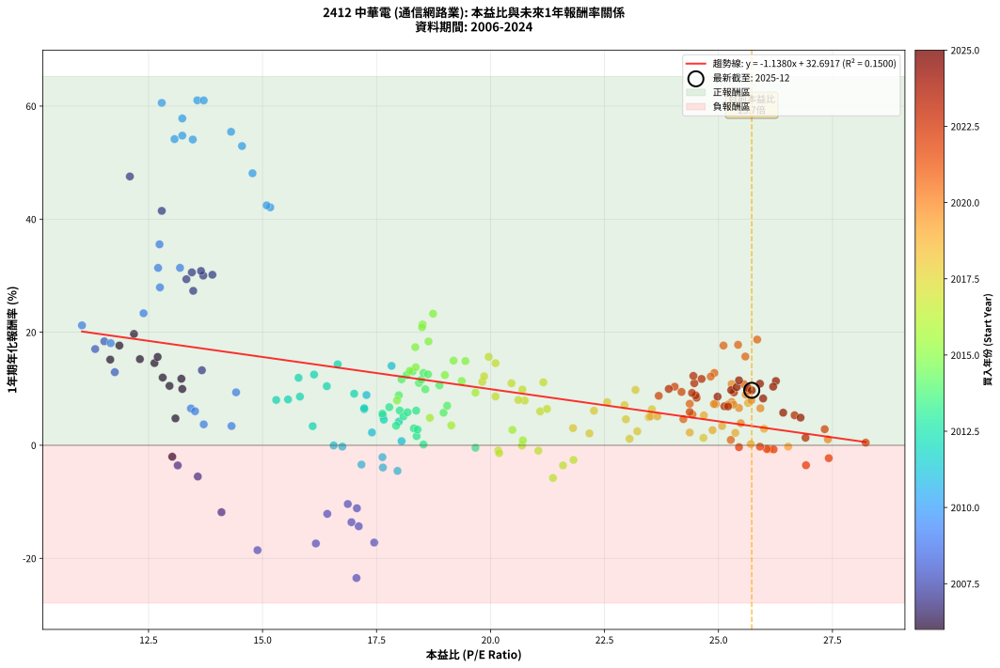

# 2412 中華電 - 本益比與未來報酬率分析

!!! info "報告資訊"
    - **股票代號**: 2412
    - **公司名稱**: 中華電
    - **產業別**: 通信網路業
    - **分析期間**: 2006-2024 (228 個數據點)
    - **資料來源**: Type 12 (ShowMonthlyK_ChartFlow) 月收盤價與本益比
    - **報酬率口徑**: 含現金股利 (簡化: 年度合計，假設每年7/1入帳)
    - **報告生成時間**: 2026-01-12 20:50:26 CST

## 📈 視覺化圖表

### 圖表1: 本益比 vs 未來報酬率關係

*圖表1：2412 中華電 本益比與1年期未來報酬率關係 (2006-2024)*

### 圖表2: 歷年買入時點的1年期實際報酬率

*圖表2：2412 中華電 歷年買入時點的1年期實際報酬率 (2006-2024)*

## 📍 買點訊號說明

本報告提供兩種買點提示訊號（顯示於圖表2的股價子圖中）：

### ▲ 小綠色三角形（回測驗證）
- **計算方式**: 使用全部歷史資料計算本益比第25百分位數
- **用途**: 事後驗證，顯示歷史上哪些時點確實為低估區
- **限制**: 當下無法判斷，僅供回測參考
- **特性**: 後見之明（Look-Ahead Bias）

### ▲ 小橘色三角形（即時訊號）
- **計算方式**: 使用截至當月的過去5年資料計算本益比第25百分位數
- **用途**: 實際投資決策，當時即可判斷
- **優勢**: 可操作性強，符合實務需求
- **特性**: 無後見之明，滾動窗口計算

!!! tip "如何使用兩種訊號"
    - **綠色▲** 幫助理解歷史估值機會，驗證策略有效性
    - **橘色▲** 可作為實際買進參考，但仍需搭配基本面分析
    - 兩種訊號重疊時，表示即時判斷與事後驗證一致，信心度較高
    - 僅有綠色▲時，表示當時無法判斷（需要未來資料才能確認）
    - 僅有橘色▲時，表示即時判斷為買點，但事後可能不是最佳時機

## 📊 估值分析摘要

| 指標 | 數值 |
|:---:|:---:|
| **目前本益比** (2024-12) | **25.73 倍** |
| **歷史平均本益比** | 19.69 倍 |
| **估值水準** | 🔴 相對高估 |
| **預期1年年化報酬率** | **+3.41%** |
| **歷史平均報酬率** | +10.29% |
| **相關係數 (R²)** | 0.1500 |
| **趨勢線斜率** | -1.1380 |

!!! abstract "核心洞察"
    目前本益比顯著高於歷史平均，預期未來報酬率可能較低

    根據歷史數據回測，2412 中華電 在目前本益比 **25.7倍** 的估值水準下，
    預期未來1年年化報酬率約為 **+3.4%**。

    **重要提醒**: 本分析基於歷史數據統計，實際報酬率會受到公司基本面變化、產業趨勢、
    總體經濟環境等多重因素影響。R² = 0.15 表示本益比可解釋約 15.0% 的報酬率變異。

## 📈 歷史估值統計

### 最佳買點 (最高報酬率)

| 項目 | 數值 |
|:---:|:---:|
| 起始時間 | 2010-06 |
| 當時本益比 | 13.57 倍 |
| 起始價格 | 63.9 元 |
| 1年後價格 | 98.8 元 |
| **1年年化報酬率** | **+61.02%** |

### 最差買點 (最低報酬率)

| 項目 | 數值 |
|:---:|:---:|
| 起始時間 | 2008-08 |
| 當時本益比 | 17.06 倍 |
| 起始價格 | 78.7 元 |
| 1年後價格 | 56.4 元 |
| **1年年化報酬率** | **-23.48%** |

## 🎯 投資啟示

### 本益比與報酬率關係

趨勢線方程式: **y = -1.1380x + 32.6917**

!!! warning "強負相關"
    本益比與未來報酬率呈現強負相關。在高本益比時期買入，未來報酬率顯著較低；
    在低本益比時期買入，未來報酬率顯著較高。**估值紀律至關重要**。

### 估值區間建議

基於歷史數據分析:

- **🟢 低估區** (P/E < 15.8): 預期報酬率較高，可考慮增加持股
- **🟡 合理區** (P/E 15.8-23.6): 預期報酬率符合長期趨勢，正常持有
- **🔴 高估區** (P/E > 23.6): 預期報酬率較低，可考慮減碼或觀望

!!! danger "風險提示"
    - 過去表現不代表未來結果
    - 本分析假設公司基本面無重大結構性變化
    - 產業環境劇變可能使歷史規律失效
    - 應結合公司財報、產業趨勢、總體經濟等多重因素綜合判斷

!!! success "長期投資觀點"
    歷史數據顯示，在合理或低估的估值水準買入並長期持有，
    往往能獲得較佳的投資報酬。**耐心等待好價格**是價值投資的核心原則。

## 📊 數據品質

- **資料來源**: GoodInfo.tw Type 12 (ShowMonthlyK_ChartFlow)
- **資料頻率**: 月度收盤價與本益比
- **回測期間**: 2006-2024
- **數據點數量**: 228 個 (每個點代表一次1年期回測)

### 計算方法說明

1. **1年期年化報酬率**:
   - 對每個歷史時點，計算其後1年的實際投資報酬率
   - 期末價值(不含股利): 期末價格
   - 期末價值(含現金股利): 期末價格 + 持有期間內的現金股利合計 (簡化: 年度合計，假設每年7/1入帳)
   - 公式: 年化報酬率 = [(期末價值/期初價格)^(1/年數) - 1] × 100%

2. **本益比 (P/E Ratio)**:
   - 使用當時的月收盤價與EPS計算
   - 資料來源: Type 12 月度河流圖本益比數據

3. **趨勢線 (Linear Regression)**:
   - 使用最小平方法擬合線性趨勢線
   - R²值衡量本益比對報酬率的解釋能力

---

*本報告由 Stock Analysis System v1.9.0 自動生成*
*數據更新時間: 2026-01-12 20:50:26 CST*

## 📋 月度回測明細表

（每一列對應時間線圖中的一個買入點；可用來對照 SVG 圖上的每個點。）

| 買入月份 | 賣出月份 | 回測期限_年 | 實際持有年數 | 買入本益比_倍 | 買入收盤價_元 | 賣出收盤價_元 | 現金股利合計_元 | 總報酬率_pct | 年化報酬率_pct |
| --- | --- | --- | --- | --- | --- | --- | --- | --- | --- |
| 2006-01 | 2007-01 | 1 | 0.999 | 12.18 | 56.40 | 63.20 | 4.30 | +19.68 | +19.70 |
| 2006-02 | 2007-02 | 1 | 0.999 | 12.81 | 59.30 | 62.10 | 4.30 | +11.97 | +11.98 |
| 2006-03 | 2007-03 | 1 | 0.999 | 13.22 | 61.20 | 64.10 | 4.30 | +11.76 | +11.77 |
| 2006-04 | 2007-04 | 1 | 0.999 | 13.24 | 61.30 | 63.10 | 4.30 | +9.95 | +9.96 |
| 2006-05 | 2007-05 | 1 | 0.999 | 12.96 | 60.00 | 62.00 | 4.30 | +10.50 | +10.51 |
| 2006-06 | 2007-06 | 1 | 0.999 | 12.63 | 58.50 | 62.70 | 4.30 | +14.53 | +14.54 |
| 2006-07 | 2007-07 | 1 | 0.999 | 13.02 | 60.30 | 55.50 | 3.58 | -2.02 | -2.02 |
| 2006-08 | 2007-08 | 1 | 0.999 | 11.66 | 54.00 | 58.60 | 3.58 | +15.15 | +15.16 |
| 2006-09 | 2007-09 | 1 | 0.999 | 11.86 | 54.90 | 61.00 | 3.58 | +17.63 | +17.65 |
| 2006-10 | 2007-10 | 1 | 0.999 | 12.31 | 57.00 | 62.10 | 3.58 | +15.23 | +15.24 |
| 2006-11 | 2007-11 | 1 | 0.999 | 12.70 | 58.80 | 64.40 | 3.58 | +15.61 | +15.62 |
| 2006-12 | 2007-12 | 1 | 0.999 | 13.09 | 60.60 | 59.90 | 3.58 | +4.75 | +4.76 |
| 2007-01 | 2008-01 | 1 | 0.999 | 13.67 | 63.20 | 68.00 | 3.58 | +13.26 | +13.27 |
| 2007-02 | 2008-02 | 1 | 0.999 | 13.45 | 62.10 | 77.50 | 3.58 | +30.56 | +30.59 |
| 2007-03 | 2008-03 | 1 | 1.002 | 13.90 | 64.10 | 79.90 | 3.58 | +30.23 | +30.16 |
| 2007-04 | 2008-04 | 1 | 1.002 | 13.70 | 63.10 | 78.50 | 3.58 | +30.08 | +30.01 |
| 2007-05 | 2008-05 | 1 | 1.002 | 13.48 | 62.00 | 75.40 | 3.58 | +27.39 | +27.32 |
| 2007-06 | 2008-06 | 1 | 1.002 | 13.65 | 62.70 | 78.50 | 3.58 | +30.91 | +30.84 |
| 2007-07 | 2008-07 | 1 | 1.002 | 12.09 | 55.50 | 77.70 | 4.26 | +47.68 | +47.56 |
| 2007-08 | 2008-08 | 1 | 1.002 | 12.79 | 58.60 | 78.70 | 4.26 | +41.57 | +41.47 |
| 2007-09 | 2008-09 | 1 | 1.002 | 13.33 | 61.00 | 74.70 | 4.26 | +29.44 | +29.37 |
| 2007-10 | 2008-10 | 1 | 1.002 | 13.58 | 62.10 | 54.40 | 4.26 | -5.54 | -5.53 |
| 2007-11 | 2008-11 | 1 | 1.002 | 14.10 | 64.40 | 52.50 | 4.26 | -11.86 | -11.84 |
| 2007-12 | 2008-12 | 1 | 1.002 | 13.14 | 59.90 | 53.50 | 4.26 | -3.57 | -3.57 |
| 2008-01 | 2009-01 | 1 | 1.002 | 14.89 | 68.00 | 51.10 | 4.26 | -18.59 | -18.55 |
| 2008-02 | 2009-03 | 1 | 1.081 | 16.95 | 77.50 | 61.90 | 4.26 | -14.63 | -13.61 |
| 2008-03 | 2009-03 | 1 | 0.999 | 17.45 | 79.90 | 61.90 | 4.26 | -17.20 | -17.21 |
| 2008-04 | 2009-04 | 1 | 0.999 | 17.11 | 78.50 | 63.00 | 4.26 | -14.32 | -14.33 |
| 2008-05 | 2009-05 | 1 | 0.999 | 16.42 | 75.40 | 62.00 | 4.26 | -12.12 | -12.13 |
| 2008-06 | 2009-06 | 1 | 0.999 | 17.07 | 78.50 | 65.50 | 4.26 | -11.13 | -11.14 |
| 2008-07 | 2009-07 | 1 | 0.999 | 16.87 | 77.70 | 65.80 | 3.83 | -10.39 | -10.39 |
| 2008-08 | 2009-08 | 1 | 0.999 | 17.06 | 78.70 | 56.40 | 3.83 | -23.47 | -23.48 |
| 2008-09 | 2009-09 | 1 | 0.999 | 16.17 | 74.70 | 57.90 | 3.83 | -17.36 | -17.37 |
| 2008-10 | 2009-10 | 1 | 0.999 | 11.76 | 54.40 | 57.60 | 3.83 | +12.92 | +12.93 |
| 2008-11 | 2009-11 | 1 | 0.999 | 11.33 | 52.50 | 57.60 | 3.83 | +17.01 | +17.02 |
| 2008-12 | 2009-12 | 1 | 0.999 | 11.53 | 53.50 | 59.50 | 3.83 | +18.37 | +18.39 |
| 2009-01 | 2010-01 | 1 | 0.999 | 11.04 | 51.10 | 58.10 | 3.83 | +21.19 | +21.21 |
| 2009-02 | 2010-02 | 1 | 0.999 | 11.67 | 53.90 | 59.80 | 3.83 | +18.05 | +18.07 |
| 2009-03 | 2010-03 | 1 | 0.999 | 13.43 | 61.90 | 62.10 | 3.83 | +6.51 | +6.52 |
| 2009-04 | 2010-04 | 1 | 0.999 | 13.71 | 63.00 | 61.50 | 3.83 | +3.70 | +3.70 |
| 2009-05 | 2010-05 | 1 | 0.999 | 13.52 | 62.00 | 61.90 | 3.83 | +6.02 | +6.02 |
| 2009-06 | 2010-06 | 1 | 0.999 | 14.32 | 65.50 | 63.90 | 3.83 | +3.40 | +3.41 |
| 2009-07 | 2010-07 | 1 | 0.999 | 14.42 | 65.80 | 67.90 | 4.06 | +9.36 | +9.37 |
| 2009-08 | 2010-08 | 1 | 0.999 | 12.39 | 56.40 | 65.50 | 4.06 | +23.33 | +23.35 |
| 2009-09 | 2010-09 | 1 | 0.999 | 12.75 | 57.90 | 70.00 | 4.06 | +27.91 | +27.93 |
| 2009-10 | 2010-10 | 1 | 0.999 | 12.71 | 57.60 | 71.60 | 4.06 | +31.35 | +31.38 |
| 2009-11 | 2010-11 | 1 | 0.999 | 12.74 | 57.60 | 74.00 | 4.06 | +35.52 | +35.55 |
| 2009-12 | 2010-12 | 1 | 0.999 | 13.19 | 59.50 | 74.10 | 4.06 | +31.36 | +31.39 |
| 2010-01 | 2011-01 | 1 | 0.999 | 12.79 | 58.10 | 89.20 | 4.06 | +60.52 | +60.57 |
| 2010-02 | 2011-02 | 1 | 0.999 | 13.07 | 59.80 | 88.10 | 4.06 | +54.11 | +54.16 |
| 2010-03 | 2011-03 | 1 | 0.999 | 13.47 | 62.10 | 91.60 | 4.06 | +54.04 | +54.09 |
| 2010-04 | 2011-04 | 1 | 0.999 | 13.24 | 61.50 | 91.10 | 4.06 | +54.73 | +54.78 |
| 2010-05 | 2011-05 | 1 | 0.999 | 13.24 | 61.90 | 93.60 | 4.06 | +57.77 | +57.82 |
| 2010-06 | 2011-06 | 1 | 0.999 | 13.57 | 63.90 | 98.80 | 4.06 | +60.97 | +61.02 |
| 2010-07 | 2011-07 | 1 | 0.999 | 14.31 | 67.90 | 100.00 | 5.52 | +55.41 | +55.46 |
| 2010-08 | 2011-08 | 1 | 0.999 | 13.71 | 65.50 | 99.90 | 5.52 | +60.95 | +61.01 |
| 2010-09 | 2011-09 | 1 | 0.999 | 14.55 | 70.00 | 101.50 | 5.52 | +52.89 | +52.94 |
| 2010-10 | 2011-10 | 1 | 0.999 | 14.78 | 71.60 | 100.50 | 5.52 | +48.08 | +48.12 |
| 2010-11 | 2011-11 | 1 | 0.999 | 15.17 | 74.00 | 99.60 | 5.52 | +42.06 | +42.09 |
| 2010-12 | 2011-12 | 1 | 0.999 | 15.09 | 74.10 | 100.00 | 5.52 | +42.41 | +42.44 |
| 2011-01 | 2012-01 | 1 | 0.999 | 17.83 | 89.20 | 96.20 | 5.52 | +14.04 | +14.05 |
| 2011-02 | 2012-02 | 1 | 0.999 | 17.28 | 88.10 | 90.40 | 5.52 | +8.88 | +8.89 |
| 2011-03 | 2012-03 | 1 | 1.002 | 17.64 | 91.60 | 90.90 | 5.52 | +5.27 | +5.26 |
| 2011-04 | 2012-04 | 1 | 1.002 | 17.23 | 91.10 | 91.40 | 5.52 | +6.39 | +6.38 |
| 2011-05 | 2012-05 | 1 | 1.002 | 17.40 | 93.60 | 90.20 | 5.52 | +2.27 | +2.26 |
| 2011-06 | 2012-06 | 1 | 1.002 | 18.05 | 98.80 | 94.00 | 5.52 | +0.73 | +0.73 |
| 2011-07 | 2012-07 | 1 | 1.002 | 17.96 | 100.00 | 90.00 | 5.46 | -4.54 | -4.53 |
| 2011-08 | 2012-08 | 1 | 1.002 | 17.64 | 99.90 | 90.50 | 5.46 | -3.94 | -3.94 |
| 2011-09 | 2012-09 | 1 | 1.002 | 17.63 | 101.50 | 93.90 | 5.46 | -2.11 | -2.10 |
| 2011-10 | 2012-10 | 1 | 1.002 | 17.17 | 100.50 | 91.60 | 5.46 | -3.42 | -3.41 |
| 2011-11 | 2012-11 | 1 | 1.002 | 16.75 | 99.60 | 93.90 | 5.46 | -0.24 | -0.24 |
| 2011-12 | 2012-12 | 1 | 1.002 | 16.56 | 100.00 | 94.50 | 5.46 | -0.04 | -0.04 |
| 2012-01 | 2013-01 | 1 | 1.002 | 16.10 | 96.20 | 94.00 | 5.46 | +3.39 | +3.38 |
| 2012-02 | 2013-03 | 1 | 1.081 | 15.30 | 90.40 | 92.80 | 5.46 | +8.70 | +8.02 |
| 2012-03 | 2013-03 | 1 | 0.999 | 15.56 | 90.90 | 92.80 | 5.46 | +8.10 | +8.10 |
| 2012-04 | 2013-04 | 1 | 0.999 | 15.82 | 91.40 | 93.80 | 5.46 | +8.60 | +8.61 |
| 2012-05 | 2013-05 | 1 | 0.999 | 15.79 | 90.20 | 95.50 | 5.46 | +11.93 | +11.94 |
| 2012-06 | 2013-06 | 1 | 0.999 | 16.65 | 94.00 | 102.00 | 5.46 | +14.32 | +14.33 |
| 2012-07 | 2013-07 | 1 | 0.999 | 16.13 | 90.00 | 95.90 | 5.35 | +12.50 | +12.51 |
| 2012-08 | 2013-08 | 1 | 0.999 | 16.41 | 90.50 | 94.60 | 5.35 | +10.44 | +10.45 |
| 2012-09 | 2013-09 | 1 | 0.999 | 17.23 | 93.90 | 94.70 | 5.35 | +6.55 | +6.55 |
| 2012-10 | 2013-10 | 1 | 0.999 | 17.01 | 91.60 | 94.60 | 5.35 | +9.12 | +9.12 |
| 2012-11 | 2013-11 | 1 | 0.999 | 17.66 | 93.90 | 92.80 | 5.35 | +4.53 | +4.53 |
| 2012-12 | 2013-12 | 1 | 0.999 | 17.99 | 94.50 | 93.10 | 5.35 | +4.18 | +4.18 |
| 2013-01 | 2014-01 | 1 | 0.999 | 17.93 | 94.00 | 91.90 | 5.35 | +3.46 | +3.46 |
| 2013-02 | 2014-02 | 1 | 0.999 | 17.63 | 92.20 | 92.00 | 5.35 | +5.59 | +5.59 |
| 2013-03 | 2014-03 | 1 | 0.999 | 17.78 | 92.80 | 93.70 | 5.35 | +6.73 | +6.74 |
| 2013-04 | 2014-04 | 1 | 0.999 | 18.01 | 93.80 | 94.20 | 5.35 | +6.13 | +6.13 |
| 2013-05 | 2014-05 | 1 | 0.999 | 18.37 | 95.50 | 96.00 | 5.35 | +6.13 | +6.13 |
| 2013-06 | 2014-06 | 1 | 0.999 | 19.67 | 102.00 | 96.20 | 5.35 | -0.44 | -0.44 |
| 2013-07 | 2014-07 | 1 | 0.999 | 18.53 | 95.90 | 91.50 | 4.53 | +0.13 | +0.13 |
| 2013-08 | 2014-08 | 1 | 0.999 | 18.32 | 94.60 | 92.90 | 4.53 | +2.99 | +2.99 |
| 2013-09 | 2014-09 | 1 | 0.999 | 18.38 | 94.70 | 91.70 | 4.53 | +1.61 | +1.61 |
| 2013-10 | 2014-10 | 1 | 0.999 | 18.40 | 94.60 | 92.70 | 4.53 | +2.77 | +2.78 |
| 2013-11 | 2014-11 | 1 | 0.999 | 18.09 | 92.80 | 93.00 | 4.53 | +5.09 | +5.10 |
| 2013-12 | 2014-12 | 1 | 0.999 | 18.18 | 93.10 | 94.00 | 4.53 | +5.83 | +5.83 |
| 2014-01 | 2015-01 | 1 | 0.999 | 17.99 | 91.90 | 95.50 | 4.53 | +8.84 | +8.85 |
| 2014-02 | 2015-02 | 1 | 0.999 | 18.05 | 92.00 | 98.20 | 4.53 | +11.66 | +11.67 |
| 2014-03 | 2015-03 | 1 | 0.999 | 18.43 | 93.70 | 99.50 | 4.53 | +11.02 | +11.03 |
| 2014-04 | 2015-04 | 1 | 0.999 | 18.57 | 94.20 | 99.00 | 4.53 | +9.90 | +9.91 |
| 2014-05 | 2015-05 | 1 | 0.999 | 18.97 | 96.00 | 97.00 | 4.53 | +5.76 | +5.76 |
| 2014-06 | 2015-06 | 1 | 0.999 | 19.05 | 96.20 | 98.40 | 4.53 | +6.99 | +7.00 |
| 2014-07 | 2015-07 | 1 | 0.999 | 18.16 | 91.50 | 98.00 | 4.86 | +12.41 | +12.42 |
| 2014-08 | 2015-08 | 1 | 0.999 | 18.48 | 92.90 | 98.80 | 4.86 | +11.58 | +11.59 |
| 2014-09 | 2015-09 | 1 | 0.999 | 18.29 | 91.70 | 98.80 | 4.86 | +13.04 | +13.05 |
| 2014-10 | 2015-10 | 1 | 0.999 | 18.53 | 92.70 | 99.70 | 4.86 | +12.79 | +12.80 |
| 2014-11 | 2015-11 | 1 | 0.999 | 18.63 | 93.00 | 99.80 | 4.86 | +12.53 | +12.54 |
| 2014-12 | 2015-12 | 1 | 0.999 | 18.88 | 94.00 | 99.10 | 4.86 | +10.59 | +10.60 |
| 2015-01 | 2016-01 | 1 | 0.999 | 19.00 | 95.50 | 102.50 | 4.86 | +12.41 | +12.42 |
| 2015-02 | 2016-02 | 1 | 0.999 | 19.37 | 98.20 | 104.50 | 4.86 | +11.36 | +11.37 |
| 2015-03 | 2016-03 | 1 | 1.002 | 19.45 | 99.50 | 109.50 | 4.86 | +14.93 | +14.90 |
| 2015-04 | 2016-04 | 1 | 1.002 | 19.19 | 99.00 | 109.00 | 4.86 | +15.01 | +14.97 |
| 2015-05 | 2016-05 | 1 | 1.002 | 18.64 | 97.00 | 110.00 | 4.86 | +18.41 | +18.37 |
| 2015-06 | 2016-06 | 1 | 1.002 | 18.74 | 98.40 | 116.50 | 4.86 | +23.33 | +23.28 |
| 2015-07 | 2016-07 | 1 | 1.002 | 18.51 | 98.00 | 113.50 | 5.49 | +21.41 | +21.37 |
| 2015-08 | 2016-08 | 1 | 1.002 | 18.50 | 98.80 | 114.00 | 5.49 | +20.94 | +20.89 |
| 2015-09 | 2016-09 | 1 | 1.002 | 18.35 | 98.80 | 110.50 | 5.49 | +17.39 | +17.36 |
| 2015-10 | 2016-10 | 1 | 1.002 | 18.36 | 99.70 | 108.00 | 5.49 | +13.83 | +13.80 |
| 2015-11 | 2016-11 | 1 | 1.002 | 18.23 | 99.80 | 107.50 | 5.49 | +13.21 | +13.18 |
| 2015-12 | 2016-12 | 1 | 1.002 | 17.95 | 99.10 | 101.50 | 5.49 | +7.96 | +7.94 |
| 2016-01 | 2017-01 | 1 | 1.002 | 18.67 | 102.50 | 102.00 | 5.49 | +4.86 | +4.85 |
| 2016-02 | 2017-03 | 1 | 1.081 | 19.14 | 104.50 | 103.00 | 5.49 | +3.81 | +3.52 |
| 2016-03 | 2017-03 | 1 | 0.999 | 20.17 | 109.50 | 103.00 | 5.49 | -0.93 | -0.93 |
| 2016-04 | 2017-04 | 1 | 0.999 | 20.19 | 109.00 | 102.00 | 5.49 | -1.39 | -1.39 |
| 2016-05 | 2017-05 | 1 | 0.999 | 20.48 | 110.00 | 107.50 | 5.49 | +2.71 | +2.72 |
| 2016-06 | 2017-06 | 1 | 0.999 | 21.82 | 116.50 | 108.00 | 5.49 | -2.59 | -2.59 |
| 2016-07 | 2017-07 | 1 | 0.999 | 21.37 | 113.50 | 102.00 | 4.94 | -5.78 | -5.78 |
| 2016-08 | 2017-08 | 1 | 0.999 | 21.59 | 114.00 | 105.00 | 4.94 | -3.56 | -3.56 |
| 2016-09 | 2017-09 | 1 | 0.999 | 21.05 | 110.50 | 104.50 | 4.94 | -0.96 | -0.96 |
| 2016-10 | 2017-10 | 1 | 0.999 | 20.69 | 108.00 | 103.00 | 4.94 | -0.05 | -0.05 |
| 2016-11 | 2017-11 | 1 | 0.999 | 20.71 | 107.50 | 103.50 | 4.94 | +0.88 | +0.88 |
| 2016-12 | 2017-12 | 1 | 0.999 | 19.67 | 101.50 | 106.00 | 4.94 | +9.30 | +9.31 |
| 2017-01 | 2018-01 | 1 | 0.999 | 19.82 | 102.00 | 108.50 | 4.94 | +11.22 | +11.23 |
| 2017-02 | 2018-02 | 1 | 0.999 | 19.86 | 102.00 | 109.50 | 4.94 | +12.20 | +12.21 |
| 2017-03 | 2018-03 | 1 | 0.999 | 20.11 | 103.00 | 113.00 | 4.94 | +14.51 | +14.52 |
| 2017-04 | 2018-04 | 1 | 0.999 | 19.96 | 102.00 | 113.00 | 4.94 | +15.63 | +15.64 |
| 2017-05 | 2018-05 | 1 | 0.999 | 21.09 | 107.50 | 109.00 | 4.94 | +5.99 | +6.00 |
| 2017-06 | 2018-06 | 1 | 0.999 | 21.24 | 108.00 | 110.00 | 4.94 | +6.43 | +6.43 |
| 2017-07 | 2018-07 | 1 | 0.999 | 20.11 | 102.00 | 106.00 | 4.80 | +8.62 | +8.63 |
| 2017-08 | 2018-08 | 1 | 0.999 | 20.75 | 105.00 | 108.50 | 4.80 | +7.90 | +7.91 |
| 2017-09 | 2018-09 | 1 | 0.999 | 20.70 | 104.50 | 110.00 | 4.80 | +9.85 | +9.86 |
| 2017-10 | 2018-10 | 1 | 0.999 | 20.46 | 103.00 | 109.50 | 4.80 | +10.97 | +10.97 |
| 2017-11 | 2018-11 | 1 | 0.999 | 20.61 | 103.50 | 107.00 | 4.80 | +8.02 | +8.02 |
| 2017-12 | 2018-12 | 1 | 0.999 | 21.16 | 106.00 | 113.00 | 4.80 | +11.13 | +11.14 |
| 2018-01 | 2019-01 | 1 | 0.999 | 21.81 | 108.50 | 107.00 | 4.80 | +3.04 | +3.04 |
| 2018-02 | 2019-02 | 1 | 0.999 | 22.17 | 109.50 | 107.00 | 4.80 | +2.10 | +2.10 |
| 2018-03 | 2019-03 | 1 | 0.999 | 23.05 | 113.00 | 109.50 | 4.80 | +1.15 | +1.15 |
| 2018-04 | 2019-04 | 1 | 0.999 | 23.22 | 113.00 | 111.00 | 4.80 | +2.47 | +2.48 |
| 2018-05 | 2019-05 | 1 | 0.999 | 22.56 | 109.00 | 112.50 | 4.80 | +7.61 | +7.62 |
| 2018-06 | 2019-06 | 1 | 0.999 | 22.94 | 110.00 | 113.00 | 4.80 | +7.09 | +7.09 |
| 2018-07 | 2019-07 | 1 | 0.999 | 22.27 | 106.00 | 108.00 | 4.48 | +6.11 | +6.12 |
| 2018-08 | 2019-08 | 1 | 0.999 | 22.97 | 108.50 | 109.00 | 4.48 | +4.59 | +4.59 |
| 2018-09 | 2019-09 | 1 | 0.999 | 23.47 | 110.00 | 111.00 | 4.48 | +4.98 | +4.98 |
| 2018-10 | 2019-10 | 1 | 0.999 | 23.54 | 109.50 | 112.00 | 4.48 | +6.37 | +6.38 |
| 2018-11 | 2019-11 | 1 | 0.999 | 23.18 | 107.00 | 113.00 | 4.48 | +9.79 | +9.80 |
| 2018-12 | 2019-12 | 1 | 0.999 | 24.67 | 113.00 | 110.00 | 4.48 | +1.31 | +1.31 |
| 2019-01 | 2020-01 | 1 | 0.999 | 23.51 | 107.00 | 108.00 | 4.48 | +5.12 | +5.12 |
| 2019-02 | 2020-02 | 1 | 0.999 | 23.66 | 107.00 | 108.00 | 4.48 | +5.12 | +5.12 |
| 2019-03 | 2020-03 | 1 | 1.002 | 24.37 | 109.50 | 107.50 | 4.48 | +2.26 | +2.26 |
| 2019-04 | 2020-04 | 1 | 1.002 | 24.87 | 111.00 | 109.50 | 4.48 | +2.68 | +2.68 |
| 2019-05 | 2020-05 | 1 | 1.002 | 25.37 | 112.50 | 110.50 | 4.48 | +2.20 | +2.20 |
| 2019-06 | 2020-06 | 1 | 1.002 | 25.65 | 113.00 | 117.00 | 4.48 | +7.50 | +7.49 |
| 2019-07 | 2020-07 | 1 | 1.002 | 24.68 | 108.00 | 109.50 | 4.23 | +5.30 | +5.29 |
| 2019-08 | 2020-08 | 1 | 1.002 | 25.08 | 109.00 | 108.50 | 4.23 | +3.42 | +3.41 |
| 2019-09 | 2020-09 | 1 | 1.002 | 25.71 | 111.00 | 107.00 | 4.23 | +0.20 | +0.20 |
| 2019-10 | 2020-10 | 1 | 1.002 | 26.12 | 112.00 | 107.00 | 4.23 | -0.69 | -0.69 |
| 2019-11 | 2020-11 | 1 | 1.002 | 26.53 | 113.00 | 108.50 | 4.23 | -0.24 | -0.24 |
| 2019-12 | 2020-12 | 1 | 1.002 | 26.00 | 110.00 | 109.00 | 4.23 | +2.93 | +2.93 |
| 2020-01 | 2021-01 | 1 | 1.002 | 25.49 | 108.00 | 108.00 | 4.23 | +3.91 | +3.90 |
| 2020-02 | 2021-03 | 1 | 1.081 | 25.45 | 108.00 | 111.50 | 4.23 | +7.15 | +6.60 |
| 2020-03 | 2021-03 | 1 | 0.999 | 25.29 | 107.50 | 111.50 | 4.23 | +7.65 | +7.66 |
| 2020-04 | 2021-04 | 1 | 0.999 | 25.72 | 109.50 | 114.00 | 4.23 | +7.97 | +7.97 |
| 2020-05 | 2021-05 | 1 | 0.999 | 25.92 | 110.50 | 113.50 | 4.23 | +6.54 | +6.54 |
| 2020-06 | 2021-06 | 1 | 0.999 | 27.40 | 117.00 | 114.00 | 4.23 | +1.05 | +1.05 |
| 2020-07 | 2021-07 | 1 | 0.999 | 25.60 | 109.50 | 115.00 | 4.31 | +8.96 | +8.96 |
| 2020-08 | 2021-08 | 1 | 0.999 | 25.33 | 108.50 | 112.00 | 4.31 | +7.19 | +7.20 |
| 2020-09 | 2021-09 | 1 | 0.999 | 24.94 | 107.00 | 110.50 | 4.31 | +7.30 | +7.30 |
| 2020-10 | 2021-10 | 1 | 0.999 | 24.90 | 107.00 | 110.50 | 4.31 | +7.30 | +7.30 |
| 2020-11 | 2021-11 | 1 | 0.999 | 25.21 | 108.50 | 112.00 | 4.31 | +7.19 | +7.20 |
| 2020-12 | 2021-12 | 1 | 0.999 | 25.29 | 109.00 | 116.50 | 4.31 | +10.83 | +10.84 |
| 2021-01 | 2022-01 | 1 | 0.999 | 24.91 | 108.00 | 117.50 | 4.31 | +12.78 | +12.79 |
| 2021-02 | 2022-02 | 1 | 0.999 | 25.11 | 109.50 | 124.50 | 4.31 | +17.63 | +17.64 |
| 2021-03 | 2022-03 | 1 | 0.999 | 25.43 | 111.50 | 127.00 | 4.31 | +17.76 | +17.78 |
| 2021-04 | 2022-04 | 1 | 0.999 | 25.85 | 114.00 | 131.00 | 4.31 | +18.69 | +18.70 |
| 2021-05 | 2022-05 | 1 | 0.999 | 25.59 | 113.50 | 127.00 | 4.31 | +15.69 | +15.70 |
| 2021-06 | 2022-06 | 1 | 0.999 | 25.56 | 114.00 | 122.00 | 4.31 | +10.79 | +10.80 |
| 2021-07 | 2022-07 | 1 | 0.999 | 25.64 | 115.00 | 121.50 | 4.61 | +9.66 | +9.67 |
| 2021-08 | 2022-08 | 1 | 0.999 | 24.83 | 112.00 | 121.00 | 4.61 | +12.15 | +12.16 |
| 2021-09 | 2022-09 | 1 | 0.999 | 24.37 | 110.50 | 114.00 | 4.61 | +7.34 | +7.34 |
| 2021-10 | 2022-10 | 1 | 0.999 | 24.23 | 110.50 | 111.00 | 4.61 | +4.62 | +4.63 |
| 2021-11 | 2022-11 | 1 | 0.999 | 24.43 | 112.00 | 113.50 | 4.61 | +5.45 | +5.46 |
| 2021-12 | 2022-12 | 1 | 0.999 | 25.27 | 116.50 | 113.00 | 4.61 | +0.95 | +0.95 |
| 2022-01 | 2023-01 | 1 | 0.999 | 25.45 | 117.50 | 112.50 | 4.61 | -0.33 | -0.33 |
| 2022-02 | 2023-02 | 1 | 0.999 | 26.92 | 124.50 | 115.50 | 4.61 | -3.53 | -3.53 |
| 2022-03 | 2023-03 | 1 | 0.999 | 27.42 | 127.00 | 119.50 | 4.61 | -2.28 | -2.28 |
| 2022-04 | 2023-04 | 1 | 0.999 | 28.23 | 131.00 | 127.00 | 4.61 | +0.46 | +0.46 |
| 2022-05 | 2023-05 | 1 | 0.999 | 27.33 | 127.00 | 126.00 | 4.61 | +2.84 | +2.84 |
| 2022-06 | 2023-06 | 1 | 0.999 | 26.21 | 122.00 | 116.50 | 4.61 | -0.73 | -0.73 |
| 2022-07 | 2023-07 | 1 | 0.999 | 26.06 | 121.50 | 116.00 | 4.70 | -0.66 | -0.66 |
| 2022-08 | 2023-08 | 1 | 0.999 | 25.91 | 121.00 | 116.00 | 4.70 | -0.25 | -0.25 |
| 2022-09 | 2023-09 | 1 | 0.999 | 24.37 | 114.00 | 116.00 | 4.70 | +5.88 | +5.88 |
| 2022-10 | 2023-10 | 1 | 0.999 | 23.69 | 111.00 | 116.00 | 4.70 | +8.74 | +8.75 |
| 2022-11 | 2023-11 | 1 | 0.999 | 24.19 | 113.50 | 119.50 | 4.70 | +9.43 | +9.44 |
| 2022-12 | 2023-12 | 1 | 0.999 | 24.04 | 113.00 | 120.00 | 4.70 | +10.36 | +10.36 |
| 2023-01 | 2024-01 | 1 | 0.999 | 23.91 | 112.50 | 119.00 | 4.70 | +9.96 | +9.96 |
| 2023-02 | 2024-02 | 1 | 0.999 | 24.52 | 115.50 | 120.50 | 4.70 | +8.40 | +8.41 |
| 2023-03 | 2024-03 | 1 | 1.002 | 25.34 | 119.50 | 126.00 | 4.70 | +9.37 | +9.35 |
| 2023-04 | 2024-04 | 1 | 1.002 | 26.91 | 127.00 | 124.00 | 4.70 | +1.34 | +1.34 |
| 2023-05 | 2024-05 | 1 | 1.002 | 26.67 | 126.00 | 128.00 | 4.70 | +5.32 | +5.31 |
| 2023-06 | 2024-06 | 1 | 1.002 | 24.63 | 116.50 | 125.50 | 4.70 | +11.76 | +11.74 |
| 2023-07 | 2024-07 | 1 | 1.002 | 24.50 | 116.00 | 121.50 | 4.76 | +8.84 | +8.82 |
| 2023-08 | 2024-08 | 1 | 1.002 | 24.47 | 116.00 | 124.00 | 4.76 | +11.00 | +10.97 |
| 2023-09 | 2024-09 | 1 | 1.002 | 24.45 | 116.00 | 125.50 | 4.76 | +12.29 | +12.26 |
| 2023-10 | 2024-10 | 1 | 1.002 | 24.42 | 116.00 | 122.00 | 4.76 | +9.27 | +9.25 |
| 2023-11 | 2024-11 | 1 | 1.002 | 25.13 | 119.50 | 123.00 | 4.76 | +6.91 | +6.90 |
| 2023-12 | 2024-12 | 1 | 1.002 | 25.21 | 120.00 | 123.50 | 4.76 | +6.88 | +6.87 |
| 2024-01 | 2025-01 | 1 | 1.002 | 24.98 | 119.00 | 124.50 | 4.76 | +8.62 | +8.60 |
| 2024-02 | 2025-03 | 1 | 1.081 | 25.28 | 120.50 | 128.50 | 4.76 | +10.59 | +9.75 |
| 2024-03 | 2025-03 | 1 | 0.999 | 26.42 | 126.00 | 128.50 | 4.76 | +5.76 | +5.76 |
| 2024-04 | 2025-04 | 1 | 0.999 | 25.98 | 124.00 | 129.50 | 4.76 | +8.27 | +8.28 |
| 2024-05 | 2025-05 | 1 | 0.999 | 26.80 | 128.00 | 129.50 | 4.76 | +4.89 | +4.89 |
| 2024-06 | 2025-06 | 1 | 0.999 | 26.26 | 125.50 | 135.00 | 4.76 | +11.36 | +11.37 |
| 2024-07 | 2025-07 | 1 | 0.999 | 25.40 | 121.50 | 129.00 | 5.00 | +10.29 | +10.30 |
| 2024-08 | 2025-08 | 1 | 0.999 | 25.91 | 124.00 | 132.50 | 5.00 | +10.89 | +10.89 |
| 2024-09 | 2025-09 | 1 | 0.999 | 26.20 | 125.50 | 133.50 | 5.00 | +10.36 | +10.37 |
| 2024-10 | 2025-10 | 1 | 0.999 | 25.45 | 122.00 | 131.00 | 5.00 | +11.48 | +11.48 |
| 2024-11 | 2025-11 | 1 | 0.999 | 25.64 | 123.00 | 130.50 | 5.00 | +10.16 | +10.17 |
| 2024-12 | 2025-12 | 1 | 0.999 | 25.73 | 123.50 | 130.50 | 5.00 | +9.72 | +9.72 |
