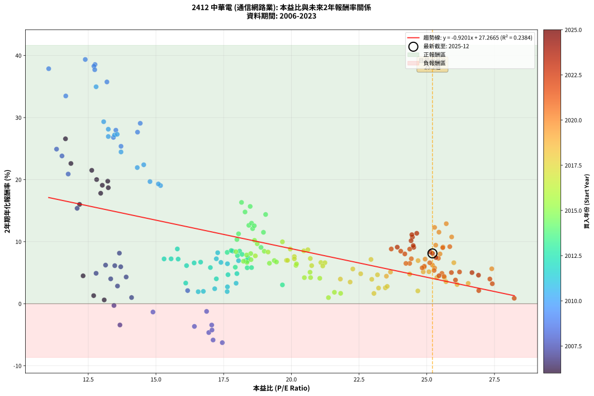
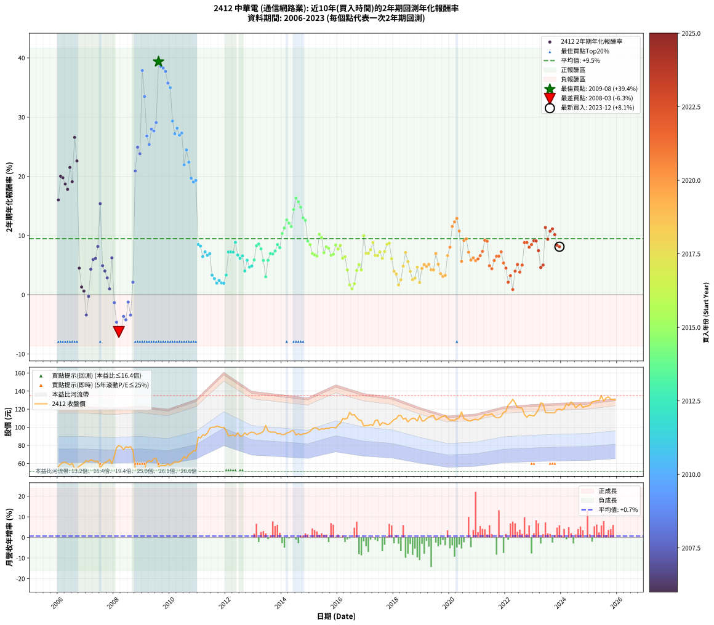

# 2412 中華電 - 本益比與未來報酬率分析

!!! info "報告資訊"
    - **股票代號**: 2412
    - **公司名稱**: 中華電
    - **產業別**: 通信網路業
    - **分析期間**: 2006-2023 (216 個數據點)
    - **資料來源**: Type 12 (ShowMonthlyK_ChartFlow) 月收盤價與本益比
    - **報酬率口徑**: 含現金股利 (簡化: 年度合計，假設每年7/1入帳)
    - **報告生成時間**: 2026-01-06 18:37:52 CST

## 📈 視覺化圖表

### 圖表1: 本益比 vs 未來報酬率關係

*圖表1：2412 中華電 本益比與2年期未來報酬率關係 (2006-2023)*

### 圖表2: 歷年買入時點的2年期實際報酬率

*圖表2：2412 中華電 歷年買入時點的2年期實際報酬率 (2006-2023)*

## 📍 買點訊號說明

本報告提供兩種買點提示訊號（顯示於圖表2的股價子圖中）：

### ▲ 小綠色三角形（回測驗證）
- **計算方式**: 使用全部歷史資料計算本益比第25百分位數
- **用途**: 事後驗證，顯示歷史上哪些時點確實為低估區
- **限制**: 當下無法判斷，僅供回測參考
- **特性**: 後見之明（Look-Ahead Bias）

### ▲ 小橘色三角形（即時訊號）
- **計算方式**: 使用截至當月的過去5年資料計算本益比第25百分位數
- **用途**: 實際投資決策，當時即可判斷
- **優勢**: 可操作性強，符合實務需求
- **特性**: 無後見之明，滾動窗口計算

!!! tip "如何使用兩種訊號"
    - **綠色▲** 幫助理解歷史估值機會，驗證策略有效性
    - **橘色▲** 可作為實際買進參考，但仍需搭配基本面分析
    - 兩種訊號重疊時，表示即時判斷與事後驗證一致，信心度較高
    - 僅有綠色▲時，表示當時無法判斷（需要未來資料才能確認）
    - 僅有橘色▲時，表示即時判斷為買點，但事後可能不是最佳時機

## 📊 估值分析摘要

| 指標 | 數值 |
|:---:|:---:|
| **目前本益比** (2023-12) | **25.21 倍** |
| **歷史平均本益比** | 19.35 倍 |
| **估值水準** | 🔴 相對高估 |
| **預期2年年化報酬率** | **+4.07%** |
| **歷史平均報酬率** | +9.46% |
| **相關係數 (R²)** | 0.2384 |
| **趨勢線斜率** | -0.9201 |

!!! abstract "核心洞察"
    目前本益比顯著高於歷史平均，預期未來報酬率可能較低

    根據歷史數據回測，2412 中華電 在目前本益比 **25.2倍** 的估值水準下，
    預期未來2年年化報酬率約為 **+4.1%**。

    **重要提醒**: 本分析基於歷史數據統計，實際報酬率會受到公司基本面變化、產業趨勢、
    總體經濟環境等多重因素影響。R² = 0.24 表示本益比可解釋約 23.8% 的報酬率變異。

## 📈 歷史估值統計

### 最佳買點 (最高報酬率)

| 項目 | 數值 |
|:---:|:---:|
| 起始時間 | 2009-08 |
| 當時本益比 | 12.39 倍 |
| 起始價格 | 56.4 元 |
| 2年後價格 | 99.9 元 |
| **2年年化報酬率** | **+39.36%** |

### 最差買點 (最低報酬率)

| 項目 | 數值 |
|:---:|:---:|
| 起始時間 | 2008-03 |
| 當時本益比 | 17.45 倍 |
| 起始價格 | 79.9 元 |
| 2年後價格 | 62.1 元 |
| **2年年化報酬率** | **-6.28%** |

## 🎯 投資啟示

### 本益比與報酬率關係

趨勢線方程式: **y = -0.9201x + 27.2665**

!!! warning "強負相關"
    本益比與未來報酬率呈現強負相關。在高本益比時期買入，未來報酬率顯著較低；
    在低本益比時期買入，未來報酬率顯著較高。**估值紀律至關重要**。

### 估值區間建議

基於歷史數據分析:

- **🟢 低估區** (P/E < 15.5): 預期報酬率較高，可考慮增加持股
- **🟡 合理區** (P/E 15.5-23.2): 預期報酬率符合長期趨勢，正常持有
- **🔴 高估區** (P/E > 23.2): 預期報酬率較低，可考慮減碼或觀望

!!! danger "風險提示"
    - 過去表現不代表未來結果
    - 本分析假設公司基本面無重大結構性變化
    - 產業環境劇變可能使歷史規律失效
    - 應結合公司財報、產業趨勢、總體經濟等多重因素綜合判斷

!!! success "長期投資觀點"
    歷史數據顯示，在合理或低估的估值水準買入並長期持有，
    往往能獲得較佳的投資報酬。**耐心等待好價格**是價值投資的核心原則。

## 📊 數據品質

- **資料來源**: GoodInfo.tw Type 12 (ShowMonthlyK_ChartFlow)
- **資料頻率**: 月度收盤價與本益比
- **回測期間**: 2006-2023
- **數據點數量**: 216 個 (每個點代表一次2年期回測)

### 計算方法說明

1. **2年期年化報酬率**:
   - 對每個歷史時點，計算其後2年的實際投資報酬率
   - 期末價值(不含股利): 期末價格
   - 期末價值(含現金股利): 期末價格 + 持有期間內的現金股利合計 (簡化: 年度合計，假設每年7/1入帳)
   - 公式: 年化報酬率 = [(期末價值/期初價格)^(1/年數) - 1] × 100%

2. **本益比 (P/E Ratio)**:
   - 使用當時的月收盤價與EPS計算
   - 資料來源: Type 12 月度河流圖本益比數據

3. **趨勢線 (Linear Regression)**:
   - 使用最小平方法擬合線性趨勢線
   - R²值衡量本益比對報酬率的解釋能力

---

*本報告由 Stock Analysis System v1.9.0 自動生成*
*數據更新時間: 2026-01-06 18:37:52 CST*

## 📋 月度回測明細表

（每一列對應時間線圖中的一個買入點；可用來對照 SVG 圖上的每個點。）

| 買入月份 | 賣出月份 | 回測期限_年 | 實際持有年數 | 買入本益比_倍 | 買入收盤價_元 | 賣出收盤價_元 | 現金股利合計_元 | 總報酬率_pct | 年化報酬率_pct |
| --- | --- | --- | --- | --- | --- | --- | --- | --- | --- |
| 2006-01 | 2008-01 | 2 | 1.999 | 12.18 | 56.40 | 68.00 | 7.88 | +34.54 | +16.00 |
| 2006-02 | 2008-02 | 2 | 1.999 | 12.81 | 59.30 | 77.50 | 7.88 | +43.98 | +20.01 |
| 2006-03 | 2008-03 | 2 | 2.001 | 13.22 | 61.20 | 79.90 | 7.88 | +43.43 | +19.75 |
| 2006-04 | 2008-04 | 2 | 2.001 | 13.24 | 61.30 | 78.50 | 7.88 | +40.91 | +18.69 |
| 2006-05 | 2008-05 | 2 | 2.001 | 12.96 | 60.00 | 75.40 | 7.88 | +38.80 | +17.80 |
| 2006-06 | 2008-06 | 2 | 2.001 | 12.63 | 58.50 | 78.50 | 7.88 | +47.66 | +21.50 |
| 2006-07 | 2008-07 | 2 | 2.001 | 13.02 | 60.30 | 77.70 | 7.84 | +41.86 | +19.09 |
| 2006-08 | 2008-08 | 2 | 2.001 | 11.66 | 54.00 | 78.70 | 7.84 | +60.26 | +26.57 |
| 2006-09 | 2008-09 | 2 | 2.001 | 11.86 | 54.90 | 74.70 | 7.84 | +50.35 | +22.60 |
| 2006-10 | 2008-10 | 2 | 2.001 | 12.31 | 57.00 | 54.40 | 7.84 | +9.19 | +4.49 |
| 2006-11 | 2008-11 | 2 | 2.001 | 12.70 | 58.80 | 52.50 | 7.84 | +2.62 | +1.30 |
| 2006-12 | 2008-12 | 2 | 2.001 | 13.09 | 60.60 | 53.50 | 7.84 | +1.22 | +0.61 |
| 2007-01 | 2009-01 | 2 | 2.001 | 13.67 | 63.20 | 51.10 | 7.84 | -6.74 | -3.43 |
| 2007-02 | 2009-02 | 2 | 2.001 | 13.45 | 62.10 | 53.90 | 7.84 | -0.58 | -0.29 |
| 2007-03 | 2009-03 | 2 | 2.001 | 13.90 | 64.10 | 61.90 | 7.84 | +8.80 | +4.30 |
| 2007-04 | 2009-04 | 2 | 2.001 | 13.70 | 63.10 | 63.00 | 7.84 | +12.27 | +5.95 |
| 2007-05 | 2009-05 | 2 | 2.001 | 13.48 | 62.00 | 62.00 | 7.84 | +12.65 | +6.13 |
| 2007-06 | 2009-06 | 2 | 2.001 | 13.65 | 62.70 | 65.50 | 7.84 | +16.97 | +8.15 |
| 2007-07 | 2009-07 | 2 | 2.001 | 12.09 | 55.50 | 65.80 | 8.09 | +33.14 | +15.37 |
| 2007-08 | 2009-08 | 2 | 2.001 | 12.79 | 58.60 | 56.40 | 8.09 | +10.05 | +4.90 |
| 2007-09 | 2009-09 | 2 | 2.001 | 13.33 | 61.00 | 57.90 | 8.09 | +8.18 | +4.01 |
| 2007-10 | 2009-10 | 2 | 2.001 | 13.58 | 62.10 | 57.60 | 8.09 | +5.78 | +2.85 |
| 2007-11 | 2009-11 | 2 | 2.001 | 14.10 | 64.40 | 57.60 | 8.09 | +2.00 | +1.00 |
| 2007-12 | 2009-12 | 2 | 2.001 | 13.14 | 59.90 | 59.50 | 8.09 | +12.84 | +6.22 |
| 2008-01 | 2010-01 | 2 | 2.001 | 14.89 | 68.00 | 58.10 | 8.09 | -2.66 | -1.34 |
| 2008-02 | 2010-03 | 2 | 2.081 | 16.95 | 77.50 | 62.10 | 8.09 | -9.43 | -4.65 |
| 2008-03 | 2010-03 | 2 | 1.999 | 17.45 | 79.90 | 62.10 | 8.09 | -12.15 | -6.28 |
| 2008-04 | 2010-04 | 2 | 1.999 | 17.11 | 78.50 | 61.50 | 8.09 | -11.35 | -5.85 |
| 2008-05 | 2010-05 | 2 | 1.999 | 16.42 | 75.40 | 61.90 | 8.09 | -7.18 | -3.66 |
| 2008-06 | 2010-06 | 2 | 1.999 | 17.07 | 78.50 | 63.90 | 8.09 | -8.29 | -4.24 |
| 2008-07 | 2010-07 | 2 | 1.999 | 16.87 | 77.70 | 67.90 | 7.89 | -2.46 | -1.24 |
| 2008-08 | 2010-08 | 2 | 1.999 | 17.06 | 78.70 | 65.50 | 7.89 | -6.75 | -3.43 |
| 2008-09 | 2010-09 | 2 | 1.999 | 16.17 | 74.70 | 70.00 | 7.89 | +4.27 | +2.11 |
| 2008-10 | 2010-10 | 2 | 1.999 | 11.76 | 54.40 | 71.60 | 7.89 | +46.12 | +20.90 |
| 2008-11 | 2010-11 | 2 | 1.999 | 11.33 | 52.50 | 74.00 | 7.89 | +55.98 | +24.91 |
| 2008-12 | 2010-12 | 2 | 1.999 | 11.53 | 53.50 | 74.10 | 7.89 | +53.25 | +23.81 |
| 2009-01 | 2011-01 | 2 | 1.999 | 11.04 | 51.10 | 89.20 | 7.89 | +90.00 | +37.87 |
| 2009-02 | 2011-02 | 2 | 1.999 | 11.67 | 53.90 | 88.10 | 7.89 | +78.09 | +33.48 |
| 2009-03 | 2011-03 | 2 | 1.999 | 13.43 | 61.90 | 91.60 | 7.89 | +60.73 | +26.80 |
| 2009-04 | 2011-04 | 2 | 1.999 | 13.71 | 63.00 | 91.10 | 7.89 | +57.13 | +25.37 |
| 2009-05 | 2011-05 | 2 | 1.999 | 13.52 | 62.00 | 93.60 | 7.89 | +63.69 | +27.96 |
| 2009-06 | 2011-06 | 2 | 1.999 | 14.32 | 65.50 | 98.80 | 7.89 | +62.89 | +27.65 |
| 2009-07 | 2011-07 | 2 | 1.999 | 14.42 | 65.80 | 100.00 | 9.58 | +66.54 | +29.07 |
| 2009-08 | 2011-08 | 2 | 1.999 | 12.39 | 56.40 | 99.90 | 9.58 | +94.12 | +39.36 |
| 2009-09 | 2011-09 | 2 | 1.999 | 12.75 | 57.90 | 101.50 | 9.58 | +91.85 | +38.54 |
| 2009-10 | 2011-10 | 2 | 1.999 | 12.71 | 57.60 | 100.50 | 9.58 | +91.12 | +38.28 |
| 2009-11 | 2011-11 | 2 | 1.999 | 12.74 | 57.60 | 99.60 | 9.58 | +89.56 | +37.71 |
| 2009-12 | 2011-12 | 2 | 1.999 | 13.19 | 59.50 | 100.00 | 9.58 | +84.17 | +35.74 |
| 2010-01 | 2012-01 | 2 | 1.999 | 12.79 | 58.10 | 96.20 | 9.58 | +82.07 | +34.96 |
| 2010-02 | 2012-02 | 2 | 1.999 | 13.07 | 59.80 | 90.40 | 9.58 | +67.20 | +29.33 |
| 2010-03 | 2012-03 | 2 | 2.001 | 13.47 | 62.10 | 90.90 | 9.58 | +61.81 | +27.18 |
| 2010-04 | 2012-04 | 2 | 2.001 | 13.24 | 61.50 | 91.40 | 9.58 | +64.20 | +28.12 |
| 2010-05 | 2012-05 | 2 | 2.001 | 13.24 | 61.90 | 90.20 | 9.58 | +61.20 | +26.94 |
| 2010-06 | 2012-06 | 2 | 2.001 | 13.57 | 63.90 | 94.00 | 9.58 | +62.10 | +27.30 |
| 2010-07 | 2012-07 | 2 | 2.001 | 14.31 | 67.90 | 90.00 | 10.98 | +48.73 | +21.94 |
| 2010-08 | 2012-08 | 2 | 2.001 | 13.71 | 65.50 | 90.50 | 10.98 | +54.94 | +24.46 |
| 2010-09 | 2012-09 | 2 | 2.001 | 14.55 | 70.00 | 93.90 | 10.98 | +49.84 | +22.39 |
| 2010-10 | 2012-10 | 2 | 2.001 | 14.78 | 71.60 | 91.60 | 10.98 | +43.28 | +19.68 |
| 2010-11 | 2012-11 | 2 | 2.001 | 15.17 | 74.00 | 93.90 | 10.98 | +41.74 | +19.04 |
| 2010-12 | 2012-12 | 2 | 2.001 | 15.09 | 74.10 | 94.50 | 10.98 | +42.35 | +19.30 |
| 2011-01 | 2013-01 | 2 | 2.001 | 17.83 | 89.20 | 94.00 | 10.98 | +17.70 | +8.48 |
| 2011-02 | 2013-02 | 2 | 2.001 | 17.28 | 88.10 | 92.20 | 10.98 | +17.12 | +8.22 |
| 2011-03 | 2013-03 | 2 | 2.001 | 17.64 | 91.60 | 92.80 | 10.98 | +13.30 | +6.44 |
| 2011-04 | 2013-04 | 2 | 2.001 | 17.23 | 91.10 | 93.80 | 10.98 | +15.02 | +7.24 |
| 2011-05 | 2013-05 | 2 | 2.001 | 17.40 | 93.60 | 95.50 | 10.98 | +13.77 | +6.66 |
| 2011-06 | 2013-06 | 2 | 2.001 | 18.05 | 98.80 | 102.00 | 10.98 | +14.36 | +6.93 |
| 2011-07 | 2013-07 | 2 | 2.001 | 17.96 | 100.00 | 95.90 | 10.81 | +6.71 | +3.30 |
| 2011-08 | 2013-08 | 2 | 2.001 | 17.64 | 99.90 | 94.60 | 10.81 | +5.52 | +2.72 |
| 2011-09 | 2013-09 | 2 | 2.001 | 17.63 | 101.50 | 94.70 | 10.81 | +3.95 | +1.96 |
| 2011-10 | 2013-10 | 2 | 2.001 | 17.17 | 100.50 | 94.60 | 10.81 | +4.89 | +2.41 |
| 2011-11 | 2013-11 | 2 | 2.001 | 16.75 | 99.60 | 92.80 | 10.81 | +4.03 | +1.99 |
| 2011-12 | 2013-12 | 2 | 2.001 | 16.56 | 100.00 | 93.10 | 10.81 | +3.91 | +1.94 |
| 2012-01 | 2014-01 | 2 | 2.001 | 16.10 | 96.20 | 91.90 | 10.81 | +6.77 | +3.33 |
| 2012-02 | 2014-03 | 2 | 2.081 | 15.30 | 90.40 | 93.70 | 10.81 | +15.61 | +7.22 |
| 2012-03 | 2014-03 | 2 | 1.999 | 15.56 | 90.90 | 93.70 | 10.81 | +14.97 | +7.23 |
| 2012-04 | 2014-04 | 2 | 1.999 | 15.82 | 91.40 | 94.20 | 10.81 | +14.89 | +7.19 |
| 2012-05 | 2014-05 | 2 | 1.999 | 15.79 | 90.20 | 96.00 | 10.81 | +18.42 | +8.83 |
| 2012-06 | 2014-06 | 2 | 1.999 | 16.65 | 94.00 | 96.20 | 10.81 | +13.84 | +6.70 |
| 2012-07 | 2014-07 | 2 | 1.999 | 16.13 | 90.00 | 91.50 | 9.88 | +12.64 | +6.14 |
| 2012-08 | 2014-08 | 2 | 1.999 | 16.41 | 90.50 | 92.90 | 9.88 | +13.56 | +6.57 |
| 2012-09 | 2014-09 | 2 | 1.999 | 17.23 | 93.90 | 91.70 | 9.88 | +8.17 | +4.01 |
| 2012-10 | 2014-10 | 2 | 1.999 | 17.01 | 91.60 | 92.70 | 9.88 | +11.98 | +5.83 |
| 2012-11 | 2014-11 | 2 | 1.999 | 17.66 | 93.90 | 93.00 | 9.88 | +9.56 | +4.67 |
| 2012-12 | 2014-12 | 2 | 1.999 | 17.99 | 94.50 | 94.00 | 9.88 | +9.92 | +4.85 |
| 2013-01 | 2015-01 | 2 | 1.999 | 17.93 | 94.00 | 95.50 | 9.88 | +12.10 | +5.88 |
| 2013-02 | 2015-02 | 2 | 1.999 | 17.63 | 92.20 | 98.20 | 9.88 | +17.22 | +8.27 |
| 2013-03 | 2015-03 | 2 | 1.999 | 17.78 | 92.80 | 99.50 | 9.88 | +17.86 | +8.57 |
| 2013-04 | 2015-04 | 2 | 1.999 | 18.01 | 93.80 | 99.00 | 9.88 | +16.07 | +7.74 |
| 2013-05 | 2015-05 | 2 | 1.999 | 18.37 | 95.50 | 97.00 | 9.88 | +11.91 | +5.79 |
| 2013-06 | 2015-06 | 2 | 1.999 | 19.67 | 102.00 | 98.40 | 9.88 | +6.15 | +3.03 |
| 2013-07 | 2015-07 | 2 | 1.999 | 18.53 | 95.90 | 98.00 | 9.38 | +11.97 | +5.82 |
| 2013-08 | 2015-08 | 2 | 1.999 | 18.32 | 94.60 | 98.80 | 9.38 | +14.36 | +6.94 |
| 2013-09 | 2015-09 | 2 | 1.999 | 18.38 | 94.70 | 98.80 | 9.38 | +14.24 | +6.89 |
| 2013-10 | 2015-10 | 2 | 1.999 | 18.40 | 94.60 | 99.70 | 9.38 | +15.31 | +7.39 |
| 2013-11 | 2015-11 | 2 | 1.999 | 18.09 | 92.80 | 99.80 | 9.38 | +17.65 | +8.47 |
| 2013-12 | 2015-12 | 2 | 1.999 | 18.18 | 93.10 | 99.10 | 9.38 | +16.52 | +7.95 |
| 2014-01 | 2016-01 | 2 | 1.999 | 17.99 | 91.90 | 102.50 | 9.38 | +21.74 | +10.34 |
| 2014-02 | 2016-02 | 2 | 1.999 | 18.05 | 92.00 | 104.50 | 9.38 | +23.78 | +11.27 |
| 2014-03 | 2016-03 | 2 | 2.001 | 18.43 | 93.70 | 109.50 | 9.38 | +26.87 | +12.63 |
| 2014-04 | 2016-04 | 2 | 2.001 | 18.57 | 94.20 | 109.00 | 9.38 | +25.67 | +12.09 |
| 2014-05 | 2016-05 | 2 | 2.001 | 18.97 | 96.00 | 110.00 | 9.38 | +24.36 | +11.51 |
| 2014-06 | 2016-06 | 2 | 2.001 | 19.05 | 96.20 | 116.50 | 9.38 | +30.85 | +14.38 |
| 2014-07 | 2016-07 | 2 | 2.001 | 18.16 | 91.50 | 113.50 | 10.34 | +35.35 | +16.33 |
| 2014-08 | 2016-08 | 2 | 2.001 | 18.48 | 92.90 | 114.00 | 10.34 | +33.84 | +15.68 |
| 2014-09 | 2016-09 | 2 | 2.001 | 18.29 | 91.70 | 110.50 | 10.34 | +31.78 | +14.78 |
| 2014-10 | 2016-10 | 2 | 2.001 | 18.53 | 92.70 | 108.00 | 10.34 | +27.66 | +12.98 |
| 2014-11 | 2016-11 | 2 | 2.001 | 18.63 | 93.00 | 107.50 | 10.34 | +26.71 | +12.56 |
| 2014-12 | 2016-12 | 2 | 2.001 | 18.88 | 94.00 | 101.50 | 10.34 | +18.98 | +9.07 |
| 2015-01 | 2017-01 | 2 | 2.001 | 19.00 | 95.50 | 102.00 | 10.34 | +17.63 | +8.45 |
| 2015-02 | 2017-02 | 2 | 2.001 | 19.37 | 98.20 | 102.00 | 10.34 | +14.40 | +6.95 |
| 2015-03 | 2017-03 | 2 | 2.001 | 19.45 | 99.50 | 103.00 | 10.34 | +13.91 | +6.72 |
| 2015-04 | 2017-04 | 2 | 2.001 | 19.19 | 99.00 | 102.00 | 10.34 | +13.48 | +6.52 |
| 2015-05 | 2017-05 | 2 | 2.001 | 18.64 | 97.00 | 107.50 | 10.34 | +21.49 | +10.21 |
| 2015-06 | 2017-06 | 2 | 2.001 | 18.74 | 98.40 | 108.00 | 10.34 | +20.27 | +9.66 |
| 2015-07 | 2017-07 | 2 | 2.001 | 18.51 | 98.00 | 102.00 | 10.43 | +14.72 | +7.10 |
| 2015-08 | 2017-08 | 2 | 2.001 | 18.50 | 98.80 | 105.00 | 10.43 | +16.83 | +8.08 |
| 2015-09 | 2017-09 | 2 | 2.001 | 18.35 | 98.80 | 104.50 | 10.43 | +16.32 | +7.85 |
| 2015-10 | 2017-10 | 2 | 2.001 | 18.36 | 99.70 | 103.00 | 10.43 | +13.77 | +6.66 |
| 2015-11 | 2017-11 | 2 | 2.001 | 18.23 | 99.80 | 103.50 | 10.43 | +14.16 | +6.84 |
| 2015-12 | 2017-12 | 2 | 2.001 | 17.95 | 99.10 | 106.00 | 10.43 | +17.48 | +8.38 |
| 2016-01 | 2018-01 | 2 | 2.001 | 18.67 | 102.50 | 108.50 | 10.43 | +16.03 | +7.71 |
| 2016-02 | 2018-03 | 2 | 2.081 | 19.14 | 104.50 | 113.00 | 10.43 | +18.11 | +8.33 |
| 2016-03 | 2018-03 | 2 | 1.999 | 20.17 | 109.50 | 113.00 | 10.43 | +12.72 | +6.17 |
| 2016-04 | 2018-04 | 2 | 1.999 | 20.19 | 109.00 | 113.00 | 10.43 | +13.24 | +6.42 |
| 2016-05 | 2018-05 | 2 | 1.999 | 20.48 | 110.00 | 109.00 | 10.43 | +8.57 | +4.20 |
| 2016-06 | 2018-06 | 2 | 1.999 | 21.82 | 116.50 | 110.00 | 10.43 | +3.37 | +1.67 |
| 2016-07 | 2018-07 | 2 | 1.999 | 21.37 | 113.50 | 106.00 | 9.74 | +1.97 | +0.98 |
| 2016-08 | 2018-08 | 2 | 1.999 | 21.59 | 114.00 | 108.50 | 9.74 | +3.72 | +1.84 |
| 2016-09 | 2018-09 | 2 | 1.999 | 21.05 | 110.50 | 110.00 | 9.74 | +8.36 | +4.10 |
| 2016-10 | 2018-10 | 2 | 1.999 | 20.69 | 108.00 | 109.50 | 9.74 | +10.41 | +5.08 |
| 2016-11 | 2018-11 | 2 | 1.999 | 20.71 | 107.50 | 107.00 | 9.74 | +8.59 | +4.21 |
| 2016-12 | 2018-12 | 2 | 1.999 | 19.67 | 101.50 | 113.00 | 9.74 | +20.92 | +9.97 |
| 2017-01 | 2019-01 | 2 | 1.999 | 19.82 | 102.00 | 107.00 | 9.74 | +14.45 | +6.99 |
| 2017-02 | 2019-02 | 2 | 1.999 | 19.86 | 102.00 | 107.00 | 9.74 | +14.45 | +6.99 |
| 2017-03 | 2019-03 | 2 | 1.999 | 20.11 | 103.00 | 109.50 | 9.74 | +15.77 | +7.60 |
| 2017-04 | 2019-04 | 2 | 1.999 | 19.96 | 102.00 | 111.00 | 9.74 | +18.37 | +8.80 |
| 2017-05 | 2019-05 | 2 | 1.999 | 21.09 | 107.50 | 112.50 | 9.74 | +13.71 | +6.64 |
| 2017-06 | 2019-06 | 2 | 1.999 | 21.24 | 108.00 | 113.00 | 9.74 | +13.65 | +6.61 |
| 2017-07 | 2019-07 | 2 | 1.999 | 20.11 | 102.00 | 108.00 | 9.28 | +14.98 | +7.23 |
| 2017-08 | 2019-08 | 2 | 1.999 | 20.75 | 105.00 | 109.00 | 9.28 | +12.64 | +6.14 |
| 2017-09 | 2019-09 | 2 | 1.999 | 20.70 | 104.50 | 111.00 | 9.28 | +15.10 | +7.29 |
| 2017-10 | 2019-10 | 2 | 1.999 | 20.46 | 103.00 | 112.00 | 9.28 | +17.74 | +8.52 |
| 2017-11 | 2019-11 | 2 | 1.999 | 20.61 | 103.50 | 113.00 | 9.28 | +18.14 | +8.70 |
| 2017-12 | 2019-12 | 2 | 1.999 | 21.16 | 106.00 | 110.00 | 9.28 | +12.52 | +6.08 |
| 2018-01 | 2020-01 | 2 | 1.999 | 21.81 | 108.50 | 108.00 | 9.28 | +8.09 | +3.97 |
| 2018-02 | 2020-02 | 2 | 1.999 | 22.17 | 109.50 | 108.00 | 9.28 | +7.10 | +3.49 |
| 2018-03 | 2020-03 | 2 | 2.001 | 23.05 | 113.00 | 107.50 | 9.28 | +3.34 | +1.66 |
| 2018-04 | 2020-04 | 2 | 2.001 | 23.22 | 113.00 | 109.50 | 9.28 | +5.11 | +2.52 |
| 2018-05 | 2020-05 | 2 | 2.001 | 22.56 | 109.00 | 110.50 | 9.28 | +9.89 | +4.82 |
| 2018-06 | 2020-06 | 2 | 2.001 | 22.94 | 110.00 | 117.00 | 9.28 | +14.80 | +7.14 |
| 2018-07 | 2020-07 | 2 | 2.001 | 22.27 | 106.00 | 109.50 | 8.71 | +11.51 | +5.60 |
| 2018-08 | 2020-08 | 2 | 2.001 | 22.97 | 108.50 | 108.50 | 8.71 | +8.02 | +3.93 |
| 2018-09 | 2020-09 | 2 | 2.001 | 23.47 | 110.00 | 107.00 | 8.71 | +5.19 | +2.56 |
| 2018-10 | 2020-10 | 2 | 2.001 | 23.54 | 109.50 | 107.00 | 8.71 | +5.67 | +2.79 |
| 2018-11 | 2020-11 | 2 | 2.001 | 23.18 | 107.00 | 108.50 | 8.71 | +9.54 | +4.66 |
| 2018-12 | 2020-12 | 2 | 2.001 | 24.67 | 113.00 | 109.00 | 8.71 | +4.16 | +2.06 |
| 2019-01 | 2021-01 | 2 | 2.001 | 23.51 | 107.00 | 108.00 | 8.71 | +9.07 | +4.43 |
| 2019-02 | 2021-02 | 2 | 2.001 | 23.66 | 107.00 | 109.50 | 8.71 | +10.47 | +5.10 |
| 2019-03 | 2021-03 | 2 | 2.001 | 24.37 | 109.50 | 111.50 | 8.71 | +9.78 | +4.77 |
| 2019-04 | 2021-04 | 2 | 2.001 | 24.87 | 111.00 | 114.00 | 8.71 | +10.55 | +5.14 |
| 2019-05 | 2021-05 | 2 | 2.001 | 25.37 | 112.50 | 113.50 | 8.71 | +8.63 | +4.22 |
| 2019-06 | 2021-06 | 2 | 2.001 | 25.65 | 113.00 | 114.00 | 8.71 | +8.59 | +4.20 |
| 2019-07 | 2021-07 | 2 | 2.001 | 24.68 | 108.00 | 115.00 | 8.53 | +14.38 | +6.94 |
| 2019-08 | 2021-08 | 2 | 2.001 | 25.08 | 109.00 | 112.00 | 8.53 | +10.58 | +5.15 |
| 2019-09 | 2021-09 | 2 | 2.001 | 25.71 | 111.00 | 110.50 | 8.53 | +7.24 | +3.55 |
| 2019-10 | 2021-10 | 2 | 2.001 | 26.12 | 112.00 | 110.50 | 8.53 | +6.28 | +3.09 |
| 2019-11 | 2021-11 | 2 | 2.001 | 26.53 | 113.00 | 112.00 | 8.53 | +6.67 | +3.28 |
| 2019-12 | 2021-12 | 2 | 2.001 | 26.00 | 110.00 | 116.50 | 8.53 | +13.67 | +6.61 |
| 2020-01 | 2022-01 | 2 | 2.001 | 25.49 | 108.00 | 117.50 | 8.53 | +16.70 | +8.02 |
| 2020-02 | 2022-03 | 2 | 2.081 | 25.45 | 108.00 | 127.00 | 8.53 | +25.49 | +11.53 |
| 2020-03 | 2022-03 | 2 | 1.999 | 25.29 | 107.50 | 127.00 | 8.53 | +26.08 | +12.29 |
| 2020-04 | 2022-04 | 2 | 1.999 | 25.72 | 109.50 | 131.00 | 8.53 | +27.43 | +12.89 |
| 2020-05 | 2022-05 | 2 | 1.999 | 25.92 | 110.50 | 127.00 | 8.53 | +22.65 | +10.76 |
| 2020-06 | 2022-06 | 2 | 1.999 | 27.40 | 117.00 | 122.00 | 8.53 | +11.57 | +5.63 |
| 2020-07 | 2022-07 | 2 | 1.999 | 25.60 | 109.50 | 121.50 | 8.91 | +19.10 | +9.14 |
| 2020-08 | 2022-08 | 2 | 1.999 | 25.33 | 108.50 | 121.00 | 8.91 | +19.74 | +9.43 |
| 2020-09 | 2022-09 | 2 | 1.999 | 24.94 | 107.00 | 114.00 | 8.91 | +14.87 | +7.18 |
| 2020-10 | 2022-10 | 2 | 1.999 | 24.90 | 107.00 | 111.00 | 8.91 | +12.07 | +5.87 |
| 2020-11 | 2022-11 | 2 | 1.999 | 25.21 | 108.50 | 113.50 | 8.91 | +12.82 | +6.22 |
| 2020-12 | 2022-12 | 2 | 1.999 | 25.29 | 109.00 | 113.00 | 8.91 | +11.85 | +5.76 |
| 2021-01 | 2023-01 | 2 | 1.999 | 24.91 | 108.00 | 112.50 | 8.91 | +12.42 | +6.03 |
| 2021-02 | 2023-02 | 2 | 1.999 | 25.11 | 109.50 | 115.50 | 8.91 | +13.62 | +6.60 |
| 2021-03 | 2023-03 | 2 | 1.999 | 25.43 | 111.50 | 119.50 | 8.91 | +15.17 | +7.32 |
| 2021-04 | 2023-04 | 2 | 1.999 | 25.85 | 114.00 | 127.00 | 8.91 | +19.22 | +9.20 |
| 2021-05 | 2023-05 | 2 | 1.999 | 25.59 | 113.50 | 126.00 | 8.91 | +18.87 | +9.03 |
| 2021-06 | 2023-06 | 2 | 1.999 | 25.56 | 114.00 | 116.50 | 8.91 | +10.01 | +4.89 |
| 2021-07 | 2023-07 | 2 | 1.999 | 25.64 | 115.00 | 116.00 | 9.31 | +8.97 | +4.39 |
| 2021-08 | 2023-08 | 2 | 1.999 | 24.83 | 112.00 | 116.00 | 9.31 | +11.88 | +5.78 |
| 2021-09 | 2023-09 | 2 | 1.999 | 24.37 | 110.50 | 116.00 | 9.31 | +13.40 | +6.50 |
| 2021-10 | 2023-10 | 2 | 1.999 | 24.23 | 110.50 | 116.00 | 9.31 | +13.40 | +6.50 |
| 2021-11 | 2023-11 | 2 | 1.999 | 24.43 | 112.00 | 119.50 | 9.31 | +15.01 | +7.25 |
| 2021-12 | 2023-12 | 2 | 1.999 | 25.27 | 116.50 | 120.00 | 9.31 | +11.00 | +5.36 |
| 2022-01 | 2024-01 | 2 | 1.999 | 25.45 | 117.50 | 119.00 | 9.31 | +9.20 | +4.50 |
| 2022-02 | 2024-02 | 2 | 1.999 | 26.92 | 124.50 | 120.50 | 9.31 | +4.27 | +2.11 |
| 2022-03 | 2024-03 | 2 | 2.001 | 27.42 | 127.00 | 126.00 | 9.31 | +6.54 | +3.22 |
| 2022-04 | 2024-04 | 2 | 2.001 | 28.23 | 131.00 | 124.00 | 9.31 | +1.76 | +0.88 |
| 2022-05 | 2024-05 | 2 | 2.001 | 27.33 | 127.00 | 128.00 | 9.31 | +8.12 | +3.98 |
| 2022-06 | 2024-06 | 2 | 2.001 | 26.21 | 122.00 | 125.50 | 9.31 | +10.50 | +5.12 |
| 2022-07 | 2024-07 | 2 | 2.001 | 26.06 | 121.50 | 121.50 | 9.46 | +7.79 | +3.82 |
| 2022-08 | 2024-08 | 2 | 2.001 | 25.91 | 121.00 | 124.00 | 9.46 | +10.30 | +5.02 |
| 2022-09 | 2024-09 | 2 | 2.001 | 24.37 | 114.00 | 125.50 | 9.46 | +18.39 | +8.80 |
| 2022-10 | 2024-10 | 2 | 2.001 | 23.69 | 111.00 | 122.00 | 9.46 | +18.43 | +8.82 |
| 2022-11 | 2024-11 | 2 | 2.001 | 24.19 | 113.50 | 123.00 | 9.46 | +16.70 | +8.02 |
| 2022-12 | 2024-12 | 2 | 2.001 | 24.04 | 113.00 | 123.50 | 9.46 | +17.66 | +8.47 |
| 2023-01 | 2025-01 | 2 | 2.001 | 23.91 | 112.50 | 124.50 | 9.46 | +19.08 | +9.12 |
| 2023-02 | 2025-02 | 2 | 2.001 | 24.52 | 115.50 | 128.00 | 9.46 | +19.01 | +9.09 |
| 2023-03 | 2025-03 | 2 | 2.001 | 25.34 | 119.50 | 128.50 | 9.46 | +15.45 | +7.44 |
| 2023-04 | 2025-04 | 2 | 2.001 | 26.91 | 127.00 | 129.50 | 9.46 | +9.42 | +4.60 |
| 2023-05 | 2025-05 | 2 | 2.001 | 26.67 | 126.00 | 129.50 | 9.46 | +10.29 | +5.01 |
| 2023-06 | 2025-06 | 2 | 2.001 | 24.63 | 116.50 | 135.00 | 9.46 | +24.00 | +11.35 |
| 2023-07 | 2025-07 | 2 | 2.001 | 24.50 | 116.00 | 129.00 | 9.76 | +19.62 | +9.36 |
| 2023-08 | 2025-08 | 2 | 2.001 | 24.47 | 116.00 | 132.50 | 9.76 | +22.64 | +10.73 |
| 2023-09 | 2025-09 | 2 | 2.001 | 24.45 | 116.00 | 133.50 | 9.76 | +23.50 | +11.12 |
| 2023-10 | 2025-10 | 2 | 2.001 | 24.42 | 116.00 | 131.00 | 9.76 | +21.34 | +10.15 |
| 2023-11 | 2025-11 | 2 | 2.001 | 25.13 | 119.50 | 130.50 | 9.76 | +17.37 | +8.33 |
| 2023-12 | 2025-12 | 2 | 2.001 | 25.21 | 120.00 | 130.50 | 9.76 | +16.88 | +8.11 |
