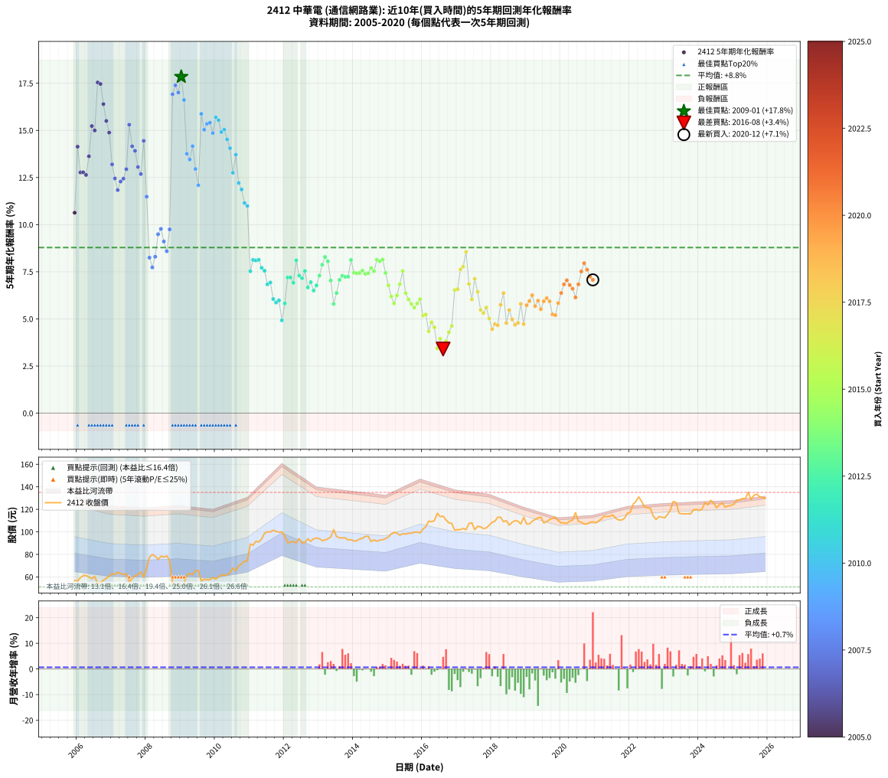

# 2412 中華電 - 本益比與未來報酬率分析

!!! info "報告資訊"
    - **股票代號**: 2412
    - **公司名稱**: 中華電
    - **產業別**: 通信網路業
    - **分析期間**: 2006-2020 (180 個數據點)
    - **資料來源**: Type 12 (ShowMonthlyK_ChartFlow) 月收盤價與本益比
    - **報酬率口徑**: 含現金股利 (簡化: 年度合計，假設每年7/1入帳)
    - **報告生成時間**: 2026-01-06 22:39:02 CST

## 📈 視覺化圖表

### 圖表1: 本益比 vs 未來報酬率關係

*圖表1：2412 中華電 本益比與5年期未來報酬率關係 (2006-2020)*

### 圖表2: 歷年買入時點的5年期實際報酬率

*圖表2：2412 中華電 歷年買入時點的5年期實際報酬率 (2006-2020)*

## 📍 買點訊號說明

本報告提供兩種買點提示訊號（顯示於圖表2的股價子圖中）：

### ▲ 小綠色三角形（回測驗證）
- **計算方式**: 使用全部歷史資料計算本益比第25百分位數
- **用途**: 事後驗證，顯示歷史上哪些時點確實為低估區
- **限制**: 當下無法判斷，僅供回測參考
- **特性**: 後見之明（Look-Ahead Bias）

### ▲ 小橘色三角形（即時訊號）
- **計算方式**: 使用截至當月的過去5年資料計算本益比第25百分位數
- **用途**: 實際投資決策，當時即可判斷
- **優勢**: 可操作性強，符合實務需求
- **特性**: 無後見之明，滾動窗口計算

!!! tip "如何使用兩種訊號"
    - **綠色▲** 幫助理解歷史估值機會，驗證策略有效性
    - **橘色▲** 可作為實際買進參考，但仍需搭配基本面分析
    - 兩種訊號重疊時，表示即時判斷與事後驗證一致，信心度較高
    - 僅有綠色▲時，表示當時無法判斷（需要未來資料才能確認）
    - 僅有橘色▲時，表示即時判斷為買點，但事後可能不是最佳時機

## 📊 估值分析摘要

| 指標 | 數值 |
|:---:|:---:|
| **目前本益比** (2020-12) | **25.29 倍** |
| **歷史平均本益比** | 18.15 倍 |
| **估值水準** | 🔴 相對高估 |
| **預期5年年化報酬率** | **+3.51%** |
| **歷史平均報酬率** | +8.78% |
| **相關係數 (R²)** | 0.6626 |
| **趨勢線斜率** | -0.7375 |

!!! abstract "核心洞察"
    目前本益比顯著高於歷史平均，預期未來報酬率可能較低

    根據歷史數據回測，2412 中華電 在目前本益比 **25.3倍** 的估值水準下，
    預期未來5年年化報酬率約為 **+3.5%**。

    **重要提醒**: 本分析基於歷史數據統計，實際報酬率會受到公司基本面變化、產業趨勢、
    總體經濟環境等多重因素影響。R² = 0.66 表示本益比可解釋約 66.3% 的報酬率變異。

## 📈 歷史估值統計

### 最佳買點 (最高報酬率)

| 項目 | 數值 |
|:---:|:---:|
| 起始時間 | 2009-01 |
| 當時本益比 | 11.04 倍 |
| 起始價格 | 51.1 元 |
| 5年後價格 | 91.9 元 |
| **5年年化報酬率** | **+17.84%** |

### 最差買點 (最低報酬率)

| 項目 | 數值 |
|:---:|:---:|
| 起始時間 | 2016-08 |
| 當時本益比 | 21.59 倍 |
| 起始價格 | 114.0 元 |
| 5年後價格 | 112.0 元 |
| **5年年化報酬率** | **+3.40%** |

## 🎯 投資啟示

### 本益比與報酬率關係

趨勢線方程式: **y = -0.7375x + 22.1653**

!!! warning "強負相關"
    本益比與未來報酬率呈現強負相關。在高本益比時期買入，未來報酬率顯著較低；
    在低本益比時期買入，未來報酬率顯著較高。**估值紀律至關重要**。

### 估值區間建議

基於歷史數據分析:

- **🟢 低估區** (P/E < 14.5): 預期報酬率較高，可考慮增加持股
- **🟡 合理區** (P/E 14.5-21.8): 預期報酬率符合長期趨勢，正常持有
- **🔴 高估區** (P/E > 21.8): 預期報酬率較低，可考慮減碼或觀望

!!! danger "風險提示"
    - 過去表現不代表未來結果
    - 本分析假設公司基本面無重大結構性變化
    - 產業環境劇變可能使歷史規律失效
    - 應結合公司財報、產業趨勢、總體經濟等多重因素綜合判斷

!!! success "長期投資觀點"
    歷史數據顯示，在合理或低估的估值水準買入並長期持有，
    往往能獲得較佳的投資報酬。**耐心等待好價格**是價值投資的核心原則。

## 📊 數據品質

- **資料來源**: GoodInfo.tw Type 12 (ShowMonthlyK_ChartFlow)
- **資料頻率**: 月度收盤價與本益比
- **回測期間**: 2006-2020
- **數據點數量**: 180 個 (每個點代表一次5年期回測)

### 計算方法說明

1. **5年期年化報酬率**:
   - 對每個歷史時點，計算其後5年的實際投資報酬率
   - 期末價值(不含股利): 期末價格
   - 期末價值(含現金股利): 期末價格 + 持有期間內的現金股利合計 (簡化: 年度合計，假設每年7/1入帳)
   - 公式: 年化報酬率 = [(期末價值/期初價格)^(1/年數) - 1] × 100%

2. **本益比 (P/E Ratio)**:
   - 使用當時的月收盤價與EPS計算
   - 資料來源: Type 12 月度河流圖本益比數據

3. **趨勢線 (Linear Regression)**:
   - 使用最小平方法擬合線性趨勢線
   - R²值衡量本益比對報酬率的解釋能力

---

*本報告由 Stock Analysis System v1.9.0 自動生成*
*數據更新時間: 2026-01-06 22:39:02 CST*

## 📋 月度回測明細表

（每一列對應時間線圖中的一個買入點；可用來對照 SVG 圖上的每個點。）

| 買入月份 | 賣出月份 | 回測期限_年 | 實際持有年數 | 買入本益比_倍 | 買入收盤價_元 | 賣出收盤價_元 | 現金股利合計_元 | 總報酬率_pct | 年化報酬率_pct |
| --- | --- | --- | --- | --- | --- | --- | --- | --- | --- |
| 2006-01 | 2011-01 | 5 | 4.999 | 12.18 | 56.40 | 89.20 | 20.03 | +93.67 | +14.14 |
| 2006-02 | 2011-02 | 5 | 4.999 | 12.81 | 59.30 | 88.10 | 20.03 | +82.34 | +12.77 |
| 2006-03 | 2011-03 | 5 | 4.999 | 13.22 | 61.20 | 91.60 | 20.03 | +82.40 | +12.78 |
| 2006-04 | 2011-04 | 5 | 4.999 | 13.24 | 61.30 | 91.10 | 20.03 | +81.29 | +12.64 |
| 2006-05 | 2011-05 | 5 | 4.999 | 12.96 | 60.00 | 93.60 | 20.03 | +89.38 | +13.63 |
| 2006-06 | 2011-06 | 5 | 4.999 | 12.63 | 58.50 | 98.80 | 20.03 | +103.13 | +15.23 |
| 2006-07 | 2011-07 | 5 | 4.999 | 13.02 | 60.30 | 100.00 | 21.25 | +101.08 | +15.00 |
| 2006-08 | 2011-08 | 5 | 4.999 | 11.66 | 54.00 | 99.90 | 21.25 | +124.36 | +17.54 |
| 2006-09 | 2011-09 | 5 | 4.999 | 11.86 | 54.90 | 101.50 | 21.25 | +123.60 | +17.46 |
| 2006-10 | 2011-10 | 5 | 4.999 | 12.31 | 57.00 | 100.50 | 21.25 | +113.60 | +16.39 |
| 2006-11 | 2011-11 | 5 | 4.999 | 12.70 | 58.80 | 99.60 | 21.25 | +105.53 | +15.50 |
| 2006-12 | 2011-12 | 5 | 4.999 | 13.09 | 60.60 | 100.00 | 21.25 | +100.09 | +14.88 |
| 2007-01 | 2012-01 | 5 | 4.999 | 13.67 | 63.20 | 96.20 | 21.25 | +85.84 | +13.20 |
| 2007-02 | 2012-02 | 5 | 4.999 | 13.45 | 62.10 | 90.40 | 21.25 | +79.80 | +12.45 |
| 2007-03 | 2012-03 | 5 | 5.002 | 13.90 | 64.10 | 90.90 | 21.25 | +74.97 | +11.83 |
| 2007-04 | 2012-04 | 5 | 5.002 | 13.70 | 63.10 | 91.40 | 21.25 | +78.53 | +12.29 |
| 2007-05 | 2012-05 | 5 | 5.002 | 13.48 | 62.00 | 90.20 | 21.25 | +79.76 | +12.44 |
| 2007-06 | 2012-06 | 5 | 5.002 | 13.65 | 62.70 | 94.00 | 21.25 | +83.82 | +12.94 |
| 2007-07 | 2012-07 | 5 | 5.002 | 12.09 | 55.50 | 90.00 | 23.13 | +103.85 | +15.30 |
| 2007-08 | 2012-08 | 5 | 5.002 | 12.79 | 58.60 | 90.50 | 23.13 | +93.92 | +14.16 |
| 2007-09 | 2012-09 | 5 | 5.002 | 13.33 | 61.00 | 93.90 | 23.13 | +91.86 | +13.91 |
| 2007-10 | 2012-10 | 5 | 5.002 | 13.58 | 62.10 | 91.60 | 23.13 | +84.76 | +13.06 |
| 2007-11 | 2012-11 | 5 | 5.002 | 14.10 | 64.40 | 93.90 | 23.13 | +81.73 | +12.68 |
| 2007-12 | 2012-12 | 5 | 5.002 | 13.14 | 59.90 | 94.50 | 23.13 | +96.39 | +14.45 |
| 2008-01 | 2013-01 | 5 | 5.002 | 14.89 | 68.00 | 94.00 | 23.13 | +72.26 | +11.48 |
| 2008-02 | 2013-03 | 5 | 5.081 | 16.95 | 77.50 | 92.80 | 23.13 | +49.59 | +8.25 |
| 2008-03 | 2013-03 | 5 | 4.999 | 17.45 | 79.90 | 92.80 | 23.13 | +45.10 | +7.73 |
| 2008-04 | 2013-04 | 5 | 4.999 | 17.11 | 78.50 | 93.80 | 23.13 | +48.96 | +8.30 |
| 2008-05 | 2013-05 | 5 | 4.999 | 16.42 | 75.40 | 95.50 | 23.13 | +57.34 | +9.49 |
| 2008-06 | 2013-06 | 5 | 4.999 | 17.07 | 78.50 | 102.00 | 23.13 | +59.41 | +9.78 |
| 2008-07 | 2013-07 | 5 | 4.999 | 16.87 | 77.70 | 95.90 | 24.23 | +54.60 | +9.11 |
| 2008-08 | 2013-08 | 5 | 4.999 | 17.06 | 78.70 | 94.60 | 24.23 | +50.98 | +8.59 |
| 2008-09 | 2013-09 | 5 | 4.999 | 16.17 | 74.70 | 94.70 | 24.23 | +59.20 | +9.75 |
| 2008-10 | 2013-10 | 5 | 4.999 | 11.76 | 54.40 | 94.60 | 24.23 | +118.43 | +16.92 |
| 2008-11 | 2013-11 | 5 | 4.999 | 11.33 | 52.50 | 92.80 | 24.23 | +122.90 | +17.39 |
| 2008-12 | 2013-12 | 5 | 4.999 | 11.53 | 53.50 | 93.10 | 24.23 | +119.30 | +17.01 |
| 2009-01 | 2014-01 | 5 | 4.999 | 11.04 | 51.10 | 91.90 | 24.23 | +127.25 | +17.84 |
| 2009-02 | 2014-02 | 5 | 4.999 | 11.67 | 53.90 | 92.00 | 24.23 | +115.63 | +16.61 |
| 2009-03 | 2014-03 | 5 | 4.999 | 13.43 | 61.90 | 93.70 | 24.23 | +90.51 | +13.76 |
| 2009-04 | 2014-04 | 5 | 4.999 | 13.71 | 63.00 | 94.20 | 24.23 | +87.98 | +13.46 |
| 2009-05 | 2014-05 | 5 | 4.999 | 13.52 | 62.00 | 96.00 | 24.23 | +93.91 | +14.16 |
| 2009-06 | 2014-06 | 5 | 4.999 | 14.32 | 65.50 | 96.20 | 24.23 | +83.85 | +12.95 |
| 2009-07 | 2014-07 | 5 | 4.999 | 14.42 | 65.80 | 91.50 | 24.92 | +76.93 | +12.09 |
| 2009-08 | 2014-08 | 5 | 4.999 | 12.39 | 56.40 | 92.90 | 24.92 | +108.90 | +15.88 |
| 2009-09 | 2014-09 | 5 | 4.999 | 12.75 | 57.90 | 91.70 | 24.92 | +101.42 | +15.03 |
| 2009-10 | 2014-10 | 5 | 4.999 | 12.71 | 57.60 | 92.70 | 24.92 | +104.20 | +15.35 |
| 2009-11 | 2014-11 | 5 | 4.999 | 12.74 | 57.60 | 93.00 | 24.92 | +104.72 | +15.41 |
| 2009-12 | 2014-12 | 5 | 4.999 | 13.19 | 59.50 | 94.00 | 24.92 | +99.87 | +14.86 |
| 2010-01 | 2015-01 | 5 | 4.999 | 12.79 | 58.10 | 95.50 | 24.92 | +107.26 | +15.69 |
| 2010-02 | 2015-02 | 5 | 4.999 | 13.07 | 59.80 | 98.20 | 24.92 | +105.89 | +15.54 |
| 2010-03 | 2015-03 | 5 | 4.999 | 13.47 | 62.10 | 99.50 | 24.92 | +100.35 | +14.91 |
| 2010-04 | 2015-04 | 5 | 4.999 | 13.24 | 61.50 | 99.00 | 24.92 | +101.50 | +15.04 |
| 2010-05 | 2015-05 | 5 | 4.999 | 13.24 | 61.90 | 97.00 | 24.92 | +96.96 | +14.52 |
| 2010-06 | 2015-06 | 5 | 4.999 | 13.57 | 63.90 | 98.40 | 24.92 | +92.99 | +14.06 |
| 2010-07 | 2015-07 | 5 | 4.999 | 14.31 | 67.90 | 98.00 | 25.72 | +82.20 | +12.75 |
| 2010-08 | 2015-08 | 5 | 4.999 | 13.71 | 65.50 | 98.80 | 25.72 | +90.10 | +13.71 |
| 2010-09 | 2015-09 | 5 | 4.999 | 14.55 | 70.00 | 98.80 | 25.72 | +77.88 | +12.21 |
| 2010-10 | 2015-10 | 5 | 4.999 | 14.78 | 71.60 | 99.70 | 25.72 | +75.16 | +11.87 |
| 2010-11 | 2015-11 | 5 | 4.999 | 15.17 | 74.00 | 99.80 | 25.72 | +69.62 | +11.15 |
| 2010-12 | 2015-12 | 5 | 4.999 | 15.09 | 74.10 | 99.10 | 25.72 | +68.44 | +10.99 |
| 2011-01 | 2016-01 | 5 | 4.999 | 17.83 | 89.20 | 102.50 | 25.72 | +43.74 | +7.53 |
| 2011-02 | 2016-02 | 5 | 4.999 | 17.28 | 88.10 | 104.50 | 25.72 | +47.80 | +8.13 |
| 2011-03 | 2016-03 | 5 | 5.002 | 17.64 | 91.60 | 109.50 | 25.72 | +47.62 | +8.10 |
| 2011-04 | 2016-04 | 5 | 5.002 | 17.23 | 91.10 | 109.00 | 25.72 | +47.88 | +8.13 |
| 2011-05 | 2016-05 | 5 | 5.002 | 17.40 | 93.60 | 110.00 | 25.72 | +45.00 | +7.71 |
| 2011-06 | 2016-06 | 5 | 5.002 | 18.05 | 98.80 | 116.50 | 25.72 | +43.94 | +7.55 |
| 2011-07 | 2016-07 | 5 | 5.002 | 17.96 | 100.00 | 113.50 | 25.68 | +39.18 | +6.83 |
| 2011-08 | 2016-08 | 5 | 5.002 | 17.64 | 99.90 | 114.00 | 25.68 | +39.82 | +6.93 |
| 2011-09 | 2016-09 | 5 | 5.002 | 17.63 | 101.50 | 110.50 | 25.68 | +34.16 | +6.05 |
| 2011-10 | 2016-10 | 5 | 5.002 | 17.17 | 100.50 | 108.00 | 25.68 | +33.01 | +5.87 |
| 2011-11 | 2016-11 | 5 | 5.002 | 16.75 | 99.60 | 107.50 | 25.68 | +33.71 | +5.98 |
| 2011-12 | 2016-12 | 5 | 5.002 | 16.56 | 100.00 | 101.50 | 25.68 | +27.18 | +4.92 |
| 2012-01 | 2017-01 | 5 | 5.002 | 16.10 | 96.20 | 102.00 | 25.68 | +32.72 | +5.82 |
| 2012-02 | 2017-03 | 5 | 5.081 | 15.30 | 90.40 | 103.00 | 25.68 | +42.34 | +7.20 |
| 2012-03 | 2017-03 | 5 | 4.999 | 15.56 | 90.90 | 103.00 | 25.68 | +41.56 | +7.20 |
| 2012-04 | 2017-04 | 5 | 4.999 | 15.82 | 91.40 | 102.00 | 25.68 | +39.69 | +6.91 |
| 2012-05 | 2017-05 | 5 | 4.999 | 15.79 | 90.20 | 107.50 | 25.68 | +47.65 | +8.11 |
| 2012-06 | 2017-06 | 5 | 4.999 | 16.65 | 94.00 | 108.00 | 25.68 | +42.21 | +7.30 |
| 2012-07 | 2017-07 | 5 | 4.999 | 16.13 | 90.00 | 102.00 | 25.16 | +41.29 | +7.16 |
| 2012-08 | 2017-08 | 5 | 4.999 | 16.41 | 90.50 | 105.00 | 25.16 | +43.82 | +7.54 |
| 2012-09 | 2017-09 | 5 | 4.999 | 17.23 | 93.90 | 104.50 | 25.16 | +38.08 | +6.67 |
| 2012-10 | 2017-10 | 5 | 4.999 | 17.01 | 91.60 | 103.00 | 25.16 | +39.91 | +6.95 |
| 2012-11 | 2017-11 | 5 | 4.999 | 17.66 | 93.90 | 103.50 | 25.16 | +37.02 | +6.50 |
| 2012-12 | 2017-12 | 5 | 4.999 | 17.99 | 94.50 | 106.00 | 25.16 | +38.79 | +6.78 |
| 2013-01 | 2018-01 | 5 | 4.999 | 17.93 | 94.00 | 108.50 | 25.16 | +42.19 | +7.29 |
| 2013-02 | 2018-02 | 5 | 4.999 | 17.63 | 92.20 | 109.50 | 25.16 | +46.05 | +7.87 |
| 2013-03 | 2018-03 | 5 | 4.999 | 17.78 | 92.80 | 113.00 | 25.16 | +48.88 | +8.29 |
| 2013-04 | 2018-04 | 5 | 4.999 | 18.01 | 93.80 | 113.00 | 25.16 | +47.29 | +8.05 |
| 2013-05 | 2018-05 | 5 | 4.999 | 18.37 | 95.50 | 109.00 | 25.16 | +40.48 | +7.04 |
| 2013-06 | 2018-06 | 5 | 4.999 | 19.67 | 102.00 | 110.00 | 25.16 | +32.51 | +5.79 |
| 2013-07 | 2018-07 | 5 | 4.999 | 18.53 | 95.90 | 106.00 | 24.60 | +36.19 | +6.37 |
| 2013-08 | 2018-08 | 5 | 4.999 | 18.32 | 94.60 | 108.50 | 24.60 | +40.70 | +7.07 |
| 2013-09 | 2018-09 | 5 | 4.999 | 18.38 | 94.70 | 110.00 | 24.60 | +42.14 | +7.29 |
| 2013-10 | 2018-10 | 5 | 4.999 | 18.40 | 94.60 | 109.50 | 24.60 | +41.76 | +7.23 |
| 2013-11 | 2018-11 | 5 | 4.999 | 18.09 | 92.80 | 107.00 | 24.60 | +41.81 | +7.24 |
| 2013-12 | 2018-12 | 5 | 4.999 | 18.18 | 93.10 | 113.00 | 24.60 | +47.80 | +8.13 |
| 2014-01 | 2019-01 | 5 | 4.999 | 17.99 | 91.90 | 107.00 | 24.60 | +43.20 | +7.45 |
| 2014-02 | 2019-02 | 5 | 4.999 | 18.05 | 92.00 | 107.00 | 24.60 | +43.05 | +7.42 |
| 2014-03 | 2019-03 | 5 | 4.999 | 18.43 | 93.70 | 109.50 | 24.60 | +43.12 | +7.43 |
| 2014-04 | 2019-04 | 5 | 4.999 | 18.57 | 94.20 | 111.00 | 24.60 | +43.95 | +7.56 |
| 2014-05 | 2019-05 | 5 | 4.999 | 18.97 | 96.00 | 112.50 | 24.60 | +42.82 | +7.39 |
| 2014-06 | 2019-06 | 5 | 4.999 | 19.05 | 96.20 | 113.00 | 24.60 | +43.04 | +7.42 |
| 2014-07 | 2019-07 | 5 | 4.999 | 18.16 | 91.50 | 108.00 | 24.56 | +44.87 | +7.70 |
| 2014-08 | 2019-08 | 5 | 4.999 | 18.48 | 92.90 | 109.00 | 24.56 | +43.77 | +7.53 |
| 2014-09 | 2019-09 | 5 | 4.999 | 18.29 | 91.70 | 111.00 | 24.56 | +47.83 | +8.13 |
| 2014-10 | 2019-10 | 5 | 4.999 | 18.53 | 92.70 | 112.00 | 24.56 | +47.31 | +8.06 |
| 2014-11 | 2019-11 | 5 | 4.999 | 18.63 | 93.00 | 113.00 | 24.56 | +47.91 | +8.14 |
| 2014-12 | 2019-12 | 5 | 4.999 | 18.88 | 94.00 | 110.00 | 24.56 | +43.15 | +7.44 |
| 2015-01 | 2020-01 | 5 | 4.999 | 19.00 | 95.50 | 108.00 | 24.56 | +38.80 | +6.78 |
| 2015-02 | 2020-02 | 5 | 4.999 | 19.37 | 98.20 | 108.00 | 24.56 | +34.99 | +6.18 |
| 2015-03 | 2020-03 | 5 | 5.002 | 19.45 | 99.50 | 107.50 | 24.56 | +32.72 | +5.82 |
| 2015-04 | 2020-04 | 5 | 5.002 | 19.19 | 99.00 | 109.50 | 24.56 | +35.41 | +6.25 |
| 2015-05 | 2020-05 | 5 | 5.002 | 18.64 | 97.00 | 110.50 | 24.56 | +39.24 | +6.84 |
| 2015-06 | 2020-06 | 5 | 5.002 | 18.74 | 98.40 | 117.00 | 24.56 | +43.86 | +7.54 |
| 2015-07 | 2020-07 | 5 | 5.002 | 18.51 | 98.00 | 109.50 | 23.93 | +36.15 | +6.36 |
| 2015-08 | 2020-08 | 5 | 5.002 | 18.50 | 98.80 | 108.50 | 23.93 | +34.04 | +6.03 |
| 2015-09 | 2020-09 | 5 | 5.002 | 18.35 | 98.80 | 107.00 | 23.93 | +32.52 | +5.79 |
| 2015-10 | 2020-10 | 5 | 5.002 | 18.36 | 99.70 | 107.00 | 23.93 | +31.32 | +5.60 |
| 2015-11 | 2020-11 | 5 | 5.002 | 18.23 | 99.80 | 108.50 | 23.93 | +32.69 | +5.82 |
| 2015-12 | 2020-12 | 5 | 5.002 | 17.95 | 99.10 | 109.00 | 23.93 | +34.14 | +6.05 |
| 2016-01 | 2021-01 | 5 | 5.002 | 18.67 | 102.50 | 108.00 | 23.93 | +28.71 | +5.18 |
| 2016-02 | 2021-03 | 5 | 5.081 | 19.14 | 104.50 | 111.50 | 23.93 | +29.60 | +5.23 |
| 2016-03 | 2021-03 | 5 | 4.999 | 20.17 | 109.50 | 111.50 | 23.93 | +23.68 | +4.34 |
| 2016-04 | 2021-04 | 5 | 4.999 | 20.19 | 109.00 | 114.00 | 23.93 | +26.54 | +4.82 |
| 2016-05 | 2021-05 | 5 | 4.999 | 20.48 | 110.00 | 113.50 | 23.93 | +24.93 | +4.55 |
| 2016-06 | 2021-06 | 5 | 4.999 | 21.82 | 116.50 | 114.00 | 23.93 | +18.39 | +3.43 |
| 2016-07 | 2021-07 | 5 | 4.999 | 21.37 | 113.50 | 115.00 | 22.75 | +21.36 | +3.95 |
| 2016-08 | 2021-08 | 5 | 4.999 | 21.59 | 114.00 | 112.00 | 22.75 | +18.20 | +3.40 |
| 2016-09 | 2021-09 | 5 | 4.999 | 21.05 | 110.50 | 110.50 | 22.75 | +20.59 | +3.82 |
| 2016-10 | 2021-10 | 5 | 4.999 | 20.69 | 108.00 | 110.50 | 22.75 | +23.38 | +4.29 |
| 2016-11 | 2021-11 | 5 | 4.999 | 20.71 | 107.50 | 112.00 | 22.75 | +25.35 | +4.62 |
| 2016-12 | 2021-12 | 5 | 4.999 | 19.67 | 101.50 | 116.50 | 22.75 | +37.19 | +6.53 |
| 2017-01 | 2022-01 | 5 | 4.999 | 19.82 | 102.00 | 117.50 | 22.75 | +37.50 | +6.58 |
| 2017-02 | 2022-02 | 5 | 4.999 | 19.86 | 102.00 | 124.50 | 22.75 | +44.36 | +7.62 |
| 2017-03 | 2022-03 | 5 | 4.999 | 20.11 | 103.00 | 127.00 | 22.75 | +45.39 | +7.77 |
| 2017-04 | 2022-04 | 5 | 4.999 | 19.96 | 102.00 | 131.00 | 22.75 | +50.73 | +8.55 |
| 2017-05 | 2022-05 | 5 | 4.999 | 21.09 | 107.50 | 127.00 | 22.75 | +39.30 | +6.86 |
| 2017-06 | 2022-06 | 5 | 4.999 | 21.24 | 108.00 | 122.00 | 22.75 | +34.03 | +6.03 |
| 2017-07 | 2022-07 | 5 | 4.999 | 20.11 | 102.00 | 121.50 | 22.42 | +41.09 | +7.13 |
| 2017-08 | 2022-08 | 5 | 4.999 | 20.75 | 105.00 | 121.00 | 22.42 | +36.59 | +6.44 |
| 2017-09 | 2022-09 | 5 | 4.999 | 20.70 | 104.50 | 114.00 | 22.42 | +30.54 | +5.48 |
| 2017-10 | 2022-10 | 5 | 4.999 | 20.46 | 103.00 | 111.00 | 22.42 | +29.53 | +5.31 |
| 2017-11 | 2022-11 | 5 | 4.999 | 20.61 | 103.50 | 113.50 | 22.42 | +31.32 | +5.60 |
| 2017-12 | 2022-12 | 5 | 4.999 | 21.16 | 106.00 | 113.00 | 22.42 | +27.75 | +5.02 |
| 2018-01 | 2023-01 | 5 | 4.999 | 21.81 | 108.50 | 112.50 | 22.42 | +24.35 | +4.45 |
| 2018-02 | 2023-02 | 5 | 4.999 | 22.17 | 109.50 | 115.50 | 22.42 | +25.95 | +4.72 |
| 2018-03 | 2023-03 | 5 | 4.999 | 23.05 | 113.00 | 119.50 | 22.42 | +25.59 | +4.66 |
| 2018-04 | 2023-04 | 5 | 4.999 | 23.22 | 113.00 | 127.00 | 22.42 | +32.23 | +5.75 |
| 2018-05 | 2023-05 | 5 | 4.999 | 22.56 | 109.00 | 126.00 | 22.42 | +36.16 | +6.37 |
| 2018-06 | 2023-06 | 5 | 4.999 | 22.94 | 110.00 | 116.50 | 22.42 | +26.29 | +4.78 |
| 2018-07 | 2023-07 | 5 | 4.999 | 22.27 | 106.00 | 116.00 | 22.32 | +30.49 | +5.47 |
| 2018-08 | 2023-08 | 5 | 4.999 | 22.97 | 108.50 | 116.00 | 22.32 | +27.48 | +4.98 |
| 2018-09 | 2023-09 | 5 | 4.999 | 23.47 | 110.00 | 116.00 | 22.32 | +25.75 | +4.69 |
| 2018-10 | 2023-10 | 5 | 4.999 | 23.54 | 109.50 | 116.00 | 22.32 | +26.32 | +4.78 |
| 2018-11 | 2023-11 | 5 | 4.999 | 23.18 | 107.00 | 119.50 | 22.32 | +32.54 | +5.80 |
| 2018-12 | 2023-12 | 5 | 4.999 | 24.67 | 113.00 | 120.00 | 22.32 | +25.95 | +4.72 |
| 2019-01 | 2024-01 | 5 | 4.999 | 23.51 | 107.00 | 119.00 | 22.32 | +32.08 | +5.72 |
| 2019-02 | 2024-02 | 5 | 4.999 | 23.66 | 107.00 | 120.50 | 22.32 | +33.48 | +5.95 |
| 2019-03 | 2024-03 | 5 | 5.002 | 24.37 | 109.50 | 126.00 | 22.32 | +35.45 | +6.25 |
| 2019-04 | 2024-04 | 5 | 5.002 | 24.87 | 111.00 | 124.00 | 22.32 | +31.82 | +5.68 |
| 2019-05 | 2024-05 | 5 | 5.002 | 25.37 | 112.50 | 128.00 | 22.32 | +33.62 | +5.97 |
| 2019-06 | 2024-06 | 5 | 5.002 | 25.65 | 113.00 | 125.50 | 22.32 | +30.82 | +5.52 |
| 2019-07 | 2024-07 | 5 | 5.002 | 24.68 | 108.00 | 121.50 | 22.60 | +33.43 | +5.93 |
| 2019-08 | 2024-08 | 5 | 5.002 | 25.08 | 109.00 | 124.00 | 22.60 | +34.50 | +6.10 |
| 2019-09 | 2024-09 | 5 | 5.002 | 25.71 | 111.00 | 125.50 | 22.60 | +33.42 | +5.93 |
| 2019-10 | 2024-10 | 5 | 5.002 | 26.12 | 112.00 | 122.00 | 22.60 | +29.11 | +5.24 |
| 2019-11 | 2024-11 | 5 | 5.002 | 26.53 | 113.00 | 123.00 | 22.60 | +28.85 | +5.20 |
| 2019-12 | 2024-12 | 5 | 5.002 | 26.00 | 110.00 | 123.50 | 22.60 | +32.82 | +5.84 |
| 2020-01 | 2025-01 | 5 | 5.002 | 25.49 | 108.00 | 124.50 | 22.60 | +36.20 | +6.37 |
| 2020-02 | 2025-03 | 5 | 5.081 | 25.45 | 108.00 | 128.50 | 22.60 | +39.91 | +6.83 |
| 2020-03 | 2025-03 | 5 | 4.999 | 25.29 | 107.50 | 128.50 | 22.60 | +40.56 | +7.05 |
| 2020-04 | 2025-04 | 5 | 4.999 | 25.72 | 109.50 | 129.50 | 22.60 | +38.90 | +6.79 |
| 2020-05 | 2025-05 | 5 | 4.999 | 25.92 | 110.50 | 129.50 | 22.60 | +37.65 | +6.60 |
| 2020-06 | 2025-06 | 5 | 4.999 | 27.40 | 117.00 | 135.00 | 22.60 | +34.70 | +6.14 |
| 2020-07 | 2025-07 | 5 | 4.999 | 25.60 | 109.50 | 129.00 | 23.37 | +39.15 | +6.83 |
| 2020-08 | 2025-08 | 5 | 4.999 | 25.33 | 108.50 | 132.50 | 23.37 | +43.66 | +7.52 |
| 2020-09 | 2025-09 | 5 | 4.999 | 24.94 | 107.00 | 133.50 | 23.37 | +46.61 | +7.95 |
| 2020-10 | 2025-10 | 5 | 4.999 | 24.90 | 107.00 | 131.00 | 23.37 | +44.27 | +7.61 |
| 2020-11 | 2025-11 | 5 | 4.999 | 25.21 | 108.50 | 130.50 | 23.37 | +41.82 | +7.24 |
| 2020-12 | 2025-12 | 5 | 4.999 | 25.29 | 109.00 | 130.50 | 23.37 | +41.17 | +7.14 |
