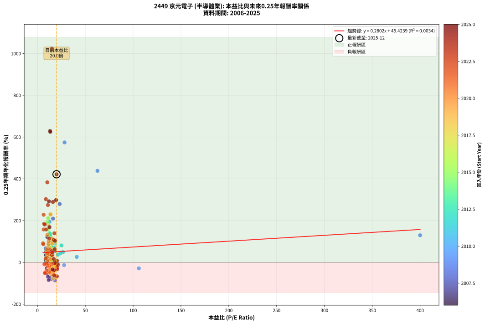
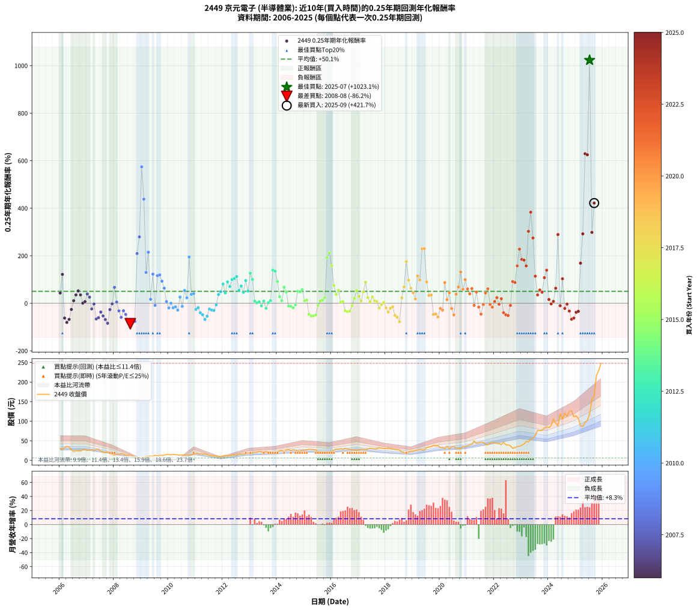

# 2449 京元電子 - 本益比與未來報酬率分析

!!! info "報告資訊"
    - **股票代號**: 2449
    - **公司名稱**: 京元電子
    - **產業別**: 半導體業
    - **分析期間**: 2006-2025 (237 個數據點)
    - **資料來源**: Type 12 (ShowMonthlyK_ChartFlow) 月收盤價與本益比
    - **報酬率口徑**: 含現金股利 (簡化: 年度合計，假設每年7/1入帳)
    - **報告生成時間**: 2026-01-04 08:48:20 CST

## 📈 視覺化圖表

### 圖表1: 本益比 vs 未來報酬率關係

*圖表1：2449 京元電子 本益比與0.25年期未來報酬率關係 (2006-2025)*

### 圖表2: 歷年買入時點的0.25年期實際報酬率

*圖表2：2449 京元電子 歷年買入時點的0.25年期實際報酬率 (2006-2025)*

## 📍 買點訊號說明

本報告提供兩種買點提示訊號（顯示於圖表2的股價子圖中）：

### ▲ 小綠色三角形（回測驗證）
- **計算方式**: 使用全部歷史資料計算本益比第25百分位數
- **用途**: 事後驗證，顯示歷史上哪些時點確實為低估區
- **限制**: 當下無法判斷，僅供回測參考
- **特性**: 後見之明（Look-Ahead Bias）

### ▲ 小橘色三角形（即時訊號）
- **計算方式**: 使用截至當月的過去5年資料計算本益比第25百分位數
- **用途**: 實際投資決策，當時即可判斷
- **優勢**: 可操作性強，符合實務需求
- **特性**: 無後見之明，滾動窗口計算

!!! tip "如何使用兩種訊號"
    - **綠色▲** 幫助理解歷史估值機會，驗證策略有效性
    - **橘色▲** 可作為實際買進參考，但仍需搭配基本面分析
    - 兩種訊號重疊時，表示即時判斷與事後驗證一致，信心度較高
    - 僅有綠色▲時，表示當時無法判斷（需要未來資料才能確認）
    - 僅有橘色▲時，表示即時判斷為買點，但事後可能不是最佳時機

## 📊 估值分析摘要

| 指標 | 數值 |
|:---:|:---:|
| **目前本益比** (2025-09) | **19.97 倍** |
| **歷史平均本益比** | 16.20 倍 |
| **估值水準** | 🔴 相對高估 |
| **預期0.25年年化報酬率** | **+51.02%** |
| **歷史平均報酬率** | +50.13% |
| **相關係數 (R²)** | 0.0034 |
| **趨勢線斜率** | 0.2802 |

!!! abstract "核心洞察"
    目前本益比顯著高於歷史平均，預期未來報酬率可能較低

    根據歷史數據回測，2449 京元電子 在目前本益比 **20.0倍** 的估值水準下，
    預期未來0.25年年化報酬率約為 **+51.0%**。

    **重要提醒**: 本分析基於歷史數據統計，實際報酬率會受到公司基本面變化、產業趨勢、
    總體經濟環境等多重因素影響。R² = 0.00 表示本益比可解釋約 0.3% 的報酬率變異。

## 📈 歷史估值統計

### 最佳買點 (最高報酬率)

| 項目 | 數值 |
|:---:|:---:|
| 起始時間 | 2025-07 |
| 當時本益比 | 15.13 倍 |
| 起始價格 | 118.0 元 |
| 0.25年後價格 | 217.0 元 |
| **0.25年年化報酬率** | **+1023.06%** |

### 最差買點 (最低報酬率)

| 項目 | 數值 |
|:---:|:---:|
| 起始時間 | 2008-08 |
| 當時本益比 | 18.28 倍 |
| 起始價格 | 13.9 元 |
| 0.25年後價格 | 7.2 元 |
| **0.25年年化報酬率** | **-86.19%** |

## 🎯 投資啟示

### 本益比與報酬率關係

趨勢線方程式: **y = 0.2802x + 45.4239**

!!! info "弱相關或正相關"
    本益比與未來報酬率相關性較弱。這可能表示該股票的報酬率更多受到
    公司成長性、產業趨勢等因素影響，而非估值水準。**需綜合考量多項指標**。

### 估值區間建議

基於歷史數據分析:

- **🟢 低估區** (P/E < 13.0): 預期報酬率較高，可考慮增加持股
- **🟡 合理區** (P/E 13.0-19.4): 預期報酬率符合長期趨勢，正常持有
- **🔴 高估區** (P/E > 19.4): 預期報酬率較低，可考慮減碼或觀望

!!! danger "風險提示"
    - 過去表現不代表未來結果
    - 本分析假設公司基本面無重大結構性變化
    - 產業環境劇變可能使歷史規律失效
    - 應結合公司財報、產業趨勢、總體經濟等多重因素綜合判斷

!!! success "長期投資觀點"
    歷史數據顯示，在合理或低估的估值水準買入並長期持有，
    往往能獲得較佳的投資報酬。**耐心等待好價格**是價值投資的核心原則。

## 📊 數據品質

- **資料來源**: GoodInfo.tw Type 12 (ShowMonthlyK_ChartFlow)
- **資料頻率**: 月度收盤價與本益比
- **回測期間**: 2006-2025
- **數據點數量**: 237 個 (每個點代表一次0.25年期回測)

### 計算方法說明

1. **0.25年期年化報酬率**:
   - 對每個歷史時點，計算其後0.25年的實際投資報酬率
   - 期末價值(不含股利): 期末價格
   - 期末價值(含現金股利): 期末價格 + 持有期間內的現金股利合計 (簡化: 年度合計，假設每年7/1入帳)
   - 公式: 年化報酬率 = [(期末價值/期初價格)^(1/年數) - 1] × 100%

2. **本益比 (P/E Ratio)**:
   - 使用當時的月收盤價與EPS計算
   - 資料來源: Type 12 月度河流圖本益比數據

3. **趨勢線 (Linear Regression)**:
   - 使用最小平方法擬合線性趨勢線
   - R²值衡量本益比對報酬率的解釋能力

---

*本報告由 Stock Analysis System v1.9.0 自動生成*
*數據更新時間: 2026-01-04 08:48:20 CST*

## 📋 月度回測明細表

（每一列對應時間線圖中的一個買入點；可用來對照 SVG 圖上的每個點。）

| 買入月份 | 賣出月份 | 回測期限_年 | 實際持有年數 | 買入本益比_倍 | 買入收盤價_元 | 賣出收盤價_元 | 現金股利合計_元 | 總報酬率_pct | 年化報酬率_pct |
| --- | --- | --- | --- | --- | --- | --- | --- | --- | --- |
| 2006-01 | 2006-05 | 0.25 | 0.329 | 11.26 | 29.95 | 33.70 | 0.00 | +12.52 | +43.20 |
| 2006-02 | 2006-05 | 0.25 | 0.246 | 10.41 | 27.70 | 33.70 | 0.00 | +21.66 | +121.60 |
| 2006-03 | 2006-07 | 0.25 | 0.334 | 12.29 | 32.70 | 22.90 | 0.71 | -27.80 | -62.29 |
| 2006-04 | 2006-07 | 0.25 | 0.249 | 13.36 | 35.55 | 22.90 | 0.71 | -33.59 | -80.66 |
| 2006-05 | 2006-08 | 0.25 | 0.252 | 12.67 | 33.70 | 24.60 | 0.71 | -24.90 | -67.92 |
| 2006-06 | 2006-09 | 0.25 | 0.252 | 10.23 | 27.20 | 24.50 | 0.71 | -7.32 | -26.06 |
| 2006-07 | 2006-10 | 0.25 | 0.252 | 8.61 | 22.90 | 23.50 | 0.00 | +2.62 | +10.81 |
| 2006-08 | 2006-12 | 0.25 | 0.334 | 9.25 | 24.60 | 27.20 | 0.00 | +10.57 | +35.09 |
| 2006-09 | 2006-12 | 0.25 | 0.249 | 9.21 | 24.50 | 27.20 | 0.00 | +11.02 | +52.14 |
| 2006-10 | 2007-01 | 0.25 | 0.252 | 8.83 | 23.50 | 25.35 | 0.00 | +7.87 | +35.10 |
| 2006-11 | 2007-03 | 0.25 | 0.329 | 10.38 | 27.60 | 27.65 | 0.00 | +0.18 | +0.55 |
| 2006-12 | 2007-03 | 0.25 | 0.246 | 10.23 | 27.20 | 27.65 | 0.00 | +1.65 | +6.89 |
| 2007-01 | 2007-05 | 0.25 | 0.329 | 9.84 | 25.35 | 28.25 | 0.00 | +11.44 | +39.05 |
| 2007-02 | 2007-05 | 0.25 | 0.246 | 10.70 | 26.70 | 28.25 | 0.00 | +5.81 | +25.74 |
| 2007-03 | 2007-07 | 0.25 | 0.334 | 11.46 | 27.65 | 24.15 | 1.10 | -8.68 | -23.81 |
| 2007-04 | 2007-07 | 0.25 | 0.249 | 10.92 | 25.45 | 24.15 | 1.10 | -0.79 | -3.13 |
| 2007-05 | 2007-08 | 0.25 | 0.252 | 12.57 | 28.25 | 20.40 | 1.10 | -23.90 | -66.18 |
| 2007-06 | 2007-09 | 0.25 | 0.252 | 12.98 | 28.10 | 21.10 | 1.10 | -21.00 | -60.77 |
| 2007-07 | 2007-10 | 0.25 | 0.252 | 11.60 | 24.15 | 21.50 | 0.00 | -10.97 | -36.96 |
| 2007-08 | 2007-12 | 0.25 | 0.334 | 10.20 | 20.40 | 15.80 | 0.00 | -22.55 | -53.47 |
| 2007-09 | 2007-12 | 0.25 | 0.249 | 11.00 | 21.10 | 15.80 | 0.00 | -25.12 | -68.68 |
| 2007-10 | 2008-01 | 0.25 | 0.252 | 11.72 | 21.50 | 13.50 | 0.00 | -37.21 | -84.24 |
| 2007-11 | 2008-03 | 0.25 | 0.331 | 9.93 | 17.40 | 15.70 | 0.00 | -9.77 | -26.68 |
| 2007-12 | 2008-03 | 0.25 | 0.249 | 9.46 | 15.80 | 15.70 | 0.00 | -0.63 | -2.52 |
| 2008-01 | 2008-05 | 0.25 | 0.331 | 8.67 | 13.50 | 16.00 | 0.00 | +18.52 | +67.01 |
| 2008-02 | 2008-05 | 0.25 | 0.249 | 10.95 | 15.80 | 16.00 | 0.00 | +1.27 | +5.18 |
| 2008-03 | 2008-07 | 0.25 | 0.334 | 11.80 | 15.70 | 13.20 | 0.60 | -12.11 | -32.05 |
| 2008-04 | 2008-07 | 0.25 | 0.249 | 14.18 | 17.25 | 13.20 | 0.60 | -20.01 | -59.18 |
| 2008-05 | 2008-08 | 0.25 | 0.252 | 14.50 | 16.00 | 13.95 | 0.60 | -9.07 | -31.44 |
| 2008-06 | 2008-09 | 0.25 | 0.252 | 13.33 | 13.20 | 10.65 | 0.60 | -14.78 | -47.00 |
| 2008-07 | 2008-10 | 0.25 | 0.252 | 15.06 | 13.20 | 8.75 | 0.00 | -33.71 | -80.45 |
| 2008-08 | 2008-12 | 0.25 | 0.334 | 18.28 | 13.95 | 7.20 | 0.00 | -48.39 | -86.19 |
| 2008-09 | 2008-12 | 0.25 | 0.249 | 16.38 | 10.65 | 7.20 | 0.00 | -32.39 | -79.22 |
| 2008-10 | 2009-01 | 0.25 | 0.252 | 16.30 | 8.75 | 6.09 | 0.00 | -30.40 | -76.28 |
| 2008-11 | 2009-03 | 0.25 | 0.329 | 16.30 | 6.90 | 10.00 | 0.00 | +44.93 | +209.39 |
| 2008-12 | 2009-03 | 0.25 | 0.246 | 23.23 | 7.20 | 10.00 | 0.00 | +38.89 | +279.31 |
| 2009-01 | 2009-05 | 0.25 | 0.329 | 28.33 | 6.09 | 11.40 | 0.00 | +87.19 | +574.18 |
| 2009-02 | 2009-05 | 0.25 | 0.246 | 62.75 | 7.53 | 11.40 | 0.00 | +51.39 | +438.20 |
| 2009-03 | 2009-07 | 0.25 | 0.334 | 400.00 | 10.00 | 13.10 | 0.10 | +32.00 | +129.60 |
| 2009-04 | 2009-07 | 0.25 | 0.249 |  | 9.92 | 13.10 | 0.10 | +33.06 | +214.74 |
| 2009-05 | 2009-08 | 0.25 | 0.252 |  | 11.40 | 11.75 | 0.10 | +3.95 | +16.61 |
| 2009-06 | 2009-09 | 0.25 | 0.252 |  | 10.30 | 12.50 | 0.10 | +22.33 | +122.60 |
| 2009-07 | 2009-10 | 0.25 | 0.252 |  | 13.10 | 12.80 | 0.00 | -2.29 | -8.79 |
| 2009-08 | 2009-12 | 0.25 | 0.334 |  | 11.75 | 15.20 | 0.00 | +29.36 | +116.14 |
| 2009-09 | 2009-12 | 0.25 | 0.249 |  | 12.50 | 15.20 | 0.00 | +21.60 | +119.23 |
| 2009-10 | 2010-01 | 0.25 | 0.252 |  | 12.80 | 15.10 | 0.00 | +17.97 | +92.72 |
| 2009-11 | 2010-03 | 0.25 | 0.329 |  | 13.15 | 15.45 | 0.00 | +17.49 | +63.33 |
| 2009-12 | 2010-03 | 0.25 | 0.246 |  | 15.20 | 15.45 | 0.00 | +1.64 | +6.84 |
| 2010-01 | 2010-05 | 0.25 | 0.329 |  | 15.10 | 14.05 | 0.00 | -6.95 | -19.70 |
| 2010-02 | 2010-05 | 0.25 | 0.246 |  | 14.05 | 14.05 | 0.00 | +0.00 | +0.00 |
| 2010-03 | 2010-07 | 0.25 | 0.334 |  | 15.45 | 14.40 | 0.00 | -6.80 | -19.00 |
| 2010-04 | 2010-07 | 0.25 | 0.249 |  | 15.00 | 14.40 | 0.00 | -4.00 | -15.11 |
| 2010-05 | 2010-08 | 0.25 | 0.252 | 106.00 | 14.05 | 12.90 | 0.00 | -8.19 | -28.75 |
| 2010-06 | 2010-09 | 0.25 | 0.252 | 41.08 | 13.35 | 14.15 | 0.00 | +5.99 | +25.99 |
| 2010-07 | 2010-10 | 0.25 | 0.252 | 27.83 | 14.40 | 13.90 | 0.00 | -3.47 | -13.09 |
| 2010-08 | 2010-12 | 0.25 | 0.334 | 18.17 | 12.90 | 14.90 | 0.00 | +15.50 | +53.96 |
| 2010-09 | 2010-12 | 0.25 | 0.249 | 15.68 | 14.15 | 14.90 | 0.00 | +5.30 | +23.03 |
| 2010-10 | 2011-01 | 0.25 | 0.252 | 12.69 | 13.90 | 18.25 | 0.00 | +31.29 | +194.75 |
| 2010-11 | 2011-03 | 0.25 | 0.329 | 11.34 | 14.60 | 16.20 | 0.00 | +10.96 | +37.23 |
| 2010-12 | 2011-03 | 0.25 | 0.246 | 10.07 | 14.90 | 16.20 | 0.00 | +8.72 | +40.42 |
| 2011-01 | 2011-05 | 0.25 | 0.329 | 13.15 | 18.25 | 16.55 | 0.00 | -9.32 | -25.74 |
| 2011-02 | 2011-05 | 0.25 | 0.246 | 13.42 | 17.40 | 16.55 | 0.00 | -4.89 | -18.39 |
| 2011-03 | 2011-07 | 0.25 | 0.334 | 13.44 | 16.20 | 12.55 | 1.10 | -15.75 | -40.14 |
| 2011-04 | 2011-07 | 0.25 | 0.249 | 14.46 | 16.10 | 12.55 | 1.10 | -15.23 | -48.48 |
| 2011-05 | 2011-08 | 0.25 | 0.252 | 16.20 | 16.55 | 11.30 | 1.10 | -25.09 | -68.23 |
| 2011-06 | 2011-09 | 0.25 | 0.252 | 15.91 | 14.80 | 11.05 | 1.10 | -17.92 | -54.34 |
| 2011-07 | 2011-10 | 0.25 | 0.252 | 14.97 | 12.55 | 11.70 | 0.00 | -6.77 | -24.30 |
| 2011-08 | 2011-12 | 0.25 | 0.334 | 15.13 | 11.30 | 10.10 | 0.00 | -10.62 | -28.55 |
| 2011-09 | 2011-12 | 0.25 | 0.249 | 16.87 | 11.05 | 10.10 | 0.00 | -8.60 | -30.29 |
| 2011-10 | 2012-01 | 0.25 | 0.252 | 20.77 | 11.70 | 11.50 | 0.00 | -1.71 | -6.62 |
| 2011-11 | 2012-03 | 0.25 | 0.331 | 21.31 | 10.05 | 11.15 | 0.00 | +10.95 | +36.82 |
| 2011-12 | 2012-03 | 0.25 | 0.249 | 26.58 | 10.10 | 11.15 | 0.00 | +10.40 | +48.73 |
| 2012-01 | 2012-05 | 0.25 | 0.331 | 25.14 | 11.50 | 14.00 | 0.00 | +21.74 | +81.08 |
| 2012-02 | 2012-05 | 0.25 | 0.249 | 23.93 | 12.80 | 14.00 | 0.00 | +9.37 | +43.29 |
| 2012-03 | 2012-07 | 0.25 | 0.334 | 18.20 | 11.15 | 13.15 | 0.67 | +23.90 | +89.96 |
| 2012-04 | 2012-07 | 0.25 | 0.249 | 17.54 | 12.10 | 13.15 | 0.67 | +14.17 | +70.24 |
| 2012-05 | 2012-08 | 0.25 | 0.252 | 18.24 | 14.00 | 16.00 | 0.67 | +19.04 | +99.73 |
| 2012-06 | 2012-09 | 0.25 | 0.252 | 16.63 | 14.05 | 16.15 | 0.67 | +19.68 | +104.06 |
| 2012-07 | 2012-10 | 0.25 | 0.252 | 14.25 | 13.15 | 15.90 | 0.00 | +20.91 | +112.53 |
| 2012-08 | 2012-12 | 0.25 | 0.334 | 16.00 | 16.00 | 18.50 | 0.00 | +15.62 | +54.44 |
| 2012-09 | 2012-12 | 0.25 | 0.249 | 14.99 | 16.15 | 18.50 | 0.00 | +14.55 | +72.51 |
| 2012-10 | 2013-01 | 0.25 | 0.252 | 13.77 | 15.90 | 17.50 | 0.00 | +10.06 | +46.33 |
| 2012-11 | 2013-03 | 0.25 | 0.329 | 13.35 | 16.45 | 20.50 | 0.00 | +24.62 | +95.41 |
| 2012-12 | 2013-03 | 0.25 | 0.246 | 14.12 | 18.50 | 20.50 | 0.00 | +10.81 | +51.68 |
| 2013-01 | 2013-05 | 0.25 | 0.329 | 13.17 | 17.50 | 22.90 | 0.00 | +30.86 | +126.73 |
| 2013-02 | 2013-05 | 0.25 | 0.246 | 14.33 | 19.30 | 22.90 | 0.00 | +18.65 | +100.19 |
| 2013-03 | 2013-07 | 0.25 | 0.334 | 15.02 | 20.50 | 20.00 | 1.10 | +2.92 | +8.99 |
| 2013-04 | 2013-07 | 0.25 | 0.249 | 15.18 | 21.00 | 20.00 | 1.10 | +0.47 | +1.89 |
| 2013-05 | 2013-08 | 0.25 | 0.252 | 16.34 | 22.90 | 22.15 | 1.10 | +1.52 | +6.17 |
| 2013-06 | 2013-09 | 0.25 | 0.252 | 15.56 | 22.10 | 20.35 | 1.10 | -2.95 | -11.21 |
| 2013-07 | 2013-10 | 0.25 | 0.252 | 13.90 | 20.00 | 20.45 | 0.00 | +2.25 | +9.24 |
| 2013-08 | 2013-12 | 0.25 | 0.334 | 15.21 | 22.15 | 20.45 | 0.00 | -7.67 | -21.26 |
| 2013-09 | 2013-12 | 0.25 | 0.249 | 13.80 | 20.35 | 20.45 | 0.00 | +0.49 | +1.99 |
| 2013-10 | 2014-01 | 0.25 | 0.252 | 13.69 | 20.45 | 21.00 | 0.00 | +2.69 | +11.11 |
| 2013-11 | 2014-03 | 0.25 | 0.329 | 12.54 | 18.95 | 25.25 | 0.00 | +33.25 | +139.56 |
| 2013-12 | 2014-03 | 0.25 | 0.246 | 13.37 | 20.45 | 25.25 | 0.00 | +23.47 | +135.30 |
| 2014-01 | 2014-05 | 0.25 | 0.329 | 13.28 | 21.00 | 26.00 | 0.00 | +23.81 | +91.57 |
| 2014-02 | 2014-05 | 0.25 | 0.246 | 15.00 | 24.50 | 26.00 | 0.00 | +6.12 | +27.27 |
| 2014-03 | 2014-07 | 0.25 | 0.334 | 14.99 | 25.25 | 24.85 | 1.30 | +3.56 | +11.05 |
| 2014-04 | 2014-07 | 0.25 | 0.249 | 13.24 | 23.00 | 24.85 | 1.30 | +13.70 | +67.39 |
| 2014-05 | 2014-08 | 0.25 | 0.252 | 14.54 | 26.00 | 27.35 | 1.30 | +10.19 | +47.01 |
| 2014-06 | 2014-09 | 0.25 | 0.252 | 15.24 | 28.05 | 25.90 | 1.30 | -3.03 | -11.50 |
| 2014-07 | 2014-10 | 0.25 | 0.252 | 13.14 | 24.85 | 24.00 | 0.00 | -3.42 | -12.91 |
| 2014-08 | 2014-12 | 0.25 | 0.334 | 14.07 | 27.35 | 25.45 | 0.00 | -6.95 | -19.39 |
| 2014-09 | 2014-12 | 0.25 | 0.249 | 12.98 | 25.90 | 25.45 | 0.00 | -1.74 | -6.79 |
| 2014-10 | 2015-01 | 0.25 | 0.252 | 11.73 | 24.00 | 26.60 | 0.00 | +10.83 | +50.43 |
| 2014-11 | 2015-03 | 0.25 | 0.329 | 11.91 | 25.00 | 28.45 | 0.00 | +13.80 | +48.21 |
| 2014-12 | 2015-03 | 0.25 | 0.246 | 11.84 | 25.45 | 28.45 | 0.00 | +11.79 | +57.18 |
| 2015-01 | 2015-05 | 0.25 | 0.329 | 12.48 | 26.60 | 27.45 | 0.00 | +3.20 | +10.05 |
| 2015-02 | 2015-05 | 0.25 | 0.246 | 12.59 | 26.60 | 27.45 | 0.00 | +3.20 | +13.62 |
| 2015-03 | 2015-07 | 0.25 | 0.334 | 13.58 | 28.45 | 21.30 | 1.80 | -18.80 | -46.40 |
| 2015-04 | 2015-07 | 0.25 | 0.249 | 13.46 | 27.95 | 21.30 | 1.80 | -17.35 | -53.46 |
| 2015-05 | 2015-08 | 0.25 | 0.252 | 13.34 | 27.45 | 20.90 | 1.80 | -17.30 | -52.97 |
| 2015-06 | 2015-09 | 0.25 | 0.252 | 13.21 | 26.95 | 20.90 | 1.80 | -15.77 | -49.41 |
| 2015-07 | 2015-10 | 0.25 | 0.252 | 10.54 | 21.30 | 20.80 | 0.00 | -2.35 | -9.00 |
| 2015-08 | 2015-12 | 0.25 | 0.334 | 10.43 | 20.90 | 21.55 | 0.00 | +3.11 | +9.60 |
| 2015-09 | 2015-12 | 0.25 | 0.249 | 10.53 | 20.90 | 21.55 | 0.00 | +3.11 | +13.08 |
| 2015-10 | 2016-01 | 0.25 | 0.252 | 10.58 | 20.80 | 21.95 | 0.00 | +5.53 | +23.82 |
| 2015-11 | 2016-03 | 0.25 | 0.331 | 10.29 | 20.05 | 28.60 | 0.00 | +42.64 | +192.16 |
| 2015-12 | 2016-03 | 0.25 | 0.249 | 11.17 | 21.55 | 28.60 | 0.00 | +32.71 | +211.43 |
| 2016-01 | 2016-05 | 0.25 | 0.331 | 11.07 | 21.95 | 30.05 | 0.00 | +36.90 | +158.09 |
| 2016-02 | 2016-05 | 0.25 | 0.249 | 12.85 | 26.15 | 30.05 | 0.00 | +14.91 | +74.71 |
| 2016-03 | 2016-07 | 0.25 | 0.334 | 13.70 | 28.60 | 30.55 | 1.20 | +11.01 | +36.73 |
| 2016-04 | 2016-07 | 0.25 | 0.249 | 13.32 | 28.50 | 30.55 | 1.20 | +11.40 | +54.26 |
| 2016-05 | 2016-08 | 0.25 | 0.252 | 13.71 | 30.05 | 29.15 | 1.20 | +1.00 | +4.02 |
| 2016-06 | 2016-09 | 0.25 | 0.252 | 12.72 | 28.55 | 27.85 | 1.20 | +1.75 | +7.14 |
| 2016-07 | 2016-10 | 0.25 | 0.252 | 13.30 | 30.55 | 27.75 | 0.00 | -9.17 | -31.73 |
| 2016-08 | 2016-12 | 0.25 | 0.334 | 12.40 | 29.15 | 25.20 | 0.00 | -13.55 | -35.33 |
| 2016-09 | 2016-12 | 0.25 | 0.249 | 11.59 | 27.85 | 25.20 | 0.00 | -9.52 | -33.06 |
| 2016-10 | 2017-01 | 0.25 | 0.252 | 11.30 | 27.75 | 27.00 | 0.00 | -2.70 | -10.31 |
| 2016-11 | 2017-03 | 0.25 | 0.329 | 10.51 | 26.35 | 28.00 | 0.00 | +6.26 | +20.31 |
| 2016-12 | 2017-03 | 0.25 | 0.246 | 9.84 | 25.20 | 28.00 | 0.00 | +11.11 | +53.36 |
| 2017-01 | 2017-05 | 0.25 | 0.329 | 10.79 | 27.00 | 29.40 | 0.00 | +8.89 | +29.59 |
| 2017-02 | 2017-05 | 0.25 | 0.246 | 11.75 | 28.75 | 29.40 | 0.00 | +2.26 | +9.50 |
| 2017-03 | 2017-07 | 0.25 | 0.334 | 11.72 | 28.00 | 30.10 | 1.80 | +13.91 | +47.70 |
| 2017-04 | 2017-07 | 0.25 | 0.249 | 11.68 | 27.25 | 30.10 | 1.80 | +17.05 | +88.11 |
| 2017-05 | 2017-08 | 0.25 | 0.252 | 12.91 | 29.40 | 29.25 | 1.80 | +5.60 | +24.14 |
| 2017-06 | 2017-09 | 0.25 | 0.252 | 14.03 | 31.15 | 29.75 | 1.80 | +1.27 | +5.14 |
| 2017-07 | 2017-10 | 0.25 | 0.252 | 13.91 | 30.10 | 31.95 | 0.00 | +6.15 | +26.72 |
| 2017-08 | 2017-12 | 0.25 | 0.334 | 13.88 | 29.25 | 30.25 | 0.00 | +3.42 | +10.59 |
| 2017-09 | 2017-12 | 0.25 | 0.249 | 14.51 | 29.75 | 30.25 | 0.00 | +1.68 | +6.92 |
| 2017-10 | 2018-01 | 0.25 | 0.252 | 16.03 | 31.95 | 30.15 | 0.00 | -5.63 | -20.56 |
| 2017-11 | 2018-03 | 0.25 | 0.329 | 16.06 | 31.10 | 30.50 | 0.00 | -1.93 | -5.76 |
| 2017-12 | 2018-03 | 0.25 | 0.246 | 16.09 | 30.25 | 30.50 | 0.00 | +0.83 | +3.40 |
| 2018-01 | 2018-05 | 0.25 | 0.329 | 16.33 | 30.15 | 28.10 | 0.00 | -6.80 | -19.29 |
| 2018-02 | 2018-05 | 0.25 | 0.246 | 17.39 | 31.50 | 28.10 | 0.00 | -10.79 | -37.09 |
| 2018-03 | 2018-07 | 0.25 | 0.334 | 17.16 | 30.50 | 26.40 | 1.80 | -7.55 | -20.94 |
| 2018-04 | 2018-07 | 0.25 | 0.249 | 16.86 | 29.40 | 26.40 | 1.80 | -4.09 | -15.43 |
| 2018-05 | 2018-08 | 0.25 | 0.252 | 16.44 | 28.10 | 21.70 | 1.80 | -16.38 | -50.84 |
| 2018-06 | 2018-09 | 0.25 | 0.252 | 16.57 | 27.75 | 20.40 | 1.80 | -20.01 | -58.78 |
| 2018-07 | 2018-10 | 0.25 | 0.252 | 16.09 | 26.40 | 18.05 | 0.00 | -31.63 | -77.90 |
| 2018-08 | 2018-12 | 0.25 | 0.334 | 13.51 | 21.70 | 23.25 | 0.00 | +7.14 | +22.94 |
| 2018-09 | 2018-12 | 0.25 | 0.249 | 12.97 | 20.40 | 23.25 | 0.00 | +13.97 | +69.03 |
| 2018-10 | 2019-01 | 0.25 | 0.252 | 11.73 | 18.05 | 23.30 | 0.00 | +29.09 | +175.55 |
| 2018-11 | 2019-03 | 0.25 | 0.329 | 13.96 | 21.00 | 26.25 | 0.00 | +25.00 | +97.23 |
| 2018-12 | 2019-03 | 0.25 | 0.246 | 15.82 | 23.25 | 26.25 | 0.00 | +12.90 | +63.64 |
| 2019-01 | 2019-05 | 0.25 | 0.329 | 14.98 | 23.30 | 26.30 | 0.00 | +12.88 | +44.58 |
| 2019-02 | 2019-05 | 0.25 | 0.246 | 15.40 | 25.25 | 26.30 | 0.00 | +4.16 | +17.98 |
| 2019-03 | 2019-07 | 0.25 | 0.334 | 15.22 | 26.25 | 32.55 | 1.35 | +29.14 | +115.04 |
| 2019-04 | 2019-07 | 0.25 | 0.249 | 15.80 | 28.60 | 32.55 | 1.35 | +18.53 | +97.86 |
| 2019-05 | 2019-08 | 0.25 | 0.252 | 13.88 | 26.30 | 34.15 | 1.35 | +34.98 | +229.00 |
| 2019-06 | 2019-09 | 0.25 | 0.252 | 13.54 | 26.80 | 34.85 | 1.35 | +35.07 | +229.91 |
| 2019-07 | 2019-10 | 0.25 | 0.252 | 15.76 | 32.55 | 38.25 | 0.00 | +17.51 | +89.77 |
| 2019-08 | 2019-12 | 0.25 | 0.334 | 15.88 | 34.15 | 37.55 | 0.00 | +9.96 | +32.86 |
| 2019-09 | 2019-12 | 0.25 | 0.249 | 15.59 | 34.85 | 37.55 | 0.00 | +7.75 | +34.92 |
| 2019-10 | 2020-01 | 0.25 | 0.252 | 16.49 | 38.25 | 32.65 | 0.00 | -14.64 | -46.66 |
| 2019-11 | 2020-03 | 0.25 | 0.331 | 15.34 | 36.90 | 30.25 | 0.00 | -18.02 | -45.11 |
| 2019-12 | 2020-03 | 0.25 | 0.249 | 15.08 | 37.55 | 30.25 | 0.00 | -19.44 | -58.01 |
| 2020-01 | 2020-05 | 0.25 | 0.331 | 12.91 | 32.65 | 30.10 | 0.00 | -7.81 | -21.77 |
| 2020-02 | 2020-05 | 0.25 | 0.249 | 12.74 | 32.75 | 30.10 | 0.00 | -8.09 | -28.73 |
| 2020-03 | 2020-07 | 0.25 | 0.334 | 11.59 | 30.25 | 35.50 | 1.80 | +23.31 | +87.24 |
| 2020-04 | 2020-07 | 0.25 | 0.249 | 13.58 | 36.00 | 35.50 | 1.80 | +3.61 | +15.30 |
| 2020-05 | 2020-08 | 0.25 | 0.252 | 11.19 | 30.10 | 31.20 | 1.80 | +9.63 | +44.08 |
| 2020-06 | 2020-09 | 0.25 | 0.252 | 12.58 | 34.35 | 30.50 | 1.80 | -5.97 | -21.67 |
| 2020-07 | 2020-10 | 0.25 | 0.252 | 12.82 | 35.50 | 29.95 | 0.00 | -15.63 | -49.08 |
| 2020-08 | 2020-12 | 0.25 | 0.334 | 11.10 | 31.20 | 34.75 | 0.00 | +11.38 | +38.07 |
| 2020-09 | 2020-12 | 0.25 | 0.249 | 10.70 | 30.50 | 34.75 | 0.00 | +13.93 | +68.81 |
| 2020-10 | 2021-01 | 0.25 | 0.252 | 10.36 | 29.95 | 37.00 | 0.00 | +23.54 | +131.46 |
| 2020-11 | 2021-03 | 0.25 | 0.329 | 12.08 | 35.40 | 41.20 | 0.00 | +16.38 | +58.70 |
| 2020-12 | 2021-03 | 0.25 | 0.246 | 11.70 | 34.75 | 41.20 | 0.00 | +18.56 | +99.56 |
| 2021-01 | 2021-05 | 0.25 | 0.329 | 12.03 | 37.00 | 43.20 | 0.00 | +16.76 | +60.25 |
| 2021-02 | 2021-05 | 0.25 | 0.246 | 12.52 | 39.80 | 43.20 | 0.00 | +8.54 | +39.47 |
| 2021-03 | 2021-07 | 0.25 | 0.334 | 12.54 | 41.20 | 46.40 | 2.00 | +17.48 | +61.96 |
| 2021-04 | 2021-07 | 0.25 | 0.249 | 14.60 | 49.50 | 46.40 | 2.00 | -2.22 | -8.63 |
| 2021-05 | 2021-08 | 0.25 | 0.252 | 12.36 | 43.20 | 45.60 | 2.00 | +10.19 | +46.97 |
| 2021-06 | 2021-09 | 0.25 | 0.252 | 12.47 | 44.90 | 40.95 | 2.00 | -4.34 | -16.16 |
| 2021-07 | 2021-10 | 0.25 | 0.252 | 12.52 | 46.40 | 39.75 | 0.00 | -14.33 | -45.89 |
| 2021-08 | 2021-12 | 0.25 | 0.334 | 11.97 | 45.60 | 44.80 | 0.00 | -1.75 | -5.16 |
| 2021-09 | 2021-12 | 0.25 | 0.249 | 10.46 | 40.95 | 44.80 | 0.00 | +9.40 | +43.43 |
| 2021-10 | 2022-01 | 0.25 | 0.252 | 9.89 | 39.75 | 44.80 | 0.00 | +12.70 | +60.77 |
| 2021-11 | 2022-03 | 0.25 | 0.329 | 10.57 | 43.60 | 42.85 | 0.00 | -1.72 | -5.14 |
| 2021-12 | 2022-03 | 0.25 | 0.246 | 10.59 | 44.80 | 42.85 | 0.00 | -4.35 | -16.52 |
| 2022-01 | 2022-05 | 0.25 | 0.329 | 10.31 | 44.80 | 45.85 | 0.00 | +2.34 | +7.31 |
| 2022-02 | 2022-05 | 0.25 | 0.246 | 9.76 | 43.50 | 45.85 | 0.00 | +5.40 | +23.80 |
| 2022-03 | 2022-07 | 0.25 | 0.334 | 9.38 | 42.85 | 39.25 | 3.00 | -1.40 | -4.13 |
| 2022-04 | 2022-07 | 0.25 | 0.249 | 8.64 | 40.45 | 39.25 | 3.00 | +4.45 | +19.09 |
| 2022-05 | 2022-08 | 0.25 | 0.252 | 9.56 | 45.85 | 37.35 | 3.00 | -12.00 | -39.79 |
| 2022-06 | 2022-09 | 0.25 | 0.252 | 8.15 | 40.00 | 30.80 | 3.00 | -15.50 | -48.76 |
| 2022-07 | 2022-10 | 0.25 | 0.252 | 7.81 | 39.25 | 32.70 | 0.00 | -16.69 | -51.56 |
| 2022-08 | 2022-12 | 0.25 | 0.334 | 7.27 | 37.35 | 36.20 | 0.00 | -3.08 | -8.94 |
| 2022-09 | 2022-12 | 0.25 | 0.249 | 5.87 | 30.80 | 36.20 | 0.00 | +17.53 | +91.25 |
| 2022-10 | 2023-01 | 0.25 | 0.252 | 6.10 | 32.70 | 38.30 | 0.00 | +17.13 | +87.31 |
| 2022-11 | 2023-03 | 0.25 | 0.329 | 6.49 | 35.55 | 48.50 | 0.00 | +36.43 | +157.40 |
| 2022-12 | 2023-03 | 0.25 | 0.246 | 6.48 | 36.20 | 48.50 | 0.00 | +33.98 | +227.75 |
| 2023-01 | 2023-05 | 0.25 | 0.329 | 6.94 | 38.30 | 54.00 | 0.00 | +40.99 | +184.52 |
| 2023-02 | 2023-05 | 0.25 | 0.246 | 7.67 | 41.85 | 54.00 | 0.00 | +29.03 | +181.35 |
| 2023-03 | 2023-07 | 0.25 | 0.334 | 9.00 | 48.50 | 63.00 | 3.50 | +37.11 | +157.27 |
| 2023-04 | 2023-07 | 0.25 | 0.249 | 8.83 | 47.00 | 63.00 | 3.50 | +41.49 | +302.69 |
| 2023-05 | 2023-08 | 0.25 | 0.252 | 10.28 | 54.00 | 76.80 | 3.50 | +48.70 | +383.21 |
| 2023-06 | 2023-09 | 0.25 | 0.252 | 10.99 | 57.00 | 76.00 | 3.50 | +39.47 | +274.67 |
| 2023-07 | 2023-10 | 0.25 | 0.252 | 12.31 | 63.00 | 76.30 | 0.00 | +21.11 | +113.92 |
| 2023-08 | 2023-12 | 0.25 | 0.334 | 15.21 | 76.80 | 84.90 | 0.00 | +10.55 | +35.01 |
| 2023-09 | 2023-12 | 0.25 | 0.249 | 15.25 | 76.00 | 84.90 | 0.00 | +11.71 | +55.97 |
| 2023-10 | 2024-01 | 0.25 | 0.252 | 15.52 | 76.30 | 84.00 | 0.00 | +10.09 | +46.48 |
| 2023-11 | 2024-03 | 0.25 | 0.331 | 17.08 | 82.80 | 105.50 | 0.00 | +27.42 | +107.79 |
| 2023-12 | 2024-03 | 0.25 | 0.249 | 17.76 | 84.90 | 105.50 | 0.00 | +24.26 | +139.15 |
| 2024-01 | 2024-05 | 0.25 | 0.331 | 17.10 | 84.00 | 88.20 | 0.00 | +5.00 | +15.87 |
| 2024-02 | 2024-05 | 0.25 | 0.249 | 17.61 | 88.80 | 88.20 | 0.00 | -0.68 | -2.68 |
| 2024-03 | 2024-07 | 0.25 | 0.334 | 20.39 | 105.50 | 105.00 | 3.20 | +2.56 | +7.86 |
| 2024-04 | 2024-07 | 0.25 | 0.249 | 18.05 | 95.80 | 105.00 | 3.20 | +12.94 | +62.99 |
| 2024-05 | 2024-08 | 0.25 | 0.252 | 16.22 | 88.20 | 121.00 | 3.20 | +40.82 | +289.20 |
| 2024-06 | 2024-09 | 0.25 | 0.252 | 21.36 | 119.00 | 112.50 | 3.20 | -2.77 | -10.56 |
| 2024-07 | 2024-10 | 0.25 | 0.252 | 18.42 | 105.00 | 125.50 | 0.00 | +19.52 | +103.00 |
| 2024-08 | 2024-12 | 0.25 | 0.334 | 20.74 | 121.00 | 111.50 | 0.00 | -7.85 | -21.71 |
| 2024-09 | 2024-12 | 0.25 | 0.249 | 18.86 | 112.50 | 111.50 | 0.00 | -0.89 | -3.52 |
| 2024-10 | 2025-01 | 0.25 | 0.252 | 20.59 | 125.50 | 113.50 | 0.00 | -9.56 | -32.90 |
| 2024-11 | 2025-03 | 0.25 | 0.329 | 20.31 | 126.50 | 87.70 | 0.00 | -30.67 | -67.21 |
| 2024-12 | 2025-03 | 0.25 | 0.246 | 17.53 | 111.50 | 87.70 | 0.00 | -21.35 | -62.26 |
| 2025-01 | 2025-05 | 0.25 | 0.329 | 17.29 | 113.50 | 97.00 | 0.00 | -14.54 | -38.01 |
| 2025-02 | 2025-05 | 0.25 | 0.246 | 15.87 | 107.50 | 97.00 | 0.00 | -9.77 | -34.11 |
| 2025-03 | 2025-07 | 0.25 | 0.334 | 12.57 | 87.70 | 118.00 | 4.00 | +39.11 | +168.66 |
| 2025-04 | 2025-07 | 0.25 | 0.249 | 12.08 | 86.80 | 118.00 | 4.00 | +40.55 | +292.09 |
| 2025-05 | 2025-08 | 0.25 | 0.252 | 13.13 | 97.00 | 156.00 | 4.00 | +64.95 | +629.28 |
| 2025-06 | 2025-09 | 0.25 | 0.252 | 13.43 | 102.00 | 164.00 | 4.00 | +64.71 | +625.03 |
| 2025-07 | 2025-10 | 0.25 | 0.252 | 15.13 | 118.00 | 217.00 | 0.00 | +83.90 | +1023.06 |
| 2025-08 | 2025-12 | 0.25 | 0.334 | 19.48 | 156.00 | 247.50 | 0.00 | +58.65 | +298.22 |
| 2025-09 | 2025-12 | 0.25 | 0.249 | 19.97 | 164.00 | 247.50 | 0.00 | +50.91 | +421.65 |
