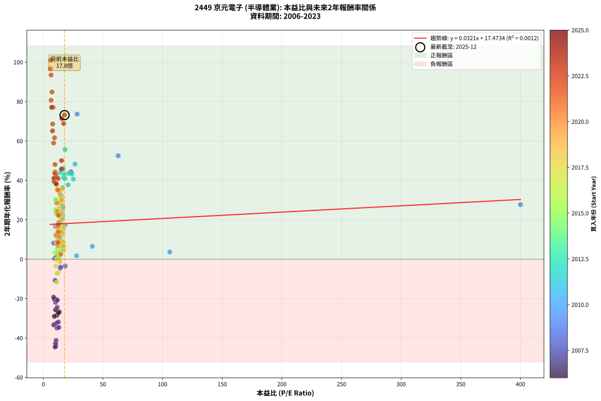
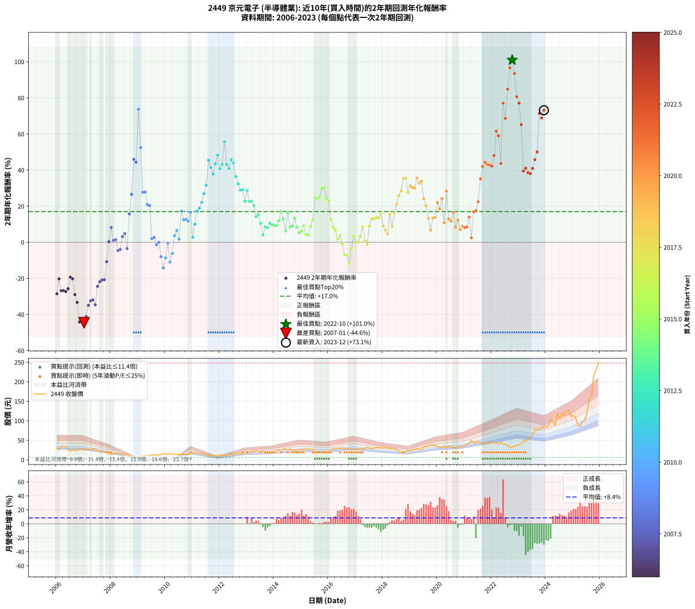

# 2449 京元電子 - 本益比與未來報酬率分析

!!! info "報告資訊"
    - **股票代號**: 2449
    - **公司名稱**: 京元電子
    - **產業別**: 半導體業
    - **分析期間**: 2006-2023 (216 個數據點)
    - **資料來源**: Type 12 (ShowMonthlyK_ChartFlow) 月收盤價與本益比
    - **報酬率口徑**: 含現金股利 (簡化: 年度合計，假設每年7/1入帳)
    - **報告生成時間**: 2026-01-05 00:38:52 CST

## 📈 視覺化圖表

### 圖表1: 本益比 vs 未來報酬率關係

*圖表1：2449 京元電子 本益比與2年期未來報酬率關係 (2006-2023)*

### 圖表2: 歷年買入時點的2年期實際報酬率

*圖表2：2449 京元電子 歷年買入時點的2年期實際報酬率 (2006-2023)*

## 📍 買點訊號說明

本報告提供兩種買點提示訊號（顯示於圖表2的股價子圖中）：

### ▲ 小綠色三角形（回測驗證）
- **計算方式**: 使用全部歷史資料計算本益比第25百分位數
- **用途**: 事後驗證，顯示歷史上哪些時點確實為低估區
- **限制**: 當下無法判斷，僅供回測參考
- **特性**: 後見之明（Look-Ahead Bias）

### ▲ 小橘色三角形（即時訊號）
- **計算方式**: 使用截至當月的過去5年資料計算本益比第25百分位數
- **用途**: 實際投資決策，當時即可判斷
- **優勢**: 可操作性強，符合實務需求
- **特性**: 無後見之明，滾動窗口計算

!!! tip "如何使用兩種訊號"
    - **綠色▲** 幫助理解歷史估值機會，驗證策略有效性
    - **橘色▲** 可作為實際買進參考，但仍需搭配基本面分析
    - 兩種訊號重疊時，表示即時判斷與事後驗證一致，信心度較高
    - 僅有綠色▲時，表示當時無法判斷（需要未來資料才能確認）
    - 僅有橘色▲時，表示即時判斷為買點，但事後可能不是最佳時機

## 📊 估值分析摘要

| 指標 | 數值 |
|:---:|:---:|
| **目前本益比** (2023-12) | **17.76 倍** |
| **歷史平均本益比** | 16.07 倍 |
| **估值水準** | 🟡 合理範圍 |
| **預期2年年化報酬率** | **+18.04%** |
| **歷史平均報酬率** | +17.02% |
| **相關係數 (R²)** | 0.0012 |
| **趨勢線斜率** | 0.0321 |

!!! abstract "核心洞察"
    目前本益比接近歷史平均，預期報酬率符合長期趨勢

    根據歷史數據回測，2449 京元電子 在目前本益比 **17.8倍** 的估值水準下，
    預期未來2年年化報酬率約為 **+18.0%**。

    **重要提醒**: 本分析基於歷史數據統計，實際報酬率會受到公司基本面變化、產業趨勢、
    總體經濟環境等多重因素影響。R² = 0.00 表示本益比可解釋約 0.1% 的報酬率變異。

## 📈 歷史估值統計

### 最佳買點 (最高報酬率)

| 項目 | 數值 |
|:---:|:---:|
| 起始時間 | 2022-10 |
| 當時本益比 | 6.10 倍 |
| 起始價格 | 32.7 元 |
| 2年後價格 | 125.5 元 |
| **2年年化報酬率** | **+100.97%** |

### 最差買點 (最低報酬率)

| 項目 | 數值 |
|:---:|:---:|
| 起始時間 | 2007-01 |
| 當時本益比 | 9.84 倍 |
| 起始價格 | 25.4 元 |
| 2年後價格 | 6.1 元 |
| **2年年化報酬率** | **-44.55%** |

## 🎯 投資啟示

### 本益比與報酬率關係

趨勢線方程式: **y = 0.0321x + 17.4734**

!!! info "弱相關或正相關"
    本益比與未來報酬率相關性較弱。這可能表示該股票的報酬率更多受到
    公司成長性、產業趨勢等因素影響，而非估值水準。**需綜合考量多項指標**。

### 估值區間建議

基於歷史數據分析:

- **🟢 低估區** (P/E < 12.9): 預期報酬率較高，可考慮增加持股
- **🟡 合理區** (P/E 12.9-19.3): 預期報酬率符合長期趨勢，正常持有
- **🔴 高估區** (P/E > 19.3): 預期報酬率較低，可考慮減碼或觀望

!!! danger "風險提示"
    - 過去表現不代表未來結果
    - 本分析假設公司基本面無重大結構性變化
    - 產業環境劇變可能使歷史規律失效
    - 應結合公司財報、產業趨勢、總體經濟等多重因素綜合判斷

!!! success "長期投資觀點"
    歷史數據顯示，在合理或低估的估值水準買入並長期持有，
    往往能獲得較佳的投資報酬。**耐心等待好價格**是價值投資的核心原則。

## 📊 數據品質

- **資料來源**: GoodInfo.tw Type 12 (ShowMonthlyK_ChartFlow)
- **資料頻率**: 月度收盤價與本益比
- **回測期間**: 2006-2023
- **數據點數量**: 216 個 (每個點代表一次2年期回測)

### 計算方法說明

1. **2年期年化報酬率**:
   - 對每個歷史時點，計算其後2年的實際投資報酬率
   - 期末價值(不含股利): 期末價格
   - 期末價值(含現金股利): 期末價格 + 持有期間內的現金股利合計 (簡化: 年度合計，假設每年7/1入帳)
   - 公式: 年化報酬率 = [(期末價值/期初價格)^(1/年數) - 1] × 100%

2. **本益比 (P/E Ratio)**:
   - 使用當時的月收盤價與EPS計算
   - 資料來源: Type 12 月度河流圖本益比數據

3. **趨勢線 (Linear Regression)**:
   - 使用最小平方法擬合線性趨勢線
   - R²值衡量本益比對報酬率的解釋能力

---

*本報告由 Stock Analysis System v1.9.0 自動生成*
*數據更新時間: 2026-01-05 00:38:52 CST*

## 📋 月度回測明細表

（每一列對應時間線圖中的一個買入點；可用來對照 SVG 圖上的每個點。）

| 買入月份 | 賣出月份 | 回測期限_年 | 實際持有年數 | 買入本益比_倍 | 買入收盤價_元 | 賣出收盤價_元 | 現金股利合計_元 | 總報酬率_pct | 年化報酬率_pct |
| --- | --- | --- | --- | --- | --- | --- | --- | --- | --- |
| 2006-01 | 2008-01 | 2 | 1.999 | 11.26 | 29.95 | 13.50 | 1.81 | -48.89 | -28.53 |
| 2006-02 | 2008-02 | 2 | 1.999 | 10.41 | 27.70 | 15.80 | 1.81 | -36.44 | -20.29 |
| 2006-03 | 2008-03 | 2 | 2.001 | 12.29 | 32.70 | 15.70 | 1.81 | -46.46 | -26.81 |
| 2006-04 | 2008-04 | 2 | 2.001 | 13.36 | 35.55 | 17.25 | 1.81 | -46.39 | -26.77 |
| 2006-05 | 2008-05 | 2 | 2.001 | 12.67 | 33.70 | 16.00 | 1.81 | -47.16 | -27.29 |
| 2006-06 | 2008-06 | 2 | 2.001 | 10.23 | 27.20 | 13.20 | 1.81 | -44.83 | -25.71 |
| 2006-07 | 2008-07 | 2 | 2.001 | 8.61 | 22.90 | 13.20 | 1.70 | -34.94 | -19.33 |
| 2006-08 | 2008-08 | 2 | 2.001 | 9.25 | 24.60 | 13.95 | 1.70 | -36.39 | -20.23 |
| 2006-09 | 2008-09 | 2 | 2.001 | 9.21 | 24.50 | 10.65 | 1.70 | -49.60 | -28.99 |
| 2006-10 | 2008-10 | 2 | 2.001 | 8.83 | 23.50 | 8.75 | 1.70 | -55.54 | -33.30 |
| 2006-11 | 2008-11 | 2 | 2.001 | 10.38 | 27.60 | 6.90 | 1.70 | -68.85 | -44.16 |
| 2006-12 | 2008-12 | 2 | 2.001 | 10.23 | 27.20 | 7.20 | 1.70 | -67.29 | -42.78 |
| 2007-01 | 2009-01 | 2 | 2.001 | 9.84 | 25.35 | 6.09 | 1.70 | -69.28 | -44.55 |
| 2007-02 | 2009-02 | 2 | 2.001 | 10.70 | 26.70 | 7.53 | 1.70 | -65.44 | -41.19 |
| 2007-03 | 2009-03 | 2 | 2.001 | 11.46 | 27.65 | 10.00 | 1.70 | -57.69 | -34.94 |
| 2007-04 | 2009-04 | 2 | 2.001 | 10.92 | 25.45 | 9.92 | 1.70 | -54.35 | -32.42 |
| 2007-05 | 2009-05 | 2 | 2.001 | 12.57 | 28.25 | 11.40 | 1.70 | -53.64 | -31.89 |
| 2007-06 | 2009-06 | 2 | 2.001 | 12.98 | 28.10 | 10.30 | 1.70 | -57.30 | -34.64 |
| 2007-07 | 2009-07 | 2 | 2.001 | 11.60 | 24.15 | 13.10 | 0.70 | -42.86 | -24.40 |
| 2007-08 | 2009-08 | 2 | 2.001 | 10.20 | 20.40 | 11.75 | 0.70 | -38.98 | -21.87 |
| 2007-09 | 2009-09 | 2 | 2.001 | 11.00 | 21.10 | 12.50 | 0.70 | -37.45 | -20.90 |
| 2007-10 | 2009-10 | 2 | 2.001 | 11.72 | 21.50 | 12.80 | 0.70 | -37.21 | -20.75 |
| 2007-11 | 2009-11 | 2 | 2.001 | 9.93 | 17.40 | 13.15 | 0.70 | -20.41 | -10.78 |
| 2007-12 | 2009-12 | 2 | 2.001 | 9.46 | 15.80 | 15.20 | 0.70 | +0.63 | +0.31 |
| 2008-01 | 2010-01 | 2 | 2.001 | 8.67 | 13.50 | 15.10 | 0.70 | +17.03 | +8.17 |
| 2008-02 | 2010-03 | 2 | 2.081 | 10.95 | 15.80 | 15.45 | 0.70 | +2.21 | +1.06 |
| 2008-03 | 2010-03 | 2 | 1.999 | 11.80 | 15.70 | 15.45 | 0.70 | +2.86 | +1.42 |
| 2008-04 | 2010-04 | 2 | 1.999 | 14.18 | 17.25 | 15.00 | 0.70 | -8.99 | -4.60 |
| 2008-05 | 2010-05 | 2 | 1.999 | 14.50 | 16.00 | 14.05 | 0.70 | -7.82 | -3.99 |
| 2008-06 | 2010-06 | 2 | 1.999 | 13.33 | 13.20 | 13.35 | 0.70 | +6.43 | +3.17 |
| 2008-07 | 2010-07 | 2 | 1.999 | 15.06 | 13.20 | 14.40 | 0.10 | +9.85 | +4.81 |
| 2008-08 | 2010-08 | 2 | 1.999 | 18.28 | 13.95 | 12.90 | 0.10 | -6.81 | -3.47 |
| 2008-09 | 2010-09 | 2 | 1.999 | 16.38 | 10.65 | 14.15 | 0.10 | +33.80 | +15.68 |
| 2008-10 | 2010-10 | 2 | 1.999 | 16.30 | 8.75 | 13.90 | 0.10 | +60.00 | +26.51 |
| 2008-11 | 2010-11 | 2 | 1.999 | 16.30 | 6.90 | 14.60 | 0.10 | +113.04 | +46.00 |
| 2008-12 | 2010-12 | 2 | 1.999 | 23.23 | 7.20 | 14.90 | 0.10 | +108.33 | +44.37 |
| 2009-01 | 2011-01 | 2 | 1.999 | 28.33 | 6.09 | 18.25 | 0.10 | +201.31 | +73.65 |
| 2009-02 | 2011-02 | 2 | 1.999 | 62.75 | 7.53 | 17.40 | 0.10 | +132.40 | +52.49 |
| 2009-03 | 2011-03 | 2 | 1.999 | 400.00 | 10.00 | 16.20 | 0.10 | +63.00 | +27.69 |
| 2009-04 | 2011-04 | 2 | 1.999 |  | 9.92 | 16.10 | 0.10 | +63.31 | +27.81 |
| 2009-05 | 2011-05 | 2 | 1.999 |  | 11.40 | 16.55 | 0.10 | +46.05 | +20.87 |
| 2009-06 | 2011-06 | 2 | 1.999 |  | 10.30 | 14.80 | 0.10 | +44.66 | +20.29 |
| 2009-07 | 2011-07 | 2 | 1.999 |  | 13.10 | 12.55 | 1.10 | +4.18 | +2.07 |
| 2009-08 | 2011-08 | 2 | 1.999 |  | 11.75 | 11.30 | 1.10 | +5.51 | +2.72 |
| 2009-09 | 2011-09 | 2 | 1.999 |  | 12.50 | 11.05 | 1.10 | -2.82 | -1.42 |
| 2009-10 | 2011-10 | 2 | 1.999 |  | 12.80 | 11.70 | 1.10 | -0.02 | -0.01 |
| 2009-11 | 2011-11 | 2 | 1.999 |  | 13.15 | 10.05 | 1.10 | -15.22 | -7.93 |
| 2009-12 | 2011-12 | 2 | 1.999 |  | 15.20 | 10.10 | 1.10 | -26.33 | -14.18 |
| 2010-01 | 2012-01 | 2 | 1.999 |  | 15.10 | 11.50 | 1.10 | -16.57 | -8.67 |
| 2010-02 | 2012-02 | 2 | 1.999 |  | 14.05 | 12.80 | 1.10 | -1.08 | -0.54 |
| 2010-03 | 2012-03 | 2 | 2.001 |  | 15.45 | 11.15 | 1.10 | -20.72 | -10.96 |
| 2010-04 | 2012-04 | 2 | 2.001 |  | 15.00 | 12.10 | 1.10 | -12.01 | -6.19 |
| 2010-05 | 2012-05 | 2 | 2.001 | 106.00 | 14.05 | 14.00 | 1.10 | +7.46 | +3.66 |
| 2010-06 | 2012-06 | 2 | 2.001 | 41.08 | 13.35 | 14.05 | 1.10 | +13.47 | +6.52 |
| 2010-07 | 2012-07 | 2 | 2.001 | 27.83 | 14.40 | 13.15 | 1.76 | +3.56 | +1.76 |
| 2010-08 | 2012-08 | 2 | 2.001 | 18.17 | 12.90 | 16.00 | 1.76 | +37.70 | +17.33 |
| 2010-09 | 2012-09 | 2 | 2.001 | 15.68 | 14.15 | 16.15 | 1.76 | +26.59 | +12.50 |
| 2010-10 | 2012-10 | 2 | 2.001 | 12.69 | 13.90 | 15.90 | 1.76 | +27.07 | +12.72 |
| 2010-11 | 2012-11 | 2 | 2.001 | 11.34 | 14.60 | 16.45 | 1.76 | +24.75 | +11.68 |
| 2010-12 | 2012-12 | 2 | 2.001 | 10.07 | 14.90 | 18.50 | 1.76 | +35.99 | +16.60 |
| 2011-01 | 2013-01 | 2 | 2.001 | 13.15 | 18.25 | 17.50 | 1.76 | +5.55 | +2.74 |
| 2011-02 | 2013-02 | 2 | 2.001 | 13.42 | 17.40 | 19.30 | 1.76 | +21.05 | +10.02 |
| 2011-03 | 2013-03 | 2 | 2.001 | 13.44 | 16.20 | 20.50 | 1.76 | +37.43 | +17.22 |
| 2011-04 | 2013-04 | 2 | 2.001 | 14.46 | 16.10 | 21.00 | 1.76 | +41.39 | +18.89 |
| 2011-05 | 2013-05 | 2 | 2.001 | 16.20 | 16.55 | 22.90 | 1.76 | +49.02 | +22.06 |
| 2011-06 | 2013-06 | 2 | 2.001 | 15.91 | 14.80 | 22.10 | 1.76 | +61.24 | +26.96 |
| 2011-07 | 2013-07 | 2 | 2.001 | 14.97 | 12.55 | 20.00 | 1.76 | +73.41 | +31.66 |
| 2011-08 | 2013-08 | 2 | 2.001 | 15.13 | 11.30 | 22.15 | 1.76 | +111.62 | +45.43 |
| 2011-09 | 2013-09 | 2 | 2.001 | 16.87 | 11.05 | 20.35 | 1.76 | +100.12 | +41.43 |
| 2011-10 | 2013-10 | 2 | 2.001 | 20.77 | 11.70 | 20.45 | 1.76 | +89.85 | +37.76 |
| 2011-11 | 2013-11 | 2 | 2.001 | 21.31 | 10.05 | 18.95 | 1.76 | +106.10 | +43.53 |
| 2011-12 | 2013-12 | 2 | 2.001 | 26.58 | 10.10 | 20.45 | 1.76 | +119.93 | +48.26 |
| 2012-01 | 2014-01 | 2 | 2.001 | 25.14 | 11.50 | 21.00 | 1.76 | +97.94 | +40.66 |
| 2012-02 | 2014-03 | 2 | 2.081 | 23.93 | 12.80 | 25.25 | 1.76 | +111.04 | +43.18 |
| 2012-03 | 2014-03 | 2 | 1.999 | 18.20 | 11.15 | 25.25 | 1.76 | +142.27 | +55.70 |
| 2012-04 | 2014-04 | 2 | 1.999 | 17.54 | 12.10 | 23.00 | 1.76 | +104.65 | +43.09 |
| 2012-05 | 2014-05 | 2 | 1.999 | 18.24 | 14.00 | 26.00 | 1.76 | +98.31 | +40.85 |
| 2012-06 | 2014-06 | 2 | 1.999 | 16.63 | 14.05 | 28.05 | 1.76 | +112.19 | +45.71 |
| 2012-07 | 2014-07 | 2 | 1.999 | 14.25 | 13.15 | 24.85 | 2.40 | +107.21 | +43.98 |
| 2012-08 | 2014-08 | 2 | 1.999 | 16.00 | 16.00 | 27.35 | 2.40 | +85.93 | +36.38 |
| 2012-09 | 2014-09 | 2 | 1.999 | 14.99 | 16.15 | 25.90 | 2.40 | +75.22 | +32.40 |
| 2012-10 | 2014-10 | 2 | 1.999 | 13.77 | 15.90 | 24.00 | 2.40 | +66.03 | +28.87 |
| 2012-11 | 2014-11 | 2 | 1.999 | 13.35 | 16.45 | 25.00 | 2.40 | +66.55 | +29.08 |
| 2012-12 | 2014-12 | 2 | 1.999 | 14.12 | 18.50 | 25.45 | 2.40 | +50.53 | +22.71 |
| 2013-01 | 2015-01 | 2 | 1.999 | 13.17 | 17.50 | 26.60 | 2.40 | +65.70 | +28.75 |
| 2013-02 | 2015-02 | 2 | 1.999 | 14.33 | 19.30 | 26.60 | 2.40 | +50.25 | +22.59 |
| 2013-03 | 2015-03 | 2 | 1.999 | 15.02 | 20.50 | 28.45 | 2.40 | +50.48 | +22.69 |
| 2013-04 | 2015-04 | 2 | 1.999 | 15.18 | 21.00 | 27.95 | 2.40 | +44.51 | +20.23 |
| 2013-05 | 2015-05 | 2 | 1.999 | 16.34 | 22.90 | 27.45 | 2.40 | +30.34 | +14.18 |
| 2013-06 | 2015-06 | 2 | 1.999 | 15.56 | 22.10 | 26.95 | 2.40 | +32.80 | +15.25 |
| 2013-07 | 2015-07 | 2 | 1.999 | 13.90 | 20.00 | 21.30 | 3.10 | +22.00 | +10.46 |
| 2013-08 | 2015-08 | 2 | 1.999 | 15.21 | 22.15 | 20.90 | 3.10 | +8.35 | +4.10 |
| 2013-09 | 2015-09 | 2 | 1.999 | 13.80 | 20.35 | 20.90 | 3.10 | +17.94 | +8.60 |
| 2013-10 | 2015-10 | 2 | 1.999 | 13.69 | 20.45 | 20.80 | 3.10 | +16.87 | +8.11 |
| 2013-11 | 2015-11 | 2 | 1.999 | 12.54 | 18.95 | 20.05 | 3.10 | +22.16 | +10.54 |
| 2013-12 | 2015-12 | 2 | 1.999 | 13.37 | 20.45 | 21.55 | 3.10 | +20.54 | +9.80 |
| 2014-01 | 2016-01 | 2 | 1.999 | 13.28 | 21.00 | 21.95 | 3.10 | +19.29 | +9.22 |
| 2014-02 | 2016-02 | 2 | 1.999 | 15.00 | 24.50 | 26.15 | 3.10 | +19.39 | +9.27 |
| 2014-03 | 2016-03 | 2 | 2.001 | 14.99 | 25.25 | 28.60 | 3.10 | +25.54 | +12.04 |
| 2014-04 | 2016-04 | 2 | 2.001 | 13.24 | 23.00 | 28.50 | 3.10 | +37.39 | +17.20 |
| 2014-05 | 2016-05 | 2 | 2.001 | 14.54 | 26.00 | 30.05 | 3.10 | +27.50 | +12.91 |
| 2014-06 | 2016-06 | 2 | 2.001 | 15.24 | 28.05 | 28.55 | 3.10 | +12.83 | +6.22 |
| 2014-07 | 2016-07 | 2 | 2.001 | 13.14 | 24.85 | 30.55 | 3.00 | +35.01 | +16.18 |
| 2014-08 | 2016-08 | 2 | 2.001 | 14.07 | 27.35 | 29.15 | 3.00 | +17.55 | +8.41 |
| 2014-09 | 2016-09 | 2 | 2.001 | 12.98 | 25.90 | 27.85 | 3.00 | +19.11 | +9.13 |
| 2014-10 | 2016-10 | 2 | 2.001 | 11.73 | 24.00 | 27.75 | 3.00 | +28.12 | +13.18 |
| 2014-11 | 2016-11 | 2 | 2.001 | 11.91 | 25.00 | 26.35 | 3.00 | +17.40 | +8.35 |
| 2014-12 | 2016-12 | 2 | 2.001 | 11.84 | 25.45 | 25.20 | 3.00 | +10.81 | +5.26 |
| 2015-01 | 2017-01 | 2 | 2.001 | 12.48 | 26.60 | 27.00 | 3.00 | +12.78 | +6.19 |
| 2015-02 | 2017-02 | 2 | 2.001 | 12.59 | 26.60 | 28.75 | 3.00 | +19.36 | +9.25 |
| 2015-03 | 2017-03 | 2 | 2.001 | 13.58 | 28.45 | 28.00 | 3.00 | +8.96 | +4.38 |
| 2015-04 | 2017-04 | 2 | 2.001 | 13.46 | 27.95 | 27.25 | 3.00 | +8.23 | +4.03 |
| 2015-05 | 2017-05 | 2 | 2.001 | 13.34 | 27.45 | 29.40 | 3.00 | +18.03 | +8.64 |
| 2015-06 | 2017-06 | 2 | 2.001 | 13.21 | 26.95 | 31.15 | 3.00 | +26.72 | +12.56 |
| 2015-07 | 2017-07 | 2 | 2.001 | 10.54 | 21.30 | 30.10 | 3.00 | +55.38 | +24.63 |
| 2015-08 | 2017-08 | 2 | 2.001 | 10.43 | 20.90 | 29.25 | 3.00 | +54.29 | +24.19 |
| 2015-09 | 2017-09 | 2 | 2.001 | 10.53 | 20.90 | 29.75 | 3.00 | +56.68 | +25.15 |
| 2015-10 | 2017-10 | 2 | 2.001 | 10.58 | 20.80 | 31.95 | 3.00 | +68.01 | +29.60 |
| 2015-11 | 2017-11 | 2 | 2.001 | 10.29 | 20.05 | 31.10 | 3.00 | +70.05 | +30.38 |
| 2015-12 | 2017-12 | 2 | 2.001 | 11.17 | 21.55 | 30.25 | 3.00 | +54.27 | +24.19 |
| 2016-01 | 2018-01 | 2 | 2.001 | 11.07 | 21.95 | 30.15 | 3.00 | +51.01 | +22.87 |
| 2016-02 | 2018-03 | 2 | 2.081 | 12.85 | 26.15 | 30.50 | 3.00 | +28.09 | +12.64 |
| 2016-03 | 2018-03 | 2 | 1.999 | 13.70 | 28.60 | 30.50 | 3.00 | +17.12 | +8.23 |
| 2016-04 | 2018-04 | 2 | 1.999 | 13.32 | 28.50 | 29.40 | 3.00 | +13.67 | +6.62 |
| 2016-05 | 2018-05 | 2 | 1.999 | 13.71 | 30.05 | 28.10 | 3.00 | +3.48 | +1.73 |
| 2016-06 | 2018-06 | 2 | 1.999 | 12.72 | 28.55 | 27.75 | 3.00 | +7.69 | +3.78 |
| 2016-07 | 2018-07 | 2 | 1.999 | 13.30 | 30.55 | 26.40 | 3.59 | -1.82 | -0.91 |
| 2016-08 | 2018-08 | 2 | 1.999 | 12.40 | 29.15 | 21.70 | 3.59 | -13.23 | -6.85 |
| 2016-09 | 2018-09 | 2 | 1.999 | 11.59 | 27.85 | 20.40 | 3.59 | -13.85 | -7.19 |
| 2016-10 | 2018-10 | 2 | 1.999 | 11.30 | 27.75 | 18.05 | 3.59 | -22.00 | -11.69 |
| 2016-11 | 2018-11 | 2 | 1.999 | 10.51 | 26.35 | 21.00 | 3.59 | -6.66 | -3.39 |
| 2016-12 | 2018-12 | 2 | 1.999 | 9.84 | 25.20 | 23.25 | 3.59 | +6.52 | +3.21 |
| 2017-01 | 2019-01 | 2 | 1.999 | 10.79 | 27.00 | 23.30 | 3.59 | -0.39 | -0.20 |
| 2017-02 | 2019-02 | 2 | 1.999 | 11.75 | 28.75 | 25.25 | 3.59 | +0.33 | +0.16 |
| 2017-03 | 2019-03 | 2 | 1.999 | 11.72 | 28.00 | 26.25 | 3.59 | +6.59 | +3.24 |
| 2017-04 | 2019-04 | 2 | 1.999 | 11.68 | 27.25 | 28.60 | 3.59 | +18.14 | +8.70 |
| 2017-05 | 2019-05 | 2 | 1.999 | 12.91 | 29.40 | 26.30 | 3.59 | +1.68 | +0.84 |
| 2017-06 | 2019-06 | 2 | 1.999 | 14.03 | 31.15 | 26.80 | 3.59 | -2.43 | -1.22 |
| 2017-07 | 2019-07 | 2 | 1.999 | 13.91 | 30.10 | 32.55 | 3.15 | +18.60 | +8.91 |
| 2017-08 | 2019-08 | 2 | 1.999 | 13.88 | 29.25 | 34.15 | 3.15 | +27.51 | +12.93 |
| 2017-09 | 2019-09 | 2 | 1.999 | 14.51 | 29.75 | 34.85 | 3.15 | +27.72 | +13.02 |
| 2017-10 | 2019-10 | 2 | 1.999 | 16.03 | 31.95 | 38.25 | 3.15 | +29.57 | +13.84 |
| 2017-11 | 2019-11 | 2 | 1.999 | 16.06 | 31.10 | 36.90 | 3.15 | +28.77 | +13.49 |
| 2017-12 | 2019-12 | 2 | 1.999 | 16.09 | 30.25 | 37.55 | 3.15 | +34.54 | +16.00 |
| 2018-01 | 2020-01 | 2 | 1.999 | 16.33 | 30.15 | 32.65 | 3.15 | +18.73 | +8.97 |
| 2018-02 | 2020-02 | 2 | 1.999 | 17.39 | 31.50 | 32.75 | 3.15 | +13.96 | +6.76 |
| 2018-03 | 2020-03 | 2 | 2.001 | 17.16 | 30.50 | 30.25 | 3.15 | +9.50 | +4.64 |
| 2018-04 | 2020-04 | 2 | 2.001 | 16.86 | 29.40 | 36.00 | 3.15 | +33.16 | +15.38 |
| 2018-05 | 2020-05 | 2 | 2.001 | 16.44 | 28.10 | 30.10 | 3.15 | +18.32 | +8.77 |
| 2018-06 | 2020-06 | 2 | 2.001 | 16.57 | 27.75 | 34.35 | 3.15 | +35.13 | +16.23 |
| 2018-07 | 2020-07 | 2 | 2.001 | 16.09 | 26.40 | 35.50 | 3.15 | +46.40 | +20.98 |
| 2018-08 | 2020-08 | 2 | 2.001 | 13.51 | 21.70 | 31.20 | 3.15 | +58.29 | +25.80 |
| 2018-09 | 2020-09 | 2 | 2.001 | 12.97 | 20.40 | 30.50 | 3.15 | +64.95 | +28.41 |
| 2018-10 | 2020-10 | 2 | 2.001 | 11.73 | 18.05 | 29.95 | 3.15 | +83.38 | +35.39 |
| 2018-11 | 2020-11 | 2 | 2.001 | 13.96 | 21.00 | 35.40 | 3.15 | +83.57 | +35.46 |
| 2018-12 | 2020-12 | 2 | 2.001 | 15.82 | 23.25 | 34.75 | 3.15 | +63.01 | +27.65 |
| 2019-01 | 2021-01 | 2 | 2.001 | 14.98 | 23.30 | 37.00 | 3.15 | +72.32 | +31.25 |
| 2019-02 | 2021-02 | 2 | 2.001 | 15.40 | 25.25 | 39.80 | 3.15 | +70.10 | +30.40 |
| 2019-03 | 2021-03 | 2 | 2.001 | 15.22 | 26.25 | 41.20 | 3.15 | +68.95 | +29.96 |
| 2019-04 | 2021-04 | 2 | 2.001 | 15.80 | 28.60 | 49.50 | 3.15 | +84.09 | +35.65 |
| 2019-05 | 2021-05 | 2 | 2.001 | 13.88 | 26.30 | 43.20 | 3.15 | +76.24 | +32.73 |
| 2019-06 | 2021-06 | 2 | 2.001 | 13.54 | 26.80 | 44.90 | 3.15 | +79.29 | +33.87 |
| 2019-07 | 2021-07 | 2 | 2.001 | 15.76 | 32.55 | 46.40 | 3.80 | +54.22 | +24.17 |
| 2019-08 | 2021-08 | 2 | 2.001 | 15.88 | 34.15 | 45.60 | 3.80 | +44.66 | +20.26 |
| 2019-09 | 2021-09 | 2 | 2.001 | 15.59 | 34.85 | 40.95 | 3.80 | +28.41 | +13.31 |
| 2019-10 | 2021-10 | 2 | 2.001 | 16.49 | 38.25 | 39.75 | 3.80 | +13.86 | +6.70 |
| 2019-11 | 2021-11 | 2 | 2.001 | 15.34 | 36.90 | 43.60 | 3.80 | +28.46 | +13.33 |
| 2019-12 | 2021-12 | 2 | 2.001 | 15.08 | 37.55 | 44.80 | 3.80 | +29.43 | +13.76 |
| 2020-01 | 2022-01 | 2 | 2.001 | 12.91 | 32.65 | 44.80 | 3.80 | +48.85 | +21.99 |
| 2020-02 | 2022-03 | 2 | 2.081 | 12.74 | 32.75 | 42.85 | 3.80 | +42.44 | +18.53 |
| 2020-03 | 2022-03 | 2 | 1.999 | 11.59 | 30.25 | 42.85 | 3.80 | +54.21 | +24.20 |
| 2020-04 | 2022-04 | 2 | 1.999 | 13.58 | 36.00 | 40.45 | 3.80 | +22.92 | +10.88 |
| 2020-05 | 2022-05 | 2 | 1.999 | 11.19 | 30.10 | 45.85 | 3.80 | +64.95 | +28.45 |
| 2020-06 | 2022-06 | 2 | 1.999 | 12.58 | 34.35 | 40.00 | 3.80 | +27.51 | +12.93 |
| 2020-07 | 2022-07 | 2 | 1.999 | 12.82 | 35.50 | 39.25 | 5.00 | +24.65 | +11.65 |
| 2020-08 | 2022-08 | 2 | 1.999 | 11.10 | 31.20 | 37.35 | 5.00 | +35.74 | +16.52 |
| 2020-09 | 2022-09 | 2 | 1.999 | 10.70 | 30.50 | 30.80 | 5.00 | +17.38 | +8.35 |
| 2020-10 | 2022-10 | 2 | 1.999 | 10.36 | 29.95 | 32.70 | 5.00 | +25.88 | +12.20 |
| 2020-11 | 2022-11 | 2 | 1.999 | 12.08 | 35.40 | 35.55 | 5.00 | +14.55 | +7.03 |
| 2020-12 | 2022-12 | 2 | 1.999 | 11.70 | 34.75 | 36.20 | 5.00 | +18.56 | +8.89 |
| 2021-01 | 2023-01 | 2 | 1.999 | 12.03 | 37.00 | 38.30 | 5.00 | +17.03 | +8.18 |
| 2021-02 | 2023-02 | 2 | 1.999 | 12.52 | 39.80 | 41.85 | 5.00 | +17.71 | +8.50 |
| 2021-03 | 2023-03 | 2 | 1.999 | 12.54 | 41.20 | 48.50 | 5.00 | +29.85 | +13.96 |
| 2021-04 | 2023-04 | 2 | 1.999 | 14.60 | 49.50 | 47.00 | 5.00 | +5.05 | +2.50 |
| 2021-05 | 2023-05 | 2 | 1.999 | 12.36 | 43.20 | 54.00 | 5.00 | +36.57 | +16.88 |
| 2021-06 | 2023-06 | 2 | 1.999 | 12.47 | 44.90 | 57.00 | 5.00 | +38.08 | +17.52 |
| 2021-07 | 2023-07 | 2 | 1.999 | 12.52 | 46.40 | 63.00 | 6.50 | +49.78 | +22.40 |
| 2021-08 | 2023-08 | 2 | 1.999 | 11.97 | 45.60 | 76.80 | 6.50 | +82.68 | +35.19 |
| 2021-09 | 2023-09 | 2 | 1.999 | 10.46 | 40.95 | 76.00 | 6.50 | +101.47 | +41.97 |
| 2021-10 | 2023-10 | 2 | 1.999 | 9.89 | 39.75 | 76.30 | 6.50 | +108.30 | +44.36 |
| 2021-11 | 2023-11 | 2 | 1.999 | 10.57 | 43.60 | 82.80 | 6.50 | +104.82 | +43.15 |
| 2021-12 | 2023-12 | 2 | 1.999 | 10.59 | 44.80 | 84.90 | 6.50 | +104.02 | +42.87 |
| 2022-01 | 2024-01 | 2 | 1.999 | 10.31 | 44.80 | 84.00 | 6.50 | +102.01 | +42.16 |
| 2022-02 | 2024-02 | 2 | 1.999 | 9.76 | 43.50 | 88.80 | 6.50 | +119.08 | +48.05 |
| 2022-03 | 2024-03 | 2 | 2.001 | 9.38 | 42.85 | 105.50 | 6.50 | +161.38 | +61.62 |
| 2022-04 | 2024-04 | 2 | 2.001 | 8.64 | 40.45 | 95.80 | 6.50 | +152.90 | +58.98 |
| 2022-05 | 2024-05 | 2 | 2.001 | 9.56 | 45.85 | 88.20 | 6.50 | +106.54 | +43.68 |
| 2022-06 | 2024-06 | 2 | 2.001 | 8.15 | 40.00 | 119.00 | 6.50 | +213.75 | +77.06 |
| 2022-07 | 2024-07 | 2 | 2.001 | 7.81 | 39.25 | 105.00 | 6.70 | +184.59 | +68.64 |
| 2022-08 | 2024-08 | 2 | 2.001 | 7.27 | 37.35 | 121.00 | 6.70 | +241.90 | +84.83 |
| 2022-09 | 2024-09 | 2 | 2.001 | 5.87 | 30.80 | 112.50 | 6.70 | +287.01 | +96.64 |
| 2022-10 | 2024-10 | 2 | 2.001 | 6.10 | 32.70 | 125.50 | 6.70 | +304.28 | +100.97 |
| 2022-11 | 2024-11 | 2 | 2.001 | 6.49 | 35.55 | 126.50 | 6.70 | +274.68 | +93.48 |
| 2022-12 | 2024-12 | 2 | 2.001 | 6.48 | 36.20 | 111.50 | 6.70 | +226.52 | +80.63 |
| 2023-01 | 2025-01 | 2 | 2.001 | 6.94 | 38.30 | 113.50 | 6.70 | +213.84 | +77.09 |
| 2023-02 | 2025-02 | 2 | 2.001 | 7.67 | 41.85 | 107.50 | 6.70 | +172.88 | +65.13 |
| 2023-03 | 2025-03 | 2 | 2.001 | 9.00 | 48.50 | 87.70 | 6.70 | +94.64 | +39.48 |
| 2023-04 | 2025-04 | 2 | 2.001 | 8.83 | 47.00 | 86.80 | 6.70 | +98.94 | +41.01 |
| 2023-05 | 2025-05 | 2 | 2.001 | 10.28 | 54.00 | 97.00 | 6.70 | +92.04 | +38.55 |
| 2023-06 | 2025-06 | 2 | 2.001 | 10.99 | 57.00 | 102.00 | 6.70 | +90.70 | +38.06 |
| 2023-07 | 2025-07 | 2 | 2.001 | 12.31 | 63.00 | 118.00 | 7.20 | +98.73 | +40.94 |
| 2023-08 | 2025-08 | 2 | 2.001 | 15.21 | 76.80 | 156.00 | 7.20 | +112.50 | +45.74 |
| 2023-09 | 2025-09 | 2 | 2.001 | 15.25 | 76.00 | 164.00 | 7.20 | +125.26 | +50.05 |
| 2023-10 | 2025-10 | 2 | 2.001 | 15.52 | 76.30 | 217.00 | 7.20 | +193.84 | +71.35 |
| 2023-11 | 2025-11 | 2 | 2.001 | 17.08 | 82.80 | 229.00 | 7.20 | +185.27 | +68.84 |
| 2023-12 | 2025-12 | 2 | 2.001 | 17.76 | 84.90 | 247.50 | 7.20 | +200.00 | +73.14 |
