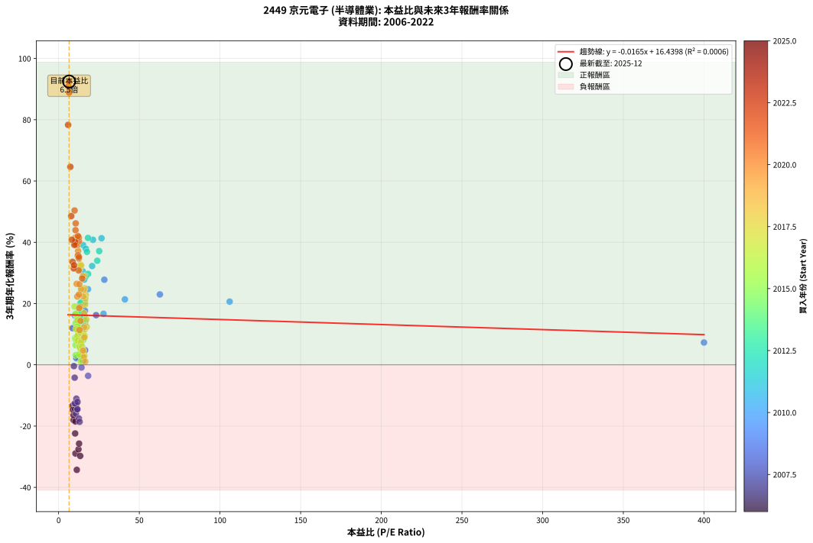

# 2449 京元電子 - 本益比與未來報酬率分析

!!! info "報告資訊"
    - **股票代號**: 2449
    - **公司名稱**: 京元電子
    - **產業別**: 半導體業
    - **分析期間**: 2006-2022 (204 個數據點)
    - **資料來源**: Type 12 (ShowMonthlyK_ChartFlow) 月收盤價與本益比
    - **報酬率口徑**: 含現金股利 (簡化: 年度合計，假設每年7/1入帳)
    - **報告生成時間**: 2026-01-05 20:46:30 CST

## 📈 視覺化圖表

### 圖表1: 本益比 vs 未來報酬率關係

*圖表1：2449 京元電子 本益比與3年期未來報酬率關係 (2006-2022)*

### 圖表2: 歷年買入時點的3年期實際報酬率

*圖表2：2449 京元電子 歷年買入時點的3年期實際報酬率 (2006-2022)*

## 📍 買點訊號說明

本報告提供兩種買點提示訊號（顯示於圖表2的股價子圖中）：

### ▲ 小綠色三角形（回測驗證）
- **計算方式**: 使用全部歷史資料計算本益比第25百分位數
- **用途**: 事後驗證，顯示歷史上哪些時點確實為低估區
- **限制**: 當下無法判斷，僅供回測參考
- **特性**: 後見之明（Look-Ahead Bias）

### ▲ 小橘色三角形（即時訊號）
- **計算方式**: 使用截至當月的過去5年資料計算本益比第25百分位數
- **用途**: 實際投資決策，當時即可判斷
- **優勢**: 可操作性強，符合實務需求
- **特性**: 無後見之明，滾動窗口計算

!!! tip "如何使用兩種訊號"
    - **綠色▲** 幫助理解歷史估值機會，驗證策略有效性
    - **橘色▲** 可作為實際買進參考，但仍需搭配基本面分析
    - 兩種訊號重疊時，表示即時判斷與事後驗證一致，信心度較高
    - 僅有綠色▲時，表示當時無法判斷（需要未來資料才能確認）
    - 僅有橘色▲時，表示即時判斷為買點，但事後可能不是最佳時機

## 📊 估值分析摘要

| 指標 | 數值 |
|:---:|:---:|
| **目前本益比** (2022-12) | **6.48 倍** |
| **歷史平均本益比** | 16.31 倍 |
| **估值水準** | 🟢 相對低估 |
| **預期3年年化報酬率** | **+16.33%** |
| **歷史平均報酬率** | +15.87% |
| **相關係數 (R²)** | 0.0006 |
| **趨勢線斜率** | -0.0165 |

!!! abstract "核心洞察"
    目前本益比顯著低於歷史平均，預期未來報酬率可能較高

    根據歷史數據回測，2449 京元電子 在目前本益比 **6.5倍** 的估值水準下，
    預期未來3年年化報酬率約為 **+16.3%**。

    **重要提醒**: 本分析基於歷史數據統計，實際報酬率會受到公司基本面變化、產業趨勢、
    總體經濟環境等多重因素影響。R² = 0.00 表示本益比可解釋約 0.1% 的報酬率變異。

## 📈 歷史估值統計

### 最佳買點 (最高報酬率)

| 項目 | 數值 |
|:---:|:---:|
| 起始時間 | 2022-12 |
| 當時本益比 | 6.48 倍 |
| 起始價格 | 36.2 元 |
| 3年後價格 | 247.5 元 |
| **3年年化報酬率** | **+92.46%** |

### 最差買點 (最低報酬率)

| 項目 | 數值 |
|:---:|:---:|
| 起始時間 | 2006-01 |
| 當時本益比 | 11.26 倍 |
| 起始價格 | 29.9 元 |
| 3年後價格 | 6.1 元 |
| **3年年化報酬率** | **-34.29%** |

## 🎯 投資啟示

### 本益比與報酬率關係

趨勢線方程式: **y = -0.0165x + 16.4398**

!!! note "負相關"
    本益比與未來報酬率呈現負相關。較低的本益比通常帶來較高的未來報酬率，
    但相關性不算非常強。**估值仍是重要參考指標之一**。

### 估值區間建議

基於歷史數據分析:

- **🟢 低估區** (P/E < 13.1): 預期報酬率較高，可考慮增加持股
- **🟡 合理區** (P/E 13.1-19.6): 預期報酬率符合長期趨勢，正常持有
- **🔴 高估區** (P/E > 19.6): 預期報酬率較低，可考慮減碼或觀望

!!! danger "風險提示"
    - 過去表現不代表未來結果
    - 本分析假設公司基本面無重大結構性變化
    - 產業環境劇變可能使歷史規律失效
    - 應結合公司財報、產業趨勢、總體經濟等多重因素綜合判斷

!!! success "長期投資觀點"
    歷史數據顯示，在合理或低估的估值水準買入並長期持有，
    往往能獲得較佳的投資報酬。**耐心等待好價格**是價值投資的核心原則。

## 📊 數據品質

- **資料來源**: GoodInfo.tw Type 12 (ShowMonthlyK_ChartFlow)
- **資料頻率**: 月度收盤價與本益比
- **回測期間**: 2006-2022
- **數據點數量**: 204 個 (每個點代表一次3年期回測)

### 計算方法說明

1. **3年期年化報酬率**:
   - 對每個歷史時點，計算其後3年的實際投資報酬率
   - 期末價值(不含股利): 期末價格
   - 期末價值(含現金股利): 期末價格 + 持有期間內的現金股利合計 (簡化: 年度合計，假設每年7/1入帳)
   - 公式: 年化報酬率 = [(期末價值/期初價格)^(1/年數) - 1] × 100%

2. **本益比 (P/E Ratio)**:
   - 使用當時的月收盤價與EPS計算
   - 資料來源: Type 12 月度河流圖本益比數據

3. **趨勢線 (Linear Regression)**:
   - 使用最小平方法擬合線性趨勢線
   - R²值衡量本益比對報酬率的解釋能力

---

*本報告由 Stock Analysis System v1.9.0 自動生成*
*數據更新時間: 2026-01-05 20:46:30 CST*

## 📋 月度回測明細表

（每一列對應時間線圖中的一個買入點；可用來對照 SVG 圖上的每個點。）

| 買入月份 | 賣出月份 | 回測期限_年 | 實際持有年數 | 買入本益比_倍 | 買入收盤價_元 | 賣出收盤價_元 | 現金股利合計_元 | 總報酬率_pct | 年化報酬率_pct |
| --- | --- | --- | --- | --- | --- | --- | --- | --- | --- |
| 2006-01 | 2009-01 | 3 | 3.001 | 11.26 | 29.95 | 6.09 | 2.41 | -71.63 | -34.29 |
| 2006-02 | 2009-02 | 3 | 3.001 | 10.41 | 27.70 | 7.53 | 2.41 | -64.13 | -28.94 |
| 2006-03 | 2009-03 | 3 | 3.001 | 12.29 | 32.70 | 10.00 | 2.41 | -62.06 | -27.60 |
| 2006-04 | 2009-04 | 3 | 3.001 | 13.36 | 35.55 | 9.92 | 2.41 | -65.33 | -29.74 |
| 2006-05 | 2009-05 | 3 | 3.001 | 12.67 | 33.70 | 11.40 | 2.41 | -59.03 | -25.73 |
| 2006-06 | 2009-06 | 3 | 3.001 | 10.23 | 27.20 | 10.30 | 2.41 | -53.29 | -22.40 |
| 2006-07 | 2009-07 | 3 | 3.001 | 8.61 | 22.90 | 13.10 | 1.80 | -34.94 | -13.35 |
| 2006-08 | 2009-08 | 3 | 3.001 | 9.25 | 24.60 | 11.75 | 1.80 | -44.93 | -18.03 |
| 2006-09 | 2009-09 | 3 | 3.001 | 9.21 | 24.50 | 12.50 | 1.80 | -41.64 | -16.43 |
| 2006-10 | 2009-10 | 3 | 3.001 | 8.83 | 23.50 | 12.80 | 1.80 | -37.88 | -14.67 |
| 2006-11 | 2009-11 | 3 | 3.001 | 10.38 | 27.60 | 13.15 | 1.80 | -45.84 | -18.48 |
| 2006-12 | 2009-12 | 3 | 3.001 | 10.23 | 27.20 | 15.20 | 1.80 | -37.51 | -14.50 |
| 2007-01 | 2010-01 | 3 | 3.001 | 9.84 | 25.35 | 15.10 | 1.80 | -33.34 | -12.64 |
| 2007-02 | 2010-02 | 3 | 3.001 | 10.70 | 26.70 | 14.05 | 1.80 | -40.64 | -15.96 |
| 2007-03 | 2010-03 | 3 | 3.001 | 11.46 | 27.65 | 15.45 | 1.80 | -37.62 | -14.55 |
| 2007-04 | 2010-04 | 3 | 3.001 | 10.92 | 25.45 | 15.00 | 1.80 | -34.00 | -12.93 |
| 2007-05 | 2010-05 | 3 | 3.001 | 12.57 | 28.25 | 14.05 | 1.80 | -43.90 | -17.52 |
| 2007-06 | 2010-06 | 3 | 3.001 | 12.98 | 28.10 | 13.35 | 1.80 | -46.09 | -18.61 |
| 2007-07 | 2010-07 | 3 | 3.001 | 11.60 | 24.15 | 14.40 | 0.70 | -37.48 | -14.49 |
| 2007-08 | 2010-08 | 3 | 3.001 | 10.20 | 20.40 | 12.90 | 0.70 | -33.34 | -12.64 |
| 2007-09 | 2010-09 | 3 | 3.001 | 11.00 | 21.10 | 14.15 | 0.70 | -29.63 | -11.05 |
| 2007-10 | 2010-10 | 3 | 3.001 | 11.72 | 21.50 | 13.90 | 0.70 | -32.10 | -12.10 |
| 2007-11 | 2010-11 | 3 | 3.001 | 9.93 | 17.40 | 14.60 | 0.70 | -12.07 | -4.20 |
| 2007-12 | 2010-12 | 3 | 3.001 | 9.46 | 15.80 | 14.90 | 0.70 | -1.27 | -0.43 |
| 2008-01 | 2011-01 | 3 | 3.001 | 8.67 | 13.50 | 18.25 | 0.70 | +40.36 | +11.96 |
| 2008-02 | 2011-03 | 3 | 3.080 | 10.95 | 15.80 | 16.20 | 0.70 | +6.96 | +2.21 |
| 2008-03 | 2011-03 | 3 | 2.998 | 11.80 | 15.70 | 16.20 | 0.70 | +7.64 | +2.49 |
| 2008-04 | 2011-04 | 3 | 2.998 | 14.18 | 17.25 | 16.10 | 0.70 | -2.61 | -0.88 |
| 2008-05 | 2011-05 | 3 | 2.998 | 14.50 | 16.00 | 16.55 | 0.70 | +7.81 | +2.54 |
| 2008-06 | 2011-06 | 3 | 2.998 | 13.33 | 13.20 | 14.80 | 0.70 | +17.42 | +5.50 |
| 2008-07 | 2011-07 | 3 | 2.998 | 15.06 | 13.20 | 12.55 | 1.20 | +4.15 | +1.37 |
| 2008-08 | 2011-08 | 3 | 2.998 | 18.28 | 13.95 | 11.30 | 1.20 | -10.41 | -3.60 |
| 2008-09 | 2011-09 | 3 | 2.998 | 16.38 | 10.65 | 11.05 | 1.20 | +15.00 | +4.77 |
| 2008-10 | 2011-10 | 3 | 2.998 | 16.30 | 8.75 | 11.70 | 1.20 | +47.41 | +13.82 |
| 2008-11 | 2011-11 | 3 | 2.998 | 16.30 | 6.90 | 10.05 | 1.20 | +63.01 | +17.70 |
| 2008-12 | 2011-12 | 3 | 2.998 | 23.23 | 7.20 | 10.10 | 1.20 | +56.92 | +16.22 |
| 2009-01 | 2012-01 | 3 | 2.998 | 28.33 | 6.09 | 11.50 | 1.20 | +108.51 | +27.77 |
| 2009-02 | 2012-02 | 3 | 2.998 | 62.75 | 7.53 | 12.80 | 1.20 | +85.90 | +22.98 |
| 2009-03 | 2012-03 | 3 | 3.001 | 400.00 | 10.00 | 11.15 | 1.20 | +23.48 | +7.28 |
| 2009-04 | 2012-04 | 3 | 3.001 |  | 9.92 | 12.10 | 1.20 | +34.05 | +10.26 |
| 2009-05 | 2012-05 | 3 | 3.001 |  | 11.40 | 14.00 | 1.20 | +33.32 | +10.06 |
| 2009-06 | 2012-06 | 3 | 3.001 |  | 10.30 | 14.05 | 1.20 | +48.04 | +13.97 |
| 2009-07 | 2012-07 | 3 | 3.001 |  | 13.10 | 13.15 | 1.76 | +13.84 | +4.41 |
| 2009-08 | 2012-08 | 3 | 3.001 |  | 11.75 | 16.00 | 1.76 | +51.17 | +14.77 |
| 2009-09 | 2012-09 | 3 | 3.001 |  | 12.50 | 16.15 | 1.76 | +43.30 | +12.74 |
| 2009-10 | 2012-10 | 3 | 3.001 |  | 12.80 | 15.90 | 1.76 | +37.99 | +11.33 |
| 2009-11 | 2012-11 | 3 | 3.001 |  | 13.15 | 16.45 | 1.76 | +38.50 | +11.47 |
| 2009-12 | 2012-12 | 3 | 3.001 |  | 15.20 | 18.50 | 1.76 | +33.31 | +10.06 |
| 2010-01 | 2013-01 | 3 | 3.001 |  | 15.10 | 17.50 | 1.76 | +27.57 | +8.45 |
| 2010-02 | 2013-02 | 3 | 3.001 |  | 14.05 | 19.30 | 1.76 | +49.91 | +14.45 |
| 2010-03 | 2013-03 | 3 | 3.001 |  | 15.45 | 20.50 | 1.76 | +44.10 | +12.95 |
| 2010-04 | 2013-04 | 3 | 3.001 |  | 15.00 | 21.00 | 1.76 | +51.75 | +14.91 |
| 2010-05 | 2013-05 | 3 | 3.001 | 106.00 | 14.05 | 22.90 | 1.76 | +75.54 | +20.63 |
| 2010-06 | 2013-06 | 3 | 3.001 | 41.08 | 13.35 | 22.10 | 1.76 | +78.75 | +21.36 |
| 2010-07 | 2013-07 | 3 | 3.001 | 27.83 | 14.40 | 20.00 | 2.86 | +58.76 | +16.65 |
| 2010-08 | 2013-08 | 3 | 3.001 | 18.17 | 12.90 | 22.15 | 2.86 | +93.88 | +24.69 |
| 2010-09 | 2013-09 | 3 | 3.001 | 15.68 | 14.15 | 20.35 | 2.86 | +64.04 | +17.93 |
| 2010-10 | 2013-10 | 3 | 3.001 | 12.69 | 13.90 | 20.45 | 2.86 | +67.71 | +18.80 |
| 2010-11 | 2013-11 | 3 | 3.001 | 11.34 | 14.60 | 18.95 | 2.86 | +49.39 | +14.31 |
| 2010-12 | 2013-12 | 3 | 3.001 | 10.07 | 14.90 | 20.45 | 2.86 | +56.45 | +16.09 |
| 2011-01 | 2014-01 | 3 | 3.001 | 13.15 | 18.25 | 21.00 | 2.86 | +30.75 | +9.35 |
| 2011-02 | 2014-02 | 3 | 3.001 | 13.42 | 17.40 | 24.50 | 2.86 | +57.25 | +16.28 |
| 2011-03 | 2014-03 | 3 | 3.001 | 13.44 | 16.20 | 25.25 | 2.86 | +73.52 | +20.16 |
| 2011-04 | 2014-04 | 3 | 3.001 | 14.46 | 16.10 | 23.00 | 2.86 | +60.63 | +17.11 |
| 2011-05 | 2014-05 | 3 | 3.001 | 16.20 | 16.55 | 26.00 | 2.86 | +74.39 | +20.36 |
| 2011-06 | 2014-06 | 3 | 3.001 | 15.91 | 14.80 | 28.05 | 2.86 | +108.86 | +27.82 |
| 2011-07 | 2014-07 | 3 | 3.001 | 14.97 | 12.55 | 24.85 | 3.06 | +122.41 | +30.53 |
| 2011-08 | 2014-08 | 3 | 3.001 | 15.13 | 11.30 | 27.35 | 3.06 | +169.14 | +39.09 |
| 2011-09 | 2014-09 | 3 | 3.001 | 16.87 | 11.05 | 25.90 | 3.06 | +162.11 | +37.87 |
| 2011-10 | 2014-10 | 3 | 3.001 | 20.77 | 11.70 | 24.00 | 3.06 | +131.31 | +32.24 |
| 2011-11 | 2014-11 | 3 | 3.001 | 21.31 | 10.05 | 25.00 | 3.06 | +179.23 | +40.81 |
| 2011-12 | 2014-12 | 3 | 3.001 | 26.58 | 10.10 | 25.45 | 3.06 | +182.31 | +41.32 |
| 2012-01 | 2015-01 | 3 | 3.001 | 25.14 | 11.50 | 26.60 | 3.06 | +157.94 | +37.13 |
| 2012-02 | 2015-03 | 3 | 3.080 | 23.93 | 12.80 | 28.45 | 3.06 | +146.20 | +33.98 |
| 2012-03 | 2015-03 | 3 | 2.998 | 18.20 | 11.15 | 28.45 | 3.06 | +182.63 | +41.42 |
| 2012-04 | 2015-04 | 3 | 2.998 | 17.54 | 12.10 | 27.95 | 3.06 | +156.31 | +36.88 |
| 2012-05 | 2015-05 | 3 | 2.998 | 18.24 | 14.00 | 27.45 | 3.06 | +117.95 | +29.68 |
| 2012-06 | 2015-06 | 3 | 2.998 | 16.63 | 14.05 | 26.95 | 3.06 | +113.62 | +28.81 |
| 2012-07 | 2015-07 | 3 | 2.998 | 14.25 | 13.15 | 21.30 | 4.20 | +93.90 | +24.72 |
| 2012-08 | 2015-08 | 3 | 2.998 | 16.00 | 16.00 | 20.90 | 4.20 | +56.86 | +16.20 |
| 2012-09 | 2015-09 | 3 | 2.998 | 14.99 | 16.15 | 20.90 | 4.20 | +55.41 | +15.84 |
| 2012-10 | 2015-10 | 3 | 2.998 | 13.77 | 15.90 | 20.80 | 4.20 | +57.22 | +16.29 |
| 2012-11 | 2015-11 | 3 | 2.998 | 13.35 | 16.45 | 20.05 | 4.20 | +47.40 | +13.82 |
| 2012-12 | 2015-12 | 3 | 2.998 | 14.12 | 18.50 | 21.55 | 4.20 | +39.18 | +11.66 |
| 2013-01 | 2016-01 | 3 | 2.998 | 13.17 | 17.50 | 21.95 | 4.20 | +49.42 | +14.33 |
| 2013-02 | 2016-02 | 3 | 2.998 | 14.33 | 19.30 | 26.15 | 4.20 | +57.24 | +16.30 |
| 2013-03 | 2016-03 | 3 | 3.001 | 15.02 | 20.50 | 28.60 | 4.20 | +59.99 | +16.95 |
| 2013-04 | 2016-04 | 3 | 3.001 | 15.18 | 21.00 | 28.50 | 4.20 | +55.70 | +15.90 |
| 2013-05 | 2016-05 | 3 | 3.001 | 16.34 | 22.90 | 30.05 | 4.20 | +49.55 | +14.35 |
| 2013-06 | 2016-06 | 3 | 3.001 | 15.56 | 22.10 | 28.55 | 4.20 | +48.18 | +14.00 |
| 2013-07 | 2016-07 | 3 | 3.001 | 13.90 | 20.00 | 30.55 | 4.30 | +74.25 | +20.33 |
| 2013-08 | 2016-08 | 3 | 3.001 | 15.21 | 22.15 | 29.15 | 4.30 | +51.02 | +14.73 |
| 2013-09 | 2016-09 | 3 | 3.001 | 13.80 | 20.35 | 27.85 | 4.30 | +57.99 | +16.46 |
| 2013-10 | 2016-10 | 3 | 3.001 | 13.69 | 20.45 | 27.75 | 4.30 | +56.72 | +16.15 |
| 2013-11 | 2016-11 | 3 | 3.001 | 12.54 | 18.95 | 26.35 | 4.30 | +61.74 | +17.38 |
| 2013-12 | 2016-12 | 3 | 3.001 | 13.37 | 20.45 | 25.20 | 4.30 | +44.25 | +12.99 |
| 2014-01 | 2017-01 | 3 | 3.001 | 13.28 | 21.00 | 27.00 | 4.30 | +49.05 | +14.23 |
| 2014-02 | 2017-02 | 3 | 3.001 | 15.00 | 24.50 | 28.75 | 4.30 | +34.90 | +10.49 |
| 2014-03 | 2017-03 | 3 | 3.001 | 14.99 | 25.25 | 28.00 | 4.30 | +27.92 | +8.55 |
| 2014-04 | 2017-04 | 3 | 3.001 | 13.24 | 23.00 | 27.25 | 4.30 | +37.17 | +11.11 |
| 2014-05 | 2017-05 | 3 | 3.001 | 14.54 | 26.00 | 29.40 | 4.30 | +29.62 | +9.03 |
| 2014-06 | 2017-06 | 3 | 3.001 | 15.24 | 28.05 | 31.15 | 4.30 | +26.38 | +8.12 |
| 2014-07 | 2017-07 | 3 | 3.001 | 13.14 | 24.85 | 30.10 | 4.80 | +40.43 | +11.98 |
| 2014-08 | 2017-08 | 3 | 3.001 | 14.07 | 27.35 | 29.25 | 4.80 | +24.48 | +7.57 |
| 2014-09 | 2017-09 | 3 | 3.001 | 12.98 | 25.90 | 29.75 | 4.80 | +33.38 | +10.08 |
| 2014-10 | 2017-10 | 3 | 3.001 | 11.73 | 24.00 | 31.95 | 4.80 | +53.11 | +15.25 |
| 2014-11 | 2017-11 | 3 | 3.001 | 11.91 | 25.00 | 31.10 | 4.80 | +43.58 | +12.81 |
| 2014-12 | 2017-12 | 3 | 3.001 | 11.84 | 25.45 | 30.25 | 4.80 | +37.71 | +11.25 |
| 2015-01 | 2018-01 | 3 | 3.001 | 12.48 | 26.60 | 30.15 | 4.80 | +31.38 | +9.52 |
| 2015-02 | 2018-02 | 3 | 3.001 | 12.59 | 26.60 | 31.50 | 4.80 | +36.45 | +10.91 |
| 2015-03 | 2018-03 | 3 | 3.001 | 13.58 | 28.45 | 30.50 | 4.80 | +24.06 | +7.45 |
| 2015-04 | 2018-04 | 3 | 3.001 | 13.46 | 27.95 | 29.40 | 4.80 | +22.35 | +6.95 |
| 2015-05 | 2018-05 | 3 | 3.001 | 13.34 | 27.45 | 28.10 | 4.80 | +19.84 | +6.22 |
| 2015-06 | 2018-06 | 3 | 3.001 | 13.21 | 26.95 | 27.75 | 4.80 | +20.76 | +6.49 |
| 2015-07 | 2018-07 | 3 | 3.001 | 10.54 | 21.30 | 26.40 | 4.79 | +46.45 | +13.56 |
| 2015-08 | 2018-08 | 3 | 3.001 | 10.43 | 20.90 | 21.70 | 4.79 | +26.77 | +8.22 |
| 2015-09 | 2018-09 | 3 | 3.001 | 10.53 | 20.90 | 20.40 | 4.79 | +20.55 | +6.43 |
| 2015-10 | 2018-10 | 3 | 3.001 | 10.58 | 20.80 | 18.05 | 4.79 | +9.83 | +3.17 |
| 2015-11 | 2018-11 | 3 | 3.001 | 10.29 | 20.05 | 21.00 | 4.79 | +28.65 | +8.76 |
| 2015-12 | 2018-12 | 3 | 3.001 | 11.17 | 21.55 | 23.25 | 4.79 | +30.13 | +9.17 |
| 2016-01 | 2019-01 | 3 | 3.001 | 11.07 | 21.95 | 23.30 | 4.79 | +27.99 | +8.57 |
| 2016-02 | 2019-03 | 3 | 3.080 | 12.85 | 26.15 | 26.25 | 4.79 | +18.72 | +5.73 |
| 2016-03 | 2019-03 | 3 | 2.998 | 13.70 | 28.60 | 26.25 | 4.79 | +8.55 | +2.77 |
| 2016-04 | 2019-04 | 3 | 2.998 | 13.32 | 28.50 | 28.60 | 4.79 | +17.17 | +5.43 |
| 2016-05 | 2019-05 | 3 | 2.998 | 13.71 | 30.05 | 26.30 | 4.79 | +3.47 | +1.15 |
| 2016-06 | 2019-06 | 3 | 2.998 | 12.72 | 28.55 | 26.80 | 4.79 | +10.66 | +3.44 |
| 2016-07 | 2019-07 | 3 | 2.998 | 13.30 | 30.55 | 32.55 | 4.94 | +22.73 | +7.07 |
| 2016-08 | 2019-08 | 3 | 2.998 | 12.40 | 29.15 | 34.15 | 4.94 | +34.11 | +10.29 |
| 2016-09 | 2019-09 | 3 | 2.998 | 11.59 | 27.85 | 34.85 | 4.94 | +42.89 | +12.64 |
| 2016-10 | 2019-10 | 3 | 2.998 | 11.30 | 27.75 | 38.25 | 4.94 | +55.65 | +15.90 |
| 2016-11 | 2019-11 | 3 | 2.998 | 10.51 | 26.35 | 36.90 | 4.94 | +58.80 | +16.68 |
| 2016-12 | 2019-12 | 3 | 2.998 | 9.84 | 25.20 | 37.55 | 4.94 | +68.63 | +19.04 |
| 2017-01 | 2020-01 | 3 | 2.998 | 10.79 | 27.00 | 32.65 | 4.94 | +39.24 | +11.67 |
| 2017-02 | 2020-02 | 3 | 2.998 | 11.75 | 28.75 | 32.75 | 4.94 | +31.11 | +9.46 |
| 2017-03 | 2020-03 | 3 | 3.001 | 11.72 | 28.00 | 30.25 | 4.94 | +25.69 | +7.92 |
| 2017-04 | 2020-04 | 3 | 3.001 | 11.68 | 27.25 | 36.00 | 4.94 | +50.25 | +14.53 |
| 2017-05 | 2020-05 | 3 | 3.001 | 12.91 | 29.40 | 30.10 | 4.94 | +19.20 | +6.03 |
| 2017-06 | 2020-06 | 3 | 3.001 | 14.03 | 31.15 | 34.35 | 4.94 | +26.14 | +8.05 |
| 2017-07 | 2020-07 | 3 | 3.001 | 13.91 | 30.10 | 35.50 | 4.95 | +34.38 | +10.35 |
| 2017-08 | 2020-08 | 3 | 3.001 | 13.88 | 29.25 | 31.20 | 4.95 | +23.58 | +7.31 |
| 2017-09 | 2020-09 | 3 | 3.001 | 14.51 | 29.75 | 30.50 | 4.95 | +19.15 | +6.01 |
| 2017-10 | 2020-10 | 3 | 3.001 | 16.03 | 31.95 | 29.95 | 4.95 | +9.23 | +2.98 |
| 2017-11 | 2020-11 | 3 | 3.001 | 16.06 | 31.10 | 35.40 | 4.95 | +29.74 | +9.06 |
| 2017-12 | 2020-12 | 3 | 3.001 | 16.09 | 30.25 | 34.75 | 4.95 | +31.23 | +9.48 |
| 2018-01 | 2021-01 | 3 | 3.001 | 16.33 | 30.15 | 37.00 | 4.95 | +39.13 | +11.63 |
| 2018-02 | 2021-02 | 3 | 3.001 | 17.39 | 31.50 | 39.80 | 4.95 | +42.06 | +12.41 |
| 2018-03 | 2021-03 | 3 | 3.001 | 17.16 | 30.50 | 41.20 | 4.95 | +51.30 | +14.80 |
| 2018-04 | 2021-04 | 3 | 3.001 | 16.86 | 29.40 | 49.50 | 4.95 | +85.20 | +22.80 |
| 2018-05 | 2021-05 | 3 | 3.001 | 16.44 | 28.10 | 43.20 | 4.95 | +71.35 | +19.66 |
| 2018-06 | 2021-06 | 3 | 3.001 | 16.57 | 27.75 | 44.90 | 4.95 | +79.63 | +21.56 |
| 2018-07 | 2021-07 | 3 | 3.001 | 16.09 | 26.40 | 46.40 | 5.15 | +95.27 | +24.98 |
| 2018-08 | 2021-08 | 3 | 3.001 | 13.51 | 21.70 | 45.60 | 5.15 | +133.87 | +32.73 |
| 2018-09 | 2021-09 | 3 | 3.001 | 12.97 | 20.40 | 40.95 | 5.15 | +125.98 | +31.22 |
| 2018-10 | 2021-10 | 3 | 3.001 | 11.73 | 18.05 | 39.75 | 5.15 | +148.75 | +35.49 |
| 2018-11 | 2021-11 | 3 | 3.001 | 13.96 | 21.00 | 43.60 | 5.15 | +132.14 | +32.40 |
| 2018-12 | 2021-12 | 3 | 3.001 | 15.82 | 23.25 | 44.80 | 5.15 | +114.84 | +29.03 |
| 2019-01 | 2022-01 | 3 | 3.001 | 14.98 | 23.30 | 44.80 | 5.15 | +114.38 | +28.93 |
| 2019-02 | 2022-02 | 3 | 3.001 | 15.40 | 25.25 | 43.50 | 5.15 | +92.67 | +24.43 |
| 2019-03 | 2022-03 | 3 | 3.001 | 15.22 | 26.25 | 42.85 | 5.15 | +82.86 | +22.28 |
| 2019-04 | 2022-04 | 3 | 3.001 | 15.80 | 28.60 | 40.45 | 5.15 | +59.44 | +16.82 |
| 2019-05 | 2022-05 | 3 | 3.001 | 13.88 | 26.30 | 45.85 | 5.15 | +93.92 | +24.70 |
| 2019-06 | 2022-06 | 3 | 3.001 | 13.54 | 26.80 | 40.00 | 5.15 | +68.47 | +18.98 |
| 2019-07 | 2022-07 | 3 | 3.001 | 15.76 | 32.55 | 39.25 | 6.80 | +41.47 | +12.26 |
| 2019-08 | 2022-08 | 3 | 3.001 | 15.88 | 34.15 | 37.35 | 6.80 | +29.28 | +8.94 |
| 2019-09 | 2022-09 | 3 | 3.001 | 15.59 | 34.85 | 30.80 | 6.80 | +7.89 | +2.56 |
| 2019-10 | 2022-10 | 3 | 3.001 | 16.49 | 38.25 | 32.70 | 6.80 | +3.27 | +1.08 |
| 2019-11 | 2022-11 | 3 | 3.001 | 15.34 | 36.90 | 35.55 | 6.80 | +14.77 | +4.70 |
| 2019-12 | 2022-12 | 3 | 3.001 | 15.08 | 37.55 | 36.20 | 6.80 | +14.51 | +4.62 |
| 2020-01 | 2023-01 | 3 | 3.001 | 12.91 | 32.65 | 38.30 | 6.80 | +38.13 | +11.37 |
| 2020-02 | 2023-03 | 3 | 3.080 | 12.74 | 32.75 | 48.50 | 6.80 | +68.85 | +18.54 |
| 2020-03 | 2023-03 | 3 | 2.998 | 11.59 | 30.25 | 48.50 | 6.80 | +82.81 | +22.29 |
| 2020-04 | 2023-04 | 3 | 2.998 | 13.58 | 36.00 | 47.00 | 6.80 | +49.44 | +14.34 |
| 2020-05 | 2023-05 | 3 | 2.998 | 11.19 | 30.10 | 54.00 | 6.80 | +101.99 | +26.43 |
| 2020-06 | 2023-06 | 3 | 2.998 | 12.58 | 34.35 | 57.00 | 6.80 | +85.74 | +22.94 |
| 2020-07 | 2023-07 | 3 | 2.998 | 12.82 | 35.50 | 63.00 | 8.50 | +101.41 | +26.31 |
| 2020-08 | 2023-08 | 3 | 2.998 | 11.10 | 31.20 | 76.80 | 8.50 | +173.40 | +39.86 |
| 2020-09 | 2023-09 | 3 | 2.998 | 10.70 | 30.50 | 76.00 | 8.50 | +177.05 | +40.48 |
| 2020-10 | 2023-10 | 3 | 2.998 | 10.36 | 29.95 | 76.30 | 8.50 | +183.14 | +41.50 |
| 2020-11 | 2023-11 | 3 | 2.998 | 12.08 | 35.40 | 82.80 | 8.50 | +157.91 | +37.17 |
| 2020-12 | 2023-12 | 3 | 2.998 | 11.70 | 34.75 | 84.90 | 8.50 | +168.78 | +39.07 |
| 2021-01 | 2024-01 | 3 | 2.998 | 12.03 | 37.00 | 84.00 | 8.50 | +150.00 | +35.75 |
| 2021-02 | 2024-02 | 3 | 2.998 | 12.52 | 39.80 | 88.80 | 8.50 | +144.47 | +34.74 |
| 2021-03 | 2024-03 | 3 | 3.001 | 12.54 | 41.20 | 105.50 | 8.50 | +176.70 | +40.38 |
| 2021-04 | 2024-04 | 3 | 3.001 | 14.60 | 49.50 | 95.80 | 8.50 | +110.71 | +28.19 |
| 2021-05 | 2024-05 | 3 | 3.001 | 12.36 | 43.20 | 88.20 | 8.50 | +123.84 | +30.80 |
| 2021-06 | 2024-06 | 3 | 3.001 | 12.47 | 44.90 | 119.00 | 8.50 | +183.96 | +41.60 |
| 2021-07 | 2024-07 | 3 | 3.001 | 12.52 | 46.40 | 105.00 | 9.70 | +147.20 | +35.20 |
| 2021-08 | 2024-08 | 3 | 3.001 | 11.97 | 45.60 | 121.00 | 9.70 | +186.62 | +42.04 |
| 2021-09 | 2024-09 | 3 | 3.001 | 10.46 | 40.95 | 112.50 | 9.70 | +198.41 | +43.96 |
| 2021-10 | 2024-10 | 3 | 3.001 | 9.89 | 39.75 | 125.50 | 9.70 | +240.13 | +50.37 |
| 2021-11 | 2024-11 | 3 | 3.001 | 10.57 | 43.60 | 126.50 | 9.70 | +212.39 | +46.17 |
| 2021-12 | 2024-12 | 3 | 3.001 | 10.59 | 44.80 | 111.50 | 9.70 | +170.54 | +39.33 |
| 2022-01 | 2025-01 | 3 | 3.001 | 10.31 | 44.80 | 113.50 | 9.70 | +175.00 | +40.09 |
| 2022-02 | 2025-02 | 3 | 3.001 | 9.76 | 43.50 | 107.50 | 9.70 | +169.43 | +39.14 |
| 2022-03 | 2025-03 | 3 | 3.001 | 9.38 | 42.85 | 87.70 | 9.70 | +127.30 | +31.47 |
| 2022-04 | 2025-04 | 3 | 3.001 | 8.64 | 40.45 | 86.80 | 9.70 | +138.57 | +33.61 |
| 2022-05 | 2025-05 | 3 | 3.001 | 9.56 | 45.85 | 97.00 | 9.70 | +132.72 | +32.51 |
| 2022-06 | 2025-06 | 3 | 3.001 | 8.15 | 40.00 | 102.00 | 9.70 | +179.25 | +40.81 |
| 2022-07 | 2025-07 | 3 | 3.001 | 7.81 | 39.25 | 118.00 | 10.70 | +227.90 | +48.55 |
| 2022-08 | 2025-08 | 3 | 3.001 | 7.27 | 37.35 | 156.00 | 10.70 | +346.32 | +64.63 |
| 2022-09 | 2025-09 | 3 | 3.001 | 5.87 | 30.80 | 164.00 | 10.70 | +467.21 | +78.32 |
| 2022-10 | 2025-10 | 3 | 3.001 | 6.10 | 32.70 | 217.00 | 10.70 | +596.33 | +90.93 |
| 2022-11 | 2025-11 | 3 | 3.001 | 6.49 | 35.55 | 229.00 | 10.70 | +574.26 | +88.89 |
| 2022-12 | 2025-12 | 3 | 3.001 | 6.48 | 36.20 | 247.50 | 10.70 | +613.26 | +92.46 |
