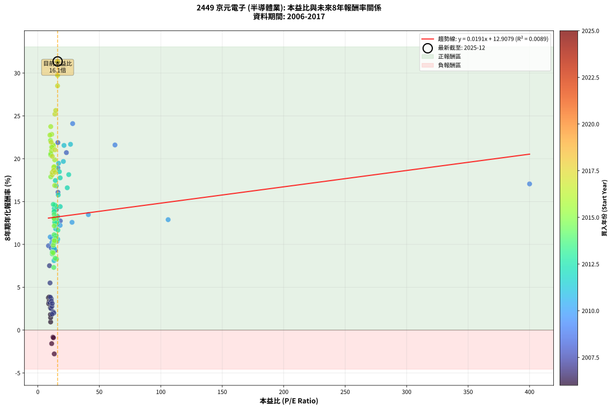
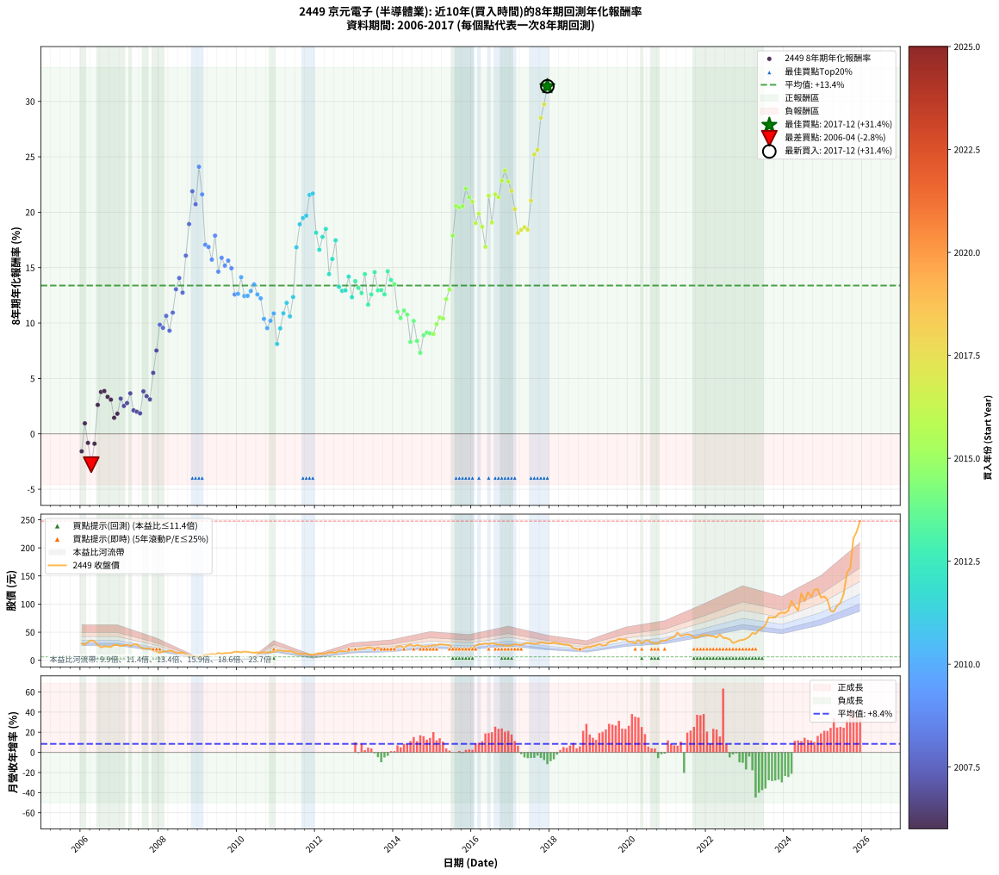

# 2449 京元電子 - 本益比與未來報酬率分析

!!! info "報告資訊"
    - **股票代號**: 2449
    - **公司名稱**: 京元電子
    - **產業別**: 半導體業
    - **分析期間**: 2006-2017 (144 個數據點)
    - **資料來源**: Type 12 (ShowMonthlyK_ChartFlow) 月收盤價與本益比
    - **報酬率口徑**: 含現金股利 (簡化: 年度合計，假設每年7/1入帳)
    - **報告生成時間**: 2026-01-06 22:39:53 CST

## 📈 視覺化圖表

### 圖表1: 本益比 vs 未來報酬率關係

*圖表1：2449 京元電子 本益比與8年期未來報酬率關係 (2006-2017)*

### 圖表2: 歷年買入時點的8年期實際報酬率

*圖表2：2449 京元電子 歷年買入時點的8年期實際報酬率 (2006-2017)*

## 📍 買點訊號說明

本報告提供兩種買點提示訊號（顯示於圖表2的股價子圖中）：

### ▲ 小綠色三角形（回測驗證）
- **計算方式**: 使用全部歷史資料計算本益比第25百分位數
- **用途**: 事後驗證，顯示歷史上哪些時點確實為低估區
- **限制**: 當下無法判斷，僅供回測參考
- **特性**: 後見之明（Look-Ahead Bias）

### ▲ 小橘色三角形（即時訊號）
- **計算方式**: 使用截至當月的過去5年資料計算本益比第25百分位數
- **用途**: 實際投資決策，當時即可判斷
- **優勢**: 可操作性強，符合實務需求
- **特性**: 無後見之明，滾動窗口計算

!!! tip "如何使用兩種訊號"
    - **綠色▲** 幫助理解歷史估值機會，驗證策略有效性
    - **橘色▲** 可作為實際買進參考，但仍需搭配基本面分析
    - 兩種訊號重疊時，表示即時判斷與事後驗證一致，信心度較高
    - 僅有綠色▲時，表示當時無法判斷（需要未來資料才能確認）
    - 僅有橘色▲時，表示即時判斷為買點，但事後可能不是最佳時機

## 📊 估值分析摘要

| 指標 | 數值 |
|:---:|:---:|
| **目前本益比** (2017-12) | **16.09 倍** |
| **歷史平均本益比** | 18.06 倍 |
| **估值水準** | 🟡 合理範圍 |
| **預期8年年化報酬率** | **+13.21%** |
| **歷史平均報酬率** | +13.38% |
| **相關係數 (R²)** | 0.0089 |
| **趨勢線斜率** | 0.0191 |

!!! abstract "核心洞察"
    目前本益比接近歷史平均，預期報酬率符合長期趨勢

    根據歷史數據回測，2449 京元電子 在目前本益比 **16.1倍** 的估值水準下，
    預期未來8年年化報酬率約為 **+13.2%**。

    **重要提醒**: 本分析基於歷史數據統計，實際報酬率會受到公司基本面變化、產業趨勢、
    總體經濟環境等多重因素影響。R² = 0.01 表示本益比可解釋約 0.9% 的報酬率變異。

## 📈 歷史估值統計

### 最佳買點 (最高報酬率)

| 項目 | 數值 |
|:---:|:---:|
| 起始時間 | 2017-12 |
| 當時本益比 | 16.09 倍 |
| 起始價格 | 30.2 元 |
| 8年後價格 | 247.5 元 |
| **8年年化報酬率** | **+31.36%** |

### 最差買點 (最低報酬率)

| 項目 | 數值 |
|:---:|:---:|
| 起始時間 | 2006-04 |
| 當時本益比 | 13.36 倍 |
| 起始價格 | 35.5 元 |
| 8年後價格 | 23.0 元 |
| **8年年化報酬率** | **-2.78%** |

## 🎯 投資啟示

### 本益比與報酬率關係

趨勢線方程式: **y = 0.0191x + 12.9079**

!!! info "弱相關或正相關"
    本益比與未來報酬率相關性較弱。這可能表示該股票的報酬率更多受到
    公司成長性、產業趨勢等因素影響，而非估值水準。**需綜合考量多項指標**。

### 估值區間建議

基於歷史數據分析:

- **🟢 低估區** (P/E < 14.5): 預期報酬率較高，可考慮增加持股
- **🟡 合理區** (P/E 14.5-21.7): 預期報酬率符合長期趨勢，正常持有
- **🔴 高估區** (P/E > 21.7): 預期報酬率較低，可考慮減碼或觀望

!!! danger "風險提示"
    - 過去表現不代表未來結果
    - 本分析假設公司基本面無重大結構性變化
    - 產業環境劇變可能使歷史規律失效
    - 應結合公司財報、產業趨勢、總體經濟等多重因素綜合判斷

!!! success "長期投資觀點"
    歷史數據顯示，在合理或低估的估值水準買入並長期持有，
    往往能獲得較佳的投資報酬。**耐心等待好價格**是價值投資的核心原則。

## 📊 數據品質

- **資料來源**: GoodInfo.tw Type 12 (ShowMonthlyK_ChartFlow)
- **資料頻率**: 月度收盤價與本益比
- **回測期間**: 2006-2017
- **數據點數量**: 144 個 (每個點代表一次8年期回測)

### 計算方法說明

1. **8年期年化報酬率**:
   - 對每個歷史時點，計算其後8年的實際投資報酬率
   - 期末價值(不含股利): 期末價格
   - 期末價值(含現金股利): 期末價格 + 持有期間內的現金股利合計 (簡化: 年度合計，假設每年7/1入帳)
   - 公式: 年化報酬率 = [(期末價值/期初價格)^(1/年數) - 1] × 100%

2. **本益比 (P/E Ratio)**:
   - 使用當時的月收盤價與EPS計算
   - 資料來源: Type 12 月度河流圖本益比數據

3. **趨勢線 (Linear Regression)**:
   - 使用最小平方法擬合線性趨勢線
   - R²值衡量本益比對報酬率的解釋能力

---

*本報告由 Stock Analysis System v1.9.0 自動生成*
*數據更新時間: 2026-01-06 22:39:53 CST*

## 📋 月度回測明細表

（每一列對應時間線圖中的一個買入點；可用來對照 SVG 圖上的每個點。）

| 買入月份 | 賣出月份 | 回測期限_年 | 實際持有年數 | 買入本益比_倍 | 買入收盤價_元 | 賣出收盤價_元 | 現金股利合計_元 | 總報酬率_pct | 年化報酬率_pct |
| --- | --- | --- | --- | --- | --- | --- | --- | --- | --- |
| 2006-01 | 2014-01 | 8 | 8.000 | 11.26 | 29.95 | 21.00 | 5.37 | -11.96 | -1.58 |
| 2006-02 | 2014-02 | 8 | 8.000 | 10.41 | 27.70 | 24.50 | 5.37 | +7.82 | +0.95 |
| 2006-03 | 2014-03 | 8 | 8.000 | 12.29 | 32.70 | 25.25 | 5.37 | -6.37 | -0.82 |
| 2006-04 | 2014-04 | 8 | 8.000 | 13.36 | 35.55 | 23.00 | 5.37 | -20.21 | -2.78 |
| 2006-05 | 2014-05 | 8 | 8.000 | 12.67 | 33.70 | 26.00 | 5.37 | -6.92 | -0.89 |
| 2006-06 | 2014-06 | 8 | 8.000 | 10.23 | 27.20 | 28.05 | 5.37 | +22.86 | +2.61 |
| 2006-07 | 2014-07 | 8 | 8.000 | 8.61 | 22.90 | 24.85 | 5.96 | +34.54 | +3.78 |
| 2006-08 | 2014-08 | 8 | 8.000 | 9.25 | 24.60 | 27.35 | 5.96 | +35.40 | +3.86 |
| 2006-09 | 2014-09 | 8 | 8.000 | 9.21 | 24.50 | 25.90 | 5.96 | +30.04 | +3.34 |
| 2006-10 | 2014-10 | 8 | 8.000 | 8.83 | 23.50 | 24.00 | 5.96 | +27.49 | +3.08 |
| 2006-11 | 2014-11 | 8 | 8.000 | 10.38 | 27.60 | 25.00 | 5.96 | +12.17 | +1.45 |
| 2006-12 | 2014-12 | 8 | 8.000 | 10.23 | 27.20 | 25.45 | 5.96 | +15.47 | +1.81 |
| 2007-01 | 2015-01 | 8 | 8.000 | 9.84 | 25.35 | 26.60 | 5.96 | +28.44 | +3.18 |
| 2007-02 | 2015-02 | 8 | 8.000 | 10.70 | 26.70 | 26.60 | 5.96 | +21.94 | +2.51 |
| 2007-03 | 2015-03 | 8 | 8.000 | 11.46 | 27.65 | 28.45 | 5.96 | +24.44 | +2.77 |
| 2007-04 | 2015-04 | 8 | 8.000 | 10.92 | 25.45 | 27.95 | 5.96 | +33.24 | +3.65 |
| 2007-05 | 2015-05 | 8 | 8.000 | 12.57 | 28.25 | 27.45 | 5.96 | +18.26 | +2.12 |
| 2007-06 | 2015-06 | 8 | 8.000 | 12.98 | 28.10 | 26.95 | 5.96 | +17.11 | +1.99 |
| 2007-07 | 2015-07 | 8 | 8.000 | 11.60 | 24.15 | 21.30 | 6.66 | +15.78 | +1.85 |
| 2007-08 | 2015-08 | 8 | 8.000 | 10.20 | 20.40 | 20.90 | 6.66 | +35.10 | +3.83 |
| 2007-09 | 2015-09 | 8 | 8.000 | 11.00 | 21.10 | 20.90 | 6.66 | +30.62 | +3.40 |
| 2007-10 | 2015-10 | 8 | 8.000 | 11.72 | 21.50 | 20.80 | 6.66 | +27.72 | +3.11 |
| 2007-11 | 2015-11 | 8 | 8.000 | 9.93 | 17.40 | 20.05 | 6.66 | +53.51 | +5.50 |
| 2007-12 | 2015-12 | 8 | 8.000 | 9.46 | 15.80 | 21.55 | 6.66 | +78.54 | +7.51 |
| 2008-01 | 2016-01 | 8 | 8.000 | 8.67 | 13.50 | 21.95 | 6.66 | +111.93 | +9.84 |
| 2008-02 | 2016-02 | 8 | 8.000 | 10.95 | 15.80 | 26.15 | 6.66 | +107.66 | +9.56 |
| 2008-03 | 2016-03 | 8 | 8.000 | 11.80 | 15.70 | 28.60 | 6.66 | +124.59 | +10.64 |
| 2008-04 | 2016-04 | 8 | 8.000 | 14.18 | 17.25 | 28.50 | 6.66 | +103.83 | +9.31 |
| 2008-05 | 2016-05 | 8 | 8.000 | 14.50 | 16.00 | 30.05 | 6.66 | +129.44 | +10.94 |
| 2008-06 | 2016-06 | 8 | 8.000 | 13.33 | 13.20 | 28.55 | 6.66 | +166.74 | +13.05 |
| 2008-07 | 2016-07 | 8 | 8.000 | 15.06 | 13.20 | 30.55 | 7.26 | +186.45 | +14.06 |
| 2008-08 | 2016-08 | 8 | 8.000 | 18.28 | 13.95 | 29.15 | 7.26 | +161.01 | +12.74 |
| 2008-09 | 2016-09 | 8 | 8.000 | 16.38 | 10.65 | 27.85 | 7.26 | +229.68 | +16.08 |
| 2008-10 | 2016-10 | 8 | 8.000 | 16.30 | 8.75 | 27.75 | 7.26 | +300.13 | +18.93 |
| 2008-11 | 2016-11 | 8 | 8.000 | 16.30 | 6.90 | 26.35 | 7.26 | +387.12 | +21.89 |
| 2008-12 | 2016-12 | 8 | 8.000 | 23.23 | 7.20 | 25.20 | 7.26 | +350.85 | +20.71 |
| 2009-01 | 2017-01 | 8 | 8.000 | 28.33 | 6.09 | 27.00 | 7.26 | +462.58 | +24.10 |
| 2009-02 | 2017-02 | 8 | 8.000 | 62.75 | 7.53 | 28.75 | 7.26 | +378.23 | +21.61 |
| 2009-03 | 2017-03 | 8 | 8.000 | 400.00 | 10.00 | 28.00 | 7.26 | +252.61 | +17.06 |
| 2009-04 | 2017-04 | 8 | 8.000 |  | 9.92 | 27.25 | 7.26 | +247.89 | +16.86 |
| 2009-05 | 2017-05 | 8 | 8.000 |  | 11.40 | 29.40 | 7.26 | +221.59 | +15.72 |
| 2009-06 | 2017-06 | 8 | 8.000 |  | 10.30 | 31.15 | 7.26 | +272.92 | +17.88 |
| 2009-07 | 2017-07 | 8 | 8.000 |  | 13.10 | 30.10 | 8.96 | +198.15 | +14.63 |
| 2009-08 | 2017-08 | 8 | 8.000 |  | 11.75 | 29.25 | 8.96 | +225.17 | +15.88 |
| 2009-09 | 2017-09 | 8 | 8.000 |  | 12.50 | 29.75 | 8.96 | +209.66 | +15.18 |
| 2009-10 | 2017-10 | 8 | 8.000 |  | 12.80 | 31.95 | 8.96 | +219.59 | +15.63 |
| 2009-11 | 2017-11 | 8 | 8.000 |  | 13.15 | 31.10 | 8.96 | +204.62 | +14.94 |
| 2009-12 | 2017-12 | 8 | 8.000 |  | 15.20 | 30.25 | 8.96 | +157.94 | +12.57 |
| 2010-01 | 2018-01 | 8 | 8.000 |  | 15.10 | 30.15 | 8.96 | +158.99 | +12.63 |
| 2010-02 | 2018-02 | 8 | 8.000 |  | 14.05 | 31.50 | 8.96 | +187.95 | +14.13 |
| 2010-03 | 2018-03 | 8 | 8.000 |  | 15.45 | 30.50 | 8.96 | +155.39 | +12.43 |
| 2010-04 | 2018-04 | 8 | 8.000 |  | 15.00 | 29.40 | 8.96 | +155.71 | +12.45 |
| 2010-05 | 2018-05 | 8 | 8.000 | 106.00 | 14.05 | 28.10 | 8.96 | +163.75 | +12.89 |
| 2010-06 | 2018-06 | 8 | 8.000 | 41.08 | 13.35 | 27.75 | 8.96 | +174.96 | +13.48 |
| 2010-07 | 2018-07 | 8 | 8.000 | 27.83 | 14.40 | 26.40 | 10.76 | +158.02 | +12.58 |
| 2010-08 | 2018-08 | 8 | 8.000 | 18.17 | 12.90 | 21.70 | 10.76 | +151.59 | +12.22 |
| 2010-09 | 2018-09 | 8 | 8.000 | 15.68 | 14.15 | 20.40 | 10.76 | +120.18 | +10.37 |
| 2010-10 | 2018-10 | 8 | 8.000 | 12.69 | 13.90 | 18.05 | 10.76 | +107.23 | +9.54 |
| 2010-11 | 2018-11 | 8 | 8.000 | 11.34 | 14.60 | 21.00 | 10.76 | +117.50 | +10.20 |
| 2010-12 | 2018-12 | 8 | 8.000 | 10.07 | 14.90 | 23.25 | 10.76 | +128.22 | +10.87 |
| 2011-01 | 2019-01 | 8 | 8.000 | 13.15 | 18.25 | 23.30 | 10.76 | +86.60 | +8.11 |
| 2011-02 | 2019-02 | 8 | 8.000 | 13.42 | 17.40 | 25.25 | 10.76 | +106.93 | +9.52 |
| 2011-03 | 2019-03 | 8 | 8.000 | 13.44 | 16.20 | 26.25 | 10.76 | +128.43 | +10.88 |
| 2011-04 | 2019-04 | 8 | 8.000 | 14.46 | 16.10 | 28.60 | 10.76 | +144.44 | +11.82 |
| 2011-05 | 2019-05 | 8 | 8.000 | 16.20 | 16.55 | 26.30 | 10.76 | +123.90 | +10.60 |
| 2011-06 | 2019-06 | 8 | 8.000 | 15.91 | 14.80 | 26.80 | 10.76 | +153.75 | +12.34 |
| 2011-07 | 2019-07 | 8 | 8.000 | 14.97 | 12.55 | 32.55 | 11.01 | +247.07 | +16.83 |
| 2011-08 | 2019-08 | 8 | 8.000 | 15.13 | 11.30 | 34.15 | 11.01 | +299.62 | +18.91 |
| 2011-09 | 2019-09 | 8 | 8.000 | 16.87 | 11.05 | 34.85 | 11.01 | +315.00 | +19.47 |
| 2011-10 | 2019-10 | 8 | 8.000 | 20.77 | 11.70 | 38.25 | 11.01 | +321.00 | +19.68 |
| 2011-11 | 2019-11 | 8 | 8.000 | 21.31 | 10.05 | 36.90 | 11.01 | +376.69 | +21.56 |
| 2011-12 | 2019-12 | 8 | 8.000 | 26.58 | 10.10 | 37.55 | 11.01 | +380.76 | +21.69 |
| 2012-01 | 2020-01 | 8 | 8.000 | 25.14 | 11.50 | 32.65 | 11.01 | +279.63 | +18.15 |
| 2012-02 | 2020-02 | 8 | 8.000 | 23.93 | 12.80 | 32.75 | 11.01 | +241.85 | +16.61 |
| 2012-03 | 2020-03 | 8 | 8.000 | 18.20 | 11.15 | 30.25 | 11.01 | +270.02 | +17.77 |
| 2012-04 | 2020-04 | 8 | 8.000 | 17.54 | 12.10 | 36.00 | 11.01 | +288.49 | +18.49 |
| 2012-05 | 2020-05 | 8 | 8.000 | 18.24 | 14.00 | 30.10 | 11.01 | +193.62 | +14.41 |
| 2012-06 | 2020-06 | 8 | 8.000 | 16.63 | 14.05 | 34.35 | 11.01 | +222.83 | +15.78 |
| 2012-07 | 2020-07 | 8 | 8.000 | 14.25 | 13.15 | 35.50 | 12.14 | +262.30 | +17.46 |
| 2012-08 | 2020-08 | 8 | 8.000 | 16.00 | 16.00 | 31.20 | 12.14 | +170.89 | +13.27 |
| 2012-09 | 2020-09 | 8 | 8.000 | 14.99 | 16.15 | 30.50 | 12.14 | +164.04 | +12.90 |
| 2012-10 | 2020-10 | 8 | 8.000 | 13.77 | 15.90 | 29.95 | 12.14 | +164.73 | +12.94 |
| 2012-11 | 2020-11 | 8 | 8.000 | 13.35 | 16.45 | 35.40 | 12.14 | +189.01 | +14.19 |
| 2012-12 | 2020-12 | 8 | 8.000 | 14.12 | 18.50 | 34.75 | 12.14 | +153.47 | +12.33 |
| 2013-01 | 2021-01 | 8 | 8.000 | 13.17 | 17.50 | 37.00 | 12.14 | +180.81 | +13.78 |
| 2013-02 | 2021-02 | 8 | 8.000 | 14.33 | 19.30 | 39.80 | 12.14 | +169.13 | +13.17 |
| 2013-03 | 2021-03 | 8 | 8.000 | 15.02 | 20.50 | 41.20 | 12.14 | +160.20 | +12.70 |
| 2013-04 | 2021-04 | 8 | 8.000 | 15.18 | 21.00 | 49.50 | 12.14 | +193.53 | +14.41 |
| 2013-05 | 2021-05 | 8 | 8.000 | 16.34 | 22.90 | 43.20 | 12.14 | +141.67 | +11.66 |
| 2013-06 | 2021-06 | 8 | 8.000 | 15.56 | 22.10 | 44.90 | 12.14 | +158.11 | +12.58 |
| 2013-07 | 2021-07 | 8 | 8.000 | 13.90 | 20.00 | 46.40 | 13.04 | +197.22 | +14.59 |
| 2013-08 | 2021-08 | 8 | 8.000 | 15.21 | 22.15 | 45.60 | 13.04 | +164.76 | +12.94 |
| 2013-09 | 2021-09 | 8 | 8.000 | 13.80 | 20.35 | 40.95 | 13.04 | +165.33 | +12.97 |
| 2013-10 | 2021-10 | 8 | 8.000 | 13.69 | 20.45 | 39.75 | 13.04 | +158.16 | +12.59 |
| 2013-11 | 2021-11 | 8 | 8.000 | 12.54 | 18.95 | 43.60 | 13.04 | +198.91 | +14.67 |
| 2013-12 | 2021-12 | 8 | 8.000 | 13.37 | 20.45 | 44.80 | 13.04 | +182.86 | +13.88 |
| 2014-01 | 2022-01 | 8 | 8.000 | 13.28 | 21.00 | 44.80 | 13.04 | +175.45 | +13.50 |
| 2014-02 | 2022-02 | 8 | 8.000 | 15.00 | 24.50 | 43.50 | 13.04 | +130.79 | +11.02 |
| 2014-03 | 2022-03 | 8 | 8.000 | 14.99 | 25.25 | 42.85 | 13.04 | +121.36 | +10.44 |
| 2014-04 | 2022-04 | 8 | 8.000 | 13.24 | 23.00 | 40.45 | 13.04 | +132.58 | +11.13 |
| 2014-05 | 2022-05 | 8 | 8.000 | 14.54 | 26.00 | 45.85 | 13.04 | +126.52 | +10.76 |
| 2014-06 | 2022-06 | 8 | 8.000 | 15.24 | 28.05 | 40.00 | 13.04 | +89.11 | +8.29 |
| 2014-07 | 2022-07 | 8 | 8.000 | 13.14 | 24.85 | 39.25 | 14.74 | +117.28 | +10.19 |
| 2014-08 | 2022-08 | 8 | 8.000 | 14.07 | 27.35 | 37.35 | 14.74 | +90.47 | +8.39 |
| 2014-09 | 2022-09 | 8 | 8.000 | 12.98 | 25.90 | 30.80 | 14.74 | +75.85 | +7.31 |
| 2014-10 | 2022-10 | 8 | 8.000 | 11.73 | 24.00 | 32.70 | 14.74 | +97.68 | +8.89 |
| 2014-11 | 2022-11 | 8 | 8.000 | 11.91 | 25.00 | 35.55 | 14.74 | +101.18 | +9.13 |
| 2014-12 | 2022-12 | 8 | 8.000 | 11.84 | 25.45 | 36.20 | 14.74 | +100.17 | +9.06 |
| 2015-01 | 2023-01 | 8 | 8.000 | 12.48 | 26.60 | 38.30 | 14.74 | +99.41 | +9.01 |
| 2015-02 | 2023-02 | 8 | 8.000 | 12.59 | 26.60 | 41.85 | 14.74 | +112.76 | +9.90 |
| 2015-03 | 2023-03 | 8 | 8.000 | 13.58 | 28.45 | 48.50 | 14.74 | +122.30 | +10.50 |
| 2015-04 | 2023-04 | 8 | 8.000 | 13.46 | 27.95 | 47.00 | 14.74 | +120.91 | +10.41 |
| 2015-05 | 2023-05 | 8 | 8.000 | 13.34 | 27.45 | 54.00 | 14.74 | +150.43 | +12.16 |
| 2015-06 | 2023-06 | 8 | 8.000 | 13.21 | 26.95 | 57.00 | 14.74 | +166.21 | +13.02 |
| 2015-07 | 2023-07 | 8 | 8.000 | 10.54 | 21.30 | 63.00 | 16.44 | +272.98 | +17.89 |
| 2015-08 | 2023-08 | 8 | 8.000 | 10.43 | 20.90 | 76.80 | 16.44 | +346.14 | +20.55 |
| 2015-09 | 2023-09 | 8 | 8.000 | 10.53 | 20.90 | 76.00 | 16.44 | +342.32 | +20.42 |
| 2015-10 | 2023-10 | 8 | 8.000 | 10.58 | 20.80 | 76.30 | 16.44 | +345.88 | +20.55 |
| 2015-11 | 2023-11 | 8 | 8.000 | 10.29 | 20.05 | 82.80 | 16.44 | +394.98 | +22.13 |
| 2015-12 | 2023-12 | 8 | 8.000 | 11.17 | 21.55 | 84.90 | 16.44 | +370.27 | +21.35 |
| 2016-01 | 2024-01 | 8 | 8.000 | 11.07 | 21.95 | 84.00 | 16.44 | +357.60 | +20.94 |
| 2016-02 | 2024-02 | 8 | 8.000 | 12.85 | 26.15 | 88.80 | 16.44 | +302.46 | +19.01 |
| 2016-03 | 2024-03 | 8 | 8.000 | 13.70 | 28.60 | 105.50 | 16.44 | +326.38 | +19.87 |
| 2016-04 | 2024-04 | 8 | 8.000 | 13.32 | 28.50 | 95.80 | 16.44 | +293.84 | +18.69 |
| 2016-05 | 2024-05 | 8 | 8.000 | 13.71 | 30.05 | 88.20 | 16.44 | +248.23 | +16.88 |
| 2016-06 | 2024-06 | 8 | 8.000 | 12.72 | 28.55 | 119.00 | 16.44 | +374.41 | +21.48 |
| 2016-07 | 2024-07 | 8 | 8.000 | 13.30 | 30.55 | 105.00 | 18.44 | +304.07 | +19.07 |
| 2016-08 | 2024-08 | 8 | 8.000 | 12.40 | 29.15 | 121.00 | 18.44 | +378.37 | +21.61 |
| 2016-09 | 2024-09 | 8 | 8.000 | 11.59 | 27.85 | 112.50 | 18.44 | +370.18 | +21.35 |
| 2016-10 | 2024-10 | 8 | 8.000 | 11.30 | 27.75 | 125.50 | 18.44 | +418.72 | +22.85 |
| 2016-11 | 2024-11 | 8 | 8.000 | 10.51 | 26.35 | 126.50 | 18.44 | +450.07 | +23.75 |
| 2016-12 | 2024-12 | 8 | 8.000 | 9.84 | 25.20 | 111.50 | 18.44 | +415.65 | +22.76 |
| 2017-01 | 2025-01 | 8 | 8.000 | 10.79 | 27.00 | 113.50 | 18.44 | +388.68 | +21.93 |
| 2017-02 | 2025-02 | 8 | 8.000 | 11.75 | 28.75 | 107.50 | 18.44 | +338.07 | +20.28 |
| 2017-03 | 2025-03 | 8 | 8.000 | 11.72 | 28.00 | 87.70 | 18.44 | +279.09 | +18.13 |
| 2017-04 | 2025-04 | 8 | 8.000 | 11.68 | 27.25 | 86.80 | 18.44 | +286.22 | +18.40 |
| 2017-05 | 2025-05 | 8 | 8.000 | 12.91 | 29.40 | 97.00 | 18.44 | +292.67 | +18.65 |
| 2017-06 | 2025-06 | 8 | 8.000 | 14.03 | 31.15 | 102.00 | 18.44 | +286.66 | +18.42 |
| 2017-07 | 2025-07 | 8 | 8.000 | 13.91 | 30.10 | 118.00 | 20.65 | +360.62 | +21.04 |
| 2017-08 | 2025-08 | 8 | 8.000 | 13.88 | 29.25 | 156.00 | 20.65 | +503.92 | +25.21 |
| 2017-09 | 2025-09 | 8 | 8.000 | 14.51 | 29.75 | 164.00 | 20.65 | +520.67 | +25.63 |
| 2017-10 | 2025-10 | 8 | 8.000 | 16.03 | 31.95 | 217.00 | 20.65 | +643.81 | +28.51 |
| 2017-11 | 2025-11 | 8 | 8.000 | 16.06 | 31.10 | 229.00 | 20.65 | +702.73 | +29.74 |
| 2017-12 | 2025-12 | 8 | 8.000 | 16.09 | 30.25 | 247.50 | 20.65 | +786.44 | +31.36 |
