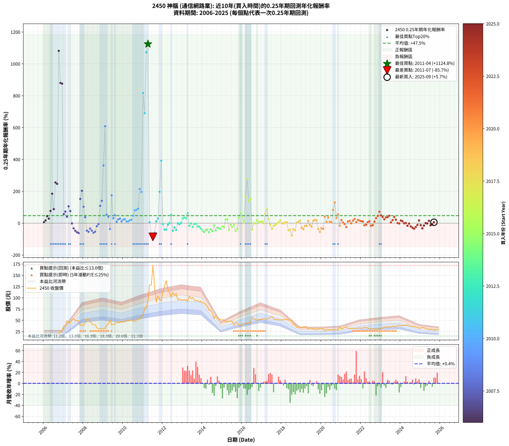

# 2450 神腦 - 本益比與未來報酬率分析

!!! info "報告資訊"
    - **股票代號**: 2450
    - **公司名稱**: 神腦
    - **產業別**: 通信網路業
    - **分析期間**: 2006-2025 (237 個數據點)
    - **資料來源**: Type 12 (ShowMonthlyK_ChartFlow) 月收盤價與本益比
    - **報酬率口徑**: 含現金股利 (簡化: 年度合計，假設每年7/1入帳)
    - **報告生成時間**: 2026-01-06 18:39:07 CST

## 📈 視覺化圖表

### 圖表1: 本益比 vs 未來報酬率關係

*圖表1：2450 神腦 本益比與0.25年期未來報酬率關係 (2006-2025)*

### 圖表2: 歷年買入時點的0.25年期實際報酬率

*圖表2：2450 神腦 歷年買入時點的0.25年期實際報酬率 (2006-2025)*

## 📍 買點訊號說明

本報告提供兩種買點提示訊號（顯示於圖表2的股價子圖中）：

### ▲ 小綠色三角形（回測驗證）
- **計算方式**: 使用全部歷史資料計算本益比第25百分位數
- **用途**: 事後驗證，顯示歷史上哪些時點確實為低估區
- **限制**: 當下無法判斷，僅供回測參考
- **特性**: 後見之明（Look-Ahead Bias）

### ▲ 小橘色三角形（即時訊號）
- **計算方式**: 使用截至當月的過去5年資料計算本益比第25百分位數
- **用途**: 實際投資決策，當時即可判斷
- **優勢**: 可操作性強，符合實務需求
- **特性**: 無後見之明，滾動窗口計算

!!! tip "如何使用兩種訊號"
    - **綠色▲** 幫助理解歷史估值機會，驗證策略有效性
    - **橘色▲** 可作為實際買進參考，但仍需搭配基本面分析
    - 兩種訊號重疊時，表示即時判斷與事後驗證一致，信心度較高
    - 僅有綠色▲時，表示當時無法判斷（需要未來資料才能確認）
    - 僅有橘色▲時，表示即時判斷為買點，但事後可能不是最佳時機

## 📊 估值分析摘要

| 指標 | 數值 |
|:---:|:---:|
| **目前本益比** (2025-09) | **17.17 倍** |
| **歷史平均本益比** | 15.93 倍 |
| **估值水準** | 🟡 合理範圍 |
| **預期0.25年年化報酬率** | **+40.32%** |
| **歷史平均報酬率** | +47.46% |
| **相關係數 (R²)** | 0.0174 |
| **趨勢線斜率** | -5.7553 |

!!! abstract "核心洞察"
    目前本益比接近歷史平均，預期報酬率符合長期趨勢

    根據歷史數據回測，2450 神腦 在目前本益比 **17.2倍** 的估值水準下，
    預期未來0.25年年化報酬率約為 **+40.3%**。

    **重要提醒**: 本分析基於歷史數據統計，實際報酬率會受到公司基本面變化、產業趨勢、
    總體經濟環境等多重因素影響。R² = 0.02 表示本益比可解釋約 1.7% 的報酬率變異。

## 📈 歷史估值統計

### 最佳買點 (最高報酬率)

| 項目 | 數值 |
|:---:|:---:|
| 起始時間 | 2011-04 |
| 當時本益比 | 18.74 倍 |
| 起始價格 | 94.0 元 |
| 0.25年後價格 | 171.5 元 |
| **0.25年年化報酬率** | **+1124.82%** |

### 最差買點 (最低報酬率)

| 項目 | 數值 |
|:---:|:---:|
| 起始時間 | 2011-07 |
| 當時本益比 | 33.16 倍 |
| 起始價格 | 171.5 元 |
| 0.25年後價格 | 105.0 元 |
| **0.25年年化報酬率** | **-85.74%** |

## 🎯 投資啟示

### 本益比與報酬率關係

趨勢線方程式: **y = -5.7553x + 139.1406**

!!! warning "強負相關"
    本益比與未來報酬率呈現強負相關。在高本益比時期買入，未來報酬率顯著較低；
    在低本益比時期買入，未來報酬率顯著較高。**估值紀律至關重要**。

### 估值區間建議

基於歷史數據分析:

- **🟢 低估區** (P/E < 12.7): 預期報酬率較高，可考慮增加持股
- **🟡 合理區** (P/E 12.7-19.1): 預期報酬率符合長期趨勢，正常持有
- **🔴 高估區** (P/E > 19.1): 預期報酬率較低，可考慮減碼或觀望

!!! danger "風險提示"
    - 過去表現不代表未來結果
    - 本分析假設公司基本面無重大結構性變化
    - 產業環境劇變可能使歷史規律失效
    - 應結合公司財報、產業趨勢、總體經濟等多重因素綜合判斷

!!! success "長期投資觀點"
    歷史數據顯示，在合理或低估的估值水準買入並長期持有，
    往往能獲得較佳的投資報酬。**耐心等待好價格**是價值投資的核心原則。

## 📊 數據品質

- **資料來源**: GoodInfo.tw Type 12 (ShowMonthlyK_ChartFlow)
- **資料頻率**: 月度收盤價與本益比
- **回測期間**: 2006-2025
- **數據點數量**: 237 個 (每個點代表一次0.25年期回測)

### 計算方法說明

1. **0.25年期年化報酬率**:
   - 對每個歷史時點，計算其後0.25年的實際投資報酬率
   - 期末價值(不含股利): 期末價格
   - 期末價值(含現金股利): 期末價格 + 持有期間內的現金股利合計 (簡化: 年度合計，假設每年7/1入帳)
   - 公式: 年化報酬率 = [(期末價值/期初價格)^(1/年數) - 1] × 100%

2. **本益比 (P/E Ratio)**:
   - 使用當時的月收盤價與EPS計算
   - 資料來源: Type 12 月度河流圖本益比數據

3. **趨勢線 (Linear Regression)**:
   - 使用最小平方法擬合線性趨勢線
   - R²值衡量本益比對報酬率的解釋能力

---

*本報告由 Stock Analysis System v1.9.0 自動生成*
*數據更新時間: 2026-01-06 18:39:07 CST*

## 📋 月度回測明細表

（每一列對應時間線圖中的一個買入點；可用來對照 SVG 圖上的每個點。）

| 買入月份 | 賣出月份 | 回測期限_年 | 實際持有年數 | 買入本益比_倍 | 買入收盤價_元 | 賣出收盤價_元 | 現金股利合計_元 | 總報酬率_pct | 年化報酬率_pct |
| --- | --- | --- | --- | --- | --- | --- | --- | --- | --- |
| 2006-01 | 2006-05 | 0.25 | 0.329 | 12.24 | 15.55 | 15.85 | 0.00 | +1.93 | +5.99 |
| 2006-02 | 2006-05 | 0.25 | 0.246 | 12.01 | 15.25 | 15.85 | 0.00 | +3.93 | +16.95 |
| 2006-03 | 2006-07 | 0.25 | 0.334 | 12.13 | 15.40 | 17.40 | 0.00 | +12.99 | +44.13 |
| 2006-04 | 2006-07 | 0.25 | 0.249 | 12.87 | 16.35 | 17.40 | 0.00 | +6.42 | +28.38 |
| 2006-05 | 2006-08 | 0.25 | 0.252 | 12.48 | 15.85 | 18.30 | 0.00 | +15.46 | +76.94 |
| 2006-06 | 2006-09 | 0.25 | 0.252 | 12.40 | 15.75 | 20.50 | 0.00 | +30.16 | +184.76 |
| 2006-07 | 2006-10 | 0.25 | 0.252 | 13.70 | 17.40 | 20.40 | 0.00 | +17.24 | +88.04 |
| 2006-08 | 2006-12 | 0.25 | 0.334 | 14.41 | 18.30 | 27.95 | 0.00 | +52.73 | +255.35 |
| 2006-09 | 2006-12 | 0.25 | 0.249 | 16.14 | 20.50 | 27.95 | 0.00 | +36.34 | +247.03 |
| 2006-10 | 2007-01 | 0.25 | 0.252 | 16.06 | 20.40 | 38.00 | 0.00 | +86.27 | +1081.79 |
| 2006-11 | 2007-03 | 0.25 | 0.329 | 18.23 | 23.15 | 49.00 | 0.00 | +111.66 | +879.90 |
| 2006-12 | 2007-03 | 0.25 | 0.246 | 22.01 | 27.95 | 49.00 | 0.00 | +75.31 | +876.07 |
| 2007-01 | 2007-05 | 0.25 | 0.329 | 25.33 | 38.00 | 44.05 | 0.00 | +15.92 | +56.78 |
| 2007-02 | 2007-05 | 0.25 | 0.246 | 22.25 | 38.50 | 44.05 | 0.00 | +14.42 | +72.72 |
| 2007-03 | 2007-07 | 0.25 | 0.334 | 25.00 | 49.00 | 54.00 | 0.90 | +12.03 | +40.53 |
| 2007-04 | 2007-07 | 0.25 | 0.249 | 20.94 | 45.85 | 54.00 | 0.90 | +19.73 | +106.02 |
| 2007-05 | 2007-08 | 0.25 | 0.252 | 18.20 | 44.05 | 49.90 | 0.90 | +15.32 | +76.08 |
| 2007-06 | 2007-09 | 0.25 | 0.252 | 19.09 | 50.60 | 49.50 | 0.90 | -0.40 | -1.58 |
| 2007-07 | 2007-10 | 0.25 | 0.252 | 18.75 | 54.00 | 48.90 | 0.00 | -9.44 | -32.56 |
| 2007-08 | 2007-12 | 0.25 | 0.334 | 16.05 | 49.90 | 40.20 | 0.00 | -19.44 | -47.65 |
| 2007-09 | 2007-12 | 0.25 | 0.249 | 14.82 | 49.50 | 40.20 | 0.00 | -18.79 | -56.62 |
| 2007-10 | 2008-01 | 0.25 | 0.252 | 13.70 | 48.90 | 38.30 | 0.00 | -21.68 | -62.09 |
| 2007-11 | 2008-03 | 0.25 | 0.331 | 10.26 | 39.00 | 53.00 | 0.00 | +35.90 | +152.41 |
| 2007-12 | 2008-03 | 0.25 | 0.249 | 9.98 | 40.20 | 53.00 | 0.00 | +31.84 | +203.28 |
| 2008-01 | 2008-05 | 0.25 | 0.331 | 9.41 | 38.30 | 48.40 | 0.00 | +26.37 | +102.69 |
| 2008-02 | 2008-05 | 0.25 | 0.249 | 10.88 | 44.70 | 48.40 | 0.00 | +8.28 | +37.60 |
| 2008-03 | 2008-07 | 0.25 | 0.334 | 12.79 | 53.00 | 40.00 | 2.95 | -18.96 | -46.71 |
| 2008-04 | 2008-07 | 0.25 | 0.249 | 12.48 | 52.20 | 40.00 | 2.95 | -17.72 | -54.29 |
| 2008-05 | 2008-08 | 0.25 | 0.252 | 11.46 | 48.40 | 40.70 | 2.95 | -9.81 | -33.64 |
| 2008-06 | 2008-09 | 0.25 | 0.252 | 9.95 | 42.40 | 33.20 | 2.95 | -14.74 | -46.91 |
| 2008-07 | 2008-10 | 0.25 | 0.252 | 9.31 | 40.00 | 31.70 | 0.00 | -20.75 | -60.28 |
| 2008-08 | 2008-12 | 0.25 | 0.334 | 9.39 | 40.70 | 31.50 | 0.00 | -22.60 | -53.57 |
| 2008-09 | 2008-12 | 0.25 | 0.249 | 7.59 | 33.20 | 31.50 | 0.00 | -5.12 | -19.02 |
| 2008-10 | 2009-01 | 0.25 | 0.252 | 7.18 | 31.70 | 31.20 | 0.00 | -1.58 | -6.12 |
| 2008-11 | 2009-03 | 0.25 | 0.329 | 6.90 | 30.70 | 39.10 | 0.00 | +27.36 | +108.79 |
| 2008-12 | 2009-03 | 0.25 | 0.246 | 7.02 | 31.50 | 39.10 | 0.00 | +24.13 | +140.40 |
| 2009-01 | 2009-05 | 0.25 | 0.329 | 7.00 | 31.20 | 51.60 | 0.00 | +65.38 | +362.43 |
| 2009-02 | 2009-05 | 0.25 | 0.246 | 7.20 | 31.85 | 51.60 | 0.00 | +62.01 | +608.57 |
| 2009-03 | 2009-07 | 0.25 | 0.334 | 8.91 | 39.10 | 41.20 | 3.95 | +15.48 | +53.86 |
| 2009-04 | 2009-07 | 0.25 | 0.249 | 9.53 | 41.50 | 41.20 | 3.95 | +8.80 | +40.29 |
| 2009-05 | 2009-08 | 0.25 | 0.252 | 11.95 | 51.60 | 42.00 | 3.95 | -10.95 | -36.89 |
| 2009-06 | 2009-09 | 0.25 | 0.252 | 9.25 | 39.65 | 47.20 | 3.95 | +29.01 | +174.90 |
| 2009-07 | 2009-10 | 0.25 | 0.252 | 9.69 | 41.20 | 44.10 | 0.00 | +7.04 | +31.00 |
| 2009-08 | 2009-12 | 0.25 | 0.334 | 9.96 | 42.00 | 48.10 | 0.00 | +14.52 | +50.08 |
| 2009-09 | 2009-12 | 0.25 | 0.249 | 11.29 | 47.20 | 48.10 | 0.00 | +1.91 | +7.88 |
| 2009-10 | 2010-01 | 0.25 | 0.252 | 10.63 | 44.10 | 46.50 | 0.00 | +5.44 | +23.42 |
| 2009-11 | 2010-03 | 0.25 | 0.329 | 11.04 | 45.40 | 49.35 | 0.00 | +8.70 | +28.91 |
| 2009-12 | 2010-03 | 0.25 | 0.246 | 11.79 | 48.10 | 49.35 | 0.00 | +2.60 | +10.97 |
| 2010-01 | 2010-05 | 0.25 | 0.329 | 11.23 | 46.50 | 49.70 | 0.00 | +6.88 | +22.45 |
| 2010-02 | 2010-05 | 0.25 | 0.246 | 11.19 | 47.00 | 49.70 | 0.00 | +5.74 | +25.44 |
| 2010-03 | 2010-07 | 0.25 | 0.334 | 11.58 | 49.35 | 47.65 | 3.46 | +3.57 | +11.06 |
| 2010-04 | 2010-07 | 0.25 | 0.249 | 11.53 | 49.85 | 47.65 | 3.46 | +2.53 | +10.54 |
| 2010-05 | 2010-08 | 0.25 | 0.252 | 11.34 | 49.70 | 48.45 | 3.46 | +4.45 | +18.85 |
| 2010-06 | 2010-09 | 0.25 | 0.252 | 11.61 | 51.60 | 50.70 | 3.46 | +4.96 | +21.20 |
| 2010-07 | 2010-10 | 0.25 | 0.252 | 10.58 | 47.65 | 52.50 | 0.00 | +10.18 | +46.94 |
| 2010-08 | 2010-12 | 0.25 | 0.334 | 10.61 | 48.45 | 59.00 | 0.00 | +21.78 | +80.36 |
| 2010-09 | 2010-12 | 0.25 | 0.249 | 10.96 | 50.70 | 59.00 | 0.00 | +16.37 | +83.77 |
| 2010-10 | 2011-01 | 0.25 | 0.252 | 11.20 | 52.50 | 61.80 | 0.00 | +17.71 | +91.07 |
| 2010-11 | 2011-03 | 0.25 | 0.329 | 11.14 | 52.90 | 77.10 | 0.00 | +45.75 | +214.74 |
| 2010-12 | 2011-03 | 0.25 | 0.246 | 12.27 | 59.00 | 77.10 | 0.00 | +30.68 | +196.20 |
| 2011-01 | 2011-05 | 0.25 | 0.329 | 12.71 | 61.80 | 128.00 | 0.00 | +107.12 | +817.27 |
| 2011-02 | 2011-05 | 0.25 | 0.246 | 15.65 | 76.90 | 128.00 | 0.00 | +66.45 | +690.76 |
| 2011-03 | 2011-07 | 0.25 | 0.334 | 15.53 | 77.10 | 171.50 | 3.98 | +127.59 | +1072.97 |
| 2011-04 | 2011-07 | 0.25 | 0.249 | 18.74 | 94.00 | 171.50 | 3.98 | +86.68 | +1124.82 |
| 2011-05 | 2011-08 | 0.25 | 0.252 | 25.25 | 128.00 | 125.50 | 3.98 | +1.15 | +4.65 |
| 2011-06 | 2011-09 | 0.25 | 0.252 | 25.20 | 129.00 | 90.30 | 3.98 | -26.92 | -71.21 |
| 2011-07 | 2011-10 | 0.25 | 0.252 | 33.16 | 171.50 | 105.00 | 0.00 | -38.78 | -85.74 |
| 2011-08 | 2011-12 | 0.25 | 0.334 | 24.03 | 125.50 | 92.80 | 0.00 | -26.06 | -59.49 |
| 2011-09 | 2011-12 | 0.25 | 0.249 | 17.12 | 90.30 | 92.80 | 0.00 | +2.77 | +11.58 |
| 2011-10 | 2012-01 | 0.25 | 0.252 | 19.71 | 105.00 | 112.00 | 0.00 | +6.67 | +29.20 |
| 2011-11 | 2012-03 | 0.25 | 0.331 | 17.89 | 96.20 | 138.00 | 0.00 | +43.45 | +197.18 |
| 2011-12 | 2012-03 | 0.25 | 0.249 | 17.09 | 92.80 | 138.00 | 0.00 | +48.71 | +391.69 |
| 2012-01 | 2012-05 | 0.25 | 0.331 | 20.51 | 112.00 | 110.00 | 0.00 | -1.79 | -5.29 |
| 2012-02 | 2012-05 | 0.25 | 0.249 | 22.75 | 125.00 | 110.00 | 0.00 | -12.00 | -40.14 |
| 2012-03 | 2012-07 | 0.25 | 0.334 | 24.98 | 138.00 | 112.00 | 4.49 | -15.59 | -39.80 |
| 2012-04 | 2012-07 | 0.25 | 0.249 | 21.51 | 119.50 | 112.00 | 4.49 | -2.52 | -9.75 |
| 2012-05 | 2012-08 | 0.25 | 0.252 | 19.68 | 110.00 | 105.50 | 4.49 | -0.01 | -0.05 |
| 2012-06 | 2012-09 | 0.25 | 0.252 | 18.15 | 102.00 | 109.00 | 4.49 | +11.26 | +52.75 |
| 2012-07 | 2012-10 | 0.25 | 0.252 | 19.82 | 112.00 | 95.20 | 0.00 | -15.00 | -47.55 |
| 2012-08 | 2012-12 | 0.25 | 0.334 | 18.56 | 105.50 | 95.10 | 0.00 | -9.86 | -26.71 |
| 2012-09 | 2012-12 | 0.25 | 0.249 | 19.07 | 109.00 | 95.10 | 0.00 | -12.75 | -42.16 |
| 2012-10 | 2013-01 | 0.25 | 0.252 | 16.57 | 95.20 | 95.00 | 0.00 | -0.21 | -0.83 |
| 2012-11 | 2013-03 | 0.25 | 0.329 | 16.87 | 97.50 | 95.50 | 0.00 | -2.05 | -6.11 |
| 2012-12 | 2013-03 | 0.25 | 0.246 | 16.37 | 95.10 | 95.50 | 0.00 | +0.42 | +1.72 |
| 2013-01 | 2013-05 | 0.25 | 0.329 | 16.41 | 95.00 | 103.50 | 0.00 | +8.95 | +29.80 |
| 2013-02 | 2013-05 | 0.25 | 0.246 | 16.66 | 96.10 | 103.50 | 0.00 | +7.70 | +35.13 |
| 2013-03 | 2013-07 | 0.25 | 0.334 | 16.62 | 95.50 | 100.50 | 3.99 | +9.42 | +30.92 |
| 2013-04 | 2013-07 | 0.25 | 0.249 | 16.14 | 92.40 | 100.50 | 3.99 | +13.09 | +63.83 |
| 2013-05 | 2013-08 | 0.25 | 0.252 | 18.15 | 103.50 | 94.60 | 3.99 | -4.74 | -17.54 |
| 2013-06 | 2013-09 | 0.25 | 0.252 | 17.31 | 98.30 | 94.00 | 3.99 | -0.31 | -1.23 |
| 2013-07 | 2013-10 | 0.25 | 0.252 | 17.76 | 100.50 | 93.80 | 0.00 | -6.67 | -23.96 |
| 2013-08 | 2013-12 | 0.25 | 0.334 | 16.78 | 94.60 | 93.00 | 0.00 | -1.69 | -4.98 |
| 2013-09 | 2013-12 | 0.25 | 0.249 | 16.74 | 94.00 | 93.00 | 0.00 | -1.06 | -4.20 |
| 2013-10 | 2014-01 | 0.25 | 0.252 | 16.77 | 93.80 | 88.80 | 0.00 | -5.33 | -19.55 |
| 2013-11 | 2014-03 | 0.25 | 0.329 | 16.37 | 91.20 | 83.90 | 0.00 | -8.00 | -22.43 |
| 2013-12 | 2014-03 | 0.25 | 0.246 | 16.76 | 93.00 | 83.90 | 0.00 | -9.78 | -34.16 |
| 2014-01 | 2014-05 | 0.25 | 0.329 | 16.87 | 88.80 | 72.00 | 0.00 | -18.92 | -47.18 |
| 2014-02 | 2014-05 | 0.25 | 0.246 | 17.67 | 88.00 | 72.00 | 0.00 | -18.18 | -55.71 |
| 2014-03 | 2014-07 | 0.25 | 0.334 | 17.87 | 83.90 | 65.90 | 4.00 | -16.69 | -42.11 |
| 2014-04 | 2014-07 | 0.25 | 0.249 | 18.03 | 79.50 | 65.90 | 4.00 | -12.08 | -40.34 |
| 2014-05 | 2014-08 | 0.25 | 0.252 | 17.45 | 72.00 | 54.00 | 4.00 | -19.44 | -57.62 |
| 2014-06 | 2014-09 | 0.25 | 0.252 | 18.88 | 72.50 | 60.00 | 4.00 | -11.72 | -39.05 |
| 2014-07 | 2014-10 | 0.25 | 0.252 | 18.54 | 65.90 | 55.50 | 0.00 | -15.78 | -49.43 |
| 2014-08 | 2014-12 | 0.25 | 0.334 | 16.51 | 54.00 | 51.40 | 0.00 | -4.81 | -13.73 |
| 2014-09 | 2014-12 | 0.25 | 0.249 | 20.10 | 60.00 | 51.40 | 0.00 | -14.33 | -46.26 |
| 2014-10 | 2015-01 | 0.25 | 0.252 | 20.56 | 55.50 | 51.10 | 0.00 | -7.93 | -27.96 |
| 2014-11 | 2015-03 | 0.25 | 0.329 | 21.74 | 52.50 | 46.20 | 0.00 | -12.00 | -32.23 |
| 2014-12 | 2015-03 | 0.25 | 0.246 | 24.13 | 51.40 | 46.20 | 0.00 | -10.12 | -35.13 |
| 2015-01 | 2015-05 | 0.25 | 0.329 | 23.05 | 51.10 | 47.50 | 0.00 | -7.05 | -19.94 |
| 2015-02 | 2015-05 | 0.25 | 0.246 | 22.14 | 51.00 | 47.50 | 0.00 | -6.86 | -25.06 |
| 2015-03 | 2015-07 | 0.25 | 0.334 | 19.33 | 46.20 | 47.90 | 1.56 | +7.06 | +22.65 |
| 2015-04 | 2015-07 | 0.25 | 0.249 | 18.90 | 46.80 | 47.90 | 1.56 | +5.68 | +24.84 |
| 2015-05 | 2015-08 | 0.25 | 0.252 | 18.53 | 47.50 | 39.50 | 1.56 | -13.56 | -43.92 |
| 2015-06 | 2015-09 | 0.25 | 0.252 | 18.11 | 48.00 | 45.25 | 1.56 | -2.48 | -9.49 |
| 2015-07 | 2015-10 | 0.25 | 0.252 | 17.50 | 47.90 | 44.70 | 0.00 | -6.68 | -24.00 |
| 2015-08 | 2015-12 | 0.25 | 0.334 | 13.99 | 39.50 | 38.20 | 0.00 | -3.29 | -9.53 |
| 2015-09 | 2015-12 | 0.25 | 0.249 | 15.55 | 45.25 | 38.20 | 0.00 | -15.58 | -49.33 |
| 2015-10 | 2016-01 | 0.25 | 0.252 | 14.92 | 44.70 | 39.80 | 0.00 | -10.96 | -36.93 |
| 2015-11 | 2016-03 | 0.25 | 0.331 | 12.66 | 39.05 | 43.20 | 0.00 | +10.63 | +35.64 |
| 2015-12 | 2016-03 | 0.25 | 0.249 | 12.05 | 38.20 | 43.20 | 0.00 | +13.09 | +63.84 |
| 2016-01 | 2016-05 | 0.25 | 0.331 | 12.28 | 39.80 | 44.35 | 0.00 | +11.43 | +38.65 |
| 2016-02 | 2016-05 | 0.25 | 0.249 | 13.15 | 43.55 | 44.35 | 0.00 | +1.84 | +7.58 |
| 2016-03 | 2016-07 | 0.25 | 0.334 | 12.77 | 43.20 | 57.00 | 3.00 | +38.89 | +167.38 |
| 2016-04 | 2016-07 | 0.25 | 0.249 | 12.48 | 43.10 | 57.00 | 3.00 | +39.21 | +277.28 |
| 2016-05 | 2016-08 | 0.25 | 0.252 | 12.58 | 44.35 | 52.30 | 3.00 | +24.69 | +140.14 |
| 2016-06 | 2016-09 | 0.25 | 0.252 | 12.24 | 44.00 | 52.50 | 3.00 | +26.14 | +151.39 |
| 2016-07 | 2016-10 | 0.25 | 0.252 | 15.55 | 57.00 | 50.00 | 0.00 | -12.28 | -40.56 |
| 2016-08 | 2016-12 | 0.25 | 0.334 | 14.00 | 52.30 | 52.30 | 0.00 | +0.00 | +0.00 |
| 2016-09 | 2016-12 | 0.25 | 0.249 | 13.79 | 52.50 | 52.30 | 0.00 | -0.38 | -1.52 |
| 2016-10 | 2017-01 | 0.25 | 0.252 | 12.89 | 50.00 | 52.20 | 0.00 | +4.40 | +18.64 |
| 2016-11 | 2017-03 | 0.25 | 0.329 | 13.04 | 51.50 | 53.10 | 0.00 | +3.11 | +9.76 |
| 2016-12 | 2017-03 | 0.25 | 0.246 | 13.01 | 52.30 | 53.10 | 0.00 | +1.53 | +6.35 |
| 2017-01 | 2017-05 | 0.25 | 0.329 | 13.18 | 52.20 | 54.00 | 0.00 | +3.45 | +10.87 |
| 2017-02 | 2017-05 | 0.25 | 0.246 | 13.87 | 54.10 | 54.00 | 0.00 | -0.18 | -0.75 |
| 2017-03 | 2017-07 | 0.25 | 0.334 | 13.83 | 53.10 | 58.00 | 3.98 | +16.73 | +58.89 |
| 2017-04 | 2017-07 | 0.25 | 0.249 | 13.99 | 52.90 | 58.00 | 3.98 | +17.17 | +88.88 |
| 2017-05 | 2017-08 | 0.25 | 0.252 | 14.52 | 54.00 | 53.30 | 3.98 | +6.08 | +26.40 |
| 2017-06 | 2017-09 | 0.25 | 0.252 | 15.66 | 57.30 | 51.80 | 3.98 | -2.65 | -10.11 |
| 2017-07 | 2017-10 | 0.25 | 0.252 | 16.11 | 58.00 | 51.80 | 0.00 | -10.69 | -36.16 |
| 2017-08 | 2017-12 | 0.25 | 0.334 | 15.06 | 53.30 | 50.30 | 0.00 | -5.63 | -15.92 |
| 2017-09 | 2017-12 | 0.25 | 0.249 | 14.89 | 51.80 | 50.30 | 0.00 | -2.90 | -11.13 |
| 2017-10 | 2018-01 | 0.25 | 0.252 | 15.15 | 51.80 | 51.30 | 0.00 | -0.97 | -3.78 |
| 2017-11 | 2018-03 | 0.25 | 0.329 | 15.33 | 51.50 | 52.40 | 0.00 | +1.75 | +5.41 |
| 2017-12 | 2018-03 | 0.25 | 0.246 | 15.24 | 50.30 | 52.40 | 0.00 | +4.17 | +18.06 |
| 2018-01 | 2018-05 | 0.25 | 0.329 | 16.25 | 51.30 | 51.40 | 0.00 | +0.19 | +0.59 |
| 2018-02 | 2018-05 | 0.25 | 0.246 | 17.11 | 51.60 | 51.40 | 0.00 | -0.39 | -1.56 |
| 2018-03 | 2018-07 | 0.25 | 0.334 | 18.24 | 52.40 | 49.95 | 3.17 | +1.37 | +4.15 |
| 2018-04 | 2018-07 | 0.25 | 0.249 | 19.16 | 52.30 | 49.95 | 3.17 | +1.56 | +6.41 |
| 2018-05 | 2018-08 | 0.25 | 0.252 | 19.86 | 51.40 | 41.00 | 3.17 | -14.07 | -45.24 |
| 2018-06 | 2018-09 | 0.25 | 0.252 | 20.43 | 49.95 | 40.60 | 3.17 | -12.38 | -40.83 |
| 2018-07 | 2018-10 | 0.25 | 0.252 | 21.69 | 49.95 | 34.40 | 0.00 | -31.13 | -77.25 |
| 2018-08 | 2018-12 | 0.25 | 0.334 | 18.98 | 41.00 | 35.00 | 0.00 | -14.63 | -37.73 |
| 2018-09 | 2018-12 | 0.25 | 0.249 | 20.12 | 40.60 | 35.00 | 0.00 | -13.79 | -44.88 |
| 2018-10 | 2019-01 | 0.25 | 0.252 | 18.35 | 34.40 | 34.70 | 0.00 | +0.87 | +3.51 |
| 2018-11 | 2019-03 | 0.25 | 0.329 | 20.38 | 35.30 | 36.35 | 0.00 | +2.97 | +9.33 |
| 2018-12 | 2019-03 | 0.25 | 0.246 | 22.01 | 35.00 | 36.35 | 0.00 | +3.86 | +16.60 |
| 2019-01 | 2019-05 | 0.25 | 0.329 | 21.82 | 34.70 | 31.05 | 0.00 | -10.52 | -28.70 |
| 2019-02 | 2019-05 | 0.25 | 0.246 | 21.98 | 34.95 | 31.05 | 0.00 | -11.16 | -38.13 |
| 2019-03 | 2019-07 | 0.25 | 0.334 | 22.86 | 36.35 | 32.60 | 1.45 | -6.33 | -17.77 |
| 2019-04 | 2019-07 | 0.25 | 0.249 | 22.39 | 35.60 | 32.60 | 1.45 | -4.35 | -16.36 |
| 2019-05 | 2019-08 | 0.25 | 0.252 | 19.53 | 31.05 | 30.65 | 1.45 | +3.38 | +14.11 |
| 2019-06 | 2019-09 | 0.25 | 0.252 | 20.79 | 33.05 | 30.60 | 1.45 | -3.03 | -11.48 |
| 2019-07 | 2019-10 | 0.25 | 0.252 | 20.50 | 32.60 | 30.60 | 0.00 | -6.13 | -22.23 |
| 2019-08 | 2019-12 | 0.25 | 0.334 | 19.28 | 30.65 | 32.10 | 0.00 | +4.73 | +14.84 |
| 2019-09 | 2019-12 | 0.25 | 0.249 | 19.25 | 30.60 | 32.10 | 0.00 | +4.90 | +21.18 |
| 2019-10 | 2020-01 | 0.25 | 0.252 | 19.25 | 30.60 | 31.90 | 0.00 | +4.25 | +17.96 |
| 2019-11 | 2020-03 | 0.25 | 0.331 | 19.37 | 30.80 | 26.35 | 0.00 | -14.45 | -37.56 |
| 2019-12 | 2020-03 | 0.25 | 0.249 | 20.19 | 32.10 | 26.35 | 0.00 | -17.91 | -54.72 |
| 2020-01 | 2020-05 | 0.25 | 0.331 | 19.96 | 31.90 | 28.15 | 0.00 | -11.76 | -31.44 |
| 2020-02 | 2020-05 | 0.25 | 0.249 | 19.57 | 31.45 | 28.15 | 0.00 | -10.49 | -35.91 |
| 2020-03 | 2020-07 | 0.25 | 0.334 | 16.32 | 26.35 | 28.10 | 1.45 | +12.14 | +40.94 |
| 2020-04 | 2020-07 | 0.25 | 0.249 | 17.93 | 29.10 | 28.10 | 1.45 | +1.55 | +6.35 |
| 2020-05 | 2020-08 | 0.25 | 0.252 | 17.25 | 28.15 | 29.00 | 1.45 | +8.17 | +36.59 |
| 2020-06 | 2020-09 | 0.25 | 0.252 | 18.11 | 29.70 | 28.85 | 1.45 | +2.02 | +8.26 |
| 2020-07 | 2020-10 | 0.25 | 0.252 | 17.05 | 28.10 | 28.50 | 0.00 | +1.42 | +5.77 |
| 2020-08 | 2020-12 | 0.25 | 0.334 | 17.51 | 29.00 | 35.50 | 0.00 | +22.41 | +83.21 |
| 2020-09 | 2020-12 | 0.25 | 0.249 | 17.33 | 28.85 | 35.50 | 0.00 | +23.05 | +129.92 |
| 2020-10 | 2021-01 | 0.25 | 0.252 | 17.03 | 28.50 | 30.60 | 0.00 | +7.37 | +32.61 |
| 2020-11 | 2021-03 | 0.25 | 0.329 | 17.48 | 29.40 | 34.05 | 0.00 | +15.82 | +56.35 |
| 2020-12 | 2021-03 | 0.25 | 0.246 | 21.01 | 35.50 | 34.05 | 0.00 | -4.08 | -15.57 |
| 2021-01 | 2021-05 | 0.25 | 0.329 | 17.57 | 30.60 | 32.45 | 0.00 | +6.05 | +19.56 |
| 2021-02 | 2021-05 | 0.25 | 0.246 | 17.90 | 32.10 | 32.45 | 0.00 | +1.09 | +4.50 |
| 2021-03 | 2021-07 | 0.25 | 0.334 | 18.46 | 34.05 | 31.90 | 1.50 | -1.91 | -5.61 |
| 2021-04 | 2021-07 | 0.25 | 0.249 | 18.90 | 35.85 | 31.90 | 1.50 | -6.83 | -24.73 |
| 2021-05 | 2021-08 | 0.25 | 0.252 | 16.66 | 32.45 | 31.80 | 1.50 | +2.62 | +10.81 |
| 2021-06 | 2021-09 | 0.25 | 0.252 | 15.95 | 31.90 | 31.50 | 1.50 | +3.45 | +14.41 |
| 2021-07 | 2021-10 | 0.25 | 0.252 | 15.55 | 31.90 | 31.85 | 0.00 | -0.16 | -0.62 |
| 2021-08 | 2021-12 | 0.25 | 0.334 | 15.12 | 31.80 | 33.40 | 0.00 | +5.03 | +15.83 |
| 2021-09 | 2021-12 | 0.25 | 0.249 | 14.62 | 31.50 | 33.40 | 0.00 | +6.03 | +26.50 |
| 2021-10 | 2022-01 | 0.25 | 0.252 | 14.43 | 31.85 | 32.35 | 0.00 | +1.57 | +6.38 |
| 2021-11 | 2022-03 | 0.25 | 0.329 | 14.39 | 32.50 | 34.60 | 0.00 | +6.46 | +21.00 |
| 2021-12 | 2022-03 | 0.25 | 0.246 | 14.46 | 33.40 | 34.60 | 0.00 | +3.59 | +15.40 |
| 2022-01 | 2022-05 | 0.25 | 0.329 | 13.88 | 32.35 | 33.65 | 0.00 | +4.02 | +12.74 |
| 2022-02 | 2022-05 | 0.25 | 0.246 | 13.96 | 32.80 | 33.65 | 0.00 | +2.59 | +10.94 |
| 2022-03 | 2022-07 | 0.25 | 0.334 | 14.60 | 34.60 | 31.05 | 2.00 | -4.48 | -12.82 |
| 2022-04 | 2022-07 | 0.25 | 0.249 | 14.18 | 33.90 | 31.05 | 2.00 | -2.51 | -9.69 |
| 2022-05 | 2022-08 | 0.25 | 0.252 | 13.96 | 33.65 | 32.15 | 2.00 | +1.49 | +6.03 |
| 2022-06 | 2022-09 | 0.25 | 0.252 | 12.80 | 31.10 | 30.00 | 2.00 | +2.89 | +11.99 |
| 2022-07 | 2022-10 | 0.25 | 0.252 | 12.67 | 31.05 | 29.75 | 0.00 | -4.19 | -15.62 |
| 2022-08 | 2022-12 | 0.25 | 0.334 | 13.02 | 32.15 | 30.70 | 0.00 | -4.51 | -12.90 |
| 2022-09 | 2022-12 | 0.25 | 0.249 | 12.05 | 30.00 | 30.70 | 0.00 | +2.33 | +9.70 |
| 2022-10 | 2023-01 | 0.25 | 0.252 | 11.85 | 29.75 | 31.85 | 0.00 | +7.06 | +31.10 |
| 2022-11 | 2023-03 | 0.25 | 0.329 | 12.27 | 31.05 | 35.10 | 0.00 | +13.04 | +45.23 |
| 2022-12 | 2023-03 | 0.25 | 0.246 | 12.04 | 30.70 | 35.10 | 0.00 | +14.33 | +72.21 |
| 2023-01 | 2023-05 | 0.25 | 0.329 | 12.42 | 31.85 | 36.30 | 0.00 | +13.97 | +48.89 |
| 2023-02 | 2023-05 | 0.25 | 0.246 | 12.98 | 33.50 | 36.30 | 0.00 | +8.36 | +38.51 |
| 2023-03 | 2023-07 | 0.25 | 0.334 | 13.53 | 35.10 | 35.50 | 2.20 | +7.41 | +23.85 |
| 2023-04 | 2023-07 | 0.25 | 0.249 | 13.37 | 34.90 | 35.50 | 2.20 | +8.02 | +36.31 |
| 2023-05 | 2023-08 | 0.25 | 0.252 | 13.83 | 36.30 | 37.15 | 2.20 | +8.40 | +37.75 |
| 2023-06 | 2023-09 | 0.25 | 0.252 | 13.24 | 34.95 | 36.30 | 2.20 | +10.16 | +46.82 |
| 2023-07 | 2023-10 | 0.25 | 0.252 | 13.37 | 35.50 | 35.95 | 0.00 | +1.27 | +5.13 |
| 2023-08 | 2023-12 | 0.25 | 0.334 | 13.91 | 37.15 | 39.40 | 0.00 | +6.06 | +19.25 |
| 2023-09 | 2023-12 | 0.25 | 0.249 | 13.52 | 36.30 | 39.40 | 0.00 | +8.54 | +38.95 |
| 2023-10 | 2024-01 | 0.25 | 0.252 | 13.31 | 35.95 | 37.80 | 0.00 | +5.15 | +22.05 |
| 2023-11 | 2024-03 | 0.25 | 0.331 | 14.40 | 39.10 | 39.20 | 0.00 | +0.26 | +0.77 |
| 2023-12 | 2024-03 | 0.25 | 0.249 | 14.43 | 39.40 | 39.20 | 0.00 | -0.51 | -2.02 |
| 2024-01 | 2024-05 | 0.25 | 0.331 | 14.23 | 37.80 | 39.80 | 0.00 | +5.29 | +16.84 |
| 2024-02 | 2024-05 | 0.25 | 0.249 | 14.96 | 38.65 | 39.80 | 0.00 | +2.98 | +12.49 |
| 2024-03 | 2024-07 | 0.25 | 0.334 | 15.62 | 39.20 | 37.10 | 2.00 | -0.26 | -0.76 |
| 2024-04 | 2024-07 | 0.25 | 0.249 | 16.01 | 39.00 | 37.10 | 2.00 | +0.26 | +1.03 |
| 2024-05 | 2024-08 | 0.25 | 0.252 | 16.84 | 39.80 | 36.05 | 2.00 | -4.40 | -16.35 |
| 2024-06 | 2024-09 | 0.25 | 0.252 | 16.64 | 38.10 | 35.85 | 2.00 | -0.66 | -2.58 |
| 2024-07 | 2024-10 | 0.25 | 0.252 | 16.74 | 37.10 | 35.05 | 0.00 | -5.53 | -20.20 |
| 2024-08 | 2024-12 | 0.25 | 0.334 | 16.82 | 36.05 | 32.25 | 0.00 | -10.54 | -28.36 |
| 2024-09 | 2024-12 | 0.25 | 0.249 | 17.32 | 35.85 | 32.25 | 0.00 | -10.04 | -34.61 |
| 2024-10 | 2025-01 | 0.25 | 0.252 | 17.55 | 35.05 | 32.70 | 0.00 | -6.70 | -24.08 |
| 2024-11 | 2025-03 | 0.25 | 0.329 | 18.12 | 34.85 | 33.55 | 0.00 | -3.73 | -10.93 |
| 2024-12 | 2025-03 | 0.25 | 0.246 | 17.43 | 32.25 | 33.55 | 0.00 | +4.03 | +17.40 |
| 2025-01 | 2025-05 | 0.25 | 0.329 | 17.88 | 32.70 | 31.35 | 0.00 | -4.13 | -12.04 |
| 2025-02 | 2025-05 | 0.25 | 0.246 | 19.11 | 34.55 | 31.35 | 0.00 | -9.26 | -32.59 |
| 2025-03 | 2025-07 | 0.25 | 0.334 | 18.77 | 33.55 | 30.15 | 1.65 | -5.22 | -14.82 |
| 2025-04 | 2025-07 | 0.25 | 0.249 | 17.97 | 31.75 | 30.15 | 1.65 | +0.16 | +0.63 |
| 2025-05 | 2025-08 | 0.25 | 0.252 | 17.96 | 31.35 | 29.55 | 1.65 | -0.48 | -1.89 |
| 2025-06 | 2025-09 | 0.25 | 0.252 | 16.90 | 29.15 | 28.55 | 1.65 | +3.60 | +15.08 |
| 2025-07 | 2025-10 | 0.25 | 0.252 | 17.69 | 30.15 | 29.05 | 0.00 | -3.65 | -13.72 |
| 2025-08 | 2025-12 | 0.25 | 0.334 | 17.55 | 29.55 | 28.95 | 0.00 | -2.03 | -5.96 |
| 2025-09 | 2025-12 | 0.25 | 0.249 | 17.17 | 28.55 | 28.95 | 0.00 | +1.40 | +5.74 |
