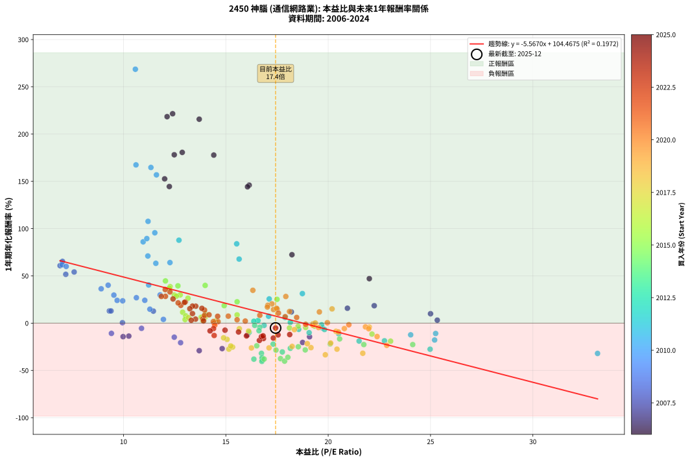
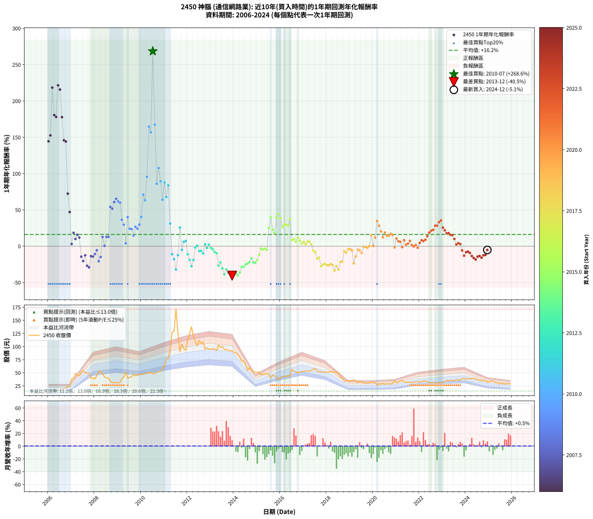

# 2450 神腦 - 本益比與未來報酬率分析

!!! info "報告資訊"
    - **股票代號**: 2450
    - **公司名稱**: 神腦
    - **產業別**: 通信網路業
    - **分析期間**: 2006-2024 (228 個數據點)
    - **資料來源**: Type 12 (ShowMonthlyK_ChartFlow) 月收盤價與本益比
    - **報酬率口徑**: 含現金股利 (簡化: 年度合計，假設每年7/1入帳)
    - **報告生成時間**: 2026-01-06 22:40:13 CST

## 📈 視覺化圖表

### 圖表1: 本益比 vs 未來報酬率關係

*圖表1：2450 神腦 本益比與1年期未來報酬率關係 (2006-2024)*

### 圖表2: 歷年買入時點的1年期實際報酬率

*圖表2：2450 神腦 歷年買入時點的1年期實際報酬率 (2006-2024)*

## 📍 買點訊號說明

本報告提供兩種買點提示訊號（顯示於圖表2的股價子圖中）：

### ▲ 小綠色三角形（回測驗證）
- **計算方式**: 使用全部歷史資料計算本益比第25百分位數
- **用途**: 事後驗證，顯示歷史上哪些時點確實為低估區
- **限制**: 當下無法判斷，僅供回測參考
- **特性**: 後見之明（Look-Ahead Bias）

### ▲ 小橘色三角形（即時訊號）
- **計算方式**: 使用截至當月的過去5年資料計算本益比第25百分位數
- **用途**: 實際投資決策，當時即可判斷
- **優勢**: 可操作性強，符合實務需求
- **特性**: 無後見之明，滾動窗口計算

!!! tip "如何使用兩種訊號"
    - **綠色▲** 幫助理解歷史估值機會，驗證策略有效性
    - **橘色▲** 可作為實際買進參考，但仍需搭配基本面分析
    - 兩種訊號重疊時，表示即時判斷與事後驗證一致，信心度較高
    - 僅有綠色▲時，表示當時無法判斷（需要未來資料才能確認）
    - 僅有橘色▲時，表示即時判斷為買點，但事後可能不是最佳時機

## 📊 估值分析摘要

| 指標 | 數值 |
|:---:|:---:|
| **目前本益比** (2024-12) | **17.43 倍** |
| **歷史平均本益比** | 15.85 倍 |
| **估值水準** | 🟡 合理範圍 |
| **預期1年年化報酬率** | **+7.43%** |
| **歷史平均報酬率** | +16.22% |
| **相關係數 (R²)** | 0.1972 |
| **趨勢線斜率** | -5.5670 |

!!! abstract "核心洞察"
    目前本益比接近歷史平均，預期報酬率符合長期趨勢

    根據歷史數據回測，2450 神腦 在目前本益比 **17.4倍** 的估值水準下，
    預期未來1年年化報酬率約為 **+7.4%**。

    **重要提醒**: 本分析基於歷史數據統計，實際報酬率會受到公司基本面變化、產業趨勢、
    總體經濟環境等多重因素影響。R² = 0.20 表示本益比可解釋約 19.7% 的報酬率變異。

## 📈 歷史估值統計

### 最佳買點 (最高報酬率)

| 項目 | 數值 |
|:---:|:---:|
| 起始時間 | 2010-07 |
| 當時本益比 | 10.58 倍 |
| 起始價格 | 47.6 元 |
| 1年後價格 | 171.5 元 |
| **1年年化報酬率** | **+268.59%** |

### 最差買點 (最低報酬率)

| 項目 | 數值 |
|:---:|:---:|
| 起始時間 | 2013-12 |
| 當時本益比 | 16.76 倍 |
| 起始價格 | 93.0 元 |
| 1年後價格 | 51.4 元 |
| **1年年化報酬率** | **-40.45%** |

## 🎯 投資啟示

### 本益比與報酬率關係

趨勢線方程式: **y = -5.5670x + 104.4675**

!!! warning "強負相關"
    本益比與未來報酬率呈現強負相關。在高本益比時期買入，未來報酬率顯著較低；
    在低本益比時期買入，未來報酬率顯著較高。**估值紀律至關重要**。

### 估值區間建議

基於歷史數據分析:

- **🟢 低估區** (P/E < 12.7): 預期報酬率較高，可考慮增加持股
- **🟡 合理區** (P/E 12.7-19.0): 預期報酬率符合長期趨勢，正常持有
- **🔴 高估區** (P/E > 19.0): 預期報酬率較低，可考慮減碼或觀望

!!! danger "風險提示"
    - 過去表現不代表未來結果
    - 本分析假設公司基本面無重大結構性變化
    - 產業環境劇變可能使歷史規律失效
    - 應結合公司財報、產業趨勢、總體經濟等多重因素綜合判斷

!!! success "長期投資觀點"
    歷史數據顯示，在合理或低估的估值水準買入並長期持有，
    往往能獲得較佳的投資報酬。**耐心等待好價格**是價值投資的核心原則。

## 📊 數據品質

- **資料來源**: GoodInfo.tw Type 12 (ShowMonthlyK_ChartFlow)
- **資料頻率**: 月度收盤價與本益比
- **回測期間**: 2006-2024
- **數據點數量**: 228 個 (每個點代表一次1年期回測)

### 計算方法說明

1. **1年期年化報酬率**:
   - 對每個歷史時點，計算其後1年的實際投資報酬率
   - 期末價值(不含股利): 期末價格
   - 期末價值(含現金股利): 期末價格 + 持有期間內的現金股利合計 (簡化: 年度合計，假設每年7/1入帳)
   - 公式: 年化報酬率 = [(期末價值/期初價格)^(1/年數) - 1] × 100%

2. **本益比 (P/E Ratio)**:
   - 使用當時的月收盤價與EPS計算
   - 資料來源: Type 12 月度河流圖本益比數據

3. **趨勢線 (Linear Regression)**:
   - 使用最小平方法擬合線性趨勢線
   - R²值衡量本益比對報酬率的解釋能力

---

*本報告由 Stock Analysis System v1.9.0 自動生成*
*數據更新時間: 2026-01-06 22:40:13 CST*

## 📋 月度回測明細表

（每一列對應時間線圖中的一個買入點；可用來對照 SVG 圖上的每個點。）

| 買入月份 | 賣出月份 | 回測期限_年 | 實際持有年數 | 買入本益比_倍 | 買入收盤價_元 | 賣出收盤價_元 | 現金股利合計_元 | 總報酬率_pct | 年化報酬率_pct |
| --- | --- | --- | --- | --- | --- | --- | --- | --- | --- |
| 2006-01 | 2007-01 | 1 | 0.999 | 12.24 | 15.55 | 38.00 | 0.00 | +144.37 | +144.52 |
| 2006-02 | 2007-02 | 1 | 0.999 | 12.01 | 15.25 | 38.50 | 0.00 | +152.46 | +152.62 |
| 2006-03 | 2007-03 | 1 | 0.999 | 12.13 | 15.40 | 49.00 | 0.00 | +218.18 | +218.43 |
| 2006-04 | 2007-04 | 1 | 0.999 | 12.87 | 16.35 | 45.85 | 0.00 | +180.43 | +180.63 |
| 2006-05 | 2007-05 | 1 | 0.999 | 12.48 | 15.85 | 44.05 | 0.00 | +177.92 | +178.11 |
| 2006-06 | 2007-06 | 1 | 0.999 | 12.40 | 15.75 | 50.60 | 0.00 | +221.27 | +221.53 |
| 2006-07 | 2007-07 | 1 | 0.999 | 13.70 | 17.40 | 54.00 | 0.90 | +215.50 | +215.75 |
| 2006-08 | 2007-08 | 1 | 0.999 | 14.41 | 18.30 | 49.90 | 0.90 | +177.58 | +177.77 |
| 2006-09 | 2007-09 | 1 | 0.999 | 16.14 | 20.50 | 49.50 | 0.90 | +145.84 | +145.99 |
| 2006-10 | 2007-10 | 1 | 0.999 | 16.06 | 20.40 | 48.90 | 0.90 | +144.10 | +144.25 |
| 2006-11 | 2007-11 | 1 | 0.999 | 18.23 | 23.15 | 39.00 | 0.90 | +72.34 | +72.41 |
| 2006-12 | 2007-12 | 1 | 0.999 | 22.01 | 27.95 | 40.20 | 0.90 | +47.04 | +47.08 |
| 2007-01 | 2008-01 | 1 | 0.999 | 25.33 | 38.00 | 38.30 | 0.90 | +3.15 | +3.15 |
| 2007-02 | 2008-02 | 1 | 0.999 | 22.25 | 38.50 | 44.70 | 0.90 | +18.43 | +18.45 |
| 2007-03 | 2008-03 | 1 | 1.002 | 25.00 | 49.00 | 53.00 | 0.90 | +9.99 | +9.97 |
| 2007-04 | 2008-04 | 1 | 1.002 | 20.94 | 45.85 | 52.20 | 0.90 | +15.81 | +15.77 |
| 2007-05 | 2008-05 | 1 | 1.002 | 18.20 | 44.05 | 48.40 | 0.90 | +11.91 | +11.89 |
| 2007-06 | 2008-06 | 1 | 1.002 | 19.09 | 50.60 | 42.40 | 0.90 | -14.43 | -14.41 |
| 2007-07 | 2008-07 | 1 | 1.002 | 18.75 | 54.00 | 40.00 | 2.95 | -20.46 | -20.43 |
| 2007-08 | 2008-08 | 1 | 1.002 | 16.05 | 49.90 | 40.70 | 2.95 | -12.53 | -12.50 |
| 2007-09 | 2008-09 | 1 | 1.002 | 14.82 | 49.50 | 33.20 | 2.95 | -26.97 | -26.92 |
| 2007-10 | 2008-10 | 1 | 1.002 | 13.70 | 48.90 | 31.70 | 2.95 | -29.14 | -29.09 |
| 2007-11 | 2008-11 | 1 | 1.002 | 10.26 | 39.00 | 30.70 | 2.95 | -13.72 | -13.69 |
| 2007-12 | 2008-12 | 1 | 1.002 | 9.98 | 40.20 | 31.50 | 2.95 | -14.30 | -14.28 |
| 2008-01 | 2009-01 | 1 | 1.002 | 9.41 | 38.30 | 31.20 | 2.95 | -10.84 | -10.81 |
| 2008-02 | 2009-03 | 1 | 1.081 | 10.88 | 44.70 | 39.10 | 2.95 | -5.93 | -5.49 |
| 2008-03 | 2009-03 | 1 | 0.999 | 12.79 | 53.00 | 39.10 | 2.95 | -20.66 | -20.67 |
| 2008-04 | 2009-04 | 1 | 0.999 | 12.48 | 52.20 | 41.50 | 2.95 | -14.85 | -14.86 |
| 2008-05 | 2009-05 | 1 | 0.999 | 11.46 | 48.40 | 51.60 | 2.95 | +12.71 | +12.72 |
| 2008-06 | 2009-06 | 1 | 0.999 | 9.95 | 42.40 | 39.65 | 2.95 | +0.47 | +0.47 |
| 2008-07 | 2009-07 | 1 | 0.999 | 9.31 | 40.00 | 41.20 | 3.95 | +12.88 | +12.89 |
| 2008-08 | 2009-08 | 1 | 0.999 | 9.39 | 40.70 | 42.00 | 3.95 | +12.90 | +12.91 |
| 2008-09 | 2009-09 | 1 | 0.999 | 7.59 | 33.20 | 47.20 | 3.95 | +54.07 | +54.12 |
| 2008-10 | 2009-10 | 1 | 0.999 | 7.18 | 31.70 | 44.10 | 3.95 | +51.58 | +51.63 |
| 2008-11 | 2009-11 | 1 | 0.999 | 6.90 | 30.70 | 45.40 | 3.95 | +60.76 | +60.81 |
| 2008-12 | 2009-12 | 1 | 0.999 | 7.02 | 31.50 | 48.10 | 3.95 | +65.24 | +65.30 |
| 2009-01 | 2010-01 | 1 | 0.999 | 7.00 | 31.20 | 46.50 | 3.95 | +61.71 | +61.76 |
| 2009-02 | 2010-02 | 1 | 0.999 | 7.20 | 31.85 | 47.00 | 3.95 | +59.97 | +60.03 |
| 2009-03 | 2010-03 | 1 | 0.999 | 8.91 | 39.10 | 49.35 | 3.95 | +36.32 | +36.35 |
| 2009-04 | 2010-04 | 1 | 0.999 | 9.53 | 41.50 | 49.85 | 3.95 | +29.64 | +29.67 |
| 2009-05 | 2010-05 | 1 | 0.999 | 11.95 | 51.60 | 49.70 | 3.95 | +3.98 | +3.98 |
| 2009-06 | 2010-06 | 1 | 0.999 | 9.25 | 39.65 | 51.60 | 3.95 | +40.11 | +40.14 |
| 2009-07 | 2010-07 | 1 | 0.999 | 9.69 | 41.20 | 47.65 | 3.46 | +24.05 | +24.07 |
| 2009-08 | 2010-08 | 1 | 0.999 | 9.96 | 42.00 | 48.45 | 3.46 | +23.60 | +23.61 |
| 2009-09 | 2010-09 | 1 | 0.999 | 11.29 | 47.20 | 50.70 | 3.46 | +14.75 | +14.76 |
| 2009-10 | 2010-10 | 1 | 0.999 | 10.63 | 44.10 | 52.50 | 3.46 | +26.89 | +26.91 |
| 2009-11 | 2010-11 | 1 | 0.999 | 11.04 | 45.40 | 52.90 | 3.46 | +24.14 | +24.16 |
| 2009-12 | 2010-12 | 1 | 0.999 | 11.79 | 48.10 | 59.00 | 3.46 | +29.85 | +29.88 |
| 2010-01 | 2011-01 | 1 | 0.999 | 11.23 | 46.50 | 61.80 | 3.46 | +40.34 | +40.38 |
| 2010-02 | 2011-02 | 1 | 0.999 | 11.19 | 47.00 | 76.90 | 3.46 | +70.98 | +71.04 |
| 2010-03 | 2011-03 | 1 | 0.999 | 11.58 | 49.35 | 77.10 | 3.46 | +63.24 | +63.30 |
| 2010-04 | 2011-04 | 1 | 0.999 | 11.53 | 49.85 | 94.00 | 3.46 | +95.51 | +95.60 |
| 2010-05 | 2011-05 | 1 | 0.999 | 11.34 | 49.70 | 128.00 | 3.46 | +164.51 | +164.68 |
| 2010-06 | 2011-06 | 1 | 0.999 | 11.61 | 51.60 | 129.00 | 3.46 | +156.71 | +156.87 |
| 2010-07 | 2011-07 | 1 | 0.999 | 10.58 | 47.65 | 171.50 | 3.98 | +268.26 | +268.59 |
| 2010-08 | 2011-08 | 1 | 0.999 | 10.61 | 48.45 | 125.50 | 3.98 | +167.23 | +167.41 |
| 2010-09 | 2011-09 | 1 | 0.999 | 10.96 | 50.70 | 90.30 | 3.98 | +85.95 | +86.03 |
| 2010-10 | 2011-10 | 1 | 0.999 | 11.20 | 52.50 | 105.00 | 3.98 | +107.57 | +107.68 |
| 2010-11 | 2011-11 | 1 | 0.999 | 11.14 | 52.90 | 96.20 | 3.98 | +89.37 | +89.45 |
| 2010-12 | 2011-12 | 1 | 0.999 | 12.27 | 59.00 | 92.80 | 3.98 | +64.03 | +64.08 |
| 2011-01 | 2012-01 | 1 | 0.999 | 12.71 | 61.80 | 112.00 | 3.98 | +87.66 | +87.74 |
| 2011-02 | 2012-02 | 1 | 0.999 | 15.65 | 76.90 | 125.00 | 3.98 | +67.72 | +67.78 |
| 2011-03 | 2012-03 | 1 | 1.002 | 15.53 | 77.10 | 138.00 | 3.98 | +84.14 | +83.91 |
| 2011-04 | 2012-04 | 1 | 1.002 | 18.74 | 94.00 | 119.50 | 3.98 | +31.36 | +31.28 |
| 2011-05 | 2012-05 | 1 | 1.002 | 25.25 | 128.00 | 110.00 | 3.98 | -10.96 | -10.94 |
| 2011-06 | 2012-06 | 1 | 1.002 | 25.20 | 129.00 | 102.00 | 3.98 | -17.85 | -17.82 |
| 2011-07 | 2012-07 | 1 | 1.002 | 33.16 | 171.50 | 112.00 | 4.49 | -32.08 | -32.02 |
| 2011-08 | 2012-08 | 1 | 1.002 | 24.03 | 125.50 | 105.50 | 4.49 | -12.36 | -12.34 |
| 2011-09 | 2012-09 | 1 | 1.002 | 17.12 | 90.30 | 109.00 | 4.49 | +25.68 | +25.62 |
| 2011-10 | 2012-10 | 1 | 1.002 | 19.71 | 105.00 | 95.20 | 4.49 | -5.06 | -5.05 |
| 2011-11 | 2012-11 | 1 | 1.002 | 17.89 | 96.20 | 97.50 | 4.49 | +6.01 | +6.00 |
| 2011-12 | 2012-12 | 1 | 1.002 | 17.09 | 92.80 | 95.10 | 4.49 | +7.31 | +7.30 |
| 2012-01 | 2013-01 | 1 | 1.002 | 20.51 | 112.00 | 95.00 | 4.49 | -11.17 | -11.15 |
| 2012-02 | 2013-03 | 1 | 1.081 | 22.75 | 125.00 | 95.50 | 4.49 | -20.01 | -18.66 |
| 2012-03 | 2013-03 | 1 | 0.999 | 24.98 | 138.00 | 95.50 | 4.49 | -27.55 | -27.56 |
| 2012-04 | 2013-04 | 1 | 0.999 | 21.51 | 119.50 | 92.40 | 4.49 | -18.92 | -18.94 |
| 2012-05 | 2013-05 | 1 | 0.999 | 19.68 | 110.00 | 103.50 | 4.49 | -1.83 | -1.83 |
| 2012-06 | 2013-06 | 1 | 0.999 | 18.15 | 102.00 | 98.30 | 4.49 | +0.77 | +0.77 |
| 2012-07 | 2013-07 | 1 | 0.999 | 19.82 | 112.00 | 100.50 | 3.99 | -6.70 | -6.71 |
| 2012-08 | 2013-08 | 1 | 0.999 | 18.56 | 105.50 | 94.60 | 3.99 | -6.55 | -6.55 |
| 2012-09 | 2013-09 | 1 | 0.999 | 19.07 | 109.00 | 94.00 | 3.99 | -10.10 | -10.10 |
| 2012-10 | 2013-10 | 1 | 0.999 | 16.57 | 95.20 | 93.80 | 3.99 | +2.72 | +2.73 |
| 2012-11 | 2013-11 | 1 | 0.999 | 16.87 | 97.50 | 91.20 | 3.99 | -2.37 | -2.37 |
| 2012-12 | 2013-12 | 1 | 0.999 | 16.37 | 95.10 | 93.00 | 3.99 | +1.99 | +1.99 |
| 2013-01 | 2014-01 | 1 | 0.999 | 16.41 | 95.00 | 88.80 | 3.99 | -2.32 | -2.32 |
| 2013-02 | 2014-02 | 1 | 0.999 | 16.66 | 96.10 | 88.00 | 3.99 | -4.27 | -4.28 |
| 2013-03 | 2014-03 | 1 | 0.999 | 16.62 | 95.50 | 83.90 | 3.99 | -7.97 | -7.97 |
| 2013-04 | 2014-04 | 1 | 0.999 | 16.14 | 92.40 | 79.50 | 3.99 | -9.64 | -9.65 |
| 2013-05 | 2014-05 | 1 | 0.999 | 18.15 | 103.50 | 72.00 | 3.99 | -26.58 | -26.59 |
| 2013-06 | 2014-06 | 1 | 0.999 | 17.31 | 98.30 | 72.50 | 3.99 | -22.18 | -22.20 |
| 2013-07 | 2014-07 | 1 | 0.999 | 17.76 | 100.50 | 65.90 | 4.00 | -30.45 | -30.47 |
| 2013-08 | 2014-08 | 1 | 0.999 | 16.78 | 94.60 | 54.00 | 4.00 | -38.69 | -38.71 |
| 2013-09 | 2014-09 | 1 | 0.999 | 16.74 | 94.00 | 60.00 | 4.00 | -31.91 | -31.93 |
| 2013-10 | 2014-10 | 1 | 0.999 | 16.77 | 93.80 | 55.50 | 4.00 | -36.57 | -36.59 |
| 2013-11 | 2014-11 | 1 | 0.999 | 16.37 | 91.20 | 52.50 | 4.00 | -38.05 | -38.07 |
| 2013-12 | 2014-12 | 1 | 0.999 | 16.76 | 93.00 | 51.40 | 4.00 | -40.43 | -40.45 |
| 2014-01 | 2015-01 | 1 | 0.999 | 16.87 | 88.80 | 51.10 | 4.00 | -37.95 | -37.97 |
| 2014-02 | 2015-02 | 1 | 0.999 | 17.67 | 88.00 | 51.00 | 4.00 | -37.50 | -37.52 |
| 2014-03 | 2015-03 | 1 | 0.999 | 17.87 | 83.90 | 46.20 | 4.00 | -40.17 | -40.19 |
| 2014-04 | 2015-04 | 1 | 0.999 | 18.03 | 79.50 | 46.80 | 4.00 | -36.10 | -36.12 |
| 2014-05 | 2015-05 | 1 | 0.999 | 17.45 | 72.00 | 47.50 | 4.00 | -28.47 | -28.49 |
| 2014-06 | 2015-06 | 1 | 0.999 | 18.88 | 72.50 | 48.00 | 4.00 | -28.28 | -28.29 |
| 2014-07 | 2015-07 | 1 | 0.999 | 18.54 | 65.90 | 47.90 | 1.56 | -24.95 | -24.96 |
| 2014-08 | 2015-08 | 1 | 0.999 | 16.51 | 54.00 | 39.50 | 1.56 | -23.96 | -23.98 |
| 2014-09 | 2015-09 | 1 | 0.999 | 20.10 | 60.00 | 45.25 | 1.56 | -21.98 | -22.00 |
| 2014-10 | 2015-10 | 1 | 0.999 | 20.56 | 55.50 | 44.70 | 1.56 | -16.65 | -16.66 |
| 2014-11 | 2015-11 | 1 | 0.999 | 21.74 | 52.50 | 39.05 | 1.56 | -22.65 | -22.66 |
| 2014-12 | 2015-12 | 1 | 0.999 | 24.13 | 51.40 | 38.20 | 1.56 | -22.65 | -22.66 |
| 2015-01 | 2016-01 | 1 | 0.999 | 23.05 | 51.10 | 39.80 | 1.56 | -19.06 | -19.07 |
| 2015-02 | 2016-02 | 1 | 0.999 | 22.14 | 51.00 | 43.55 | 1.56 | -11.55 | -11.56 |
| 2015-03 | 2016-03 | 1 | 1.002 | 19.33 | 46.20 | 43.20 | 1.56 | -3.12 | -3.11 |
| 2015-04 | 2016-04 | 1 | 1.002 | 18.90 | 46.80 | 43.10 | 1.56 | -4.57 | -4.56 |
| 2015-05 | 2016-05 | 1 | 1.002 | 18.53 | 47.50 | 44.35 | 1.56 | -3.35 | -3.34 |
| 2015-06 | 2016-06 | 1 | 1.002 | 18.11 | 48.00 | 44.00 | 1.56 | -5.08 | -5.07 |
| 2015-07 | 2016-07 | 1 | 1.002 | 17.50 | 47.90 | 57.00 | 3.00 | +25.26 | +25.20 |
| 2015-08 | 2016-08 | 1 | 1.002 | 13.99 | 39.50 | 52.30 | 3.00 | +40.00 | +39.90 |
| 2015-09 | 2016-09 | 1 | 1.002 | 15.55 | 45.25 | 52.50 | 3.00 | +22.65 | +22.60 |
| 2015-10 | 2016-10 | 1 | 1.002 | 14.92 | 44.70 | 50.00 | 3.00 | +18.57 | +18.53 |
| 2015-11 | 2016-11 | 1 | 1.002 | 12.66 | 39.05 | 51.50 | 3.00 | +39.56 | +39.47 |
| 2015-12 | 2016-12 | 1 | 1.002 | 12.05 | 38.20 | 52.30 | 3.00 | +44.76 | +44.65 |
| 2016-01 | 2017-01 | 1 | 1.002 | 12.28 | 39.80 | 52.20 | 3.00 | +38.69 | +38.60 |
| 2016-02 | 2017-03 | 1 | 1.081 | 13.15 | 43.55 | 53.10 | 3.00 | +28.82 | +26.38 |
| 2016-03 | 2017-03 | 1 | 0.999 | 12.77 | 43.20 | 53.10 | 3.00 | +29.86 | +29.88 |
| 2016-04 | 2017-04 | 1 | 0.999 | 12.48 | 43.10 | 52.90 | 3.00 | +29.70 | +29.72 |
| 2016-05 | 2017-05 | 1 | 0.999 | 12.58 | 44.35 | 54.00 | 3.00 | +28.52 | +28.55 |
| 2016-06 | 2017-06 | 1 | 0.999 | 12.24 | 44.00 | 57.30 | 3.00 | +37.05 | +37.08 |
| 2016-07 | 2017-07 | 1 | 0.999 | 15.55 | 57.00 | 58.00 | 3.98 | +8.74 | +8.75 |
| 2016-08 | 2017-08 | 1 | 0.999 | 14.00 | 52.30 | 53.30 | 3.98 | +9.53 | +9.53 |
| 2016-09 | 2017-09 | 1 | 0.999 | 13.79 | 52.50 | 51.80 | 3.98 | +6.25 | +6.26 |
| 2016-10 | 2017-10 | 1 | 0.999 | 12.89 | 50.00 | 51.80 | 3.98 | +11.56 | +11.57 |
| 2016-11 | 2017-11 | 1 | 0.999 | 13.04 | 51.50 | 51.50 | 3.98 | +7.73 | +7.74 |
| 2016-12 | 2017-12 | 1 | 0.999 | 13.01 | 52.30 | 50.30 | 3.98 | +3.79 | +3.79 |
| 2017-01 | 2018-01 | 1 | 0.999 | 13.18 | 52.20 | 51.30 | 3.98 | +5.90 | +5.91 |
| 2017-02 | 2018-02 | 1 | 0.999 | 13.87 | 54.10 | 51.60 | 3.98 | +2.74 | +2.74 |
| 2017-03 | 2018-03 | 1 | 0.999 | 13.83 | 53.10 | 52.40 | 3.98 | +6.18 | +6.19 |
| 2017-04 | 2018-04 | 1 | 0.999 | 13.99 | 52.90 | 52.30 | 3.98 | +6.39 | +6.40 |
| 2017-05 | 2018-05 | 1 | 0.999 | 14.52 | 54.00 | 51.40 | 3.98 | +2.56 | +2.56 |
| 2017-06 | 2018-06 | 1 | 0.999 | 15.66 | 57.30 | 49.95 | 3.98 | -5.88 | -5.88 |
| 2017-07 | 2018-07 | 1 | 0.999 | 16.11 | 58.00 | 49.95 | 3.17 | -8.42 | -8.43 |
| 2017-08 | 2018-08 | 1 | 0.999 | 15.06 | 53.30 | 41.00 | 3.17 | -17.14 | -17.15 |
| 2017-09 | 2018-09 | 1 | 0.999 | 14.89 | 51.80 | 40.60 | 3.17 | -15.51 | -15.52 |
| 2017-10 | 2018-10 | 1 | 0.999 | 15.15 | 51.80 | 34.40 | 3.17 | -27.48 | -27.49 |
| 2017-11 | 2018-11 | 1 | 0.999 | 15.33 | 51.50 | 35.30 | 3.17 | -25.31 | -25.32 |
| 2017-12 | 2018-12 | 1 | 0.999 | 15.24 | 50.30 | 35.00 | 3.17 | -24.12 | -24.14 |
| 2018-01 | 2019-01 | 1 | 0.999 | 16.25 | 51.30 | 34.70 | 3.17 | -26.19 | -26.20 |
| 2018-02 | 2019-02 | 1 | 0.999 | 17.11 | 51.60 | 34.95 | 3.17 | -26.13 | -26.15 |
| 2018-03 | 2019-03 | 1 | 0.999 | 18.24 | 52.40 | 36.35 | 3.17 | -24.59 | -24.60 |
| 2018-04 | 2019-04 | 1 | 0.999 | 19.16 | 52.30 | 35.60 | 3.17 | -25.88 | -25.89 |
| 2018-05 | 2019-05 | 1 | 0.999 | 19.86 | 51.40 | 31.05 | 3.17 | -33.43 | -33.45 |
| 2018-06 | 2019-06 | 1 | 0.999 | 20.43 | 49.95 | 33.05 | 3.17 | -27.50 | -27.51 |
| 2018-07 | 2019-07 | 1 | 0.999 | 21.69 | 49.95 | 32.60 | 1.45 | -31.83 | -31.85 |
| 2018-08 | 2019-08 | 1 | 0.999 | 18.98 | 41.00 | 30.65 | 1.45 | -21.71 | -21.72 |
| 2018-09 | 2019-09 | 1 | 0.999 | 20.12 | 40.60 | 30.60 | 1.45 | -21.06 | -21.07 |
| 2018-10 | 2019-10 | 1 | 0.999 | 18.35 | 34.40 | 30.60 | 1.45 | -6.83 | -6.84 |
| 2018-11 | 2019-11 | 1 | 0.999 | 20.38 | 35.30 | 30.80 | 1.45 | -8.64 | -8.65 |
| 2018-12 | 2019-12 | 1 | 0.999 | 22.01 | 35.00 | 32.10 | 1.45 | -4.14 | -4.15 |
| 2019-01 | 2020-01 | 1 | 0.999 | 21.82 | 34.70 | 31.90 | 1.45 | -3.89 | -3.89 |
| 2019-02 | 2020-02 | 1 | 0.999 | 21.98 | 34.95 | 31.45 | 1.45 | -5.87 | -5.87 |
| 2019-03 | 2020-03 | 1 | 1.002 | 22.86 | 36.35 | 26.35 | 1.45 | -23.52 | -23.48 |
| 2019-04 | 2020-04 | 1 | 1.002 | 22.39 | 35.60 | 29.10 | 1.45 | -14.19 | -14.16 |
| 2019-05 | 2020-05 | 1 | 1.002 | 19.53 | 31.05 | 28.15 | 1.45 | -4.67 | -4.66 |
| 2019-06 | 2020-06 | 1 | 1.002 | 20.79 | 33.05 | 29.70 | 1.45 | -5.75 | -5.74 |
| 2019-07 | 2020-07 | 1 | 1.002 | 20.50 | 32.60 | 28.10 | 1.45 | -9.36 | -9.34 |
| 2019-08 | 2020-08 | 1 | 1.002 | 19.28 | 30.65 | 29.00 | 1.45 | -0.65 | -0.65 |
| 2019-09 | 2020-09 | 1 | 1.002 | 19.25 | 30.60 | 28.85 | 1.45 | -0.98 | -0.98 |
| 2019-10 | 2020-10 | 1 | 1.002 | 19.25 | 30.60 | 28.50 | 1.45 | -2.12 | -2.12 |
| 2019-11 | 2020-11 | 1 | 1.002 | 19.37 | 30.80 | 29.40 | 1.45 | +0.16 | +0.16 |
| 2019-12 | 2020-12 | 1 | 1.002 | 20.19 | 32.10 | 35.50 | 1.45 | +15.11 | +15.08 |
| 2020-01 | 2021-01 | 1 | 1.002 | 19.96 | 31.90 | 30.60 | 1.45 | +0.47 | +0.47 |
| 2020-02 | 2021-03 | 1 | 1.081 | 19.57 | 31.45 | 34.05 | 1.45 | +12.88 | +11.85 |
| 2020-03 | 2021-03 | 1 | 0.999 | 16.32 | 26.35 | 34.05 | 1.45 | +34.72 | +34.75 |
| 2020-04 | 2021-04 | 1 | 0.999 | 17.93 | 29.10 | 35.85 | 1.45 | +28.18 | +28.20 |
| 2020-05 | 2021-05 | 1 | 0.999 | 17.25 | 28.15 | 32.45 | 1.45 | +20.43 | +20.44 |
| 2020-06 | 2021-06 | 1 | 0.999 | 18.11 | 29.70 | 31.90 | 1.45 | +12.29 | +12.30 |
| 2020-07 | 2021-07 | 1 | 0.999 | 17.05 | 28.10 | 31.90 | 1.50 | +18.86 | +18.88 |
| 2020-08 | 2021-08 | 1 | 0.999 | 17.51 | 29.00 | 31.80 | 1.50 | +14.83 | +14.84 |
| 2020-09 | 2021-09 | 1 | 0.999 | 17.33 | 28.85 | 31.50 | 1.50 | +14.38 | +14.40 |
| 2020-10 | 2021-10 | 1 | 0.999 | 17.03 | 28.50 | 31.85 | 1.50 | +17.02 | +17.03 |
| 2020-11 | 2021-11 | 1 | 0.999 | 17.48 | 29.40 | 32.50 | 1.50 | +15.65 | +15.66 |
| 2020-12 | 2021-12 | 1 | 0.999 | 21.01 | 35.50 | 33.40 | 1.50 | -1.69 | -1.69 |
| 2021-01 | 2022-01 | 1 | 0.999 | 17.57 | 30.60 | 32.35 | 1.50 | +10.62 | +10.63 |
| 2021-02 | 2022-02 | 1 | 0.999 | 17.90 | 32.10 | 32.80 | 1.50 | +6.85 | +6.86 |
| 2021-03 | 2022-03 | 1 | 0.999 | 18.46 | 34.05 | 34.60 | 1.50 | +6.02 | +6.02 |
| 2021-04 | 2022-04 | 1 | 0.999 | 18.90 | 35.85 | 33.90 | 1.50 | -1.26 | -1.26 |
| 2021-05 | 2022-05 | 1 | 0.999 | 16.66 | 32.45 | 33.65 | 1.50 | +8.32 | +8.33 |
| 2021-06 | 2022-06 | 1 | 0.999 | 15.95 | 31.90 | 31.10 | 1.50 | +2.19 | +2.20 |
| 2021-07 | 2022-07 | 1 | 0.999 | 15.55 | 31.90 | 31.05 | 2.00 | +3.61 | +3.61 |
| 2021-08 | 2022-08 | 1 | 0.999 | 15.12 | 31.80 | 32.15 | 2.00 | +7.39 | +7.40 |
| 2021-09 | 2022-09 | 1 | 0.999 | 14.62 | 31.50 | 30.00 | 2.00 | +1.59 | +1.59 |
| 2021-10 | 2022-10 | 1 | 0.999 | 14.43 | 31.85 | 29.75 | 2.00 | -0.31 | -0.31 |
| 2021-11 | 2022-11 | 1 | 0.999 | 14.39 | 32.50 | 31.05 | 2.00 | +1.69 | +1.69 |
| 2021-12 | 2022-12 | 1 | 0.999 | 14.46 | 33.40 | 30.70 | 2.00 | -2.10 | -2.10 |
| 2022-01 | 2023-01 | 1 | 0.999 | 13.88 | 32.35 | 31.85 | 2.00 | +4.64 | +4.64 |
| 2022-02 | 2023-02 | 1 | 0.999 | 13.96 | 32.80 | 33.50 | 2.00 | +8.23 | +8.24 |
| 2022-03 | 2023-03 | 1 | 0.999 | 14.60 | 34.60 | 35.10 | 2.00 | +7.23 | +7.23 |
| 2022-04 | 2023-04 | 1 | 0.999 | 14.18 | 33.90 | 34.90 | 2.00 | +8.85 | +8.86 |
| 2022-05 | 2023-05 | 1 | 0.999 | 13.96 | 33.65 | 36.30 | 2.00 | +13.82 | +13.83 |
| 2022-06 | 2023-06 | 1 | 0.999 | 12.80 | 31.10 | 34.95 | 2.00 | +18.81 | +18.82 |
| 2022-07 | 2023-07 | 1 | 0.999 | 12.67 | 31.05 | 35.50 | 2.20 | +21.42 | +21.43 |
| 2022-08 | 2023-08 | 1 | 0.999 | 13.02 | 32.15 | 37.15 | 2.20 | +22.40 | +22.41 |
| 2022-09 | 2023-09 | 1 | 0.999 | 12.05 | 30.00 | 36.30 | 2.20 | +28.33 | +28.36 |
| 2022-10 | 2023-10 | 1 | 0.999 | 11.85 | 29.75 | 35.95 | 2.20 | +28.24 | +28.26 |
| 2022-11 | 2023-11 | 1 | 0.999 | 12.27 | 31.05 | 39.10 | 2.20 | +33.01 | +33.04 |
| 2022-12 | 2023-12 | 1 | 0.999 | 12.04 | 30.70 | 39.40 | 2.20 | +35.50 | +35.53 |
| 2023-01 | 2024-01 | 1 | 0.999 | 12.42 | 31.85 | 37.80 | 2.20 | +25.59 | +25.61 |
| 2023-02 | 2024-02 | 1 | 0.999 | 12.98 | 33.50 | 38.65 | 2.20 | +21.94 | +21.96 |
| 2023-03 | 2024-03 | 1 | 1.002 | 13.53 | 35.10 | 39.20 | 2.20 | +17.95 | +17.91 |
| 2023-04 | 2024-04 | 1 | 1.002 | 13.37 | 34.90 | 39.00 | 2.20 | +18.05 | +18.01 |
| 2023-05 | 2024-05 | 1 | 1.002 | 13.83 | 36.30 | 39.80 | 2.20 | +15.70 | +15.67 |
| 2023-06 | 2024-06 | 1 | 1.002 | 13.24 | 34.95 | 38.10 | 2.20 | +15.31 | +15.27 |
| 2023-07 | 2024-07 | 1 | 1.002 | 13.37 | 35.50 | 37.10 | 2.00 | +10.14 | +10.12 |
| 2023-08 | 2024-08 | 1 | 1.002 | 13.91 | 37.15 | 36.05 | 2.00 | +2.42 | +2.42 |
| 2023-09 | 2024-09 | 1 | 1.002 | 13.52 | 36.30 | 35.85 | 2.00 | +4.27 | +4.26 |
| 2023-10 | 2024-10 | 1 | 1.002 | 13.31 | 35.95 | 35.05 | 2.00 | +3.06 | +3.05 |
| 2023-11 | 2024-11 | 1 | 1.002 | 14.40 | 39.10 | 34.85 | 2.00 | -5.75 | -5.74 |
| 2023-12 | 2024-12 | 1 | 1.002 | 14.43 | 39.40 | 32.25 | 2.00 | -13.07 | -13.05 |
| 2024-01 | 2025-01 | 1 | 1.002 | 14.23 | 37.80 | 32.70 | 2.00 | -8.20 | -8.18 |
| 2024-02 | 2025-03 | 1 | 1.081 | 14.96 | 38.65 | 33.55 | 2.00 | -8.02 | -7.44 |
| 2024-03 | 2025-03 | 1 | 0.999 | 15.62 | 39.20 | 33.55 | 2.00 | -9.31 | -9.32 |
| 2024-04 | 2025-04 | 1 | 0.999 | 16.01 | 39.00 | 31.75 | 2.00 | -13.46 | -13.47 |
| 2024-05 | 2025-05 | 1 | 0.999 | 16.84 | 39.80 | 31.35 | 2.00 | -16.21 | -16.22 |
| 2024-06 | 2025-06 | 1 | 0.999 | 16.64 | 38.10 | 29.15 | 2.00 | -18.24 | -18.25 |
| 2024-07 | 2025-07 | 1 | 0.999 | 16.74 | 37.10 | 30.15 | 1.65 | -14.29 | -14.29 |
| 2024-08 | 2025-08 | 1 | 0.999 | 16.82 | 36.05 | 29.55 | 1.65 | -13.45 | -13.46 |
| 2024-09 | 2025-09 | 1 | 0.999 | 17.32 | 35.85 | 28.55 | 1.65 | -15.76 | -15.77 |
| 2024-10 | 2025-10 | 1 | 0.999 | 17.55 | 35.05 | 29.05 | 1.65 | -12.41 | -12.42 |
| 2024-11 | 2025-11 | 1 | 0.999 | 18.12 | 34.85 | 29.00 | 1.65 | -12.05 | -12.06 |
| 2024-12 | 2025-12 | 1 | 0.999 | 17.43 | 32.25 | 28.95 | 1.65 | -5.12 | -5.12 |
