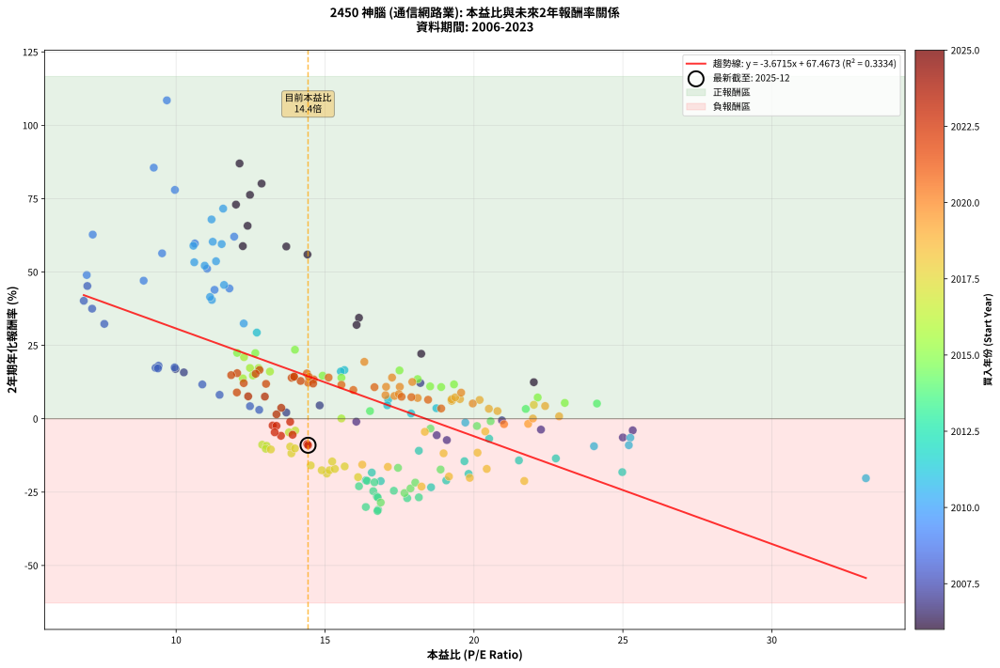
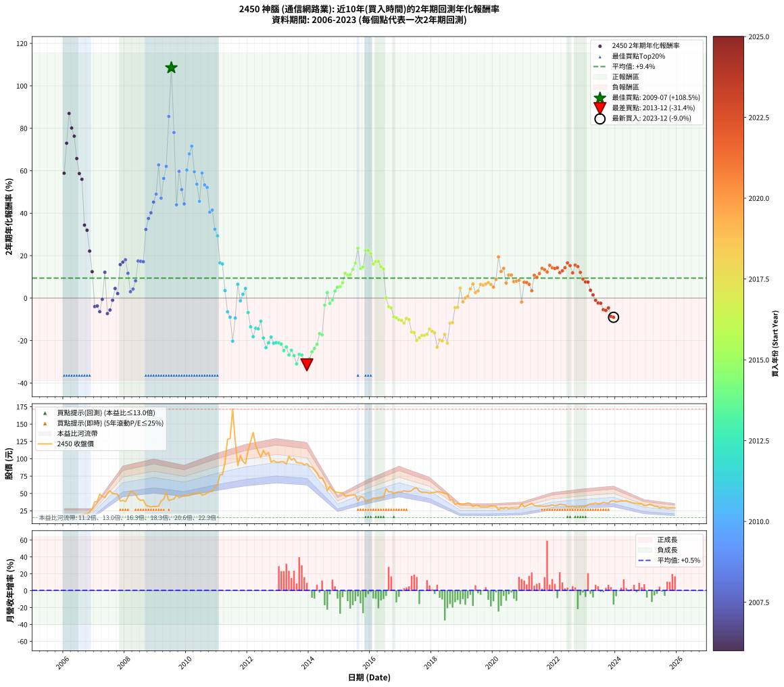

# 2450 神腦 - 本益比與未來報酬率分析

!!! info "報告資訊"
    - **股票代號**: 2450
    - **公司名稱**: 神腦
    - **產業別**: 通信網路業
    - **分析期間**: 2006-2023 (216 個數據點)
    - **資料來源**: Type 12 (ShowMonthlyK_ChartFlow) 月收盤價與本益比
    - **報酬率口徑**: 含現金股利 (簡化: 年度合計，假設每年7/1入帳)
    - **報告生成時間**: 2026-01-11 20:48:40 CST

## 📈 視覺化圖表

### 圖表1: 本益比 vs 未來報酬率關係

*圖表1：2450 神腦 本益比與2年期未來報酬率關係 (2006-2023)*

### 圖表2: 歷年買入時點的2年期實際報酬率

*圖表2：2450 神腦 歷年買入時點的2年期實際報酬率 (2006-2023)*

## 📍 買點訊號說明

本報告提供兩種買點提示訊號（顯示於圖表2的股價子圖中）：

### ▲ 小綠色三角形（回測驗證）
- **計算方式**: 使用全部歷史資料計算本益比第25百分位數
- **用途**: 事後驗證，顯示歷史上哪些時點確實為低估區
- **限制**: 當下無法判斷，僅供回測參考
- **特性**: 後見之明（Look-Ahead Bias）

### ▲ 小橘色三角形（即時訊號）
- **計算方式**: 使用截至當月的過去5年資料計算本益比第25百分位數
- **用途**: 實際投資決策，當時即可判斷
- **優勢**: 可操作性強，符合實務需求
- **特性**: 無後見之明，滾動窗口計算

!!! tip "如何使用兩種訊號"
    - **綠色▲** 幫助理解歷史估值機會，驗證策略有效性
    - **橘色▲** 可作為實際買進參考，但仍需搭配基本面分析
    - 兩種訊號重疊時，表示即時判斷與事後驗證一致，信心度較高
    - 僅有綠色▲時，表示當時無法判斷（需要未來資料才能確認）
    - 僅有橘色▲時，表示即時判斷為買點，但事後可能不是最佳時機

## 📊 估值分析摘要

| 指標 | 數值 |
|:---:|:---:|
| **目前本益比** (2023-12) | **14.43 倍** |
| **歷史平均本益比** | 15.81 倍 |
| **估值水準** | 🟡 合理範圍 |
| **預期2年年化報酬率** | **+14.49%** |
| **歷史平均報酬率** | +9.40% |
| **相關係數 (R²)** | 0.3334 |
| **趨勢線斜率** | -3.6715 |

!!! abstract "核心洞察"
    目前本益比接近歷史平均，預期報酬率符合長期趨勢

    根據歷史數據回測，2450 神腦 在目前本益比 **14.4倍** 的估值水準下，
    預期未來2年年化報酬率約為 **+14.5%**。

    **重要提醒**: 本分析基於歷史數據統計，實際報酬率會受到公司基本面變化、產業趨勢、
    總體經濟環境等多重因素影響。R² = 0.33 表示本益比可解釋約 33.3% 的報酬率變異。

## 📈 歷史估值統計

### 最佳買點 (最高報酬率)

| 項目 | 數值 |
|:---:|:---:|
| 起始時間 | 2009-07 |
| 當時本益比 | 9.69 倍 |
| 起始價格 | 41.2 元 |
| 2年後價格 | 171.5 元 |
| **2年年化報酬率** | **+108.51%** |

### 最差買點 (最低報酬率)

| 項目 | 數值 |
|:---:|:---:|
| 起始時間 | 2013-12 |
| 當時本益比 | 16.76 倍 |
| 起始價格 | 93.0 元 |
| 2年後價格 | 38.2 元 |
| **2年年化報酬率** | **-31.42%** |

## 🎯 投資啟示

### 本益比與報酬率關係

趨勢線方程式: **y = -3.6715x + 67.4673**

!!! warning "強負相關"
    本益比與未來報酬率呈現強負相關。在高本益比時期買入，未來報酬率顯著較低；
    在低本益比時期買入，未來報酬率顯著較高。**估值紀律至關重要**。

### 估值區間建議

基於歷史數據分析:

- **🟢 低估區** (P/E < 12.7): 預期報酬率較高，可考慮增加持股
- **🟡 合理區** (P/E 12.7-19.0): 預期報酬率符合長期趨勢，正常持有
- **🔴 高估區** (P/E > 19.0): 預期報酬率較低，可考慮減碼或觀望

!!! danger "風險提示"
    - 過去表現不代表未來結果
    - 本分析假設公司基本面無重大結構性變化
    - 產業環境劇變可能使歷史規律失效
    - 應結合公司財報、產業趨勢、總體經濟等多重因素綜合判斷

!!! success "長期投資觀點"
    歷史數據顯示，在合理或低估的估值水準買入並長期持有，
    往往能獲得較佳的投資報酬。**耐心等待好價格**是價值投資的核心原則。

## 📊 數據品質

- **資料來源**: GoodInfo.tw Type 12 (ShowMonthlyK_ChartFlow)
- **資料頻率**: 月度收盤價與本益比
- **回測期間**: 2006-2023
- **數據點數量**: 216 個 (每個點代表一次2年期回測)

### 計算方法說明

1. **2年期年化報酬率**:
   - 對每個歷史時點，計算其後2年的實際投資報酬率
   - 期末價值(不含股利): 期末價格
   - 期末價值(含現金股利): 期末價格 + 持有期間內的現金股利合計 (簡化: 年度合計，假設每年7/1入帳)
   - 公式: 年化報酬率 = [(期末價值/期初價格)^(1/年數) - 1] × 100%

2. **本益比 (P/E Ratio)**:
   - 使用當時的月收盤價與EPS計算
   - 資料來源: Type 12 月度河流圖本益比數據

3. **趨勢線 (Linear Regression)**:
   - 使用最小平方法擬合線性趨勢線
   - R²值衡量本益比對報酬率的解釋能力

---

*本報告由 Stock Analysis System v1.9.0 自動生成*
*數據更新時間: 2026-01-11 20:48:40 CST*

## 📋 月度回測明細表

（每一列對應時間線圖中的一個買入點；可用來對照 SVG 圖上的每個點。）

| 買入月份 | 賣出月份 | 回測期限_年 | 實際持有年數 | 買入本益比_倍 | 買入收盤價_元 | 賣出收盤價_元 | 現金股利合計_元 | 總報酬率_pct | 年化報酬率_pct |
| --- | --- | --- | --- | --- | --- | --- | --- | --- | --- |
| 2006-01 | 2008-01 | 2 | 1.999 | 12.24 | 15.55 | 38.30 | 0.90 | +152.07 | +58.82 |
| 2006-02 | 2008-02 | 2 | 1.999 | 12.01 | 15.25 | 44.70 | 0.90 | +199.00 | +72.98 |
| 2006-03 | 2008-03 | 2 | 2.001 | 12.13 | 15.40 | 53.00 | 0.90 | +249.98 | +87.00 |
| 2006-04 | 2008-04 | 2 | 2.001 | 12.87 | 16.35 | 52.20 | 0.90 | +224.75 | +80.14 |
| 2006-05 | 2008-05 | 2 | 2.001 | 12.48 | 15.85 | 48.40 | 0.90 | +211.02 | +76.29 |
| 2006-06 | 2008-06 | 2 | 2.001 | 12.40 | 15.75 | 42.40 | 0.90 | +174.90 | +65.74 |
| 2006-07 | 2008-07 | 2 | 2.001 | 13.70 | 17.40 | 40.00 | 3.85 | +151.99 | +58.69 |
| 2006-08 | 2008-08 | 2 | 2.001 | 14.41 | 18.30 | 40.70 | 3.85 | +143.43 | +55.97 |
| 2006-09 | 2008-09 | 2 | 2.001 | 16.14 | 20.50 | 33.20 | 3.85 | +80.72 | +34.40 |
| 2006-10 | 2008-10 | 2 | 2.001 | 16.06 | 20.40 | 31.70 | 3.85 | +74.25 | +31.98 |
| 2006-11 | 2008-11 | 2 | 2.001 | 18.23 | 23.15 | 30.70 | 3.85 | +49.23 | +22.14 |
| 2006-12 | 2008-12 | 2 | 2.001 | 22.01 | 27.95 | 31.50 | 3.85 | +26.47 | +12.45 |
| 2007-01 | 2009-01 | 2 | 2.001 | 25.33 | 38.00 | 31.20 | 3.85 | -7.77 | -3.96 |
| 2007-02 | 2009-02 | 2 | 2.001 | 22.25 | 38.50 | 31.85 | 3.85 | -7.28 | -3.71 |
| 2007-03 | 2009-03 | 2 | 2.001 | 25.00 | 49.00 | 39.10 | 3.85 | -12.35 | -6.38 |
| 2007-04 | 2009-04 | 2 | 2.001 | 20.94 | 45.85 | 41.50 | 3.85 | -1.10 | -0.55 |
| 2007-05 | 2009-05 | 2 | 2.001 | 18.20 | 44.05 | 51.60 | 3.85 | +25.87 | +12.18 |
| 2007-06 | 2009-06 | 2 | 2.001 | 19.09 | 50.60 | 39.65 | 3.85 | -14.04 | -7.28 |
| 2007-07 | 2009-07 | 2 | 2.001 | 18.75 | 54.00 | 41.20 | 6.90 | -10.92 | -5.62 |
| 2007-08 | 2009-08 | 2 | 2.001 | 16.05 | 49.90 | 42.00 | 6.90 | -2.00 | -1.00 |
| 2007-09 | 2009-09 | 2 | 2.001 | 14.82 | 49.50 | 47.20 | 6.90 | +9.30 | +4.54 |
| 2007-10 | 2009-10 | 2 | 2.001 | 13.70 | 48.90 | 44.10 | 6.90 | +4.30 | +2.13 |
| 2007-11 | 2009-11 | 2 | 2.001 | 10.26 | 39.00 | 45.40 | 6.90 | +34.11 | +15.79 |
| 2007-12 | 2009-12 | 2 | 2.001 | 9.98 | 40.20 | 48.10 | 6.90 | +36.82 | +16.96 |
| 2008-01 | 2010-01 | 2 | 2.001 | 9.41 | 38.30 | 46.50 | 6.90 | +39.43 | +18.07 |
| 2008-02 | 2010-03 | 2 | 2.081 | 10.88 | 44.70 | 49.35 | 6.90 | +25.84 | +11.68 |
| 2008-03 | 2010-03 | 2 | 1.999 | 12.79 | 53.00 | 49.35 | 6.90 | +6.14 | +3.02 |
| 2008-04 | 2010-04 | 2 | 1.999 | 12.48 | 52.20 | 49.85 | 6.90 | +8.72 | +4.27 |
| 2008-05 | 2010-05 | 2 | 1.999 | 11.46 | 48.40 | 49.70 | 6.90 | +16.95 | +8.15 |
| 2008-06 | 2010-06 | 2 | 1.999 | 9.95 | 42.40 | 51.60 | 6.90 | +37.98 | +17.48 |
| 2008-07 | 2010-07 | 2 | 1.999 | 9.31 | 40.00 | 47.65 | 7.41 | +37.65 | +17.34 |
| 2008-08 | 2010-08 | 2 | 1.999 | 9.39 | 40.70 | 48.45 | 7.41 | +37.25 | +17.17 |
| 2008-09 | 2010-09 | 2 | 1.999 | 7.59 | 33.20 | 50.70 | 7.41 | +75.04 | +32.33 |
| 2008-10 | 2010-10 | 2 | 1.999 | 7.18 | 31.70 | 52.50 | 7.41 | +89.00 | +37.51 |
| 2008-11 | 2010-11 | 2 | 1.999 | 6.90 | 30.70 | 52.90 | 7.41 | +96.46 | +40.20 |
| 2008-12 | 2010-12 | 2 | 1.999 | 7.02 | 31.50 | 59.00 | 7.41 | +110.83 | +45.24 |
| 2009-01 | 2011-01 | 2 | 1.999 | 7.00 | 31.20 | 61.80 | 7.41 | +121.83 | +48.98 |
| 2009-02 | 2011-02 | 2 | 1.999 | 7.20 | 31.85 | 76.90 | 7.41 | +164.72 | +62.76 |
| 2009-03 | 2011-03 | 2 | 1.999 | 8.91 | 39.10 | 77.10 | 7.41 | +116.14 | +47.06 |
| 2009-04 | 2011-04 | 2 | 1.999 | 9.53 | 41.50 | 94.00 | 7.41 | +144.37 | +56.37 |
| 2009-05 | 2011-05 | 2 | 1.999 | 11.95 | 51.60 | 128.00 | 7.41 | +162.43 | +62.05 |
| 2009-06 | 2011-06 | 2 | 1.999 | 9.25 | 39.65 | 129.00 | 7.41 | +244.04 | +85.56 |
| 2009-07 | 2011-07 | 2 | 1.999 | 9.69 | 41.20 | 171.50 | 7.44 | +334.31 | +108.51 |
| 2009-08 | 2011-08 | 2 | 1.999 | 9.96 | 42.00 | 125.50 | 7.44 | +216.51 | +77.98 |
| 2009-09 | 2011-09 | 2 | 1.999 | 11.29 | 47.20 | 90.30 | 7.44 | +107.07 | +43.93 |
| 2009-10 | 2011-10 | 2 | 1.999 | 10.63 | 44.10 | 105.00 | 7.44 | +154.95 | +59.72 |
| 2009-11 | 2011-11 | 2 | 1.999 | 11.04 | 45.40 | 96.20 | 7.44 | +128.27 | +51.13 |
| 2009-12 | 2011-12 | 2 | 1.999 | 11.79 | 48.10 | 92.80 | 7.44 | +108.39 | +44.39 |
| 2010-01 | 2012-01 | 2 | 1.999 | 11.23 | 46.50 | 112.00 | 7.44 | +156.85 | +60.32 |
| 2010-02 | 2012-02 | 2 | 1.999 | 11.19 | 47.00 | 125.00 | 7.44 | +181.78 | +67.92 |
| 2010-03 | 2012-03 | 2 | 2.001 | 11.58 | 49.35 | 138.00 | 7.44 | +194.70 | +71.61 |
| 2010-04 | 2012-04 | 2 | 2.001 | 11.53 | 49.85 | 119.50 | 7.44 | +154.63 | +59.52 |
| 2010-05 | 2012-05 | 2 | 2.001 | 11.34 | 49.70 | 110.00 | 7.44 | +136.29 | +53.67 |
| 2010-06 | 2012-06 | 2 | 2.001 | 11.61 | 51.60 | 102.00 | 7.44 | +112.08 | +45.59 |
| 2010-07 | 2012-07 | 2 | 2.001 | 10.58 | 47.65 | 112.00 | 8.46 | +152.80 | +58.95 |
| 2010-08 | 2012-08 | 2 | 2.001 | 10.61 | 48.45 | 105.50 | 8.46 | +135.21 | +53.32 |
| 2010-09 | 2012-09 | 2 | 2.001 | 10.96 | 50.70 | 109.00 | 8.46 | +131.68 | +52.17 |
| 2010-10 | 2012-10 | 2 | 2.001 | 11.20 | 52.50 | 95.20 | 8.46 | +97.45 | +40.48 |
| 2010-11 | 2012-11 | 2 | 2.001 | 11.14 | 52.90 | 97.50 | 8.46 | +100.30 | +41.49 |
| 2010-12 | 2012-12 | 2 | 2.001 | 12.27 | 59.00 | 95.10 | 8.46 | +75.53 | +32.46 |
| 2011-01 | 2013-01 | 2 | 2.001 | 12.71 | 61.80 | 95.00 | 8.46 | +67.41 | +29.36 |
| 2011-02 | 2013-02 | 2 | 2.001 | 15.65 | 76.90 | 96.10 | 8.46 | +35.97 | +16.59 |
| 2011-03 | 2013-03 | 2 | 2.001 | 15.53 | 77.10 | 95.50 | 8.46 | +34.84 | +16.11 |
| 2011-04 | 2013-04 | 2 | 2.001 | 18.74 | 94.00 | 92.40 | 8.46 | +7.30 | +3.58 |
| 2011-05 | 2013-05 | 2 | 2.001 | 25.25 | 128.00 | 103.50 | 8.46 | -12.53 | -6.47 |
| 2011-06 | 2013-06 | 2 | 2.001 | 25.20 | 129.00 | 98.30 | 8.46 | -17.24 | -9.02 |
| 2011-07 | 2013-07 | 2 | 2.001 | 33.16 | 171.50 | 100.50 | 8.48 | -36.46 | -20.27 |
| 2011-08 | 2013-08 | 2 | 2.001 | 24.03 | 125.50 | 94.60 | 8.48 | -17.87 | -9.37 |
| 2011-09 | 2013-09 | 2 | 2.001 | 17.12 | 90.30 | 94.00 | 8.48 | +13.49 | +6.53 |
| 2011-10 | 2013-10 | 2 | 2.001 | 19.71 | 105.00 | 93.80 | 8.48 | -2.59 | -1.30 |
| 2011-11 | 2013-11 | 2 | 2.001 | 17.89 | 96.20 | 91.20 | 8.48 | +3.62 | +1.79 |
| 2011-12 | 2013-12 | 2 | 2.001 | 17.09 | 92.80 | 93.00 | 8.48 | +9.35 | +4.57 |
| 2012-01 | 2014-01 | 2 | 2.001 | 20.51 | 112.00 | 88.80 | 8.48 | -13.14 | -6.80 |
| 2012-02 | 2014-03 | 2 | 2.081 | 22.75 | 125.00 | 83.90 | 8.48 | -26.10 | -13.53 |
| 2012-03 | 2014-03 | 2 | 1.999 | 24.98 | 138.00 | 83.90 | 8.48 | -33.06 | -18.19 |
| 2012-04 | 2014-04 | 2 | 1.999 | 21.51 | 119.50 | 79.50 | 8.48 | -26.38 | -14.21 |
| 2012-05 | 2014-05 | 2 | 1.999 | 19.68 | 110.00 | 72.00 | 8.48 | -26.84 | -14.47 |
| 2012-06 | 2014-06 | 2 | 1.999 | 18.15 | 102.00 | 72.50 | 8.48 | -20.61 | -10.91 |
| 2012-07 | 2014-07 | 2 | 1.999 | 19.82 | 112.00 | 65.90 | 7.99 | -34.02 | -18.79 |
| 2012-08 | 2014-08 | 2 | 1.999 | 18.56 | 105.50 | 54.00 | 7.99 | -41.24 | -23.36 |
| 2012-09 | 2014-09 | 2 | 1.999 | 19.07 | 109.00 | 60.00 | 7.99 | -37.62 | -21.03 |
| 2012-10 | 2014-10 | 2 | 1.999 | 16.57 | 95.20 | 55.50 | 7.99 | -33.31 | -18.34 |
| 2012-11 | 2014-11 | 2 | 1.999 | 16.87 | 97.50 | 52.50 | 7.99 | -37.96 | -21.24 |
| 2012-12 | 2014-12 | 2 | 1.999 | 16.37 | 95.10 | 51.40 | 7.99 | -37.55 | -20.99 |
| 2013-01 | 2015-01 | 2 | 1.999 | 16.41 | 95.00 | 51.10 | 7.99 | -37.80 | -21.14 |
| 2013-02 | 2015-02 | 2 | 1.999 | 16.66 | 96.10 | 51.00 | 7.99 | -38.61 | -21.66 |
| 2013-03 | 2015-03 | 2 | 1.999 | 16.62 | 95.50 | 46.20 | 7.99 | -43.25 | -24.68 |
| 2013-04 | 2015-04 | 2 | 1.999 | 16.14 | 92.40 | 46.80 | 7.99 | -40.70 | -23.01 |
| 2013-05 | 2015-05 | 2 | 1.999 | 18.15 | 103.50 | 47.50 | 7.99 | -46.38 | -26.79 |
| 2013-06 | 2015-06 | 2 | 1.999 | 17.31 | 98.30 | 48.00 | 7.99 | -43.04 | -24.54 |
| 2013-07 | 2015-07 | 2 | 1.999 | 17.76 | 100.50 | 47.90 | 5.56 | -46.81 | -27.08 |
| 2013-08 | 2015-08 | 2 | 1.999 | 16.78 | 94.60 | 39.50 | 5.56 | -52.37 | -31.00 |
| 2013-09 | 2015-09 | 2 | 1.999 | 16.74 | 94.00 | 45.25 | 5.56 | -45.95 | -26.49 |
| 2013-10 | 2015-10 | 2 | 1.999 | 16.77 | 93.80 | 44.70 | 5.56 | -46.42 | -26.82 |
| 2013-11 | 2015-11 | 2 | 1.999 | 16.37 | 91.20 | 39.05 | 5.56 | -51.09 | -30.08 |
| 2013-12 | 2015-12 | 2 | 1.999 | 16.76 | 93.00 | 38.20 | 5.56 | -52.95 | -31.42 |
| 2014-01 | 2016-01 | 2 | 1.999 | 16.87 | 88.80 | 39.80 | 5.56 | -48.92 | -28.55 |
| 2014-02 | 2016-02 | 2 | 1.999 | 17.67 | 88.00 | 43.55 | 5.56 | -44.19 | -25.31 |
| 2014-03 | 2016-03 | 2 | 2.001 | 17.87 | 83.90 | 43.20 | 5.56 | -41.88 | -23.75 |
| 2014-04 | 2016-04 | 2 | 2.001 | 18.03 | 79.50 | 43.10 | 5.56 | -38.79 | -21.75 |
| 2014-05 | 2016-05 | 2 | 2.001 | 17.45 | 72.00 | 44.35 | 5.56 | -30.68 | -16.73 |
| 2014-06 | 2016-06 | 2 | 2.001 | 18.88 | 72.50 | 44.00 | 5.56 | -31.64 | -17.31 |
| 2014-07 | 2016-07 | 2 | 2.001 | 18.54 | 65.90 | 57.00 | 4.56 | -6.59 | -3.35 |
| 2014-08 | 2016-08 | 2 | 2.001 | 16.51 | 54.00 | 52.30 | 4.56 | +5.30 | +2.61 |
| 2014-09 | 2016-09 | 2 | 2.001 | 20.10 | 60.00 | 52.50 | 4.56 | -4.90 | -2.48 |
| 2014-10 | 2016-10 | 2 | 2.001 | 20.56 | 55.50 | 50.00 | 4.56 | -1.69 | -0.85 |
| 2014-11 | 2016-11 | 2 | 2.001 | 21.74 | 52.50 | 51.50 | 4.56 | +6.78 | +3.33 |
| 2014-12 | 2016-12 | 2 | 2.001 | 24.13 | 51.40 | 52.30 | 4.56 | +10.62 | +5.17 |
| 2015-01 | 2017-01 | 2 | 2.001 | 23.05 | 51.10 | 52.20 | 4.56 | +11.08 | +5.39 |
| 2015-02 | 2017-02 | 2 | 2.001 | 22.14 | 51.00 | 54.10 | 4.56 | +15.02 | +7.24 |
| 2015-03 | 2017-03 | 2 | 2.001 | 19.33 | 46.20 | 53.10 | 4.56 | +24.81 | +11.71 |
| 2015-04 | 2017-04 | 2 | 2.001 | 18.90 | 46.80 | 52.90 | 4.56 | +22.78 | +10.80 |
| 2015-05 | 2017-05 | 2 | 2.001 | 18.53 | 47.50 | 54.00 | 4.56 | +23.28 | +11.03 |
| 2015-06 | 2017-06 | 2 | 2.001 | 18.11 | 48.00 | 57.30 | 4.56 | +28.88 | +13.51 |
| 2015-07 | 2017-07 | 2 | 2.001 | 17.50 | 47.90 | 58.00 | 6.98 | +35.66 | +16.46 |
| 2015-08 | 2017-08 | 2 | 2.001 | 13.99 | 39.50 | 53.30 | 6.98 | +52.61 | +23.52 |
| 2015-09 | 2017-09 | 2 | 2.001 | 15.55 | 45.25 | 51.80 | 6.98 | +29.90 | +13.97 |
| 2015-10 | 2017-10 | 2 | 2.001 | 14.92 | 44.70 | 51.80 | 6.98 | +31.50 | +14.66 |
| 2015-11 | 2017-11 | 2 | 2.001 | 12.66 | 39.05 | 51.50 | 6.98 | +49.76 | +22.36 |
| 2015-12 | 2017-12 | 2 | 2.001 | 12.05 | 38.20 | 50.30 | 6.98 | +49.95 | +22.44 |
| 2016-01 | 2018-01 | 2 | 2.001 | 12.28 | 39.80 | 51.30 | 6.98 | +46.44 | +21.00 |
| 2016-02 | 2018-03 | 2 | 2.081 | 13.15 | 43.55 | 52.40 | 6.98 | +36.35 | +16.07 |
| 2016-03 | 2018-03 | 2 | 1.999 | 12.77 | 43.20 | 52.40 | 6.98 | +37.46 | +17.26 |
| 2016-04 | 2018-04 | 2 | 1.999 | 12.48 | 43.10 | 52.30 | 6.98 | +37.55 | +17.29 |
| 2016-05 | 2018-05 | 2 | 1.999 | 12.58 | 44.35 | 51.40 | 6.98 | +31.64 | +14.74 |
| 2016-06 | 2018-06 | 2 | 1.999 | 12.24 | 44.00 | 49.95 | 6.98 | +29.39 | +13.76 |
| 2016-07 | 2018-07 | 2 | 1.999 | 15.55 | 57.00 | 49.95 | 7.15 | +0.17 | +0.09 |
| 2016-08 | 2018-08 | 2 | 1.999 | 14.00 | 52.30 | 41.00 | 7.15 | -7.94 | -4.05 |
| 2016-09 | 2018-09 | 2 | 1.999 | 13.79 | 52.50 | 40.60 | 7.15 | -9.05 | -4.64 |
| 2016-10 | 2018-10 | 2 | 1.999 | 12.89 | 50.00 | 34.40 | 7.15 | -16.90 | -8.85 |
| 2016-11 | 2018-11 | 2 | 1.999 | 13.04 | 51.50 | 35.30 | 7.15 | -17.58 | -9.22 |
| 2016-12 | 2018-12 | 2 | 1.999 | 13.01 | 52.30 | 35.00 | 7.15 | -19.41 | -10.24 |
| 2017-01 | 2019-01 | 2 | 1.999 | 13.18 | 52.20 | 34.70 | 7.15 | -19.83 | -10.47 |
| 2017-02 | 2019-02 | 2 | 1.999 | 13.87 | 54.10 | 34.95 | 7.15 | -22.18 | -11.79 |
| 2017-03 | 2019-03 | 2 | 1.999 | 13.83 | 53.10 | 36.35 | 7.15 | -18.08 | -9.50 |
| 2017-04 | 2019-04 | 2 | 1.999 | 13.99 | 52.90 | 35.60 | 7.15 | -19.19 | -10.11 |
| 2017-05 | 2019-05 | 2 | 1.999 | 14.52 | 54.00 | 31.05 | 7.15 | -29.26 | -15.90 |
| 2017-06 | 2019-06 | 2 | 1.999 | 15.66 | 57.30 | 33.05 | 7.15 | -29.85 | -16.25 |
| 2017-07 | 2019-07 | 2 | 1.999 | 16.11 | 58.00 | 32.60 | 4.62 | -35.83 | -19.91 |
| 2017-08 | 2019-08 | 2 | 1.999 | 15.06 | 53.30 | 30.65 | 4.62 | -33.83 | -18.67 |
| 2017-09 | 2019-09 | 2 | 1.999 | 14.89 | 51.80 | 30.60 | 4.62 | -32.02 | -17.56 |
| 2017-10 | 2019-10 | 2 | 1.999 | 15.15 | 51.80 | 30.60 | 4.62 | -32.02 | -17.56 |
| 2017-11 | 2019-11 | 2 | 1.999 | 15.33 | 51.50 | 30.80 | 4.62 | -31.23 | -17.08 |
| 2017-12 | 2019-12 | 2 | 1.999 | 15.24 | 50.30 | 32.10 | 4.62 | -27.01 | -14.57 |
| 2018-01 | 2020-01 | 2 | 1.999 | 16.25 | 51.30 | 31.90 | 4.62 | -28.82 | -15.64 |
| 2018-02 | 2020-02 | 2 | 1.999 | 17.11 | 51.60 | 31.45 | 4.62 | -30.10 | -16.41 |
| 2018-03 | 2020-03 | 2 | 2.001 | 18.24 | 52.40 | 26.35 | 4.62 | -40.90 | -23.11 |
| 2018-04 | 2020-04 | 2 | 2.001 | 19.16 | 52.30 | 29.10 | 4.62 | -35.53 | -19.70 |
| 2018-05 | 2020-05 | 2 | 2.001 | 19.86 | 51.40 | 28.15 | 4.62 | -36.25 | -20.15 |
| 2018-06 | 2020-06 | 2 | 2.001 | 20.43 | 49.95 | 29.70 | 4.62 | -31.30 | -17.10 |
| 2018-07 | 2020-07 | 2 | 2.001 | 21.69 | 49.95 | 28.10 | 2.90 | -37.94 | -21.21 |
| 2018-08 | 2020-08 | 2 | 2.001 | 18.98 | 41.00 | 29.00 | 2.90 | -22.20 | -11.79 |
| 2018-09 | 2020-09 | 2 | 2.001 | 20.12 | 40.60 | 28.85 | 2.90 | -21.80 | -11.56 |
| 2018-10 | 2020-10 | 2 | 2.001 | 18.35 | 34.40 | 28.50 | 2.90 | -8.72 | -4.46 |
| 2018-11 | 2020-11 | 2 | 2.001 | 20.38 | 35.30 | 29.40 | 2.90 | -8.50 | -4.34 |
| 2018-12 | 2020-12 | 2 | 2.001 | 22.01 | 35.00 | 35.50 | 2.90 | +9.71 | +4.74 |
| 2019-01 | 2021-01 | 2 | 2.001 | 21.82 | 34.70 | 30.60 | 2.90 | -3.46 | -1.74 |
| 2019-02 | 2021-02 | 2 | 2.001 | 21.98 | 34.95 | 32.10 | 2.90 | +0.14 | +0.07 |
| 2019-03 | 2021-03 | 2 | 2.001 | 22.86 | 36.35 | 34.05 | 2.90 | +1.65 | +0.82 |
| 2019-04 | 2021-04 | 2 | 2.001 | 22.39 | 35.60 | 35.85 | 2.90 | +8.85 | +4.33 |
| 2019-05 | 2021-05 | 2 | 2.001 | 19.53 | 31.05 | 32.45 | 2.90 | +13.85 | +6.70 |
| 2019-06 | 2021-06 | 2 | 2.001 | 20.79 | 33.05 | 31.90 | 2.90 | +5.30 | +2.61 |
| 2019-07 | 2021-07 | 2 | 2.001 | 20.50 | 32.60 | 31.90 | 2.95 | +6.90 | +3.39 |
| 2019-08 | 2021-08 | 2 | 2.001 | 19.28 | 30.65 | 31.80 | 2.95 | +13.38 | +6.47 |
| 2019-09 | 2021-09 | 2 | 2.001 | 19.25 | 30.60 | 31.50 | 2.95 | +12.58 | +6.10 |
| 2019-10 | 2021-10 | 2 | 2.001 | 19.25 | 30.60 | 31.85 | 2.95 | +13.73 | +6.64 |
| 2019-11 | 2021-11 | 2 | 2.001 | 19.37 | 30.80 | 32.50 | 2.95 | +15.10 | +7.28 |
| 2019-12 | 2021-12 | 2 | 2.001 | 20.19 | 32.10 | 33.40 | 2.95 | +13.24 | +6.41 |
| 2020-01 | 2022-01 | 2 | 2.001 | 19.96 | 31.90 | 32.35 | 2.95 | +10.66 | +5.19 |
| 2020-02 | 2022-03 | 2 | 2.081 | 19.57 | 31.45 | 34.60 | 2.95 | +19.40 | +8.89 |
| 2020-03 | 2022-03 | 2 | 1.999 | 16.32 | 26.35 | 34.60 | 2.95 | +42.50 | +19.39 |
| 2020-04 | 2022-04 | 2 | 1.999 | 17.93 | 29.10 | 33.90 | 2.95 | +26.63 | +12.54 |
| 2020-05 | 2022-05 | 2 | 1.999 | 17.25 | 28.15 | 33.65 | 2.95 | +30.02 | +14.04 |
| 2020-06 | 2022-06 | 2 | 1.999 | 18.11 | 29.70 | 31.10 | 2.95 | +14.65 | +7.08 |
| 2020-07 | 2022-07 | 2 | 1.999 | 17.05 | 28.10 | 31.05 | 3.50 | +22.95 | +10.89 |
| 2020-08 | 2022-08 | 2 | 1.999 | 17.51 | 29.00 | 32.15 | 3.50 | +22.93 | +10.88 |
| 2020-09 | 2022-09 | 2 | 1.999 | 17.33 | 28.85 | 30.00 | 3.50 | +16.12 | +7.76 |
| 2020-10 | 2022-10 | 2 | 1.999 | 17.03 | 28.50 | 29.75 | 3.50 | +16.67 | +8.02 |
| 2020-11 | 2022-11 | 2 | 1.999 | 17.48 | 29.40 | 31.05 | 3.50 | +17.52 | +8.41 |
| 2020-12 | 2022-12 | 2 | 1.999 | 21.01 | 35.50 | 30.70 | 3.50 | -3.66 | -1.85 |
| 2021-01 | 2023-01 | 2 | 1.999 | 17.57 | 30.60 | 31.85 | 3.50 | +15.52 | +7.49 |
| 2021-02 | 2023-02 | 2 | 1.999 | 17.90 | 32.10 | 33.50 | 3.50 | +15.26 | +7.37 |
| 2021-03 | 2023-03 | 2 | 1.999 | 18.46 | 34.05 | 35.10 | 3.50 | +13.36 | +6.48 |
| 2021-04 | 2023-04 | 2 | 1.999 | 18.90 | 35.85 | 34.90 | 3.50 | +7.11 | +3.50 |
| 2021-05 | 2023-05 | 2 | 1.999 | 16.66 | 32.45 | 36.30 | 3.50 | +22.65 | +10.76 |
| 2021-06 | 2023-06 | 2 | 1.999 | 15.95 | 31.90 | 34.95 | 3.50 | +20.53 | +9.79 |
| 2021-07 | 2023-07 | 2 | 1.999 | 15.55 | 31.90 | 35.50 | 4.20 | +24.45 | +11.57 |
| 2021-08 | 2023-08 | 2 | 1.999 | 15.12 | 31.80 | 37.15 | 4.20 | +30.03 | +14.04 |
| 2021-09 | 2023-09 | 2 | 1.999 | 14.62 | 31.50 | 36.30 | 4.20 | +28.57 | +13.40 |
| 2021-10 | 2023-10 | 2 | 1.999 | 14.43 | 31.85 | 35.95 | 4.20 | +26.06 | +12.29 |
| 2021-11 | 2023-11 | 2 | 1.999 | 14.39 | 32.50 | 39.10 | 4.20 | +33.23 | +15.44 |
| 2021-12 | 2023-12 | 2 | 1.999 | 14.46 | 33.40 | 39.40 | 4.20 | +30.54 | +14.26 |
| 2022-01 | 2024-01 | 2 | 1.999 | 13.88 | 32.35 | 37.80 | 4.20 | +29.83 | +13.95 |
| 2022-02 | 2024-02 | 2 | 1.999 | 13.96 | 32.80 | 38.65 | 4.20 | +30.64 | +14.31 |
| 2022-03 | 2024-03 | 2 | 2.001 | 14.60 | 34.60 | 39.20 | 4.20 | +25.43 | +11.99 |
| 2022-04 | 2024-04 | 2 | 2.001 | 14.18 | 33.90 | 39.00 | 4.20 | +27.43 | +12.88 |
| 2022-05 | 2024-05 | 2 | 2.001 | 13.96 | 33.65 | 39.80 | 4.20 | +30.76 | +14.34 |
| 2022-06 | 2024-06 | 2 | 2.001 | 12.80 | 31.10 | 38.10 | 4.20 | +36.01 | +16.61 |
| 2022-07 | 2024-07 | 2 | 2.001 | 12.67 | 31.05 | 37.10 | 4.20 | +33.01 | +15.32 |
| 2022-08 | 2024-08 | 2 | 2.001 | 13.02 | 32.15 | 36.05 | 4.20 | +25.19 | +11.88 |
| 2022-09 | 2024-09 | 2 | 2.001 | 12.05 | 30.00 | 35.85 | 4.20 | +33.50 | +15.53 |
| 2022-10 | 2024-10 | 2 | 2.001 | 11.85 | 29.75 | 35.05 | 4.20 | +31.93 | +14.85 |
| 2022-11 | 2024-11 | 2 | 2.001 | 12.27 | 31.05 | 34.85 | 4.20 | +25.76 | +12.14 |
| 2022-12 | 2024-12 | 2 | 2.001 | 12.04 | 30.70 | 32.25 | 4.20 | +18.73 | +8.96 |
| 2023-01 | 2025-01 | 2 | 2.001 | 12.42 | 31.85 | 32.70 | 4.20 | +15.86 | +7.63 |
| 2023-02 | 2025-02 | 2 | 2.001 | 12.98 | 33.50 | 34.55 | 4.20 | +15.67 | +7.55 |
| 2023-03 | 2025-03 | 2 | 2.001 | 13.53 | 35.10 | 33.55 | 4.20 | +7.55 | +3.70 |
| 2023-04 | 2025-04 | 2 | 2.001 | 13.37 | 34.90 | 31.75 | 4.20 | +3.01 | +1.49 |
| 2023-05 | 2025-05 | 2 | 2.001 | 13.83 | 36.30 | 31.35 | 4.20 | -2.07 | -1.04 |
| 2023-06 | 2025-06 | 2 | 2.001 | 13.24 | 34.95 | 29.15 | 4.20 | -4.58 | -2.31 |
| 2023-07 | 2025-07 | 2 | 2.001 | 13.37 | 35.50 | 30.15 | 3.65 | -4.79 | -2.42 |
| 2023-08 | 2025-08 | 2 | 2.001 | 13.91 | 37.15 | 29.55 | 3.65 | -10.63 | -5.46 |
| 2023-09 | 2025-09 | 2 | 2.001 | 13.52 | 36.30 | 28.55 | 3.65 | -11.29 | -5.81 |
| 2023-10 | 2025-10 | 2 | 2.001 | 13.31 | 35.95 | 29.05 | 3.65 | -9.04 | -4.62 |
| 2023-11 | 2025-11 | 2 | 2.001 | 14.40 | 39.10 | 29.00 | 3.65 | -16.50 | -8.61 |
| 2023-12 | 2025-12 | 2 | 2.001 | 14.43 | 39.40 | 28.95 | 3.65 | -17.26 | -9.03 |
