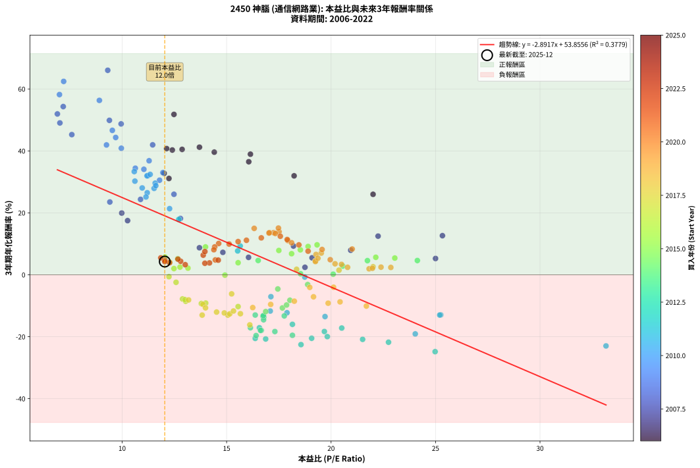
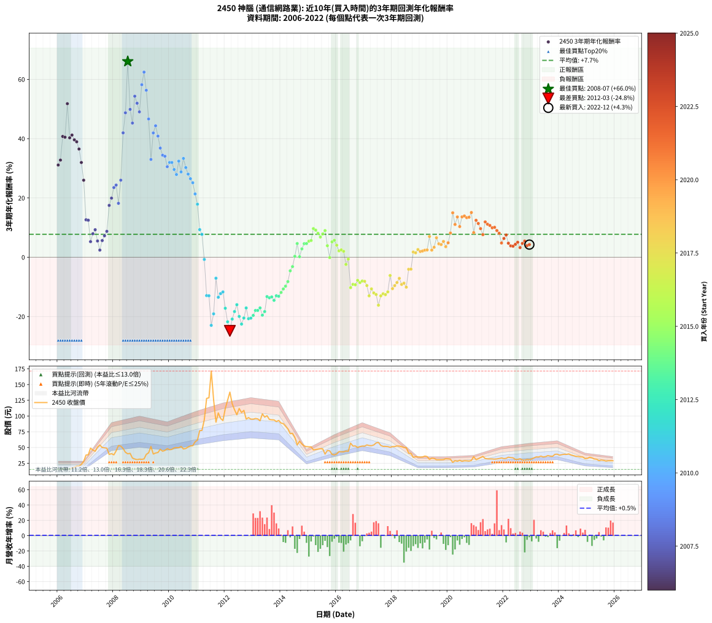

# 2450 神腦 - 本益比與未來報酬率分析

!!! info "報告資訊"
    - **股票代號**: 2450
    - **公司名稱**: 神腦
    - **產業別**: 通信網路業
    - **分析期間**: 2006-2022 (204 個數據點)
    - **資料來源**: Type 12 (ShowMonthlyK_ChartFlow) 月收盤價與本益比
    - **報酬率口徑**: 含現金股利 (簡化: 年度合計，假設每年7/1入帳)
    - **報告生成時間**: 2026-01-22 22:51:39 CST

## 📈 視覺化圖表

### 圖表1: 本益比 vs 未來報酬率關係

*圖表1：2450 神腦 本益比與3年期未來報酬率關係 (2006-2022)*

### 圖表2: 歷年買入時點的3年期實際報酬率

*圖表2：2450 神腦 歷年買入時點的3年期實際報酬率 (2006-2022)*

## 📍 買點訊號說明

本報告提供兩種買點提示訊號（顯示於圖表2的股價子圖中）：

### ▲ 小綠色三角形（回測驗證）
- **計算方式**: 使用全部歷史資料計算本益比第25百分位數
- **用途**: 事後驗證，顯示歷史上哪些時點確實為低估區
- **限制**: 當下無法判斷，僅供回測參考
- **特性**: 後見之明（Look-Ahead Bias）

### ▲ 小橘色三角形（即時訊號）
- **計算方式**: 使用截至當月的過去5年資料計算本益比第25百分位數
- **用途**: 實際投資決策，當時即可判斷
- **優勢**: 可操作性強，符合實務需求
- **特性**: 無後見之明，滾動窗口計算

!!! tip "如何使用兩種訊號"
    - **綠色▲** 幫助理解歷史估值機會，驗證策略有效性
    - **橘色▲** 可作為實際買進參考，但仍需搭配基本面分析
    - 兩種訊號重疊時，表示即時判斷與事後驗證一致，信心度較高
    - 僅有綠色▲時，表示當時無法判斷（需要未來資料才能確認）
    - 僅有橘色▲時，表示即時判斷為買點，但事後可能不是最佳時機

## 📊 估值分析摘要

| 指標 | 數值 |
|:---:|:---:|
| **目前本益比** (2022-12) | **12.04 倍** |
| **歷史平均本益比** | 15.95 倍 |
| **估值水準** | 🟢 相對低估 |
| **預期3年年化報酬率** | **+19.04%** |
| **歷史平均報酬率** | +7.74% |
| **相關係數 (R²)** | 0.3779 |
| **趨勢線斜率** | -2.8917 |

!!! abstract "核心洞察"
    目前本益比顯著低於歷史平均，預期未來報酬率可能較高

    根據歷史數據回測，2450 神腦 在目前本益比 **12.0倍** 的估值水準下，
    預期未來3年年化報酬率約為 **+19.0%**。

    **重要提醒**: 本分析基於歷史數據統計，實際報酬率會受到公司基本面變化、產業趨勢、
    總體經濟環境等多重因素影響。R² = 0.38 表示本益比可解釋約 37.8% 的報酬率變異。

## 📈 歷史估值統計

### 最佳買點 (最高報酬率)

| 項目 | 數值 |
|:---:|:---:|
| 起始時間 | 2008-07 |
| 當時本益比 | 9.31 倍 |
| 起始價格 | 40.0 元 |
| 3年後價格 | 171.5 元 |
| **3年年化報酬率** | **+66.03%** |

### 最差買點 (最低報酬率)

| 項目 | 數值 |
|:---:|:---:|
| 起始時間 | 2012-03 |
| 當時本益比 | 24.98 倍 |
| 起始價格 | 138.0 元 |
| 3年後價格 | 46.2 元 |
| **3年年化報酬率** | **-24.82%** |

## 🎯 投資啟示

### 本益比與報酬率關係

趨勢線方程式: **y = -2.8917x + 53.8556**

!!! warning "強負相關"
    本益比與未來報酬率呈現強負相關。在高本益比時期買入，未來報酬率顯著較低；
    在低本益比時期買入，未來報酬率顯著較高。**估值紀律至關重要**。

### 估值區間建議

基於歷史數據分析:

- **🟢 低估區** (P/E < 12.8): 預期報酬率較高，可考慮增加持股
- **🟡 合理區** (P/E 12.8-19.1): 預期報酬率符合長期趨勢，正常持有
- **🔴 高估區** (P/E > 19.1): 預期報酬率較低，可考慮減碼或觀望

!!! danger "風險提示"
    - 過去表現不代表未來結果
    - 本分析假設公司基本面無重大結構性變化
    - 產業環境劇變可能使歷史規律失效
    - 應結合公司財報、產業趨勢、總體經濟等多重因素綜合判斷

!!! success "長期投資觀點"
    歷史數據顯示，在合理或低估的估值水準買入並長期持有，
    往往能獲得較佳的投資報酬。**耐心等待好價格**是價值投資的核心原則。

## 📊 數據品質

- **資料來源**: GoodInfo.tw Type 12 (ShowMonthlyK_ChartFlow)
- **資料頻率**: 月度收盤價與本益比
- **回測期間**: 2006-2022
- **數據點數量**: 204 個 (每個點代表一次3年期回測)

### 計算方法說明

1. **3年期年化報酬率**:
   - 對每個歷史時點，計算其後3年的實際投資報酬率
   - 期末價值(不含股利): 期末價格
   - 期末價值(含現金股利): 期末價格 + 持有期間內的現金股利合計 (簡化: 年度合計，假設每年7/1入帳)
   - 公式: 年化報酬率 = [(期末價值/期初價格)^(1/年數) - 1] × 100%

2. **本益比 (P/E Ratio)**:
   - 使用當時的月收盤價與EPS計算
   - 資料來源: Type 12 月度河流圖本益比數據

3. **趨勢線 (Linear Regression)**:
   - 使用最小平方法擬合線性趨勢線
   - R²值衡量本益比對報酬率的解釋能力

---

*本報告由 Stock Analysis System v1.9.0 自動生成*
*數據更新時間: 2026-01-22 22:51:39 CST*

## 📋 月度回測明細表

（每一列對應時間線圖中的一個買入點；可用來對照 SVG 圖上的每個點。）

| 買入月份 | 賣出月份 | 回測期限_年 | 實際持有年數 | 買入本益比_倍 | 買入收盤價_元 | 賣出收盤價_元 | 現金股利合計_元 | 總報酬率_pct | 年化報酬率_pct |
| --- | --- | --- | --- | --- | --- | --- | --- | --- | --- |
| 2006-01 | 2009-01 | 3 | 3.001 | 12.24 | 15.55 | 31.20 | 3.85 | +125.38 | +31.10 |
| 2006-02 | 2009-02 | 3 | 3.001 | 12.01 | 15.25 | 31.85 | 3.85 | +134.08 | +32.77 |
| 2006-03 | 2009-03 | 3 | 3.001 | 12.13 | 15.40 | 39.10 | 3.85 | +178.88 | +40.75 |
| 2006-04 | 2009-04 | 3 | 3.001 | 12.87 | 16.35 | 41.50 | 3.85 | +177.35 | +40.49 |
| 2006-05 | 2009-05 | 3 | 3.001 | 12.48 | 15.85 | 51.60 | 3.85 | +249.82 | +51.79 |
| 2006-06 | 2009-06 | 3 | 3.001 | 12.40 | 15.75 | 39.65 | 3.85 | +176.17 | +40.29 |
| 2006-07 | 2009-07 | 3 | 3.001 | 13.70 | 17.40 | 41.20 | 7.80 | +181.60 | +41.20 |
| 2006-08 | 2009-08 | 3 | 3.001 | 14.41 | 18.30 | 42.00 | 7.80 | +172.13 | +39.60 |
| 2006-09 | 2009-09 | 3 | 3.001 | 16.14 | 20.50 | 47.20 | 7.80 | +168.29 | +38.94 |
| 2006-10 | 2009-10 | 3 | 3.001 | 16.06 | 20.40 | 44.10 | 7.80 | +154.41 | +36.50 |
| 2006-11 | 2009-11 | 3 | 3.001 | 18.23 | 23.15 | 45.40 | 7.80 | +129.80 | +31.95 |
| 2006-12 | 2009-12 | 3 | 3.001 | 22.01 | 27.95 | 48.10 | 7.80 | +100.00 | +25.98 |
| 2007-01 | 2010-01 | 3 | 3.001 | 25.33 | 38.00 | 46.50 | 7.80 | +42.89 | +12.63 |
| 2007-02 | 2010-02 | 3 | 3.001 | 22.25 | 38.50 | 47.00 | 7.80 | +42.34 | +12.48 |
| 2007-03 | 2010-03 | 3 | 3.001 | 25.00 | 49.00 | 49.35 | 7.80 | +16.63 | +5.26 |
| 2007-04 | 2010-04 | 3 | 3.001 | 20.94 | 45.85 | 49.85 | 7.80 | +25.73 | +7.93 |
| 2007-05 | 2010-05 | 3 | 3.001 | 18.20 | 44.05 | 49.70 | 7.80 | +30.53 | +9.29 |
| 2007-06 | 2010-06 | 3 | 3.001 | 19.09 | 50.60 | 51.60 | 7.80 | +17.39 | +5.49 |
| 2007-07 | 2010-07 | 3 | 3.001 | 18.75 | 54.00 | 47.65 | 10.36 | +7.43 | +2.42 |
| 2007-08 | 2010-08 | 3 | 3.001 | 16.05 | 49.90 | 48.45 | 10.36 | +17.86 | +5.63 |
| 2007-09 | 2010-09 | 3 | 3.001 | 14.82 | 49.50 | 50.70 | 10.36 | +23.36 | +7.25 |
| 2007-10 | 2010-10 | 3 | 3.001 | 13.70 | 48.90 | 52.50 | 10.36 | +28.55 | +8.73 |
| 2007-11 | 2010-11 | 3 | 3.001 | 10.26 | 39.00 | 52.90 | 10.36 | +62.21 | +17.49 |
| 2007-12 | 2010-12 | 3 | 3.001 | 9.98 | 40.20 | 59.00 | 10.36 | +72.54 | +19.94 |
| 2008-01 | 2011-01 | 3 | 3.001 | 9.41 | 38.30 | 61.80 | 10.36 | +88.41 | +23.50 |
| 2008-02 | 2011-03 | 3 | 3.080 | 10.88 | 44.70 | 77.10 | 10.36 | +95.66 | +24.35 |
| 2008-03 | 2011-03 | 3 | 2.998 | 12.79 | 53.00 | 77.10 | 10.36 | +65.02 | +18.19 |
| 2008-04 | 2011-04 | 3 | 2.998 | 12.48 | 52.20 | 94.00 | 10.36 | +99.93 | +26.00 |
| 2008-05 | 2011-05 | 3 | 2.998 | 11.46 | 48.40 | 128.00 | 10.36 | +185.87 | +41.96 |
| 2008-06 | 2011-06 | 3 | 2.998 | 9.95 | 42.40 | 129.00 | 10.36 | +228.68 | +48.72 |
| 2008-07 | 2011-07 | 3 | 2.998 | 9.31 | 40.00 | 171.50 | 11.39 | +357.22 | +66.03 |
| 2008-08 | 2011-08 | 3 | 2.998 | 9.39 | 40.70 | 125.50 | 11.39 | +236.33 | +49.87 |
| 2008-09 | 2011-09 | 3 | 2.998 | 7.59 | 33.20 | 90.30 | 11.39 | +206.29 | +45.26 |
| 2008-10 | 2011-10 | 3 | 2.998 | 7.18 | 31.70 | 105.00 | 11.39 | +267.15 | +54.32 |
| 2008-11 | 2011-11 | 3 | 2.998 | 6.90 | 30.70 | 96.20 | 11.39 | +250.45 | +51.94 |
| 2008-12 | 2011-12 | 3 | 2.998 | 7.02 | 31.50 | 92.80 | 11.39 | +230.75 | +49.03 |
| 2009-01 | 2012-01 | 3 | 2.998 | 7.00 | 31.20 | 112.00 | 11.39 | +295.47 | +58.19 |
| 2009-02 | 2012-02 | 3 | 2.998 | 7.20 | 31.85 | 125.00 | 11.39 | +328.22 | +62.44 |
| 2009-03 | 2012-03 | 3 | 3.001 | 8.91 | 39.10 | 138.00 | 11.39 | +282.06 | +56.32 |
| 2009-04 | 2012-04 | 3 | 3.001 | 9.53 | 41.50 | 119.50 | 11.39 | +215.39 | +46.64 |
| 2009-05 | 2012-05 | 3 | 3.001 | 11.95 | 51.60 | 110.00 | 11.39 | +135.25 | +32.99 |
| 2009-06 | 2012-06 | 3 | 3.001 | 9.25 | 39.65 | 102.00 | 11.39 | +185.97 | +41.93 |
| 2009-07 | 2012-07 | 3 | 3.001 | 9.69 | 41.20 | 112.00 | 11.92 | +200.78 | +44.34 |
| 2009-08 | 2012-08 | 3 | 3.001 | 9.96 | 42.00 | 105.50 | 11.92 | +179.57 | +40.86 |
| 2009-09 | 2012-09 | 3 | 3.001 | 11.29 | 47.20 | 109.00 | 11.92 | +156.19 | +36.82 |
| 2009-10 | 2012-10 | 3 | 3.001 | 10.63 | 44.10 | 95.20 | 11.92 | +142.90 | +34.42 |
| 2009-11 | 2012-11 | 3 | 3.001 | 11.04 | 45.40 | 97.50 | 11.92 | +141.01 | +34.07 |
| 2009-12 | 2012-12 | 3 | 3.001 | 11.79 | 48.10 | 95.10 | 11.92 | +122.49 | +30.54 |
| 2010-01 | 2013-01 | 3 | 3.001 | 11.23 | 46.50 | 95.00 | 11.92 | +129.94 | +31.98 |
| 2010-02 | 2013-02 | 3 | 3.001 | 11.19 | 47.00 | 96.10 | 11.92 | +129.83 | +31.96 |
| 2010-03 | 2013-03 | 3 | 3.001 | 11.58 | 49.35 | 95.50 | 11.92 | +117.67 | +29.59 |
| 2010-04 | 2013-04 | 3 | 3.001 | 11.53 | 49.85 | 92.40 | 11.92 | +109.27 | +27.90 |
| 2010-05 | 2013-05 | 3 | 3.001 | 11.34 | 49.70 | 103.50 | 11.92 | +132.23 | +32.42 |
| 2010-06 | 2013-06 | 3 | 3.001 | 11.61 | 51.60 | 98.30 | 11.92 | +113.60 | +28.78 |
| 2010-07 | 2013-07 | 3 | 3.001 | 10.58 | 47.65 | 100.50 | 12.45 | +137.05 | +33.33 |
| 2010-08 | 2013-08 | 3 | 3.001 | 10.61 | 48.45 | 94.60 | 12.45 | +120.96 | +30.24 |
| 2010-09 | 2013-09 | 3 | 3.001 | 10.96 | 50.70 | 94.00 | 12.45 | +109.97 | +28.04 |
| 2010-10 | 2013-10 | 3 | 3.001 | 11.20 | 52.50 | 93.80 | 12.45 | +102.39 | +26.48 |
| 2010-11 | 2013-11 | 3 | 3.001 | 11.14 | 52.90 | 91.20 | 12.45 | +95.94 | +25.13 |
| 2010-12 | 2013-12 | 3 | 3.001 | 12.27 | 59.00 | 93.00 | 12.45 | +78.73 | +21.35 |
| 2011-01 | 2014-01 | 3 | 3.001 | 12.71 | 61.80 | 88.80 | 12.45 | +63.84 | +17.88 |
| 2011-02 | 2014-02 | 3 | 3.001 | 15.65 | 76.90 | 88.00 | 12.45 | +30.63 | +9.31 |
| 2011-03 | 2014-03 | 3 | 3.001 | 15.53 | 77.10 | 83.90 | 12.45 | +24.97 | +7.71 |
| 2011-04 | 2014-04 | 3 | 3.001 | 18.74 | 94.00 | 79.50 | 12.45 | -2.18 | -0.73 |
| 2011-05 | 2014-05 | 3 | 3.001 | 25.25 | 128.00 | 72.00 | 12.45 | -34.02 | -12.94 |
| 2011-06 | 2014-06 | 3 | 3.001 | 25.20 | 129.00 | 72.50 | 12.45 | -34.14 | -13.00 |
| 2011-07 | 2014-07 | 3 | 3.001 | 33.16 | 171.50 | 65.90 | 12.48 | -54.30 | -22.97 |
| 2011-08 | 2014-08 | 3 | 3.001 | 24.03 | 125.50 | 54.00 | 12.48 | -47.03 | -19.08 |
| 2011-09 | 2014-09 | 3 | 3.001 | 17.12 | 90.30 | 60.00 | 12.48 | -19.74 | -7.06 |
| 2011-10 | 2014-10 | 3 | 3.001 | 19.71 | 105.00 | 55.50 | 12.48 | -35.26 | -13.49 |
| 2011-11 | 2014-11 | 3 | 3.001 | 17.89 | 96.20 | 52.50 | 12.48 | -32.46 | -12.26 |
| 2011-12 | 2014-12 | 3 | 3.001 | 17.09 | 92.80 | 51.40 | 12.48 | -31.17 | -11.70 |
| 2012-01 | 2015-01 | 3 | 3.001 | 20.51 | 112.00 | 51.10 | 12.48 | -43.23 | -17.20 |
| 2012-02 | 2015-03 | 3 | 3.080 | 22.75 | 125.00 | 46.20 | 12.48 | -53.06 | -21.77 |
| 2012-03 | 2015-03 | 3 | 2.998 | 24.98 | 138.00 | 46.20 | 12.48 | -57.48 | -24.82 |
| 2012-04 | 2015-04 | 3 | 2.998 | 21.51 | 119.50 | 46.80 | 12.48 | -50.39 | -20.85 |
| 2012-05 | 2015-05 | 3 | 2.998 | 19.68 | 110.00 | 47.50 | 12.48 | -45.47 | -18.32 |
| 2012-06 | 2015-06 | 3 | 2.998 | 18.15 | 102.00 | 48.00 | 12.48 | -40.71 | -16.00 |
| 2012-07 | 2015-07 | 3 | 2.998 | 19.82 | 112.00 | 47.90 | 9.55 | -48.70 | -19.96 |
| 2012-08 | 2015-08 | 3 | 2.998 | 18.56 | 105.50 | 39.50 | 9.55 | -53.50 | -22.54 |
| 2012-09 | 2015-09 | 3 | 2.998 | 19.07 | 109.00 | 45.25 | 9.55 | -49.72 | -20.50 |
| 2012-10 | 2015-10 | 3 | 2.998 | 16.57 | 95.20 | 44.70 | 9.55 | -43.01 | -17.10 |
| 2012-11 | 2015-11 | 3 | 2.998 | 16.87 | 97.50 | 39.05 | 9.55 | -50.15 | -20.72 |
| 2012-12 | 2015-12 | 3 | 2.998 | 16.37 | 95.10 | 38.20 | 9.55 | -49.79 | -20.53 |
| 2013-01 | 2016-01 | 3 | 2.998 | 16.41 | 95.00 | 39.80 | 9.55 | -48.05 | -19.62 |
| 2013-02 | 2016-02 | 3 | 2.998 | 16.66 | 96.10 | 43.55 | 9.55 | -44.74 | -17.95 |
| 2013-03 | 2016-03 | 3 | 3.001 | 16.62 | 95.50 | 43.20 | 9.55 | -44.76 | -17.95 |
| 2013-04 | 2016-04 | 3 | 3.001 | 16.14 | 92.40 | 43.10 | 9.55 | -43.02 | -17.09 |
| 2013-05 | 2016-05 | 3 | 3.001 | 18.15 | 103.50 | 44.35 | 9.55 | -47.92 | -19.54 |
| 2013-06 | 2016-06 | 3 | 3.001 | 17.31 | 98.30 | 44.00 | 9.55 | -45.52 | -18.32 |
| 2013-07 | 2016-07 | 3 | 3.001 | 17.76 | 100.50 | 57.00 | 8.56 | -34.77 | -13.27 |
| 2013-08 | 2016-08 | 3 | 3.001 | 16.78 | 94.60 | 52.30 | 8.56 | -35.67 | -13.67 |
| 2013-09 | 2016-09 | 3 | 3.001 | 16.74 | 94.00 | 52.50 | 8.56 | -35.04 | -13.39 |
| 2013-10 | 2016-10 | 3 | 3.001 | 16.77 | 93.80 | 50.00 | 8.56 | -37.57 | -14.53 |
| 2013-11 | 2016-11 | 3 | 3.001 | 16.37 | 91.20 | 51.50 | 8.56 | -34.14 | -13.00 |
| 2013-12 | 2016-12 | 3 | 3.001 | 16.76 | 93.00 | 52.30 | 8.56 | -34.56 | -13.18 |
| 2014-01 | 2017-01 | 3 | 3.001 | 16.87 | 88.80 | 52.20 | 8.56 | -31.58 | -11.88 |
| 2014-02 | 2017-02 | 3 | 3.001 | 17.67 | 88.00 | 54.10 | 8.56 | -28.80 | -10.70 |
| 2014-03 | 2017-03 | 3 | 3.001 | 17.87 | 83.90 | 53.10 | 8.56 | -26.51 | -9.75 |
| 2014-04 | 2017-04 | 3 | 3.001 | 18.03 | 79.50 | 52.90 | 8.56 | -22.69 | -8.22 |
| 2014-05 | 2017-05 | 3 | 3.001 | 17.45 | 72.00 | 54.00 | 8.56 | -13.11 | -4.58 |
| 2014-06 | 2017-06 | 3 | 3.001 | 18.88 | 72.50 | 57.30 | 8.56 | -9.16 | -3.15 |
| 2014-07 | 2017-07 | 3 | 3.001 | 18.54 | 65.90 | 58.00 | 8.54 | +0.97 | +0.32 |
| 2014-08 | 2017-08 | 3 | 3.001 | 16.51 | 54.00 | 53.30 | 8.54 | +14.52 | +4.62 |
| 2014-09 | 2017-09 | 3 | 3.001 | 20.10 | 60.00 | 51.80 | 8.54 | +0.57 | +0.19 |
| 2014-10 | 2017-10 | 3 | 3.001 | 20.56 | 55.50 | 51.80 | 8.54 | +8.72 | +2.83 |
| 2014-11 | 2017-11 | 3 | 3.001 | 21.74 | 52.50 | 51.50 | 8.54 | +14.37 | +4.57 |
| 2014-12 | 2017-12 | 3 | 3.001 | 24.13 | 51.40 | 50.30 | 8.54 | +14.48 | +4.61 |
| 2015-01 | 2018-01 | 3 | 3.001 | 23.05 | 51.10 | 51.30 | 8.54 | +17.11 | +5.40 |
| 2015-02 | 2018-02 | 3 | 3.001 | 22.14 | 51.00 | 51.60 | 8.54 | +17.93 | +5.65 |
| 2015-03 | 2018-03 | 3 | 3.001 | 19.33 | 46.20 | 52.40 | 8.54 | +31.91 | +9.67 |
| 2015-04 | 2018-04 | 3 | 3.001 | 18.90 | 46.80 | 52.30 | 8.54 | +30.00 | +9.14 |
| 2015-05 | 2018-05 | 3 | 3.001 | 18.53 | 47.50 | 51.40 | 8.54 | +26.19 | +8.06 |
| 2015-06 | 2018-06 | 3 | 3.001 | 18.11 | 48.00 | 49.95 | 8.54 | +21.86 | +6.81 |
| 2015-07 | 2018-07 | 3 | 3.001 | 17.50 | 47.90 | 49.95 | 10.15 | +25.47 | +7.85 |
| 2015-08 | 2018-08 | 3 | 3.001 | 13.99 | 39.50 | 41.00 | 10.15 | +29.49 | +8.99 |
| 2015-09 | 2018-09 | 3 | 3.001 | 15.55 | 45.25 | 40.60 | 10.15 | +12.15 | +3.90 |
| 2015-10 | 2018-10 | 3 | 3.001 | 14.92 | 44.70 | 34.40 | 10.15 | -0.34 | -0.11 |
| 2015-11 | 2018-11 | 3 | 3.001 | 12.66 | 39.05 | 35.30 | 10.15 | +16.38 | +5.19 |
| 2015-12 | 2018-12 | 3 | 3.001 | 12.05 | 38.20 | 35.00 | 10.15 | +18.19 | +5.73 |
| 2016-01 | 2019-01 | 3 | 3.001 | 12.28 | 39.80 | 34.70 | 10.15 | +12.68 | +4.06 |
| 2016-02 | 2019-03 | 3 | 3.080 | 13.15 | 43.55 | 36.35 | 10.15 | +6.77 | +2.15 |
| 2016-03 | 2019-03 | 3 | 2.998 | 12.77 | 43.20 | 36.35 | 10.15 | +7.63 | +2.48 |
| 2016-04 | 2019-04 | 3 | 2.998 | 12.48 | 43.10 | 35.60 | 10.15 | +6.14 | +2.01 |
| 2016-05 | 2019-05 | 3 | 2.998 | 12.58 | 44.35 | 31.05 | 10.15 | -7.11 | -2.43 |
| 2016-06 | 2019-06 | 3 | 2.998 | 12.24 | 44.00 | 33.05 | 10.15 | -1.82 | -0.61 |
| 2016-07 | 2019-07 | 3 | 2.998 | 15.55 | 57.00 | 32.60 | 8.60 | -27.72 | -10.26 |
| 2016-08 | 2019-08 | 3 | 2.998 | 14.00 | 52.30 | 30.65 | 8.60 | -24.96 | -9.13 |
| 2016-09 | 2019-09 | 3 | 2.998 | 13.79 | 52.50 | 30.60 | 8.60 | -25.34 | -9.29 |
| 2016-10 | 2019-10 | 3 | 2.998 | 12.89 | 50.00 | 30.60 | 8.60 | -21.60 | -7.80 |
| 2016-11 | 2019-11 | 3 | 2.998 | 13.04 | 51.50 | 30.80 | 8.60 | -23.50 | -8.55 |
| 2016-12 | 2019-12 | 3 | 2.998 | 13.01 | 52.30 | 32.10 | 8.60 | -22.18 | -8.03 |
| 2017-01 | 2020-01 | 3 | 2.998 | 13.18 | 52.20 | 31.90 | 8.60 | -22.42 | -8.12 |
| 2017-02 | 2020-02 | 3 | 2.998 | 13.87 | 54.10 | 31.45 | 8.60 | -25.97 | -9.55 |
| 2017-03 | 2020-03 | 3 | 3.001 | 13.83 | 53.10 | 26.35 | 8.60 | -34.18 | -13.01 |
| 2017-04 | 2020-04 | 3 | 3.001 | 13.99 | 52.90 | 29.10 | 8.60 | -28.74 | -10.68 |
| 2017-05 | 2020-05 | 3 | 3.001 | 14.52 | 54.00 | 28.15 | 8.60 | -31.95 | -12.04 |
| 2017-06 | 2020-06 | 3 | 3.001 | 15.66 | 57.30 | 29.70 | 8.60 | -33.16 | -12.56 |
| 2017-07 | 2020-07 | 3 | 3.001 | 16.11 | 58.00 | 28.10 | 6.07 | -41.09 | -16.17 |
| 2017-08 | 2020-08 | 3 | 3.001 | 15.06 | 53.30 | 29.00 | 6.07 | -34.21 | -13.02 |
| 2017-09 | 2020-09 | 3 | 3.001 | 14.89 | 51.80 | 28.85 | 6.07 | -32.59 | -12.32 |
| 2017-10 | 2020-10 | 3 | 3.001 | 15.15 | 51.80 | 28.50 | 6.07 | -33.27 | -12.61 |
| 2017-11 | 2020-11 | 3 | 3.001 | 15.33 | 51.50 | 29.40 | 6.07 | -31.13 | -11.69 |
| 2017-12 | 2020-12 | 3 | 3.001 | 15.24 | 50.30 | 35.50 | 6.07 | -17.36 | -6.16 |
| 2018-01 | 2021-01 | 3 | 3.001 | 16.25 | 51.30 | 30.60 | 6.07 | -28.53 | -10.59 |
| 2018-02 | 2021-02 | 3 | 3.001 | 17.11 | 51.60 | 32.10 | 6.07 | -26.03 | -9.56 |
| 2018-03 | 2021-03 | 3 | 3.001 | 18.24 | 52.40 | 34.05 | 6.07 | -23.44 | -8.52 |
| 2018-04 | 2021-04 | 3 | 3.001 | 19.16 | 52.30 | 35.85 | 6.07 | -19.85 | -7.11 |
| 2018-05 | 2021-05 | 3 | 3.001 | 19.86 | 51.40 | 32.45 | 6.07 | -25.07 | -9.17 |
| 2018-06 | 2021-06 | 3 | 3.001 | 20.43 | 49.95 | 31.90 | 6.07 | -23.99 | -8.74 |
| 2018-07 | 2021-07 | 3 | 3.001 | 21.69 | 49.95 | 31.90 | 4.40 | -27.33 | -10.09 |
| 2018-08 | 2021-08 | 3 | 3.001 | 18.98 | 41.00 | 31.80 | 4.40 | -11.71 | -4.06 |
| 2018-09 | 2021-09 | 3 | 3.001 | 20.12 | 40.60 | 31.50 | 4.40 | -11.58 | -4.02 |
| 2018-10 | 2021-10 | 3 | 3.001 | 18.35 | 34.40 | 31.85 | 4.40 | +5.38 | +1.76 |
| 2018-11 | 2021-11 | 3 | 3.001 | 20.38 | 35.30 | 32.50 | 4.40 | +4.53 | +1.49 |
| 2018-12 | 2021-12 | 3 | 3.001 | 22.01 | 35.00 | 33.40 | 4.40 | +8.00 | +2.60 |
| 2019-01 | 2022-01 | 3 | 3.001 | 21.82 | 34.70 | 32.35 | 4.40 | +5.91 | +1.93 |
| 2019-02 | 2022-02 | 3 | 3.001 | 21.98 | 34.95 | 32.80 | 4.40 | +6.44 | +2.10 |
| 2019-03 | 2022-03 | 3 | 3.001 | 22.86 | 36.35 | 34.60 | 4.40 | +7.29 | +2.37 |
| 2019-04 | 2022-04 | 3 | 3.001 | 22.39 | 35.60 | 33.90 | 4.40 | +7.58 | +2.47 |
| 2019-05 | 2022-05 | 3 | 3.001 | 19.53 | 31.05 | 33.65 | 4.40 | +22.54 | +7.01 |
| 2019-06 | 2022-06 | 3 | 3.001 | 20.79 | 33.05 | 31.10 | 4.40 | +7.41 | +2.41 |
| 2019-07 | 2022-07 | 3 | 3.001 | 20.50 | 32.60 | 31.05 | 4.95 | +10.43 | +3.36 |
| 2019-08 | 2022-08 | 3 | 3.001 | 19.28 | 30.65 | 32.15 | 4.95 | +21.04 | +6.57 |
| 2019-09 | 2022-09 | 3 | 3.001 | 19.25 | 30.60 | 30.00 | 4.95 | +14.22 | +4.53 |
| 2019-10 | 2022-10 | 3 | 3.001 | 19.25 | 30.60 | 29.75 | 4.95 | +13.40 | +4.28 |
| 2019-11 | 2022-11 | 3 | 3.001 | 19.37 | 30.80 | 31.05 | 4.95 | +16.88 | +5.34 |
| 2019-12 | 2022-12 | 3 | 3.001 | 20.19 | 32.10 | 30.70 | 4.95 | +11.06 | +3.56 |
| 2020-01 | 2023-01 | 3 | 3.001 | 19.96 | 31.90 | 31.85 | 4.95 | +15.36 | +4.88 |
| 2020-02 | 2023-03 | 3 | 3.080 | 19.57 | 31.45 | 35.10 | 4.95 | +27.34 | +8.16 |
| 2020-03 | 2023-03 | 3 | 2.998 | 16.32 | 26.35 | 35.10 | 4.95 | +51.99 | +14.99 |
| 2020-04 | 2023-04 | 3 | 2.998 | 17.93 | 29.10 | 34.90 | 4.95 | +36.94 | +11.06 |
| 2020-05 | 2023-05 | 3 | 2.998 | 17.25 | 28.15 | 36.30 | 4.95 | +46.54 | +13.59 |
| 2020-06 | 2023-06 | 3 | 2.998 | 18.11 | 29.70 | 34.95 | 4.95 | +34.34 | +10.35 |
| 2020-07 | 2023-07 | 3 | 2.998 | 17.05 | 28.10 | 35.50 | 5.70 | +46.62 | +13.61 |
| 2020-08 | 2023-08 | 3 | 2.998 | 17.51 | 29.00 | 37.15 | 5.70 | +47.76 | +13.91 |
| 2020-09 | 2023-09 | 3 | 2.998 | 17.33 | 28.85 | 36.30 | 5.70 | +45.58 | +13.35 |
| 2020-10 | 2023-10 | 3 | 2.998 | 17.03 | 28.50 | 35.95 | 5.70 | +46.14 | +13.49 |
| 2020-11 | 2023-11 | 3 | 2.998 | 17.48 | 29.40 | 39.10 | 5.70 | +52.38 | +15.08 |
| 2020-12 | 2023-12 | 3 | 2.998 | 21.01 | 35.50 | 39.40 | 5.70 | +27.04 | +8.31 |
| 2021-01 | 2024-01 | 3 | 2.998 | 17.57 | 30.60 | 37.80 | 5.70 | +42.16 | +12.45 |
| 2021-02 | 2024-02 | 3 | 2.998 | 17.90 | 32.10 | 38.65 | 5.70 | +38.16 | +11.39 |
| 2021-03 | 2024-03 | 3 | 3.001 | 18.46 | 34.05 | 39.20 | 5.70 | +31.86 | +9.66 |
| 2021-04 | 2024-04 | 3 | 3.001 | 18.90 | 35.85 | 39.00 | 5.70 | +24.69 | +7.63 |
| 2021-05 | 2024-05 | 3 | 3.001 | 16.66 | 32.45 | 39.80 | 5.70 | +40.22 | +11.92 |
| 2021-06 | 2024-06 | 3 | 3.001 | 15.95 | 31.90 | 38.10 | 5.70 | +37.30 | +11.14 |
| 2021-07 | 2024-07 | 3 | 3.001 | 15.55 | 31.90 | 37.10 | 6.20 | +35.74 | +10.72 |
| 2021-08 | 2024-08 | 3 | 3.001 | 15.12 | 31.80 | 36.05 | 6.20 | +32.86 | +9.93 |
| 2021-09 | 2024-09 | 3 | 3.001 | 14.62 | 31.50 | 35.85 | 6.20 | +33.49 | +10.11 |
| 2021-10 | 2024-10 | 3 | 3.001 | 14.43 | 31.85 | 35.05 | 6.20 | +29.51 | +9.00 |
| 2021-11 | 2024-11 | 3 | 3.001 | 14.39 | 32.50 | 34.85 | 6.20 | +26.31 | +8.09 |
| 2021-12 | 2024-12 | 3 | 3.001 | 14.46 | 33.40 | 32.25 | 6.20 | +15.12 | +4.80 |
| 2022-01 | 2025-01 | 3 | 3.001 | 13.88 | 32.35 | 32.70 | 6.20 | +20.25 | +6.34 |
| 2022-02 | 2025-02 | 3 | 3.001 | 13.96 | 32.80 | 34.55 | 6.20 | +24.24 | +7.50 |
| 2022-03 | 2025-03 | 3 | 3.001 | 14.60 | 34.60 | 33.55 | 6.20 | +14.88 | +4.73 |
| 2022-04 | 2025-04 | 3 | 3.001 | 14.18 | 33.90 | 31.75 | 6.20 | +11.95 | +3.83 |
| 2022-05 | 2025-05 | 3 | 3.001 | 13.96 | 33.65 | 31.35 | 6.20 | +11.59 | +3.72 |
| 2022-06 | 2025-06 | 3 | 3.001 | 12.80 | 31.10 | 29.15 | 6.20 | +13.67 | +4.36 |
| 2022-07 | 2025-07 | 3 | 3.001 | 12.67 | 31.05 | 30.15 | 5.85 | +15.94 | +5.05 |
| 2022-08 | 2025-08 | 3 | 3.001 | 13.02 | 32.15 | 29.55 | 5.85 | +10.11 | +3.26 |
| 2022-09 | 2025-09 | 3 | 3.001 | 12.05 | 30.00 | 28.55 | 5.85 | +14.67 | +4.67 |
| 2022-10 | 2025-10 | 3 | 3.001 | 11.85 | 29.75 | 29.05 | 5.85 | +17.31 | +5.46 |
| 2022-11 | 2025-11 | 3 | 3.001 | 12.27 | 31.05 | 29.00 | 5.85 | +12.24 | +3.92 |
| 2022-12 | 2025-12 | 3 | 3.001 | 12.04 | 30.70 | 28.95 | 5.85 | +13.36 | +4.27 |
