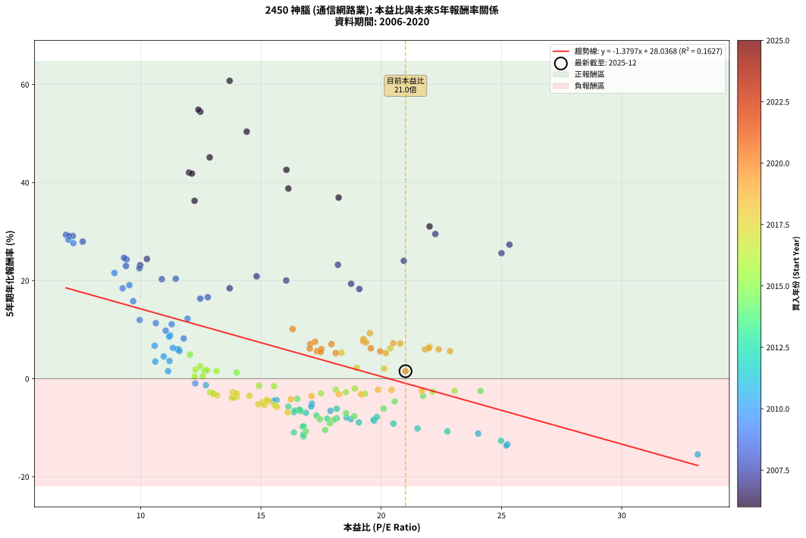
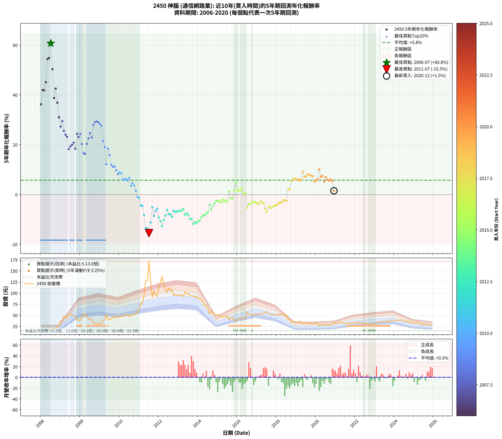

# 2450 神腦 - 本益比與未來報酬率分析

!!! info "報告資訊"
    - **股票代號**: 2450
    - **公司名稱**: 神腦
    - **產業別**: 通信網路業
    - **分析期間**: 2006-2020 (180 個數據點)
    - **資料來源**: Type 12 (ShowMonthlyK_ChartFlow) 月收盤價與本益比
    - **報酬率口徑**: 含現金股利 (簡化: 年度合計，假設每年7/1入帳)
    - **報告生成時間**: 2026-01-10 20:46:51 CST

## 📈 視覺化圖表

### 圖表1: 本益比 vs 未來報酬率關係

*圖表1：2450 神腦 本益比與5年期未來報酬率關係 (2006-2020)*

### 圖表2: 歷年買入時點的5年期實際報酬率

*圖表2：2450 神腦 歷年買入時點的5年期實際報酬率 (2006-2020)*

## 📍 買點訊號說明

本報告提供兩種買點提示訊號（顯示於圖表2的股價子圖中）：

### ▲ 小綠色三角形（回測驗證）
- **計算方式**: 使用全部歷史資料計算本益比第25百分位數
- **用途**: 事後驗證，顯示歷史上哪些時點確實為低估區
- **限制**: 當下無法判斷，僅供回測參考
- **特性**: 後見之明（Look-Ahead Bias）

### ▲ 小橘色三角形（即時訊號）
- **計算方式**: 使用截至當月的過去5年資料計算本益比第25百分位數
- **用途**: 實際投資決策，當時即可判斷
- **優勢**: 可操作性強，符合實務需求
- **特性**: 無後見之明，滾動窗口計算

!!! tip "如何使用兩種訊號"
    - **綠色▲** 幫助理解歷史估值機會，驗證策略有效性
    - **橘色▲** 可作為實際買進參考，但仍需搭配基本面分析
    - 兩種訊號重疊時，表示即時判斷與事後驗證一致，信心度較高
    - 僅有綠色▲時，表示當時無法判斷（需要未來資料才能確認）
    - 僅有橘色▲時，表示即時判斷為買點，但事後可能不是最佳時機

## 📊 估值分析摘要

| 指標 | 數值 |
|:---:|:---:|
| **目前本益比** (2020-12) | **21.01 倍** |
| **歷史平均本益比** | 16.12 倍 |
| **估值水準** | 🔴 相對高估 |
| **預期5年年化報酬率** | **-0.95%** |
| **歷史平均報酬率** | +5.79% |
| **相關係數 (R²)** | 0.1627 |
| **趨勢線斜率** | -1.3797 |

!!! abstract "核心洞察"
    目前本益比顯著高於歷史平均，預期未來報酬率可能較低

    根據歷史數據回測，2450 神腦 在目前本益比 **21.0倍** 的估值水準下，
    預期未來5年年化報酬率約為 **-1.0%**。

    **重要提醒**: 本分析基於歷史數據統計，實際報酬率會受到公司基本面變化、產業趨勢、
    總體經濟環境等多重因素影響。R² = 0.16 表示本益比可解釋約 16.3% 的報酬率變異。

## 📈 歷史估值統計

### 最佳買點 (最高報酬率)

| 項目 | 數值 |
|:---:|:---:|
| 起始時間 | 2006-07 |
| 當時本益比 | 13.70 倍 |
| 起始價格 | 17.4 元 |
| 5年後價格 | 171.5 元 |
| **5年年化報酬率** | **+60.75%** |

### 最差買點 (最低報酬率)

| 項目 | 數值 |
|:---:|:---:|
| 起始時間 | 2011-07 |
| 當時本益比 | 33.16 倍 |
| 起始價格 | 171.5 元 |
| 5年後價格 | 57.0 元 |
| **5年年化報酬率** | **-15.46%** |

## 🎯 投資啟示

### 本益比與報酬率關係

趨勢線方程式: **y = -1.3797x + 28.0368**

!!! warning "強負相關"
    本益比與未來報酬率呈現強負相關。在高本益比時期買入，未來報酬率顯著較低；
    在低本益比時期買入，未來報酬率顯著較高。**估值紀律至關重要**。

### 估值區間建議

基於歷史數據分析:

- **🟢 低估區** (P/E < 12.9): 預期報酬率較高，可考慮增加持股
- **🟡 合理區** (P/E 12.9-19.3): 預期報酬率符合長期趨勢，正常持有
- **🔴 高估區** (P/E > 19.3): 預期報酬率較低，可考慮減碼或觀望

!!! danger "風險提示"
    - 過去表現不代表未來結果
    - 本分析假設公司基本面無重大結構性變化
    - 產業環境劇變可能使歷史規律失效
    - 應結合公司財報、產業趨勢、總體經濟等多重因素綜合判斷

!!! success "長期投資觀點"
    歷史數據顯示，在合理或低估的估值水準買入並長期持有，
    往往能獲得較佳的投資報酬。**耐心等待好價格**是價值投資的核心原則。

## 📊 數據品質

- **資料來源**: GoodInfo.tw Type 12 (ShowMonthlyK_ChartFlow)
- **資料頻率**: 月度收盤價與本益比
- **回測期間**: 2006-2020
- **數據點數量**: 180 個 (每個點代表一次5年期回測)

### 計算方法說明

1. **5年期年化報酬率**:
   - 對每個歷史時點，計算其後5年的實際投資報酬率
   - 期末價值(不含股利): 期末價格
   - 期末價值(含現金股利): 期末價格 + 持有期間內的現金股利合計 (簡化: 年度合計，假設每年7/1入帳)
   - 公式: 年化報酬率 = [(期末價值/期初價格)^(1/年數) - 1] × 100%

2. **本益比 (P/E Ratio)**:
   - 使用當時的月收盤價與EPS計算
   - 資料來源: Type 12 月度河流圖本益比數據

3. **趨勢線 (Linear Regression)**:
   - 使用最小平方法擬合線性趨勢線
   - R²值衡量本益比對報酬率的解釋能力

---

*本報告由 Stock Analysis System v1.9.0 自動生成*
*數據更新時間: 2026-01-10 20:46:51 CST*

## 📋 月度回測明細表

（每一列對應時間線圖中的一個買入點；可用來對照 SVG 圖上的每個點。）

| 買入月份 | 賣出月份 | 回測期限_年 | 實際持有年數 | 買入本益比_倍 | 買入收盤價_元 | 賣出收盤價_元 | 現金股利合計_元 | 總報酬率_pct | 年化報酬率_pct |
| --- | --- | --- | --- | --- | --- | --- | --- | --- | --- |
| 2006-01 | 2011-01 | 5 | 4.999 | 12.24 | 15.55 | 61.80 | 11.26 | +369.83 | +36.27 |
| 2006-02 | 2011-02 | 5 | 4.999 | 12.01 | 15.25 | 76.90 | 11.26 | +478.09 | +42.04 |
| 2006-03 | 2011-03 | 5 | 4.999 | 12.13 | 15.40 | 77.10 | 11.26 | +473.76 | +41.83 |
| 2006-04 | 2011-04 | 5 | 4.999 | 12.87 | 16.35 | 94.00 | 11.26 | +543.79 | +45.13 |
| 2006-05 | 2011-05 | 5 | 4.999 | 12.48 | 15.85 | 128.00 | 11.26 | +778.61 | +54.45 |
| 2006-06 | 2011-06 | 5 | 4.999 | 12.40 | 15.75 | 129.00 | 11.26 | +790.53 | +54.87 |
| 2006-07 | 2011-07 | 5 | 4.999 | 13.70 | 17.40 | 171.50 | 15.23 | +973.18 | +60.75 |
| 2006-08 | 2011-08 | 5 | 4.999 | 14.41 | 18.30 | 125.50 | 15.23 | +669.04 | +50.39 |
| 2006-09 | 2011-09 | 5 | 4.999 | 16.14 | 20.50 | 90.30 | 15.23 | +414.80 | +38.79 |
| 2006-10 | 2011-10 | 5 | 4.999 | 16.06 | 20.40 | 105.00 | 15.23 | +489.38 | +42.59 |
| 2006-11 | 2011-11 | 5 | 4.999 | 18.23 | 23.15 | 96.20 | 15.23 | +381.36 | +36.93 |
| 2006-12 | 2011-12 | 5 | 4.999 | 22.01 | 27.95 | 92.80 | 15.23 | +286.53 | +31.05 |
| 2007-01 | 2012-01 | 5 | 4.999 | 25.33 | 38.00 | 112.00 | 15.23 | +234.83 | +27.34 |
| 2007-02 | 2012-02 | 5 | 4.999 | 22.25 | 38.50 | 125.00 | 15.23 | +264.24 | +29.51 |
| 2007-03 | 2012-03 | 5 | 5.002 | 25.00 | 49.00 | 138.00 | 15.23 | +212.72 | +25.60 |
| 2007-04 | 2012-04 | 5 | 5.002 | 20.94 | 45.85 | 119.50 | 15.23 | +193.86 | +24.05 |
| 2007-05 | 2012-05 | 5 | 5.002 | 18.20 | 44.05 | 110.00 | 15.23 | +184.30 | +23.23 |
| 2007-06 | 2012-06 | 5 | 5.002 | 19.09 | 50.60 | 102.00 | 15.23 | +131.69 | +18.29 |
| 2007-07 | 2012-07 | 5 | 5.002 | 18.75 | 54.00 | 112.00 | 18.82 | +142.26 | +19.35 |
| 2007-08 | 2012-08 | 5 | 5.002 | 16.05 | 49.90 | 105.50 | 18.82 | +149.14 | +20.02 |
| 2007-09 | 2012-09 | 5 | 5.002 | 14.82 | 49.50 | 109.00 | 18.82 | +158.23 | +20.88 |
| 2007-10 | 2012-10 | 5 | 5.002 | 13.70 | 48.90 | 95.20 | 18.82 | +133.17 | +18.44 |
| 2007-11 | 2012-11 | 5 | 5.002 | 10.26 | 39.00 | 97.50 | 18.82 | +198.26 | +24.42 |
| 2007-12 | 2012-12 | 5 | 5.002 | 9.98 | 40.20 | 95.10 | 18.82 | +183.39 | +23.15 |
| 2008-01 | 2013-01 | 5 | 5.002 | 9.41 | 38.30 | 95.00 | 18.82 | +197.19 | +24.33 |
| 2008-02 | 2013-03 | 5 | 5.081 | 10.88 | 44.70 | 95.50 | 18.82 | +155.75 | +20.30 |
| 2008-03 | 2013-03 | 5 | 4.999 | 12.79 | 53.00 | 95.50 | 18.82 | +115.70 | +16.62 |
| 2008-04 | 2013-04 | 5 | 4.999 | 12.48 | 52.20 | 92.40 | 18.82 | +113.07 | +16.34 |
| 2008-05 | 2013-05 | 5 | 4.999 | 11.46 | 48.40 | 103.50 | 18.82 | +152.73 | +20.38 |
| 2008-06 | 2013-06 | 5 | 4.999 | 9.95 | 42.40 | 98.30 | 18.82 | +176.23 | +22.54 |
| 2008-07 | 2013-07 | 5 | 4.999 | 9.31 | 40.00 | 100.50 | 19.86 | +200.91 | +24.65 |
| 2008-08 | 2013-08 | 5 | 4.999 | 9.39 | 40.70 | 94.60 | 19.86 | +181.24 | +22.98 |
| 2008-09 | 2013-09 | 5 | 4.999 | 7.59 | 33.20 | 94.00 | 19.86 | +242.97 | +27.96 |
| 2008-10 | 2013-10 | 5 | 4.999 | 7.18 | 31.70 | 93.80 | 19.86 | +258.56 | +29.10 |
| 2008-11 | 2013-11 | 5 | 4.999 | 6.90 | 30.70 | 91.20 | 19.86 | +261.78 | +29.33 |
| 2008-12 | 2013-12 | 5 | 4.999 | 7.02 | 31.50 | 93.00 | 19.86 | +258.30 | +29.08 |
| 2009-01 | 2014-01 | 5 | 4.999 | 7.00 | 31.20 | 88.80 | 19.86 | +248.29 | +28.35 |
| 2009-02 | 2014-02 | 5 | 4.999 | 7.20 | 31.85 | 88.00 | 19.86 | +238.67 | +27.63 |
| 2009-03 | 2014-03 | 5 | 4.999 | 8.91 | 39.10 | 83.90 | 19.86 | +165.38 | +21.56 |
| 2009-04 | 2014-04 | 5 | 4.999 | 9.53 | 41.50 | 79.50 | 19.86 | +139.43 | +19.08 |
| 2009-05 | 2014-05 | 5 | 4.999 | 11.95 | 51.60 | 72.00 | 19.86 | +78.03 | +12.23 |
| 2009-06 | 2014-06 | 5 | 4.999 | 9.25 | 39.65 | 72.50 | 19.86 | +132.95 | +18.43 |
| 2009-07 | 2014-07 | 5 | 4.999 | 9.69 | 41.20 | 65.90 | 19.91 | +108.28 | +15.81 |
| 2009-08 | 2014-08 | 5 | 4.999 | 9.96 | 42.00 | 54.00 | 19.91 | +75.98 | +11.97 |
| 2009-09 | 2014-09 | 5 | 4.999 | 11.29 | 47.20 | 60.00 | 19.91 | +69.31 | +11.11 |
| 2009-10 | 2014-10 | 5 | 4.999 | 10.63 | 44.10 | 55.50 | 19.91 | +71.00 | +11.33 |
| 2009-11 | 2014-11 | 5 | 4.999 | 11.04 | 45.40 | 52.50 | 19.91 | +59.50 | +9.79 |
| 2009-12 | 2014-12 | 5 | 4.999 | 11.79 | 48.10 | 51.40 | 19.91 | +48.26 | +8.20 |
| 2010-01 | 2015-01 | 5 | 4.999 | 11.23 | 46.50 | 51.10 | 19.91 | +52.72 | +8.84 |
| 2010-02 | 2015-02 | 5 | 4.999 | 11.19 | 47.00 | 51.00 | 19.91 | +50.88 | +8.58 |
| 2010-03 | 2015-03 | 5 | 4.999 | 11.58 | 49.35 | 46.20 | 19.91 | +33.97 | +6.02 |
| 2010-04 | 2015-04 | 5 | 4.999 | 11.53 | 49.85 | 46.80 | 19.91 | +33.83 | +6.00 |
| 2010-05 | 2015-05 | 5 | 4.999 | 11.34 | 49.70 | 47.50 | 19.91 | +35.64 | +6.29 |
| 2010-06 | 2015-06 | 5 | 4.999 | 11.61 | 51.60 | 48.00 | 19.91 | +31.61 | +5.65 |
| 2010-07 | 2015-07 | 5 | 4.999 | 10.58 | 47.65 | 47.90 | 18.01 | +38.33 | +6.71 |
| 2010-08 | 2015-08 | 5 | 4.999 | 10.61 | 48.45 | 39.50 | 18.01 | +18.71 | +3.49 |
| 2010-09 | 2015-09 | 5 | 4.999 | 10.96 | 50.70 | 45.25 | 18.01 | +24.78 | +4.53 |
| 2010-10 | 2015-10 | 5 | 4.999 | 11.20 | 52.50 | 44.70 | 18.01 | +19.45 | +3.62 |
| 2010-11 | 2015-11 | 5 | 4.999 | 11.14 | 52.90 | 39.05 | 18.01 | +7.87 | +1.53 |
| 2010-12 | 2015-12 | 5 | 4.999 | 12.27 | 59.00 | 38.20 | 18.01 | -4.72 | -0.96 |
| 2011-01 | 2016-01 | 5 | 4.999 | 12.71 | 61.80 | 39.80 | 18.01 | -6.45 | -1.33 |
| 2011-02 | 2016-02 | 5 | 4.999 | 15.65 | 76.90 | 43.55 | 18.01 | -19.94 | -4.35 |
| 2011-03 | 2016-03 | 5 | 5.002 | 15.53 | 77.10 | 43.20 | 18.01 | -20.61 | -4.51 |
| 2011-04 | 2016-04 | 5 | 5.002 | 18.74 | 94.00 | 43.10 | 18.01 | -34.99 | -8.25 |
| 2011-05 | 2016-05 | 5 | 5.002 | 25.25 | 128.00 | 44.35 | 18.01 | -51.28 | -13.39 |
| 2011-06 | 2016-06 | 5 | 5.002 | 25.20 | 129.00 | 44.00 | 18.01 | -51.93 | -13.62 |
| 2011-07 | 2016-07 | 5 | 5.002 | 33.16 | 171.50 | 57.00 | 17.04 | -56.83 | -15.46 |
| 2011-08 | 2016-08 | 5 | 5.002 | 24.03 | 125.50 | 52.30 | 17.04 | -44.75 | -11.18 |
| 2011-09 | 2016-09 | 5 | 5.002 | 17.12 | 90.30 | 52.50 | 17.04 | -22.99 | -5.09 |
| 2011-10 | 2016-10 | 5 | 5.002 | 19.71 | 105.00 | 50.00 | 17.04 | -36.15 | -8.58 |
| 2011-11 | 2016-11 | 5 | 5.002 | 17.89 | 96.20 | 51.50 | 17.04 | -28.75 | -6.55 |
| 2011-12 | 2016-12 | 5 | 5.002 | 17.09 | 92.80 | 52.30 | 17.04 | -25.28 | -5.66 |
| 2012-01 | 2017-01 | 5 | 5.002 | 20.51 | 112.00 | 52.20 | 17.04 | -38.18 | -9.17 |
| 2012-02 | 2017-03 | 5 | 5.081 | 22.75 | 125.00 | 53.10 | 17.04 | -43.89 | -10.75 |
| 2012-03 | 2017-03 | 5 | 4.999 | 24.98 | 138.00 | 53.10 | 17.04 | -49.18 | -12.66 |
| 2012-04 | 2017-04 | 5 | 4.999 | 21.51 | 119.50 | 52.90 | 17.04 | -41.47 | -10.16 |
| 2012-05 | 2017-05 | 5 | 4.999 | 19.68 | 110.00 | 54.00 | 17.04 | -35.42 | -8.37 |
| 2012-06 | 2017-06 | 5 | 4.999 | 18.15 | 102.00 | 57.30 | 17.04 | -27.12 | -6.13 |
| 2012-07 | 2017-07 | 5 | 4.999 | 19.82 | 112.00 | 58.00 | 16.54 | -33.45 | -7.82 |
| 2012-08 | 2017-08 | 5 | 4.999 | 18.56 | 105.50 | 53.30 | 16.54 | -33.81 | -7.92 |
| 2012-09 | 2017-09 | 5 | 4.999 | 19.07 | 109.00 | 51.80 | 16.54 | -37.31 | -8.92 |
| 2012-10 | 2017-10 | 5 | 4.999 | 16.57 | 95.20 | 51.80 | 16.54 | -28.22 | -6.42 |
| 2012-11 | 2017-11 | 5 | 4.999 | 16.87 | 97.50 | 51.50 | 16.54 | -30.22 | -6.94 |
| 2012-12 | 2017-12 | 5 | 4.999 | 16.37 | 95.10 | 50.30 | 16.54 | -29.72 | -6.81 |
| 2013-01 | 2018-01 | 5 | 4.999 | 16.41 | 95.00 | 51.30 | 16.54 | -28.59 | -6.51 |
| 2013-02 | 2018-02 | 5 | 4.999 | 16.66 | 96.10 | 51.60 | 16.54 | -29.10 | -6.65 |
| 2013-03 | 2018-03 | 5 | 4.999 | 16.62 | 95.50 | 52.40 | 16.54 | -27.82 | -6.31 |
| 2013-04 | 2018-04 | 5 | 4.999 | 16.14 | 92.40 | 52.30 | 16.54 | -25.50 | -5.72 |
| 2013-05 | 2018-05 | 5 | 4.999 | 18.15 | 103.50 | 51.40 | 16.54 | -34.36 | -8.08 |
| 2013-06 | 2018-06 | 5 | 4.999 | 17.31 | 98.30 | 49.95 | 16.54 | -32.37 | -7.52 |
| 2013-07 | 2018-07 | 5 | 4.999 | 17.76 | 100.50 | 49.95 | 15.71 | -34.67 | -8.16 |
| 2013-08 | 2018-08 | 5 | 4.999 | 16.78 | 94.60 | 41.00 | 15.71 | -40.05 | -9.73 |
| 2013-09 | 2018-09 | 5 | 4.999 | 16.74 | 94.00 | 40.60 | 15.71 | -40.10 | -9.74 |
| 2013-10 | 2018-10 | 5 | 4.999 | 16.77 | 93.80 | 34.40 | 15.71 | -46.58 | -11.79 |
| 2013-11 | 2018-11 | 5 | 4.999 | 16.37 | 91.20 | 35.30 | 15.71 | -44.07 | -10.97 |
| 2013-12 | 2018-12 | 5 | 4.999 | 16.76 | 93.00 | 35.00 | 15.71 | -45.48 | -11.42 |
| 2014-01 | 2019-01 | 5 | 4.999 | 16.87 | 88.80 | 34.70 | 15.71 | -43.23 | -10.71 |
| 2014-02 | 2019-02 | 5 | 4.999 | 17.67 | 88.00 | 34.95 | 15.71 | -42.43 | -10.46 |
| 2014-03 | 2019-03 | 5 | 4.999 | 17.87 | 83.90 | 36.35 | 15.71 | -37.95 | -9.11 |
| 2014-04 | 2019-04 | 5 | 4.999 | 18.03 | 79.50 | 35.60 | 15.71 | -35.46 | -8.39 |
| 2014-05 | 2019-05 | 5 | 4.999 | 17.45 | 72.00 | 31.05 | 15.71 | -35.06 | -8.27 |
| 2014-06 | 2019-06 | 5 | 4.999 | 18.88 | 72.50 | 33.05 | 15.71 | -32.75 | -7.63 |
| 2014-07 | 2019-07 | 5 | 4.999 | 18.54 | 65.90 | 32.60 | 13.16 | -30.56 | -7.04 |
| 2014-08 | 2019-08 | 5 | 4.999 | 16.51 | 54.00 | 30.65 | 13.16 | -18.87 | -4.10 |
| 2014-09 | 2019-09 | 5 | 4.999 | 20.10 | 60.00 | 30.60 | 13.16 | -27.07 | -6.12 |
| 2014-10 | 2019-10 | 5 | 4.999 | 20.56 | 55.50 | 30.60 | 13.16 | -21.16 | -4.64 |
| 2014-11 | 2019-11 | 5 | 4.999 | 21.74 | 52.50 | 30.80 | 13.16 | -16.27 | -3.49 |
| 2014-12 | 2019-12 | 5 | 4.999 | 24.13 | 51.40 | 32.10 | 13.16 | -11.95 | -2.51 |
| 2015-01 | 2020-01 | 5 | 4.999 | 23.05 | 51.10 | 31.90 | 13.16 | -11.82 | -2.49 |
| 2015-02 | 2020-02 | 5 | 4.999 | 22.14 | 51.00 | 31.45 | 13.16 | -12.53 | -2.64 |
| 2015-03 | 2020-03 | 5 | 5.002 | 19.33 | 46.20 | 26.35 | 13.16 | -14.48 | -3.08 |
| 2015-04 | 2020-04 | 5 | 5.002 | 18.90 | 46.80 | 29.10 | 13.16 | -9.71 | -2.02 |
| 2015-05 | 2020-05 | 5 | 5.002 | 18.53 | 47.50 | 28.15 | 13.16 | -13.04 | -2.75 |
| 2015-06 | 2020-06 | 5 | 5.002 | 18.11 | 48.00 | 29.70 | 13.16 | -10.71 | -2.24 |
| 2015-07 | 2020-07 | 5 | 5.002 | 17.50 | 47.90 | 28.10 | 13.05 | -14.10 | -2.99 |
| 2015-08 | 2020-08 | 5 | 5.002 | 13.99 | 39.50 | 29.00 | 13.05 | +6.45 | +1.26 |
| 2015-09 | 2020-09 | 5 | 5.002 | 15.55 | 45.25 | 28.85 | 13.05 | -7.41 | -1.53 |
| 2015-10 | 2020-10 | 5 | 5.002 | 14.92 | 44.70 | 28.50 | 13.05 | -7.05 | -1.45 |
| 2015-11 | 2020-11 | 5 | 5.002 | 12.66 | 39.05 | 29.40 | 13.05 | +8.70 | +1.68 |
| 2015-12 | 2020-12 | 5 | 5.002 | 12.05 | 38.20 | 35.50 | 13.05 | +27.09 | +4.91 |
| 2016-01 | 2021-01 | 5 | 5.002 | 12.28 | 39.80 | 30.60 | 13.05 | +9.67 | +1.86 |
| 2016-02 | 2021-03 | 5 | 5.081 | 13.15 | 43.55 | 34.05 | 13.05 | +8.15 | +1.55 |
| 2016-03 | 2021-03 | 5 | 4.999 | 12.77 | 43.20 | 34.05 | 13.05 | +9.02 | +1.74 |
| 2016-04 | 2021-04 | 5 | 4.999 | 12.48 | 43.10 | 35.85 | 13.05 | +13.45 | +2.56 |
| 2016-05 | 2021-05 | 5 | 4.999 | 12.58 | 44.35 | 32.45 | 13.05 | +2.59 | +0.51 |
| 2016-06 | 2021-06 | 5 | 4.999 | 12.24 | 44.00 | 31.90 | 13.05 | +2.15 | +0.43 |
| 2016-07 | 2021-07 | 5 | 4.999 | 15.55 | 57.00 | 31.90 | 11.55 | -23.78 | -5.29 |
| 2016-08 | 2021-08 | 5 | 4.999 | 14.00 | 52.30 | 31.80 | 11.55 | -17.12 | -3.69 |
| 2016-09 | 2021-09 | 5 | 4.999 | 13.79 | 52.50 | 31.50 | 11.55 | -18.00 | -3.89 |
| 2016-10 | 2021-10 | 5 | 4.999 | 12.89 | 50.00 | 31.85 | 11.55 | -13.20 | -2.79 |
| 2016-11 | 2021-11 | 5 | 4.999 | 13.04 | 51.50 | 32.50 | 11.55 | -14.47 | -3.08 |
| 2016-12 | 2021-12 | 5 | 4.999 | 13.01 | 52.30 | 33.40 | 11.55 | -14.06 | -2.98 |
| 2017-01 | 2022-01 | 5 | 4.999 | 13.18 | 52.20 | 32.35 | 11.55 | -15.90 | -3.41 |
| 2017-02 | 2022-02 | 5 | 4.999 | 13.87 | 54.10 | 32.80 | 11.55 | -18.03 | -3.90 |
| 2017-03 | 2022-03 | 5 | 4.999 | 13.83 | 53.10 | 34.60 | 11.55 | -13.09 | -2.77 |
| 2017-04 | 2022-04 | 5 | 4.999 | 13.99 | 52.90 | 33.90 | 11.55 | -14.09 | -2.99 |
| 2017-05 | 2022-05 | 5 | 4.999 | 14.52 | 54.00 | 33.65 | 11.55 | -16.30 | -3.50 |
| 2017-06 | 2022-06 | 5 | 4.999 | 15.66 | 57.30 | 31.10 | 11.55 | -25.57 | -5.74 |
| 2017-07 | 2022-07 | 5 | 4.999 | 16.11 | 58.00 | 31.05 | 9.57 | -29.97 | -6.88 |
| 2017-08 | 2022-08 | 5 | 4.999 | 15.06 | 53.30 | 32.15 | 9.57 | -21.73 | -4.78 |
| 2017-09 | 2022-09 | 5 | 4.999 | 14.89 | 51.80 | 30.00 | 9.57 | -23.62 | -5.25 |
| 2017-10 | 2022-10 | 5 | 4.999 | 15.15 | 51.80 | 29.75 | 9.57 | -24.10 | -5.37 |
| 2017-11 | 2022-11 | 5 | 4.999 | 15.33 | 51.50 | 31.05 | 9.57 | -21.13 | -4.64 |
| 2017-12 | 2022-12 | 5 | 4.999 | 15.24 | 50.30 | 30.70 | 9.57 | -19.95 | -4.35 |
| 2018-01 | 2023-01 | 5 | 4.999 | 16.25 | 51.30 | 31.85 | 9.57 | -19.27 | -4.19 |
| 2018-02 | 2023-02 | 5 | 4.999 | 17.11 | 51.60 | 33.50 | 9.57 | -16.54 | -3.55 |
| 2018-03 | 2023-03 | 5 | 4.999 | 18.24 | 52.40 | 35.10 | 9.57 | -14.76 | -3.14 |
| 2018-04 | 2023-04 | 5 | 4.999 | 19.16 | 52.30 | 34.90 | 9.57 | -14.98 | -3.19 |
| 2018-05 | 2023-05 | 5 | 4.999 | 19.86 | 51.40 | 36.30 | 9.57 | -10.77 | -2.25 |
| 2018-06 | 2023-06 | 5 | 4.999 | 20.43 | 49.95 | 34.95 | 9.57 | -10.88 | -2.28 |
| 2018-07 | 2023-07 | 5 | 4.999 | 21.69 | 49.95 | 35.50 | 8.60 | -11.71 | -2.46 |
| 2018-08 | 2023-08 | 5 | 4.999 | 18.98 | 41.00 | 37.15 | 8.60 | +11.59 | +2.22 |
| 2018-09 | 2023-09 | 5 | 4.999 | 20.12 | 40.60 | 36.30 | 8.60 | +10.59 | +2.03 |
| 2018-10 | 2023-10 | 5 | 4.999 | 18.35 | 34.40 | 35.95 | 8.60 | +29.51 | +5.31 |
| 2018-11 | 2023-11 | 5 | 4.999 | 20.38 | 35.30 | 39.10 | 8.60 | +35.13 | +6.21 |
| 2018-12 | 2023-12 | 5 | 4.999 | 22.01 | 35.00 | 39.40 | 8.60 | +37.14 | +6.52 |
| 2019-01 | 2024-01 | 5 | 4.999 | 21.82 | 34.70 | 37.80 | 8.60 | +33.72 | +5.98 |
| 2019-02 | 2024-02 | 5 | 4.999 | 21.98 | 34.95 | 38.65 | 8.60 | +35.19 | +6.22 |
| 2019-03 | 2024-03 | 5 | 5.002 | 22.86 | 36.35 | 39.20 | 8.60 | +31.50 | +5.63 |
| 2019-04 | 2024-04 | 5 | 5.002 | 22.39 | 35.60 | 39.00 | 8.60 | +33.71 | +5.98 |
| 2019-05 | 2024-05 | 5 | 5.002 | 19.53 | 31.05 | 39.80 | 8.60 | +55.88 | +9.28 |
| 2019-06 | 2024-06 | 5 | 5.002 | 20.79 | 33.05 | 38.10 | 8.60 | +41.30 | +7.16 |
| 2019-07 | 2024-07 | 5 | 5.002 | 20.50 | 32.60 | 37.10 | 9.15 | +41.87 | +7.24 |
| 2019-08 | 2024-08 | 5 | 5.002 | 19.28 | 30.65 | 36.05 | 9.15 | +47.47 | +8.08 |
| 2019-09 | 2024-09 | 5 | 5.002 | 19.25 | 30.60 | 35.85 | 9.15 | +47.06 | +8.02 |
| 2019-10 | 2024-10 | 5 | 5.002 | 19.25 | 30.60 | 35.05 | 9.15 | +44.44 | +7.63 |
| 2019-11 | 2024-11 | 5 | 5.002 | 19.37 | 30.80 | 34.85 | 9.15 | +42.86 | +7.39 |
| 2019-12 | 2024-12 | 5 | 5.002 | 20.19 | 32.10 | 32.25 | 9.15 | +28.97 | +5.22 |
| 2020-01 | 2025-01 | 5 | 5.002 | 19.96 | 31.90 | 32.70 | 9.15 | +31.19 | +5.58 |
| 2020-02 | 2025-03 | 5 | 5.081 | 19.57 | 31.45 | 33.55 | 9.15 | +35.77 | +6.20 |
| 2020-03 | 2025-03 | 5 | 4.999 | 16.32 | 26.35 | 33.55 | 9.15 | +62.05 | +10.14 |
| 2020-04 | 2025-04 | 5 | 4.999 | 17.93 | 29.10 | 31.75 | 9.15 | +40.55 | +7.05 |
| 2020-05 | 2025-05 | 5 | 4.999 | 17.25 | 28.15 | 31.35 | 9.15 | +43.87 | +7.55 |
| 2020-06 | 2025-06 | 5 | 4.999 | 18.11 | 29.70 | 29.15 | 9.15 | +28.96 | +5.22 |
| 2020-07 | 2025-07 | 5 | 4.999 | 17.05 | 28.10 | 30.15 | 9.35 | +40.57 | +7.05 |
| 2020-08 | 2025-08 | 5 | 4.999 | 17.51 | 29.00 | 29.55 | 9.35 | +34.14 | +6.05 |
| 2020-09 | 2025-09 | 5 | 4.999 | 17.33 | 28.85 | 28.55 | 9.35 | +31.37 | +5.61 |
| 2020-10 | 2025-10 | 5 | 4.999 | 17.03 | 28.50 | 29.05 | 9.35 | +34.74 | +6.15 |
| 2020-11 | 2025-11 | 5 | 4.999 | 17.48 | 29.40 | 29.00 | 9.35 | +30.44 | +5.46 |
| 2020-12 | 2025-12 | 5 | 4.999 | 21.01 | 35.50 | 28.95 | 9.35 | +7.89 | +1.53 |
