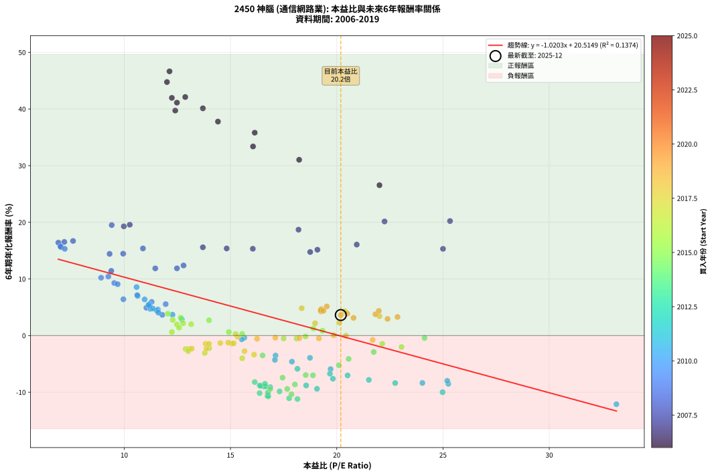
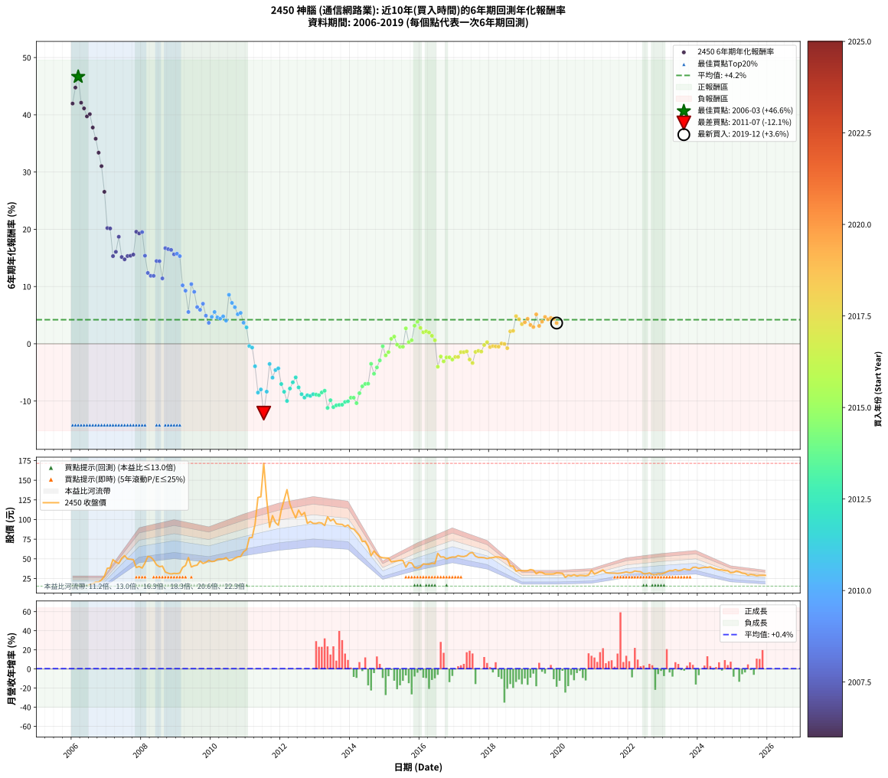

# 2450 神腦 - 本益比與未來報酬率分析

!!! info "報告資訊"
    - **股票代號**: 2450
    - **公司名稱**: 神腦
    - **產業別**: 通信網路業
    - **分析期間**: 2006-2019 (168 個數據點)
    - **資料來源**: Type 12 (ShowMonthlyK_ChartFlow) 月收盤價與本益比
    - **報酬率口徑**: 含現金股利 (簡化: 年度合計，假設每年7/1入帳)
    - **報告生成時間**: 2026-01-06 00:42:17 CST

## 📈 視覺化圖表

### 圖表1: 本益比 vs 未來報酬率關係

*圖表1：2450 神腦 本益比與6年期未來報酬率關係 (2006-2019)*

### 圖表2: 歷年買入時點的6年期實際報酬率

*圖表2：2450 神腦 歷年買入時點的6年期實際報酬率 (2006-2019)*

## 📍 買點訊號說明

本報告提供兩種買點提示訊號（顯示於圖表2的股價子圖中）：

### ▲ 小綠色三角形（回測驗證）
- **計算方式**: 使用全部歷史資料計算本益比第25百分位數
- **用途**: 事後驗證，顯示歷史上哪些時點確實為低估區
- **限制**: 當下無法判斷，僅供回測參考
- **特性**: 後見之明（Look-Ahead Bias）

### ▲ 小橘色三角形（即時訊號）
- **計算方式**: 使用截至當月的過去5年資料計算本益比第25百分位數
- **用途**: 實際投資決策，當時即可判斷
- **優勢**: 可操作性強，符合實務需求
- **特性**: 無後見之明，滾動窗口計算

!!! tip "如何使用兩種訊號"
    - **綠色▲** 幫助理解歷史估值機會，驗證策略有效性
    - **橘色▲** 可作為實際買進參考，但仍需搭配基本面分析
    - 兩種訊號重疊時，表示即時判斷與事後驗證一致，信心度較高
    - 僅有綠色▲時，表示當時無法判斷（需要未來資料才能確認）
    - 僅有橘色▲時，表示即時判斷為買點，但事後可能不是最佳時機

## 📊 估值分析摘要

| 指標 | 數值 |
|:---:|:---:|
| **目前本益比** (2019-12) | **20.19 倍** |
| **歷史平均本益比** | 15.99 倍 |
| **估值水準** | 🔴 相對高估 |
| **預期6年年化報酬率** | **-0.08%** |
| **歷史平均報酬率** | +4.20% |
| **相關係數 (R²)** | 0.1374 |
| **趨勢線斜率** | -1.0203 |

!!! abstract "核心洞察"
    目前本益比顯著高於歷史平均，預期未來報酬率可能較低

    根據歷史數據回測，2450 神腦 在目前本益比 **20.2倍** 的估值水準下，
    預期未來6年年化報酬率約為 **-0.1%**。

    **重要提醒**: 本分析基於歷史數據統計，實際報酬率會受到公司基本面變化、產業趨勢、
    總體經濟環境等多重因素影響。R² = 0.14 表示本益比可解釋約 13.7% 的報酬率變異。

## 📈 歷史估值統計

### 最佳買點 (最高報酬率)

| 項目 | 數值 |
|:---:|:---:|
| 起始時間 | 2006-03 |
| 當時本益比 | 12.13 倍 |
| 起始價格 | 15.4 元 |
| 6年後價格 | 138.0 元 |
| **6年年化報酬率** | **+46.65%** |

### 最差買點 (最低報酬率)

| 項目 | 數值 |
|:---:|:---:|
| 起始時間 | 2011-07 |
| 當時本益比 | 33.16 倍 |
| 起始價格 | 171.5 元 |
| 6年後價格 | 58.0 元 |
| **6年年化報酬率** | **-12.11%** |

## 🎯 投資啟示

### 本益比與報酬率關係

趨勢線方程式: **y = -1.0203x + 20.5149**

!!! warning "強負相關"
    本益比與未來報酬率呈現強負相關。在高本益比時期買入，未來報酬率顯著較低；
    在低本益比時期買入，未來報酬率顯著較高。**估值紀律至關重要**。

### 估值區間建議

基於歷史數據分析:

- **🟢 低估區** (P/E < 12.8): 預期報酬率較高，可考慮增加持股
- **🟡 合理區** (P/E 12.8-19.2): 預期報酬率符合長期趨勢，正常持有
- **🔴 高估區** (P/E > 19.2): 預期報酬率較低，可考慮減碼或觀望

!!! danger "風險提示"
    - 過去表現不代表未來結果
    - 本分析假設公司基本面無重大結構性變化
    - 產業環境劇變可能使歷史規律失效
    - 應結合公司財報、產業趨勢、總體經濟等多重因素綜合判斷

!!! success "長期投資觀點"
    歷史數據顯示，在合理或低估的估值水準買入並長期持有，
    往往能獲得較佳的投資報酬。**耐心等待好價格**是價值投資的核心原則。

## 📊 數據品質

- **資料來源**: GoodInfo.tw Type 12 (ShowMonthlyK_ChartFlow)
- **資料頻率**: 月度收盤價與本益比
- **回測期間**: 2006-2019
- **數據點數量**: 168 個 (每個點代表一次6年期回測)

### 計算方法說明

1. **6年期年化報酬率**:
   - 對每個歷史時點，計算其後6年的實際投資報酬率
   - 期末價值(不含股利): 期末價格
   - 期末價值(含現金股利): 期末價格 + 持有期間內的現金股利合計 (簡化: 年度合計，假設每年7/1入帳)
   - 公式: 年化報酬率 = [(期末價值/期初價格)^(1/年數) - 1] × 100%

2. **本益比 (P/E Ratio)**:
   - 使用當時的月收盤價與EPS計算
   - 資料來源: Type 12 月度河流圖本益比數據

3. **趨勢線 (Linear Regression)**:
   - 使用最小平方法擬合線性趨勢線
   - R²值衡量本益比對報酬率的解釋能力

---

*本報告由 Stock Analysis System v1.9.0 自動生成*
*數據更新時間: 2026-01-06 00:42:17 CST*

## 📋 月度回測明細表

（每一列對應時間線圖中的一個買入點；可用來對照 SVG 圖上的每個點。）

| 買入月份 | 賣出月份 | 回測期限_年 | 實際持有年數 | 買入本益比_倍 | 買入收盤價_元 | 賣出收盤價_元 | 現金股利合計_元 | 總報酬率_pct | 年化報酬率_pct |
| --- | --- | --- | --- | --- | --- | --- | --- | --- | --- |
| 2006-01 | 2012-01 | 6 | 5.999 | 12.24 | 15.55 | 112.00 | 15.23 | +718.23 | +41.96 |
| 2006-02 | 2012-02 | 6 | 5.999 | 12.01 | 15.25 | 125.00 | 15.23 | +819.57 | +44.76 |
| 2006-03 | 2012-03 | 6 | 6.001 | 12.13 | 15.40 | 138.00 | 15.23 | +895.03 | +46.65 |
| 2006-04 | 2012-04 | 6 | 6.001 | 12.87 | 16.35 | 119.50 | 15.23 | +724.06 | +42.11 |
| 2006-05 | 2012-05 | 6 | 6.001 | 12.48 | 15.85 | 110.00 | 15.23 | +690.12 | +41.12 |
| 2006-06 | 2012-06 | 6 | 6.001 | 12.40 | 15.75 | 102.00 | 15.23 | +644.34 | +39.72 |
| 2006-07 | 2012-07 | 6 | 6.001 | 13.70 | 17.40 | 112.00 | 19.72 | +657.01 | +40.11 |
| 2006-08 | 2012-08 | 6 | 6.001 | 14.41 | 18.30 | 105.50 | 19.72 | +584.26 | +37.78 |
| 2006-09 | 2012-09 | 6 | 6.001 | 16.14 | 20.50 | 109.00 | 19.72 | +527.90 | +35.82 |
| 2006-10 | 2012-10 | 6 | 6.001 | 16.06 | 20.40 | 95.20 | 19.72 | +463.33 | +33.38 |
| 2006-11 | 2012-11 | 6 | 6.001 | 18.23 | 23.15 | 97.50 | 19.72 | +406.35 | +31.03 |
| 2006-12 | 2012-12 | 6 | 6.001 | 22.01 | 27.95 | 95.10 | 19.72 | +310.80 | +26.55 |
| 2007-01 | 2013-01 | 6 | 6.001 | 25.33 | 38.00 | 95.00 | 19.72 | +201.89 | +20.21 |
| 2007-02 | 2013-02 | 6 | 6.001 | 22.25 | 38.50 | 96.10 | 19.72 | +200.83 | +20.14 |
| 2007-03 | 2013-03 | 6 | 6.001 | 25.00 | 49.00 | 95.50 | 19.72 | +135.14 | +15.31 |
| 2007-04 | 2013-04 | 6 | 6.001 | 20.94 | 45.85 | 92.40 | 19.72 | +144.53 | +16.07 |
| 2007-05 | 2013-05 | 6 | 6.001 | 18.20 | 44.05 | 103.50 | 19.72 | +179.73 | +18.70 |
| 2007-06 | 2013-06 | 6 | 6.001 | 19.09 | 50.60 | 98.30 | 19.72 | +133.24 | +15.16 |
| 2007-07 | 2013-07 | 6 | 6.001 | 18.75 | 54.00 | 100.50 | 22.81 | +128.36 | +14.75 |
| 2007-08 | 2013-08 | 6 | 6.001 | 16.05 | 49.90 | 94.60 | 22.81 | +135.30 | +15.32 |
| 2007-09 | 2013-09 | 6 | 6.001 | 14.82 | 49.50 | 94.00 | 22.81 | +135.99 | +15.38 |
| 2007-10 | 2013-10 | 6 | 6.001 | 13.70 | 48.90 | 93.80 | 22.81 | +138.48 | +15.58 |
| 2007-11 | 2013-11 | 6 | 6.001 | 10.26 | 39.00 | 91.20 | 22.81 | +192.35 | +19.57 |
| 2007-12 | 2013-12 | 6 | 6.001 | 9.98 | 40.20 | 93.00 | 22.81 | +188.10 | +19.28 |
| 2008-01 | 2014-01 | 6 | 6.001 | 9.41 | 38.30 | 88.80 | 22.81 | +191.42 | +19.51 |
| 2008-02 | 2014-03 | 6 | 6.081 | 10.88 | 44.70 | 83.90 | 22.81 | +138.74 | +15.39 |
| 2008-03 | 2014-03 | 6 | 5.999 | 12.79 | 53.00 | 83.90 | 22.81 | +101.35 | +12.38 |
| 2008-04 | 2014-04 | 6 | 5.999 | 12.48 | 52.20 | 79.50 | 22.81 | +96.01 | +11.87 |
| 2008-05 | 2014-05 | 6 | 5.999 | 11.46 | 48.40 | 72.00 | 22.81 | +95.90 | +11.86 |
| 2008-06 | 2014-06 | 6 | 5.999 | 9.95 | 42.40 | 72.50 | 22.81 | +124.80 | +14.46 |
| 2008-07 | 2014-07 | 6 | 5.999 | 9.31 | 40.00 | 65.90 | 23.86 | +124.41 | +14.43 |
| 2008-08 | 2014-08 | 6 | 5.999 | 9.39 | 40.70 | 54.00 | 23.86 | +91.31 | +11.42 |
| 2008-09 | 2014-09 | 6 | 5.999 | 7.59 | 33.20 | 60.00 | 23.86 | +152.61 | +16.70 |
| 2008-10 | 2014-10 | 6 | 5.999 | 7.18 | 31.70 | 55.50 | 23.86 | +150.36 | +16.53 |
| 2008-11 | 2014-11 | 6 | 5.999 | 6.90 | 30.70 | 52.50 | 23.86 | +148.75 | +16.41 |
| 2008-12 | 2014-12 | 6 | 5.999 | 7.02 | 31.50 | 51.40 | 23.86 | +138.94 | +15.63 |
| 2009-01 | 2015-01 | 6 | 5.999 | 7.00 | 31.20 | 51.10 | 23.86 | +140.27 | +15.74 |
| 2009-02 | 2015-02 | 6 | 5.999 | 7.20 | 31.85 | 51.00 | 23.86 | +135.05 | +15.31 |
| 2009-03 | 2015-03 | 6 | 5.999 | 8.91 | 39.10 | 46.20 | 23.86 | +79.19 | +10.21 |
| 2009-04 | 2015-04 | 6 | 5.999 | 9.53 | 41.50 | 46.80 | 23.86 | +70.28 | +9.28 |
| 2009-05 | 2015-05 | 6 | 5.999 | 11.95 | 51.60 | 47.50 | 23.86 | +38.30 | +5.55 |
| 2009-06 | 2015-06 | 6 | 5.999 | 9.25 | 39.65 | 48.00 | 23.86 | +81.25 | +10.42 |
| 2009-07 | 2015-07 | 6 | 5.999 | 9.69 | 41.20 | 47.90 | 21.47 | +68.38 | +9.07 |
| 2009-08 | 2015-08 | 6 | 5.999 | 9.96 | 42.00 | 39.50 | 21.47 | +45.17 | +6.41 |
| 2009-09 | 2015-09 | 6 | 5.999 | 11.29 | 47.20 | 45.25 | 21.47 | +41.36 | +5.94 |
| 2009-10 | 2015-10 | 6 | 5.999 | 10.63 | 44.10 | 44.70 | 21.47 | +50.05 | +7.00 |
| 2009-11 | 2015-11 | 6 | 5.999 | 11.04 | 45.40 | 39.05 | 21.47 | +33.31 | +4.91 |
| 2009-12 | 2015-12 | 6 | 5.999 | 11.79 | 48.10 | 38.20 | 21.47 | +24.06 | +3.66 |
| 2010-01 | 2016-01 | 6 | 5.999 | 11.23 | 46.50 | 39.80 | 21.47 | +31.77 | +4.71 |
| 2010-02 | 2016-02 | 6 | 5.999 | 11.19 | 47.00 | 43.55 | 21.47 | +38.35 | +5.56 |
| 2010-03 | 2016-03 | 6 | 6.001 | 11.58 | 49.35 | 43.20 | 21.47 | +31.05 | +4.61 |
| 2010-04 | 2016-04 | 6 | 6.001 | 11.53 | 49.85 | 43.10 | 21.47 | +29.53 | +4.41 |
| 2010-05 | 2016-05 | 6 | 6.001 | 11.34 | 49.70 | 44.35 | 21.47 | +32.44 | +4.79 |
| 2010-06 | 2016-06 | 6 | 6.001 | 11.61 | 51.60 | 44.00 | 21.47 | +26.89 | +4.05 |
| 2010-07 | 2016-07 | 6 | 6.001 | 10.58 | 47.65 | 57.00 | 21.01 | +63.72 | +8.56 |
| 2010-08 | 2016-08 | 6 | 6.001 | 10.61 | 48.45 | 52.30 | 21.01 | +51.32 | +7.15 |
| 2010-09 | 2016-09 | 6 | 6.001 | 10.96 | 50.70 | 52.50 | 21.01 | +45.00 | +6.39 |
| 2010-10 | 2016-10 | 6 | 6.001 | 11.20 | 52.50 | 50.00 | 21.01 | +35.26 | +5.16 |
| 2010-11 | 2016-11 | 6 | 6.001 | 11.14 | 52.90 | 51.50 | 21.01 | +37.08 | +5.40 |
| 2010-12 | 2016-12 | 6 | 6.001 | 12.27 | 59.00 | 52.30 | 21.01 | +24.26 | +3.69 |
| 2011-01 | 2017-01 | 6 | 6.001 | 12.71 | 61.80 | 52.20 | 21.01 | +18.47 | +2.86 |
| 2011-02 | 2017-02 | 6 | 6.001 | 15.65 | 76.90 | 54.10 | 21.01 | -2.32 | -0.39 |
| 2011-03 | 2017-03 | 6 | 6.001 | 15.53 | 77.10 | 53.10 | 21.01 | -3.87 | -0.66 |
| 2011-04 | 2017-04 | 6 | 6.001 | 18.74 | 94.00 | 52.90 | 21.01 | -21.37 | -3.93 |
| 2011-05 | 2017-05 | 6 | 6.001 | 25.25 | 128.00 | 54.00 | 21.01 | -41.40 | -8.52 |
| 2011-06 | 2017-06 | 6 | 6.001 | 25.20 | 129.00 | 57.30 | 21.01 | -39.29 | -7.98 |
| 2011-07 | 2017-07 | 6 | 6.001 | 33.16 | 171.50 | 58.00 | 21.02 | -53.92 | -12.11 |
| 2011-08 | 2017-08 | 6 | 6.001 | 24.03 | 125.50 | 53.30 | 21.02 | -40.78 | -8.36 |
| 2011-09 | 2017-09 | 6 | 6.001 | 17.12 | 90.30 | 51.80 | 21.02 | -19.36 | -3.52 |
| 2011-10 | 2017-10 | 6 | 6.001 | 19.71 | 105.00 | 51.80 | 21.02 | -30.65 | -5.92 |
| 2011-11 | 2017-11 | 6 | 6.001 | 17.89 | 96.20 | 51.50 | 21.02 | -24.62 | -4.60 |
| 2011-12 | 2017-12 | 6 | 6.001 | 17.09 | 92.80 | 50.30 | 21.02 | -23.15 | -4.29 |
| 2012-01 | 2018-01 | 6 | 6.001 | 20.51 | 112.00 | 51.30 | 21.02 | -35.43 | -7.03 |
| 2012-02 | 2018-03 | 6 | 6.081 | 22.75 | 125.00 | 52.40 | 21.02 | -41.26 | -8.38 |
| 2012-03 | 2018-03 | 6 | 5.999 | 24.98 | 138.00 | 52.40 | 21.02 | -46.80 | -9.99 |
| 2012-04 | 2018-04 | 6 | 5.999 | 21.51 | 119.50 | 52.30 | 21.02 | -38.64 | -7.82 |
| 2012-05 | 2018-05 | 6 | 5.999 | 19.68 | 110.00 | 51.40 | 21.02 | -34.16 | -6.73 |
| 2012-06 | 2018-06 | 6 | 5.999 | 18.15 | 102.00 | 49.95 | 21.02 | -30.42 | -5.87 |
| 2012-07 | 2018-07 | 6 | 5.999 | 19.82 | 112.00 | 49.95 | 19.70 | -37.81 | -7.61 |
| 2012-08 | 2018-08 | 6 | 5.999 | 18.56 | 105.50 | 41.00 | 19.70 | -42.46 | -8.80 |
| 2012-09 | 2018-09 | 6 | 5.999 | 19.07 | 109.00 | 40.60 | 19.70 | -44.68 | -9.40 |
| 2012-10 | 2018-10 | 6 | 5.999 | 16.57 | 95.20 | 34.40 | 19.70 | -43.17 | -8.99 |
| 2012-11 | 2018-11 | 6 | 5.999 | 16.87 | 97.50 | 35.30 | 19.70 | -43.59 | -9.10 |
| 2012-12 | 2018-12 | 6 | 5.999 | 16.37 | 95.10 | 35.00 | 19.70 | -42.48 | -8.81 |
| 2013-01 | 2019-01 | 6 | 5.999 | 16.41 | 95.00 | 34.70 | 19.70 | -42.74 | -8.87 |
| 2013-02 | 2019-02 | 6 | 5.999 | 16.66 | 96.10 | 34.95 | 19.70 | -43.13 | -8.98 |
| 2013-03 | 2019-03 | 6 | 5.999 | 16.62 | 95.50 | 36.35 | 19.70 | -41.31 | -8.50 |
| 2013-04 | 2019-04 | 6 | 5.999 | 16.14 | 92.40 | 35.60 | 19.70 | -40.15 | -8.20 |
| 2013-05 | 2019-05 | 6 | 5.999 | 18.15 | 103.50 | 31.05 | 19.70 | -50.97 | -11.20 |
| 2013-06 | 2019-06 | 6 | 5.999 | 17.31 | 98.30 | 33.05 | 19.70 | -46.34 | -9.86 |
| 2013-07 | 2019-07 | 6 | 5.999 | 17.76 | 100.50 | 32.60 | 17.16 | -50.49 | -11.06 |
| 2013-08 | 2019-08 | 6 | 5.999 | 16.78 | 94.60 | 30.65 | 17.16 | -49.46 | -10.75 |
| 2013-09 | 2019-09 | 6 | 5.999 | 16.74 | 94.00 | 30.60 | 17.16 | -49.19 | -10.67 |
| 2013-10 | 2019-10 | 6 | 5.999 | 16.77 | 93.80 | 30.60 | 17.16 | -49.09 | -10.64 |
| 2013-11 | 2019-11 | 6 | 5.999 | 16.37 | 91.20 | 30.80 | 17.16 | -47.41 | -10.16 |
| 2013-12 | 2019-12 | 6 | 5.999 | 16.76 | 93.00 | 32.10 | 17.16 | -47.03 | -10.05 |
| 2014-01 | 2020-01 | 6 | 5.999 | 16.87 | 88.80 | 31.90 | 17.16 | -44.75 | -9.42 |
| 2014-02 | 2020-02 | 6 | 5.999 | 17.67 | 88.00 | 31.45 | 17.16 | -44.76 | -9.42 |
| 2014-03 | 2020-03 | 6 | 6.001 | 17.87 | 83.90 | 26.35 | 17.16 | -48.14 | -10.36 |
| 2014-04 | 2020-04 | 6 | 6.001 | 18.03 | 79.50 | 29.10 | 17.16 | -41.81 | -8.63 |
| 2014-05 | 2020-05 | 6 | 6.001 | 17.45 | 72.00 | 28.15 | 17.16 | -37.07 | -7.43 |
| 2014-06 | 2020-06 | 6 | 6.001 | 18.88 | 72.50 | 29.70 | 17.16 | -35.37 | -7.01 |
| 2014-07 | 2020-07 | 6 | 6.001 | 18.54 | 65.90 | 28.10 | 14.61 | -35.19 | -6.97 |
| 2014-08 | 2020-08 | 6 | 6.001 | 16.51 | 54.00 | 29.00 | 14.61 | -19.24 | -3.50 |
| 2014-09 | 2020-09 | 6 | 6.001 | 20.10 | 60.00 | 28.85 | 14.61 | -27.57 | -5.23 |
| 2014-10 | 2020-10 | 6 | 6.001 | 20.56 | 55.50 | 28.50 | 14.61 | -22.33 | -4.12 |
| 2014-11 | 2020-11 | 6 | 6.001 | 21.74 | 52.50 | 29.40 | 14.61 | -16.18 | -2.90 |
| 2014-12 | 2020-12 | 6 | 6.001 | 24.13 | 51.40 | 35.50 | 14.61 | -2.51 | -0.42 |
| 2015-01 | 2021-01 | 6 | 6.001 | 23.05 | 51.10 | 30.60 | 14.61 | -11.53 | -2.02 |
| 2015-02 | 2021-02 | 6 | 6.001 | 22.14 | 51.00 | 32.10 | 14.61 | -8.42 | -1.45 |
| 2015-03 | 2021-03 | 6 | 6.001 | 19.33 | 46.20 | 34.05 | 14.61 | +5.32 | +0.87 |
| 2015-04 | 2021-04 | 6 | 6.001 | 18.90 | 46.80 | 35.85 | 14.61 | +7.82 | +1.26 |
| 2015-05 | 2021-05 | 6 | 6.001 | 18.53 | 47.50 | 32.45 | 14.61 | -0.93 | -0.16 |
| 2015-06 | 2021-06 | 6 | 6.001 | 18.11 | 48.00 | 31.90 | 14.61 | -3.11 | -0.52 |
| 2015-07 | 2021-07 | 6 | 6.001 | 17.50 | 47.90 | 31.90 | 14.55 | -3.03 | -0.51 |
| 2015-08 | 2021-08 | 6 | 6.001 | 13.99 | 39.50 | 31.80 | 14.55 | +17.34 | +2.70 |
| 2015-09 | 2021-09 | 6 | 6.001 | 15.55 | 45.25 | 31.50 | 14.55 | +1.76 | +0.29 |
| 2015-10 | 2021-10 | 6 | 6.001 | 14.92 | 44.70 | 31.85 | 14.55 | +3.80 | +0.62 |
| 2015-11 | 2021-11 | 6 | 6.001 | 12.66 | 39.05 | 32.50 | 14.55 | +20.48 | +3.15 |
| 2015-12 | 2021-12 | 6 | 6.001 | 12.05 | 38.20 | 33.40 | 14.55 | +25.52 | +3.86 |
| 2016-01 | 2022-01 | 6 | 6.001 | 12.28 | 39.80 | 32.35 | 14.55 | +17.83 | +2.77 |
| 2016-02 | 2022-03 | 6 | 6.081 | 13.15 | 43.55 | 34.60 | 14.55 | +12.85 | +2.01 |
| 2016-03 | 2022-03 | 6 | 5.999 | 12.77 | 43.20 | 34.60 | 14.55 | +13.77 | +2.17 |
| 2016-04 | 2022-04 | 6 | 5.999 | 12.48 | 43.10 | 33.90 | 14.55 | +12.41 | +1.97 |
| 2016-05 | 2022-05 | 6 | 5.999 | 12.58 | 44.35 | 33.65 | 14.55 | +8.68 | +1.40 |
| 2016-06 | 2022-06 | 6 | 5.999 | 12.24 | 44.00 | 31.10 | 14.55 | +3.75 | +0.61 |
| 2016-07 | 2022-07 | 6 | 5.999 | 15.55 | 57.00 | 31.05 | 13.55 | -21.76 | -4.01 |
| 2016-08 | 2022-08 | 6 | 5.999 | 14.00 | 52.30 | 32.15 | 13.55 | -12.62 | -2.22 |
| 2016-09 | 2022-09 | 6 | 5.999 | 13.79 | 52.50 | 30.00 | 13.55 | -17.05 | -3.07 |
| 2016-10 | 2022-10 | 6 | 5.999 | 12.89 | 50.00 | 29.75 | 13.55 | -13.40 | -2.37 |
| 2016-11 | 2022-11 | 6 | 5.999 | 13.04 | 51.50 | 31.05 | 13.55 | -13.40 | -2.37 |
| 2016-12 | 2022-12 | 6 | 5.999 | 13.01 | 52.30 | 30.70 | 13.55 | -15.40 | -2.75 |
| 2017-01 | 2023-01 | 6 | 5.999 | 13.18 | 52.20 | 31.85 | 13.55 | -13.03 | -2.30 |
| 2017-02 | 2023-02 | 6 | 5.999 | 13.87 | 54.10 | 33.50 | 13.55 | -13.04 | -2.30 |
| 2017-03 | 2023-03 | 6 | 5.999 | 13.83 | 53.10 | 35.10 | 13.55 | -8.38 | -1.45 |
| 2017-04 | 2023-04 | 6 | 5.999 | 13.99 | 52.90 | 34.90 | 13.55 | -8.42 | -1.45 |
| 2017-05 | 2023-05 | 6 | 5.999 | 14.52 | 54.00 | 36.30 | 13.55 | -7.69 | -1.32 |
| 2017-06 | 2023-06 | 6 | 5.999 | 15.66 | 57.30 | 34.95 | 13.55 | -15.36 | -2.74 |
| 2017-07 | 2023-07 | 6 | 5.999 | 16.11 | 58.00 | 35.50 | 11.77 | -18.51 | -3.35 |
| 2017-08 | 2023-08 | 6 | 5.999 | 15.06 | 53.30 | 37.15 | 11.77 | -8.23 | -1.42 |
| 2017-09 | 2023-09 | 6 | 5.999 | 14.89 | 51.80 | 36.30 | 11.77 | -7.21 | -1.24 |
| 2017-10 | 2023-10 | 6 | 5.999 | 15.15 | 51.80 | 35.95 | 11.77 | -7.88 | -1.36 |
| 2017-11 | 2023-11 | 6 | 5.999 | 15.33 | 51.50 | 39.10 | 11.77 | -1.23 | -0.21 |
| 2017-12 | 2023-12 | 6 | 5.999 | 15.24 | 50.30 | 39.40 | 11.77 | +1.72 | +0.28 |
| 2018-01 | 2024-01 | 6 | 5.999 | 16.25 | 51.30 | 37.80 | 11.77 | -3.38 | -0.57 |
| 2018-02 | 2024-02 | 6 | 5.999 | 17.11 | 51.60 | 38.65 | 11.77 | -2.29 | -0.39 |
| 2018-03 | 2024-03 | 6 | 6.001 | 18.24 | 52.40 | 39.20 | 11.77 | -2.74 | -0.46 |
| 2018-04 | 2024-04 | 6 | 6.001 | 19.16 | 52.30 | 39.00 | 11.77 | -2.93 | -0.49 |
| 2018-05 | 2024-05 | 6 | 6.001 | 19.86 | 51.40 | 39.80 | 11.77 | +0.32 | +0.05 |
| 2018-06 | 2024-06 | 6 | 6.001 | 20.43 | 49.95 | 38.10 | 11.77 | -0.17 | -0.03 |
| 2018-07 | 2024-07 | 6 | 6.001 | 21.69 | 49.95 | 37.10 | 10.60 | -4.50 | -0.77 |
| 2018-08 | 2024-08 | 6 | 6.001 | 18.98 | 41.00 | 36.05 | 10.60 | +13.78 | +2.17 |
| 2018-09 | 2024-09 | 6 | 6.001 | 20.12 | 40.60 | 35.85 | 10.60 | +14.41 | +2.27 |
| 2018-10 | 2024-10 | 6 | 6.001 | 18.35 | 34.40 | 35.05 | 10.60 | +32.70 | +4.83 |
| 2018-11 | 2024-11 | 6 | 6.001 | 20.38 | 35.30 | 34.85 | 10.60 | +28.75 | +4.30 |
| 2018-12 | 2024-12 | 6 | 6.001 | 22.01 | 35.00 | 32.25 | 10.60 | +22.43 | +3.43 |
| 2019-01 | 2025-01 | 6 | 6.001 | 21.82 | 34.70 | 32.70 | 10.60 | +24.78 | +3.76 |
| 2019-02 | 2025-02 | 6 | 6.001 | 21.98 | 34.95 | 34.55 | 10.60 | +29.18 | +4.36 |
| 2019-03 | 2025-03 | 6 | 6.001 | 22.86 | 36.35 | 33.55 | 10.60 | +21.46 | +3.29 |
| 2019-04 | 2025-04 | 6 | 6.001 | 22.39 | 35.60 | 31.75 | 10.60 | +18.96 | +2.94 |
| 2019-05 | 2025-05 | 6 | 6.001 | 19.53 | 31.05 | 31.35 | 10.60 | +35.10 | +5.14 |
| 2019-06 | 2025-06 | 6 | 6.001 | 20.79 | 33.05 | 29.15 | 10.60 | +20.27 | +3.12 |
| 2019-07 | 2025-07 | 6 | 6.001 | 20.50 | 32.60 | 30.15 | 10.80 | +25.61 | +3.87 |
| 2019-08 | 2025-08 | 6 | 6.001 | 19.28 | 30.65 | 29.55 | 10.80 | +31.65 | +4.69 |
| 2019-09 | 2025-09 | 6 | 6.001 | 19.25 | 30.60 | 28.55 | 10.80 | +28.59 | +4.28 |
| 2019-10 | 2025-10 | 6 | 6.001 | 19.25 | 30.60 | 29.05 | 10.80 | +30.23 | +4.50 |
| 2019-11 | 2025-11 | 6 | 6.001 | 19.37 | 30.80 | 29.00 | 10.80 | +29.22 | +4.36 |
| 2019-12 | 2025-12 | 6 | 6.001 | 20.19 | 32.10 | 28.95 | 10.80 | +23.83 | +3.63 |
