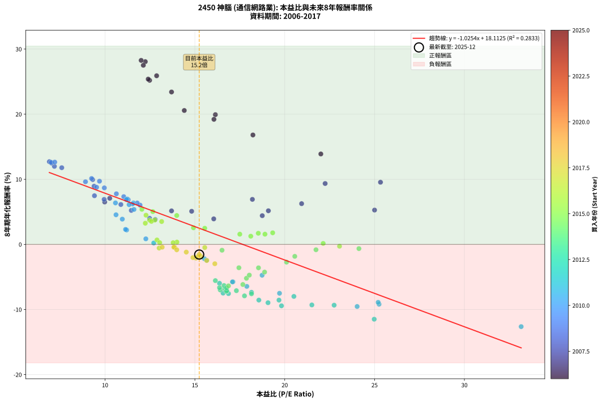
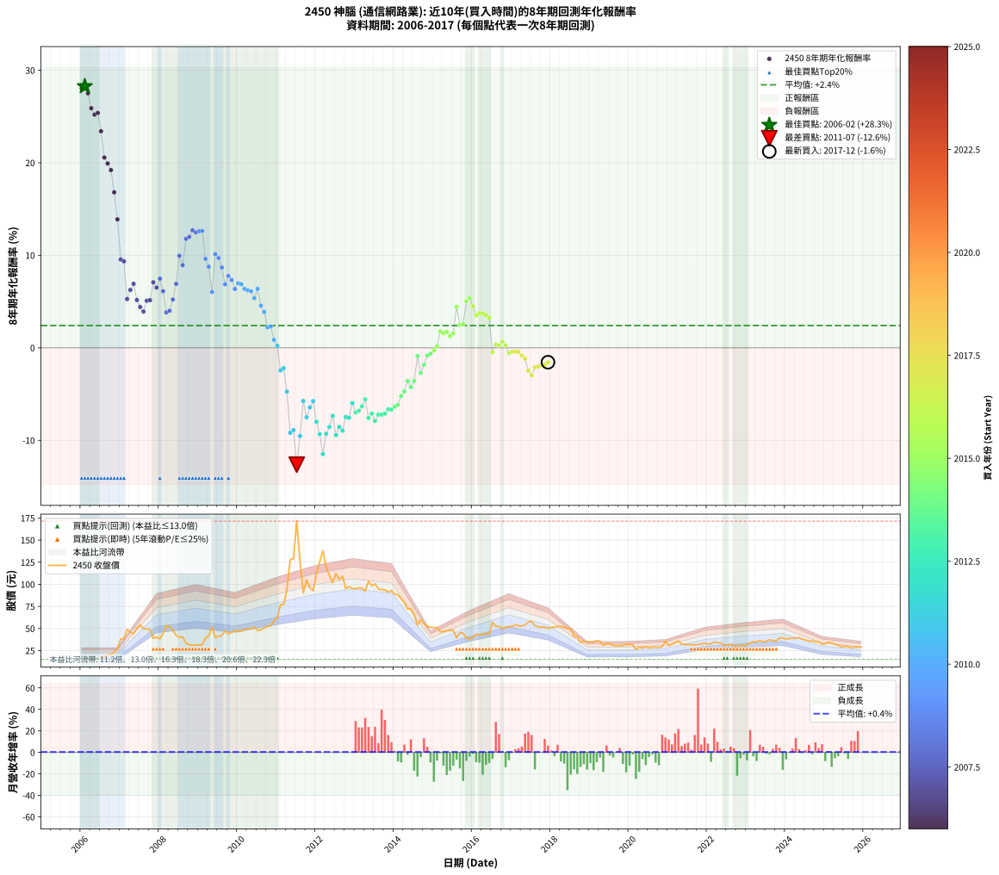

# 2450 神腦 - 本益比與未來報酬率分析

!!! info "報告資訊"
    - **股票代號**: 2450
    - **公司名稱**: 神腦
    - **產業別**: 通信網路業
    - **分析期間**: 2006-2017 (144 個數據點)
    - **資料來源**: Type 12 (ShowMonthlyK_ChartFlow) 月收盤價與本益比
    - **報酬率口徑**: 含現金股利 (簡化: 年度合計，假設每年7/1入帳)
    - **報告生成時間**: 2026-01-09 20:48:18 CST

## 📈 視覺化圖表

### 圖表1: 本益比 vs 未來報酬率關係

*圖表1：2450 神腦 本益比與8年期未來報酬率關係 (2006-2017)*

### 圖表2: 歷年買入時點的8年期實際報酬率

*圖表2：2450 神腦 歷年買入時點的8年期實際報酬率 (2006-2017)*

## 📍 買點訊號說明

本報告提供兩種買點提示訊號（顯示於圖表2的股價子圖中）：

### ▲ 小綠色三角形（回測驗證）
- **計算方式**: 使用全部歷史資料計算本益比第25百分位數
- **用途**: 事後驗證，顯示歷史上哪些時點確實為低估區
- **限制**: 當下無法判斷，僅供回測參考
- **特性**: 後見之明（Look-Ahead Bias）

### ▲ 小橘色三角形（即時訊號）
- **計算方式**: 使用截至當月的過去5年資料計算本益比第25百分位數
- **用途**: 實際投資決策，當時即可判斷
- **優勢**: 可操作性強，符合實務需求
- **特性**: 無後見之明，滾動窗口計算

!!! tip "如何使用兩種訊號"
    - **綠色▲** 幫助理解歷史估值機會，驗證策略有效性
    - **橘色▲** 可作為實際買進參考，但仍需搭配基本面分析
    - 兩種訊號重疊時，表示即時判斷與事後驗證一致，信心度較高
    - 僅有綠色▲時，表示當時無法判斷（需要未來資料才能確認）
    - 僅有橘色▲時，表示即時判斷為買點，但事後可能不是最佳時機

## 📊 估值分析摘要

| 指標 | 數值 |
|:---:|:---:|
| **目前本益比** (2017-12) | **15.24 倍** |
| **歷史平均本益比** | 15.32 倍 |
| **估值水準** | 🟡 合理範圍 |
| **預期8年年化報酬率** | **+2.49%** |
| **歷史平均報酬率** | +2.40% |
| **相關係數 (R²)** | 0.2833 |
| **趨勢線斜率** | -1.0254 |

!!! abstract "核心洞察"
    目前本益比接近歷史平均，預期報酬率符合長期趨勢

    根據歷史數據回測，2450 神腦 在目前本益比 **15.2倍** 的估值水準下，
    預期未來8年年化報酬率約為 **+2.5%**。

    **重要提醒**: 本分析基於歷史數據統計，實際報酬率會受到公司基本面變化、產業趨勢、
    總體經濟環境等多重因素影響。R² = 0.28 表示本益比可解釋約 28.3% 的報酬率變異。

## 📈 歷史估值統計

### 最佳買點 (最高報酬率)

| 項目 | 數值 |
|:---:|:---:|
| 起始時間 | 2006-02 |
| 當時本益比 | 12.01 倍 |
| 起始價格 | 15.2 元 |
| 8年後價格 | 88.0 元 |
| **8年年化報酬率** | **+28.26%** |

### 最差買點 (最低報酬率)

| 項目 | 數值 |
|:---:|:---:|
| 起始時間 | 2011-07 |
| 當時本益比 | 33.16 倍 |
| 起始價格 | 171.5 元 |
| 8年後價格 | 32.6 元 |
| **8年年化報酬率** | **-12.63%** |

## 🎯 投資啟示

### 本益比與報酬率關係

趨勢線方程式: **y = -1.0254x + 18.1125**

!!! warning "強負相關"
    本益比與未來報酬率呈現強負相關。在高本益比時期買入，未來報酬率顯著較低；
    在低本益比時期買入，未來報酬率顯著較高。**估值紀律至關重要**。

### 估值區間建議

基於歷史數據分析:

- **🟢 低估區** (P/E < 12.3): 預期報酬率較高，可考慮增加持股
- **🟡 合理區** (P/E 12.3-18.4): 預期報酬率符合長期趨勢，正常持有
- **🔴 高估區** (P/E > 18.4): 預期報酬率較低，可考慮減碼或觀望

!!! danger "風險提示"
    - 過去表現不代表未來結果
    - 本分析假設公司基本面無重大結構性變化
    - 產業環境劇變可能使歷史規律失效
    - 應結合公司財報、產業趨勢、總體經濟等多重因素綜合判斷

!!! success "長期投資觀點"
    歷史數據顯示，在合理或低估的估值水準買入並長期持有，
    往往能獲得較佳的投資報酬。**耐心等待好價格**是價值投資的核心原則。

## 📊 數據品質

- **資料來源**: GoodInfo.tw Type 12 (ShowMonthlyK_ChartFlow)
- **資料頻率**: 月度收盤價與本益比
- **回測期間**: 2006-2017
- **數據點數量**: 144 個 (每個點代表一次8年期回測)

### 計算方法說明

1. **8年期年化報酬率**:
   - 對每個歷史時點，計算其後8年的實際投資報酬率
   - 期末價值(不含股利): 期末價格
   - 期末價值(含現金股利): 期末價格 + 持有期間內的現金股利合計 (簡化: 年度合計，假設每年7/1入帳)
   - 公式: 年化報酬率 = [(期末價值/期初價格)^(1/年數) - 1] × 100%

2. **本益比 (P/E Ratio)**:
   - 使用當時的月收盤價與EPS計算
   - 資料來源: Type 12 月度河流圖本益比數據

3. **趨勢線 (Linear Regression)**:
   - 使用最小平方法擬合線性趨勢線
   - R²值衡量本益比對報酬率的解釋能力

---

*本報告由 Stock Analysis System v1.9.0 自動生成*
*數據更新時間: 2026-01-09 20:48:18 CST*

## 📋 月度回測明細表

（每一列對應時間線圖中的一個買入點；可用來對照 SVG 圖上的每個點。）

| 買入月份 | 賣出月份 | 回測期限_年 | 實際持有年數 | 買入本益比_倍 | 買入收盤價_元 | 賣出收盤價_元 | 現金股利合計_元 | 總報酬率_pct | 年化報酬率_pct |
| --- | --- | --- | --- | --- | --- | --- | --- | --- | --- |
| 2006-01 | 2014-01 | 8 | 8.000 | 12.24 | 15.55 | 88.80 | 23.71 | +623.55 | +28.07 |
| 2006-02 | 2014-02 | 8 | 8.000 | 12.01 | 15.25 | 88.00 | 23.71 | +632.54 | +28.26 |
| 2006-03 | 2014-03 | 8 | 8.000 | 12.13 | 15.40 | 83.90 | 23.71 | +598.78 | +27.51 |
| 2006-04 | 2014-04 | 8 | 8.000 | 12.87 | 16.35 | 79.50 | 23.71 | +531.27 | +25.90 |
| 2006-05 | 2014-05 | 8 | 8.000 | 12.48 | 15.85 | 72.00 | 23.71 | +503.86 | +25.20 |
| 2006-06 | 2014-06 | 8 | 8.000 | 12.40 | 15.75 | 72.50 | 23.71 | +510.87 | +25.38 |
| 2006-07 | 2014-07 | 8 | 8.000 | 13.70 | 17.40 | 65.90 | 27.71 | +438.00 | +23.41 |
| 2006-08 | 2014-08 | 8 | 8.000 | 14.41 | 18.30 | 54.00 | 27.71 | +346.51 | +20.57 |
| 2006-09 | 2014-09 | 8 | 8.000 | 16.14 | 20.50 | 60.00 | 27.71 | +327.86 | +19.93 |
| 2006-10 | 2014-10 | 8 | 8.000 | 16.06 | 20.40 | 55.50 | 27.71 | +307.90 | +19.21 |
| 2006-11 | 2014-11 | 8 | 8.000 | 18.23 | 23.15 | 52.50 | 27.71 | +246.49 | +16.80 |
| 2006-12 | 2014-12 | 8 | 8.000 | 22.01 | 27.95 | 51.40 | 27.71 | +183.05 | +13.89 |
| 2007-01 | 2015-01 | 8 | 8.000 | 25.33 | 38.00 | 51.10 | 27.71 | +107.40 | +9.55 |
| 2007-02 | 2015-02 | 8 | 8.000 | 22.25 | 38.50 | 51.00 | 27.71 | +104.45 | +9.35 |
| 2007-03 | 2015-03 | 8 | 8.000 | 25.00 | 49.00 | 46.20 | 27.71 | +50.84 | +5.27 |
| 2007-04 | 2015-04 | 8 | 8.000 | 20.94 | 45.85 | 46.80 | 27.71 | +62.51 | +6.26 |
| 2007-05 | 2015-05 | 8 | 8.000 | 18.20 | 44.05 | 47.50 | 27.71 | +70.74 | +6.92 |
| 2007-06 | 2015-06 | 8 | 8.000 | 19.09 | 50.60 | 48.00 | 27.71 | +49.63 | +5.17 |
| 2007-07 | 2015-07 | 8 | 8.000 | 18.75 | 54.00 | 47.90 | 28.38 | +41.25 | +4.41 |
| 2007-08 | 2015-08 | 8 | 8.000 | 16.05 | 49.90 | 39.50 | 28.38 | +36.02 | +3.92 |
| 2007-09 | 2015-09 | 8 | 8.000 | 14.82 | 49.50 | 45.25 | 28.38 | +48.74 | +5.09 |
| 2007-10 | 2015-10 | 8 | 8.000 | 13.70 | 48.90 | 44.70 | 28.38 | +49.44 | +5.15 |
| 2007-11 | 2015-11 | 8 | 8.000 | 10.26 | 39.00 | 39.05 | 28.38 | +72.88 | +7.08 |
| 2007-12 | 2015-12 | 8 | 8.000 | 9.98 | 40.20 | 38.20 | 28.38 | +65.61 | +6.51 |
| 2008-01 | 2016-01 | 8 | 8.000 | 9.41 | 38.30 | 39.80 | 28.38 | +78.00 | +7.47 |
| 2008-02 | 2016-02 | 8 | 8.000 | 10.88 | 44.70 | 43.55 | 28.38 | +60.91 | +6.13 |
| 2008-03 | 2016-03 | 8 | 8.000 | 12.79 | 53.00 | 43.20 | 28.38 | +35.05 | +3.83 |
| 2008-04 | 2016-04 | 8 | 8.000 | 12.48 | 52.20 | 43.10 | 28.38 | +36.93 | +4.01 |
| 2008-05 | 2016-05 | 8 | 8.000 | 11.46 | 48.40 | 44.35 | 28.38 | +50.26 | +5.22 |
| 2008-06 | 2016-06 | 8 | 8.000 | 9.95 | 42.40 | 44.00 | 28.38 | +70.70 | +6.91 |
| 2008-07 | 2016-07 | 8 | 8.000 | 9.31 | 40.00 | 57.00 | 28.43 | +113.56 | +9.95 |
| 2008-08 | 2016-08 | 8 | 8.000 | 9.39 | 40.70 | 52.30 | 28.43 | +98.34 | +8.94 |
| 2008-09 | 2016-09 | 8 | 8.000 | 7.59 | 33.20 | 52.50 | 28.43 | +143.75 | +11.78 |
| 2008-10 | 2016-10 | 8 | 8.000 | 7.18 | 31.70 | 50.00 | 28.43 | +147.40 | +11.99 |
| 2008-11 | 2016-11 | 8 | 8.000 | 6.90 | 30.70 | 51.50 | 28.43 | +160.34 | +12.70 |
| 2008-12 | 2016-12 | 8 | 8.000 | 7.02 | 31.50 | 52.30 | 28.43 | +156.27 | +12.48 |
| 2009-01 | 2017-01 | 8 | 8.000 | 7.00 | 31.20 | 52.20 | 28.43 | +158.41 | +12.60 |
| 2009-02 | 2017-02 | 8 | 8.000 | 7.20 | 31.85 | 54.10 | 28.43 | +159.11 | +12.64 |
| 2009-03 | 2017-03 | 8 | 8.000 | 8.91 | 39.10 | 53.10 | 28.43 | +108.50 | +9.62 |
| 2009-04 | 2017-04 | 8 | 8.000 | 9.53 | 41.50 | 52.90 | 28.43 | +95.96 | +8.77 |
| 2009-05 | 2017-05 | 8 | 8.000 | 11.95 | 51.60 | 54.00 | 28.43 | +59.74 | +6.03 |
| 2009-06 | 2017-06 | 8 | 8.000 | 9.25 | 39.65 | 57.30 | 28.43 | +116.20 | +10.12 |
| 2009-07 | 2017-07 | 8 | 8.000 | 9.69 | 41.20 | 58.00 | 28.46 | +109.84 | +9.71 |
| 2009-08 | 2017-08 | 8 | 8.000 | 9.96 | 42.00 | 53.30 | 28.46 | +94.65 | +8.68 |
| 2009-09 | 2017-09 | 8 | 8.000 | 11.29 | 47.20 | 51.80 | 28.46 | +70.03 | +6.86 |
| 2009-10 | 2017-10 | 8 | 8.000 | 10.63 | 44.10 | 51.80 | 28.46 | +81.98 | +7.77 |
| 2009-11 | 2017-11 | 8 | 8.000 | 11.04 | 45.40 | 51.50 | 28.46 | +76.11 | +7.33 |
| 2009-12 | 2017-12 | 8 | 8.000 | 11.79 | 48.10 | 50.30 | 28.46 | +63.73 | +6.36 |
| 2010-01 | 2018-01 | 8 | 8.000 | 11.23 | 46.50 | 51.30 | 28.46 | +71.52 | +6.98 |
| 2010-02 | 2018-02 | 8 | 8.000 | 11.19 | 47.00 | 51.60 | 28.46 | +70.33 | +6.88 |
| 2010-03 | 2018-03 | 8 | 8.000 | 11.58 | 49.35 | 52.40 | 28.46 | +63.84 | +6.37 |
| 2010-04 | 2018-04 | 8 | 8.000 | 11.53 | 49.85 | 52.30 | 28.46 | +62.00 | +6.22 |
| 2010-05 | 2018-05 | 8 | 8.000 | 11.34 | 49.70 | 51.40 | 28.46 | +60.67 | +6.11 |
| 2010-06 | 2018-06 | 8 | 8.000 | 11.61 | 51.60 | 49.95 | 28.46 | +51.95 | +5.37 |
| 2010-07 | 2018-07 | 8 | 8.000 | 10.58 | 47.65 | 49.95 | 28.16 | +63.93 | +6.37 |
| 2010-08 | 2018-08 | 8 | 8.000 | 10.61 | 48.45 | 41.00 | 28.16 | +42.75 | +4.55 |
| 2010-09 | 2018-09 | 8 | 8.000 | 10.96 | 50.70 | 40.60 | 28.16 | +35.62 | +3.88 |
| 2010-10 | 2018-10 | 8 | 8.000 | 11.20 | 52.50 | 34.40 | 28.16 | +19.16 | +2.22 |
| 2010-11 | 2018-11 | 8 | 8.000 | 11.14 | 52.90 | 35.30 | 28.16 | +19.96 | +2.30 |
| 2010-12 | 2018-12 | 8 | 8.000 | 12.27 | 59.00 | 35.00 | 28.16 | +7.05 | +0.86 |
| 2011-01 | 2019-01 | 8 | 8.000 | 12.71 | 61.80 | 34.70 | 28.16 | +1.72 | +0.21 |
| 2011-02 | 2019-02 | 8 | 8.000 | 15.65 | 76.90 | 34.95 | 28.16 | -17.93 | -2.44 |
| 2011-03 | 2019-03 | 8 | 8.000 | 15.53 | 77.10 | 36.35 | 28.16 | -16.33 | -2.20 |
| 2011-04 | 2019-04 | 8 | 8.000 | 18.74 | 94.00 | 35.60 | 28.16 | -32.17 | -4.74 |
| 2011-05 | 2019-05 | 8 | 8.000 | 25.25 | 128.00 | 31.05 | 28.16 | -53.74 | -9.19 |
| 2011-06 | 2019-06 | 8 | 8.000 | 25.20 | 129.00 | 33.05 | 28.16 | -52.55 | -8.90 |
| 2011-07 | 2019-07 | 8 | 8.000 | 33.16 | 171.50 | 32.60 | 25.64 | -66.04 | -12.63 |
| 2011-08 | 2019-08 | 8 | 8.000 | 24.03 | 125.50 | 30.65 | 25.64 | -55.15 | -9.54 |
| 2011-09 | 2019-09 | 8 | 8.000 | 17.12 | 90.30 | 30.60 | 25.64 | -37.72 | -5.75 |
| 2011-10 | 2019-10 | 8 | 8.000 | 19.71 | 105.00 | 30.60 | 25.64 | -46.44 | -7.51 |
| 2011-11 | 2019-11 | 8 | 8.000 | 17.89 | 96.20 | 30.80 | 25.64 | -41.33 | -6.45 |
| 2011-12 | 2019-12 | 8 | 8.000 | 17.09 | 92.80 | 32.10 | 25.64 | -37.78 | -5.76 |
| 2012-01 | 2020-01 | 8 | 8.000 | 20.51 | 112.00 | 31.90 | 25.64 | -48.63 | -7.99 |
| 2012-02 | 2020-02 | 8 | 8.000 | 22.75 | 125.00 | 31.45 | 25.64 | -54.33 | -9.33 |
| 2012-03 | 2020-03 | 8 | 8.000 | 24.98 | 138.00 | 26.35 | 25.64 | -62.33 | -11.49 |
| 2012-04 | 2020-04 | 8 | 8.000 | 21.51 | 119.50 | 29.10 | 25.64 | -54.20 | -9.30 |
| 2012-05 | 2020-05 | 8 | 8.000 | 19.68 | 110.00 | 28.15 | 25.64 | -51.10 | -8.56 |
| 2012-06 | 2020-06 | 8 | 8.000 | 18.15 | 102.00 | 29.70 | 25.64 | -45.75 | -7.36 |
| 2012-07 | 2020-07 | 8 | 8.000 | 19.82 | 112.00 | 28.10 | 22.60 | -54.73 | -9.43 |
| 2012-08 | 2020-08 | 8 | 8.000 | 18.56 | 105.50 | 29.00 | 22.60 | -51.09 | -8.55 |
| 2012-09 | 2020-09 | 8 | 8.000 | 19.07 | 109.00 | 28.85 | 22.60 | -52.80 | -8.96 |
| 2012-10 | 2020-10 | 8 | 8.000 | 16.57 | 95.20 | 28.50 | 22.60 | -46.32 | -7.48 |
| 2012-11 | 2020-11 | 8 | 8.000 | 16.87 | 97.50 | 29.40 | 22.60 | -46.67 | -7.56 |
| 2012-12 | 2020-12 | 8 | 8.000 | 16.37 | 95.10 | 35.50 | 22.60 | -38.91 | -5.97 |
| 2013-01 | 2021-01 | 8 | 8.000 | 16.41 | 95.00 | 30.60 | 22.60 | -44.00 | -6.99 |
| 2013-02 | 2021-02 | 8 | 8.000 | 16.66 | 96.10 | 32.10 | 22.60 | -43.08 | -6.80 |
| 2013-03 | 2021-03 | 8 | 8.000 | 16.62 | 95.50 | 34.05 | 22.60 | -40.68 | -6.32 |
| 2013-04 | 2021-04 | 8 | 8.000 | 16.14 | 92.40 | 35.85 | 22.60 | -36.74 | -5.56 |
| 2013-05 | 2021-05 | 8 | 8.000 | 18.15 | 103.50 | 32.45 | 22.60 | -46.81 | -7.59 |
| 2013-06 | 2021-06 | 8 | 8.000 | 17.31 | 98.30 | 31.90 | 22.60 | -44.56 | -7.11 |
| 2013-07 | 2021-07 | 8 | 8.000 | 17.76 | 100.50 | 31.90 | 20.11 | -48.25 | -7.90 |
| 2013-08 | 2021-08 | 8 | 8.000 | 16.78 | 94.60 | 31.80 | 20.11 | -45.13 | -7.23 |
| 2013-09 | 2021-09 | 8 | 8.000 | 16.74 | 94.00 | 31.50 | 20.11 | -45.10 | -7.22 |
| 2013-10 | 2021-10 | 8 | 8.000 | 16.77 | 93.80 | 31.85 | 20.11 | -44.61 | -7.12 |
| 2013-11 | 2021-11 | 8 | 8.000 | 16.37 | 91.20 | 32.50 | 20.11 | -42.32 | -6.65 |
| 2013-12 | 2021-12 | 8 | 8.000 | 16.76 | 93.00 | 33.40 | 20.11 | -42.46 | -6.68 |
| 2014-01 | 2022-01 | 8 | 8.000 | 16.87 | 88.80 | 32.35 | 20.11 | -40.93 | -6.37 |
| 2014-02 | 2022-02 | 8 | 8.000 | 17.67 | 88.00 | 32.80 | 20.11 | -39.88 | -6.16 |
| 2014-03 | 2022-03 | 8 | 8.000 | 17.87 | 83.90 | 34.60 | 20.11 | -34.79 | -5.20 |
| 2014-04 | 2022-04 | 8 | 8.000 | 18.03 | 79.50 | 33.90 | 20.11 | -32.07 | -4.72 |
| 2014-05 | 2022-05 | 8 | 8.000 | 17.45 | 72.00 | 33.65 | 20.11 | -25.34 | -3.59 |
| 2014-06 | 2022-06 | 8 | 8.000 | 18.88 | 72.50 | 31.10 | 20.11 | -29.37 | -4.25 |
| 2014-07 | 2022-07 | 8 | 8.000 | 18.54 | 65.90 | 31.05 | 18.11 | -25.41 | -3.60 |
| 2014-08 | 2022-08 | 8 | 8.000 | 16.51 | 54.00 | 32.15 | 18.11 | -6.93 | -0.89 |
| 2014-09 | 2022-09 | 8 | 8.000 | 20.10 | 60.00 | 30.00 | 18.11 | -19.82 | -2.72 |
| 2014-10 | 2022-10 | 8 | 8.000 | 20.56 | 55.50 | 29.75 | 18.11 | -13.77 | -1.83 |
| 2014-11 | 2022-11 | 8 | 8.000 | 21.74 | 52.50 | 31.05 | 18.11 | -6.37 | -0.82 |
| 2014-12 | 2022-12 | 8 | 8.000 | 24.13 | 51.40 | 30.70 | 18.11 | -5.04 | -0.64 |
| 2015-01 | 2023-01 | 8 | 8.000 | 23.05 | 51.10 | 31.85 | 18.11 | -2.23 | -0.28 |
| 2015-02 | 2023-02 | 8 | 8.000 | 22.14 | 51.00 | 33.50 | 18.11 | +1.19 | +0.15 |
| 2015-03 | 2023-03 | 8 | 8.000 | 19.33 | 46.20 | 35.10 | 18.11 | +15.17 | +1.78 |
| 2015-04 | 2023-04 | 8 | 8.000 | 18.90 | 46.80 | 34.90 | 18.11 | +13.26 | +1.57 |
| 2015-05 | 2023-05 | 8 | 8.000 | 18.53 | 47.50 | 36.30 | 18.11 | +14.54 | +1.71 |
| 2015-06 | 2023-06 | 8 | 8.000 | 18.11 | 48.00 | 34.95 | 18.11 | +10.54 | +1.26 |
| 2015-07 | 2023-07 | 8 | 8.000 | 17.50 | 47.90 | 35.50 | 18.75 | +13.25 | +1.57 |
| 2015-08 | 2023-08 | 8 | 8.000 | 13.99 | 39.50 | 37.15 | 18.75 | +41.51 | +4.44 |
| 2015-09 | 2023-09 | 8 | 8.000 | 15.55 | 45.25 | 36.30 | 18.75 | +21.65 | +2.48 |
| 2015-10 | 2023-10 | 8 | 8.000 | 14.92 | 44.70 | 35.95 | 18.75 | +22.37 | +2.56 |
| 2015-11 | 2023-11 | 8 | 8.000 | 12.66 | 39.05 | 39.10 | 18.75 | +48.14 | +5.03 |
| 2015-12 | 2023-12 | 8 | 8.000 | 12.05 | 38.20 | 39.40 | 18.75 | +52.22 | +5.39 |
| 2016-01 | 2024-01 | 8 | 8.000 | 12.28 | 39.80 | 37.80 | 18.75 | +42.08 | +4.49 |
| 2016-02 | 2024-02 | 8 | 8.000 | 13.15 | 43.55 | 38.65 | 18.75 | +31.80 | +3.51 |
| 2016-03 | 2024-03 | 8 | 8.000 | 12.77 | 43.20 | 39.20 | 18.75 | +34.14 | +3.74 |
| 2016-04 | 2024-04 | 8 | 8.000 | 12.48 | 43.10 | 39.00 | 18.75 | +33.99 | +3.72 |
| 2016-05 | 2024-05 | 8 | 8.000 | 12.58 | 44.35 | 39.80 | 18.75 | +32.01 | +3.53 |
| 2016-06 | 2024-06 | 8 | 8.000 | 12.24 | 44.00 | 38.10 | 18.75 | +29.20 | +3.25 |
| 2016-07 | 2024-07 | 8 | 8.000 | 15.55 | 57.00 | 37.10 | 17.75 | -3.78 | -0.48 |
| 2016-08 | 2024-08 | 8 | 8.000 | 14.00 | 52.30 | 36.05 | 17.75 | +2.86 | +0.35 |
| 2016-09 | 2024-09 | 8 | 8.000 | 13.79 | 52.50 | 35.85 | 17.75 | +2.09 | +0.26 |
| 2016-10 | 2024-10 | 8 | 8.000 | 12.89 | 50.00 | 35.05 | 17.75 | +5.60 | +0.68 |
| 2016-11 | 2024-11 | 8 | 8.000 | 13.04 | 51.50 | 34.85 | 17.75 | +2.13 | +0.26 |
| 2016-12 | 2024-12 | 8 | 8.000 | 13.01 | 52.30 | 32.25 | 17.75 | -4.40 | -0.56 |
| 2017-01 | 2025-01 | 8 | 8.000 | 13.18 | 52.20 | 32.70 | 17.75 | -3.36 | -0.43 |
| 2017-02 | 2025-02 | 8 | 8.000 | 13.87 | 54.10 | 34.55 | 17.75 | -3.33 | -0.42 |
| 2017-03 | 2025-03 | 8 | 8.000 | 13.83 | 53.10 | 33.55 | 17.75 | -3.39 | -0.43 |
| 2017-04 | 2025-04 | 8 | 8.000 | 13.99 | 52.90 | 31.75 | 17.75 | -6.43 | -0.83 |
| 2017-05 | 2025-05 | 8 | 8.000 | 14.52 | 54.00 | 31.35 | 17.75 | -9.08 | -1.18 |
| 2017-06 | 2025-06 | 8 | 8.000 | 15.66 | 57.30 | 29.15 | 17.75 | -18.15 | -2.47 |
| 2017-07 | 2025-07 | 8 | 8.000 | 16.11 | 58.00 | 30.15 | 15.42 | -21.44 | -2.97 |
| 2017-08 | 2025-08 | 8 | 8.000 | 15.06 | 53.30 | 29.55 | 15.42 | -15.64 | -2.10 |
| 2017-09 | 2025-09 | 8 | 8.000 | 14.89 | 51.80 | 28.55 | 15.42 | -15.12 | -2.03 |
| 2017-10 | 2025-10 | 8 | 8.000 | 15.15 | 51.80 | 29.05 | 15.42 | -14.16 | -1.89 |
| 2017-11 | 2025-11 | 8 | 8.000 | 15.33 | 51.50 | 29.00 | 15.42 | -13.76 | -1.83 |
| 2017-12 | 2025-12 | 8 | 8.000 | 15.24 | 50.30 | 28.95 | 15.42 | -11.80 | -1.56 |
