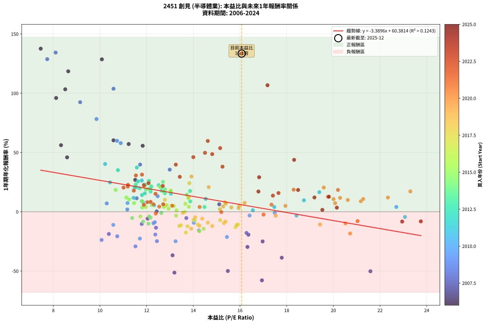
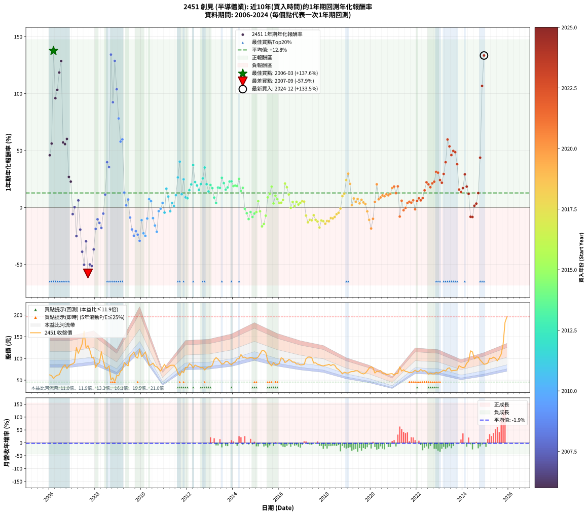

# 2451 創見 - 本益比與未來報酬率分析

!!! info "報告資訊"
    - **股票代號**: 2451
    - **公司名稱**: 創見
    - **產業別**: 半導體業
    - **分析期間**: 2006-2024 (228 個數據點)
    - **資料來源**: Type 12 (ShowMonthlyK_ChartFlow) 月收盤價與本益比
    - **報酬率口徑**: 含現金股利 (簡化: 年度合計，假設每年7/1入帳)
    - **報告生成時間**: 2026-01-04 08:48:30 CST

## 📈 視覺化圖表

### 圖表1: 本益比 vs 未來報酬率關係

*圖表1：2451 創見 本益比與1年期未來報酬率關係 (2006-2024)*

### 圖表2: 歷年買入時點的1年期實際報酬率

*圖表2：2451 創見 歷年買入時點的1年期實際報酬率 (2006-2024)*

## 📍 買點訊號說明

本報告提供兩種買點提示訊號（顯示於圖表2的股價子圖中）：

### ▲ 小綠色三角形（回測驗證）
- **計算方式**: 使用全部歷史資料計算本益比第25百分位數
- **用途**: 事後驗證，顯示歷史上哪些時點確實為低估區
- **限制**: 當下無法判斷，僅供回測參考
- **特性**: 後見之明（Look-Ahead Bias）

### ▲ 小橘色三角形（即時訊號）
- **計算方式**: 使用截至當月的過去5年資料計算本益比第25百分位數
- **用途**: 實際投資決策，當時即可判斷
- **優勢**: 可操作性強，符合實務需求
- **特性**: 無後見之明，滾動窗口計算

!!! tip "如何使用兩種訊號"
    - **綠色▲** 幫助理解歷史估值機會，驗證策略有效性
    - **橘色▲** 可作為實際買進參考，但仍需搭配基本面分析
    - 兩種訊號重疊時，表示即時判斷與事後驗證一致，信心度較高
    - 僅有綠色▲時，表示當時無法判斷（需要未來資料才能確認）
    - 僅有橘色▲時，表示即時判斷為買點，但事後可能不是最佳時機

## 📊 估值分析摘要

| 指標 | 數值 |
|:---:|:---:|
| **目前本益比** (2024-12) | **16.07 倍** |
| **歷史平均本益比** | 14.03 倍 |
| **估值水準** | 🟡 合理範圍 |
| **預期1年年化報酬率** | **+5.91%** |
| **歷史平均報酬率** | +12.83% |
| **相關係數 (R²)** | 0.1243 |
| **趨勢線斜率** | -3.3896 |

!!! abstract "核心洞察"
    目前本益比接近歷史平均，預期報酬率符合長期趨勢

    根據歷史數據回測，2451 創見 在目前本益比 **16.1倍** 的估值水準下，
    預期未來1年年化報酬率約為 **+5.9%**。

    **重要提醒**: 本分析基於歷史數據統計，實際報酬率會受到公司基本面變化、產業趨勢、
    總體經濟環境等多重因素影響。R² = 0.12 表示本益比可解釋約 12.4% 的報酬率變異。

## 📈 歷史估值統計

### 最佳買點 (最高報酬率)

| 項目 | 數值 |
|:---:|:---:|
| 起始時間 | 2006-03 |
| 當時本益比 | 7.46 倍 |
| 起始價格 | 53.9 元 |
| 1年後價格 | 125.0 元 |
| **1年年化報酬率** | **+137.60%** |

### 最差買點 (最低報酬率)

| 項目 | 數值 |
|:---:|:---:|
| 起始時間 | 2007-09 |
| 當時本益比 | 16.94 倍 |
| 起始價格 | 129.5 元 |
| 1年後價格 | 50.5 元 |
| **1年年化報酬率** | **-57.87%** |

## 🎯 投資啟示

### 本益比與報酬率關係

趨勢線方程式: **y = -3.3896x + 60.3814**

!!! warning "強負相關"
    本益比與未來報酬率呈現強負相關。在高本益比時期買入，未來報酬率顯著較低；
    在低本益比時期買入，未來報酬率顯著較高。**估值紀律至關重要**。

### 估值區間建議

基於歷史數據分析:

- **🟢 低估區** (P/E < 11.2): 預期報酬率較高，可考慮增加持股
- **🟡 合理區** (P/E 11.2-16.8): 預期報酬率符合長期趨勢，正常持有
- **🔴 高估區** (P/E > 16.8): 預期報酬率較低，可考慮減碼或觀望

!!! danger "風險提示"
    - 過去表現不代表未來結果
    - 本分析假設公司基本面無重大結構性變化
    - 產業環境劇變可能使歷史規律失效
    - 應結合公司財報、產業趨勢、總體經濟等多重因素綜合判斷

!!! success "長期投資觀點"
    歷史數據顯示，在合理或低估的估值水準買入並長期持有，
    往往能獲得較佳的投資報酬。**耐心等待好價格**是價值投資的核心原則。

## 📊 數據品質

- **資料來源**: GoodInfo.tw Type 12 (ShowMonthlyK_ChartFlow)
- **資料頻率**: 月度收盤價與本益比
- **回測期間**: 2006-2024
- **數據點數量**: 228 個 (每個點代表一次1年期回測)

### 計算方法說明

1. **1年期年化報酬率**:
   - 對每個歷史時點，計算其後1年的實際投資報酬率
   - 期末價值(不含股利): 期末價格
   - 期末價值(含現金股利): 期末價格 + 持有期間內的現金股利合計 (簡化: 年度合計，假設每年7/1入帳)
   - 公式: 年化報酬率 = [(期末價值/期初價格)^(1/年數) - 1] × 100%

2. **本益比 (P/E Ratio)**:
   - 使用當時的月收盤價與EPS計算
   - 資料來源: Type 12 月度河流圖本益比數據

3. **趨勢線 (Linear Regression)**:
   - 使用最小平方法擬合線性趨勢線
   - R²值衡量本益比對報酬率的解釋能力

---

*本報告由 Stock Analysis System v1.9.0 自動生成*
*數據更新時間: 2026-01-04 08:48:30 CST*

## 📋 月度回測明細表

（每一列對應時間線圖中的一個買入點；可用來對照 SVG 圖上的每個點。）

| 買入月份 | 賣出月份 | 回測期限_年 | 實際持有年數 | 買入本益比_倍 | 買入收盤價_元 | 賣出收盤價_元 | 現金股利合計_元 | 總報酬率_pct | 年化報酬率_pct |
| --- | --- | --- | --- | --- | --- | --- | --- | --- | --- |
| 2006-01 | 2007-01 | 1 | 0.999 | 8.59 | 62.10 | 87.60 | 2.99 | +45.88 | +45.92 |
| 2006-02 | 2007-02 | 1 | 0.999 | 8.33 | 60.20 | 91.00 | 2.99 | +56.13 | +56.18 |
| 2006-03 | 2007-03 | 1 | 0.999 | 7.46 | 53.90 | 125.00 | 2.99 | +137.46 | +137.60 |
| 2006-04 | 2007-04 | 1 | 0.999 | 8.12 | 58.70 | 112.00 | 2.99 | +95.90 | +95.99 |
| 2006-05 | 2007-05 | 1 | 0.999 | 8.51 | 61.50 | 122.00 | 2.99 | +103.24 | +103.34 |
| 2006-06 | 2007-06 | 1 | 0.999 | 8.64 | 62.50 | 133.50 | 2.99 | +118.39 | +118.50 |
| 2006-07 | 2007-07 | 1 | 0.999 | 10.08 | 72.90 | 163.00 | 3.56 | +128.48 | +128.61 |
| 2006-08 | 2007-08 | 1 | 0.999 | 11.23 | 81.20 | 124.00 | 3.56 | +57.10 | +57.15 |
| 2006-09 | 2007-09 | 1 | 0.999 | 11.83 | 85.50 | 129.50 | 3.56 | +55.63 | +55.68 |
| 2006-10 | 2007-10 | 1 | 0.999 | 10.58 | 76.50 | 119.00 | 3.56 | +60.21 | +60.26 |
| 2006-11 | 2007-11 | 1 | 0.999 | 11.51 | 83.20 | 102.00 | 3.56 | +26.88 | +26.90 |
| 2006-12 | 2007-12 | 1 | 0.999 | 11.89 | 86.00 | 102.00 | 3.56 | +22.75 | +22.76 |
| 2007-01 | 2008-01 | 1 | 0.999 | 12.04 | 87.60 | 79.00 | 3.56 | -5.75 | -5.75 |
| 2007-02 | 2008-02 | 1 | 0.999 | 12.43 | 91.00 | 87.70 | 3.56 | +0.29 | +0.29 |
| 2007-03 | 2008-03 | 1 | 1.002 | 16.97 | 125.00 | 90.10 | 3.56 | -25.07 | -25.03 |
| 2007-04 | 2008-04 | 1 | 1.002 | 15.11 | 112.00 | 115.50 | 3.56 | +6.31 | +6.29 |
| 2007-05 | 2008-05 | 1 | 1.002 | 16.36 | 122.00 | 94.80 | 3.56 | -19.37 | -19.34 |
| 2007-06 | 2008-06 | 1 | 1.002 | 17.79 | 133.50 | 78.10 | 3.56 | -38.83 | -38.77 |
| 2007-07 | 2008-07 | 1 | 1.002 | 21.59 | 163.00 | 77.10 | 3.97 | -50.27 | -50.19 |
| 2007-08 | 2008-08 | 1 | 1.002 | 16.32 | 124.00 | 83.20 | 3.97 | -29.70 | -29.65 |
| 2007-09 | 2008-09 | 1 | 1.002 | 16.94 | 129.50 | 50.50 | 3.97 | -57.94 | -57.87 |
| 2007-10 | 2008-10 | 1 | 1.002 | 15.48 | 119.00 | 55.50 | 3.97 | -50.03 | -49.96 |
| 2007-11 | 2008-11 | 1 | 1.002 | 13.19 | 102.00 | 45.60 | 3.97 | -51.40 | -51.33 |
| 2007-12 | 2008-12 | 1 | 1.002 | 13.11 | 102.00 | 60.50 | 3.97 | -36.80 | -36.74 |
| 2008-01 | 2009-01 | 1 | 1.002 | 10.38 | 79.00 | 60.20 | 3.97 | -18.78 | -18.74 |
| 2008-02 | 2009-03 | 1 | 1.081 | 11.79 | 87.70 | 74.00 | 3.97 | -11.10 | -10.31 |
| 2008-03 | 2009-03 | 1 | 0.999 | 12.40 | 90.10 | 74.00 | 3.97 | -13.47 | -13.47 |
| 2008-04 | 2009-04 | 1 | 0.999 | 16.28 | 115.50 | 90.90 | 3.97 | -17.86 | -17.88 |
| 2008-05 | 2009-05 | 1 | 0.999 | 13.70 | 94.80 | 85.80 | 3.97 | -5.31 | -5.31 |
| 2008-06 | 2009-06 | 1 | 0.999 | 11.57 | 78.10 | 83.00 | 3.97 | +11.35 | +11.36 |
| 2008-07 | 2009-07 | 1 | 0.999 | 11.72 | 77.10 | 104.50 | 3.25 | +39.75 | +39.79 |
| 2008-08 | 2009-08 | 1 | 0.999 | 12.99 | 83.20 | 109.50 | 3.25 | +35.52 | +35.55 |
| 2008-09 | 2009-09 | 1 | 0.999 | 8.10 | 50.50 | 115.00 | 3.25 | +134.16 | +134.30 |
| 2008-10 | 2009-10 | 1 | 0.999 | 9.15 | 55.50 | 103.50 | 3.25 | +92.34 | +92.43 |
| 2008-11 | 2009-11 | 1 | 0.999 | 7.74 | 45.60 | 101.00 | 3.25 | +128.62 | +128.75 |
| 2008-12 | 2009-12 | 1 | 0.999 | 10.58 | 60.50 | 120.00 | 3.25 | +103.72 | +103.82 |
| 2009-01 | 2010-01 | 1 | 0.999 | 9.85 | 60.20 | 104.00 | 3.25 | +78.16 | +78.23 |
| 2009-02 | 2010-02 | 1 | 0.999 | 10.89 | 70.80 | 108.50 | 3.25 | +57.84 | +57.89 |
| 2009-03 | 2010-03 | 1 | 0.999 | 10.73 | 74.00 | 115.00 | 3.25 | +59.80 | +59.85 |
| 2009-04 | 2010-04 | 1 | 0.999 | 12.47 | 90.90 | 99.60 | 3.25 | +13.15 | +13.16 |
| 2009-05 | 2010-05 | 1 | 0.999 | 11.17 | 85.80 | 84.20 | 3.25 | +1.92 | +1.93 |
| 2009-06 | 2010-06 | 1 | 0.999 | 10.29 | 83.00 | 85.60 | 3.25 | +7.05 | +7.05 |
| 2009-07 | 2010-07 | 1 | 0.999 | 12.35 | 104.50 | 89.30 | 5.99 | -8.81 | -8.82 |
| 2009-08 | 2010-08 | 1 | 0.999 | 12.37 | 109.50 | 82.50 | 5.99 | -19.18 | -19.20 |
| 2009-09 | 2010-09 | 1 | 0.999 | 12.44 | 115.00 | 80.50 | 5.99 | -24.79 | -24.80 |
| 2009-10 | 2010-10 | 1 | 0.999 | 10.74 | 103.50 | 76.10 | 5.99 | -20.68 | -20.69 |
| 2009-11 | 2010-11 | 1 | 0.999 | 10.07 | 101.00 | 71.00 | 5.99 | -23.77 | -23.78 |
| 2009-12 | 2010-12 | 1 | 0.999 | 11.52 | 120.00 | 79.00 | 5.99 | -29.17 | -29.19 |
| 2010-01 | 2011-01 | 1 | 0.999 | 10.57 | 104.00 | 86.50 | 5.99 | -11.06 | -11.07 |
| 2010-02 | 2011-02 | 1 | 0.999 | 11.71 | 108.50 | 78.00 | 5.99 | -22.59 | -22.60 |
| 2010-03 | 2011-03 | 1 | 0.999 | 13.24 | 115.00 | 80.40 | 5.99 | -24.87 | -24.89 |
| 2010-04 | 2011-04 | 1 | 0.999 | 12.29 | 99.60 | 84.00 | 5.99 | -9.64 | -9.65 |
| 2010-05 | 2011-05 | 1 | 0.999 | 11.18 | 84.20 | 84.40 | 5.99 | +7.36 | +7.36 |
| 2010-06 | 2011-06 | 1 | 0.999 | 12.32 | 85.60 | 84.40 | 5.99 | +5.60 | +5.60 |
| 2010-07 | 2011-07 | 1 | 0.999 | 14.02 | 89.30 | 78.00 | 3.00 | -9.30 | -9.30 |
| 2010-08 | 2011-08 | 1 | 0.999 | 14.24 | 82.50 | 66.50 | 3.00 | -15.76 | -15.77 |
| 2010-09 | 2011-09 | 1 | 0.999 | 15.44 | 80.50 | 60.40 | 3.00 | -21.24 | -21.26 |
| 2010-10 | 2011-10 | 1 | 0.999 | 16.41 | 76.10 | 70.70 | 3.00 | -3.16 | -3.16 |
| 2010-11 | 2011-11 | 1 | 0.999 | 17.49 | 71.00 | 67.30 | 3.00 | -0.99 | -0.99 |
| 2010-12 | 2011-12 | 1 | 0.999 | 22.70 | 79.00 | 79.20 | 3.00 | +4.05 | +4.05 |
| 2011-01 | 2012-01 | 1 | 0.999 | 23.07 | 86.50 | 79.70 | 3.00 | -4.40 | -4.40 |
| 2011-02 | 2012-02 | 1 | 0.999 | 19.40 | 78.00 | 87.90 | 3.00 | +16.54 | +16.55 |
| 2011-03 | 2012-03 | 1 | 1.002 | 18.74 | 80.40 | 85.20 | 3.00 | +9.70 | +9.68 |
| 2011-04 | 2012-04 | 1 | 1.002 | 18.42 | 84.00 | 78.30 | 3.00 | -3.22 | -3.21 |
| 2011-05 | 2012-05 | 1 | 1.002 | 17.47 | 84.40 | 84.80 | 3.00 | +4.03 | +4.02 |
| 2011-06 | 2012-06 | 1 | 1.002 | 16.55 | 84.40 | 82.50 | 3.00 | +1.30 | +1.30 |
| 2011-07 | 2012-07 | 1 | 1.002 | 14.53 | 78.00 | 81.00 | 5.50 | +10.90 | +10.87 |
| 2011-08 | 2012-08 | 1 | 1.002 | 11.79 | 66.50 | 78.60 | 5.50 | +26.47 | +26.41 |
| 2011-09 | 2012-09 | 1 | 1.002 | 10.22 | 60.40 | 79.30 | 5.50 | +40.40 | +40.30 |
| 2011-10 | 2012-10 | 1 | 1.002 | 11.44 | 70.70 | 73.50 | 5.50 | +11.74 | +11.71 |
| 2011-11 | 2012-11 | 1 | 1.002 | 10.43 | 67.30 | 78.50 | 5.50 | +24.81 | +24.76 |
| 2011-12 | 2012-12 | 1 | 1.002 | 11.79 | 79.20 | 80.80 | 5.50 | +8.96 | +8.95 |
| 2012-01 | 2013-01 | 1 | 1.002 | 11.84 | 79.70 | 80.70 | 5.50 | +8.16 | +8.14 |
| 2012-02 | 2013-03 | 1 | 1.081 | 13.04 | 87.90 | 97.00 | 5.50 | +16.61 | +15.27 |
| 2012-03 | 2013-03 | 1 | 0.999 | 12.62 | 85.20 | 97.00 | 5.50 | +20.31 | +20.32 |
| 2012-04 | 2013-04 | 1 | 0.999 | 11.58 | 78.30 | 102.00 | 5.50 | +37.29 | +37.32 |
| 2012-05 | 2013-05 | 1 | 0.999 | 12.52 | 84.80 | 98.30 | 5.50 | +22.41 | +22.42 |
| 2012-06 | 2013-06 | 1 | 0.999 | 12.16 | 82.50 | 93.00 | 5.50 | +19.39 | +19.41 |
| 2012-07 | 2013-07 | 1 | 0.999 | 11.92 | 81.00 | 87.00 | 6.50 | +15.43 | +15.44 |
| 2012-08 | 2013-08 | 1 | 0.999 | 11.55 | 78.60 | 88.30 | 6.50 | +20.61 | +20.63 |
| 2012-09 | 2013-09 | 1 | 0.999 | 11.63 | 79.30 | 93.10 | 6.50 | +25.60 | +25.62 |
| 2012-10 | 2013-10 | 1 | 0.999 | 10.77 | 73.50 | 92.80 | 6.50 | +35.10 | +35.13 |
| 2012-11 | 2013-11 | 1 | 0.999 | 11.48 | 78.50 | 88.10 | 6.50 | +20.51 | +20.52 |
| 2012-12 | 2013-12 | 1 | 0.999 | 11.80 | 80.80 | 85.70 | 6.50 | +14.11 | +14.12 |
| 2013-01 | 2014-01 | 1 | 0.999 | 11.70 | 80.70 | 90.20 | 6.50 | +19.83 | +19.84 |
| 2013-02 | 2014-02 | 1 | 0.999 | 12.17 | 84.50 | 92.40 | 6.50 | +17.04 | +17.05 |
| 2013-03 | 2014-03 | 1 | 0.999 | 13.87 | 97.00 | 99.00 | 6.50 | +8.76 | +8.77 |
| 2013-04 | 2014-04 | 1 | 0.999 | 14.48 | 102.00 | 99.60 | 6.50 | +4.02 | +4.02 |
| 2013-05 | 2014-05 | 1 | 0.999 | 13.86 | 98.30 | 109.00 | 6.50 | +17.50 | +17.51 |
| 2013-06 | 2014-06 | 1 | 0.999 | 13.03 | 93.00 | 102.50 | 6.50 | +17.20 | +17.22 |
| 2013-07 | 2014-07 | 1 | 0.999 | 12.10 | 87.00 | 103.00 | 6.70 | +26.09 | +26.11 |
| 2013-08 | 2014-08 | 1 | 0.999 | 12.20 | 88.30 | 100.50 | 6.70 | +21.40 | +21.42 |
| 2013-09 | 2014-09 | 1 | 0.999 | 12.78 | 93.10 | 101.00 | 6.70 | +15.68 | +15.69 |
| 2013-10 | 2014-10 | 1 | 0.999 | 12.65 | 92.80 | 102.50 | 6.70 | +17.67 | +17.69 |
| 2013-11 | 2014-11 | 1 | 0.999 | 11.94 | 88.10 | 101.50 | 6.70 | +22.81 | +22.83 |
| 2013-12 | 2014-12 | 1 | 0.999 | 11.53 | 85.70 | 98.70 | 6.70 | +22.99 | +23.00 |
| 2014-01 | 2015-01 | 1 | 0.999 | 11.97 | 90.20 | 100.50 | 6.70 | +18.85 | +18.86 |
| 2014-02 | 2015-02 | 1 | 0.999 | 12.10 | 92.40 | 103.50 | 6.70 | +19.26 | +19.28 |
| 2014-03 | 2015-03 | 1 | 0.999 | 12.79 | 99.00 | 111.00 | 6.70 | +18.89 | +18.90 |
| 2014-04 | 2015-04 | 1 | 0.999 | 12.70 | 99.60 | 118.00 | 6.70 | +25.20 | +25.22 |
| 2014-05 | 2015-05 | 1 | 0.999 | 13.72 | 109.00 | 118.00 | 6.70 | +14.40 | +14.41 |
| 2014-06 | 2015-06 | 1 | 0.999 | 12.73 | 102.50 | 113.50 | 6.70 | +17.27 | +17.28 |
| 2014-07 | 2015-07 | 1 | 0.999 | 12.63 | 103.00 | 94.10 | 7.80 | -1.07 | -1.07 |
| 2014-08 | 2015-08 | 1 | 0.999 | 12.17 | 100.50 | 87.70 | 7.80 | -4.98 | -4.98 |
| 2014-09 | 2015-09 | 1 | 0.999 | 12.08 | 101.00 | 83.00 | 7.80 | -10.10 | -10.11 |
| 2014-10 | 2015-10 | 1 | 0.999 | 12.11 | 102.50 | 90.70 | 7.80 | -3.90 | -3.91 |
| 2014-11 | 2015-11 | 1 | 0.999 | 11.85 | 101.50 | 85.30 | 7.80 | -8.28 | -8.28 |
| 2014-12 | 2015-12 | 1 | 0.999 | 11.38 | 98.70 | 85.70 | 7.80 | -5.27 | -5.27 |
| 2015-01 | 2016-01 | 1 | 0.999 | 11.73 | 100.50 | 88.70 | 7.80 | -3.98 | -3.98 |
| 2015-02 | 2016-02 | 1 | 0.999 | 12.22 | 103.50 | 101.50 | 7.80 | +5.60 | +5.61 |
| 2015-03 | 2016-03 | 1 | 1.002 | 13.26 | 111.00 | 99.50 | 7.80 | -3.33 | -3.33 |
| 2015-04 | 2016-04 | 1 | 1.002 | 14.26 | 118.00 | 90.70 | 7.80 | -16.53 | -16.49 |
| 2015-05 | 2016-05 | 1 | 1.002 | 14.44 | 118.00 | 93.20 | 7.80 | -14.41 | -14.38 |
| 2015-06 | 2016-06 | 1 | 1.002 | 14.06 | 113.50 | 97.60 | 7.80 | -7.14 | -7.12 |
| 2015-07 | 2016-07 | 1 | 1.002 | 11.80 | 94.10 | 95.70 | 6.80 | +8.93 | +8.91 |
| 2015-08 | 2016-08 | 1 | 1.002 | 11.13 | 87.70 | 91.50 | 6.80 | +12.09 | +12.06 |
| 2015-09 | 2016-09 | 1 | 1.002 | 10.67 | 83.00 | 91.50 | 6.80 | +18.43 | +18.39 |
| 2015-10 | 2016-10 | 1 | 1.002 | 11.81 | 90.70 | 87.20 | 6.80 | +3.64 | +3.63 |
| 2015-11 | 2016-11 | 1 | 1.002 | 11.25 | 85.30 | 87.40 | 6.80 | +10.43 | +10.41 |
| 2015-12 | 2016-12 | 1 | 1.002 | 11.46 | 85.70 | 85.20 | 6.80 | +7.35 | +7.34 |
| 2016-01 | 2017-01 | 1 | 1.002 | 11.96 | 88.70 | 85.50 | 6.80 | +4.06 | +4.05 |
| 2016-02 | 2017-03 | 1 | 1.081 | 13.81 | 101.50 | 99.40 | 6.80 | +4.63 | +4.27 |
| 2016-03 | 2017-03 | 1 | 0.999 | 13.66 | 99.50 | 99.40 | 6.80 | +6.73 | +6.74 |
| 2016-04 | 2017-04 | 1 | 0.999 | 12.57 | 90.70 | 103.00 | 6.80 | +21.06 | +21.07 |
| 2016-05 | 2017-05 | 1 | 0.999 | 13.03 | 93.20 | 103.00 | 6.80 | +17.81 | +17.82 |
| 2016-06 | 2017-06 | 1 | 0.999 | 13.78 | 97.60 | 102.00 | 6.80 | +11.48 | +11.48 |
| 2016-07 | 2017-07 | 1 | 0.999 | 13.63 | 95.70 | 89.50 | 6.00 | -0.21 | -0.21 |
| 2016-08 | 2017-08 | 1 | 0.999 | 13.16 | 91.50 | 90.00 | 6.00 | +4.92 | +4.92 |
| 2016-09 | 2017-09 | 1 | 0.999 | 13.28 | 91.50 | 86.60 | 6.00 | +1.20 | +1.20 |
| 2016-10 | 2017-10 | 1 | 0.999 | 12.78 | 87.20 | 85.60 | 6.00 | +5.05 | +5.05 |
| 2016-11 | 2017-11 | 1 | 0.999 | 12.94 | 87.40 | 83.70 | 6.00 | +2.63 | +2.63 |
| 2016-12 | 2017-12 | 1 | 0.999 | 12.74 | 85.20 | 82.70 | 6.00 | +4.11 | +4.11 |
| 2017-01 | 2018-01 | 1 | 0.999 | 12.86 | 85.50 | 84.30 | 6.00 | +5.61 | +5.62 |
| 2017-02 | 2018-02 | 1 | 0.999 | 13.07 | 86.30 | 84.80 | 6.00 | +5.21 | +5.22 |
| 2017-03 | 2018-03 | 1 | 0.999 | 15.15 | 99.40 | 86.40 | 6.00 | -7.04 | -7.05 |
| 2017-04 | 2018-04 | 1 | 0.999 | 15.81 | 103.00 | 83.70 | 6.00 | -12.91 | -12.92 |
| 2017-05 | 2018-05 | 1 | 0.999 | 15.91 | 103.00 | 85.90 | 6.00 | -10.78 | -10.78 |
| 2017-06 | 2018-06 | 1 | 0.999 | 15.86 | 102.00 | 84.60 | 6.00 | -11.18 | -11.18 |
| 2017-07 | 2018-07 | 1 | 0.999 | 14.01 | 89.50 | 77.50 | 6.00 | -6.70 | -6.71 |
| 2017-08 | 2018-08 | 1 | 0.999 | 14.19 | 90.00 | 74.30 | 6.00 | -10.78 | -10.78 |
| 2017-09 | 2018-09 | 1 | 0.999 | 13.75 | 86.60 | 70.00 | 6.00 | -12.24 | -12.25 |
| 2017-10 | 2018-10 | 1 | 0.999 | 13.68 | 85.60 | 64.60 | 6.00 | -17.52 | -17.53 |
| 2017-11 | 2018-11 | 1 | 0.999 | 13.47 | 83.70 | 68.20 | 6.00 | -11.35 | -11.36 |
| 2017-12 | 2018-12 | 1 | 0.999 | 13.40 | 82.70 | 66.80 | 6.00 | -11.97 | -11.98 |
| 2018-01 | 2019-01 | 1 | 0.999 | 13.91 | 84.30 | 66.30 | 6.00 | -14.23 | -14.24 |
| 2018-02 | 2019-02 | 1 | 0.999 | 14.26 | 84.80 | 68.80 | 6.00 | -11.79 | -11.80 |
| 2018-03 | 2019-03 | 1 | 0.999 | 14.81 | 86.40 | 70.00 | 6.00 | -12.04 | -12.04 |
| 2018-04 | 2019-04 | 1 | 0.999 | 14.62 | 83.70 | 70.00 | 6.00 | -9.20 | -9.21 |
| 2018-05 | 2019-05 | 1 | 0.999 | 15.31 | 85.90 | 71.70 | 6.00 | -9.55 | -9.55 |
| 2018-06 | 2019-06 | 1 | 0.999 | 15.38 | 84.60 | 71.60 | 6.00 | -8.27 | -8.28 |
| 2018-07 | 2019-07 | 1 | 0.999 | 14.38 | 77.50 | 68.00 | 5.00 | -5.81 | -5.81 |
| 2018-08 | 2019-08 | 1 | 0.999 | 14.08 | 74.30 | 65.90 | 5.00 | -4.58 | -4.58 |
| 2018-09 | 2019-09 | 1 | 0.999 | 13.55 | 70.00 | 64.40 | 5.00 | -0.86 | -0.86 |
| 2018-10 | 2019-10 | 1 | 0.999 | 12.78 | 64.60 | 66.10 | 5.00 | +10.06 | +10.07 |
| 2018-11 | 2019-11 | 1 | 0.999 | 13.80 | 68.20 | 71.50 | 5.00 | +12.17 | +12.18 |
| 2018-12 | 2019-12 | 1 | 0.999 | 13.83 | 66.80 | 77.90 | 5.00 | +24.10 | +24.12 |
| 2019-01 | 2020-01 | 1 | 0.999 | 13.92 | 66.30 | 81.00 | 5.00 | +29.71 | +29.74 |
| 2019-02 | 2020-02 | 1 | 0.999 | 14.66 | 68.80 | 78.10 | 5.00 | +20.78 | +20.80 |
| 2019-03 | 2020-03 | 1 | 1.002 | 15.14 | 70.00 | 66.50 | 5.00 | +2.14 | +2.14 |
| 2019-04 | 2020-04 | 1 | 1.002 | 15.36 | 70.00 | 70.60 | 5.00 | +8.00 | +7.98 |
| 2019-05 | 2020-05 | 1 | 1.002 | 15.97 | 71.70 | 70.30 | 5.00 | +5.02 | +5.01 |
| 2019-06 | 2020-06 | 1 | 1.002 | 16.20 | 71.60 | 72.00 | 5.00 | +7.54 | +7.53 |
| 2019-07 | 2020-07 | 1 | 1.002 | 15.63 | 68.00 | 66.00 | 4.50 | +3.68 | +3.67 |
| 2019-08 | 2020-08 | 1 | 1.002 | 15.39 | 65.90 | 65.90 | 4.50 | +6.83 | +6.81 |
| 2019-09 | 2020-09 | 1 | 1.002 | 15.28 | 64.40 | 62.80 | 4.50 | +4.50 | +4.49 |
| 2019-10 | 2020-10 | 1 | 1.002 | 15.94 | 66.10 | 63.70 | 4.50 | +3.18 | +3.17 |
| 2019-11 | 2020-11 | 1 | 1.002 | 17.53 | 71.50 | 64.60 | 4.50 | -3.36 | -3.35 |
| 2019-12 | 2020-12 | 1 | 1.002 | 19.43 | 77.90 | 65.00 | 4.50 | -10.78 | -10.76 |
| 2020-01 | 2021-01 | 1 | 1.002 | 20.72 | 81.00 | 61.60 | 4.50 | -18.40 | -18.36 |
| 2020-02 | 2021-03 | 1 | 1.081 | 20.52 | 78.10 | 65.30 | 4.50 | -10.63 | -9.87 |
| 2020-03 | 2021-03 | 1 | 0.999 | 17.95 | 66.50 | 65.30 | 4.50 | +4.96 | +4.97 |
| 2020-04 | 2021-04 | 1 | 0.999 | 19.59 | 70.60 | 80.50 | 4.50 | +20.40 | +20.41 |
| 2020-05 | 2021-05 | 1 | 0.999 | 20.08 | 70.30 | 70.90 | 4.50 | +7.25 | +7.26 |
| 2020-06 | 2021-06 | 1 | 0.999 | 21.18 | 72.00 | 73.90 | 4.50 | +8.89 | +8.90 |
| 2020-07 | 2021-07 | 1 | 0.999 | 20.01 | 66.00 | 70.00 | 3.05 | +10.68 | +10.69 |
| 2020-08 | 2021-08 | 1 | 0.999 | 20.62 | 65.90 | 69.40 | 3.05 | +9.94 | +9.95 |
| 2020-09 | 2021-09 | 1 | 0.999 | 20.29 | 62.80 | 67.10 | 3.05 | +11.70 | +11.71 |
| 2020-10 | 2021-10 | 1 | 0.999 | 21.28 | 63.70 | 67.50 | 3.05 | +10.75 | +10.76 |
| 2020-11 | 2021-11 | 1 | 0.999 | 22.34 | 64.60 | 69.30 | 3.05 | +12.00 | +12.01 |
| 2020-12 | 2021-12 | 1 | 0.999 | 23.30 | 65.00 | 73.10 | 3.05 | +17.15 | +17.17 |
| 2021-01 | 2022-01 | 1 | 0.999 | 20.20 | 61.60 | 69.90 | 3.05 | +18.43 | +18.44 |
| 2021-02 | 2022-02 | 1 | 0.999 | 19.77 | 65.40 | 70.60 | 3.05 | +12.61 | +12.62 |
| 2021-03 | 2022-03 | 1 | 0.999 | 18.30 | 65.30 | 74.40 | 3.05 | +18.61 | +18.62 |
| 2021-04 | 2022-04 | 1 | 0.999 | 21.04 | 80.50 | 71.10 | 3.05 | -7.89 | -7.89 |
| 2021-05 | 2022-05 | 1 | 0.999 | 17.35 | 70.90 | 72.10 | 3.05 | +5.99 | +6.00 |
| 2021-06 | 2022-06 | 1 | 0.999 | 17.01 | 73.90 | 69.10 | 3.05 | -2.37 | -2.37 |
| 2021-07 | 2022-07 | 1 | 0.999 | 15.20 | 70.00 | 63.80 | 6.00 | -0.29 | -0.29 |
| 2021-08 | 2022-08 | 1 | 0.999 | 14.27 | 69.40 | 66.20 | 6.00 | +4.03 | +4.04 |
| 2021-09 | 2022-09 | 1 | 0.999 | 13.10 | 67.10 | 64.50 | 6.00 | +5.07 | +5.07 |
| 2021-10 | 2022-10 | 1 | 0.999 | 12.54 | 67.50 | 64.40 | 6.00 | +4.30 | +4.30 |
| 2021-11 | 2022-11 | 1 | 0.999 | 12.29 | 69.30 | 67.70 | 6.00 | +6.35 | +6.35 |
| 2021-12 | 2022-12 | 1 | 0.999 | 12.39 | 73.10 | 66.00 | 6.00 | -1.50 | -1.51 |
| 2022-01 | 2023-01 | 1 | 0.999 | 11.88 | 69.90 | 68.00 | 6.00 | +5.87 | +5.87 |
| 2022-02 | 2023-02 | 1 | 0.999 | 12.03 | 70.60 | 70.30 | 6.00 | +8.07 | +8.08 |
| 2022-03 | 2023-03 | 1 | 0.999 | 12.71 | 74.40 | 73.10 | 6.00 | +6.32 | +6.32 |
| 2022-04 | 2023-04 | 1 | 0.999 | 12.17 | 71.10 | 71.00 | 6.00 | +8.30 | +8.30 |
| 2022-05 | 2023-05 | 1 | 0.999 | 12.38 | 72.10 | 77.00 | 6.00 | +15.12 | +15.13 |
| 2022-06 | 2023-06 | 1 | 0.999 | 11.89 | 69.10 | 78.40 | 6.00 | +22.14 | +22.16 |
| 2022-07 | 2023-07 | 1 | 0.999 | 11.01 | 63.80 | 71.20 | 5.60 | +20.38 | +20.39 |
| 2022-08 | 2023-08 | 1 | 0.999 | 11.45 | 66.20 | 72.40 | 5.60 | +17.82 | +17.84 |
| 2022-09 | 2023-09 | 1 | 0.999 | 11.19 | 64.50 | 72.60 | 5.60 | +21.24 | +21.26 |
| 2022-10 | 2023-10 | 1 | 0.999 | 11.20 | 64.40 | 73.40 | 5.60 | +22.67 | +22.69 |
| 2022-11 | 2023-11 | 1 | 0.999 | 11.80 | 67.70 | 83.30 | 5.60 | +31.31 | +31.34 |
| 2022-12 | 2023-12 | 1 | 0.999 | 11.54 | 66.00 | 80.60 | 5.60 | +30.61 | +30.63 |
| 2023-01 | 2024-01 | 1 | 0.999 | 12.08 | 68.00 | 78.80 | 5.60 | +24.12 | +24.14 |
| 2023-02 | 2024-02 | 1 | 0.999 | 12.69 | 70.30 | 80.00 | 5.60 | +21.76 | +21.78 |
| 2023-03 | 2024-03 | 1 | 1.002 | 13.42 | 73.10 | 89.10 | 5.60 | +29.55 | +29.48 |
| 2023-04 | 2024-04 | 1 | 1.002 | 13.25 | 71.00 | 93.70 | 5.60 | +39.86 | +39.76 |
| 2023-05 | 2024-05 | 1 | 1.002 | 14.62 | 77.00 | 117.50 | 5.60 | +59.87 | +59.72 |
| 2023-06 | 2024-06 | 1 | 1.002 | 15.15 | 78.40 | 115.00 | 5.60 | +53.83 | +53.69 |
| 2023-07 | 2024-07 | 1 | 1.002 | 14.00 | 71.20 | 99.10 | 4.99 | +46.20 | +46.08 |
| 2023-08 | 2024-08 | 1 | 1.002 | 14.50 | 72.40 | 103.50 | 4.99 | +49.85 | +49.73 |
| 2023-09 | 2024-09 | 1 | 1.002 | 14.81 | 72.60 | 103.00 | 4.99 | +48.75 | +48.63 |
| 2023-10 | 2024-10 | 1 | 1.002 | 15.25 | 73.40 | 96.40 | 4.99 | +38.13 | +38.04 |
| 2023-11 | 2024-11 | 1 | 1.002 | 17.65 | 83.30 | 91.50 | 4.99 | +15.84 | +15.80 |
| 2023-12 | 2024-12 | 1 | 1.002 | 17.41 | 80.60 | 86.60 | 4.99 | +13.64 | +13.61 |
| 2024-01 | 2025-01 | 1 | 1.002 | 16.79 | 78.80 | 87.30 | 4.99 | +17.12 | +17.08 |
| 2024-02 | 2025-03 | 1 | 1.081 | 16.82 | 80.00 | 100.50 | 4.99 | +31.86 | +29.15 |
| 2024-03 | 2025-03 | 1 | 0.999 | 18.49 | 89.10 | 100.50 | 4.99 | +18.40 | +18.41 |
| 2024-04 | 2025-04 | 1 | 0.999 | 19.19 | 93.70 | 100.00 | 4.99 | +12.05 | +12.06 |
| 2024-05 | 2025-05 | 1 | 0.999 | 23.75 | 117.50 | 103.00 | 4.99 | -8.09 | -8.10 |
| 2024-06 | 2025-06 | 1 | 0.999 | 22.95 | 115.00 | 100.50 | 4.99 | -8.27 | -8.27 |
| 2024-07 | 2025-07 | 1 | 0.999 | 19.53 | 99.10 | 94.60 | 6.09 | +1.60 | +1.60 |
| 2024-08 | 2025-08 | 1 | 0.999 | 20.15 | 103.50 | 101.00 | 6.09 | +3.47 | +3.47 |
| 2024-09 | 2025-09 | 1 | 0.999 | 19.81 | 103.00 | 110.00 | 6.09 | +12.71 | +12.72 |
| 2024-10 | 2025-10 | 1 | 0.999 | 18.32 | 96.40 | 132.50 | 6.09 | +43.76 | +43.80 |
| 2024-11 | 2025-11 | 1 | 0.999 | 17.18 | 91.50 | 183.00 | 6.09 | +106.65 | +106.76 |
| 2024-12 | 2025-12 | 1 | 0.999 | 16.07 | 86.60 | 196.00 | 6.09 | +133.36 | +133.49 |
