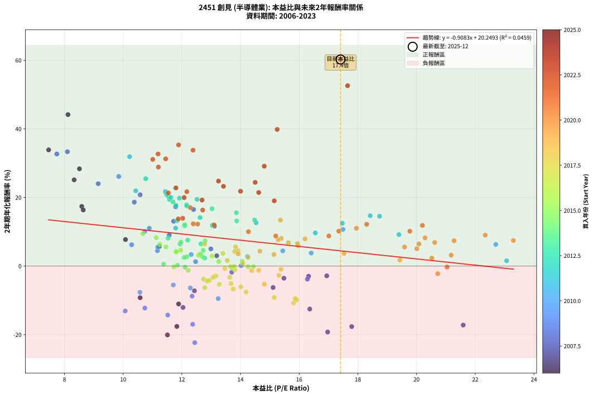
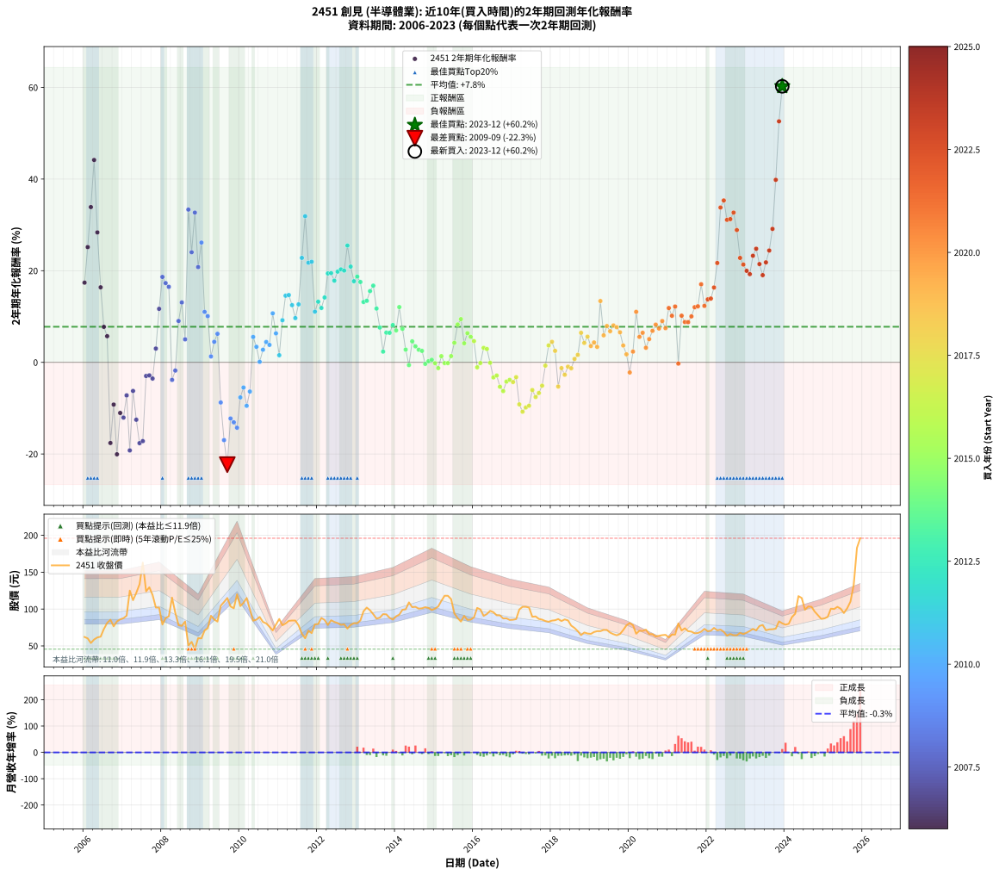

# 2451 創見 - 本益比與未來報酬率分析

!!! info "報告資訊"
    - **股票代號**: 2451
    - **公司名稱**: 創見
    - **產業別**: 半導體業
    - **分析期間**: 2006-2023 (216 個數據點)
    - **資料來源**: Type 12 (ShowMonthlyK_ChartFlow) 月收盤價與本益比
    - **報酬率口徑**: 含現金股利 (簡化: 年度合計，假設每年7/1入帳)
    - **報告生成時間**: 2026-01-07 20:49:14 CST

## 📈 視覺化圖表

### 圖表1: 本益比 vs 未來報酬率關係

*圖表1：2451 創見 本益比與2年期未來報酬率關係 (2006-2023)*

### 圖表2: 歷年買入時點的2年期實際報酬率

*圖表2：2451 創見 歷年買入時點的2年期實際報酬率 (2006-2023)*

## 📍 買點訊號說明

本報告提供兩種買點提示訊號（顯示於圖表2的股價子圖中）：

### ▲ 小綠色三角形（回測驗證）
- **計算方式**: 使用全部歷史資料計算本益比第25百分位數
- **用途**: 事後驗證，顯示歷史上哪些時點確實為低估區
- **限制**: 當下無法判斷，僅供回測參考
- **特性**: 後見之明（Look-Ahead Bias）

### ▲ 小橘色三角形（即時訊號）
- **計算方式**: 使用截至當月的過去5年資料計算本益比第25百分位數
- **用途**: 實際投資決策，當時即可判斷
- **優勢**: 可操作性強，符合實務需求
- **特性**: 無後見之明，滾動窗口計算

!!! tip "如何使用兩種訊號"
    - **綠色▲** 幫助理解歷史估值機會，驗證策略有效性
    - **橘色▲** 可作為實際買進參考，但仍需搭配基本面分析
    - 兩種訊號重疊時，表示即時判斷與事後驗證一致，信心度較高
    - 僅有綠色▲時，表示當時無法判斷（需要未來資料才能確認）
    - 僅有橘色▲時，表示即時判斷為買點，但事後可能不是最佳時機

## 📊 估值分析摘要

| 指標 | 數值 |
|:---:|:---:|
| **目前本益比** (2023-12) | **17.41 倍** |
| **歷史平均本益比** | 13.75 倍 |
| **估值水準** | 🔴 相對高估 |
| **預期2年年化報酬率** | **+4.44%** |
| **歷史平均報酬率** | +7.76% |
| **相關係數 (R²)** | 0.0459 |
| **趨勢線斜率** | -0.9083 |

!!! abstract "核心洞察"
    目前本益比顯著高於歷史平均，預期未來報酬率可能較低

    根據歷史數據回測，2451 創見 在目前本益比 **17.4倍** 的估值水準下，
    預期未來2年年化報酬率約為 **+4.4%**。

    **重要提醒**: 本分析基於歷史數據統計，實際報酬率會受到公司基本面變化、產業趨勢、
    總體經濟環境等多重因素影響。R² = 0.05 表示本益比可解釋約 4.6% 的報酬率變異。

## 📈 歷史估值統計

### 最佳買點 (最高報酬率)

| 項目 | 數值 |
|:---:|:---:|
| 起始時間 | 2023-12 |
| 當時本益比 | 17.41 倍 |
| 起始價格 | 80.6 元 |
| 2年後價格 | 196.0 元 |
| **2年年化報酬率** | **+60.24%** |

### 最差買點 (最低報酬率)

| 項目 | 數值 |
|:---:|:---:|
| 起始時間 | 2009-09 |
| 當時本益比 | 12.44 倍 |
| 起始價格 | 115.0 元 |
| 2年後價格 | 60.4 元 |
| **2年年化報酬率** | **-22.33%** |

## 🎯 投資啟示

### 本益比與報酬率關係

趨勢線方程式: **y = -0.9083x + 20.2493**

!!! warning "強負相關"
    本益比與未來報酬率呈現強負相關。在高本益比時期買入，未來報酬率顯著較低；
    在低本益比時期買入，未來報酬率顯著較高。**估值紀律至關重要**。

### 估值區間建議

基於歷史數據分析:

- **🟢 低估區** (P/E < 11.0): 預期報酬率較高，可考慮增加持股
- **🟡 合理區** (P/E 11.0-16.5): 預期報酬率符合長期趨勢，正常持有
- **🔴 高估區** (P/E > 16.5): 預期報酬率較低，可考慮減碼或觀望

!!! danger "風險提示"
    - 過去表現不代表未來結果
    - 本分析假設公司基本面無重大結構性變化
    - 產業環境劇變可能使歷史規律失效
    - 應結合公司財報、產業趨勢、總體經濟等多重因素綜合判斷

!!! success "長期投資觀點"
    歷史數據顯示，在合理或低估的估值水準買入並長期持有，
    往往能獲得較佳的投資報酬。**耐心等待好價格**是價值投資的核心原則。

## 📊 數據品質

- **資料來源**: GoodInfo.tw Type 12 (ShowMonthlyK_ChartFlow)
- **資料頻率**: 月度收盤價與本益比
- **回測期間**: 2006-2023
- **數據點數量**: 216 個 (每個點代表一次2年期回測)

### 計算方法說明

1. **2年期年化報酬率**:
   - 對每個歷史時點，計算其後2年的實際投資報酬率
   - 期末價值(不含股利): 期末價格
   - 期末價值(含現金股利): 期末價格 + 持有期間內的現金股利合計 (簡化: 年度合計，假設每年7/1入帳)
   - 公式: 年化報酬率 = [(期末價值/期初價格)^(1/年數) - 1] × 100%

2. **本益比 (P/E Ratio)**:
   - 使用當時的月收盤價與EPS計算
   - 資料來源: Type 12 月度河流圖本益比數據

3. **趨勢線 (Linear Regression)**:
   - 使用最小平方法擬合線性趨勢線
   - R²值衡量本益比對報酬率的解釋能力

---

*本報告由 Stock Analysis System v1.9.0 自動生成*
*數據更新時間: 2026-01-07 20:49:14 CST*

## 📋 月度回測明細表

（每一列對應時間線圖中的一個買入點；可用來對照 SVG 圖上的每個點。）

| 買入月份 | 賣出月份 | 回測期限_年 | 實際持有年數 | 買入本益比_倍 | 買入收盤價_元 | 賣出收盤價_元 | 現金股利合計_元 | 總報酬率_pct | 年化報酬率_pct |
| --- | --- | --- | --- | --- | --- | --- | --- | --- | --- |
| 2006-01 | 2008-01 | 2 | 1.999 | 8.59 | 62.10 | 79.00 | 6.55 | +37.77 | +17.39 |
| 2006-02 | 2008-02 | 2 | 1.999 | 8.33 | 60.20 | 87.70 | 6.55 | +56.57 | +25.15 |
| 2006-03 | 2008-03 | 2 | 2.001 | 7.46 | 53.90 | 90.10 | 6.55 | +79.32 | +33.88 |
| 2006-04 | 2008-04 | 2 | 2.001 | 8.12 | 58.70 | 115.50 | 6.55 | +107.93 | +44.16 |
| 2006-05 | 2008-05 | 2 | 2.001 | 8.51 | 61.50 | 94.80 | 6.55 | +64.80 | +28.35 |
| 2006-06 | 2008-06 | 2 | 2.001 | 8.64 | 62.50 | 78.10 | 6.55 | +35.45 | +16.37 |
| 2006-07 | 2008-07 | 2 | 2.001 | 10.08 | 72.90 | 77.10 | 7.53 | +16.09 | +7.74 |
| 2006-08 | 2008-08 | 2 | 2.001 | 11.23 | 81.20 | 83.20 | 7.53 | +11.74 | +5.70 |
| 2006-09 | 2008-09 | 2 | 2.001 | 11.83 | 85.50 | 50.50 | 7.53 | -32.13 | -17.61 |
| 2006-10 | 2008-10 | 2 | 2.001 | 10.58 | 76.50 | 55.50 | 7.53 | -17.61 | -9.22 |
| 2006-11 | 2008-11 | 2 | 2.001 | 11.51 | 83.20 | 45.60 | 7.53 | -36.14 | -20.08 |
| 2006-12 | 2008-12 | 2 | 2.001 | 11.89 | 86.00 | 60.50 | 7.53 | -20.90 | -11.05 |
| 2007-01 | 2009-01 | 2 | 2.001 | 12.04 | 87.60 | 60.20 | 7.53 | -22.68 | -12.06 |
| 2007-02 | 2009-02 | 2 | 2.001 | 12.43 | 91.00 | 70.80 | 7.53 | -13.92 | -7.22 |
| 2007-03 | 2009-03 | 2 | 2.001 | 16.97 | 125.00 | 74.00 | 7.53 | -34.78 | -19.23 |
| 2007-04 | 2009-04 | 2 | 2.001 | 15.11 | 112.00 | 90.90 | 7.53 | -12.12 | -6.25 |
| 2007-05 | 2009-05 | 2 | 2.001 | 16.36 | 122.00 | 85.80 | 7.53 | -23.50 | -12.53 |
| 2007-06 | 2009-06 | 2 | 2.001 | 17.79 | 133.50 | 83.00 | 7.53 | -32.19 | -17.64 |
| 2007-07 | 2009-07 | 2 | 2.001 | 21.59 | 163.00 | 104.50 | 7.22 | -31.46 | -17.20 |
| 2007-08 | 2009-08 | 2 | 2.001 | 16.32 | 124.00 | 109.50 | 7.22 | -5.87 | -2.98 |
| 2007-09 | 2009-09 | 2 | 2.001 | 16.94 | 129.50 | 115.00 | 7.22 | -5.62 | -2.85 |
| 2007-10 | 2009-10 | 2 | 2.001 | 15.48 | 119.00 | 103.50 | 7.22 | -6.96 | -3.54 |
| 2007-11 | 2009-11 | 2 | 2.001 | 13.19 | 102.00 | 101.00 | 7.22 | +6.10 | +3.00 |
| 2007-12 | 2009-12 | 2 | 2.001 | 13.11 | 102.00 | 120.00 | 7.22 | +24.72 | +11.67 |
| 2008-01 | 2010-01 | 2 | 2.001 | 10.38 | 79.00 | 104.00 | 7.22 | +40.78 | +18.64 |
| 2008-02 | 2010-03 | 2 | 2.081 | 11.79 | 87.70 | 115.00 | 7.22 | +39.36 | +17.29 |
| 2008-03 | 2010-03 | 2 | 1.999 | 12.40 | 90.10 | 115.00 | 7.22 | +35.65 | +16.48 |
| 2008-04 | 2010-04 | 2 | 1.999 | 16.28 | 115.50 | 99.60 | 7.22 | -7.52 | -3.83 |
| 2008-05 | 2010-05 | 2 | 1.999 | 13.70 | 94.80 | 84.20 | 7.22 | -3.57 | -1.80 |
| 2008-06 | 2010-06 | 2 | 1.999 | 11.57 | 78.10 | 85.60 | 7.22 | +18.85 | +9.02 |
| 2008-07 | 2010-07 | 2 | 1.999 | 11.72 | 77.10 | 89.30 | 9.24 | +27.81 | +13.06 |
| 2008-08 | 2010-08 | 2 | 1.999 | 12.99 | 83.20 | 82.50 | 9.24 | +10.27 | +5.01 |
| 2008-09 | 2010-09 | 2 | 1.999 | 8.10 | 50.50 | 80.50 | 9.24 | +77.71 | +33.34 |
| 2008-10 | 2010-10 | 2 | 1.999 | 9.15 | 55.50 | 76.10 | 9.24 | +53.77 | +24.02 |
| 2008-11 | 2010-11 | 2 | 1.999 | 7.74 | 45.60 | 71.00 | 9.24 | +75.98 | +32.68 |
| 2008-12 | 2010-12 | 2 | 1.999 | 10.58 | 60.50 | 79.00 | 9.24 | +45.86 | +20.79 |
| 2009-01 | 2011-01 | 2 | 1.999 | 9.85 | 60.20 | 86.50 | 9.24 | +59.04 | +26.13 |
| 2009-02 | 2011-02 | 2 | 1.999 | 10.89 | 70.80 | 78.00 | 9.24 | +23.23 | +11.02 |
| 2009-03 | 2011-03 | 2 | 1.999 | 10.73 | 74.00 | 80.40 | 9.24 | +21.14 | +10.07 |
| 2009-04 | 2011-04 | 2 | 1.999 | 12.47 | 90.90 | 84.00 | 9.24 | +2.58 | +1.28 |
| 2009-05 | 2011-05 | 2 | 1.999 | 11.17 | 85.80 | 84.40 | 9.24 | +9.14 | +4.47 |
| 2009-06 | 2011-06 | 2 | 1.999 | 10.29 | 83.00 | 84.40 | 9.24 | +12.83 | +6.22 |
| 2009-07 | 2011-07 | 2 | 1.999 | 12.35 | 104.50 | 78.00 | 8.99 | -16.75 | -8.77 |
| 2009-08 | 2011-08 | 2 | 1.999 | 12.37 | 109.50 | 66.50 | 8.99 | -31.06 | -16.98 |
| 2009-09 | 2011-09 | 2 | 1.999 | 12.44 | 115.00 | 60.40 | 8.99 | -39.66 | -22.33 |
| 2009-10 | 2011-10 | 2 | 1.999 | 10.74 | 103.50 | 70.70 | 8.99 | -23.00 | -12.26 |
| 2009-11 | 2011-11 | 2 | 1.999 | 10.07 | 101.00 | 67.30 | 8.99 | -24.46 | -13.10 |
| 2009-12 | 2011-12 | 2 | 1.999 | 11.52 | 120.00 | 79.20 | 8.99 | -26.51 | -14.28 |
| 2010-01 | 2012-01 | 2 | 1.999 | 10.57 | 104.00 | 79.70 | 8.99 | -14.72 | -7.66 |
| 2010-02 | 2012-02 | 2 | 1.999 | 11.71 | 108.50 | 87.90 | 8.99 | -10.70 | -5.50 |
| 2010-03 | 2012-03 | 2 | 2.001 | 13.24 | 115.00 | 85.20 | 8.99 | -18.09 | -9.49 |
| 2010-04 | 2012-04 | 2 | 2.001 | 12.29 | 99.60 | 78.30 | 8.99 | -12.36 | -6.38 |
| 2010-05 | 2012-05 | 2 | 2.001 | 11.18 | 84.20 | 84.80 | 8.99 | +11.39 | +5.54 |
| 2010-06 | 2012-06 | 2 | 2.001 | 12.32 | 85.60 | 82.50 | 8.99 | +6.88 | +3.38 |
| 2010-07 | 2012-07 | 2 | 2.001 | 14.02 | 89.30 | 81.00 | 8.50 | +0.22 | +0.11 |
| 2010-08 | 2012-08 | 2 | 2.001 | 14.24 | 82.50 | 78.60 | 8.50 | +5.57 | +2.75 |
| 2010-09 | 2012-09 | 2 | 2.001 | 15.44 | 80.50 | 79.30 | 8.50 | +9.07 | +4.43 |
| 2010-10 | 2012-10 | 2 | 2.001 | 16.41 | 76.10 | 73.50 | 8.50 | +7.75 | +3.80 |
| 2010-11 | 2012-11 | 2 | 2.001 | 17.49 | 71.00 | 78.50 | 8.50 | +22.53 | +10.69 |
| 2010-12 | 2012-12 | 2 | 2.001 | 22.70 | 79.00 | 80.80 | 8.50 | +13.04 | +6.31 |
| 2011-01 | 2013-01 | 2 | 2.001 | 23.07 | 86.50 | 80.70 | 8.50 | +3.12 | +1.55 |
| 2011-02 | 2013-02 | 2 | 2.001 | 19.40 | 78.00 | 84.50 | 8.50 | +19.23 | +9.19 |
| 2011-03 | 2013-03 | 2 | 2.001 | 18.74 | 80.40 | 97.00 | 8.50 | +31.22 | +14.54 |
| 2011-04 | 2013-04 | 2 | 2.001 | 18.42 | 84.00 | 102.00 | 8.50 | +31.55 | +14.68 |
| 2011-05 | 2013-05 | 2 | 2.001 | 17.47 | 84.40 | 98.30 | 8.50 | +26.54 | +12.48 |
| 2011-06 | 2013-06 | 2 | 2.001 | 16.55 | 84.40 | 93.00 | 8.50 | +20.26 | +9.66 |
| 2011-07 | 2013-07 | 2 | 2.001 | 14.53 | 78.00 | 87.00 | 12.00 | +26.92 | +12.65 |
| 2011-08 | 2013-08 | 2 | 2.001 | 11.79 | 66.50 | 88.30 | 12.00 | +50.83 | +22.79 |
| 2011-09 | 2013-09 | 2 | 2.001 | 10.22 | 60.40 | 93.10 | 12.00 | +74.01 | +31.89 |
| 2011-10 | 2013-10 | 2 | 2.001 | 11.44 | 70.70 | 92.80 | 12.00 | +48.23 | +21.73 |
| 2011-11 | 2013-11 | 2 | 2.001 | 10.43 | 67.30 | 88.10 | 12.00 | +48.74 | +21.94 |
| 2011-12 | 2013-12 | 2 | 2.001 | 11.79 | 79.20 | 85.70 | 12.00 | +23.36 | +11.06 |
| 2012-01 | 2014-01 | 2 | 2.001 | 11.84 | 79.70 | 90.20 | 12.00 | +28.23 | +13.23 |
| 2012-02 | 2014-03 | 2 | 2.081 | 13.04 | 87.90 | 99.00 | 12.00 | +26.28 | +11.87 |
| 2012-03 | 2014-03 | 2 | 1.999 | 12.62 | 85.20 | 99.00 | 12.00 | +30.28 | +14.15 |
| 2012-04 | 2014-04 | 2 | 1.999 | 11.58 | 78.30 | 99.60 | 12.00 | +42.53 | +19.40 |
| 2012-05 | 2014-05 | 2 | 1.999 | 12.52 | 84.80 | 109.00 | 12.00 | +42.69 | +19.47 |
| 2012-06 | 2014-06 | 2 | 1.999 | 12.16 | 82.50 | 102.50 | 12.00 | +38.79 | +17.82 |
| 2012-07 | 2014-07 | 2 | 1.999 | 11.92 | 81.00 | 103.00 | 13.20 | +43.46 | +19.79 |
| 2012-08 | 2014-08 | 2 | 1.999 | 11.55 | 78.60 | 100.50 | 13.20 | +44.66 | +20.29 |
| 2012-09 | 2014-09 | 2 | 1.999 | 11.63 | 79.30 | 101.00 | 13.20 | +44.01 | +20.02 |
| 2012-10 | 2014-10 | 2 | 1.999 | 10.77 | 73.50 | 102.50 | 13.20 | +57.41 | +25.48 |
| 2012-11 | 2014-11 | 2 | 1.999 | 11.48 | 78.50 | 101.50 | 13.20 | +46.11 | +20.89 |
| 2012-12 | 2014-12 | 2 | 1.999 | 11.80 | 80.80 | 98.70 | 13.20 | +38.49 | +17.69 |
| 2013-01 | 2015-01 | 2 | 1.999 | 11.70 | 80.70 | 100.50 | 13.20 | +40.89 | +18.71 |
| 2013-02 | 2015-02 | 2 | 1.999 | 12.17 | 84.50 | 103.50 | 13.20 | +38.11 | +17.53 |
| 2013-03 | 2015-03 | 2 | 1.999 | 13.87 | 97.00 | 111.00 | 13.20 | +28.04 | +13.16 |
| 2013-04 | 2015-04 | 2 | 1.999 | 14.48 | 102.00 | 118.00 | 13.20 | +28.63 | +13.42 |
| 2013-05 | 2015-05 | 2 | 1.999 | 13.86 | 98.30 | 118.00 | 13.20 | +33.47 | +15.54 |
| 2013-06 | 2015-06 | 2 | 1.999 | 13.03 | 93.00 | 113.50 | 13.20 | +36.24 | +16.73 |
| 2013-07 | 2015-07 | 2 | 1.999 | 12.10 | 87.00 | 94.10 | 14.50 | +24.83 | +11.73 |
| 2013-08 | 2015-08 | 2 | 1.999 | 12.20 | 88.30 | 87.70 | 14.50 | +15.74 | +7.59 |
| 2013-09 | 2015-09 | 2 | 1.999 | 12.78 | 93.10 | 83.00 | 14.50 | +4.73 | +2.34 |
| 2013-10 | 2015-10 | 2 | 1.999 | 12.65 | 92.80 | 90.70 | 14.50 | +13.36 | +6.48 |
| 2013-11 | 2015-11 | 2 | 1.999 | 11.94 | 88.10 | 85.30 | 14.50 | +13.28 | +6.44 |
| 2013-12 | 2015-12 | 2 | 1.999 | 11.53 | 85.70 | 85.70 | 14.50 | +16.92 | +8.14 |
| 2014-01 | 2016-01 | 2 | 1.999 | 11.97 | 90.20 | 88.70 | 14.50 | +14.41 | +6.97 |
| 2014-02 | 2016-02 | 2 | 1.999 | 12.10 | 92.40 | 101.50 | 14.50 | +25.54 | +12.05 |
| 2014-03 | 2016-03 | 2 | 2.001 | 12.79 | 99.00 | 99.50 | 14.50 | +15.15 | +7.30 |
| 2014-04 | 2016-04 | 2 | 2.001 | 12.70 | 99.60 | 90.70 | 14.50 | +5.62 | +2.77 |
| 2014-05 | 2016-05 | 2 | 2.001 | 13.72 | 109.00 | 93.20 | 14.50 | -1.19 | -0.60 |
| 2014-06 | 2016-06 | 2 | 2.001 | 12.73 | 102.50 | 97.60 | 14.50 | +9.37 | +4.57 |
| 2014-07 | 2016-07 | 2 | 2.001 | 12.63 | 103.00 | 95.70 | 14.60 | +7.09 | +3.48 |
| 2014-08 | 2016-08 | 2 | 2.001 | 12.17 | 100.50 | 91.50 | 14.60 | +5.57 | +2.75 |
| 2014-09 | 2016-09 | 2 | 2.001 | 12.08 | 101.00 | 91.50 | 14.60 | +5.05 | +2.49 |
| 2014-10 | 2016-10 | 2 | 2.001 | 12.11 | 102.50 | 87.20 | 14.60 | -0.68 | -0.34 |
| 2014-11 | 2016-11 | 2 | 2.001 | 11.85 | 101.50 | 87.40 | 14.60 | +0.49 | +0.25 |
| 2014-12 | 2016-12 | 2 | 2.001 | 11.38 | 98.70 | 85.20 | 14.60 | +1.11 | +0.56 |
| 2015-01 | 2017-01 | 2 | 2.001 | 11.73 | 100.50 | 85.50 | 14.60 | -0.40 | -0.20 |
| 2015-02 | 2017-02 | 2 | 2.001 | 12.22 | 103.50 | 86.30 | 14.60 | -2.51 | -1.26 |
| 2015-03 | 2017-03 | 2 | 2.001 | 13.26 | 111.00 | 99.40 | 14.60 | +2.70 | +1.34 |
| 2015-04 | 2017-04 | 2 | 2.001 | 14.26 | 118.00 | 103.00 | 14.60 | -0.34 | -0.17 |
| 2015-05 | 2017-05 | 2 | 2.001 | 14.44 | 118.00 | 103.00 | 14.60 | -0.34 | -0.17 |
| 2015-06 | 2017-06 | 2 | 2.001 | 14.06 | 113.50 | 102.00 | 14.60 | +2.73 | +1.36 |
| 2015-07 | 2017-07 | 2 | 2.001 | 11.80 | 94.10 | 89.50 | 12.80 | +8.71 | +4.26 |
| 2015-08 | 2017-08 | 2 | 2.001 | 11.13 | 87.70 | 90.00 | 12.80 | +17.22 | +8.26 |
| 2015-09 | 2017-09 | 2 | 2.001 | 10.67 | 83.00 | 86.60 | 12.80 | +19.76 | +9.43 |
| 2015-10 | 2017-10 | 2 | 2.001 | 11.81 | 90.70 | 85.60 | 12.80 | +8.49 | +4.16 |
| 2015-11 | 2017-11 | 2 | 2.001 | 11.25 | 85.30 | 83.70 | 12.80 | +13.13 | +6.36 |
| 2015-12 | 2017-12 | 2 | 2.001 | 11.46 | 85.70 | 82.70 | 12.80 | +11.44 | +5.56 |
| 2016-01 | 2018-01 | 2 | 2.001 | 11.96 | 88.70 | 84.30 | 12.80 | +9.47 | +4.62 |
| 2016-02 | 2018-03 | 2 | 2.081 | 13.81 | 101.50 | 86.40 | 12.80 | -2.27 | -1.10 |
| 2016-03 | 2018-03 | 2 | 1.999 | 13.66 | 99.50 | 86.40 | 12.80 | -0.30 | -0.15 |
| 2016-04 | 2018-04 | 2 | 1.999 | 12.57 | 90.70 | 83.70 | 12.80 | +6.39 | +3.15 |
| 2016-05 | 2018-05 | 2 | 1.999 | 13.03 | 93.20 | 85.90 | 12.80 | +5.90 | +2.91 |
| 2016-06 | 2018-06 | 2 | 1.999 | 13.78 | 97.60 | 84.60 | 12.80 | -0.20 | -0.10 |
| 2016-07 | 2018-07 | 2 | 1.999 | 13.63 | 95.70 | 77.50 | 12.00 | -6.48 | -3.30 |
| 2016-08 | 2018-08 | 2 | 1.999 | 13.16 | 91.50 | 74.30 | 12.00 | -5.68 | -2.89 |
| 2016-09 | 2018-09 | 2 | 1.999 | 13.28 | 91.50 | 70.00 | 12.00 | -10.38 | -5.34 |
| 2016-10 | 2018-10 | 2 | 1.999 | 12.78 | 87.20 | 64.60 | 12.00 | -12.16 | -6.28 |
| 2016-11 | 2018-11 | 2 | 1.999 | 12.94 | 87.40 | 68.20 | 12.00 | -8.24 | -4.21 |
| 2016-12 | 2018-12 | 2 | 1.999 | 12.74 | 85.20 | 66.80 | 12.00 | -7.51 | -3.83 |
| 2017-01 | 2019-01 | 2 | 1.999 | 12.86 | 85.50 | 66.30 | 12.00 | -8.42 | -4.31 |
| 2017-02 | 2019-02 | 2 | 1.999 | 13.07 | 86.30 | 68.80 | 12.00 | -6.37 | -3.24 |
| 2017-03 | 2019-03 | 2 | 1.999 | 15.15 | 99.40 | 70.00 | 12.00 | -17.51 | -9.18 |
| 2017-04 | 2019-04 | 2 | 1.999 | 15.81 | 103.00 | 70.00 | 12.00 | -20.39 | -10.78 |
| 2017-05 | 2019-05 | 2 | 1.999 | 15.91 | 103.00 | 71.70 | 12.00 | -18.74 | -9.86 |
| 2017-06 | 2019-06 | 2 | 1.999 | 15.86 | 102.00 | 71.60 | 12.00 | -18.04 | -9.47 |
| 2017-07 | 2019-07 | 2 | 1.999 | 14.01 | 89.50 | 68.00 | 11.00 | -11.73 | -6.05 |
| 2017-08 | 2019-08 | 2 | 1.999 | 14.19 | 90.00 | 65.90 | 11.00 | -14.56 | -7.57 |
| 2017-09 | 2019-09 | 2 | 1.999 | 13.75 | 86.60 | 64.40 | 11.00 | -12.93 | -6.69 |
| 2017-10 | 2019-10 | 2 | 1.999 | 13.68 | 85.60 | 66.10 | 11.00 | -9.93 | -5.10 |
| 2017-11 | 2019-11 | 2 | 1.999 | 13.47 | 83.70 | 71.50 | 11.00 | -1.43 | -0.72 |
| 2017-12 | 2019-12 | 2 | 1.999 | 13.40 | 82.70 | 77.90 | 11.00 | +7.50 | +3.68 |
| 2018-01 | 2020-01 | 2 | 1.999 | 13.91 | 84.30 | 81.00 | 11.00 | +9.13 | +4.47 |
| 2018-02 | 2020-02 | 2 | 1.999 | 14.26 | 84.80 | 78.10 | 11.00 | +5.07 | +2.51 |
| 2018-03 | 2020-03 | 2 | 2.001 | 14.81 | 86.40 | 66.50 | 11.00 | -10.30 | -5.29 |
| 2018-04 | 2020-04 | 2 | 2.001 | 14.62 | 83.70 | 70.60 | 11.00 | -2.51 | -1.26 |
| 2018-05 | 2020-05 | 2 | 2.001 | 15.31 | 85.90 | 70.30 | 11.00 | -5.36 | -2.71 |
| 2018-06 | 2020-06 | 2 | 2.001 | 15.38 | 84.60 | 72.00 | 11.00 | -1.89 | -0.95 |
| 2018-07 | 2020-07 | 2 | 2.001 | 14.38 | 77.50 | 66.00 | 9.50 | -2.58 | -1.30 |
| 2018-08 | 2020-08 | 2 | 2.001 | 14.08 | 74.30 | 65.90 | 9.50 | +1.48 | +0.74 |
| 2018-09 | 2020-09 | 2 | 2.001 | 13.55 | 70.00 | 62.80 | 9.50 | +3.29 | +1.63 |
| 2018-10 | 2020-10 | 2 | 2.001 | 12.78 | 64.60 | 63.70 | 9.50 | +13.31 | +6.44 |
| 2018-11 | 2020-11 | 2 | 2.001 | 13.80 | 68.20 | 64.60 | 9.50 | +8.65 | +4.23 |
| 2018-12 | 2020-12 | 2 | 2.001 | 13.83 | 66.80 | 65.00 | 9.50 | +11.53 | +5.60 |
| 2019-01 | 2021-01 | 2 | 2.001 | 13.92 | 66.30 | 61.60 | 9.50 | +7.24 | +3.55 |
| 2019-02 | 2021-02 | 2 | 2.001 | 14.66 | 68.80 | 65.40 | 9.50 | +8.87 | +4.34 |
| 2019-03 | 2021-03 | 2 | 2.001 | 15.14 | 70.00 | 65.30 | 9.50 | +6.86 | +3.37 |
| 2019-04 | 2021-04 | 2 | 2.001 | 15.36 | 70.00 | 80.50 | 9.50 | +28.57 | +13.38 |
| 2019-05 | 2021-05 | 2 | 2.001 | 15.97 | 71.70 | 70.90 | 9.50 | +12.13 | +5.89 |
| 2019-06 | 2021-06 | 2 | 2.001 | 16.20 | 71.60 | 73.90 | 9.50 | +16.48 | +7.92 |
| 2019-07 | 2021-07 | 2 | 2.001 | 15.63 | 68.00 | 70.00 | 7.55 | +14.04 | +6.79 |
| 2019-08 | 2021-08 | 2 | 2.001 | 15.39 | 65.90 | 69.40 | 7.55 | +16.77 | +8.05 |
| 2019-09 | 2021-09 | 2 | 2.001 | 15.28 | 64.40 | 67.10 | 7.55 | +15.92 | +7.66 |
| 2019-10 | 2021-10 | 2 | 2.001 | 15.94 | 66.10 | 67.50 | 7.55 | +13.54 | +6.55 |
| 2019-11 | 2021-11 | 2 | 2.001 | 17.53 | 71.50 | 69.30 | 7.55 | +7.48 | +3.67 |
| 2019-12 | 2021-12 | 2 | 2.001 | 19.43 | 77.90 | 73.10 | 7.55 | +3.53 | +1.75 |
| 2020-01 | 2022-01 | 2 | 2.001 | 20.72 | 81.00 | 69.90 | 7.55 | -4.38 | -2.21 |
| 2020-02 | 2022-03 | 2 | 2.081 | 20.52 | 78.10 | 74.40 | 7.55 | +4.93 | +2.34 |
| 2020-03 | 2022-03 | 2 | 1.999 | 17.95 | 66.50 | 74.40 | 7.55 | +23.23 | +11.02 |
| 2020-04 | 2022-04 | 2 | 1.999 | 19.59 | 70.60 | 71.10 | 7.55 | +11.40 | +5.55 |
| 2020-05 | 2022-05 | 2 | 1.999 | 20.08 | 70.30 | 72.10 | 7.55 | +13.30 | +6.45 |
| 2020-06 | 2022-06 | 2 | 1.999 | 21.18 | 72.00 | 69.10 | 7.55 | +6.46 | +3.18 |
| 2020-07 | 2022-07 | 2 | 1.999 | 20.01 | 66.00 | 63.80 | 9.05 | +10.38 | +5.06 |
| 2020-08 | 2022-08 | 2 | 1.999 | 20.62 | 65.90 | 66.20 | 9.05 | +14.19 | +6.86 |
| 2020-09 | 2022-09 | 2 | 1.999 | 20.29 | 62.80 | 64.50 | 9.05 | +17.12 | +8.23 |
| 2020-10 | 2022-10 | 2 | 1.999 | 21.28 | 63.70 | 64.40 | 9.05 | +15.31 | +7.39 |
| 2020-11 | 2022-11 | 2 | 1.999 | 22.34 | 64.60 | 67.70 | 9.05 | +18.81 | +9.01 |
| 2020-12 | 2022-12 | 2 | 1.999 | 23.30 | 65.00 | 66.00 | 9.05 | +15.46 | +7.46 |
| 2021-01 | 2023-01 | 2 | 1.999 | 20.20 | 61.60 | 68.00 | 9.05 | +25.08 | +11.85 |
| 2021-02 | 2023-02 | 2 | 1.999 | 19.77 | 65.40 | 70.30 | 9.05 | +21.33 | +10.16 |
| 2021-03 | 2023-03 | 2 | 1.999 | 18.30 | 65.30 | 73.10 | 9.05 | +25.80 | +12.17 |
| 2021-04 | 2023-04 | 2 | 1.999 | 21.04 | 80.50 | 71.00 | 9.05 | -0.56 | -0.28 |
| 2021-05 | 2023-05 | 2 | 1.999 | 17.35 | 70.90 | 77.00 | 9.05 | +21.37 | +10.17 |
| 2021-06 | 2023-06 | 2 | 1.999 | 17.01 | 73.90 | 78.40 | 9.05 | +18.34 | +8.79 |
| 2021-07 | 2023-07 | 2 | 1.999 | 15.20 | 70.00 | 71.20 | 11.60 | +18.29 | +8.77 |
| 2021-08 | 2023-08 | 2 | 1.999 | 14.27 | 69.40 | 72.40 | 11.60 | +21.04 | +10.02 |
| 2021-09 | 2023-09 | 2 | 1.999 | 13.10 | 67.10 | 72.60 | 11.60 | +25.48 | +12.03 |
| 2021-10 | 2023-10 | 2 | 1.999 | 12.54 | 67.50 | 73.40 | 11.60 | +25.93 | +12.23 |
| 2021-11 | 2023-11 | 2 | 1.999 | 12.29 | 69.30 | 83.30 | 11.60 | +36.94 | +17.03 |
| 2021-12 | 2023-12 | 2 | 1.999 | 12.39 | 73.10 | 80.60 | 11.60 | +26.13 | +12.32 |
| 2022-01 | 2024-01 | 2 | 1.999 | 11.88 | 69.90 | 78.80 | 11.60 | +29.33 | +13.73 |
| 2022-02 | 2024-02 | 2 | 1.999 | 12.03 | 70.60 | 80.00 | 11.60 | +29.75 | +13.92 |
| 2022-03 | 2024-03 | 2 | 2.001 | 12.71 | 74.40 | 89.10 | 11.60 | +35.35 | +16.33 |
| 2022-04 | 2024-04 | 2 | 2.001 | 12.17 | 71.10 | 93.70 | 11.60 | +48.10 | +21.68 |
| 2022-05 | 2024-05 | 2 | 2.001 | 12.38 | 72.10 | 117.50 | 11.60 | +79.06 | +33.79 |
| 2022-06 | 2024-06 | 2 | 2.001 | 11.89 | 69.10 | 115.00 | 11.60 | +83.21 | +35.33 |
| 2022-07 | 2024-07 | 2 | 2.001 | 11.01 | 63.80 | 99.10 | 10.59 | +71.93 | +31.10 |
| 2022-08 | 2024-08 | 2 | 2.001 | 11.45 | 66.20 | 103.50 | 10.59 | +72.34 | +31.25 |
| 2022-09 | 2024-09 | 2 | 2.001 | 11.19 | 64.50 | 103.00 | 10.59 | +76.11 | +32.68 |
| 2022-10 | 2024-10 | 2 | 2.001 | 11.20 | 64.40 | 96.40 | 10.59 | +66.14 | +28.87 |
| 2022-11 | 2024-11 | 2 | 2.001 | 11.80 | 67.70 | 91.50 | 10.59 | +50.80 | +22.78 |
| 2022-12 | 2024-12 | 2 | 2.001 | 11.54 | 66.00 | 86.60 | 10.59 | +47.26 | +21.33 |
| 2023-01 | 2025-01 | 2 | 2.001 | 12.08 | 68.00 | 87.30 | 10.59 | +43.96 | +19.97 |
| 2023-02 | 2025-02 | 2 | 2.001 | 12.69 | 70.30 | 89.40 | 10.59 | +42.23 | +19.25 |
| 2023-03 | 2025-03 | 2 | 2.001 | 13.42 | 73.10 | 100.50 | 10.59 | +51.97 | +23.26 |
| 2023-04 | 2025-04 | 2 | 2.001 | 13.25 | 71.00 | 100.00 | 10.59 | +55.76 | +24.79 |
| 2023-05 | 2025-05 | 2 | 2.001 | 14.62 | 77.00 | 103.00 | 10.59 | +47.52 | +21.44 |
| 2023-06 | 2025-06 | 2 | 2.001 | 15.15 | 78.40 | 100.50 | 10.59 | +41.70 | +19.02 |
| 2023-07 | 2025-07 | 2 | 2.001 | 14.00 | 71.20 | 94.60 | 11.08 | +48.43 | +21.81 |
| 2023-08 | 2025-08 | 2 | 2.001 | 14.50 | 72.40 | 101.00 | 11.08 | +54.81 | +24.40 |
| 2023-09 | 2025-09 | 2 | 2.001 | 14.81 | 72.60 | 110.00 | 11.08 | +66.78 | +29.12 |
| 2023-10 | 2025-10 | 2 | 2.001 | 15.25 | 73.40 | 132.50 | 11.08 | +95.61 | +39.83 |
| 2023-11 | 2025-11 | 2 | 2.001 | 17.65 | 83.30 | 183.00 | 11.08 | +132.99 | +52.60 |
| 2023-12 | 2025-12 | 2 | 2.001 | 17.41 | 80.60 | 196.00 | 11.08 | +156.92 | +60.24 |
