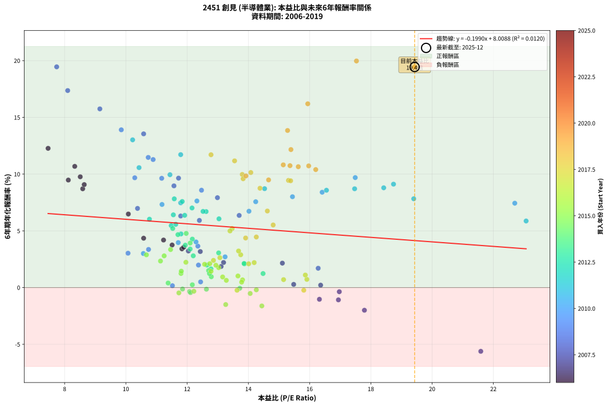
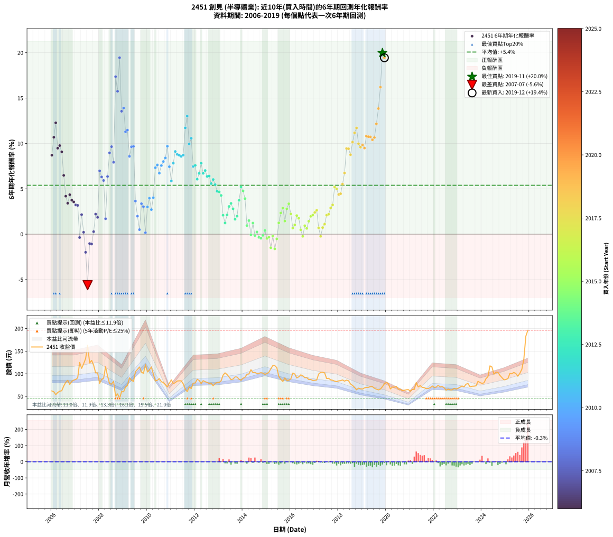

# 2451 創見 - 本益比與未來報酬率分析

!!! info "報告資訊"
    - **股票代號**: 2451
    - **公司名稱**: 創見
    - **產業別**: 半導體業
    - **分析期間**: 2006-2019 (168 個數據點)
    - **資料來源**: Type 12 (ShowMonthlyK_ChartFlow) 月收盤價與本益比
    - **報酬率口徑**: 含現金股利 (簡化: 年度合計，假設每年7/1入帳)
    - **報告生成時間**: 2026-01-10 20:47:38 CST

## 📈 視覺化圖表

### 圖表1: 本益比 vs 未來報酬率關係

*圖表1：2451 創見 本益比與6年期未來報酬率關係 (2006-2019)*

### 圖表2: 歷年買入時點的6年期實際報酬率

*圖表2：2451 創見 歷年買入時點的6年期實際報酬率 (2006-2019)*

## 📍 買點訊號說明

本報告提供兩種買點提示訊號（顯示於圖表2的股價子圖中）：

### ▲ 小綠色三角形（回測驗證）
- **計算方式**: 使用全部歷史資料計算本益比第25百分位數
- **用途**: 事後驗證，顯示歷史上哪些時點確實為低估區
- **限制**: 當下無法判斷，僅供回測參考
- **特性**: 後見之明（Look-Ahead Bias）

### ▲ 小橘色三角形（即時訊號）
- **計算方式**: 使用截至當月的過去5年資料計算本益比第25百分位數
- **用途**: 實際投資決策，當時即可判斷
- **優勢**: 可操作性強，符合實務需求
- **特性**: 無後見之明，滾動窗口計算

!!! tip "如何使用兩種訊號"
    - **綠色▲** 幫助理解歷史估值機會，驗證策略有效性
    - **橘色▲** 可作為實際買進參考，但仍需搭配基本面分析
    - 兩種訊號重疊時，表示即時判斷與事後驗證一致，信心度較高
    - 僅有綠色▲時，表示當時無法判斷（需要未來資料才能確認）
    - 僅有橘色▲時，表示即時判斷為買點，但事後可能不是最佳時機

## 📊 估值分析摘要

| 指標 | 數值 |
|:---:|:---:|
| **目前本益比** (2019-12) | **19.43 倍** |
| **歷史平均本益比** | 13.17 倍 |
| **估值水準** | 🔴 相對高估 |
| **預期6年年化報酬率** | **+4.14%** |
| **歷史平均報酬率** | +5.39% |
| **相關係數 (R²)** | 0.0120 |
| **趨勢線斜率** | -0.1990 |

!!! abstract "核心洞察"
    目前本益比顯著高於歷史平均，預期未來報酬率可能較低

    根據歷史數據回測，2451 創見 在目前本益比 **19.4倍** 的估值水準下，
    預期未來6年年化報酬率約為 **+4.1%**。

    **重要提醒**: 本分析基於歷史數據統計，實際報酬率會受到公司基本面變化、產業趨勢、
    總體經濟環境等多重因素影響。R² = 0.01 表示本益比可解釋約 1.2% 的報酬率變異。

## 📈 歷史估值統計

### 最佳買點 (最高報酬率)

| 項目 | 數值 |
|:---:|:---:|
| 起始時間 | 2019-11 |
| 當時本益比 | 17.53 倍 |
| 起始價格 | 71.5 元 |
| 6年後價格 | 183.0 元 |
| **6年年化報酬率** | **+19.97%** |

### 最差買點 (最低報酬率)

| 項目 | 數值 |
|:---:|:---:|
| 起始時間 | 2007-07 |
| 當時本益比 | 21.59 倍 |
| 起始價格 | 163.0 元 |
| 6年後價格 | 87.0 元 |
| **6年年化報酬率** | **-5.62%** |

## 🎯 投資啟示

### 本益比與報酬率關係

趨勢線方程式: **y = -0.1990x + 8.0088**

!!! note "負相關"
    本益比與未來報酬率呈現負相關。較低的本益比通常帶來較高的未來報酬率，
    但相關性不算非常強。**估值仍是重要參考指標之一**。

### 估值區間建議

基於歷史數據分析:

- **🟢 低估區** (P/E < 10.5): 預期報酬率較高，可考慮增加持股
- **🟡 合理區** (P/E 10.5-15.8): 預期報酬率符合長期趨勢，正常持有
- **🔴 高估區** (P/E > 15.8): 預期報酬率較低，可考慮減碼或觀望

!!! danger "風險提示"
    - 過去表現不代表未來結果
    - 本分析假設公司基本面無重大結構性變化
    - 產業環境劇變可能使歷史規律失效
    - 應結合公司財報、產業趨勢、總體經濟等多重因素綜合判斷

!!! success "長期投資觀點"
    歷史數據顯示，在合理或低估的估值水準買入並長期持有，
    往往能獲得較佳的投資報酬。**耐心等待好價格**是價值投資的核心原則。

## 📊 數據品質

- **資料來源**: GoodInfo.tw Type 12 (ShowMonthlyK_ChartFlow)
- **資料頻率**: 月度收盤價與本益比
- **回測期間**: 2006-2019
- **數據點數量**: 168 個 (每個點代表一次6年期回測)

### 計算方法說明

1. **6年期年化報酬率**:
   - 對每個歷史時點，計算其後6年的實際投資報酬率
   - 期末價值(不含股利): 期末價格
   - 期末價值(含現金股利): 期末價格 + 持有期間內的現金股利合計 (簡化: 年度合計，假設每年7/1入帳)
   - 公式: 年化報酬率 = [(期末價值/期初價格)^(1/年數) - 1] × 100%

2. **本益比 (P/E Ratio)**:
   - 使用當時的月收盤價與EPS計算
   - 資料來源: Type 12 月度河流圖本益比數據

3. **趨勢線 (Linear Regression)**:
   - 使用最小平方法擬合線性趨勢線
   - R²值衡量本益比對報酬率的解釋能力

---

*本報告由 Stock Analysis System v1.9.0 自動生成*
*數據更新時間: 2026-01-10 20:47:38 CST*

## 📋 月度回測明細表

（每一列對應時間線圖中的一個買入點；可用來對照 SVG 圖上的每個點。）

| 買入月份 | 賣出月份 | 回測期限_年 | 實際持有年數 | 買入本益比_倍 | 買入收盤價_元 | 賣出收盤價_元 | 現金股利合計_元 | 總報酬率_pct | 年化報酬率_pct |
| --- | --- | --- | --- | --- | --- | --- | --- | --- | --- |
| 2006-01 | 2012-01 | 6 | 5.999 | 8.59 | 62.10 | 79.70 | 22.76 | +65.00 | +8.71 |
| 2006-02 | 2012-02 | 6 | 5.999 | 8.33 | 60.20 | 87.90 | 22.76 | +83.83 | +10.68 |
| 2006-03 | 2012-03 | 6 | 6.001 | 7.46 | 53.90 | 85.20 | 22.76 | +100.30 | +12.27 |
| 2006-04 | 2012-04 | 6 | 6.001 | 8.12 | 58.70 | 78.30 | 22.76 | +72.17 | +9.48 |
| 2006-05 | 2012-05 | 6 | 6.001 | 8.51 | 61.50 | 84.80 | 22.76 | +74.90 | +9.76 |
| 2006-06 | 2012-06 | 6 | 6.001 | 8.64 | 62.50 | 82.50 | 22.76 | +68.42 | +9.07 |
| 2006-07 | 2012-07 | 6 | 6.001 | 10.08 | 72.90 | 81.00 | 25.27 | +45.78 | +6.48 |
| 2006-08 | 2012-08 | 6 | 6.001 | 11.23 | 81.20 | 78.60 | 25.27 | +27.92 | +4.19 |
| 2006-09 | 2012-09 | 6 | 6.001 | 11.83 | 85.50 | 79.30 | 25.27 | +22.31 | +3.41 |
| 2006-10 | 2012-10 | 6 | 6.001 | 10.58 | 76.50 | 73.50 | 25.27 | +29.12 | +4.35 |
| 2006-11 | 2012-11 | 6 | 6.001 | 11.51 | 83.20 | 78.50 | 25.27 | +24.73 | +3.75 |
| 2006-12 | 2012-12 | 6 | 6.001 | 11.89 | 86.00 | 80.80 | 25.27 | +23.34 | +3.56 |
| 2007-01 | 2013-01 | 6 | 6.001 | 12.04 | 87.60 | 80.70 | 25.27 | +20.97 | +3.22 |
| 2007-02 | 2013-02 | 6 | 6.001 | 12.43 | 91.00 | 84.50 | 25.27 | +20.63 | +3.17 |
| 2007-03 | 2013-03 | 6 | 6.001 | 16.97 | 125.00 | 97.00 | 25.27 | -2.18 | -0.37 |
| 2007-04 | 2013-04 | 6 | 6.001 | 15.11 | 112.00 | 102.00 | 25.27 | +13.64 | +2.15 |
| 2007-05 | 2013-05 | 6 | 6.001 | 16.36 | 122.00 | 98.30 | 25.27 | +1.29 | +0.21 |
| 2007-06 | 2013-06 | 6 | 6.001 | 17.79 | 133.50 | 93.00 | 25.27 | -11.41 | -2.00 |
| 2007-07 | 2013-07 | 6 | 6.001 | 21.59 | 163.00 | 87.00 | 28.21 | -29.32 | -5.62 |
| 2007-08 | 2013-08 | 6 | 6.001 | 16.32 | 124.00 | 88.30 | 28.21 | -6.04 | -1.03 |
| 2007-09 | 2013-09 | 6 | 6.001 | 16.94 | 129.50 | 93.10 | 28.21 | -6.32 | -1.08 |
| 2007-10 | 2013-10 | 6 | 6.001 | 15.48 | 119.00 | 92.80 | 28.21 | +1.69 | +0.28 |
| 2007-11 | 2013-11 | 6 | 6.001 | 13.19 | 102.00 | 88.10 | 28.21 | +14.03 | +2.21 |
| 2007-12 | 2013-12 | 6 | 6.001 | 13.11 | 102.00 | 85.70 | 28.21 | +11.68 | +1.86 |
| 2008-01 | 2014-01 | 6 | 6.001 | 10.38 | 79.00 | 90.20 | 28.21 | +49.89 | +6.98 |
| 2008-02 | 2014-03 | 6 | 6.081 | 11.79 | 87.70 | 99.00 | 28.21 | +45.05 | +6.31 |
| 2008-03 | 2014-03 | 6 | 5.999 | 12.40 | 90.10 | 99.00 | 28.21 | +41.19 | +5.92 |
| 2008-04 | 2014-04 | 6 | 5.999 | 16.28 | 115.50 | 99.60 | 28.21 | +10.66 | +1.70 |
| 2008-05 | 2014-05 | 6 | 5.999 | 13.70 | 94.80 | 109.00 | 28.21 | +44.74 | +6.36 |
| 2008-06 | 2014-06 | 6 | 5.999 | 11.57 | 78.10 | 102.50 | 28.21 | +67.36 | +8.96 |
| 2008-07 | 2014-07 | 6 | 5.999 | 11.72 | 77.10 | 103.00 | 30.94 | +73.73 | +9.64 |
| 2008-08 | 2014-08 | 6 | 5.999 | 12.99 | 83.20 | 100.50 | 30.94 | +57.98 | +7.92 |
| 2008-09 | 2014-09 | 6 | 5.999 | 8.10 | 50.50 | 101.00 | 30.94 | +161.27 | +17.36 |
| 2008-10 | 2014-10 | 6 | 5.999 | 9.15 | 55.50 | 102.50 | 30.94 | +140.44 | +15.75 |
| 2008-11 | 2014-11 | 6 | 5.999 | 7.74 | 45.60 | 101.50 | 30.94 | +190.45 | +19.45 |
| 2008-12 | 2014-12 | 6 | 5.999 | 10.58 | 60.50 | 98.70 | 30.94 | +114.29 | +13.55 |
| 2009-01 | 2015-01 | 6 | 5.999 | 9.85 | 60.20 | 100.50 | 30.94 | +118.34 | +13.90 |
| 2009-02 | 2015-02 | 6 | 5.999 | 10.89 | 70.80 | 103.50 | 30.94 | +89.89 | +11.28 |
| 2009-03 | 2015-03 | 6 | 5.999 | 10.73 | 74.00 | 111.00 | 30.94 | +91.81 | +11.47 |
| 2009-04 | 2015-04 | 6 | 5.999 | 12.47 | 90.90 | 118.00 | 30.94 | +63.85 | +8.58 |
| 2009-05 | 2015-05 | 6 | 5.999 | 11.17 | 85.80 | 118.00 | 30.94 | +73.59 | +9.63 |
| 2009-06 | 2015-06 | 6 | 5.999 | 10.29 | 83.00 | 113.50 | 30.94 | +74.03 | +9.68 |
| 2009-07 | 2015-07 | 6 | 5.999 | 12.35 | 104.50 | 94.10 | 35.49 | +24.01 | +3.65 |
| 2009-08 | 2015-08 | 6 | 5.999 | 12.37 | 109.50 | 87.70 | 35.49 | +12.50 | +1.98 |
| 2009-09 | 2015-09 | 6 | 5.999 | 12.44 | 115.00 | 83.00 | 35.49 | +3.04 | +0.50 |
| 2009-10 | 2015-10 | 6 | 5.999 | 10.74 | 103.50 | 90.70 | 35.49 | +21.92 | +3.36 |
| 2009-11 | 2015-11 | 6 | 5.999 | 10.07 | 101.00 | 85.30 | 35.49 | +19.60 | +3.03 |
| 2009-12 | 2015-12 | 6 | 5.999 | 11.52 | 120.00 | 85.70 | 35.49 | +0.99 | +0.16 |
| 2010-01 | 2016-01 | 6 | 5.999 | 10.57 | 104.00 | 88.70 | 35.49 | +19.42 | +3.00 |
| 2010-02 | 2016-02 | 6 | 5.999 | 11.71 | 108.50 | 101.50 | 35.49 | +26.26 | +3.96 |
| 2010-03 | 2016-03 | 6 | 6.001 | 13.24 | 115.00 | 99.50 | 35.49 | +17.38 | +2.71 |
| 2010-04 | 2016-04 | 6 | 6.001 | 12.29 | 99.60 | 90.70 | 35.49 | +26.70 | +4.02 |
| 2010-05 | 2016-05 | 6 | 6.001 | 11.18 | 84.20 | 93.20 | 35.49 | +52.84 | +7.32 |
| 2010-06 | 2016-06 | 6 | 6.001 | 12.32 | 85.60 | 97.60 | 35.49 | +55.48 | +7.63 |
| 2010-07 | 2016-07 | 6 | 6.001 | 14.02 | 89.30 | 95.70 | 36.30 | +47.81 | +6.73 |
| 2010-08 | 2016-08 | 6 | 6.001 | 14.24 | 82.50 | 91.50 | 36.30 | +54.91 | +7.57 |
| 2010-09 | 2016-09 | 6 | 6.001 | 15.44 | 80.50 | 91.50 | 36.30 | +58.76 | +8.01 |
| 2010-10 | 2016-10 | 6 | 6.001 | 16.41 | 76.10 | 87.20 | 36.30 | +62.28 | +8.40 |
| 2010-11 | 2016-11 | 6 | 6.001 | 17.49 | 71.00 | 87.40 | 36.30 | +74.22 | +9.69 |
| 2010-12 | 2016-12 | 6 | 6.001 | 22.70 | 79.00 | 85.20 | 36.30 | +53.79 | +7.44 |
| 2011-01 | 2017-01 | 6 | 6.001 | 23.07 | 86.50 | 85.50 | 36.30 | +40.81 | +5.87 |
| 2011-02 | 2017-02 | 6 | 6.001 | 19.40 | 78.00 | 86.30 | 36.30 | +57.18 | +7.83 |
| 2011-03 | 2017-03 | 6 | 6.001 | 18.74 | 80.40 | 99.40 | 36.30 | +68.78 | +9.11 |
| 2011-04 | 2017-04 | 6 | 6.001 | 18.42 | 84.00 | 103.00 | 36.30 | +65.83 | +8.79 |
| 2011-05 | 2017-05 | 6 | 6.001 | 17.47 | 84.40 | 103.00 | 36.30 | +65.05 | +8.71 |
| 2011-06 | 2017-06 | 6 | 6.001 | 16.55 | 84.40 | 102.00 | 36.30 | +63.86 | +8.58 |
| 2011-07 | 2017-07 | 6 | 6.001 | 14.53 | 78.00 | 89.50 | 39.30 | +65.13 | +8.72 |
| 2011-08 | 2017-08 | 6 | 6.001 | 11.79 | 66.50 | 90.00 | 39.30 | +94.44 | +11.72 |
| 2011-09 | 2017-09 | 6 | 6.001 | 10.22 | 60.40 | 86.60 | 39.30 | +108.44 | +13.02 |
| 2011-10 | 2017-10 | 6 | 6.001 | 11.44 | 70.70 | 85.60 | 39.30 | +76.66 | +9.95 |
| 2011-11 | 2017-11 | 6 | 6.001 | 10.43 | 67.30 | 83.70 | 39.30 | +82.76 | +10.57 |
| 2011-12 | 2017-12 | 6 | 6.001 | 11.79 | 79.20 | 82.70 | 39.30 | +54.04 | +7.46 |
| 2012-01 | 2018-01 | 6 | 6.001 | 11.84 | 79.70 | 84.30 | 39.30 | +55.08 | +7.59 |
| 2012-02 | 2018-03 | 6 | 6.081 | 13.04 | 87.90 | 86.40 | 39.30 | +43.00 | +6.06 |
| 2012-03 | 2018-03 | 6 | 5.999 | 12.62 | 85.20 | 86.40 | 39.30 | +47.54 | +6.70 |
| 2012-04 | 2018-04 | 6 | 5.999 | 11.58 | 78.30 | 83.70 | 39.30 | +57.09 | +7.82 |
| 2012-05 | 2018-05 | 6 | 5.999 | 12.52 | 84.80 | 85.90 | 39.30 | +47.64 | +6.71 |
| 2012-06 | 2018-06 | 6 | 5.999 | 12.16 | 82.50 | 84.60 | 39.30 | +50.18 | +7.01 |
| 2012-07 | 2018-07 | 6 | 5.999 | 11.92 | 81.00 | 77.50 | 39.80 | +44.81 | +6.37 |
| 2012-08 | 2018-08 | 6 | 5.999 | 11.55 | 78.60 | 74.30 | 39.80 | +45.17 | +6.41 |
| 2012-09 | 2018-09 | 6 | 5.999 | 11.63 | 79.30 | 70.00 | 39.80 | +38.46 | +5.57 |
| 2012-10 | 2018-10 | 6 | 5.999 | 10.77 | 73.50 | 64.60 | 39.80 | +42.04 | +6.02 |
| 2012-11 | 2018-11 | 6 | 5.999 | 11.48 | 78.50 | 68.20 | 39.80 | +37.58 | +5.46 |
| 2012-12 | 2018-12 | 6 | 5.999 | 11.80 | 80.80 | 66.80 | 39.80 | +31.93 | +4.73 |
| 2013-01 | 2019-01 | 6 | 5.999 | 11.70 | 80.70 | 66.30 | 39.80 | +31.47 | +4.67 |
| 2013-02 | 2019-02 | 6 | 5.999 | 12.17 | 84.50 | 68.80 | 39.80 | +28.52 | +4.27 |
| 2013-03 | 2019-03 | 6 | 5.999 | 13.87 | 97.00 | 70.00 | 39.80 | +13.20 | +2.09 |
| 2013-04 | 2019-04 | 6 | 5.999 | 14.48 | 102.00 | 70.00 | 39.80 | +7.65 | +1.24 |
| 2013-05 | 2019-05 | 6 | 5.999 | 13.86 | 98.30 | 71.70 | 39.80 | +13.43 | +2.12 |
| 2013-06 | 2019-06 | 6 | 5.999 | 13.03 | 93.00 | 71.60 | 39.80 | +19.78 | +3.06 |
| 2013-07 | 2019-07 | 6 | 5.999 | 12.10 | 87.00 | 68.00 | 38.30 | +22.18 | +3.40 |
| 2013-08 | 2019-08 | 6 | 5.999 | 12.20 | 88.30 | 65.90 | 38.30 | +18.01 | +2.80 |
| 2013-09 | 2019-09 | 6 | 5.999 | 12.78 | 93.10 | 64.40 | 38.30 | +10.31 | +1.65 |
| 2013-10 | 2019-10 | 6 | 5.999 | 12.65 | 92.80 | 66.10 | 38.30 | +12.50 | +1.98 |
| 2013-11 | 2019-11 | 6 | 5.999 | 11.94 | 88.10 | 71.50 | 38.30 | +24.63 | +3.74 |
| 2013-12 | 2019-12 | 6 | 5.999 | 11.53 | 85.70 | 77.90 | 38.30 | +35.59 | +5.21 |
| 2014-01 | 2020-01 | 6 | 5.999 | 11.97 | 90.20 | 81.00 | 38.30 | +32.26 | +4.77 |
| 2014-02 | 2020-02 | 6 | 5.999 | 12.10 | 92.40 | 78.10 | 38.30 | +25.97 | +3.92 |
| 2014-03 | 2020-03 | 6 | 6.001 | 12.79 | 99.00 | 66.50 | 38.30 | +5.86 | +0.95 |
| 2014-04 | 2020-04 | 6 | 6.001 | 12.70 | 99.60 | 70.60 | 38.30 | +9.34 | +1.50 |
| 2014-05 | 2020-05 | 6 | 6.001 | 13.72 | 109.00 | 70.30 | 38.30 | -0.37 | -0.06 |
| 2014-06 | 2020-06 | 6 | 6.001 | 12.73 | 102.50 | 72.00 | 38.30 | +7.61 | +1.23 |
| 2014-07 | 2020-07 | 6 | 6.001 | 12.63 | 103.00 | 66.00 | 36.10 | -0.87 | -0.15 |
| 2014-08 | 2020-08 | 6 | 6.001 | 12.17 | 100.50 | 65.90 | 36.10 | +1.49 | +0.25 |
| 2014-09 | 2020-09 | 6 | 6.001 | 12.08 | 101.00 | 62.80 | 36.10 | -2.08 | -0.35 |
| 2014-10 | 2020-10 | 6 | 6.001 | 12.11 | 102.50 | 63.70 | 36.10 | -2.63 | -0.44 |
| 2014-11 | 2020-11 | 6 | 6.001 | 11.85 | 101.50 | 64.60 | 36.10 | -0.79 | -0.13 |
| 2014-12 | 2020-12 | 6 | 6.001 | 11.38 | 98.70 | 65.00 | 36.10 | +2.43 | +0.40 |
| 2015-01 | 2021-01 | 6 | 6.001 | 11.73 | 100.50 | 61.60 | 36.10 | -2.79 | -0.47 |
| 2015-02 | 2021-02 | 6 | 6.001 | 12.22 | 103.50 | 65.40 | 36.10 | -1.93 | -0.32 |
| 2015-03 | 2021-03 | 6 | 6.001 | 13.26 | 111.00 | 65.30 | 36.10 | -8.65 | -1.50 |
| 2015-04 | 2021-04 | 6 | 6.001 | 14.26 | 118.00 | 80.50 | 36.10 | -1.19 | -0.20 |
| 2015-05 | 2021-05 | 6 | 6.001 | 14.44 | 118.00 | 70.90 | 36.10 | -9.32 | -1.62 |
| 2015-06 | 2021-06 | 6 | 6.001 | 14.06 | 113.50 | 73.90 | 36.10 | -3.08 | -0.52 |
| 2015-07 | 2021-07 | 6 | 6.001 | 11.80 | 94.10 | 70.00 | 31.35 | +7.70 | +1.24 |
| 2015-08 | 2021-08 | 6 | 6.001 | 11.13 | 87.70 | 69.40 | 31.35 | +14.88 | +2.34 |
| 2015-09 | 2021-09 | 6 | 6.001 | 10.67 | 83.00 | 67.10 | 31.35 | +18.61 | +2.89 |
| 2015-10 | 2021-10 | 6 | 6.001 | 11.81 | 90.70 | 67.50 | 31.35 | +8.99 | +1.44 |
| 2015-11 | 2021-11 | 6 | 6.001 | 11.25 | 85.30 | 69.30 | 31.35 | +18.00 | +2.80 |
| 2015-12 | 2021-12 | 6 | 6.001 | 11.46 | 85.70 | 73.10 | 31.35 | +21.88 | +3.35 |
| 2016-01 | 2022-01 | 6 | 6.001 | 11.96 | 88.70 | 69.90 | 31.35 | +14.15 | +2.23 |
| 2016-02 | 2022-03 | 6 | 6.081 | 13.81 | 101.50 | 74.40 | 31.35 | +4.19 | +0.68 |
| 2016-03 | 2022-03 | 6 | 5.999 | 13.66 | 99.50 | 74.40 | 31.35 | +6.28 | +1.02 |
| 2016-04 | 2022-04 | 6 | 5.999 | 12.57 | 90.70 | 71.10 | 31.35 | +12.95 | +2.05 |
| 2016-05 | 2022-05 | 6 | 5.999 | 13.03 | 93.20 | 72.10 | 31.35 | +11.00 | +1.75 |
| 2016-06 | 2022-06 | 6 | 5.999 | 13.78 | 97.60 | 69.10 | 31.35 | +2.92 | +0.48 |
| 2016-07 | 2022-07 | 6 | 5.999 | 13.63 | 95.70 | 63.80 | 30.55 | -1.41 | -0.24 |
| 2016-08 | 2022-08 | 6 | 5.999 | 13.16 | 91.50 | 66.20 | 30.55 | +5.74 | +0.93 |
| 2016-09 | 2022-09 | 6 | 5.999 | 13.28 | 91.50 | 64.50 | 30.55 | +3.88 | +0.64 |
| 2016-10 | 2022-10 | 6 | 5.999 | 12.78 | 87.20 | 64.40 | 30.55 | +8.89 | +1.43 |
| 2016-11 | 2022-11 | 6 | 5.999 | 12.94 | 87.40 | 67.70 | 30.55 | +12.41 | +1.97 |
| 2016-12 | 2022-12 | 6 | 5.999 | 12.74 | 85.20 | 66.00 | 30.55 | +13.32 | +2.11 |
| 2017-01 | 2023-01 | 6 | 5.999 | 12.86 | 85.50 | 68.00 | 30.55 | +15.26 | +2.40 |
| 2017-02 | 2023-02 | 6 | 5.999 | 13.07 | 86.30 | 70.30 | 30.55 | +16.86 | +2.63 |
| 2017-03 | 2023-03 | 6 | 5.999 | 15.15 | 99.40 | 73.10 | 30.55 | +4.28 | +0.70 |
| 2017-04 | 2023-04 | 6 | 5.999 | 15.81 | 103.00 | 71.00 | 30.55 | -1.41 | -0.24 |
| 2017-05 | 2023-05 | 6 | 5.999 | 15.91 | 103.00 | 77.00 | 30.55 | +4.42 | +0.72 |
| 2017-06 | 2023-06 | 6 | 5.999 | 15.86 | 102.00 | 78.40 | 30.55 | +6.81 | +1.10 |
| 2017-07 | 2023-07 | 6 | 5.999 | 14.01 | 89.50 | 71.20 | 30.15 | +13.24 | +2.09 |
| 2017-08 | 2023-08 | 6 | 5.999 | 14.19 | 90.00 | 72.40 | 30.15 | +13.94 | +2.20 |
| 2017-09 | 2023-09 | 6 | 5.999 | 13.75 | 86.60 | 72.60 | 30.15 | +18.65 | +2.89 |
| 2017-10 | 2023-10 | 6 | 5.999 | 13.68 | 85.60 | 73.40 | 30.15 | +20.97 | +3.22 |
| 2017-11 | 2023-11 | 6 | 5.999 | 13.47 | 83.70 | 83.30 | 30.15 | +35.54 | +5.20 |
| 2017-12 | 2023-12 | 6 | 5.999 | 13.40 | 82.70 | 80.60 | 30.15 | +33.92 | +4.99 |
| 2018-01 | 2024-01 | 6 | 5.999 | 13.91 | 84.30 | 78.80 | 30.15 | +29.24 | +4.37 |
| 2018-02 | 2024-02 | 6 | 5.999 | 14.26 | 84.80 | 80.00 | 30.15 | +29.89 | +4.46 |
| 2018-03 | 2024-03 | 6 | 6.001 | 14.81 | 86.40 | 89.10 | 30.15 | +38.02 | +5.52 |
| 2018-04 | 2024-04 | 6 | 6.001 | 14.62 | 83.70 | 93.70 | 30.15 | +47.97 | +6.75 |
| 2018-05 | 2024-05 | 6 | 6.001 | 15.31 | 85.90 | 117.50 | 30.15 | +71.89 | +9.45 |
| 2018-06 | 2024-06 | 6 | 6.001 | 15.38 | 84.60 | 115.00 | 30.15 | +71.57 | +9.41 |
| 2018-07 | 2024-07 | 6 | 6.001 | 14.38 | 77.50 | 99.10 | 29.14 | +65.47 | +8.75 |
| 2018-08 | 2024-08 | 6 | 6.001 | 14.08 | 74.30 | 103.50 | 29.14 | +78.52 | +10.14 |
| 2018-09 | 2024-09 | 6 | 6.001 | 13.55 | 70.00 | 103.00 | 29.14 | +88.77 | +11.17 |
| 2018-10 | 2024-10 | 6 | 6.001 | 12.78 | 64.60 | 96.40 | 29.14 | +94.34 | +11.71 |
| 2018-11 | 2024-11 | 6 | 6.001 | 13.80 | 68.20 | 91.50 | 29.14 | +76.89 | +9.97 |
| 2018-12 | 2024-12 | 6 | 6.001 | 13.83 | 66.80 | 86.60 | 29.14 | +73.26 | +9.59 |
| 2019-01 | 2025-01 | 6 | 6.001 | 13.92 | 66.30 | 87.30 | 29.14 | +75.63 | +9.84 |
| 2019-02 | 2025-02 | 6 | 6.001 | 14.66 | 68.80 | 89.40 | 29.14 | +72.30 | +9.49 |
| 2019-03 | 2025-03 | 6 | 6.001 | 15.14 | 70.00 | 100.50 | 29.14 | +85.20 | +10.81 |
| 2019-04 | 2025-04 | 6 | 6.001 | 15.36 | 70.00 | 100.00 | 29.14 | +84.49 | +10.74 |
| 2019-05 | 2025-05 | 6 | 6.001 | 15.97 | 71.70 | 103.00 | 29.14 | +84.30 | +10.72 |
| 2019-06 | 2025-06 | 6 | 6.001 | 16.20 | 71.60 | 100.50 | 29.14 | +81.06 | +10.40 |
| 2019-07 | 2025-07 | 6 | 6.001 | 15.63 | 68.00 | 94.60 | 30.23 | +83.57 | +10.65 |
| 2019-08 | 2025-08 | 6 | 6.001 | 15.39 | 65.90 | 101.00 | 30.23 | +99.13 | +12.16 |
| 2019-09 | 2025-09 | 6 | 6.001 | 15.28 | 64.40 | 110.00 | 30.23 | +117.75 | +13.84 |
| 2019-10 | 2025-10 | 6 | 6.001 | 15.94 | 66.10 | 132.50 | 30.23 | +146.19 | +16.20 |
| 2019-11 | 2025-11 | 6 | 6.001 | 17.53 | 71.50 | 183.00 | 30.23 | +198.22 | +19.97 |
| 2019-12 | 2025-12 | 6 | 6.001 | 19.43 | 77.90 | 196.00 | 30.23 | +190.41 | +19.44 |
