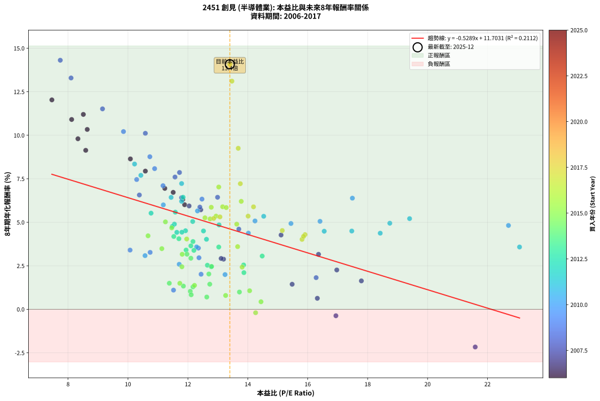
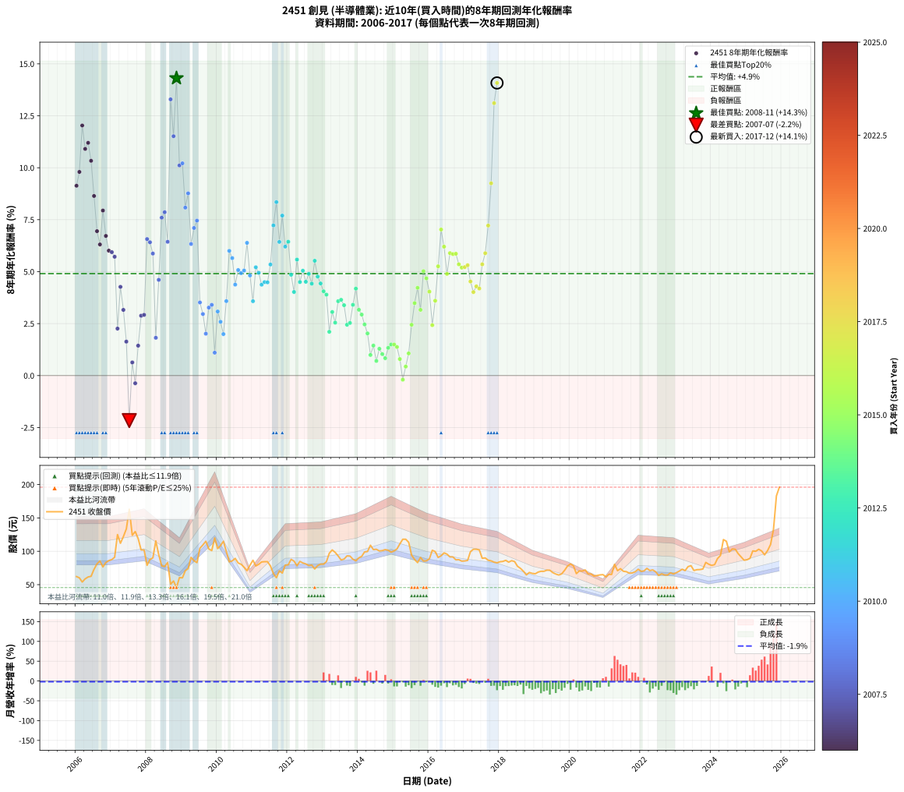

# 2451 創見 - 本益比與未來報酬率分析

!!! info "報告資訊"
    - **股票代號**: 2451
    - **公司名稱**: 創見
    - **產業別**: 半導體業
    - **分析期間**: 2006-2017 (144 個數據點)
    - **資料來源**: Type 12 (ShowMonthlyK_ChartFlow) 月收盤價與本益比
    - **報酬率口徑**: 含現金股利 (簡化: 年度合計，假設每年7/1入帳)
    - **報告生成時間**: 2026-01-10 22:38:55 CST

## 📈 視覺化圖表

### 圖表1: 本益比 vs 未來報酬率關係

*圖表1：2451 創見 本益比與8年期未來報酬率關係 (2006-2017)*

### 圖表2: 歷年買入時點的8年期實際報酬率

*圖表2：2451 創見 歷年買入時點的8年期實際報酬率 (2006-2017)*

## 📍 買點訊號說明

本報告提供兩種買點提示訊號（顯示於圖表2的股價子圖中）：

### ▲ 小綠色三角形（回測驗證）
- **計算方式**: 使用全部歷史資料計算本益比第25百分位數
- **用途**: 事後驗證，顯示歷史上哪些時點確實為低估區
- **限制**: 當下無法判斷，僅供回測參考
- **特性**: 後見之明（Look-Ahead Bias）

### ▲ 小橘色三角形（即時訊號）
- **計算方式**: 使用截至當月的過去5年資料計算本益比第25百分位數
- **用途**: 實際投資決策，當時即可判斷
- **優勢**: 可操作性強，符合實務需求
- **特性**: 無後見之明，滾動窗口計算

!!! tip "如何使用兩種訊號"
    - **綠色▲** 幫助理解歷史估值機會，驗證策略有效性
    - **橘色▲** 可作為實際買進參考，但仍需搭配基本面分析
    - 兩種訊號重疊時，表示即時判斷與事後驗證一致，信心度較高
    - 僅有綠色▲時，表示當時無法判斷（需要未來資料才能確認）
    - 僅有橘色▲時，表示即時判斷為買點，但事後可能不是最佳時機

## 📊 估值分析摘要

| 指標 | 數值 |
|:---:|:---:|
| **目前本益比** (2017-12) | **13.40 倍** |
| **歷史平均本益比** | 12.85 倍 |
| **估值水準** | 🟡 合理範圍 |
| **預期8年年化報酬率** | **+4.62%** |
| **歷史平均報酬率** | +4.90% |
| **相關係數 (R²)** | 0.2112 |
| **趨勢線斜率** | -0.5289 |

!!! abstract "核心洞察"
    目前本益比接近歷史平均，預期報酬率符合長期趨勢

    根據歷史數據回測，2451 創見 在目前本益比 **13.4倍** 的估值水準下，
    預期未來8年年化報酬率約為 **+4.6%**。

    **重要提醒**: 本分析基於歷史數據統計，實際報酬率會受到公司基本面變化、產業趨勢、
    總體經濟環境等多重因素影響。R² = 0.21 表示本益比可解釋約 21.1% 的報酬率變異。

## 📈 歷史估值統計

### 最佳買點 (最高報酬率)

| 項目 | 數值 |
|:---:|:---:|
| 起始時間 | 2008-11 |
| 當時本益比 | 7.74 倍 |
| 起始價格 | 45.6 元 |
| 8年後價格 | 87.4 元 |
| **8年年化報酬率** | **+14.31%** |

### 最差買點 (最低報酬率)

| 項目 | 數值 |
|:---:|:---:|
| 起始時間 | 2007-07 |
| 當時本益比 | 21.59 倍 |
| 起始價格 | 163.0 元 |
| 8年後價格 | 94.1 元 |
| **8年年化報酬率** | **-2.17%** |

## 🎯 投資啟示

### 本益比與報酬率關係

趨勢線方程式: **y = -0.5289x + 11.7031**

!!! warning "強負相關"
    本益比與未來報酬率呈現強負相關。在高本益比時期買入，未來報酬率顯著較低；
    在低本益比時期買入，未來報酬率顯著較高。**估值紀律至關重要**。

### 估值區間建議

基於歷史數據分析:

- **🟢 低估區** (P/E < 10.3): 預期報酬率較高，可考慮增加持股
- **🟡 合理區** (P/E 10.3-15.4): 預期報酬率符合長期趨勢，正常持有
- **🔴 高估區** (P/E > 15.4): 預期報酬率較低，可考慮減碼或觀望

!!! danger "風險提示"
    - 過去表現不代表未來結果
    - 本分析假設公司基本面無重大結構性變化
    - 產業環境劇變可能使歷史規律失效
    - 應結合公司財報、產業趨勢、總體經濟等多重因素綜合判斷

!!! success "長期投資觀點"
    歷史數據顯示，在合理或低估的估值水準買入並長期持有，
    往往能獲得較佳的投資報酬。**耐心等待好價格**是價值投資的核心原則。

## 📊 數據品質

- **資料來源**: GoodInfo.tw Type 12 (ShowMonthlyK_ChartFlow)
- **資料頻率**: 月度收盤價與本益比
- **回測期間**: 2006-2017
- **數據點數量**: 144 個 (每個點代表一次8年期回測)

### 計算方法說明

1. **8年期年化報酬率**:
   - 對每個歷史時點，計算其後8年的實際投資報酬率
   - 期末價值(不含股利): 期末價格
   - 期末價值(含現金股利): 期末價格 + 持有期間內的現金股利合計 (簡化: 年度合計，假設每年7/1入帳)
   - 公式: 年化報酬率 = [(期末價值/期初價格)^(1/年數) - 1] × 100%

2. **本益比 (P/E Ratio)**:
   - 使用當時的月收盤價與EPS計算
   - 資料來源: Type 12 月度河流圖本益比數據

3. **趨勢線 (Linear Regression)**:
   - 使用最小平方法擬合線性趨勢線
   - R²值衡量本益比對報酬率的解釋能力

---

*本報告由 Stock Analysis System v1.9.0 自動生成*
*數據更新時間: 2026-01-10 22:38:55 CST*

## 📋 月度回測明細表

（每一列對應時間線圖中的一個買入點；可用來對照 SVG 圖上的每個點。）

| 買入月份 | 賣出月份 | 回測期限_年 | 實際持有年數 | 買入本益比_倍 | 買入收盤價_元 | 賣出收盤價_元 | 現金股利合計_元 | 總報酬率_pct | 年化報酬率_pct |
| --- | --- | --- | --- | --- | --- | --- | --- | --- | --- |
| 2006-01 | 2014-01 | 8 | 8.000 | 8.59 | 62.10 | 90.20 | 34.76 | +101.23 | +9.13 |
| 2006-02 | 2014-02 | 8 | 8.000 | 8.33 | 60.20 | 92.40 | 34.76 | +111.24 | +9.80 |
| 2006-03 | 2014-03 | 8 | 8.000 | 7.46 | 53.90 | 99.00 | 34.76 | +148.17 | +12.03 |
| 2006-04 | 2014-04 | 8 | 8.000 | 8.12 | 58.70 | 99.60 | 34.76 | +128.90 | +10.91 |
| 2006-05 | 2014-05 | 8 | 8.000 | 8.51 | 61.50 | 109.00 | 34.76 | +133.76 | +11.20 |
| 2006-06 | 2014-06 | 8 | 8.000 | 8.64 | 62.50 | 102.50 | 34.76 | +119.62 | +10.33 |
| 2006-07 | 2014-07 | 8 | 8.000 | 10.08 | 72.90 | 103.00 | 38.47 | +94.06 | +8.64 |
| 2006-08 | 2014-08 | 8 | 8.000 | 11.23 | 81.20 | 100.50 | 38.47 | +71.15 | +6.95 |
| 2006-09 | 2014-09 | 8 | 8.000 | 11.83 | 85.50 | 101.00 | 38.47 | +63.13 | +6.31 |
| 2006-10 | 2014-10 | 8 | 8.000 | 10.58 | 76.50 | 102.50 | 38.47 | +84.28 | +7.94 |
| 2006-11 | 2014-11 | 8 | 8.000 | 11.51 | 83.20 | 101.50 | 38.47 | +68.24 | +6.72 |
| 2006-12 | 2014-12 | 8 | 8.000 | 11.89 | 86.00 | 98.70 | 38.47 | +59.50 | +6.01 |
| 2007-01 | 2015-01 | 8 | 8.000 | 12.04 | 87.60 | 100.50 | 38.47 | +58.64 | +5.94 |
| 2007-02 | 2015-02 | 8 | 8.000 | 12.43 | 91.00 | 103.50 | 38.47 | +56.01 | +5.72 |
| 2007-03 | 2015-03 | 8 | 8.000 | 16.97 | 125.00 | 111.00 | 38.47 | +19.58 | +2.26 |
| 2007-04 | 2015-04 | 8 | 8.000 | 15.11 | 112.00 | 118.00 | 38.47 | +39.71 | +4.27 |
| 2007-05 | 2015-05 | 8 | 8.000 | 16.36 | 122.00 | 118.00 | 38.47 | +28.26 | +3.16 |
| 2007-06 | 2015-06 | 8 | 8.000 | 17.79 | 133.50 | 113.50 | 38.47 | +13.84 | +1.63 |
| 2007-07 | 2015-07 | 8 | 8.000 | 21.59 | 163.00 | 94.10 | 42.71 | -16.07 | -2.17 |
| 2007-08 | 2015-08 | 8 | 8.000 | 16.32 | 124.00 | 87.70 | 42.71 | +5.17 | +0.63 |
| 2007-09 | 2015-09 | 8 | 8.000 | 16.94 | 129.50 | 83.00 | 42.71 | -2.93 | -0.37 |
| 2007-10 | 2015-10 | 8 | 8.000 | 15.48 | 119.00 | 90.70 | 42.71 | +12.11 | +1.44 |
| 2007-11 | 2015-11 | 8 | 8.000 | 13.19 | 102.00 | 85.30 | 42.71 | +25.50 | +2.88 |
| 2007-12 | 2015-12 | 8 | 8.000 | 13.11 | 102.00 | 85.70 | 42.71 | +25.89 | +2.92 |
| 2008-01 | 2016-01 | 8 | 8.000 | 10.38 | 79.00 | 88.70 | 42.71 | +66.34 | +6.57 |
| 2008-02 | 2016-02 | 8 | 8.000 | 11.79 | 87.70 | 101.50 | 42.71 | +64.44 | +6.41 |
| 2008-03 | 2016-03 | 8 | 8.000 | 12.40 | 90.10 | 99.50 | 42.71 | +57.84 | +5.87 |
| 2008-04 | 2016-04 | 8 | 8.000 | 16.28 | 115.50 | 90.70 | 42.71 | +15.51 | +1.82 |
| 2008-05 | 2016-05 | 8 | 8.000 | 13.70 | 94.80 | 93.20 | 42.71 | +43.36 | +4.61 |
| 2008-06 | 2016-06 | 8 | 8.000 | 11.57 | 78.10 | 97.60 | 42.71 | +79.65 | +7.60 |
| 2008-07 | 2016-07 | 8 | 8.000 | 11.72 | 77.10 | 95.70 | 45.54 | +83.19 | +7.86 |
| 2008-08 | 2016-08 | 8 | 8.000 | 12.99 | 83.20 | 91.50 | 45.54 | +64.72 | +6.44 |
| 2008-09 | 2016-09 | 8 | 8.000 | 8.10 | 50.50 | 91.50 | 45.54 | +171.37 | +13.29 |
| 2008-10 | 2016-10 | 8 | 8.000 | 9.15 | 55.50 | 87.20 | 45.54 | +139.18 | +11.52 |
| 2008-11 | 2016-11 | 8 | 8.000 | 7.74 | 45.60 | 87.40 | 45.54 | +191.54 | +14.31 |
| 2008-12 | 2016-12 | 8 | 8.000 | 10.58 | 60.50 | 85.20 | 45.54 | +116.10 | +10.11 |
| 2009-01 | 2017-01 | 8 | 8.000 | 9.85 | 60.20 | 85.50 | 45.54 | +117.68 | +10.21 |
| 2009-02 | 2017-02 | 8 | 8.000 | 10.89 | 70.80 | 86.30 | 45.54 | +86.22 | +8.08 |
| 2009-03 | 2017-03 | 8 | 8.000 | 10.73 | 74.00 | 99.40 | 45.54 | +95.87 | +8.77 |
| 2009-04 | 2017-04 | 8 | 8.000 | 12.47 | 90.90 | 103.00 | 45.54 | +63.41 | +6.33 |
| 2009-05 | 2017-05 | 8 | 8.000 | 11.17 | 85.80 | 103.00 | 45.54 | +73.13 | +7.10 |
| 2009-06 | 2017-06 | 8 | 8.000 | 10.29 | 83.00 | 102.00 | 45.54 | +77.76 | +7.46 |
| 2009-07 | 2017-07 | 8 | 8.000 | 12.35 | 104.50 | 89.50 | 48.29 | +31.86 | +3.52 |
| 2009-08 | 2017-08 | 8 | 8.000 | 12.37 | 109.50 | 90.00 | 48.29 | +26.29 | +2.96 |
| 2009-09 | 2017-09 | 8 | 8.000 | 12.44 | 115.00 | 86.60 | 48.29 | +17.30 | +2.01 |
| 2009-10 | 2017-10 | 8 | 8.000 | 10.74 | 103.50 | 85.60 | 48.29 | +29.36 | +3.27 |
| 2009-11 | 2017-11 | 8 | 8.000 | 10.07 | 101.00 | 83.70 | 48.29 | +30.69 | +3.40 |
| 2009-12 | 2017-12 | 8 | 8.000 | 11.52 | 120.00 | 82.70 | 48.29 | +9.16 | +1.10 |
| 2010-01 | 2018-01 | 8 | 8.000 | 10.57 | 104.00 | 84.30 | 48.29 | +27.49 | +3.08 |
| 2010-02 | 2018-02 | 8 | 8.000 | 11.71 | 108.50 | 84.80 | 48.29 | +22.67 | +2.59 |
| 2010-03 | 2018-03 | 8 | 8.000 | 13.24 | 115.00 | 86.40 | 48.29 | +17.12 | +2.00 |
| 2010-04 | 2018-04 | 8 | 8.000 | 12.29 | 99.60 | 83.70 | 48.29 | +32.52 | +3.58 |
| 2010-05 | 2018-05 | 8 | 8.000 | 11.18 | 84.20 | 85.90 | 48.29 | +59.37 | +6.00 |
| 2010-06 | 2018-06 | 8 | 8.000 | 12.32 | 85.60 | 84.60 | 48.29 | +55.25 | +5.65 |
| 2010-07 | 2018-07 | 8 | 8.000 | 14.02 | 89.30 | 77.50 | 48.30 | +40.87 | +4.38 |
| 2010-08 | 2018-08 | 8 | 8.000 | 14.24 | 82.50 | 74.30 | 48.30 | +48.60 | +5.08 |
| 2010-09 | 2018-09 | 8 | 8.000 | 15.44 | 80.50 | 70.00 | 48.30 | +46.95 | +4.93 |
| 2010-10 | 2018-10 | 8 | 8.000 | 16.41 | 76.10 | 64.60 | 48.30 | +48.35 | +5.05 |
| 2010-11 | 2018-11 | 8 | 8.000 | 17.49 | 71.00 | 68.20 | 48.30 | +64.08 | +6.39 |
| 2010-12 | 2018-12 | 8 | 8.000 | 22.70 | 79.00 | 66.80 | 48.30 | +45.69 | +4.82 |
| 2011-01 | 2019-01 | 8 | 8.000 | 23.07 | 86.50 | 66.30 | 48.30 | +32.48 | +3.58 |
| 2011-02 | 2019-02 | 8 | 8.000 | 19.40 | 78.00 | 68.80 | 48.30 | +50.13 | +5.21 |
| 2011-03 | 2019-03 | 8 | 8.000 | 18.74 | 80.40 | 70.00 | 48.30 | +47.14 | +4.95 |
| 2011-04 | 2019-04 | 8 | 8.000 | 18.42 | 84.00 | 70.00 | 48.30 | +40.83 | +4.37 |
| 2011-05 | 2019-05 | 8 | 8.000 | 17.47 | 84.40 | 71.70 | 48.30 | +42.18 | +4.50 |
| 2011-06 | 2019-06 | 8 | 8.000 | 16.55 | 84.40 | 71.60 | 48.30 | +42.06 | +4.49 |
| 2011-07 | 2019-07 | 8 | 8.000 | 14.53 | 78.00 | 68.00 | 50.30 | +51.67 | +5.34 |
| 2011-08 | 2019-08 | 8 | 8.000 | 11.79 | 66.50 | 65.90 | 50.30 | +74.74 | +7.23 |
| 2011-09 | 2019-09 | 8 | 8.000 | 10.22 | 60.40 | 64.40 | 50.30 | +89.90 | +8.35 |
| 2011-10 | 2019-10 | 8 | 8.000 | 11.44 | 70.70 | 66.10 | 50.30 | +64.64 | +6.43 |
| 2011-11 | 2019-11 | 8 | 8.000 | 10.43 | 67.30 | 71.50 | 50.30 | +80.98 | +7.70 |
| 2011-12 | 2019-12 | 8 | 8.000 | 11.79 | 79.20 | 77.90 | 50.30 | +61.87 | +6.21 |
| 2012-01 | 2020-01 | 8 | 8.000 | 11.84 | 79.70 | 81.00 | 50.30 | +64.74 | +6.44 |
| 2012-02 | 2020-02 | 8 | 8.000 | 13.04 | 87.90 | 78.10 | 50.30 | +46.08 | +4.85 |
| 2012-03 | 2020-03 | 8 | 8.000 | 12.62 | 85.20 | 66.50 | 50.30 | +37.09 | +4.02 |
| 2012-04 | 2020-04 | 8 | 8.000 | 11.58 | 78.30 | 70.60 | 50.30 | +54.41 | +5.58 |
| 2012-05 | 2020-05 | 8 | 8.000 | 12.52 | 84.80 | 70.30 | 50.30 | +42.22 | +4.50 |
| 2012-06 | 2020-06 | 8 | 8.000 | 12.16 | 82.50 | 72.00 | 50.30 | +48.24 | +5.04 |
| 2012-07 | 2020-07 | 8 | 8.000 | 11.92 | 81.00 | 66.00 | 49.30 | +42.35 | +4.51 |
| 2012-08 | 2020-08 | 8 | 8.000 | 11.55 | 78.60 | 65.90 | 49.30 | +46.56 | +4.89 |
| 2012-09 | 2020-09 | 8 | 8.000 | 11.63 | 79.30 | 62.80 | 49.30 | +41.36 | +4.42 |
| 2012-10 | 2020-10 | 8 | 8.000 | 10.77 | 73.50 | 63.70 | 49.30 | +53.74 | +5.52 |
| 2012-11 | 2020-11 | 8 | 8.000 | 11.48 | 78.50 | 64.60 | 49.30 | +45.10 | +4.76 |
| 2012-12 | 2020-12 | 8 | 8.000 | 11.80 | 80.80 | 65.00 | 49.30 | +41.46 | +4.43 |
| 2013-01 | 2021-01 | 8 | 8.000 | 11.70 | 80.70 | 61.60 | 49.30 | +37.42 | +4.05 |
| 2013-02 | 2021-02 | 8 | 8.000 | 12.17 | 84.50 | 65.40 | 49.30 | +35.74 | +3.89 |
| 2013-03 | 2021-03 | 8 | 8.000 | 13.87 | 97.00 | 65.30 | 49.30 | +18.14 | +2.11 |
| 2013-04 | 2021-04 | 8 | 8.000 | 14.48 | 102.00 | 80.50 | 49.30 | +27.25 | +3.06 |
| 2013-05 | 2021-05 | 8 | 8.000 | 13.86 | 98.30 | 70.90 | 49.30 | +22.28 | +2.55 |
| 2013-06 | 2021-06 | 8 | 8.000 | 13.03 | 93.00 | 73.90 | 49.30 | +32.47 | +3.58 |
| 2013-07 | 2021-07 | 8 | 8.000 | 12.10 | 87.00 | 70.00 | 45.85 | +33.16 | +3.64 |
| 2013-08 | 2021-08 | 8 | 8.000 | 12.20 | 88.30 | 69.40 | 45.85 | +30.52 | +3.39 |
| 2013-09 | 2021-09 | 8 | 8.000 | 12.78 | 93.10 | 67.10 | 45.85 | +21.32 | +2.45 |
| 2013-10 | 2021-10 | 8 | 8.000 | 12.65 | 92.80 | 67.50 | 45.85 | +22.14 | +2.53 |
| 2013-11 | 2021-11 | 8 | 8.000 | 11.94 | 88.10 | 69.30 | 45.85 | +30.70 | +3.40 |
| 2013-12 | 2021-12 | 8 | 8.000 | 11.53 | 85.70 | 73.10 | 45.85 | +38.80 | +4.18 |
| 2014-01 | 2022-01 | 8 | 8.000 | 11.97 | 90.20 | 69.90 | 45.85 | +28.33 | +3.17 |
| 2014-02 | 2022-02 | 8 | 8.000 | 12.10 | 92.40 | 70.60 | 45.85 | +26.03 | +2.93 |
| 2014-03 | 2022-03 | 8 | 8.000 | 12.79 | 99.00 | 74.40 | 45.85 | +21.46 | +2.46 |
| 2014-04 | 2022-04 | 8 | 8.000 | 12.70 | 99.60 | 71.10 | 45.85 | +17.42 | +2.03 |
| 2014-05 | 2022-05 | 8 | 8.000 | 13.72 | 109.00 | 72.10 | 45.85 | +8.21 | +0.99 |
| 2014-06 | 2022-06 | 8 | 8.000 | 12.73 | 102.50 | 69.10 | 45.85 | +12.15 | +1.44 |
| 2014-07 | 2022-07 | 8 | 8.000 | 12.63 | 103.00 | 63.80 | 45.15 | +5.78 | +0.70 |
| 2014-08 | 2022-08 | 8 | 8.000 | 12.17 | 100.50 | 66.20 | 45.15 | +10.80 | +1.29 |
| 2014-09 | 2022-09 | 8 | 8.000 | 12.08 | 101.00 | 64.50 | 45.15 | +8.56 | +1.03 |
| 2014-10 | 2022-10 | 8 | 8.000 | 12.11 | 102.50 | 64.40 | 45.15 | +6.88 | +0.83 |
| 2014-11 | 2022-11 | 8 | 8.000 | 11.85 | 101.50 | 67.70 | 45.15 | +11.18 | +1.33 |
| 2014-12 | 2022-12 | 8 | 8.000 | 11.38 | 98.70 | 66.00 | 45.15 | +12.61 | +1.50 |
| 2015-01 | 2023-01 | 8 | 8.000 | 11.73 | 100.50 | 68.00 | 45.15 | +12.59 | +1.49 |
| 2015-02 | 2023-02 | 8 | 8.000 | 12.22 | 103.50 | 70.30 | 45.15 | +11.55 | +1.38 |
| 2015-03 | 2023-03 | 8 | 8.000 | 13.26 | 111.00 | 73.10 | 45.15 | +6.53 | +0.79 |
| 2015-04 | 2023-04 | 8 | 8.000 | 14.26 | 118.00 | 71.00 | 45.15 | -1.57 | -0.20 |
| 2015-05 | 2023-05 | 8 | 8.000 | 14.44 | 118.00 | 77.00 | 45.15 | +3.52 | +0.43 |
| 2015-06 | 2023-06 | 8 | 8.000 | 14.06 | 113.50 | 78.40 | 45.15 | +8.85 | +1.07 |
| 2015-07 | 2023-07 | 8 | 8.000 | 11.80 | 94.10 | 71.20 | 42.95 | +21.31 | +2.44 |
| 2015-08 | 2023-08 | 8 | 8.000 | 11.13 | 87.70 | 72.40 | 42.95 | +31.53 | +3.48 |
| 2015-09 | 2023-09 | 8 | 8.000 | 10.67 | 83.00 | 72.60 | 42.95 | +39.22 | +4.22 |
| 2015-10 | 2023-10 | 8 | 8.000 | 11.81 | 90.70 | 73.40 | 42.95 | +28.28 | +3.16 |
| 2015-11 | 2023-11 | 8 | 8.000 | 11.25 | 85.30 | 83.30 | 42.95 | +48.01 | +5.02 |
| 2015-12 | 2023-12 | 8 | 8.000 | 11.46 | 85.70 | 80.60 | 42.95 | +44.17 | +4.68 |
| 2016-01 | 2024-01 | 8 | 8.000 | 11.96 | 88.70 | 78.80 | 42.95 | +37.26 | +4.04 |
| 2016-02 | 2024-02 | 8 | 8.000 | 13.81 | 101.50 | 80.00 | 42.95 | +21.13 | +2.43 |
| 2016-03 | 2024-03 | 8 | 8.000 | 13.66 | 99.50 | 89.10 | 42.95 | +32.71 | +3.60 |
| 2016-04 | 2024-04 | 8 | 8.000 | 12.57 | 90.70 | 93.70 | 42.95 | +50.66 | +5.26 |
| 2016-05 | 2024-05 | 8 | 8.000 | 13.03 | 93.20 | 117.50 | 42.95 | +72.16 | +7.03 |
| 2016-06 | 2024-06 | 8 | 8.000 | 13.78 | 97.60 | 115.00 | 42.95 | +61.83 | +6.20 |
| 2016-07 | 2024-07 | 8 | 8.000 | 13.63 | 95.70 | 99.10 | 41.14 | +46.54 | +4.89 |
| 2016-08 | 2024-08 | 8 | 8.000 | 13.16 | 91.50 | 103.50 | 41.14 | +58.08 | +5.89 |
| 2016-09 | 2024-09 | 8 | 8.000 | 13.28 | 91.50 | 103.00 | 41.14 | +57.53 | +5.85 |
| 2016-10 | 2024-10 | 8 | 8.000 | 12.78 | 87.20 | 96.40 | 41.14 | +57.73 | +5.86 |
| 2016-11 | 2024-11 | 8 | 8.000 | 12.94 | 87.40 | 91.50 | 41.14 | +51.76 | +5.35 |
| 2016-12 | 2024-12 | 8 | 8.000 | 12.74 | 85.20 | 86.60 | 41.14 | +49.93 | +5.19 |
| 2017-01 | 2025-01 | 8 | 8.000 | 12.86 | 85.50 | 87.30 | 41.14 | +50.22 | +5.22 |
| 2017-02 | 2025-02 | 8 | 8.000 | 13.07 | 86.30 | 89.40 | 41.14 | +51.26 | +5.31 |
| 2017-03 | 2025-03 | 8 | 8.000 | 15.15 | 99.40 | 100.50 | 41.14 | +42.50 | +4.53 |
| 2017-04 | 2025-04 | 8 | 8.000 | 15.81 | 103.00 | 100.00 | 41.14 | +37.03 | +4.02 |
| 2017-05 | 2025-05 | 8 | 8.000 | 15.91 | 103.00 | 103.00 | 41.14 | +39.94 | +4.29 |
| 2017-06 | 2025-06 | 8 | 8.000 | 15.86 | 102.00 | 100.50 | 41.14 | +38.86 | +4.19 |
| 2017-07 | 2025-07 | 8 | 8.000 | 14.01 | 89.50 | 94.60 | 41.23 | +51.76 | +5.35 |
| 2017-08 | 2025-08 | 8 | 8.000 | 14.19 | 90.00 | 101.00 | 41.23 | +58.03 | +5.89 |
| 2017-09 | 2025-09 | 8 | 8.000 | 13.75 | 86.60 | 110.00 | 41.23 | +74.63 | +7.22 |
| 2017-10 | 2025-10 | 8 | 8.000 | 13.68 | 85.60 | 132.50 | 41.23 | +102.95 | +9.25 |
| 2017-11 | 2025-11 | 8 | 8.000 | 13.47 | 83.70 | 183.00 | 41.23 | +167.90 | +13.11 |
| 2017-12 | 2025-12 | 8 | 8.000 | 13.40 | 82.70 | 196.00 | 41.23 | +186.85 | +14.08 |
