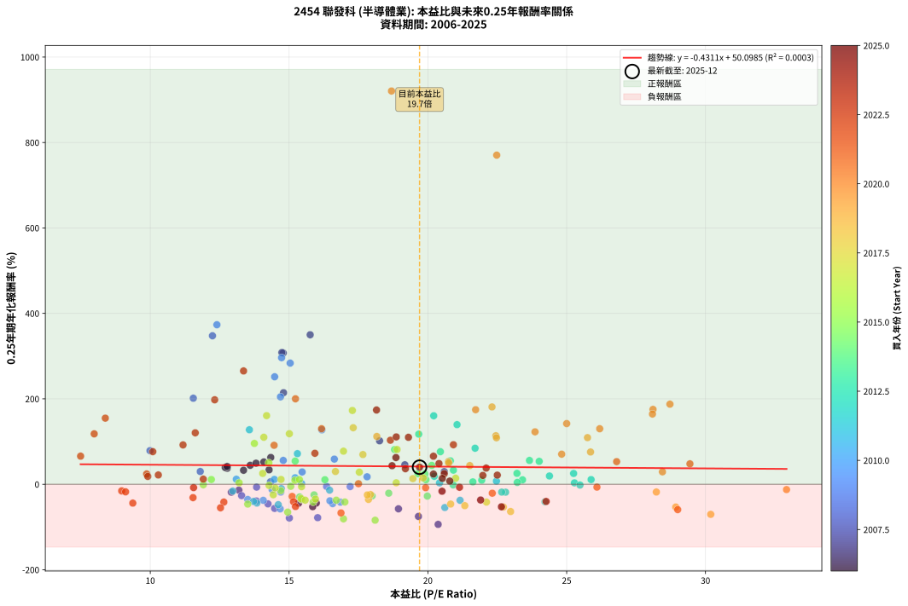
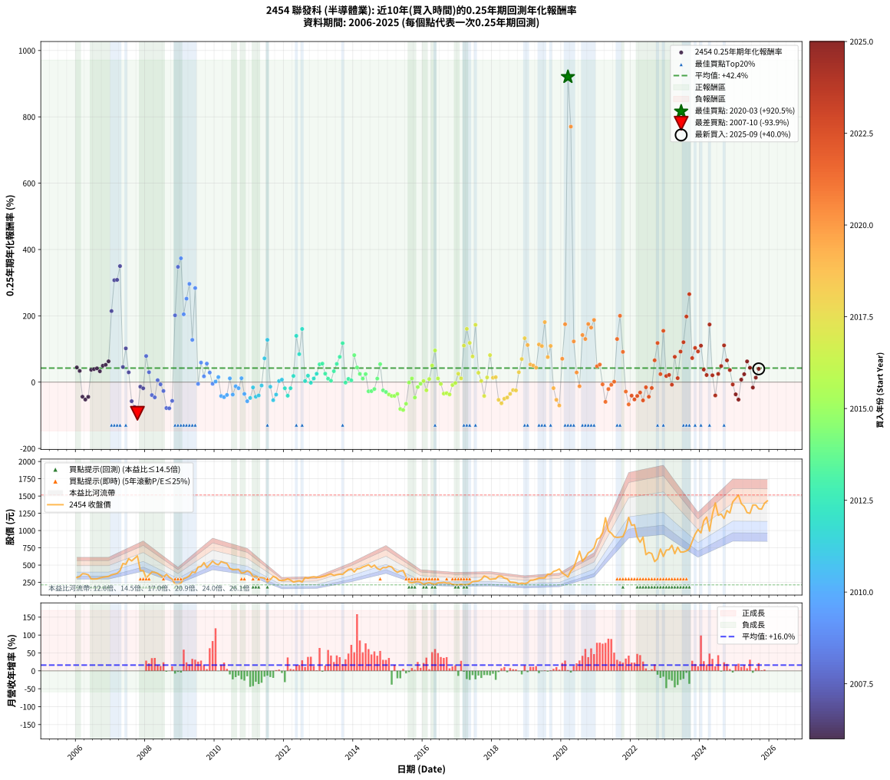

# 2454 聯發科 - 本益比與未來報酬率分析

!!! info "報告資訊"
    - **股票代號**: 2454
    - **公司名稱**: 聯發科
    - **產業別**: 半導體業
    - **分析期間**: 2006-2025 (237 個數據點)
    - **資料來源**: Type 12 (ShowMonthlyK_ChartFlow) 月收盤價與本益比
    - **報酬率口徑**: 含現金股利 (簡化: 年度合計，假設每年7/1入帳)
    - **報告生成時間**: 2026-01-11 20:49:55 CST

## 📈 視覺化圖表

### 圖表1: 本益比 vs 未來報酬率關係

*圖表1：2454 聯發科 本益比與0.25年期未來報酬率關係 (2006-2025)*

### 圖表2: 歷年買入時點的0.25年期實際報酬率

*圖表2：2454 聯發科 歷年買入時點的0.25年期實際報酬率 (2006-2025)*

## 📍 買點訊號說明

本報告提供兩種買點提示訊號（顯示於圖表2的股價子圖中）：

### ▲ 小綠色三角形（回測驗證）
- **計算方式**: 使用全部歷史資料計算本益比第25百分位數
- **用途**: 事後驗證，顯示歷史上哪些時點確實為低估區
- **限制**: 當下無法判斷，僅供回測參考
- **特性**: 後見之明（Look-Ahead Bias）

### ▲ 小橘色三角形（即時訊號）
- **計算方式**: 使用截至當月的過去5年資料計算本益比第25百分位數
- **用途**: 實際投資決策，當時即可判斷
- **優勢**: 可操作性強，符合實務需求
- **特性**: 無後見之明，滾動窗口計算

!!! tip "如何使用兩種訊號"
    - **綠色▲** 幫助理解歷史估值機會，驗證策略有效性
    - **橘色▲** 可作為實際買進參考，但仍需搭配基本面分析
    - 兩種訊號重疊時，表示即時判斷與事後驗證一致，信心度較高
    - 僅有綠色▲時，表示當時無法判斷（需要未來資料才能確認）
    - 僅有橘色▲時，表示即時判斷為買點，但事後可能不是最佳時機

## 📊 估值分析摘要

| 指標 | 數值 |
|:---:|:---:|
| **目前本益比** (2025-09) | **19.70 倍** |
| **歷史平均本益比** | 17.80 倍 |
| **估值水準** | 🟡 合理範圍 |
| **預期0.25年年化報酬率** | **+41.61%** |
| **歷史平均報酬率** | +42.42% |
| **相關係數 (R²)** | 0.0003 |
| **趨勢線斜率** | -0.4311 |

!!! abstract "核心洞察"
    目前本益比接近歷史平均，預期報酬率符合長期趨勢

    根據歷史數據回測，2454 聯發科 在目前本益比 **19.7倍** 的估值水準下，
    預期未來0.25年年化報酬率約為 **+41.6%**。

    **重要提醒**: 本分析基於歷史數據統計，實際報酬率會受到公司基本面變化、產業趨勢、
    總體經濟環境等多重因素影響。R² = 0.00 表示本益比可解釋約 0.0% 的報酬率變異。

## 📈 歷史估值統計

### 最佳買點 (最高報酬率)

| 項目 | 數值 |
|:---:|:---:|
| 起始時間 | 2020-03 |
| 當時本益比 | 18.69 倍 |
| 起始價格 | 327.5 元 |
| 0.25年後價格 | 701.0 元 |
| **0.25年年化報酬率** | **+920.51%** |

### 最差買點 (最低報酬率)

| 項目 | 數值 |
|:---:|:---:|
| 起始時間 | 2007-10 |
| 當時本益比 | 20.37 倍 |
| 起始價格 | 633.0 元 |
| 0.25年後價格 | 313.5 元 |
| **0.25年年化報酬率** | **-93.86%** |

## 🎯 投資啟示

### 本益比與報酬率關係

趨勢線方程式: **y = -0.4311x + 50.0985**

!!! note "負相關"
    本益比與未來報酬率呈現負相關。較低的本益比通常帶來較高的未來報酬率，
    但相關性不算非常強。**估值仍是重要參考指標之一**。

### 估值區間建議

基於歷史數據分析:

- **🟢 低估區** (P/E < 14.2): 預期報酬率較高，可考慮增加持股
- **🟡 合理區** (P/E 14.2-21.4): 預期報酬率符合長期趨勢，正常持有
- **🔴 高估區** (P/E > 21.4): 預期報酬率較低，可考慮減碼或觀望

!!! danger "風險提示"
    - 過去表現不代表未來結果
    - 本分析假設公司基本面無重大結構性變化
    - 產業環境劇變可能使歷史規律失效
    - 應結合公司財報、產業趨勢、總體經濟等多重因素綜合判斷

!!! success "長期投資觀點"
    歷史數據顯示，在合理或低估的估值水準買入並長期持有，
    往往能獲得較佳的投資報酬。**耐心等待好價格**是價值投資的核心原則。

## 📊 數據品質

- **資料來源**: GoodInfo.tw Type 12 (ShowMonthlyK_ChartFlow)
- **資料頻率**: 月度收盤價與本益比
- **回測期間**: 2006-2025
- **數據點數量**: 237 個 (每個點代表一次0.25年期回測)

### 計算方法說明

1. **0.25年期年化報酬率**:
   - 對每個歷史時點，計算其後0.25年的實際投資報酬率
   - 期末價值(不含股利): 期末價格
   - 期末價值(含現金股利): 期末價格 + 持有期間內的現金股利合計 (簡化: 年度合計，假設每年7/1入帳)
   - 公式: 年化報酬率 = [(期末價值/期初價格)^(1/年數) - 1] × 100%

2. **本益比 (P/E Ratio)**:
   - 使用當時的月收盤價與EPS計算
   - 資料來源: Type 12 月度河流圖本益比數據

3. **趨勢線 (Linear Regression)**:
   - 使用最小平方法擬合線性趨勢線
   - R²值衡量本益比對報酬率的解釋能力

---

*本報告由 Stock Analysis System v1.9.0 自動生成*
*數據更新時間: 2026-01-11 20:49:55 CST*

## 📋 月度回測明細表

（每一列對應時間線圖中的一個買入點；可用來對照 SVG 圖上的每個點。）

| 買入月份 | 賣出月份 | 回測期限_年 | 實際持有年數 | 買入本益比_倍 | 買入收盤價_元 | 賣出收盤價_元 | 現金股利合計_元 | 總報酬率_pct | 年化報酬率_pct |
| --- | --- | --- | --- | --- | --- | --- | --- | --- | --- |
| 2006-01 | 2006-05 | 0.25 | 0.329 | 13.60 | 319.50 | 360.50 | 0.00 | +12.83 | +44.41 |
| 2006-02 | 2006-05 | 0.25 | 0.246 | 14.28 | 335.50 | 360.50 | 0.00 | +7.45 | +33.87 |
| 2006-03 | 2006-07 | 0.25 | 0.334 | 15.98 | 375.50 | 298.50 | 11.00 | -17.58 | -43.94 |
| 2006-04 | 2006-07 | 0.25 | 0.249 | 15.85 | 372.50 | 298.50 | 11.00 | -16.91 | -52.46 |
| 2006-05 | 2006-08 | 0.25 | 0.252 | 15.34 | 360.50 | 300.00 | 11.00 | -13.73 | -44.37 |
| 2006-06 | 2006-09 | 0.25 | 0.252 | 12.77 | 300.00 | 314.00 | 11.00 | +8.33 | +37.41 |
| 2006-07 | 2006-10 | 0.25 | 0.252 | 12.70 | 298.50 | 324.50 | 0.00 | +8.71 | +39.31 |
| 2006-08 | 2006-12 | 0.25 | 0.334 | 12.77 | 300.00 | 337.00 | 0.00 | +12.33 | +41.65 |
| 2006-09 | 2006-12 | 0.25 | 0.249 | 13.36 | 314.00 | 337.00 | 0.00 | +7.32 | +32.81 |
| 2006-10 | 2007-01 | 0.25 | 0.252 | 13.81 | 324.50 | 359.00 | 0.00 | +10.63 | +49.35 |
| 2006-11 | 2007-03 | 0.25 | 0.329 | 14.09 | 331.00 | 380.00 | 0.00 | +14.80 | +52.23 |
| 2006-12 | 2007-03 | 0.25 | 0.246 | 14.34 | 337.00 | 380.00 | 0.00 | +12.76 | +62.80 |
| 2007-01 | 2007-05 | 0.25 | 0.329 | 14.80 | 359.00 | 523.00 | 0.00 | +45.68 | +214.32 |
| 2007-02 | 2007-05 | 0.25 | 0.246 | 14.79 | 370.00 | 523.00 | 0.00 | +41.35 | +307.35 |
| 2007-03 | 2007-07 | 0.25 | 0.334 | 14.74 | 380.00 | 593.00 | 15.00 | +60.00 | +308.42 |
| 2007-04 | 2007-07 | 0.25 | 0.249 | 15.76 | 418.00 | 593.00 | 15.00 | +45.45 | +349.93 |
| 2007-05 | 2007-08 | 0.25 | 0.252 | 19.17 | 523.00 | 560.00 | 15.00 | +9.94 | +45.69 |
| 2007-06 | 2007-09 | 0.25 | 0.252 | 18.26 | 512.00 | 596.00 | 15.00 | +19.34 | +101.74 |
| 2007-07 | 2007-10 | 0.25 | 0.252 | 20.59 | 593.00 | 633.00 | 0.00 | +6.75 | +29.58 |
| 2007-08 | 2007-12 | 0.25 | 0.334 | 18.94 | 560.00 | 421.00 | 0.00 | -24.82 | -57.44 |
| 2007-09 | 2007-12 | 0.25 | 0.249 | 19.66 | 596.00 | 421.00 | 0.00 | -29.36 | -75.22 |
| 2007-10 | 2008-01 | 0.25 | 0.252 | 20.37 | 633.00 | 313.50 | 0.00 | -50.47 | -93.86 |
| 2007-11 | 2008-03 | 0.25 | 0.331 | 13.19 | 420.00 | 400.00 | 0.00 | -4.76 | -13.69 |
| 2007-12 | 2008-03 | 0.25 | 0.249 | 12.92 | 421.00 | 400.00 | 0.00 | -4.99 | -18.57 |
| 2008-01 | 2008-05 | 0.25 | 0.331 | 9.99 | 313.50 | 380.00 | 0.00 | +21.21 | +78.73 |
| 2008-02 | 2008-05 | 0.25 | 0.249 | 11.80 | 356.00 | 380.00 | 0.00 | +6.74 | +29.93 |
| 2008-03 | 2008-07 | 0.25 | 0.334 | 13.82 | 400.00 | 320.00 | 19.00 | -15.25 | -39.07 |
| 2008-04 | 2008-07 | 0.25 | 0.249 | 14.24 | 395.00 | 320.00 | 19.00 | -14.18 | -45.86 |
| 2008-05 | 2008-08 | 0.25 | 0.252 | 14.33 | 380.00 | 366.50 | 19.00 | +1.45 | +5.87 |
| 2008-06 | 2008-09 | 0.25 | 0.252 | 13.83 | 350.00 | 325.00 | 19.00 | -1.71 | -6.63 |
| 2008-07 | 2008-10 | 0.25 | 0.252 | 13.29 | 320.00 | 296.00 | 0.00 | -7.50 | -26.62 |
| 2008-08 | 2008-12 | 0.25 | 0.334 | 16.03 | 366.50 | 220.50 | 0.00 | -39.84 | -78.15 |
| 2008-09 | 2008-12 | 0.25 | 0.249 | 15.01 | 325.00 | 220.50 | 0.00 | -32.15 | -78.92 |
| 2008-10 | 2009-01 | 0.25 | 0.252 | 14.48 | 296.00 | 240.00 | 0.00 | -18.92 | -56.51 |
| 2008-11 | 2009-03 | 0.25 | 0.329 | 11.55 | 222.00 | 319.00 | 0.00 | +43.69 | +201.44 |
| 2008-12 | 2009-03 | 0.25 | 0.246 | 12.24 | 220.50 | 319.00 | 0.00 | +44.67 | +347.59 |
| 2009-01 | 2009-05 | 0.25 | 0.329 | 12.40 | 240.00 | 400.00 | 0.00 | +66.67 | +373.43 |
| 2009-02 | 2009-05 | 0.25 | 0.246 | 14.69 | 304.00 | 400.00 | 0.00 | +31.58 | +204.58 |
| 2009-03 | 2009-07 | 0.25 | 0.334 | 14.48 | 319.00 | 471.50 | 14.00 | +52.19 | +251.62 |
| 2009-04 | 2009-07 | 0.25 | 0.249 | 14.73 | 344.50 | 471.50 | 14.00 | +40.93 | +296.32 |
| 2009-05 | 2009-08 | 0.25 | 0.252 | 16.18 | 400.00 | 478.00 | 14.00 | +23.00 | +127.47 |
| 2009-06 | 2009-09 | 0.25 | 0.252 | 15.04 | 392.00 | 536.00 | 14.00 | +40.31 | +283.63 |
| 2009-07 | 2009-10 | 0.25 | 0.252 | 17.20 | 471.50 | 465.00 | 0.00 | -1.38 | -5.36 |
| 2009-08 | 2009-12 | 0.25 | 0.334 | 16.63 | 478.00 | 558.00 | 0.00 | +16.74 | +58.93 |
| 2009-09 | 2009-12 | 0.25 | 0.249 | 17.81 | 536.00 | 558.00 | 0.00 | +4.10 | +17.52 |
| 2009-10 | 2010-01 | 0.25 | 0.252 | 14.79 | 465.00 | 520.00 | 0.00 | +11.83 | +55.87 |
| 2009-11 | 2010-03 | 0.25 | 0.329 | 15.47 | 507.00 | 551.00 | 0.00 | +8.68 | +28.83 |
| 2009-12 | 2010-03 | 0.25 | 0.246 | 16.35 | 558.00 | 551.00 | 0.00 | -1.25 | -4.99 |
| 2010-01 | 2010-05 | 0.25 | 0.329 | 15.45 | 520.00 | 523.00 | 0.00 | +0.58 | +1.77 |
| 2010-02 | 2010-05 | 0.25 | 0.246 | 15.22 | 505.00 | 523.00 | 0.00 | +3.56 | +15.27 |
| 2010-03 | 2010-07 | 0.25 | 0.334 | 16.85 | 551.00 | 433.50 | 26.00 | -16.61 | -41.94 |
| 2010-04 | 2010-07 | 0.25 | 0.249 | 16.57 | 534.00 | 433.50 | 26.00 | -13.95 | -45.29 |
| 2010-05 | 2010-08 | 0.25 | 0.252 | 16.47 | 523.00 | 436.50 | 26.00 | -11.57 | -38.62 |
| 2010-06 | 2010-09 | 0.25 | 0.252 | 14.47 | 452.50 | 439.00 | 26.00 | +2.76 | +11.43 |
| 2010-07 | 2010-10 | 0.25 | 0.252 | 14.07 | 433.50 | 385.00 | 0.00 | -11.19 | -37.57 |
| 2010-08 | 2010-12 | 0.25 | 0.334 | 14.39 | 436.50 | 417.50 | 0.00 | -4.35 | -12.47 |
| 2010-09 | 2010-12 | 0.25 | 0.249 | 14.70 | 439.00 | 417.50 | 0.00 | -4.90 | -18.25 |
| 2010-10 | 2011-01 | 0.25 | 0.252 | 13.10 | 385.00 | 396.00 | 0.00 | +2.86 | +11.83 |
| 2010-11 | 2011-03 | 0.25 | 0.329 | 13.51 | 390.50 | 338.00 | 0.00 | -13.44 | -35.56 |
| 2010-12 | 2011-03 | 0.25 | 0.246 | 14.68 | 417.50 | 338.00 | 0.00 | -19.04 | -57.57 |
| 2011-01 | 2011-05 | 0.25 | 0.329 | 14.61 | 396.00 | 320.00 | 0.00 | -19.19 | -47.72 |
| 2011-02 | 2011-05 | 0.25 | 0.246 | 12.97 | 334.00 | 320.00 | 0.00 | -4.19 | -15.95 |
| 2011-03 | 2011-07 | 0.25 | 0.334 | 13.84 | 338.00 | 258.50 | 20.00 | -17.60 | -43.99 |
| 2011-04 | 2011-07 | 0.25 | 0.249 | 13.72 | 316.50 | 258.50 | 20.00 | -12.01 | -40.15 |
| 2011-05 | 2011-08 | 0.25 | 0.252 | 14.72 | 320.00 | 291.50 | 20.00 | -2.66 | -10.14 |
| 2011-06 | 2011-09 | 0.25 | 0.252 | 15.30 | 312.00 | 337.50 | 20.00 | +14.58 | +71.68 |
| 2011-07 | 2011-10 | 0.25 | 0.252 | 13.57 | 258.50 | 318.00 | 0.00 | +23.02 | +127.60 |
| 2011-08 | 2011-12 | 0.25 | 0.334 | 16.46 | 291.50 | 277.50 | 0.00 | -4.80 | -13.70 |
| 2011-09 | 2011-12 | 0.25 | 0.249 | 20.61 | 337.50 | 277.50 | 0.00 | -17.78 | -54.42 |
| 2011-10 | 2012-01 | 0.25 | 0.252 | 21.16 | 318.00 | 282.50 | 0.00 | -11.16 | -37.50 |
| 2011-11 | 2012-03 | 0.25 | 0.331 | 20.42 | 279.50 | 282.50 | 0.00 | +1.07 | +3.28 |
| 2011-12 | 2012-03 | 0.25 | 0.249 | 22.47 | 277.50 | 282.50 | 0.00 | +1.80 | +7.43 |
| 2012-01 | 2012-05 | 0.25 | 0.331 | 22.80 | 282.50 | 264.00 | 0.00 | -6.55 | -18.49 |
| 2012-02 | 2012-05 | 0.25 | 0.249 | 24.22 | 301.00 | 264.00 | 0.00 | -12.29 | -40.93 |
| 2012-03 | 2012-07 | 0.25 | 0.334 | 22.66 | 282.50 | 255.00 | 9.00 | -6.55 | -18.35 |
| 2012-04 | 2012-07 | 0.25 | 0.249 | 20.23 | 253.00 | 255.00 | 9.00 | +4.35 | +18.63 |
| 2012-05 | 2012-08 | 0.25 | 0.252 | 21.05 | 264.00 | 320.00 | 9.00 | +24.62 | +139.61 |
| 2012-06 | 2012-09 | 0.25 | 0.252 | 21.70 | 273.00 | 309.50 | 9.00 | +16.67 | +84.41 |
| 2012-07 | 2012-10 | 0.25 | 0.252 | 20.21 | 255.00 | 324.50 | 0.00 | +27.25 | +160.36 |
| 2012-08 | 2012-12 | 0.25 | 0.334 | 25.28 | 320.00 | 323.50 | 0.00 | +1.09 | +3.31 |
| 2012-09 | 2012-12 | 0.25 | 0.249 | 24.38 | 309.50 | 323.50 | 0.00 | +4.52 | +19.43 |
| 2012-10 | 2013-01 | 0.25 | 0.252 | 25.48 | 324.50 | 323.00 | 0.00 | -0.46 | -1.82 |
| 2012-11 | 2013-03 | 0.25 | 0.329 | 25.88 | 330.50 | 342.00 | 0.00 | +3.48 | +10.97 |
| 2012-12 | 2013-03 | 0.25 | 0.246 | 25.25 | 323.50 | 342.00 | 0.00 | +5.72 | +25.32 |
| 2013-01 | 2013-05 | 0.25 | 0.329 | 24.01 | 323.00 | 372.00 | 0.00 | +15.17 | +53.71 |
| 2013-02 | 2013-05 | 0.25 | 0.246 | 23.66 | 333.50 | 372.00 | 0.00 | +11.54 | +55.80 |
| 2013-03 | 2013-07 | 0.25 | 0.334 | 23.21 | 342.00 | 360.00 | 9.00 | +7.89 | +25.54 |
| 2013-04 | 2013-07 | 0.25 | 0.249 | 23.41 | 360.00 | 360.00 | 9.00 | +2.50 | +10.42 |
| 2013-05 | 2013-08 | 0.25 | 0.252 | 23.22 | 372.00 | 367.00 | 9.00 | +1.08 | +4.34 |
| 2013-06 | 2013-09 | 0.25 | 0.252 | 20.92 | 348.50 | 365.50 | 9.00 | +7.46 | +33.06 |
| 2013-07 | 2013-10 | 0.25 | 0.252 | 20.81 | 360.00 | 402.00 | 0.00 | +11.67 | +54.98 |
| 2013-08 | 2013-12 | 0.25 | 0.334 | 20.45 | 367.00 | 443.50 | 0.00 | +20.84 | +76.27 |
| 2013-09 | 2013-12 | 0.25 | 0.249 | 19.67 | 365.50 | 443.50 | 0.00 | +21.34 | +117.36 |
| 2013-10 | 2014-01 | 0.25 | 0.252 | 20.91 | 402.00 | 400.50 | 0.00 | -0.37 | -1.47 |
| 2013-11 | 2014-03 | 0.25 | 0.329 | 21.94 | 436.00 | 449.50 | 0.00 | +3.10 | +9.73 |
| 2013-12 | 2014-03 | 0.25 | 0.246 | 21.62 | 443.50 | 449.50 | 0.00 | +1.35 | +5.61 |
| 2014-01 | 2014-05 | 0.25 | 0.329 | 18.80 | 400.50 | 487.00 | 0.00 | +21.60 | +81.34 |
| 2014-02 | 2014-05 | 0.25 | 0.246 | 20.14 | 445.00 | 487.00 | 0.00 | +9.44 | +44.20 |
| 2014-03 | 2014-07 | 0.25 | 0.334 | 19.64 | 449.50 | 469.00 | 15.00 | +7.68 | +24.78 |
| 2014-04 | 2014-07 | 0.25 | 0.249 | 19.93 | 472.00 | 469.00 | 15.00 | +2.54 | +10.60 |
| 2014-05 | 2014-08 | 0.25 | 0.252 | 19.89 | 487.00 | 499.50 | 15.00 | +5.65 | +24.37 |
| 2014-06 | 2014-09 | 0.25 | 0.252 | 19.98 | 505.00 | 450.50 | 15.00 | -7.82 | -27.63 |
| 2014-07 | 2014-10 | 0.25 | 0.252 | 17.99 | 469.00 | 433.00 | 0.00 | -7.68 | -27.17 |
| 2014-08 | 2014-12 | 0.25 | 0.334 | 18.59 | 499.50 | 462.00 | 0.00 | -7.51 | -20.84 |
| 2014-09 | 2014-12 | 0.25 | 0.249 | 16.29 | 450.50 | 462.00 | 0.00 | +2.55 | +10.65 |
| 2014-10 | 2015-01 | 0.25 | 0.252 | 15.22 | 433.00 | 483.00 | 0.00 | +11.55 | +54.32 |
| 2014-11 | 2015-03 | 0.25 | 0.329 | 15.90 | 465.00 | 423.50 | 0.00 | -8.92 | -24.76 |
| 2014-12 | 2015-03 | 0.25 | 0.246 | 15.38 | 462.00 | 423.50 | 0.00 | -8.33 | -29.75 |
| 2015-01 | 2015-05 | 0.25 | 0.329 | 16.70 | 483.00 | 414.50 | 0.00 | -14.18 | -37.22 |
| 2015-02 | 2015-05 | 0.25 | 0.246 | 17.01 | 473.00 | 414.50 | 0.00 | -12.37 | -41.48 |
| 2015-03 | 2015-07 | 0.25 | 0.334 | 15.87 | 423.50 | 332.00 | 22.00 | -16.41 | -41.53 |
| 2015-04 | 2015-07 | 0.25 | 0.249 | 15.45 | 395.00 | 332.00 | 22.00 | -10.38 | -35.59 |
| 2015-05 | 2015-08 | 0.25 | 0.252 | 16.96 | 414.50 | 251.00 | 22.00 | -34.14 | -80.95 |
| 2015-06 | 2015-09 | 0.25 | 0.252 | 18.10 | 422.00 | 243.50 | 22.00 | -37.09 | -84.11 |
| 2015-07 | 2015-10 | 0.25 | 0.252 | 14.95 | 332.00 | 254.50 | 0.00 | -23.34 | -65.19 |
| 2015-08 | 2015-12 | 0.25 | 0.334 | 11.91 | 251.00 | 250.00 | 0.00 | -0.40 | -1.19 |
| 2015-09 | 2015-12 | 0.25 | 0.249 | 12.20 | 243.50 | 250.00 | 0.00 | +2.67 | +11.15 |
| 2015-10 | 2016-01 | 0.25 | 0.252 | 13.51 | 254.50 | 217.50 | 0.00 | -14.54 | -46.40 |
| 2015-11 | 2016-03 | 0.25 | 0.331 | 14.70 | 260.50 | 247.00 | 0.00 | -5.18 | -14.84 |
| 2015-12 | 2016-03 | 0.25 | 0.249 | 15.06 | 250.00 | 247.00 | 0.00 | -1.20 | -4.73 |
| 2016-01 | 2016-05 | 0.25 | 0.331 | 13.20 | 217.50 | 220.00 | 0.00 | +1.15 | +3.51 |
| 2016-02 | 2016-05 | 0.25 | 0.249 | 14.43 | 236.00 | 220.00 | 0.00 | -6.78 | -24.56 |
| 2016-03 | 2016-07 | 0.25 | 0.334 | 15.21 | 247.00 | 243.50 | 11.00 | +3.04 | +9.37 |
| 2016-04 | 2016-07 | 0.25 | 0.249 | 14.27 | 230.00 | 243.50 | 11.00 | +10.65 | +50.12 |
| 2016-05 | 2016-08 | 0.25 | 0.252 | 13.75 | 220.00 | 249.50 | 11.00 | +18.41 | +95.59 |
| 2016-06 | 2016-09 | 0.25 | 0.252 | 15.37 | 244.00 | 239.50 | 11.00 | +2.66 | +11.00 |
| 2016-07 | 2016-10 | 0.25 | 0.252 | 15.45 | 243.50 | 240.00 | 0.00 | -1.44 | -5.59 |
| 2016-08 | 2016-12 | 0.25 | 0.334 | 15.95 | 249.50 | 216.50 | 0.00 | -13.23 | -34.61 |
| 2016-09 | 2016-12 | 0.25 | 0.249 | 15.43 | 239.50 | 216.50 | 0.00 | -9.60 | -33.32 |
| 2016-10 | 2017-01 | 0.25 | 0.252 | 15.58 | 240.00 | 213.50 | 0.00 | -11.04 | -37.16 |
| 2016-11 | 2017-03 | 0.25 | 0.329 | 14.50 | 221.50 | 215.00 | 0.00 | -2.93 | -8.67 |
| 2016-12 | 2017-03 | 0.25 | 0.246 | 14.28 | 216.50 | 215.00 | 0.00 | -0.69 | -2.78 |
| 2017-01 | 2017-05 | 0.25 | 0.329 | 14.05 | 213.50 | 230.00 | 0.00 | +7.73 | +25.43 |
| 2017-02 | 2017-05 | 0.25 | 0.246 | 14.71 | 224.00 | 230.00 | 0.00 | +2.68 | +11.32 |
| 2017-03 | 2017-07 | 0.25 | 0.334 | 14.09 | 215.00 | 266.00 | 9.50 | +28.14 | +110.08 |
| 2017-04 | 2017-07 | 0.25 | 0.249 | 14.19 | 217.00 | 266.00 | 9.50 | +26.96 | +160.66 |
| 2017-05 | 2017-08 | 0.25 | 0.252 | 15.01 | 230.00 | 270.50 | 9.50 | +21.74 | +118.36 |
| 2017-06 | 2017-09 | 0.25 | 0.252 | 16.96 | 260.50 | 291.50 | 9.50 | +15.55 | +77.48 |
| 2017-07 | 2017-10 | 0.25 | 0.252 | 17.28 | 266.00 | 342.50 | 0.00 | +28.76 | +172.79 |
| 2017-08 | 2017-12 | 0.25 | 0.334 | 17.53 | 270.50 | 294.00 | 0.00 | +8.69 | +28.33 |
| 2017-09 | 2017-12 | 0.25 | 0.249 | 18.86 | 291.50 | 294.00 | 0.00 | +0.86 | +3.49 |
| 2017-10 | 2018-01 | 0.25 | 0.252 | 22.11 | 342.50 | 299.00 | 0.00 | -12.70 | -41.68 |
| 2017-11 | 2018-03 | 0.25 | 0.329 | 21.00 | 326.00 | 340.50 | 0.00 | +4.45 | +14.16 |
| 2017-12 | 2018-03 | 0.25 | 0.246 | 18.89 | 294.00 | 340.50 | 0.00 | +15.82 | +81.47 |
| 2018-01 | 2018-05 | 0.25 | 0.329 | 19.46 | 299.00 | 311.50 | 0.00 | +4.18 | +13.28 |
| 2018-02 | 2018-05 | 0.25 | 0.246 | 19.83 | 301.00 | 311.50 | 0.00 | +3.49 | +14.93 |
| 2018-03 | 2018-07 | 0.25 | 0.334 | 22.72 | 340.50 | 254.00 | 10.00 | -22.47 | -53.32 |
| 2018-04 | 2018-07 | 0.25 | 0.249 | 22.98 | 340.00 | 254.00 | 10.00 | -22.35 | -63.78 |
| 2018-05 | 2018-08 | 0.25 | 0.252 | 21.33 | 311.50 | 251.50 | 10.00 | -16.05 | -50.07 |
| 2018-06 | 2018-09 | 0.25 | 0.252 | 20.82 | 300.00 | 246.50 | 10.00 | -14.50 | -46.31 |
| 2018-07 | 2018-10 | 0.25 | 0.252 | 17.86 | 254.00 | 227.50 | 0.00 | -10.43 | -35.43 |
| 2018-08 | 2018-12 | 0.25 | 0.334 | 17.93 | 251.50 | 229.50 | 0.00 | -8.75 | -23.97 |
| 2018-09 | 2018-12 | 0.25 | 0.249 | 17.82 | 246.50 | 229.50 | 0.00 | -6.90 | -24.94 |
| 2018-10 | 2019-01 | 0.25 | 0.252 | 16.67 | 227.50 | 243.00 | 0.00 | +6.81 | +29.91 |
| 2018-11 | 2019-03 | 0.25 | 0.329 | 17.66 | 237.50 | 282.50 | 0.00 | +18.95 | +69.57 |
| 2018-12 | 2019-03 | 0.25 | 0.246 | 17.31 | 229.50 | 282.50 | 0.00 | +23.09 | +132.38 |
| 2019-01 | 2019-05 | 0.25 | 0.329 | 18.16 | 243.00 | 311.00 | 0.00 | +27.98 | +111.91 |
| 2019-02 | 2019-05 | 0.25 | 0.246 | 20.74 | 280.00 | 311.00 | 0.00 | +11.07 | +53.13 |
| 2019-03 | 2019-07 | 0.25 | 0.334 | 20.75 | 282.50 | 314.50 | 9.00 | +14.51 | +50.04 |
| 2019-04 | 2019-07 | 0.25 | 0.249 | 21.51 | 295.50 | 314.50 | 9.00 | +9.48 | +43.82 |
| 2019-05 | 2019-08 | 0.25 | 0.252 | 22.45 | 311.00 | 367.50 | 9.00 | +21.06 | +113.57 |
| 2019-06 | 2019-09 | 0.25 | 0.252 | 22.47 | 314.00 | 369.00 | 9.00 | +20.38 | +108.85 |
| 2019-07 | 2019-10 | 0.25 | 0.252 | 22.31 | 314.50 | 408.00 | 0.00 | +29.73 | +181.05 |
| 2019-08 | 2019-12 | 0.25 | 0.334 | 25.86 | 367.50 | 443.50 | 0.00 | +20.68 | +75.55 |
| 2019-09 | 2019-12 | 0.25 | 0.249 | 25.75 | 369.00 | 443.50 | 0.00 | +20.19 | +109.20 |
| 2019-10 | 2020-01 | 0.25 | 0.252 | 28.23 | 408.00 | 388.00 | 0.00 | -4.90 | -18.09 |
| 2019-11 | 2020-03 | 0.25 | 0.331 | 28.93 | 421.50 | 327.50 | 0.00 | -22.30 | -53.31 |
| 2019-12 | 2020-03 | 0.25 | 0.249 | 30.19 | 443.50 | 327.50 | 0.00 | -26.16 | -70.39 |
| 2020-01 | 2020-05 | 0.25 | 0.331 | 24.82 | 388.00 | 463.00 | 0.00 | +19.33 | +70.48 |
| 2020-02 | 2020-05 | 0.25 | 0.249 | 21.72 | 360.00 | 463.00 | 0.00 | +28.61 | +174.55 |
| 2020-03 | 2020-07 | 0.25 | 0.334 | 18.69 | 327.50 | 701.00 | 10.50 | +117.25 | +920.51 |
| 2020-04 | 2020-07 | 0.25 | 0.249 | 22.48 | 415.00 | 701.00 | 10.50 | +71.45 | +770.41 |
| 2020-05 | 2020-08 | 0.25 | 0.252 | 23.86 | 463.00 | 556.00 | 10.50 | +22.35 | +122.77 |
| 2020-06 | 2020-09 | 0.25 | 0.252 | 28.45 | 579.00 | 607.00 | 10.50 | +6.65 | +29.12 |
| 2020-07 | 2020-10 | 0.25 | 0.252 | 32.92 | 701.00 | 678.00 | 0.00 | -3.28 | -12.40 |
| 2020-08 | 2020-12 | 0.25 | 0.334 | 25.00 | 556.00 | 747.00 | 0.00 | +34.35 | +142.07 |
| 2020-09 | 2020-12 | 0.25 | 0.249 | 26.19 | 607.00 | 747.00 | 0.00 | +23.06 | +130.02 |
| 2020-10 | 2021-01 | 0.25 | 0.252 | 28.11 | 678.00 | 875.00 | 0.00 | +29.06 | +175.30 |
| 2020-11 | 2021-03 | 0.25 | 0.329 | 28.09 | 704.00 | 969.00 | 0.00 | +37.64 | +164.44 |
| 2020-12 | 2021-03 | 0.25 | 0.246 | 28.72 | 747.00 | 969.00 | 0.00 | +29.72 | +187.48 |
| 2021-01 | 2021-05 | 0.25 | 0.329 | 29.44 | 875.00 | 995.00 | 0.00 | +13.71 | +47.87 |
| 2021-02 | 2021-05 | 0.25 | 0.246 | 26.80 | 896.00 | 995.00 | 0.00 | +11.05 | +53.01 |
| 2021-03 | 2021-07 | 0.25 | 0.334 | 26.09 | 969.00 | 910.00 | 37.00 | -2.27 | -6.64 |
| 2021-04 | 2021-07 | 0.25 | 0.249 | 29.00 | 1185.00 | 910.00 | 37.00 | -20.08 | -59.34 |
| 2021-05 | 2021-08 | 0.25 | 0.252 | 22.32 | 995.00 | 901.00 | 37.00 | -5.73 | -20.88 |
| 2021-06 | 2021-09 | 0.25 | 0.252 | 19.92 | 962.00 | 905.00 | 37.00 | -2.08 | -8.00 |
| 2021-07 | 2021-10 | 0.25 | 0.252 | 17.50 | 910.00 | 913.00 | 0.00 | +0.33 | +1.32 |
| 2021-08 | 2021-12 | 0.25 | 0.334 | 16.17 | 901.00 | 1190.00 | 0.00 | +32.08 | +130.00 |
| 2021-09 | 2021-12 | 0.25 | 0.249 | 15.23 | 905.00 | 1190.00 | 0.00 | +31.49 | +200.07 |
| 2021-10 | 2022-01 | 0.25 | 0.252 | 14.46 | 913.00 | 1075.00 | 0.00 | +17.74 | +91.26 |
| 2021-11 | 2022-03 | 0.25 | 0.329 | 15.11 | 1010.00 | 905.00 | 0.00 | -10.40 | -28.40 |
| 2021-12 | 2022-03 | 0.25 | 0.246 | 16.87 | 1190.00 | 905.00 | 0.00 | -23.95 | -67.08 |
| 2022-01 | 2022-05 | 0.25 | 0.329 | 15.16 | 1075.00 | 905.00 | 0.00 | -15.81 | -40.78 |
| 2022-02 | 2022-05 | 0.25 | 0.246 | 15.23 | 1085.00 | 905.00 | 0.00 | -16.59 | -52.11 |
| 2022-03 | 2022-07 | 0.25 | 0.334 | 12.65 | 905.00 | 683.00 | 73.00 | -16.46 | -41.64 |
| 2022-04 | 2022-07 | 0.25 | 0.249 | 11.54 | 830.00 | 683.00 | 73.00 | -8.92 | -31.26 |
| 2022-05 | 2022-08 | 0.25 | 0.252 | 12.53 | 905.00 | 667.00 | 73.00 | -18.23 | -55.03 |
| 2022-06 | 2022-09 | 0.25 | 0.252 | 8.97 | 651.00 | 551.00 | 73.00 | -4.15 | -15.48 |
| 2022-07 | 2022-10 | 0.25 | 0.252 | 9.37 | 683.00 | 590.00 | 0.00 | -13.62 | -44.07 |
| 2022-08 | 2022-12 | 0.25 | 0.334 | 9.11 | 667.00 | 625.00 | 0.00 | -6.30 | -17.69 |
| 2022-09 | 2022-12 | 0.25 | 0.249 | 7.49 | 551.00 | 625.00 | 0.00 | +13.43 | +65.83 |
| 2022-10 | 2023-01 | 0.25 | 0.252 | 7.98 | 590.00 | 718.00 | 0.00 | +21.69 | +118.04 |
| 2022-11 | 2023-03 | 0.25 | 0.329 | 9.87 | 733.00 | 787.00 | 0.00 | +7.37 | +24.15 |
| 2022-12 | 2023-03 | 0.25 | 0.246 | 8.38 | 625.00 | 787.00 | 0.00 | +25.92 | +154.81 |
| 2023-01 | 2023-05 | 0.25 | 0.329 | 9.91 | 718.00 | 759.00 | 0.00 | +5.71 | +18.42 |
| 2023-02 | 2023-05 | 0.25 | 0.246 | 10.29 | 723.00 | 759.00 | 0.00 | +4.98 | +21.80 |
| 2023-03 | 2023-07 | 0.25 | 0.334 | 11.56 | 787.00 | 690.00 | 76.01 | -2.67 | -7.77 |
| 2023-04 | 2023-07 | 0.25 | 0.249 | 10.09 | 665.00 | 690.00 | 76.01 | +15.19 | +76.40 |
| 2023-05 | 2023-08 | 0.25 | 0.252 | 11.91 | 759.00 | 705.00 | 76.01 | +2.90 | +12.02 |
| 2023-06 | 2023-09 | 0.25 | 0.252 | 11.18 | 688.00 | 735.00 | 76.01 | +17.88 | +92.14 |
| 2023-07 | 2023-10 | 0.25 | 0.252 | 11.62 | 690.00 | 842.00 | 0.00 | +22.03 | +120.43 |
| 2023-08 | 2023-12 | 0.25 | 0.334 | 12.32 | 705.00 | 1015.00 | 0.00 | +43.97 | +197.75 |
| 2023-09 | 2023-12 | 0.25 | 0.249 | 13.36 | 735.00 | 1015.00 | 0.00 | +38.10 | +265.29 |
| 2023-10 | 2024-01 | 0.25 | 0.252 | 15.93 | 842.00 | 966.00 | 0.00 | +14.73 | +72.53 |
| 2023-11 | 2024-03 | 0.25 | 0.331 | 18.65 | 945.00 | 1195.00 | 0.00 | +26.46 | +103.10 |
| 2023-12 | 2024-03 | 0.25 | 0.249 | 20.92 | 1015.00 | 1195.00 | 0.00 | +17.73 | +92.57 |
| 2024-01 | 2024-05 | 0.25 | 0.331 | 19.30 | 966.00 | 1235.00 | 0.00 | +27.85 | +109.92 |
| 2024-02 | 2024-05 | 0.25 | 0.249 | 22.10 | 1140.00 | 1235.00 | 0.00 | +8.33 | +37.89 |
| 2024-03 | 2024-07 | 0.25 | 0.334 | 22.50 | 1195.00 | 1220.00 | 55.01 | +6.70 | +21.41 |
| 2024-04 | 2024-07 | 0.25 | 0.249 | 18.15 | 992.00 | 1220.00 | 55.01 | +28.53 | +173.85 |
| 2024-05 | 2024-08 | 0.25 | 0.252 | 21.98 | 1235.00 | 1240.00 | 55.01 | +4.86 | +20.73 |
| 2024-06 | 2024-09 | 0.25 | 0.252 | 24.26 | 1400.00 | 1175.00 | 55.01 | -12.14 | -40.19 |
| 2024-07 | 2024-10 | 0.25 | 0.252 | 20.59 | 1220.00 | 1290.00 | 0.00 | +5.74 | +24.79 |
| 2024-08 | 2024-12 | 0.25 | 0.334 | 20.40 | 1240.00 | 1415.00 | 0.00 | +14.11 | +48.47 |
| 2024-09 | 2024-12 | 0.25 | 0.249 | 18.86 | 1175.00 | 1415.00 | 0.00 | +20.43 | +110.85 |
| 2024-10 | 2025-01 | 0.25 | 0.252 | 20.20 | 1290.00 | 1465.00 | 0.00 | +13.57 | +65.71 |
| 2024-11 | 2025-03 | 0.25 | 0.329 | 19.19 | 1255.00 | 1390.00 | 0.00 | +10.76 | +36.48 |
| 2024-12 | 2025-03 | 0.25 | 0.246 | 21.14 | 1415.00 | 1390.00 | 0.00 | -1.77 | -6.98 |
| 2025-01 | 2025-05 | 0.25 | 0.329 | 21.90 | 1465.00 | 1260.00 | 0.00 | -13.99 | -36.80 |
| 2025-02 | 2025-05 | 0.25 | 0.246 | 22.65 | 1515.00 | 1260.00 | 0.00 | -16.83 | -52.67 |
| 2025-03 | 2025-07 | 0.25 | 0.334 | 20.79 | 1390.00 | 1370.00 | 54.00 | +2.45 | +7.50 |
| 2025-04 | 2025-07 | 0.25 | 0.249 | 20.20 | 1350.00 | 1370.00 | 54.00 | +5.48 | +23.89 |
| 2025-05 | 2025-08 | 0.25 | 0.252 | 18.85 | 1260.00 | 1370.00 | 54.00 | +13.02 | +62.54 |
| 2025-06 | 2025-09 | 0.25 | 0.252 | 18.71 | 1250.00 | 1315.00 | 54.00 | +9.52 | +43.48 |
| 2025-07 | 2025-10 | 0.25 | 0.252 | 20.51 | 1370.00 | 1310.00 | 0.00 | -4.38 | -16.29 |
| 2025-08 | 2025-12 | 0.25 | 0.334 | 20.52 | 1370.00 | 1430.00 | 0.00 | +4.38 | +13.69 |
| 2025-09 | 2025-12 | 0.25 | 0.249 | 19.70 | 1315.00 | 1430.00 | 0.00 | +8.75 | +40.00 |
