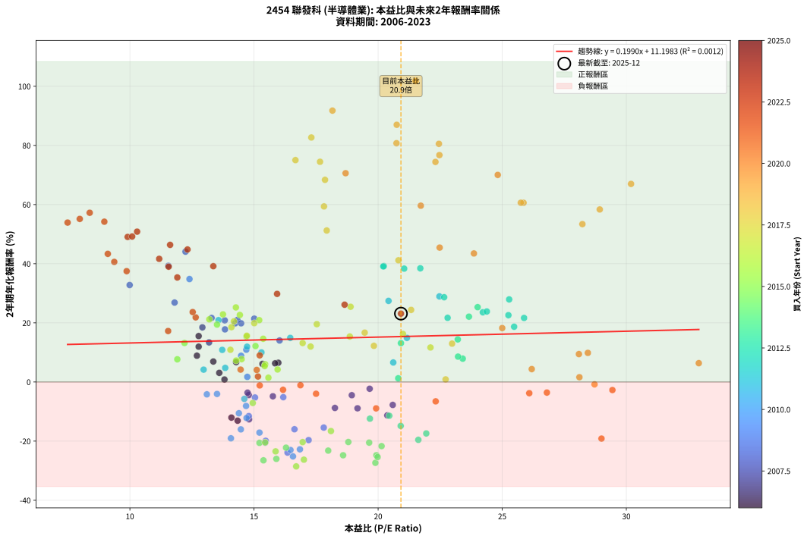
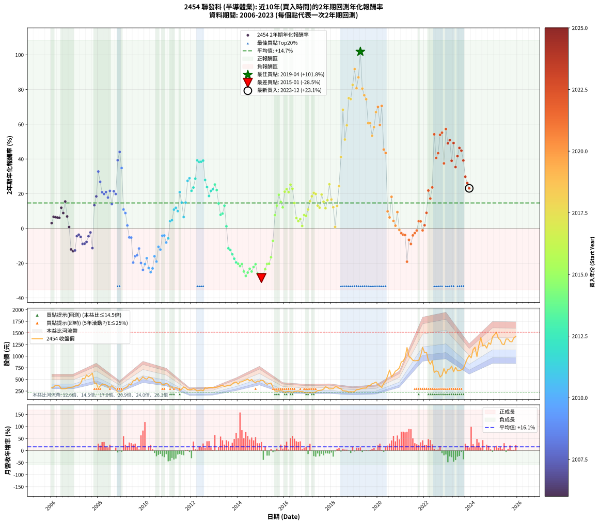

# 2454 聯發科 - 本益比與未來報酬率分析

!!! info "報告資訊"
    - **股票代號**: 2454
    - **公司名稱**: 聯發科
    - **產業別**: 半導體業
    - **分析期間**: 2006-2023 (216 個數據點)
    - **資料來源**: Type 12 (ShowMonthlyK_ChartFlow) 月收盤價與本益比
    - **報酬率口徑**: 含現金股利 (簡化: 年度合計，假設每年7/1入帳)
    - **報告生成時間**: 2026-01-07 18:42:06 CST

## 📈 視覺化圖表

### 圖表1: 本益比 vs 未來報酬率關係

*圖表1：2454 聯發科 本益比與2年期未來報酬率關係 (2006-2023)*

### 圖表2: 歷年買入時點的2年期實際報酬率

*圖表2：2454 聯發科 歷年買入時點的2年期實際報酬率 (2006-2023)*

## 📍 買點訊號說明

本報告提供兩種買點提示訊號（顯示於圖表2的股價子圖中）：

### ▲ 小綠色三角形（回測驗證）
- **計算方式**: 使用全部歷史資料計算本益比第25百分位數
- **用途**: 事後驗證，顯示歷史上哪些時點確實為低估區
- **限制**: 當下無法判斷，僅供回測參考
- **特性**: 後見之明（Look-Ahead Bias）

### ▲ 小橘色三角形（即時訊號）
- **計算方式**: 使用截至當月的過去5年資料計算本益比第25百分位數
- **用途**: 實際投資決策，當時即可判斷
- **優勢**: 可操作性強，符合實務需求
- **特性**: 無後見之明，滾動窗口計算

!!! tip "如何使用兩種訊號"
    - **綠色▲** 幫助理解歷史估值機會，驗證策略有效性
    - **橘色▲** 可作為實際買進參考，但仍需搭配基本面分析
    - 兩種訊號重疊時，表示即時判斷與事後驗證一致，信心度較高
    - 僅有綠色▲時，表示當時無法判斷（需要未來資料才能確認）
    - 僅有橘色▲時，表示即時判斷為買點，但事後可能不是最佳時機

## 📊 估值分析摘要

| 指標 | 數值 |
|:---:|:---:|
| **目前本益比** (2023-12) | **20.92 倍** |
| **歷史平均本益比** | 17.53 倍 |
| **估值水準** | 🟡 合理範圍 |
| **預期2年年化報酬率** | **+15.36%** |
| **歷史平均報酬率** | +14.69% |
| **相關係數 (R²)** | 0.0012 |
| **趨勢線斜率** | 0.1990 |

!!! abstract "核心洞察"
    目前本益比接近歷史平均，預期報酬率符合長期趨勢

    根據歷史數據回測，2454 聯發科 在目前本益比 **20.9倍** 的估值水準下，
    預期未來2年年化報酬率約為 **+15.4%**。

    **重要提醒**: 本分析基於歷史數據統計，實際報酬率會受到公司基本面變化、產業趨勢、
    總體經濟環境等多重因素影響。R² = 0.00 表示本益比可解釋約 0.1% 的報酬率變異。

## 📈 歷史估值統計

### 最佳買點 (最高報酬率)

| 項目 | 數值 |
|:---:|:---:|
| 起始時間 | 2019-04 |
| 當時本益比 | 21.51 倍 |
| 起始價格 | 295.5 元 |
| 2年後價格 | 1185.0 元 |
| **2年年化報酬率** | **+101.80%** |

### 最差買點 (最低報酬率)

| 項目 | 數值 |
|:---:|:---:|
| 起始時間 | 2015-01 |
| 當時本益比 | 16.70 倍 |
| 起始價格 | 483.0 元 |
| 2年後價格 | 213.5 元 |
| **2年年化報酬率** | **-28.54%** |

## 🎯 投資啟示

### 本益比與報酬率關係

趨勢線方程式: **y = 0.1990x + 11.1983**

!!! info "弱相關或正相關"
    本益比與未來報酬率相關性較弱。這可能表示該股票的報酬率更多受到
    公司成長性、產業趨勢等因素影響，而非估值水準。**需綜合考量多項指標**。

### 估值區間建議

基於歷史數據分析:

- **🟢 低估區** (P/E < 14.0): 預期報酬率較高，可考慮增加持股
- **🟡 合理區** (P/E 14.0-21.0): 預期報酬率符合長期趨勢，正常持有
- **🔴 高估區** (P/E > 21.0): 預期報酬率較低，可考慮減碼或觀望

!!! danger "風險提示"
    - 過去表現不代表未來結果
    - 本分析假設公司基本面無重大結構性變化
    - 產業環境劇變可能使歷史規律失效
    - 應結合公司財報、產業趨勢、總體經濟等多重因素綜合判斷

!!! success "長期投資觀點"
    歷史數據顯示，在合理或低估的估值水準買入並長期持有，
    往往能獲得較佳的投資報酬。**耐心等待好價格**是價值投資的核心原則。

## 📊 數據品質

- **資料來源**: GoodInfo.tw Type 12 (ShowMonthlyK_ChartFlow)
- **資料頻率**: 月度收盤價與本益比
- **回測期間**: 2006-2023
- **數據點數量**: 216 個 (每個點代表一次2年期回測)

### 計算方法說明

1. **2年期年化報酬率**:
   - 對每個歷史時點，計算其後2年的實際投資報酬率
   - 期末價值(不含股利): 期末價格
   - 期末價值(含現金股利): 期末價格 + 持有期間內的現金股利合計 (簡化: 年度合計，假設每年7/1入帳)
   - 公式: 年化報酬率 = [(期末價值/期初價格)^(1/年數) - 1] × 100%

2. **本益比 (P/E Ratio)**:
   - 使用當時的月收盤價與EPS計算
   - 資料來源: Type 12 月度河流圖本益比數據

3. **趨勢線 (Linear Regression)**:
   - 使用最小平方法擬合線性趨勢線
   - R²值衡量本益比對報酬率的解釋能力

---

*本報告由 Stock Analysis System v1.9.0 自動生成*
*數據更新時間: 2026-01-07 18:42:06 CST*

## 📋 月度回測明細表

（每一列對應時間線圖中的一個買入點；可用來對照 SVG 圖上的每個點。）

| 買入月份 | 賣出月份 | 回測期限_年 | 實際持有年數 | 買入本益比_倍 | 買入收盤價_元 | 賣出收盤價_元 | 現金股利合計_元 | 總報酬率_pct | 年化報酬率_pct |
| --- | --- | --- | --- | --- | --- | --- | --- | --- | --- |
| 2006-01 | 2008-01 | 2 | 1.999 | 13.60 | 319.50 | 313.50 | 26.00 | +6.26 | +3.08 |
| 2006-02 | 2008-02 | 2 | 1.999 | 14.28 | 335.50 | 356.00 | 26.00 | +13.86 | +6.71 |
| 2006-03 | 2008-03 | 2 | 2.001 | 15.98 | 375.50 | 400.00 | 26.00 | +13.45 | +6.51 |
| 2006-04 | 2008-04 | 2 | 2.001 | 15.85 | 372.50 | 395.00 | 26.00 | +13.02 | +6.31 |
| 2006-05 | 2008-05 | 2 | 2.001 | 15.34 | 360.50 | 380.00 | 26.00 | +12.62 | +6.12 |
| 2006-06 | 2008-06 | 2 | 2.001 | 12.77 | 300.00 | 350.00 | 26.00 | +25.33 | +11.94 |
| 2006-07 | 2008-07 | 2 | 2.001 | 12.70 | 298.50 | 320.00 | 34.00 | +18.59 | +8.89 |
| 2006-08 | 2008-08 | 2 | 2.001 | 12.77 | 300.00 | 366.50 | 34.00 | +33.50 | +15.53 |
| 2006-09 | 2008-09 | 2 | 2.001 | 13.36 | 314.00 | 325.00 | 34.00 | +14.33 | +6.92 |
| 2006-10 | 2008-10 | 2 | 2.001 | 13.81 | 324.50 | 296.00 | 34.00 | +1.69 | +0.84 |
| 2006-11 | 2008-11 | 2 | 2.001 | 14.09 | 331.00 | 222.00 | 34.00 | -22.66 | -12.05 |
| 2006-12 | 2008-12 | 2 | 2.001 | 14.34 | 337.00 | 220.50 | 34.00 | -24.48 | -13.09 |
| 2007-01 | 2009-01 | 2 | 2.001 | 14.80 | 359.00 | 240.00 | 34.00 | -23.68 | -12.63 |
| 2007-02 | 2009-02 | 2 | 2.001 | 14.79 | 370.00 | 304.00 | 34.00 | -8.65 | -4.42 |
| 2007-03 | 2009-03 | 2 | 2.001 | 14.74 | 380.00 | 319.00 | 34.00 | -7.11 | -3.62 |
| 2007-04 | 2009-04 | 2 | 2.001 | 15.76 | 418.00 | 344.50 | 34.00 | -9.45 | -4.84 |
| 2007-05 | 2009-05 | 2 | 2.001 | 19.17 | 523.00 | 400.00 | 34.00 | -17.02 | -8.90 |
| 2007-06 | 2009-06 | 2 | 2.001 | 18.26 | 512.00 | 392.00 | 34.00 | -16.80 | -8.78 |
| 2007-07 | 2009-07 | 2 | 2.001 | 20.59 | 593.00 | 471.50 | 33.00 | -14.92 | -7.76 |
| 2007-08 | 2009-08 | 2 | 2.001 | 18.94 | 560.00 | 478.00 | 33.00 | -8.75 | -4.47 |
| 2007-09 | 2009-09 | 2 | 2.001 | 19.66 | 596.00 | 536.00 | 33.00 | -4.53 | -2.29 |
| 2007-10 | 2009-10 | 2 | 2.001 | 20.37 | 633.00 | 465.00 | 33.00 | -21.33 | -11.29 |
| 2007-11 | 2009-11 | 2 | 2.001 | 13.19 | 420.00 | 507.00 | 33.00 | +28.57 | +13.38 |
| 2007-12 | 2009-12 | 2 | 2.001 | 12.92 | 421.00 | 558.00 | 33.00 | +40.38 | +18.47 |
| 2008-01 | 2010-01 | 2 | 2.001 | 9.99 | 313.50 | 520.00 | 33.00 | +76.40 | +32.79 |
| 2008-02 | 2010-03 | 2 | 2.081 | 11.80 | 356.00 | 551.00 | 33.00 | +64.04 | +26.86 |
| 2008-03 | 2010-03 | 2 | 1.999 | 13.82 | 400.00 | 551.00 | 33.00 | +46.00 | +20.85 |
| 2008-04 | 2010-04 | 2 | 1.999 | 14.24 | 395.00 | 534.00 | 33.00 | +43.54 | +19.82 |
| 2008-05 | 2010-05 | 2 | 1.999 | 14.33 | 380.00 | 523.00 | 33.00 | +46.32 | +20.98 |
| 2008-06 | 2010-06 | 2 | 1.999 | 13.83 | 350.00 | 452.50 | 33.00 | +38.71 | +17.79 |
| 2008-07 | 2010-07 | 2 | 1.999 | 13.29 | 320.00 | 433.50 | 40.00 | +47.97 | +21.66 |
| 2008-08 | 2010-08 | 2 | 1.999 | 16.03 | 366.50 | 436.50 | 40.00 | +30.01 | +14.03 |
| 2008-09 | 2010-09 | 2 | 1.999 | 15.01 | 325.00 | 439.00 | 40.00 | +47.38 | +21.42 |
| 2008-10 | 2010-10 | 2 | 1.999 | 14.48 | 296.00 | 385.00 | 40.00 | +43.58 | +19.84 |
| 2008-11 | 2010-11 | 2 | 1.999 | 11.55 | 222.00 | 390.50 | 40.00 | +93.92 | +39.29 |
| 2008-12 | 2010-12 | 2 | 1.999 | 12.24 | 220.50 | 417.50 | 40.00 | +107.48 | +44.08 |
| 2009-01 | 2011-01 | 2 | 1.999 | 12.40 | 240.00 | 396.00 | 40.00 | +81.67 | +34.81 |
| 2009-02 | 2011-02 | 2 | 1.999 | 14.69 | 304.00 | 334.00 | 40.00 | +23.03 | +10.93 |
| 2009-03 | 2011-03 | 2 | 1.999 | 14.48 | 319.00 | 338.00 | 40.00 | +18.50 | +8.86 |
| 2009-04 | 2011-04 | 2 | 1.999 | 14.73 | 344.50 | 316.50 | 40.00 | +3.48 | +1.73 |
| 2009-05 | 2011-05 | 2 | 1.999 | 16.18 | 400.00 | 320.00 | 40.00 | -10.00 | -5.14 |
| 2009-06 | 2011-06 | 2 | 1.999 | 15.04 | 392.00 | 312.00 | 40.00 | -10.20 | -5.24 |
| 2009-07 | 2011-07 | 2 | 1.999 | 17.20 | 471.50 | 258.50 | 46.00 | -35.42 | -19.65 |
| 2009-08 | 2011-08 | 2 | 1.999 | 16.63 | 478.00 | 291.50 | 46.00 | -29.39 | -15.98 |
| 2009-09 | 2011-09 | 2 | 1.999 | 17.81 | 536.00 | 337.50 | 46.00 | -28.45 | -15.42 |
| 2009-10 | 2011-10 | 2 | 1.999 | 14.79 | 465.00 | 318.00 | 46.00 | -21.72 | -11.53 |
| 2009-11 | 2011-11 | 2 | 1.999 | 15.47 | 507.00 | 279.50 | 46.00 | -35.80 | -19.89 |
| 2009-12 | 2011-12 | 2 | 1.999 | 16.35 | 558.00 | 277.50 | 46.00 | -42.03 | -23.87 |
| 2010-01 | 2012-01 | 2 | 1.999 | 15.45 | 520.00 | 282.50 | 46.00 | -36.83 | -20.53 |
| 2010-02 | 2012-02 | 2 | 1.999 | 15.22 | 505.00 | 301.00 | 46.00 | -31.29 | -17.12 |
| 2010-03 | 2012-03 | 2 | 2.001 | 16.85 | 551.00 | 282.50 | 46.00 | -40.38 | -22.77 |
| 2010-04 | 2012-04 | 2 | 2.001 | 16.57 | 534.00 | 253.00 | 46.00 | -44.01 | -25.16 |
| 2010-05 | 2012-05 | 2 | 2.001 | 16.47 | 523.00 | 264.00 | 46.00 | -40.73 | -23.00 |
| 2010-06 | 2012-06 | 2 | 2.001 | 14.47 | 452.50 | 273.00 | 46.00 | -29.50 | -16.03 |
| 2010-07 | 2012-07 | 2 | 2.001 | 14.07 | 433.50 | 255.00 | 29.00 | -34.49 | -19.05 |
| 2010-08 | 2012-08 | 2 | 2.001 | 14.39 | 436.50 | 320.00 | 29.00 | -20.05 | -10.58 |
| 2010-09 | 2012-09 | 2 | 2.001 | 14.70 | 439.00 | 309.50 | 29.00 | -22.89 | -12.18 |
| 2010-10 | 2012-10 | 2 | 2.001 | 13.10 | 385.00 | 324.50 | 29.00 | -8.18 | -4.18 |
| 2010-11 | 2012-11 | 2 | 2.001 | 13.51 | 390.50 | 330.50 | 29.00 | -7.94 | -4.05 |
| 2010-12 | 2012-12 | 2 | 2.001 | 14.68 | 417.50 | 323.50 | 29.00 | -15.57 | -8.11 |
| 2011-01 | 2013-01 | 2 | 2.001 | 14.61 | 396.00 | 323.00 | 29.00 | -11.11 | -5.72 |
| 2011-02 | 2013-02 | 2 | 2.001 | 12.97 | 334.00 | 333.50 | 29.00 | +8.53 | +4.18 |
| 2011-03 | 2013-03 | 2 | 2.001 | 13.84 | 338.00 | 342.00 | 29.00 | +9.76 | +4.76 |
| 2011-04 | 2013-04 | 2 | 2.001 | 13.72 | 316.50 | 360.00 | 29.00 | +22.91 | +10.86 |
| 2011-05 | 2013-05 | 2 | 2.001 | 14.72 | 320.00 | 372.00 | 29.00 | +25.31 | +11.93 |
| 2011-06 | 2013-06 | 2 | 2.001 | 15.30 | 312.00 | 348.50 | 29.00 | +20.99 | +9.99 |
| 2011-07 | 2013-07 | 2 | 2.001 | 13.57 | 258.50 | 360.00 | 18.00 | +46.23 | +20.91 |
| 2011-08 | 2013-08 | 2 | 2.001 | 16.46 | 291.50 | 367.00 | 18.00 | +32.08 | +14.91 |
| 2011-09 | 2013-09 | 2 | 2.001 | 20.61 | 337.50 | 365.50 | 18.00 | +13.63 | +6.59 |
| 2011-10 | 2013-10 | 2 | 2.001 | 21.16 | 318.00 | 402.00 | 18.00 | +32.08 | +14.91 |
| 2011-11 | 2013-11 | 2 | 2.001 | 20.42 | 279.50 | 436.00 | 18.00 | +62.43 | +27.43 |
| 2011-12 | 2013-12 | 2 | 2.001 | 22.47 | 277.50 | 443.50 | 18.00 | +66.31 | +28.94 |
| 2012-01 | 2014-01 | 2 | 2.001 | 22.80 | 282.50 | 400.50 | 18.00 | +48.14 | +21.70 |
| 2012-02 | 2014-03 | 2 | 2.081 | 24.22 | 301.00 | 449.50 | 18.00 | +55.32 | +23.57 |
| 2012-03 | 2014-03 | 2 | 1.999 | 22.66 | 282.50 | 449.50 | 18.00 | +65.49 | +28.66 |
| 2012-04 | 2014-04 | 2 | 1.999 | 20.23 | 253.00 | 472.00 | 18.00 | +93.68 | +39.20 |
| 2012-05 | 2014-05 | 2 | 1.999 | 21.05 | 264.00 | 487.00 | 18.00 | +91.29 | +38.34 |
| 2012-06 | 2014-06 | 2 | 1.999 | 21.70 | 273.00 | 505.00 | 18.00 | +91.58 | +38.44 |
| 2012-07 | 2014-07 | 2 | 1.999 | 20.21 | 255.00 | 469.00 | 24.00 | +93.33 | +39.08 |
| 2012-08 | 2014-08 | 2 | 1.999 | 25.28 | 320.00 | 499.50 | 24.00 | +63.59 | +27.93 |
| 2012-09 | 2014-09 | 2 | 1.999 | 24.38 | 309.50 | 450.50 | 24.00 | +53.31 | +23.84 |
| 2012-10 | 2014-10 | 2 | 1.999 | 25.48 | 324.50 | 433.00 | 24.00 | +40.83 | +18.69 |
| 2012-11 | 2014-11 | 2 | 1.999 | 25.88 | 330.50 | 465.00 | 24.00 | +47.96 | +21.65 |
| 2012-12 | 2014-12 | 2 | 1.999 | 25.25 | 323.50 | 462.00 | 24.00 | +50.23 | +22.59 |
| 2013-01 | 2015-01 | 2 | 1.999 | 24.01 | 323.00 | 483.00 | 24.00 | +56.97 | +25.31 |
| 2013-02 | 2015-02 | 2 | 1.999 | 23.66 | 333.50 | 473.00 | 24.00 | +49.03 | +22.09 |
| 2013-03 | 2015-03 | 2 | 1.999 | 23.21 | 342.00 | 423.50 | 24.00 | +30.85 | +14.40 |
| 2013-04 | 2015-04 | 2 | 1.999 | 23.41 | 360.00 | 395.00 | 24.00 | +16.39 | +7.89 |
| 2013-05 | 2015-05 | 2 | 1.999 | 23.22 | 372.00 | 414.50 | 24.00 | +17.88 | +8.58 |
| 2013-06 | 2015-06 | 2 | 1.999 | 20.92 | 348.50 | 422.00 | 24.00 | +27.98 | +13.14 |
| 2013-07 | 2015-07 | 2 | 1.999 | 20.81 | 360.00 | 332.00 | 37.00 | +2.50 | +1.24 |
| 2013-08 | 2015-08 | 2 | 1.999 | 20.45 | 367.00 | 251.00 | 37.00 | -21.53 | -11.42 |
| 2013-09 | 2015-09 | 2 | 1.999 | 19.67 | 365.50 | 243.50 | 37.00 | -23.26 | -12.40 |
| 2013-10 | 2015-10 | 2 | 1.999 | 20.91 | 402.00 | 254.50 | 37.00 | -27.49 | -14.86 |
| 2013-11 | 2015-11 | 2 | 1.999 | 21.94 | 436.00 | 260.50 | 37.00 | -31.77 | -17.41 |
| 2013-12 | 2015-12 | 2 | 1.999 | 21.62 | 443.50 | 250.00 | 37.00 | -35.29 | -19.57 |
| 2014-01 | 2016-01 | 2 | 1.999 | 18.80 | 400.50 | 217.50 | 37.00 | -36.45 | -20.30 |
| 2014-02 | 2016-02 | 2 | 1.999 | 20.14 | 445.00 | 236.00 | 37.00 | -38.65 | -21.69 |
| 2014-03 | 2016-03 | 2 | 2.001 | 19.64 | 449.50 | 247.00 | 37.00 | -36.82 | -20.50 |
| 2014-04 | 2016-04 | 2 | 2.001 | 19.93 | 472.00 | 230.00 | 37.00 | -43.43 | -24.77 |
| 2014-05 | 2016-05 | 2 | 2.001 | 19.89 | 487.00 | 220.00 | 37.00 | -47.23 | -27.34 |
| 2014-06 | 2016-06 | 2 | 2.001 | 19.98 | 505.00 | 244.00 | 37.00 | -44.36 | -25.39 |
| 2014-07 | 2016-07 | 2 | 2.001 | 17.99 | 469.00 | 243.50 | 33.00 | -41.04 | -23.20 |
| 2014-08 | 2016-08 | 2 | 2.001 | 18.59 | 499.50 | 249.50 | 33.00 | -43.44 | -24.78 |
| 2014-09 | 2016-09 | 2 | 2.001 | 16.29 | 450.50 | 239.50 | 33.00 | -39.51 | -22.21 |
| 2014-10 | 2016-10 | 2 | 2.001 | 15.22 | 433.00 | 240.00 | 33.00 | -36.95 | -20.58 |
| 2014-11 | 2016-11 | 2 | 2.001 | 15.90 | 465.00 | 221.50 | 33.00 | -45.27 | -26.00 |
| 2014-12 | 2016-12 | 2 | 2.001 | 15.38 | 462.00 | 216.50 | 33.00 | -46.00 | -26.50 |
| 2015-01 | 2017-01 | 2 | 2.001 | 16.70 | 483.00 | 213.50 | 33.00 | -48.96 | -28.54 |
| 2015-02 | 2017-02 | 2 | 2.001 | 17.01 | 473.00 | 224.00 | 33.00 | -45.67 | -26.27 |
| 2015-03 | 2017-03 | 2 | 2.001 | 15.87 | 423.50 | 215.00 | 33.00 | -41.44 | -23.46 |
| 2015-04 | 2017-04 | 2 | 2.001 | 15.45 | 395.00 | 217.00 | 33.00 | -36.71 | -20.43 |
| 2015-05 | 2017-05 | 2 | 2.001 | 16.96 | 414.50 | 230.00 | 33.00 | -36.55 | -20.33 |
| 2015-06 | 2017-06 | 2 | 2.001 | 18.10 | 422.00 | 260.50 | 33.00 | -30.45 | -16.59 |
| 2015-07 | 2017-07 | 2 | 2.001 | 14.95 | 332.00 | 266.00 | 20.50 | -13.70 | -7.10 |
| 2015-08 | 2017-08 | 2 | 2.001 | 11.91 | 251.00 | 270.50 | 20.50 | +15.94 | +7.67 |
| 2015-09 | 2017-09 | 2 | 2.001 | 12.20 | 243.50 | 291.50 | 20.50 | +28.13 | +13.19 |
| 2015-10 | 2017-10 | 2 | 2.001 | 13.51 | 254.50 | 342.50 | 20.50 | +42.63 | +19.41 |
| 2015-11 | 2017-11 | 2 | 2.001 | 14.70 | 260.50 | 326.00 | 20.50 | +33.01 | +15.32 |
| 2015-12 | 2017-12 | 2 | 2.001 | 15.06 | 250.00 | 294.00 | 20.50 | +25.80 | +12.15 |
| 2016-01 | 2018-01 | 2 | 2.001 | 13.20 | 217.50 | 299.00 | 20.50 | +46.90 | +21.18 |
| 2016-02 | 2018-03 | 2 | 2.081 | 14.43 | 236.00 | 340.50 | 20.50 | +52.97 | +22.66 |
| 2016-03 | 2018-03 | 2 | 1.999 | 15.21 | 247.00 | 340.50 | 20.50 | +46.15 | +20.91 |
| 2016-04 | 2018-04 | 2 | 1.999 | 14.27 | 230.00 | 340.00 | 20.50 | +56.74 | +25.21 |
| 2016-05 | 2018-05 | 2 | 1.999 | 13.75 | 220.00 | 311.50 | 20.50 | +50.91 | +22.86 |
| 2016-06 | 2018-06 | 2 | 1.999 | 15.37 | 244.00 | 300.00 | 20.50 | +31.35 | +14.62 |
| 2016-07 | 2018-07 | 2 | 1.999 | 15.45 | 243.50 | 254.00 | 19.50 | +12.32 | +5.99 |
| 2016-08 | 2018-08 | 2 | 1.999 | 15.95 | 249.50 | 251.50 | 19.50 | +8.62 | +4.22 |
| 2016-09 | 2018-09 | 2 | 1.999 | 15.43 | 239.50 | 246.50 | 19.50 | +11.06 | +5.39 |
| 2016-10 | 2018-10 | 2 | 1.999 | 15.58 | 240.00 | 227.50 | 19.50 | +2.92 | +1.45 |
| 2016-11 | 2018-11 | 2 | 1.999 | 14.50 | 221.50 | 237.50 | 19.50 | +16.03 | +7.72 |
| 2016-12 | 2018-12 | 2 | 1.999 | 14.28 | 216.50 | 229.50 | 19.50 | +15.01 | +7.25 |
| 2017-01 | 2019-01 | 2 | 1.999 | 14.05 | 213.50 | 243.00 | 19.50 | +22.95 | +10.89 |
| 2017-02 | 2019-02 | 2 | 1.999 | 14.71 | 224.00 | 280.00 | 19.50 | +33.71 | +15.64 |
| 2017-03 | 2019-03 | 2 | 1.999 | 14.09 | 215.00 | 282.50 | 19.50 | +40.47 | +18.53 |
| 2017-04 | 2019-04 | 2 | 1.999 | 14.19 | 217.00 | 295.50 | 19.50 | +45.16 | +20.50 |
| 2017-05 | 2019-05 | 2 | 1.999 | 15.01 | 230.00 | 311.00 | 19.50 | +43.70 | +19.89 |
| 2017-06 | 2019-06 | 2 | 1.999 | 16.96 | 260.50 | 314.00 | 19.50 | +28.02 | +13.16 |
| 2017-07 | 2019-07 | 2 | 1.999 | 17.28 | 266.00 | 314.50 | 19.00 | +25.38 | +11.98 |
| 2017-08 | 2019-08 | 2 | 1.999 | 17.53 | 270.50 | 367.50 | 19.00 | +42.88 | +19.55 |
| 2017-09 | 2019-09 | 2 | 1.999 | 18.86 | 291.50 | 369.00 | 19.00 | +33.10 | +15.38 |
| 2017-10 | 2019-10 | 2 | 1.999 | 22.11 | 342.50 | 408.00 | 19.00 | +24.67 | +11.66 |
| 2017-11 | 2019-11 | 2 | 1.999 | 21.00 | 326.00 | 421.50 | 19.00 | +35.12 | +16.25 |
| 2017-12 | 2019-12 | 2 | 1.999 | 18.89 | 294.00 | 443.50 | 19.00 | +57.31 | +25.44 |
| 2018-01 | 2020-01 | 2 | 1.999 | 19.46 | 299.00 | 388.00 | 19.00 | +36.12 | +16.68 |
| 2018-02 | 2020-02 | 2 | 1.999 | 19.83 | 301.00 | 360.00 | 19.00 | +25.91 | +12.22 |
| 2018-03 | 2020-03 | 2 | 2.001 | 22.72 | 340.50 | 327.50 | 19.00 | +1.76 | +0.88 |
| 2018-04 | 2020-04 | 2 | 2.001 | 22.98 | 340.00 | 415.00 | 19.00 | +27.65 | +12.97 |
| 2018-05 | 2020-05 | 2 | 2.001 | 21.33 | 311.50 | 463.00 | 19.00 | +54.74 | +24.37 |
| 2018-06 | 2020-06 | 2 | 2.001 | 20.82 | 300.00 | 579.00 | 19.00 | +99.33 | +41.15 |
| 2018-07 | 2020-07 | 2 | 2.001 | 17.86 | 254.00 | 701.00 | 19.50 | +183.66 | +68.36 |
| 2018-08 | 2020-08 | 2 | 2.001 | 17.93 | 251.50 | 556.00 | 19.50 | +128.83 | +51.23 |
| 2018-09 | 2020-09 | 2 | 2.001 | 17.82 | 246.50 | 607.00 | 19.50 | +154.16 | +59.37 |
| 2018-10 | 2020-10 | 2 | 2.001 | 16.67 | 227.50 | 678.00 | 19.50 | +206.59 | +75.03 |
| 2018-11 | 2020-11 | 2 | 2.001 | 17.66 | 237.50 | 704.00 | 19.50 | +204.63 | +74.47 |
| 2018-12 | 2020-12 | 2 | 2.001 | 17.31 | 229.50 | 747.00 | 19.50 | +233.99 | +82.68 |
| 2019-01 | 2021-01 | 2 | 2.001 | 18.16 | 243.00 | 875.00 | 19.50 | +268.11 | +91.78 |
| 2019-02 | 2021-02 | 2 | 2.001 | 20.74 | 280.00 | 896.00 | 19.50 | +226.96 | +80.75 |
| 2019-03 | 2021-03 | 2 | 2.001 | 20.75 | 282.50 | 969.00 | 19.50 | +249.91 | +86.98 |
| 2019-04 | 2021-04 | 2 | 2.001 | 21.51 | 295.50 | 1185.00 | 19.50 | +307.61 | +101.80 |
| 2019-05 | 2021-05 | 2 | 2.001 | 22.45 | 311.00 | 995.00 | 19.50 | +226.21 | +80.54 |
| 2019-06 | 2021-06 | 2 | 2.001 | 22.47 | 314.00 | 962.00 | 19.50 | +212.58 | +76.73 |
| 2019-07 | 2021-07 | 2 | 2.001 | 22.31 | 314.50 | 910.00 | 47.50 | +204.45 | +74.42 |
| 2019-08 | 2021-08 | 2 | 2.001 | 25.86 | 367.50 | 901.00 | 47.50 | +158.10 | +60.60 |
| 2019-09 | 2021-09 | 2 | 2.001 | 25.75 | 369.00 | 905.00 | 47.50 | +158.13 | +60.61 |
| 2019-10 | 2021-10 | 2 | 2.001 | 28.23 | 408.00 | 913.00 | 47.50 | +135.42 | +53.39 |
| 2019-11 | 2021-11 | 2 | 2.001 | 28.93 | 421.50 | 1010.00 | 47.50 | +150.89 | +58.35 |
| 2019-12 | 2021-12 | 2 | 2.001 | 30.19 | 443.50 | 1190.00 | 47.50 | +179.03 | +66.98 |
| 2020-01 | 2022-01 | 2 | 2.001 | 24.82 | 388.00 | 1075.00 | 47.50 | +189.30 | +70.03 |
| 2020-02 | 2022-03 | 2 | 2.081 | 21.72 | 360.00 | 905.00 | 47.50 | +164.58 | +59.62 |
| 2020-03 | 2022-03 | 2 | 1.999 | 18.69 | 327.50 | 905.00 | 47.50 | +190.84 | +70.60 |
| 2020-04 | 2022-04 | 2 | 1.999 | 22.48 | 415.00 | 830.00 | 47.50 | +111.45 | +45.45 |
| 2020-05 | 2022-05 | 2 | 1.999 | 23.86 | 463.00 | 905.00 | 47.50 | +105.72 | +43.47 |
| 2020-06 | 2022-06 | 2 | 1.999 | 28.45 | 579.00 | 651.00 | 47.50 | +20.64 | +9.84 |
| 2020-07 | 2022-07 | 2 | 1.999 | 32.92 | 701.00 | 683.00 | 110.00 | +13.12 | +6.36 |
| 2020-08 | 2022-08 | 2 | 1.999 | 25.00 | 556.00 | 667.00 | 110.00 | +39.75 | +18.23 |
| 2020-09 | 2022-09 | 2 | 1.999 | 26.19 | 607.00 | 551.00 | 110.00 | +8.90 | +4.36 |
| 2020-10 | 2022-10 | 2 | 1.999 | 28.11 | 678.00 | 590.00 | 110.00 | +3.24 | +1.61 |
| 2020-11 | 2022-11 | 2 | 1.999 | 28.09 | 704.00 | 733.00 | 110.00 | +19.74 | +9.43 |
| 2020-12 | 2022-12 | 2 | 1.999 | 28.72 | 747.00 | 625.00 | 110.00 | -1.61 | -0.81 |
| 2021-01 | 2023-01 | 2 | 1.999 | 29.44 | 875.00 | 718.00 | 110.00 | -5.37 | -2.72 |
| 2021-02 | 2023-02 | 2 | 1.999 | 26.80 | 896.00 | 723.00 | 110.00 | -7.03 | -3.58 |
| 2021-03 | 2023-03 | 2 | 1.999 | 26.09 | 969.00 | 787.00 | 110.00 | -7.43 | -3.79 |
| 2021-04 | 2023-04 | 2 | 1.999 | 29.00 | 1185.00 | 665.00 | 110.00 | -34.60 | -19.14 |
| 2021-05 | 2023-05 | 2 | 1.999 | 22.32 | 995.00 | 759.00 | 110.00 | -12.66 | -6.55 |
| 2021-06 | 2023-06 | 2 | 1.999 | 19.92 | 962.00 | 688.00 | 110.00 | -17.05 | -8.93 |
| 2021-07 | 2023-07 | 2 | 1.999 | 17.50 | 910.00 | 690.00 | 149.01 | -7.80 | -3.98 |
| 2021-08 | 2023-08 | 2 | 1.999 | 16.17 | 901.00 | 705.00 | 149.01 | -5.22 | -2.64 |
| 2021-09 | 2023-09 | 2 | 1.999 | 15.23 | 905.00 | 735.00 | 149.01 | -2.32 | -1.17 |
| 2021-10 | 2023-10 | 2 | 1.999 | 14.46 | 913.00 | 842.00 | 149.01 | +8.54 | +4.19 |
| 2021-11 | 2023-11 | 2 | 1.999 | 15.11 | 1010.00 | 945.00 | 149.01 | +8.32 | +4.08 |
| 2021-12 | 2023-12 | 2 | 1.999 | 16.87 | 1190.00 | 1015.00 | 149.01 | -2.18 | -1.10 |
| 2022-01 | 2024-01 | 2 | 1.999 | 15.16 | 1075.00 | 966.00 | 149.01 | +3.72 | +1.85 |
| 2022-02 | 2024-02 | 2 | 1.999 | 15.23 | 1085.00 | 1140.00 | 149.01 | +18.80 | +9.00 |
| 2022-03 | 2024-03 | 2 | 2.001 | 12.65 | 905.00 | 1195.00 | 149.01 | +48.51 | +21.85 |
| 2022-04 | 2024-04 | 2 | 2.001 | 11.54 | 830.00 | 992.00 | 149.01 | +37.47 | +17.24 |
| 2022-05 | 2024-05 | 2 | 2.001 | 12.53 | 905.00 | 1235.00 | 149.01 | +52.93 | +23.65 |
| 2022-06 | 2024-06 | 2 | 2.001 | 8.97 | 651.00 | 1400.00 | 149.01 | +137.94 | +54.21 |
| 2022-07 | 2024-07 | 2 | 2.001 | 9.37 | 683.00 | 1220.00 | 131.02 | +97.81 | +40.61 |
| 2022-08 | 2024-08 | 2 | 2.001 | 9.11 | 667.00 | 1240.00 | 131.02 | +105.55 | +43.33 |
| 2022-09 | 2024-09 | 2 | 2.001 | 7.49 | 551.00 | 1175.00 | 131.02 | +137.03 | +53.91 |
| 2022-10 | 2024-10 | 2 | 2.001 | 7.98 | 590.00 | 1290.00 | 131.02 | +140.85 | +55.15 |
| 2022-11 | 2024-11 | 2 | 2.001 | 9.87 | 733.00 | 1255.00 | 131.02 | +89.09 | +37.48 |
| 2022-12 | 2024-12 | 2 | 2.001 | 8.38 | 625.00 | 1415.00 | 131.02 | +147.36 | +57.23 |
| 2023-01 | 2025-01 | 2 | 2.001 | 9.91 | 718.00 | 1465.00 | 131.02 | +122.29 | +49.05 |
| 2023-02 | 2025-02 | 2 | 2.001 | 10.29 | 723.00 | 1515.00 | 131.02 | +127.67 | +50.84 |
| 2023-03 | 2025-03 | 2 | 2.001 | 11.56 | 787.00 | 1390.00 | 131.02 | +93.27 | +38.99 |
| 2023-04 | 2025-04 | 2 | 2.001 | 10.09 | 665.00 | 1350.00 | 131.02 | +122.71 | +49.19 |
| 2023-05 | 2025-05 | 2 | 2.001 | 11.91 | 759.00 | 1260.00 | 131.02 | +83.27 | +35.35 |
| 2023-06 | 2025-06 | 2 | 2.001 | 11.18 | 688.00 | 1250.00 | 131.02 | +100.73 | +41.65 |
| 2023-07 | 2025-07 | 2 | 2.001 | 11.62 | 690.00 | 1370.00 | 109.01 | +114.35 | +46.37 |
| 2023-08 | 2025-08 | 2 | 2.001 | 12.32 | 705.00 | 1370.00 | 109.01 | +109.79 | +44.80 |
| 2023-09 | 2025-09 | 2 | 2.001 | 13.36 | 735.00 | 1315.00 | 109.01 | +93.74 | +39.16 |
| 2023-10 | 2025-10 | 2 | 2.001 | 15.93 | 842.00 | 1310.00 | 109.01 | +68.53 | +29.80 |
| 2023-11 | 2025-11 | 2 | 2.001 | 18.65 | 945.00 | 1395.00 | 109.01 | +59.15 | +26.14 |
| 2023-12 | 2025-12 | 2 | 2.001 | 20.92 | 1015.00 | 1430.00 | 109.01 | +51.63 | +23.12 |
