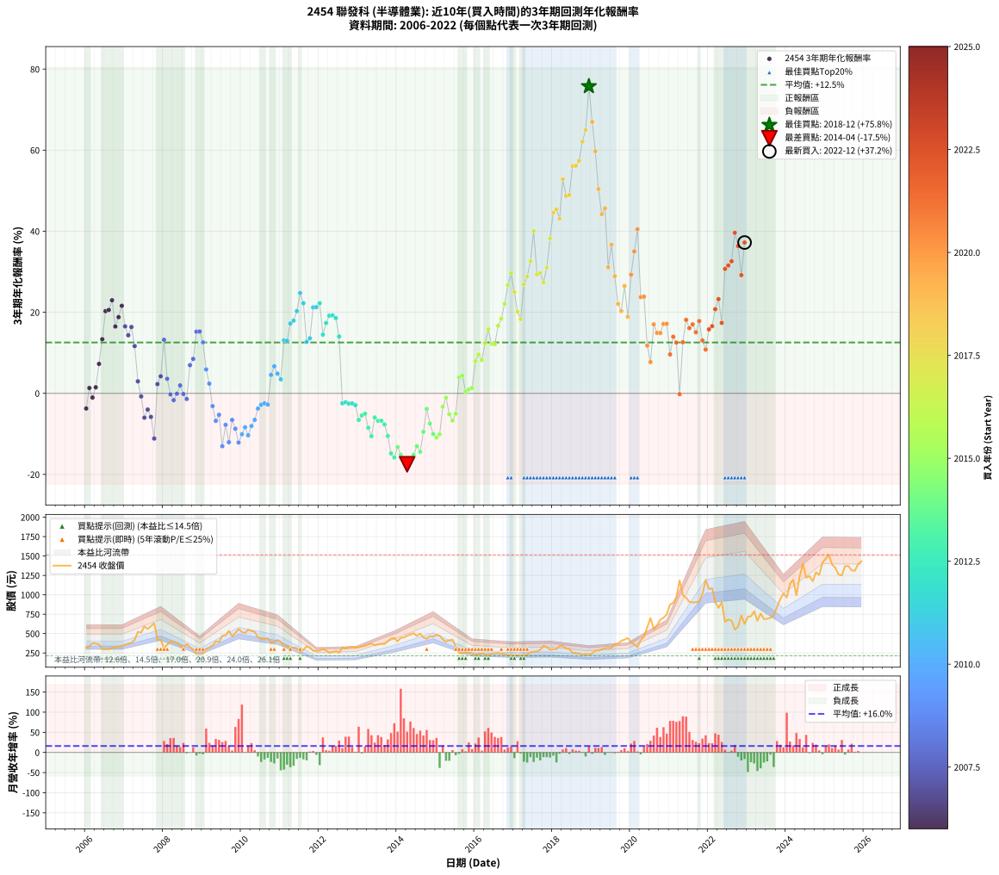

# 2454 聯發科 - 本益比與未來報酬率分析

!!! info "報告資訊"
    - **股票代號**: 2454
    - **公司名稱**: 聯發科
    - **產業別**: 半導體業
    - **分析期間**: 2006-2022 (204 個數據點)
    - **資料來源**: Type 12 (ShowMonthlyK_ChartFlow) 月收盤價與本益比
    - **報酬率口徑**: 含現金股利 (簡化: 年度合計，假設每年7/1入帳)
    - **報告生成時間**: 2026-01-12 20:53:27 CST

## 📈 視覺化圖表

### 圖表1: 本益比 vs 未來報酬率關係

*圖表1：2454 聯發科 本益比與3年期未來報酬率關係 (2006-2022)*

### 圖表2: 歷年買入時點的3年期實際報酬率

*圖表2：2454 聯發科 歷年買入時點的3年期實際報酬率 (2006-2022)*

## 📍 買點訊號說明

本報告提供兩種買點提示訊號（顯示於圖表2的股價子圖中）：

### ▲ 小綠色三角形（回測驗證）
- **計算方式**: 使用全部歷史資料計算本益比第25百分位數
- **用途**: 事後驗證，顯示歷史上哪些時點確實為低估區
- **限制**: 當下無法判斷，僅供回測參考
- **特性**: 後見之明（Look-Ahead Bias）

### ▲ 小橘色三角形（即時訊號）
- **計算方式**: 使用截至當月的過去5年資料計算本益比第25百分位數
- **用途**: 實際投資決策，當時即可判斷
- **優勢**: 可操作性強，符合實務需求
- **特性**: 無後見之明，滾動窗口計算

!!! tip "如何使用兩種訊號"
    - **綠色▲** 幫助理解歷史估值機會，驗證策略有效性
    - **橘色▲** 可作為實際買進參考，但仍需搭配基本面分析
    - 兩種訊號重疊時，表示即時判斷與事後驗證一致，信心度較高
    - 僅有綠色▲時，表示當時無法判斷（需要未來資料才能確認）
    - 僅有橘色▲時，表示即時判斷為買點，但事後可能不是最佳時機

## 📊 估值分析摘要

| 指標 | 數值 |
|:---:|:---:|
| **目前本益比** (2022-12) | **8.38 倍** |
| **歷史平均本益比** | 17.79 倍 |
| **估值水準** | 🟢 相對低估 |
| **預期3年年化報酬率** | **+12.26%** |
| **歷史平均報酬率** | +12.55% |
| **相關係數 (R²)** | 0.0001 |
| **趨勢線斜率** | 0.0307 |

!!! abstract "核心洞察"
    目前本益比顯著低於歷史平均，預期未來報酬率可能較高

    根據歷史數據回測，2454 聯發科 在目前本益比 **8.4倍** 的估值水準下，
    預期未來3年年化報酬率約為 **+12.3%**。

    **重要提醒**: 本分析基於歷史數據統計，實際報酬率會受到公司基本面變化、產業趨勢、
    總體經濟環境等多重因素影響。R² = 0.00 表示本益比可解釋約 0.0% 的報酬率變異。

## 📈 歷史估值統計

### 最佳買點 (最高報酬率)

| 項目 | 數值 |
|:---:|:---:|
| 起始時間 | 2018-12 |
| 當時本益比 | 17.31 倍 |
| 起始價格 | 229.5 元 |
| 3年後價格 | 1190.0 元 |
| **3年年化報酬率** | **+75.76%** |

### 最差買點 (最低報酬率)

| 項目 | 數值 |
|:---:|:---:|
| 起始時間 | 2014-04 |
| 當時本益比 | 19.93 倍 |
| 起始價格 | 472.0 元 |
| 3年後價格 | 217.0 元 |
| **3年年化報酬率** | **-17.50%** |

## 🎯 投資啟示

### 本益比與報酬率關係

趨勢線方程式: **y = 0.0307x + 12.0016**

!!! info "弱相關或正相關"
    本益比與未來報酬率相關性較弱。這可能表示該股票的報酬率更多受到
    公司成長性、產業趨勢等因素影響，而非估值水準。**需綜合考量多項指標**。

### 估值區間建議

基於歷史數據分析:

- **🟢 低估區** (P/E < 14.2): 預期報酬率較高，可考慮增加持股
- **🟡 合理區** (P/E 14.2-21.3): 預期報酬率符合長期趨勢，正常持有
- **🔴 高估區** (P/E > 21.3): 預期報酬率較低，可考慮減碼或觀望

!!! danger "風險提示"
    - 過去表現不代表未來結果
    - 本分析假設公司基本面無重大結構性變化
    - 產業環境劇變可能使歷史規律失效
    - 應結合公司財報、產業趨勢、總體經濟等多重因素綜合判斷

!!! success "長期投資觀點"
    歷史數據顯示，在合理或低估的估值水準買入並長期持有，
    往往能獲得較佳的投資報酬。**耐心等待好價格**是價值投資的核心原則。

## 📊 數據品質

- **資料來源**: GoodInfo.tw Type 12 (ShowMonthlyK_ChartFlow)
- **資料頻率**: 月度收盤價與本益比
- **回測期間**: 2006-2022
- **數據點數量**: 204 個 (每個點代表一次3年期回測)

### 計算方法說明

1. **3年期年化報酬率**:
   - 對每個歷史時點，計算其後3年的實際投資報酬率
   - 期末價值(不含股利): 期末價格
   - 期末價值(含現金股利): 期末價格 + 持有期間內的現金股利合計 (簡化: 年度合計，假設每年7/1入帳)
   - 公式: 年化報酬率 = [(期末價值/期初價格)^(1/年數) - 1] × 100%

2. **本益比 (P/E Ratio)**:
   - 使用當時的月收盤價與EPS計算
   - 資料來源: Type 12 月度河流圖本益比數據

3. **趨勢線 (Linear Regression)**:
   - 使用最小平方法擬合線性趨勢線
   - R²值衡量本益比對報酬率的解釋能力

---

*本報告由 Stock Analysis System v1.9.0 自動生成*
*數據更新時間: 2026-01-12 20:53:27 CST*

## 📋 月度回測明細表

（每一列對應時間線圖中的一個買入點；可用來對照 SVG 圖上的每個點。）

| 買入月份 | 賣出月份 | 回測期限_年 | 實際持有年數 | 買入本益比_倍 | 買入收盤價_元 | 賣出收盤價_元 | 現金股利合計_元 | 總報酬率_pct | 年化報酬率_pct |
| --- | --- | --- | --- | --- | --- | --- | --- | --- | --- |
| 2006-01 | 2009-01 | 3 | 3.001 | 13.60 | 319.50 | 240.00 | 45.00 | -10.80 | -3.74 |
| 2006-02 | 2009-02 | 3 | 3.001 | 14.28 | 335.50 | 304.00 | 45.00 | +4.02 | +1.32 |
| 2006-03 | 2009-03 | 3 | 3.001 | 15.98 | 375.50 | 319.00 | 45.00 | -3.06 | -1.03 |
| 2006-04 | 2009-04 | 3 | 3.001 | 15.85 | 372.50 | 344.50 | 45.00 | +4.56 | +1.50 |
| 2006-05 | 2009-05 | 3 | 3.001 | 15.34 | 360.50 | 400.00 | 45.00 | +23.44 | +7.27 |
| 2006-06 | 2009-06 | 3 | 3.001 | 12.77 | 300.00 | 392.00 | 45.00 | +45.67 | +13.36 |
| 2006-07 | 2009-07 | 3 | 3.001 | 12.70 | 298.50 | 471.50 | 48.00 | +74.04 | +20.28 |
| 2006-08 | 2009-08 | 3 | 3.001 | 12.77 | 300.00 | 478.00 | 48.00 | +75.33 | +20.58 |
| 2006-09 | 2009-09 | 3 | 3.001 | 13.36 | 314.00 | 536.00 | 48.00 | +85.99 | +22.97 |
| 2006-10 | 2009-10 | 3 | 3.001 | 13.81 | 324.50 | 465.00 | 48.00 | +58.09 | +16.49 |
| 2006-11 | 2009-11 | 3 | 3.001 | 14.09 | 331.00 | 507.00 | 48.00 | +67.67 | +18.80 |
| 2006-12 | 2009-12 | 3 | 3.001 | 14.34 | 337.00 | 558.00 | 48.00 | +79.82 | +21.60 |
| 2007-01 | 2010-01 | 3 | 3.001 | 14.80 | 359.00 | 520.00 | 48.00 | +58.22 | +16.52 |
| 2007-02 | 2010-02 | 3 | 3.001 | 14.79 | 370.00 | 505.00 | 48.00 | +49.46 | +14.33 |
| 2007-03 | 2010-03 | 3 | 3.001 | 14.74 | 380.00 | 551.00 | 48.00 | +57.63 | +16.38 |
| 2007-04 | 2010-04 | 3 | 3.001 | 15.76 | 418.00 | 534.00 | 48.00 | +39.23 | +11.66 |
| 2007-05 | 2010-05 | 3 | 3.001 | 19.17 | 523.00 | 523.00 | 48.00 | +9.18 | +2.97 |
| 2007-06 | 2010-06 | 3 | 3.001 | 18.26 | 512.00 | 452.50 | 48.00 | -2.25 | -0.75 |
| 2007-07 | 2010-07 | 3 | 3.001 | 20.59 | 593.00 | 433.50 | 59.00 | -16.95 | -6.00 |
| 2007-08 | 2010-08 | 3 | 3.001 | 18.94 | 560.00 | 436.50 | 59.00 | -11.52 | -4.00 |
| 2007-09 | 2010-09 | 3 | 3.001 | 19.66 | 596.00 | 439.00 | 59.00 | -16.44 | -5.81 |
| 2007-10 | 2010-10 | 3 | 3.001 | 20.37 | 633.00 | 385.00 | 59.00 | -29.86 | -11.15 |
| 2007-11 | 2010-11 | 3 | 3.001 | 13.19 | 420.00 | 390.50 | 59.00 | +7.02 | +2.29 |
| 2007-12 | 2010-12 | 3 | 3.001 | 12.92 | 421.00 | 417.50 | 59.00 | +13.18 | +4.21 |
| 2008-01 | 2011-01 | 3 | 3.001 | 9.99 | 313.50 | 396.00 | 59.00 | +45.14 | +13.22 |
| 2008-02 | 2011-03 | 3 | 3.080 | 11.80 | 356.00 | 338.00 | 59.00 | +11.52 | +3.60 |
| 2008-03 | 2011-03 | 3 | 2.998 | 13.82 | 400.00 | 338.00 | 59.00 | -0.75 | -0.25 |
| 2008-04 | 2011-04 | 3 | 2.998 | 14.24 | 395.00 | 316.50 | 59.00 | -4.94 | -1.67 |
| 2008-05 | 2011-05 | 3 | 2.998 | 14.33 | 380.00 | 320.00 | 59.00 | -0.26 | -0.09 |
| 2008-06 | 2011-06 | 3 | 2.998 | 13.83 | 350.00 | 312.00 | 59.00 | +6.00 | +1.96 |
| 2008-07 | 2011-07 | 3 | 2.998 | 13.29 | 320.00 | 258.50 | 60.00 | -0.47 | -0.16 |
| 2008-08 | 2011-08 | 3 | 2.998 | 16.03 | 366.50 | 291.50 | 60.00 | -4.09 | -1.38 |
| 2008-09 | 2011-09 | 3 | 2.998 | 15.01 | 325.00 | 337.50 | 60.00 | +22.31 | +6.95 |
| 2008-10 | 2011-10 | 3 | 2.998 | 14.48 | 296.00 | 318.00 | 60.00 | +27.70 | +8.50 |
| 2008-11 | 2011-11 | 3 | 2.998 | 11.55 | 222.00 | 279.50 | 60.00 | +52.93 | +15.22 |
| 2008-12 | 2011-12 | 3 | 2.998 | 12.24 | 220.50 | 277.50 | 60.00 | +53.06 | +15.26 |
| 2009-01 | 2012-01 | 3 | 2.998 | 12.40 | 240.00 | 282.50 | 60.00 | +42.71 | +12.59 |
| 2009-02 | 2012-02 | 3 | 2.998 | 14.69 | 304.00 | 301.00 | 60.00 | +18.75 | +5.90 |
| 2009-03 | 2012-03 | 3 | 3.001 | 14.48 | 319.00 | 282.50 | 60.00 | +7.37 | +2.40 |
| 2009-04 | 2012-04 | 3 | 3.001 | 14.73 | 344.50 | 253.00 | 60.00 | -9.14 | -3.15 |
| 2009-05 | 2012-05 | 3 | 3.001 | 16.18 | 400.00 | 264.00 | 60.00 | -19.00 | -6.78 |
| 2009-06 | 2012-06 | 3 | 3.001 | 15.04 | 392.00 | 273.00 | 60.00 | -15.05 | -5.29 |
| 2009-07 | 2012-07 | 3 | 3.001 | 17.20 | 471.50 | 255.00 | 55.00 | -34.25 | -13.04 |
| 2009-08 | 2012-08 | 3 | 3.001 | 16.63 | 478.00 | 320.00 | 55.00 | -21.55 | -7.77 |
| 2009-09 | 2012-09 | 3 | 3.001 | 17.81 | 536.00 | 309.50 | 55.00 | -32.00 | -12.06 |
| 2009-10 | 2012-10 | 3 | 3.001 | 14.79 | 465.00 | 324.50 | 55.00 | -18.39 | -6.55 |
| 2009-11 | 2012-11 | 3 | 3.001 | 15.47 | 507.00 | 330.50 | 55.00 | -23.96 | -8.73 |
| 2009-12 | 2012-12 | 3 | 3.001 | 16.35 | 558.00 | 323.50 | 55.00 | -32.17 | -12.13 |
| 2010-01 | 2013-01 | 3 | 3.001 | 15.45 | 520.00 | 323.00 | 55.00 | -27.31 | -10.08 |
| 2010-02 | 2013-02 | 3 | 3.001 | 15.22 | 505.00 | 333.50 | 55.00 | -23.07 | -8.37 |
| 2010-03 | 2013-03 | 3 | 3.001 | 16.85 | 551.00 | 342.00 | 55.00 | -27.95 | -10.35 |
| 2010-04 | 2013-04 | 3 | 3.001 | 16.57 | 534.00 | 360.00 | 55.00 | -22.28 | -8.06 |
| 2010-05 | 2013-05 | 3 | 3.001 | 16.47 | 523.00 | 372.00 | 55.00 | -18.36 | -6.54 |
| 2010-06 | 2013-06 | 3 | 3.001 | 14.47 | 452.50 | 348.50 | 55.00 | -10.83 | -3.75 |
| 2010-07 | 2013-07 | 3 | 3.001 | 14.07 | 433.50 | 360.00 | 38.00 | -8.19 | -2.81 |
| 2010-08 | 2013-08 | 3 | 3.001 | 14.39 | 436.50 | 367.00 | 38.00 | -7.22 | -2.47 |
| 2010-09 | 2013-09 | 3 | 3.001 | 14.70 | 439.00 | 365.50 | 38.00 | -8.09 | -2.77 |
| 2010-10 | 2013-10 | 3 | 3.001 | 13.10 | 385.00 | 402.00 | 38.00 | +14.29 | +4.55 |
| 2010-11 | 2013-11 | 3 | 3.001 | 13.51 | 390.50 | 436.00 | 38.00 | +21.38 | +6.67 |
| 2010-12 | 2013-12 | 3 | 3.001 | 14.68 | 417.50 | 443.50 | 38.00 | +15.33 | +4.87 |
| 2011-01 | 2014-01 | 3 | 3.001 | 14.61 | 396.00 | 400.50 | 38.00 | +10.73 | +3.46 |
| 2011-02 | 2014-02 | 3 | 3.001 | 12.97 | 334.00 | 445.00 | 38.00 | +44.61 | +13.08 |
| 2011-03 | 2014-03 | 3 | 3.001 | 13.84 | 338.00 | 449.50 | 38.00 | +44.23 | +12.98 |
| 2011-04 | 2014-04 | 3 | 3.001 | 13.72 | 316.50 | 472.00 | 38.00 | +61.14 | +17.23 |
| 2011-05 | 2014-05 | 3 | 3.001 | 14.72 | 320.00 | 487.00 | 38.00 | +64.06 | +17.94 |
| 2011-06 | 2014-06 | 3 | 3.001 | 15.30 | 312.00 | 505.00 | 38.00 | +74.04 | +20.28 |
| 2011-07 | 2014-07 | 3 | 3.001 | 13.57 | 258.50 | 469.00 | 33.00 | +94.20 | +24.76 |
| 2011-08 | 2014-08 | 3 | 3.001 | 16.46 | 291.50 | 499.50 | 33.00 | +82.68 | +22.24 |
| 2011-09 | 2014-09 | 3 | 3.001 | 20.61 | 337.50 | 450.50 | 33.00 | +43.26 | +12.73 |
| 2011-10 | 2014-10 | 3 | 3.001 | 21.16 | 318.00 | 433.00 | 33.00 | +46.54 | +13.58 |
| 2011-11 | 2014-11 | 3 | 3.001 | 20.42 | 279.50 | 465.00 | 33.00 | +78.18 | +21.23 |
| 2011-12 | 2014-12 | 3 | 3.001 | 22.47 | 277.50 | 462.00 | 33.00 | +78.38 | +21.27 |
| 2012-01 | 2015-01 | 3 | 3.001 | 22.80 | 282.50 | 483.00 | 33.00 | +82.65 | +22.23 |
| 2012-02 | 2015-03 | 3 | 3.080 | 24.22 | 301.00 | 423.50 | 33.00 | +51.66 | +14.48 |
| 2012-03 | 2015-03 | 3 | 2.998 | 22.66 | 282.50 | 423.50 | 33.00 | +61.59 | +17.36 |
| 2012-04 | 2015-04 | 3 | 2.998 | 20.23 | 253.00 | 395.00 | 33.00 | +69.17 | +19.17 |
| 2012-05 | 2015-05 | 3 | 2.998 | 21.05 | 264.00 | 414.50 | 33.00 | +69.51 | +19.25 |
| 2012-06 | 2015-06 | 3 | 2.998 | 21.70 | 273.00 | 422.00 | 33.00 | +66.67 | +18.58 |
| 2012-07 | 2015-07 | 3 | 2.998 | 20.21 | 255.00 | 332.00 | 46.00 | +48.24 | +14.03 |
| 2012-08 | 2015-08 | 3 | 2.998 | 25.28 | 320.00 | 251.00 | 46.00 | -7.19 | -2.46 |
| 2012-09 | 2015-09 | 3 | 2.998 | 24.38 | 309.50 | 243.50 | 46.00 | -6.46 | -2.20 |
| 2012-10 | 2015-10 | 3 | 2.998 | 25.48 | 324.50 | 254.50 | 46.00 | -7.40 | -2.53 |
| 2012-11 | 2015-11 | 3 | 2.998 | 25.88 | 330.50 | 260.50 | 46.00 | -7.26 | -2.48 |
| 2012-12 | 2015-12 | 3 | 2.998 | 25.25 | 323.50 | 250.00 | 46.00 | -8.50 | -2.92 |
| 2013-01 | 2016-01 | 3 | 2.998 | 24.01 | 323.00 | 217.50 | 46.00 | -18.42 | -6.57 |
| 2013-02 | 2016-02 | 3 | 2.998 | 23.66 | 333.50 | 236.00 | 46.00 | -15.44 | -5.44 |
| 2013-03 | 2016-03 | 3 | 3.001 | 23.21 | 342.00 | 247.00 | 46.00 | -14.33 | -5.02 |
| 2013-04 | 2016-04 | 3 | 3.001 | 23.41 | 360.00 | 230.00 | 46.00 | -23.33 | -8.47 |
| 2013-05 | 2016-05 | 3 | 3.001 | 23.22 | 372.00 | 220.00 | 46.00 | -28.49 | -10.58 |
| 2013-06 | 2016-06 | 3 | 3.001 | 20.92 | 348.50 | 244.00 | 46.00 | -16.79 | -5.94 |
| 2013-07 | 2016-07 | 3 | 3.001 | 20.81 | 360.00 | 243.50 | 48.00 | -19.03 | -6.79 |
| 2013-08 | 2016-08 | 3 | 3.001 | 20.45 | 367.00 | 249.50 | 48.00 | -18.94 | -6.76 |
| 2013-09 | 2016-09 | 3 | 3.001 | 19.67 | 365.50 | 239.50 | 48.00 | -21.34 | -7.69 |
| 2013-10 | 2016-10 | 3 | 3.001 | 20.91 | 402.00 | 240.00 | 48.00 | -28.36 | -10.52 |
| 2013-11 | 2016-11 | 3 | 3.001 | 21.94 | 436.00 | 221.50 | 48.00 | -38.19 | -14.81 |
| 2013-12 | 2016-12 | 3 | 3.001 | 21.62 | 443.50 | 216.50 | 48.00 | -40.36 | -15.82 |
| 2014-01 | 2017-01 | 3 | 3.001 | 18.80 | 400.50 | 213.50 | 48.00 | -34.71 | -13.24 |
| 2014-02 | 2017-02 | 3 | 3.001 | 20.14 | 445.00 | 224.00 | 48.00 | -38.88 | -15.13 |
| 2014-03 | 2017-03 | 3 | 3.001 | 19.64 | 449.50 | 215.00 | 48.00 | -41.49 | -16.36 |
| 2014-04 | 2017-04 | 3 | 3.001 | 19.93 | 472.00 | 217.00 | 48.00 | -43.86 | -17.50 |
| 2014-05 | 2017-05 | 3 | 3.001 | 19.89 | 487.00 | 230.00 | 48.00 | -42.92 | -17.04 |
| 2014-06 | 2017-06 | 3 | 3.001 | 19.98 | 505.00 | 260.50 | 48.00 | -38.91 | -15.15 |
| 2014-07 | 2017-07 | 3 | 3.001 | 17.99 | 469.00 | 266.00 | 42.50 | -34.22 | -13.03 |
| 2014-08 | 2017-08 | 3 | 3.001 | 18.59 | 499.50 | 270.50 | 42.50 | -37.34 | -14.42 |
| 2014-09 | 2017-09 | 3 | 3.001 | 16.29 | 450.50 | 291.50 | 42.50 | -25.86 | -9.49 |
| 2014-10 | 2017-10 | 3 | 3.001 | 15.22 | 433.00 | 342.50 | 42.50 | -11.09 | -3.84 |
| 2014-11 | 2017-11 | 3 | 3.001 | 15.90 | 465.00 | 326.00 | 42.50 | -20.75 | -7.46 |
| 2014-12 | 2017-12 | 3 | 3.001 | 15.38 | 462.00 | 294.00 | 42.50 | -27.16 | -10.02 |
| 2015-01 | 2018-01 | 3 | 3.001 | 16.70 | 483.00 | 299.00 | 42.50 | -29.30 | -10.91 |
| 2015-02 | 2018-02 | 3 | 3.001 | 17.01 | 473.00 | 301.00 | 42.50 | -27.38 | -10.11 |
| 2015-03 | 2018-03 | 3 | 3.001 | 15.87 | 423.50 | 340.50 | 42.50 | -9.56 | -3.29 |
| 2015-04 | 2018-04 | 3 | 3.001 | 15.45 | 395.00 | 340.00 | 42.50 | -3.16 | -1.07 |
| 2015-05 | 2018-05 | 3 | 3.001 | 16.96 | 414.50 | 311.50 | 42.50 | -14.60 | -5.12 |
| 2015-06 | 2018-06 | 3 | 3.001 | 18.10 | 422.00 | 300.00 | 42.50 | -18.84 | -6.72 |
| 2015-07 | 2018-07 | 3 | 3.001 | 14.95 | 332.00 | 254.00 | 30.50 | -14.31 | -5.02 |
| 2015-08 | 2018-08 | 3 | 3.001 | 11.91 | 251.00 | 251.50 | 30.50 | +12.35 | +3.96 |
| 2015-09 | 2018-09 | 3 | 3.001 | 12.20 | 243.50 | 246.50 | 30.50 | +13.76 | +4.39 |
| 2015-10 | 2018-10 | 3 | 3.001 | 13.51 | 254.50 | 227.50 | 30.50 | +1.38 | +0.46 |
| 2015-11 | 2018-11 | 3 | 3.001 | 14.70 | 260.50 | 237.50 | 30.50 | +2.88 | +0.95 |
| 2015-12 | 2018-12 | 3 | 3.001 | 15.06 | 250.00 | 229.50 | 30.50 | +4.00 | +1.32 |
| 2016-01 | 2019-01 | 3 | 3.001 | 13.20 | 217.50 | 243.00 | 30.50 | +25.75 | +7.93 |
| 2016-02 | 2019-03 | 3 | 3.080 | 14.43 | 236.00 | 282.50 | 30.50 | +32.63 | +9.60 |
| 2016-03 | 2019-03 | 3 | 2.998 | 15.21 | 247.00 | 282.50 | 30.50 | +26.72 | +8.22 |
| 2016-04 | 2019-04 | 3 | 2.998 | 14.27 | 230.00 | 295.50 | 30.50 | +41.74 | +12.34 |
| 2016-05 | 2019-05 | 3 | 2.998 | 13.75 | 220.00 | 311.00 | 30.50 | +55.23 | +15.80 |
| 2016-06 | 2019-06 | 3 | 2.998 | 15.37 | 244.00 | 314.00 | 30.50 | +41.19 | +12.19 |
| 2016-07 | 2019-07 | 3 | 2.998 | 15.45 | 243.50 | 314.50 | 28.50 | +40.86 | +12.11 |
| 2016-08 | 2019-08 | 3 | 2.998 | 15.95 | 249.50 | 367.50 | 28.50 | +58.72 | +16.66 |
| 2016-09 | 2019-09 | 3 | 2.998 | 15.43 | 239.50 | 369.00 | 28.50 | +65.97 | +18.41 |
| 2016-10 | 2019-10 | 3 | 2.998 | 15.58 | 240.00 | 408.00 | 28.50 | +81.88 | +22.08 |
| 2016-11 | 2019-11 | 3 | 2.998 | 14.50 | 221.50 | 421.50 | 28.50 | +103.16 | +26.67 |
| 2016-12 | 2019-12 | 3 | 2.998 | 14.28 | 216.50 | 443.50 | 28.50 | +118.01 | +29.69 |
| 2017-01 | 2020-01 | 3 | 2.998 | 14.05 | 213.50 | 388.00 | 28.50 | +95.08 | +24.97 |
| 2017-02 | 2020-02 | 3 | 2.998 | 14.71 | 224.00 | 360.00 | 28.50 | +73.44 | +20.16 |
| 2017-03 | 2020-03 | 3 | 3.001 | 14.09 | 215.00 | 327.50 | 28.50 | +65.58 | +18.30 |
| 2017-04 | 2020-04 | 3 | 3.001 | 14.19 | 217.00 | 415.00 | 28.50 | +104.38 | +26.90 |
| 2017-05 | 2020-05 | 3 | 3.001 | 15.01 | 230.00 | 463.00 | 28.50 | +113.70 | +28.80 |
| 2017-06 | 2020-06 | 3 | 3.001 | 16.96 | 260.50 | 579.00 | 28.50 | +133.21 | +32.60 |
| 2017-07 | 2020-07 | 3 | 3.001 | 17.28 | 266.00 | 701.00 | 29.50 | +174.62 | +40.03 |
| 2017-08 | 2020-08 | 3 | 3.001 | 17.53 | 270.50 | 556.00 | 29.50 | +116.45 | +29.35 |
| 2017-09 | 2020-09 | 3 | 3.001 | 18.86 | 291.50 | 607.00 | 29.50 | +118.35 | +29.73 |
| 2017-10 | 2020-10 | 3 | 3.001 | 22.11 | 342.50 | 678.00 | 29.50 | +106.57 | +27.35 |
| 2017-11 | 2020-11 | 3 | 3.001 | 21.00 | 326.00 | 704.00 | 29.50 | +125.00 | +31.03 |
| 2017-12 | 2020-12 | 3 | 3.001 | 18.89 | 294.00 | 747.00 | 29.50 | +164.12 | +38.22 |
| 2018-01 | 2021-01 | 3 | 3.001 | 19.46 | 299.00 | 875.00 | 29.50 | +202.51 | +44.61 |
| 2018-02 | 2021-02 | 3 | 3.001 | 19.83 | 301.00 | 896.00 | 29.50 | +207.48 | +45.40 |
| 2018-03 | 2021-03 | 3 | 3.001 | 22.72 | 340.50 | 969.00 | 29.50 | +193.25 | +43.12 |
| 2018-04 | 2021-04 | 3 | 3.001 | 22.98 | 340.00 | 1185.00 | 29.50 | +257.21 | +52.85 |
| 2018-05 | 2021-05 | 3 | 3.001 | 21.33 | 311.50 | 995.00 | 29.50 | +228.89 | +48.70 |
| 2018-06 | 2021-06 | 3 | 3.001 | 20.82 | 300.00 | 962.00 | 29.50 | +230.50 | +48.94 |
| 2018-07 | 2021-07 | 3 | 3.001 | 17.86 | 254.00 | 910.00 | 56.50 | +280.51 | +56.10 |
| 2018-08 | 2021-08 | 3 | 3.001 | 17.93 | 251.50 | 901.00 | 56.50 | +280.72 | +56.13 |
| 2018-09 | 2021-09 | 3 | 3.001 | 17.82 | 246.50 | 905.00 | 56.50 | +290.06 | +57.40 |
| 2018-10 | 2021-10 | 3 | 3.001 | 16.67 | 227.50 | 913.00 | 56.50 | +326.15 | +62.11 |
| 2018-11 | 2021-11 | 3 | 3.001 | 17.66 | 237.50 | 1010.00 | 56.50 | +349.05 | +64.96 |
| 2018-12 | 2021-12 | 3 | 3.001 | 17.31 | 229.50 | 1190.00 | 56.50 | +443.14 | +75.76 |
| 2019-01 | 2022-01 | 3 | 3.001 | 18.16 | 243.00 | 1075.00 | 56.50 | +365.64 | +66.97 |
| 2019-02 | 2022-02 | 3 | 3.001 | 20.74 | 280.00 | 1085.00 | 56.50 | +307.68 | +59.73 |
| 2019-03 | 2022-03 | 3 | 3.001 | 20.75 | 282.50 | 905.00 | 56.50 | +240.35 | +50.41 |
| 2019-04 | 2022-04 | 3 | 3.001 | 21.51 | 295.50 | 830.00 | 56.50 | +200.00 | +44.21 |
| 2019-05 | 2022-05 | 3 | 3.001 | 22.45 | 311.00 | 905.00 | 56.50 | +209.16 | +45.67 |
| 2019-06 | 2022-06 | 3 | 3.001 | 22.47 | 314.00 | 651.00 | 56.50 | +125.32 | +31.09 |
| 2019-07 | 2022-07 | 3 | 3.001 | 22.31 | 314.50 | 683.00 | 120.50 | +155.48 | +36.70 |
| 2019-08 | 2022-08 | 3 | 3.001 | 25.86 | 367.50 | 667.00 | 120.50 | +114.29 | +28.92 |
| 2019-09 | 2022-09 | 3 | 3.001 | 25.75 | 369.00 | 551.00 | 120.50 | +81.98 | +22.08 |
| 2019-10 | 2022-10 | 3 | 3.001 | 28.23 | 408.00 | 590.00 | 120.50 | +74.14 | +20.30 |
| 2019-11 | 2022-11 | 3 | 3.001 | 28.93 | 421.50 | 733.00 | 120.50 | +102.49 | +26.51 |
| 2019-12 | 2022-12 | 3 | 3.001 | 30.19 | 443.50 | 625.00 | 120.50 | +68.09 | +18.90 |
| 2020-01 | 2023-01 | 3 | 3.001 | 24.82 | 388.00 | 718.00 | 120.50 | +116.11 | +29.28 |
| 2020-02 | 2023-03 | 3 | 3.080 | 21.72 | 360.00 | 787.00 | 120.50 | +152.08 | +35.01 |
| 2020-03 | 2023-03 | 3 | 2.998 | 18.69 | 327.50 | 787.00 | 120.50 | +177.10 | +40.49 |
| 2020-04 | 2023-04 | 3 | 2.998 | 22.48 | 415.00 | 665.00 | 120.50 | +89.28 | +23.72 |
| 2020-05 | 2023-05 | 3 | 2.998 | 23.86 | 463.00 | 759.00 | 120.50 | +89.96 | +23.86 |
| 2020-06 | 2023-06 | 3 | 2.998 | 28.45 | 579.00 | 688.00 | 120.50 | +39.64 | +11.78 |
| 2020-07 | 2023-07 | 3 | 2.998 | 32.92 | 701.00 | 690.00 | 186.01 | +24.97 | +7.72 |
| 2020-08 | 2023-08 | 3 | 2.998 | 25.00 | 556.00 | 705.00 | 186.01 | +60.25 | +17.04 |
| 2020-09 | 2023-09 | 3 | 2.998 | 26.19 | 607.00 | 735.00 | 186.01 | +51.73 | +14.92 |
| 2020-10 | 2023-10 | 3 | 2.998 | 28.11 | 678.00 | 842.00 | 186.01 | +51.62 | +14.89 |
| 2020-11 | 2023-11 | 3 | 2.998 | 28.09 | 704.00 | 945.00 | 186.01 | +60.65 | +17.13 |
| 2020-12 | 2023-12 | 3 | 2.998 | 28.72 | 747.00 | 1015.00 | 186.01 | +60.78 | +17.16 |
| 2021-01 | 2024-01 | 3 | 2.998 | 29.44 | 875.00 | 966.00 | 186.01 | +31.66 | +9.61 |
| 2021-02 | 2024-02 | 3 | 2.998 | 26.80 | 896.00 | 1140.00 | 186.01 | +47.99 | +13.97 |
| 2021-03 | 2024-03 | 3 | 3.001 | 26.09 | 969.00 | 1195.00 | 186.01 | +42.52 | +12.53 |
| 2021-04 | 2024-04 | 3 | 3.001 | 29.00 | 1185.00 | 992.00 | 186.01 | -0.59 | -0.20 |
| 2021-05 | 2024-05 | 3 | 3.001 | 22.32 | 995.00 | 1235.00 | 186.01 | +42.82 | +12.61 |
| 2021-06 | 2024-06 | 3 | 3.001 | 19.92 | 962.00 | 1400.00 | 186.01 | +64.87 | +18.13 |
| 2021-07 | 2024-07 | 3 | 3.001 | 17.50 | 910.00 | 1220.00 | 204.02 | +56.49 | +16.09 |
| 2021-08 | 2024-08 | 3 | 3.001 | 16.17 | 901.00 | 1240.00 | 204.02 | +60.27 | +17.02 |
| 2021-09 | 2024-09 | 3 | 3.001 | 15.23 | 905.00 | 1175.00 | 204.02 | +52.38 | +15.07 |
| 2021-10 | 2024-10 | 3 | 3.001 | 14.46 | 913.00 | 1290.00 | 204.02 | +63.64 | +17.84 |
| 2021-11 | 2024-11 | 3 | 3.001 | 15.11 | 1010.00 | 1255.00 | 204.02 | +44.46 | +13.04 |
| 2021-12 | 2024-12 | 3 | 3.001 | 16.87 | 1190.00 | 1415.00 | 204.02 | +36.05 | +10.80 |
| 2022-01 | 2025-01 | 3 | 3.001 | 15.16 | 1075.00 | 1465.00 | 204.02 | +55.26 | +15.79 |
| 2022-02 | 2025-02 | 3 | 3.001 | 15.23 | 1085.00 | 1515.00 | 204.02 | +58.44 | +16.57 |
| 2022-03 | 2025-03 | 3 | 3.001 | 12.65 | 905.00 | 1390.00 | 204.02 | +76.13 | +20.76 |
| 2022-04 | 2025-04 | 3 | 3.001 | 11.54 | 830.00 | 1350.00 | 204.02 | +87.23 | +23.25 |
| 2022-05 | 2025-05 | 3 | 3.001 | 12.53 | 905.00 | 1260.00 | 204.02 | +61.77 | +17.39 |
| 2022-06 | 2025-06 | 3 | 3.001 | 8.97 | 651.00 | 1250.00 | 204.02 | +123.35 | +30.71 |
| 2022-07 | 2025-07 | 3 | 3.001 | 9.37 | 683.00 | 1370.00 | 185.02 | +127.67 | +31.55 |
| 2022-08 | 2025-08 | 3 | 3.001 | 9.11 | 667.00 | 1370.00 | 185.02 | +133.14 | +32.59 |
| 2022-09 | 2025-09 | 3 | 3.001 | 7.49 | 551.00 | 1315.00 | 185.02 | +172.24 | +39.62 |
| 2022-10 | 2025-10 | 3 | 3.001 | 7.98 | 590.00 | 1310.00 | 185.02 | +153.39 | +36.32 |
| 2022-11 | 2025-11 | 3 | 3.001 | 9.87 | 733.00 | 1395.00 | 185.02 | +115.56 | +29.17 |
| 2022-12 | 2025-12 | 3 | 3.001 | 8.38 | 625.00 | 1430.00 | 185.02 | +158.40 | +37.21 |
