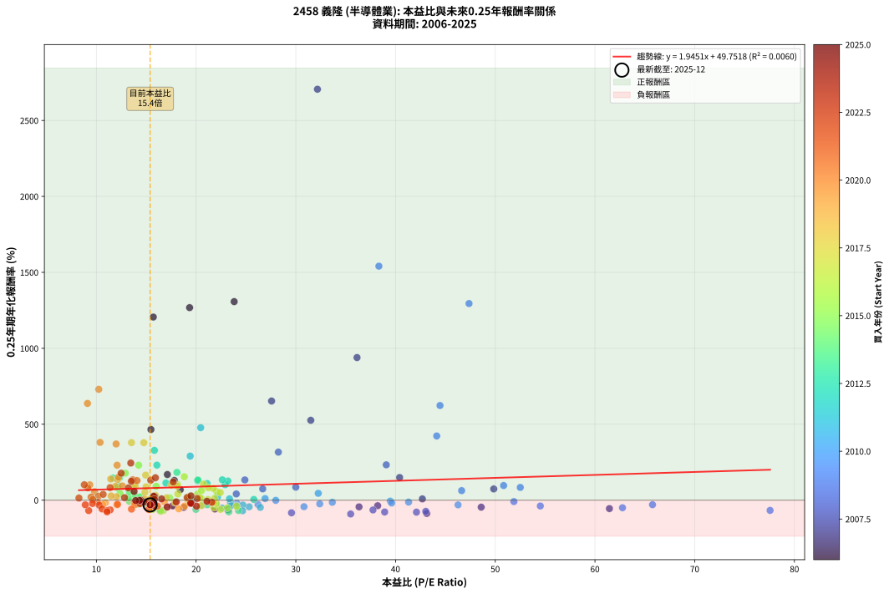
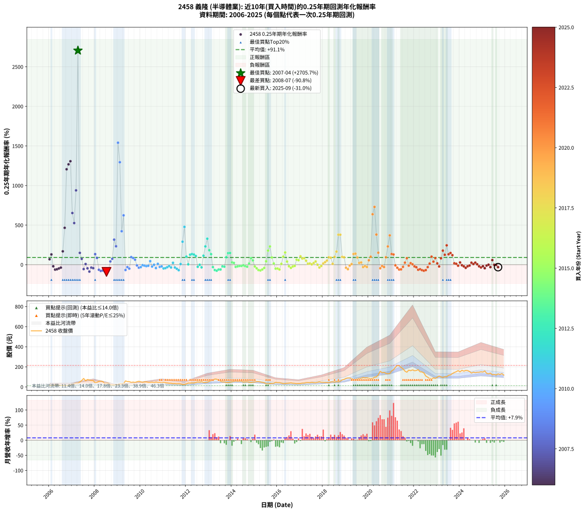

# 2458 義隆 - 本益比與未來報酬率分析

!!! info "報告資訊"
    - **股票代號**: 2458
    - **公司名稱**: 義隆
    - **產業別**: 半導體業
    - **分析期間**: 2006-2025 (237 個數據點)
    - **資料來源**: Type 12 (ShowMonthlyK_ChartFlow) 月收盤價與本益比
    - **報酬率口徑**: 含現金股利 (簡化: 年度合計，假設每年7/1入帳)
    - **報告生成時間**: 2026-01-06 18:41:18 CST

## 📈 視覺化圖表

### 圖表1: 本益比 vs 未來報酬率關係

*圖表1：2458 義隆 本益比與0.25年期未來報酬率關係 (2006-2025)*

### 圖表2: 歷年買入時點的0.25年期實際報酬率

*圖表2：2458 義隆 歷年買入時點的0.25年期實際報酬率 (2006-2025)*

## 📍 買點訊號說明

本報告提供兩種買點提示訊號（顯示於圖表2的股價子圖中）：

### ▲ 小綠色三角形（回測驗證）
- **計算方式**: 使用全部歷史資料計算本益比第25百分位數
- **用途**: 事後驗證，顯示歷史上哪些時點確實為低估區
- **限制**: 當下無法判斷，僅供回測參考
- **特性**: 後見之明（Look-Ahead Bias）

### ▲ 小橘色三角形（即時訊號）
- **計算方式**: 使用截至當月的過去5年資料計算本益比第25百分位數
- **用途**: 實際投資決策，當時即可判斷
- **優勢**: 可操作性強，符合實務需求
- **特性**: 無後見之明，滾動窗口計算

!!! tip "如何使用兩種訊號"
    - **綠色▲** 幫助理解歷史估值機會，驗證策略有效性
    - **橘色▲** 可作為實際買進參考，但仍需搭配基本面分析
    - 兩種訊號重疊時，表示即時判斷與事後驗證一致，信心度較高
    - 僅有綠色▲時，表示當時無法判斷（需要未來資料才能確認）
    - 僅有橘色▲時，表示即時判斷為買點，但事後可能不是最佳時機

## 📊 估值分析摘要

| 指標 | 數值 |
|:---:|:---:|
| **目前本益比** (2025-09) | **15.39 倍** |
| **歷史平均本益比** | 21.28 倍 |
| **估值水準** | 🟢 相對低估 |
| **預期0.25年年化報酬率** | **+79.69%** |
| **歷史平均報酬率** | +91.14% |
| **相關係數 (R²)** | 0.0060 |
| **趨勢線斜率** | 1.9451 |

!!! abstract "核心洞察"
    目前本益比顯著低於歷史平均，預期未來報酬率可能較高

    根據歷史數據回測，2458 義隆 在目前本益比 **15.4倍** 的估值水準下，
    預期未來0.25年年化報酬率約為 **+79.7%**。

    **重要提醒**: 本分析基於歷史數據統計，實際報酬率會受到公司基本面變化、產業趨勢、
    總體經濟環境等多重因素影響。R² = 0.01 表示本益比可解釋約 0.6% 的報酬率變異。

## 📈 歷史估值統計

### 最佳買點 (最高報酬率)

| 項目 | 數值 |
|:---:|:---:|
| 起始時間 | 2007-04 |
| 當時本益比 | 32.17 倍 |
| 起始價格 | 37.0 元 |
| 0.25年後價格 | 84.5 元 |
| **0.25年年化報酬率** | **+2705.73%** |

### 最差買點 (最低報酬率)

| 項目 | 數值 |
|:---:|:---:|
| 起始時間 | 2008-07 |
| 當時本益比 | 35.50 倍 |
| 起始價格 | 38.1 元 |
| 0.25年後價格 | 20.9 元 |
| **0.25年年化報酬率** | **-90.78%** |

## 🎯 投資啟示

### 本益比與報酬率關係

趨勢線方程式: **y = 1.9451x + 49.7518**

!!! info "弱相關或正相關"
    本益比與未來報酬率相關性較弱。這可能表示該股票的報酬率更多受到
    公司成長性、產業趨勢等因素影響，而非估值水準。**需綜合考量多項指標**。

### 估值區間建議

基於歷史數據分析:

- **🟢 低估區** (P/E < 17.0): 預期報酬率較高，可考慮增加持股
- **🟡 合理區** (P/E 17.0-25.5): 預期報酬率符合長期趨勢，正常持有
- **🔴 高估區** (P/E > 25.5): 預期報酬率較低，可考慮減碼或觀望

!!! danger "風險提示"
    - 過去表現不代表未來結果
    - 本分析假設公司基本面無重大結構性變化
    - 產業環境劇變可能使歷史規律失效
    - 應結合公司財報、產業趨勢、總體經濟等多重因素綜合判斷

!!! success "長期投資觀點"
    歷史數據顯示，在合理或低估的估值水準買入並長期持有，
    往往能獲得較佳的投資報酬。**耐心等待好價格**是價值投資的核心原則。

## 📊 數據品質

- **資料來源**: GoodInfo.tw Type 12 (ShowMonthlyK_ChartFlow)
- **資料頻率**: 月度收盤價與本益比
- **回測期間**: 2006-2025
- **數據點數量**: 237 個 (每個點代表一次0.25年期回測)

### 計算方法說明

1. **0.25年期年化報酬率**:
   - 對每個歷史時點，計算其後0.25年的實際投資報酬率
   - 期末價值(不含股利): 期末價格
   - 期末價值(含現金股利): 期末價格 + 持有期間內的現金股利合計 (簡化: 年度合計，假設每年7/1入帳)
   - 公式: 年化報酬率 = [(期末價值/期初價格)^(1/年數) - 1] × 100%

2. **本益比 (P/E Ratio)**:
   - 使用當時的月收盤價與EPS計算
   - 資料來源: Type 12 月度河流圖本益比數據

3. **趨勢線 (Linear Regression)**:
   - 使用最小平方法擬合線性趨勢線
   - R²值衡量本益比對報酬率的解釋能力

---

*本報告由 Stock Analysis System v1.9.0 自動生成*
*數據更新時間: 2026-01-06 18:41:18 CST*

## 📋 月度回測明細表

（每一列對應時間線圖中的一個買入點；可用來對照 SVG 圖上的每個點。）

| 買入月份 | 賣出月份 | 回測期限_年 | 實際持有年數 | 買入本益比_倍 | 買入收盤價_元 | 賣出收盤價_元 | 現金股利合計_元 | 總報酬率_pct | 年化報酬率_pct |
| --- | --- | --- | --- | --- | --- | --- | --- | --- | --- |
| 2006-01 | 2006-05 | 0.25 | 0.329 | 18.41 | 15.65 | 18.60 | 0.00 | +18.85 | +69.15 |
| 2006-02 | 2006-05 | 0.25 | 0.246 | 17.82 | 15.15 | 18.60 | 0.00 | +22.77 | +129.93 |
| 2006-03 | 2006-07 | 0.25 | 0.334 | 19.59 | 16.65 | 15.00 | 0.44 | -7.24 | -20.16 |
| 2006-04 | 2006-07 | 0.25 | 0.249 | 23.18 | 19.70 | 15.00 | 0.44 | -21.60 | -62.35 |
| 2006-05 | 2006-08 | 0.25 | 0.252 | 21.88 | 18.60 | 14.55 | 0.44 | -19.39 | -57.50 |
| 2006-06 | 2006-09 | 0.25 | 0.252 | 18.76 | 15.95 | 13.15 | 0.44 | -14.77 | -46.98 |
| 2006-07 | 2006-10 | 0.25 | 0.252 | 17.65 | 15.00 | 13.35 | 0.00 | -11.00 | -37.04 |
| 2006-08 | 2006-12 | 0.25 | 0.334 | 17.12 | 14.55 | 20.25 | 0.00 | +39.18 | +169.03 |
| 2006-09 | 2006-12 | 0.25 | 0.249 | 15.47 | 13.15 | 20.25 | 0.00 | +53.99 | +465.68 |
| 2006-10 | 2007-01 | 0.25 | 0.252 | 15.71 | 13.35 | 25.50 | 0.00 | +91.01 | +1205.67 |
| 2006-11 | 2007-03 | 0.25 | 0.329 | 19.35 | 16.45 | 38.85 | 0.00 | +136.17 | +1267.74 |
| 2006-12 | 2007-03 | 0.25 | 0.246 | 23.82 | 20.25 | 38.85 | 0.00 | +91.85 | +1307.25 |
| 2007-01 | 2007-05 | 0.25 | 0.329 | 27.57 | 25.50 | 49.50 | 0.00 | +94.12 | +653.01 |
| 2007-02 | 2007-05 | 0.25 | 0.246 | 31.50 | 31.50 | 49.50 | 0.00 | +57.14 | +526.08 |
| 2007-03 | 2007-07 | 0.25 | 0.334 | 36.14 | 38.85 | 84.50 | 0.41 | +118.57 | +939.11 |
| 2007-04 | 2007-07 | 0.25 | 0.249 | 32.17 | 37.00 | 84.50 | 0.41 | +129.49 | +2705.73 |
| 2007-05 | 2007-08 | 0.25 | 0.252 | 40.41 | 49.50 | 61.90 | 0.41 | +25.88 | +149.41 |
| 2007-06 | 2007-09 | 0.25 | 0.252 | 49.85 | 64.80 | 74.10 | 0.41 | +14.99 | +74.11 |
| 2007-07 | 2007-10 | 0.25 | 0.252 | 61.45 | 84.50 | 69.00 | 0.00 | -18.34 | -55.27 |
| 2007-08 | 2007-12 | 0.25 | 0.334 | 42.69 | 61.90 | 63.60 | 0.00 | +2.75 | +8.45 |
| 2007-09 | 2007-12 | 0.25 | 0.249 | 48.59 | 74.10 | 63.60 | 0.00 | -14.17 | -45.84 |
| 2007-10 | 2008-01 | 0.25 | 0.252 | 43.13 | 69.00 | 41.15 | 0.00 | -40.36 | -87.15 |
| 2007-11 | 2008-03 | 0.25 | 0.331 | 38.21 | 64.00 | 55.10 | 0.00 | -13.91 | -36.36 |
| 2007-12 | 2008-03 | 0.25 | 0.249 | 36.34 | 63.60 | 55.10 | 0.00 | -13.36 | -43.78 |
| 2008-01 | 2008-05 | 0.25 | 0.331 | 24.89 | 41.15 | 54.50 | 0.00 | +32.44 | +133.53 |
| 2008-02 | 2008-05 | 0.25 | 0.249 | 30.00 | 46.70 | 54.50 | 0.00 | +16.70 | +85.88 |
| 2008-03 | 2008-07 | 0.25 | 0.334 | 37.74 | 55.10 | 38.10 | 1.00 | -29.04 | -64.19 |
| 2008-04 | 2008-07 | 0.25 | 0.249 | 42.10 | 57.40 | 38.10 | 1.00 | -31.88 | -78.58 |
| 2008-05 | 2008-08 | 0.25 | 0.252 | 43.03 | 54.50 | 38.00 | 1.00 | -28.44 | -73.51 |
| 2008-06 | 2008-09 | 0.25 | 0.252 | 29.57 | 34.60 | 21.15 | 1.00 | -35.98 | -82.98 |
| 2008-07 | 2008-10 | 0.25 | 0.252 | 35.50 | 38.10 | 20.90 | 0.00 | -45.14 | -90.78 |
| 2008-08 | 2008-12 | 0.25 | 0.334 | 38.91 | 38.00 | 23.05 | 0.00 | -39.34 | -77.61 |
| 2008-09 | 2008-12 | 0.25 | 0.249 | 24.03 | 21.15 | 23.05 | 0.00 | +8.98 | +41.24 |
| 2008-10 | 2009-01 | 0.25 | 0.252 | 26.68 | 20.90 | 24.05 | 0.00 | +15.07 | +74.60 |
| 2008-11 | 2009-03 | 0.25 | 0.329 | 28.25 | 19.40 | 31.00 | 0.00 | +59.79 | +316.47 |
| 2008-12 | 2009-03 | 0.25 | 0.246 | 39.07 | 23.05 | 31.00 | 0.00 | +34.49 | +232.87 |
| 2009-01 | 2009-05 | 0.25 | 0.329 | 38.33 | 24.05 | 60.30 | 0.00 | +150.73 | +1540.86 |
| 2009-02 | 2009-05 | 0.25 | 0.246 | 47.37 | 31.50 | 60.30 | 0.00 | +91.43 | +1294.69 |
| 2009-03 | 2009-07 | 0.25 | 0.334 | 44.13 | 31.00 | 53.50 | 0.36 | +73.76 | +422.83 |
| 2009-04 | 2009-07 | 0.25 | 0.249 | 44.46 | 32.90 | 53.50 | 0.36 | +63.72 | +623.41 |
| 2009-05 | 2009-08 | 0.25 | 0.252 | 77.56 | 60.30 | 45.25 | 0.36 | -24.35 | -66.98 |
| 2009-06 | 2009-09 | 0.25 | 0.252 | 65.77 | 53.60 | 48.70 | 0.36 | -8.46 | -29.60 |
| 2009-07 | 2009-10 | 0.25 | 0.252 | 62.76 | 53.50 | 45.00 | 0.00 | -15.89 | -49.69 |
| 2009-08 | 2009-12 | 0.25 | 0.334 | 50.84 | 45.25 | 56.70 | 0.00 | +25.30 | +96.47 |
| 2009-09 | 2009-12 | 0.25 | 0.249 | 52.51 | 48.70 | 56.70 | 0.00 | +16.43 | +84.13 |
| 2009-10 | 2010-01 | 0.25 | 0.252 | 46.63 | 45.00 | 50.90 | 0.00 | +13.11 | +63.09 |
| 2009-11 | 2010-03 | 0.25 | 0.329 | 51.87 | 52.00 | 50.40 | 0.00 | -3.08 | -9.07 |
| 2009-12 | 2010-03 | 0.25 | 0.246 | 54.52 | 56.70 | 50.40 | 0.00 | -11.11 | -38.00 |
| 2010-01 | 2010-05 | 0.25 | 0.329 | 46.27 | 50.90 | 45.10 | 0.00 | -11.39 | -30.80 |
| 2010-02 | 2010-05 | 0.25 | 0.246 | 39.48 | 45.80 | 45.10 | 0.00 | -1.53 | -6.06 |
| 2010-03 | 2010-07 | 0.25 | 0.334 | 41.31 | 50.40 | 47.30 | 0.90 | -4.37 | -12.51 |
| 2010-04 | 2010-07 | 0.25 | 0.249 | 39.61 | 50.70 | 47.30 | 0.90 | -4.93 | -18.37 |
| 2010-05 | 2010-08 | 0.25 | 0.252 | 33.66 | 45.10 | 42.55 | 0.90 | -3.66 | -13.75 |
| 2010-06 | 2010-09 | 0.25 | 0.252 | 32.25 | 45.15 | 48.70 | 0.90 | +9.86 | +45.24 |
| 2010-07 | 2010-10 | 0.25 | 0.252 | 32.40 | 47.30 | 44.15 | 0.00 | -6.66 | -23.94 |
| 2010-08 | 2010-12 | 0.25 | 0.334 | 27.99 | 42.55 | 42.40 | 0.00 | -0.35 | -1.05 |
| 2010-09 | 2010-12 | 0.25 | 0.249 | 30.82 | 48.70 | 42.40 | 0.00 | -12.94 | -42.65 |
| 2010-10 | 2011-01 | 0.25 | 0.252 | 26.92 | 44.15 | 45.30 | 0.00 | +2.60 | +10.75 |
| 2010-11 | 2011-03 | 0.25 | 0.329 | 26.21 | 44.55 | 40.00 | 0.00 | -10.21 | -27.96 |
| 2010-12 | 2011-03 | 0.25 | 0.246 | 24.09 | 42.40 | 40.00 | 0.00 | -5.66 | -21.06 |
| 2011-01 | 2011-05 | 0.25 | 0.329 | 26.44 | 45.30 | 36.70 | 0.00 | -18.98 | -47.31 |
| 2011-02 | 2011-05 | 0.25 | 0.246 | 25.32 | 42.20 | 36.70 | 0.00 | -13.03 | -43.26 |
| 2011-03 | 2011-07 | 0.25 | 0.334 | 24.69 | 40.00 | 33.70 | 1.55 | -11.88 | -31.52 |
| 2011-04 | 2011-07 | 0.25 | 0.249 | 23.45 | 36.90 | 33.70 | 1.55 | -4.48 | -16.79 |
| 2011-05 | 2011-08 | 0.25 | 0.252 | 24.04 | 36.70 | 31.35 | 1.55 | -10.36 | -35.22 |
| 2011-06 | 2011-09 | 0.25 | 0.252 | 22.16 | 32.80 | 33.05 | 1.55 | +5.48 | +23.60 |
| 2011-07 | 2011-10 | 0.25 | 0.252 | 23.51 | 33.70 | 30.20 | 0.00 | -10.39 | -35.30 |
| 2011-08 | 2011-12 | 0.25 | 0.334 | 22.61 | 31.35 | 24.55 | 0.00 | -21.69 | -51.91 |
| 2011-09 | 2011-12 | 0.25 | 0.249 | 24.66 | 33.05 | 24.55 | 0.00 | -25.72 | -69.68 |
| 2011-10 | 2012-01 | 0.25 | 0.252 | 23.35 | 30.20 | 30.85 | 0.00 | +2.15 | +8.82 |
| 2011-11 | 2012-03 | 0.25 | 0.331 | 19.41 | 24.20 | 38.00 | 0.00 | +57.02 | +290.43 |
| 2011-12 | 2012-03 | 0.25 | 0.249 | 20.46 | 24.55 | 38.00 | 0.00 | +54.79 | +477.48 |
| 2012-01 | 2012-05 | 0.25 | 0.331 | 22.91 | 30.85 | 38.95 | 0.00 | +26.26 | +102.13 |
| 2012-02 | 2012-05 | 0.25 | 0.249 | 25.79 | 38.50 | 38.95 | 0.00 | +1.17 | +4.77 |
| 2012-03 | 2012-07 | 0.25 | 0.334 | 23.19 | 38.00 | 48.90 | 1.04 | +31.43 | +126.64 |
| 2012-04 | 2012-07 | 0.25 | 0.249 | 22.63 | 40.40 | 48.90 | 1.04 | +23.62 | +134.23 |
| 2012-05 | 2012-08 | 0.25 | 0.252 | 20.16 | 38.95 | 46.90 | 1.04 | +23.09 | +128.13 |
| 2012-06 | 2012-09 | 0.25 | 0.252 | 21.10 | 43.85 | 51.80 | 1.04 | +20.51 | +109.72 |
| 2012-07 | 2012-10 | 0.25 | 0.252 | 21.98 | 48.90 | 45.20 | 0.00 | -7.57 | -26.83 |
| 2012-08 | 2012-12 | 0.25 | 0.334 | 19.78 | 46.90 | 46.75 | 0.00 | -0.32 | -0.95 |
| 2012-09 | 2012-12 | 0.25 | 0.249 | 20.58 | 51.80 | 46.75 | 0.00 | -9.75 | -33.75 |
| 2012-10 | 2013-01 | 0.25 | 0.252 | 16.97 | 45.20 | 54.70 | 0.00 | +21.02 | +113.26 |
| 2012-11 | 2013-03 | 0.25 | 0.329 | 16.07 | 45.15 | 66.90 | 0.00 | +48.17 | +230.96 |
| 2012-12 | 2013-03 | 0.25 | 0.246 | 15.82 | 46.75 | 66.90 | 0.00 | +43.10 | +328.21 |
| 2013-01 | 2013-05 | 0.25 | 0.329 | 18.08 | 54.70 | 77.00 | 0.00 | +40.77 | +183.14 |
| 2013-02 | 2013-05 | 0.25 | 0.246 | 20.18 | 62.50 | 77.00 | 0.00 | +23.20 | +133.20 |
| 2013-03 | 2013-07 | 0.25 | 0.334 | 21.12 | 66.90 | 56.30 | 3.00 | -11.35 | -30.29 |
| 2013-04 | 2013-07 | 0.25 | 0.249 | 24.25 | 78.50 | 56.30 | 3.00 | -24.45 | -67.55 |
| 2013-05 | 2013-08 | 0.25 | 0.252 | 23.28 | 77.00 | 50.60 | 3.00 | -30.38 | -76.26 |
| 2013-06 | 2013-09 | 0.25 | 0.252 | 19.98 | 67.50 | 50.40 | 3.00 | -20.88 | -60.54 |
| 2013-07 | 2013-10 | 0.25 | 0.252 | 16.33 | 56.30 | 44.50 | 0.00 | -20.96 | -60.69 |
| 2013-08 | 2013-12 | 0.25 | 0.334 | 14.38 | 50.60 | 46.85 | 0.00 | -7.41 | -20.59 |
| 2013-09 | 2013-12 | 0.25 | 0.249 | 14.04 | 50.40 | 46.85 | 0.00 | -7.04 | -25.41 |
| 2013-10 | 2014-01 | 0.25 | 0.252 | 12.16 | 44.50 | 52.60 | 0.00 | +18.20 | +94.24 |
| 2013-11 | 2014-03 | 0.25 | 0.329 | 11.69 | 43.60 | 58.60 | 0.00 | +34.40 | +145.95 |
| 2013-12 | 2014-03 | 0.25 | 0.246 | 12.33 | 46.85 | 58.60 | 0.00 | +25.08 | +147.98 |
| 2014-01 | 2014-05 | 0.25 | 0.329 | 13.90 | 52.60 | 57.20 | 0.00 | +8.75 | +29.07 |
| 2014-02 | 2014-05 | 0.25 | 0.246 | 14.44 | 54.40 | 57.20 | 0.00 | +5.15 | +22.59 |
| 2014-03 | 2014-07 | 0.25 | 0.334 | 15.62 | 58.60 | 49.10 | 3.53 | -10.19 | -27.51 |
| 2014-04 | 2014-07 | 0.25 | 0.249 | 14.93 | 55.80 | 49.10 | 3.53 | -5.68 | -20.92 |
| 2014-05 | 2014-08 | 0.25 | 0.252 | 15.37 | 57.20 | 51.30 | 3.53 | -4.14 | -15.46 |
| 2014-06 | 2014-09 | 0.25 | 0.252 | 15.57 | 57.70 | 51.80 | 3.53 | -4.11 | -15.34 |
| 2014-07 | 2014-10 | 0.25 | 0.252 | 13.31 | 49.10 | 48.10 | 0.00 | -2.04 | -7.84 |
| 2014-08 | 2014-12 | 0.25 | 0.334 | 13.97 | 51.30 | 48.05 | 0.00 | -6.34 | -17.79 |
| 2014-09 | 2014-12 | 0.25 | 0.249 | 14.16 | 51.80 | 48.05 | 0.00 | -7.24 | -26.04 |
| 2014-10 | 2015-01 | 0.25 | 0.252 | 13.21 | 48.10 | 49.80 | 0.00 | +3.53 | +14.79 |
| 2014-11 | 2015-03 | 0.25 | 0.329 | 12.11 | 43.90 | 53.50 | 0.00 | +21.87 | +82.57 |
| 2014-12 | 2015-03 | 0.25 | 0.246 | 13.31 | 48.05 | 53.50 | 0.00 | +11.34 | +54.65 |
| 2015-01 | 2015-05 | 0.25 | 0.329 | 14.33 | 49.80 | 45.80 | 0.00 | -8.03 | -22.50 |
| 2015-02 | 2015-05 | 0.25 | 0.246 | 15.94 | 53.20 | 45.80 | 0.00 | -13.91 | -45.55 |
| 2015-03 | 2015-07 | 0.25 | 0.334 | 16.71 | 53.50 | 32.90 | 3.66 | -31.67 | -68.02 |
| 2015-04 | 2015-07 | 0.25 | 0.249 | 16.43 | 50.40 | 32.90 | 3.66 | -27.46 | -72.44 |
| 2015-05 | 2015-08 | 0.25 | 0.252 | 15.63 | 45.80 | 32.55 | 3.66 | -20.94 | -60.66 |
| 2015-06 | 2015-09 | 0.25 | 0.252 | 15.38 | 43.00 | 34.00 | 3.66 | -12.42 | -40.94 |
| 2015-07 | 2015-10 | 0.25 | 0.252 | 12.37 | 32.90 | 36.00 | 0.00 | +9.42 | +42.97 |
| 2015-08 | 2015-12 | 0.25 | 0.334 | 12.90 | 32.55 | 45.80 | 0.00 | +40.71 | +177.99 |
| 2015-09 | 2015-12 | 0.25 | 0.249 | 14.24 | 34.00 | 45.80 | 0.00 | +34.71 | +230.62 |
| 2015-10 | 2016-01 | 0.25 | 0.252 | 15.99 | 36.00 | 42.40 | 0.00 | +17.78 | +91.48 |
| 2015-11 | 2016-03 | 0.25 | 0.331 | 17.35 | 36.70 | 38.50 | 0.00 | +4.90 | +15.55 |
| 2015-12 | 2016-03 | 0.25 | 0.249 | 23.13 | 45.80 | 38.50 | 0.00 | -15.94 | -50.19 |
| 2016-01 | 2016-05 | 0.25 | 0.331 | 21.79 | 42.40 | 34.05 | 0.00 | -19.69 | -48.42 |
| 2016-02 | 2016-05 | 0.25 | 0.249 | 22.44 | 42.90 | 34.05 | 0.00 | -20.63 | -60.44 |
| 2016-03 | 2016-07 | 0.25 | 0.334 | 20.51 | 38.50 | 37.80 | 2.03 | +3.46 | +10.72 |
| 2016-04 | 2016-07 | 0.25 | 0.249 | 18.15 | 33.45 | 37.80 | 2.03 | +19.08 | +101.55 |
| 2016-05 | 2016-08 | 0.25 | 0.252 | 18.82 | 34.05 | 41.05 | 2.03 | +26.53 | +154.48 |
| 2016-06 | 2016-09 | 0.25 | 0.252 | 20.14 | 35.75 | 36.85 | 2.03 | +8.76 | +39.57 |
| 2016-07 | 2016-10 | 0.25 | 0.252 | 21.71 | 37.80 | 35.75 | 0.00 | -5.42 | -19.86 |
| 2016-08 | 2016-12 | 0.25 | 0.334 | 24.05 | 41.05 | 34.65 | 0.00 | -15.59 | -39.80 |
| 2016-09 | 2016-12 | 0.25 | 0.249 | 22.03 | 36.85 | 34.65 | 0.00 | -5.97 | -21.89 |
| 2016-10 | 2017-01 | 0.25 | 0.252 | 21.82 | 35.75 | 34.30 | 0.00 | -4.06 | -15.16 |
| 2016-11 | 2017-03 | 0.25 | 0.329 | 20.54 | 32.95 | 38.70 | 0.00 | +17.45 | +63.16 |
| 2016-12 | 2017-03 | 0.25 | 0.246 | 22.07 | 34.65 | 38.70 | 0.00 | +11.69 | +56.61 |
| 2017-01 | 2017-05 | 0.25 | 0.329 | 20.74 | 34.30 | 43.50 | 0.00 | +26.82 | +106.11 |
| 2017-02 | 2017-05 | 0.25 | 0.246 | 21.72 | 37.75 | 43.50 | 0.00 | +15.23 | +77.78 |
| 2017-03 | 2017-07 | 0.25 | 0.334 | 21.23 | 38.70 | 45.75 | 1.57 | +22.27 | +82.58 |
| 2017-04 | 2017-07 | 0.25 | 0.249 | 22.42 | 42.75 | 45.75 | 1.57 | +10.69 | +50.33 |
| 2017-05 | 2017-08 | 0.25 | 0.252 | 21.85 | 43.50 | 43.15 | 1.57 | +2.80 | +11.61 |
| 2017-06 | 2017-09 | 0.25 | 0.252 | 20.39 | 42.30 | 42.30 | 1.57 | +3.71 | +15.57 |
| 2017-07 | 2017-10 | 0.25 | 0.252 | 21.19 | 45.75 | 46.25 | 0.00 | +1.09 | +4.41 |
| 2017-08 | 2017-12 | 0.25 | 0.334 | 19.23 | 43.15 | 46.10 | 0.00 | +6.84 | +21.89 |
| 2017-09 | 2017-12 | 0.25 | 0.249 | 18.17 | 42.30 | 46.10 | 0.00 | +8.98 | +41.24 |
| 2017-10 | 2018-01 | 0.25 | 0.252 | 19.18 | 46.25 | 46.20 | 0.00 | -0.11 | -0.43 |
| 2017-11 | 2018-03 | 0.25 | 0.329 | 20.51 | 51.20 | 44.25 | 0.00 | -13.57 | -35.86 |
| 2017-12 | 2018-03 | 0.25 | 0.246 | 17.87 | 46.10 | 44.25 | 0.00 | -4.01 | -15.31 |
| 2018-01 | 2018-05 | 0.25 | 0.329 | 17.04 | 46.20 | 48.50 | 0.00 | +4.98 | +15.94 |
| 2018-02 | 2018-05 | 0.25 | 0.246 | 15.93 | 45.30 | 48.50 | 0.00 | +7.06 | +31.92 |
| 2018-03 | 2018-07 | 0.25 | 0.334 | 14.87 | 44.25 | 48.35 | 2.58 | +15.10 | +52.34 |
| 2018-04 | 2018-07 | 0.25 | 0.249 | 13.91 | 43.20 | 48.35 | 2.58 | +17.89 | +93.62 |
| 2018-05 | 2018-08 | 0.25 | 0.252 | 14.98 | 48.50 | 54.30 | 2.58 | +17.28 | +88.28 |
| 2018-06 | 2018-09 | 0.25 | 0.252 | 15.46 | 52.10 | 50.90 | 2.58 | +2.65 | +10.94 |
| 2018-07 | 2018-10 | 0.25 | 0.252 | 13.81 | 48.35 | 57.50 | 0.00 | +18.92 | +98.99 |
| 2018-08 | 2018-12 | 0.25 | 0.334 | 14.94 | 54.30 | 75.20 | 0.00 | +38.49 | +165.08 |
| 2018-09 | 2018-12 | 0.25 | 0.249 | 13.52 | 50.90 | 75.20 | 0.00 | +47.74 | +378.99 |
| 2018-10 | 2019-01 | 0.25 | 0.252 | 14.76 | 57.50 | 85.30 | 0.00 | +48.35 | +378.64 |
| 2018-11 | 2019-03 | 0.25 | 0.329 | 17.53 | 70.60 | 88.50 | 0.00 | +25.35 | +98.93 |
| 2018-12 | 2019-03 | 0.25 | 0.246 | 18.08 | 75.20 | 88.50 | 0.00 | +17.69 | +93.65 |
| 2019-01 | 2019-05 | 0.25 | 0.329 | 18.84 | 85.30 | 72.70 | 0.00 | -14.77 | -38.52 |
| 2019-02 | 2019-05 | 0.25 | 0.246 | 18.26 | 89.40 | 72.70 | 0.00 | -18.68 | -56.79 |
| 2019-03 | 2019-07 | 0.25 | 0.334 | 16.82 | 88.50 | 80.10 | 5.00 | -3.84 | -11.07 |
| 2019-04 | 2019-07 | 0.25 | 0.249 | 14.85 | 83.60 | 80.10 | 5.00 | +1.79 | +7.40 |
| 2019-05 | 2019-08 | 0.25 | 0.252 | 12.12 | 72.70 | 85.20 | 5.00 | +24.07 | +135.44 |
| 2019-06 | 2019-09 | 0.25 | 0.252 | 11.44 | 72.80 | 85.70 | 5.00 | +24.59 | +139.36 |
| 2019-07 | 2019-10 | 0.25 | 0.252 | 11.90 | 80.10 | 94.30 | 0.00 | +17.73 | +91.16 |
| 2019-08 | 2019-12 | 0.25 | 0.334 | 12.00 | 85.20 | 91.20 | 0.00 | +7.04 | +22.60 |
| 2019-09 | 2019-12 | 0.25 | 0.249 | 11.48 | 85.70 | 91.20 | 0.00 | +6.42 | +28.36 |
| 2019-10 | 2020-01 | 0.25 | 0.252 | 12.04 | 94.30 | 86.30 | 0.00 | -8.48 | -29.67 |
| 2019-11 | 2020-03 | 0.25 | 0.331 | 10.90 | 89.40 | 83.90 | 0.00 | -6.15 | -17.44 |
| 2019-12 | 2020-03 | 0.25 | 0.249 | 10.64 | 91.20 | 83.90 | 0.00 | -8.00 | -28.46 |
| 2020-01 | 2020-05 | 0.25 | 0.331 | 9.82 | 86.30 | 100.00 | 0.00 | +15.87 | +56.01 |
| 2020-02 | 2020-05 | 0.25 | 0.249 | 9.34 | 84.00 | 100.00 | 0.00 | +19.05 | +101.34 |
| 2020-03 | 2020-07 | 0.25 | 0.334 | 9.11 | 83.90 | 157.00 | 6.50 | +94.87 | +637.03 |
| 2020-04 | 2020-07 | 0.25 | 0.249 | 10.24 | 96.50 | 157.00 | 6.50 | +69.43 | +730.06 |
| 2020-05 | 2020-08 | 0.25 | 0.252 | 10.37 | 100.00 | 142.00 | 6.50 | +48.50 | +380.59 |
| 2020-06 | 2020-09 | 0.25 | 0.252 | 12.23 | 120.50 | 145.50 | 6.50 | +26.14 | +151.43 |
| 2020-07 | 2020-10 | 0.25 | 0.252 | 15.59 | 157.00 | 135.00 | 0.00 | -14.01 | -45.08 |
| 2020-08 | 2020-12 | 0.25 | 0.334 | 13.81 | 142.00 | 133.50 | 0.00 | -5.99 | -16.87 |
| 2020-09 | 2020-12 | 0.25 | 0.249 | 13.86 | 145.50 | 133.50 | 0.00 | -8.25 | -29.21 |
| 2020-10 | 2021-01 | 0.25 | 0.252 | 12.60 | 135.00 | 159.50 | 0.00 | +18.15 | +93.88 |
| 2020-11 | 2021-03 | 0.25 | 0.329 | 12.08 | 132.00 | 195.50 | 0.00 | +48.11 | +230.51 |
| 2020-12 | 2021-03 | 0.25 | 0.246 | 11.98 | 133.50 | 195.50 | 0.00 | +46.44 | +370.25 |
| 2021-01 | 2021-05 | 0.25 | 0.329 | 13.65 | 159.50 | 211.00 | 0.00 | +32.29 | +134.36 |
| 2021-02 | 2021-05 | 0.25 | 0.246 | 14.07 | 172.00 | 211.00 | 0.00 | +22.67 | +129.19 |
| 2021-03 | 2021-07 | 0.25 | 0.334 | 15.32 | 195.50 | 181.00 | 9.00 | -2.81 | -8.19 |
| 2021-04 | 2021-07 | 0.25 | 0.249 | 16.12 | 214.50 | 181.00 | 9.00 | -11.42 | -38.54 |
| 2021-05 | 2021-08 | 0.25 | 0.252 | 15.24 | 211.00 | 157.50 | 9.00 | -21.09 | -60.95 |
| 2021-06 | 2021-09 | 0.25 | 0.252 | 13.52 | 194.50 | 146.50 | 9.00 | -20.05 | -58.87 |
| 2021-07 | 2021-10 | 0.25 | 0.252 | 12.12 | 181.00 | 167.00 | 0.00 | -7.73 | -27.36 |
| 2021-08 | 2021-12 | 0.25 | 0.334 | 10.18 | 157.50 | 170.00 | 0.00 | +7.94 | +25.69 |
| 2021-09 | 2021-12 | 0.25 | 0.249 | 9.15 | 146.50 | 170.00 | 0.00 | +16.04 | +81.69 |
| 2021-10 | 2022-01 | 0.25 | 0.252 | 10.09 | 167.00 | 161.50 | 0.00 | -3.29 | -12.45 |
| 2021-11 | 2022-03 | 0.25 | 0.329 | 9.47 | 162.00 | 172.00 | 0.00 | +6.17 | +20.00 |
| 2021-12 | 2022-03 | 0.25 | 0.246 | 9.64 | 170.00 | 172.00 | 0.00 | +1.18 | +4.86 |
| 2022-01 | 2022-05 | 0.25 | 0.329 | 9.61 | 161.50 | 149.00 | 0.00 | -7.74 | -21.75 |
| 2022-02 | 2022-05 | 0.25 | 0.246 | 10.28 | 164.00 | 149.00 | 0.00 | -9.15 | -32.25 |
| 2022-03 | 2022-07 | 0.25 | 0.334 | 11.38 | 172.00 | 108.50 | 13.81 | -28.89 | -63.97 |
| 2022-04 | 2022-07 | 0.25 | 0.249 | 10.57 | 151.00 | 108.50 | 13.81 | -19.00 | -57.08 |
| 2022-05 | 2022-08 | 0.25 | 0.252 | 11.09 | 149.00 | 97.10 | 13.81 | -25.56 | -69.03 |
| 2022-06 | 2022-09 | 0.25 | 0.252 | 11.07 | 139.50 | 83.20 | 13.81 | -30.46 | -76.36 |
| 2022-07 | 2022-10 | 0.25 | 0.252 | 9.23 | 108.50 | 81.20 | 0.00 | -25.16 | -68.36 |
| 2022-08 | 2022-12 | 0.25 | 0.334 | 8.89 | 97.10 | 86.00 | 0.00 | -11.43 | -30.47 |
| 2022-09 | 2022-12 | 0.25 | 0.249 | 8.25 | 83.20 | 86.00 | 0.00 | +3.37 | +14.21 |
| 2022-10 | 2023-01 | 0.25 | 0.252 | 8.79 | 81.20 | 96.90 | 0.00 | +19.33 | +101.73 |
| 2022-11 | 2023-03 | 0.25 | 0.329 | 10.68 | 89.70 | 99.80 | 0.00 | +11.26 | +38.37 |
| 2022-12 | 2023-03 | 0.25 | 0.246 | 11.38 | 86.00 | 99.80 | 0.00 | +16.05 | +82.94 |
| 2023-01 | 2023-05 | 0.25 | 0.329 | 12.82 | 96.90 | 102.00 | 0.00 | +5.26 | +16.90 |
| 2023-02 | 2023-05 | 0.25 | 0.246 | 14.36 | 108.50 | 102.00 | 0.00 | -5.99 | -22.18 |
| 2023-03 | 2023-07 | 0.25 | 0.334 | 13.21 | 99.80 | 116.50 | 5.12 | +21.86 | +80.73 |
| 2023-04 | 2023-07 | 0.25 | 0.249 | 12.49 | 94.30 | 116.50 | 5.12 | +28.97 | +177.60 |
| 2023-05 | 2023-08 | 0.25 | 0.252 | 13.51 | 102.00 | 120.00 | 5.12 | +22.66 | +125.00 |
| 2023-06 | 2023-09 | 0.25 | 0.252 | 13.45 | 101.50 | 133.50 | 5.12 | +36.57 | +244.61 |
| 2023-07 | 2023-10 | 0.25 | 0.252 | 15.45 | 116.50 | 144.00 | 0.00 | +23.61 | +131.95 |
| 2023-08 | 2023-12 | 0.25 | 0.334 | 15.92 | 120.00 | 162.50 | 0.00 | +35.42 | +147.86 |
| 2023-09 | 2023-12 | 0.25 | 0.249 | 17.71 | 133.50 | 162.50 | 0.00 | +21.72 | +120.12 |
| 2023-10 | 2024-01 | 0.25 | 0.252 | 19.11 | 144.00 | 150.00 | 0.00 | +4.17 | +17.59 |
| 2023-11 | 2024-03 | 0.25 | 0.331 | 20.11 | 151.50 | 157.00 | 0.00 | +3.63 | +11.37 |
| 2023-12 | 2024-03 | 0.25 | 0.249 | 21.58 | 162.50 | 157.00 | 0.00 | -3.38 | -12.91 |
| 2024-01 | 2024-05 | 0.25 | 0.331 | 19.48 | 150.00 | 163.00 | 0.00 | +8.67 | +28.52 |
| 2024-02 | 2024-05 | 0.25 | 0.249 | 21.09 | 166.00 | 163.00 | 0.00 | -1.81 | -7.06 |
| 2024-03 | 2024-07 | 0.25 | 0.334 | 19.53 | 157.00 | 138.00 | 7.12 | -7.57 | -20.98 |
| 2024-04 | 2024-07 | 0.25 | 0.249 | 20.04 | 164.50 | 138.00 | 7.12 | -11.78 | -39.53 |
| 2024-05 | 2024-08 | 0.25 | 0.252 | 19.45 | 163.00 | 147.00 | 7.12 | -5.45 | -19.94 |
| 2024-06 | 2024-09 | 0.25 | 0.252 | 18.01 | 154.00 | 142.50 | 7.12 | -2.84 | -10.82 |
| 2024-07 | 2024-10 | 0.25 | 0.252 | 15.83 | 138.00 | 146.00 | 0.00 | +5.80 | +25.07 |
| 2024-08 | 2024-12 | 0.25 | 0.334 | 16.54 | 147.00 | 151.00 | 0.00 | +2.72 | +8.37 |
| 2024-09 | 2024-12 | 0.25 | 0.249 | 15.73 | 142.50 | 151.00 | 0.00 | +5.96 | +26.18 |
| 2024-10 | 2025-01 | 0.25 | 0.252 | 15.82 | 146.00 | 148.00 | 0.00 | +1.37 | +5.55 |
| 2024-11 | 2025-03 | 0.25 | 0.329 | 15.59 | 146.50 | 136.00 | 0.00 | -7.17 | -20.26 |
| 2024-12 | 2025-03 | 0.25 | 0.246 | 15.78 | 151.00 | 136.00 | 0.00 | -9.93 | -34.60 |
| 2025-01 | 2025-05 | 0.25 | 0.329 | 15.67 | 148.00 | 138.00 | 0.00 | -6.76 | -19.18 |
| 2025-02 | 2025-05 | 0.25 | 0.246 | 17.11 | 159.50 | 138.00 | 0.00 | -13.48 | -44.43 |
| 2025-03 | 2025-07 | 0.25 | 0.334 | 14.79 | 136.00 | 124.50 | 6.41 | -3.74 | -10.80 |
| 2025-04 | 2025-07 | 0.25 | 0.249 | 14.44 | 131.00 | 124.50 | 6.41 | -0.07 | -0.28 |
| 2025-05 | 2025-08 | 0.25 | 0.252 | 15.43 | 138.00 | 119.50 | 6.41 | -8.76 | -30.52 |
| 2025-06 | 2025-09 | 0.25 | 0.252 | 13.78 | 121.50 | 130.00 | 6.41 | +12.27 | +58.33 |
| 2025-07 | 2025-10 | 0.25 | 0.252 | 14.32 | 124.50 | 124.00 | 0.00 | -0.40 | -1.58 |
| 2025-08 | 2025-12 | 0.25 | 0.334 | 13.94 | 119.50 | 118.50 | 0.00 | -0.84 | -2.48 |
| 2025-09 | 2025-12 | 0.25 | 0.249 | 15.39 | 130.00 | 118.50 | 0.00 | -8.85 | -31.05 |
