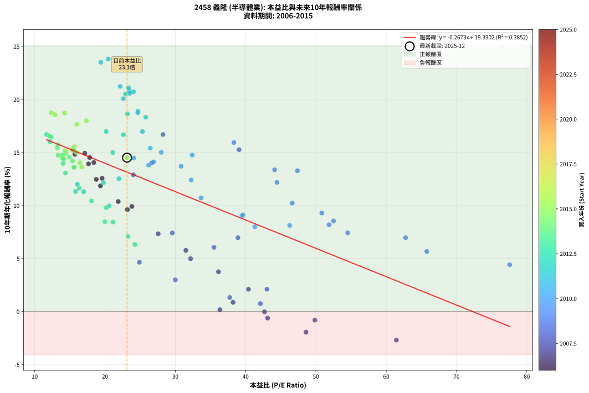
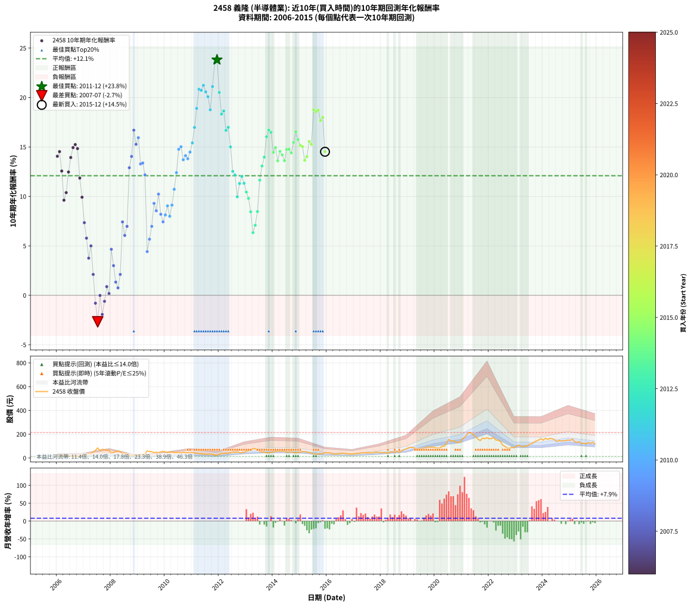

# 2458 義隆 - 本益比與未來報酬率分析

!!! info "報告資訊"
    - **股票代號**: 2458
    - **公司名稱**: 義隆
    - **產業別**: 半導體業
    - **分析期間**: 2006-2015 (120 個數據點)
    - **資料來源**: Type 12 (ShowMonthlyK_ChartFlow) 月收盤價與本益比
    - **報酬率口徑**: 含現金股利 (簡化: 年度合計，假設每年7/1入帳)
    - **報告生成時間**: 2026-01-05 20:49:36 CST

## 📈 視覺化圖表

### 圖表1: 本益比 vs 未來報酬率關係

*圖表1：2458 義隆 本益比與10年期未來報酬率關係 (2006-2015)*

### 圖表2: 歷年買入時點的10年期實際報酬率

*圖表2：2458 義隆 歷年買入時點的10年期實際報酬率 (2006-2015)*

## 📍 買點訊號說明

本報告提供兩種買點提示訊號（顯示於圖表2的股價子圖中）：

### ▲ 小綠色三角形（回測驗證）
- **計算方式**: 使用全部歷史資料計算本益比第25百分位數
- **用途**: 事後驗證，顯示歷史上哪些時點確實為低估區
- **限制**: 當下無法判斷，僅供回測參考
- **特性**: 後見之明（Look-Ahead Bias）

### ▲ 小橘色三角形（即時訊號）
- **計算方式**: 使用截至當月的過去5年資料計算本益比第25百分位數
- **用途**: 實際投資決策，當時即可判斷
- **優勢**: 可操作性強，符合實務需求
- **特性**: 無後見之明，滾動窗口計算

!!! tip "如何使用兩種訊號"
    - **綠色▲** 幫助理解歷史估值機會，驗證策略有效性
    - **橘色▲** 可作為實際買進參考，但仍需搭配基本面分析
    - 兩種訊號重疊時，表示即時判斷與事後驗證一致，信心度較高
    - 僅有綠色▲時，表示當時無法判斷（需要未來資料才能確認）
    - 僅有橘色▲時，表示即時判斷為買點，但事後可能不是最佳時機

## 📊 估值分析摘要

| 指標 | 數值 |
|:---:|:---:|
| **目前本益比** (2015-12) | **23.13 倍** |
| **歷史平均本益比** | 27.08 倍 |
| **估值水準** | 🟡 合理範圍 |
| **預期10年年化報酬率** | **+13.15%** |
| **歷史平均報酬率** | +12.09% |
| **相關係數 (R²)** | 0.3852 |
| **趨勢線斜率** | -0.2673 |

!!! abstract "核心洞察"
    目前本益比接近歷史平均，預期報酬率符合長期趨勢

    根據歷史數據回測，2458 義隆 在目前本益比 **23.1倍** 的估值水準下，
    預期未來10年年化報酬率約為 **+13.1%**。

    **重要提醒**: 本分析基於歷史數據統計，實際報酬率會受到公司基本面變化、產業趨勢、
    總體經濟環境等多重因素影響。R² = 0.39 表示本益比可解釋約 38.5% 的報酬率變異。

## 📈 歷史估值統計

### 最佳買點 (最高報酬率)

| 項目 | 數值 |
|:---:|:---:|
| 起始時間 | 2011-12 |
| 當時本益比 | 20.46 倍 |
| 起始價格 | 24.6 元 |
| 10年後價格 | 170.0 元 |
| **10年年化報酬率** | **+23.81%** |

### 最差買點 (最低報酬率)

| 項目 | 數值 |
|:---:|:---:|
| 起始時間 | 2007-07 |
| 當時本益比 | 61.45 倍 |
| 起始價格 | 84.5 元 |
| 10年後價格 | 45.8 元 |
| **10年年化報酬率** | **-2.68%** |

## 🎯 投資啟示

### 本益比與報酬率關係

趨勢線方程式: **y = -0.2673x + 19.3302**

!!! note "負相關"
    本益比與未來報酬率呈現負相關。較低的本益比通常帶來較高的未來報酬率，
    但相關性不算非常強。**估值仍是重要參考指標之一**。

### 估值區間建議

基於歷史數據分析:

- **🟢 低估區** (P/E < 21.7): 預期報酬率較高，可考慮增加持股
- **🟡 合理區** (P/E 21.7-32.5): 預期報酬率符合長期趨勢，正常持有
- **🔴 高估區** (P/E > 32.5): 預期報酬率較低，可考慮減碼或觀望

!!! danger "風險提示"
    - 過去表現不代表未來結果
    - 本分析假設公司基本面無重大結構性變化
    - 產業環境劇變可能使歷史規律失效
    - 應結合公司財報、產業趨勢、總體經濟等多重因素綜合判斷

!!! success "長期投資觀點"
    歷史數據顯示，在合理或低估的估值水準買入並長期持有，
    往往能獲得較佳的投資報酬。**耐心等待好價格**是價值投資的核心原則。

## 📊 數據品質

- **資料來源**: GoodInfo.tw Type 12 (ShowMonthlyK_ChartFlow)
- **資料頻率**: 月度收盤價與本益比
- **回測期間**: 2006-2015
- **數據點數量**: 120 個 (每個點代表一次10年期回測)

### 計算方法說明

1. **10年期年化報酬率**:
   - 對每個歷史時點，計算其後10年的實際投資報酬率
   - 期末價值(不含股利): 期末價格
   - 期末價值(含現金股利): 期末價格 + 持有期間內的現金股利合計 (簡化: 年度合計，假設每年7/1入帳)
   - 公式: 年化報酬率 = [(期末價值/期初價格)^(1/年數) - 1] × 100%

2. **本益比 (P/E Ratio)**:
   - 使用當時的月收盤價與EPS計算
   - 資料來源: Type 12 月度河流圖本益比數據

3. **趨勢線 (Linear Regression)**:
   - 使用最小平方法擬合線性趨勢線
   - R²值衡量本益比對報酬率的解釋能力

---

*本報告由 Stock Analysis System v1.9.0 自動生成*
*數據更新時間: 2026-01-05 20:49:36 CST*

## 📋 月度回測明細表

（每一列對應時間線圖中的一個買入點；可用來對照 SVG 圖上的每個點。）

| 買入月份 | 賣出月份 | 回測期限_年 | 實際持有年數 | 買入本益比_倍 | 買入收盤價_元 | 賣出收盤價_元 | 現金股利合計_元 | 總報酬率_pct | 年化報酬率_pct |
| --- | --- | --- | --- | --- | --- | --- | --- | --- | --- |
| 2006-01 | 2016-01 | 10 | 9.999 | 18.41 | 15.65 | 42.40 | 15.90 | +272.56 | +14.06 |
| 2006-02 | 2016-02 | 10 | 9.999 | 17.82 | 15.15 | 42.90 | 15.90 | +288.15 | +14.53 |
| 2006-03 | 2016-03 | 10 | 10.001 | 19.59 | 16.65 | 38.50 | 15.90 | +226.76 | +12.57 |
| 2006-04 | 2016-04 | 10 | 10.001 | 23.18 | 19.70 | 33.45 | 15.90 | +150.53 | +9.62 |
| 2006-05 | 2016-05 | 10 | 10.001 | 21.88 | 18.60 | 34.05 | 15.90 | +168.58 | +10.38 |
| 2006-06 | 2016-06 | 10 | 10.001 | 18.76 | 15.95 | 35.75 | 15.90 | +223.86 | +12.47 |
| 2006-07 | 2016-07 | 10 | 10.001 | 17.65 | 15.00 | 37.80 | 17.49 | +268.62 | +13.93 |
| 2006-08 | 2016-08 | 10 | 10.001 | 17.12 | 14.55 | 41.05 | 17.49 | +302.36 | +14.94 |
| 2006-09 | 2016-09 | 10 | 10.001 | 15.47 | 13.15 | 36.85 | 17.49 | +313.25 | +15.24 |
| 2006-10 | 2016-10 | 10 | 10.001 | 15.71 | 13.35 | 35.75 | 17.49 | +298.82 | +14.83 |
| 2006-11 | 2016-11 | 10 | 10.001 | 19.35 | 16.45 | 32.95 | 17.49 | +206.64 | +11.86 |
| 2006-12 | 2016-12 | 10 | 10.001 | 23.82 | 20.25 | 34.65 | 17.49 | +157.50 | +9.92 |
| 2007-01 | 2017-01 | 10 | 10.001 | 27.57 | 25.50 | 34.30 | 17.49 | +103.11 | +7.34 |
| 2007-02 | 2017-02 | 10 | 10.001 | 31.50 | 31.50 | 37.75 | 17.49 | +75.37 | +5.78 |
| 2007-03 | 2017-03 | 10 | 10.001 | 36.14 | 38.85 | 38.70 | 17.49 | +44.64 | +3.76 |
| 2007-04 | 2017-04 | 10 | 10.001 | 32.17 | 37.00 | 42.75 | 17.49 | +62.82 | +4.99 |
| 2007-05 | 2017-05 | 10 | 10.001 | 40.41 | 49.50 | 43.50 | 17.49 | +23.22 | +2.11 |
| 2007-06 | 2017-06 | 10 | 10.001 | 49.85 | 64.80 | 42.30 | 17.49 | -7.73 | -0.80 |
| 2007-07 | 2017-07 | 10 | 10.001 | 61.45 | 84.50 | 45.75 | 18.65 | -23.79 | -2.68 |
| 2007-08 | 2017-08 | 10 | 10.001 | 42.69 | 61.90 | 43.15 | 18.65 | -0.16 | -0.02 |
| 2007-09 | 2017-09 | 10 | 10.001 | 48.59 | 74.10 | 42.30 | 18.65 | -17.75 | -1.93 |
| 2007-10 | 2017-10 | 10 | 10.001 | 43.13 | 69.00 | 46.25 | 18.65 | -5.94 | -0.61 |
| 2007-11 | 2017-11 | 10 | 10.001 | 38.21 | 64.00 | 51.20 | 18.65 | +9.14 | +0.88 |
| 2007-12 | 2017-12 | 10 | 10.001 | 36.34 | 63.60 | 46.10 | 18.65 | +1.81 | +0.18 |
| 2008-01 | 2018-01 | 10 | 10.001 | 24.89 | 41.15 | 46.20 | 18.65 | +57.59 | +4.65 |
| 2008-02 | 2018-03 | 10 | 10.081 | 30.00 | 46.70 | 44.25 | 18.65 | +34.69 | +3.00 |
| 2008-03 | 2018-03 | 10 | 9.999 | 37.74 | 55.10 | 44.25 | 18.65 | +14.16 | +1.33 |
| 2008-04 | 2018-04 | 10 | 9.999 | 42.10 | 57.40 | 43.20 | 18.65 | +7.75 | +0.75 |
| 2008-05 | 2018-05 | 10 | 9.999 | 43.03 | 54.50 | 48.50 | 18.65 | +23.21 | +2.11 |
| 2008-06 | 2018-06 | 10 | 9.999 | 29.57 | 34.60 | 52.10 | 18.65 | +104.48 | +7.42 |
| 2008-07 | 2018-07 | 10 | 9.999 | 35.50 | 38.10 | 48.35 | 20.23 | +80.00 | +6.05 |
| 2008-08 | 2018-08 | 10 | 9.999 | 38.91 | 38.00 | 54.30 | 20.23 | +96.13 | +6.97 |
| 2008-09 | 2018-09 | 10 | 9.999 | 24.03 | 21.15 | 50.90 | 20.23 | +236.31 | +12.90 |
| 2008-10 | 2018-10 | 10 | 9.999 | 26.68 | 20.90 | 57.50 | 20.23 | +271.91 | +14.04 |
| 2008-11 | 2018-11 | 10 | 9.999 | 28.25 | 19.40 | 70.60 | 20.23 | +368.20 | +16.69 |
| 2008-12 | 2018-12 | 10 | 9.999 | 39.07 | 23.05 | 75.20 | 20.23 | +314.01 | +15.27 |
| 2009-01 | 2019-01 | 10 | 9.999 | 38.33 | 24.05 | 85.30 | 20.23 | +338.79 | +15.94 |
| 2009-02 | 2019-02 | 10 | 9.999 | 47.37 | 31.50 | 89.40 | 20.23 | +248.03 | +13.28 |
| 2009-03 | 2019-03 | 10 | 9.999 | 44.13 | 31.00 | 88.50 | 20.23 | +250.74 | +13.37 |
| 2009-04 | 2019-04 | 10 | 9.999 | 44.46 | 32.90 | 83.60 | 20.23 | +215.59 | +12.18 |
| 2009-05 | 2019-05 | 10 | 9.999 | 77.56 | 60.30 | 72.70 | 20.23 | +54.11 | +4.42 |
| 2009-06 | 2019-06 | 10 | 9.999 | 65.77 | 53.60 | 72.80 | 20.23 | +73.56 | +5.67 |
| 2009-07 | 2019-07 | 10 | 9.999 | 62.76 | 53.50 | 80.10 | 24.86 | +96.20 | +6.97 |
| 2009-08 | 2019-08 | 10 | 9.999 | 50.84 | 45.25 | 85.20 | 24.86 | +143.24 | +9.30 |
| 2009-09 | 2019-09 | 10 | 9.999 | 52.51 | 48.70 | 85.70 | 24.86 | +127.03 | +8.55 |
| 2009-10 | 2019-10 | 10 | 9.999 | 46.63 | 45.00 | 94.30 | 24.86 | +164.81 | +10.23 |
| 2009-11 | 2019-11 | 10 | 9.999 | 51.87 | 52.00 | 89.40 | 24.86 | +119.74 | +8.19 |
| 2009-12 | 2019-12 | 10 | 9.999 | 54.52 | 56.70 | 91.20 | 24.86 | +104.70 | +7.43 |
| 2010-01 | 2020-01 | 10 | 9.999 | 46.27 | 50.90 | 86.30 | 24.86 | +118.40 | +8.13 |
| 2010-02 | 2020-02 | 10 | 9.999 | 39.48 | 45.80 | 84.00 | 24.86 | +137.70 | +9.05 |
| 2010-03 | 2020-03 | 10 | 10.001 | 41.31 | 50.40 | 83.90 | 24.86 | +115.80 | +7.99 |
| 2010-04 | 2020-04 | 10 | 10.001 | 39.61 | 50.70 | 96.50 | 24.86 | +139.38 | +9.12 |
| 2010-05 | 2020-05 | 10 | 10.001 | 33.66 | 45.10 | 100.00 | 24.86 | +176.86 | +10.72 |
| 2010-06 | 2020-06 | 10 | 10.001 | 32.25 | 45.15 | 120.50 | 24.86 | +221.96 | +12.40 |
| 2010-07 | 2020-07 | 10 | 10.001 | 32.40 | 47.30 | 157.00 | 30.46 | +296.33 | +14.76 |
| 2010-08 | 2020-08 | 10 | 10.001 | 27.99 | 42.55 | 142.00 | 30.46 | +305.32 | +15.02 |
| 2010-09 | 2020-09 | 10 | 10.001 | 30.82 | 48.70 | 145.50 | 30.46 | +261.32 | +13.71 |
| 2010-10 | 2020-10 | 10 | 10.001 | 26.92 | 44.15 | 135.00 | 30.46 | +274.78 | +14.12 |
| 2010-11 | 2020-11 | 10 | 10.001 | 26.21 | 44.55 | 132.00 | 30.46 | +264.68 | +13.81 |
| 2010-12 | 2020-12 | 10 | 10.001 | 24.09 | 42.40 | 133.50 | 30.46 | +286.71 | +14.48 |
| 2011-01 | 2021-01 | 10 | 10.001 | 26.44 | 45.30 | 159.50 | 30.46 | +319.35 | +15.41 |
| 2011-02 | 2021-02 | 10 | 10.001 | 25.32 | 42.20 | 172.00 | 30.46 | +379.77 | +16.98 |
| 2011-03 | 2021-03 | 10 | 10.001 | 24.69 | 40.00 | 195.50 | 30.46 | +464.91 | +18.90 |
| 2011-04 | 2021-04 | 10 | 10.001 | 23.45 | 36.90 | 214.50 | 30.46 | +563.86 | +20.84 |
| 2011-05 | 2021-05 | 10 | 10.001 | 24.04 | 36.70 | 211.00 | 30.46 | +557.94 | +20.73 |
| 2011-06 | 2021-06 | 10 | 10.001 | 22.16 | 32.80 | 194.50 | 30.46 | +585.87 | +21.23 |
| 2011-07 | 2021-07 | 10 | 10.001 | 23.51 | 33.70 | 181.00 | 37.92 | +549.61 | +20.57 |
| 2011-08 | 2021-08 | 10 | 10.001 | 22.61 | 31.35 | 157.50 | 37.92 | +523.34 | +20.08 |
| 2011-09 | 2021-09 | 10 | 10.001 | 24.66 | 33.05 | 146.50 | 37.92 | +457.99 | +18.76 |
| 2011-10 | 2021-10 | 10 | 10.001 | 23.35 | 30.20 | 167.00 | 37.92 | +578.53 | +21.10 |
| 2011-11 | 2021-11 | 10 | 10.001 | 19.41 | 24.20 | 162.00 | 37.92 | +726.10 | +23.51 |
| 2011-12 | 2021-12 | 10 | 10.001 | 20.46 | 24.55 | 170.00 | 37.92 | +746.91 | +23.81 |
| 2012-01 | 2022-01 | 10 | 10.001 | 22.91 | 30.85 | 161.50 | 37.92 | +546.41 | +20.51 |
| 2012-02 | 2022-03 | 10 | 10.081 | 25.79 | 38.50 | 172.00 | 37.92 | +445.24 | +18.32 |
| 2012-03 | 2022-03 | 10 | 9.999 | 23.19 | 38.00 | 172.00 | 37.92 | +452.41 | +18.64 |
| 2012-04 | 2022-04 | 10 | 9.999 | 22.63 | 40.40 | 151.00 | 37.92 | +367.62 | +16.68 |
| 2012-05 | 2022-05 | 10 | 9.999 | 20.16 | 38.95 | 149.00 | 37.92 | +379.89 | +16.98 |
| 2012-06 | 2022-06 | 10 | 9.999 | 21.10 | 43.85 | 139.50 | 37.92 | +304.60 | +15.00 |
| 2012-07 | 2022-07 | 10 | 9.999 | 21.98 | 48.90 | 108.50 | 50.68 | +225.53 | +12.53 |
| 2012-08 | 2022-08 | 10 | 9.999 | 19.78 | 46.90 | 97.10 | 50.68 | +215.10 | +12.16 |
| 2012-09 | 2022-09 | 10 | 9.999 | 20.58 | 51.80 | 83.20 | 50.68 | +158.46 | +9.96 |
| 2012-10 | 2022-10 | 10 | 9.999 | 16.97 | 45.20 | 81.20 | 50.68 | +191.78 | +11.30 |
| 2012-11 | 2022-11 | 10 | 9.999 | 16.07 | 45.15 | 89.70 | 50.68 | +210.93 | +12.01 |
| 2012-12 | 2022-12 | 10 | 9.999 | 15.82 | 46.75 | 86.00 | 50.68 | +192.37 | +11.33 |
| 2013-01 | 2023-01 | 10 | 9.999 | 18.08 | 54.70 | 96.90 | 50.68 | +169.81 | +10.44 |
| 2013-02 | 2023-02 | 10 | 9.999 | 20.18 | 62.50 | 108.50 | 50.68 | +154.69 | +9.80 |
| 2013-03 | 2023-03 | 10 | 9.999 | 21.12 | 66.90 | 99.80 | 50.68 | +124.94 | +8.45 |
| 2013-04 | 2023-04 | 10 | 9.999 | 24.25 | 78.50 | 94.30 | 50.68 | +84.69 | +6.33 |
| 2013-05 | 2023-05 | 10 | 9.999 | 23.28 | 77.00 | 102.00 | 50.68 | +98.29 | +7.09 |
| 2013-06 | 2023-06 | 10 | 9.999 | 19.98 | 67.50 | 101.50 | 50.68 | +125.46 | +8.47 |
| 2013-07 | 2023-07 | 10 | 9.999 | 16.33 | 56.30 | 116.50 | 52.80 | +200.70 | +11.64 |
| 2013-08 | 2023-08 | 10 | 9.999 | 14.38 | 50.60 | 120.00 | 52.80 | +241.49 | +13.07 |
| 2013-09 | 2023-09 | 10 | 9.999 | 14.04 | 50.40 | 133.50 | 52.80 | +269.63 | +13.97 |
| 2013-10 | 2023-10 | 10 | 9.999 | 12.16 | 44.50 | 144.00 | 52.80 | +342.24 | +16.03 |
| 2013-11 | 2023-11 | 10 | 9.999 | 11.69 | 43.60 | 151.50 | 52.80 | +368.57 | +16.70 |
| 2013-12 | 2023-12 | 10 | 9.999 | 12.33 | 46.85 | 162.50 | 52.80 | +359.54 | +16.48 |
| 2014-01 | 2024-01 | 10 | 9.999 | 13.90 | 52.60 | 150.00 | 52.80 | +285.54 | +14.45 |
| 2014-02 | 2024-02 | 10 | 9.999 | 14.44 | 54.40 | 166.00 | 52.80 | +302.20 | +14.93 |
| 2014-03 | 2024-03 | 10 | 10.001 | 15.62 | 58.60 | 157.00 | 52.80 | +258.01 | +13.60 |
| 2014-04 | 2024-04 | 10 | 10.001 | 14.93 | 55.80 | 164.50 | 52.80 | +289.42 | +14.56 |
| 2014-05 | 2024-05 | 10 | 10.001 | 15.37 | 57.20 | 163.00 | 52.80 | +277.26 | +14.20 |
| 2014-06 | 2024-06 | 10 | 10.001 | 15.57 | 57.70 | 154.00 | 52.80 | +258.40 | +13.61 |
| 2014-07 | 2024-07 | 10 | 10.001 | 13.31 | 49.10 | 138.00 | 56.39 | +295.90 | +14.75 |
| 2014-08 | 2024-08 | 10 | 10.001 | 13.97 | 51.30 | 147.00 | 56.39 | +296.47 | +14.77 |
| 2014-09 | 2024-09 | 10 | 10.001 | 14.16 | 51.80 | 142.50 | 56.39 | +283.95 | +14.40 |
| 2014-10 | 2024-10 | 10 | 10.001 | 13.21 | 48.10 | 146.00 | 56.39 | +320.76 | +15.45 |
| 2014-11 | 2024-11 | 10 | 10.001 | 12.11 | 43.90 | 146.50 | 56.39 | +362.16 | +16.54 |
| 2014-12 | 2024-12 | 10 | 10.001 | 13.31 | 48.05 | 151.00 | 56.39 | +331.61 | +15.74 |
| 2015-01 | 2025-01 | 10 | 10.001 | 14.33 | 49.80 | 148.00 | 56.39 | +310.42 | +15.16 |
| 2015-02 | 2025-02 | 10 | 10.001 | 15.94 | 53.20 | 159.50 | 56.39 | +305.80 | +15.03 |
| 2015-03 | 2025-03 | 10 | 10.001 | 16.71 | 53.50 | 136.00 | 56.39 | +259.60 | +13.65 |
| 2015-04 | 2025-04 | 10 | 10.001 | 16.43 | 50.40 | 131.00 | 56.39 | +271.80 | +14.03 |
| 2015-05 | 2025-05 | 10 | 10.001 | 15.63 | 45.80 | 138.00 | 56.39 | +324.43 | +15.55 |
| 2015-06 | 2025-06 | 10 | 10.001 | 15.38 | 43.00 | 121.50 | 56.39 | +313.69 | +15.25 |
| 2015-07 | 2025-07 | 10 | 10.001 | 12.37 | 32.90 | 124.50 | 59.14 | +458.17 | +18.76 |
| 2015-08 | 2025-08 | 10 | 10.001 | 12.90 | 32.55 | 119.50 | 59.14 | +448.81 | +18.56 |
| 2015-09 | 2025-09 | 10 | 10.001 | 14.24 | 34.00 | 130.00 | 59.14 | +456.29 | +18.72 |
| 2015-10 | 2025-10 | 10 | 10.001 | 15.99 | 36.00 | 124.00 | 59.14 | +408.71 | +17.66 |
| 2015-11 | 2025-11 | 10 | 10.001 | 17.35 | 36.70 | 133.00 | 59.14 | +423.53 | +18.00 |
| 2015-12 | 2025-12 | 10 | 10.001 | 23.13 | 45.80 | 118.50 | 59.14 | +287.85 | +14.51 |
