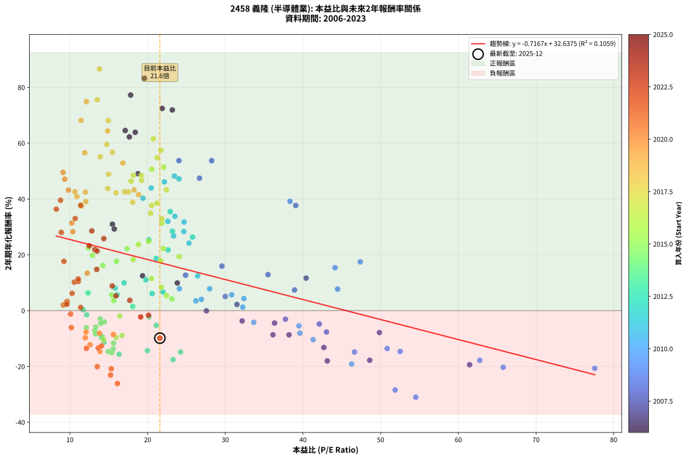
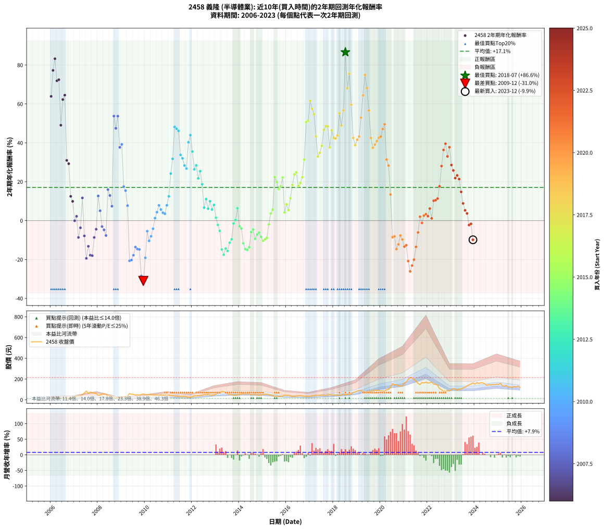

# 2458 義隆 - 本益比與未來報酬率分析

!!! info "報告資訊"
    - **股票代號**: 2458
    - **公司名稱**: 義隆
    - **產業別**: 半導體業
    - **分析期間**: 2006-2023 (216 個數據點)
    - **資料來源**: Type 12 (ShowMonthlyK_ChartFlow) 月收盤價與本益比
    - **報酬率口徑**: 含現金股利 (簡化: 年度合計，假設每年7/1入帳)
    - **報告生成時間**: 2026-01-22 22:56:13 CST

## 📈 視覺化圖表

### 圖表1: 本益比 vs 未來報酬率關係

*圖表1：2458 義隆 本益比與2年期未來報酬率關係 (2006-2023)*

### 圖表2: 歷年買入時點的2年期實際報酬率

*圖表2：2458 義隆 歷年買入時點的2年期實際報酬率 (2006-2023)*

## 📍 買點訊號說明

本報告提供兩種買點提示訊號（顯示於圖表2的股價子圖中）：

### ▲ 小綠色三角形（回測驗證）
- **計算方式**: 使用全部歷史資料計算本益比第25百分位數
- **用途**: 事後驗證，顯示歷史上哪些時點確實為低估區
- **限制**: 當下無法判斷，僅供回測參考
- **特性**: 後見之明（Look-Ahead Bias）

### ▲ 小橘色三角形（即時訊號）
- **計算方式**: 使用截至當月的過去5年資料計算本益比第25百分位數
- **用途**: 實際投資決策，當時即可判斷
- **優勢**: 可操作性強，符合實務需求
- **特性**: 無後見之明，滾動窗口計算

!!! tip "如何使用兩種訊號"
    - **綠色▲** 幫助理解歷史估值機會，驗證策略有效性
    - **橘色▲** 可作為實際買進參考，但仍需搭配基本面分析
    - 兩種訊號重疊時，表示即時判斷與事後驗證一致，信心度較高
    - 僅有綠色▲時，表示當時無法判斷（需要未來資料才能確認）
    - 僅有橘色▲時，表示即時判斷為買點，但事後可能不是最佳時機

## 📊 估值分析摘要

| 指標 | 數值 |
|:---:|:---:|
| **目前本益比** (2023-12) | **21.58 倍** |
| **歷史平均本益比** | 21.74 倍 |
| **估值水準** | 🟡 合理範圍 |
| **預期2年年化報酬率** | **+17.17%** |
| **歷史平均報酬率** | +17.06% |
| **相關係數 (R²)** | 0.1059 |
| **趨勢線斜率** | -0.7167 |

!!! abstract "核心洞察"
    目前本益比接近歷史平均，預期報酬率符合長期趨勢

    根據歷史數據回測，2458 義隆 在目前本益比 **21.6倍** 的估值水準下，
    預期未來2年年化報酬率約為 **+17.2%**。

    **重要提醒**: 本分析基於歷史數據統計，實際報酬率會受到公司基本面變化、產業趨勢、
    總體經濟環境等多重因素影響。R² = 0.11 表示本益比可解釋約 10.6% 的報酬率變異。

## 📈 歷史估值統計

### 最佳買點 (最高報酬率)

| 項目 | 數值 |
|:---:|:---:|
| 起始時間 | 2018-07 |
| 當時本益比 | 13.81 倍 |
| 起始價格 | 48.4 元 |
| 2年後價格 | 157.0 元 |
| **2年年化報酬率** | **+86.60%** |

### 最差買點 (最低報酬率)

| 項目 | 數值 |
|:---:|:---:|
| 起始時間 | 2009-12 |
| 當時本益比 | 54.52 倍 |
| 起始價格 | 56.7 元 |
| 2年後價格 | 24.6 元 |
| **2年年化報酬率** | **-31.01%** |

## 🎯 投資啟示

### 本益比與報酬率關係

趨勢線方程式: **y = -0.7167x + 32.6375**

!!! warning "強負相關"
    本益比與未來報酬率呈現強負相關。在高本益比時期買入，未來報酬率顯著較低；
    在低本益比時期買入，未來報酬率顯著較高。**估值紀律至關重要**。

### 估值區間建議

基於歷史數據分析:

- **🟢 低估區** (P/E < 17.4): 預期報酬率較高，可考慮增加持股
- **🟡 合理區** (P/E 17.4-26.1): 預期報酬率符合長期趨勢，正常持有
- **🔴 高估區** (P/E > 26.1): 預期報酬率較低，可考慮減碼或觀望

!!! danger "風險提示"
    - 過去表現不代表未來結果
    - 本分析假設公司基本面無重大結構性變化
    - 產業環境劇變可能使歷史規律失效
    - 應結合公司財報、產業趨勢、總體經濟等多重因素綜合判斷

!!! success "長期投資觀點"
    歷史數據顯示，在合理或低估的估值水準買入並長期持有，
    往往能獲得較佳的投資報酬。**耐心等待好價格**是價值投資的核心原則。

## 📊 數據品質

- **資料來源**: GoodInfo.tw Type 12 (ShowMonthlyK_ChartFlow)
- **資料頻率**: 月度收盤價與本益比
- **回測期間**: 2006-2023
- **數據點數量**: 216 個 (每個點代表一次2年期回測)

### 計算方法說明

1. **2年期年化報酬率**:
   - 對每個歷史時點，計算其後2年的實際投資報酬率
   - 期末價值(不含股利): 期末價格
   - 期末價值(含現金股利): 期末價格 + 持有期間內的現金股利合計 (簡化: 年度合計，假設每年7/1入帳)
   - 公式: 年化報酬率 = [(期末價值/期初價格)^(1/年數) - 1] × 100%

2. **本益比 (P/E Ratio)**:
   - 使用當時的月收盤價與EPS計算
   - 資料來源: Type 12 月度河流圖本益比數據

3. **趨勢線 (Linear Regression)**:
   - 使用最小平方法擬合線性趨勢線
   - R²值衡量本益比對報酬率的解釋能力

---

*本報告由 Stock Analysis System v1.9.0 自動生成*
*數據更新時間: 2026-01-22 22:56:13 CST*

## 📋 月度回測明細表

（每一列對應時間線圖中的一個買入點；可用來對照 SVG 圖上的每個點。）

| 買入月份 | 賣出月份 | 回測期限_年 | 實際持有年數 | 買入本益比_倍 | 買入收盤價_元 | 賣出收盤價_元 | 現金股利合計_元 | 總報酬率_pct | 年化報酬率_pct |
| --- | --- | --- | --- | --- | --- | --- | --- | --- | --- |
| 2006-01 | 2008-01 | 2 | 1.999 | 18.41 | 15.65 | 41.15 | 0.86 | +168.42 | +63.89 |
| 2006-02 | 2008-02 | 2 | 1.999 | 17.82 | 15.15 | 46.70 | 0.86 | +213.91 | +77.24 |
| 2006-03 | 2008-03 | 2 | 2.001 | 19.59 | 16.65 | 55.10 | 0.86 | +236.08 | +83.25 |
| 2006-04 | 2008-04 | 2 | 2.001 | 23.18 | 19.70 | 57.40 | 0.86 | +195.72 | +71.90 |
| 2006-05 | 2008-05 | 2 | 2.001 | 21.88 | 18.60 | 54.50 | 0.86 | +197.62 | +72.45 |
| 2006-06 | 2008-06 | 2 | 2.001 | 18.76 | 15.95 | 34.60 | 0.86 | +122.30 | +49.06 |
| 2006-07 | 2008-07 | 2 | 2.001 | 17.65 | 15.00 | 38.10 | 1.41 | +163.42 | +62.25 |
| 2006-08 | 2008-08 | 2 | 2.001 | 17.12 | 14.55 | 38.00 | 1.41 | +170.88 | +64.53 |
| 2006-09 | 2008-09 | 2 | 2.001 | 15.47 | 13.15 | 21.15 | 1.41 | +71.58 | +30.97 |
| 2006-10 | 2008-10 | 2 | 2.001 | 15.71 | 13.35 | 20.90 | 1.41 | +67.14 | +29.26 |
| 2006-11 | 2008-11 | 2 | 2.001 | 19.35 | 16.45 | 19.40 | 1.41 | +26.52 | +12.47 |
| 2006-12 | 2008-12 | 2 | 2.001 | 23.82 | 20.25 | 23.05 | 1.41 | +20.80 | +9.90 |
| 2007-01 | 2009-01 | 2 | 2.001 | 27.57 | 25.50 | 24.05 | 1.41 | -0.15 | -0.07 |
| 2007-02 | 2009-02 | 2 | 2.001 | 31.50 | 31.50 | 31.50 | 1.41 | +4.49 | +2.22 |
| 2007-03 | 2009-03 | 2 | 2.001 | 36.14 | 38.85 | 31.00 | 1.41 | -16.57 | -8.65 |
| 2007-04 | 2009-04 | 2 | 2.001 | 32.17 | 37.00 | 32.90 | 1.41 | -7.26 | -3.70 |
| 2007-05 | 2009-05 | 2 | 2.001 | 40.41 | 49.50 | 60.30 | 1.41 | +24.67 | +11.65 |
| 2007-06 | 2009-06 | 2 | 2.001 | 49.85 | 64.80 | 53.60 | 1.41 | -15.10 | -7.86 |
| 2007-07 | 2009-07 | 2 | 2.001 | 61.45 | 84.50 | 53.50 | 1.36 | -35.07 | -19.41 |
| 2007-08 | 2009-08 | 2 | 2.001 | 42.69 | 61.90 | 45.25 | 1.36 | -24.69 | -13.21 |
| 2007-09 | 2009-09 | 2 | 2.001 | 48.59 | 74.10 | 48.70 | 1.36 | -32.44 | -17.79 |
| 2007-10 | 2009-10 | 2 | 2.001 | 43.13 | 69.00 | 45.00 | 1.36 | -32.80 | -18.02 |
| 2007-11 | 2009-11 | 2 | 2.001 | 38.21 | 64.00 | 52.00 | 1.36 | -16.62 | -8.68 |
| 2007-12 | 2009-12 | 2 | 2.001 | 36.34 | 63.60 | 56.70 | 1.36 | -8.70 | -4.45 |
| 2008-01 | 2010-01 | 2 | 2.001 | 24.89 | 41.15 | 50.90 | 1.36 | +27.01 | +12.69 |
| 2008-02 | 2010-03 | 2 | 2.081 | 30.00 | 46.70 | 50.40 | 1.36 | +10.85 | +5.07 |
| 2008-03 | 2010-03 | 2 | 1.999 | 37.74 | 55.10 | 50.40 | 1.36 | -6.05 | -3.08 |
| 2008-04 | 2010-04 | 2 | 1.999 | 42.10 | 57.40 | 50.70 | 1.36 | -9.29 | -4.76 |
| 2008-05 | 2010-05 | 2 | 1.999 | 43.03 | 54.50 | 45.10 | 1.36 | -14.74 | -7.67 |
| 2008-06 | 2010-06 | 2 | 1.999 | 29.57 | 34.60 | 45.15 | 1.36 | +34.44 | +15.96 |
| 2008-07 | 2010-07 | 2 | 1.999 | 35.50 | 38.10 | 47.30 | 1.27 | +27.47 | +12.91 |
| 2008-08 | 2010-08 | 2 | 1.999 | 38.91 | 38.00 | 42.55 | 1.27 | +15.30 | +7.38 |
| 2008-09 | 2010-09 | 2 | 1.999 | 24.03 | 21.15 | 48.70 | 1.27 | +136.24 | +53.75 |
| 2008-10 | 2010-10 | 2 | 1.999 | 26.68 | 20.90 | 44.15 | 1.27 | +117.30 | +47.45 |
| 2008-11 | 2010-11 | 2 | 1.999 | 28.25 | 19.40 | 44.55 | 1.27 | +136.16 | +53.72 |
| 2008-12 | 2010-12 | 2 | 1.999 | 39.07 | 23.05 | 42.40 | 1.27 | +89.44 | +37.67 |
| 2009-01 | 2011-01 | 2 | 1.999 | 38.33 | 24.05 | 45.30 | 1.27 | +93.62 | +39.18 |
| 2009-02 | 2011-02 | 2 | 1.999 | 47.37 | 31.50 | 42.20 | 1.27 | +37.98 | +17.48 |
| 2009-03 | 2011-03 | 2 | 1.999 | 44.13 | 31.00 | 40.00 | 1.27 | +33.11 | +15.39 |
| 2009-04 | 2011-04 | 2 | 1.999 | 44.46 | 32.90 | 36.90 | 1.27 | +16.00 | +7.71 |
| 2009-05 | 2011-05 | 2 | 1.999 | 77.56 | 60.30 | 36.70 | 1.27 | -37.04 | -20.67 |
| 2009-06 | 2011-06 | 2 | 1.999 | 65.77 | 53.60 | 32.80 | 1.27 | -36.45 | -20.29 |
| 2009-07 | 2011-07 | 2 | 1.999 | 62.76 | 53.50 | 33.70 | 2.45 | -32.43 | -17.81 |
| 2009-08 | 2011-08 | 2 | 1.999 | 50.84 | 45.25 | 31.35 | 2.45 | -25.31 | -13.58 |
| 2009-09 | 2011-09 | 2 | 1.999 | 52.51 | 48.70 | 33.05 | 2.45 | -27.11 | -14.63 |
| 2009-10 | 2011-10 | 2 | 1.999 | 46.63 | 45.00 | 30.20 | 2.45 | -27.45 | -14.83 |
| 2009-11 | 2011-11 | 2 | 1.999 | 51.87 | 52.00 | 24.20 | 2.45 | -48.75 | -28.43 |
| 2009-12 | 2011-12 | 2 | 1.999 | 54.52 | 56.70 | 24.55 | 2.45 | -52.38 | -31.01 |
| 2010-01 | 2012-01 | 2 | 1.999 | 46.27 | 50.90 | 30.85 | 2.45 | -34.58 | -19.13 |
| 2010-02 | 2012-02 | 2 | 1.999 | 39.48 | 45.80 | 38.50 | 2.45 | -10.59 | -5.45 |
| 2010-03 | 2012-03 | 2 | 2.001 | 41.31 | 50.40 | 38.00 | 2.45 | -19.75 | -10.41 |
| 2010-04 | 2012-04 | 2 | 2.001 | 39.61 | 50.70 | 40.40 | 2.45 | -15.49 | -8.06 |
| 2010-05 | 2012-05 | 2 | 2.001 | 33.66 | 45.10 | 38.95 | 2.45 | -8.21 | -4.19 |
| 2010-06 | 2012-06 | 2 | 2.001 | 32.25 | 45.15 | 43.85 | 2.45 | +2.54 | +1.26 |
| 2010-07 | 2012-07 | 2 | 2.001 | 32.40 | 47.30 | 48.90 | 2.59 | +8.86 | +4.33 |
| 2010-08 | 2012-08 | 2 | 2.001 | 27.99 | 42.55 | 46.90 | 2.59 | +16.31 | +7.84 |
| 2010-09 | 2012-09 | 2 | 2.001 | 30.82 | 48.70 | 51.80 | 2.59 | +11.69 | +5.68 |
| 2010-10 | 2012-10 | 2 | 2.001 | 26.92 | 44.15 | 45.20 | 2.59 | +8.25 | +4.04 |
| 2010-11 | 2012-11 | 2 | 2.001 | 26.21 | 44.55 | 45.15 | 2.59 | +7.16 | +3.52 |
| 2010-12 | 2012-12 | 2 | 2.001 | 24.09 | 42.40 | 46.75 | 2.59 | +16.37 | +7.87 |
| 2011-01 | 2013-01 | 2 | 2.001 | 26.44 | 45.30 | 54.70 | 2.59 | +26.47 | +12.45 |
| 2011-02 | 2013-02 | 2 | 2.001 | 25.32 | 42.20 | 62.50 | 2.59 | +54.24 | +24.18 |
| 2011-03 | 2013-03 | 2 | 2.001 | 24.69 | 40.00 | 66.90 | 2.59 | +73.73 | +31.78 |
| 2011-04 | 2013-04 | 2 | 2.001 | 23.45 | 36.90 | 78.50 | 2.59 | +119.76 | +48.20 |
| 2011-05 | 2013-05 | 2 | 2.001 | 24.04 | 36.70 | 77.00 | 2.59 | +116.87 | +47.23 |
| 2011-06 | 2013-06 | 2 | 2.001 | 22.16 | 32.80 | 67.50 | 2.59 | +113.69 | +46.14 |
| 2011-07 | 2013-07 | 2 | 2.001 | 23.51 | 33.70 | 56.30 | 4.05 | +79.07 | +33.79 |
| 2011-08 | 2013-08 | 2 | 2.001 | 22.61 | 31.35 | 50.60 | 4.05 | +74.31 | +32.00 |
| 2011-09 | 2013-09 | 2 | 2.001 | 24.66 | 33.05 | 50.40 | 4.05 | +64.74 | +28.33 |
| 2011-10 | 2013-10 | 2 | 2.001 | 23.35 | 30.20 | 44.50 | 4.05 | +60.75 | +26.77 |
| 2011-11 | 2013-11 | 2 | 2.001 | 19.41 | 24.20 | 43.60 | 4.05 | +96.89 | +40.28 |
| 2011-12 | 2013-12 | 2 | 2.001 | 20.46 | 24.55 | 46.85 | 4.05 | +107.32 | +43.95 |
| 2012-01 | 2014-01 | 2 | 2.001 | 22.91 | 30.85 | 52.60 | 4.05 | +83.62 | +35.48 |
| 2012-02 | 2014-03 | 2 | 2.081 | 25.79 | 38.50 | 58.60 | 4.05 | +62.72 | +26.36 |
| 2012-03 | 2014-03 | 2 | 1.999 | 23.19 | 38.00 | 58.60 | 4.05 | +64.86 | +28.42 |
| 2012-04 | 2014-04 | 2 | 1.999 | 22.63 | 40.40 | 55.80 | 4.05 | +48.14 | +21.73 |
| 2012-05 | 2014-05 | 2 | 1.999 | 20.16 | 38.95 | 57.20 | 4.05 | +57.25 | +25.42 |
| 2012-06 | 2014-06 | 2 | 1.999 | 21.10 | 43.85 | 57.70 | 4.05 | +40.81 | +18.68 |
| 2012-07 | 2014-07 | 2 | 1.999 | 21.98 | 48.90 | 49.10 | 6.53 | +13.77 | +6.67 |
| 2012-08 | 2014-08 | 2 | 1.999 | 19.78 | 46.90 | 51.30 | 6.53 | +23.31 | +11.05 |
| 2012-09 | 2014-09 | 2 | 1.999 | 20.58 | 51.80 | 51.80 | 6.53 | +12.61 | +6.12 |
| 2012-10 | 2014-10 | 2 | 1.999 | 16.97 | 45.20 | 48.10 | 6.53 | +20.87 | +9.95 |
| 2012-11 | 2014-11 | 2 | 1.999 | 16.07 | 45.15 | 43.90 | 6.53 | +11.70 | +5.69 |
| 2012-12 | 2014-12 | 2 | 1.999 | 15.82 | 46.75 | 48.05 | 6.53 | +16.76 | +8.06 |
| 2013-01 | 2015-01 | 2 | 1.999 | 18.08 | 54.70 | 49.80 | 6.53 | +2.99 | +1.48 |
| 2013-02 | 2015-02 | 2 | 1.999 | 20.18 | 62.50 | 53.20 | 6.53 | -4.43 | -2.24 |
| 2013-03 | 2015-03 | 2 | 1.999 | 21.12 | 66.90 | 53.50 | 6.53 | -10.26 | -5.27 |
| 2013-04 | 2015-04 | 2 | 1.999 | 24.25 | 78.50 | 50.40 | 6.53 | -27.47 | -14.85 |
| 2013-05 | 2015-05 | 2 | 1.999 | 23.28 | 77.00 | 45.80 | 6.53 | -32.03 | -17.57 |
| 2013-06 | 2015-06 | 2 | 1.999 | 19.98 | 67.50 | 43.00 | 6.53 | -26.62 | -14.34 |
| 2013-07 | 2015-07 | 2 | 1.999 | 16.33 | 56.30 | 32.90 | 7.19 | -28.80 | -15.63 |
| 2013-08 | 2015-08 | 2 | 1.999 | 14.38 | 50.60 | 32.55 | 7.19 | -21.47 | -11.39 |
| 2013-09 | 2015-09 | 2 | 1.999 | 14.04 | 50.40 | 34.00 | 7.19 | -18.28 | -9.61 |
| 2013-10 | 2015-10 | 2 | 1.999 | 12.16 | 44.50 | 36.00 | 7.19 | -2.95 | -1.49 |
| 2013-11 | 2015-11 | 2 | 1.999 | 11.69 | 43.60 | 36.70 | 7.19 | +0.66 | +0.33 |
| 2013-12 | 2015-12 | 2 | 1.999 | 12.33 | 46.85 | 45.80 | 7.19 | +13.10 | +6.35 |
| 2014-01 | 2016-01 | 2 | 1.999 | 13.90 | 52.60 | 42.40 | 7.19 | -5.73 | -2.91 |
| 2014-02 | 2016-02 | 2 | 1.999 | 14.44 | 54.40 | 42.90 | 7.19 | -7.93 | -4.05 |
| 2014-03 | 2016-03 | 2 | 2.001 | 15.62 | 58.60 | 38.50 | 7.19 | -22.03 | -11.69 |
| 2014-04 | 2016-04 | 2 | 2.001 | 14.93 | 55.80 | 33.45 | 7.19 | -27.17 | -14.65 |
| 2014-05 | 2016-05 | 2 | 2.001 | 15.37 | 57.20 | 34.05 | 7.19 | -27.91 | -15.08 |
| 2014-06 | 2016-06 | 2 | 2.001 | 15.57 | 57.70 | 35.75 | 7.19 | -25.58 | -13.73 |
| 2014-07 | 2016-07 | 2 | 2.001 | 13.31 | 49.10 | 37.80 | 5.69 | -11.43 | -5.88 |
| 2014-08 | 2016-08 | 2 | 2.001 | 13.97 | 51.30 | 41.05 | 5.69 | -8.89 | -4.54 |
| 2014-09 | 2016-09 | 2 | 2.001 | 14.16 | 51.80 | 36.85 | 5.69 | -17.88 | -9.37 |
| 2014-10 | 2016-10 | 2 | 2.001 | 13.21 | 48.10 | 35.75 | 5.69 | -13.85 | -7.18 |
| 2014-11 | 2016-11 | 2 | 2.001 | 12.11 | 43.90 | 32.95 | 5.69 | -11.98 | -6.18 |
| 2014-12 | 2016-12 | 2 | 2.001 | 13.31 | 48.05 | 34.65 | 5.69 | -16.05 | -8.37 |
| 2015-01 | 2017-01 | 2 | 2.001 | 14.33 | 49.80 | 34.30 | 5.69 | -19.70 | -10.38 |
| 2015-02 | 2017-02 | 2 | 2.001 | 15.94 | 53.20 | 37.75 | 5.69 | -18.35 | -9.63 |
| 2015-03 | 2017-03 | 2 | 2.001 | 16.71 | 53.50 | 38.70 | 5.69 | -17.03 | -8.91 |
| 2015-04 | 2017-04 | 2 | 2.001 | 16.43 | 50.40 | 42.75 | 5.69 | -3.89 | -1.96 |
| 2015-05 | 2017-05 | 2 | 2.001 | 15.63 | 45.80 | 43.50 | 5.69 | +7.40 | +3.63 |
| 2015-06 | 2017-06 | 2 | 2.001 | 15.38 | 43.00 | 42.30 | 5.69 | +11.60 | +5.64 |
| 2015-07 | 2017-07 | 2 | 2.001 | 12.37 | 32.90 | 45.75 | 3.60 | +50.01 | +22.46 |
| 2015-08 | 2017-08 | 2 | 2.001 | 12.90 | 32.55 | 43.15 | 3.60 | +43.63 | +19.83 |
| 2015-09 | 2017-09 | 2 | 2.001 | 14.24 | 34.00 | 42.30 | 3.60 | +35.01 | +16.18 |
| 2015-10 | 2017-10 | 2 | 2.001 | 15.99 | 36.00 | 46.25 | 3.60 | +38.48 | +17.66 |
| 2015-11 | 2017-11 | 2 | 2.001 | 17.35 | 36.70 | 51.20 | 3.60 | +49.32 | +22.18 |
| 2015-12 | 2017-12 | 2 | 2.001 | 23.13 | 45.80 | 46.10 | 3.60 | +8.52 | +4.17 |
| 2016-01 | 2018-01 | 2 | 2.001 | 21.79 | 42.40 | 46.20 | 3.60 | +17.46 | +8.37 |
| 2016-02 | 2018-03 | 2 | 2.081 | 22.44 | 42.90 | 44.25 | 3.60 | +11.54 | +5.39 |
| 2016-03 | 2018-03 | 2 | 1.999 | 20.51 | 38.50 | 44.25 | 3.60 | +24.29 | +11.49 |
| 2016-04 | 2018-04 | 2 | 1.999 | 18.15 | 33.45 | 43.20 | 3.60 | +39.92 | +18.30 |
| 2016-05 | 2018-05 | 2 | 1.999 | 18.82 | 34.05 | 48.50 | 3.60 | +53.02 | +23.72 |
| 2016-06 | 2018-06 | 2 | 1.999 | 20.14 | 35.75 | 52.10 | 3.60 | +55.81 | +24.84 |
| 2016-07 | 2018-07 | 2 | 1.999 | 21.71 | 37.80 | 48.35 | 4.15 | +38.89 | +17.86 |
| 2016-08 | 2018-08 | 2 | 1.999 | 24.05 | 41.05 | 54.30 | 4.15 | +42.39 | +19.34 |
| 2016-09 | 2018-09 | 2 | 1.999 | 22.03 | 36.85 | 50.90 | 4.15 | +49.39 | +22.24 |
| 2016-10 | 2018-10 | 2 | 1.999 | 21.82 | 35.75 | 57.50 | 4.15 | +72.45 | +31.34 |
| 2016-11 | 2018-11 | 2 | 1.999 | 20.54 | 32.95 | 70.60 | 4.15 | +126.86 | +50.66 |
| 2016-12 | 2018-12 | 2 | 1.999 | 22.07 | 34.65 | 75.20 | 4.15 | +129.00 | +51.37 |
| 2017-01 | 2019-01 | 2 | 1.999 | 20.74 | 34.30 | 85.30 | 4.15 | +160.79 | +61.54 |
| 2017-02 | 2019-02 | 2 | 1.999 | 21.72 | 37.75 | 89.40 | 4.15 | +147.81 | +57.47 |
| 2017-03 | 2019-03 | 2 | 1.999 | 21.23 | 38.70 | 88.50 | 4.15 | +139.41 | +54.77 |
| 2017-04 | 2019-04 | 2 | 1.999 | 22.42 | 42.75 | 83.60 | 4.15 | +105.26 | +43.31 |
| 2017-05 | 2019-05 | 2 | 1.999 | 21.85 | 43.50 | 72.70 | 4.15 | +76.67 | +32.94 |
| 2017-06 | 2019-06 | 2 | 1.999 | 20.39 | 42.30 | 72.80 | 4.15 | +81.91 | +34.90 |
| 2017-07 | 2019-07 | 2 | 1.999 | 21.19 | 45.75 | 80.10 | 7.58 | +91.65 | +38.47 |
| 2017-08 | 2019-08 | 2 | 1.999 | 19.23 | 43.15 | 85.20 | 7.58 | +115.02 | +46.67 |
| 2017-09 | 2019-09 | 2 | 1.999 | 18.17 | 42.30 | 85.70 | 7.58 | +120.52 | +48.54 |
| 2017-10 | 2019-10 | 2 | 1.999 | 19.18 | 46.25 | 94.30 | 7.58 | +120.28 | +48.46 |
| 2017-11 | 2019-11 | 2 | 1.999 | 20.51 | 51.20 | 89.40 | 7.58 | +89.41 | +37.66 |
| 2017-12 | 2019-12 | 2 | 1.999 | 17.87 | 46.10 | 91.20 | 7.58 | +114.27 | +46.42 |
| 2018-01 | 2020-01 | 2 | 1.999 | 17.04 | 46.20 | 86.30 | 7.58 | +103.20 | +42.58 |
| 2018-02 | 2020-02 | 2 | 1.999 | 15.93 | 45.30 | 84.00 | 7.58 | +102.16 | +42.22 |
| 2018-03 | 2020-03 | 2 | 2.001 | 14.87 | 44.25 | 83.90 | 7.58 | +106.73 | +43.75 |
| 2018-04 | 2020-04 | 2 | 2.001 | 13.91 | 43.20 | 96.50 | 7.58 | +140.93 | +55.17 |
| 2018-05 | 2020-05 | 2 | 2.001 | 14.98 | 48.50 | 100.00 | 7.58 | +121.81 | +48.89 |
| 2018-06 | 2020-06 | 2 | 2.001 | 15.46 | 52.10 | 120.50 | 7.58 | +145.83 | +56.74 |
| 2018-07 | 2020-07 | 2 | 2.001 | 13.81 | 48.35 | 157.00 | 11.50 | +248.50 | +86.60 |
| 2018-08 | 2020-08 | 2 | 2.001 | 14.94 | 54.30 | 142.00 | 11.50 | +182.69 | +68.07 |
| 2018-09 | 2020-09 | 2 | 2.001 | 13.52 | 50.90 | 145.50 | 11.50 | +208.45 | +75.56 |
| 2018-10 | 2020-10 | 2 | 2.001 | 14.76 | 57.50 | 135.00 | 11.50 | +154.78 | +59.57 |
| 2018-11 | 2020-11 | 2 | 2.001 | 17.53 | 70.60 | 132.00 | 11.50 | +103.26 | +42.53 |
| 2018-12 | 2020-12 | 2 | 2.001 | 18.08 | 75.20 | 133.50 | 11.50 | +92.82 | +38.83 |
| 2019-01 | 2021-01 | 2 | 2.001 | 18.84 | 85.30 | 159.50 | 11.50 | +100.47 | +41.55 |
| 2019-02 | 2021-02 | 2 | 2.001 | 18.26 | 89.40 | 172.00 | 11.50 | +105.26 | +43.23 |
| 2019-03 | 2021-03 | 2 | 2.001 | 16.82 | 88.50 | 195.50 | 11.50 | +133.90 | +52.89 |
| 2019-04 | 2021-04 | 2 | 2.001 | 14.85 | 83.60 | 214.50 | 11.50 | +170.33 | +64.36 |
| 2019-05 | 2021-05 | 2 | 2.001 | 12.12 | 72.70 | 211.00 | 11.50 | +206.05 | +74.88 |
| 2019-06 | 2021-06 | 2 | 2.001 | 11.44 | 72.80 | 194.50 | 11.50 | +182.97 | +68.16 |
| 2019-07 | 2021-07 | 2 | 2.001 | 11.90 | 80.10 | 181.00 | 15.50 | +145.32 | +56.58 |
| 2019-08 | 2021-08 | 2 | 2.001 | 12.00 | 85.20 | 157.50 | 15.50 | +103.05 | +42.46 |
| 2019-09 | 2021-09 | 2 | 2.001 | 11.48 | 85.70 | 146.50 | 15.50 | +89.03 | +37.46 |
| 2019-10 | 2021-10 | 2 | 2.001 | 12.04 | 94.30 | 167.00 | 15.50 | +93.53 | +39.08 |
| 2019-11 | 2021-11 | 2 | 2.001 | 10.90 | 89.40 | 162.00 | 15.50 | +98.55 | +40.87 |
| 2019-12 | 2021-12 | 2 | 2.001 | 10.64 | 91.20 | 170.00 | 15.50 | +103.40 | +42.58 |
| 2020-01 | 2022-01 | 2 | 2.001 | 9.82 | 86.30 | 161.50 | 15.50 | +105.10 | +43.18 |
| 2020-02 | 2022-03 | 2 | 2.081 | 9.34 | 84.00 | 172.00 | 15.50 | +123.21 | +47.09 |
| 2020-03 | 2022-03 | 2 | 1.999 | 9.11 | 83.90 | 172.00 | 15.50 | +123.48 | +49.53 |
| 2020-04 | 2022-04 | 2 | 1.999 | 10.24 | 96.50 | 151.00 | 15.50 | +72.54 | +31.38 |
| 2020-05 | 2022-05 | 2 | 1.999 | 10.37 | 100.00 | 149.00 | 15.50 | +64.50 | +28.28 |
| 2020-06 | 2022-06 | 2 | 1.999 | 12.23 | 120.50 | 139.50 | 15.50 | +28.63 | +13.43 |
| 2020-07 | 2022-07 | 2 | 1.999 | 15.59 | 157.00 | 108.50 | 22.81 | -16.36 | -8.55 |
| 2020-08 | 2022-08 | 2 | 1.999 | 13.81 | 142.00 | 97.10 | 22.81 | -15.56 | -8.11 |
| 2020-09 | 2022-09 | 2 | 1.999 | 13.86 | 145.50 | 83.20 | 22.81 | -27.14 | -14.65 |
| 2020-10 | 2022-10 | 2 | 1.999 | 12.60 | 135.00 | 81.20 | 22.81 | -22.96 | -12.23 |
| 2020-11 | 2022-11 | 2 | 1.999 | 12.08 | 132.00 | 89.70 | 22.81 | -14.77 | -7.68 |
| 2020-12 | 2022-12 | 2 | 1.999 | 11.98 | 133.50 | 86.00 | 22.81 | -18.49 | -9.73 |
| 2021-01 | 2023-01 | 2 | 1.999 | 13.65 | 159.50 | 96.90 | 22.81 | -24.95 | -13.38 |
| 2021-02 | 2023-02 | 2 | 1.999 | 14.07 | 172.00 | 108.50 | 22.81 | -23.66 | -12.63 |
| 2021-03 | 2023-03 | 2 | 1.999 | 15.32 | 195.50 | 99.80 | 22.81 | -37.28 | -20.82 |
| 2021-04 | 2023-04 | 2 | 1.999 | 16.12 | 214.50 | 94.30 | 22.81 | -45.40 | -26.13 |
| 2021-05 | 2023-05 | 2 | 1.999 | 15.24 | 211.00 | 102.00 | 22.81 | -40.85 | -23.10 |
| 2021-06 | 2023-06 | 2 | 1.999 | 13.52 | 194.50 | 101.50 | 22.81 | -36.09 | -20.07 |
| 2021-07 | 2023-07 | 2 | 1.999 | 12.12 | 181.00 | 116.50 | 18.93 | -25.18 | -13.51 |
| 2021-08 | 2023-08 | 2 | 1.999 | 10.18 | 157.50 | 120.00 | 18.93 | -11.79 | -6.09 |
| 2021-09 | 2023-09 | 2 | 1.999 | 9.15 | 146.50 | 133.50 | 18.93 | +4.04 | +2.00 |
| 2021-10 | 2023-10 | 2 | 1.999 | 10.09 | 167.00 | 144.00 | 18.93 | -2.44 | -1.23 |
| 2021-11 | 2023-11 | 2 | 1.999 | 9.47 | 162.00 | 151.50 | 18.93 | +5.20 | +2.57 |
| 2021-12 | 2023-12 | 2 | 1.999 | 9.64 | 170.00 | 162.50 | 18.93 | +6.72 | +3.31 |
| 2022-01 | 2024-01 | 2 | 1.999 | 9.61 | 161.50 | 150.00 | 18.93 | +4.60 | +2.27 |
| 2022-02 | 2024-02 | 2 | 1.999 | 10.28 | 164.00 | 166.00 | 18.93 | +12.76 | +6.19 |
| 2022-03 | 2024-03 | 2 | 2.001 | 11.38 | 172.00 | 157.00 | 18.93 | +2.28 | +1.13 |
| 2022-04 | 2024-04 | 2 | 2.001 | 10.57 | 151.00 | 164.50 | 18.93 | +21.47 | +10.21 |
| 2022-05 | 2024-05 | 2 | 2.001 | 11.09 | 149.00 | 163.00 | 18.93 | +22.10 | +10.49 |
| 2022-06 | 2024-06 | 2 | 2.001 | 11.07 | 139.50 | 154.00 | 18.93 | +23.96 | +11.33 |
| 2022-07 | 2024-07 | 2 | 2.001 | 9.23 | 108.50 | 138.00 | 12.24 | +38.47 | +17.66 |
| 2022-08 | 2024-08 | 2 | 2.001 | 8.89 | 97.10 | 147.00 | 12.24 | +63.99 | +28.04 |
| 2022-09 | 2024-09 | 2 | 2.001 | 8.25 | 83.20 | 142.50 | 12.24 | +85.98 | +36.35 |
| 2022-10 | 2024-10 | 2 | 2.001 | 8.79 | 81.20 | 146.00 | 12.24 | +94.87 | +39.57 |
| 2022-11 | 2024-11 | 2 | 2.001 | 10.68 | 89.70 | 146.50 | 12.24 | +76.96 | +33.00 |
| 2022-12 | 2024-12 | 2 | 2.001 | 11.38 | 86.00 | 151.00 | 12.24 | +89.81 | +37.74 |
| 2023-01 | 2025-01 | 2 | 2.001 | 12.82 | 96.90 | 148.00 | 12.24 | +65.36 | +28.57 |
| 2023-02 | 2025-02 | 2 | 2.001 | 14.36 | 108.50 | 159.50 | 12.24 | +58.28 | +25.79 |
| 2023-03 | 2025-03 | 2 | 2.001 | 13.21 | 99.80 | 136.00 | 12.24 | +48.53 | +21.86 |
| 2023-04 | 2025-04 | 2 | 2.001 | 12.49 | 94.30 | 131.00 | 12.24 | +51.90 | +23.23 |
| 2023-05 | 2025-05 | 2 | 2.001 | 13.51 | 102.00 | 138.00 | 12.24 | +47.29 | +21.35 |
| 2023-06 | 2025-06 | 2 | 2.001 | 13.45 | 101.50 | 121.50 | 12.24 | +31.76 | +14.78 |
| 2023-07 | 2025-07 | 2 | 2.001 | 15.45 | 116.50 | 124.50 | 13.53 | +18.48 | +8.84 |
| 2023-08 | 2025-08 | 2 | 2.001 | 15.92 | 120.00 | 119.50 | 13.53 | +10.86 | +5.29 |
| 2023-09 | 2025-09 | 2 | 2.001 | 17.71 | 133.50 | 130.00 | 13.53 | +7.51 | +3.69 |
| 2023-10 | 2025-10 | 2 | 2.001 | 19.11 | 144.00 | 124.00 | 13.53 | -4.49 | -2.27 |
| 2023-11 | 2025-11 | 2 | 2.001 | 20.11 | 151.50 | 133.00 | 13.53 | -3.28 | -1.65 |
| 2023-12 | 2025-12 | 2 | 2.001 | 21.58 | 162.50 | 118.50 | 13.53 | -18.75 | -9.86 |
