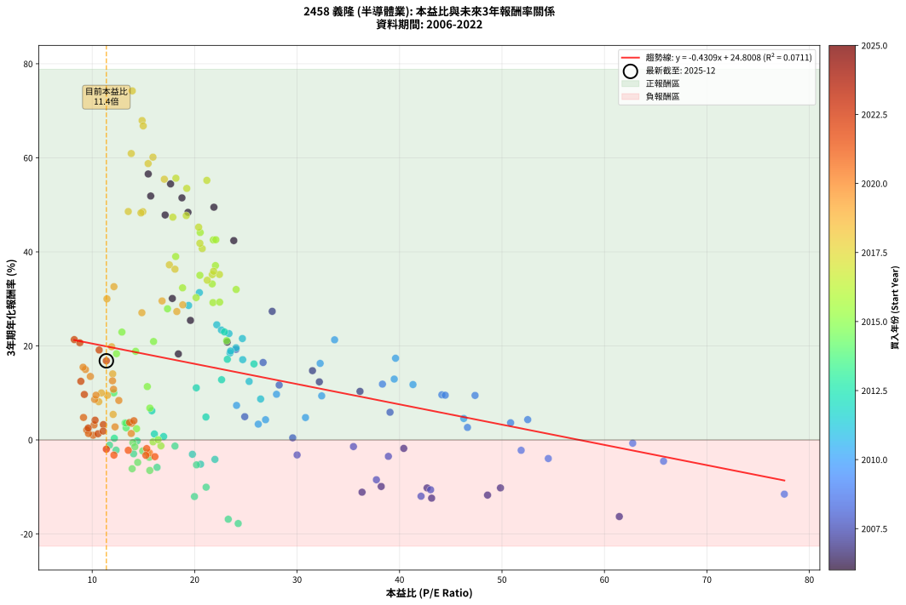
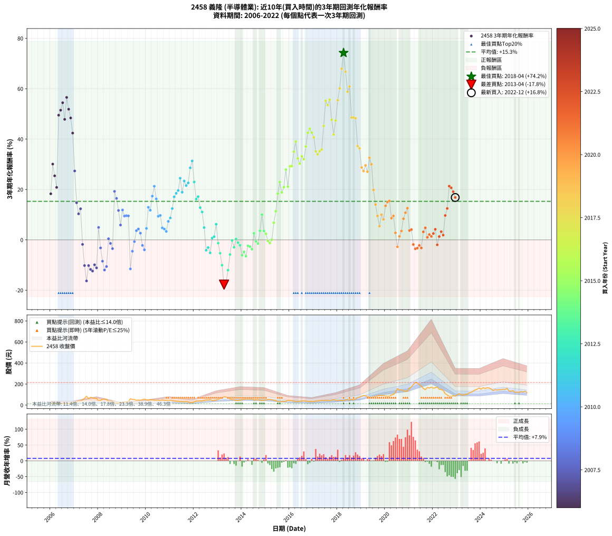

# 2458 義隆 - 本益比與未來報酬率分析

!!! info "報告資訊"
    - **股票代號**: 2458
    - **公司名稱**: 義隆
    - **產業別**: 半導體業
    - **分析期間**: 2006-2022 (204 個數據點)
    - **資料來源**: Type 12 (ShowMonthlyK_ChartFlow) 月收盤價與本益比
    - **報酬率口徑**: 含現金股利 (簡化: 年度合計，假設每年7/1入帳)
    - **報告生成時間**: 2026-01-10 20:48:54 CST

## 📈 視覺化圖表

### 圖表1: 本益比 vs 未來報酬率關係

*圖表1：2458 義隆 本益比與3年期未來報酬率關係 (2006-2022)*

### 圖表2: 歷年買入時點的3年期實際報酬率

*圖表2：2458 義隆 歷年買入時點的3年期實際報酬率 (2006-2022)*

## 📍 買點訊號說明

本報告提供兩種買點提示訊號（顯示於圖表2的股價子圖中）：

### ▲ 小綠色三角形（回測驗證）
- **計算方式**: 使用全部歷史資料計算本益比第25百分位數
- **用途**: 事後驗證，顯示歷史上哪些時點確實為低估區
- **限制**: 當下無法判斷，僅供回測參考
- **特性**: 後見之明（Look-Ahead Bias）

### ▲ 小橘色三角形（即時訊號）
- **計算方式**: 使用截至當月的過去5年資料計算本益比第25百分位數
- **用途**: 實際投資決策，當時即可判斷
- **優勢**: 可操作性強，符合實務需求
- **特性**: 無後見之明，滾動窗口計算

!!! tip "如何使用兩種訊號"
    - **綠色▲** 幫助理解歷史估值機會，驗證策略有效性
    - **橘色▲** 可作為實際買進參考，但仍需搭配基本面分析
    - 兩種訊號重疊時，表示即時判斷與事後驗證一致，信心度較高
    - 僅有綠色▲時，表示當時無法判斷（需要未來資料才能確認）
    - 僅有橘色▲時，表示即時判斷為買點，但事後可能不是最佳時機

## 📊 估值分析摘要

| 指標 | 數值 |
|:---:|:---:|
| **目前本益比** (2022-12) | **11.38 倍** |
| **歷史平均本益比** | 22.08 倍 |
| **估值水準** | 🟢 相對低估 |
| **預期3年年化報酬率** | **+19.90%** |
| **歷史平均報酬率** | +15.28% |
| **相關係數 (R²)** | 0.0711 |
| **趨勢線斜率** | -0.4309 |

!!! abstract "核心洞察"
    目前本益比顯著低於歷史平均，預期未來報酬率可能較高

    根據歷史數據回測，2458 義隆 在目前本益比 **11.4倍** 的估值水準下，
    預期未來3年年化報酬率約為 **+19.9%**。

    **重要提醒**: 本分析基於歷史數據統計，實際報酬率會受到公司基本面變化、產業趨勢、
    總體經濟環境等多重因素影響。R² = 0.07 表示本益比可解釋約 7.1% 的報酬率變異。

## 📈 歷史估值統計

### 最佳買點 (最高報酬率)

| 項目 | 數值 |
|:---:|:---:|
| 起始時間 | 2018-04 |
| 當時本益比 | 13.91 倍 |
| 起始價格 | 43.2 元 |
| 3年後價格 | 214.5 元 |
| **3年年化報酬率** | **+74.23%** |

### 最差買點 (最低報酬率)

| 項目 | 數值 |
|:---:|:---:|
| 起始時間 | 2013-04 |
| 當時本益比 | 24.25 倍 |
| 起始價格 | 78.5 元 |
| 3年後價格 | 33.5 元 |
| **3年年化報酬率** | **-17.77%** |

## 🎯 投資啟示

### 本益比與報酬率關係

趨勢線方程式: **y = -0.4309x + 24.8008**

!!! note "負相關"
    本益比與未來報酬率呈現負相關。較低的本益比通常帶來較高的未來報酬率，
    但相關性不算非常強。**估值仍是重要參考指標之一**。

### 估值區間建議

基於歷史數據分析:

- **🟢 低估區** (P/E < 17.7): 預期報酬率較高，可考慮增加持股
- **🟡 合理區** (P/E 17.7-26.5): 預期報酬率符合長期趨勢，正常持有
- **🔴 高估區** (P/E > 26.5): 預期報酬率較低，可考慮減碼或觀望

!!! danger "風險提示"
    - 過去表現不代表未來結果
    - 本分析假設公司基本面無重大結構性變化
    - 產業環境劇變可能使歷史規律失效
    - 應結合公司財報、產業趨勢、總體經濟等多重因素綜合判斷

!!! success "長期投資觀點"
    歷史數據顯示，在合理或低估的估值水準買入並長期持有，
    往往能獲得較佳的投資報酬。**耐心等待好價格**是價值投資的核心原則。

## 📊 數據品質

- **資料來源**: GoodInfo.tw Type 12 (ShowMonthlyK_ChartFlow)
- **資料頻率**: 月度收盤價與本益比
- **回測期間**: 2006-2022
- **數據點數量**: 204 個 (每個點代表一次3年期回測)

### 計算方法說明

1. **3年期年化報酬率**:
   - 對每個歷史時點，計算其後3年的實際投資報酬率
   - 期末價值(不含股利): 期末價格
   - 期末價值(含現金股利): 期末價格 + 持有期間內的現金股利合計 (簡化: 年度合計，假設每年7/1入帳)
   - 公式: 年化報酬率 = [(期末價值/期初價格)^(1/年數) - 1] × 100%

2. **本益比 (P/E Ratio)**:
   - 使用當時的月收盤價與EPS計算
   - 資料來源: Type 12 月度河流圖本益比數據

3. **趨勢線 (Linear Regression)**:
   - 使用最小平方法擬合線性趨勢線
   - R²值衡量本益比對報酬率的解釋能力

---

*本報告由 Stock Analysis System v1.9.0 自動生成*
*數據更新時間: 2026-01-10 20:48:54 CST*

## 📋 月度回測明細表

（每一列對應時間線圖中的一個買入點；可用來對照 SVG 圖上的每個點。）

| 買入月份 | 賣出月份 | 回測期限_年 | 實際持有年數 | 買入本益比_倍 | 買入收盤價_元 | 賣出收盤價_元 | 現金股利合計_元 | 總報酬率_pct | 年化報酬率_pct |
| --- | --- | --- | --- | --- | --- | --- | --- | --- | --- |
| 2006-01 | 2009-01 | 3 | 3.001 | 18.41 | 15.65 | 24.05 | 1.86 | +65.54 | +18.29 |
| 2006-02 | 2009-02 | 3 | 3.001 | 17.82 | 15.15 | 31.50 | 1.86 | +120.18 | +30.09 |
| 2006-03 | 2009-03 | 3 | 3.001 | 19.59 | 16.65 | 31.00 | 1.86 | +97.34 | +25.42 |
| 2006-04 | 2009-04 | 3 | 3.001 | 23.18 | 19.70 | 32.90 | 1.86 | +76.43 | +20.83 |
| 2006-05 | 2009-05 | 3 | 3.001 | 21.88 | 18.60 | 60.30 | 1.86 | +234.18 | +49.49 |
| 2006-06 | 2009-06 | 3 | 3.001 | 18.76 | 15.95 | 53.60 | 1.86 | +247.69 | +51.48 |
| 2006-07 | 2009-07 | 3 | 3.001 | 17.65 | 15.00 | 53.50 | 1.78 | +268.52 | +54.45 |
| 2006-08 | 2009-08 | 3 | 3.001 | 17.12 | 14.55 | 45.25 | 1.78 | +223.22 | +47.84 |
| 2006-09 | 2009-09 | 3 | 3.001 | 15.47 | 13.15 | 48.70 | 1.78 | +283.86 | +56.56 |
| 2006-10 | 2009-10 | 3 | 3.001 | 15.71 | 13.35 | 45.00 | 1.78 | +250.40 | +51.87 |
| 2006-11 | 2009-11 | 3 | 3.001 | 19.35 | 16.45 | 52.00 | 1.78 | +226.92 | +48.40 |
| 2006-12 | 2009-12 | 3 | 3.001 | 23.82 | 20.25 | 56.70 | 1.78 | +188.78 | +42.39 |
| 2007-01 | 2010-01 | 3 | 3.001 | 27.57 | 25.50 | 50.90 | 1.78 | +106.58 | +27.35 |
| 2007-02 | 2010-02 | 3 | 3.001 | 31.50 | 31.50 | 45.80 | 1.78 | +51.04 | +14.73 |
| 2007-03 | 2010-03 | 3 | 3.001 | 36.14 | 38.85 | 50.40 | 1.78 | +34.31 | +10.33 |
| 2007-04 | 2010-04 | 3 | 3.001 | 32.17 | 37.00 | 50.70 | 1.78 | +41.83 | +12.35 |
| 2007-05 | 2010-05 | 3 | 3.001 | 40.41 | 49.50 | 45.10 | 1.78 | -5.30 | -1.80 |
| 2007-06 | 2010-06 | 3 | 3.001 | 49.85 | 64.80 | 45.15 | 1.78 | -27.58 | -10.20 |
| 2007-07 | 2010-07 | 3 | 3.001 | 61.45 | 84.50 | 47.30 | 2.27 | -41.34 | -16.29 |
| 2007-08 | 2010-08 | 3 | 3.001 | 42.69 | 61.90 | 42.55 | 2.27 | -27.60 | -10.20 |
| 2007-09 | 2010-09 | 3 | 3.001 | 48.59 | 74.10 | 48.70 | 2.27 | -31.22 | -11.73 |
| 2007-10 | 2010-10 | 3 | 3.001 | 43.13 | 69.00 | 44.15 | 2.27 | -32.73 | -12.38 |
| 2007-11 | 2010-11 | 3 | 3.001 | 38.21 | 64.00 | 44.55 | 2.27 | -26.85 | -9.90 |
| 2007-12 | 2010-12 | 3 | 3.001 | 36.34 | 63.60 | 42.40 | 2.27 | -29.77 | -11.11 |
| 2008-01 | 2011-01 | 3 | 3.001 | 24.89 | 41.15 | 45.30 | 2.27 | +15.59 | +4.95 |
| 2008-02 | 2011-03 | 3 | 3.080 | 30.00 | 46.70 | 40.00 | 2.27 | -9.50 | -3.19 |
| 2008-03 | 2011-03 | 3 | 2.998 | 37.74 | 55.10 | 40.00 | 2.27 | -23.29 | -8.47 |
| 2008-04 | 2011-04 | 3 | 2.998 | 42.10 | 57.40 | 36.90 | 2.27 | -31.77 | -11.97 |
| 2008-05 | 2011-05 | 3 | 2.998 | 43.03 | 54.50 | 36.70 | 2.27 | -28.50 | -10.59 |
| 2008-06 | 2011-06 | 3 | 2.998 | 29.57 | 34.60 | 32.80 | 2.27 | +1.34 | +0.45 |
| 2008-07 | 2011-07 | 3 | 2.998 | 35.50 | 38.10 | 33.70 | 2.81 | -4.17 | -1.41 |
| 2008-08 | 2011-08 | 3 | 2.998 | 38.91 | 38.00 | 31.35 | 2.81 | -10.10 | -3.49 |
| 2008-09 | 2011-09 | 3 | 2.998 | 24.03 | 21.15 | 33.05 | 2.81 | +69.57 | +19.26 |
| 2008-10 | 2011-10 | 3 | 2.998 | 26.68 | 20.90 | 30.20 | 2.81 | +57.96 | +16.47 |
| 2008-11 | 2011-11 | 3 | 2.998 | 28.25 | 19.40 | 24.20 | 2.81 | +39.24 | +11.68 |
| 2008-12 | 2011-12 | 3 | 2.998 | 39.07 | 23.05 | 24.55 | 2.81 | +18.71 | +5.89 |
| 2009-01 | 2012-01 | 3 | 2.998 | 38.33 | 24.05 | 30.85 | 2.81 | +39.97 | +11.87 |
| 2009-02 | 2012-02 | 3 | 2.998 | 47.37 | 31.50 | 38.50 | 2.81 | +31.15 | +9.47 |
| 2009-03 | 2012-03 | 3 | 3.001 | 44.13 | 31.00 | 38.00 | 2.81 | +31.65 | +9.60 |
| 2009-04 | 2012-04 | 3 | 3.001 | 44.46 | 32.90 | 40.40 | 2.81 | +31.35 | +9.51 |
| 2009-05 | 2012-05 | 3 | 3.001 | 77.56 | 60.30 | 38.95 | 2.81 | -30.74 | -11.52 |
| 2009-06 | 2012-06 | 3 | 3.001 | 65.77 | 53.60 | 43.85 | 2.81 | -12.94 | -4.51 |
| 2009-07 | 2012-07 | 3 | 3.001 | 62.76 | 53.50 | 48.90 | 3.49 | -2.07 | -0.70 |
| 2009-08 | 2012-08 | 3 | 3.001 | 50.84 | 45.25 | 46.90 | 3.49 | +11.36 | +3.65 |
| 2009-09 | 2012-09 | 3 | 3.001 | 52.51 | 48.70 | 51.80 | 3.49 | +13.53 | +4.32 |
| 2009-10 | 2012-10 | 3 | 3.001 | 46.63 | 45.00 | 45.20 | 3.49 | +8.20 | +2.66 |
| 2009-11 | 2012-11 | 3 | 3.001 | 51.87 | 52.00 | 45.15 | 3.49 | -6.46 | -2.20 |
| 2009-12 | 2012-12 | 3 | 3.001 | 54.52 | 56.70 | 46.75 | 3.49 | -11.39 | -3.95 |
| 2010-01 | 2013-01 | 3 | 3.001 | 46.27 | 50.90 | 54.70 | 3.49 | +14.32 | +4.56 |
| 2010-02 | 2013-02 | 3 | 3.001 | 39.48 | 45.80 | 62.50 | 3.49 | +44.09 | +12.94 |
| 2010-03 | 2013-03 | 3 | 3.001 | 41.31 | 50.40 | 66.90 | 3.49 | +39.66 | +11.78 |
| 2010-04 | 2013-04 | 3 | 3.001 | 39.61 | 50.70 | 78.50 | 3.49 | +61.72 | +17.37 |
| 2010-05 | 2013-05 | 3 | 3.001 | 33.66 | 45.10 | 77.00 | 3.49 | +78.47 | +21.29 |
| 2010-06 | 2013-06 | 3 | 3.001 | 32.25 | 45.15 | 67.50 | 3.49 | +57.23 | +16.28 |
| 2010-07 | 2013-07 | 3 | 3.001 | 32.40 | 47.30 | 56.30 | 5.60 | +30.86 | +9.38 |
| 2010-08 | 2013-08 | 3 | 3.001 | 27.99 | 42.55 | 50.60 | 5.60 | +32.07 | +9.71 |
| 2010-09 | 2013-09 | 3 | 3.001 | 30.82 | 48.70 | 50.40 | 5.60 | +14.98 | +4.76 |
| 2010-10 | 2013-10 | 3 | 3.001 | 26.92 | 44.15 | 44.50 | 5.60 | +13.47 | +4.30 |
| 2010-11 | 2013-11 | 3 | 3.001 | 26.21 | 44.55 | 43.60 | 5.60 | +10.43 | +3.36 |
| 2010-12 | 2013-12 | 3 | 3.001 | 24.09 | 42.40 | 46.85 | 5.60 | +23.69 | +7.34 |
| 2011-01 | 2014-01 | 3 | 3.001 | 26.44 | 45.30 | 52.60 | 5.60 | +28.47 | +8.71 |
| 2011-02 | 2014-02 | 3 | 3.001 | 25.32 | 42.20 | 54.40 | 5.60 | +42.17 | +12.44 |
| 2011-03 | 2014-03 | 3 | 3.001 | 24.69 | 40.00 | 58.60 | 5.60 | +60.49 | +17.08 |
| 2011-04 | 2014-04 | 3 | 3.001 | 23.45 | 36.90 | 55.80 | 5.60 | +66.38 | +18.49 |
| 2011-05 | 2014-05 | 3 | 3.001 | 24.04 | 36.70 | 57.20 | 5.60 | +71.10 | +19.60 |
| 2011-06 | 2014-06 | 3 | 3.001 | 22.16 | 32.80 | 57.70 | 5.60 | +92.97 | +24.49 |
| 2011-07 | 2014-07 | 3 | 3.001 | 23.51 | 33.70 | 49.10 | 7.58 | +68.18 | +18.92 |
| 2011-08 | 2014-08 | 3 | 3.001 | 22.61 | 31.35 | 51.30 | 7.58 | +87.81 | +23.37 |
| 2011-09 | 2014-09 | 3 | 3.001 | 24.66 | 33.05 | 51.80 | 7.58 | +79.66 | +21.56 |
| 2011-10 | 2014-10 | 3 | 3.001 | 23.35 | 30.20 | 48.10 | 7.58 | +84.36 | +22.61 |
| 2011-11 | 2014-11 | 3 | 3.001 | 19.41 | 24.20 | 43.90 | 7.58 | +112.71 | +28.60 |
| 2011-12 | 2014-12 | 3 | 3.001 | 20.46 | 24.55 | 48.05 | 7.58 | +126.59 | +31.34 |
| 2012-01 | 2015-01 | 3 | 3.001 | 22.91 | 30.85 | 49.80 | 7.58 | +85.99 | +22.97 |
| 2012-02 | 2015-03 | 3 | 3.080 | 25.79 | 38.50 | 53.50 | 7.58 | +58.64 | +16.16 |
| 2012-03 | 2015-03 | 3 | 2.998 | 23.19 | 38.00 | 53.50 | 7.58 | +60.73 | +17.15 |
| 2012-04 | 2015-04 | 3 | 2.998 | 22.63 | 40.40 | 50.40 | 7.58 | +43.51 | +12.80 |
| 2012-05 | 2015-05 | 3 | 2.998 | 20.16 | 38.95 | 45.80 | 7.58 | +37.04 | +11.08 |
| 2012-06 | 2015-06 | 3 | 2.998 | 21.10 | 43.85 | 43.00 | 7.58 | +15.34 | +4.88 |
| 2012-07 | 2015-07 | 3 | 2.998 | 21.98 | 48.90 | 32.90 | 10.19 | -11.88 | -4.13 |
| 2012-08 | 2015-08 | 3 | 2.998 | 19.78 | 46.90 | 32.55 | 10.19 | -8.87 | -3.05 |
| 2012-09 | 2015-09 | 3 | 2.998 | 20.58 | 51.80 | 34.00 | 10.19 | -14.69 | -5.16 |
| 2012-10 | 2015-10 | 3 | 2.998 | 16.97 | 45.20 | 36.00 | 10.19 | +2.19 | +0.73 |
| 2012-11 | 2015-11 | 3 | 2.998 | 16.07 | 45.15 | 36.70 | 10.19 | +3.86 | +1.27 |
| 2012-12 | 2015-12 | 3 | 2.998 | 15.82 | 46.75 | 45.80 | 10.19 | +19.77 | +6.20 |
| 2013-01 | 2016-01 | 3 | 2.998 | 18.08 | 54.70 | 42.40 | 10.19 | -3.85 | -1.30 |
| 2013-02 | 2016-02 | 3 | 2.998 | 20.18 | 62.50 | 42.90 | 10.19 | -15.05 | -5.30 |
| 2013-03 | 2016-03 | 3 | 3.001 | 21.12 | 66.90 | 38.50 | 10.19 | -27.22 | -10.05 |
| 2013-04 | 2016-04 | 3 | 3.001 | 24.25 | 78.50 | 33.45 | 10.19 | -44.41 | -17.77 |
| 2013-05 | 2016-05 | 3 | 3.001 | 23.28 | 77.00 | 34.05 | 10.19 | -42.54 | -16.86 |
| 2013-06 | 2016-06 | 3 | 3.001 | 19.98 | 67.50 | 35.75 | 10.19 | -31.94 | -12.03 |
| 2013-07 | 2016-07 | 3 | 3.001 | 16.33 | 56.30 | 37.80 | 9.22 | -16.48 | -5.83 |
| 2013-08 | 2016-08 | 3 | 3.001 | 14.38 | 50.60 | 41.05 | 9.22 | -0.65 | -0.22 |
| 2013-09 | 2016-09 | 3 | 3.001 | 14.04 | 50.40 | 36.85 | 9.22 | -8.59 | -2.95 |
| 2013-10 | 2016-10 | 3 | 3.001 | 12.16 | 44.50 | 35.75 | 9.22 | +1.06 | +0.35 |
| 2013-11 | 2016-11 | 3 | 3.001 | 11.69 | 43.60 | 32.95 | 9.22 | -3.28 | -1.11 |
| 2013-12 | 2016-12 | 3 | 3.001 | 12.33 | 46.85 | 34.65 | 9.22 | -6.36 | -2.17 |
| 2014-01 | 2017-01 | 3 | 3.001 | 13.90 | 52.60 | 34.30 | 9.22 | -17.26 | -6.12 |
| 2014-02 | 2017-02 | 3 | 3.001 | 14.44 | 54.40 | 37.75 | 9.22 | -13.66 | -4.78 |
| 2014-03 | 2017-03 | 3 | 3.001 | 15.62 | 58.60 | 38.70 | 9.22 | -18.23 | -6.49 |
| 2014-04 | 2017-04 | 3 | 3.001 | 14.93 | 55.80 | 42.75 | 9.22 | -6.86 | -2.34 |
| 2014-05 | 2017-05 | 3 | 3.001 | 15.37 | 57.20 | 43.50 | 9.22 | -7.83 | -2.68 |
| 2014-06 | 2017-06 | 3 | 3.001 | 15.57 | 57.70 | 42.30 | 9.22 | -10.71 | -3.70 |
| 2014-07 | 2017-07 | 3 | 3.001 | 13.31 | 49.10 | 45.75 | 7.26 | +7.96 | +2.59 |
| 2014-08 | 2017-08 | 3 | 3.001 | 13.97 | 51.30 | 43.15 | 7.26 | -1.73 | -0.58 |
| 2014-09 | 2017-09 | 3 | 3.001 | 14.16 | 51.80 | 42.30 | 7.26 | -4.32 | -1.46 |
| 2014-10 | 2017-10 | 3 | 3.001 | 13.21 | 48.10 | 46.25 | 7.26 | +11.25 | +3.62 |
| 2014-11 | 2017-11 | 3 | 3.001 | 12.11 | 43.90 | 51.20 | 7.26 | +33.17 | +10.02 |
| 2014-12 | 2017-12 | 3 | 3.001 | 13.31 | 48.05 | 46.10 | 7.26 | +11.05 | +3.55 |
| 2015-01 | 2018-01 | 3 | 3.001 | 14.33 | 49.80 | 46.20 | 7.26 | +7.35 | +2.39 |
| 2015-02 | 2018-02 | 3 | 3.001 | 15.94 | 53.20 | 45.30 | 7.26 | -1.20 | -0.40 |
| 2015-03 | 2018-03 | 3 | 3.001 | 16.71 | 53.50 | 44.25 | 7.26 | -3.72 | -1.26 |
| 2015-04 | 2018-04 | 3 | 3.001 | 16.43 | 50.40 | 43.20 | 7.26 | +0.12 | +0.04 |
| 2015-05 | 2018-05 | 3 | 3.001 | 15.63 | 45.80 | 48.50 | 7.26 | +21.75 | +6.78 |
| 2015-06 | 2018-06 | 3 | 3.001 | 15.38 | 43.00 | 52.10 | 7.26 | +38.05 | +11.34 |
| 2015-07 | 2018-07 | 3 | 3.001 | 12.37 | 32.90 | 48.35 | 6.18 | +65.75 | +18.34 |
| 2015-08 | 2018-08 | 3 | 3.001 | 12.90 | 32.55 | 54.30 | 6.18 | +85.81 | +22.93 |
| 2015-09 | 2018-09 | 3 | 3.001 | 14.24 | 34.00 | 50.90 | 6.18 | +67.89 | +18.85 |
| 2015-10 | 2018-10 | 3 | 3.001 | 15.99 | 36.00 | 57.50 | 6.18 | +76.89 | +20.94 |
| 2015-11 | 2018-11 | 3 | 3.001 | 17.35 | 36.70 | 70.60 | 6.18 | +109.22 | +27.89 |
| 2015-12 | 2018-12 | 3 | 3.001 | 23.13 | 45.80 | 75.20 | 6.18 | +77.69 | +21.12 |
| 2016-01 | 2019-01 | 3 | 3.001 | 21.79 | 42.40 | 85.30 | 6.18 | +115.76 | +29.21 |
| 2016-02 | 2019-03 | 3 | 3.080 | 22.44 | 42.90 | 88.50 | 6.18 | +120.70 | +29.31 |
| 2016-03 | 2019-03 | 3 | 2.998 | 20.51 | 38.50 | 88.50 | 6.18 | +145.93 | +35.01 |
| 2016-04 | 2019-04 | 3 | 2.998 | 18.15 | 33.45 | 83.60 | 6.18 | +168.41 | +39.00 |
| 2016-05 | 2019-05 | 3 | 2.998 | 18.82 | 34.05 | 72.70 | 6.18 | +131.67 | +32.34 |
| 2016-06 | 2019-06 | 3 | 2.998 | 20.14 | 35.75 | 72.80 | 6.18 | +120.93 | +30.27 |
| 2016-07 | 2019-07 | 3 | 2.998 | 21.71 | 37.80 | 80.10 | 9.15 | +136.11 | +33.19 |
| 2016-08 | 2019-08 | 3 | 2.998 | 24.05 | 41.05 | 85.20 | 9.15 | +129.84 | +32.00 |
| 2016-09 | 2019-09 | 3 | 2.998 | 22.03 | 36.85 | 85.70 | 9.15 | +157.39 | +37.08 |
| 2016-10 | 2019-10 | 3 | 2.998 | 21.82 | 35.75 | 94.30 | 9.15 | +189.37 | +42.54 |
| 2016-11 | 2019-11 | 3 | 2.998 | 20.54 | 32.95 | 89.40 | 9.15 | +199.09 | +44.11 |
| 2016-12 | 2019-12 | 3 | 2.998 | 22.07 | 34.65 | 91.20 | 9.15 | +189.61 | +42.58 |
| 2017-01 | 2020-01 | 3 | 2.998 | 20.74 | 34.30 | 86.30 | 9.15 | +178.28 | +40.69 |
| 2017-02 | 2020-02 | 3 | 2.998 | 21.72 | 37.75 | 84.00 | 9.15 | +146.75 | +35.16 |
| 2017-03 | 2020-03 | 3 | 3.001 | 21.23 | 38.70 | 83.90 | 9.15 | +140.44 | +33.96 |
| 2017-04 | 2020-04 | 3 | 3.001 | 22.42 | 42.75 | 96.50 | 9.15 | +147.13 | +35.19 |
| 2017-05 | 2020-05 | 3 | 3.001 | 21.85 | 43.50 | 100.00 | 9.15 | +150.92 | +35.88 |
| 2017-06 | 2020-06 | 3 | 3.001 | 20.39 | 42.30 | 120.50 | 9.15 | +206.50 | +45.25 |
| 2017-07 | 2020-07 | 3 | 3.001 | 21.19 | 45.75 | 157.00 | 14.08 | +273.95 | +55.20 |
| 2017-08 | 2020-08 | 3 | 3.001 | 19.23 | 43.15 | 142.00 | 14.08 | +261.71 | +53.49 |
| 2017-09 | 2020-09 | 3 | 3.001 | 18.17 | 42.30 | 145.50 | 14.08 | +277.26 | +55.66 |
| 2017-10 | 2020-10 | 3 | 3.001 | 19.18 | 46.25 | 135.00 | 14.08 | +222.34 | +47.71 |
| 2017-11 | 2020-11 | 3 | 3.001 | 20.51 | 51.20 | 132.00 | 14.08 | +185.31 | +41.82 |
| 2017-12 | 2020-12 | 3 | 3.001 | 17.87 | 46.10 | 133.50 | 14.08 | +220.13 | +47.37 |
| 2018-01 | 2021-01 | 3 | 3.001 | 17.04 | 46.20 | 159.50 | 14.08 | +275.71 | +55.44 |
| 2018-02 | 2021-02 | 3 | 3.001 | 15.93 | 45.30 | 172.00 | 14.08 | +310.77 | +60.14 |
| 2018-03 | 2021-03 | 3 | 3.001 | 14.87 | 44.25 | 195.50 | 14.08 | +373.63 | +67.92 |
| 2018-04 | 2021-04 | 3 | 3.001 | 13.91 | 43.20 | 214.50 | 14.08 | +429.12 | +74.23 |
| 2018-05 | 2021-05 | 3 | 3.001 | 14.98 | 48.50 | 211.00 | 14.08 | +364.08 | +66.78 |
| 2018-06 | 2021-06 | 3 | 3.001 | 15.46 | 52.10 | 194.50 | 14.08 | +300.35 | +58.77 |
| 2018-07 | 2021-07 | 3 | 3.001 | 13.81 | 48.35 | 181.00 | 20.50 | +316.75 | +60.91 |
| 2018-08 | 2021-08 | 3 | 3.001 | 14.94 | 54.30 | 157.50 | 20.50 | +227.81 | +48.54 |
| 2018-09 | 2021-09 | 3 | 3.001 | 13.52 | 50.90 | 146.50 | 20.50 | +228.09 | +48.58 |
| 2018-10 | 2021-10 | 3 | 3.001 | 14.76 | 57.50 | 167.00 | 20.50 | +226.09 | +48.28 |
| 2018-11 | 2021-11 | 3 | 3.001 | 17.53 | 70.60 | 162.00 | 20.50 | +158.50 | +37.23 |
| 2018-12 | 2021-12 | 3 | 3.001 | 18.08 | 75.20 | 170.00 | 20.50 | +153.32 | +36.31 |
| 2019-01 | 2022-01 | 3 | 3.001 | 18.84 | 85.30 | 161.50 | 20.50 | +113.36 | +28.73 |
| 2019-02 | 2022-02 | 3 | 3.001 | 18.26 | 89.40 | 164.00 | 20.50 | +106.38 | +27.31 |
| 2019-03 | 2022-03 | 3 | 3.001 | 16.82 | 88.50 | 172.00 | 20.50 | +117.51 | +29.56 |
| 2019-04 | 2022-04 | 3 | 3.001 | 14.85 | 83.60 | 151.00 | 20.50 | +105.14 | +27.06 |
| 2019-05 | 2022-05 | 3 | 3.001 | 12.12 | 72.70 | 149.00 | 20.50 | +133.15 | +32.59 |
| 2019-06 | 2022-06 | 3 | 3.001 | 11.44 | 72.80 | 139.50 | 20.50 | +119.78 | +30.01 |
| 2019-07 | 2022-07 | 3 | 3.001 | 11.90 | 80.10 | 108.50 | 29.31 | +72.05 | +19.82 |
| 2019-08 | 2022-08 | 3 | 3.001 | 12.00 | 85.20 | 97.10 | 29.31 | +48.37 | +14.05 |
| 2019-09 | 2022-09 | 3 | 3.001 | 11.48 | 85.70 | 83.20 | 29.31 | +31.28 | +9.50 |
| 2019-10 | 2022-10 | 3 | 3.001 | 12.04 | 94.30 | 81.20 | 29.31 | +17.19 | +5.43 |
| 2019-11 | 2022-11 | 3 | 3.001 | 10.90 | 89.40 | 89.70 | 29.31 | +33.12 | +10.00 |
| 2019-12 | 2022-12 | 3 | 3.001 | 10.64 | 91.20 | 86.00 | 29.31 | +26.44 | +8.13 |
| 2020-01 | 2023-01 | 3 | 3.001 | 9.82 | 86.30 | 96.90 | 29.31 | +46.25 | +13.51 |
| 2020-02 | 2023-03 | 3 | 3.080 | 9.34 | 84.00 | 99.80 | 29.31 | +53.70 | +14.98 |
| 2020-03 | 2023-03 | 3 | 2.998 | 9.11 | 83.90 | 99.80 | 29.31 | +53.89 | +15.46 |
| 2020-04 | 2023-04 | 3 | 2.998 | 10.24 | 96.50 | 94.30 | 29.31 | +28.09 | +8.61 |
| 2020-05 | 2023-05 | 3 | 2.998 | 10.37 | 100.00 | 102.00 | 29.31 | +31.31 | +9.51 |
| 2020-06 | 2023-06 | 3 | 2.998 | 12.23 | 120.50 | 101.50 | 29.31 | +8.56 | +2.78 |
| 2020-07 | 2023-07 | 3 | 2.998 | 15.59 | 157.00 | 116.50 | 27.93 | -8.01 | -2.75 |
| 2020-08 | 2023-08 | 3 | 2.998 | 13.81 | 142.00 | 120.00 | 27.93 | +4.17 | +1.37 |
| 2020-09 | 2023-09 | 3 | 2.998 | 13.86 | 145.50 | 133.50 | 27.93 | +10.95 | +3.53 |
| 2020-10 | 2023-10 | 3 | 2.998 | 12.60 | 135.00 | 144.00 | 27.93 | +27.35 | +8.40 |
| 2020-11 | 2023-11 | 3 | 2.998 | 12.08 | 132.00 | 151.50 | 27.93 | +35.93 | +10.78 |
| 2020-12 | 2023-12 | 3 | 2.998 | 11.98 | 133.50 | 162.50 | 27.93 | +42.64 | +12.58 |
| 2021-01 | 2024-01 | 3 | 2.998 | 13.65 | 159.50 | 150.00 | 27.93 | +11.55 | +3.71 |
| 2021-02 | 2024-02 | 3 | 2.998 | 14.07 | 172.00 | 166.00 | 27.93 | +12.75 | +4.08 |
| 2021-03 | 2024-03 | 3 | 3.001 | 15.32 | 195.50 | 157.00 | 27.93 | -5.41 | -1.84 |
| 2021-04 | 2024-04 | 3 | 3.001 | 16.12 | 214.50 | 164.50 | 27.93 | -10.29 | -3.55 |
| 2021-05 | 2024-05 | 3 | 3.001 | 15.24 | 211.00 | 163.00 | 27.93 | -9.51 | -3.28 |
| 2021-06 | 2024-06 | 3 | 3.001 | 13.52 | 194.50 | 154.00 | 27.93 | -6.47 | -2.20 |
| 2021-07 | 2024-07 | 3 | 3.001 | 12.12 | 181.00 | 138.00 | 26.05 | -9.37 | -3.22 |
| 2021-08 | 2024-08 | 3 | 3.001 | 10.18 | 157.50 | 147.00 | 26.05 | +9.87 | +3.19 |
| 2021-09 | 2024-09 | 3 | 3.001 | 9.15 | 146.50 | 142.50 | 26.05 | +15.05 | +4.78 |
| 2021-10 | 2024-10 | 3 | 3.001 | 10.09 | 167.00 | 146.00 | 26.05 | +3.02 | +1.00 |
| 2021-11 | 2024-11 | 3 | 3.001 | 9.47 | 162.00 | 146.50 | 26.05 | +6.51 | +2.12 |
| 2021-12 | 2024-12 | 3 | 3.001 | 9.64 | 170.00 | 151.00 | 26.05 | +4.15 | +1.36 |
| 2022-01 | 2025-01 | 3 | 3.001 | 9.61 | 161.50 | 148.00 | 26.05 | +7.77 | +2.52 |
| 2022-02 | 2025-02 | 3 | 3.001 | 10.28 | 164.00 | 159.50 | 26.05 | +13.14 | +4.20 |
| 2022-03 | 2025-03 | 3 | 3.001 | 11.38 | 172.00 | 136.00 | 26.05 | -5.79 | -1.97 |
| 2022-04 | 2025-04 | 3 | 3.001 | 10.57 | 151.00 | 131.00 | 26.05 | +4.00 | +1.32 |
| 2022-05 | 2025-05 | 3 | 3.001 | 11.09 | 149.00 | 138.00 | 26.05 | +10.10 | +3.26 |
| 2022-06 | 2025-06 | 3 | 3.001 | 11.07 | 139.50 | 121.50 | 26.05 | +5.77 | +1.89 |
| 2022-07 | 2025-07 | 3 | 3.001 | 9.23 | 108.50 | 124.50 | 18.64 | +31.93 | +9.67 |
| 2022-08 | 2025-08 | 3 | 3.001 | 8.89 | 97.10 | 119.50 | 18.64 | +42.27 | +12.47 |
| 2022-09 | 2025-09 | 3 | 3.001 | 8.25 | 83.20 | 130.00 | 18.64 | +78.66 | +21.34 |
| 2022-10 | 2025-10 | 3 | 3.001 | 8.79 | 81.20 | 124.00 | 18.64 | +75.67 | +20.66 |
| 2022-11 | 2025-11 | 3 | 3.001 | 10.68 | 89.70 | 133.00 | 18.64 | +69.06 | +19.12 |
| 2022-12 | 2025-12 | 3 | 3.001 | 11.38 | 86.00 | 118.50 | 18.64 | +59.47 | +16.83 |
