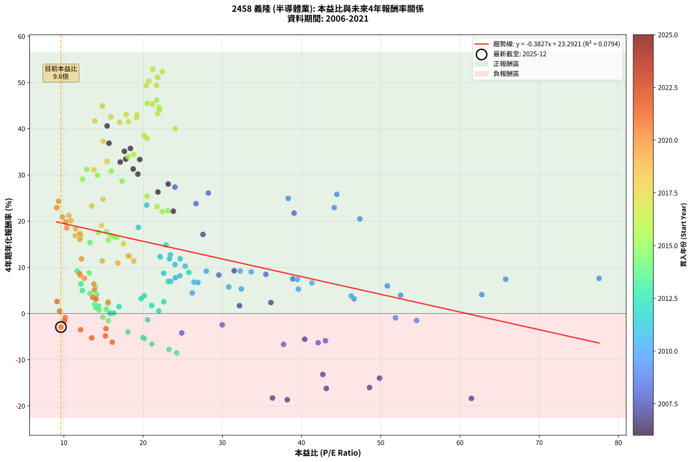
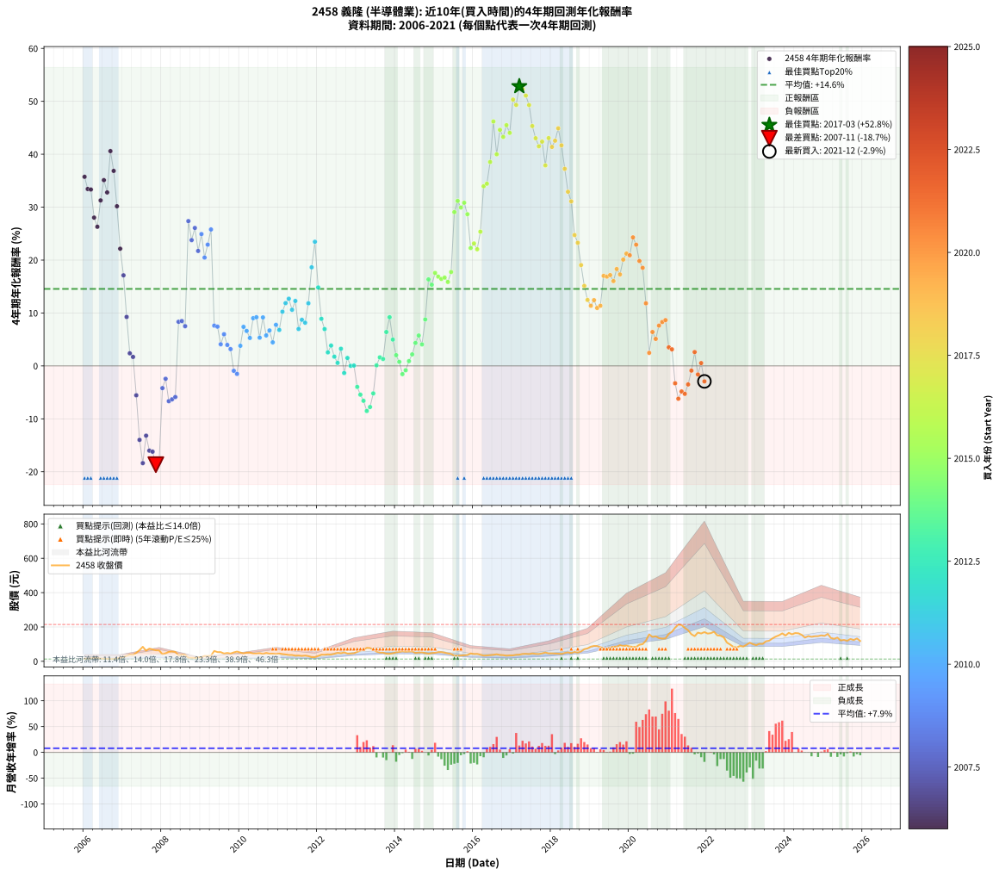

# 2458 義隆 - 本益比與未來報酬率分析

!!! info "報告資訊"
    - **股票代號**: 2458
    - **公司名稱**: 義隆
    - **產業別**: 半導體業
    - **分析期間**: 2006-2021 (192 個數據點)
    - **資料來源**: Type 12 (ShowMonthlyK_ChartFlow) 月收盤價與本益比
    - **報酬率口徑**: 含現金股利 (簡化: 年度合計，假設每年7/1入帳)
    - **報告生成時間**: 2026-01-07 18:42:59 CST

## 📈 視覺化圖表

### 圖表1: 本益比 vs 未來報酬率關係

*圖表1：2458 義隆 本益比與4年期未來報酬率關係 (2006-2021)*

### 圖表2: 歷年買入時點的4年期實際報酬率

*圖表2：2458 義隆 歷年買入時點的4年期實際報酬率 (2006-2021)*

## 📍 買點訊號說明

本報告提供兩種買點提示訊號（顯示於圖表2的股價子圖中）：

### ▲ 小綠色三角形（回測驗證）
- **計算方式**: 使用全部歷史資料計算本益比第25百分位數
- **用途**: 事後驗證，顯示歷史上哪些時點確實為低估區
- **限制**: 當下無法判斷，僅供回測參考
- **特性**: 後見之明（Look-Ahead Bias）

### ▲ 小橘色三角形（即時訊號）
- **計算方式**: 使用截至當月的過去5年資料計算本益比第25百分位數
- **用途**: 實際投資決策，當時即可判斷
- **優勢**: 可操作性強，符合實務需求
- **特性**: 無後見之明，滾動窗口計算

!!! tip "如何使用兩種訊號"
    - **綠色▲** 幫助理解歷史估值機會，驗證策略有效性
    - **橘色▲** 可作為實際買進參考，但仍需搭配基本面分析
    - 兩種訊號重疊時，表示即時判斷與事後驗證一致，信心度較高
    - 僅有綠色▲時，表示當時無法判斷（需要未來資料才能確認）
    - 僅有橘色▲時，表示即時判斷為買點，但事後可能不是最佳時機

## 📊 估值分析摘要

| 指標 | 數值 |
|:---:|:---:|
| **目前本益比** (2021-12) | **9.64 倍** |
| **歷史平均本益比** | 22.83 倍 |
| **估值水準** | 🟢 相對低估 |
| **預期4年年化報酬率** | **+19.60%** |
| **歷史平均報酬率** | +14.55% |
| **相關係數 (R²)** | 0.0794 |
| **趨勢線斜率** | -0.3827 |

!!! abstract "核心洞察"
    目前本益比顯著低於歷史平均，預期未來報酬率可能較高

    根據歷史數據回測，2458 義隆 在目前本益比 **9.6倍** 的估值水準下，
    預期未來4年年化報酬率約為 **+19.6%**。

    **重要提醒**: 本分析基於歷史數據統計，實際報酬率會受到公司基本面變化、產業趨勢、
    總體經濟環境等多重因素影響。R² = 0.08 表示本益比可解釋約 7.9% 的報酬率變異。

## 📈 歷史估值統計

### 最佳買點 (最高報酬率)

| 項目 | 數值 |
|:---:|:---:|
| 起始時間 | 2017-03 |
| 當時本益比 | 21.23 倍 |
| 起始價格 | 38.7 元 |
| 4年後價格 | 195.5 元 |
| **4年年化報酬率** | **+52.83%** |

### 最差買點 (最低報酬率)

| 項目 | 數值 |
|:---:|:---:|
| 起始時間 | 2007-11 |
| 當時本益比 | 38.21 倍 |
| 起始價格 | 64.0 元 |
| 4年後價格 | 24.2 元 |
| **4年年化報酬率** | **-18.66%** |

## 🎯 投資啟示

### 本益比與報酬率關係

趨勢線方程式: **y = -0.3827x + 23.2921**

!!! note "負相關"
    本益比與未來報酬率呈現負相關。較低的本益比通常帶來較高的未來報酬率，
    但相關性不算非常強。**估值仍是重要參考指標之一**。

### 估值區間建議

基於歷史數據分析:

- **🟢 低估區** (P/E < 18.3): 預期報酬率較高，可考慮增加持股
- **🟡 合理區** (P/E 18.3-27.4): 預期報酬率符合長期趨勢，正常持有
- **🔴 高估區** (P/E > 27.4): 預期報酬率較低，可考慮減碼或觀望

!!! danger "風險提示"
    - 過去表現不代表未來結果
    - 本分析假設公司基本面無重大結構性變化
    - 產業環境劇變可能使歷史規律失效
    - 應結合公司財報、產業趨勢、總體經濟等多重因素綜合判斷

!!! success "長期投資觀點"
    歷史數據顯示，在合理或低估的估值水準買入並長期持有，
    往往能獲得較佳的投資報酬。**耐心等待好價格**是價值投資的核心原則。

## 📊 數據品質

- **資料來源**: GoodInfo.tw Type 12 (ShowMonthlyK_ChartFlow)
- **資料頻率**: 月度收盤價與本益比
- **回測期間**: 2006-2021
- **數據點數量**: 192 個 (每個點代表一次4年期回測)

### 計算方法說明

1. **4年期年化報酬率**:
   - 對每個歷史時點，計算其後4年的實際投資報酬率
   - 期末價值(不含股利): 期末價格
   - 期末價值(含現金股利): 期末價格 + 持有期間內的現金股利合計 (簡化: 年度合計，假設每年7/1入帳)
   - 公式: 年化報酬率 = [(期末價值/期初價格)^(1/年數) - 1] × 100%

2. **本益比 (P/E Ratio)**:
   - 使用當時的月收盤價與EPS計算
   - 資料來源: Type 12 月度河流圖本益比數據

3. **趨勢線 (Linear Regression)**:
   - 使用最小平方法擬合線性趨勢線
   - R²值衡量本益比對報酬率的解釋能力

---

*本報告由 Stock Analysis System v1.9.0 自動生成*
*數據更新時間: 2026-01-07 18:42:59 CST*

## 📋 月度回測明細表

（每一列對應時間線圖中的一個買入點；可用來對照 SVG 圖上的每個點。）

| 買入月份 | 賣出月份 | 回測期限_年 | 實際持有年數 | 買入本益比_倍 | 買入收盤價_元 | 賣出收盤價_元 | 現金股利合計_元 | 總報酬率_pct | 年化報酬率_pct |
| --- | --- | --- | --- | --- | --- | --- | --- | --- | --- |
| 2006-01 | 2010-01 | 4 | 4.000 | 18.41 | 15.65 | 50.90 | 2.22 | +239.44 | +35.73 |
| 2006-02 | 2010-02 | 4 | 4.000 | 17.82 | 15.15 | 45.80 | 2.22 | +216.98 | +33.43 |
| 2006-03 | 2010-03 | 4 | 4.000 | 19.59 | 16.65 | 50.40 | 2.22 | +216.05 | +33.33 |
| 2006-04 | 2010-04 | 4 | 4.000 | 23.18 | 19.70 | 50.70 | 2.22 | +168.64 | +28.02 |
| 2006-05 | 2010-05 | 4 | 4.000 | 21.88 | 18.60 | 45.10 | 2.22 | +154.42 | +26.30 |
| 2006-06 | 2010-06 | 4 | 4.000 | 18.76 | 15.95 | 45.15 | 2.22 | +197.00 | +31.28 |
| 2006-07 | 2010-07 | 4 | 4.000 | 17.65 | 15.00 | 47.30 | 2.68 | +233.19 | +35.11 |
| 2006-08 | 2010-08 | 4 | 4.000 | 17.12 | 14.55 | 42.55 | 2.68 | +210.85 | +32.78 |
| 2006-09 | 2010-09 | 4 | 4.000 | 15.47 | 13.15 | 48.70 | 2.68 | +290.71 | +40.59 |
| 2006-10 | 2010-10 | 4 | 4.000 | 15.71 | 13.35 | 44.15 | 2.68 | +250.77 | +36.85 |
| 2006-11 | 2010-11 | 4 | 4.000 | 19.35 | 16.45 | 44.55 | 2.68 | +187.10 | +30.17 |
| 2006-12 | 2010-12 | 4 | 4.000 | 23.82 | 20.25 | 42.40 | 2.68 | +122.61 | +22.15 |
| 2007-01 | 2011-01 | 4 | 4.000 | 27.57 | 25.50 | 45.30 | 2.68 | +88.15 | +17.12 |
| 2007-02 | 2011-02 | 4 | 4.000 | 31.50 | 31.50 | 42.20 | 2.68 | +42.47 | +9.25 |
| 2007-03 | 2011-03 | 4 | 4.000 | 36.14 | 38.85 | 40.00 | 2.68 | +9.85 | +2.38 |
| 2007-04 | 2011-04 | 4 | 4.000 | 32.17 | 37.00 | 36.90 | 2.68 | +6.97 | +1.70 |
| 2007-05 | 2011-05 | 4 | 4.000 | 40.41 | 49.50 | 36.70 | 2.68 | -20.45 | -5.56 |
| 2007-06 | 2011-06 | 4 | 4.000 | 49.85 | 64.80 | 32.80 | 2.68 | -45.25 | -13.98 |
| 2007-07 | 2011-07 | 4 | 4.000 | 61.45 | 84.50 | 33.70 | 3.81 | -55.61 | -18.37 |
| 2007-08 | 2011-08 | 4 | 4.000 | 42.69 | 61.90 | 31.35 | 3.81 | -43.19 | -13.18 |
| 2007-09 | 2011-09 | 4 | 4.000 | 48.59 | 74.10 | 33.05 | 3.81 | -50.25 | -16.02 |
| 2007-10 | 2011-10 | 4 | 4.000 | 43.13 | 69.00 | 30.20 | 3.81 | -50.71 | -16.21 |
| 2007-11 | 2011-11 | 4 | 4.000 | 38.21 | 64.00 | 24.20 | 3.81 | -56.23 | -18.66 |
| 2007-12 | 2011-12 | 4 | 4.000 | 36.34 | 63.60 | 24.55 | 3.81 | -55.40 | -18.28 |
| 2008-01 | 2012-01 | 4 | 4.000 | 24.89 | 41.15 | 30.85 | 3.81 | -15.76 | -4.20 |
| 2008-02 | 2012-02 | 4 | 4.000 | 30.00 | 46.70 | 38.50 | 3.81 | -9.39 | -2.44 |
| 2008-03 | 2012-03 | 4 | 4.000 | 37.74 | 55.10 | 38.00 | 3.81 | -24.11 | -6.67 |
| 2008-04 | 2012-04 | 4 | 4.000 | 42.10 | 57.40 | 40.40 | 3.81 | -22.97 | -6.32 |
| 2008-05 | 2012-05 | 4 | 4.000 | 43.03 | 54.50 | 38.95 | 3.81 | -21.54 | -5.88 |
| 2008-06 | 2012-06 | 4 | 4.000 | 29.57 | 34.60 | 43.85 | 3.81 | +37.75 | +8.34 |
| 2008-07 | 2012-07 | 4 | 4.000 | 35.50 | 38.10 | 48.90 | 3.86 | +38.47 | +8.48 |
| 2008-08 | 2012-08 | 4 | 4.000 | 38.91 | 38.00 | 46.90 | 3.86 | +33.57 | +7.50 |
| 2008-09 | 2012-09 | 4 | 4.000 | 24.03 | 21.15 | 51.80 | 3.86 | +163.15 | +27.37 |
| 2008-10 | 2012-10 | 4 | 4.000 | 26.68 | 20.90 | 45.20 | 3.86 | +134.72 | +23.78 |
| 2008-11 | 2012-11 | 4 | 4.000 | 28.25 | 19.40 | 45.15 | 3.86 | +152.61 | +26.07 |
| 2008-12 | 2012-12 | 4 | 4.000 | 39.07 | 23.05 | 46.75 | 3.86 | +119.55 | +21.73 |
| 2009-01 | 2013-01 | 4 | 4.000 | 38.33 | 24.05 | 54.70 | 3.86 | +143.48 | +24.91 |
| 2009-02 | 2013-02 | 4 | 4.000 | 47.37 | 31.50 | 62.50 | 3.86 | +110.65 | +20.47 |
| 2009-03 | 2013-03 | 4 | 4.000 | 44.13 | 31.00 | 66.90 | 3.86 | +128.25 | +22.91 |
| 2009-04 | 2013-04 | 4 | 4.000 | 44.46 | 32.90 | 78.50 | 3.86 | +150.32 | +25.78 |
| 2009-05 | 2013-05 | 4 | 4.000 | 77.56 | 60.30 | 77.00 | 3.86 | +34.09 | +7.61 |
| 2009-06 | 2013-06 | 4 | 4.000 | 65.77 | 53.60 | 67.50 | 3.86 | +33.13 | +7.42 |
| 2009-07 | 2013-07 | 4 | 4.000 | 62.76 | 53.50 | 56.30 | 6.49 | +17.37 | +4.09 |
| 2009-08 | 2013-08 | 4 | 4.000 | 50.84 | 45.25 | 50.60 | 6.49 | +26.18 | +5.99 |
| 2009-09 | 2013-09 | 4 | 4.000 | 52.51 | 48.70 | 50.40 | 6.49 | +16.83 | +3.96 |
| 2009-10 | 2013-10 | 4 | 4.000 | 46.63 | 45.00 | 44.50 | 6.49 | +13.32 | +3.18 |
| 2009-11 | 2013-11 | 4 | 4.000 | 51.87 | 52.00 | 43.60 | 6.49 | -3.66 | -0.93 |
| 2009-12 | 2013-12 | 4 | 4.000 | 54.52 | 56.70 | 46.85 | 6.49 | -5.92 | -1.51 |
| 2010-01 | 2014-01 | 4 | 4.000 | 46.27 | 50.90 | 52.60 | 6.49 | +16.10 | +3.80 |
| 2010-02 | 2014-02 | 4 | 4.000 | 39.48 | 45.80 | 54.40 | 6.49 | +32.96 | +7.38 |
| 2010-03 | 2014-03 | 4 | 4.000 | 41.31 | 50.40 | 58.60 | 6.49 | +29.16 | +6.61 |
| 2010-04 | 2014-04 | 4 | 4.000 | 39.61 | 50.70 | 55.80 | 6.49 | +22.87 | +5.28 |
| 2010-05 | 2014-05 | 4 | 4.000 | 33.66 | 45.10 | 57.20 | 6.49 | +41.23 | +9.01 |
| 2010-06 | 2014-06 | 4 | 4.000 | 32.25 | 45.15 | 57.70 | 6.49 | +42.18 | +9.20 |
| 2010-07 | 2014-07 | 4 | 4.000 | 32.40 | 47.30 | 49.10 | 9.12 | +23.10 | +5.33 |
| 2010-08 | 2014-08 | 4 | 4.000 | 27.99 | 42.55 | 51.30 | 9.12 | +42.01 | +9.16 |
| 2010-09 | 2014-09 | 4 | 4.000 | 30.82 | 48.70 | 51.80 | 9.12 | +25.10 | +5.76 |
| 2010-10 | 2014-10 | 4 | 4.000 | 26.92 | 44.15 | 48.10 | 9.12 | +29.61 | +6.70 |
| 2010-11 | 2014-11 | 4 | 4.000 | 26.21 | 44.55 | 43.90 | 9.12 | +19.02 | +4.45 |
| 2010-12 | 2014-12 | 4 | 4.000 | 24.09 | 42.40 | 48.05 | 9.12 | +34.85 | +7.76 |
| 2011-01 | 2015-01 | 4 | 4.000 | 26.44 | 45.30 | 49.80 | 9.12 | +30.08 | +6.79 |
| 2011-02 | 2015-02 | 4 | 4.000 | 25.32 | 42.20 | 53.20 | 9.12 | +47.69 | +10.24 |
| 2011-03 | 2015-03 | 4 | 4.000 | 24.69 | 40.00 | 53.50 | 9.12 | +56.56 | +11.86 |
| 2011-04 | 2015-04 | 4 | 4.000 | 23.45 | 36.90 | 50.40 | 9.12 | +61.31 | +12.70 |
| 2011-05 | 2015-05 | 4 | 4.000 | 24.04 | 36.70 | 45.80 | 9.12 | +49.66 | +10.61 |
| 2011-06 | 2015-06 | 4 | 4.000 | 22.16 | 32.80 | 43.00 | 9.12 | +58.92 | +12.28 |
| 2011-07 | 2015-07 | 4 | 4.000 | 23.51 | 33.70 | 32.90 | 11.23 | +30.96 | +6.98 |
| 2011-08 | 2015-08 | 4 | 4.000 | 22.61 | 31.35 | 32.55 | 11.23 | +39.67 | +8.71 |
| 2011-09 | 2015-09 | 4 | 4.000 | 24.66 | 33.05 | 34.00 | 11.23 | +36.87 | +8.16 |
| 2011-10 | 2015-10 | 4 | 4.000 | 23.35 | 30.20 | 36.00 | 11.23 | +56.41 | +11.83 |
| 2011-11 | 2015-11 | 4 | 4.000 | 19.41 | 24.20 | 36.70 | 11.23 | +98.08 | +18.63 |
| 2011-12 | 2015-12 | 4 | 4.000 | 20.46 | 24.55 | 45.80 | 11.23 | +132.32 | +23.46 |
| 2012-01 | 2016-01 | 4 | 4.000 | 22.91 | 30.85 | 42.40 | 11.23 | +73.86 | +14.83 |
| 2012-02 | 2016-02 | 4 | 4.000 | 25.79 | 38.50 | 42.90 | 11.23 | +40.61 | +8.89 |
| 2012-03 | 2016-03 | 4 | 4.000 | 23.19 | 38.00 | 38.50 | 11.23 | +30.88 | +6.96 |
| 2012-04 | 2016-04 | 4 | 4.000 | 22.63 | 40.40 | 33.45 | 11.23 | +10.61 | +2.55 |
| 2012-05 | 2016-05 | 4 | 4.000 | 20.16 | 38.95 | 34.05 | 11.23 | +16.26 | +3.84 |
| 2012-06 | 2016-06 | 4 | 4.000 | 21.10 | 43.85 | 35.75 | 11.23 | +7.15 | +1.74 |
| 2012-07 | 2016-07 | 4 | 4.000 | 21.98 | 48.90 | 37.80 | 12.22 | +2.30 | +0.57 |
| 2012-08 | 2016-08 | 4 | 4.000 | 19.78 | 46.90 | 41.05 | 12.22 | +13.59 | +3.24 |
| 2012-09 | 2016-09 | 4 | 4.000 | 20.58 | 51.80 | 36.85 | 12.22 | -5.26 | -1.34 |
| 2012-10 | 2016-10 | 4 | 4.000 | 16.97 | 45.20 | 35.75 | 12.22 | +6.14 | +1.50 |
| 2012-11 | 2016-11 | 4 | 4.000 | 16.07 | 45.15 | 32.95 | 12.22 | +0.05 | +0.01 |
| 2012-12 | 2016-12 | 4 | 4.000 | 15.82 | 46.75 | 34.65 | 12.22 | +0.27 | +0.07 |
| 2013-01 | 2017-01 | 4 | 4.000 | 18.08 | 54.70 | 34.30 | 12.22 | -14.95 | -3.97 |
| 2013-02 | 2017-02 | 4 | 4.000 | 20.18 | 62.50 | 37.75 | 12.22 | -20.04 | -5.44 |
| 2013-03 | 2017-03 | 4 | 4.000 | 21.12 | 66.90 | 38.70 | 12.22 | -23.88 | -6.59 |
| 2013-04 | 2017-04 | 4 | 4.000 | 24.25 | 78.50 | 42.75 | 12.22 | -29.97 | -8.52 |
| 2013-05 | 2017-05 | 4 | 4.000 | 23.28 | 77.00 | 43.50 | 12.22 | -27.63 | -7.77 |
| 2013-06 | 2017-06 | 4 | 4.000 | 19.98 | 67.50 | 42.30 | 12.22 | -19.22 | -5.20 |
| 2013-07 | 2017-07 | 4 | 4.000 | 16.33 | 56.30 | 45.75 | 10.79 | +0.43 | +0.11 |
| 2013-08 | 2017-08 | 4 | 4.000 | 14.38 | 50.60 | 43.15 | 10.79 | +6.60 | +1.61 |
| 2013-09 | 2017-09 | 4 | 4.000 | 14.04 | 50.40 | 42.30 | 10.79 | +5.34 | +1.31 |
| 2013-10 | 2017-10 | 4 | 4.000 | 12.16 | 44.50 | 46.25 | 10.79 | +28.18 | +6.40 |
| 2013-11 | 2017-11 | 4 | 4.000 | 11.69 | 43.60 | 51.20 | 10.79 | +42.18 | +9.20 |
| 2013-12 | 2017-12 | 4 | 4.000 | 12.33 | 46.85 | 46.10 | 10.79 | +21.43 | +4.97 |
| 2014-01 | 2018-01 | 4 | 4.000 | 13.90 | 52.60 | 46.20 | 10.79 | +8.35 | +2.02 |
| 2014-02 | 2018-02 | 4 | 4.000 | 14.44 | 54.40 | 45.30 | 10.79 | +3.11 | +0.77 |
| 2014-03 | 2018-03 | 4 | 4.000 | 15.62 | 58.60 | 44.25 | 10.79 | -6.08 | -1.55 |
| 2014-04 | 2018-04 | 4 | 4.000 | 14.93 | 55.80 | 43.20 | 10.79 | -3.24 | -0.82 |
| 2014-05 | 2018-05 | 4 | 4.000 | 15.37 | 57.20 | 48.50 | 10.79 | +3.65 | +0.90 |
| 2014-06 | 2018-06 | 4 | 4.000 | 15.57 | 57.70 | 52.10 | 10.79 | +8.99 | +2.18 |
| 2014-07 | 2018-07 | 4 | 4.000 | 13.31 | 49.10 | 48.35 | 9.84 | +18.51 | +4.34 |
| 2014-08 | 2018-08 | 4 | 4.000 | 13.97 | 51.30 | 54.30 | 9.84 | +25.03 | +5.74 |
| 2014-09 | 2018-09 | 4 | 4.000 | 14.16 | 51.80 | 50.90 | 9.84 | +17.26 | +4.06 |
| 2014-10 | 2018-10 | 4 | 4.000 | 13.21 | 48.10 | 57.50 | 9.84 | +40.00 | +8.78 |
| 2014-11 | 2018-11 | 4 | 4.000 | 12.11 | 43.90 | 70.60 | 9.84 | +83.23 | +16.35 |
| 2014-12 | 2018-12 | 4 | 4.000 | 13.31 | 48.05 | 75.20 | 9.84 | +76.98 | +15.34 |
| 2015-01 | 2019-01 | 4 | 4.000 | 14.33 | 49.80 | 85.30 | 9.84 | +91.04 | +17.57 |
| 2015-02 | 2019-02 | 4 | 4.000 | 15.94 | 53.20 | 89.40 | 9.84 | +86.54 | +16.87 |
| 2015-03 | 2019-03 | 4 | 4.000 | 16.71 | 53.50 | 88.50 | 9.84 | +83.81 | +16.44 |
| 2015-04 | 2019-04 | 4 | 4.000 | 16.43 | 50.40 | 83.60 | 9.84 | +85.40 | +16.69 |
| 2015-05 | 2019-05 | 4 | 4.000 | 15.63 | 45.80 | 72.70 | 9.84 | +80.22 | +15.86 |
| 2015-06 | 2019-06 | 4 | 4.000 | 15.38 | 43.00 | 72.80 | 9.84 | +92.19 | +17.74 |
| 2015-07 | 2019-07 | 4 | 4.000 | 12.37 | 32.90 | 80.10 | 11.18 | +177.45 | +29.06 |
| 2015-08 | 2019-08 | 4 | 4.000 | 12.90 | 32.55 | 85.20 | 11.18 | +196.10 | +31.18 |
| 2015-09 | 2019-09 | 4 | 4.000 | 14.24 | 34.00 | 85.70 | 11.18 | +184.95 | +29.92 |
| 2015-10 | 2019-10 | 4 | 4.000 | 15.99 | 36.00 | 94.30 | 11.18 | +193.01 | +30.83 |
| 2015-11 | 2019-11 | 4 | 4.000 | 17.35 | 36.70 | 89.40 | 11.18 | +174.07 | +28.67 |
| 2015-12 | 2019-12 | 4 | 4.000 | 23.13 | 45.80 | 91.20 | 11.18 | +123.54 | +22.28 |
| 2016-01 | 2020-01 | 4 | 4.000 | 21.79 | 42.40 | 86.30 | 11.18 | +129.91 | +23.14 |
| 2016-02 | 2020-02 | 4 | 4.000 | 22.44 | 42.90 | 84.00 | 11.18 | +121.87 | +22.05 |
| 2016-03 | 2020-03 | 4 | 4.000 | 20.51 | 38.50 | 83.90 | 11.18 | +146.97 | +25.36 |
| 2016-04 | 2020-04 | 4 | 4.000 | 18.15 | 33.45 | 96.50 | 11.18 | +221.92 | +33.95 |
| 2016-05 | 2020-05 | 4 | 4.000 | 18.82 | 34.05 | 100.00 | 11.18 | +226.53 | +34.42 |
| 2016-06 | 2020-06 | 4 | 4.000 | 20.14 | 35.75 | 120.50 | 11.18 | +268.34 | +38.54 |
| 2016-07 | 2020-07 | 4 | 4.000 | 21.71 | 37.80 | 157.00 | 15.65 | +356.75 | +46.19 |
| 2016-08 | 2020-08 | 4 | 4.000 | 24.05 | 41.05 | 142.00 | 15.65 | +284.04 | +39.99 |
| 2016-09 | 2020-09 | 4 | 4.000 | 22.03 | 36.85 | 145.50 | 15.65 | +337.31 | +44.61 |
| 2016-10 | 2020-10 | 4 | 4.000 | 21.82 | 35.75 | 135.00 | 15.65 | +321.40 | +43.28 |
| 2016-11 | 2020-11 | 4 | 4.000 | 20.54 | 32.95 | 132.00 | 15.65 | +348.10 | +45.49 |
| 2016-12 | 2020-12 | 4 | 4.000 | 22.07 | 34.65 | 133.50 | 15.65 | +330.45 | +44.04 |
| 2017-01 | 2021-01 | 4 | 4.000 | 20.74 | 34.30 | 159.50 | 15.65 | +410.64 | +50.32 |
| 2017-02 | 2021-02 | 4 | 4.000 | 21.72 | 37.75 | 172.00 | 15.65 | +397.09 | +49.32 |
| 2017-03 | 2021-03 | 4 | 4.000 | 21.23 | 38.70 | 195.50 | 15.65 | +445.61 | +52.83 |
| 2017-04 | 2021-04 | 4 | 4.000 | 22.42 | 42.75 | 214.50 | 15.65 | +438.36 | +52.32 |
| 2017-05 | 2021-05 | 4 | 4.000 | 21.85 | 43.50 | 211.00 | 15.65 | +421.03 | +51.08 |
| 2017-06 | 2021-06 | 4 | 4.000 | 20.39 | 42.30 | 194.50 | 15.65 | +396.81 | +49.30 |
| 2017-07 | 2021-07 | 4 | 4.000 | 21.19 | 45.75 | 181.00 | 23.08 | +346.08 | +45.33 |
| 2017-08 | 2021-08 | 4 | 4.000 | 19.23 | 43.15 | 157.50 | 23.08 | +318.49 | +43.03 |
| 2017-09 | 2021-09 | 4 | 4.000 | 18.17 | 42.30 | 146.50 | 23.08 | +300.90 | +41.50 |
| 2017-10 | 2021-10 | 4 | 4.000 | 19.18 | 46.25 | 167.00 | 23.08 | +310.98 | +42.38 |
| 2017-11 | 2021-11 | 4 | 4.000 | 20.51 | 51.20 | 162.00 | 23.08 | +261.48 | +37.89 |
| 2017-12 | 2021-12 | 4 | 4.000 | 17.87 | 46.10 | 170.00 | 23.08 | +318.83 | +43.06 |
| 2018-01 | 2022-01 | 4 | 4.000 | 17.04 | 46.20 | 161.50 | 23.08 | +299.52 | +41.38 |
| 2018-02 | 2022-02 | 4 | 4.000 | 15.93 | 45.30 | 164.00 | 23.08 | +312.98 | +42.55 |
| 2018-03 | 2022-03 | 4 | 4.000 | 14.87 | 44.25 | 172.00 | 23.08 | +340.86 | +44.90 |
| 2018-04 | 2022-04 | 4 | 4.000 | 13.91 | 43.20 | 151.00 | 23.08 | +302.96 | +41.68 |
| 2018-05 | 2022-05 | 4 | 4.000 | 14.98 | 48.50 | 149.00 | 23.08 | +254.80 | +37.25 |
| 2018-06 | 2022-06 | 4 | 4.000 | 15.46 | 52.10 | 139.50 | 23.08 | +212.05 | +32.91 |
| 2018-07 | 2022-07 | 4 | 4.000 | 13.81 | 48.35 | 108.50 | 34.31 | +195.37 | +31.10 |
| 2018-08 | 2022-08 | 4 | 4.000 | 14.94 | 54.30 | 97.10 | 34.31 | +142.01 | +24.73 |
| 2018-09 | 2022-09 | 4 | 4.000 | 13.52 | 50.90 | 83.20 | 34.31 | +130.86 | +23.26 |
| 2018-10 | 2022-10 | 4 | 4.000 | 14.76 | 57.50 | 81.20 | 34.31 | +100.89 | +19.05 |
| 2018-11 | 2022-11 | 4 | 4.000 | 17.53 | 70.60 | 89.70 | 34.31 | +75.65 | +15.12 |
| 2018-12 | 2022-12 | 4 | 4.000 | 18.08 | 75.20 | 86.00 | 34.31 | +59.99 | +12.47 |
| 2019-01 | 2023-01 | 4 | 4.000 | 18.84 | 85.30 | 96.90 | 34.31 | +53.82 | +11.37 |
| 2019-02 | 2023-02 | 4 | 4.000 | 18.26 | 89.40 | 108.50 | 34.31 | +59.74 | +12.42 |
| 2019-03 | 2023-03 | 4 | 4.000 | 16.82 | 88.50 | 99.80 | 34.31 | +51.54 | +10.95 |
| 2019-04 | 2023-04 | 4 | 4.000 | 14.85 | 83.60 | 94.30 | 34.31 | +53.84 | +11.37 |
| 2019-05 | 2023-05 | 4 | 4.000 | 12.12 | 72.70 | 102.00 | 34.31 | +87.50 | +17.02 |
| 2019-06 | 2023-06 | 4 | 4.000 | 11.44 | 72.80 | 101.50 | 34.31 | +86.55 | +16.87 |
| 2019-07 | 2023-07 | 4 | 4.000 | 11.90 | 80.10 | 116.50 | 34.43 | +88.42 | +17.16 |
| 2019-08 | 2023-08 | 4 | 4.000 | 12.00 | 85.20 | 120.00 | 34.43 | +81.25 | +16.03 |
| 2019-09 | 2023-09 | 4 | 4.000 | 11.48 | 85.70 | 133.50 | 34.43 | +95.95 | +18.31 |
| 2019-10 | 2023-10 | 4 | 4.000 | 12.04 | 94.30 | 144.00 | 34.43 | +89.21 | +17.28 |
| 2019-11 | 2023-11 | 4 | 4.000 | 10.90 | 89.40 | 151.50 | 34.43 | +107.97 | +20.09 |
| 2019-12 | 2023-12 | 4 | 4.000 | 10.64 | 91.20 | 162.50 | 34.43 | +115.93 | +21.22 |
| 2020-01 | 2024-01 | 4 | 4.000 | 9.82 | 86.30 | 150.00 | 34.43 | +113.70 | +20.91 |
| 2020-02 | 2024-02 | 4 | 4.000 | 9.34 | 84.00 | 166.00 | 34.43 | +138.60 | +24.28 |
| 2020-03 | 2024-03 | 4 | 4.000 | 9.11 | 83.90 | 157.00 | 34.43 | +128.16 | +22.90 |
| 2020-04 | 2024-04 | 4 | 4.000 | 10.24 | 96.50 | 164.50 | 34.43 | +106.14 | +19.82 |
| 2020-05 | 2024-05 | 4 | 4.000 | 10.37 | 100.00 | 163.00 | 34.43 | +97.43 | +18.54 |
| 2020-06 | 2024-06 | 4 | 4.000 | 12.23 | 120.50 | 154.00 | 34.43 | +56.37 | +11.82 |
| 2020-07 | 2024-07 | 4 | 4.000 | 15.59 | 157.00 | 138.00 | 35.05 | +10.22 | +2.46 |
| 2020-08 | 2024-08 | 4 | 4.000 | 13.81 | 142.00 | 147.00 | 35.05 | +28.20 | +6.41 |
| 2020-09 | 2024-09 | 4 | 4.000 | 13.86 | 145.50 | 142.50 | 35.05 | +22.03 | +5.10 |
| 2020-10 | 2024-10 | 4 | 4.000 | 12.60 | 135.00 | 146.00 | 35.05 | +34.11 | +7.61 |
| 2020-11 | 2024-11 | 4 | 4.000 | 12.08 | 132.00 | 146.50 | 35.05 | +37.54 | +8.29 |
| 2020-12 | 2024-12 | 4 | 4.000 | 11.98 | 133.50 | 151.00 | 35.05 | +39.36 | +8.65 |
| 2021-01 | 2025-01 | 4 | 4.000 | 13.65 | 159.50 | 148.00 | 35.05 | +14.76 | +3.50 |
| 2021-02 | 2025-02 | 4 | 4.000 | 14.07 | 172.00 | 159.50 | 35.05 | +13.11 | +3.13 |
| 2021-03 | 2025-03 | 4 | 4.000 | 15.32 | 195.50 | 136.00 | 35.05 | -12.51 | -3.29 |
| 2021-04 | 2025-04 | 4 | 4.000 | 16.12 | 214.50 | 131.00 | 35.05 | -22.59 | -6.20 |
| 2021-05 | 2025-05 | 4 | 4.000 | 15.24 | 211.00 | 138.00 | 35.05 | -17.99 | -4.84 |
| 2021-06 | 2025-06 | 4 | 4.000 | 13.52 | 194.50 | 121.50 | 35.05 | -19.51 | -5.28 |
| 2021-07 | 2025-07 | 4 | 4.000 | 12.12 | 181.00 | 124.50 | 32.45 | -13.28 | -3.50 |
| 2021-08 | 2025-08 | 4 | 4.000 | 10.18 | 157.50 | 119.50 | 32.45 | -3.52 | -0.89 |
| 2021-09 | 2025-09 | 4 | 4.000 | 9.15 | 146.50 | 130.00 | 32.45 | +10.89 | +2.62 |
| 2021-10 | 2025-10 | 4 | 4.000 | 10.09 | 167.00 | 124.00 | 32.45 | -6.31 | -1.62 |
| 2021-11 | 2025-11 | 4 | 4.000 | 9.47 | 162.00 | 133.00 | 32.45 | +2.13 | +0.53 |
| 2021-12 | 2025-12 | 4 | 4.000 | 9.64 | 170.00 | 118.50 | 32.45 | -11.20 | -2.93 |
