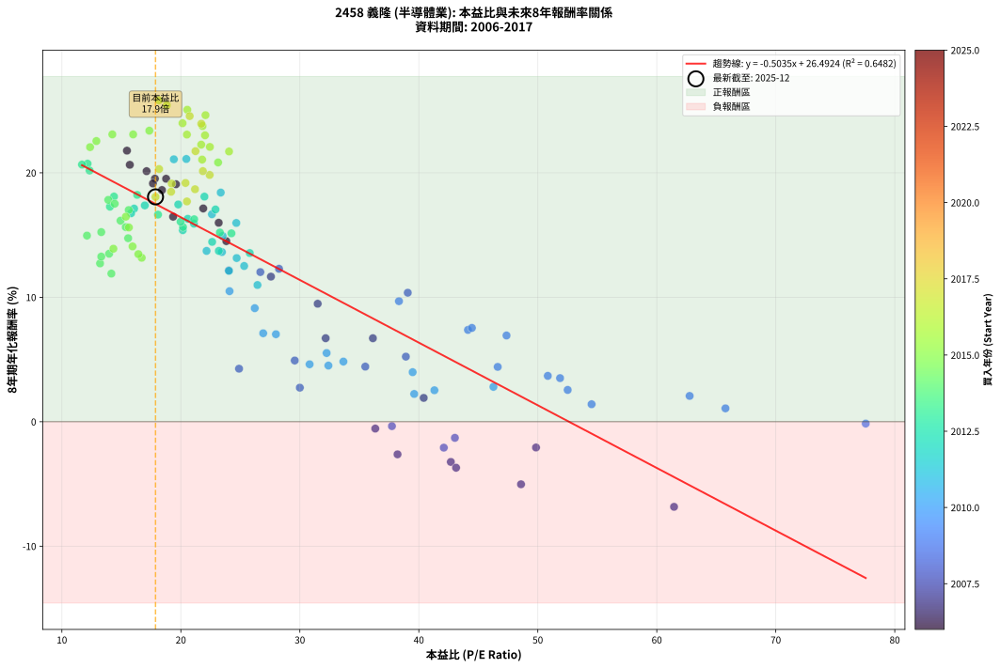
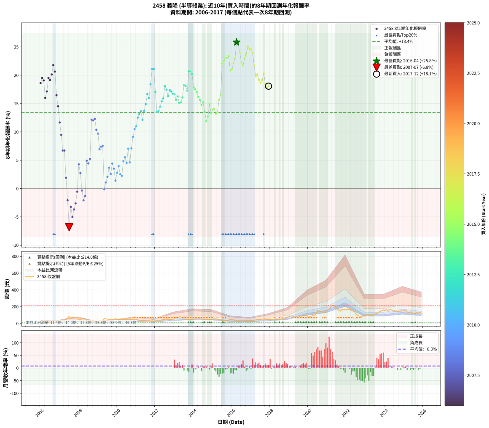

# 2458 義隆 - 本益比與未來報酬率分析

!!! info "報告資訊"
    - **股票代號**: 2458
    - **公司名稱**: 義隆
    - **產業別**: 半導體業
    - **分析期間**: 2006-2017 (144 個數據點)
    - **資料來源**: Type 12 (ShowMonthlyK_ChartFlow) 月收盤價與本益比
    - **報酬率口徑**: 含現金股利 (簡化: 年度合計，假設每年7/1入帳)
    - **報告生成時間**: 2026-01-06 22:42:47 CST

## 📈 視覺化圖表

### 圖表1: 本益比 vs 未來報酬率關係

*圖表1：2458 義隆 本益比與8年期未來報酬率關係 (2006-2017)*

### 圖表2: 歷年買入時點的8年期實際報酬率

*圖表2：2458 義隆 歷年買入時點的8年期實際報酬率 (2006-2017)*

## 📍 買點訊號說明

本報告提供兩種買點提示訊號（顯示於圖表2的股價子圖中）：

### ▲ 小綠色三角形（回測驗證）
- **計算方式**: 使用全部歷史資料計算本益比第25百分位數
- **用途**: 事後驗證，顯示歷史上哪些時點確實為低估區
- **限制**: 當下無法判斷，僅供回測參考
- **特性**: 後見之明（Look-Ahead Bias）

### ▲ 小橘色三角形（即時訊號）
- **計算方式**: 使用截至當月的過去5年資料計算本益比第25百分位數
- **用途**: 實際投資決策，當時即可判斷
- **優勢**: 可操作性強，符合實務需求
- **特性**: 無後見之明，滾動窗口計算

!!! tip "如何使用兩種訊號"
    - **綠色▲** 幫助理解歷史估值機會，驗證策略有效性
    - **橘色▲** 可作為實際買進參考，但仍需搭配基本面分析
    - 兩種訊號重疊時，表示即時判斷與事後驗證一致，信心度較高
    - 僅有綠色▲時，表示當時無法判斷（需要未來資料才能確認）
    - 僅有橘色▲時，表示即時判斷為買點，但事後可能不是最佳時機

## 📊 估值分析摘要

| 指標 | 數值 |
|:---:|:---:|
| **目前本益比** (2017-12) | **17.87 倍** |
| **歷史平均本益比** | 26.03 倍 |
| **估值水準** | 🟢 相對低估 |
| **預期8年年化報酬率** | **+17.49%** |
| **歷史平均報酬率** | +13.39% |
| **相關係數 (R²)** | 0.6482 |
| **趨勢線斜率** | -0.5035 |

!!! abstract "核心洞察"
    目前本益比顯著低於歷史平均，預期未來報酬率可能較高

    根據歷史數據回測，2458 義隆 在目前本益比 **17.9倍** 的估值水準下，
    預期未來8年年化報酬率約為 **+17.5%**。

    **重要提醒**: 本分析基於歷史數據統計，實際報酬率會受到公司基本面變化、產業趨勢、
    總體經濟環境等多重因素影響。R² = 0.65 表示本益比可解釋約 64.8% 的報酬率變異。

## 📈 歷史估值統計

### 最佳買點 (最高報酬率)

| 項目 | 數值 |
|:---:|:---:|
| 起始時間 | 2016-04 |
| 當時本益比 | 18.15 倍 |
| 起始價格 | 33.5 元 |
| 8年後價格 | 164.5 元 |
| **8年年化報酬率** | **+25.82%** |

### 最差買點 (最低報酬率)

| 項目 | 數值 |
|:---:|:---:|
| 起始時間 | 2007-07 |
| 當時本益比 | 61.45 倍 |
| 起始價格 | 84.5 元 |
| 8年後價格 | 32.9 元 |
| **8年年化報酬率** | **-6.84%** |

## 🎯 投資啟示

### 本益比與報酬率關係

趨勢線方程式: **y = -0.5035x + 26.4924**

!!! warning "強負相關"
    本益比與未來報酬率呈現強負相關。在高本益比時期買入，未來報酬率顯著較低；
    在低本益比時期買入，未來報酬率顯著較高。**估值紀律至關重要**。

### 估值區間建議

基於歷史數據分析:

- **🟢 低估區** (P/E < 20.8): 預期報酬率較高，可考慮增加持股
- **🟡 合理區** (P/E 20.8-31.2): 預期報酬率符合長期趨勢，正常持有
- **🔴 高估區** (P/E > 31.2): 預期報酬率較低，可考慮減碼或觀望

!!! danger "風險提示"
    - 過去表現不代表未來結果
    - 本分析假設公司基本面無重大結構性變化
    - 產業環境劇變可能使歷史規律失效
    - 應結合公司財報、產業趨勢、總體經濟等多重因素綜合判斷

!!! success "長期投資觀點"
    歷史數據顯示，在合理或低估的估值水準買入並長期持有，
    往往能獲得較佳的投資報酬。**耐心等待好價格**是價值投資的核心原則。

## 📊 數據品質

- **資料來源**: GoodInfo.tw Type 12 (ShowMonthlyK_ChartFlow)
- **資料頻率**: 月度收盤價與本益比
- **回測期間**: 2006-2017
- **數據點數量**: 144 個 (每個點代表一次8年期回測)

### 計算方法說明

1. **8年期年化報酬率**:
   - 對每個歷史時點，計算其後8年的實際投資報酬率
   - 期末價值(不含股利): 期末價格
   - 期末價值(含現金股利): 期末價格 + 持有期間內的現金股利合計 (簡化: 年度合計，假設每年7/1入帳)
   - 公式: 年化報酬率 = [(期末價值/期初價格)^(1/年數) - 1] × 100%

2. **本益比 (P/E Ratio)**:
   - 使用當時的月收盤價與EPS計算
   - 資料來源: Type 12 月度河流圖本益比數據

3. **趨勢線 (Linear Regression)**:
   - 使用最小平方法擬合線性趨勢線
   - R²值衡量本益比對報酬率的解釋能力

---

*本報告由 Stock Analysis System v1.9.0 自動生成*
*數據更新時間: 2026-01-06 22:42:47 CST*

## 📋 月度回測明細表

（每一列對應時間線圖中的一個買入點；可用來對照 SVG 圖上的每個點。）

| 買入月份 | 賣出月份 | 回測期限_年 | 實際持有年數 | 買入本益比_倍 | 買入收盤價_元 | 賣出收盤價_元 | 現金股利合計_元 | 總報酬率_pct | 年化報酬率_pct |
| --- | --- | --- | --- | --- | --- | --- | --- | --- | --- |
| 2006-01 | 2014-01 | 8 | 8.000 | 18.41 | 15.65 | 52.60 | 8.72 | +291.80 | +18.61 |
| 2006-02 | 2014-02 | 8 | 8.000 | 17.82 | 15.15 | 54.40 | 8.72 | +316.61 | +19.53 |
| 2006-03 | 2014-03 | 8 | 8.000 | 19.59 | 16.65 | 58.60 | 8.72 | +304.31 | +19.08 |
| 2006-04 | 2014-04 | 8 | 8.000 | 23.18 | 19.70 | 55.80 | 8.72 | +227.50 | +15.98 |
| 2006-05 | 2014-05 | 8 | 8.000 | 21.88 | 18.60 | 57.20 | 8.72 | +254.39 | +17.13 |
| 2006-06 | 2014-06 | 8 | 8.000 | 18.76 | 15.95 | 57.70 | 8.72 | +316.41 | +19.52 |
| 2006-07 | 2014-07 | 8 | 8.000 | 17.65 | 15.00 | 49.10 | 11.80 | +306.02 | +19.14 |
| 2006-08 | 2014-08 | 8 | 8.000 | 17.12 | 14.55 | 51.30 | 11.80 | +333.70 | +20.13 |
| 2006-09 | 2014-09 | 8 | 8.000 | 15.47 | 13.15 | 51.80 | 11.80 | +383.67 | +21.78 |
| 2006-10 | 2014-10 | 8 | 8.000 | 15.71 | 13.35 | 48.10 | 11.80 | +348.71 | +20.64 |
| 2006-11 | 2014-11 | 8 | 8.000 | 19.35 | 16.45 | 43.90 | 11.80 | +238.62 | +16.47 |
| 2006-12 | 2014-12 | 8 | 8.000 | 23.82 | 20.25 | 48.05 | 11.80 | +195.57 | +14.51 |
| 2007-01 | 2015-01 | 8 | 8.000 | 27.57 | 25.50 | 49.80 | 11.80 | +141.58 | +11.66 |
| 2007-02 | 2015-02 | 8 | 8.000 | 31.50 | 31.50 | 53.20 | 11.80 | +106.36 | +9.48 |
| 2007-03 | 2015-03 | 8 | 8.000 | 36.14 | 38.85 | 53.50 | 11.80 | +68.09 | +6.71 |
| 2007-04 | 2015-04 | 8 | 8.000 | 32.17 | 37.00 | 50.40 | 11.80 | +68.12 | +6.71 |
| 2007-05 | 2015-05 | 8 | 8.000 | 40.41 | 49.50 | 45.80 | 11.80 | +16.37 | +1.91 |
| 2007-06 | 2015-06 | 8 | 8.000 | 49.85 | 64.80 | 43.00 | 11.80 | -15.43 | -2.07 |
| 2007-07 | 2015-07 | 8 | 8.000 | 61.45 | 84.50 | 32.90 | 15.05 | -43.26 | -6.84 |
| 2007-08 | 2015-08 | 8 | 8.000 | 42.69 | 61.90 | 32.55 | 15.05 | -23.11 | -3.23 |
| 2007-09 | 2015-09 | 8 | 8.000 | 48.59 | 74.10 | 34.00 | 15.05 | -33.81 | -5.03 |
| 2007-10 | 2015-10 | 8 | 8.000 | 43.13 | 69.00 | 36.00 | 15.05 | -26.02 | -3.70 |
| 2007-11 | 2015-11 | 8 | 8.000 | 38.21 | 64.00 | 36.70 | 15.05 | -19.14 | -2.62 |
| 2007-12 | 2015-12 | 8 | 8.000 | 36.34 | 63.60 | 45.80 | 15.05 | -4.33 | -0.55 |
| 2008-01 | 2016-01 | 8 | 8.000 | 24.89 | 41.15 | 42.40 | 15.05 | +39.61 | +4.26 |
| 2008-02 | 2016-02 | 8 | 8.000 | 30.00 | 46.70 | 42.90 | 15.05 | +24.09 | +2.73 |
| 2008-03 | 2016-03 | 8 | 8.000 | 37.74 | 55.10 | 38.50 | 15.05 | -2.82 | -0.36 |
| 2008-04 | 2016-04 | 8 | 8.000 | 42.10 | 57.40 | 33.45 | 15.05 | -15.51 | -2.08 |
| 2008-05 | 2016-05 | 8 | 8.000 | 43.03 | 54.50 | 34.05 | 15.05 | -9.91 | -1.30 |
| 2008-06 | 2016-06 | 8 | 8.000 | 29.57 | 34.60 | 35.75 | 15.05 | +46.82 | +4.92 |
| 2008-07 | 2016-07 | 8 | 8.000 | 35.50 | 38.10 | 37.80 | 16.08 | +41.42 | +4.43 |
| 2008-08 | 2016-08 | 8 | 8.000 | 38.91 | 38.00 | 41.05 | 16.08 | +50.34 | +5.23 |
| 2008-09 | 2016-09 | 8 | 8.000 | 24.03 | 21.15 | 36.85 | 16.08 | +150.26 | +12.15 |
| 2008-10 | 2016-10 | 8 | 8.000 | 26.68 | 20.90 | 35.75 | 16.08 | +147.99 | +12.02 |
| 2008-11 | 2016-11 | 8 | 8.000 | 28.25 | 19.40 | 32.95 | 16.08 | +152.73 | +12.29 |
| 2008-12 | 2016-12 | 8 | 8.000 | 39.07 | 23.05 | 34.65 | 16.08 | +120.09 | +10.36 |
| 2009-01 | 2017-01 | 8 | 8.000 | 38.33 | 24.05 | 34.30 | 16.08 | +109.48 | +9.68 |
| 2009-02 | 2017-02 | 8 | 8.000 | 47.37 | 31.50 | 37.75 | 16.08 | +70.89 | +6.93 |
| 2009-03 | 2017-03 | 8 | 8.000 | 44.13 | 31.00 | 38.70 | 16.08 | +76.71 | +7.38 |
| 2009-04 | 2017-04 | 8 | 8.000 | 44.46 | 32.90 | 42.75 | 16.08 | +78.81 | +7.54 |
| 2009-05 | 2017-05 | 8 | 8.000 | 77.56 | 60.30 | 43.50 | 16.08 | -1.19 | -0.15 |
| 2009-06 | 2017-06 | 8 | 8.000 | 65.77 | 53.60 | 42.30 | 16.08 | +8.92 | +1.07 |
| 2009-07 | 2017-07 | 8 | 8.000 | 62.76 | 53.50 | 45.75 | 17.28 | +17.82 | +2.07 |
| 2009-08 | 2017-08 | 8 | 8.000 | 50.84 | 45.25 | 43.15 | 17.28 | +33.56 | +3.68 |
| 2009-09 | 2017-09 | 8 | 8.000 | 52.51 | 48.70 | 42.30 | 17.28 | +22.35 | +2.55 |
| 2009-10 | 2017-10 | 8 | 8.000 | 46.63 | 45.00 | 46.25 | 17.28 | +41.19 | +4.41 |
| 2009-11 | 2017-11 | 8 | 8.000 | 51.87 | 52.00 | 51.20 | 17.28 | +31.70 | +3.50 |
| 2009-12 | 2017-12 | 8 | 8.000 | 54.52 | 56.70 | 46.10 | 17.28 | +11.79 | +1.40 |
| 2010-01 | 2018-01 | 8 | 8.000 | 46.27 | 50.90 | 46.20 | 17.28 | +24.72 | +2.80 |
| 2010-02 | 2018-02 | 8 | 8.000 | 39.48 | 45.80 | 45.30 | 17.28 | +36.65 | +3.98 |
| 2010-03 | 2018-03 | 8 | 8.000 | 41.31 | 50.40 | 44.25 | 17.28 | +22.09 | +2.53 |
| 2010-04 | 2018-04 | 8 | 8.000 | 39.61 | 50.70 | 43.20 | 17.28 | +19.30 | +2.23 |
| 2010-05 | 2018-05 | 8 | 8.000 | 33.66 | 45.10 | 48.50 | 17.28 | +45.86 | +4.83 |
| 2010-06 | 2018-06 | 8 | 8.000 | 32.25 | 45.15 | 52.10 | 17.28 | +53.68 | +5.52 |
| 2010-07 | 2018-07 | 8 | 8.000 | 32.40 | 47.30 | 48.35 | 18.96 | +42.32 | +4.51 |
| 2010-08 | 2018-08 | 8 | 8.000 | 27.99 | 42.55 | 54.30 | 18.96 | +72.19 | +7.03 |
| 2010-09 | 2018-09 | 8 | 8.000 | 30.82 | 48.70 | 50.90 | 18.96 | +43.46 | +4.61 |
| 2010-10 | 2018-10 | 8 | 8.000 | 26.92 | 44.15 | 57.50 | 18.96 | +73.19 | +7.11 |
| 2010-11 | 2018-11 | 8 | 8.000 | 26.21 | 44.55 | 70.60 | 18.96 | +101.04 | +9.12 |
| 2010-12 | 2018-12 | 8 | 8.000 | 24.09 | 42.40 | 75.20 | 18.96 | +122.09 | +10.49 |
| 2011-01 | 2019-01 | 8 | 8.000 | 26.44 | 45.30 | 85.30 | 18.96 | +130.17 | +10.98 |
| 2011-02 | 2019-02 | 8 | 8.000 | 25.32 | 42.20 | 89.40 | 18.96 | +156.79 | +12.51 |
| 2011-03 | 2019-03 | 8 | 8.000 | 24.69 | 40.00 | 88.50 | 18.96 | +168.66 | +13.15 |
| 2011-04 | 2019-04 | 8 | 8.000 | 23.45 | 36.90 | 83.60 | 18.96 | +177.95 | +13.63 |
| 2011-05 | 2019-05 | 8 | 8.000 | 24.04 | 36.70 | 72.70 | 18.96 | +149.77 | +12.12 |
| 2011-06 | 2019-06 | 8 | 8.000 | 22.16 | 32.80 | 72.80 | 18.96 | +179.77 | +13.72 |
| 2011-07 | 2019-07 | 8 | 8.000 | 23.51 | 33.70 | 80.10 | 22.42 | +204.20 | +14.92 |
| 2011-08 | 2019-08 | 8 | 8.000 | 22.61 | 31.35 | 85.20 | 22.42 | +243.28 | +16.67 |
| 2011-09 | 2019-09 | 8 | 8.000 | 24.66 | 33.05 | 85.70 | 22.42 | +227.13 | +15.97 |
| 2011-10 | 2019-10 | 8 | 8.000 | 23.35 | 30.20 | 94.30 | 22.42 | +286.48 | +18.41 |
| 2011-11 | 2019-11 | 8 | 8.000 | 19.41 | 24.20 | 89.40 | 22.42 | +362.05 | +21.08 |
| 2011-12 | 2019-12 | 8 | 8.000 | 20.46 | 24.55 | 91.20 | 22.42 | +362.80 | +21.11 |
| 2012-01 | 2020-01 | 8 | 8.000 | 22.91 | 30.85 | 86.30 | 22.42 | +252.41 | +17.05 |
| 2012-02 | 2020-02 | 8 | 8.000 | 25.79 | 38.50 | 84.00 | 22.42 | +176.41 | +13.55 |
| 2012-03 | 2020-03 | 8 | 8.000 | 23.19 | 38.00 | 83.90 | 22.42 | +179.78 | +13.72 |
| 2012-04 | 2020-04 | 8 | 8.000 | 22.63 | 40.40 | 96.50 | 22.42 | +194.35 | +14.45 |
| 2012-05 | 2020-05 | 8 | 8.000 | 20.16 | 38.95 | 100.00 | 22.42 | +214.29 | +15.39 |
| 2012-06 | 2020-06 | 8 | 8.000 | 21.10 | 43.85 | 120.50 | 22.42 | +225.92 | +15.91 |
| 2012-07 | 2020-07 | 8 | 8.000 | 21.98 | 48.90 | 157.00 | 27.87 | +278.07 | +18.09 |
| 2012-08 | 2020-08 | 8 | 8.000 | 19.78 | 46.90 | 142.00 | 27.87 | +262.20 | +17.45 |
| 2012-09 | 2020-09 | 8 | 8.000 | 20.58 | 51.80 | 145.50 | 27.87 | +234.70 | +16.30 |
| 2012-10 | 2020-10 | 8 | 8.000 | 16.97 | 45.20 | 135.00 | 27.87 | +260.34 | +17.38 |
| 2012-11 | 2020-11 | 8 | 8.000 | 16.07 | 45.15 | 132.00 | 27.87 | +254.10 | +17.12 |
| 2012-12 | 2020-12 | 8 | 8.000 | 15.82 | 46.75 | 133.50 | 27.87 | +245.19 | +16.75 |
| 2013-01 | 2021-01 | 8 | 8.000 | 18.08 | 54.70 | 159.50 | 27.87 | +242.55 | +16.64 |
| 2013-02 | 2021-02 | 8 | 8.000 | 20.18 | 62.50 | 172.00 | 27.87 | +219.80 | +15.64 |
| 2013-03 | 2021-03 | 8 | 8.000 | 21.12 | 66.90 | 195.50 | 27.87 | +233.89 | +16.27 |
| 2013-04 | 2021-04 | 8 | 8.000 | 24.25 | 78.50 | 214.50 | 27.87 | +208.76 | +15.13 |
| 2013-05 | 2021-05 | 8 | 8.000 | 23.28 | 77.00 | 211.00 | 27.87 | +210.23 | +15.20 |
| 2013-06 | 2021-06 | 8 | 8.000 | 19.98 | 67.50 | 194.50 | 27.87 | +229.44 | +16.07 |
| 2013-07 | 2021-07 | 8 | 8.000 | 16.33 | 56.30 | 181.00 | 33.87 | +281.65 | +18.22 |
| 2013-08 | 2021-08 | 8 | 8.000 | 14.38 | 50.60 | 157.50 | 33.87 | +278.20 | +18.09 |
| 2013-09 | 2021-09 | 8 | 8.000 | 14.04 | 50.40 | 146.50 | 33.87 | +257.88 | +17.28 |
| 2013-10 | 2021-10 | 8 | 8.000 | 12.16 | 44.50 | 167.00 | 33.87 | +351.39 | +20.73 |
| 2013-11 | 2021-11 | 8 | 8.000 | 11.69 | 43.60 | 162.00 | 33.87 | +349.24 | +20.66 |
| 2013-12 | 2021-12 | 8 | 8.000 | 12.33 | 46.85 | 170.00 | 33.87 | +335.15 | +20.18 |
| 2014-01 | 2022-01 | 8 | 8.000 | 13.90 | 52.60 | 161.50 | 33.87 | +271.43 | +17.82 |
| 2014-02 | 2022-02 | 8 | 8.000 | 14.44 | 54.40 | 164.00 | 33.87 | +263.73 | +17.52 |
| 2014-03 | 2022-03 | 8 | 8.000 | 15.62 | 58.60 | 172.00 | 33.87 | +251.31 | +17.01 |
| 2014-04 | 2022-04 | 8 | 8.000 | 14.93 | 55.80 | 151.00 | 33.87 | +231.31 | +16.15 |
| 2014-05 | 2022-05 | 8 | 8.000 | 15.37 | 57.20 | 149.00 | 33.87 | +219.70 | +15.64 |
| 2014-06 | 2022-06 | 8 | 8.000 | 15.57 | 57.70 | 139.50 | 33.87 | +200.47 | +14.74 |
| 2014-07 | 2022-07 | 8 | 8.000 | 13.31 | 49.10 | 108.50 | 44.15 | +210.90 | +15.23 |
| 2014-08 | 2022-08 | 8 | 8.000 | 13.97 | 51.30 | 97.10 | 44.15 | +175.34 | +13.50 |
| 2014-09 | 2022-09 | 8 | 8.000 | 14.16 | 51.80 | 83.20 | 44.15 | +145.85 | +11.90 |
| 2014-10 | 2022-10 | 8 | 8.000 | 13.21 | 48.10 | 81.20 | 44.15 | +160.60 | +12.72 |
| 2014-11 | 2022-11 | 8 | 8.000 | 12.11 | 43.90 | 89.70 | 44.15 | +204.90 | +14.95 |
| 2014-12 | 2022-12 | 8 | 8.000 | 13.31 | 48.05 | 86.00 | 44.15 | +170.86 | +13.26 |
| 2015-01 | 2023-01 | 8 | 8.000 | 14.33 | 49.80 | 96.90 | 44.15 | +183.23 | +13.90 |
| 2015-02 | 2023-02 | 8 | 8.000 | 15.94 | 53.20 | 108.50 | 44.15 | +186.94 | +14.08 |
| 2015-03 | 2023-03 | 8 | 8.000 | 16.71 | 53.50 | 99.80 | 44.15 | +169.07 | +13.17 |
| 2015-04 | 2023-04 | 8 | 8.000 | 16.43 | 50.40 | 94.30 | 44.15 | +174.70 | +13.46 |
| 2015-05 | 2023-05 | 8 | 8.000 | 15.63 | 45.80 | 102.00 | 44.15 | +219.10 | +15.61 |
| 2015-06 | 2023-06 | 8 | 8.000 | 15.38 | 43.00 | 101.50 | 44.15 | +238.72 | +16.47 |
| 2015-07 | 2023-07 | 8 | 8.000 | 12.37 | 32.90 | 116.50 | 45.61 | +392.73 | +22.06 |
| 2015-08 | 2023-08 | 8 | 8.000 | 12.90 | 32.55 | 120.00 | 45.61 | +408.78 | +22.55 |
| 2015-09 | 2023-09 | 8 | 8.000 | 14.24 | 34.00 | 133.50 | 45.61 | +426.79 | +23.08 |
| 2015-10 | 2023-10 | 8 | 8.000 | 15.99 | 36.00 | 144.00 | 45.61 | +426.69 | +23.08 |
| 2015-11 | 2023-11 | 8 | 8.000 | 17.35 | 36.70 | 151.50 | 45.61 | +437.08 | +23.38 |
| 2015-12 | 2023-12 | 8 | 8.000 | 23.13 | 45.80 | 162.50 | 45.61 | +354.38 | +20.83 |
| 2016-01 | 2024-01 | 8 | 8.000 | 21.79 | 42.40 | 150.00 | 45.61 | +361.34 | +21.06 |
| 2016-02 | 2024-02 | 8 | 8.000 | 22.44 | 42.90 | 166.00 | 45.61 | +393.26 | +22.08 |
| 2016-03 | 2024-03 | 8 | 8.000 | 20.51 | 38.50 | 157.00 | 45.61 | +426.25 | +23.07 |
| 2016-04 | 2024-04 | 8 | 8.000 | 18.15 | 33.45 | 164.50 | 45.61 | +528.12 | +25.82 |
| 2016-05 | 2024-05 | 8 | 8.000 | 18.82 | 34.05 | 163.00 | 45.61 | +512.65 | +25.43 |
| 2016-06 | 2024-06 | 8 | 8.000 | 20.14 | 35.75 | 154.00 | 45.61 | +458.34 | +23.98 |
| 2016-07 | 2024-07 | 8 | 8.000 | 21.71 | 37.80 | 138.00 | 50.70 | +399.20 | +22.26 |
| 2016-08 | 2024-08 | 8 | 8.000 | 24.05 | 41.05 | 147.00 | 50.70 | +381.60 | +21.71 |
| 2016-09 | 2024-09 | 8 | 8.000 | 22.03 | 36.85 | 142.50 | 50.70 | +424.28 | +23.01 |
| 2016-10 | 2024-10 | 8 | 8.000 | 21.82 | 35.75 | 146.00 | 50.70 | +450.20 | +23.76 |
| 2016-11 | 2024-11 | 8 | 8.000 | 20.54 | 32.95 | 146.50 | 50.70 | +498.47 | +25.06 |
| 2016-12 | 2024-12 | 8 | 8.000 | 22.07 | 34.65 | 151.00 | 50.70 | +482.10 | +24.63 |
| 2017-01 | 2025-01 | 8 | 8.000 | 20.74 | 34.30 | 148.00 | 50.70 | +479.29 | +24.56 |
| 2017-02 | 2025-02 | 8 | 8.000 | 21.72 | 37.75 | 159.50 | 50.70 | +456.81 | +23.94 |
| 2017-03 | 2025-03 | 8 | 8.000 | 21.23 | 38.70 | 136.00 | 50.70 | +382.42 | +21.74 |
| 2017-04 | 2025-04 | 8 | 8.000 | 22.42 | 42.75 | 131.00 | 50.70 | +325.02 | +19.83 |
| 2017-05 | 2025-05 | 8 | 8.000 | 21.85 | 43.50 | 138.00 | 50.70 | +333.79 | +20.13 |
| 2017-06 | 2025-06 | 8 | 8.000 | 20.39 | 42.30 | 121.50 | 50.70 | +307.09 | +19.18 |
| 2017-07 | 2025-07 | 8 | 8.000 | 21.19 | 45.75 | 124.50 | 55.53 | +293.52 | +18.68 |
| 2017-08 | 2025-08 | 8 | 8.000 | 19.23 | 43.15 | 119.50 | 55.53 | +305.64 | +19.13 |
| 2017-09 | 2025-09 | 8 | 8.000 | 18.17 | 42.30 | 130.00 | 55.53 | +338.62 | +20.30 |
| 2017-10 | 2025-10 | 8 | 8.000 | 19.18 | 46.25 | 124.00 | 55.53 | +288.18 | +18.48 |
| 2017-11 | 2025-11 | 8 | 8.000 | 20.51 | 51.20 | 133.00 | 55.53 | +268.23 | +17.70 |
| 2017-12 | 2025-12 | 8 | 8.000 | 17.87 | 46.10 | 118.50 | 55.53 | +277.52 | +18.06 |
