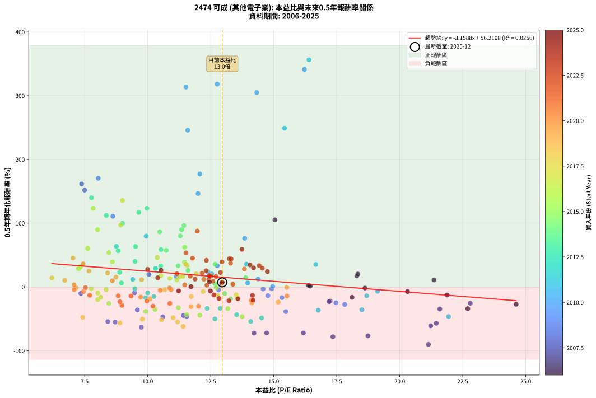
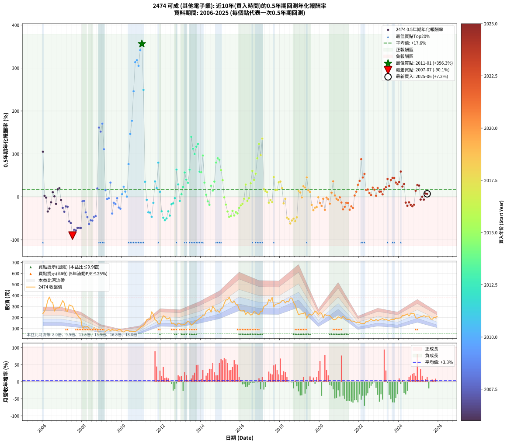

# 2474 可成 - 本益比與未來報酬率分析

!!! info "報告資訊"
    - **股票代號**: 2474
    - **公司名稱**: 可成
    - **產業別**: 其他電子業
    - **分析期間**: 2006-2025 (234 個數據點)
    - **資料來源**: Type 12 (ShowMonthlyK_ChartFlow) 月收盤價與本益比
    - **報酬率口徑**: 含現金股利 (簡化: 年度合計，假設每年7/1入帳)
    - **報告生成時間**: 2026-01-13 00:46:31 CST

## 📈 視覺化圖表

### 圖表1: 本益比 vs 未來報酬率關係

*圖表1：2474 可成 本益比與0.5年期未來報酬率關係 (2006-2025)*

### 圖表2: 歷年買入時點的0.5年期實際報酬率

*圖表2：2474 可成 歷年買入時點的0.5年期實際報酬率 (2006-2025)*

## 📍 買點訊號說明

本報告提供兩種買點提示訊號（顯示於圖表2的股價子圖中）：

### ▲ 小綠色三角形（回測驗證）
- **計算方式**: 使用全部歷史資料計算本益比第25百分位數
- **用途**: 事後驗證，顯示歷史上哪些時點確實為低估區
- **限制**: 當下無法判斷，僅供回測參考
- **特性**: 後見之明（Look-Ahead Bias）

### ▲ 小橘色三角形（即時訊號）
- **計算方式**: 使用截至當月的過去5年資料計算本益比第25百分位數
- **用途**: 實際投資決策，當時即可判斷
- **優勢**: 可操作性強，符合實務需求
- **特性**: 無後見之明，滾動窗口計算

!!! tip "如何使用兩種訊號"
    - **綠色▲** 幫助理解歷史估值機會，驗證策略有效性
    - **橘色▲** 可作為實際買進參考，但仍需搭配基本面分析
    - 兩種訊號重疊時，表示即時判斷與事後驗證一致，信心度較高
    - 僅有綠色▲時，表示當時無法判斷（需要未來資料才能確認）
    - 僅有橘色▲時，表示即時判斷為買點，但事後可能不是最佳時機

## 📊 估值分析摘要

| 指標 | 數值 |
|:---:|:---:|
| **目前本益比** (2025-06) | **12.96 倍** |
| **歷史平均本益比** | 12.23 倍 |
| **估值水準** | 🟡 合理範圍 |
| **預期0.5年年化報酬率** | **+15.27%** |
| **歷史平均報酬率** | +17.59% |
| **相關係數 (R²)** | 0.0256 |
| **趨勢線斜率** | -3.1588 |

!!! abstract "核心洞察"
    目前本益比接近歷史平均，預期報酬率符合長期趨勢

    根據歷史數據回測，2474 可成 在目前本益比 **13.0倍** 的估值水準下，
    預期未來0.5年年化報酬率約為 **+15.3%**。

    **重要提醒**: 本分析基於歷史數據統計，實際報酬率會受到公司基本面變化、產業趨勢、
    總體經濟環境等多重因素影響。R² = 0.03 表示本益比可解釋約 2.6% 的報酬率變異。

## 📈 歷史估值統計

### 最佳買點 (最高報酬率)

| 項目 | 數值 |
|:---:|:---:|
| 起始時間 | 2011-01 |
| 當時本益比 | 16.40 倍 |
| 起始價格 | 120.5 元 |
| 0.5年後價格 | 252.0 元 |
| **0.5年年化報酬率** | **+356.34%** |

### 最差買點 (最低報酬率)

| 項目 | 數值 |
|:---:|:---:|
| 起始時間 | 2007-07 |
| 當時本益比 | 21.14 倍 |
| 起始價格 | 302.0 元 |
| 0.5年後價格 | 94.0 元 |
| **0.5年年化報酬率** | **-90.14%** |

## 🎯 投資啟示

### 本益比與報酬率關係

趨勢線方程式: **y = -3.1588x + 56.2108**

!!! warning "強負相關"
    本益比與未來報酬率呈現強負相關。在高本益比時期買入，未來報酬率顯著較低；
    在低本益比時期買入，未來報酬率顯著較高。**估值紀律至關重要**。

### 估值區間建議

基於歷史數據分析:

- **🟢 低估區** (P/E < 9.8): 預期報酬率較高，可考慮增加持股
- **🟡 合理區** (P/E 9.8-14.7): 預期報酬率符合長期趨勢，正常持有
- **🔴 高估區** (P/E > 14.7): 預期報酬率較低，可考慮減碼或觀望

!!! danger "風險提示"
    - 過去表現不代表未來結果
    - 本分析假設公司基本面無重大結構性變化
    - 產業環境劇變可能使歷史規律失效
    - 應結合公司財報、產業趨勢、總體經濟等多重因素綜合判斷

!!! success "長期投資觀點"
    歷史數據顯示，在合理或低估的估值水準買入並長期持有，
    往往能獲得較佳的投資報酬。**耐心等待好價格**是價值投資的核心原則。

## 📊 數據品質

- **資料來源**: GoodInfo.tw Type 12 (ShowMonthlyK_ChartFlow)
- **資料頻率**: 月度收盤價與本益比
- **回測期間**: 2006-2025
- **數據點數量**: 234 個 (每個點代表一次0.5年期回測)

### 計算方法說明

1. **0.5年期年化報酬率**:
   - 對每個歷史時點，計算其後0.5年的實際投資報酬率
   - 期末價值(不含股利): 期末價格
   - 期末價值(含現金股利): 期末價格 + 持有期間內的現金股利合計 (簡化: 年度合計，假設每年7/1入帳)
   - 公式: 年化報酬率 = [(期末價值/期初價格)^(1/年數) - 1] × 100%

2. **本益比 (P/E Ratio)**:
   - 使用當時的月收盤價與EPS計算
   - 資料來源: Type 12 月度河流圖本益比數據

3. **趨勢線 (Linear Regression)**:
   - 使用最小平方法擬合線性趨勢線
   - R²值衡量本益比對報酬率的解釋能力

---

*本報告由 Stock Analysis System v1.9.0 自動生成*
*數據更新時間: 2026-01-13 00:46:31 CST*

## 📋 月度回測明細表

（每一列對應時間線圖中的一個買入點；可用來對照 SVG 圖上的每個點。）

| 買入月份 | 賣出月份 | 回測期限_年 | 實際持有年數 | 買入本益比_倍 | 買入收盤價_元 | 賣出收盤價_元 | 現金股利合計_元 | 總報酬率_pct | 年化報酬率_pct |
| --- | --- | --- | --- | --- | --- | --- | --- | --- | --- |
| 2006-01 | 2006-07 | 0.5 | 0.496 | 15.05 | 236.00 | 335.00 | 1.99 | +42.79 | +105.20 |
| 2006-02 | 2006-08 | 0.5 | 0.498 | 16.39 | 257.00 | 258.00 | 1.99 | +1.16 | +2.34 |
| 2006-03 | 2006-10 | 0.5 | 0.586 | 18.62 | 292.00 | 287.00 | 1.99 | -1.03 | -1.76 |
| 2006-04 | 2006-10 | 0.5 | 0.501 | 22.70 | 356.00 | 287.00 | 1.99 | -18.82 | -34.05 |
| 2006-05 | 2006-12 | 0.5 | 0.586 | 24.62 | 386.00 | 318.50 | 1.99 | -16.97 | -27.20 |
| 2006-06 | 2006-12 | 0.5 | 0.501 | 21.88 | 343.00 | 318.50 | 1.99 | -6.56 | -12.67 |
| 2006-07 | 2007-01 | 0.5 | 0.504 | 21.36 | 335.00 | 353.00 | 0.00 | +5.37 | +10.95 |
| 2006-08 | 2007-03 | 0.5 | 0.580 | 16.45 | 258.00 | 260.00 | 0.00 | +0.78 | +1.34 |
| 2006-09 | 2007-03 | 0.5 | 0.496 | 18.11 | 284.00 | 260.00 | 0.00 | -8.45 | -16.32 |
| 2006-10 | 2007-05 | 0.5 | 0.580 | 18.30 | 287.00 | 315.00 | 0.00 | +9.76 | +17.40 |
| 2006-11 | 2007-05 | 0.5 | 0.496 | 18.34 | 287.50 | 315.00 | 0.00 | +9.57 | +20.24 |
| 2006-12 | 2007-07 | 0.5 | 0.580 | 20.31 | 318.50 | 302.00 | 3.00 | -4.24 | -7.19 |
| 2007-01 | 2007-07 | 0.5 | 0.496 | 22.80 | 353.00 | 302.00 | 3.00 | -13.60 | -25.54 |
| 2007-02 | 2007-08 | 0.5 | 0.498 | 21.59 | 330.00 | 264.00 | 3.00 | -19.09 | -34.63 |
| 2007-03 | 2007-10 | 0.5 | 0.586 | 17.24 | 260.00 | 221.50 | 3.00 | -13.65 | -22.16 |
| 2007-04 | 2007-10 | 0.5 | 0.501 | 17.20 | 256.00 | 221.50 | 3.00 | -12.30 | -23.05 |
| 2007-05 | 2007-12 | 0.5 | 0.586 | 21.45 | 315.00 | 189.00 | 3.00 | -39.05 | -57.04 |
| 2007-06 | 2007-12 | 0.5 | 0.501 | 21.23 | 307.50 | 189.00 | 3.00 | -37.56 | -60.94 |
| 2007-07 | 2008-01 | 0.5 | 0.504 | 21.14 | 302.00 | 94.00 | 0.00 | -68.87 | -90.14 |
| 2007-08 | 2008-03 | 0.5 | 0.583 | 18.74 | 264.00 | 113.00 | 0.00 | -57.20 | -76.66 |
| 2007-09 | 2008-03 | 0.5 | 0.498 | 17.35 | 241.00 | 113.00 | 0.00 | -53.11 | -78.13 |
| 2007-10 | 2008-05 | 0.5 | 0.583 | 16.18 | 221.50 | 105.00 | 0.00 | -52.60 | -72.20 |
| 2007-11 | 2008-05 | 0.5 | 0.498 | 14.72 | 198.50 | 105.00 | 0.00 | -47.10 | -72.14 |
| 2007-12 | 2008-07 | 0.5 | 0.583 | 14.22 | 189.00 | 85.10 | 4.00 | -52.86 | -72.46 |
| 2008-01 | 2008-07 | 0.5 | 0.498 | 7.35 | 94.00 | 85.10 | 4.00 | -5.21 | -10.19 |
| 2008-02 | 2008-08 | 0.5 | 0.501 | 9.48 | 116.50 | 107.00 | 4.00 | -4.72 | -9.20 |
| 2008-03 | 2008-10 | 0.5 | 0.586 | 9.59 | 113.00 | 83.00 | 4.00 | -23.01 | -36.00 |
| 2008-04 | 2008-10 | 0.5 | 0.501 | 10.60 | 119.50 | 83.00 | 4.00 | -27.20 | -46.93 |
| 2008-05 | 2008-12 | 0.5 | 0.586 | 9.75 | 105.00 | 54.40 | 4.00 | -44.38 | -63.26 |
| 2008-06 | 2008-12 | 0.5 | 0.501 | 8.42 | 86.50 | 54.40 | 4.00 | -32.49 | -54.34 |
| 2008-07 | 2009-01 | 0.5 | 0.504 | 8.71 | 85.10 | 56.80 | 0.00 | -33.25 | -55.18 |
| 2008-08 | 2009-03 | 0.5 | 0.580 | 11.55 | 107.00 | 74.50 | 0.00 | -30.37 | -46.41 |
| 2008-09 | 2009-03 | 0.5 | 0.496 | 11.42 | 100.00 | 74.50 | 0.00 | -25.50 | -44.79 |
| 2008-10 | 2009-05 | 0.5 | 0.580 | 10.05 | 83.00 | 92.10 | 0.00 | +10.96 | +19.63 |
| 2008-11 | 2009-05 | 0.5 | 0.496 | 7.38 | 57.20 | 92.10 | 0.00 | +61.01 | +161.48 |
| 2008-12 | 2009-07 | 0.5 | 0.580 | 7.50 | 54.40 | 92.00 | 1.00 | +70.96 | +151.90 |
| 2009-01 | 2009-07 | 0.5 | 0.496 | 8.04 | 56.80 | 92.00 | 1.00 | +63.73 | +170.47 |
| 2009-02 | 2009-08 | 0.5 | 0.498 | 8.62 | 59.30 | 85.00 | 1.00 | +45.03 | +110.86 |
| 2009-03 | 2009-10 | 0.5 | 0.586 | 11.14 | 74.50 | 80.30 | 1.00 | +9.13 | +16.08 |
| 2009-04 | 2009-10 | 0.5 | 0.501 | 12.81 | 83.30 | 80.30 | 1.00 | -2.40 | -4.73 |
| 2009-05 | 2009-12 | 0.5 | 0.586 | 14.58 | 92.10 | 89.30 | 1.00 | -1.95 | -3.31 |
| 2009-06 | 2009-12 | 0.5 | 0.501 | 12.76 | 78.20 | 89.30 | 1.00 | +15.47 | +33.26 |
| 2009-07 | 2010-01 | 0.5 | 0.504 | 15.48 | 92.00 | 71.90 | 0.00 | -21.85 | -38.70 |
| 2009-08 | 2010-03 | 0.5 | 0.580 | 14.77 | 85.00 | 78.00 | 0.00 | -8.24 | -13.76 |
| 2009-09 | 2010-03 | 0.5 | 0.496 | 15.33 | 85.40 | 78.00 | 0.00 | -8.67 | -16.72 |
| 2009-10 | 2010-05 | 0.5 | 0.580 | 14.92 | 80.30 | 78.90 | 0.00 | -1.74 | -2.98 |
| 2009-11 | 2010-05 | 0.5 | 0.496 | 17.47 | 90.80 | 78.90 | 0.00 | -13.11 | -24.68 |
| 2009-12 | 2010-07 | 0.5 | 0.580 | 17.82 | 89.30 | 72.10 | 2.00 | -17.02 | -27.49 |
| 2010-01 | 2010-07 | 0.5 | 0.496 | 13.97 | 71.90 | 72.10 | 2.00 | +3.06 | +6.27 |
| 2010-02 | 2010-08 | 0.5 | 0.498 | 12.39 | 65.50 | 70.80 | 2.00 | +11.15 | +23.62 |
| 2010-03 | 2010-10 | 0.5 | 0.586 | 14.38 | 78.00 | 81.50 | 2.00 | +7.05 | +12.33 |
| 2010-04 | 2010-10 | 0.5 | 0.501 | 14.96 | 83.20 | 81.50 | 2.00 | +0.36 | +0.72 |
| 2010-05 | 2010-12 | 0.5 | 0.586 | 13.85 | 78.90 | 108.00 | 2.00 | +39.42 | +76.33 |
| 2010-06 | 2010-12 | 0.5 | 0.501 | 12.00 | 70.00 | 108.00 | 2.00 | +57.14 | +146.48 |
| 2010-07 | 2011-01 | 0.5 | 0.504 | 12.07 | 72.10 | 120.50 | 0.00 | +67.13 | +177.19 |
| 2010-08 | 2011-03 | 0.5 | 0.580 | 11.59 | 70.80 | 145.50 | 0.00 | +105.51 | +245.91 |
| 2010-09 | 2011-03 | 0.5 | 0.496 | 11.52 | 72.00 | 145.50 | 0.00 | +102.08 | +313.57 |
| 2010-10 | 2011-05 | 0.5 | 0.580 | 12.76 | 81.50 | 187.00 | 0.00 | +129.45 | +318.23 |
| 2010-11 | 2011-05 | 0.5 | 0.496 | 14.33 | 93.50 | 187.00 | 0.00 | +100.00 | +305.01 |
| 2010-12 | 2011-07 | 0.5 | 0.580 | 16.22 | 108.00 | 252.00 | 3.68 | +136.74 | +341.39 |
| 2011-01 | 2011-07 | 0.5 | 0.496 | 16.40 | 120.50 | 252.00 | 3.68 | +112.18 | +356.34 |
| 2011-02 | 2011-08 | 0.5 | 0.498 | 15.43 | 124.00 | 227.50 | 3.68 | +86.44 | +249.07 |
| 2011-03 | 2011-10 | 0.5 | 0.586 | 16.67 | 145.50 | 170.00 | 3.68 | +19.37 | +35.28 |
| 2011-04 | 2011-10 | 0.5 | 0.501 | 19.12 | 180.00 | 170.00 | 3.68 | -3.51 | -6.89 |
| 2011-05 | 2011-12 | 0.5 | 0.586 | 18.50 | 187.00 | 140.50 | 3.68 | -22.90 | -35.84 |
| 2011-06 | 2011-12 | 0.5 | 0.501 | 16.77 | 181.00 | 140.50 | 3.68 | -20.34 | -36.49 |
| 2011-07 | 2012-01 | 0.5 | 0.504 | 21.94 | 252.00 | 184.00 | 0.00 | -26.98 | -46.44 |
| 2011-08 | 2012-03 | 0.5 | 0.583 | 18.69 | 227.50 | 208.50 | 0.00 | -8.35 | -13.89 |
| 2011-09 | 2012-03 | 0.5 | 0.498 | 13.92 | 179.00 | 208.50 | 0.00 | +16.48 | +35.82 |
| 2011-10 | 2012-05 | 0.5 | 0.583 | 12.54 | 170.00 | 189.50 | 0.00 | +11.47 | +20.47 |
| 2011-11 | 2012-05 | 0.5 | 0.498 | 9.94 | 141.50 | 189.50 | 0.00 | +33.92 | +79.71 |
| 2011-12 | 2012-07 | 0.5 | 0.583 | 9.41 | 140.50 | 145.00 | 5.00 | +6.76 | +11.87 |
| 2012-01 | 2012-07 | 0.5 | 0.498 | 12.36 | 184.00 | 145.00 | 5.00 | -18.48 | -33.64 |
| 2012-02 | 2012-08 | 0.5 | 0.501 | 14.52 | 215.50 | 149.50 | 5.00 | -28.31 | -48.53 |
| 2012-03 | 2012-10 | 0.5 | 0.586 | 14.09 | 208.50 | 127.00 | 5.00 | -36.69 | -54.17 |
| 2012-04 | 2012-10 | 0.5 | 0.501 | 12.67 | 187.00 | 127.00 | 5.00 | -29.41 | -50.10 |
| 2012-05 | 2012-12 | 0.5 | 0.586 | 12.88 | 189.50 | 144.00 | 5.00 | -21.37 | -33.66 |
| 2012-06 | 2012-12 | 0.5 | 0.501 | 13.53 | 198.50 | 144.00 | 5.00 | -24.94 | -43.59 |
| 2012-07 | 2013-01 | 0.5 | 0.504 | 9.92 | 145.00 | 132.00 | 0.00 | -8.97 | -17.01 |
| 2012-08 | 2013-03 | 0.5 | 0.580 | 10.25 | 149.50 | 136.00 | 0.00 | -9.03 | -15.05 |
| 2012-09 | 2013-03 | 0.5 | 0.496 | 9.49 | 138.00 | 136.00 | 0.00 | -1.45 | -2.90 |
| 2012-10 | 2013-05 | 0.5 | 0.580 | 8.76 | 127.00 | 169.00 | 0.00 | +33.07 | +63.60 |
| 2012-11 | 2013-05 | 0.5 | 0.496 | 10.31 | 149.00 | 169.00 | 0.00 | +13.42 | +28.94 |
| 2012-12 | 2013-07 | 0.5 | 0.580 | 10.00 | 144.00 | 130.00 | 6.00 | -5.56 | -9.38 |
| 2013-01 | 2013-07 | 0.5 | 0.496 | 8.96 | 132.00 | 130.00 | 6.00 | +3.03 | +6.21 |
| 2013-02 | 2013-08 | 0.5 | 0.498 | 8.89 | 134.00 | 142.50 | 6.00 | +10.82 | +22.90 |
| 2013-03 | 2013-10 | 0.5 | 0.586 | 8.83 | 136.00 | 171.00 | 6.00 | +30.15 | +56.79 |
| 2013-04 | 2013-10 | 0.5 | 0.501 | 9.50 | 149.50 | 171.00 | 6.00 | +18.39 | +40.08 |
| 2013-05 | 2013-12 | 0.5 | 0.586 | 10.52 | 169.00 | 193.50 | 6.00 | +18.05 | +32.73 |
| 2013-06 | 2013-12 | 0.5 | 0.501 | 9.52 | 156.00 | 193.50 | 6.00 | +27.88 | +63.38 |
| 2013-07 | 2014-01 | 0.5 | 0.504 | 7.77 | 130.00 | 202.00 | 0.00 | +55.38 | +139.86 |
| 2013-08 | 2014-03 | 0.5 | 0.580 | 8.36 | 142.50 | 220.50 | 0.00 | +54.74 | +112.15 |
| 2013-09 | 2014-03 | 0.5 | 0.496 | 9.00 | 156.50 | 220.50 | 0.00 | +40.89 | +99.74 |
| 2013-10 | 2014-05 | 0.5 | 0.580 | 9.65 | 171.00 | 268.00 | 0.00 | +56.73 | +116.87 |
| 2013-11 | 2014-05 | 0.5 | 0.496 | 9.97 | 180.00 | 268.00 | 0.00 | +48.89 | +123.27 |
| 2013-12 | 2014-07 | 0.5 | 0.580 | 10.53 | 193.50 | 248.00 | 4.90 | +30.70 | +58.61 |
| 2014-01 | 2014-07 | 0.5 | 0.496 | 10.74 | 202.00 | 248.00 | 4.90 | +25.20 | +57.38 |
| 2014-02 | 2014-08 | 0.5 | 0.498 | 11.44 | 220.00 | 303.00 | 4.90 | +39.96 | +96.33 |
| 2014-03 | 2014-10 | 0.5 | 0.586 | 11.21 | 220.50 | 256.00 | 4.90 | +18.32 | +33.26 |
| 2014-04 | 2014-10 | 0.5 | 0.501 | 12.67 | 254.50 | 256.00 | 4.90 | +2.52 | +5.08 |
| 2014-05 | 2014-12 | 0.5 | 0.586 | 13.06 | 268.00 | 246.50 | 4.90 | -6.19 | -10.34 |
| 2014-06 | 2014-12 | 0.5 | 0.501 | 13.29 | 278.50 | 246.50 | 4.90 | -9.73 | -18.48 |
| 2014-07 | 2015-01 | 0.5 | 0.504 | 11.60 | 248.00 | 278.50 | 0.00 | +12.30 | +25.89 |
| 2014-08 | 2015-03 | 0.5 | 0.580 | 13.89 | 303.00 | 328.00 | 0.00 | +8.25 | +14.64 |
| 2014-09 | 2015-03 | 0.5 | 0.496 | 12.68 | 282.00 | 328.00 | 0.00 | +16.31 | +35.65 |
| 2014-10 | 2015-05 | 0.5 | 0.580 | 11.30 | 256.00 | 360.00 | 0.00 | +40.62 | +79.93 |
| 2014-11 | 2015-05 | 0.5 | 0.496 | 11.35 | 262.00 | 360.00 | 0.00 | +37.40 | +89.88 |
| 2014-12 | 2015-07 | 0.5 | 0.580 | 10.48 | 246.50 | 348.00 | 6.00 | +43.61 | +86.56 |
| 2015-01 | 2015-07 | 0.5 | 0.496 | 11.47 | 278.50 | 348.00 | 6.00 | +27.11 | +62.27 |
| 2015-02 | 2015-08 | 0.5 | 0.498 | 11.46 | 287.00 | 332.00 | 6.00 | +17.77 | +38.85 |
| 2015-03 | 2015-10 | 0.5 | 0.586 | 12.72 | 328.00 | 320.00 | 6.00 | -0.61 | -1.04 |
| 2015-04 | 2015-10 | 0.5 | 0.501 | 13.56 | 360.00 | 320.00 | 6.00 | -9.44 | -17.96 |
| 2015-05 | 2015-12 | 0.5 | 0.586 | 13.18 | 360.00 | 276.00 | 6.00 | -21.67 | -34.08 |
| 2015-06 | 2015-12 | 0.5 | 0.501 | 13.75 | 386.00 | 276.00 | 6.00 | -26.94 | -46.56 |
| 2015-07 | 2016-01 | 0.5 | 0.504 | 12.07 | 348.00 | 259.00 | 0.00 | -25.57 | -44.36 |
| 2015-08 | 2016-03 | 0.5 | 0.583 | 11.22 | 332.00 | 264.00 | 0.00 | -20.48 | -32.50 |
| 2015-09 | 2016-03 | 0.5 | 0.498 | 11.55 | 350.50 | 264.00 | 0.00 | -24.68 | -43.38 |
| 2015-10 | 2016-05 | 0.5 | 0.583 | 10.29 | 320.00 | 248.00 | 0.00 | -22.50 | -35.41 |
| 2015-11 | 2016-05 | 0.5 | 0.498 | 9.92 | 316.00 | 248.00 | 0.00 | -21.52 | -38.51 |
| 2015-12 | 2016-07 | 0.5 | 0.583 | 8.46 | 276.00 | 222.00 | 10.00 | -15.94 | -25.75 |
| 2016-01 | 2016-07 | 0.5 | 0.498 | 8.02 | 259.00 | 222.00 | 10.00 | -10.42 | -19.82 |
| 2016-02 | 2016-08 | 0.5 | 0.501 | 8.14 | 260.00 | 228.00 | 10.00 | -8.46 | -16.18 |
| 2016-03 | 2016-10 | 0.5 | 0.586 | 8.35 | 264.00 | 247.50 | 10.00 | -2.46 | -4.17 |
| 2016-04 | 2016-10 | 0.5 | 0.501 | 7.26 | 227.00 | 247.50 | 10.00 | +13.44 | +28.61 |
| 2016-05 | 2016-12 | 0.5 | 0.586 | 8.02 | 248.00 | 224.00 | 10.00 | -5.65 | -9.44 |
| 2016-06 | 2016-12 | 0.5 | 0.501 | 7.76 | 237.50 | 224.00 | 10.00 | -1.47 | -2.92 |
| 2016-07 | 2017-01 | 0.5 | 0.504 | 7.34 | 222.00 | 255.00 | 0.00 | +14.86 | +31.67 |
| 2016-08 | 2017-03 | 0.5 | 0.580 | 7.62 | 228.00 | 300.00 | 0.00 | +31.58 | +60.45 |
| 2016-09 | 2017-03 | 0.5 | 0.496 | 8.60 | 254.50 | 300.00 | 0.00 | +17.88 | +39.36 |
| 2016-10 | 2017-05 | 0.5 | 0.580 | 8.46 | 247.50 | 318.00 | 0.00 | +28.48 | +54.01 |
| 2016-11 | 2017-05 | 0.5 | 0.496 | 8.01 | 231.50 | 318.00 | 0.00 | +37.37 | +89.77 |
| 2016-12 | 2017-07 | 0.5 | 0.580 | 7.84 | 224.00 | 347.00 | 10.00 | +59.38 | +123.23 |
| 2017-01 | 2017-07 | 0.5 | 0.496 | 8.93 | 255.00 | 347.00 | 10.00 | +40.00 | +97.19 |
| 2017-02 | 2017-08 | 0.5 | 0.498 | 9.00 | 257.00 | 384.00 | 10.00 | +53.31 | +135.72 |
| 2017-03 | 2017-10 | 0.5 | 0.586 | 10.52 | 300.00 | 320.00 | 10.00 | +10.00 | +17.67 |
| 2017-04 | 2017-10 | 0.5 | 0.501 | 10.88 | 310.00 | 320.00 | 10.00 | +6.45 | +13.29 |
| 2017-05 | 2017-12 | 0.5 | 0.586 | 11.16 | 318.00 | 328.00 | 10.00 | +6.29 | +10.97 |
| 2017-06 | 2017-12 | 0.5 | 0.501 | 12.77 | 363.50 | 328.00 | 10.00 | -7.02 | -13.51 |
| 2017-07 | 2018-01 | 0.5 | 0.504 | 12.20 | 347.00 | 334.00 | 0.00 | -3.75 | -7.30 |
| 2017-08 | 2018-03 | 0.5 | 0.580 | 13.51 | 384.00 | 356.00 | 0.00 | -7.29 | -12.23 |
| 2017-09 | 2018-03 | 0.5 | 0.496 | 10.38 | 295.00 | 356.00 | 0.00 | +20.68 | +46.12 |
| 2017-10 | 2018-05 | 0.5 | 0.580 | 11.27 | 320.00 | 348.50 | 0.00 | +8.91 | +15.83 |
| 2017-11 | 2018-05 | 0.5 | 0.496 | 11.39 | 323.00 | 348.50 | 0.00 | +7.89 | +16.57 |
| 2017-12 | 2018-07 | 0.5 | 0.580 | 11.57 | 328.00 | 376.50 | 12.00 | +18.45 | +33.86 |
| 2018-01 | 2018-07 | 0.5 | 0.496 | 11.51 | 334.00 | 376.50 | 12.00 | +16.32 | +35.66 |
| 2018-02 | 2018-08 | 0.5 | 0.498 | 11.93 | 354.00 | 376.50 | 12.00 | +9.75 | +20.52 |
| 2018-03 | 2018-10 | 0.5 | 0.586 | 11.73 | 356.00 | 311.50 | 12.00 | -9.13 | -15.07 |
| 2018-04 | 2018-10 | 0.5 | 0.501 | 10.68 | 331.00 | 311.50 | 12.00 | -2.27 | -4.47 |
| 2018-05 | 2018-12 | 0.5 | 0.586 | 11.01 | 348.50 | 225.00 | 12.00 | -31.99 | -48.22 |
| 2018-06 | 2018-12 | 0.5 | 0.501 | 10.55 | 341.00 | 225.00 | 12.00 | -30.50 | -51.62 |
| 2018-07 | 2019-01 | 0.5 | 0.504 | 11.41 | 376.50 | 231.50 | 0.00 | -38.51 | -61.92 |
| 2018-08 | 2019-03 | 0.5 | 0.580 | 11.19 | 376.50 | 237.00 | 0.00 | -37.05 | -54.95 |
| 2018-09 | 2019-03 | 0.5 | 0.496 | 9.79 | 336.00 | 237.00 | 0.00 | -29.46 | -50.56 |
| 2018-10 | 2019-05 | 0.5 | 0.580 | 8.90 | 311.50 | 192.00 | 0.00 | -38.36 | -56.56 |
| 2018-11 | 2019-05 | 0.5 | 0.496 | 7.42 | 264.50 | 192.00 | 0.00 | -27.41 | -47.61 |
| 2018-12 | 2019-07 | 0.5 | 0.580 | 6.20 | 225.00 | 231.00 | 12.00 | +8.00 | +14.18 |
| 2019-01 | 2019-07 | 0.5 | 0.496 | 6.71 | 231.50 | 231.00 | 12.00 | +4.97 | +10.28 |
| 2019-02 | 2019-08 | 0.5 | 0.498 | 7.16 | 234.00 | 220.50 | 12.00 | -0.64 | -1.28 |
| 2019-03 | 2019-10 | 0.5 | 0.586 | 7.67 | 237.00 | 258.00 | 12.00 | +13.92 | +24.92 |
| 2019-04 | 2019-10 | 0.5 | 0.501 | 8.41 | 244.50 | 258.00 | 12.00 | +10.43 | +21.90 |
| 2019-05 | 2019-12 | 0.5 | 0.586 | 7.04 | 192.00 | 227.00 | 12.00 | +24.48 | +45.31 |
| 2019-06 | 2019-12 | 0.5 | 0.501 | 8.74 | 222.50 | 227.00 | 12.00 | +7.42 | +15.35 |
| 2019-07 | 2020-01 | 0.5 | 0.504 | 9.76 | 231.00 | 244.00 | 0.00 | +5.63 | +11.48 |
| 2019-08 | 2020-03 | 0.5 | 0.583 | 10.09 | 220.50 | 195.50 | 0.00 | -11.34 | -18.65 |
| 2019-09 | 2020-03 | 0.5 | 0.498 | 11.72 | 235.00 | 195.50 | 0.00 | -16.81 | -30.88 |
| 2019-10 | 2020-05 | 0.5 | 0.583 | 14.14 | 258.00 | 218.00 | 0.00 | -15.50 | -25.09 |
| 2019-11 | 2020-05 | 0.5 | 0.498 | 15.18 | 249.50 | 218.00 | 0.00 | -12.63 | -23.73 |
| 2019-12 | 2020-07 | 0.5 | 0.583 | 15.52 | 227.00 | 216.00 | 10.00 | -0.44 | -0.75 |
| 2020-01 | 2020-07 | 0.5 | 0.498 | 15.53 | 244.00 | 216.00 | 10.00 | -7.38 | -14.26 |
| 2020-02 | 2020-08 | 0.5 | 0.501 | 14.11 | 237.00 | 200.50 | 10.00 | -11.18 | -21.07 |
| 2020-03 | 2020-10 | 0.5 | 0.586 | 10.93 | 195.50 | 180.50 | 10.00 | -2.56 | -4.33 |
| 2020-04 | 2020-10 | 0.5 | 0.501 | 12.02 | 228.00 | 180.50 | 10.00 | -16.45 | -30.14 |
| 2020-05 | 2020-12 | 0.5 | 0.586 | 10.87 | 218.00 | 206.00 | 10.00 | -0.92 | -1.56 |
| 2020-06 | 2020-12 | 0.5 | 0.501 | 10.50 | 222.00 | 206.00 | 10.00 | -2.70 | -5.32 |
| 2020-07 | 2021-01 | 0.5 | 0.504 | 9.72 | 216.00 | 198.00 | 0.00 | -8.33 | -15.86 |
| 2020-08 | 2021-03 | 0.5 | 0.580 | 8.60 | 200.50 | 211.50 | 0.00 | +5.49 | +9.64 |
| 2020-09 | 2021-03 | 0.5 | 0.496 | 7.44 | 181.50 | 211.50 | 0.00 | +16.53 | +36.16 |
| 2020-10 | 2021-05 | 0.5 | 0.580 | 7.08 | 180.50 | 184.00 | 0.00 | +1.94 | +3.36 |
| 2020-11 | 2021-05 | 0.5 | 0.496 | 7.08 | 188.00 | 184.00 | 0.00 | -2.13 | -4.25 |
| 2020-12 | 2021-07 | 0.5 | 0.580 | 7.45 | 206.00 | 185.00 | 12.00 | -4.37 | -7.41 |
| 2021-01 | 2021-07 | 0.5 | 0.496 | 7.53 | 198.00 | 185.00 | 12.00 | -0.51 | -1.02 |
| 2021-02 | 2021-08 | 0.5 | 0.498 | 7.70 | 192.00 | 167.00 | 12.00 | -6.77 | -13.13 |
| 2021-03 | 2021-10 | 0.5 | 0.586 | 8.98 | 211.50 | 161.00 | 12.00 | -18.20 | -29.03 |
| 2021-04 | 2021-10 | 0.5 | 0.501 | 8.90 | 197.50 | 161.00 | 12.00 | -12.41 | -23.23 |
| 2021-05 | 2021-12 | 0.5 | 0.586 | 8.83 | 184.00 | 156.50 | 12.00 | -8.42 | -13.95 |
| 2021-06 | 2021-12 | 0.5 | 0.501 | 9.34 | 182.00 | 156.50 | 12.00 | -7.42 | -14.26 |
| 2021-07 | 2022-01 | 0.5 | 0.504 | 10.21 | 185.00 | 154.50 | 0.00 | -16.49 | -30.07 |
| 2021-08 | 2022-03 | 0.5 | 0.580 | 9.97 | 167.00 | 144.50 | 0.00 | -13.47 | -22.07 |
| 2021-09 | 2022-03 | 0.5 | 0.496 | 10.88 | 167.50 | 144.50 | 0.00 | -13.73 | -25.77 |
| 2021-10 | 2022-05 | 0.5 | 0.580 | 11.47 | 161.00 | 164.00 | 0.00 | +1.86 | +3.23 |
| 2021-11 | 2022-05 | 0.5 | 0.496 | 12.23 | 155.00 | 164.00 | 0.00 | +5.81 | +12.06 |
| 2021-12 | 2022-07 | 0.5 | 0.580 | 13.84 | 156.50 | 170.50 | 10.21 | +15.47 | +28.12 |
| 2022-01 | 2022-07 | 0.5 | 0.496 | 13.29 | 154.50 | 170.50 | 10.21 | +16.96 | +37.19 |
| 2022-02 | 2022-08 | 0.5 | 0.498 | 11.97 | 143.00 | 185.50 | 10.21 | +36.86 | +87.71 |
| 2022-03 | 2022-10 | 0.5 | 0.586 | 11.78 | 144.50 | 169.50 | 10.21 | +24.37 | +45.09 |
| 2022-04 | 2022-10 | 0.5 | 0.501 | 11.52 | 145.00 | 169.50 | 10.21 | +23.94 | +53.47 |
| 2022-05 | 2022-12 | 0.5 | 0.586 | 12.71 | 164.00 | 169.00 | 10.21 | +9.27 | +16.34 |
| 2022-06 | 2022-12 | 0.5 | 0.501 | 12.51 | 165.50 | 169.00 | 10.21 | +8.28 | +17.22 |
| 2022-07 | 2023-01 | 0.5 | 0.504 | 12.59 | 170.50 | 178.00 | 0.00 | +4.40 | +8.92 |
| 2022-08 | 2023-03 | 0.5 | 0.580 | 13.38 | 185.50 | 190.00 | 0.00 | +2.43 | +4.22 |
| 2022-09 | 2023-03 | 0.5 | 0.496 | 12.16 | 172.50 | 190.00 | 0.00 | +10.14 | +21.53 |
| 2022-10 | 2023-05 | 0.5 | 0.580 | 11.69 | 169.50 | 185.50 | 0.00 | +9.44 | +16.81 |
| 2022-11 | 2023-05 | 0.5 | 0.496 | 12.35 | 183.00 | 185.50 | 0.00 | +1.37 | +2.78 |
| 2022-12 | 2023-07 | 0.5 | 0.580 | 11.16 | 169.00 | 173.50 | 15.00 | +11.54 | +20.70 |
| 2023-01 | 2023-07 | 0.5 | 0.496 | 11.88 | 178.00 | 173.50 | 15.00 | +5.90 | +12.26 |
| 2023-02 | 2023-08 | 0.5 | 0.498 | 12.43 | 184.50 | 180.50 | 15.00 | +5.96 | +12.32 |
| 2023-03 | 2023-10 | 0.5 | 0.586 | 12.94 | 190.00 | 181.50 | 15.00 | +3.42 | +5.91 |
| 2023-04 | 2023-10 | 0.5 | 0.501 | 12.45 | 181.00 | 181.50 | 15.00 | +8.56 | +17.82 |
| 2023-05 | 2023-12 | 0.5 | 0.586 | 12.89 | 185.50 | 194.00 | 15.00 | +12.67 | +22.58 |
| 2023-06 | 2023-12 | 0.5 | 0.501 | 12.33 | 175.50 | 194.00 | 15.00 | +19.09 | +41.72 |
| 2023-07 | 2024-01 | 0.5 | 0.504 | 12.32 | 173.50 | 194.50 | 0.00 | +12.10 | +25.46 |
| 2023-08 | 2024-03 | 0.5 | 0.583 | 12.95 | 180.50 | 219.00 | 0.00 | +21.33 | +39.31 |
| 2023-09 | 2024-03 | 0.5 | 0.498 | 13.24 | 182.50 | 219.00 | 0.00 | +20.00 | +44.18 |
| 2023-10 | 2024-05 | 0.5 | 0.583 | 13.31 | 181.50 | 224.50 | 0.00 | +23.69 | +43.99 |
| 2023-11 | 2024-05 | 0.5 | 0.498 | 14.43 | 194.50 | 224.50 | 0.00 | +15.42 | +33.36 |
| 2023-12 | 2024-07 | 0.5 | 0.583 | 14.55 | 194.00 | 213.00 | 12.50 | +16.24 | +29.44 |
| 2024-01 | 2024-07 | 0.5 | 0.498 | 14.06 | 194.50 | 213.00 | 12.50 | +15.94 | +34.55 |
| 2024-02 | 2024-08 | 0.5 | 0.501 | 13.74 | 197.00 | 236.00 | 12.50 | +26.14 | +58.97 |
| 2024-03 | 2024-10 | 0.5 | 0.586 | 14.75 | 219.00 | 236.00 | 12.50 | +13.47 | +24.07 |
| 2024-04 | 2024-10 | 0.5 | 0.501 | 14.20 | 218.00 | 236.00 | 12.50 | +13.99 | +29.87 |
| 2024-05 | 2024-12 | 0.5 | 0.586 | 14.16 | 224.50 | 194.00 | 12.50 | -8.02 | -13.29 |
| 2024-06 | 2024-12 | 0.5 | 0.501 | 14.18 | 232.00 | 194.00 | 12.50 | -10.99 | -20.74 |
| 2024-07 | 2025-01 | 0.5 | 0.504 | 12.63 | 213.00 | 199.00 | 0.00 | -6.57 | -12.62 |
| 2024-08 | 2025-03 | 0.5 | 0.580 | 13.58 | 236.00 | 209.50 | 0.00 | -11.23 | -18.55 |
| 2024-09 | 2025-03 | 0.5 | 0.496 | 13.23 | 236.50 | 209.50 | 0.00 | -11.42 | -21.70 |
| 2024-10 | 2025-05 | 0.5 | 0.580 | 12.83 | 236.00 | 210.00 | 0.00 | -11.02 | -18.22 |
| 2024-11 | 2025-05 | 0.5 | 0.496 | 10.40 | 196.50 | 210.00 | 0.00 | +6.87 | +14.35 |
| 2024-12 | 2025-07 | 0.5 | 0.580 | 10.00 | 194.00 | 212.00 | 11.49 | +15.20 | +27.61 |
| 2025-01 | 2025-07 | 0.5 | 0.496 | 10.53 | 199.00 | 212.00 | 11.49 | +12.31 | +26.39 |
| 2025-02 | 2025-08 | 0.5 | 0.498 | 11.23 | 206.50 | 188.50 | 11.49 | -3.15 | -6.23 |
| 2025-03 | 2025-10 | 0.5 | 0.586 | 11.72 | 209.50 | 198.50 | 11.49 | +0.23 | +0.40 |
| 2025-04 | 2025-10 | 0.5 | 0.501 | 12.49 | 217.00 | 198.50 | 11.49 | -3.23 | -6.34 |
| 2025-05 | 2025-12 | 0.5 | 0.586 | 12.45 | 210.00 | 208.00 | 11.49 | +4.52 | +7.84 |
| 2025-06 | 2025-12 | 0.5 | 0.501 | 12.96 | 212.00 | 208.00 | 11.49 | +3.53 | +7.18 |
