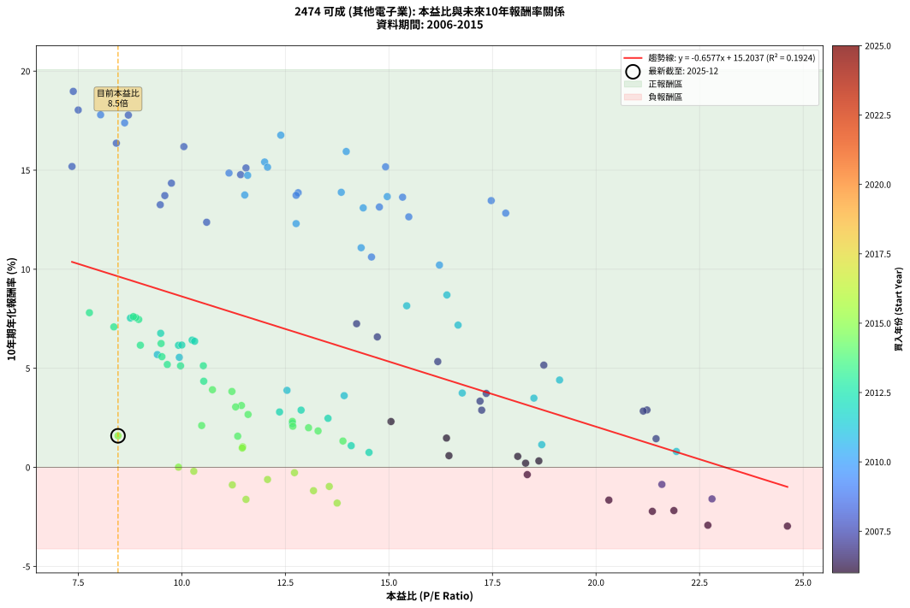
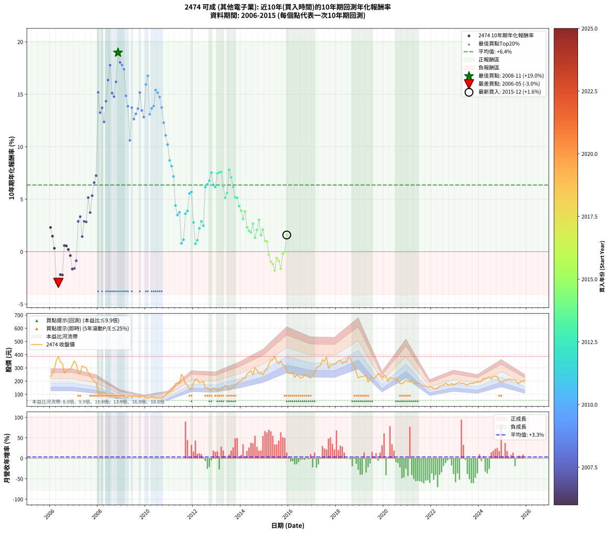

# 2474 可成 - 本益比與未來報酬率分析

!!! info "報告資訊"
    - **股票代號**: 2474
    - **公司名稱**: 可成
    - **產業別**: 其他電子業
    - **分析期間**: 2006-2015 (120 個數據點)
    - **資料來源**: Type 12 (ShowMonthlyK_ChartFlow) 月收盤價與本益比
    - **報酬率口徑**: 含現金股利 (簡化: 年度合計，假設每年7/1入帳)
    - **報告生成時間**: 2026-01-07 20:51:47 CST

## 📈 視覺化圖表

### 圖表1: 本益比 vs 未來報酬率關係

*圖表1：2474 可成 本益比與10年期未來報酬率關係 (2006-2015)*

### 圖表2: 歷年買入時點的10年期實際報酬率

*圖表2：2474 可成 歷年買入時點的10年期實際報酬率 (2006-2015)*

## 📍 買點訊號說明

本報告提供兩種買點提示訊號（顯示於圖表2的股價子圖中）：

### ▲ 小綠色三角形（回測驗證）
- **計算方式**: 使用全部歷史資料計算本益比第25百分位數
- **用途**: 事後驗證，顯示歷史上哪些時點確實為低估區
- **限制**: 當下無法判斷，僅供回測參考
- **特性**: 後見之明（Look-Ahead Bias）

### ▲ 小橘色三角形（即時訊號）
- **計算方式**: 使用截至當月的過去5年資料計算本益比第25百分位數
- **用途**: 實際投資決策，當時即可判斷
- **優勢**: 可操作性強，符合實務需求
- **特性**: 無後見之明，滾動窗口計算

!!! tip "如何使用兩種訊號"
    - **綠色▲** 幫助理解歷史估值機會，驗證策略有效性
    - **橘色▲** 可作為實際買進參考，但仍需搭配基本面分析
    - 兩種訊號重疊時，表示即時判斷與事後驗證一致，信心度較高
    - 僅有綠色▲時，表示當時無法判斷（需要未來資料才能確認）
    - 僅有橘色▲時，表示即時判斷為買點，但事後可能不是最佳時機

## 📊 估值分析摘要

| 指標 | 數值 |
|:---:|:---:|
| **目前本益比** (2015-12) | **8.46 倍** |
| **歷史平均本益比** | 13.45 倍 |
| **估值水準** | 🟢 相對低估 |
| **預期10年年化報酬率** | **+9.64%** |
| **歷史平均報酬率** | +6.36% |
| **相關係數 (R²)** | 0.1924 |
| **趨勢線斜率** | -0.6577 |

!!! abstract "核心洞察"
    目前本益比顯著低於歷史平均，預期未來報酬率可能較高

    根據歷史數據回測，2474 可成 在目前本益比 **8.5倍** 的估值水準下，
    預期未來10年年化報酬率約為 **+9.6%**。

    **重要提醒**: 本分析基於歷史數據統計，實際報酬率會受到公司基本面變化、產業趨勢、
    總體經濟環境等多重因素影響。R² = 0.19 表示本益比可解釋約 19.2% 的報酬率變異。

## 📈 歷史估值統計

### 最佳買點 (最高報酬率)

| 項目 | 數值 |
|:---:|:---:|
| 起始時間 | 2008-11 |
| 當時本益比 | 7.38 倍 |
| 起始價格 | 57.2 元 |
| 10年後價格 | 264.5 元 |
| **10年年化報酬率** | **+18.98%** |

### 最差買點 (最低報酬率)

| 項目 | 數值 |
|:---:|:---:|
| 起始時間 | 2006-05 |
| 當時本益比 | 24.62 倍 |
| 起始價格 | 386.0 元 |
| 10年後價格 | 248.0 元 |
| **10年年化報酬率** | **-2.97%** |

## 🎯 投資啟示

### 本益比與報酬率關係

趨勢線方程式: **y = -0.6577x + 15.2037**

!!! warning "強負相關"
    本益比與未來報酬率呈現強負相關。在高本益比時期買入，未來報酬率顯著較低；
    在低本益比時期買入，未來報酬率顯著較高。**估值紀律至關重要**。

### 估值區間建議

基於歷史數據分析:

- **🟢 低估區** (P/E < 10.8): 預期報酬率較高，可考慮增加持股
- **🟡 合理區** (P/E 10.8-16.1): 預期報酬率符合長期趨勢，正常持有
- **🔴 高估區** (P/E > 16.1): 預期報酬率較低，可考慮減碼或觀望

!!! danger "風險提示"
    - 過去表現不代表未來結果
    - 本分析假設公司基本面無重大結構性變化
    - 產業環境劇變可能使歷史規律失效
    - 應結合公司財報、產業趨勢、總體經濟等多重因素綜合判斷

!!! success "長期投資觀點"
    歷史數據顯示，在合理或低估的估值水準買入並長期持有，
    往往能獲得較佳的投資報酬。**耐心等待好價格**是價值投資的核心原則。

## 📊 數據品質

- **資料來源**: GoodInfo.tw Type 12 (ShowMonthlyK_ChartFlow)
- **資料頻率**: 月度收盤價與本益比
- **回測期間**: 2006-2015
- **數據點數量**: 120 個 (每個點代表一次10年期回測)

### 計算方法說明

1. **10年期年化報酬率**:
   - 對每個歷史時點，計算其後10年的實際投資報酬率
   - 期末價值(不含股利): 期末價格
   - 期末價值(含現金股利): 期末價格 + 持有期間內的現金股利合計 (簡化: 年度合計，假設每年7/1入帳)
   - 公式: 年化報酬率 = [(期末價值/期初價格)^(1/年數) - 1] × 100%

2. **本益比 (P/E Ratio)**:
   - 使用當時的月收盤價與EPS計算
   - 資料來源: Type 12 月度河流圖本益比數據

3. **趨勢線 (Linear Regression)**:
   - 使用最小平方法擬合線性趨勢線
   - R²值衡量本益比對報酬率的解釋能力

---

*本報告由 Stock Analysis System v1.9.0 自動生成*
*數據更新時間: 2026-01-07 20:51:47 CST*

## 📋 月度回測明細表

（每一列對應時間線圖中的一個買入點；可用來對照 SVG 圖上的每個點。）

| 買入月份 | 賣出月份 | 回測期限_年 | 實際持有年數 | 買入本益比_倍 | 買入收盤價_元 | 賣出收盤價_元 | 現金股利合計_元 | 總報酬率_pct | 年化報酬率_pct |
| --- | --- | --- | --- | --- | --- | --- | --- | --- | --- |
| 2006-01 | 2016-01 | 10 | 9.999 | 15.05 | 236.00 | 259.00 | 37.57 | +25.66 | +2.31 |
| 2006-02 | 2016-02 | 10 | 9.999 | 16.39 | 257.00 | 260.00 | 37.57 | +15.78 | +1.48 |
| 2006-03 | 2016-03 | 10 | 10.001 | 18.62 | 292.00 | 264.00 | 37.57 | +3.28 | +0.32 |
| 2006-04 | 2016-04 | 10 | 10.001 | 22.70 | 356.00 | 227.00 | 37.57 | -25.68 | -2.92 |
| 2006-05 | 2016-05 | 10 | 10.001 | 24.62 | 386.00 | 248.00 | 37.57 | -26.02 | -2.97 |
| 2006-06 | 2016-06 | 10 | 10.001 | 21.88 | 343.00 | 237.50 | 37.57 | -19.81 | -2.18 |
| 2006-07 | 2016-07 | 10 | 10.001 | 21.36 | 335.00 | 222.00 | 45.58 | -20.12 | -2.22 |
| 2006-08 | 2016-08 | 10 | 10.001 | 16.45 | 258.00 | 228.00 | 45.58 | +6.04 | +0.59 |
| 2006-09 | 2016-09 | 10 | 10.001 | 18.11 | 284.00 | 254.50 | 45.58 | +5.66 | +0.55 |
| 2006-10 | 2016-10 | 10 | 10.001 | 18.30 | 287.00 | 247.50 | 45.58 | +2.12 | +0.21 |
| 2006-11 | 2016-11 | 10 | 10.001 | 18.34 | 287.50 | 231.50 | 45.58 | -3.62 | -0.37 |
| 2006-12 | 2016-12 | 10 | 10.001 | 20.31 | 318.50 | 224.00 | 45.58 | -15.36 | -1.65 |
| 2007-01 | 2017-01 | 10 | 10.001 | 22.80 | 353.00 | 255.00 | 45.58 | -14.85 | -1.59 |
| 2007-02 | 2017-02 | 10 | 10.001 | 21.59 | 330.00 | 257.00 | 45.58 | -8.31 | -0.86 |
| 2007-03 | 2017-03 | 10 | 10.001 | 17.24 | 260.00 | 300.00 | 45.58 | +32.92 | +2.89 |
| 2007-04 | 2017-04 | 10 | 10.001 | 17.20 | 256.00 | 310.00 | 45.58 | +38.90 | +3.34 |
| 2007-05 | 2017-05 | 10 | 10.001 | 21.45 | 315.00 | 318.00 | 45.58 | +15.42 | +1.44 |
| 2007-06 | 2017-06 | 10 | 10.001 | 21.23 | 307.50 | 363.50 | 45.58 | +33.03 | +2.90 |
| 2007-07 | 2017-07 | 10 | 10.001 | 21.14 | 302.00 | 347.00 | 52.58 | +32.31 | +2.84 |
| 2007-08 | 2017-08 | 10 | 10.001 | 18.74 | 264.00 | 384.00 | 52.58 | +65.37 | +5.16 |
| 2007-09 | 2017-09 | 10 | 10.001 | 17.35 | 241.00 | 295.00 | 52.58 | +44.22 | +3.73 |
| 2007-10 | 2017-10 | 10 | 10.001 | 16.18 | 221.50 | 320.00 | 52.58 | +68.21 | +5.34 |
| 2007-11 | 2017-11 | 10 | 10.001 | 14.72 | 198.50 | 323.00 | 52.58 | +89.21 | +6.58 |
| 2007-12 | 2017-12 | 10 | 10.001 | 14.22 | 189.00 | 328.00 | 52.58 | +101.37 | +7.25 |
| 2008-01 | 2018-01 | 10 | 10.001 | 7.35 | 94.00 | 334.00 | 52.58 | +311.26 | +15.19 |
| 2008-02 | 2018-03 | 10 | 10.081 | 9.48 | 116.50 | 356.00 | 52.58 | +250.71 | +13.26 |
| 2008-03 | 2018-03 | 10 | 9.999 | 9.59 | 113.00 | 356.00 | 52.58 | +261.58 | +13.72 |
| 2008-04 | 2018-04 | 10 | 9.999 | 10.60 | 119.50 | 331.00 | 52.58 | +220.99 | +12.37 |
| 2008-05 | 2018-05 | 10 | 9.999 | 9.75 | 105.00 | 348.50 | 52.58 | +281.98 | +14.34 |
| 2008-06 | 2018-06 | 10 | 9.999 | 8.42 | 86.50 | 341.00 | 52.58 | +355.01 | +16.36 |
| 2008-07 | 2018-07 | 10 | 9.999 | 8.71 | 85.10 | 376.50 | 60.58 | +413.61 | +17.78 |
| 2008-08 | 2018-08 | 10 | 9.999 | 11.55 | 107.00 | 376.50 | 60.58 | +308.49 | +15.11 |
| 2008-09 | 2018-09 | 10 | 9.999 | 11.42 | 100.00 | 336.00 | 60.58 | +296.58 | +14.77 |
| 2008-10 | 2018-10 | 10 | 9.999 | 10.05 | 83.00 | 311.50 | 60.58 | +348.29 | +16.19 |
| 2008-11 | 2018-11 | 10 | 9.999 | 7.38 | 57.20 | 264.50 | 60.58 | +468.33 | +18.98 |
| 2008-12 | 2018-12 | 10 | 9.999 | 7.50 | 54.40 | 225.00 | 60.58 | +424.97 | +18.04 |
| 2009-01 | 2019-01 | 10 | 9.999 | 8.04 | 56.80 | 231.50 | 60.58 | +414.23 | +17.79 |
| 2009-02 | 2019-02 | 10 | 9.999 | 8.62 | 59.30 | 234.00 | 60.58 | +396.77 | +17.39 |
| 2009-03 | 2019-03 | 10 | 9.999 | 11.14 | 74.50 | 237.00 | 60.58 | +299.44 | +14.86 |
| 2009-04 | 2019-04 | 10 | 9.999 | 12.81 | 83.30 | 244.50 | 60.58 | +266.24 | +13.86 |
| 2009-05 | 2019-05 | 10 | 9.999 | 14.58 | 92.10 | 192.00 | 60.58 | +174.25 | +10.62 |
| 2009-06 | 2019-06 | 10 | 9.999 | 12.76 | 78.20 | 222.50 | 60.58 | +262.00 | +13.73 |
| 2009-07 | 2019-07 | 10 | 9.999 | 15.48 | 92.00 | 231.00 | 71.58 | +228.89 | +12.65 |
| 2009-08 | 2019-08 | 10 | 9.999 | 14.77 | 85.00 | 220.50 | 71.58 | +243.63 | +13.14 |
| 2009-09 | 2019-09 | 10 | 9.999 | 15.33 | 85.40 | 235.00 | 71.58 | +259.00 | +13.64 |
| 2009-10 | 2019-10 | 10 | 9.999 | 14.92 | 80.30 | 258.00 | 71.58 | +310.44 | +15.17 |
| 2009-11 | 2019-11 | 10 | 9.999 | 17.47 | 90.80 | 249.50 | 71.58 | +253.61 | +13.46 |
| 2009-12 | 2019-12 | 10 | 9.999 | 17.82 | 89.30 | 227.00 | 71.58 | +234.36 | +12.83 |
| 2010-01 | 2020-01 | 10 | 9.999 | 13.97 | 71.90 | 244.00 | 71.58 | +338.92 | +15.94 |
| 2010-02 | 2020-02 | 10 | 9.999 | 12.39 | 65.50 | 237.00 | 71.58 | +371.12 | +16.77 |
| 2010-03 | 2020-03 | 10 | 10.001 | 14.38 | 78.00 | 195.50 | 71.58 | +242.41 | +13.10 |
| 2010-04 | 2020-04 | 10 | 10.001 | 14.96 | 83.20 | 228.00 | 71.58 | +260.07 | +13.67 |
| 2010-05 | 2020-05 | 10 | 10.001 | 13.85 | 78.90 | 218.00 | 71.58 | +267.02 | +13.88 |
| 2010-06 | 2020-06 | 10 | 10.001 | 12.00 | 70.00 | 222.00 | 71.58 | +319.40 | +15.41 |
| 2010-07 | 2020-07 | 10 | 10.001 | 12.07 | 72.10 | 216.00 | 79.58 | +309.96 | +15.15 |
| 2010-08 | 2020-08 | 10 | 10.001 | 11.59 | 70.80 | 200.50 | 79.58 | +295.60 | +14.74 |
| 2010-09 | 2020-09 | 10 | 10.001 | 11.52 | 72.00 | 181.50 | 79.58 | +262.61 | +13.75 |
| 2010-10 | 2020-10 | 10 | 10.001 | 12.76 | 81.50 | 180.50 | 79.58 | +219.12 | +12.30 |
| 2010-11 | 2020-11 | 10 | 10.001 | 14.33 | 93.50 | 188.00 | 79.58 | +186.18 | +11.09 |
| 2010-12 | 2020-12 | 10 | 10.001 | 16.22 | 108.00 | 206.00 | 79.58 | +164.43 | +10.21 |
| 2011-01 | 2021-01 | 10 | 10.001 | 16.40 | 120.50 | 198.00 | 79.58 | +130.36 | +8.70 |
| 2011-02 | 2021-02 | 10 | 10.001 | 15.43 | 124.00 | 192.00 | 79.58 | +119.02 | +8.15 |
| 2011-03 | 2021-03 | 10 | 10.001 | 16.67 | 145.50 | 211.50 | 79.58 | +100.06 | +7.18 |
| 2011-04 | 2021-04 | 10 | 10.001 | 19.12 | 180.00 | 197.50 | 79.58 | +53.93 | +4.41 |
| 2011-05 | 2021-05 | 10 | 10.001 | 18.50 | 187.00 | 184.00 | 79.58 | +40.95 | +3.49 |
| 2011-06 | 2021-06 | 10 | 10.001 | 16.77 | 181.00 | 182.00 | 79.58 | +44.52 | +3.75 |
| 2011-07 | 2021-07 | 10 | 10.001 | 21.94 | 252.00 | 185.00 | 87.90 | +8.29 | +0.80 |
| 2011-08 | 2021-08 | 10 | 10.001 | 18.69 | 227.50 | 167.00 | 87.90 | +12.04 | +1.14 |
| 2011-09 | 2021-09 | 10 | 10.001 | 13.92 | 179.00 | 167.50 | 87.90 | +42.68 | +3.62 |
| 2011-10 | 2021-10 | 10 | 10.001 | 12.54 | 170.00 | 161.00 | 87.90 | +46.41 | +3.89 |
| 2011-11 | 2021-11 | 10 | 10.001 | 9.94 | 141.50 | 155.00 | 87.90 | +71.66 | +5.55 |
| 2011-12 | 2021-12 | 10 | 10.001 | 9.41 | 140.50 | 156.50 | 87.90 | +73.95 | +5.69 |
| 2012-01 | 2022-01 | 10 | 10.001 | 12.36 | 184.00 | 154.50 | 87.90 | +31.74 | +2.79 |
| 2012-02 | 2022-03 | 10 | 10.081 | 14.52 | 215.50 | 144.50 | 87.90 | +7.84 | +0.75 |
| 2012-03 | 2022-03 | 10 | 9.999 | 14.09 | 208.50 | 144.50 | 87.90 | +11.46 | +1.09 |
| 2012-04 | 2022-04 | 10 | 9.999 | 12.67 | 187.00 | 145.00 | 87.90 | +24.55 | +2.22 |
| 2012-05 | 2022-05 | 10 | 9.999 | 12.88 | 189.50 | 164.00 | 87.90 | +32.93 | +2.89 |
| 2012-06 | 2022-06 | 10 | 9.999 | 13.53 | 198.50 | 165.50 | 87.90 | +27.66 | +2.47 |
| 2012-07 | 2022-07 | 10 | 9.999 | 9.92 | 145.00 | 170.50 | 93.11 | +81.80 | +6.16 |
| 2012-08 | 2022-08 | 10 | 9.999 | 10.25 | 149.50 | 185.50 | 93.11 | +86.36 | +6.42 |
| 2012-09 | 2022-09 | 10 | 9.999 | 9.49 | 138.00 | 172.50 | 93.11 | +92.47 | +6.77 |
| 2012-10 | 2022-10 | 10 | 9.999 | 8.76 | 127.00 | 169.50 | 93.11 | +106.78 | +7.54 |
| 2012-11 | 2022-11 | 10 | 9.999 | 10.31 | 149.00 | 183.00 | 93.11 | +85.31 | +6.36 |
| 2012-12 | 2022-12 | 10 | 9.999 | 10.00 | 144.00 | 169.00 | 93.11 | +82.02 | +6.17 |
| 2013-01 | 2023-01 | 10 | 9.999 | 8.96 | 132.00 | 178.00 | 93.11 | +105.39 | +7.46 |
| 2013-02 | 2023-02 | 10 | 9.999 | 8.89 | 134.00 | 184.50 | 93.11 | +107.17 | +7.56 |
| 2013-03 | 2023-03 | 10 | 9.999 | 8.83 | 136.00 | 190.00 | 93.11 | +108.17 | +7.61 |
| 2013-04 | 2023-04 | 10 | 9.999 | 9.50 | 149.50 | 181.00 | 93.11 | +83.35 | +6.25 |
| 2013-05 | 2023-05 | 10 | 9.999 | 10.52 | 169.00 | 185.50 | 93.11 | +64.86 | +5.13 |
| 2013-06 | 2023-06 | 10 | 9.999 | 9.52 | 156.00 | 175.50 | 93.11 | +72.19 | +5.59 |
| 2013-07 | 2023-07 | 10 | 9.999 | 7.77 | 130.00 | 173.50 | 102.11 | +112.01 | +7.81 |
| 2013-08 | 2023-08 | 10 | 9.999 | 8.36 | 142.50 | 180.50 | 102.11 | +98.32 | +7.09 |
| 2013-09 | 2023-09 | 10 | 9.999 | 9.00 | 156.50 | 182.50 | 102.11 | +81.86 | +6.16 |
| 2013-10 | 2023-10 | 10 | 9.999 | 9.65 | 171.00 | 181.50 | 102.11 | +65.85 | +5.19 |
| 2013-11 | 2023-11 | 10 | 9.999 | 9.97 | 180.00 | 194.50 | 102.11 | +64.78 | +5.12 |
| 2013-12 | 2023-12 | 10 | 9.999 | 10.53 | 193.50 | 194.00 | 102.11 | +53.03 | +4.35 |
| 2014-01 | 2024-01 | 10 | 9.999 | 10.74 | 202.00 | 194.50 | 102.11 | +46.84 | +3.92 |
| 2014-02 | 2024-02 | 10 | 9.999 | 11.44 | 220.00 | 197.00 | 102.11 | +35.96 | +3.12 |
| 2014-03 | 2024-03 | 10 | 10.001 | 11.21 | 220.50 | 219.00 | 102.11 | +45.63 | +3.83 |
| 2014-04 | 2024-04 | 10 | 10.001 | 12.67 | 254.50 | 218.00 | 102.11 | +25.78 | +2.32 |
| 2014-05 | 2024-05 | 10 | 10.001 | 13.06 | 268.00 | 224.50 | 102.11 | +21.87 | +2.00 |
| 2014-06 | 2024-06 | 10 | 10.001 | 13.29 | 278.50 | 232.00 | 102.11 | +19.97 | +1.84 |
| 2014-07 | 2024-07 | 10 | 10.001 | 11.60 | 248.00 | 213.00 | 109.71 | +30.13 | +2.67 |
| 2014-08 | 2024-08 | 10 | 10.001 | 13.89 | 303.00 | 236.00 | 109.71 | +14.10 | +1.33 |
| 2014-09 | 2024-09 | 10 | 10.001 | 12.68 | 282.00 | 236.50 | 109.71 | +22.77 | +2.07 |
| 2014-10 | 2024-10 | 10 | 10.001 | 11.30 | 256.00 | 236.00 | 109.71 | +35.04 | +3.05 |
| 2014-11 | 2024-11 | 10 | 10.001 | 11.35 | 262.00 | 196.50 | 109.71 | +16.87 | +1.57 |
| 2014-12 | 2024-12 | 10 | 10.001 | 10.48 | 246.50 | 194.00 | 109.71 | +23.21 | +2.11 |
| 2015-01 | 2025-01 | 10 | 10.001 | 11.47 | 278.50 | 199.00 | 109.71 | +10.85 | +1.04 |
| 2015-02 | 2025-02 | 10 | 10.001 | 11.46 | 287.00 | 206.50 | 109.71 | +10.18 | +0.97 |
| 2015-03 | 2025-03 | 10 | 10.001 | 12.72 | 328.00 | 209.50 | 109.71 | -2.68 | -0.27 |
| 2015-04 | 2025-04 | 10 | 10.001 | 13.56 | 360.00 | 217.00 | 109.71 | -9.25 | -0.97 |
| 2015-05 | 2025-05 | 10 | 10.001 | 13.18 | 360.00 | 210.00 | 109.71 | -11.19 | -1.18 |
| 2015-06 | 2025-06 | 10 | 10.001 | 13.75 | 386.00 | 212.00 | 109.71 | -16.66 | -1.81 |
| 2015-07 | 2025-07 | 10 | 10.001 | 12.07 | 348.00 | 212.00 | 115.20 | -5.98 | -0.61 |
| 2015-08 | 2025-08 | 10 | 10.001 | 11.22 | 332.00 | 188.50 | 115.20 | -8.52 | -0.89 |
| 2015-09 | 2025-09 | 10 | 10.001 | 11.55 | 350.50 | 182.50 | 115.20 | -15.06 | -1.62 |
| 2015-10 | 2025-10 | 10 | 10.001 | 10.29 | 320.00 | 198.50 | 115.20 | -1.97 | -0.20 |
| 2015-11 | 2025-11 | 10 | 10.001 | 9.92 | 316.00 | 201.00 | 115.20 | +0.06 | +0.01 |
| 2015-12 | 2025-12 | 10 | 10.001 | 8.46 | 276.00 | 208.00 | 115.20 | +17.10 | +1.59 |
