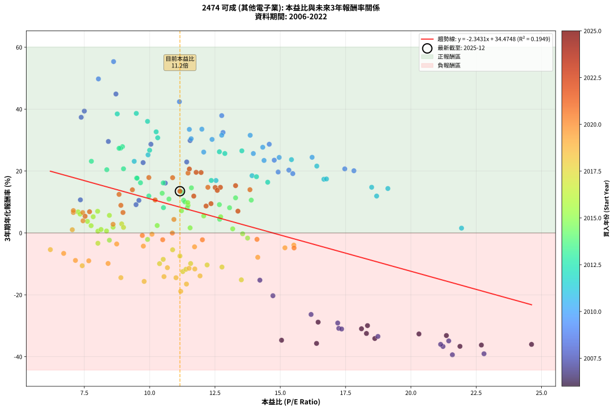
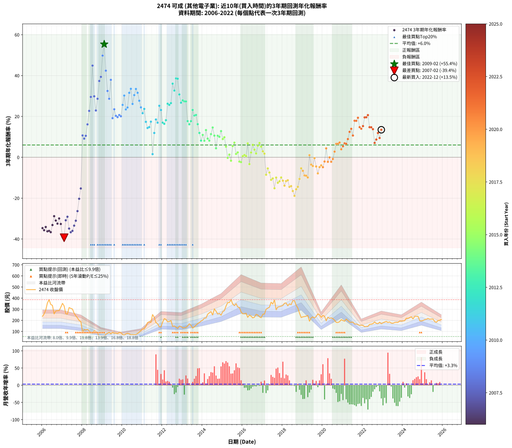

# 2474 可成 - 本益比與未來報酬率分析

!!! info "報告資訊"
    - **股票代號**: 2474
    - **公司名稱**: 可成
    - **產業別**: 其他電子業
    - **分析期間**: 2006-2022 (204 個數據點)
    - **資料來源**: Type 12 (ShowMonthlyK_ChartFlow) 月收盤價與本益比
    - **報酬率口徑**: 含現金股利 (簡化: 年度合計，假設每年7/1入帳)
    - **報告生成時間**: 2026-01-11 18:41:22 CST

## 📈 視覺化圖表

### 圖表1: 本益比 vs 未來報酬率關係

*圖表1：2474 可成 本益比與3年期未來報酬率關係 (2006-2022)*

### 圖表2: 歷年買入時點的3年期實際報酬率

*圖表2：2474 可成 歷年買入時點的3年期實際報酬率 (2006-2022)*

## 📍 買點訊號說明

本報告提供兩種買點提示訊號（顯示於圖表2的股價子圖中）：

### ▲ 小綠色三角形（回測驗證）
- **計算方式**: 使用全部歷史資料計算本益比第25百分位數
- **用途**: 事後驗證，顯示歷史上哪些時點確實為低估區
- **限制**: 當下無法判斷，僅供回測參考
- **特性**: 後見之明（Look-Ahead Bias）

### ▲ 小橘色三角形（即時訊號）
- **計算方式**: 使用截至當月的過去5年資料計算本益比第25百分位數
- **用途**: 實際投資決策，當時即可判斷
- **優勢**: 可操作性強，符合實務需求
- **特性**: 無後見之明，滾動窗口計算

!!! tip "如何使用兩種訊號"
    - **綠色▲** 幫助理解歷史估值機會，驗證策略有效性
    - **橘色▲** 可作為實際買進參考，但仍需搭配基本面分析
    - 兩種訊號重疊時，表示即時判斷與事後驗證一致，信心度較高
    - 僅有綠色▲時，表示當時無法判斷（需要未來資料才能確認）
    - 僅有橘色▲時，表示即時判斷為買點，但事後可能不是最佳時機

## 📊 估值分析摘要

| 指標 | 數值 |
|:---:|:---:|
| **目前本益比** (2022-12) | **11.16 倍** |
| **歷史平均本益比** | 12.14 倍 |
| **估值水準** | 🟡 合理範圍 |
| **預期3年年化報酬率** | **+8.33%** |
| **歷史平均報酬率** | +6.03% |
| **相關係數 (R²)** | 0.1949 |
| **趨勢線斜率** | -2.3431 |

!!! abstract "核心洞察"
    目前本益比接近歷史平均，預期報酬率符合長期趨勢

    根據歷史數據回測，2474 可成 在目前本益比 **11.2倍** 的估值水準下，
    預期未來3年年化報酬率約為 **+8.3%**。

    **重要提醒**: 本分析基於歷史數據統計，實際報酬率會受到公司基本面變化、產業趨勢、
    總體經濟環境等多重因素影響。R² = 0.19 表示本益比可解釋約 19.5% 的報酬率變異。

## 📈 歷史估值統計

### 最佳買點 (最高報酬率)

| 項目 | 數值 |
|:---:|:---:|
| 起始時間 | 2009-02 |
| 當時本益比 | 8.62 倍 |
| 起始價格 | 59.3 元 |
| 3年後價格 | 215.5 元 |
| **3年年化報酬率** | **+55.36%** |

### 最差買點 (最低報酬率)

| 項目 | 數值 |
|:---:|:---:|
| 起始時間 | 2007-02 |
| 當時本益比 | 21.59 倍 |
| 起始價格 | 330.0 元 |
| 3年後價格 | 65.5 元 |
| **3年年化報酬率** | **-39.38%** |

## 🎯 投資啟示

### 本益比與報酬率關係

趨勢線方程式: **y = -2.3431x + 34.4748**

!!! warning "強負相關"
    本益比與未來報酬率呈現強負相關。在高本益比時期買入，未來報酬率顯著較低；
    在低本益比時期買入，未來報酬率顯著較高。**估值紀律至關重要**。

### 估值區間建議

基於歷史數據分析:

- **🟢 低估區** (P/E < 9.7): 預期報酬率較高，可考慮增加持股
- **🟡 合理區** (P/E 9.7-14.6): 預期報酬率符合長期趨勢，正常持有
- **🔴 高估區** (P/E > 14.6): 預期報酬率較低，可考慮減碼或觀望

!!! danger "風險提示"
    - 過去表現不代表未來結果
    - 本分析假設公司基本面無重大結構性變化
    - 產業環境劇變可能使歷史規律失效
    - 應結合公司財報、產業趨勢、總體經濟等多重因素綜合判斷

!!! success "長期投資觀點"
    歷史數據顯示，在合理或低估的估值水準買入並長期持有，
    往往能獲得較佳的投資報酬。**耐心等待好價格**是價值投資的核心原則。

## 📊 數據品質

- **資料來源**: GoodInfo.tw Type 12 (ShowMonthlyK_ChartFlow)
- **資料頻率**: 月度收盤價與本益比
- **回測期間**: 2006-2022
- **數據點數量**: 204 個 (每個點代表一次3年期回測)

### 計算方法說明

1. **3年期年化報酬率**:
   - 對每個歷史時點，計算其後3年的實際投資報酬率
   - 期末價值(不含股利): 期末價格
   - 期末價值(含現金股利): 期末價格 + 持有期間內的現金股利合計 (簡化: 年度合計，假設每年7/1入帳)
   - 公式: 年化報酬率 = [(期末價值/期初價格)^(1/年數) - 1] × 100%

2. **本益比 (P/E Ratio)**:
   - 使用當時的月收盤價與EPS計算
   - 資料來源: Type 12 月度河流圖本益比數據

3. **趨勢線 (Linear Regression)**:
   - 使用最小平方法擬合線性趨勢線
   - R²值衡量本益比對報酬率的解釋能力

---

*本報告由 Stock Analysis System v1.9.0 自動生成*
*數據更新時間: 2026-01-11 18:41:22 CST*

## 📋 月度回測明細表

（每一列對應時間線圖中的一個買入點；可用來對照 SVG 圖上的每個點。）

| 買入月份 | 賣出月份 | 回測期限_年 | 實際持有年數 | 買入本益比_倍 | 買入收盤價_元 | 賣出收盤價_元 | 現金股利合計_元 | 總報酬率_pct | 年化報酬率_pct |
| --- | --- | --- | --- | --- | --- | --- | --- | --- | --- |
| 2006-01 | 2009-01 | 3 | 3.001 | 15.05 | 236.00 | 56.80 | 8.98 | -72.12 | -34.67 |
| 2006-02 | 2009-02 | 3 | 3.001 | 16.39 | 257.00 | 59.30 | 8.98 | -73.43 | -35.71 |
| 2006-03 | 2009-03 | 3 | 3.001 | 18.62 | 292.00 | 74.50 | 8.98 | -71.41 | -34.12 |
| 2006-04 | 2009-04 | 3 | 3.001 | 22.70 | 356.00 | 83.30 | 8.98 | -74.08 | -36.23 |
| 2006-05 | 2009-05 | 3 | 3.001 | 24.62 | 386.00 | 92.10 | 8.98 | -73.81 | -36.02 |
| 2006-06 | 2009-06 | 3 | 3.001 | 21.88 | 343.00 | 78.20 | 8.98 | -74.58 | -36.65 |
| 2006-07 | 2009-07 | 3 | 3.001 | 21.36 | 335.00 | 92.00 | 8.00 | -70.15 | -33.16 |
| 2006-08 | 2009-08 | 3 | 3.001 | 16.45 | 258.00 | 85.00 | 8.00 | -63.95 | -28.83 |
| 2006-09 | 2009-09 | 3 | 3.001 | 18.11 | 284.00 | 85.40 | 8.00 | -67.11 | -30.97 |
| 2006-10 | 2009-10 | 3 | 3.001 | 18.30 | 287.00 | 80.30 | 8.00 | -69.23 | -32.49 |
| 2006-11 | 2009-11 | 3 | 3.001 | 18.34 | 287.50 | 90.80 | 8.00 | -65.63 | -29.95 |
| 2006-12 | 2009-12 | 3 | 3.001 | 20.31 | 318.50 | 89.30 | 8.00 | -69.45 | -32.64 |
| 2007-01 | 2010-01 | 3 | 3.001 | 22.80 | 353.00 | 71.90 | 8.00 | -77.37 | -39.05 |
| 2007-02 | 2010-02 | 3 | 3.001 | 21.59 | 330.00 | 65.50 | 8.00 | -77.73 | -39.38 |
| 2007-03 | 2010-03 | 3 | 3.001 | 17.24 | 260.00 | 78.00 | 8.00 | -66.92 | -30.84 |
| 2007-04 | 2010-04 | 3 | 3.001 | 17.20 | 256.00 | 83.20 | 8.00 | -64.38 | -29.10 |
| 2007-05 | 2010-05 | 3 | 3.001 | 21.45 | 315.00 | 78.90 | 8.00 | -72.41 | -34.90 |
| 2007-06 | 2010-06 | 3 | 3.001 | 21.23 | 307.50 | 70.00 | 8.00 | -74.63 | -36.69 |
| 2007-07 | 2010-07 | 3 | 3.001 | 21.14 | 302.00 | 72.10 | 7.00 | -73.81 | -36.01 |
| 2007-08 | 2010-08 | 3 | 3.001 | 18.74 | 264.00 | 70.80 | 7.00 | -70.53 | -33.45 |
| 2007-09 | 2010-09 | 3 | 3.001 | 17.35 | 241.00 | 72.00 | 7.00 | -67.22 | -31.04 |
| 2007-10 | 2010-10 | 3 | 3.001 | 16.18 | 221.50 | 81.50 | 7.00 | -60.05 | -26.34 |
| 2007-11 | 2010-11 | 3 | 3.001 | 14.72 | 198.50 | 93.50 | 7.00 | -49.37 | -20.29 |
| 2007-12 | 2010-12 | 3 | 3.001 | 14.22 | 189.00 | 108.00 | 7.00 | -39.15 | -15.26 |
| 2008-01 | 2011-01 | 3 | 3.001 | 7.35 | 94.00 | 120.50 | 7.00 | +35.64 | +10.69 |
| 2008-02 | 2011-03 | 3 | 3.080 | 9.48 | 116.50 | 145.50 | 7.00 | +30.90 | +9.14 |
| 2008-03 | 2011-03 | 3 | 2.998 | 9.59 | 113.00 | 145.50 | 7.00 | +34.96 | +10.52 |
| 2008-04 | 2011-04 | 3 | 2.998 | 10.60 | 119.50 | 180.00 | 7.00 | +56.49 | +16.11 |
| 2008-05 | 2011-05 | 3 | 2.998 | 9.75 | 105.00 | 187.00 | 7.00 | +84.76 | +22.72 |
| 2008-06 | 2011-06 | 3 | 2.998 | 8.42 | 86.50 | 181.00 | 7.00 | +117.34 | +29.56 |
| 2008-07 | 2011-07 | 3 | 2.998 | 8.71 | 85.10 | 252.00 | 6.68 | +203.97 | +44.90 |
| 2008-08 | 2011-08 | 3 | 2.998 | 11.55 | 107.00 | 227.50 | 6.68 | +118.86 | +29.86 |
| 2008-09 | 2011-09 | 3 | 2.998 | 11.42 | 100.00 | 179.00 | 6.68 | +85.68 | +22.93 |
| 2008-10 | 2011-10 | 3 | 2.998 | 10.05 | 83.00 | 170.00 | 6.68 | +112.87 | +28.66 |
| 2008-11 | 2011-11 | 3 | 2.998 | 7.38 | 57.20 | 141.50 | 6.68 | +159.06 | +37.37 |
| 2008-12 | 2011-12 | 3 | 2.998 | 7.50 | 54.40 | 140.50 | 6.68 | +170.55 | +39.37 |
| 2009-01 | 2012-01 | 3 | 2.998 | 8.04 | 56.80 | 184.00 | 6.68 | +235.70 | +49.77 |
| 2009-02 | 2012-02 | 3 | 2.998 | 8.62 | 59.30 | 215.50 | 6.68 | +274.67 | +55.36 |
| 2009-03 | 2012-03 | 3 | 3.001 | 11.14 | 74.50 | 208.50 | 6.68 | +188.83 | +42.40 |
| 2009-04 | 2012-04 | 3 | 3.001 | 12.81 | 83.30 | 187.00 | 6.68 | +132.51 | +32.47 |
| 2009-05 | 2012-05 | 3 | 3.001 | 14.58 | 92.10 | 189.50 | 6.68 | +113.01 | +28.66 |
| 2009-06 | 2012-06 | 3 | 3.001 | 12.76 | 78.20 | 198.50 | 6.68 | +162.38 | +37.91 |
| 2009-07 | 2012-07 | 3 | 3.001 | 15.48 | 92.00 | 145.00 | 10.68 | +69.22 | +19.16 |
| 2009-08 | 2012-08 | 3 | 3.001 | 14.77 | 85.00 | 149.50 | 10.68 | +88.45 | +23.51 |
| 2009-09 | 2012-09 | 3 | 3.001 | 15.33 | 85.40 | 138.00 | 10.68 | +74.10 | +20.29 |
| 2009-10 | 2012-10 | 3 | 3.001 | 14.92 | 80.30 | 127.00 | 10.68 | +71.46 | +19.68 |
| 2009-11 | 2012-11 | 3 | 3.001 | 17.47 | 90.80 | 149.00 | 10.68 | +75.86 | +20.70 |
| 2009-12 | 2012-12 | 3 | 3.001 | 17.82 | 89.30 | 144.00 | 10.68 | +73.21 | +20.09 |
| 2010-01 | 2013-01 | 3 | 3.001 | 13.97 | 71.90 | 132.00 | 10.68 | +98.44 | +25.66 |
| 2010-02 | 2013-02 | 3 | 3.001 | 12.39 | 65.50 | 134.00 | 10.68 | +120.89 | +30.23 |
| 2010-03 | 2013-03 | 3 | 3.001 | 14.38 | 78.00 | 136.00 | 10.68 | +88.05 | +23.43 |
| 2010-04 | 2013-04 | 3 | 3.001 | 14.96 | 83.20 | 149.50 | 10.68 | +92.52 | +24.40 |
| 2010-05 | 2013-05 | 3 | 3.001 | 13.85 | 78.90 | 169.00 | 10.68 | +127.73 | +31.56 |
| 2010-06 | 2013-06 | 3 | 3.001 | 12.00 | 70.00 | 156.00 | 10.68 | +138.11 | +33.53 |
| 2010-07 | 2013-07 | 3 | 3.001 | 12.07 | 72.10 | 130.00 | 14.68 | +100.67 | +26.13 |
| 2010-08 | 2013-08 | 3 | 3.001 | 11.59 | 70.80 | 142.50 | 14.68 | +122.01 | +30.45 |
| 2010-09 | 2013-09 | 3 | 3.001 | 11.52 | 72.00 | 156.50 | 14.68 | +137.75 | +33.46 |
| 2010-10 | 2013-10 | 3 | 3.001 | 12.76 | 81.50 | 171.00 | 14.68 | +127.83 | +31.58 |
| 2010-11 | 2013-11 | 3 | 3.001 | 14.33 | 93.50 | 180.00 | 14.68 | +108.21 | +27.69 |
| 2010-12 | 2013-12 | 3 | 3.001 | 16.22 | 108.00 | 193.50 | 14.68 | +92.76 | +24.45 |
| 2011-01 | 2014-01 | 3 | 3.001 | 16.40 | 120.50 | 202.00 | 14.68 | +79.82 | +21.60 |
| 2011-02 | 2014-02 | 3 | 3.001 | 15.43 | 124.00 | 220.00 | 14.68 | +89.26 | +23.69 |
| 2011-03 | 2014-03 | 3 | 3.001 | 16.67 | 145.50 | 220.50 | 14.68 | +61.64 | +17.35 |
| 2011-04 | 2014-04 | 3 | 3.001 | 19.12 | 180.00 | 254.50 | 14.68 | +49.54 | +14.35 |
| 2011-05 | 2014-05 | 3 | 3.001 | 18.50 | 187.00 | 268.00 | 14.68 | +51.17 | +14.76 |
| 2011-06 | 2014-06 | 3 | 3.001 | 16.77 | 181.00 | 278.50 | 14.68 | +61.98 | +17.44 |
| 2011-07 | 2014-07 | 3 | 3.001 | 21.94 | 252.00 | 248.00 | 15.90 | +4.72 | +1.55 |
| 2011-08 | 2014-08 | 3 | 3.001 | 18.69 | 227.50 | 303.00 | 15.90 | +40.18 | +11.91 |
| 2011-09 | 2014-09 | 3 | 3.001 | 13.92 | 179.00 | 282.00 | 15.90 | +66.43 | +18.50 |
| 2011-10 | 2014-10 | 3 | 3.001 | 12.54 | 170.00 | 256.00 | 15.90 | +59.94 | +16.94 |
| 2011-11 | 2014-11 | 3 | 3.001 | 9.94 | 141.50 | 262.00 | 15.90 | +96.40 | +25.22 |
| 2011-12 | 2014-12 | 3 | 3.001 | 9.41 | 140.50 | 246.50 | 15.90 | +86.76 | +23.14 |
| 2012-01 | 2015-01 | 3 | 3.001 | 12.36 | 184.00 | 278.50 | 15.90 | +60.00 | +16.96 |
| 2012-02 | 2015-03 | 3 | 3.080 | 14.52 | 215.50 | 328.00 | 15.90 | +59.58 | +16.39 |
| 2012-03 | 2015-03 | 3 | 2.998 | 14.09 | 208.50 | 328.00 | 15.90 | +64.94 | +18.17 |
| 2012-04 | 2015-04 | 3 | 2.998 | 12.67 | 187.00 | 360.00 | 15.90 | +101.02 | +26.23 |
| 2012-05 | 2015-05 | 3 | 2.998 | 12.88 | 189.50 | 360.00 | 15.90 | +98.37 | +25.67 |
| 2012-06 | 2015-06 | 3 | 2.998 | 13.53 | 198.50 | 386.00 | 15.90 | +102.47 | +26.53 |
| 2012-07 | 2015-07 | 3 | 2.998 | 9.92 | 145.00 | 348.00 | 16.90 | +151.66 | +36.05 |
| 2012-08 | 2015-08 | 3 | 2.998 | 10.25 | 149.50 | 332.00 | 16.90 | +133.38 | +32.67 |
| 2012-09 | 2015-09 | 3 | 2.998 | 9.49 | 138.00 | 350.50 | 16.90 | +166.23 | +38.63 |
| 2012-10 | 2015-10 | 3 | 2.998 | 8.76 | 127.00 | 320.00 | 16.90 | +165.28 | +38.46 |
| 2012-11 | 2015-11 | 3 | 2.998 | 10.31 | 149.00 | 316.00 | 16.90 | +123.42 | +30.75 |
| 2012-12 | 2015-12 | 3 | 2.998 | 10.00 | 144.00 | 276.00 | 16.90 | +103.40 | +26.72 |
| 2013-01 | 2016-01 | 3 | 2.998 | 8.96 | 132.00 | 259.00 | 16.90 | +109.02 | +27.88 |
| 2013-02 | 2016-02 | 3 | 2.998 | 8.89 | 134.00 | 260.00 | 16.90 | +106.64 | +27.39 |
| 2013-03 | 2016-03 | 3 | 3.001 | 8.83 | 136.00 | 264.00 | 16.90 | +106.55 | +27.34 |
| 2013-04 | 2016-04 | 3 | 3.001 | 9.50 | 149.50 | 227.00 | 16.90 | +63.15 | +17.72 |
| 2013-05 | 2016-05 | 3 | 3.001 | 10.52 | 169.00 | 248.00 | 16.90 | +56.75 | +16.16 |
| 2013-06 | 2016-06 | 3 | 3.001 | 9.52 | 156.00 | 237.50 | 16.90 | +63.08 | +17.70 |
| 2013-07 | 2016-07 | 3 | 3.001 | 7.77 | 130.00 | 222.00 | 20.90 | +86.85 | +23.16 |
| 2013-08 | 2016-08 | 3 | 3.001 | 8.36 | 142.50 | 228.00 | 20.90 | +74.67 | +20.43 |
| 2013-09 | 2016-09 | 3 | 3.001 | 9.00 | 156.50 | 254.50 | 20.90 | +75.98 | +20.73 |
| 2013-10 | 2016-10 | 3 | 3.001 | 9.65 | 171.00 | 247.50 | 20.90 | +56.96 | +16.21 |
| 2013-11 | 2016-11 | 3 | 3.001 | 9.97 | 180.00 | 231.50 | 20.90 | +40.22 | +11.93 |
| 2013-12 | 2016-12 | 3 | 3.001 | 10.53 | 193.50 | 224.00 | 20.90 | +26.56 | +8.17 |
| 2014-01 | 2017-01 | 3 | 3.001 | 10.74 | 202.00 | 255.00 | 20.90 | +36.59 | +10.95 |
| 2014-02 | 2017-02 | 3 | 3.001 | 11.44 | 220.00 | 257.00 | 20.90 | +26.32 | +8.10 |
| 2014-03 | 2017-03 | 3 | 3.001 | 11.21 | 220.50 | 300.00 | 20.90 | +45.53 | +13.32 |
| 2014-04 | 2017-04 | 3 | 3.001 | 12.67 | 254.50 | 310.00 | 20.90 | +30.02 | +9.14 |
| 2014-05 | 2017-05 | 3 | 3.001 | 13.06 | 268.00 | 318.00 | 20.90 | +26.46 | +8.14 |
| 2014-06 | 2017-06 | 3 | 3.001 | 13.29 | 278.50 | 363.50 | 20.90 | +38.03 | +11.34 |
| 2014-07 | 2017-07 | 3 | 3.001 | 11.60 | 248.00 | 347.00 | 26.00 | +50.40 | +14.57 |
| 2014-08 | 2017-08 | 3 | 3.001 | 13.89 | 303.00 | 384.00 | 26.00 | +35.31 | +10.60 |
| 2014-09 | 2017-09 | 3 | 3.001 | 12.68 | 282.00 | 295.00 | 26.00 | +13.83 | +4.41 |
| 2014-10 | 2017-10 | 3 | 3.001 | 11.30 | 256.00 | 320.00 | 26.00 | +35.16 | +10.56 |
| 2014-11 | 2017-11 | 3 | 3.001 | 11.35 | 262.00 | 323.00 | 26.00 | +33.21 | +10.03 |
| 2014-12 | 2017-12 | 3 | 3.001 | 10.48 | 246.50 | 328.00 | 26.00 | +43.61 | +12.82 |
| 2015-01 | 2018-01 | 3 | 3.001 | 11.47 | 278.50 | 334.00 | 26.00 | +29.26 | +8.93 |
| 2015-02 | 2018-02 | 3 | 3.001 | 11.46 | 287.00 | 354.00 | 26.00 | +32.40 | +9.81 |
| 2015-03 | 2018-03 | 3 | 3.001 | 12.72 | 328.00 | 356.00 | 26.00 | +16.46 | +5.21 |
| 2015-04 | 2018-04 | 3 | 3.001 | 13.56 | 360.00 | 331.00 | 26.00 | -0.83 | -0.28 |
| 2015-05 | 2018-05 | 3 | 3.001 | 13.18 | 360.00 | 348.50 | 26.00 | +4.03 | +1.32 |
| 2015-06 | 2018-06 | 3 | 3.001 | 13.75 | 386.00 | 341.00 | 26.00 | -4.92 | -1.67 |
| 2015-07 | 2018-07 | 3 | 3.001 | 12.07 | 348.00 | 376.50 | 32.00 | +17.39 | +5.49 |
| 2015-08 | 2018-08 | 3 | 3.001 | 11.22 | 332.00 | 376.50 | 32.00 | +23.04 | +7.15 |
| 2015-09 | 2018-09 | 3 | 3.001 | 11.55 | 350.50 | 336.00 | 32.00 | +4.99 | +1.64 |
| 2015-10 | 2018-10 | 3 | 3.001 | 10.29 | 320.00 | 311.50 | 32.00 | +7.34 | +2.39 |
| 2015-11 | 2018-11 | 3 | 3.001 | 9.92 | 316.00 | 264.50 | 32.00 | -6.17 | -2.10 |
| 2015-12 | 2018-12 | 3 | 3.001 | 8.46 | 276.00 | 225.00 | 32.00 | -6.88 | -2.35 |
| 2016-01 | 2019-01 | 3 | 3.001 | 8.02 | 259.00 | 231.50 | 32.00 | +1.74 | +0.58 |
| 2016-02 | 2019-03 | 3 | 3.080 | 8.14 | 260.00 | 237.00 | 32.00 | +3.46 | +1.11 |
| 2016-03 | 2019-03 | 3 | 2.998 | 8.35 | 264.00 | 237.00 | 32.00 | +1.89 | +0.63 |
| 2016-04 | 2019-04 | 3 | 2.998 | 7.26 | 227.00 | 244.50 | 32.00 | +21.81 | +6.80 |
| 2016-05 | 2019-05 | 3 | 2.998 | 8.02 | 248.00 | 192.00 | 32.00 | -9.68 | -3.34 |
| 2016-06 | 2019-06 | 3 | 2.998 | 7.76 | 237.50 | 222.50 | 32.00 | +7.16 | +2.33 |
| 2016-07 | 2019-07 | 3 | 2.998 | 7.34 | 222.00 | 231.00 | 34.00 | +19.37 | +6.08 |
| 2016-08 | 2019-08 | 3 | 2.998 | 7.62 | 228.00 | 220.50 | 34.00 | +11.62 | +3.74 |
| 2016-09 | 2019-09 | 3 | 2.998 | 8.60 | 254.50 | 235.00 | 34.00 | +5.70 | +1.87 |
| 2016-10 | 2019-10 | 3 | 2.998 | 8.46 | 247.50 | 258.00 | 34.00 | +17.98 | +5.67 |
| 2016-11 | 2019-11 | 3 | 2.998 | 8.01 | 231.50 | 249.50 | 34.00 | +22.46 | +6.99 |
| 2016-12 | 2019-12 | 3 | 2.998 | 7.84 | 224.00 | 227.00 | 34.00 | +16.52 | +5.23 |
| 2017-01 | 2020-01 | 3 | 2.998 | 8.93 | 255.00 | 244.00 | 34.00 | +9.02 | +2.92 |
| 2017-02 | 2020-02 | 3 | 2.998 | 9.00 | 257.00 | 237.00 | 34.00 | +5.45 | +1.79 |
| 2017-03 | 2020-03 | 3 | 3.001 | 10.52 | 300.00 | 195.50 | 34.00 | -23.50 | -8.54 |
| 2017-04 | 2020-04 | 3 | 3.001 | 10.88 | 310.00 | 228.00 | 34.00 | -15.48 | -5.45 |
| 2017-05 | 2020-05 | 3 | 3.001 | 11.16 | 318.00 | 218.00 | 34.00 | -20.75 | -7.46 |
| 2017-06 | 2020-06 | 3 | 3.001 | 12.77 | 363.50 | 222.00 | 34.00 | -29.57 | -11.03 |
| 2017-07 | 2020-07 | 3 | 3.001 | 12.20 | 347.00 | 216.00 | 34.00 | -27.95 | -10.35 |
| 2017-08 | 2020-08 | 3 | 3.001 | 13.51 | 384.00 | 200.50 | 34.00 | -38.93 | -15.16 |
| 2017-09 | 2020-09 | 3 | 3.001 | 10.38 | 295.00 | 181.50 | 34.00 | -26.95 | -9.94 |
| 2017-10 | 2020-10 | 3 | 3.001 | 11.27 | 320.00 | 180.50 | 34.00 | -32.97 | -12.48 |
| 2017-11 | 2020-11 | 3 | 3.001 | 11.39 | 323.00 | 188.00 | 34.00 | -31.27 | -11.75 |
| 2017-12 | 2020-12 | 3 | 3.001 | 11.57 | 328.00 | 206.00 | 34.00 | -26.83 | -9.89 |
| 2018-01 | 2021-01 | 3 | 3.001 | 11.51 | 334.00 | 198.00 | 34.00 | -30.54 | -11.44 |
| 2018-02 | 2021-02 | 3 | 3.001 | 11.93 | 354.00 | 192.00 | 34.00 | -36.16 | -13.89 |
| 2018-03 | 2021-03 | 3 | 3.001 | 11.73 | 356.00 | 211.50 | 34.00 | -31.04 | -11.65 |
| 2018-04 | 2021-04 | 3 | 3.001 | 10.68 | 331.00 | 197.50 | 34.00 | -30.06 | -11.23 |
| 2018-05 | 2021-05 | 3 | 3.001 | 11.01 | 348.50 | 184.00 | 34.00 | -37.45 | -14.47 |
| 2018-06 | 2021-06 | 3 | 3.001 | 10.55 | 341.00 | 182.00 | 34.00 | -36.66 | -14.12 |
| 2018-07 | 2021-07 | 3 | 3.001 | 11.41 | 376.50 | 185.00 | 34.00 | -41.83 | -16.52 |
| 2018-08 | 2021-08 | 3 | 3.001 | 11.19 | 376.50 | 167.00 | 34.00 | -46.61 | -18.87 |
| 2018-09 | 2021-09 | 3 | 3.001 | 9.79 | 336.00 | 167.50 | 34.00 | -40.03 | -15.67 |
| 2018-10 | 2021-10 | 3 | 3.001 | 8.90 | 311.50 | 161.00 | 34.00 | -37.40 | -14.45 |
| 2018-11 | 2021-11 | 3 | 3.001 | 7.42 | 264.50 | 155.00 | 34.00 | -28.54 | -10.60 |
| 2018-12 | 2021-12 | 3 | 3.001 | 6.20 | 225.00 | 156.50 | 34.00 | -15.33 | -5.40 |
| 2019-01 | 2022-01 | 3 | 3.001 | 6.71 | 231.50 | 154.50 | 34.00 | -18.57 | -6.62 |
| 2019-02 | 2022-02 | 3 | 3.001 | 7.16 | 234.00 | 143.00 | 34.00 | -24.36 | -8.88 |
| 2019-03 | 2022-03 | 3 | 3.001 | 7.67 | 237.00 | 144.50 | 34.00 | -24.68 | -9.01 |
| 2019-04 | 2022-04 | 3 | 3.001 | 8.41 | 244.50 | 145.00 | 34.00 | -26.79 | -9.87 |
| 2019-05 | 2022-05 | 3 | 3.001 | 7.04 | 192.00 | 164.00 | 34.00 | +3.12 | +1.03 |
| 2019-06 | 2022-06 | 3 | 3.001 | 8.74 | 222.50 | 165.50 | 34.00 | -10.34 | -3.57 |
| 2019-07 | 2022-07 | 3 | 3.001 | 9.76 | 231.00 | 170.50 | 32.21 | -12.25 | -4.26 |
| 2019-08 | 2022-08 | 3 | 3.001 | 10.09 | 220.50 | 185.50 | 32.21 | -1.27 | -0.42 |
| 2019-09 | 2022-09 | 3 | 3.001 | 11.72 | 235.00 | 172.50 | 32.21 | -12.89 | -4.49 |
| 2019-10 | 2022-10 | 3 | 3.001 | 14.14 | 258.00 | 169.50 | 32.21 | -21.82 | -7.88 |
| 2019-11 | 2022-11 | 3 | 3.001 | 15.18 | 249.50 | 183.00 | 32.21 | -13.74 | -4.81 |
| 2019-12 | 2022-12 | 3 | 3.001 | 15.52 | 227.00 | 169.00 | 32.21 | -11.36 | -3.94 |
| 2020-01 | 2023-01 | 3 | 3.001 | 15.53 | 244.00 | 178.00 | 32.21 | -13.85 | -4.85 |
| 2020-02 | 2023-03 | 3 | 3.080 | 14.11 | 237.00 | 190.00 | 32.21 | -6.24 | -2.07 |
| 2020-03 | 2023-03 | 3 | 2.998 | 10.93 | 195.50 | 190.00 | 32.21 | +13.66 | +4.36 |
| 2020-04 | 2023-04 | 3 | 2.998 | 12.02 | 228.00 | 181.00 | 32.21 | -6.49 | -2.21 |
| 2020-05 | 2023-05 | 3 | 2.998 | 10.87 | 218.00 | 185.50 | 32.21 | -0.13 | -0.04 |
| 2020-06 | 2023-06 | 3 | 2.998 | 10.50 | 222.00 | 175.50 | 32.21 | -6.44 | -2.19 |
| 2020-07 | 2023-07 | 3 | 2.998 | 9.72 | 216.00 | 173.50 | 37.21 | -2.45 | -0.82 |
| 2020-08 | 2023-08 | 3 | 2.998 | 8.60 | 200.50 | 180.50 | 37.21 | +8.58 | +2.78 |
| 2020-09 | 2023-09 | 3 | 2.998 | 7.44 | 181.50 | 182.50 | 37.21 | +21.05 | +6.58 |
| 2020-10 | 2023-10 | 3 | 2.998 | 7.08 | 180.50 | 181.50 | 37.21 | +21.17 | +6.61 |
| 2020-11 | 2023-11 | 3 | 2.998 | 7.08 | 188.00 | 194.50 | 37.21 | +23.25 | +7.22 |
| 2020-12 | 2023-12 | 3 | 2.998 | 7.45 | 206.00 | 194.00 | 37.21 | +12.24 | +3.93 |
| 2021-01 | 2024-01 | 3 | 2.998 | 7.53 | 198.00 | 194.50 | 37.21 | +17.03 | +5.38 |
| 2021-02 | 2024-02 | 3 | 2.998 | 7.70 | 192.00 | 197.00 | 37.21 | +21.98 | +6.85 |
| 2021-03 | 2024-03 | 3 | 3.001 | 8.98 | 211.50 | 219.00 | 37.21 | +21.14 | +6.60 |
| 2021-04 | 2024-04 | 3 | 3.001 | 8.90 | 197.50 | 218.00 | 37.21 | +29.22 | +8.92 |
| 2021-05 | 2024-05 | 3 | 3.001 | 8.83 | 184.00 | 224.50 | 37.21 | +42.23 | +12.46 |
| 2021-06 | 2024-06 | 3 | 3.001 | 9.34 | 182.00 | 232.00 | 37.21 | +47.92 | +13.94 |
| 2021-07 | 2024-07 | 3 | 3.001 | 10.21 | 185.00 | 213.00 | 37.71 | +35.52 | +10.66 |
| 2021-08 | 2024-08 | 3 | 3.001 | 9.97 | 167.00 | 236.00 | 37.71 | +63.90 | +17.90 |
| 2021-09 | 2024-09 | 3 | 3.001 | 10.88 | 167.50 | 236.50 | 37.71 | +63.71 | +17.85 |
| 2021-10 | 2024-10 | 3 | 3.001 | 11.47 | 161.00 | 236.00 | 37.71 | +70.01 | +19.34 |
| 2021-11 | 2024-11 | 3 | 3.001 | 12.23 | 155.00 | 196.50 | 37.71 | +51.10 | +14.75 |
| 2021-12 | 2024-12 | 3 | 3.001 | 13.84 | 156.50 | 194.00 | 37.71 | +48.06 | +13.97 |
| 2022-01 | 2025-01 | 3 | 3.001 | 13.29 | 154.50 | 199.00 | 37.71 | +53.21 | +15.28 |
| 2022-02 | 2025-02 | 3 | 3.001 | 11.97 | 143.00 | 206.50 | 37.71 | +70.78 | +19.52 |
| 2022-03 | 2025-03 | 3 | 3.001 | 11.78 | 144.50 | 209.50 | 37.71 | +71.08 | +19.60 |
| 2022-04 | 2025-04 | 3 | 3.001 | 11.52 | 145.00 | 217.00 | 37.71 | +75.66 | +20.65 |
| 2022-05 | 2025-05 | 3 | 3.001 | 12.71 | 164.00 | 210.00 | 37.71 | +51.04 | +14.73 |
| 2022-06 | 2025-06 | 3 | 3.001 | 12.51 | 165.50 | 212.00 | 37.71 | +50.88 | +14.69 |
| 2022-07 | 2025-07 | 3 | 3.001 | 12.59 | 170.50 | 212.00 | 38.99 | +47.21 | +13.75 |
| 2022-08 | 2025-08 | 3 | 3.001 | 13.38 | 185.50 | 188.50 | 38.99 | +22.64 | +7.04 |
| 2022-09 | 2025-09 | 3 | 3.001 | 12.16 | 172.50 | 182.50 | 38.99 | +28.40 | +8.69 |
| 2022-10 | 2025-10 | 3 | 3.001 | 11.69 | 169.50 | 198.50 | 38.99 | +40.11 | +11.90 |
| 2022-11 | 2025-11 | 3 | 3.001 | 12.35 | 183.00 | 201.00 | 38.99 | +31.14 | +9.46 |
| 2022-12 | 2025-12 | 3 | 3.001 | 11.16 | 169.00 | 208.00 | 38.99 | +46.15 | +13.48 |
