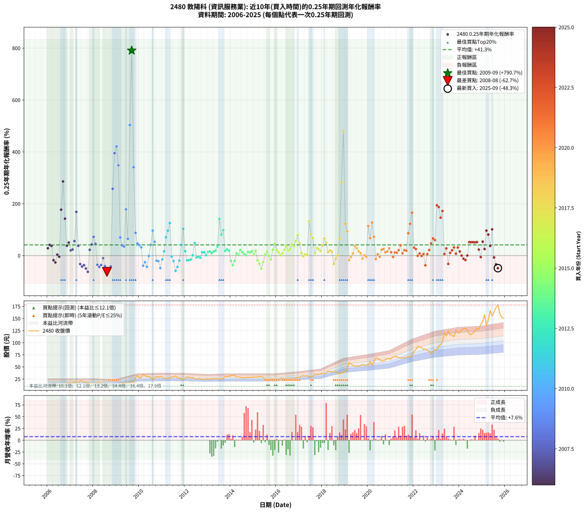

# 2480 敦陽科 - 本益比與未來報酬率分析

!!! info "報告資訊"
    - **股票代號**: 2480
    - **公司名稱**: 敦陽科
    - **產業別**: 資訊服務業
    - **分析期間**: 2006-2025 (237 個數據點)
    - **資料來源**: Type 12 (ShowMonthlyK_ChartFlow) 月收盤價與本益比
    - **報酬率口徑**: 含現金股利 (簡化: 年度合計，假設每年7/1入帳)
    - **報告生成時間**: 2026-01-11 18:41:48 CST

## 📈 視覺化圖表

### 圖表1: 本益比 vs 未來報酬率關係

*圖表1：2480 敦陽科 本益比與0.25年期未來報酬率關係 (2006-2025)*

### 圖表2: 歷年買入時點的0.25年期實際報酬率

*圖表2：2480 敦陽科 歷年買入時點的0.25年期實際報酬率 (2006-2025)*

## 📍 買點訊號說明

本報告提供兩種買點提示訊號（顯示於圖表2的股價子圖中）：

### ▲ 小綠色三角形（回測驗證）
- **計算方式**: 使用全部歷史資料計算本益比第25百分位數
- **用途**: 事後驗證，顯示歷史上哪些時點確實為低估區
- **限制**: 當下無法判斷，僅供回測參考
- **特性**: 後見之明（Look-Ahead Bias）

### ▲ 小橘色三角形（即時訊號）
- **計算方式**: 使用截至當月的過去5年資料計算本益比第25百分位數
- **用途**: 實際投資決策，當時即可判斷
- **優勢**: 可操作性強，符合實務需求
- **特性**: 無後見之明，滾動窗口計算

!!! tip "如何使用兩種訊號"
    - **綠色▲** 幫助理解歷史估值機會，驗證策略有效性
    - **橘色▲** 可作為實際買進參考，但仍需搭配基本面分析
    - 兩種訊號重疊時，表示即時判斷與事後驗證一致，信心度較高
    - 僅有綠色▲時，表示當時無法判斷（需要未來資料才能確認）
    - 僅有橘色▲時，表示即時判斷為買點，但事後可能不是最佳時機

## 📊 估值分析摘要

| 指標 | 數值 |
|:---:|:---:|
| **目前本益比** (2025-09) | **22.80 倍** |
| **歷史平均本益比** | 13.32 倍 |
| **估值水準** | 🔴 相對高估 |
| **預期0.25年年化報酬率** | **-96.62%** |
| **歷史平均報酬率** | +41.32% |
| **相關係數 (R²)** | 0.1414 |
| **趨勢線斜率** | -14.5500 |

!!! abstract "核心洞察"
    目前本益比顯著高於歷史平均，預期未來報酬率可能較低

    根據歷史數據回測，2480 敦陽科 在目前本益比 **22.8倍** 的估值水準下，
    預期未來0.25年年化報酬率約為 **-96.6%**。

    **重要提醒**: 本分析基於歷史數據統計，實際報酬率會受到公司基本面變化、產業趨勢、
    總體經濟環境等多重因素影響。R² = 0.14 表示本益比可解釋約 14.1% 的報酬率變異。

## 📈 歷史估值統計

### 最佳買點 (最高報酬率)

| 項目 | 數值 |
|:---:|:---:|
| 起始時間 | 2009-09 |
| 當時本益比 | 10.05 倍 |
| 起始價格 | 18.5 元 |
| 0.25年後價格 | 31.9 元 |
| **0.25年年化報酬率** | **+790.69%** |

### 最差買點 (最低報酬率)

| 項目 | 數值 |
|:---:|:---:|
| 起始時間 | 2008-08 |
| 當時本益比 | 10.38 倍 |
| 起始價格 | 14.2 元 |
| 0.25年後價格 | 10.2 元 |
| **0.25年年化報酬率** | **-62.71%** |

## 🎯 投資啟示

### 本益比與報酬率關係

趨勢線方程式: **y = -14.5500x + 235.1205**

!!! warning "強負相關"
    本益比與未來報酬率呈現強負相關。在高本益比時期買入，未來報酬率顯著較低；
    在低本益比時期買入，未來報酬率顯著較高。**估值紀律至關重要**。

### 估值區間建議

基於歷史數據分析:

- **🟢 低估區** (P/E < 10.7): 預期報酬率較高，可考慮增加持股
- **🟡 合理區** (P/E 10.7-16.0): 預期報酬率符合長期趨勢，正常持有
- **🔴 高估區** (P/E > 16.0): 預期報酬率較低，可考慮減碼或觀望

!!! danger "風險提示"
    - 過去表現不代表未來結果
    - 本分析假設公司基本面無重大結構性變化
    - 產業環境劇變可能使歷史規律失效
    - 應結合公司財報、產業趨勢、總體經濟等多重因素綜合判斷

!!! success "長期投資觀點"
    歷史數據顯示，在合理或低估的估值水準買入並長期持有，
    往往能獲得較佳的投資報酬。**耐心等待好價格**是價值投資的核心原則。

## 📊 數據品質

- **資料來源**: GoodInfo.tw Type 12 (ShowMonthlyK_ChartFlow)
- **資料頻率**: 月度收盤價與本益比
- **回測期間**: 2006-2025
- **數據點數量**: 237 個 (每個點代表一次0.25年期回測)

### 計算方法說明

1. **0.25年期年化報酬率**:
   - 對每個歷史時點，計算其後0.25年的實際投資報酬率
   - 期末價值(不含股利): 期末價格
   - 期末價值(含現金股利): 期末價格 + 持有期間內的現金股利合計 (簡化: 年度合計，假設每年7/1入帳)
   - 公式: 年化報酬率 = [(期末價值/期初價格)^(1/年數) - 1] × 100%

2. **本益比 (P/E Ratio)**:
   - 使用當時的月收盤價與EPS計算
   - 資料來源: Type 12 月度河流圖本益比數據

3. **趨勢線 (Linear Regression)**:
   - 使用最小平方法擬合線性趨勢線
   - R²值衡量本益比對報酬率的解釋能力

---

*本報告由 Stock Analysis System v1.9.0 自動生成*
*數據更新時間: 2026-01-11 18:41:48 CST*

## 📋 月度回測明細表

（每一列對應時間線圖中的一個買入點；可用來對照 SVG 圖上的每個點。）

| 買入月份 | 賣出月份 | 回測期限_年 | 實際持有年數 | 買入本益比_倍 | 買入收盤價_元 | 賣出收盤價_元 | 現金股利合計_元 | 總報酬率_pct | 年化報酬率_pct |
| --- | --- | --- | --- | --- | --- | --- | --- | --- | --- |
| 2006-01 | 2006-05 | 0.25 | 0.329 | 9.34 | 13.45 | 14.60 | 0.00 | +8.55 | +28.37 |
| 2006-02 | 2006-05 | 0.25 | 0.246 | 9.31 | 13.40 | 14.60 | 0.00 | +8.96 | +41.63 |
| 2006-03 | 2006-07 | 0.25 | 0.334 | 9.13 | 13.15 | 13.55 | 1.07 | +11.18 | +37.34 |
| 2006-04 | 2006-07 | 0.25 | 0.249 | 10.66 | 15.35 | 13.55 | 1.07 | -4.76 | -17.76 |
| 2006-05 | 2006-08 | 0.25 | 0.252 | 10.14 | 14.60 | 12.45 | 1.07 | -7.40 | -26.30 |
| 2006-06 | 2006-09 | 0.25 | 0.252 | 9.34 | 13.45 | 12.50 | 1.07 | +0.89 | +3.59 |
| 2006-07 | 2006-10 | 0.25 | 0.252 | 9.41 | 13.55 | 13.40 | 0.00 | -1.11 | -4.32 |
| 2006-08 | 2006-12 | 0.25 | 0.334 | 8.65 | 12.45 | 17.50 | 0.00 | +40.56 | +177.14 |
| 2006-09 | 2006-12 | 0.25 | 0.249 | 8.68 | 12.50 | 17.50 | 0.00 | +40.00 | +285.94 |
| 2006-10 | 2007-01 | 0.25 | 0.252 | 9.31 | 13.40 | 16.75 | 0.00 | +25.00 | +142.52 |
| 2006-11 | 2007-03 | 0.25 | 0.329 | 12.08 | 17.40 | 19.35 | 0.00 | +11.21 | +38.17 |
| 2006-12 | 2007-03 | 0.25 | 0.246 | 12.15 | 17.50 | 19.35 | 0.00 | +10.57 | +50.35 |
| 2007-01 | 2007-05 | 0.25 | 0.329 | 11.62 | 16.75 | 17.80 | 0.00 | +6.27 | +20.33 |
| 2007-02 | 2007-05 | 0.25 | 0.246 | 11.71 | 16.90 | 17.80 | 0.00 | +5.33 | +23.44 |
| 2007-03 | 2007-07 | 0.25 | 0.334 | 13.39 | 19.35 | 21.25 | 1.20 | +16.02 | +56.03 |
| 2007-04 | 2007-07 | 0.25 | 0.249 | 12.13 | 17.55 | 21.25 | 1.20 | +27.92 | +168.67 |
| 2007-05 | 2007-08 | 0.25 | 0.252 | 12.29 | 17.80 | 18.10 | 1.20 | +8.43 | +37.88 |
| 2007-06 | 2007-09 | 0.25 | 0.252 | 14.97 | 21.70 | 18.45 | 1.20 | -9.45 | -32.56 |
| 2007-07 | 2007-10 | 0.25 | 0.252 | 14.64 | 21.25 | 18.50 | 0.00 | -12.94 | -42.32 |
| 2007-08 | 2007-12 | 0.25 | 0.334 | 12.45 | 18.10 | 15.55 | 0.00 | -14.09 | -36.53 |
| 2007-09 | 2007-12 | 0.25 | 0.249 | 12.68 | 18.45 | 15.55 | 0.00 | -15.72 | -49.66 |
| 2007-10 | 2008-01 | 0.25 | 0.252 | 12.70 | 18.50 | 14.45 | 0.00 | -21.89 | -62.50 |
| 2007-11 | 2008-03 | 0.25 | 0.331 | 10.90 | 15.90 | 17.00 | 0.00 | +6.92 | +22.38 |
| 2007-12 | 2008-03 | 0.25 | 0.249 | 10.65 | 15.55 | 17.00 | 0.00 | +9.32 | +43.02 |
| 2008-01 | 2008-05 | 0.25 | 0.331 | 9.97 | 14.45 | 17.30 | 0.00 | +19.72 | +72.18 |
| 2008-02 | 2008-05 | 0.25 | 0.249 | 10.95 | 15.75 | 17.30 | 0.00 | +9.84 | +45.75 |
| 2008-03 | 2008-07 | 0.25 | 0.334 | 11.91 | 17.00 | 13.50 | 1.20 | -13.53 | -35.29 |
| 2008-04 | 2008-07 | 0.25 | 0.249 | 11.96 | 16.95 | 13.50 | 1.20 | -13.27 | -43.54 |
| 2008-05 | 2008-08 | 0.25 | 0.252 | 12.31 | 17.30 | 14.25 | 1.20 | -10.69 | -36.17 |
| 2008-06 | 2008-09 | 0.25 | 0.252 | 9.89 | 13.80 | 12.25 | 1.20 | -2.54 | -9.70 |
| 2008-07 | 2008-10 | 0.25 | 0.252 | 9.75 | 13.50 | 11.85 | 0.00 | -12.22 | -40.40 |
| 2008-08 | 2008-12 | 0.25 | 0.334 | 10.38 | 14.25 | 10.25 | 0.00 | -28.07 | -62.71 |
| 2008-09 | 2008-12 | 0.25 | 0.249 | 8.99 | 12.25 | 10.25 | 0.00 | -16.33 | -51.10 |
| 2008-10 | 2009-01 | 0.25 | 0.252 | 8.77 | 11.85 | 10.35 | 0.00 | -12.66 | -41.57 |
| 2008-11 | 2009-03 | 0.25 | 0.329 | 7.46 | 10.00 | 15.20 | 0.00 | +52.00 | +257.67 |
| 2008-12 | 2009-03 | 0.25 | 0.246 | 7.71 | 10.25 | 15.20 | 0.00 | +48.29 | +394.84 |
| 2009-01 | 2009-05 | 0.25 | 0.329 | 7.46 | 10.35 | 17.80 | 0.00 | +71.98 | +420.88 |
| 2009-02 | 2009-05 | 0.25 | 0.246 | 8.52 | 12.30 | 17.80 | 0.00 | +44.72 | +348.15 |
| 2009-03 | 2009-07 | 0.25 | 0.334 | 10.13 | 15.20 | 16.45 | 1.69 | +19.34 | +69.79 |
| 2009-04 | 2009-07 | 0.25 | 0.249 | 10.73 | 16.70 | 16.45 | 1.69 | +8.62 | +39.37 |
| 2009-05 | 2009-08 | 0.25 | 0.252 | 11.03 | 17.80 | 17.50 | 1.69 | +7.81 | +34.79 |
| 2009-06 | 2009-09 | 0.25 | 0.252 | 9.34 | 15.60 | 18.50 | 1.69 | +29.42 | +178.42 |
| 2009-07 | 2009-10 | 0.25 | 0.252 | 9.53 | 16.45 | 18.65 | 0.00 | +13.37 | +64.60 |
| 2009-08 | 2009-12 | 0.25 | 0.334 | 9.81 | 17.50 | 31.90 | 0.00 | +82.29 | +503.47 |
| 2009-09 | 2009-12 | 0.25 | 0.249 | 10.05 | 18.50 | 31.90 | 0.00 | +72.43 | +790.69 |
| 2009-10 | 2010-01 | 0.25 | 0.252 | 9.83 | 18.65 | 27.10 | 0.00 | +45.31 | +340.87 |
| 2009-11 | 2010-03 | 0.25 | 0.329 | 14.59 | 28.50 | 35.05 | 0.00 | +22.98 | +87.70 |
| 2009-12 | 2010-03 | 0.25 | 0.246 | 15.87 | 31.90 | 35.05 | 0.00 | +9.87 | +46.55 |
| 2010-01 | 2010-05 | 0.25 | 0.329 | 13.44 | 27.10 | 30.30 | 0.00 | +11.81 | +40.46 |
| 2010-02 | 2010-05 | 0.25 | 0.246 | 14.00 | 28.30 | 30.30 | 0.00 | +7.07 | +31.93 |
| 2010-03 | 2010-07 | 0.25 | 0.334 | 17.29 | 35.05 | 27.85 | 1.80 | -15.41 | -39.40 |
| 2010-04 | 2010-07 | 0.25 | 0.249 | 15.69 | 31.90 | 27.85 | 1.80 | -7.05 | -25.44 |
| 2010-05 | 2010-08 | 0.25 | 0.252 | 14.86 | 30.30 | 24.50 | 1.80 | -13.20 | -43.00 |
| 2010-06 | 2010-09 | 0.25 | 0.252 | 14.43 | 29.50 | 27.60 | 1.80 | -0.34 | -1.34 |
| 2010-07 | 2010-10 | 0.25 | 0.252 | 13.58 | 27.85 | 30.40 | 0.00 | +9.16 | +41.60 |
| 2010-08 | 2010-12 | 0.25 | 0.334 | 11.91 | 24.50 | 30.70 | 0.00 | +25.31 | +96.48 |
| 2010-09 | 2010-12 | 0.25 | 0.249 | 13.38 | 27.60 | 30.70 | 0.00 | +11.23 | +53.30 |
| 2010-10 | 2011-01 | 0.25 | 0.252 | 14.70 | 30.40 | 28.80 | 0.00 | -5.26 | -19.32 |
| 2010-11 | 2011-03 | 0.25 | 0.329 | 13.62 | 28.25 | 26.10 | 0.00 | -7.61 | -21.41 |
| 2010-12 | 2011-03 | 0.25 | 0.246 | 14.76 | 30.70 | 26.10 | 0.00 | -14.98 | -48.25 |
| 2011-01 | 2011-05 | 0.25 | 0.329 | 13.85 | 28.80 | 27.35 | 0.00 | -5.03 | -14.55 |
| 2011-02 | 2011-05 | 0.25 | 0.246 | 12.67 | 26.35 | 27.35 | 0.00 | +3.80 | +16.32 |
| 2011-03 | 2011-07 | 0.25 | 0.334 | 12.55 | 26.10 | 29.35 | 1.87 | +19.62 | +70.96 |
| 2011-04 | 2011-07 | 0.25 | 0.249 | 12.69 | 26.40 | 29.35 | 1.87 | +18.26 | +96.03 |
| 2011-05 | 2011-08 | 0.25 | 0.252 | 13.15 | 27.35 | 31.70 | 1.87 | +22.74 | +125.59 |
| 2011-06 | 2011-09 | 0.25 | 0.252 | 14.11 | 29.35 | 27.20 | 1.87 | -0.95 | -3.73 |
| 2011-07 | 2011-10 | 0.25 | 0.252 | 14.11 | 29.35 | 27.65 | 0.00 | -5.79 | -21.09 |
| 2011-08 | 2011-12 | 0.25 | 0.334 | 15.24 | 31.70 | 23.60 | 0.00 | -25.55 | -58.66 |
| 2011-09 | 2011-12 | 0.25 | 0.249 | 13.08 | 27.20 | 23.60 | 0.00 | -13.24 | -43.44 |
| 2011-10 | 2012-01 | 0.25 | 0.252 | 13.29 | 27.65 | 26.20 | 0.00 | -5.24 | -19.25 |
| 2011-11 | 2012-03 | 0.25 | 0.331 | 12.07 | 25.10 | 28.15 | 0.00 | +12.15 | +41.36 |
| 2011-12 | 2012-03 | 0.25 | 0.249 | 11.35 | 23.60 | 28.15 | 0.00 | +19.28 | +102.92 |
| 2012-01 | 2012-05 | 0.25 | 0.331 | 12.67 | 26.20 | 27.60 | 0.00 | +5.34 | +17.02 |
| 2012-02 | 2012-05 | 0.25 | 0.249 | 14.10 | 29.00 | 27.60 | 0.00 | -4.83 | -18.01 |
| 2012-03 | 2012-07 | 0.25 | 0.334 | 13.77 | 28.15 | 24.50 | 1.90 | -6.22 | -17.48 |
| 2012-04 | 2012-07 | 0.25 | 0.249 | 13.52 | 27.50 | 24.50 | 1.90 | -4.00 | -15.11 |
| 2012-05 | 2012-08 | 0.25 | 0.252 | 13.65 | 27.60 | 25.80 | 1.90 | +0.36 | +1.45 |
| 2012-06 | 2012-09 | 0.25 | 0.252 | 12.56 | 25.25 | 26.00 | 1.90 | +10.50 | +48.62 |
| 2012-07 | 2012-10 | 0.25 | 0.252 | 12.26 | 24.50 | 24.05 | 0.00 | -1.84 | -7.10 |
| 2012-08 | 2012-12 | 0.25 | 0.334 | 12.99 | 25.80 | 25.45 | 0.00 | -1.36 | -4.01 |
| 2012-09 | 2012-12 | 0.25 | 0.249 | 13.16 | 26.00 | 25.45 | 0.00 | -2.12 | -8.22 |
| 2012-10 | 2013-01 | 0.25 | 0.252 | 12.25 | 24.05 | 24.80 | 0.00 | +3.12 | +12.97 |
| 2012-11 | 2013-03 | 0.25 | 0.329 | 12.58 | 24.55 | 25.55 | 0.00 | +4.07 | +12.92 |
| 2012-12 | 2013-03 | 0.25 | 0.246 | 13.12 | 25.45 | 25.55 | 0.00 | +0.39 | +1.60 |
| 2013-01 | 2013-05 | 0.25 | 0.329 | 12.75 | 24.80 | 25.95 | 0.00 | +4.64 | +14.79 |
| 2013-02 | 2013-05 | 0.25 | 0.246 | 12.81 | 25.00 | 25.95 | 0.00 | +3.80 | +16.34 |
| 2013-03 | 2013-07 | 0.25 | 0.334 | 13.05 | 25.55 | 24.35 | 2.00 | +3.13 | +9.67 |
| 2013-04 | 2013-07 | 0.25 | 0.249 | 12.94 | 25.40 | 24.35 | 2.00 | +3.74 | +15.88 |
| 2013-05 | 2013-08 | 0.25 | 0.252 | 13.18 | 25.95 | 25.10 | 2.00 | +4.43 | +18.79 |
| 2013-06 | 2013-09 | 0.25 | 0.252 | 13.06 | 25.80 | 25.80 | 2.00 | +7.75 | +34.50 |
| 2013-07 | 2013-10 | 0.25 | 0.252 | 12.29 | 24.35 | 30.40 | 0.00 | +24.85 | +141.33 |
| 2013-08 | 2013-12 | 0.25 | 0.334 | 12.63 | 25.10 | 30.60 | 0.00 | +21.91 | +80.97 |
| 2013-09 | 2013-12 | 0.25 | 0.249 | 12.95 | 25.80 | 30.60 | 0.00 | +18.60 | +98.35 |
| 2013-10 | 2014-01 | 0.25 | 0.252 | 15.21 | 30.40 | 31.70 | 0.00 | +4.28 | +18.09 |
| 2013-11 | 2014-03 | 0.25 | 0.329 | 14.84 | 29.75 | 31.95 | 0.00 | +7.39 | +24.25 |
| 2013-12 | 2014-03 | 0.25 | 0.246 | 15.22 | 30.60 | 31.95 | 0.00 | +4.41 | +19.15 |
| 2014-01 | 2014-05 | 0.25 | 0.329 | 15.77 | 31.70 | 29.45 | 0.00 | -7.10 | -20.08 |
| 2014-02 | 2014-05 | 0.25 | 0.246 | 16.42 | 33.00 | 29.45 | 0.00 | -10.76 | -36.99 |
| 2014-03 | 2014-07 | 0.25 | 0.334 | 15.90 | 31.95 | 27.60 | 2.00 | -7.36 | -20.45 |
| 2014-04 | 2014-07 | 0.25 | 0.249 | 14.43 | 29.00 | 27.60 | 2.00 | +2.07 | +8.57 |
| 2014-05 | 2014-08 | 0.25 | 0.252 | 14.65 | 29.45 | 27.60 | 2.00 | +0.51 | +2.04 |
| 2014-06 | 2014-09 | 0.25 | 0.252 | 14.23 | 28.60 | 28.05 | 2.00 | +5.07 | +21.69 |
| 2014-07 | 2014-10 | 0.25 | 0.252 | 13.73 | 27.60 | 28.50 | 0.00 | +3.26 | +13.59 |
| 2014-08 | 2014-12 | 0.25 | 0.334 | 13.73 | 27.60 | 28.15 | 0.00 | +1.99 | +6.09 |
| 2014-09 | 2014-12 | 0.25 | 0.249 | 13.96 | 28.05 | 28.15 | 0.00 | +0.36 | +1.44 |
| 2014-10 | 2015-01 | 0.25 | 0.252 | 14.18 | 28.50 | 29.50 | 0.00 | +3.51 | +14.67 |
| 2014-11 | 2015-03 | 0.25 | 0.329 | 14.03 | 28.20 | 29.25 | 0.00 | +3.72 | +11.77 |
| 2014-12 | 2015-03 | 0.25 | 0.246 | 14.00 | 28.15 | 29.25 | 0.00 | +3.91 | +16.83 |
| 2015-01 | 2015-05 | 0.25 | 0.329 | 14.67 | 29.50 | 30.05 | 0.00 | +1.86 | +5.78 |
| 2015-02 | 2015-05 | 0.25 | 0.246 | 14.32 | 28.80 | 30.05 | 0.00 | +4.34 | +18.82 |
| 2015-03 | 2015-07 | 0.25 | 0.334 | 14.53 | 29.25 | 25.35 | 2.00 | -6.50 | -18.21 |
| 2015-04 | 2015-07 | 0.25 | 0.249 | 14.90 | 30.00 | 25.35 | 2.00 | -8.83 | -31.01 |
| 2015-05 | 2015-08 | 0.25 | 0.252 | 14.92 | 30.05 | 23.20 | 2.00 | -16.14 | -50.28 |
| 2015-06 | 2015-09 | 0.25 | 0.252 | 14.09 | 28.40 | 24.40 | 2.00 | -7.04 | -25.17 |
| 2015-07 | 2015-10 | 0.25 | 0.252 | 12.58 | 25.35 | 25.60 | 0.00 | +0.99 | +3.97 |
| 2015-08 | 2015-12 | 0.25 | 0.334 | 11.50 | 23.20 | 24.35 | 0.00 | +4.96 | +15.59 |
| 2015-09 | 2015-12 | 0.25 | 0.249 | 12.09 | 24.40 | 24.35 | 0.00 | -0.20 | -0.82 |
| 2015-10 | 2016-01 | 0.25 | 0.252 | 12.68 | 25.60 | 24.60 | 0.00 | -3.91 | -14.63 |
| 2015-11 | 2016-03 | 0.25 | 0.331 | 12.38 | 25.00 | 26.75 | 0.00 | +7.00 | +22.66 |
| 2015-12 | 2016-03 | 0.25 | 0.249 | 12.05 | 24.35 | 26.75 | 0.00 | +9.86 | +45.83 |
| 2016-01 | 2016-05 | 0.25 | 0.331 | 12.06 | 24.60 | 26.20 | 0.00 | +6.50 | +20.95 |
| 2016-02 | 2016-05 | 0.25 | 0.249 | 12.34 | 25.40 | 26.20 | 0.00 | +3.15 | +13.25 |
| 2016-03 | 2016-07 | 0.25 | 0.334 | 12.88 | 26.75 | 24.85 | 2.00 | +0.37 | +1.12 |
| 2016-04 | 2016-07 | 0.25 | 0.249 | 12.54 | 26.30 | 24.85 | 2.00 | +2.09 | +8.66 |
| 2016-05 | 2016-08 | 0.25 | 0.252 | 12.38 | 26.20 | 25.55 | 2.00 | +5.15 | +22.08 |
| 2016-06 | 2016-09 | 0.25 | 0.252 | 11.76 | 25.10 | 25.15 | 2.00 | +8.17 | +36.57 |
| 2016-07 | 2016-10 | 0.25 | 0.252 | 11.54 | 24.85 | 26.00 | 0.00 | +4.63 | +19.67 |
| 2016-08 | 2016-12 | 0.25 | 0.334 | 11.76 | 25.55 | 27.50 | 0.00 | +7.63 | +24.63 |
| 2016-09 | 2016-12 | 0.25 | 0.249 | 11.47 | 25.15 | 27.50 | 0.00 | +9.34 | +43.12 |
| 2016-10 | 2017-01 | 0.25 | 0.252 | 11.76 | 26.00 | 28.10 | 0.00 | +8.08 | +36.12 |
| 2016-11 | 2017-03 | 0.25 | 0.329 | 12.28 | 27.40 | 31.75 | 0.00 | +15.88 | +56.60 |
| 2016-12 | 2017-03 | 0.25 | 0.246 | 12.22 | 27.50 | 31.75 | 0.00 | +15.45 | +79.18 |
| 2017-01 | 2017-05 | 0.25 | 0.329 | 12.35 | 28.10 | 31.90 | 0.00 | +13.52 | +47.12 |
| 2017-02 | 2017-05 | 0.25 | 0.246 | 13.53 | 31.15 | 31.90 | 0.00 | +2.41 | +10.14 |
| 2017-03 | 2017-07 | 0.25 | 0.334 | 13.64 | 31.75 | 29.35 | 2.10 | -0.94 | -2.80 |
| 2017-04 | 2017-07 | 0.25 | 0.249 | 13.22 | 31.10 | 29.35 | 2.10 | +1.13 | +4.59 |
| 2017-05 | 2017-08 | 0.25 | 0.252 | 13.41 | 31.90 | 30.10 | 2.10 | +0.94 | +3.79 |
| 2017-06 | 2017-09 | 0.25 | 0.252 | 12.47 | 30.00 | 35.00 | 2.10 | +23.67 | +132.41 |
| 2017-07 | 2017-10 | 0.25 | 0.252 | 12.07 | 29.35 | 34.15 | 0.00 | +16.35 | +82.46 |
| 2017-08 | 2017-12 | 0.25 | 0.334 | 12.25 | 30.10 | 35.70 | 0.00 | +18.60 | +66.67 |
| 2017-09 | 2017-12 | 0.25 | 0.249 | 14.10 | 35.00 | 35.70 | 0.00 | +2.00 | +8.27 |
| 2017-10 | 2018-01 | 0.25 | 0.252 | 13.61 | 34.15 | 36.45 | 0.00 | +6.73 | +29.53 |
| 2017-11 | 2018-03 | 0.25 | 0.329 | 13.63 | 34.55 | 37.15 | 0.00 | +7.53 | +24.71 |
| 2017-12 | 2018-03 | 0.25 | 0.246 | 13.95 | 35.70 | 37.15 | 0.00 | +4.06 | +17.54 |
| 2018-01 | 2018-05 | 0.25 | 0.329 | 13.69 | 36.45 | 40.60 | 0.00 | +11.39 | +38.85 |
| 2018-02 | 2018-05 | 0.25 | 0.246 | 12.96 | 35.85 | 40.60 | 0.00 | +13.25 | +65.69 |
| 2018-03 | 2018-07 | 0.25 | 0.334 | 12.94 | 37.15 | 39.90 | 2.62 | +14.45 | +49.81 |
| 2018-04 | 2018-07 | 0.25 | 0.249 | 13.86 | 41.20 | 39.90 | 2.62 | +3.20 | +13.49 |
| 2018-05 | 2018-08 | 0.25 | 0.252 | 13.20 | 40.60 | 39.90 | 2.62 | +4.73 | +20.13 |
| 2018-06 | 2018-09 | 0.25 | 0.252 | 12.39 | 39.40 | 38.20 | 2.62 | +3.60 | +15.09 |
| 2018-07 | 2018-10 | 0.25 | 0.252 | 12.15 | 39.90 | 36.15 | 0.00 | -9.40 | -32.42 |
| 2018-08 | 2018-12 | 0.25 | 0.334 | 11.78 | 39.90 | 38.25 | 0.00 | -4.14 | -11.88 |
| 2018-09 | 2018-12 | 0.25 | 0.249 | 10.95 | 38.20 | 38.25 | 0.00 | +0.13 | +0.53 |
| 2018-10 | 2019-01 | 0.25 | 0.252 | 10.06 | 36.15 | 41.00 | 0.00 | +13.42 | +64.84 |
| 2018-11 | 2019-03 | 0.25 | 0.329 | 10.27 | 37.95 | 59.00 | 0.00 | +55.47 | +283.09 |
| 2018-12 | 2019-03 | 0.25 | 0.246 | 10.07 | 38.25 | 59.00 | 0.00 | +54.25 | +480.58 |
| 2019-01 | 2019-05 | 0.25 | 0.329 | 10.70 | 41.00 | 53.30 | 0.00 | +30.00 | +122.24 |
| 2019-02 | 2019-05 | 0.25 | 0.246 | 11.70 | 45.25 | 53.30 | 0.00 | +17.79 | +94.35 |
| 2019-03 | 2019-07 | 0.25 | 0.334 | 15.13 | 59.00 | 51.90 | 3.42 | -6.24 | -17.54 |
| 2019-04 | 2019-07 | 0.25 | 0.249 | 14.26 | 56.10 | 51.90 | 3.42 | -1.39 | -5.46 |
| 2019-05 | 2019-08 | 0.25 | 0.252 | 13.44 | 53.30 | 51.00 | 3.42 | +2.10 | +8.61 |
| 2019-06 | 2019-09 | 0.25 | 0.252 | 12.90 | 51.60 | 52.50 | 3.42 | +8.37 | +37.60 |
| 2019-07 | 2019-10 | 0.25 | 0.252 | 12.87 | 51.90 | 55.30 | 0.00 | +6.55 | +28.65 |
| 2019-08 | 2019-12 | 0.25 | 0.334 | 12.54 | 51.00 | 53.70 | 0.00 | +5.29 | +16.70 |
| 2019-09 | 2019-12 | 0.25 | 0.249 | 12.80 | 52.50 | 53.70 | 0.00 | +2.29 | +9.50 |
| 2019-10 | 2020-01 | 0.25 | 0.252 | 13.38 | 55.30 | 53.60 | 0.00 | -3.07 | -11.66 |
| 2019-11 | 2020-03 | 0.25 | 0.331 | 12.65 | 52.70 | 53.00 | 0.00 | +0.57 | +1.73 |
| 2019-12 | 2020-03 | 0.25 | 0.249 | 12.79 | 53.70 | 53.00 | 0.00 | -1.30 | -5.13 |
| 2020-01 | 2020-05 | 0.25 | 0.331 | 12.64 | 53.60 | 69.00 | 0.00 | +28.73 | +114.33 |
| 2020-02 | 2020-05 | 0.25 | 0.249 | 14.18 | 60.70 | 69.00 | 0.00 | +13.67 | +67.27 |
| 2020-03 | 2020-07 | 0.25 | 0.334 | 12.27 | 53.00 | 65.30 | 4.45 | +31.60 | +127.55 |
| 2020-04 | 2020-07 | 0.25 | 0.249 | 13.97 | 60.90 | 65.30 | 4.45 | +14.53 | +72.39 |
| 2020-05 | 2020-08 | 0.25 | 0.252 | 15.68 | 69.00 | 62.10 | 4.45 | -3.55 | -13.37 |
| 2020-06 | 2020-09 | 0.25 | 0.252 | 14.95 | 66.40 | 62.80 | 4.45 | +1.28 | +5.18 |
| 2020-07 | 2020-10 | 0.25 | 0.252 | 14.58 | 65.30 | 64.50 | 0.00 | -1.23 | -4.78 |
| 2020-08 | 2020-12 | 0.25 | 0.334 | 13.74 | 62.10 | 66.50 | 0.00 | +7.09 | +22.75 |
| 2020-09 | 2020-12 | 0.25 | 0.249 | 13.77 | 62.80 | 66.50 | 0.00 | +5.89 | +25.83 |
| 2020-10 | 2021-01 | 0.25 | 0.252 | 14.02 | 64.50 | 66.50 | 0.00 | +3.10 | +12.89 |
| 2020-11 | 2021-03 | 0.25 | 0.329 | 14.53 | 67.40 | 70.70 | 0.00 | +4.90 | +15.66 |
| 2020-12 | 2021-03 | 0.25 | 0.246 | 14.21 | 66.50 | 70.70 | 0.00 | +6.32 | +28.22 |
| 2021-01 | 2021-05 | 0.25 | 0.329 | 13.88 | 66.50 | 69.20 | 0.00 | +4.06 | +12.88 |
| 2021-02 | 2021-05 | 0.25 | 0.246 | 14.31 | 70.10 | 69.20 | 0.00 | -1.28 | -5.11 |
| 2021-03 | 2021-07 | 0.25 | 0.334 | 14.11 | 70.70 | 69.20 | 4.30 | +3.96 | +12.33 |
| 2021-04 | 2021-07 | 0.25 | 0.249 | 13.98 | 71.60 | 69.20 | 4.30 | +2.65 | +11.08 |
| 2021-05 | 2021-08 | 0.25 | 0.252 | 13.23 | 69.20 | 68.30 | 4.30 | +4.91 | +20.98 |
| 2021-06 | 2021-09 | 0.25 | 0.252 | 12.73 | 68.00 | 69.70 | 4.30 | +8.82 | +39.89 |
| 2021-07 | 2021-10 | 0.25 | 0.252 | 12.70 | 69.20 | 70.70 | 0.00 | +2.17 | +8.89 |
| 2021-08 | 2021-12 | 0.25 | 0.334 | 12.28 | 68.30 | 72.80 | 0.00 | +6.59 | +21.05 |
| 2021-09 | 2021-12 | 0.25 | 0.249 | 12.29 | 69.70 | 72.80 | 0.00 | +4.45 | +19.08 |
| 2021-10 | 2022-01 | 0.25 | 0.252 | 12.23 | 70.70 | 82.70 | 0.00 | +16.97 | +86.34 |
| 2021-11 | 2022-03 | 0.25 | 0.329 | 12.09 | 71.20 | 92.60 | 0.00 | +30.06 | +122.53 |
| 2021-12 | 2022-03 | 0.25 | 0.246 | 12.13 | 72.80 | 92.60 | 0.00 | +27.20 | +165.47 |
| 2022-01 | 2022-05 | 0.25 | 0.329 | 13.61 | 82.70 | 90.30 | 0.00 | +9.19 | +30.68 |
| 2022-02 | 2022-05 | 0.25 | 0.246 | 13.88 | 85.40 | 90.30 | 0.00 | +5.74 | +25.41 |
| 2022-03 | 2022-07 | 0.25 | 0.334 | 14.87 | 92.60 | 86.80 | 5.62 | -0.19 | -0.58 |
| 2022-04 | 2022-07 | 0.25 | 0.249 | 14.37 | 90.60 | 86.80 | 5.62 | +2.01 | +8.31 |
| 2022-05 | 2022-08 | 0.25 | 0.252 | 14.16 | 90.30 | 84.40 | 5.62 | -0.31 | -1.23 |
| 2022-06 | 2022-09 | 0.25 | 0.252 | 13.34 | 86.10 | 81.80 | 5.62 | +1.53 | +6.23 |
| 2022-07 | 2022-10 | 0.25 | 0.252 | 13.29 | 86.80 | 77.10 | 0.00 | -11.18 | -37.53 |
| 2022-08 | 2022-12 | 0.25 | 0.334 | 12.77 | 84.40 | 85.90 | 0.00 | +1.78 | +5.42 |
| 2022-09 | 2022-12 | 0.25 | 0.249 | 12.24 | 81.80 | 85.90 | 0.00 | +5.01 | +21.69 |
| 2022-10 | 2023-01 | 0.25 | 0.252 | 11.41 | 77.10 | 84.90 | 0.00 | +10.12 | +46.61 |
| 2022-11 | 2023-03 | 0.25 | 0.329 | 11.94 | 81.60 | 96.40 | 0.00 | +18.14 | +66.08 |
| 2022-12 | 2023-03 | 0.25 | 0.246 | 12.43 | 85.90 | 96.40 | 0.00 | +12.22 | +59.68 |
| 2023-01 | 2023-05 | 0.25 | 0.329 | 12.22 | 84.90 | 121.00 | 0.00 | +42.52 | +194.01 |
| 2023-02 | 2023-05 | 0.25 | 0.246 | 13.36 | 93.30 | 121.00 | 0.00 | +29.69 | +187.21 |
| 2023-03 | 2023-07 | 0.25 | 0.334 | 13.73 | 96.40 | 124.00 | 6.26 | +35.12 | +146.26 |
| 2023-04 | 2023-07 | 0.25 | 0.249 | 14.38 | 101.50 | 124.00 | 6.26 | +28.33 | +172.19 |
| 2023-05 | 2023-08 | 0.25 | 0.252 | 17.05 | 121.00 | 116.50 | 6.26 | +1.45 | +5.90 |
| 2023-06 | 2023-09 | 0.25 | 0.252 | 15.98 | 114.00 | 115.00 | 6.26 | +6.37 | +27.78 |
| 2023-07 | 2023-10 | 0.25 | 0.252 | 17.29 | 124.00 | 112.50 | 0.00 | -9.27 | -32.05 |
| 2023-08 | 2023-12 | 0.25 | 0.334 | 16.16 | 116.50 | 120.50 | 0.00 | +3.43 | +10.64 |
| 2023-09 | 2023-12 | 0.25 | 0.249 | 15.87 | 115.00 | 120.50 | 0.00 | +4.78 | +20.62 |
| 2023-10 | 2024-01 | 0.25 | 0.252 | 15.44 | 112.50 | 120.50 | 0.00 | +7.11 | +31.35 |
| 2023-11 | 2024-03 | 0.25 | 0.331 | 17.21 | 126.00 | 129.00 | 0.00 | +2.38 | +7.36 |
| 2023-12 | 2024-03 | 0.25 | 0.249 | 16.37 | 120.50 | 129.00 | 0.00 | +7.05 | +31.47 |
| 2024-01 | 2024-05 | 0.25 | 0.331 | 16.35 | 120.50 | 126.50 | 0.00 | +4.98 | +15.80 |
| 2024-02 | 2024-05 | 0.25 | 0.249 | 17.13 | 126.50 | 126.50 | 0.00 | +0.00 | +0.00 |
| 2024-03 | 2024-07 | 0.25 | 0.334 | 17.44 | 129.00 | 117.00 | 6.64 | -4.16 | -11.93 |
| 2024-04 | 2024-07 | 0.25 | 0.249 | 17.48 | 129.50 | 117.00 | 6.64 | -4.53 | -16.96 |
| 2024-05 | 2024-08 | 0.25 | 0.252 | 17.05 | 126.50 | 120.00 | 6.64 | +0.11 | +0.44 |
| 2024-06 | 2024-09 | 0.25 | 0.252 | 15.88 | 118.00 | 124.50 | 6.64 | +11.14 | +52.07 |
| 2024-07 | 2024-10 | 0.25 | 0.252 | 15.72 | 117.00 | 130.00 | 0.00 | +11.11 | +51.94 |
| 2024-08 | 2024-12 | 0.25 | 0.334 | 16.10 | 120.00 | 138.00 | 0.00 | +15.00 | +51.96 |
| 2024-09 | 2024-12 | 0.25 | 0.249 | 16.68 | 124.50 | 138.00 | 0.00 | +10.84 | +51.17 |
| 2024-10 | 2025-01 | 0.25 | 0.252 | 17.39 | 130.00 | 144.50 | 0.00 | +11.15 | +52.17 |
| 2024-11 | 2025-03 | 0.25 | 0.329 | 16.96 | 127.00 | 136.00 | 0.00 | +7.09 | +23.17 |
| 2024-12 | 2025-03 | 0.25 | 0.246 | 18.40 | 138.00 | 136.00 | 0.00 | -1.45 | -5.75 |
| 2025-01 | 2025-05 | 0.25 | 0.329 | 19.18 | 144.50 | 166.50 | 0.00 | +15.22 | +53.93 |
| 2025-02 | 2025-05 | 0.25 | 0.246 | 20.81 | 157.50 | 166.50 | 0.00 | +5.71 | +25.30 |
| 2025-03 | 2025-07 | 0.25 | 0.334 | 17.89 | 136.00 | 163.00 | 7.42 | +25.31 | +96.50 |
| 2025-04 | 2025-07 | 0.25 | 0.249 | 19.25 | 147.00 | 163.00 | 7.42 | +15.93 | +81.02 |
| 2025-05 | 2025-08 | 0.25 | 0.252 | 21.71 | 166.50 | 173.00 | 7.42 | +8.36 | +37.55 |
| 2025-06 | 2025-09 | 0.25 | 0.252 | 20.18 | 155.50 | 178.00 | 7.42 | +19.24 | +101.11 |
| 2025-07 | 2025-10 | 0.25 | 0.252 | 21.06 | 163.00 | 160.00 | 0.00 | -1.84 | -7.11 |
| 2025-08 | 2025-12 | 0.25 | 0.334 | 22.26 | 173.00 | 151.00 | 0.00 | -12.72 | -33.45 |
| 2025-09 | 2025-12 | 0.25 | 0.249 | 22.80 | 178.00 | 151.00 | 0.00 | -15.17 | -48.33 |
