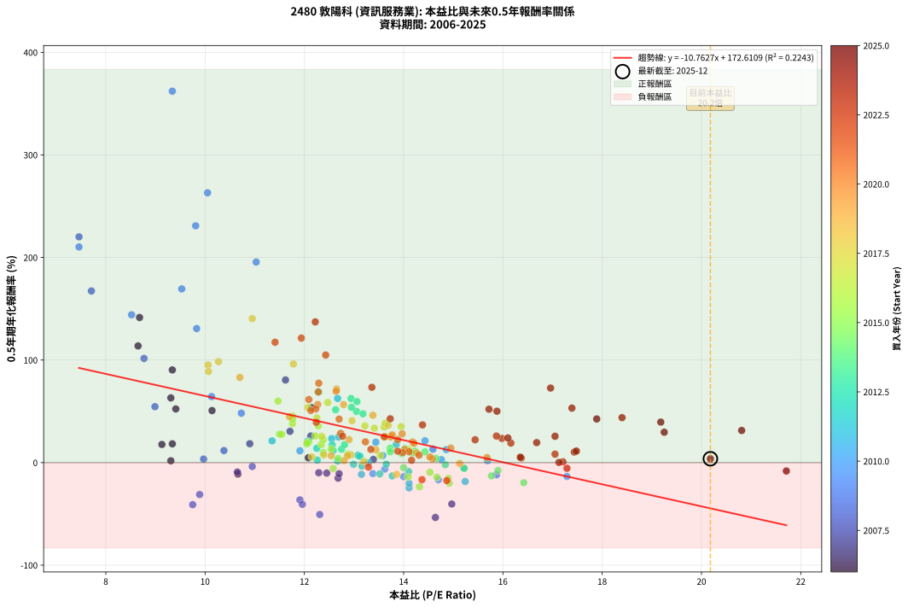
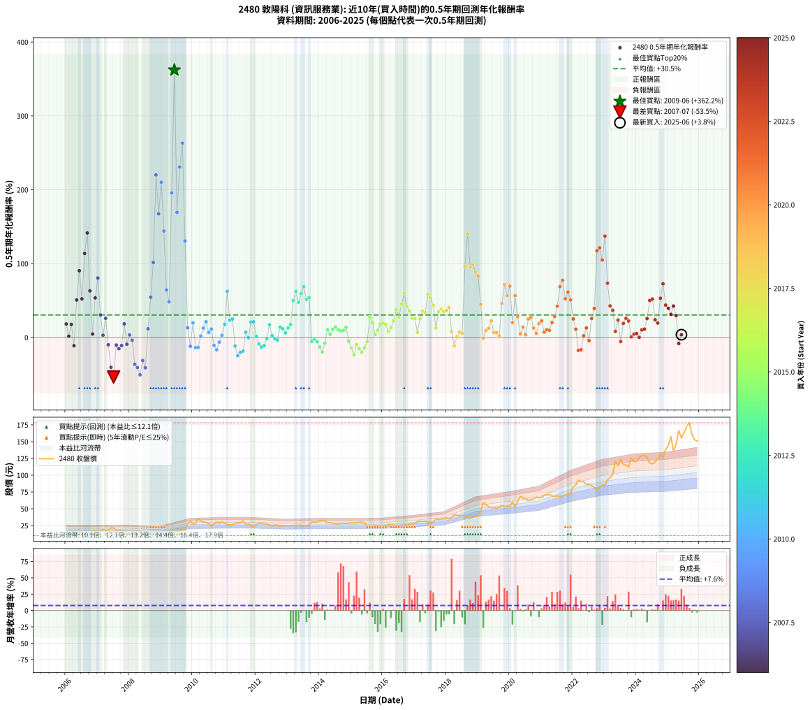

# 2480 敦陽科 - 本益比與未來報酬率分析

!!! info "報告資訊"
    - **股票代號**: 2480
    - **公司名稱**: 敦陽科
    - **產業別**: 資訊服務業
    - **分析期間**: 2006-2025 (234 個數據點)
    - **資料來源**: Type 12 (ShowMonthlyK_ChartFlow) 月收盤價與本益比
    - **報酬率口徑**: 含現金股利 (簡化: 年度合計，假設每年7/1入帳)
    - **報告生成時間**: 2026-01-04 08:48:48 CST

## 📈 視覺化圖表

### 圖表1: 本益比 vs 未來報酬率關係

*圖表1：2480 敦陽科 本益比與0.5年期未來報酬率關係 (2006-2025)*

### 圖表2: 歷年買入時點的0.5年期實際報酬率

*圖表2：2480 敦陽科 歷年買入時點的0.5年期實際報酬率 (2006-2025)*

## 📍 買點訊號說明

本報告提供兩種買點提示訊號（顯示於圖表2的股價子圖中）：

### ▲ 小綠色三角形（回測驗證）
- **計算方式**: 使用全部歷史資料計算本益比第25百分位數
- **用途**: 事後驗證，顯示歷史上哪些時點確實為低估區
- **限制**: 當下無法判斷，僅供回測參考
- **特性**: 後見之明（Look-Ahead Bias）

### ▲ 小橘色三角形（即時訊號）
- **計算方式**: 使用截至當月的過去5年資料計算本益比第25百分位數
- **用途**: 實際投資決策，當時即可判斷
- **優勢**: 可操作性強，符合實務需求
- **特性**: 無後見之明，滾動窗口計算

!!! tip "如何使用兩種訊號"
    - **綠色▲** 幫助理解歷史估值機會，驗證策略有效性
    - **橘色▲** 可作為實際買進參考，但仍需搭配基本面分析
    - 兩種訊號重疊時，表示即時判斷與事後驗證一致，信心度較高
    - 僅有綠色▲時，表示當時無法判斷（需要未來資料才能確認）
    - 僅有橘色▲時，表示即時判斷為買點，但事後可能不是最佳時機

## 📊 估值分析摘要

| 指標 | 數值 |
|:---:|:---:|
| **目前本益比** (2025-06) | **20.18 倍** |
| **歷史平均本益比** | 13.21 倍 |
| **估值水準** | 🔴 相對高估 |
| **預期0.5年年化報酬率** | **-44.58%** |
| **歷史平均報酬率** | +30.46% |
| **相關係數 (R²)** | 0.2243 |
| **趨勢線斜率** | -10.7627 |

!!! abstract "核心洞察"
    目前本益比顯著高於歷史平均，預期未來報酬率可能較低

    根據歷史數據回測，2480 敦陽科 在目前本益比 **20.2倍** 的估值水準下，
    預期未來0.5年年化報酬率約為 **-44.6%**。

    **重要提醒**: 本分析基於歷史數據統計，實際報酬率會受到公司基本面變化、產業趨勢、
    總體經濟環境等多重因素影響。R² = 0.22 表示本益比可解釋約 22.4% 的報酬率變異。

## 📈 歷史估值統計

### 最佳買點 (最高報酬率)

| 項目 | 數值 |
|:---:|:---:|
| 起始時間 | 2009-06 |
| 當時本益比 | 9.34 倍 |
| 起始價格 | 15.6 元 |
| 0.5年後價格 | 31.9 元 |
| **0.5年年化報酬率** | **+362.17%** |

### 最差買點 (最低報酬率)

| 項目 | 數值 |
|:---:|:---:|
| 起始時間 | 2007-07 |
| 當時本益比 | 14.64 倍 |
| 起始價格 | 21.2 元 |
| 0.5年後價格 | 14.4 元 |
| **0.5年年化報酬率** | **-53.49%** |

## 🎯 投資啟示

### 本益比與報酬率關係

趨勢線方程式: **y = -10.7627x + 172.6109**

!!! warning "強負相關"
    本益比與未來報酬率呈現強負相關。在高本益比時期買入，未來報酬率顯著較低；
    在低本益比時期買入，未來報酬率顯著較高。**估值紀律至關重要**。

### 估值區間建議

基於歷史數據分析:

- **🟢 低估區** (P/E < 10.6): 預期報酬率較高，可考慮增加持股
- **🟡 合理區** (P/E 10.6-15.8): 預期報酬率符合長期趨勢，正常持有
- **🔴 高估區** (P/E > 15.8): 預期報酬率較低，可考慮減碼或觀望

!!! danger "風險提示"
    - 過去表現不代表未來結果
    - 本分析假設公司基本面無重大結構性變化
    - 產業環境劇變可能使歷史規律失效
    - 應結合公司財報、產業趨勢、總體經濟等多重因素綜合判斷

!!! success "長期投資觀點"
    歷史數據顯示，在合理或低估的估值水準買入並長期持有，
    往往能獲得較佳的投資報酬。**耐心等待好價格**是價值投資的核心原則。

## 📊 數據品質

- **資料來源**: GoodInfo.tw Type 12 (ShowMonthlyK_ChartFlow)
- **資料頻率**: 月度收盤價與本益比
- **回測期間**: 2006-2025
- **數據點數量**: 234 個 (每個點代表一次0.5年期回測)

### 計算方法說明

1. **0.5年期年化報酬率**:
   - 對每個歷史時點，計算其後0.5年的實際投資報酬率
   - 期末價值(不含股利): 期末價格
   - 期末價值(含現金股利): 期末價格 + 持有期間內的現金股利合計 (簡化: 年度合計，假設每年7/1入帳)
   - 公式: 年化報酬率 = [(期末價值/期初價格)^(1/年數) - 1] × 100%

2. **本益比 (P/E Ratio)**:
   - 使用當時的月收盤價與EPS計算
   - 資料來源: Type 12 月度河流圖本益比數據

3. **趨勢線 (Linear Regression)**:
   - 使用最小平方法擬合線性趨勢線
   - R²值衡量本益比對報酬率的解釋能力

---

*本報告由 Stock Analysis System v1.9.0 自動生成*
*數據更新時間: 2026-01-04 08:48:48 CST*

## 📋 月度回測明細表

（每一列對應時間線圖中的一個買入點；可用來對照 SVG 圖上的每個點。）

| 買入月份 | 賣出月份 | 回測期限_年 | 實際持有年數 | 買入本益比_倍 | 買入收盤價_元 | 賣出收盤價_元 | 現金股利合計_元 | 總報酬率_pct | 年化報酬率_pct |
| --- | --- | --- | --- | --- | --- | --- | --- | --- | --- |
| 2006-01 | 2006-07 | 0.5 | 0.496 | 9.34 | 13.45 | 13.55 | 1.07 | +8.70 | +18.33 |
| 2006-02 | 2006-08 | 0.5 | 0.498 | 9.31 | 13.40 | 12.45 | 1.07 | +0.90 | +1.81 |
| 2006-03 | 2006-10 | 0.5 | 0.586 | 9.13 | 13.15 | 13.40 | 1.07 | +10.04 | +17.73 |
| 2006-04 | 2006-10 | 0.5 | 0.501 | 10.66 | 15.35 | 13.40 | 1.07 | -5.73 | -11.12 |
| 2006-05 | 2006-12 | 0.5 | 0.586 | 10.14 | 14.60 | 17.50 | 1.07 | +27.19 | +50.76 |
| 2006-06 | 2006-12 | 0.5 | 0.501 | 9.34 | 13.45 | 17.50 | 1.07 | +38.07 | +90.37 |
| 2006-07 | 2007-01 | 0.5 | 0.504 | 9.41 | 13.55 | 16.75 | 0.00 | +23.62 | +52.33 |
| 2006-08 | 2007-03 | 0.5 | 0.580 | 8.65 | 12.45 | 19.35 | 0.00 | +55.42 | +113.77 |
| 2006-09 | 2007-03 | 0.5 | 0.496 | 8.68 | 12.50 | 19.35 | 0.00 | +54.80 | +141.52 |
| 2006-10 | 2007-05 | 0.5 | 0.580 | 9.31 | 13.40 | 17.80 | 0.00 | +32.84 | +63.10 |
| 2006-11 | 2007-05 | 0.5 | 0.496 | 12.08 | 17.40 | 17.80 | 0.00 | +2.30 | +4.69 |
| 2006-12 | 2007-07 | 0.5 | 0.580 | 12.15 | 17.50 | 21.25 | 1.20 | +28.29 | +53.60 |
| 2007-01 | 2007-07 | 0.5 | 0.496 | 11.62 | 16.75 | 21.25 | 1.20 | +34.03 | +80.59 |
| 2007-02 | 2007-08 | 0.5 | 0.498 | 11.71 | 16.90 | 18.10 | 1.20 | +14.20 | +30.54 |
| 2007-03 | 2007-10 | 0.5 | 0.586 | 13.39 | 19.35 | 18.50 | 1.20 | +1.81 | +3.11 |
| 2007-04 | 2007-10 | 0.5 | 0.501 | 12.13 | 17.55 | 18.50 | 1.20 | +12.25 | +25.94 |
| 2007-05 | 2007-12 | 0.5 | 0.586 | 12.29 | 17.80 | 15.55 | 1.20 | -5.90 | -9.86 |
| 2007-06 | 2007-12 | 0.5 | 0.501 | 14.97 | 21.70 | 15.55 | 1.20 | -22.81 | -40.36 |
| 2007-07 | 2008-01 | 0.5 | 0.504 | 14.64 | 21.25 | 14.45 | 0.00 | -32.00 | -53.49 |
| 2007-08 | 2008-03 | 0.5 | 0.583 | 12.45 | 18.10 | 17.00 | 0.00 | -6.08 | -10.19 |
| 2007-09 | 2008-03 | 0.5 | 0.498 | 12.68 | 18.45 | 17.00 | 0.00 | -7.86 | -15.15 |
| 2007-10 | 2008-05 | 0.5 | 0.583 | 12.70 | 18.50 | 17.30 | 0.00 | -6.49 | -10.86 |
| 2007-11 | 2008-05 | 0.5 | 0.498 | 10.90 | 15.90 | 17.30 | 0.00 | +8.81 | +18.45 |
| 2007-12 | 2008-07 | 0.5 | 0.583 | 10.65 | 15.55 | 13.50 | 1.20 | -5.47 | -9.19 |
| 2008-01 | 2008-07 | 0.5 | 0.498 | 9.97 | 14.45 | 13.50 | 1.20 | +1.73 | +3.50 |
| 2008-02 | 2008-08 | 0.5 | 0.501 | 10.95 | 15.75 | 14.25 | 1.20 | -1.90 | -3.77 |
| 2008-03 | 2008-10 | 0.5 | 0.586 | 11.91 | 17.00 | 11.85 | 1.20 | -23.24 | -36.32 |
| 2008-04 | 2008-10 | 0.5 | 0.501 | 11.96 | 16.95 | 11.85 | 1.20 | -23.01 | -40.66 |
| 2008-05 | 2008-12 | 0.5 | 0.586 | 12.31 | 17.30 | 10.25 | 1.20 | -33.82 | -50.56 |
| 2008-06 | 2008-12 | 0.5 | 0.501 | 9.89 | 13.80 | 10.25 | 1.20 | -17.03 | -31.11 |
| 2008-07 | 2009-01 | 0.5 | 0.504 | 9.75 | 13.50 | 10.35 | 0.00 | -23.33 | -40.99 |
| 2008-08 | 2009-03 | 0.5 | 0.580 | 10.38 | 14.25 | 15.20 | 0.00 | +6.67 | +11.76 |
| 2008-09 | 2009-03 | 0.5 | 0.496 | 8.99 | 12.25 | 15.20 | 0.00 | +24.08 | +54.56 |
| 2008-10 | 2009-05 | 0.5 | 0.580 | 8.77 | 11.85 | 17.80 | 0.00 | +50.21 | +101.57 |
| 2008-11 | 2009-05 | 0.5 | 0.496 | 7.46 | 10.00 | 17.80 | 0.00 | +78.00 | +220.14 |
| 2008-12 | 2009-07 | 0.5 | 0.580 | 7.71 | 10.25 | 16.45 | 1.69 | +76.98 | +167.38 |
| 2009-01 | 2009-07 | 0.5 | 0.496 | 7.46 | 10.35 | 16.45 | 1.69 | +75.27 | +210.29 |
| 2009-02 | 2009-08 | 0.5 | 0.498 | 8.52 | 12.30 | 17.50 | 1.69 | +56.02 | +144.16 |
| 2009-03 | 2009-10 | 0.5 | 0.586 | 10.13 | 15.20 | 18.65 | 1.69 | +33.82 | +64.41 |
| 2009-04 | 2009-10 | 0.5 | 0.501 | 10.73 | 16.70 | 18.65 | 1.69 | +21.80 | +48.22 |
| 2009-05 | 2009-12 | 0.5 | 0.586 | 11.03 | 17.80 | 31.90 | 1.69 | +88.71 | +195.60 |
| 2009-06 | 2009-12 | 0.5 | 0.501 | 9.34 | 15.60 | 31.90 | 1.69 | +115.32 | +362.17 |
| 2009-07 | 2010-01 | 0.5 | 0.504 | 9.53 | 16.45 | 27.10 | 0.00 | +64.74 | +169.38 |
| 2009-08 | 2010-03 | 0.5 | 0.580 | 9.81 | 17.50 | 35.05 | 0.00 | +100.29 | +230.91 |
| 2009-09 | 2010-03 | 0.5 | 0.496 | 10.05 | 18.50 | 35.05 | 0.00 | +89.46 | +263.09 |
| 2009-10 | 2010-05 | 0.5 | 0.580 | 9.83 | 18.65 | 30.30 | 0.00 | +62.47 | +130.74 |
| 2009-11 | 2010-05 | 0.5 | 0.496 | 14.59 | 28.50 | 30.30 | 0.00 | +6.32 | +13.15 |
| 2009-12 | 2010-07 | 0.5 | 0.580 | 15.87 | 31.90 | 27.85 | 1.80 | -7.05 | -11.84 |
| 2010-01 | 2010-07 | 0.5 | 0.496 | 13.44 | 27.10 | 27.85 | 1.80 | +9.41 | +19.90 |
| 2010-02 | 2010-08 | 0.5 | 0.498 | 14.00 | 28.30 | 24.50 | 1.80 | -7.07 | -13.68 |
| 2010-03 | 2010-10 | 0.5 | 0.586 | 17.29 | 35.05 | 30.40 | 1.80 | -8.13 | -13.48 |
| 2010-04 | 2010-10 | 0.5 | 0.501 | 15.69 | 31.90 | 30.40 | 1.80 | +0.94 | +1.89 |
| 2010-05 | 2010-12 | 0.5 | 0.586 | 14.86 | 30.30 | 30.70 | 1.80 | +7.26 | +12.71 |
| 2010-06 | 2010-12 | 0.5 | 0.501 | 14.43 | 29.50 | 30.70 | 1.80 | +10.17 | +21.33 |
| 2010-07 | 2011-01 | 0.5 | 0.504 | 13.58 | 27.85 | 28.80 | 0.00 | +3.41 | +6.89 |
| 2010-08 | 2011-03 | 0.5 | 0.580 | 11.91 | 24.50 | 26.10 | 0.00 | +6.53 | +11.52 |
| 2010-09 | 2011-03 | 0.5 | 0.496 | 13.38 | 27.60 | 26.10 | 0.00 | -5.43 | -10.66 |
| 2010-10 | 2011-05 | 0.5 | 0.580 | 14.70 | 30.40 | 27.35 | 0.00 | -10.03 | -16.65 |
| 2010-11 | 2011-05 | 0.5 | 0.496 | 13.62 | 28.25 | 27.35 | 0.00 | -3.19 | -6.32 |
| 2010-12 | 2011-07 | 0.5 | 0.580 | 14.76 | 30.70 | 29.35 | 1.87 | +1.69 | +2.94 |
| 2011-01 | 2011-07 | 0.5 | 0.496 | 13.85 | 28.80 | 29.35 | 1.87 | +8.40 | +17.68 |
| 2011-02 | 2011-08 | 0.5 | 0.498 | 12.67 | 26.35 | 31.70 | 1.87 | +27.40 | +62.58 |
| 2011-03 | 2011-10 | 0.5 | 0.586 | 12.55 | 26.10 | 27.65 | 1.87 | +13.10 | +23.39 |
| 2011-04 | 2011-10 | 0.5 | 0.501 | 12.69 | 26.40 | 27.65 | 1.87 | +11.82 | +24.98 |
| 2011-05 | 2011-12 | 0.5 | 0.586 | 13.15 | 27.35 | 23.60 | 1.87 | -6.87 | -11.45 |
| 2011-06 | 2011-12 | 0.5 | 0.501 | 14.11 | 29.35 | 23.60 | 1.87 | -13.22 | -24.65 |
| 2011-07 | 2012-01 | 0.5 | 0.504 | 14.11 | 29.35 | 26.20 | 0.00 | -10.73 | -20.18 |
| 2011-08 | 2012-03 | 0.5 | 0.583 | 15.24 | 31.70 | 28.15 | 0.00 | -11.20 | -18.43 |
| 2011-09 | 2012-03 | 0.5 | 0.498 | 13.08 | 27.20 | 28.15 | 0.00 | +3.49 | +7.13 |
| 2011-10 | 2012-05 | 0.5 | 0.583 | 13.29 | 27.65 | 27.60 | 0.00 | -0.18 | -0.31 |
| 2011-11 | 2012-05 | 0.5 | 0.498 | 12.07 | 25.10 | 27.60 | 0.00 | +9.96 | +20.99 |
| 2011-12 | 2012-07 | 0.5 | 0.583 | 11.35 | 23.60 | 24.50 | 1.90 | +11.86 | +21.20 |
| 2012-01 | 2012-07 | 0.5 | 0.498 | 12.67 | 26.20 | 24.50 | 1.90 | +0.76 | +1.54 |
| 2012-02 | 2012-08 | 0.5 | 0.501 | 14.10 | 29.00 | 25.80 | 1.90 | -4.48 | -8.75 |
| 2012-03 | 2012-10 | 0.5 | 0.586 | 13.77 | 28.15 | 24.05 | 1.90 | -7.82 | -12.97 |
| 2012-04 | 2012-10 | 0.5 | 0.501 | 13.52 | 27.50 | 24.05 | 1.90 | -5.64 | -10.93 |
| 2012-05 | 2012-12 | 0.5 | 0.586 | 13.65 | 27.60 | 25.45 | 1.90 | -0.91 | -1.54 |
| 2012-06 | 2012-12 | 0.5 | 0.501 | 12.56 | 25.25 | 25.45 | 1.90 | +8.32 | +17.29 |
| 2012-07 | 2013-01 | 0.5 | 0.504 | 12.26 | 24.50 | 24.80 | 0.00 | +1.22 | +2.45 |
| 2012-08 | 2013-03 | 0.5 | 0.580 | 12.99 | 25.80 | 25.55 | 0.00 | -0.97 | -1.66 |
| 2012-09 | 2013-03 | 0.5 | 0.496 | 13.16 | 26.00 | 25.55 | 0.00 | -1.73 | -3.46 |
| 2012-10 | 2013-05 | 0.5 | 0.580 | 12.25 | 24.05 | 25.95 | 0.00 | +7.90 | +14.00 |
| 2012-11 | 2013-05 | 0.5 | 0.496 | 12.58 | 24.55 | 25.95 | 0.00 | +5.70 | +11.84 |
| 2012-12 | 2013-07 | 0.5 | 0.580 | 13.12 | 25.45 | 24.35 | 2.00 | +3.54 | +6.17 |
| 2013-01 | 2013-07 | 0.5 | 0.496 | 12.75 | 24.80 | 24.35 | 2.00 | +6.25 | +13.01 |
| 2013-02 | 2013-08 | 0.5 | 0.498 | 12.81 | 25.00 | 25.10 | 2.00 | +8.40 | +17.57 |
| 2013-03 | 2013-10 | 0.5 | 0.586 | 13.05 | 25.55 | 30.40 | 2.00 | +26.81 | +49.99 |
| 2013-04 | 2013-10 | 0.5 | 0.501 | 12.94 | 25.40 | 30.40 | 2.00 | +27.56 | +62.55 |
| 2013-05 | 2013-12 | 0.5 | 0.586 | 13.18 | 25.95 | 30.60 | 2.00 | +25.63 | +47.61 |
| 2013-06 | 2013-12 | 0.5 | 0.501 | 13.06 | 25.80 | 30.60 | 2.00 | +26.36 | +59.51 |
| 2013-07 | 2014-01 | 0.5 | 0.504 | 12.29 | 24.35 | 31.70 | 0.00 | +30.18 | +68.81 |
| 2013-08 | 2014-03 | 0.5 | 0.580 | 12.63 | 25.10 | 31.95 | 0.00 | +27.29 | +51.55 |
| 2013-09 | 2014-03 | 0.5 | 0.496 | 12.95 | 25.80 | 31.95 | 0.00 | +23.84 | +53.95 |
| 2013-10 | 2014-05 | 0.5 | 0.580 | 15.21 | 30.40 | 29.45 | 0.00 | -3.12 | -5.32 |
| 2013-11 | 2014-05 | 0.5 | 0.496 | 14.84 | 29.75 | 29.45 | 0.00 | -1.01 | -2.02 |
| 2013-12 | 2014-07 | 0.5 | 0.580 | 15.22 | 30.60 | 27.60 | 2.00 | -3.27 | -5.56 |
| 2014-01 | 2014-07 | 0.5 | 0.496 | 15.77 | 31.70 | 27.60 | 2.00 | -6.62 | -12.92 |
| 2014-02 | 2014-08 | 0.5 | 0.498 | 16.42 | 33.00 | 27.60 | 2.00 | -10.30 | -19.60 |
| 2014-03 | 2014-10 | 0.5 | 0.586 | 15.90 | 31.95 | 28.50 | 2.00 | -4.54 | -7.62 |
| 2014-04 | 2014-10 | 0.5 | 0.501 | 14.43 | 29.00 | 28.50 | 2.00 | +5.17 | +10.59 |
| 2014-05 | 2014-12 | 0.5 | 0.586 | 14.65 | 29.45 | 28.15 | 2.00 | +2.38 | +4.09 |
| 2014-06 | 2014-12 | 0.5 | 0.501 | 14.23 | 28.60 | 28.15 | 2.00 | +5.42 | +11.11 |
| 2014-07 | 2015-01 | 0.5 | 0.504 | 13.73 | 27.60 | 29.50 | 0.00 | +6.88 | +14.13 |
| 2014-08 | 2015-03 | 0.5 | 0.580 | 13.73 | 27.60 | 29.25 | 0.00 | +5.98 | +10.52 |
| 2014-09 | 2015-03 | 0.5 | 0.496 | 13.96 | 28.05 | 29.25 | 0.00 | +4.28 | +8.82 |
| 2014-10 | 2015-05 | 0.5 | 0.580 | 14.18 | 28.50 | 30.05 | 0.00 | +5.44 | +9.55 |
| 2014-11 | 2015-05 | 0.5 | 0.496 | 14.03 | 28.20 | 30.05 | 0.00 | +6.56 | +13.68 |
| 2014-12 | 2015-07 | 0.5 | 0.580 | 14.00 | 28.15 | 25.35 | 2.00 | -2.84 | -4.85 |
| 2015-01 | 2015-07 | 0.5 | 0.496 | 14.67 | 29.50 | 25.35 | 2.00 | -7.29 | -14.16 |
| 2015-02 | 2015-08 | 0.5 | 0.498 | 14.32 | 28.80 | 23.20 | 2.00 | -12.50 | -23.51 |
| 2015-03 | 2015-10 | 0.5 | 0.586 | 14.53 | 29.25 | 25.60 | 2.00 | -5.64 | -9.43 |
| 2015-04 | 2015-10 | 0.5 | 0.501 | 14.90 | 30.00 | 25.60 | 2.00 | -8.00 | -15.33 |
| 2015-05 | 2015-12 | 0.5 | 0.586 | 14.92 | 30.05 | 24.35 | 2.00 | -12.31 | -20.09 |
| 2015-06 | 2015-12 | 0.5 | 0.501 | 14.09 | 28.40 | 24.35 | 2.00 | -7.22 | -13.89 |
| 2015-07 | 2016-01 | 0.5 | 0.504 | 12.58 | 25.35 | 24.60 | 0.00 | -2.96 | -5.79 |
| 2015-08 | 2016-03 | 0.5 | 0.583 | 11.50 | 23.20 | 26.75 | 0.00 | +15.30 | +27.65 |
| 2015-09 | 2016-03 | 0.5 | 0.498 | 12.09 | 24.40 | 26.75 | 0.00 | +9.63 | +20.27 |
| 2015-10 | 2016-05 | 0.5 | 0.583 | 12.68 | 25.60 | 26.20 | 0.00 | +2.34 | +4.05 |
| 2015-11 | 2016-05 | 0.5 | 0.498 | 12.38 | 25.00 | 26.20 | 0.00 | +4.80 | +9.87 |
| 2015-12 | 2016-07 | 0.5 | 0.583 | 12.05 | 24.35 | 24.85 | 2.00 | +10.27 | +18.25 |
| 2016-01 | 2016-07 | 0.5 | 0.498 | 12.06 | 24.60 | 24.85 | 2.00 | +9.15 | +19.20 |
| 2016-02 | 2016-08 | 0.5 | 0.501 | 12.34 | 25.40 | 25.55 | 2.00 | +8.46 | +17.61 |
| 2016-03 | 2016-10 | 0.5 | 0.586 | 12.88 | 26.75 | 26.00 | 2.00 | +4.67 | +8.11 |
| 2016-04 | 2016-10 | 0.5 | 0.501 | 12.54 | 26.30 | 26.00 | 2.00 | +6.46 | +13.32 |
| 2016-05 | 2016-12 | 0.5 | 0.586 | 12.38 | 26.20 | 27.50 | 2.00 | +12.60 | +22.44 |
| 2016-06 | 2016-12 | 0.5 | 0.501 | 11.76 | 25.10 | 27.50 | 2.00 | +17.53 | +38.04 |
| 2016-07 | 2017-01 | 0.5 | 0.504 | 11.54 | 24.85 | 28.10 | 0.00 | +13.08 | +27.63 |
| 2016-08 | 2017-03 | 0.5 | 0.580 | 11.76 | 25.55 | 31.75 | 0.00 | +24.27 | +45.40 |
| 2016-09 | 2017-03 | 0.5 | 0.496 | 11.47 | 25.15 | 31.75 | 0.00 | +26.24 | +60.04 |
| 2016-10 | 2017-05 | 0.5 | 0.580 | 11.76 | 26.00 | 31.90 | 0.00 | +22.69 | +42.24 |
| 2016-11 | 2017-05 | 0.5 | 0.496 | 12.28 | 27.40 | 31.90 | 0.00 | +16.42 | +35.91 |
| 2016-12 | 2017-07 | 0.5 | 0.580 | 12.22 | 27.50 | 29.35 | 2.10 | +14.36 | +26.02 |
| 2017-01 | 2017-07 | 0.5 | 0.496 | 12.35 | 28.10 | 29.35 | 2.10 | +11.92 | +25.52 |
| 2017-02 | 2017-08 | 0.5 | 0.498 | 13.53 | 31.15 | 30.10 | 2.10 | +3.37 | +6.88 |
| 2017-03 | 2017-10 | 0.5 | 0.586 | 13.64 | 31.75 | 34.15 | 2.10 | +14.17 | +25.39 |
| 2017-04 | 2017-10 | 0.5 | 0.501 | 13.22 | 31.10 | 34.15 | 2.10 | +16.56 | +35.78 |
| 2017-05 | 2017-12 | 0.5 | 0.586 | 13.41 | 31.90 | 35.70 | 2.10 | +18.50 | +33.60 |
| 2017-06 | 2017-12 | 0.5 | 0.501 | 12.47 | 30.00 | 35.70 | 2.10 | +26.00 | +58.61 |
| 2017-07 | 2018-01 | 0.5 | 0.504 | 12.07 | 29.35 | 36.45 | 0.00 | +24.19 | +53.73 |
| 2017-08 | 2018-03 | 0.5 | 0.580 | 12.25 | 30.10 | 37.15 | 0.00 | +23.42 | +43.70 |
| 2017-09 | 2018-03 | 0.5 | 0.496 | 14.10 | 35.00 | 37.15 | 0.00 | +6.14 | +12.78 |
| 2017-10 | 2018-05 | 0.5 | 0.580 | 13.61 | 34.15 | 40.60 | 0.00 | +18.89 | +34.73 |
| 2017-11 | 2018-05 | 0.5 | 0.496 | 13.63 | 34.55 | 40.60 | 0.00 | +17.51 | +38.49 |
| 2017-12 | 2018-07 | 0.5 | 0.580 | 13.95 | 35.70 | 39.90 | 2.62 | +19.10 | +35.15 |
| 2018-01 | 2018-07 | 0.5 | 0.496 | 13.69 | 36.45 | 39.90 | 2.62 | +16.65 | +36.46 |
| 2018-02 | 2018-08 | 0.5 | 0.498 | 12.96 | 35.85 | 39.90 | 2.62 | +18.61 | +40.84 |
| 2018-03 | 2018-10 | 0.5 | 0.586 | 12.94 | 37.15 | 36.15 | 2.62 | +4.36 | +7.56 |
| 2018-04 | 2018-10 | 0.5 | 0.501 | 13.86 | 41.20 | 36.15 | 2.62 | -5.90 | -11.43 |
| 2018-05 | 2018-12 | 0.5 | 0.586 | 13.20 | 40.60 | 38.25 | 2.62 | +0.67 | +1.14 |
| 2018-06 | 2018-12 | 0.5 | 0.501 | 12.39 | 39.40 | 38.25 | 2.62 | +3.73 | +7.58 |
| 2018-07 | 2019-01 | 0.5 | 0.504 | 12.15 | 39.90 | 41.00 | 0.00 | +2.76 | +5.55 |
| 2018-08 | 2019-03 | 0.5 | 0.580 | 11.78 | 39.90 | 59.00 | 0.00 | +47.87 | +96.19 |
| 2018-09 | 2019-03 | 0.5 | 0.496 | 10.95 | 38.20 | 59.00 | 0.00 | +54.45 | +140.42 |
| 2018-10 | 2019-05 | 0.5 | 0.580 | 10.06 | 36.15 | 53.30 | 0.00 | +47.44 | +95.21 |
| 2018-11 | 2019-05 | 0.5 | 0.496 | 10.27 | 37.95 | 53.30 | 0.00 | +40.45 | +98.46 |
| 2018-12 | 2019-07 | 0.5 | 0.580 | 10.07 | 38.25 | 51.90 | 3.42 | +44.63 | +88.84 |
| 2019-01 | 2019-07 | 0.5 | 0.496 | 10.70 | 41.00 | 51.90 | 3.42 | +34.93 | +83.03 |
| 2019-02 | 2019-08 | 0.5 | 0.498 | 11.70 | 45.25 | 51.00 | 3.42 | +20.27 | +44.82 |
| 2019-03 | 2019-10 | 0.5 | 0.586 | 15.13 | 59.00 | 55.30 | 3.42 | -0.47 | -0.81 |
| 2019-04 | 2019-10 | 0.5 | 0.501 | 14.26 | 56.10 | 55.30 | 3.42 | +4.67 | +9.54 |
| 2019-05 | 2019-12 | 0.5 | 0.586 | 13.44 | 53.30 | 53.70 | 3.42 | +7.17 | +12.54 |
| 2019-06 | 2019-12 | 0.5 | 0.501 | 12.90 | 51.60 | 53.70 | 3.42 | +10.70 | +22.49 |
| 2019-07 | 2020-01 | 0.5 | 0.504 | 12.87 | 51.90 | 53.60 | 0.00 | +3.28 | +6.61 |
| 2019-08 | 2020-03 | 0.5 | 0.583 | 12.54 | 51.00 | 53.00 | 0.00 | +3.92 | +6.82 |
| 2019-09 | 2020-03 | 0.5 | 0.498 | 12.80 | 52.50 | 53.00 | 0.00 | +0.95 | +1.92 |
| 2019-10 | 2020-05 | 0.5 | 0.583 | 13.38 | 55.30 | 69.00 | 0.00 | +24.77 | +46.16 |
| 2019-11 | 2020-05 | 0.5 | 0.498 | 12.65 | 52.70 | 69.00 | 0.00 | +30.93 | +71.74 |
| 2019-12 | 2020-07 | 0.5 | 0.583 | 12.79 | 53.70 | 65.30 | 4.45 | +29.89 | +56.58 |
| 2020-01 | 2020-07 | 0.5 | 0.498 | 12.64 | 53.60 | 65.30 | 4.45 | +30.13 | +69.65 |
| 2020-02 | 2020-08 | 0.5 | 0.501 | 14.18 | 60.70 | 62.10 | 4.45 | +9.64 | +20.16 |
| 2020-03 | 2020-10 | 0.5 | 0.586 | 12.27 | 53.00 | 64.50 | 4.45 | +30.09 | +56.68 |
| 2020-04 | 2020-10 | 0.5 | 0.501 | 13.97 | 60.90 | 64.50 | 4.45 | +13.22 | +28.12 |
| 2020-05 | 2020-12 | 0.5 | 0.586 | 15.68 | 69.00 | 66.50 | 4.45 | +2.83 | +4.87 |
| 2020-06 | 2020-12 | 0.5 | 0.501 | 14.95 | 66.40 | 66.50 | 4.45 | +6.85 | +14.14 |
| 2020-07 | 2021-01 | 0.5 | 0.504 | 14.58 | 65.30 | 66.50 | 0.00 | +1.84 | +3.68 |
| 2020-08 | 2021-03 | 0.5 | 0.580 | 13.74 | 62.10 | 70.70 | 0.00 | +13.85 | +25.04 |
| 2020-09 | 2021-03 | 0.5 | 0.496 | 13.77 | 62.80 | 70.70 | 0.00 | +12.58 | +27.01 |
| 2020-10 | 2021-05 | 0.5 | 0.580 | 14.02 | 64.50 | 69.20 | 0.00 | +7.29 | +12.88 |
| 2020-11 | 2021-05 | 0.5 | 0.496 | 14.53 | 67.40 | 69.20 | 0.00 | +2.67 | +5.46 |
| 2020-12 | 2021-07 | 0.5 | 0.580 | 14.21 | 66.50 | 69.20 | 4.30 | +10.53 | +18.82 |
| 2021-01 | 2021-07 | 0.5 | 0.496 | 13.88 | 66.50 | 69.20 | 4.30 | +10.53 | +22.38 |
| 2021-02 | 2021-08 | 0.5 | 0.498 | 14.31 | 70.10 | 68.30 | 4.30 | +3.57 | +7.29 |
| 2021-03 | 2021-10 | 0.5 | 0.586 | 14.11 | 70.70 | 70.70 | 4.30 | +6.08 | +10.60 |
| 2021-04 | 2021-10 | 0.5 | 0.501 | 13.98 | 71.60 | 70.70 | 4.30 | +4.75 | +9.70 |
| 2021-05 | 2021-12 | 0.5 | 0.586 | 13.23 | 69.20 | 72.80 | 4.30 | +11.42 | +20.26 |
| 2021-06 | 2021-12 | 0.5 | 0.501 | 12.73 | 68.00 | 72.80 | 4.30 | +13.38 | +28.49 |
| 2021-07 | 2022-01 | 0.5 | 0.504 | 12.70 | 69.20 | 82.70 | 0.00 | +19.51 | +42.44 |
| 2021-08 | 2022-03 | 0.5 | 0.580 | 12.28 | 68.30 | 92.60 | 0.00 | +35.58 | +68.95 |
| 2021-09 | 2022-03 | 0.5 | 0.496 | 12.29 | 69.70 | 92.60 | 0.00 | +32.86 | +77.41 |
| 2021-10 | 2022-05 | 0.5 | 0.580 | 12.23 | 70.70 | 90.30 | 0.00 | +27.72 | +52.44 |
| 2021-11 | 2022-05 | 0.5 | 0.496 | 12.09 | 71.20 | 90.30 | 0.00 | +26.83 | +61.54 |
| 2021-12 | 2022-07 | 0.5 | 0.580 | 12.13 | 72.80 | 86.80 | 5.62 | +26.95 | +50.85 |
| 2022-01 | 2022-07 | 0.5 | 0.496 | 13.61 | 82.70 | 86.80 | 5.62 | +11.75 | +25.14 |
| 2022-02 | 2022-08 | 0.5 | 0.498 | 13.88 | 85.40 | 84.40 | 5.62 | +5.41 | +11.15 |
| 2022-03 | 2022-10 | 0.5 | 0.586 | 14.87 | 92.60 | 77.10 | 5.62 | -10.67 | -17.52 |
| 2022-04 | 2022-10 | 0.5 | 0.501 | 14.37 | 90.60 | 77.10 | 5.62 | -8.70 | -16.61 |
| 2022-05 | 2022-12 | 0.5 | 0.586 | 14.16 | 90.30 | 85.90 | 5.62 | +1.35 | +2.32 |
| 2022-06 | 2022-12 | 0.5 | 0.501 | 13.34 | 86.10 | 85.90 | 5.62 | +6.30 | +12.96 |
| 2022-07 | 2023-01 | 0.5 | 0.504 | 13.29 | 86.80 | 84.90 | 0.00 | -2.19 | -4.30 |
| 2022-08 | 2023-03 | 0.5 | 0.580 | 12.77 | 84.40 | 96.40 | 0.00 | +14.22 | +25.74 |
| 2022-09 | 2023-03 | 0.5 | 0.496 | 12.24 | 81.80 | 96.40 | 0.00 | +17.85 | +39.29 |
| 2022-10 | 2023-05 | 0.5 | 0.580 | 11.41 | 77.10 | 121.00 | 0.00 | +56.94 | +117.38 |
| 2022-11 | 2023-05 | 0.5 | 0.496 | 11.94 | 81.60 | 121.00 | 0.00 | +48.28 | +121.44 |
| 2022-12 | 2023-07 | 0.5 | 0.580 | 12.43 | 85.90 | 124.00 | 6.26 | +51.64 | +104.89 |
| 2023-01 | 2023-07 | 0.5 | 0.496 | 12.22 | 84.90 | 124.00 | 6.26 | +53.43 | +137.22 |
| 2023-02 | 2023-08 | 0.5 | 0.498 | 13.36 | 93.30 | 116.50 | 6.26 | +31.58 | +73.45 |
| 2023-03 | 2023-10 | 0.5 | 0.586 | 13.73 | 96.40 | 112.50 | 6.26 | +23.20 | +42.77 |
| 2023-04 | 2023-10 | 0.5 | 0.501 | 14.38 | 101.50 | 112.50 | 6.26 | +17.00 | +36.81 |
| 2023-05 | 2023-12 | 0.5 | 0.586 | 17.05 | 121.00 | 120.50 | 6.26 | +4.76 | +8.26 |
| 2023-06 | 2023-12 | 0.5 | 0.501 | 15.98 | 114.00 | 120.50 | 6.26 | +11.19 | +23.59 |
| 2023-07 | 2024-01 | 0.5 | 0.504 | 17.29 | 124.00 | 120.50 | 0.00 | -2.82 | -5.53 |
| 2023-08 | 2024-03 | 0.5 | 0.583 | 16.16 | 116.50 | 129.00 | 0.00 | +10.73 | +19.10 |
| 2023-09 | 2024-03 | 0.5 | 0.498 | 15.87 | 115.00 | 129.00 | 0.00 | +12.17 | +25.93 |
| 2023-10 | 2024-05 | 0.5 | 0.583 | 15.44 | 112.50 | 126.50 | 0.00 | +12.44 | +22.28 |
| 2023-11 | 2024-05 | 0.5 | 0.498 | 17.21 | 126.00 | 126.50 | 0.00 | +0.40 | +0.80 |
| 2023-12 | 2024-07 | 0.5 | 0.583 | 16.37 | 120.50 | 117.00 | 6.64 | +2.61 | +4.51 |
| 2024-01 | 2024-07 | 0.5 | 0.498 | 16.35 | 120.50 | 117.00 | 6.64 | +2.61 | +5.30 |
| 2024-02 | 2024-08 | 0.5 | 0.501 | 17.13 | 126.50 | 120.00 | 6.64 | +0.11 | +0.22 |
| 2024-03 | 2024-10 | 0.5 | 0.586 | 17.44 | 129.00 | 130.00 | 6.64 | +5.92 | +10.32 |
| 2024-04 | 2024-10 | 0.5 | 0.501 | 17.48 | 129.50 | 130.00 | 6.64 | +5.51 | +11.31 |
| 2024-05 | 2024-12 | 0.5 | 0.586 | 17.05 | 126.50 | 138.00 | 6.64 | +14.34 | +25.70 |
| 2024-06 | 2024-12 | 0.5 | 0.501 | 15.88 | 118.00 | 138.00 | 6.64 | +22.58 | +50.12 |
| 2024-07 | 2025-01 | 0.5 | 0.504 | 15.72 | 117.00 | 144.50 | 0.00 | +23.50 | +52.05 |
| 2024-08 | 2025-03 | 0.5 | 0.580 | 16.10 | 120.00 | 136.00 | 0.00 | +13.33 | +24.07 |
| 2024-09 | 2025-03 | 0.5 | 0.496 | 16.68 | 124.50 | 136.00 | 0.00 | +9.24 | +19.52 |
| 2024-10 | 2025-05 | 0.5 | 0.580 | 17.39 | 130.00 | 166.50 | 0.00 | +28.08 | +53.16 |
| 2024-11 | 2025-05 | 0.5 | 0.496 | 16.96 | 127.00 | 166.50 | 0.00 | +31.10 | +72.72 |
| 2024-12 | 2025-07 | 0.5 | 0.580 | 18.40 | 138.00 | 163.00 | 7.42 | +23.49 | +43.85 |
| 2025-01 | 2025-07 | 0.5 | 0.496 | 19.18 | 144.50 | 163.00 | 7.42 | +17.94 | +39.51 |
| 2025-02 | 2025-08 | 0.5 | 0.498 | 20.81 | 157.50 | 173.00 | 7.42 | +14.55 | +31.35 |
| 2025-03 | 2025-10 | 0.5 | 0.586 | 17.89 | 136.00 | 160.00 | 7.42 | +23.10 | +42.59 |
| 2025-04 | 2025-10 | 0.5 | 0.501 | 19.25 | 147.00 | 160.00 | 7.42 | +13.89 | +29.65 |
| 2025-05 | 2025-12 | 0.5 | 0.586 | 21.71 | 166.50 | 151.00 | 7.42 | -4.85 | -8.14 |
| 2025-06 | 2025-12 | 0.5 | 0.501 | 20.18 | 155.50 | 151.00 | 7.42 | +1.88 | +3.79 |
