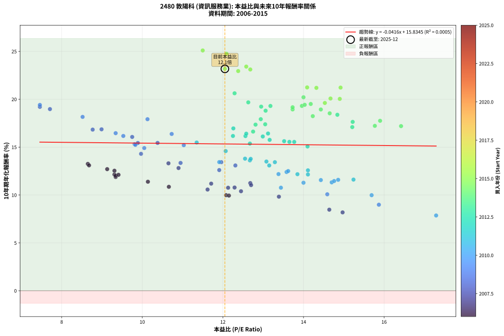
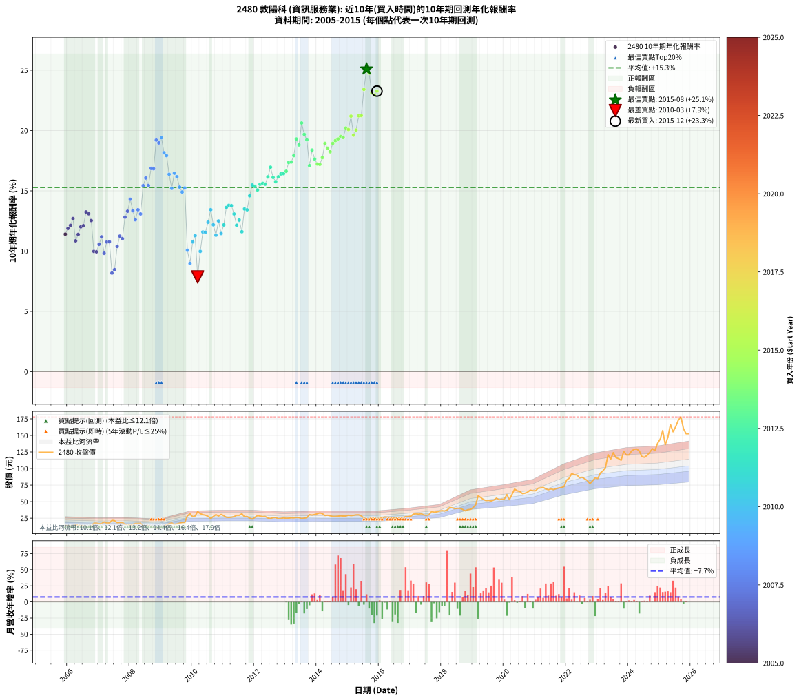

# 2480 敦陽科 - 本益比與未來報酬率分析

!!! info "報告資訊"
    - **股票代號**: 2480
    - **公司名稱**: 敦陽科
    - **產業別**: 資訊服務業
    - **分析期間**: 2006-2015 (120 個數據點)
    - **資料來源**: Type 12 (ShowMonthlyK_ChartFlow) 月收盤價與本益比
    - **報酬率口徑**: 含現金股利 (簡化: 年度合計，假設每年7/1入帳)
    - **報告生成時間**: 2026-01-13 13:31:44 CST

## 📈 視覺化圖表

### 圖表1: 本益比 vs 未來報酬率關係

*圖表1：2480 敦陽科 本益比與10年期未來報酬率關係 (2006-2015)*

### 圖表2: 歷年買入時點的10年期實際報酬率

*圖表2：2480 敦陽科 歷年買入時點的10年期實際報酬率 (2006-2015)*

## 📍 買點訊號說明

本報告提供兩種買點提示訊號（顯示於圖表2的股價子圖中）：

### ▲ 小綠色三角形（回測驗證）
- **計算方式**: 使用全部歷史資料計算本益比第25百分位數
- **用途**: 事後驗證，顯示歷史上哪些時點確實為低估區
- **限制**: 當下無法判斷，僅供回測參考
- **特性**: 後見之明（Look-Ahead Bias）

### ▲ 小橘色三角形（即時訊號）
- **計算方式**: 使用截至當月的過去5年資料計算本益比第25百分位數
- **用途**: 實際投資決策，當時即可判斷
- **優勢**: 可操作性強，符合實務需求
- **特性**: 無後見之明，滾動窗口計算

!!! tip "如何使用兩種訊號"
    - **綠色▲** 幫助理解歷史估值機會，驗證策略有效性
    - **橘色▲** 可作為實際買進參考，但仍需搭配基本面分析
    - 兩種訊號重疊時，表示即時判斷與事後驗證一致，信心度較高
    - 僅有綠色▲時，表示當時無法判斷（需要未來資料才能確認）
    - 僅有橘色▲時，表示即時判斷為買點，但事後可能不是最佳時機

## 📊 估值分析摘要

| 指標 | 數值 |
|:---:|:---:|
| **目前本益比** (2015-12) | **12.05 倍** |
| **歷史平均本益比** | 12.49 倍 |
| **估值水準** | 🟡 合理範圍 |
| **預期10年年化報酬率** | **+15.33%** |
| **歷史平均報酬率** | +15.32% |
| **相關係數 (R²)** | 0.0005 |
| **趨勢線斜率** | -0.0416 |

!!! abstract "核心洞察"
    目前本益比接近歷史平均，預期報酬率符合長期趨勢

    根據歷史數據回測，2480 敦陽科 在目前本益比 **12.1倍** 的估值水準下，
    預期未來10年年化報酬率約為 **+15.3%**。

    **重要提醒**: 本分析基於歷史數據統計，實際報酬率會受到公司基本面變化、產業趨勢、
    總體經濟環境等多重因素影響。R² = 0.00 表示本益比可解釋約 0.1% 的報酬率變異。

## 📈 歷史估值統計

### 最佳買點 (最高報酬率)

| 項目 | 數值 |
|:---:|:---:|
| 起始時間 | 2015-08 |
| 當時本益比 | 11.50 倍 |
| 起始價格 | 23.2 元 |
| 10年後價格 | 173.0 元 |
| **10年年化報酬率** | **+25.10%** |

### 最差買點 (最低報酬率)

| 項目 | 數值 |
|:---:|:---:|
| 起始時間 | 2010-03 |
| 當時本益比 | 17.29 倍 |
| 起始價格 | 35.0 元 |
| 10年後價格 | 53.0 元 |
| **10年年化報酬率** | **+7.86%** |

## 🎯 投資啟示

### 本益比與報酬率關係

趨勢線方程式: **y = -0.0416x + 15.8345**

!!! note "負相關"
    本益比與未來報酬率呈現負相關。較低的本益比通常帶來較高的未來報酬率，
    但相關性不算非常強。**估值仍是重要參考指標之一**。

### 估值區間建議

基於歷史數據分析:

- **🟢 低估區** (P/E < 10.0): 預期報酬率較高，可考慮增加持股
- **🟡 合理區** (P/E 10.0-15.0): 預期報酬率符合長期趨勢，正常持有
- **🔴 高估區** (P/E > 15.0): 預期報酬率較低，可考慮減碼或觀望

!!! danger "風險提示"
    - 過去表現不代表未來結果
    - 本分析假設公司基本面無重大結構性變化
    - 產業環境劇變可能使歷史規律失效
    - 應結合公司財報、產業趨勢、總體經濟等多重因素綜合判斷

!!! success "長期投資觀點"
    歷史數據顯示，在合理或低估的估值水準買入並長期持有，
    往往能獲得較佳的投資報酬。**耐心等待好價格**是價值投資的核心原則。

## 📊 數據品質

- **資料來源**: GoodInfo.tw Type 12 (ShowMonthlyK_ChartFlow)
- **資料頻率**: 月度收盤價與本益比
- **回測期間**: 2006-2015
- **數據點數量**: 120 個 (每個點代表一次10年期回測)

### 計算方法說明

1. **10年期年化報酬率**:
   - 對每個歷史時點，計算其後10年的實際投資報酬率
   - 期末價值(不含股利): 期末價格
   - 期末價值(含現金股利): 期末價格 + 持有期間內的現金股利合計 (簡化: 年度合計，假設每年7/1入帳)
   - 公式: 年化報酬率 = [(期末價值/期初價格)^(1/年數) - 1] × 100%

2. **本益比 (P/E Ratio)**:
   - 使用當時的月收盤價與EPS計算
   - 資料來源: Type 12 月度河流圖本益比數據

3. **趨勢線 (Linear Regression)**:
   - 使用最小平方法擬合線性趨勢線
   - R²值衡量本益比對報酬率的解釋能力

---

*本報告由 Stock Analysis System v1.9.0 自動生成*
*數據更新時間: 2026-01-13 13:31:44 CST*

## 📋 月度回測明細表

（每一列對應時間線圖中的一個買入點；可用來對照 SVG 圖上的每個點。）

| 買入月份 | 賣出月份 | 回測期限_年 | 實際持有年數 | 買入本益比_倍 | 買入收盤價_元 | 賣出收盤價_元 | 現金股利合計_元 | 總報酬率_pct | 年化報酬率_pct |
| --- | --- | --- | --- | --- | --- | --- | --- | --- | --- |
| 2006-01 | 2016-01 | 10 | 9.999 | 9.34 | 13.45 | 24.60 | 16.73 | +207.29 | +11.88 |
| 2006-02 | 2016-02 | 10 | 9.999 | 9.31 | 13.40 | 25.40 | 16.73 | +214.40 | +12.14 |
| 2006-03 | 2016-03 | 10 | 10.001 | 9.13 | 13.15 | 26.75 | 16.73 | +230.65 | +12.70 |
| 2006-04 | 2016-04 | 10 | 10.001 | 10.66 | 15.35 | 26.30 | 16.73 | +180.33 | +10.86 |
| 2006-05 | 2016-05 | 10 | 10.001 | 10.14 | 14.60 | 26.20 | 16.73 | +194.04 | +11.39 |
| 2006-06 | 2016-06 | 10 | 10.001 | 9.34 | 13.45 | 25.10 | 16.73 | +211.00 | +12.01 |
| 2006-07 | 2016-07 | 10 | 10.001 | 9.41 | 13.55 | 24.85 | 17.66 | +213.73 | +12.11 |
| 2006-08 | 2016-08 | 10 | 10.001 | 8.65 | 12.45 | 25.55 | 17.66 | +247.07 | +13.25 |
| 2006-09 | 2016-09 | 10 | 10.001 | 8.68 | 12.50 | 25.15 | 17.66 | +242.48 | +13.10 |
| 2006-10 | 2016-10 | 10 | 10.001 | 9.31 | 13.40 | 26.00 | 17.66 | +225.82 | +12.54 |
| 2006-11 | 2016-11 | 10 | 10.001 | 12.08 | 17.40 | 27.40 | 17.66 | +158.97 | +9.98 |
| 2006-12 | 2016-12 | 10 | 10.001 | 12.15 | 17.50 | 27.50 | 17.66 | +158.06 | +9.94 |
| 2007-01 | 2017-01 | 10 | 10.001 | 11.62 | 16.75 | 28.10 | 17.66 | +173.19 | +10.57 |
| 2007-02 | 2017-02 | 10 | 10.001 | 11.71 | 16.90 | 31.15 | 17.66 | +188.82 | +11.19 |
| 2007-03 | 2017-03 | 10 | 10.001 | 13.39 | 19.35 | 31.75 | 17.66 | +155.35 | +9.83 |
| 2007-04 | 2017-04 | 10 | 10.001 | 12.13 | 17.55 | 31.10 | 17.66 | +177.83 | +10.76 |
| 2007-05 | 2017-05 | 10 | 10.001 | 12.29 | 17.80 | 31.90 | 17.66 | +178.43 | +10.78 |
| 2007-06 | 2017-06 | 10 | 10.001 | 14.97 | 21.70 | 30.00 | 17.66 | +119.63 | +8.18 |
| 2007-07 | 2017-07 | 10 | 10.001 | 14.64 | 21.25 | 29.35 | 18.56 | +125.46 | +8.47 |
| 2007-08 | 2017-08 | 10 | 10.001 | 12.45 | 18.10 | 30.10 | 18.56 | +168.84 | +10.39 |
| 2007-09 | 2017-09 | 10 | 10.001 | 12.68 | 18.45 | 35.00 | 18.56 | +190.30 | +11.24 |
| 2007-10 | 2017-10 | 10 | 10.001 | 12.70 | 18.50 | 34.15 | 18.56 | +184.92 | +11.04 |
| 2007-11 | 2017-11 | 10 | 10.001 | 10.90 | 15.90 | 34.55 | 18.56 | +234.03 | +12.82 |
| 2007-12 | 2017-12 | 10 | 10.001 | 10.65 | 15.55 | 35.70 | 18.56 | +248.94 | +13.31 |
| 2008-01 | 2018-01 | 10 | 10.001 | 9.97 | 14.45 | 36.45 | 18.56 | +280.69 | +14.30 |
| 2008-02 | 2018-03 | 10 | 10.081 | 10.95 | 15.75 | 37.15 | 18.56 | +253.71 | +13.35 |
| 2008-03 | 2018-03 | 10 | 9.999 | 11.91 | 17.00 | 37.15 | 18.56 | +227.71 | +12.60 |
| 2008-04 | 2018-04 | 10 | 9.999 | 11.96 | 16.95 | 41.20 | 18.56 | +252.57 | +13.43 |
| 2008-05 | 2018-05 | 10 | 9.999 | 12.31 | 17.30 | 40.60 | 18.56 | +241.97 | +13.09 |
| 2008-06 | 2018-06 | 10 | 9.999 | 9.89 | 13.80 | 39.40 | 18.56 | +320.00 | +15.43 |
| 2008-07 | 2018-07 | 10 | 9.999 | 9.75 | 13.50 | 39.90 | 19.98 | +343.56 | +16.07 |
| 2008-08 | 2018-08 | 10 | 9.999 | 10.38 | 14.25 | 39.90 | 19.98 | +320.21 | +15.44 |
| 2008-09 | 2018-09 | 10 | 9.999 | 8.99 | 12.25 | 38.20 | 19.98 | +374.94 | +16.86 |
| 2008-10 | 2018-10 | 10 | 9.999 | 8.77 | 11.85 | 36.15 | 19.98 | +373.67 | +16.83 |
| 2008-11 | 2018-11 | 10 | 9.999 | 7.46 | 10.00 | 37.95 | 19.98 | +479.30 | +19.21 |
| 2008-12 | 2018-12 | 10 | 9.999 | 7.71 | 10.25 | 38.25 | 19.98 | +468.10 | +18.97 |
| 2009-01 | 2019-01 | 10 | 9.999 | 7.46 | 10.35 | 41.00 | 19.98 | +489.18 | +19.41 |
| 2009-02 | 2019-02 | 10 | 9.999 | 8.52 | 12.30 | 45.25 | 19.98 | +430.33 | +18.16 |
| 2009-03 | 2019-03 | 10 | 9.999 | 10.13 | 15.20 | 59.00 | 19.98 | +419.61 | +17.92 |
| 2009-04 | 2019-04 | 10 | 9.999 | 10.73 | 16.70 | 56.10 | 19.98 | +355.57 | +16.38 |
| 2009-05 | 2019-05 | 10 | 9.999 | 11.03 | 17.80 | 53.30 | 19.98 | +311.69 | +15.20 |
| 2009-06 | 2019-06 | 10 | 9.999 | 9.34 | 15.60 | 51.60 | 19.98 | +358.85 | +16.46 |
| 2009-07 | 2019-07 | 10 | 9.999 | 9.53 | 16.45 | 51.90 | 21.71 | +347.48 | +16.17 |
| 2009-08 | 2019-08 | 10 | 9.999 | 9.81 | 17.50 | 51.00 | 21.71 | +315.49 | +15.31 |
| 2009-09 | 2019-09 | 10 | 9.999 | 10.05 | 18.50 | 52.50 | 21.71 | +301.14 | +14.90 |
| 2009-10 | 2019-10 | 10 | 9.999 | 9.83 | 18.65 | 55.30 | 21.71 | +312.92 | +15.24 |
| 2009-11 | 2019-11 | 10 | 9.999 | 14.59 | 28.50 | 52.70 | 21.71 | +161.09 | +10.07 |
| 2009-12 | 2019-12 | 10 | 9.999 | 15.87 | 31.90 | 53.70 | 21.71 | +136.39 | +8.99 |
| 2010-01 | 2020-01 | 10 | 9.999 | 13.44 | 27.10 | 53.60 | 21.71 | +177.90 | +10.76 |
| 2010-02 | 2020-02 | 10 | 9.999 | 14.00 | 28.30 | 60.70 | 21.71 | +191.20 | +11.28 |
| 2010-03 | 2020-03 | 10 | 10.001 | 17.29 | 35.05 | 53.00 | 21.71 | +113.15 | +7.86 |
| 2010-04 | 2020-04 | 10 | 10.001 | 15.69 | 31.90 | 60.90 | 21.71 | +158.97 | +9.98 |
| 2010-05 | 2020-05 | 10 | 10.001 | 14.86 | 30.30 | 69.00 | 21.71 | +199.37 | +11.59 |
| 2010-06 | 2020-06 | 10 | 10.001 | 14.43 | 29.50 | 66.40 | 21.71 | +198.68 | +11.56 |
| 2010-07 | 2020-07 | 10 | 10.001 | 13.58 | 27.85 | 65.30 | 24.36 | +221.94 | +12.40 |
| 2010-08 | 2020-08 | 10 | 10.001 | 11.91 | 24.50 | 62.10 | 24.36 | +252.90 | +13.44 |
| 2010-09 | 2020-09 | 10 | 10.001 | 13.38 | 27.60 | 62.80 | 24.36 | +215.80 | +12.18 |
| 2010-10 | 2020-10 | 10 | 10.001 | 14.70 | 30.40 | 64.50 | 24.36 | +192.30 | +11.32 |
| 2010-11 | 2020-11 | 10 | 10.001 | 13.62 | 28.25 | 67.40 | 24.36 | +224.81 | +12.50 |
| 2010-12 | 2020-12 | 10 | 10.001 | 14.76 | 30.70 | 66.50 | 24.36 | +195.96 | +11.46 |
| 2011-01 | 2021-01 | 10 | 10.001 | 13.85 | 28.80 | 66.50 | 24.36 | +215.49 | +12.17 |
| 2011-02 | 2021-02 | 10 | 10.001 | 12.67 | 26.35 | 70.10 | 24.36 | +258.48 | +13.62 |
| 2011-03 | 2021-03 | 10 | 10.001 | 12.55 | 26.10 | 70.70 | 24.36 | +264.21 | +13.80 |
| 2011-04 | 2021-04 | 10 | 10.001 | 12.69 | 26.40 | 71.60 | 24.36 | +263.48 | +13.77 |
| 2011-05 | 2021-05 | 10 | 10.001 | 13.15 | 27.35 | 69.20 | 24.36 | +242.08 | +13.09 |
| 2011-06 | 2021-06 | 10 | 10.001 | 14.11 | 29.35 | 68.00 | 24.36 | +214.68 | +12.15 |
| 2011-07 | 2021-07 | 10 | 10.001 | 14.11 | 29.35 | 69.20 | 26.79 | +227.05 | +12.58 |
| 2011-08 | 2021-08 | 10 | 10.001 | 15.24 | 31.70 | 68.30 | 26.79 | +199.97 | +11.61 |
| 2011-09 | 2021-09 | 10 | 10.001 | 13.08 | 27.20 | 69.70 | 26.79 | +254.74 | +13.50 |
| 2011-10 | 2021-10 | 10 | 10.001 | 13.29 | 27.65 | 70.70 | 26.79 | +252.59 | +13.43 |
| 2011-11 | 2021-11 | 10 | 10.001 | 12.07 | 25.10 | 71.20 | 26.79 | +290.40 | +14.59 |
| 2011-12 | 2021-12 | 10 | 10.001 | 11.35 | 23.60 | 72.80 | 26.79 | +321.99 | +15.48 |
| 2012-01 | 2022-01 | 10 | 10.001 | 12.67 | 26.20 | 82.70 | 26.79 | +317.90 | +15.37 |
| 2012-02 | 2022-03 | 10 | 10.081 | 14.10 | 29.00 | 92.60 | 26.79 | +311.69 | +15.07 |
| 2012-03 | 2022-03 | 10 | 9.999 | 13.77 | 28.15 | 92.60 | 26.79 | +324.12 | +15.55 |
| 2012-04 | 2022-04 | 10 | 9.999 | 13.52 | 27.50 | 90.60 | 26.79 | +326.87 | +15.62 |
| 2012-05 | 2022-05 | 10 | 9.999 | 13.65 | 27.60 | 90.30 | 26.79 | +324.24 | +15.55 |
| 2012-06 | 2022-06 | 10 | 9.999 | 12.56 | 25.25 | 86.10 | 26.79 | +347.09 | +16.16 |
| 2012-07 | 2022-07 | 10 | 9.999 | 12.26 | 24.50 | 86.80 | 30.51 | +378.82 | +16.96 |
| 2012-08 | 2022-08 | 10 | 9.999 | 12.99 | 25.80 | 84.40 | 30.51 | +345.39 | +16.11 |
| 2012-09 | 2022-09 | 10 | 9.999 | 13.16 | 26.00 | 81.80 | 30.51 | +331.96 | +15.76 |
| 2012-10 | 2022-10 | 10 | 9.999 | 12.25 | 24.05 | 77.10 | 30.51 | +347.44 | +16.17 |
| 2012-11 | 2022-11 | 10 | 9.999 | 12.58 | 24.55 | 81.60 | 30.51 | +356.66 | +16.40 |
| 2012-12 | 2022-12 | 10 | 9.999 | 13.12 | 25.45 | 85.90 | 30.51 | +357.41 | +16.42 |
| 2013-01 | 2023-01 | 10 | 9.999 | 12.75 | 24.80 | 84.90 | 30.51 | +365.36 | +16.62 |
| 2013-02 | 2023-02 | 10 | 9.999 | 12.81 | 25.00 | 93.30 | 30.51 | +395.24 | +17.35 |
| 2013-03 | 2023-03 | 10 | 9.999 | 13.05 | 25.55 | 96.40 | 30.51 | +396.71 | +17.39 |
| 2013-04 | 2023-04 | 10 | 9.999 | 12.94 | 25.40 | 101.50 | 30.51 | +419.72 | +17.92 |
| 2013-05 | 2023-05 | 10 | 9.999 | 13.18 | 25.95 | 121.00 | 30.51 | +483.85 | +19.30 |
| 2013-06 | 2023-06 | 10 | 9.999 | 13.06 | 25.80 | 114.00 | 30.51 | +460.12 | +18.81 |
| 2013-07 | 2023-07 | 10 | 9.999 | 12.29 | 24.35 | 124.00 | 34.77 | +552.03 | +20.63 |
| 2013-08 | 2023-08 | 10 | 9.999 | 12.63 | 25.10 | 116.50 | 34.77 | +502.67 | +19.68 |
| 2013-09 | 2023-09 | 10 | 9.999 | 12.95 | 25.80 | 115.00 | 34.77 | +480.50 | +19.23 |
| 2013-10 | 2023-10 | 10 | 9.999 | 15.21 | 30.40 | 112.50 | 34.77 | +384.44 | +17.09 |
| 2013-11 | 2023-11 | 10 | 9.999 | 14.84 | 29.75 | 126.00 | 34.77 | +440.40 | +18.38 |
| 2013-12 | 2023-12 | 10 | 9.999 | 15.22 | 30.60 | 120.50 | 34.77 | +407.42 | +17.64 |
| 2014-01 | 2024-01 | 10 | 9.999 | 15.77 | 31.70 | 120.50 | 34.77 | +389.81 | +17.22 |
| 2014-02 | 2024-02 | 10 | 9.999 | 16.42 | 33.00 | 126.50 | 34.77 | +388.70 | +17.20 |
| 2014-03 | 2024-03 | 10 | 10.001 | 15.90 | 31.95 | 129.00 | 34.77 | +412.58 | +17.75 |
| 2014-04 | 2024-04 | 10 | 10.001 | 14.43 | 29.00 | 129.50 | 34.77 | +466.45 | +18.93 |
| 2014-05 | 2024-05 | 10 | 10.001 | 14.65 | 29.45 | 126.50 | 34.77 | +447.61 | +18.53 |
| 2014-06 | 2024-06 | 10 | 10.001 | 14.23 | 28.60 | 118.00 | 34.77 | +434.16 | +18.24 |
| 2014-07 | 2024-07 | 10 | 10.001 | 13.73 | 27.60 | 117.00 | 39.41 | +466.70 | +18.94 |
| 2014-08 | 2024-08 | 10 | 10.001 | 13.73 | 27.60 | 120.00 | 39.41 | +477.57 | +19.17 |
| 2014-09 | 2024-09 | 10 | 10.001 | 13.96 | 28.05 | 124.50 | 39.41 | +484.35 | +19.30 |
| 2014-10 | 2024-10 | 10 | 10.001 | 14.18 | 28.50 | 130.00 | 39.41 | +494.42 | +19.51 |
| 2014-11 | 2024-11 | 10 | 10.001 | 14.03 | 28.20 | 127.00 | 39.41 | +490.11 | +19.42 |
| 2014-12 | 2024-12 | 10 | 10.001 | 14.00 | 28.15 | 138.00 | 39.41 | +530.23 | +20.21 |
| 2015-01 | 2025-01 | 10 | 10.001 | 14.67 | 29.50 | 144.50 | 39.41 | +523.42 | +20.08 |
| 2015-02 | 2025-02 | 10 | 10.001 | 14.32 | 28.80 | 157.50 | 39.41 | +583.72 | +21.19 |
| 2015-03 | 2025-03 | 10 | 10.001 | 14.53 | 29.25 | 136.00 | 39.41 | +499.69 | +19.61 |
| 2015-04 | 2025-04 | 10 | 10.001 | 14.90 | 30.00 | 147.00 | 39.41 | +521.37 | +20.04 |
| 2015-05 | 2025-05 | 10 | 10.001 | 14.92 | 30.05 | 166.50 | 39.41 | +585.22 | +21.22 |
| 2015-06 | 2025-06 | 10 | 10.001 | 14.09 | 28.40 | 155.50 | 39.41 | +586.30 | +21.24 |
| 2015-07 | 2025-07 | 10 | 10.001 | 12.58 | 25.35 | 163.00 | 44.83 | +719.85 | +23.41 |
| 2015-08 | 2025-08 | 10 | 10.001 | 11.50 | 23.20 | 173.00 | 44.83 | +838.93 | +25.10 |
| 2015-09 | 2025-09 | 10 | 10.001 | 12.09 | 24.40 | 178.00 | 44.83 | +813.25 | +24.75 |
| 2015-10 | 2025-10 | 10 | 10.001 | 12.68 | 25.60 | 160.00 | 44.83 | +700.12 | +23.11 |
| 2015-11 | 2025-11 | 10 | 10.001 | 12.38 | 25.00 | 152.50 | 44.83 | +689.33 | +22.95 |
| 2015-12 | 2025-12 | 10 | 10.001 | 12.05 | 24.35 | 151.00 | 44.83 | +704.24 | +23.18 |
