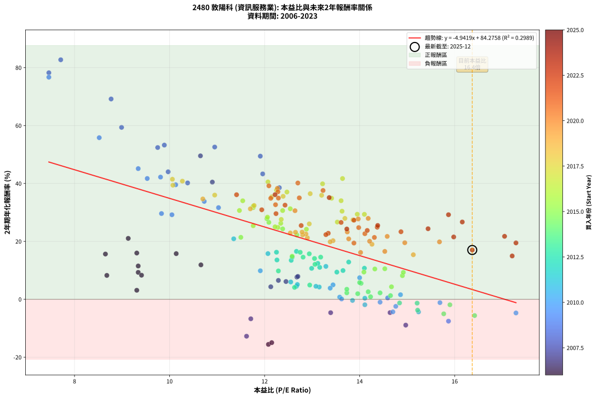
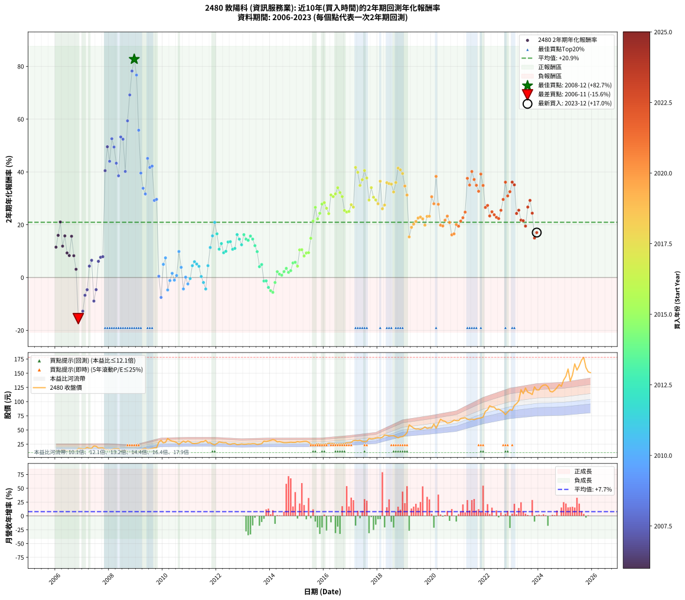

# 2480 敦陽科 - 本益比與未來報酬率分析

!!! info "報告資訊"
    - **股票代號**: 2480
    - **公司名稱**: 敦陽科
    - **產業別**: 資訊服務業
    - **分析期間**: 2006-2023 (216 個數據點)
    - **資料來源**: Type 12 (ShowMonthlyK_ChartFlow) 月收盤價與本益比
    - **報酬率口徑**: 含現金股利 (簡化: 年度合計，假設每年7/1入帳)
    - **報告生成時間**: 2026-01-11 18:41:59 CST

## 📈 視覺化圖表

### 圖表1: 本益比 vs 未來報酬率關係

*圖表1：2480 敦陽科 本益比與2年期未來報酬率關係 (2006-2023)*

### 圖表2: 歷年買入時點的2年期實際報酬率

*圖表2：2480 敦陽科 歷年買入時點的2年期實際報酬率 (2006-2023)*

## 📍 買點訊號說明

本報告提供兩種買點提示訊號（顯示於圖表2的股價子圖中）：

### ▲ 小綠色三角形（回測驗證）
- **計算方式**: 使用全部歷史資料計算本益比第25百分位數
- **用途**: 事後驗證，顯示歷史上哪些時點確實為低估區
- **限制**: 當下無法判斷，僅供回測參考
- **特性**: 後見之明（Look-Ahead Bias）

### ▲ 小橘色三角形（即時訊號）
- **計算方式**: 使用截至當月的過去5年資料計算本益比第25百分位數
- **用途**: 實際投資決策，當時即可判斷
- **優勢**: 可操作性強，符合實務需求
- **特性**: 無後見之明，滾動窗口計算

!!! tip "如何使用兩種訊號"
    - **綠色▲** 幫助理解歷史估值機會，驗證策略有效性
    - **橘色▲** 可作為實際買進參考，但仍需搭配基本面分析
    - 兩種訊號重疊時，表示即時判斷與事後驗證一致，信心度較高
    - 僅有綠色▲時，表示當時無法判斷（需要未來資料才能確認）
    - 僅有橘色▲時，表示即時判斷為買點，但事後可能不是最佳時機

## 📊 估值分析摘要

| 指標 | 數值 |
|:---:|:---:|
| **目前本益比** (2023-12) | **16.37 倍** |
| **歷史平均本益比** | 12.82 倍 |
| **估值水準** | 🔴 相對高估 |
| **預期2年年化報酬率** | **+3.38%** |
| **歷史平均報酬率** | +20.92% |
| **相關係數 (R²)** | 0.2989 |
| **趨勢線斜率** | -4.9419 |

!!! abstract "核心洞察"
    目前本益比顯著高於歷史平均，預期未來報酬率可能較低

    根據歷史數據回測，2480 敦陽科 在目前本益比 **16.4倍** 的估值水準下，
    預期未來2年年化報酬率約為 **+3.4%**。

    **重要提醒**: 本分析基於歷史數據統計，實際報酬率會受到公司基本面變化、產業趨勢、
    總體經濟環境等多重因素影響。R² = 0.30 表示本益比可解釋約 29.9% 的報酬率變異。

## 📈 歷史估值統計

### 最佳買點 (最高報酬率)

| 項目 | 數值 |
|:---:|:---:|
| 起始時間 | 2008-12 |
| 當時本益比 | 7.71 倍 |
| 起始價格 | 10.2 元 |
| 2年後價格 | 30.7 元 |
| **2年年化報酬率** | **+82.71%** |

### 最差買點 (最低報酬率)

| 項目 | 數值 |
|:---:|:---:|
| 起始時間 | 2006-11 |
| 當時本益比 | 12.08 倍 |
| 起始價格 | 17.4 元 |
| 2年後價格 | 10.0 元 |
| **2年年化報酬率** | **-15.57%** |

## 🎯 投資啟示

### 本益比與報酬率關係

趨勢線方程式: **y = -4.9419x + 84.2758**

!!! warning "強負相關"
    本益比與未來報酬率呈現強負相關。在高本益比時期買入，未來報酬率顯著較低；
    在低本益比時期買入，未來報酬率顯著較高。**估值紀律至關重要**。

### 估值區間建議

基於歷史數據分析:

- **🟢 低估區** (P/E < 10.3): 預期報酬率較高，可考慮增加持股
- **🟡 合理區** (P/E 10.3-15.4): 預期報酬率符合長期趨勢，正常持有
- **🔴 高估區** (P/E > 15.4): 預期報酬率較低，可考慮減碼或觀望

!!! danger "風險提示"
    - 過去表現不代表未來結果
    - 本分析假設公司基本面無重大結構性變化
    - 產業環境劇變可能使歷史規律失效
    - 應結合公司財報、產業趨勢、總體經濟等多重因素綜合判斷

!!! success "長期投資觀點"
    歷史數據顯示，在合理或低估的估值水準買入並長期持有，
    往往能獲得較佳的投資報酬。**耐心等待好價格**是價值投資的核心原則。

## 📊 數據品質

- **資料來源**: GoodInfo.tw Type 12 (ShowMonthlyK_ChartFlow)
- **資料頻率**: 月度收盤價與本益比
- **回測期間**: 2006-2023
- **數據點數量**: 216 個 (每個點代表一次2年期回測)

### 計算方法說明

1. **2年期年化報酬率**:
   - 對每個歷史時點，計算其後2年的實際投資報酬率
   - 期末價值(不含股利): 期末價格
   - 期末價值(含現金股利): 期末價格 + 持有期間內的現金股利合計 (簡化: 年度合計，假設每年7/1入帳)
   - 公式: 年化報酬率 = [(期末價值/期初價格)^(1/年數) - 1] × 100%

2. **本益比 (P/E Ratio)**:
   - 使用當時的月收盤價與EPS計算
   - 資料來源: Type 12 月度河流圖本益比數據

3. **趨勢線 (Linear Regression)**:
   - 使用最小平方法擬合線性趨勢線
   - R²值衡量本益比對報酬率的解釋能力

---

*本報告由 Stock Analysis System v1.9.0 自動生成*
*數據更新時間: 2026-01-11 18:41:59 CST*

## 📋 月度回測明細表

（每一列對應時間線圖中的一個買入點；可用來對照 SVG 圖上的每個點。）

| 買入月份 | 賣出月份 | 回測期限_年 | 實際持有年數 | 買入本益比_倍 | 買入收盤價_元 | 賣出收盤價_元 | 現金股利合計_元 | 總報酬率_pct | 年化報酬率_pct |
| --- | --- | --- | --- | --- | --- | --- | --- | --- | --- |
| 2006-01 | 2008-01 | 2 | 1.999 | 9.34 | 13.45 | 14.45 | 2.27 | +24.31 | +11.50 |
| 2006-02 | 2008-02 | 2 | 1.999 | 9.31 | 13.40 | 15.75 | 2.27 | +34.48 | +15.98 |
| 2006-03 | 2008-03 | 2 | 2.001 | 9.13 | 13.15 | 17.00 | 2.27 | +46.54 | +21.04 |
| 2006-04 | 2008-04 | 2 | 2.001 | 10.66 | 15.35 | 16.95 | 2.27 | +25.21 | +11.89 |
| 2006-05 | 2008-05 | 2 | 2.001 | 10.14 | 14.60 | 17.30 | 2.27 | +34.04 | +15.76 |
| 2006-06 | 2008-06 | 2 | 2.001 | 9.34 | 13.45 | 13.80 | 2.27 | +19.48 | +9.30 |
| 2006-07 | 2008-07 | 2 | 2.001 | 9.41 | 13.55 | 13.50 | 2.40 | +17.34 | +8.32 |
| 2006-08 | 2008-08 | 2 | 2.001 | 8.65 | 12.45 | 14.25 | 2.40 | +33.73 | +15.63 |
| 2006-09 | 2008-09 | 2 | 2.001 | 8.68 | 12.50 | 12.25 | 2.40 | +17.20 | +8.25 |
| 2006-10 | 2008-10 | 2 | 2.001 | 9.31 | 13.40 | 11.85 | 2.40 | +6.34 | +3.12 |
| 2006-11 | 2008-11 | 2 | 2.001 | 12.08 | 17.40 | 10.00 | 2.40 | -28.74 | -15.57 |
| 2006-12 | 2008-12 | 2 | 2.001 | 12.15 | 17.50 | 10.25 | 2.40 | -27.71 | -14.97 |
| 2007-01 | 2009-01 | 2 | 2.001 | 11.62 | 16.75 | 10.35 | 2.40 | -23.88 | -12.75 |
| 2007-02 | 2009-02 | 2 | 2.001 | 11.71 | 16.90 | 12.30 | 2.40 | -13.02 | -6.73 |
| 2007-03 | 2009-03 | 2 | 2.001 | 13.39 | 19.35 | 15.20 | 2.40 | -9.04 | -4.63 |
| 2007-04 | 2009-04 | 2 | 2.001 | 12.13 | 17.55 | 16.70 | 2.40 | +8.83 | +4.32 |
| 2007-05 | 2009-05 | 2 | 2.001 | 12.29 | 17.80 | 17.80 | 2.40 | +13.48 | +6.52 |
| 2007-06 | 2009-06 | 2 | 2.001 | 14.97 | 21.70 | 15.60 | 2.40 | -17.05 | -8.92 |
| 2007-07 | 2009-07 | 2 | 2.001 | 14.64 | 21.25 | 16.45 | 2.89 | -8.99 | -4.60 |
| 2007-08 | 2009-08 | 2 | 2.001 | 12.45 | 18.10 | 17.50 | 2.89 | +12.65 | +6.13 |
| 2007-09 | 2009-09 | 2 | 2.001 | 12.68 | 18.45 | 18.50 | 2.89 | +15.93 | +7.67 |
| 2007-10 | 2009-10 | 2 | 2.001 | 12.70 | 18.50 | 18.65 | 2.89 | +16.43 | +7.90 |
| 2007-11 | 2009-11 | 2 | 2.001 | 10.90 | 15.90 | 28.50 | 2.89 | +97.42 | +40.47 |
| 2007-12 | 2009-12 | 2 | 2.001 | 10.65 | 15.55 | 31.90 | 2.89 | +123.73 | +49.53 |
| 2008-01 | 2010-01 | 2 | 2.001 | 9.97 | 14.45 | 27.10 | 2.89 | +107.54 | +44.03 |
| 2008-02 | 2010-03 | 2 | 2.081 | 10.95 | 15.75 | 35.05 | 2.89 | +140.89 | +52.58 |
| 2008-03 | 2010-03 | 2 | 1.999 | 11.91 | 17.00 | 35.05 | 2.89 | +123.18 | +49.43 |
| 2008-04 | 2010-04 | 2 | 1.999 | 11.96 | 16.95 | 31.90 | 2.89 | +105.25 | +43.30 |
| 2008-05 | 2010-05 | 2 | 1.999 | 12.31 | 17.30 | 30.30 | 2.89 | +91.85 | +38.54 |
| 2008-06 | 2010-06 | 2 | 1.999 | 9.89 | 13.80 | 29.50 | 2.89 | +134.71 | +53.25 |
| 2008-07 | 2010-07 | 2 | 1.999 | 9.75 | 13.50 | 27.85 | 3.49 | +132.15 | +52.41 |
| 2008-08 | 2010-08 | 2 | 1.999 | 10.38 | 14.25 | 24.50 | 3.49 | +96.42 | +40.18 |
| 2008-09 | 2010-09 | 2 | 1.999 | 8.99 | 12.25 | 27.60 | 3.49 | +153.80 | +59.36 |
| 2008-10 | 2010-10 | 2 | 1.999 | 8.77 | 11.85 | 30.40 | 3.49 | +185.99 | +69.17 |
| 2008-11 | 2010-11 | 2 | 1.999 | 7.46 | 10.00 | 28.25 | 3.49 | +217.40 | +78.23 |
| 2008-12 | 2010-12 | 2 | 1.999 | 7.71 | 10.25 | 30.70 | 3.49 | +233.56 | +82.71 |
| 2009-01 | 2011-01 | 2 | 1.999 | 7.46 | 10.35 | 28.80 | 3.49 | +211.98 | +76.70 |
| 2009-02 | 2011-02 | 2 | 1.999 | 8.52 | 12.30 | 26.35 | 3.49 | +142.60 | +55.80 |
| 2009-03 | 2011-03 | 2 | 1.999 | 10.13 | 15.20 | 26.10 | 3.49 | +94.67 | +39.56 |
| 2009-04 | 2011-04 | 2 | 1.999 | 10.73 | 16.70 | 26.40 | 3.49 | +78.98 | +33.81 |
| 2009-05 | 2011-05 | 2 | 1.999 | 11.03 | 17.80 | 27.35 | 3.49 | +73.26 | +31.65 |
| 2009-06 | 2011-06 | 2 | 1.999 | 9.34 | 15.60 | 29.35 | 3.49 | +110.51 | +45.13 |
| 2009-07 | 2011-07 | 2 | 1.999 | 9.53 | 16.45 | 29.35 | 3.67 | +100.73 | +41.71 |
| 2009-08 | 2011-08 | 2 | 1.999 | 9.81 | 17.50 | 31.70 | 3.67 | +102.11 | +42.20 |
| 2009-09 | 2011-09 | 2 | 1.999 | 10.05 | 18.50 | 27.20 | 3.67 | +66.86 | +29.20 |
| 2009-10 | 2011-10 | 2 | 1.999 | 9.83 | 18.65 | 27.65 | 3.67 | +67.94 | +29.61 |
| 2009-11 | 2011-11 | 2 | 1.999 | 14.59 | 28.50 | 25.10 | 3.67 | +0.95 | +0.47 |
| 2009-12 | 2011-12 | 2 | 1.999 | 15.87 | 31.90 | 23.60 | 3.67 | -14.51 | -7.55 |
| 2010-01 | 2012-01 | 2 | 1.999 | 13.44 | 27.10 | 26.20 | 3.67 | +10.22 | +4.99 |
| 2010-02 | 2012-02 | 2 | 1.999 | 14.00 | 28.30 | 29.00 | 3.67 | +15.44 | +7.45 |
| 2010-03 | 2012-03 | 2 | 2.001 | 17.29 | 35.05 | 28.15 | 3.67 | -9.22 | -4.72 |
| 2010-04 | 2012-04 | 2 | 2.001 | 15.69 | 31.90 | 27.50 | 3.67 | -2.29 | -1.15 |
| 2010-05 | 2012-05 | 2 | 2.001 | 14.86 | 30.30 | 27.60 | 3.67 | +3.20 | +1.59 |
| 2010-06 | 2012-06 | 2 | 2.001 | 14.43 | 29.50 | 25.25 | 3.67 | -1.97 | -0.99 |
| 2010-07 | 2012-07 | 2 | 2.001 | 13.58 | 27.85 | 24.50 | 3.77 | +1.51 | +0.75 |
| 2010-08 | 2012-08 | 2 | 2.001 | 11.91 | 24.50 | 25.80 | 3.77 | +20.69 | +9.85 |
| 2010-09 | 2012-09 | 2 | 2.001 | 13.38 | 27.60 | 26.00 | 3.77 | +7.86 | +3.85 |
| 2010-10 | 2012-10 | 2 | 2.001 | 14.70 | 30.40 | 24.05 | 3.77 | -8.49 | -4.33 |
| 2010-11 | 2012-11 | 2 | 2.001 | 13.62 | 28.25 | 24.55 | 3.77 | +0.25 | +0.12 |
| 2010-12 | 2012-12 | 2 | 2.001 | 14.76 | 30.70 | 25.45 | 3.77 | -4.82 | -2.44 |
| 2011-01 | 2013-01 | 2 | 2.001 | 13.85 | 28.80 | 24.80 | 3.77 | -0.80 | -0.40 |
| 2011-02 | 2013-02 | 2 | 2.001 | 12.67 | 26.35 | 25.00 | 3.77 | +9.18 | +4.49 |
| 2011-03 | 2013-03 | 2 | 2.001 | 12.55 | 26.10 | 25.55 | 3.77 | +12.34 | +5.99 |
| 2011-04 | 2013-04 | 2 | 2.001 | 12.69 | 26.40 | 25.40 | 3.77 | +10.49 | +5.11 |
| 2011-05 | 2013-05 | 2 | 2.001 | 13.15 | 27.35 | 25.95 | 3.77 | +8.67 | +4.24 |
| 2011-06 | 2013-06 | 2 | 2.001 | 14.11 | 29.35 | 25.80 | 3.77 | +0.75 | +0.37 |
| 2011-07 | 2013-07 | 2 | 2.001 | 14.11 | 29.35 | 24.35 | 3.90 | -3.75 | -1.89 |
| 2011-08 | 2013-08 | 2 | 2.001 | 15.24 | 31.70 | 25.10 | 3.90 | -8.52 | -4.35 |
| 2011-09 | 2013-09 | 2 | 2.001 | 13.08 | 27.20 | 25.80 | 3.90 | +9.19 | +4.49 |
| 2011-10 | 2013-10 | 2 | 2.001 | 13.29 | 27.65 | 30.40 | 3.90 | +24.05 | +11.37 |
| 2011-11 | 2013-11 | 2 | 2.001 | 12.07 | 25.10 | 29.75 | 3.90 | +34.06 | +15.77 |
| 2011-12 | 2013-12 | 2 | 2.001 | 11.35 | 23.60 | 30.60 | 3.90 | +46.19 | +20.89 |
| 2012-01 | 2014-01 | 2 | 2.001 | 12.67 | 26.20 | 31.70 | 3.90 | +35.88 | +16.55 |
| 2012-02 | 2014-03 | 2 | 2.081 | 14.10 | 29.00 | 31.95 | 3.90 | +23.62 | +10.73 |
| 2012-03 | 2014-03 | 2 | 1.999 | 13.77 | 28.15 | 31.95 | 3.90 | +27.35 | +12.86 |
| 2012-04 | 2014-04 | 2 | 1.999 | 13.52 | 27.50 | 29.00 | 3.90 | +19.64 | +9.39 |
| 2012-05 | 2014-05 | 2 | 1.999 | 13.65 | 27.60 | 29.45 | 3.90 | +20.83 | +9.93 |
| 2012-06 | 2014-06 | 2 | 1.999 | 12.56 | 25.25 | 28.60 | 3.90 | +28.71 | +13.46 |
| 2012-07 | 2014-07 | 2 | 1.999 | 12.26 | 24.50 | 27.60 | 4.00 | +28.98 | +13.58 |
| 2012-08 | 2014-08 | 2 | 1.999 | 12.99 | 25.80 | 27.60 | 4.00 | +22.48 | +10.68 |
| 2012-09 | 2014-09 | 2 | 1.999 | 13.16 | 26.00 | 28.05 | 4.00 | +23.27 | +11.03 |
| 2012-10 | 2014-10 | 2 | 1.999 | 12.25 | 24.05 | 28.50 | 4.00 | +35.14 | +16.26 |
| 2012-11 | 2014-11 | 2 | 1.999 | 12.58 | 24.55 | 28.20 | 4.00 | +31.16 | +14.54 |
| 2012-12 | 2014-12 | 2 | 1.999 | 13.12 | 25.45 | 28.15 | 4.00 | +26.33 | +12.40 |
| 2013-01 | 2015-01 | 2 | 1.999 | 12.75 | 24.80 | 29.50 | 4.00 | +35.08 | +16.24 |
| 2013-02 | 2015-02 | 2 | 1.999 | 12.81 | 25.00 | 28.80 | 4.00 | +31.20 | +14.55 |
| 2013-03 | 2015-03 | 2 | 1.999 | 13.05 | 25.55 | 29.25 | 4.00 | +30.14 | +14.09 |
| 2013-04 | 2015-04 | 2 | 1.999 | 12.94 | 25.40 | 30.00 | 4.00 | +33.86 | +15.71 |
| 2013-05 | 2015-05 | 2 | 1.999 | 13.18 | 25.95 | 30.05 | 4.00 | +31.21 | +14.56 |
| 2013-06 | 2015-06 | 2 | 1.999 | 13.06 | 25.80 | 28.40 | 4.00 | +25.58 | +12.07 |
| 2013-07 | 2015-07 | 2 | 1.999 | 12.29 | 24.35 | 25.35 | 4.00 | +20.53 | +9.79 |
| 2013-08 | 2015-08 | 2 | 1.999 | 12.63 | 25.10 | 23.20 | 4.00 | +8.37 | +4.10 |
| 2013-09 | 2015-09 | 2 | 1.999 | 12.95 | 25.80 | 24.40 | 4.00 | +10.08 | +4.92 |
| 2013-10 | 2015-10 | 2 | 1.999 | 15.21 | 30.40 | 25.60 | 4.00 | -2.63 | -1.33 |
| 2013-11 | 2015-11 | 2 | 1.999 | 14.84 | 29.75 | 25.00 | 4.00 | -2.52 | -1.27 |
| 2013-12 | 2015-12 | 2 | 1.999 | 15.22 | 30.60 | 24.35 | 4.00 | -7.35 | -3.75 |
| 2014-01 | 2016-01 | 2 | 1.999 | 15.77 | 31.70 | 24.60 | 4.00 | -9.78 | -5.02 |
| 2014-02 | 2016-02 | 2 | 1.999 | 16.42 | 33.00 | 25.40 | 4.00 | -10.91 | -5.62 |
| 2014-03 | 2016-03 | 2 | 2.001 | 15.90 | 31.95 | 26.75 | 4.00 | -3.76 | -1.89 |
| 2014-04 | 2016-04 | 2 | 2.001 | 14.43 | 29.00 | 26.30 | 4.00 | +4.48 | +2.22 |
| 2014-05 | 2016-05 | 2 | 2.001 | 14.65 | 29.45 | 26.20 | 4.00 | +2.55 | +1.26 |
| 2014-06 | 2016-06 | 2 | 2.001 | 14.23 | 28.60 | 25.10 | 4.00 | +1.75 | +0.87 |
| 2014-07 | 2016-07 | 2 | 2.001 | 13.73 | 27.60 | 24.85 | 4.00 | +4.53 | +2.24 |
| 2014-08 | 2016-08 | 2 | 2.001 | 13.73 | 27.60 | 25.55 | 4.00 | +7.07 | +3.47 |
| 2014-09 | 2016-09 | 2 | 2.001 | 13.96 | 28.05 | 25.15 | 4.00 | +3.92 | +1.94 |
| 2014-10 | 2016-10 | 2 | 2.001 | 14.18 | 28.50 | 26.00 | 4.00 | +5.26 | +2.60 |
| 2014-11 | 2016-11 | 2 | 2.001 | 14.03 | 28.20 | 27.40 | 4.00 | +11.35 | +5.52 |
| 2014-12 | 2016-12 | 2 | 2.001 | 14.00 | 28.15 | 27.50 | 4.00 | +11.90 | +5.78 |
| 2015-01 | 2017-01 | 2 | 2.001 | 14.67 | 29.50 | 28.10 | 4.00 | +8.81 | +4.31 |
| 2015-02 | 2017-02 | 2 | 2.001 | 14.32 | 28.80 | 31.15 | 4.00 | +22.05 | +10.47 |
| 2015-03 | 2017-03 | 2 | 2.001 | 14.53 | 29.25 | 31.75 | 4.00 | +22.22 | +10.55 |
| 2015-04 | 2017-04 | 2 | 2.001 | 14.90 | 30.00 | 31.10 | 4.00 | +17.00 | +8.16 |
| 2015-05 | 2017-05 | 2 | 2.001 | 14.92 | 30.05 | 31.90 | 4.00 | +19.47 | +9.29 |
| 2015-06 | 2017-06 | 2 | 2.001 | 14.09 | 28.40 | 30.00 | 4.00 | +19.72 | +9.41 |
| 2015-07 | 2017-07 | 2 | 2.001 | 12.58 | 25.35 | 29.35 | 4.10 | +31.95 | +14.86 |
| 2015-08 | 2017-08 | 2 | 2.001 | 11.50 | 23.20 | 30.10 | 4.10 | +47.41 | +21.40 |
| 2015-09 | 2017-09 | 2 | 2.001 | 12.09 | 24.40 | 35.00 | 4.10 | +60.25 | +26.57 |
| 2015-10 | 2017-10 | 2 | 2.001 | 12.68 | 25.60 | 34.15 | 4.10 | +49.41 | +22.22 |
| 2015-11 | 2017-11 | 2 | 2.001 | 12.38 | 25.00 | 34.55 | 4.10 | +54.60 | +24.32 |
| 2015-12 | 2017-12 | 2 | 2.001 | 12.05 | 24.35 | 35.70 | 4.10 | +63.45 | +27.83 |
| 2016-01 | 2018-01 | 2 | 2.001 | 12.06 | 24.60 | 36.45 | 4.10 | +64.84 | +28.37 |
| 2016-02 | 2018-03 | 2 | 2.081 | 12.34 | 25.40 | 37.15 | 4.10 | +62.40 | +26.24 |
| 2016-03 | 2018-03 | 2 | 1.999 | 12.88 | 26.75 | 37.15 | 4.10 | +54.21 | +24.20 |
| 2016-04 | 2018-04 | 2 | 1.999 | 12.54 | 26.30 | 41.20 | 4.10 | +72.24 | +31.27 |
| 2016-05 | 2018-05 | 2 | 1.999 | 12.38 | 26.20 | 40.60 | 4.10 | +70.61 | +30.64 |
| 2016-06 | 2018-06 | 2 | 1.999 | 11.76 | 25.10 | 39.40 | 4.10 | +73.31 | +31.67 |
| 2016-07 | 2018-07 | 2 | 1.999 | 11.54 | 24.85 | 39.90 | 4.72 | +79.56 | +34.03 |
| 2016-08 | 2018-08 | 2 | 1.999 | 11.76 | 25.55 | 39.90 | 4.72 | +74.64 | +32.18 |
| 2016-09 | 2018-09 | 2 | 1.999 | 11.47 | 25.15 | 38.20 | 4.72 | +70.66 | +30.66 |
| 2016-10 | 2018-10 | 2 | 1.999 | 11.76 | 26.00 | 36.15 | 4.72 | +57.19 | +25.40 |
| 2016-11 | 2018-11 | 2 | 1.999 | 12.28 | 27.40 | 37.95 | 4.72 | +55.73 | +24.81 |
| 2016-12 | 2018-12 | 2 | 1.999 | 12.22 | 27.50 | 38.25 | 4.72 | +56.25 | +25.02 |
| 2017-01 | 2019-01 | 2 | 1.999 | 12.35 | 28.10 | 41.00 | 4.72 | +62.70 | +27.58 |
| 2017-02 | 2019-02 | 2 | 1.999 | 13.53 | 31.15 | 45.25 | 4.72 | +60.42 | +26.68 |
| 2017-03 | 2019-03 | 2 | 1.999 | 13.64 | 31.75 | 59.00 | 4.72 | +100.69 | +41.70 |
| 2017-04 | 2019-04 | 2 | 1.999 | 13.22 | 31.10 | 56.10 | 4.72 | +95.56 | +39.88 |
| 2017-05 | 2019-05 | 2 | 1.999 | 13.41 | 31.90 | 53.30 | 4.72 | +81.88 | +34.89 |
| 2017-06 | 2019-06 | 2 | 1.999 | 12.47 | 30.00 | 51.60 | 4.72 | +87.73 | +37.05 |
| 2017-07 | 2019-07 | 2 | 1.999 | 12.07 | 29.35 | 51.90 | 6.04 | +97.41 | +40.54 |
| 2017-08 | 2019-08 | 2 | 1.999 | 12.25 | 30.10 | 51.00 | 6.04 | +89.50 | +37.69 |
| 2017-09 | 2019-09 | 2 | 1.999 | 14.10 | 35.00 | 52.50 | 6.04 | +67.26 | +29.35 |
| 2017-10 | 2019-10 | 2 | 1.999 | 13.61 | 34.15 | 55.30 | 6.04 | +79.62 | +34.05 |
| 2017-11 | 2019-11 | 2 | 1.999 | 13.63 | 34.55 | 52.70 | 6.04 | +70.01 | +30.41 |
| 2017-12 | 2019-12 | 2 | 1.999 | 13.95 | 35.70 | 53.70 | 6.04 | +67.34 | +29.38 |
| 2018-01 | 2020-01 | 2 | 1.999 | 13.69 | 36.45 | 53.60 | 6.04 | +63.62 | +27.94 |
| 2018-02 | 2020-02 | 2 | 1.999 | 12.96 | 35.85 | 60.70 | 6.04 | +86.16 | +36.47 |
| 2018-03 | 2020-03 | 2 | 2.001 | 12.94 | 37.15 | 53.00 | 6.04 | +58.92 | +26.04 |
| 2018-04 | 2020-04 | 2 | 2.001 | 13.86 | 41.20 | 60.90 | 6.04 | +62.48 | +27.44 |
| 2018-05 | 2020-05 | 2 | 2.001 | 13.20 | 40.60 | 69.00 | 6.04 | +84.83 | +35.92 |
| 2018-06 | 2020-06 | 2 | 2.001 | 12.39 | 39.40 | 66.40 | 6.04 | +83.86 | +35.57 |
| 2018-07 | 2020-07 | 2 | 2.001 | 12.15 | 39.90 | 65.30 | 7.87 | +83.38 | +35.39 |
| 2018-08 | 2020-08 | 2 | 2.001 | 11.78 | 39.90 | 62.10 | 7.87 | +75.36 | +32.40 |
| 2018-09 | 2020-09 | 2 | 2.001 | 10.95 | 38.20 | 62.80 | 7.87 | +85.00 | +35.99 |
| 2018-10 | 2020-10 | 2 | 2.001 | 10.06 | 36.15 | 64.50 | 7.87 | +100.19 | +41.46 |
| 2018-11 | 2020-11 | 2 | 2.001 | 10.27 | 37.95 | 67.40 | 7.87 | +98.34 | +40.80 |
| 2018-12 | 2020-12 | 2 | 2.001 | 10.07 | 38.25 | 66.50 | 7.87 | +94.43 | +39.41 |
| 2019-01 | 2021-01 | 2 | 2.001 | 10.70 | 41.00 | 66.50 | 7.87 | +81.39 | +34.65 |
| 2019-02 | 2021-02 | 2 | 2.001 | 11.70 | 45.25 | 70.10 | 7.87 | +72.31 | +31.24 |
| 2019-03 | 2021-03 | 2 | 2.001 | 15.13 | 59.00 | 70.70 | 7.87 | +33.17 | +15.39 |
| 2019-04 | 2021-04 | 2 | 2.001 | 14.26 | 56.10 | 71.60 | 7.87 | +41.66 | +19.01 |
| 2019-05 | 2021-05 | 2 | 2.001 | 13.44 | 53.30 | 69.20 | 7.87 | +44.60 | +20.23 |
| 2019-06 | 2021-06 | 2 | 2.001 | 12.90 | 51.60 | 68.00 | 7.87 | +47.03 | +21.24 |
| 2019-07 | 2021-07 | 2 | 2.001 | 12.87 | 51.90 | 69.20 | 8.75 | +50.19 | +22.54 |
| 2019-08 | 2021-08 | 2 | 2.001 | 12.54 | 51.00 | 68.30 | 8.75 | +51.08 | +22.90 |
| 2019-09 | 2021-09 | 2 | 2.001 | 12.80 | 52.50 | 69.70 | 8.75 | +49.43 | +22.22 |
| 2019-10 | 2021-10 | 2 | 2.001 | 13.38 | 55.30 | 70.70 | 8.75 | +43.67 | +19.85 |
| 2019-11 | 2021-11 | 2 | 2.001 | 12.65 | 52.70 | 71.20 | 8.75 | +51.71 | +23.15 |
| 2019-12 | 2021-12 | 2 | 2.001 | 12.79 | 53.70 | 72.80 | 8.75 | +51.86 | +23.21 |
| 2020-01 | 2022-01 | 2 | 2.001 | 12.64 | 53.60 | 82.70 | 8.75 | +70.62 | +30.60 |
| 2020-02 | 2022-03 | 2 | 2.081 | 14.18 | 60.70 | 92.60 | 8.75 | +66.97 | +27.94 |
| 2020-03 | 2022-03 | 2 | 1.999 | 12.27 | 53.00 | 92.60 | 8.75 | +91.23 | +38.32 |
| 2020-04 | 2022-04 | 2 | 1.999 | 13.97 | 60.90 | 90.60 | 8.75 | +63.14 | +27.75 |
| 2020-05 | 2022-05 | 2 | 1.999 | 15.68 | 69.00 | 90.30 | 8.75 | +43.55 | +19.83 |
| 2020-06 | 2022-06 | 2 | 1.999 | 14.95 | 66.40 | 86.10 | 8.75 | +42.85 | +19.53 |
| 2020-07 | 2022-07 | 2 | 1.999 | 14.58 | 65.30 | 86.80 | 9.92 | +48.12 | +21.72 |
| 2020-08 | 2022-08 | 2 | 1.999 | 13.74 | 62.10 | 84.40 | 9.92 | +51.88 | +23.26 |
| 2020-09 | 2022-09 | 2 | 1.999 | 13.77 | 62.80 | 81.80 | 9.92 | +46.05 | +20.87 |
| 2020-10 | 2022-10 | 2 | 1.999 | 14.02 | 64.50 | 77.10 | 9.92 | +34.91 | +16.16 |
| 2020-11 | 2022-11 | 2 | 1.999 | 14.53 | 67.40 | 81.60 | 9.92 | +35.79 | +16.54 |
| 2020-12 | 2022-12 | 2 | 1.999 | 14.21 | 66.50 | 85.90 | 9.92 | +44.09 | +20.05 |
| 2021-01 | 2023-01 | 2 | 1.999 | 13.88 | 66.50 | 84.90 | 9.92 | +42.59 | +19.42 |
| 2021-02 | 2023-02 | 2 | 1.999 | 14.31 | 70.10 | 93.30 | 9.92 | +47.25 | +21.36 |
| 2021-03 | 2023-03 | 2 | 1.999 | 14.11 | 70.70 | 96.40 | 9.92 | +50.38 | +22.65 |
| 2021-04 | 2023-04 | 2 | 1.999 | 13.98 | 71.60 | 101.50 | 9.92 | +55.61 | +24.76 |
| 2021-05 | 2023-05 | 2 | 1.999 | 13.23 | 69.20 | 121.00 | 9.92 | +89.19 | +37.58 |
| 2021-06 | 2023-06 | 2 | 1.999 | 12.73 | 68.00 | 114.00 | 9.92 | +82.24 | +35.02 |
| 2021-07 | 2023-07 | 2 | 1.999 | 12.70 | 69.20 | 124.00 | 11.88 | +96.36 | +40.16 |
| 2021-08 | 2023-08 | 2 | 1.999 | 12.28 | 68.30 | 116.50 | 11.88 | +87.96 | +37.13 |
| 2021-09 | 2023-09 | 2 | 1.999 | 12.29 | 69.70 | 115.00 | 11.88 | +82.04 | +34.95 |
| 2021-10 | 2023-10 | 2 | 1.999 | 12.23 | 70.70 | 112.50 | 11.88 | +75.93 | +32.66 |
| 2021-11 | 2023-11 | 2 | 1.999 | 12.09 | 71.20 | 126.00 | 11.88 | +93.65 | +39.19 |
| 2021-12 | 2023-12 | 2 | 1.999 | 12.13 | 72.80 | 120.50 | 11.88 | +81.84 | +34.88 |
| 2022-01 | 2024-01 | 2 | 1.999 | 13.61 | 82.70 | 120.50 | 11.88 | +60.07 | +26.54 |
| 2022-02 | 2024-02 | 2 | 1.999 | 13.88 | 85.40 | 126.50 | 11.88 | +62.04 | +27.31 |
| 2022-03 | 2024-03 | 2 | 2.001 | 14.87 | 92.60 | 129.00 | 11.88 | +52.14 | +23.33 |
| 2022-04 | 2024-04 | 2 | 2.001 | 14.37 | 90.60 | 129.50 | 11.88 | +56.05 | +24.90 |
| 2022-05 | 2024-05 | 2 | 2.001 | 14.16 | 90.30 | 126.50 | 11.88 | +53.24 | +23.77 |
| 2022-06 | 2024-06 | 2 | 2.001 | 13.34 | 86.10 | 118.00 | 11.88 | +50.85 | +22.80 |
| 2022-07 | 2024-07 | 2 | 2.001 | 13.29 | 86.80 | 117.00 | 12.90 | +49.65 | +22.32 |
| 2022-08 | 2024-08 | 2 | 2.001 | 12.77 | 84.40 | 120.00 | 12.90 | +57.46 | +25.47 |
| 2022-09 | 2024-09 | 2 | 2.001 | 12.24 | 81.80 | 124.50 | 12.90 | +67.97 | +29.58 |
| 2022-10 | 2024-10 | 2 | 2.001 | 11.41 | 77.10 | 130.00 | 12.90 | +85.34 | +36.11 |
| 2022-11 | 2024-11 | 2 | 2.001 | 11.94 | 81.60 | 127.00 | 12.90 | +71.45 | +30.91 |
| 2022-12 | 2024-12 | 2 | 2.001 | 12.43 | 85.90 | 138.00 | 12.90 | +75.67 | +32.51 |
| 2023-01 | 2025-01 | 2 | 2.001 | 12.22 | 84.90 | 144.50 | 12.90 | +85.39 | +36.13 |
| 2023-02 | 2025-02 | 2 | 2.001 | 13.36 | 93.30 | 157.50 | 12.90 | +82.64 | +35.12 |
| 2023-03 | 2025-03 | 2 | 2.001 | 13.73 | 96.40 | 136.00 | 12.90 | +54.46 | +24.26 |
| 2023-04 | 2025-04 | 2 | 2.001 | 14.38 | 101.50 | 147.00 | 12.90 | +57.54 | +25.49 |
| 2023-05 | 2025-05 | 2 | 2.001 | 17.05 | 121.00 | 166.50 | 12.90 | +48.26 | +21.75 |
| 2023-06 | 2025-06 | 2 | 2.001 | 15.98 | 114.00 | 155.50 | 12.90 | +47.72 | +21.52 |
| 2023-07 | 2025-07 | 2 | 2.001 | 17.29 | 124.00 | 163.00 | 14.06 | +42.79 | +19.48 |
| 2023-08 | 2025-08 | 2 | 2.001 | 16.16 | 116.50 | 173.00 | 14.06 | +60.57 | +26.70 |
| 2023-09 | 2025-09 | 2 | 2.001 | 15.87 | 115.00 | 178.00 | 14.06 | +67.01 | +29.21 |
| 2023-10 | 2025-10 | 2 | 2.001 | 15.44 | 112.50 | 160.00 | 14.06 | +54.72 | +24.37 |
| 2023-11 | 2025-11 | 2 | 2.001 | 17.21 | 126.00 | 152.50 | 14.06 | +32.19 | +14.96 |
| 2023-12 | 2025-12 | 2 | 2.001 | 16.37 | 120.50 | 151.00 | 14.06 | +36.98 | +17.03 |
