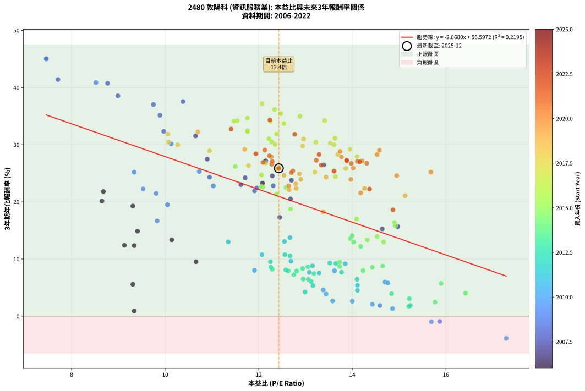
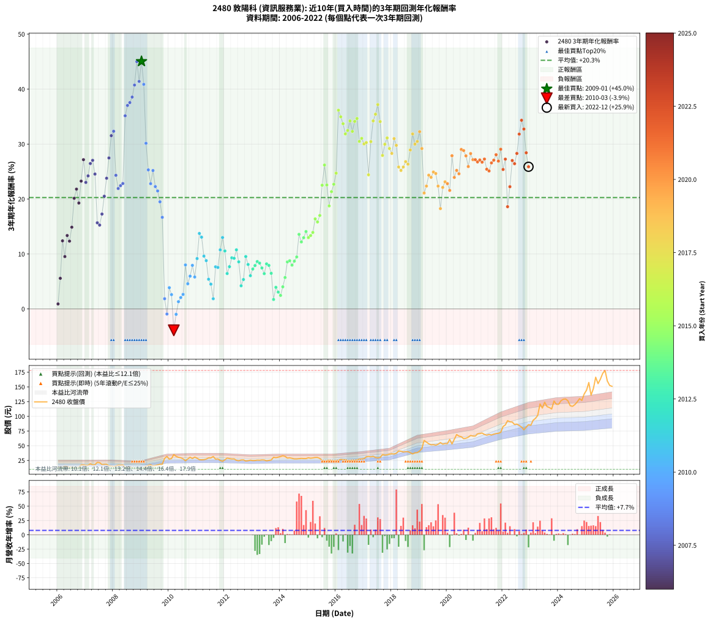

# 2480 敦陽科 - 本益比與未來報酬率分析

!!! info "報告資訊"
    - **股票代號**: 2480
    - **公司名稱**: 敦陽科
    - **產業別**: 資訊服務業
    - **分析期間**: 2006-2022 (204 個數據點)
    - **資料來源**: Type 12 (ShowMonthlyK_ChartFlow) 月收盤價與本益比
    - **報酬率口徑**: 含現金股利 (簡化: 年度合計，假設每年7/1入帳)
    - **報告生成時間**: 2026-01-05 00:43:21 CST

## 📈 視覺化圖表

### 圖表1: 本益比 vs 未來報酬率關係

*圖表1：2480 敦陽科 本益比與3年期未來報酬率關係 (2006-2022)*

### 圖表2: 歷年買入時點的3年期實際報酬率

*圖表2：2480 敦陽科 歷年買入時點的3年期實際報酬率 (2006-2022)*

## 📍 買點訊號說明

本報告提供兩種買點提示訊號（顯示於圖表2的股價子圖中）：

### ▲ 小綠色三角形（回測驗證）
- **計算方式**: 使用全部歷史資料計算本益比第25百分位數
- **用途**: 事後驗證，顯示歷史上哪些時點確實為低估區
- **限制**: 當下無法判斷，僅供回測參考
- **特性**: 後見之明（Look-Ahead Bias）

### ▲ 小橘色三角形（即時訊號）
- **計算方式**: 使用截至當月的過去5年資料計算本益比第25百分位數
- **用途**: 實際投資決策，當時即可判斷
- **優勢**: 可操作性強，符合實務需求
- **特性**: 無後見之明，滾動窗口計算

!!! tip "如何使用兩種訊號"
    - **綠色▲** 幫助理解歷史估值機會，驗證策略有效性
    - **橘色▲** 可作為實際買進參考，但仍需搭配基本面分析
    - 兩種訊號重疊時，表示即時判斷與事後驗證一致，信心度較高
    - 僅有綠色▲時，表示當時無法判斷（需要未來資料才能確認）
    - 僅有橘色▲時，表示即時判斷為買點，但事後可能不是最佳時機

## 📊 估值分析摘要

| 指標 | 數值 |
|:---:|:---:|
| **目前本益比** (2022-12) | **12.43 倍** |
| **歷史平均本益比** | 12.67 倍 |
| **估值水準** | 🟡 合理範圍 |
| **預期3年年化報酬率** | **+20.95%** |
| **歷史平均報酬率** | +20.27% |
| **相關係數 (R²)** | 0.2195 |
| **趨勢線斜率** | -2.8680 |

!!! abstract "核心洞察"
    目前本益比接近歷史平均，預期報酬率符合長期趨勢

    根據歷史數據回測，2480 敦陽科 在目前本益比 **12.4倍** 的估值水準下，
    預期未來3年年化報酬率約為 **+20.9%**。

    **重要提醒**: 本分析基於歷史數據統計，實際報酬率會受到公司基本面變化、產業趨勢、
    總體經濟環境等多重因素影響。R² = 0.22 表示本益比可解釋約 21.9% 的報酬率變異。

## 📈 歷史估值統計

### 最佳買點 (最高報酬率)

| 項目 | 數值 |
|:---:|:---:|
| 起始時間 | 2009-01 |
| 當時本益比 | 7.46 倍 |
| 起始價格 | 10.3 元 |
| 3年後價格 | 26.2 元 |
| **3年年化報酬率** | **+45.05%** |

### 最差買點 (最低報酬率)

| 項目 | 數值 |
|:---:|:---:|
| 起始時間 | 2010-03 |
| 當時本益比 | 17.29 倍 |
| 起始價格 | 35.0 元 |
| 3年後價格 | 25.6 元 |
| **3年年化報酬率** | **-3.89%** |

## 🎯 投資啟示

### 本益比與報酬率關係

趨勢線方程式: **y = -2.8680x + 56.5972**

!!! warning "強負相關"
    本益比與未來報酬率呈現強負相關。在高本益比時期買入，未來報酬率顯著較低；
    在低本益比時期買入，未來報酬率顯著較高。**估值紀律至關重要**。

### 估值區間建議

基於歷史數據分析:

- **🟢 低估區** (P/E < 10.1): 預期報酬率較高，可考慮增加持股
- **🟡 合理區** (P/E 10.1-15.2): 預期報酬率符合長期趨勢，正常持有
- **🔴 高估區** (P/E > 15.2): 預期報酬率較低，可考慮減碼或觀望

!!! danger "風險提示"
    - 過去表現不代表未來結果
    - 本分析假設公司基本面無重大結構性變化
    - 產業環境劇變可能使歷史規律失效
    - 應結合公司財報、產業趨勢、總體經濟等多重因素綜合判斷

!!! success "長期投資觀點"
    歷史數據顯示，在合理或低估的估值水準買入並長期持有，
    往往能獲得較佳的投資報酬。**耐心等待好價格**是價值投資的核心原則。

## 📊 數據品質

- **資料來源**: GoodInfo.tw Type 12 (ShowMonthlyK_ChartFlow)
- **資料頻率**: 月度收盤價與本益比
- **回測期間**: 2006-2022
- **數據點數量**: 204 個 (每個點代表一次3年期回測)

### 計算方法說明

1. **3年期年化報酬率**:
   - 對每個歷史時點，計算其後3年的實際投資報酬率
   - 期末價值(不含股利): 期末價格
   - 期末價值(含現金股利): 期末價格 + 持有期間內的現金股利合計 (簡化: 年度合計，假設每年7/1入帳)
   - 公式: 年化報酬率 = [(期末價值/期初價格)^(1/年數) - 1] × 100%

2. **本益比 (P/E Ratio)**:
   - 使用當時的月收盤價與EPS計算
   - 資料來源: Type 12 月度河流圖本益比數據

3. **趨勢線 (Linear Regression)**:
   - 使用最小平方法擬合線性趨勢線
   - R²值衡量本益比對報酬率的解釋能力

---

*本報告由 Stock Analysis System v1.9.0 自動生成*
*數據更新時間: 2026-01-05 00:43:21 CST*

## 📋 月度回測明細表

（每一列對應時間線圖中的一個買入點；可用來對照 SVG 圖上的每個點。）

| 買入月份 | 賣出月份 | 回測期限_年 | 實際持有年數 | 買入本益比_倍 | 買入收盤價_元 | 賣出收盤價_元 | 現金股利合計_元 | 總報酬率_pct | 年化報酬率_pct |
| --- | --- | --- | --- | --- | --- | --- | --- | --- | --- |
| 2006-01 | 2009-01 | 3 | 3.001 | 9.34 | 13.45 | 10.35 | 3.47 | +2.75 | +0.91 |
| 2006-02 | 2009-02 | 3 | 3.001 | 9.31 | 13.40 | 12.30 | 3.47 | +17.69 | +5.58 |
| 2006-03 | 2009-03 | 3 | 3.001 | 9.13 | 13.15 | 15.20 | 3.47 | +41.98 | +12.39 |
| 2006-04 | 2009-04 | 3 | 3.001 | 10.66 | 15.35 | 16.70 | 3.47 | +31.40 | +9.53 |
| 2006-05 | 2009-05 | 3 | 3.001 | 10.14 | 14.60 | 17.80 | 3.47 | +45.68 | +13.36 |
| 2006-06 | 2009-06 | 3 | 3.001 | 9.34 | 13.45 | 15.60 | 3.47 | +41.78 | +12.34 |
| 2006-07 | 2009-07 | 3 | 3.001 | 9.41 | 13.55 | 16.45 | 4.09 | +51.59 | +14.87 |
| 2006-08 | 2009-08 | 3 | 3.001 | 8.65 | 12.45 | 17.50 | 4.09 | +73.41 | +20.14 |
| 2006-09 | 2009-09 | 3 | 3.001 | 8.68 | 12.50 | 18.50 | 4.09 | +80.72 | +21.80 |
| 2006-10 | 2009-10 | 3 | 3.001 | 9.31 | 13.40 | 18.65 | 4.09 | +69.70 | +19.27 |
| 2006-11 | 2009-11 | 3 | 3.001 | 12.08 | 17.40 | 28.50 | 4.09 | +87.30 | +23.26 |
| 2006-12 | 2009-12 | 3 | 3.001 | 12.15 | 17.50 | 31.90 | 4.09 | +105.66 | +27.16 |
| 2007-01 | 2010-01 | 3 | 3.001 | 11.62 | 16.75 | 27.10 | 4.09 | +86.21 | +23.02 |
| 2007-02 | 2010-02 | 3 | 3.001 | 11.71 | 16.90 | 28.30 | 4.09 | +91.66 | +24.21 |
| 2007-03 | 2010-03 | 3 | 3.001 | 13.39 | 19.35 | 35.05 | 4.09 | +102.27 | +26.46 |
| 2007-04 | 2010-04 | 3 | 3.001 | 12.13 | 17.55 | 31.90 | 4.09 | +105.07 | +27.04 |
| 2007-05 | 2010-05 | 3 | 3.001 | 12.29 | 17.80 | 30.30 | 4.09 | +93.20 | +24.54 |
| 2007-06 | 2010-06 | 3 | 3.001 | 14.97 | 21.70 | 29.50 | 4.09 | +54.79 | +15.67 |
| 2007-07 | 2010-07 | 3 | 3.001 | 14.64 | 21.25 | 27.85 | 4.69 | +53.13 | +15.26 |
| 2007-08 | 2010-08 | 3 | 3.001 | 12.45 | 18.10 | 24.50 | 4.69 | +61.27 | +17.27 |
| 2007-09 | 2010-09 | 3 | 3.001 | 12.68 | 18.45 | 27.60 | 4.69 | +75.01 | +20.51 |
| 2007-10 | 2010-10 | 3 | 3.001 | 12.70 | 18.50 | 30.40 | 4.69 | +89.68 | +23.78 |
| 2007-11 | 2010-11 | 3 | 3.001 | 10.90 | 15.90 | 28.25 | 4.69 | +107.17 | +27.47 |
| 2007-12 | 2010-12 | 3 | 3.001 | 10.65 | 15.55 | 30.70 | 4.69 | +127.59 | +31.53 |
| 2008-01 | 2011-01 | 3 | 3.001 | 9.97 | 14.45 | 28.80 | 4.69 | +131.76 | +32.33 |
| 2008-02 | 2011-03 | 3 | 3.080 | 10.95 | 15.75 | 26.10 | 4.69 | +95.49 | +24.31 |
| 2008-03 | 2011-03 | 3 | 2.998 | 11.91 | 17.00 | 26.10 | 4.69 | +81.12 | +21.91 |
| 2008-04 | 2011-04 | 3 | 2.998 | 11.96 | 16.95 | 26.40 | 4.69 | +83.42 | +22.43 |
| 2008-05 | 2011-05 | 3 | 2.998 | 12.31 | 17.30 | 27.35 | 4.69 | +85.20 | +22.82 |
| 2008-06 | 2011-06 | 3 | 2.998 | 9.89 | 13.80 | 29.35 | 4.69 | +146.67 | +35.14 |
| 2008-07 | 2011-07 | 3 | 2.998 | 9.75 | 13.50 | 29.35 | 5.36 | +157.11 | +37.03 |
| 2008-08 | 2011-08 | 3 | 2.998 | 10.38 | 14.25 | 31.70 | 5.36 | +160.07 | +37.55 |
| 2008-09 | 2011-09 | 3 | 2.998 | 8.99 | 12.25 | 27.20 | 5.36 | +165.80 | +38.55 |
| 2008-10 | 2011-10 | 3 | 2.998 | 8.77 | 11.85 | 27.65 | 5.36 | +178.57 | +40.74 |
| 2008-11 | 2011-11 | 3 | 2.998 | 7.46 | 10.00 | 25.10 | 5.36 | +204.60 | +45.00 |
| 2008-12 | 2011-12 | 3 | 2.998 | 7.71 | 10.25 | 23.60 | 5.36 | +182.54 | +41.40 |
| 2009-01 | 2012-01 | 3 | 2.998 | 7.46 | 10.35 | 26.20 | 5.36 | +204.93 | +45.05 |
| 2009-02 | 2012-02 | 3 | 2.998 | 8.52 | 12.30 | 29.00 | 5.36 | +179.35 | +40.87 |
| 2009-03 | 2012-03 | 3 | 3.001 | 10.13 | 15.20 | 28.15 | 5.36 | +120.46 | +30.14 |
| 2009-04 | 2012-04 | 3 | 3.001 | 10.73 | 16.70 | 27.50 | 5.36 | +96.77 | +25.30 |
| 2009-05 | 2012-05 | 3 | 3.001 | 11.03 | 17.80 | 27.60 | 5.36 | +85.17 | +22.79 |
| 2009-06 | 2012-06 | 3 | 3.001 | 9.34 | 15.60 | 25.25 | 5.36 | +96.22 | +25.19 |
| 2009-07 | 2012-07 | 3 | 3.001 | 9.53 | 16.45 | 24.50 | 5.57 | +82.80 | +22.27 |
| 2009-08 | 2012-08 | 3 | 3.001 | 9.81 | 17.50 | 25.80 | 5.57 | +79.26 | +21.47 |
| 2009-09 | 2012-09 | 3 | 3.001 | 10.05 | 18.50 | 26.00 | 5.57 | +70.65 | +19.50 |
| 2009-10 | 2012-10 | 3 | 3.001 | 9.83 | 18.65 | 24.05 | 5.57 | +58.82 | +16.67 |
| 2009-11 | 2012-11 | 3 | 3.001 | 14.59 | 28.50 | 24.55 | 5.57 | +5.68 | +1.86 |
| 2009-12 | 2012-12 | 3 | 3.001 | 15.87 | 31.90 | 25.45 | 5.57 | -2.76 | -0.93 |
| 2010-01 | 2013-01 | 3 | 3.001 | 13.44 | 27.10 | 24.80 | 5.57 | +12.07 | +3.87 |
| 2010-02 | 2013-02 | 3 | 3.001 | 14.00 | 28.30 | 25.00 | 5.57 | +8.02 | +2.60 |
| 2010-03 | 2013-03 | 3 | 3.001 | 17.29 | 35.05 | 25.55 | 5.57 | -11.21 | -3.89 |
| 2010-04 | 2013-04 | 3 | 3.001 | 15.69 | 31.90 | 25.40 | 5.57 | -2.92 | -0.98 |
| 2010-05 | 2013-05 | 3 | 3.001 | 14.86 | 30.30 | 25.95 | 5.57 | +4.03 | +1.32 |
| 2010-06 | 2013-06 | 3 | 3.001 | 14.43 | 29.50 | 25.80 | 5.57 | +6.34 | +2.07 |
| 2010-07 | 2013-07 | 3 | 3.001 | 13.58 | 27.85 | 24.35 | 5.77 | +8.15 | +2.65 |
| 2010-08 | 2013-08 | 3 | 3.001 | 11.91 | 24.50 | 25.10 | 5.77 | +26.00 | +8.01 |
| 2010-09 | 2013-09 | 3 | 3.001 | 13.38 | 27.60 | 25.80 | 5.77 | +14.38 | +4.58 |
| 2010-10 | 2013-10 | 3 | 3.001 | 14.70 | 30.40 | 30.40 | 5.77 | +18.98 | +5.96 |
| 2010-11 | 2013-11 | 3 | 3.001 | 13.62 | 28.25 | 29.75 | 5.77 | +25.73 | +7.93 |
| 2010-12 | 2013-12 | 3 | 3.001 | 14.76 | 30.70 | 30.60 | 5.77 | +18.47 | +5.81 |
| 2011-01 | 2014-01 | 3 | 3.001 | 13.85 | 28.80 | 31.70 | 5.77 | +30.10 | +9.17 |
| 2011-02 | 2014-02 | 3 | 3.001 | 12.67 | 26.35 | 33.00 | 5.77 | +47.13 | +13.73 |
| 2011-03 | 2014-03 | 3 | 3.001 | 12.55 | 26.10 | 31.95 | 5.77 | +44.52 | +13.06 |
| 2011-04 | 2014-04 | 3 | 3.001 | 12.69 | 26.40 | 29.00 | 5.77 | +31.70 | +9.61 |
| 2011-05 | 2014-05 | 3 | 3.001 | 13.15 | 27.35 | 29.45 | 5.77 | +28.78 | +8.79 |
| 2011-06 | 2014-06 | 3 | 3.001 | 14.11 | 29.35 | 28.60 | 5.77 | +17.10 | +5.40 |
| 2011-07 | 2014-07 | 3 | 3.001 | 14.11 | 29.35 | 27.60 | 5.90 | +14.14 | +4.51 |
| 2011-08 | 2014-08 | 3 | 3.001 | 15.24 | 31.70 | 27.60 | 5.90 | +5.68 | +1.86 |
| 2011-09 | 2014-09 | 3 | 3.001 | 13.08 | 27.20 | 28.05 | 5.90 | +24.82 | +7.67 |
| 2011-10 | 2014-10 | 3 | 3.001 | 13.29 | 27.65 | 28.50 | 5.90 | +24.41 | +7.55 |
| 2011-11 | 2014-11 | 3 | 3.001 | 12.07 | 25.10 | 28.20 | 5.90 | +35.86 | +10.75 |
| 2011-12 | 2014-12 | 3 | 3.001 | 11.35 | 23.60 | 28.15 | 5.90 | +44.28 | +12.99 |
| 2012-01 | 2015-01 | 3 | 3.001 | 12.67 | 26.20 | 29.50 | 5.90 | +35.11 | +10.55 |
| 2012-02 | 2015-03 | 3 | 3.080 | 14.10 | 29.00 | 29.25 | 5.90 | +21.21 | +6.44 |
| 2012-03 | 2015-03 | 3 | 2.998 | 13.77 | 28.15 | 29.25 | 5.90 | +24.87 | +7.69 |
| 2012-04 | 2015-04 | 3 | 2.998 | 13.52 | 27.50 | 30.00 | 5.90 | +30.55 | +9.30 |
| 2012-05 | 2015-05 | 3 | 2.998 | 13.65 | 27.60 | 30.05 | 5.90 | +30.25 | +9.22 |
| 2012-06 | 2015-06 | 3 | 2.998 | 12.56 | 25.25 | 28.40 | 5.90 | +35.84 | +10.76 |
| 2012-07 | 2015-07 | 3 | 2.998 | 12.26 | 24.50 | 25.35 | 6.00 | +27.96 | +8.57 |
| 2012-08 | 2015-08 | 3 | 2.998 | 12.99 | 25.80 | 23.20 | 6.00 | +13.18 | +4.22 |
| 2012-09 | 2015-09 | 3 | 2.998 | 13.16 | 26.00 | 24.40 | 6.00 | +16.92 | +5.35 |
| 2012-10 | 2015-10 | 3 | 2.998 | 12.25 | 24.05 | 25.60 | 6.00 | +31.39 | +9.53 |
| 2012-11 | 2015-11 | 3 | 2.998 | 12.58 | 24.55 | 25.00 | 6.00 | +26.27 | +8.09 |
| 2012-12 | 2015-12 | 3 | 2.998 | 13.12 | 25.45 | 24.35 | 6.00 | +19.25 | +6.05 |
| 2013-01 | 2016-01 | 3 | 2.998 | 12.75 | 24.80 | 24.60 | 6.00 | +23.39 | +7.26 |
| 2013-02 | 2016-02 | 3 | 2.998 | 12.81 | 25.00 | 25.40 | 6.00 | +25.60 | +7.90 |
| 2013-03 | 2016-03 | 3 | 3.001 | 13.05 | 25.55 | 26.75 | 6.00 | +28.18 | +8.63 |
| 2013-04 | 2016-04 | 3 | 3.001 | 12.94 | 25.40 | 26.30 | 6.00 | +27.17 | +8.34 |
| 2013-05 | 2016-05 | 3 | 3.001 | 13.18 | 25.95 | 26.20 | 6.00 | +24.08 | +7.46 |
| 2013-06 | 2016-06 | 3 | 3.001 | 13.06 | 25.80 | 25.10 | 6.00 | +20.54 | +6.42 |
| 2013-07 | 2016-07 | 3 | 3.001 | 12.29 | 24.35 | 24.85 | 6.00 | +26.69 | +8.20 |
| 2013-08 | 2016-08 | 3 | 3.001 | 12.63 | 25.10 | 25.55 | 6.00 | +25.70 | +7.92 |
| 2013-09 | 2016-09 | 3 | 3.001 | 12.95 | 25.80 | 25.15 | 6.00 | +20.74 | +6.48 |
| 2013-10 | 2016-10 | 3 | 3.001 | 15.21 | 30.40 | 26.00 | 6.00 | +5.26 | +1.72 |
| 2013-11 | 2016-11 | 3 | 3.001 | 14.84 | 29.75 | 27.40 | 6.00 | +12.27 | +3.93 |
| 2013-12 | 2016-12 | 3 | 3.001 | 15.22 | 30.60 | 27.50 | 6.00 | +9.48 | +3.06 |
| 2014-01 | 2017-01 | 3 | 3.001 | 15.77 | 31.70 | 28.10 | 6.00 | +7.57 | +2.46 |
| 2014-02 | 2017-02 | 3 | 3.001 | 16.42 | 33.00 | 31.15 | 6.00 | +12.58 | +4.03 |
| 2014-03 | 2017-03 | 3 | 3.001 | 15.90 | 31.95 | 31.75 | 6.00 | +18.15 | +5.72 |
| 2014-04 | 2017-04 | 3 | 3.001 | 14.43 | 29.00 | 31.10 | 6.00 | +27.93 | +8.56 |
| 2014-05 | 2017-05 | 3 | 3.001 | 14.65 | 29.45 | 31.90 | 6.00 | +28.69 | +8.77 |
| 2014-06 | 2017-06 | 3 | 3.001 | 14.23 | 28.60 | 30.00 | 6.00 | +25.87 | +7.97 |
| 2014-07 | 2017-07 | 3 | 3.001 | 13.73 | 27.60 | 29.35 | 6.10 | +28.44 | +8.70 |
| 2014-08 | 2017-08 | 3 | 3.001 | 13.73 | 27.60 | 30.10 | 6.10 | +31.16 | +9.46 |
| 2014-09 | 2017-09 | 3 | 3.001 | 13.96 | 28.05 | 35.00 | 6.10 | +46.52 | +13.58 |
| 2014-10 | 2017-10 | 3 | 3.001 | 14.18 | 28.50 | 34.15 | 6.10 | +41.23 | +12.19 |
| 2014-11 | 2017-11 | 3 | 3.001 | 14.03 | 28.20 | 34.55 | 6.10 | +44.15 | +12.96 |
| 2014-12 | 2017-12 | 3 | 3.001 | 14.00 | 28.15 | 35.70 | 6.10 | +48.49 | +14.08 |
| 2015-01 | 2018-01 | 3 | 3.001 | 14.67 | 29.50 | 36.45 | 6.10 | +44.24 | +12.98 |
| 2015-02 | 2018-02 | 3 | 3.001 | 14.32 | 28.80 | 35.85 | 6.10 | +45.66 | +13.35 |
| 2015-03 | 2018-03 | 3 | 3.001 | 14.53 | 29.25 | 37.15 | 6.10 | +47.86 | +13.92 |
| 2015-04 | 2018-04 | 3 | 3.001 | 14.90 | 30.00 | 41.20 | 6.10 | +57.67 | +16.39 |
| 2015-05 | 2018-05 | 3 | 3.001 | 14.92 | 30.05 | 40.60 | 6.10 | +55.41 | +15.83 |
| 2015-06 | 2018-06 | 3 | 3.001 | 14.09 | 28.40 | 39.40 | 6.10 | +60.21 | +17.01 |
| 2015-07 | 2018-07 | 3 | 3.001 | 12.58 | 25.35 | 39.90 | 6.72 | +83.91 | +22.51 |
| 2015-08 | 2018-08 | 3 | 3.001 | 11.50 | 23.20 | 39.90 | 6.72 | +100.95 | +26.18 |
| 2015-09 | 2018-09 | 3 | 3.001 | 12.09 | 24.40 | 38.20 | 6.72 | +84.10 | +22.55 |
| 2015-10 | 2018-10 | 3 | 3.001 | 12.68 | 25.60 | 36.15 | 6.72 | +67.46 | +18.75 |
| 2015-11 | 2018-11 | 3 | 3.001 | 12.38 | 25.00 | 37.95 | 6.72 | +78.68 | +21.34 |
| 2015-12 | 2018-12 | 3 | 3.001 | 12.05 | 24.35 | 38.25 | 6.72 | +84.68 | +22.68 |
| 2016-01 | 2019-01 | 3 | 3.001 | 12.06 | 24.60 | 41.00 | 6.72 | +93.98 | +24.71 |
| 2016-02 | 2019-03 | 3 | 3.080 | 12.34 | 25.40 | 59.00 | 6.72 | +158.74 | +36.16 |
| 2016-03 | 2019-03 | 3 | 2.998 | 12.88 | 26.75 | 59.00 | 6.72 | +145.68 | +34.96 |
| 2016-04 | 2019-04 | 3 | 2.998 | 12.54 | 26.30 | 56.10 | 6.72 | +138.86 | +33.70 |
| 2016-05 | 2019-05 | 3 | 2.998 | 12.38 | 26.20 | 53.30 | 6.72 | +129.08 | +31.85 |
| 2016-06 | 2019-06 | 3 | 2.998 | 11.76 | 25.10 | 51.60 | 6.72 | +132.35 | +32.47 |
| 2016-07 | 2019-07 | 3 | 2.998 | 11.54 | 24.85 | 51.90 | 8.14 | +141.61 | +34.21 |
| 2016-08 | 2019-08 | 3 | 2.998 | 11.76 | 25.55 | 51.00 | 8.14 | +131.47 | +32.31 |
| 2016-09 | 2019-09 | 3 | 2.998 | 11.47 | 25.15 | 52.50 | 8.14 | +141.11 | +34.12 |
| 2016-10 | 2019-10 | 3 | 2.998 | 11.76 | 26.00 | 55.30 | 8.14 | +144.00 | +34.65 |
| 2016-11 | 2019-11 | 3 | 2.998 | 12.28 | 27.40 | 52.70 | 8.14 | +122.04 | +30.48 |
| 2016-12 | 2019-12 | 3 | 2.998 | 12.22 | 27.50 | 53.70 | 8.14 | +124.87 | +31.04 |
| 2017-01 | 2020-01 | 3 | 2.998 | 12.35 | 28.10 | 53.60 | 8.14 | +119.72 | +30.03 |
| 2017-02 | 2020-02 | 3 | 2.998 | 13.53 | 31.15 | 60.70 | 8.14 | +121.00 | +30.28 |
| 2017-03 | 2020-03 | 3 | 3.001 | 13.64 | 31.75 | 53.00 | 8.14 | +92.57 | +24.41 |
| 2017-04 | 2020-04 | 3 | 3.001 | 13.22 | 31.10 | 60.90 | 8.14 | +121.99 | +30.44 |
| 2017-05 | 2020-05 | 3 | 3.001 | 13.41 | 31.90 | 69.00 | 8.14 | +141.82 | +34.21 |
| 2017-06 | 2020-06 | 3 | 3.001 | 12.47 | 30.00 | 66.40 | 8.14 | +148.47 | +35.43 |
| 2017-07 | 2020-07 | 3 | 3.001 | 12.07 | 29.35 | 65.30 | 10.49 | +158.23 | +37.18 |
| 2017-08 | 2020-08 | 3 | 3.001 | 12.25 | 30.10 | 62.10 | 10.49 | +141.16 | +34.09 |
| 2017-09 | 2020-09 | 3 | 3.001 | 14.10 | 35.00 | 62.80 | 10.49 | +109.40 | +27.93 |
| 2017-10 | 2020-10 | 3 | 3.001 | 13.61 | 34.15 | 64.50 | 10.49 | +119.59 | +29.97 |
| 2017-11 | 2020-11 | 3 | 3.001 | 13.63 | 34.55 | 67.40 | 10.49 | +125.44 | +31.11 |
| 2017-12 | 2020-12 | 3 | 3.001 | 13.95 | 35.70 | 66.50 | 10.49 | +115.66 | +29.19 |
| 2018-01 | 2021-01 | 3 | 3.001 | 13.69 | 36.45 | 66.50 | 10.49 | +111.22 | +28.30 |
| 2018-02 | 2021-02 | 3 | 3.001 | 12.96 | 35.85 | 70.10 | 10.49 | +124.80 | +30.99 |
| 2018-03 | 2021-03 | 3 | 3.001 | 12.94 | 37.15 | 70.70 | 10.49 | +118.55 | +29.76 |
| 2018-04 | 2021-04 | 3 | 3.001 | 13.86 | 41.20 | 71.60 | 10.49 | +99.25 | +25.83 |
| 2018-05 | 2021-05 | 3 | 3.001 | 13.20 | 40.60 | 69.20 | 10.49 | +96.28 | +25.20 |
| 2018-06 | 2021-06 | 3 | 3.001 | 12.39 | 39.40 | 68.00 | 10.49 | +99.21 | +25.82 |
| 2018-07 | 2021-07 | 3 | 3.001 | 12.15 | 39.90 | 69.20 | 12.17 | +103.93 | +26.81 |
| 2018-08 | 2021-08 | 3 | 3.001 | 11.78 | 39.90 | 68.30 | 12.17 | +101.68 | +26.34 |
| 2018-09 | 2021-09 | 3 | 3.001 | 10.95 | 38.20 | 69.70 | 12.17 | +114.32 | +28.92 |
| 2018-10 | 2021-10 | 3 | 3.001 | 10.06 | 36.15 | 70.70 | 12.17 | +129.24 | +31.85 |
| 2018-11 | 2021-11 | 3 | 3.001 | 10.27 | 37.95 | 71.20 | 12.17 | +119.68 | +29.99 |
| 2018-12 | 2021-12 | 3 | 3.001 | 10.07 | 38.25 | 72.80 | 12.17 | +122.14 | +30.47 |
| 2019-01 | 2022-01 | 3 | 3.001 | 10.70 | 41.00 | 82.70 | 12.17 | +131.39 | +32.26 |
| 2019-02 | 2022-02 | 3 | 3.001 | 11.70 | 45.25 | 85.40 | 12.17 | +115.62 | +29.18 |
| 2019-03 | 2022-03 | 3 | 3.001 | 15.13 | 59.00 | 92.60 | 12.17 | +77.58 | +21.09 |
| 2019-04 | 2022-04 | 3 | 3.001 | 14.26 | 56.10 | 90.60 | 12.17 | +83.19 | +22.35 |
| 2019-05 | 2022-05 | 3 | 3.001 | 13.44 | 53.30 | 90.30 | 12.17 | +92.25 | +24.34 |
| 2019-06 | 2022-06 | 3 | 3.001 | 12.90 | 51.60 | 86.10 | 12.17 | +90.45 | +23.95 |
| 2019-07 | 2022-07 | 3 | 3.001 | 12.87 | 51.90 | 86.80 | 14.37 | +94.93 | +24.91 |
| 2019-08 | 2022-08 | 3 | 3.001 | 12.54 | 51.00 | 84.40 | 14.37 | +93.67 | +24.64 |
| 2019-09 | 2022-09 | 3 | 3.001 | 12.80 | 52.50 | 81.80 | 14.37 | +83.18 | +22.35 |
| 2019-10 | 2022-10 | 3 | 3.001 | 13.38 | 55.30 | 77.10 | 14.37 | +65.41 | +18.26 |
| 2019-11 | 2022-11 | 3 | 3.001 | 12.65 | 52.70 | 81.60 | 14.37 | +82.11 | +22.11 |
| 2019-12 | 2022-12 | 3 | 3.001 | 12.79 | 53.70 | 85.90 | 14.37 | +86.72 | +23.13 |
| 2020-01 | 2023-01 | 3 | 3.001 | 12.64 | 53.60 | 84.90 | 14.37 | +85.21 | +22.80 |
| 2020-02 | 2023-03 | 3 | 3.080 | 14.18 | 60.70 | 96.40 | 14.37 | +82.49 | +21.57 |
| 2020-03 | 2023-03 | 3 | 2.998 | 12.27 | 53.00 | 96.40 | 14.37 | +109.00 | +27.88 |
| 2020-04 | 2023-04 | 3 | 2.998 | 13.97 | 60.90 | 101.50 | 14.37 | +90.26 | +23.93 |
| 2020-05 | 2023-05 | 3 | 2.998 | 15.68 | 69.00 | 121.00 | 14.37 | +96.19 | +25.21 |
| 2020-06 | 2023-06 | 3 | 2.998 | 14.95 | 66.40 | 114.00 | 14.37 | +93.33 | +24.59 |
| 2020-07 | 2023-07 | 3 | 2.998 | 14.58 | 65.30 | 124.00 | 16.18 | +114.67 | +29.02 |
| 2020-08 | 2023-08 | 3 | 2.998 | 13.74 | 62.10 | 116.50 | 16.18 | +113.66 | +28.82 |
| 2020-09 | 2023-09 | 3 | 2.998 | 13.77 | 62.80 | 115.00 | 16.18 | +108.89 | +27.85 |
| 2020-10 | 2023-10 | 3 | 2.998 | 14.02 | 64.50 | 112.50 | 16.18 | +99.50 | +25.91 |
| 2020-11 | 2023-11 | 3 | 2.998 | 14.53 | 67.40 | 126.00 | 16.18 | +110.95 | +28.27 |
| 2020-12 | 2023-12 | 3 | 2.998 | 14.21 | 66.50 | 120.50 | 16.18 | +105.53 | +27.16 |
| 2021-01 | 2024-01 | 3 | 2.998 | 13.88 | 66.50 | 120.50 | 16.18 | +105.53 | +27.16 |
| 2021-02 | 2024-02 | 3 | 2.998 | 14.31 | 70.10 | 126.50 | 16.18 | +103.54 | +26.75 |
| 2021-03 | 2024-03 | 3 | 3.001 | 14.11 | 70.70 | 129.00 | 16.18 | +105.35 | +27.10 |
| 2021-04 | 2024-04 | 3 | 3.001 | 13.98 | 71.60 | 129.50 | 16.18 | +103.46 | +26.71 |
| 2021-05 | 2024-05 | 3 | 3.001 | 13.23 | 69.20 | 126.50 | 16.18 | +106.18 | +27.27 |
| 2021-06 | 2024-06 | 3 | 3.001 | 12.73 | 68.00 | 118.00 | 16.18 | +97.32 | +25.42 |
| 2021-07 | 2024-07 | 3 | 3.001 | 12.70 | 69.20 | 117.00 | 18.52 | +95.84 | +25.11 |
| 2021-08 | 2024-08 | 3 | 3.001 | 12.28 | 68.30 | 120.00 | 18.52 | +102.81 | +26.57 |
| 2021-09 | 2024-09 | 3 | 3.001 | 12.29 | 69.70 | 124.50 | 18.52 | +105.19 | +27.07 |
| 2021-10 | 2024-10 | 3 | 3.001 | 12.23 | 70.70 | 130.00 | 18.52 | +110.07 | +28.07 |
| 2021-11 | 2024-11 | 3 | 3.001 | 12.09 | 71.20 | 127.00 | 18.52 | +104.38 | +26.90 |
| 2021-12 | 2024-12 | 3 | 3.001 | 12.13 | 72.80 | 138.00 | 18.52 | +115.00 | +29.06 |
| 2022-01 | 2025-01 | 3 | 3.001 | 13.61 | 82.70 | 144.50 | 18.52 | +97.12 | +25.38 |
| 2022-02 | 2025-02 | 3 | 3.001 | 13.88 | 85.40 | 157.50 | 18.52 | +106.11 | +27.26 |
| 2022-03 | 2025-03 | 3 | 3.001 | 14.87 | 92.60 | 136.00 | 18.52 | +66.87 | +18.61 |
| 2022-04 | 2025-04 | 3 | 3.001 | 14.37 | 90.60 | 147.00 | 18.52 | +82.69 | +22.24 |
| 2022-05 | 2025-05 | 3 | 3.001 | 14.16 | 90.30 | 166.50 | 18.52 | +104.89 | +27.00 |
| 2022-06 | 2025-06 | 3 | 3.001 | 13.34 | 86.10 | 155.50 | 18.52 | +102.11 | +26.43 |
| 2022-07 | 2025-07 | 3 | 3.001 | 13.29 | 86.80 | 163.00 | 20.32 | +111.20 | +28.29 |
| 2022-08 | 2025-08 | 3 | 3.001 | 12.77 | 84.40 | 173.00 | 20.32 | +129.05 | +31.81 |
| 2022-09 | 2025-09 | 3 | 3.001 | 12.24 | 81.80 | 178.00 | 20.32 | +142.45 | +34.33 |
| 2022-10 | 2025-10 | 3 | 3.001 | 11.41 | 77.10 | 160.00 | 20.32 | +133.88 | +32.73 |
| 2022-11 | 2025-11 | 3 | 3.001 | 11.94 | 81.60 | 152.50 | 20.32 | +111.79 | +28.41 |
| 2022-12 | 2025-12 | 3 | 3.001 | 12.43 | 85.90 | 151.00 | 20.32 | +99.44 | +25.87 |
