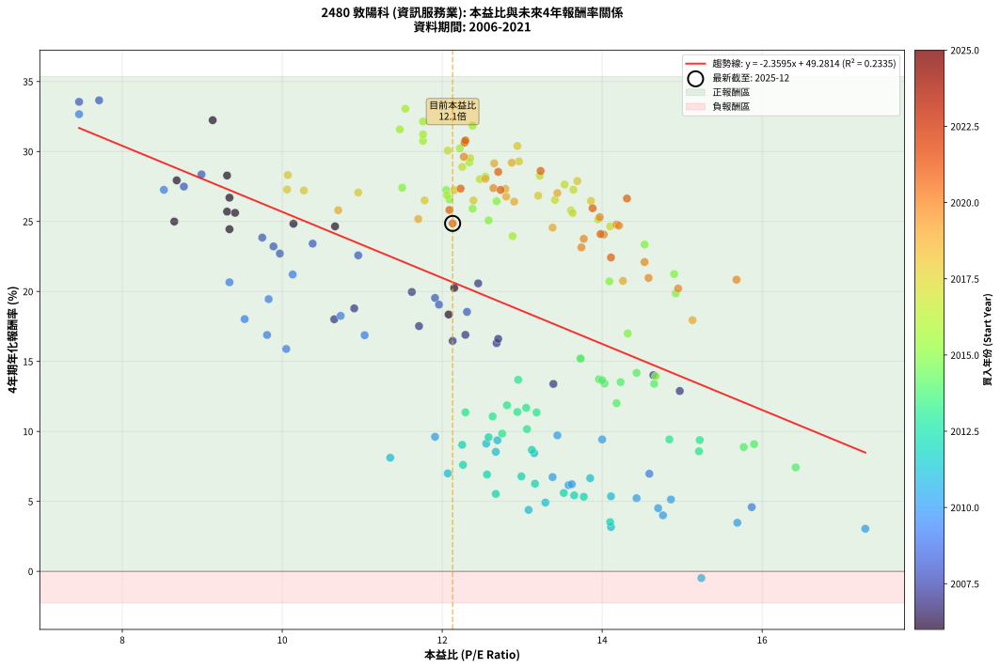
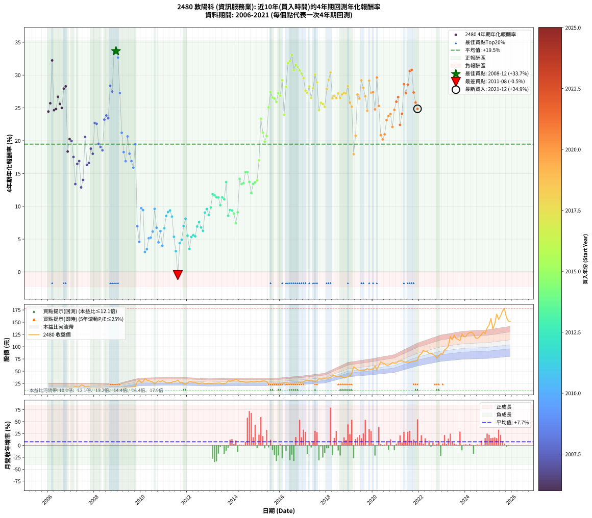

# 2480 敦陽科 - 本益比與未來報酬率分析

!!! info "報告資訊"
    - **股票代號**: 2480
    - **公司名稱**: 敦陽科
    - **產業別**: 資訊服務業
    - **分析期間**: 2006-2021 (192 個數據點)
    - **資料來源**: Type 12 (ShowMonthlyK_ChartFlow) 月收盤價與本益比
    - **報酬率口徑**: 含現金股利 (簡化: 年度合計，假設每年7/1入帳)
    - **報告生成時間**: 2026-01-22 22:59:37 CST

## 📈 視覺化圖表

### 圖表1: 本益比 vs 未來報酬率關係

*圖表1：2480 敦陽科 本益比與4年期未來報酬率關係 (2006-2021)*

### 圖表2: 歷年買入時點的4年期實際報酬率

*圖表2：2480 敦陽科 歷年買入時點的4年期實際報酬率 (2006-2021)*

## 📍 買點訊號說明

本報告提供兩種買點提示訊號（顯示於圖表2的股價子圖中）：

### ▲ 小綠色三角形（回測驗證）
- **計算方式**: 使用全部歷史資料計算本益比第25百分位數
- **用途**: 事後驗證，顯示歷史上哪些時點確實為低估區
- **限制**: 當下無法判斷，僅供回測參考
- **特性**: 後見之明（Look-Ahead Bias）

### ▲ 小橘色三角形（即時訊號）
- **計算方式**: 使用截至當月的過去5年資料計算本益比第25百分位數
- **用途**: 實際投資決策，當時即可判斷
- **優勢**: 可操作性強，符合實務需求
- **特性**: 無後見之明，滾動窗口計算

!!! tip "如何使用兩種訊號"
    - **綠色▲** 幫助理解歷史估值機會，驗證策略有效性
    - **橘色▲** 可作為實際買進參考，但仍需搭配基本面分析
    - 兩種訊號重疊時，表示即時判斷與事後驗證一致，信心度較高
    - 僅有綠色▲時，表示當時無法判斷（需要未來資料才能確認）
    - 僅有橘色▲時，表示即時判斷為買點，但事後可能不是最佳時機

## 📊 估值分析摘要

| 指標 | 數值 |
|:---:|:---:|
| **目前本益比** (2021-12) | **12.13 倍** |
| **歷史平均本益比** | 12.63 倍 |
| **估值水準** | 🟡 合理範圍 |
| **預期4年年化報酬率** | **+20.66%** |
| **歷史平均報酬率** | +19.47% |
| **相關係數 (R²)** | 0.2335 |
| **趨勢線斜率** | -2.3595 |

!!! abstract "核心洞察"
    目前本益比接近歷史平均，預期報酬率符合長期趨勢

    根據歷史數據回測，2480 敦陽科 在目前本益比 **12.1倍** 的估值水準下，
    預期未來4年年化報酬率約為 **+20.7%**。

    **重要提醒**: 本分析基於歷史數據統計，實際報酬率會受到公司基本面變化、產業趨勢、
    總體經濟環境等多重因素影響。R² = 0.23 表示本益比可解釋約 23.4% 的報酬率變異。

## 📈 歷史估值統計

### 最佳買點 (最高報酬率)

| 項目 | 數值 |
|:---:|:---:|
| 起始時間 | 2008-12 |
| 當時本益比 | 7.71 倍 |
| 起始價格 | 10.2 元 |
| 4年後價格 | 25.4 元 |
| **4年年化報酬率** | **+33.66%** |

### 最差買點 (最低報酬率)

| 項目 | 數值 |
|:---:|:---:|
| 起始時間 | 2011-08 |
| 當時本益比 | 15.24 倍 |
| 起始價格 | 31.7 元 |
| 4年後價格 | 23.2 元 |
| **4年年化報酬率** | **-0.48%** |

## 🎯 投資啟示

### 本益比與報酬率關係

趨勢線方程式: **y = -2.3595x + 49.2814**

!!! warning "強負相關"
    本益比與未來報酬率呈現強負相關。在高本益比時期買入，未來報酬率顯著較低；
    在低本益比時期買入，未來報酬率顯著較高。**估值紀律至關重要**。

### 估值區間建議

基於歷史數據分析:

- **🟢 低估區** (P/E < 10.1): 預期報酬率較高，可考慮增加持股
- **🟡 合理區** (P/E 10.1-15.2): 預期報酬率符合長期趨勢，正常持有
- **🔴 高估區** (P/E > 15.2): 預期報酬率較低，可考慮減碼或觀望

!!! danger "風險提示"
    - 過去表現不代表未來結果
    - 本分析假設公司基本面無重大結構性變化
    - 產業環境劇變可能使歷史規律失效
    - 應結合公司財報、產業趨勢、總體經濟等多重因素綜合判斷

!!! success "長期投資觀點"
    歷史數據顯示，在合理或低估的估值水準買入並長期持有，
    往往能獲得較佳的投資報酬。**耐心等待好價格**是價值投資的核心原則。

## 📊 數據品質

- **資料來源**: GoodInfo.tw Type 12 (ShowMonthlyK_ChartFlow)
- **資料頻率**: 月度收盤價與本益比
- **回測期間**: 2006-2021
- **數據點數量**: 192 個 (每個點代表一次4年期回測)

### 計算方法說明

1. **4年期年化報酬率**:
   - 對每個歷史時點，計算其後4年的實際投資報酬率
   - 期末價值(不含股利): 期末價格
   - 期末價值(含現金股利): 期末價格 + 持有期間內的現金股利合計 (簡化: 年度合計，假設每年7/1入帳)
   - 公式: 年化報酬率 = [(期末價值/期初價格)^(1/年數) - 1] × 100%

2. **本益比 (P/E Ratio)**:
   - 使用當時的月收盤價與EPS計算
   - 資料來源: Type 12 月度河流圖本益比數據

3. **趨勢線 (Linear Regression)**:
   - 使用最小平方法擬合線性趨勢線
   - R²值衡量本益比對報酬率的解釋能力

---

*本報告由 Stock Analysis System v1.9.0 自動生成*
*數據更新時間: 2026-01-22 22:59:37 CST*

## 📋 月度回測明細表

（每一列對應時間線圖中的一個買入點；可用來對照 SVG 圖上的每個點。）

| 買入月份 | 賣出月份 | 回測期限_年 | 實際持有年數 | 買入本益比_倍 | 買入收盤價_元 | 賣出收盤價_元 | 現金股利合計_元 | 總報酬率_pct | 年化報酬率_pct |
| --- | --- | --- | --- | --- | --- | --- | --- | --- | --- |
| 2006-01 | 2010-01 | 4 | 4.000 | 9.34 | 13.45 | 27.10 | 5.16 | +139.85 | +24.45 |
| 2006-02 | 2010-02 | 4 | 4.000 | 9.31 | 13.40 | 28.30 | 5.16 | +149.70 | +25.71 |
| 2006-03 | 2010-03 | 4 | 4.000 | 9.13 | 13.15 | 35.05 | 5.16 | +205.78 | +32.24 |
| 2006-04 | 2010-04 | 4 | 4.000 | 10.66 | 15.35 | 31.90 | 5.16 | +141.43 | +24.65 |
| 2006-05 | 2010-05 | 4 | 4.000 | 10.14 | 14.60 | 30.30 | 5.16 | +142.88 | +24.84 |
| 2006-06 | 2010-06 | 4 | 4.000 | 9.34 | 13.45 | 29.50 | 5.16 | +157.70 | +26.70 |
| 2006-07 | 2010-07 | 4 | 4.000 | 9.41 | 13.55 | 27.85 | 5.89 | +149.00 | +25.62 |
| 2006-08 | 2010-08 | 4 | 4.000 | 8.65 | 12.45 | 24.50 | 5.89 | +144.10 | +24.99 |
| 2006-09 | 2010-09 | 4 | 4.000 | 8.68 | 12.50 | 27.60 | 5.89 | +167.92 | +27.94 |
| 2006-10 | 2010-10 | 4 | 4.000 | 9.31 | 13.40 | 30.40 | 5.89 | +170.82 | +28.28 |
| 2006-11 | 2010-11 | 4 | 4.000 | 12.08 | 17.40 | 28.25 | 5.89 | +96.21 | +18.35 |
| 2006-12 | 2010-12 | 4 | 4.000 | 12.15 | 17.50 | 30.70 | 5.89 | +109.09 | +20.25 |
| 2007-01 | 2011-01 | 4 | 4.000 | 11.62 | 16.75 | 28.80 | 5.89 | +107.10 | +19.96 |
| 2007-02 | 2011-02 | 4 | 4.000 | 11.71 | 16.90 | 26.35 | 5.89 | +90.77 | +17.52 |
| 2007-03 | 2011-03 | 4 | 4.000 | 13.39 | 19.35 | 26.10 | 5.89 | +65.32 | +13.39 |
| 2007-04 | 2011-04 | 4 | 4.000 | 12.13 | 17.55 | 26.40 | 5.89 | +83.99 | +16.47 |
| 2007-05 | 2011-05 | 4 | 4.000 | 12.29 | 17.80 | 27.35 | 5.89 | +86.74 | +16.90 |
| 2007-06 | 2011-06 | 4 | 4.000 | 14.97 | 21.70 | 29.35 | 5.89 | +62.40 | +12.89 |
| 2007-07 | 2011-07 | 4 | 4.000 | 14.64 | 21.25 | 29.35 | 6.56 | +68.99 | +14.02 |
| 2007-08 | 2011-08 | 4 | 4.000 | 12.45 | 18.10 | 31.70 | 6.56 | +111.38 | +20.58 |
| 2007-09 | 2011-09 | 4 | 4.000 | 12.68 | 18.45 | 27.20 | 6.56 | +82.98 | +16.31 |
| 2007-10 | 2011-10 | 4 | 4.000 | 12.70 | 18.50 | 27.65 | 6.56 | +84.92 | +16.61 |
| 2007-11 | 2011-11 | 4 | 4.000 | 10.90 | 15.90 | 25.10 | 6.56 | +99.12 | +18.79 |
| 2007-12 | 2011-12 | 4 | 4.000 | 10.65 | 15.55 | 23.60 | 6.56 | +93.95 | +18.01 |
| 2008-01 | 2012-01 | 4 | 4.000 | 9.97 | 14.45 | 26.20 | 6.56 | +126.71 | +22.71 |
| 2008-02 | 2012-02 | 4 | 4.000 | 10.95 | 15.75 | 29.00 | 6.56 | +125.78 | +22.58 |
| 2008-03 | 2012-03 | 4 | 4.000 | 11.91 | 17.00 | 28.15 | 6.56 | +104.18 | +19.54 |
| 2008-04 | 2012-04 | 4 | 4.000 | 11.96 | 16.95 | 27.50 | 6.56 | +100.94 | +19.06 |
| 2008-05 | 2012-05 | 4 | 4.000 | 12.31 | 17.30 | 27.60 | 6.56 | +97.46 | +18.54 |
| 2008-06 | 2012-06 | 4 | 4.000 | 9.89 | 13.80 | 25.25 | 6.56 | +130.51 | +23.22 |
| 2008-07 | 2012-07 | 4 | 4.000 | 9.75 | 13.50 | 24.50 | 7.26 | +135.26 | +23.85 |
| 2008-08 | 2012-08 | 4 | 4.000 | 10.38 | 14.25 | 25.80 | 7.26 | +132.00 | +23.42 |
| 2008-09 | 2012-09 | 4 | 4.000 | 8.99 | 12.25 | 26.00 | 7.26 | +171.51 | +28.36 |
| 2008-10 | 2012-10 | 4 | 4.000 | 8.77 | 11.85 | 24.05 | 7.26 | +164.22 | +27.49 |
| 2008-11 | 2012-11 | 4 | 4.000 | 7.46 | 10.00 | 24.55 | 7.26 | +218.10 | +33.55 |
| 2008-12 | 2012-12 | 4 | 4.000 | 7.71 | 10.25 | 25.45 | 7.26 | +219.12 | +33.66 |
| 2009-01 | 2013-01 | 4 | 4.000 | 7.46 | 10.35 | 24.80 | 7.26 | +209.76 | +32.66 |
| 2009-02 | 2013-02 | 4 | 4.000 | 8.52 | 12.30 | 25.00 | 7.26 | +162.28 | +27.26 |
| 2009-03 | 2013-03 | 4 | 4.000 | 10.13 | 15.20 | 25.55 | 7.26 | +115.86 | +21.21 |
| 2009-04 | 2013-04 | 4 | 4.000 | 10.73 | 16.70 | 25.40 | 7.26 | +95.57 | +18.26 |
| 2009-05 | 2013-05 | 4 | 4.000 | 11.03 | 17.80 | 25.95 | 7.26 | +86.57 | +16.87 |
| 2009-06 | 2013-06 | 4 | 4.000 | 9.34 | 15.60 | 25.80 | 7.26 | +111.92 | +20.65 |
| 2009-07 | 2013-07 | 4 | 4.000 | 9.53 | 16.45 | 24.35 | 7.57 | +94.04 | +18.03 |
| 2009-08 | 2013-08 | 4 | 4.000 | 9.81 | 17.50 | 25.10 | 7.57 | +86.69 | +16.89 |
| 2009-09 | 2013-09 | 4 | 4.000 | 10.05 | 18.50 | 25.80 | 7.57 | +80.38 | +15.89 |
| 2009-10 | 2013-10 | 4 | 4.000 | 9.83 | 18.65 | 30.40 | 7.57 | +103.59 | +19.45 |
| 2009-11 | 2013-11 | 4 | 4.000 | 14.59 | 28.50 | 29.75 | 7.57 | +30.95 | +6.97 |
| 2009-12 | 2013-12 | 4 | 4.000 | 15.87 | 31.90 | 30.60 | 7.57 | +19.66 | +4.59 |
| 2010-01 | 2014-01 | 4 | 4.000 | 13.44 | 27.10 | 31.70 | 7.57 | +44.91 | +9.72 |
| 2010-02 | 2014-02 | 4 | 4.000 | 14.00 | 28.30 | 33.00 | 7.57 | +43.36 | +9.42 |
| 2010-03 | 2014-03 | 4 | 4.000 | 17.29 | 35.05 | 31.95 | 7.57 | +12.75 | +3.05 |
| 2010-04 | 2014-04 | 4 | 4.000 | 15.69 | 31.90 | 29.00 | 7.57 | +14.64 | +3.47 |
| 2010-05 | 2014-05 | 4 | 4.000 | 14.86 | 30.30 | 29.45 | 7.57 | +22.18 | +5.14 |
| 2010-06 | 2014-06 | 4 | 4.000 | 14.43 | 29.50 | 28.60 | 7.57 | +22.61 | +5.23 |
| 2010-07 | 2014-07 | 4 | 4.000 | 13.58 | 27.85 | 27.60 | 7.77 | +27.00 | +6.16 |
| 2010-08 | 2014-08 | 4 | 4.000 | 11.91 | 24.50 | 27.60 | 7.77 | +44.37 | +9.61 |
| 2010-09 | 2014-09 | 4 | 4.000 | 13.38 | 27.60 | 28.05 | 7.77 | +29.78 | +6.73 |
| 2010-10 | 2014-10 | 4 | 4.000 | 14.70 | 30.40 | 28.50 | 7.77 | +19.31 | +4.51 |
| 2010-11 | 2014-11 | 4 | 4.000 | 13.62 | 28.25 | 28.20 | 7.77 | +27.33 | +6.23 |
| 2010-12 | 2014-12 | 4 | 4.000 | 14.76 | 30.70 | 28.15 | 7.77 | +17.00 | +4.00 |
| 2011-01 | 2015-01 | 4 | 4.000 | 13.85 | 28.80 | 29.50 | 7.77 | +29.41 | +6.66 |
| 2011-02 | 2015-02 | 4 | 4.000 | 12.67 | 26.35 | 28.80 | 7.77 | +38.79 | +8.54 |
| 2011-03 | 2015-03 | 4 | 4.000 | 12.55 | 26.10 | 29.25 | 7.77 | +41.84 | +9.13 |
| 2011-04 | 2015-04 | 4 | 4.000 | 12.69 | 26.40 | 30.00 | 7.77 | +43.07 | +9.37 |
| 2011-05 | 2015-05 | 4 | 4.000 | 13.15 | 27.35 | 30.05 | 7.77 | +38.28 | +8.44 |
| 2011-06 | 2015-06 | 4 | 4.000 | 14.11 | 29.35 | 28.40 | 7.77 | +23.24 | +5.36 |
| 2011-07 | 2015-07 | 4 | 4.000 | 14.11 | 29.35 | 25.35 | 7.90 | +13.29 | +3.17 |
| 2011-08 | 2015-08 | 4 | 4.000 | 15.24 | 31.70 | 23.20 | 7.90 | -1.89 | -0.48 |
| 2011-09 | 2015-09 | 4 | 4.000 | 13.08 | 27.20 | 24.40 | 7.90 | +18.75 | +4.39 |
| 2011-10 | 2015-10 | 4 | 4.000 | 13.29 | 27.65 | 25.60 | 7.90 | +21.16 | +4.91 |
| 2011-11 | 2015-11 | 4 | 4.000 | 12.07 | 25.10 | 25.00 | 7.90 | +31.08 | +7.00 |
| 2011-12 | 2015-12 | 4 | 4.000 | 11.35 | 23.60 | 24.35 | 7.90 | +36.65 | +8.12 |
| 2012-01 | 2016-01 | 4 | 4.000 | 12.67 | 26.20 | 24.60 | 7.90 | +24.05 | +5.53 |
| 2012-02 | 2016-02 | 4 | 4.000 | 14.10 | 29.00 | 25.40 | 7.90 | +14.83 | +3.52 |
| 2012-03 | 2016-03 | 4 | 4.000 | 13.77 | 28.15 | 26.75 | 7.90 | +23.09 | +5.33 |
| 2012-04 | 2016-04 | 4 | 4.000 | 13.52 | 27.50 | 26.30 | 7.90 | +24.36 | +5.60 |
| 2012-05 | 2016-05 | 4 | 4.000 | 13.65 | 27.60 | 26.20 | 7.90 | +23.55 | +5.43 |
| 2012-06 | 2016-06 | 4 | 4.000 | 12.56 | 25.25 | 25.10 | 7.90 | +30.69 | +6.92 |
| 2012-07 | 2016-07 | 4 | 4.000 | 12.26 | 24.50 | 24.85 | 8.00 | +34.08 | +7.61 |
| 2012-08 | 2016-08 | 4 | 4.000 | 12.99 | 25.80 | 25.55 | 8.00 | +30.04 | +6.79 |
| 2012-09 | 2016-09 | 4 | 4.000 | 13.16 | 26.00 | 25.15 | 8.00 | +27.50 | +6.26 |
| 2012-10 | 2016-10 | 4 | 4.000 | 12.25 | 24.05 | 26.00 | 8.00 | +41.37 | +9.04 |
| 2012-11 | 2016-11 | 4 | 4.000 | 12.58 | 24.55 | 27.40 | 8.00 | +44.20 | +9.58 |
| 2012-12 | 2016-12 | 4 | 4.000 | 13.12 | 25.45 | 27.50 | 8.00 | +39.49 | +8.68 |
| 2013-01 | 2017-01 | 4 | 4.000 | 12.75 | 24.80 | 28.10 | 8.00 | +45.56 | +9.84 |
| 2013-02 | 2017-02 | 4 | 4.000 | 12.81 | 25.00 | 31.15 | 8.00 | +56.60 | +11.87 |
| 2013-03 | 2017-03 | 4 | 4.000 | 13.05 | 25.55 | 31.75 | 8.00 | +55.58 | +11.68 |
| 2013-04 | 2017-04 | 4 | 4.000 | 12.94 | 25.40 | 31.10 | 8.00 | +53.94 | +11.39 |
| 2013-05 | 2017-05 | 4 | 4.000 | 13.18 | 25.95 | 31.90 | 8.00 | +53.76 | +11.35 |
| 2013-06 | 2017-06 | 4 | 4.000 | 13.06 | 25.80 | 30.00 | 8.00 | +47.29 | +10.16 |
| 2013-07 | 2017-07 | 4 | 4.000 | 12.29 | 24.35 | 29.35 | 8.10 | +53.80 | +11.36 |
| 2013-08 | 2017-08 | 4 | 4.000 | 12.63 | 25.10 | 30.10 | 8.10 | +52.19 | +11.07 |
| 2013-09 | 2017-09 | 4 | 4.000 | 12.95 | 25.80 | 35.00 | 8.10 | +67.05 | +13.69 |
| 2013-10 | 2017-10 | 4 | 4.000 | 15.21 | 30.40 | 34.15 | 8.10 | +38.98 | +8.58 |
| 2013-11 | 2017-11 | 4 | 4.000 | 14.84 | 29.75 | 34.55 | 8.10 | +43.36 | +9.42 |
| 2013-12 | 2017-12 | 4 | 4.000 | 15.22 | 30.60 | 35.70 | 8.10 | +43.14 | +9.38 |
| 2014-01 | 2018-01 | 4 | 4.000 | 15.77 | 31.70 | 36.45 | 8.10 | +40.54 | +8.88 |
| 2014-02 | 2018-02 | 4 | 4.000 | 16.42 | 33.00 | 35.85 | 8.10 | +33.18 | +7.43 |
| 2014-03 | 2018-03 | 4 | 4.000 | 15.90 | 31.95 | 37.15 | 8.10 | +41.63 | +9.09 |
| 2014-04 | 2018-04 | 4 | 4.000 | 14.43 | 29.00 | 41.20 | 8.10 | +70.00 | +14.19 |
| 2014-05 | 2018-05 | 4 | 4.000 | 14.65 | 29.45 | 40.60 | 8.10 | +65.37 | +13.40 |
| 2014-06 | 2018-06 | 4 | 4.000 | 14.23 | 28.60 | 39.40 | 8.10 | +66.08 | +13.52 |
| 2014-07 | 2018-07 | 4 | 4.000 | 13.73 | 27.60 | 39.90 | 8.72 | +76.16 | +15.21 |
| 2014-08 | 2018-08 | 4 | 4.000 | 13.73 | 27.60 | 39.90 | 8.72 | +76.16 | +15.21 |
| 2014-09 | 2018-09 | 4 | 4.000 | 13.96 | 28.05 | 38.20 | 8.72 | +67.27 | +13.73 |
| 2014-10 | 2018-10 | 4 | 4.000 | 14.18 | 28.50 | 36.15 | 8.72 | +57.44 | +12.02 |
| 2014-11 | 2018-11 | 4 | 4.000 | 14.03 | 28.20 | 37.95 | 8.72 | +65.50 | +13.42 |
| 2014-12 | 2018-12 | 4 | 4.000 | 14.00 | 28.15 | 38.25 | 8.72 | +66.86 | +13.65 |
| 2015-01 | 2019-01 | 4 | 4.000 | 14.67 | 29.50 | 41.00 | 8.72 | +68.54 | +13.94 |
| 2015-02 | 2019-02 | 4 | 4.000 | 14.32 | 28.80 | 45.25 | 8.72 | +87.40 | +17.00 |
| 2015-03 | 2019-03 | 4 | 4.000 | 14.53 | 29.25 | 59.00 | 8.72 | +131.52 | +23.35 |
| 2015-04 | 2019-04 | 4 | 4.000 | 14.90 | 30.00 | 56.10 | 8.72 | +116.07 | +21.24 |
| 2015-05 | 2019-05 | 4 | 4.000 | 14.92 | 30.05 | 53.30 | 8.72 | +106.39 | +19.86 |
| 2015-06 | 2019-06 | 4 | 4.000 | 14.09 | 28.40 | 51.60 | 8.72 | +112.39 | +20.72 |
| 2015-07 | 2019-07 | 4 | 4.000 | 12.58 | 25.35 | 51.90 | 10.14 | +144.73 | +25.08 |
| 2015-08 | 2019-08 | 4 | 4.000 | 11.50 | 23.20 | 51.00 | 10.14 | +163.53 | +27.41 |
| 2015-09 | 2019-09 | 4 | 4.000 | 12.09 | 24.40 | 52.50 | 10.14 | +156.72 | +26.58 |
| 2015-10 | 2019-10 | 4 | 4.000 | 12.68 | 25.60 | 55.30 | 10.14 | +155.62 | +26.44 |
| 2015-11 | 2019-11 | 4 | 4.000 | 12.38 | 25.00 | 52.70 | 10.14 | +151.36 | +25.91 |
| 2015-12 | 2019-12 | 4 | 4.000 | 12.05 | 24.35 | 53.70 | 10.14 | +162.18 | +27.25 |
| 2016-01 | 2020-01 | 4 | 4.000 | 12.06 | 24.60 | 53.60 | 10.14 | +159.11 | +26.87 |
| 2016-02 | 2020-02 | 4 | 4.000 | 12.34 | 25.40 | 60.70 | 10.14 | +178.90 | +29.23 |
| 2016-03 | 2020-03 | 4 | 4.000 | 12.88 | 26.75 | 53.00 | 10.14 | +136.04 | +23.95 |
| 2016-04 | 2020-04 | 4 | 4.000 | 12.54 | 26.30 | 60.90 | 10.14 | +170.11 | +28.20 |
| 2016-05 | 2020-05 | 4 | 4.000 | 12.38 | 26.20 | 69.00 | 10.14 | +202.06 | +31.83 |
| 2016-06 | 2020-06 | 4 | 4.000 | 11.76 | 25.10 | 66.40 | 10.14 | +204.94 | +32.15 |
| 2016-07 | 2020-07 | 4 | 4.000 | 11.54 | 24.85 | 65.30 | 12.59 | +213.44 | +33.06 |
| 2016-08 | 2020-08 | 4 | 4.000 | 11.76 | 25.55 | 62.10 | 12.59 | +192.33 | +30.76 |
| 2016-09 | 2020-09 | 4 | 4.000 | 11.47 | 25.15 | 62.80 | 12.59 | +199.76 | +31.58 |
| 2016-10 | 2020-10 | 4 | 4.000 | 11.76 | 26.00 | 64.50 | 12.59 | +196.50 | +31.22 |
| 2016-11 | 2020-11 | 4 | 4.000 | 12.28 | 27.40 | 67.40 | 12.59 | +191.93 | +30.71 |
| 2016-12 | 2020-12 | 4 | 4.000 | 12.22 | 27.50 | 66.50 | 12.59 | +187.60 | +30.23 |
| 2017-01 | 2021-01 | 4 | 4.000 | 12.35 | 28.10 | 66.50 | 12.59 | +181.46 | +29.53 |
| 2017-02 | 2021-02 | 4 | 4.000 | 13.53 | 31.15 | 70.10 | 12.59 | +165.46 | +27.64 |
| 2017-03 | 2021-03 | 4 | 4.000 | 13.64 | 31.75 | 70.70 | 12.59 | +162.33 | +27.27 |
| 2017-04 | 2021-04 | 4 | 4.000 | 13.22 | 31.10 | 71.60 | 12.59 | +170.71 | +28.27 |
| 2017-05 | 2021-05 | 4 | 4.000 | 13.41 | 31.90 | 69.20 | 12.59 | +156.39 | +26.54 |
| 2017-06 | 2021-06 | 4 | 4.000 | 12.47 | 30.00 | 68.00 | 12.59 | +168.63 | +28.02 |
| 2017-07 | 2021-07 | 4 | 4.000 | 12.07 | 29.35 | 69.20 | 14.79 | +186.17 | +30.06 |
| 2017-08 | 2021-08 | 4 | 4.000 | 12.25 | 30.10 | 68.30 | 14.79 | +176.05 | +28.90 |
| 2017-09 | 2021-09 | 4 | 4.000 | 14.10 | 35.00 | 69.70 | 14.79 | +141.40 | +24.65 |
| 2017-10 | 2021-10 | 4 | 4.000 | 13.61 | 34.15 | 70.70 | 14.79 | +150.34 | +25.79 |
| 2017-11 | 2021-11 | 4 | 4.000 | 13.63 | 34.55 | 71.20 | 14.79 | +148.89 | +25.60 |
| 2017-12 | 2021-12 | 4 | 4.000 | 13.95 | 35.70 | 72.80 | 14.79 | +145.35 | +25.15 |
| 2018-01 | 2022-01 | 4 | 4.000 | 13.69 | 36.45 | 82.70 | 14.79 | +167.46 | +27.88 |
| 2018-02 | 2022-02 | 4 | 4.000 | 12.96 | 35.85 | 85.40 | 14.79 | +179.47 | +29.30 |
| 2018-03 | 2022-03 | 4 | 4.000 | 12.94 | 37.15 | 92.60 | 14.79 | +189.07 | +30.39 |
| 2018-04 | 2022-04 | 4 | 4.000 | 13.86 | 41.20 | 90.60 | 14.79 | +155.80 | +26.47 |
| 2018-05 | 2022-05 | 4 | 4.000 | 13.20 | 40.60 | 90.30 | 14.79 | +158.84 | +26.84 |
| 2018-06 | 2022-06 | 4 | 4.000 | 12.39 | 39.40 | 86.10 | 14.79 | +156.07 | +26.50 |
| 2018-07 | 2022-07 | 4 | 4.000 | 12.15 | 39.90 | 86.80 | 17.79 | +162.13 | +27.24 |
| 2018-08 | 2022-08 | 4 | 4.000 | 11.78 | 39.90 | 84.40 | 17.79 | +156.12 | +26.51 |
| 2018-09 | 2022-09 | 4 | 4.000 | 10.95 | 38.20 | 81.80 | 17.79 | +160.71 | +27.07 |
| 2018-10 | 2022-10 | 4 | 4.000 | 10.06 | 36.15 | 77.10 | 17.79 | +162.49 | +27.29 |
| 2018-11 | 2022-11 | 4 | 4.000 | 10.27 | 37.95 | 81.60 | 17.79 | +161.90 | +27.21 |
| 2018-12 | 2022-12 | 4 | 4.000 | 10.07 | 38.25 | 85.90 | 17.79 | +171.08 | +28.31 |
| 2019-01 | 2023-01 | 4 | 4.000 | 10.70 | 41.00 | 84.90 | 17.79 | +150.46 | +25.80 |
| 2019-02 | 2023-02 | 4 | 4.000 | 11.70 | 45.25 | 93.30 | 17.79 | +145.50 | +25.17 |
| 2019-03 | 2023-03 | 4 | 4.000 | 15.13 | 59.00 | 96.40 | 17.79 | +93.54 | +17.95 |
| 2019-04 | 2023-04 | 4 | 4.000 | 14.26 | 56.10 | 101.50 | 17.79 | +112.64 | +20.76 |
| 2019-05 | 2023-05 | 4 | 4.000 | 13.44 | 53.30 | 121.00 | 17.79 | +160.39 | +27.03 |
| 2019-06 | 2023-06 | 4 | 4.000 | 12.90 | 51.60 | 114.00 | 17.79 | +155.41 | +26.42 |
| 2019-07 | 2023-07 | 4 | 4.000 | 12.87 | 51.90 | 124.00 | 20.63 | +178.67 | +29.20 |
| 2019-08 | 2023-08 | 4 | 4.000 | 12.54 | 51.00 | 116.50 | 20.63 | +168.88 | +28.05 |
| 2019-09 | 2023-09 | 4 | 4.000 | 12.80 | 52.50 | 115.00 | 20.63 | +158.34 | +26.78 |
| 2019-10 | 2023-10 | 4 | 4.000 | 13.38 | 55.30 | 112.50 | 20.63 | +140.74 | +24.56 |
| 2019-11 | 2023-11 | 4 | 4.000 | 12.65 | 52.70 | 126.00 | 20.63 | +178.24 | +29.15 |
| 2019-12 | 2023-12 | 4 | 4.000 | 12.79 | 53.70 | 120.50 | 20.63 | +162.81 | +27.32 |
| 2020-01 | 2024-01 | 4 | 4.000 | 12.64 | 53.60 | 120.50 | 20.63 | +163.30 | +27.38 |
| 2020-02 | 2024-02 | 4 | 4.000 | 14.18 | 60.70 | 126.50 | 20.63 | +142.39 | +24.78 |
| 2020-03 | 2024-03 | 4 | 4.000 | 12.27 | 53.00 | 129.00 | 20.63 | +182.32 | +29.62 |
| 2020-04 | 2024-04 | 4 | 4.000 | 13.97 | 60.90 | 129.50 | 20.63 | +146.52 | +25.30 |
| 2020-05 | 2024-05 | 4 | 4.000 | 15.68 | 69.00 | 126.50 | 20.63 | +113.23 | +20.84 |
| 2020-06 | 2024-06 | 4 | 4.000 | 14.95 | 66.40 | 118.00 | 20.63 | +108.78 | +20.20 |
| 2020-07 | 2024-07 | 4 | 4.000 | 14.58 | 65.30 | 117.00 | 22.82 | +114.12 | +20.97 |
| 2020-08 | 2024-08 | 4 | 4.000 | 13.74 | 62.10 | 120.00 | 22.82 | +129.98 | +23.15 |
| 2020-09 | 2024-09 | 4 | 4.000 | 13.77 | 62.80 | 124.50 | 22.82 | +134.59 | +23.76 |
| 2020-10 | 2024-10 | 4 | 4.000 | 14.02 | 64.50 | 130.00 | 22.82 | +136.93 | +24.07 |
| 2020-11 | 2024-11 | 4 | 4.000 | 14.53 | 67.40 | 127.00 | 22.82 | +122.28 | +22.10 |
| 2020-12 | 2024-12 | 4 | 4.000 | 14.21 | 66.50 | 138.00 | 22.82 | +141.83 | +24.70 |
| 2021-01 | 2025-01 | 4 | 4.000 | 13.88 | 66.50 | 144.50 | 22.82 | +151.61 | +25.95 |
| 2021-02 | 2025-02 | 4 | 4.000 | 14.31 | 70.10 | 157.50 | 22.82 | +157.23 | +26.64 |
| 2021-03 | 2025-03 | 4 | 4.000 | 14.11 | 70.70 | 136.00 | 22.82 | +124.64 | +22.43 |
| 2021-04 | 2025-04 | 4 | 4.000 | 13.98 | 71.60 | 147.00 | 22.82 | +137.18 | +24.10 |
| 2021-05 | 2025-05 | 4 | 4.000 | 13.23 | 69.20 | 166.50 | 22.82 | +173.58 | +28.61 |
| 2021-06 | 2025-06 | 4 | 4.000 | 12.73 | 68.00 | 155.50 | 22.82 | +162.24 | +27.25 |
| 2021-07 | 2025-07 | 4 | 4.000 | 12.70 | 69.20 | 163.00 | 25.94 | +173.04 | +28.55 |
| 2021-08 | 2025-08 | 4 | 4.000 | 12.28 | 68.30 | 173.00 | 25.94 | +191.28 | +30.64 |
| 2021-09 | 2025-09 | 4 | 4.000 | 12.29 | 69.70 | 178.00 | 25.94 | +192.60 | +30.79 |
| 2021-10 | 2025-10 | 4 | 4.000 | 12.23 | 70.70 | 160.00 | 25.94 | +163.00 | +27.35 |
| 2021-11 | 2025-11 | 4 | 4.000 | 12.09 | 71.20 | 152.50 | 25.94 | +150.62 | +25.82 |
| 2021-12 | 2025-12 | 4 | 4.000 | 12.13 | 72.80 | 151.00 | 25.94 | +143.05 | +24.86 |
