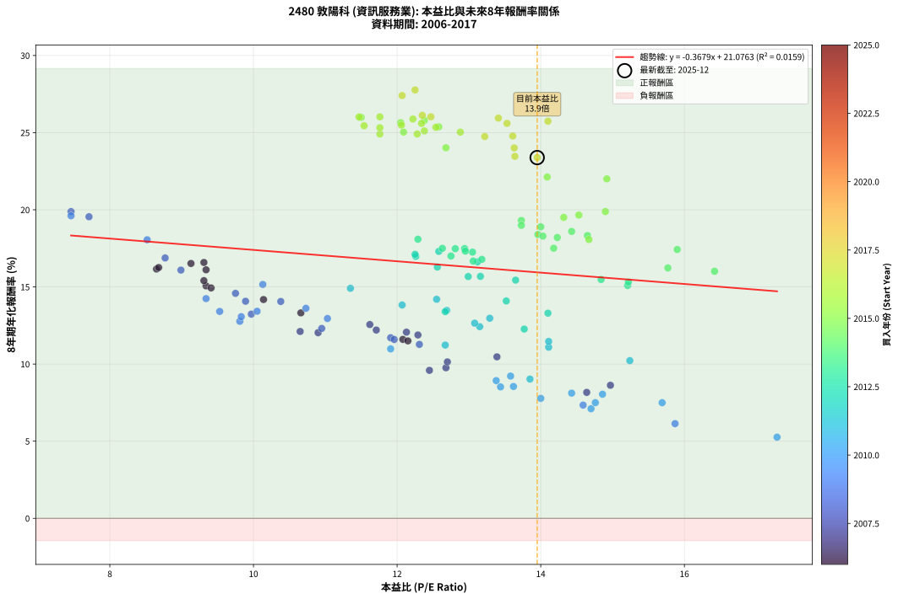
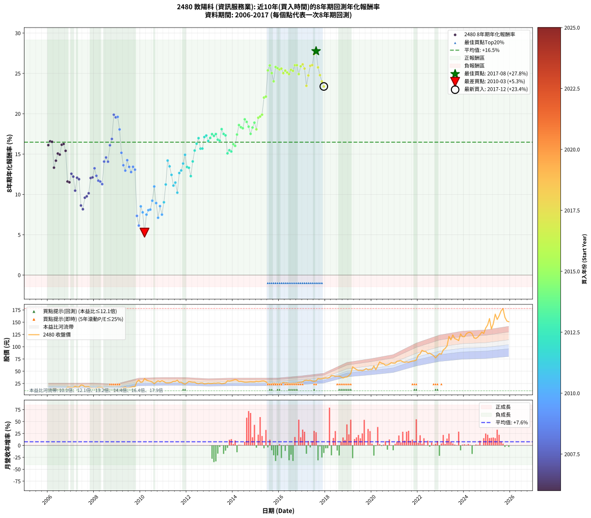

# 2480 敦陽科 - 本益比與未來報酬率分析

!!! info "報告資訊"
    - **股票代號**: 2480
    - **公司名稱**: 敦陽科
    - **產業別**: 資訊服務業
    - **分析期間**: 2006-2017 (144 個數據點)
    - **資料來源**: Type 12 (ShowMonthlyK_ChartFlow) 月收盤價與本益比
    - **報酬率口徑**: 含現金股利 (簡化: 年度合計，假設每年7/1入帳)
    - **報告生成時間**: 2026-01-05 00:43:37 CST

## 📈 視覺化圖表

### 圖表1: 本益比 vs 未來報酬率關係

*圖表1：2480 敦陽科 本益比與8年期未來報酬率關係 (2006-2017)*

### 圖表2: 歷年買入時點的8年期實際報酬率

*圖表2：2480 敦陽科 歷年買入時點的8年期實際報酬率 (2006-2017)*

## 📍 買點訊號說明

本報告提供兩種買點提示訊號（顯示於圖表2的股價子圖中）：

### ▲ 小綠色三角形（回測驗證）
- **計算方式**: 使用全部歷史資料計算本益比第25百分位數
- **用途**: 事後驗證，顯示歷史上哪些時點確實為低估區
- **限制**: 當下無法判斷，僅供回測參考
- **特性**: 後見之明（Look-Ahead Bias）

### ▲ 小橘色三角形（即時訊號）
- **計算方式**: 使用截至當月的過去5年資料計算本益比第25百分位數
- **用途**: 實際投資決策，當時即可判斷
- **優勢**: 可操作性強，符合實務需求
- **特性**: 無後見之明，滾動窗口計算

!!! tip "如何使用兩種訊號"
    - **綠色▲** 幫助理解歷史估值機會，驗證策略有效性
    - **橘色▲** 可作為實際買進參考，但仍需搭配基本面分析
    - 兩種訊號重疊時，表示即時判斷與事後驗證一致，信心度較高
    - 僅有綠色▲時，表示當時無法判斷（需要未來資料才能確認）
    - 僅有橘色▲時，表示即時判斷為買點，但事後可能不是最佳時機

## 📊 估值分析摘要

| 指標 | 數值 |
|:---:|:---:|
| **目前本益比** (2017-12) | **13.95 倍** |
| **歷史平均本益比** | 12.51 倍 |
| **估值水準** | 🟡 合理範圍 |
| **預期8年年化報酬率** | **+15.94%** |
| **歷史平均報酬率** | +16.47% |
| **相關係數 (R²)** | 0.0159 |
| **趨勢線斜率** | -0.3679 |

!!! abstract "核心洞察"
    目前本益比接近歷史平均，預期報酬率符合長期趨勢

    根據歷史數據回測，2480 敦陽科 在目前本益比 **13.9倍** 的估值水準下，
    預期未來8年年化報酬率約為 **+15.9%**。

    **重要提醒**: 本分析基於歷史數據統計，實際報酬率會受到公司基本面變化、產業趨勢、
    總體經濟環境等多重因素影響。R² = 0.02 表示本益比可解釋約 1.6% 的報酬率變異。

## 📈 歷史估值統計

### 最佳買點 (最高報酬率)

| 項目 | 數值 |
|:---:|:---:|
| 起始時間 | 2017-08 |
| 當時本益比 | 12.25 倍 |
| 起始價格 | 30.1 元 |
| 8年後價格 | 173.0 元 |
| **8年年化報酬率** | **+27.77%** |

### 最差買點 (最低報酬率)

| 項目 | 數值 |
|:---:|:---:|
| 起始時間 | 2010-03 |
| 當時本益比 | 17.29 倍 |
| 起始價格 | 35.0 元 |
| 8年後價格 | 37.1 元 |
| **8年年化報酬率** | **+5.26%** |

## 🎯 投資啟示

### 本益比與報酬率關係

趨勢線方程式: **y = -0.3679x + 21.0763**

!!! note "負相關"
    本益比與未來報酬率呈現負相關。較低的本益比通常帶來較高的未來報酬率，
    但相關性不算非常強。**估值仍是重要參考指標之一**。

### 估值區間建議

基於歷史數據分析:

- **🟢 低估區** (P/E < 10.0): 預期報酬率較高，可考慮增加持股
- **🟡 合理區** (P/E 10.0-15.0): 預期報酬率符合長期趨勢，正常持有
- **🔴 高估區** (P/E > 15.0): 預期報酬率較低，可考慮減碼或觀望

!!! danger "風險提示"
    - 過去表現不代表未來結果
    - 本分析假設公司基本面無重大結構性變化
    - 產業環境劇變可能使歷史規律失效
    - 應結合公司財報、產業趨勢、總體經濟等多重因素綜合判斷

!!! success "長期投資觀點"
    歷史數據顯示，在合理或低估的估值水準買入並長期持有，
    往往能獲得較佳的投資報酬。**耐心等待好價格**是價值投資的核心原則。

## 📊 數據品質

- **資料來源**: GoodInfo.tw Type 12 (ShowMonthlyK_ChartFlow)
- **資料頻率**: 月度收盤價與本益比
- **回測期間**: 2006-2017
- **數據點數量**: 144 個 (每個點代表一次8年期回測)

### 計算方法說明

1. **8年期年化報酬率**:
   - 對每個歷史時點，計算其後8年的實際投資報酬率
   - 期末價值(不含股利): 期末價格
   - 期末價值(含現金股利): 期末價格 + 持有期間內的現金股利合計 (簡化: 年度合計，假設每年7/1入帳)
   - 公式: 年化報酬率 = [(期末價值/期初價格)^(1/年數) - 1] × 100%

2. **本益比 (P/E Ratio)**:
   - 使用當時的月收盤價與EPS計算
   - 資料來源: Type 12 月度河流圖本益比數據

3. **趨勢線 (Linear Regression)**:
   - 使用最小平方法擬合線性趨勢線
   - R²值衡量本益比對報酬率的解釋能力

---

*本報告由 Stock Analysis System v1.9.0 自動生成*
*數據更新時間: 2026-01-05 00:43:37 CST*

## 📋 月度回測明細表

（每一列對應時間線圖中的一個買入點；可用來對照 SVG 圖上的每個點。）

| 買入月份 | 賣出月份 | 回測期限_年 | 實際持有年數 | 買入本益比_倍 | 買入收盤價_元 | 賣出收盤價_元 | 現金股利合計_元 | 總報酬率_pct | 年化報酬率_pct |
| --- | --- | --- | --- | --- | --- | --- | --- | --- | --- |
| 2006-01 | 2014-01 | 8 | 8.000 | 9.34 | 13.45 | 31.70 | 12.73 | +230.33 | +16.11 |
| 2006-02 | 2014-02 | 8 | 8.000 | 9.31 | 13.40 | 33.00 | 12.73 | +241.27 | +16.58 |
| 2006-03 | 2014-03 | 8 | 8.000 | 9.13 | 13.15 | 31.95 | 12.73 | +239.77 | +16.52 |
| 2006-04 | 2014-04 | 8 | 8.000 | 10.66 | 15.35 | 29.00 | 12.73 | +171.86 | +13.32 |
| 2006-05 | 2014-05 | 8 | 8.000 | 10.14 | 14.60 | 29.45 | 12.73 | +188.90 | +14.18 |
| 2006-06 | 2014-06 | 8 | 8.000 | 9.34 | 13.45 | 28.60 | 12.73 | +207.29 | +15.06 |
| 2006-07 | 2014-07 | 8 | 8.000 | 9.41 | 13.55 | 27.60 | 13.66 | +204.50 | +14.93 |
| 2006-08 | 2014-08 | 8 | 8.000 | 8.65 | 12.45 | 27.60 | 13.66 | +231.41 | +16.16 |
| 2006-09 | 2014-09 | 8 | 8.000 | 8.68 | 12.50 | 28.05 | 13.66 | +233.68 | +16.26 |
| 2006-10 | 2014-10 | 8 | 8.000 | 9.31 | 13.40 | 28.50 | 13.66 | +214.63 | +15.40 |
| 2006-11 | 2014-11 | 8 | 8.000 | 12.08 | 17.40 | 28.20 | 13.66 | +140.57 | +11.60 |
| 2006-12 | 2014-12 | 8 | 8.000 | 12.15 | 17.50 | 28.15 | 13.66 | +138.91 | +11.50 |
| 2007-01 | 2015-01 | 8 | 8.000 | 11.62 | 16.75 | 29.50 | 13.66 | +157.67 | +12.56 |
| 2007-02 | 2015-02 | 8 | 8.000 | 11.71 | 16.90 | 28.80 | 13.66 | +151.24 | +12.20 |
| 2007-03 | 2015-03 | 8 | 8.000 | 13.39 | 19.35 | 29.25 | 13.66 | +121.76 | +10.47 |
| 2007-04 | 2015-04 | 8 | 8.000 | 12.13 | 17.55 | 30.00 | 13.66 | +148.77 | +12.07 |
| 2007-05 | 2015-05 | 8 | 8.000 | 12.29 | 17.80 | 30.05 | 13.66 | +145.56 | +11.88 |
| 2007-06 | 2015-06 | 8 | 8.000 | 14.97 | 21.70 | 28.40 | 13.66 | +93.82 | +8.62 |
| 2007-07 | 2015-07 | 8 | 8.000 | 14.64 | 21.25 | 25.35 | 14.46 | +87.34 | +8.16 |
| 2007-08 | 2015-08 | 8 | 8.000 | 12.45 | 18.10 | 23.20 | 14.46 | +108.07 | +9.59 |
| 2007-09 | 2015-09 | 8 | 8.000 | 12.68 | 18.45 | 24.40 | 14.46 | +110.62 | +9.76 |
| 2007-10 | 2015-10 | 8 | 8.000 | 12.70 | 18.50 | 25.60 | 14.46 | +116.54 | +10.14 |
| 2007-11 | 2015-11 | 8 | 8.000 | 10.90 | 15.90 | 25.00 | 14.46 | +148.18 | +12.03 |
| 2007-12 | 2015-12 | 8 | 8.000 | 10.65 | 15.55 | 24.35 | 14.46 | +149.58 | +12.11 |
| 2008-01 | 2016-01 | 8 | 8.000 | 9.97 | 14.45 | 24.60 | 14.46 | +170.31 | +13.24 |
| 2008-02 | 2016-02 | 8 | 8.000 | 10.95 | 15.75 | 25.40 | 14.46 | +153.08 | +12.31 |
| 2008-03 | 2016-03 | 8 | 8.000 | 11.91 | 17.00 | 26.75 | 14.46 | +142.41 | +11.70 |
| 2008-04 | 2016-04 | 8 | 8.000 | 11.96 | 16.95 | 26.30 | 14.46 | +140.47 | +11.59 |
| 2008-05 | 2016-05 | 8 | 8.000 | 12.31 | 17.30 | 26.20 | 14.46 | +135.03 | +11.27 |
| 2008-06 | 2016-06 | 8 | 8.000 | 9.89 | 13.80 | 25.10 | 14.46 | +186.67 | +14.07 |
| 2008-07 | 2016-07 | 8 | 8.000 | 9.75 | 13.50 | 24.85 | 15.26 | +197.11 | +14.58 |
| 2008-08 | 2016-08 | 8 | 8.000 | 10.38 | 14.25 | 25.55 | 15.26 | +186.39 | +14.06 |
| 2008-09 | 2016-09 | 8 | 8.000 | 8.99 | 12.25 | 25.15 | 15.26 | +229.88 | +16.09 |
| 2008-10 | 2016-10 | 8 | 8.000 | 8.77 | 11.85 | 26.00 | 15.26 | +248.19 | +16.88 |
| 2008-11 | 2016-11 | 8 | 8.000 | 7.46 | 10.00 | 27.40 | 15.26 | +326.60 | +19.88 |
| 2008-12 | 2016-12 | 8 | 8.000 | 7.71 | 10.25 | 27.50 | 15.26 | +317.17 | +19.55 |
| 2009-01 | 2017-01 | 8 | 8.000 | 7.46 | 10.35 | 28.10 | 15.26 | +318.94 | +19.61 |
| 2009-02 | 2017-02 | 8 | 8.000 | 8.52 | 12.30 | 31.15 | 15.26 | +277.32 | +18.06 |
| 2009-03 | 2017-03 | 8 | 8.000 | 10.13 | 15.20 | 31.75 | 15.26 | +209.28 | +15.16 |
| 2009-04 | 2017-04 | 8 | 8.000 | 10.73 | 16.70 | 31.10 | 15.26 | +177.60 | +13.61 |
| 2009-05 | 2017-05 | 8 | 8.000 | 11.03 | 17.80 | 31.90 | 15.26 | +164.94 | +12.95 |
| 2009-06 | 2017-06 | 8 | 8.000 | 9.34 | 15.60 | 30.00 | 15.26 | +190.13 | +14.24 |
| 2009-07 | 2017-07 | 8 | 8.000 | 9.53 | 16.45 | 29.35 | 15.67 | +173.68 | +13.41 |
| 2009-08 | 2017-08 | 8 | 8.000 | 9.81 | 17.50 | 30.10 | 15.67 | +161.54 | +12.77 |
| 2009-09 | 2017-09 | 8 | 8.000 | 10.05 | 18.50 | 35.00 | 15.67 | +173.89 | +13.42 |
| 2009-10 | 2017-10 | 8 | 8.000 | 9.83 | 18.65 | 34.15 | 15.67 | +167.13 | +13.07 |
| 2009-11 | 2017-11 | 8 | 8.000 | 14.59 | 28.50 | 34.55 | 15.67 | +76.21 | +7.34 |
| 2009-12 | 2017-12 | 8 | 8.000 | 15.87 | 31.90 | 35.70 | 15.67 | +61.03 | +6.14 |
| 2010-01 | 2018-01 | 8 | 8.000 | 13.44 | 27.10 | 36.45 | 15.67 | +92.32 | +8.52 |
| 2010-02 | 2018-02 | 8 | 8.000 | 14.00 | 28.30 | 35.85 | 15.67 | +82.05 | +7.78 |
| 2010-03 | 2018-03 | 8 | 8.000 | 17.29 | 35.05 | 37.15 | 15.67 | +50.70 | +5.26 |
| 2010-04 | 2018-04 | 8 | 8.000 | 15.69 | 31.90 | 41.20 | 15.67 | +78.28 | +7.49 |
| 2010-05 | 2018-05 | 8 | 8.000 | 14.86 | 30.30 | 40.60 | 15.67 | +85.71 | +8.04 |
| 2010-06 | 2018-06 | 8 | 8.000 | 14.43 | 29.50 | 39.40 | 15.67 | +86.68 | +8.12 |
| 2010-07 | 2018-07 | 8 | 8.000 | 13.58 | 27.85 | 39.90 | 16.49 | +102.48 | +9.22 |
| 2010-08 | 2018-08 | 8 | 8.000 | 11.91 | 24.50 | 39.90 | 16.49 | +130.16 | +10.98 |
| 2010-09 | 2018-09 | 8 | 8.000 | 13.38 | 27.60 | 38.20 | 16.49 | +98.15 | +8.92 |
| 2010-10 | 2018-10 | 8 | 8.000 | 14.70 | 30.40 | 36.15 | 16.49 | +73.16 | +7.10 |
| 2010-11 | 2018-11 | 8 | 8.000 | 13.62 | 28.25 | 37.95 | 16.49 | +92.71 | +8.55 |
| 2010-12 | 2018-12 | 8 | 8.000 | 14.76 | 30.70 | 38.25 | 16.49 | +78.31 | +7.50 |
| 2011-01 | 2019-01 | 8 | 8.000 | 13.85 | 28.80 | 41.00 | 16.49 | +99.62 | +9.02 |
| 2011-02 | 2019-02 | 8 | 8.000 | 12.67 | 26.35 | 45.25 | 16.49 | +134.31 | +11.23 |
| 2011-03 | 2019-03 | 8 | 8.000 | 12.55 | 26.10 | 59.00 | 16.49 | +189.23 | +14.20 |
| 2011-04 | 2019-04 | 8 | 8.000 | 12.69 | 26.40 | 56.10 | 16.49 | +174.96 | +13.48 |
| 2011-05 | 2019-05 | 8 | 8.000 | 13.15 | 27.35 | 53.30 | 16.49 | +155.17 | +12.42 |
| 2011-06 | 2019-06 | 8 | 8.000 | 14.11 | 29.35 | 51.60 | 16.49 | +131.99 | +11.09 |
| 2011-07 | 2019-07 | 8 | 8.000 | 14.11 | 29.35 | 51.90 | 18.04 | +138.30 | +11.47 |
| 2011-08 | 2019-08 | 8 | 8.000 | 15.24 | 31.70 | 51.00 | 18.04 | +117.79 | +10.22 |
| 2011-09 | 2019-09 | 8 | 8.000 | 13.08 | 27.20 | 52.50 | 18.04 | +159.34 | +12.65 |
| 2011-10 | 2019-10 | 8 | 8.000 | 13.29 | 27.65 | 55.30 | 18.04 | +165.24 | +12.97 |
| 2011-11 | 2019-11 | 8 | 8.000 | 12.07 | 25.10 | 52.70 | 18.04 | +181.83 | +13.83 |
| 2011-12 | 2019-12 | 8 | 8.000 | 11.35 | 23.60 | 53.70 | 18.04 | +203.98 | +14.91 |
| 2012-01 | 2020-01 | 8 | 8.000 | 12.67 | 26.20 | 53.60 | 18.04 | +173.44 | +13.40 |
| 2012-02 | 2020-02 | 8 | 8.000 | 14.10 | 29.00 | 60.70 | 18.04 | +171.52 | +13.30 |
| 2012-03 | 2020-03 | 8 | 8.000 | 13.77 | 28.15 | 53.00 | 18.04 | +152.36 | +12.27 |
| 2012-04 | 2020-04 | 8 | 8.000 | 13.52 | 27.50 | 60.90 | 18.04 | +187.05 | +14.09 |
| 2012-05 | 2020-05 | 8 | 8.000 | 13.65 | 27.60 | 69.00 | 18.04 | +215.36 | +15.44 |
| 2012-06 | 2020-06 | 8 | 8.000 | 12.56 | 25.25 | 66.40 | 18.04 | +234.42 | +16.29 |
| 2012-07 | 2020-07 | 8 | 8.000 | 12.26 | 24.50 | 65.30 | 20.59 | +250.57 | +16.98 |
| 2012-08 | 2020-08 | 8 | 8.000 | 12.99 | 25.80 | 62.10 | 20.59 | +220.50 | +15.67 |
| 2012-09 | 2020-09 | 8 | 8.000 | 13.16 | 26.00 | 62.80 | 20.59 | +220.73 | +15.68 |
| 2012-10 | 2020-10 | 8 | 8.000 | 12.25 | 24.05 | 64.50 | 20.59 | +253.80 | +17.11 |
| 2012-11 | 2020-11 | 8 | 8.000 | 12.58 | 24.55 | 67.40 | 20.59 | +258.41 | +17.30 |
| 2012-12 | 2020-12 | 8 | 8.000 | 13.12 | 25.45 | 66.50 | 20.59 | +242.20 | +16.62 |
| 2013-01 | 2021-01 | 8 | 8.000 | 12.75 | 24.80 | 66.50 | 20.59 | +251.17 | +17.00 |
| 2013-02 | 2021-02 | 8 | 8.000 | 12.81 | 25.00 | 70.10 | 20.59 | +262.76 | +17.48 |
| 2013-03 | 2021-03 | 8 | 8.000 | 13.05 | 25.55 | 70.70 | 20.59 | +257.30 | +17.25 |
| 2013-04 | 2021-04 | 8 | 8.000 | 12.94 | 25.40 | 71.60 | 20.59 | +262.95 | +17.48 |
| 2013-05 | 2021-05 | 8 | 8.000 | 13.18 | 25.95 | 69.20 | 20.59 | +246.01 | +16.78 |
| 2013-06 | 2021-06 | 8 | 8.000 | 13.06 | 25.80 | 68.00 | 20.59 | +243.37 | +16.67 |
| 2013-07 | 2021-07 | 8 | 8.000 | 12.29 | 24.35 | 69.20 | 22.89 | +278.19 | +18.09 |
| 2013-08 | 2021-08 | 8 | 8.000 | 12.63 | 25.10 | 68.30 | 22.89 | +263.31 | +17.50 |
| 2013-09 | 2021-09 | 8 | 8.000 | 12.95 | 25.80 | 69.70 | 22.89 | +258.88 | +17.32 |
| 2013-10 | 2021-10 | 8 | 8.000 | 15.21 | 30.40 | 70.70 | 22.89 | +207.86 | +15.09 |
| 2013-11 | 2021-11 | 8 | 8.000 | 14.84 | 29.75 | 71.20 | 22.89 | +216.27 | +15.48 |
| 2013-12 | 2021-12 | 8 | 8.000 | 15.22 | 30.60 | 72.80 | 22.89 | +212.71 | +15.32 |
| 2014-01 | 2022-01 | 8 | 8.000 | 15.77 | 31.70 | 82.70 | 22.89 | +233.09 | +16.23 |
| 2014-02 | 2022-02 | 8 | 8.000 | 16.42 | 33.00 | 85.40 | 22.89 | +228.15 | +16.01 |
| 2014-03 | 2022-03 | 8 | 8.000 | 15.90 | 31.95 | 92.60 | 22.89 | +261.47 | +17.42 |
| 2014-04 | 2022-04 | 8 | 8.000 | 14.43 | 29.00 | 90.60 | 22.89 | +291.34 | +18.60 |
| 2014-05 | 2022-05 | 8 | 8.000 | 14.65 | 29.45 | 90.30 | 22.89 | +284.35 | +18.33 |
| 2014-06 | 2022-06 | 8 | 8.000 | 14.23 | 28.60 | 86.10 | 22.89 | +281.08 | +18.20 |
| 2014-07 | 2022-07 | 8 | 8.000 | 13.73 | 27.60 | 86.80 | 26.51 | +310.54 | +19.31 |
| 2014-08 | 2022-08 | 8 | 8.000 | 13.73 | 27.60 | 84.40 | 26.51 | +301.85 | +18.99 |
| 2014-09 | 2022-09 | 8 | 8.000 | 13.96 | 28.05 | 81.80 | 26.51 | +286.13 | +18.40 |
| 2014-10 | 2022-10 | 8 | 8.000 | 14.18 | 28.50 | 77.10 | 26.51 | +263.54 | +17.51 |
| 2014-11 | 2022-11 | 8 | 8.000 | 14.03 | 28.20 | 81.60 | 26.51 | +283.37 | +18.29 |
| 2014-12 | 2022-12 | 8 | 8.000 | 14.00 | 28.15 | 85.90 | 26.51 | +299.33 | +18.90 |
| 2015-01 | 2023-01 | 8 | 8.000 | 14.67 | 29.50 | 84.90 | 26.51 | +277.66 | +18.07 |
| 2015-02 | 2023-02 | 8 | 8.000 | 14.32 | 28.80 | 93.30 | 26.51 | +316.01 | +19.51 |
| 2015-03 | 2023-03 | 8 | 8.000 | 14.53 | 29.25 | 96.40 | 26.51 | +320.21 | +19.66 |
| 2015-04 | 2023-04 | 8 | 8.000 | 14.90 | 30.00 | 101.50 | 26.51 | +326.70 | +19.89 |
| 2015-05 | 2023-05 | 8 | 8.000 | 14.92 | 30.05 | 121.00 | 26.51 | +390.88 | +22.00 |
| 2015-06 | 2023-06 | 8 | 8.000 | 14.09 | 28.40 | 114.00 | 26.51 | +394.75 | +22.12 |
| 2015-07 | 2023-07 | 8 | 8.000 | 12.58 | 25.35 | 124.00 | 30.77 | +510.53 | +25.38 |
| 2015-08 | 2023-08 | 8 | 8.000 | 11.50 | 23.20 | 116.50 | 30.77 | +534.78 | +25.99 |
| 2015-09 | 2023-09 | 8 | 8.000 | 12.09 | 24.40 | 115.00 | 30.77 | +497.42 | +25.04 |
| 2015-10 | 2023-10 | 8 | 8.000 | 12.68 | 25.60 | 112.50 | 30.77 | +459.65 | +24.02 |
| 2015-11 | 2023-11 | 8 | 8.000 | 12.38 | 25.00 | 126.00 | 30.77 | +527.08 | +25.80 |
| 2015-12 | 2023-12 | 8 | 8.000 | 12.05 | 24.35 | 120.50 | 30.77 | +521.23 | +25.65 |
| 2016-01 | 2024-01 | 8 | 8.000 | 12.06 | 24.60 | 120.50 | 30.77 | +514.92 | +25.49 |
| 2016-02 | 2024-02 | 8 | 8.000 | 12.34 | 25.40 | 126.50 | 30.77 | +519.17 | +25.60 |
| 2016-03 | 2024-03 | 8 | 8.000 | 12.88 | 26.75 | 129.00 | 30.77 | +497.27 | +25.03 |
| 2016-04 | 2024-04 | 8 | 8.000 | 12.54 | 26.30 | 129.50 | 30.77 | +509.39 | +25.35 |
| 2016-05 | 2024-05 | 8 | 8.000 | 12.38 | 26.20 | 126.50 | 30.77 | +500.27 | +25.11 |
| 2016-06 | 2024-06 | 8 | 8.000 | 11.76 | 25.10 | 118.00 | 30.77 | +492.71 | +24.91 |
| 2016-07 | 2024-07 | 8 | 8.000 | 11.54 | 24.85 | 117.00 | 35.41 | +513.32 | +25.45 |
| 2016-08 | 2024-08 | 8 | 8.000 | 11.76 | 25.55 | 120.00 | 35.41 | +508.26 | +25.32 |
| 2016-09 | 2024-09 | 8 | 8.000 | 11.47 | 25.15 | 124.50 | 35.41 | +535.83 | +26.01 |
| 2016-10 | 2024-10 | 8 | 8.000 | 11.76 | 26.00 | 130.00 | 35.41 | +536.19 | +26.02 |
| 2016-11 | 2024-11 | 8 | 8.000 | 12.28 | 27.40 | 127.00 | 35.41 | +492.74 | +24.91 |
| 2016-12 | 2024-12 | 8 | 8.000 | 12.22 | 27.50 | 138.00 | 35.41 | +530.58 | +25.88 |
| 2017-01 | 2025-01 | 8 | 8.000 | 12.35 | 28.10 | 144.50 | 35.41 | +540.25 | +26.12 |
| 2017-02 | 2025-02 | 8 | 8.000 | 13.53 | 31.15 | 157.50 | 35.41 | +519.29 | +25.60 |
| 2017-03 | 2025-03 | 8 | 8.000 | 13.64 | 31.75 | 136.00 | 35.41 | +439.87 | +23.46 |
| 2017-04 | 2025-04 | 8 | 8.000 | 13.22 | 31.10 | 147.00 | 35.41 | +486.53 | +24.75 |
| 2017-05 | 2025-05 | 8 | 8.000 | 13.41 | 31.90 | 166.50 | 35.41 | +532.95 | +25.94 |
| 2017-06 | 2025-06 | 8 | 8.000 | 12.47 | 30.00 | 155.50 | 35.41 | +536.37 | +26.03 |
| 2017-07 | 2025-07 | 8 | 8.000 | 12.07 | 29.35 | 163.00 | 40.73 | +594.15 | +27.40 |
| 2017-08 | 2025-08 | 8 | 8.000 | 12.25 | 30.10 | 173.00 | 40.73 | +610.07 | +27.77 |
| 2017-09 | 2025-09 | 8 | 8.000 | 14.10 | 35.00 | 178.00 | 40.73 | +524.95 | +25.74 |
| 2017-10 | 2025-10 | 8 | 8.000 | 13.61 | 34.15 | 160.00 | 40.73 | +487.80 | +24.78 |
| 2017-11 | 2025-11 | 8 | 8.000 | 13.63 | 34.55 | 152.50 | 40.73 | +459.28 | +24.01 |
| 2017-12 | 2025-12 | 8 | 8.000 | 13.95 | 35.70 | 151.00 | 40.73 | +437.06 | +23.38 |
