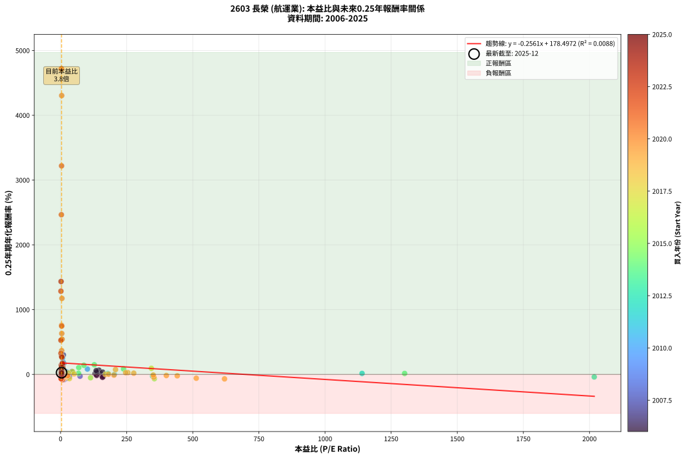
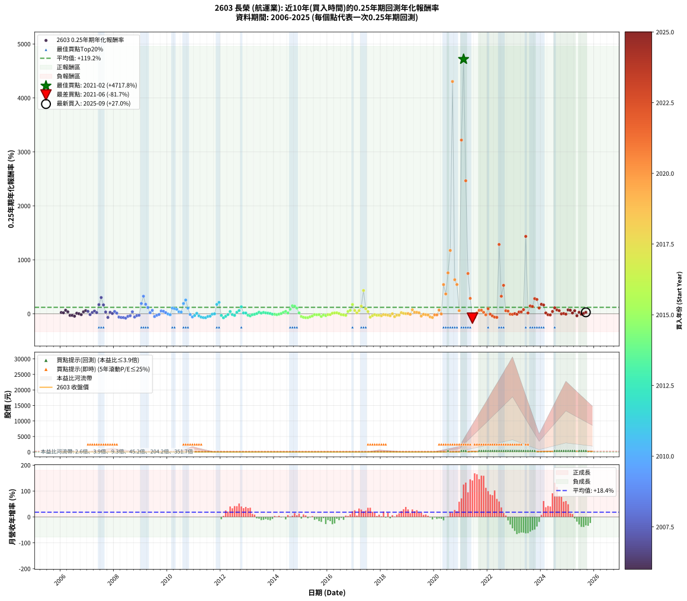

# 2603 長榮 - 本益比與未來報酬率分析

!!! info "報告資訊"
    - **股票代號**: 2603
    - **公司名稱**: 長榮
    - **產業別**: 航運業
    - **分析期間**: 2006-2025 (237 個數據點)
    - **資料來源**: Type 12 (ShowMonthlyK_ChartFlow) 月收盤價與本益比
    - **報酬率口徑**: 含現金股利 (簡化: 年度合計，假設每年7/1入帳)
    - **報告生成時間**: 2026-01-06 22:44:25 CST

## 📈 視覺化圖表

### 圖表1: 本益比 vs 未來報酬率關係

*圖表1：2603 長榮 本益比與0.25年期未來報酬率關係 (2006-2025)*

### 圖表2: 歷年買入時點的0.25年期實際報酬率

*圖表2：2603 長榮 歷年買入時點的0.25年期實際報酬率 (2006-2025)*

## 📍 買點訊號說明

本報告提供兩種買點提示訊號（顯示於圖表2的股價子圖中）：

### ▲ 小綠色三角形（回測驗證）
- **計算方式**: 使用全部歷史資料計算本益比第25百分位數
- **用途**: 事後驗證，顯示歷史上哪些時點確實為低估區
- **限制**: 當下無法判斷，僅供回測參考
- **特性**: 後見之明（Look-Ahead Bias）

### ▲ 小橘色三角形（即時訊號）
- **計算方式**: 使用截至當月的過去5年資料計算本益比第25百分位數
- **用途**: 實際投資決策，當時即可判斷
- **優勢**: 可操作性強，符合實務需求
- **特性**: 無後見之明，滾動窗口計算

!!! tip "如何使用兩種訊號"
    - **綠色▲** 幫助理解歷史估值機會，驗證策略有效性
    - **橘色▲** 可作為實際買進參考，但仍需搭配基本面分析
    - 兩種訊號重疊時，表示即時判斷與事後驗證一致，信心度較高
    - 僅有綠色▲時，表示當時無法判斷（需要未來資料才能確認）
    - 僅有橘色▲時，表示即時判斷為買點，但事後可能不是最佳時機

## 📊 估值分析摘要

| 指標 | 數值 |
|:---:|:---:|
| **目前本益比** (2025-09) | **3.76 倍** |
| **歷史平均本益比** | 83.73 倍 |
| **估值水準** | 🟢 相對低估 |
| **預期0.25年年化報酬率** | **+177.53%** |
| **歷史平均報酬率** | +119.17% |
| **相關係數 (R²)** | 0.0088 |
| **趨勢線斜率** | -0.2561 |

!!! abstract "核心洞察"
    目前本益比顯著低於歷史平均，預期未來報酬率可能較高

    根據歷史數據回測，2603 長榮 在目前本益比 **3.8倍** 的估值水準下，
    預期未來0.25年年化報酬率約為 **+177.5%**。

    **重要提醒**: 本分析基於歷史數據統計，實際報酬率會受到公司基本面變化、產業趨勢、
    總體經濟環境等多重因素影響。R² = 0.01 表示本益比可解釋約 0.9% 的報酬率變異。

## 📈 歷史估值統計

### 最佳買點 (最高報酬率)

| 項目 | 數值 |
|:---:|:---:|
| 起始時間 | 2021-02 |
| 當時本益比 | 3.21 倍 |
| 起始價格 | 38.0 元 |
| 0.25年後價格 | 98.6 元 |
| **0.25年年化報酬率** | **+4717.81%** |

### 最差買點 (最低報酬率)

| 項目 | 數值 |
|:---:|:---:|
| 起始時間 | 2021-06 |
| 當時本益比 | 7.78 倍 |
| 起始價格 | 197.0 元 |
| 0.25年後價格 | 126.0 元 |
| **0.25年年化報酬率** | **-81.67%** |

## 🎯 投資啟示

### 本益比與報酬率關係

趨勢線方程式: **y = -0.2561x + 178.4972**

!!! note "負相關"
    本益比與未來報酬率呈現負相關。較低的本益比通常帶來較高的未來報酬率，
    但相關性不算非常強。**估值仍是重要參考指標之一**。

### 估值區間建議

基於歷史數據分析:

- **🟢 低估區** (P/E < 67.0): 預期報酬率較高，可考慮增加持股
- **🟡 合理區** (P/E 67.0-100.5): 預期報酬率符合長期趨勢，正常持有
- **🔴 高估區** (P/E > 100.5): 預期報酬率較低，可考慮減碼或觀望

!!! danger "風險提示"
    - 過去表現不代表未來結果
    - 本分析假設公司基本面無重大結構性變化
    - 產業環境劇變可能使歷史規律失效
    - 應結合公司財報、產業趨勢、總體經濟等多重因素綜合判斷

!!! success "長期投資觀點"
    歷史數據顯示，在合理或低估的估值水準買入並長期持有，
    往往能獲得較佳的投資報酬。**耐心等待好價格**是價值投資的核心原則。

## 📊 數據品質

- **資料來源**: GoodInfo.tw Type 12 (ShowMonthlyK_ChartFlow)
- **資料頻率**: 月度收盤價與本益比
- **回測期間**: 2006-2025
- **數據點數量**: 237 個 (每個點代表一次0.25年期回測)

### 計算方法說明

1. **0.25年期年化報酬率**:
   - 對每個歷史時點，計算其後0.25年的實際投資報酬率
   - 期末價值(不含股利): 期末價格
   - 期末價值(含現金股利): 期末價格 + 持有期間內的現金股利合計 (簡化: 年度合計，假設每年7/1入帳)
   - 公式: 年化報酬率 = [(期末價值/期初價格)^(1/年數) - 1] × 100%

2. **本益比 (P/E Ratio)**:
   - 使用當時的月收盤價與EPS計算
   - 資料來源: Type 12 月度河流圖本益比數據

3. **趨勢線 (Linear Regression)**:
   - 使用最小平方法擬合線性趨勢線
   - R²值衡量本益比對報酬率的解釋能力

---

*本報告由 Stock Analysis System v1.9.0 自動生成*
*數據更新時間: 2026-01-06 22:44:25 CST*

## 📋 月度回測明細表

（每一列對應時間線圖中的一個買入點；可用來對照 SVG 圖上的每個點。）

| 買入月份 | 賣出月份 | 回測期限_年 | 實際持有年數 | 買入本益比_倍 | 買入收盤價_元 | 賣出收盤價_元 | 現金股利合計_元 | 總報酬率_pct | 年化報酬率_pct |
| --- | --- | --- | --- | --- | --- | --- | --- | --- | --- |
| 2006-01 | 2006-05 | 0.25 | 0.329 | 146.80 | 20.55 | 22.00 | 0.00 | +7.06 | +23.06 |
| 2006-02 | 2006-05 | 0.25 | 0.246 | 150.70 | 21.10 | 22.00 | 0.00 | +4.27 | +18.47 |
| 2006-03 | 2006-07 | 0.25 | 0.334 | 145.00 | 20.30 | 22.20 | 1.80 | +18.23 | +65.08 |
| 2006-04 | 2006-07 | 0.25 | 0.249 | 158.90 | 22.25 | 22.20 | 1.80 | +7.87 | +35.51 |
| 2006-05 | 2006-08 | 0.25 | 0.252 | 157.10 | 22.00 | 18.25 | 1.80 | -8.86 | -30.82 |
| 2006-06 | 2006-09 | 0.25 | 0.252 | 161.40 | 22.60 | 18.85 | 1.80 | -8.63 | -30.11 |
| 2006-07 | 2006-10 | 0.25 | 0.252 | 158.60 | 22.20 | 19.10 | 0.00 | -13.96 | -44.96 |
| 2006-08 | 2006-12 | 0.25 | 0.334 | 130.40 | 18.25 | 18.85 | 0.00 | +3.29 | +10.17 |
| 2006-09 | 2006-12 | 0.25 | 0.249 | 134.60 | 18.85 | 18.85 | 0.00 | +0.00 | +0.00 |
| 2006-10 | 2007-01 | 0.25 | 0.252 | 136.40 | 19.10 | 18.30 | 0.00 | -4.19 | -15.62 |
| 2006-11 | 2007-03 | 0.25 | 0.329 | 136.40 | 19.10 | 21.10 | 0.00 | +10.47 | +35.41 |
| 2006-12 | 2007-03 | 0.25 | 0.246 | 134.60 | 18.85 | 21.10 | 0.00 | +11.94 | +58.03 |
| 2007-01 | 2007-05 | 0.25 | 0.329 | 43.31 | 18.30 | 20.65 | 0.00 | +12.84 | +44.44 |
| 2007-02 | 2007-05 | 0.25 | 0.246 | 30.50 | 21.50 | 20.65 | 0.00 | -3.95 | -15.10 |
| 2007-03 | 2007-07 | 0.25 | 0.334 | 21.37 | 21.10 | 22.35 | 0.30 | +7.35 | +23.64 |
| 2007-04 | 2007-07 | 0.25 | 0.249 | 16.10 | 20.45 | 22.35 | 0.30 | +10.76 | +50.70 |
| 2007-05 | 2007-08 | 0.25 | 0.252 | 13.30 | 20.65 | 21.40 | 0.30 | +5.08 | +21.76 |
| 2007-06 | 2007-09 | 0.25 | 0.252 | 11.85 | 21.75 | 27.60 | 0.30 | +28.28 | +168.75 |
| 2007-07 | 2007-10 | 0.25 | 0.252 | 10.55 | 22.35 | 31.70 | 0.00 | +41.83 | +300.49 |
| 2007-08 | 2007-12 | 0.25 | 0.334 | 8.92 | 21.40 | 29.60 | 0.00 | +38.32 | +164.10 |
| 2007-09 | 2007-12 | 0.25 | 0.249 | 10.29 | 27.60 | 29.60 | 0.00 | +7.25 | +32.42 |
| 2007-10 | 2008-01 | 0.25 | 0.252 | 10.69 | 31.70 | 23.80 | 0.00 | -24.92 | -67.95 |
| 2007-11 | 2008-03 | 0.25 | 0.331 | 8.53 | 27.70 | 30.00 | 0.00 | +8.30 | +27.22 |
| 2007-12 | 2008-03 | 0.25 | 0.249 | 8.39 | 29.60 | 30.00 | 0.00 | +1.35 | +5.54 |
| 2008-01 | 2008-05 | 0.25 | 0.331 | 7.32 | 23.80 | 26.75 | 0.00 | +12.39 | +42.29 |
| 2008-02 | 2008-05 | 0.25 | 0.249 | 8.73 | 26.00 | 26.75 | 0.00 | +2.88 | +12.09 |
| 2008-03 | 2008-07 | 0.25 | 0.334 | 11.11 | 30.00 | 20.00 | 1.70 | -27.67 | -62.08 |
| 2008-04 | 2008-07 | 0.25 | 0.249 | 11.99 | 29.05 | 20.00 | 1.70 | -25.30 | -68.99 |
| 2008-05 | 2008-08 | 0.25 | 0.252 | 12.46 | 26.75 | 18.00 | 1.70 | -26.36 | -70.32 |
| 2008-06 | 2008-09 | 0.25 | 0.252 | 12.89 | 24.10 | 14.30 | 1.70 | -33.61 | -80.34 |
| 2008-07 | 2008-10 | 0.25 | 0.252 | 12.55 | 20.00 | 16.95 | 0.00 | -15.25 | -48.16 |
| 2008-08 | 2008-12 | 0.25 | 0.334 | 13.67 | 18.00 | 15.45 | 0.00 | -14.17 | -36.70 |
| 2008-09 | 2008-12 | 0.25 | 0.249 | 13.75 | 14.30 | 15.45 | 0.00 | +8.04 | +36.41 |
| 2008-10 | 2009-01 | 0.25 | 0.252 | 22.21 | 16.95 | 13.40 | 0.00 | -20.94 | -60.66 |
| 2008-11 | 2009-03 | 0.25 | 0.329 | 33.49 | 16.30 | 14.25 | 0.00 | -12.58 | -33.58 |
| 2008-12 | 2009-03 | 0.25 | 0.246 | 73.57 | 15.45 | 14.25 | 0.00 | -7.77 | -27.97 |
| 2009-01 | 2009-05 | 0.25 | 0.329 |  | 13.40 | 19.00 | 0.00 | +41.79 | +189.45 |
| 2009-02 | 2009-05 | 0.25 | 0.246 |  | 13.30 | 19.00 | 0.00 | +42.86 | +325.25 |
| 2009-03 | 2009-07 | 0.25 | 0.334 |  | 14.25 | 20.00 | 0.00 | +40.35 | +175.89 |
| 2009-04 | 2009-07 | 0.25 | 0.249 |  | 16.50 | 20.00 | 0.00 | +21.21 | +116.44 |
| 2009-05 | 2009-08 | 0.25 | 0.252 |  | 19.00 | 19.90 | 0.00 | +4.74 | +20.17 |
| 2009-06 | 2009-09 | 0.25 | 0.252 |  | 16.35 | 18.50 | 0.00 | +13.15 | +63.31 |
| 2009-07 | 2009-10 | 0.25 | 0.252 |  | 20.00 | 16.65 | 0.00 | -16.75 | -51.70 |
| 2009-08 | 2009-12 | 0.25 | 0.334 |  | 19.90 | 17.85 | 0.00 | -10.30 | -27.78 |
| 2009-09 | 2009-12 | 0.25 | 0.249 |  | 18.50 | 17.85 | 0.00 | -3.51 | -13.37 |
| 2009-10 | 2010-01 | 0.25 | 0.252 |  | 16.65 | 18.50 | 0.00 | +11.11 | +51.94 |
| 2009-11 | 2010-03 | 0.25 | 0.329 |  | 16.55 | 18.70 | 0.00 | +12.99 | +45.03 |
| 2009-12 | 2010-03 | 0.25 | 0.246 |  | 17.85 | 18.70 | 0.00 | +4.76 | +20.78 |
| 2010-01 | 2010-05 | 0.25 | 0.329 |  | 18.50 | 18.25 | 0.00 | -1.35 | -4.06 |
| 2010-02 | 2010-05 | 0.25 | 0.246 |  | 19.20 | 18.25 | 0.00 | -4.95 | -18.61 |
| 2010-03 | 2010-07 | 0.25 | 0.334 |  | 18.70 | 23.80 | 0.00 | +27.27 | +105.86 |
| 2010-04 | 2010-07 | 0.25 | 0.249 |  | 20.15 | 23.80 | 0.00 | +18.11 | +95.07 |
| 2010-05 | 2010-08 | 0.25 | 0.252 | 101.40 | 18.25 | 21.25 | 0.00 | +16.44 | +82.98 |
| 2010-06 | 2010-09 | 0.25 | 0.252 | 23.78 | 20.45 | 22.10 | 0.00 | +8.07 | +36.08 |
| 2010-07 | 2010-10 | 0.25 | 0.252 | 15.45 | 23.80 | 25.50 | 0.00 | +7.14 | +31.51 |
| 2010-08 | 2010-12 | 0.25 | 0.334 | 9.57 | 21.25 | 30.30 | 0.00 | +42.59 | +189.27 |
| 2010-09 | 2010-12 | 0.25 | 0.249 | 7.62 | 22.10 | 30.30 | 0.00 | +37.10 | +254.88 |
| 2010-10 | 2011-01 | 0.25 | 0.252 | 7.12 | 25.50 | 30.50 | 0.00 | +19.61 | +103.57 |
| 2010-11 | 2011-03 | 0.25 | 0.329 | 6.02 | 25.65 | 24.45 | 0.00 | -4.68 | -13.57 |
| 2010-12 | 2011-03 | 0.25 | 0.246 | 6.13 | 30.30 | 24.45 | 0.00 | -19.31 | -58.13 |
| 2011-01 | 2011-05 | 0.25 | 0.329 | 6.85 | 30.50 | 26.75 | 0.00 | -12.30 | -32.92 |
| 2011-02 | 2011-05 | 0.25 | 0.246 | 6.60 | 26.20 | 26.75 | 0.00 | +2.10 | +8.80 |
| 2011-03 | 2011-07 | 0.25 | 0.334 | 7.02 | 24.45 | 19.75 | 1.00 | -15.13 | -38.81 |
| 2011-04 | 2011-07 | 0.25 | 0.249 | 8.84 | 26.50 | 19.75 | 1.00 | -21.70 | -62.53 |
| 2011-05 | 2011-08 | 0.25 | 0.252 | 10.65 | 26.75 | 18.60 | 1.00 | -26.73 | -70.91 |
| 2011-06 | 2011-09 | 0.25 | 0.252 | 11.41 | 23.10 | 15.60 | 1.00 | -28.14 | -73.07 |
| 2011-07 | 2011-10 | 0.25 | 0.252 | 12.83 | 19.75 | 16.60 | 0.00 | -15.95 | -49.83 |
| 2011-08 | 2011-12 | 0.25 | 0.334 | 17.66 | 18.60 | 15.30 | 0.00 | -17.74 | -44.27 |
| 2011-09 | 2011-12 | 0.25 | 0.249 | 27.49 | 15.60 | 15.30 | 0.00 | -1.92 | -7.50 |
| 2011-10 | 2012-01 | 0.25 | 0.252 | 203.30 | 16.60 | 16.55 | 0.00 | -0.30 | -1.19 |
| 2011-11 | 2012-03 | 0.25 | 0.331 |  | 14.55 | 20.30 | 0.00 | +39.52 | +173.27 |
| 2011-12 | 2012-03 | 0.25 | 0.249 |  | 15.30 | 20.30 | 0.00 | +32.68 | +211.10 |
| 2012-01 | 2012-05 | 0.25 | 0.331 |  | 16.55 | 14.65 | 0.00 | -11.48 | -30.80 |
| 2012-02 | 2012-05 | 0.25 | 0.249 |  | 20.60 | 14.65 | 0.00 | -28.88 | -74.54 |
| 2012-03 | 2012-07 | 0.25 | 0.334 |  | 20.30 | 16.50 | 0.00 | -18.72 | -46.23 |
| 2012-04 | 2012-07 | 0.25 | 0.249 |  | 17.20 | 16.50 | 0.00 | -4.07 | -15.36 |
| 2012-05 | 2012-08 | 0.25 | 0.252 |  | 14.65 | 16.00 | 0.00 | +9.22 | +41.90 |
| 2012-06 | 2012-09 | 0.25 | 0.252 |  | 16.10 | 15.45 | 0.00 | -4.04 | -15.09 |
| 2012-07 | 2012-10 | 0.25 | 0.252 |  | 16.50 | 15.05 | 0.00 | -8.79 | -30.59 |
| 2012-08 | 2012-12 | 0.25 | 0.334 |  | 16.00 | 17.35 | 0.00 | +8.44 | +27.44 |
| 2012-09 | 2012-12 | 0.25 | 0.249 |  | 15.45 | 17.35 | 0.00 | +12.30 | +59.29 |
| 2012-10 | 2013-01 | 0.25 | 0.252 |  | 15.05 | 18.55 | 0.00 | +23.26 | +129.36 |
| 2012-11 | 2013-03 | 0.25 | 0.329 | 1140.00 | 17.10 | 17.90 | 0.00 | +4.68 | +14.93 |
| 2012-12 | 2013-03 | 0.25 | 0.246 | 178.40 | 17.35 | 17.90 | 0.00 | +3.17 | +13.50 |
| 2013-01 | 2013-05 | 0.25 | 0.329 | 347.80 | 18.55 | 16.75 | 0.00 | -9.70 | -26.71 |
| 2013-02 | 2013-05 | 0.25 | 0.246 | 2018.00 | 18.95 | 16.75 | 0.00 | -11.61 | -39.40 |
| 2013-03 | 2013-07 | 0.25 | 0.334 |  | 17.90 | 16.80 | 0.00 | -6.15 | -17.29 |
| 2013-04 | 2013-07 | 0.25 | 0.249 |  | 17.25 | 16.80 | 0.00 | -2.61 | -10.07 |
| 2013-05 | 2013-08 | 0.25 | 0.252 |  | 16.75 | 16.90 | 0.00 | +0.90 | +3.60 |
| 2013-06 | 2013-09 | 0.25 | 0.252 |  | 16.40 | 17.50 | 0.00 | +6.71 | +29.40 |
| 2013-07 | 2013-10 | 0.25 | 0.252 |  | 16.80 | 17.30 | 0.00 | +2.98 | +12.35 |
| 2013-08 | 2013-12 | 0.25 | 0.334 |  | 16.90 | 18.20 | 0.00 | +7.69 | +24.84 |
| 2013-09 | 2013-12 | 0.25 | 0.249 |  | 17.50 | 18.20 | 0.00 | +4.00 | +17.05 |
| 2013-10 | 2014-01 | 0.25 | 0.252 |  | 17.30 | 17.80 | 0.00 | +2.89 | +11.98 |
| 2013-11 | 2014-03 | 0.25 | 0.329 |  | 17.50 | 17.80 | 0.00 | +1.71 | +5.31 |
| 2013-12 | 2014-03 | 0.25 | 0.246 |  | 18.20 | 17.80 | 0.00 | -2.20 | -8.62 |
| 2014-01 | 2014-05 | 0.25 | 0.329 |  | 17.80 | 17.20 | 0.00 | -3.37 | -9.91 |
| 2014-02 | 2014-05 | 0.25 | 0.246 |  | 18.00 | 17.20 | 0.00 | -4.44 | -16.85 |
| 2014-03 | 2014-07 | 0.25 | 0.334 |  | 17.80 | 17.35 | 0.00 | -2.53 | -7.38 |
| 2014-04 | 2014-07 | 0.25 | 0.249 |  | 17.15 | 17.35 | 0.00 | +1.17 | +4.76 |
| 2014-05 | 2014-08 | 0.25 | 0.252 |  | 17.20 | 18.25 | 0.00 | +6.10 | +26.52 |
| 2014-06 | 2014-09 | 0.25 | 0.252 |  | 16.30 | 17.85 | 0.00 | +9.51 | +43.42 |
| 2014-07 | 2014-10 | 0.25 | 0.252 | 1301.00 | 17.35 | 17.95 | 0.00 | +3.46 | +14.45 |
| 2014-08 | 2014-12 | 0.25 | 0.334 | 238.00 | 18.25 | 22.40 | 0.00 | +22.74 | +84.68 |
| 2014-09 | 2014-12 | 0.25 | 0.249 | 127.50 | 17.85 | 22.40 | 0.00 | +25.49 | +148.77 |
| 2014-10 | 2015-01 | 0.25 | 0.252 | 88.28 | 17.95 | 22.40 | 0.00 | +24.79 | +140.91 |
| 2014-11 | 2015-03 | 0.25 | 0.329 | 68.81 | 18.35 | 23.25 | 0.00 | +26.70 | +105.52 |
| 2014-12 | 2015-03 | 0.25 | 0.246 | 67.88 | 22.40 | 23.25 | 0.00 | +3.79 | +16.32 |
| 2015-01 | 2015-05 | 0.25 | 0.329 | 113.40 | 22.40 | 17.65 | 0.00 | -21.21 | -51.59 |
| 2015-02 | 2015-05 | 0.25 | 0.246 | 354.60 | 23.05 | 17.65 | 0.00 | -23.43 | -66.15 |
| 2015-03 | 2015-07 | 0.25 | 0.334 |  | 23.25 | 15.15 | 0.10 | -34.41 | -71.71 |
| 2015-04 | 2015-07 | 0.25 | 0.249 |  | 20.85 | 15.15 | 0.10 | -26.86 | -71.50 |
| 2015-05 | 2015-08 | 0.25 | 0.252 |  | 17.65 | 14.25 | 0.10 | -18.70 | -56.03 |
| 2015-06 | 2015-09 | 0.25 | 0.252 |  | 16.00 | 13.85 | 0.10 | -12.81 | -41.98 |
| 2015-07 | 2015-10 | 0.25 | 0.252 |  | 15.15 | 14.50 | 0.00 | -4.29 | -15.98 |
| 2015-08 | 2015-12 | 0.25 | 0.334 |  | 14.25 | 13.25 | 0.00 | -7.02 | -19.57 |
| 2015-09 | 2015-12 | 0.25 | 0.249 |  | 13.85 | 13.25 | 0.00 | -4.33 | -16.29 |
| 2015-10 | 2016-01 | 0.25 | 0.252 |  | 14.50 | 12.20 | 0.00 | -15.86 | -49.63 |
| 2015-11 | 2016-03 | 0.25 | 0.331 |  | 12.95 | 11.95 | 0.00 | -7.72 | -21.54 |
| 2015-12 | 2016-03 | 0.25 | 0.249 |  | 13.25 | 11.95 | 0.00 | -9.81 | -33.93 |
| 2016-01 | 2016-05 | 0.25 | 0.331 |  | 12.20 | 11.50 | 0.00 | -5.74 | -16.34 |
| 2016-02 | 2016-05 | 0.25 | 0.249 |  | 12.00 | 11.50 | 0.00 | -4.17 | -15.70 |
| 2016-03 | 2016-07 | 0.25 | 0.334 |  | 11.95 | 12.35 | 0.00 | +3.35 | +10.36 |
| 2016-04 | 2016-07 | 0.25 | 0.249 |  | 11.90 | 12.35 | 0.00 | +3.78 | +16.07 |
| 2016-05 | 2016-08 | 0.25 | 0.252 |  | 11.50 | 12.00 | 0.00 | +4.35 | +18.41 |
| 2016-06 | 2016-09 | 0.25 | 0.252 |  | 11.95 | 12.10 | 0.00 | +1.26 | +5.08 |
| 2016-07 | 2016-10 | 0.25 | 0.252 |  | 12.35 | 11.80 | 0.00 | -4.45 | -16.55 |
| 2016-08 | 2016-12 | 0.25 | 0.334 |  | 12.00 | 11.10 | 0.00 | -7.50 | -20.82 |
| 2016-09 | 2016-12 | 0.25 | 0.249 |  | 12.10 | 11.10 | 0.00 | -8.26 | -29.26 |
| 2016-10 | 2017-01 | 0.25 | 0.252 |  | 11.80 | 12.90 | 0.00 | +9.32 | +42.45 |
| 2016-11 | 2017-03 | 0.25 | 0.329 |  | 12.05 | 14.20 | 0.00 | +17.84 | +64.83 |
| 2016-12 | 2017-03 | 0.25 | 0.246 |  | 11.10 | 14.20 | 0.00 | +27.93 | +171.71 |
| 2017-01 | 2017-05 | 0.25 | 0.329 |  | 12.90 | 15.10 | 0.00 | +17.05 | +61.49 |
| 2017-02 | 2017-05 | 0.25 | 0.246 |  | 14.55 | 15.10 | 0.00 | +3.78 | +16.25 |
| 2017-03 | 2017-07 | 0.25 | 0.334 |  | 14.20 | 16.55 | 0.00 | +16.55 | +58.17 |
| 2017-04 | 2017-07 | 0.25 | 0.249 |  | 13.30 | 16.55 | 0.00 | +24.44 | +140.49 |
| 2017-05 | 2017-08 | 0.25 | 0.252 |  | 15.10 | 23.00 | 0.00 | +52.32 | +431.55 |
| 2017-06 | 2017-09 | 0.25 | 0.252 | 343.30 | 15.45 | 18.25 | 0.00 | +18.12 | +93.72 |
| 2017-07 | 2017-10 | 0.25 | 0.252 | 45.24 | 16.55 | 18.05 | 0.00 | +9.06 | +41.12 |
| 2017-08 | 2017-12 | 0.25 | 0.334 | 33.50 | 23.00 | 16.35 | 0.00 | -28.91 | -64.00 |
| 2017-09 | 2017-12 | 0.25 | 0.249 | 18.11 | 18.25 | 16.35 | 0.00 | -10.41 | -35.68 |
| 2017-10 | 2018-01 | 0.25 | 0.252 | 13.59 | 18.05 | 17.25 | 0.00 | -4.43 | -16.47 |
| 2017-11 | 2018-03 | 0.25 | 0.329 | 10.22 | 16.85 | 15.15 | 0.00 | -10.09 | -27.65 |
| 2017-12 | 2018-03 | 0.25 | 0.246 | 8.30 | 16.35 | 15.15 | 0.00 | -7.34 | -26.61 |
| 2018-01 | 2018-05 | 0.25 | 0.329 | 9.52 | 17.25 | 14.85 | 0.00 | -13.91 | -36.62 |
| 2018-02 | 2018-05 | 0.25 | 0.246 | 9.34 | 15.45 | 14.85 | 0.00 | -3.88 | -14.85 |
| 2018-03 | 2018-07 | 0.25 | 0.334 | 10.13 | 15.15 | 13.85 | 0.20 | -7.26 | -20.20 |
| 2018-04 | 2018-07 | 0.25 | 0.249 | 11.30 | 15.10 | 13.85 | 0.20 | -6.95 | -25.12 |
| 2018-05 | 2018-08 | 0.25 | 0.252 | 12.60 | 14.85 | 13.05 | 0.20 | -10.77 | -36.40 |
| 2018-06 | 2018-09 | 0.25 | 0.252 | 12.75 | 13.00 | 12.80 | 0.20 | +0.00 | +0.00 |
| 2018-07 | 2018-10 | 0.25 | 0.252 | 16.07 | 13.85 | 11.40 | 0.00 | -17.69 | -53.83 |
| 2018-08 | 2018-12 | 0.25 | 0.334 | 18.55 | 13.05 | 11.90 | 0.00 | -8.81 | -24.13 |
| 2018-09 | 2018-12 | 0.25 | 0.249 | 23.49 | 12.80 | 11.90 | 0.00 | -7.03 | -25.37 |
| 2018-10 | 2019-01 | 0.25 | 0.252 | 29.48 | 11.40 | 11.95 | 0.00 | +4.82 | +20.57 |
| 2018-11 | 2019-03 | 0.25 | 0.329 | 51.02 | 11.65 | 11.95 | 0.00 | +2.58 | +8.05 |
| 2018-12 | 2019-03 | 0.25 | 0.246 | 170.00 | 11.90 | 11.95 | 0.00 | +0.42 | +1.72 |
| 2019-01 | 2019-05 | 0.25 | 0.329 | 181.50 | 11.95 | 12.10 | 0.00 | +1.26 | +3.87 |
| 2019-02 | 2019-05 | 0.25 | 0.246 | 201.90 | 12.45 | 12.10 | 0.00 | -2.81 | -10.93 |
| 2019-03 | 2019-07 | 0.25 | 0.334 | 207.80 | 11.95 | 14.40 | 0.00 | +20.50 | +74.78 |
| 2019-04 | 2019-07 | 0.25 | 0.249 | 254.10 | 13.55 | 14.40 | 0.00 | +6.27 | +27.66 |
| 2019-05 | 2019-08 | 0.25 | 0.252 | 246.10 | 12.10 | 12.85 | 0.00 | +6.20 | +26.97 |
| 2019-06 | 2019-09 | 0.25 | 0.252 | 276.70 | 12.45 | 13.00 | 0.00 | +4.42 | +18.72 |
| 2019-07 | 2019-10 | 0.25 | 0.252 | 352.60 | 14.40 | 12.50 | 0.00 | -13.19 | -42.98 |
| 2019-08 | 2019-12 | 0.25 | 0.334 | 350.40 | 12.85 | 12.40 | 0.00 | -3.50 | -10.12 |
| 2019-09 | 2019-12 | 0.25 | 0.249 | 400.00 | 13.00 | 12.40 | 0.00 | -4.62 | -17.28 |
| 2019-10 | 2020-01 | 0.25 | 0.252 | 441.20 | 12.50 | 11.75 | 0.00 | -6.00 | -21.78 |
| 2019-11 | 2020-03 | 0.25 | 0.331 | 513.10 | 12.40 | 9.25 | 0.00 | -25.40 | -58.71 |
| 2019-12 | 2020-03 | 0.25 | 0.249 | 620.00 | 12.40 | 9.25 | 0.00 | -25.40 | -69.16 |
| 2020-01 | 2020-05 | 0.25 | 0.331 | 26.70 | 11.75 | 10.90 | 0.00 | -7.23 | -20.28 |
| 2020-02 | 2020-05 | 0.25 | 0.249 | 13.43 | 11.55 | 10.90 | 0.00 | -5.63 | -20.74 |
| 2020-03 | 2020-07 | 0.25 | 0.334 | 7.23 | 9.25 | 11.00 | 0.00 | +18.92 | +67.99 |
| 2020-04 | 2020-07 | 0.25 | 0.249 | 6.53 | 11.10 | 11.00 | 0.00 | -0.90 | -3.57 |
| 2020-05 | 2020-08 | 0.25 | 0.252 | 5.14 | 10.90 | 17.40 | 0.00 | +59.63 | +540.35 |
| 2020-06 | 2020-09 | 0.25 | 0.252 | 4.23 | 10.75 | 15.85 | 0.00 | +47.44 | +367.14 |
| 2020-07 | 2020-10 | 0.25 | 0.252 | 3.72 | 11.00 | 18.90 | 0.00 | +71.82 | +757.53 |
| 2020-08 | 2020-12 | 0.25 | 0.334 | 5.15 | 17.40 | 40.70 | 0.00 | +133.91 | +1173.11 |
| 2020-09 | 2020-12 | 0.25 | 0.249 | 4.17 | 15.85 | 40.70 | 0.00 | +156.78 | +4304.40 |
| 2020-10 | 2021-01 | 0.25 | 0.252 | 4.48 | 18.90 | 31.20 | 0.00 | +65.08 | +631.58 |
| 2020-11 | 2021-03 | 0.25 | 0.329 | 5.32 | 24.70 | 45.50 | 0.00 | +84.21 | +542.02 |
| 2020-12 | 2021-03 | 0.25 | 0.246 | 8.04 | 40.70 | 45.50 | 0.00 | +11.79 | +57.21 |
| 2021-01 | 2021-05 | 0.25 | 0.329 | 3.70 | 31.20 | 98.60 | 0.00 | +216.03 | +3219.17 |
| 2021-02 | 2021-05 | 0.25 | 0.246 | 3.21 | 37.95 | 98.60 | 0.00 | +159.82 | +4717.81 |
| 2021-03 | 2021-07 | 0.25 | 0.334 | 3.00 | 45.50 | 132.00 | 2.49 | +195.58 | +2465.15 |
| 2021-04 | 2021-07 | 0.25 | 0.249 | 4.26 | 79.00 | 132.00 | 2.49 | +70.24 | +746.03 |
| 2021-05 | 2021-08 | 0.25 | 0.252 | 4.49 | 98.60 | 136.00 | 2.49 | +40.45 | +285.23 |
| 2021-06 | 2021-09 | 0.25 | 0.252 | 7.78 | 197.00 | 126.00 | 2.49 | -34.78 | -81.67 |
| 2021-07 | 2021-10 | 0.25 | 0.252 | 4.60 | 132.00 | 99.50 | 0.00 | -24.62 | -67.44 |
| 2021-08 | 2021-12 | 0.25 | 0.334 | 4.24 | 136.00 | 142.50 | 0.00 | +4.78 | +15.00 |
| 2021-09 | 2021-12 | 0.25 | 0.249 | 3.56 | 126.00 | 142.50 | 0.00 | +13.10 | +63.87 |
| 2021-10 | 2022-01 | 0.25 | 0.252 | 2.56 | 99.50 | 113.00 | 0.00 | +13.57 | +65.72 |
| 2021-11 | 2022-03 | 0.25 | 0.329 | 2.95 | 124.50 | 135.00 | 0.00 | +8.43 | +27.95 |
| 2021-12 | 2022-03 | 0.25 | 0.246 | 3.13 | 142.50 | 135.00 | 0.00 | -5.26 | -19.70 |
| 2022-01 | 2022-05 | 0.25 | 0.329 | 2.30 | 113.00 | 140.50 | 0.00 | +24.34 | +94.06 |
| 2022-02 | 2022-05 | 0.25 | 0.246 | 2.73 | 143.50 | 140.50 | 0.00 | -2.09 | -8.22 |
| 2022-03 | 2022-07 | 0.25 | 0.334 | 2.41 | 135.00 | 95.50 | 18.00 | -15.93 | -40.51 |
| 2022-04 | 2022-07 | 0.25 | 0.249 | 2.44 | 145.00 | 95.50 | 18.00 | -21.72 | -62.58 |
| 2022-05 | 2022-08 | 0.25 | 0.252 | 2.24 | 140.50 | 88.30 | 18.00 | -24.34 | -66.96 |
| 2022-06 | 2022-09 | 0.25 | 0.252 | 1.28 | 84.60 | 146.00 | 18.00 | +93.85 | +1284.53 |
| 2022-07 | 2022-10 | 0.25 | 0.252 | 1.37 | 95.50 | 137.50 | 0.00 | +43.98 | +325.07 |
| 2022-08 | 2022-12 | 0.25 | 0.334 | 1.21 | 88.30 | 163.00 | 0.00 | +84.60 | +526.68 |
| 2022-09 | 2022-12 | 0.25 | 0.249 | 1.90 | 146.00 | 163.00 | 0.00 | +11.64 | +55.60 |
| 2022-10 | 2023-01 | 0.25 | 0.252 | 1.72 | 137.50 | 152.00 | 0.00 | +10.55 | +48.89 |
| 2022-11 | 2023-03 | 0.25 | 0.329 | 1.95 | 163.00 | 158.50 | 0.00 | -2.76 | -8.17 |
| 2022-12 | 2023-03 | 0.25 | 0.246 | 1.87 | 163.00 | 158.50 | 0.00 | -2.76 | -10.74 |
| 2023-01 | 2023-05 | 0.25 | 0.329 | 1.87 | 152.00 | 153.00 | 0.00 | +0.66 | +2.02 |
| 2023-02 | 2023-05 | 0.25 | 0.246 | 2.08 | 157.00 | 153.00 | 0.00 | -2.55 | -9.94 |
| 2023-03 | 2023-07 | 0.25 | 0.334 | 2.28 | 158.50 | 104.00 | 70.00 | +9.78 | +32.22 |
| 2023-04 | 2023-07 | 0.25 | 0.249 | 2.54 | 161.50 | 104.00 | 70.00 | +7.74 | +34.88 |
| 2023-05 | 2023-08 | 0.25 | 0.252 | 2.65 | 153.00 | 106.50 | 70.00 | +15.36 | +76.34 |
| 2023-06 | 2023-09 | 0.25 | 0.252 | 1.80 | 93.50 | 116.00 | 70.00 | +98.93 | +1434.18 |
| 2023-07 | 2023-10 | 0.25 | 0.252 | 2.26 | 104.00 | 107.50 | 0.00 | +3.37 | +14.04 |
| 2023-08 | 2023-12 | 0.25 | 0.334 | 2.65 | 106.50 | 143.50 | 0.00 | +34.74 | +144.18 |
| 2023-09 | 2023-12 | 0.25 | 0.249 | 3.38 | 116.00 | 143.50 | 0.00 | +23.71 | +134.88 |
| 2023-10 | 2024-01 | 0.25 | 0.252 | 3.78 | 107.50 | 150.50 | 0.00 | +40.00 | +280.32 |
| 2023-11 | 2024-03 | 0.25 | 0.331 | 4.96 | 112.00 | 172.00 | 0.00 | +53.57 | +265.09 |
| 2023-12 | 2024-03 | 0.25 | 0.249 | 8.59 | 143.50 | 172.00 | 0.00 | +19.86 | +106.91 |
| 2024-01 | 2024-05 | 0.25 | 0.331 | 7.27 | 150.50 | 210.50 | 0.00 | +39.87 | +175.33 |
| 2024-02 | 2024-05 | 0.25 | 0.249 | 6.69 | 165.50 | 210.50 | 0.00 | +27.19 | +162.57 |
| 2024-03 | 2024-07 | 0.25 | 0.334 | 5.98 | 172.00 | 170.50 | 9.96 | +4.92 | +15.47 |
| 2024-04 | 2024-07 | 0.25 | 0.249 | 5.79 | 189.50 | 170.50 | 9.96 | -4.77 | -17.81 |
| 2024-05 | 2024-08 | 0.25 | 0.252 | 5.72 | 210.50 | 188.00 | 9.96 | -5.95 | -21.63 |
| 2024-06 | 2024-09 | 0.25 | 0.252 | 4.73 | 193.00 | 201.00 | 9.96 | +9.31 | +42.38 |
| 2024-07 | 2024-10 | 0.25 | 0.252 | 3.81 | 170.50 | 205.50 | 0.00 | +20.53 | +109.86 |
| 2024-08 | 2024-12 | 0.25 | 0.334 | 3.85 | 188.00 | 225.00 | 0.00 | +19.68 | +71.24 |
| 2024-09 | 2024-12 | 0.25 | 0.249 | 3.80 | 201.00 | 225.00 | 0.00 | +11.94 | +57.26 |
| 2024-10 | 2025-01 | 0.25 | 0.252 | 3.62 | 205.50 | 204.50 | 0.00 | -0.49 | -1.92 |
| 2024-11 | 2025-03 | 0.25 | 0.329 | 3.57 | 217.00 | 220.50 | 0.00 | +1.61 | +4.99 |
| 2024-12 | 2025-03 | 0.25 | 0.246 | 3.47 | 225.00 | 220.50 | 0.00 | -2.00 | -7.87 |
| 2025-01 | 2025-05 | 0.25 | 0.329 | 3.25 | 204.50 | 244.50 | 0.00 | +19.56 | +72.25 |
| 2025-02 | 2025-05 | 0.25 | 0.246 | 3.54 | 216.00 | 244.50 | 0.00 | +13.19 | +65.36 |
| 2025-03 | 2025-07 | 0.25 | 0.334 | 3.73 | 220.50 | 198.00 | 32.50 | +4.54 | +14.20 |
| 2025-04 | 2025-07 | 0.25 | 0.249 | 3.61 | 206.50 | 198.00 | 32.50 | +11.62 | +55.47 |
| 2025-05 | 2025-08 | 0.25 | 0.252 | 4.42 | 244.50 | 185.50 | 32.50 | -10.84 | -36.58 |
| 2025-06 | 2025-09 | 0.25 | 0.252 | 3.73 | 199.00 | 179.00 | 32.50 | +6.28 | +27.36 |
| 2025-07 | 2025-10 | 0.25 | 0.252 | 3.85 | 198.00 | 193.50 | 0.00 | -2.27 | -8.72 |
| 2025-08 | 2025-12 | 0.25 | 0.334 | 3.74 | 185.50 | 190.00 | 0.00 | +2.43 | +7.44 |
| 2025-09 | 2025-12 | 0.25 | 0.249 | 3.76 | 179.00 | 190.00 | 0.00 | +6.15 | +27.05 |
