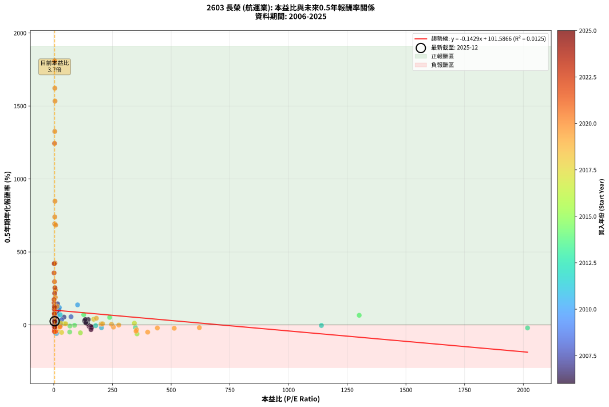
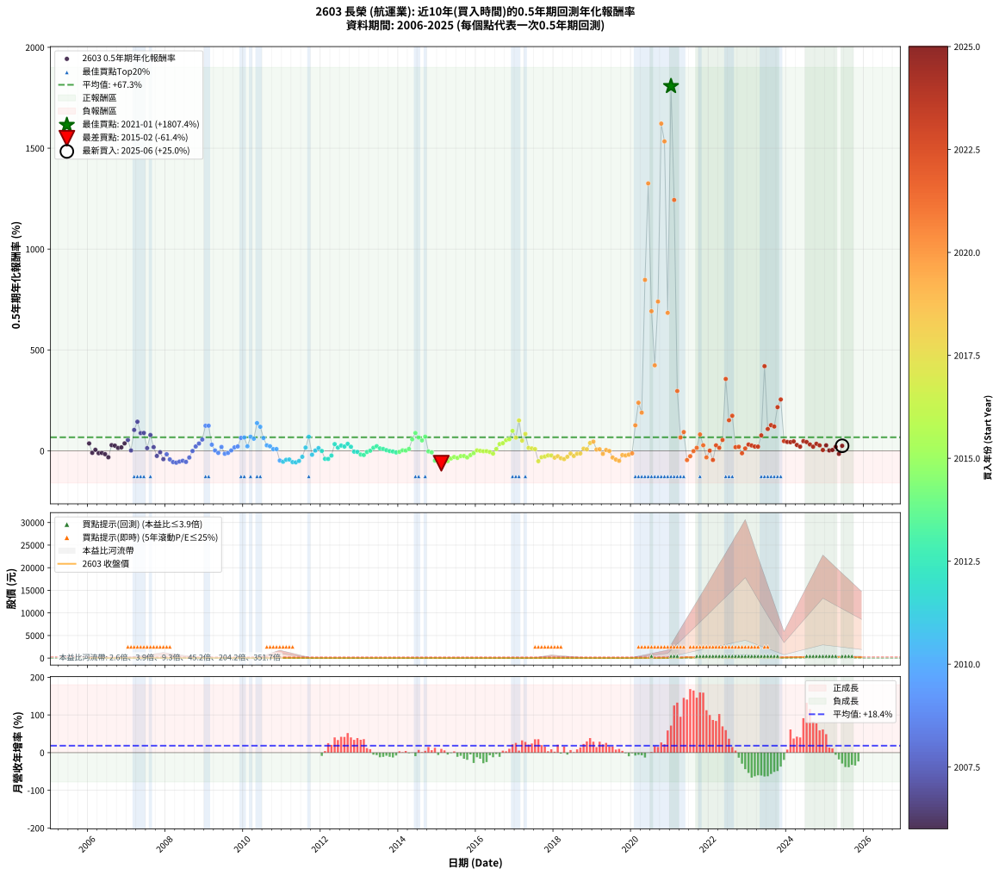

# 2603 長榮 - 本益比與未來報酬率分析

!!! info "報告資訊"
    - **股票代號**: 2603
    - **公司名稱**: 長榮
    - **產業別**: 航運業
    - **分析期間**: 2006-2025 (234 個數據點)
    - **資料來源**: Type 12 (ShowMonthlyK_ChartFlow) 月收盤價與本益比
    - **報酬率口徑**: 含現金股利 (簡化: 年度合計，假設每年7/1入帳)
    - **報告生成時間**: 2026-01-04 08:18:30 CST

## 📈 視覺化圖表

### 圖表1: 本益比 vs 未來報酬率關係

*圖表1：2603 長榮 本益比與0.5年期未來報酬率關係 (2006-2025)*

### 圖表2: 歷年買入時點的0.5年期實際報酬率

*圖表2：2603 長榮 歷年買入時點的0.5年期實際報酬率 (2006-2025)*

## 📍 買點訊號說明

本報告提供兩種買點提示訊號（顯示於圖表2的股價子圖中）：

### ▲ 小綠色三角形（回測驗證）
- **計算方式**: 使用全部歷史資料計算本益比第25百分位數
- **用途**: 事後驗證，顯示歷史上哪些時點確實為低估區
- **限制**: 當下無法判斷，僅供回測參考
- **特性**: 後見之明（Look-Ahead Bias）

### ▲ 小橘色三角形（即時訊號）
- **計算方式**: 使用截至當月的過去5年資料計算本益比第25百分位數
- **用途**: 實際投資決策，當時即可判斷
- **優勢**: 可操作性強，符合實務需求
- **特性**: 無後見之明，滾動窗口計算

!!! tip "如何使用兩種訊號"
    - **綠色▲** 幫助理解歷史估值機會，驗證策略有效性
    - **橘色▲** 可作為實際買進參考，但仍需搭配基本面分析
    - 兩種訊號重疊時，表示即時判斷與事後驗證一致，信心度較高
    - 僅有綠色▲時，表示當時無法判斷（需要未來資料才能確認）
    - 僅有橘色▲時，表示即時判斷為買點，但事後可能不是最佳時機

## 📊 估值分析摘要

| 指標 | 數值 |
|:---:|:---:|
| **目前本益比** (2025-06) | **3.73 倍** |
| **歷史平均本益比** | 85.20 倍 |
| **估值水準** | 🟢 相對低估 |
| **預期0.5年年化報酬率** | **+101.05%** |
| **歷史平均報酬率** | +67.25% |
| **相關係數 (R²)** | 0.0125 |
| **趨勢線斜率** | -0.1429 |

!!! abstract "核心洞察"
    目前本益比顯著低於歷史平均，預期未來報酬率可能較高

    根據歷史數據回測，2603 長榮 在目前本益比 **3.7倍** 的估值水準下，
    預期未來0.5年年化報酬率約為 **+101.1%**。

    **重要提醒**: 本分析基於歷史數據統計，實際報酬率會受到公司基本面變化、產業趨勢、
    總體經濟環境等多重因素影響。R² = 0.01 表示本益比可解釋約 1.2% 的報酬率變異。

## 📈 歷史估值統計

### 最佳買點 (最高報酬率)

| 項目 | 數值 |
|:---:|:---:|
| 起始時間 | 2021-01 |
| 當時本益比 | 3.70 倍 |
| 起始價格 | 31.2 元 |
| 0.5年後價格 | 132.0 元 |
| **0.5年年化報酬率** | **+1807.41%** |

### 最差買點 (最低報酬率)

| 項目 | 數值 |
|:---:|:---:|
| 起始時間 | 2015-02 |
| 當時本益比 | 354.60 倍 |
| 起始價格 | 23.1 元 |
| 0.5年後價格 | 14.2 元 |
| **0.5年年化報酬率** | **-61.37%** |

## 🎯 投資啟示

### 本益比與報酬率關係

趨勢線方程式: **y = -0.1429x + 101.5866**

!!! note "負相關"
    本益比與未來報酬率呈現負相關。較低的本益比通常帶來較高的未來報酬率，
    但相關性不算非常強。**估值仍是重要參考指標之一**。

### 估值區間建議

基於歷史數據分析:

- **🟢 低估區** (P/E < 68.2): 預期報酬率較高，可考慮增加持股
- **🟡 合理區** (P/E 68.2-102.2): 預期報酬率符合長期趨勢，正常持有
- **🔴 高估區** (P/E > 102.2): 預期報酬率較低，可考慮減碼或觀望

!!! danger "風險提示"
    - 過去表現不代表未來結果
    - 本分析假設公司基本面無重大結構性變化
    - 產業環境劇變可能使歷史規律失效
    - 應結合公司財報、產業趨勢、總體經濟等多重因素綜合判斷

!!! success "長期投資觀點"
    歷史數據顯示，在合理或低估的估值水準買入並長期持有，
    往往能獲得較佳的投資報酬。**耐心等待好價格**是價值投資的核心原則。

## 📊 數據品質

- **資料來源**: GoodInfo.tw Type 12 (ShowMonthlyK_ChartFlow)
- **資料頻率**: 月度收盤價與本益比
- **回測期間**: 2006-2025
- **數據點數量**: 234 個 (每個點代表一次0.5年期回測)

### 計算方法說明

1. **0.5年期年化報酬率**:
   - 對每個歷史時點，計算其後0.5年的實際投資報酬率
   - 期末價值(不含股利): 期末價格
   - 期末價值(含現金股利): 期末價格 + 持有期間內的現金股利合計 (簡化: 年度合計，假設每年7/1入帳)
   - 公式: 年化報酬率 = [(期末價值/期初價格)^(1/年數) - 1] × 100%

2. **本益比 (P/E Ratio)**:
   - 使用當時的月收盤價與EPS計算
   - 資料來源: Type 12 月度河流圖本益比數據

3. **趨勢線 (Linear Regression)**:
   - 使用最小平方法擬合線性趨勢線
   - R²值衡量本益比對報酬率的解釋能力

---

*本報告由 Stock Analysis System v1.9.0 自動生成*
*數據更新時間: 2026-01-04 08:18:30 CST*

## 📋 月度回測明細表

（每一列對應時間線圖中的一個買入點；可用來對照 SVG 圖上的每個點。）

| 買入月份 | 賣出月份 | 回測期限_年 | 實際持有年數 | 買入本益比_倍 | 買入收盤價_元 | 賣出收盤價_元 | 現金股利合計_元 | 總報酬率_pct | 年化報酬率_pct |
| --- | --- | --- | --- | --- | --- | --- | --- | --- | --- |
| 2006-01 | 2006-07 | 0.5 | 0.496 | 146.80 | 20.55 | 22.20 | 1.80 | +16.79 | +36.78 |
| 2006-02 | 2006-08 | 0.5 | 0.498 | 150.70 | 21.10 | 18.25 | 1.80 | -4.98 | -9.74 |
| 2006-03 | 2006-10 | 0.5 | 0.586 | 145.00 | 20.30 | 19.10 | 1.80 | +2.96 | +5.10 |
| 2006-04 | 2006-10 | 0.5 | 0.501 | 158.90 | 22.25 | 19.10 | 1.80 | -6.07 | -11.74 |
| 2006-05 | 2006-12 | 0.5 | 0.586 | 157.10 | 22.00 | 18.85 | 1.80 | -6.14 | -10.24 |
| 2006-06 | 2006-12 | 0.5 | 0.501 | 161.40 | 22.60 | 18.85 | 1.80 | -8.63 | -16.48 |
| 2006-07 | 2007-01 | 0.5 | 0.504 | 158.60 | 22.20 | 18.30 | 0.00 | -17.57 | -31.85 |
| 2006-08 | 2007-03 | 0.5 | 0.580 | 130.40 | 18.25 | 21.10 | 0.00 | +15.62 | +28.40 |
| 2006-09 | 2007-03 | 0.5 | 0.496 | 134.60 | 18.85 | 21.10 | 0.00 | +11.94 | +25.55 |
| 2006-10 | 2007-05 | 0.5 | 0.580 | 136.40 | 19.10 | 20.65 | 0.00 | +8.12 | +14.39 |
| 2006-11 | 2007-05 | 0.5 | 0.496 | 136.40 | 19.10 | 20.65 | 0.00 | +8.12 | +17.05 |
| 2006-12 | 2007-07 | 0.5 | 0.580 | 134.60 | 18.85 | 22.35 | 0.30 | +20.16 | +37.22 |
| 2007-01 | 2007-07 | 0.5 | 0.496 | 43.31 | 18.30 | 22.35 | 0.30 | +23.77 | +53.78 |
| 2007-02 | 2007-08 | 0.5 | 0.498 | 30.50 | 21.50 | 21.40 | 0.30 | +0.93 | +1.88 |
| 2007-03 | 2007-10 | 0.5 | 0.586 | 21.37 | 21.10 | 31.70 | 0.30 | +51.66 | +103.56 |
| 2007-04 | 2007-10 | 0.5 | 0.501 | 16.10 | 20.45 | 31.70 | 0.30 | +56.48 | +144.41 |
| 2007-05 | 2007-12 | 0.5 | 0.586 | 13.30 | 20.65 | 29.60 | 0.30 | +44.79 | +88.09 |
| 2007-06 | 2007-12 | 0.5 | 0.501 | 11.85 | 21.75 | 29.60 | 0.30 | +37.47 | +88.74 |
| 2007-07 | 2008-01 | 0.5 | 0.504 | 10.55 | 22.35 | 23.80 | 0.00 | +6.49 | +13.29 |
| 2007-08 | 2008-03 | 0.5 | 0.583 | 8.92 | 21.40 | 30.00 | 0.00 | +40.19 | +78.47 |
| 2007-09 | 2008-03 | 0.5 | 0.498 | 10.29 | 27.60 | 30.00 | 0.00 | +8.70 | +18.22 |
| 2007-10 | 2008-05 | 0.5 | 0.583 | 10.69 | 31.70 | 26.75 | 0.00 | -15.62 | -25.26 |
| 2007-11 | 2008-05 | 0.5 | 0.498 | 8.53 | 27.70 | 26.75 | 0.00 | -3.43 | -6.76 |
| 2007-12 | 2008-07 | 0.5 | 0.583 | 8.39 | 29.60 | 20.00 | 1.70 | -26.69 | -41.28 |
| 2008-01 | 2008-07 | 0.5 | 0.498 | 7.32 | 23.80 | 20.00 | 1.70 | -8.83 | -16.93 |
| 2008-02 | 2008-08 | 0.5 | 0.501 | 8.73 | 26.00 | 18.00 | 1.70 | -24.23 | -42.53 |
| 2008-03 | 2008-10 | 0.5 | 0.586 | 11.11 | 30.00 | 16.95 | 1.70 | -37.84 | -55.58 |
| 2008-04 | 2008-10 | 0.5 | 0.501 | 11.99 | 29.05 | 16.95 | 1.70 | -35.80 | -58.71 |
| 2008-05 | 2008-12 | 0.5 | 0.586 | 12.46 | 26.75 | 15.45 | 1.70 | -35.89 | -53.18 |
| 2008-06 | 2008-12 | 0.5 | 0.501 | 12.89 | 24.10 | 15.45 | 1.70 | -28.84 | -49.30 |
| 2008-07 | 2009-01 | 0.5 | 0.504 | 12.55 | 20.00 | 13.40 | 0.00 | -33.00 | -54.84 |
| 2008-08 | 2009-03 | 0.5 | 0.580 | 13.67 | 18.00 | 14.25 | 0.00 | -20.83 | -33.13 |
| 2008-09 | 2009-03 | 0.5 | 0.496 | 13.75 | 14.30 | 14.25 | 0.00 | -0.35 | -0.70 |
| 2008-10 | 2009-05 | 0.5 | 0.580 | 22.21 | 16.95 | 19.00 | 0.00 | +12.09 | +21.74 |
| 2008-11 | 2009-05 | 0.5 | 0.496 | 33.49 | 16.30 | 19.00 | 0.00 | +16.56 | +36.25 |
| 2008-12 | 2009-07 | 0.5 | 0.580 | 73.57 | 15.45 | 20.00 | 0.00 | +29.45 | +56.00 |
| 2009-01 | 2009-07 | 0.5 | 0.496 |  | 13.40 | 20.00 | 0.00 | +49.25 | +124.37 |
| 2009-02 | 2009-08 | 0.5 | 0.498 |  | 13.30 | 19.90 | 0.00 | +49.62 | +124.49 |
| 2009-03 | 2009-10 | 0.5 | 0.586 |  | 14.25 | 16.65 | 0.00 | +16.84 | +30.43 |
| 2009-04 | 2009-10 | 0.5 | 0.501 |  | 16.50 | 16.65 | 0.00 | +0.91 | +1.82 |
| 2009-05 | 2009-12 | 0.5 | 0.586 |  | 19.00 | 17.85 | 0.00 | -6.05 | -10.11 |
| 2009-06 | 2009-12 | 0.5 | 0.501 |  | 16.35 | 17.85 | 0.00 | +9.17 | +19.15 |
| 2009-07 | 2010-01 | 0.5 | 0.504 |  | 20.00 | 18.50 | 0.00 | -7.50 | -14.34 |
| 2009-08 | 2010-03 | 0.5 | 0.580 |  | 19.90 | 18.70 | 0.00 | -6.03 | -10.16 |
| 2009-09 | 2010-03 | 0.5 | 0.496 |  | 18.50 | 18.70 | 0.00 | +1.08 | +2.19 |
| 2009-10 | 2010-05 | 0.5 | 0.580 |  | 16.65 | 18.25 | 0.00 | +9.61 | +17.13 |
| 2009-11 | 2010-05 | 0.5 | 0.496 |  | 16.55 | 18.25 | 0.00 | +10.27 | +21.81 |
| 2009-12 | 2010-07 | 0.5 | 0.580 |  | 17.85 | 23.80 | 0.00 | +33.33 | +64.16 |
| 2010-01 | 2010-07 | 0.5 | 0.496 |  | 18.50 | 23.80 | 0.00 | +28.65 | +66.26 |
| 2010-02 | 2010-08 | 0.5 | 0.498 |  | 19.20 | 21.25 | 0.00 | +10.68 | +22.58 |
| 2010-03 | 2010-10 | 0.5 | 0.586 |  | 18.70 | 25.50 | 0.00 | +36.36 | +69.79 |
| 2010-04 | 2010-10 | 0.5 | 0.501 |  | 20.15 | 25.50 | 0.00 | +26.55 | +60.00 |
| 2010-05 | 2010-12 | 0.5 | 0.586 | 101.40 | 18.25 | 30.30 | 0.00 | +66.03 | +137.57 |
| 2010-06 | 2010-12 | 0.5 | 0.501 | 23.78 | 20.45 | 30.30 | 0.00 | +48.17 | +119.18 |
| 2010-07 | 2011-01 | 0.5 | 0.504 | 15.45 | 23.80 | 30.50 | 0.00 | +28.15 | +63.62 |
| 2010-08 | 2011-03 | 0.5 | 0.580 | 9.57 | 21.25 | 24.45 | 0.00 | +15.06 | +27.34 |
| 2010-09 | 2011-03 | 0.5 | 0.496 | 7.62 | 22.10 | 24.45 | 0.00 | +10.63 | +22.62 |
| 2010-10 | 2011-05 | 0.5 | 0.580 | 7.12 | 25.50 | 26.75 | 0.00 | +4.90 | +8.59 |
| 2010-11 | 2011-05 | 0.5 | 0.496 | 6.02 | 25.65 | 26.75 | 0.00 | +4.29 | +8.84 |
| 2010-12 | 2011-07 | 0.5 | 0.580 | 6.13 | 30.30 | 19.75 | 1.00 | -31.52 | -47.91 |
| 2011-01 | 2011-07 | 0.5 | 0.496 | 6.85 | 30.50 | 19.75 | 1.00 | -31.97 | -54.03 |
| 2011-02 | 2011-08 | 0.5 | 0.498 | 6.60 | 26.20 | 18.60 | 1.00 | -25.19 | -44.15 |
| 2011-03 | 2011-10 | 0.5 | 0.586 | 7.02 | 24.45 | 16.60 | 1.00 | -28.02 | -42.94 |
| 2011-04 | 2011-10 | 0.5 | 0.501 | 8.84 | 26.50 | 16.60 | 1.00 | -33.58 | -55.82 |
| 2011-05 | 2011-12 | 0.5 | 0.586 | 10.65 | 26.75 | 15.30 | 1.00 | -39.07 | -57.07 |
| 2011-06 | 2011-12 | 0.5 | 0.501 | 11.41 | 23.10 | 15.30 | 1.00 | -29.44 | -50.14 |
| 2011-07 | 2012-01 | 0.5 | 0.504 | 12.83 | 19.75 | 16.55 | 0.00 | -16.20 | -29.59 |
| 2011-08 | 2012-03 | 0.5 | 0.583 | 17.66 | 18.60 | 20.30 | 0.00 | +9.14 | +16.18 |
| 2011-09 | 2012-03 | 0.5 | 0.498 | 27.49 | 15.60 | 20.30 | 0.00 | +30.13 | +69.64 |
| 2011-10 | 2012-05 | 0.5 | 0.583 | 203.30 | 16.60 | 14.65 | 0.00 | -11.75 | -19.29 |
| 2011-11 | 2012-05 | 0.5 | 0.498 |  | 14.55 | 14.65 | 0.00 | +0.69 | +1.38 |
| 2011-12 | 2012-07 | 0.5 | 0.583 |  | 15.30 | 16.50 | 0.00 | +7.84 | +13.82 |
| 2012-01 | 2012-07 | 0.5 | 0.498 |  | 16.55 | 16.50 | 0.00 | -0.30 | -0.61 |
| 2012-02 | 2012-08 | 0.5 | 0.501 |  | 20.60 | 16.00 | 0.00 | -22.33 | -39.61 |
| 2012-03 | 2012-10 | 0.5 | 0.586 |  | 20.30 | 15.05 | 0.00 | -25.86 | -39.99 |
| 2012-04 | 2012-10 | 0.5 | 0.501 |  | 17.20 | 15.05 | 0.00 | -12.50 | -23.40 |
| 2012-05 | 2012-12 | 0.5 | 0.586 |  | 14.65 | 17.35 | 0.00 | +18.43 | +33.47 |
| 2012-06 | 2012-12 | 0.5 | 0.501 |  | 16.10 | 17.35 | 0.00 | +7.76 | +16.10 |
| 2012-07 | 2013-01 | 0.5 | 0.504 |  | 16.50 | 18.55 | 0.00 | +12.42 | +26.17 |
| 2012-08 | 2013-03 | 0.5 | 0.580 |  | 16.00 | 17.90 | 0.00 | +11.87 | +21.33 |
| 2012-09 | 2013-03 | 0.5 | 0.496 |  | 15.45 | 17.90 | 0.00 | +15.86 | +34.59 |
| 2012-10 | 2013-05 | 0.5 | 0.580 |  | 15.05 | 16.75 | 0.00 | +11.30 | +20.25 |
| 2012-11 | 2013-05 | 0.5 | 0.496 | 1140.00 | 17.10 | 16.75 | 0.00 | -2.05 | -4.09 |
| 2012-12 | 2013-07 | 0.5 | 0.580 | 178.40 | 17.35 | 16.80 | 0.00 | -3.17 | -5.40 |
| 2013-01 | 2013-07 | 0.5 | 0.496 | 347.80 | 18.55 | 16.80 | 0.00 | -9.43 | -18.12 |
| 2013-02 | 2013-08 | 0.5 | 0.498 | 2018.00 | 18.95 | 16.90 | 0.00 | -10.82 | -20.53 |
| 2013-03 | 2013-10 | 0.5 | 0.586 |  | 17.90 | 17.30 | 0.00 | -3.35 | -5.65 |
| 2013-04 | 2013-10 | 0.5 | 0.501 |  | 17.25 | 17.30 | 0.00 | +0.29 | +0.58 |
| 2013-05 | 2013-12 | 0.5 | 0.586 |  | 16.75 | 18.20 | 0.00 | +8.66 | +15.22 |
| 2013-06 | 2013-12 | 0.5 | 0.501 |  | 16.40 | 18.20 | 0.00 | +10.98 | +23.10 |
| 2013-07 | 2014-01 | 0.5 | 0.504 |  | 16.80 | 17.80 | 0.00 | +5.95 | +12.16 |
| 2013-08 | 2014-03 | 0.5 | 0.580 |  | 16.90 | 17.80 | 0.00 | +5.33 | +9.35 |
| 2013-09 | 2014-03 | 0.5 | 0.496 |  | 17.50 | 17.80 | 0.00 | +1.71 | +3.49 |
| 2013-10 | 2014-05 | 0.5 | 0.580 |  | 17.30 | 17.20 | 0.00 | -0.58 | -0.99 |
| 2013-11 | 2014-05 | 0.5 | 0.496 |  | 17.50 | 17.20 | 0.00 | -1.71 | -3.43 |
| 2013-12 | 2014-07 | 0.5 | 0.580 |  | 18.20 | 17.35 | 0.00 | -4.67 | -7.91 |
| 2014-01 | 2014-07 | 0.5 | 0.496 |  | 17.80 | 17.35 | 0.00 | -2.53 | -5.04 |
| 2014-02 | 2014-08 | 0.5 | 0.498 |  | 18.00 | 18.25 | 0.00 | +1.39 | +2.81 |
| 2014-03 | 2014-10 | 0.5 | 0.586 |  | 17.80 | 17.95 | 0.00 | +0.84 | +1.44 |
| 2014-04 | 2014-10 | 0.5 | 0.501 |  | 17.15 | 17.95 | 0.00 | +4.66 | +9.53 |
| 2014-05 | 2014-12 | 0.5 | 0.586 |  | 17.20 | 22.40 | 0.00 | +30.23 | +56.96 |
| 2014-06 | 2014-12 | 0.5 | 0.501 |  | 16.30 | 22.40 | 0.00 | +37.42 | +88.61 |
| 2014-07 | 2015-01 | 0.5 | 0.504 | 1301.00 | 17.35 | 22.40 | 0.00 | +29.11 | +66.05 |
| 2014-08 | 2015-03 | 0.5 | 0.580 | 238.00 | 18.25 | 23.25 | 0.00 | +27.40 | +51.77 |
| 2014-09 | 2015-03 | 0.5 | 0.496 | 127.50 | 17.85 | 23.25 | 0.00 | +30.25 | +70.46 |
| 2014-10 | 2015-05 | 0.5 | 0.580 | 88.28 | 17.95 | 17.65 | 0.00 | -1.67 | -2.86 |
| 2014-11 | 2015-05 | 0.5 | 0.496 | 68.81 | 18.35 | 17.65 | 0.00 | -3.81 | -7.55 |
| 2014-12 | 2015-07 | 0.5 | 0.580 | 67.88 | 22.40 | 15.15 | 0.10 | -31.92 | -48.44 |
| 2015-01 | 2015-07 | 0.5 | 0.496 | 113.40 | 22.40 | 15.15 | 0.10 | -31.92 | -53.97 |
| 2015-02 | 2015-08 | 0.5 | 0.498 | 354.60 | 23.05 | 14.25 | 0.10 | -37.74 | -61.37 |
| 2015-03 | 2015-10 | 0.5 | 0.586 |  | 23.25 | 14.50 | 0.10 | -37.20 | -54.80 |
| 2015-04 | 2015-10 | 0.5 | 0.501 |  | 20.85 | 14.50 | 0.10 | -29.98 | -50.89 |
| 2015-05 | 2015-12 | 0.5 | 0.586 |  | 17.65 | 13.25 | 0.10 | -24.36 | -37.91 |
| 2015-06 | 2015-12 | 0.5 | 0.501 |  | 16.00 | 13.25 | 0.10 | -16.56 | -30.33 |
| 2015-07 | 2016-01 | 0.5 | 0.504 |  | 15.15 | 12.20 | 0.00 | -19.47 | -34.94 |
| 2015-08 | 2016-03 | 0.5 | 0.583 |  | 14.25 | 11.95 | 0.00 | -16.14 | -26.05 |
| 2015-09 | 2016-03 | 0.5 | 0.498 |  | 13.85 | 11.95 | 0.00 | -13.72 | -25.63 |
| 2015-10 | 2016-05 | 0.5 | 0.583 |  | 14.50 | 11.50 | 0.00 | -20.69 | -32.80 |
| 2015-11 | 2016-05 | 0.5 | 0.498 |  | 12.95 | 11.50 | 0.00 | -11.20 | -21.20 |
| 2015-12 | 2016-07 | 0.5 | 0.583 |  | 13.25 | 12.35 | 0.00 | -6.79 | -11.36 |
| 2016-01 | 2016-07 | 0.5 | 0.498 |  | 12.20 | 12.35 | 0.00 | +1.23 | +2.48 |
| 2016-02 | 2016-08 | 0.5 | 0.501 |  | 12.00 | 12.00 | 0.00 | +0.00 | +0.00 |
| 2016-03 | 2016-10 | 0.5 | 0.586 |  | 11.95 | 11.80 | 0.00 | -1.26 | -2.13 |
| 2016-04 | 2016-10 | 0.5 | 0.501 |  | 11.90 | 11.80 | 0.00 | -0.84 | -1.67 |
| 2016-05 | 2016-12 | 0.5 | 0.586 |  | 11.50 | 11.10 | 0.00 | -3.48 | -5.86 |
| 2016-06 | 2016-12 | 0.5 | 0.501 |  | 11.95 | 11.10 | 0.00 | -7.11 | -13.69 |
| 2016-07 | 2017-01 | 0.5 | 0.504 |  | 12.35 | 12.90 | 0.00 | +4.45 | +9.03 |
| 2016-08 | 2017-03 | 0.5 | 0.580 |  | 12.00 | 14.20 | 0.00 | +18.33 | +33.65 |
| 2016-09 | 2017-03 | 0.5 | 0.496 |  | 12.10 | 14.20 | 0.00 | +17.36 | +38.12 |
| 2016-10 | 2017-05 | 0.5 | 0.580 |  | 11.80 | 15.10 | 0.00 | +27.97 | +52.94 |
| 2016-11 | 2017-05 | 0.5 | 0.496 |  | 12.05 | 15.10 | 0.00 | +25.31 | +57.67 |
| 2016-12 | 2017-07 | 0.5 | 0.580 |  | 11.10 | 16.55 | 0.00 | +49.10 | +99.01 |
| 2017-01 | 2017-07 | 0.5 | 0.496 |  | 12.90 | 16.55 | 0.00 | +28.29 | +65.33 |
| 2017-02 | 2017-08 | 0.5 | 0.498 |  | 14.55 | 23.00 | 0.00 | +58.08 | +150.67 |
| 2017-03 | 2017-10 | 0.5 | 0.586 |  | 14.20 | 18.05 | 0.00 | +27.11 | +50.60 |
| 2017-04 | 2017-10 | 0.5 | 0.501 |  | 13.30 | 18.05 | 0.00 | +35.71 | +83.95 |
| 2017-05 | 2017-12 | 0.5 | 0.586 |  | 15.10 | 16.35 | 0.00 | +8.28 | +14.54 |
| 2017-06 | 2017-12 | 0.5 | 0.501 | 343.30 | 15.45 | 16.35 | 0.00 | +5.83 | +11.96 |
| 2017-07 | 2018-01 | 0.5 | 0.504 | 45.24 | 16.55 | 17.25 | 0.00 | +4.23 | +8.57 |
| 2017-08 | 2018-03 | 0.5 | 0.580 | 33.50 | 23.00 | 15.15 | 0.00 | -34.13 | -51.29 |
| 2017-09 | 2018-03 | 0.5 | 0.496 | 18.11 | 18.25 | 15.15 | 0.00 | -16.99 | -31.32 |
| 2017-10 | 2018-05 | 0.5 | 0.580 | 13.59 | 18.05 | 14.85 | 0.00 | -17.73 | -28.55 |
| 2017-11 | 2018-05 | 0.5 | 0.496 | 10.22 | 16.85 | 14.85 | 0.00 | -11.87 | -22.51 |
| 2017-12 | 2018-07 | 0.5 | 0.580 | 8.30 | 16.35 | 13.85 | 0.20 | -14.07 | -22.99 |
| 2018-01 | 2018-07 | 0.5 | 0.496 | 9.52 | 17.25 | 13.85 | 0.20 | -18.55 | -33.90 |
| 2018-02 | 2018-08 | 0.5 | 0.498 | 9.34 | 15.45 | 13.05 | 0.20 | -14.24 | -26.53 |
| 2018-03 | 2018-10 | 0.5 | 0.586 | 10.13 | 15.15 | 11.40 | 0.20 | -23.43 | -36.60 |
| 2018-04 | 2018-10 | 0.5 | 0.501 | 11.30 | 15.10 | 11.40 | 0.20 | -23.18 | -40.92 |
| 2018-05 | 2018-12 | 0.5 | 0.586 | 12.60 | 14.85 | 11.90 | 0.20 | -18.52 | -29.50 |
| 2018-06 | 2018-12 | 0.5 | 0.501 | 12.75 | 13.00 | 11.90 | 0.20 | -6.92 | -13.34 |
| 2018-07 | 2019-01 | 0.5 | 0.504 | 16.07 | 13.85 | 11.95 | 0.00 | -13.72 | -25.39 |
| 2018-08 | 2019-03 | 0.5 | 0.580 | 18.55 | 13.05 | 11.95 | 0.00 | -8.43 | -14.08 |
| 2018-09 | 2019-03 | 0.5 | 0.496 | 23.49 | 12.80 | 11.95 | 0.00 | -6.64 | -12.95 |
| 2018-10 | 2019-05 | 0.5 | 0.580 | 29.48 | 11.40 | 12.10 | 0.00 | +6.14 | +10.81 |
| 2018-11 | 2019-05 | 0.5 | 0.496 | 51.02 | 11.65 | 12.10 | 0.00 | +3.86 | +7.95 |
| 2018-12 | 2019-07 | 0.5 | 0.580 | 170.00 | 11.90 | 14.40 | 0.00 | +21.01 | +38.89 |
| 2019-01 | 2019-07 | 0.5 | 0.496 | 181.50 | 11.95 | 14.40 | 0.00 | +20.50 | +45.69 |
| 2019-02 | 2019-08 | 0.5 | 0.498 | 201.90 | 12.45 | 12.85 | 0.00 | +3.21 | +6.55 |
| 2019-03 | 2019-10 | 0.5 | 0.586 | 207.80 | 11.95 | 12.50 | 0.00 | +4.60 | +7.98 |
| 2019-04 | 2019-10 | 0.5 | 0.501 | 254.10 | 13.55 | 12.50 | 0.00 | -7.75 | -14.87 |
| 2019-05 | 2019-12 | 0.5 | 0.586 | 246.10 | 12.10 | 12.40 | 0.00 | +2.48 | +4.27 |
| 2019-06 | 2019-12 | 0.5 | 0.501 | 276.70 | 12.45 | 12.40 | 0.00 | -0.40 | -0.80 |
| 2019-07 | 2020-01 | 0.5 | 0.504 | 352.60 | 14.40 | 11.75 | 0.00 | -18.40 | -33.22 |
| 2019-08 | 2020-03 | 0.5 | 0.583 | 350.40 | 12.85 | 9.25 | 0.00 | -28.02 | -43.09 |
| 2019-09 | 2020-03 | 0.5 | 0.498 | 400.00 | 13.00 | 9.25 | 0.00 | -28.85 | -49.49 |
| 2019-10 | 2020-05 | 0.5 | 0.583 | 441.20 | 12.50 | 10.90 | 0.00 | -12.80 | -20.93 |
| 2019-11 | 2020-05 | 0.5 | 0.498 | 513.10 | 12.40 | 10.90 | 0.00 | -12.10 | -22.80 |
| 2019-12 | 2020-07 | 0.5 | 0.583 | 620.00 | 12.40 | 11.00 | 0.00 | -11.29 | -18.57 |
| 2020-01 | 2020-07 | 0.5 | 0.498 | 26.70 | 11.75 | 11.00 | 0.00 | -6.38 | -12.40 |
| 2020-02 | 2020-08 | 0.5 | 0.501 | 13.43 | 11.55 | 17.40 | 0.00 | +50.65 | +126.57 |
| 2020-03 | 2020-10 | 0.5 | 0.586 | 7.23 | 9.25 | 18.90 | 0.00 | +104.32 | +238.57 |
| 2020-04 | 2020-10 | 0.5 | 0.501 | 6.53 | 11.10 | 18.90 | 0.00 | +70.27 | +189.29 |
| 2020-05 | 2020-12 | 0.5 | 0.586 | 5.14 | 10.90 | 40.70 | 0.00 | +273.39 | +847.46 |
| 2020-06 | 2020-12 | 0.5 | 0.501 | 4.23 | 10.75 | 40.70 | 0.00 | +278.60 | +1325.62 |
| 2020-07 | 2021-01 | 0.5 | 0.504 | 3.72 | 11.00 | 31.20 | 0.00 | +183.64 | +692.06 |
| 2020-08 | 2021-03 | 0.5 | 0.580 | 5.15 | 17.40 | 45.50 | 0.00 | +161.49 | +423.89 |
| 2020-09 | 2021-03 | 0.5 | 0.496 | 4.17 | 15.85 | 45.50 | 0.00 | +187.07 | +739.82 |
| 2020-10 | 2021-05 | 0.5 | 0.580 | 4.48 | 18.90 | 98.60 | 0.00 | +421.69 | +1621.94 |
| 2020-11 | 2021-05 | 0.5 | 0.496 | 5.32 | 24.70 | 98.60 | 0.00 | +299.19 | +1533.63 |
| 2020-12 | 2021-07 | 0.5 | 0.580 | 8.04 | 40.70 | 132.00 | 2.49 | +230.43 | +684.01 |
| 2021-01 | 2021-07 | 0.5 | 0.496 | 3.70 | 31.20 | 132.00 | 2.49 | +331.05 | +1807.41 |
| 2021-02 | 2021-08 | 0.5 | 0.498 | 3.21 | 37.95 | 136.00 | 2.49 | +264.92 | +1243.56 |
| 2021-03 | 2021-10 | 0.5 | 0.586 | 3.00 | 45.50 | 99.50 | 2.49 | +124.15 | +296.54 |
| 2021-04 | 2021-10 | 0.5 | 0.501 | 4.26 | 79.00 | 99.50 | 2.49 | +29.10 | +66.49 |
| 2021-05 | 2021-12 | 0.5 | 0.586 | 4.49 | 98.60 | 142.50 | 2.49 | +47.05 | +93.11 |
| 2021-06 | 2021-12 | 0.5 | 0.501 | 7.78 | 197.00 | 142.50 | 2.49 | -26.40 | -45.77 |
| 2021-07 | 2022-01 | 0.5 | 0.504 | 4.60 | 132.00 | 113.00 | 0.00 | -14.39 | -26.55 |
| 2021-08 | 2022-03 | 0.5 | 0.580 | 4.24 | 136.00 | 135.00 | 0.00 | -0.74 | -1.26 |
| 2021-09 | 2022-03 | 0.5 | 0.496 | 3.56 | 126.00 | 135.00 | 0.00 | +7.14 | +14.94 |
| 2021-10 | 2022-05 | 0.5 | 0.580 | 2.56 | 99.50 | 140.50 | 0.00 | +41.21 | +81.21 |
| 2021-11 | 2022-05 | 0.5 | 0.496 | 2.95 | 124.50 | 140.50 | 0.00 | +12.85 | +27.63 |
| 2021-12 | 2022-07 | 0.5 | 0.580 | 3.13 | 142.50 | 95.50 | 18.00 | -20.35 | -32.43 |
| 2022-01 | 2022-07 | 0.5 | 0.496 | 2.30 | 113.00 | 95.50 | 18.00 | +0.44 | +0.89 |
| 2022-02 | 2022-08 | 0.5 | 0.498 | 2.73 | 143.50 | 88.30 | 18.00 | -25.92 | -45.24 |
| 2022-03 | 2022-10 | 0.5 | 0.586 | 2.41 | 135.00 | 137.50 | 18.00 | +15.19 | +27.29 |
| 2022-04 | 2022-10 | 0.5 | 0.501 | 2.44 | 145.00 | 137.50 | 18.00 | +7.24 | +14.97 |
| 2022-05 | 2022-12 | 0.5 | 0.586 | 2.24 | 140.50 | 163.00 | 18.00 | +28.83 | +54.08 |
| 2022-06 | 2022-12 | 0.5 | 0.501 | 1.28 | 84.60 | 163.00 | 18.00 | +113.95 | +356.31 |
| 2022-07 | 2023-01 | 0.5 | 0.504 | 1.37 | 95.50 | 152.00 | 0.00 | +59.16 | +151.57 |
| 2022-08 | 2023-03 | 0.5 | 0.580 | 1.21 | 88.30 | 158.50 | 0.00 | +79.50 | +173.99 |
| 2022-09 | 2023-03 | 0.5 | 0.496 | 1.90 | 146.00 | 158.50 | 0.00 | +8.56 | +18.03 |
| 2022-10 | 2023-05 | 0.5 | 0.580 | 1.72 | 137.50 | 153.00 | 0.00 | +11.27 | +20.20 |
| 2022-11 | 2023-05 | 0.5 | 0.496 | 1.95 | 163.00 | 153.00 | 0.00 | -6.13 | -11.99 |
| 2022-12 | 2023-07 | 0.5 | 0.580 | 1.87 | 163.00 | 104.00 | 70.00 | +6.75 | +11.91 |
| 2023-01 | 2023-07 | 0.5 | 0.496 | 1.87 | 152.00 | 104.00 | 70.00 | +14.47 | +31.36 |
| 2023-02 | 2023-08 | 0.5 | 0.498 | 2.08 | 157.00 | 106.50 | 70.00 | +12.42 | +26.49 |
| 2023-03 | 2023-10 | 0.5 | 0.586 | 2.28 | 158.50 | 107.50 | 70.00 | +11.99 | +21.32 |
| 2023-04 | 2023-10 | 0.5 | 0.501 | 2.54 | 161.50 | 107.50 | 70.00 | +9.91 | +20.75 |
| 2023-05 | 2023-12 | 0.5 | 0.586 | 2.65 | 153.00 | 143.50 | 70.00 | +39.54 | +76.60 |
| 2023-06 | 2023-12 | 0.5 | 0.501 | 1.80 | 93.50 | 143.50 | 70.00 | +128.34 | +419.64 |
| 2023-07 | 2024-01 | 0.5 | 0.504 | 2.26 | 104.00 | 150.50 | 0.00 | +44.71 | +108.26 |
| 2023-08 | 2024-03 | 0.5 | 0.583 | 2.65 | 106.50 | 172.00 | 0.00 | +61.50 | +127.50 |
| 2023-09 | 2024-03 | 0.5 | 0.498 | 3.38 | 116.00 | 172.00 | 0.00 | +48.28 | +120.45 |
| 2023-10 | 2024-05 | 0.5 | 0.583 | 3.78 | 107.50 | 210.50 | 0.00 | +95.81 | +216.56 |
| 2023-11 | 2024-05 | 0.5 | 0.498 | 4.96 | 112.00 | 210.50 | 0.00 | +87.95 | +254.77 |
| 2023-12 | 2024-07 | 0.5 | 0.583 | 8.59 | 143.50 | 170.50 | 9.96 | +25.76 | +48.15 |
| 2024-01 | 2024-07 | 0.5 | 0.498 | 7.27 | 150.50 | 170.50 | 9.96 | +19.91 | +43.96 |
| 2024-02 | 2024-08 | 0.5 | 0.501 | 6.69 | 165.50 | 188.00 | 9.96 | +19.62 | +42.98 |
| 2024-03 | 2024-10 | 0.5 | 0.586 | 5.98 | 172.00 | 205.50 | 9.96 | +25.27 | +46.89 |
| 2024-04 | 2024-10 | 0.5 | 0.501 | 5.79 | 189.50 | 205.50 | 9.96 | +13.70 | +29.21 |
| 2024-05 | 2024-12 | 0.5 | 0.586 | 5.72 | 210.50 | 225.00 | 9.96 | +11.62 | +20.64 |
| 2024-06 | 2024-12 | 0.5 | 0.501 | 4.73 | 193.00 | 225.00 | 9.96 | +21.74 | +48.10 |
| 2024-07 | 2025-01 | 0.5 | 0.504 | 3.81 | 170.50 | 204.50 | 0.00 | +19.94 | +43.47 |
| 2024-08 | 2025-03 | 0.5 | 0.580 | 3.85 | 188.00 | 220.50 | 0.00 | +17.29 | +31.62 |
| 2024-09 | 2025-03 | 0.5 | 0.496 | 3.80 | 201.00 | 220.50 | 0.00 | +9.70 | +20.54 |
| 2024-10 | 2025-05 | 0.5 | 0.580 | 3.62 | 205.50 | 244.50 | 0.00 | +18.98 | +34.90 |
| 2024-11 | 2025-05 | 0.5 | 0.496 | 3.57 | 217.00 | 244.50 | 0.00 | +12.67 | +27.22 |
| 2024-12 | 2025-07 | 0.5 | 0.580 | 3.47 | 225.00 | 198.00 | 32.50 | +2.44 | +4.25 |
| 2025-01 | 2025-07 | 0.5 | 0.496 | 3.25 | 204.50 | 198.00 | 32.50 | +12.71 | +27.32 |
| 2025-02 | 2025-08 | 0.5 | 0.498 | 3.54 | 216.00 | 185.50 | 32.50 | +0.93 | +1.87 |
| 2025-03 | 2025-10 | 0.5 | 0.586 | 3.73 | 220.50 | 193.50 | 32.50 | +2.49 | +4.29 |
| 2025-04 | 2025-10 | 0.5 | 0.501 | 3.61 | 206.50 | 193.50 | 32.50 | +9.44 | +19.73 |
| 2025-05 | 2025-12 | 0.5 | 0.586 | 4.42 | 244.50 | 190.00 | 32.50 | -9.00 | -14.86 |
| 2025-06 | 2025-12 | 0.5 | 0.501 | 3.73 | 199.00 | 190.00 | 32.50 | +11.81 | +24.96 |
