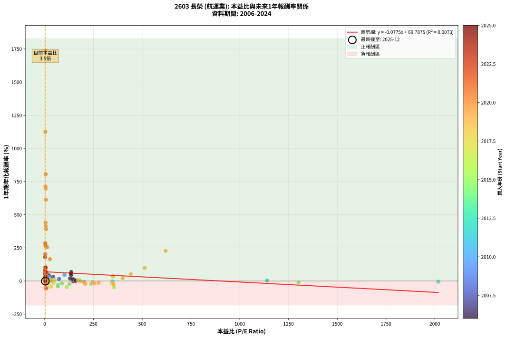
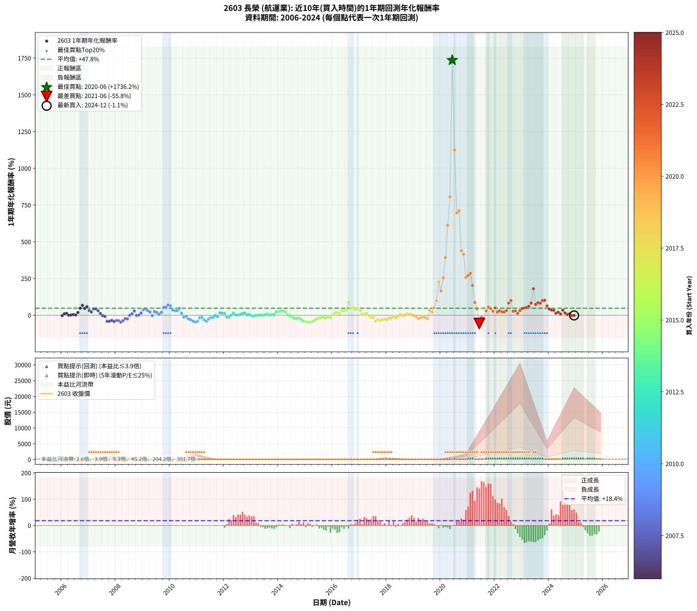

# 2603 長榮 - 本益比與未來報酬率分析

!!! info "報告資訊"
    - **股票代號**: 2603
    - **公司名稱**: 長榮
    - **產業別**: 航運業
    - **分析期間**: 2006-2024 (228 個數據點)
    - **資料來源**: Type 12 (ShowMonthlyK_ChartFlow) 月收盤價與本益比
    - **報酬率口徑**: 含現金股利 (簡化: 年度合計，假設每年7/1入帳)
    - **報告生成時間**: 2026-01-12 20:56:14 CST

## 📈 視覺化圖表

### 圖表1: 本益比 vs 未來報酬率關係

*圖表1：2603 長榮 本益比與1年期未來報酬率關係 (2006-2024)*

### 圖表2: 歷年買入時點的1年期實際報酬率

*圖表2：2603 長榮 歷年買入時點的1年期實際報酬率 (2006-2024)*

## 📍 買點訊號說明

本報告提供兩種買點提示訊號（顯示於圖表2的股價子圖中）：

### ▲ 小綠色三角形（回測驗證）
- **計算方式**: 使用全部歷史資料計算本益比第25百分位數
- **用途**: 事後驗證，顯示歷史上哪些時點確實為低估區
- **限制**: 當下無法判斷，僅供回測參考
- **特性**: 後見之明（Look-Ahead Bias）

### ▲ 小橘色三角形（即時訊號）
- **計算方式**: 使用截至當月的過去5年資料計算本益比第25百分位數
- **用途**: 實際投資決策，當時即可判斷
- **優勢**: 可操作性強，符合實務需求
- **特性**: 無後見之明，滾動窗口計算

!!! tip "如何使用兩種訊號"
    - **綠色▲** 幫助理解歷史估值機會，驗證策略有效性
    - **橘色▲** 可作為實際買進參考，但仍需搭配基本面分析
    - 兩種訊號重疊時，表示即時判斷與事後驗證一致，信心度較高
    - 僅有綠色▲時，表示當時無法判斷（需要未來資料才能確認）
    - 僅有橘色▲時，表示即時判斷為買點，但事後可能不是最佳時機

## 📊 估值分析摘要

| 指標 | 數值 |
|:---:|:---:|
| **目前本益比** (2024-12) | **3.47 倍** |
| **歷史平均本益比** | 88.32 倍 |
| **估值水準** | 🟢 相對低估 |
| **預期1年年化報酬率** | **+69.52%** |
| **歷史平均報酬率** | +47.81% |
| **相關係數 (R²)** | 0.0073 |
| **趨勢線斜率** | -0.0775 |

!!! abstract "核心洞察"
    目前本益比顯著低於歷史平均，預期未來報酬率可能較高

    根據歷史數據回測，2603 長榮 在目前本益比 **3.5倍** 的估值水準下，
    預期未來1年年化報酬率約為 **+69.5%**。

    **重要提醒**: 本分析基於歷史數據統計，實際報酬率會受到公司基本面變化、產業趨勢、
    總體經濟環境等多重因素影響。R² = 0.01 表示本益比可解釋約 0.7% 的報酬率變異。

## 📈 歷史估值統計

### 最佳買點 (最高報酬率)

| 項目 | 數值 |
|:---:|:---:|
| 起始時間 | 2020-06 |
| 當時本益比 | 4.23 倍 |
| 起始價格 | 10.8 元 |
| 1年後價格 | 197.0 元 |
| **1年年化報酬率** | **+1736.21%** |

### 最差買點 (最低報酬率)

| 項目 | 數值 |
|:---:|:---:|
| 起始時間 | 2021-06 |
| 當時本益比 | 7.78 倍 |
| 起始價格 | 197.0 元 |
| 1年後價格 | 84.6 元 |
| **1年年化報酬率** | **-55.82%** |

## 🎯 投資啟示

### 本益比與報酬率關係

趨勢線方程式: **y = -0.0775x + 69.7875**

!!! note "負相關"
    本益比與未來報酬率呈現負相關。較低的本益比通常帶來較高的未來報酬率，
    但相關性不算非常強。**估值仍是重要參考指標之一**。

### 估值區間建議

基於歷史數據分析:

- **🟢 低估區** (P/E < 70.7): 預期報酬率較高，可考慮增加持股
- **🟡 合理區** (P/E 70.7-106.0): 預期報酬率符合長期趨勢，正常持有
- **🔴 高估區** (P/E > 106.0): 預期報酬率較低，可考慮減碼或觀望

!!! danger "風險提示"
    - 過去表現不代表未來結果
    - 本分析假設公司基本面無重大結構性變化
    - 產業環境劇變可能使歷史規律失效
    - 應結合公司財報、產業趨勢、總體經濟等多重因素綜合判斷

!!! success "長期投資觀點"
    歷史數據顯示，在合理或低估的估值水準買入並長期持有，
    往往能獲得較佳的投資報酬。**耐心等待好價格**是價值投資的核心原則。

## 📊 數據品質

- **資料來源**: GoodInfo.tw Type 12 (ShowMonthlyK_ChartFlow)
- **資料頻率**: 月度收盤價與本益比
- **回測期間**: 2006-2024
- **數據點數量**: 228 個 (每個點代表一次1年期回測)

### 計算方法說明

1. **1年期年化報酬率**:
   - 對每個歷史時點，計算其後1年的實際投資報酬率
   - 期末價值(不含股利): 期末價格
   - 期末價值(含現金股利): 期末價格 + 持有期間內的現金股利合計 (簡化: 年度合計，假設每年7/1入帳)
   - 公式: 年化報酬率 = [(期末價值/期初價格)^(1/年數) - 1] × 100%

2. **本益比 (P/E Ratio)**:
   - 使用當時的月收盤價與EPS計算
   - 資料來源: Type 12 月度河流圖本益比數據

3. **趨勢線 (Linear Regression)**:
   - 使用最小平方法擬合線性趨勢線
   - R²值衡量本益比對報酬率的解釋能力

---

*本報告由 Stock Analysis System v1.9.0 自動生成*
*數據更新時間: 2026-01-12 20:56:14 CST*

## 📋 月度回測明細表

（每一列對應時間線圖中的一個買入點；可用來對照 SVG 圖上的每個點。）

| 買入月份 | 賣出月份 | 回測期限_年 | 實際持有年數 | 買入本益比_倍 | 買入收盤價_元 | 賣出收盤價_元 | 現金股利合計_元 | 總報酬率_pct | 年化報酬率_pct |
| --- | --- | --- | --- | --- | --- | --- | --- | --- | --- |
| 2006-01 | 2007-01 | 1 | 0.999 | 146.80 | 20.55 | 18.30 | 1.80 | -2.19 | -2.19 |
| 2006-02 | 2007-02 | 1 | 0.999 | 150.70 | 21.10 | 21.50 | 1.80 | +10.43 | +10.43 |
| 2006-03 | 2007-03 | 1 | 0.999 | 145.00 | 20.30 | 21.10 | 1.80 | +12.81 | +12.82 |
| 2006-04 | 2007-04 | 1 | 0.999 | 158.90 | 22.25 | 20.45 | 1.80 | +0.00 | +0.00 |
| 2006-05 | 2007-05 | 1 | 0.999 | 157.10 | 22.00 | 20.65 | 1.80 | +2.05 | +2.05 |
| 2006-06 | 2007-06 | 1 | 0.999 | 161.40 | 22.60 | 21.75 | 1.80 | +4.20 | +4.21 |
| 2006-07 | 2007-07 | 1 | 0.999 | 158.60 | 22.20 | 22.35 | 0.30 | +2.03 | +2.03 |
| 2006-08 | 2007-08 | 1 | 0.999 | 130.40 | 18.25 | 21.40 | 0.30 | +18.90 | +18.92 |
| 2006-09 | 2007-09 | 1 | 0.999 | 134.60 | 18.85 | 27.60 | 0.30 | +48.01 | +48.05 |
| 2006-10 | 2007-10 | 1 | 0.999 | 136.40 | 19.10 | 31.70 | 0.30 | +67.54 | +67.60 |
| 2006-11 | 2007-11 | 1 | 0.999 | 136.40 | 19.10 | 27.70 | 0.30 | +46.60 | +46.64 |
| 2006-12 | 2007-12 | 1 | 0.999 | 134.60 | 18.85 | 29.60 | 0.30 | +58.62 | +58.67 |
| 2007-01 | 2008-01 | 1 | 0.999 | 43.31 | 18.30 | 23.80 | 0.30 | +31.69 | +31.72 |
| 2007-02 | 2008-02 | 1 | 0.999 | 30.50 | 21.50 | 26.00 | 0.30 | +22.33 | +22.34 |
| 2007-03 | 2008-03 | 1 | 1.002 | 21.37 | 21.10 | 30.00 | 0.30 | +43.60 | +43.50 |
| 2007-04 | 2008-04 | 1 | 1.002 | 16.10 | 20.45 | 29.05 | 0.30 | +43.52 | +43.41 |
| 2007-05 | 2008-05 | 1 | 1.002 | 13.30 | 20.65 | 26.75 | 0.30 | +30.99 | +30.92 |
| 2007-06 | 2008-06 | 1 | 1.002 | 11.85 | 21.75 | 24.10 | 0.30 | +12.18 | +12.16 |
| 2007-07 | 2008-07 | 1 | 1.002 | 10.55 | 22.35 | 20.00 | 1.70 | -2.91 | -2.91 |
| 2007-08 | 2008-08 | 1 | 1.002 | 8.92 | 21.40 | 18.00 | 1.70 | -7.95 | -7.93 |
| 2007-09 | 2008-09 | 1 | 1.002 | 10.29 | 27.60 | 14.30 | 1.70 | -42.03 | -41.97 |
| 2007-10 | 2008-10 | 1 | 1.002 | 10.69 | 31.70 | 16.95 | 1.70 | -41.17 | -41.11 |
| 2007-11 | 2008-11 | 1 | 1.002 | 8.53 | 27.70 | 16.30 | 1.70 | -35.02 | -34.96 |
| 2007-12 | 2008-12 | 1 | 1.002 | 8.39 | 29.60 | 15.45 | 1.70 | -42.06 | -42.00 |
| 2008-01 | 2009-01 | 1 | 1.002 | 7.32 | 23.80 | 13.40 | 1.70 | -36.56 | -36.50 |
| 2008-02 | 2009-03 | 1 | 1.081 | 8.73 | 26.00 | 14.25 | 1.70 | -38.66 | -36.36 |
| 2008-03 | 2009-03 | 1 | 0.999 | 11.11 | 30.00 | 14.25 | 1.70 | -46.84 | -46.86 |
| 2008-04 | 2009-04 | 1 | 0.999 | 11.99 | 29.05 | 16.50 | 1.70 | -37.35 | -37.37 |
| 2008-05 | 2009-05 | 1 | 0.999 | 12.46 | 26.75 | 19.00 | 1.70 | -22.62 | -22.63 |
| 2008-06 | 2009-06 | 1 | 0.999 | 12.89 | 24.10 | 16.35 | 1.70 | -25.11 | -25.12 |
| 2008-07 | 2009-07 | 1 | 0.999 | 12.55 | 20.00 | 20.00 | 0.00 | +0.00 | +0.00 |
| 2008-08 | 2009-08 | 1 | 0.999 | 13.67 | 18.00 | 19.90 | 0.00 | +10.56 | +10.56 |
| 2008-09 | 2009-09 | 1 | 0.999 | 13.75 | 14.30 | 18.50 | 0.00 | +29.37 | +29.39 |
| 2008-10 | 2009-10 | 1 | 0.999 | 22.21 | 16.95 | 16.65 | 0.00 | -1.77 | -1.77 |
| 2008-11 | 2009-11 | 1 | 0.999 | 33.49 | 16.30 | 16.55 | 0.00 | +1.53 | +1.53 |
| 2008-12 | 2009-12 | 1 | 0.999 | 73.57 | 15.45 | 17.85 | 0.00 | +15.53 | +15.55 |
| 2009-01 | 2010-01 | 1 | 0.999 |  | 13.40 | 18.50 | 0.00 | +38.06 | +38.09 |
| 2009-02 | 2010-02 | 1 | 0.999 |  | 13.30 | 19.20 | 0.00 | +44.36 | +44.40 |
| 2009-03 | 2010-03 | 1 | 0.999 |  | 14.25 | 18.70 | 0.00 | +31.23 | +31.25 |
| 2009-04 | 2010-04 | 1 | 0.999 |  | 16.50 | 20.15 | 0.00 | +22.12 | +22.14 |
| 2009-05 | 2010-05 | 1 | 0.999 |  | 19.00 | 18.25 | 0.00 | -3.95 | -3.95 |
| 2009-06 | 2010-06 | 1 | 0.999 |  | 16.35 | 20.45 | 0.00 | +25.08 | +25.10 |
| 2009-07 | 2010-07 | 1 | 0.999 |  | 20.00 | 23.80 | 0.00 | +19.00 | +19.01 |
| 2009-08 | 2010-08 | 1 | 0.999 |  | 19.90 | 21.25 | 0.00 | +6.78 | +6.79 |
| 2009-09 | 2010-09 | 1 | 0.999 |  | 18.50 | 22.10 | 0.00 | +19.46 | +19.47 |
| 2009-10 | 2010-10 | 1 | 0.999 |  | 16.65 | 25.50 | 0.00 | +53.15 | +53.20 |
| 2009-11 | 2010-11 | 1 | 0.999 |  | 16.55 | 25.65 | 0.00 | +54.98 | +55.03 |
| 2009-12 | 2010-12 | 1 | 0.999 |  | 17.85 | 30.30 | 0.00 | +69.75 | +69.81 |
| 2010-01 | 2011-01 | 1 | 0.999 |  | 18.50 | 30.50 | 0.00 | +64.86 | +64.92 |
| 2010-02 | 2011-02 | 1 | 0.999 |  | 19.20 | 26.20 | 0.00 | +36.46 | +36.49 |
| 2010-03 | 2011-03 | 1 | 0.999 |  | 18.70 | 24.45 | 0.00 | +30.75 | +30.77 |
| 2010-04 | 2011-04 | 1 | 0.999 |  | 20.15 | 26.50 | 0.00 | +31.51 | +31.54 |
| 2010-05 | 2011-05 | 1 | 0.999 | 101.40 | 18.25 | 26.75 | 0.00 | +46.58 | +46.61 |
| 2010-06 | 2011-06 | 1 | 0.999 | 23.78 | 20.45 | 23.10 | 0.00 | +12.96 | +12.97 |
| 2010-07 | 2011-07 | 1 | 0.999 | 15.45 | 23.80 | 19.75 | 1.00 | -12.82 | -12.82 |
| 2010-08 | 2011-08 | 1 | 0.999 | 9.57 | 21.25 | 18.60 | 1.00 | -7.76 | -7.77 |
| 2010-09 | 2011-09 | 1 | 0.999 | 7.62 | 22.10 | 15.60 | 1.00 | -24.89 | -24.90 |
| 2010-10 | 2011-10 | 1 | 0.999 | 7.12 | 25.50 | 16.60 | 1.00 | -30.98 | -31.00 |
| 2010-11 | 2011-11 | 1 | 0.999 | 6.02 | 25.65 | 14.55 | 1.00 | -39.38 | -39.40 |
| 2010-12 | 2011-12 | 1 | 0.999 | 6.13 | 30.30 | 15.30 | 1.00 | -46.20 | -46.23 |
| 2011-01 | 2012-01 | 1 | 0.999 | 6.85 | 30.50 | 16.55 | 1.00 | -42.46 | -42.48 |
| 2011-02 | 2012-02 | 1 | 0.999 | 6.60 | 26.20 | 20.60 | 1.00 | -17.56 | -17.57 |
| 2011-03 | 2012-03 | 1 | 1.002 | 7.02 | 24.45 | 20.30 | 1.00 | -12.88 | -12.86 |
| 2011-04 | 2012-04 | 1 | 1.002 | 8.84 | 26.50 | 17.20 | 1.00 | -31.32 | -31.27 |
| 2011-05 | 2012-05 | 1 | 1.002 | 10.65 | 26.75 | 14.65 | 1.00 | -41.50 | -41.43 |
| 2011-06 | 2012-06 | 1 | 1.002 | 11.41 | 23.10 | 16.10 | 1.00 | -25.97 | -25.93 |
| 2011-07 | 2012-07 | 1 | 1.002 | 12.83 | 19.75 | 16.50 | 0.00 | -16.46 | -16.42 |
| 2011-08 | 2012-08 | 1 | 1.002 | 17.66 | 18.60 | 16.00 | 0.00 | -13.98 | -13.95 |
| 2011-09 | 2012-09 | 1 | 1.002 | 27.49 | 15.60 | 15.45 | 0.00 | -0.96 | -0.96 |
| 2011-10 | 2012-10 | 1 | 1.002 | 203.30 | 16.60 | 15.05 | 0.00 | -9.34 | -9.32 |
| 2011-11 | 2012-11 | 1 | 1.002 |  | 14.55 | 17.10 | 0.00 | +17.53 | +17.49 |
| 2011-12 | 2012-12 | 1 | 1.002 |  | 15.30 | 17.35 | 0.00 | +13.40 | +13.37 |
| 2012-01 | 2013-01 | 1 | 1.002 |  | 16.55 | 18.55 | 0.00 | +12.08 | +12.06 |
| 2012-02 | 2013-03 | 1 | 1.081 |  | 20.60 | 17.90 | 0.00 | -13.11 | -12.18 |
| 2012-03 | 2013-03 | 1 | 0.999 |  | 20.30 | 17.90 | 0.00 | -11.82 | -11.83 |
| 2012-04 | 2013-04 | 1 | 0.999 |  | 17.20 | 17.25 | 0.00 | +0.29 | +0.29 |
| 2012-05 | 2013-05 | 1 | 0.999 |  | 14.65 | 16.75 | 0.00 | +14.33 | +14.34 |
| 2012-06 | 2013-06 | 1 | 0.999 |  | 16.10 | 16.40 | 0.00 | +1.86 | +1.86 |
| 2012-07 | 2013-07 | 1 | 0.999 |  | 16.50 | 16.80 | 0.00 | +1.82 | +1.82 |
| 2012-08 | 2013-08 | 1 | 0.999 |  | 16.00 | 16.90 | 0.00 | +5.62 | +5.63 |
| 2012-09 | 2013-09 | 1 | 0.999 |  | 15.45 | 17.50 | 0.00 | +13.27 | +13.28 |
| 2012-10 | 2013-10 | 1 | 0.999 |  | 15.05 | 17.30 | 0.00 | +14.95 | +14.96 |
| 2012-11 | 2013-11 | 1 | 0.999 | 1140.00 | 17.10 | 17.50 | 0.00 | +2.34 | +2.34 |
| 2012-12 | 2013-12 | 1 | 0.999 | 178.40 | 17.35 | 18.20 | 0.00 | +4.90 | +4.90 |
| 2013-01 | 2014-01 | 1 | 0.999 | 347.80 | 18.55 | 17.80 | 0.00 | -4.04 | -4.05 |
| 2013-02 | 2014-02 | 1 | 0.999 | 2018.00 | 18.95 | 18.00 | 0.00 | -5.01 | -5.02 |
| 2013-03 | 2014-03 | 1 | 0.999 |  | 17.90 | 17.80 | 0.00 | -0.56 | -0.56 |
| 2013-04 | 2014-04 | 1 | 0.999 |  | 17.25 | 17.15 | 0.00 | -0.58 | -0.58 |
| 2013-05 | 2014-05 | 1 | 0.999 |  | 16.75 | 17.20 | 0.00 | +2.69 | +2.69 |
| 2013-06 | 2014-06 | 1 | 0.999 |  | 16.40 | 16.30 | 0.00 | -0.61 | -0.61 |
| 2013-07 | 2014-07 | 1 | 0.999 |  | 16.80 | 17.35 | 0.00 | +3.27 | +3.28 |
| 2013-08 | 2014-08 | 1 | 0.999 |  | 16.90 | 18.25 | 0.00 | +7.99 | +7.99 |
| 2013-09 | 2014-09 | 1 | 0.999 |  | 17.50 | 17.85 | 0.00 | +2.00 | +2.00 |
| 2013-10 | 2014-10 | 1 | 0.999 |  | 17.30 | 17.95 | 0.00 | +3.76 | +3.76 |
| 2013-11 | 2014-11 | 1 | 0.999 |  | 17.50 | 18.35 | 0.00 | +4.86 | +4.86 |
| 2013-12 | 2014-12 | 1 | 0.999 |  | 18.20 | 22.40 | 0.00 | +23.08 | +23.09 |
| 2014-01 | 2015-01 | 1 | 0.999 |  | 17.80 | 22.40 | 0.00 | +25.84 | +25.86 |
| 2014-02 | 2015-02 | 1 | 0.999 |  | 18.00 | 23.05 | 0.00 | +28.06 | +28.08 |
| 2014-03 | 2015-03 | 1 | 0.999 |  | 17.80 | 23.25 | 0.00 | +30.62 | +30.64 |
| 2014-04 | 2015-04 | 1 | 0.999 |  | 17.15 | 20.85 | 0.00 | +21.57 | +21.59 |
| 2014-05 | 2015-05 | 1 | 0.999 |  | 17.20 | 17.65 | 0.00 | +2.62 | +2.62 |
| 2014-06 | 2015-06 | 1 | 0.999 |  | 16.30 | 16.00 | 0.00 | -1.84 | -1.84 |
| 2014-07 | 2015-07 | 1 | 0.999 | 1301.00 | 17.35 | 15.15 | 0.10 | -12.10 | -12.11 |
| 2014-08 | 2015-08 | 1 | 0.999 | 238.00 | 18.25 | 14.25 | 0.10 | -21.37 | -21.38 |
| 2014-09 | 2015-09 | 1 | 0.999 | 127.50 | 17.85 | 13.85 | 0.10 | -21.85 | -21.86 |
| 2014-10 | 2015-10 | 1 | 0.999 | 88.28 | 17.95 | 14.50 | 0.10 | -18.66 | -18.67 |
| 2014-11 | 2015-11 | 1 | 0.999 | 68.81 | 18.35 | 12.95 | 0.10 | -28.88 | -28.90 |
| 2014-12 | 2015-12 | 1 | 0.999 | 67.88 | 22.40 | 13.25 | 0.10 | -40.40 | -40.42 |
| 2015-01 | 2016-01 | 1 | 0.999 | 113.40 | 22.40 | 12.20 | 0.10 | -45.09 | -45.11 |
| 2015-02 | 2016-02 | 1 | 0.999 | 354.60 | 23.05 | 12.00 | 0.10 | -47.51 | -47.53 |
| 2015-03 | 2016-03 | 1 | 1.002 |  | 23.25 | 11.95 | 0.10 | -48.17 | -48.10 |
| 2015-04 | 2016-04 | 1 | 1.002 |  | 20.85 | 11.90 | 0.10 | -42.45 | -42.38 |
| 2015-05 | 2016-05 | 1 | 1.002 |  | 17.65 | 11.50 | 0.10 | -34.28 | -34.22 |
| 2015-06 | 2016-06 | 1 | 1.002 |  | 16.00 | 11.95 | 0.10 | -24.69 | -24.64 |
| 2015-07 | 2016-07 | 1 | 1.002 |  | 15.15 | 12.35 | 0.00 | -18.48 | -18.45 |
| 2015-08 | 2016-08 | 1 | 1.002 |  | 14.25 | 12.00 | 0.00 | -15.79 | -15.76 |
| 2015-09 | 2016-09 | 1 | 1.002 |  | 13.85 | 12.10 | 0.00 | -12.64 | -12.61 |
| 2015-10 | 2016-10 | 1 | 1.002 |  | 14.50 | 11.80 | 0.00 | -18.62 | -18.59 |
| 2015-11 | 2016-11 | 1 | 1.002 |  | 12.95 | 12.05 | 0.00 | -6.95 | -6.94 |
| 2015-12 | 2016-12 | 1 | 1.002 |  | 13.25 | 11.10 | 0.00 | -16.23 | -16.20 |
| 2016-01 | 2017-01 | 1 | 1.002 |  | 12.20 | 12.90 | 0.00 | +5.74 | +5.73 |
| 2016-02 | 2017-03 | 1 | 1.081 |  | 12.00 | 14.20 | 0.00 | +18.33 | +16.84 |
| 2016-03 | 2017-03 | 1 | 0.999 |  | 11.95 | 14.20 | 0.00 | +18.83 | +18.84 |
| 2016-04 | 2017-04 | 1 | 0.999 |  | 11.90 | 13.30 | 0.00 | +11.76 | +11.77 |
| 2016-05 | 2017-05 | 1 | 0.999 |  | 11.50 | 15.10 | 0.00 | +31.30 | +31.33 |
| 2016-06 | 2017-06 | 1 | 0.999 |  | 11.95 | 15.45 | 0.00 | +29.29 | +29.31 |
| 2016-07 | 2017-07 | 1 | 0.999 |  | 12.35 | 16.55 | 0.00 | +34.01 | +34.03 |
| 2016-08 | 2017-08 | 1 | 0.999 |  | 12.00 | 23.00 | 0.00 | +91.67 | +91.75 |
| 2016-09 | 2017-09 | 1 | 0.999 |  | 12.10 | 18.25 | 0.00 | +50.83 | +50.87 |
| 2016-10 | 2017-10 | 1 | 0.999 |  | 11.80 | 18.05 | 0.00 | +52.97 | +53.01 |
| 2016-11 | 2017-11 | 1 | 0.999 |  | 12.05 | 16.85 | 0.00 | +39.83 | +39.87 |
| 2016-12 | 2017-12 | 1 | 0.999 |  | 11.10 | 16.35 | 0.00 | +47.30 | +47.34 |
| 2017-01 | 2018-01 | 1 | 0.999 |  | 12.90 | 17.25 | 0.00 | +33.72 | +33.75 |
| 2017-02 | 2018-02 | 1 | 0.999 |  | 14.55 | 15.45 | 0.00 | +6.19 | +6.19 |
| 2017-03 | 2018-03 | 1 | 0.999 |  | 14.20 | 15.15 | 0.00 | +6.69 | +6.69 |
| 2017-04 | 2018-04 | 1 | 0.999 |  | 13.30 | 15.10 | 0.00 | +13.53 | +13.54 |
| 2017-05 | 2018-05 | 1 | 0.999 |  | 15.10 | 14.85 | 0.00 | -1.66 | -1.66 |
| 2017-06 | 2018-06 | 1 | 0.999 | 343.30 | 15.45 | 13.00 | 0.00 | -15.86 | -15.87 |
| 2017-07 | 2018-07 | 1 | 0.999 | 45.24 | 16.55 | 13.85 | 0.20 | -15.11 | -15.12 |
| 2017-08 | 2018-08 | 1 | 0.999 | 33.50 | 23.00 | 13.05 | 0.20 | -42.39 | -42.41 |
| 2017-09 | 2018-09 | 1 | 0.999 | 18.11 | 18.25 | 12.80 | 0.20 | -28.77 | -28.78 |
| 2017-10 | 2018-10 | 1 | 0.999 | 13.59 | 18.05 | 11.40 | 0.20 | -35.73 | -35.75 |
| 2017-11 | 2018-11 | 1 | 0.999 | 10.22 | 16.85 | 11.65 | 0.20 | -29.67 | -29.69 |
| 2017-12 | 2018-12 | 1 | 0.999 | 8.30 | 16.35 | 11.90 | 0.20 | -25.99 | -26.01 |
| 2018-01 | 2019-01 | 1 | 0.999 | 9.52 | 17.25 | 11.95 | 0.20 | -29.57 | -29.58 |
| 2018-02 | 2019-02 | 1 | 0.999 | 9.34 | 15.45 | 12.45 | 0.20 | -18.12 | -18.13 |
| 2018-03 | 2019-03 | 1 | 0.999 | 10.13 | 15.15 | 11.95 | 0.20 | -19.80 | -19.81 |
| 2018-04 | 2019-04 | 1 | 0.999 | 11.30 | 15.10 | 13.55 | 0.20 | -8.94 | -8.95 |
| 2018-05 | 2019-05 | 1 | 0.999 | 12.60 | 14.85 | 12.10 | 0.20 | -17.17 | -17.18 |
| 2018-06 | 2019-06 | 1 | 0.999 | 12.75 | 13.00 | 12.45 | 0.20 | -2.69 | -2.69 |
| 2018-07 | 2019-07 | 1 | 0.999 | 16.07 | 13.85 | 14.40 | 0.00 | +3.97 | +3.97 |
| 2018-08 | 2019-08 | 1 | 0.999 | 18.55 | 13.05 | 12.85 | 0.00 | -1.53 | -1.53 |
| 2018-09 | 2019-09 | 1 | 0.999 | 23.49 | 12.80 | 13.00 | 0.00 | +1.56 | +1.56 |
| 2018-10 | 2019-10 | 1 | 0.999 | 29.48 | 11.40 | 12.50 | 0.00 | +9.65 | +9.66 |
| 2018-11 | 2019-11 | 1 | 0.999 | 51.02 | 11.65 | 12.40 | 0.00 | +6.44 | +6.44 |
| 2018-12 | 2019-12 | 1 | 0.999 | 170.00 | 11.90 | 12.40 | 0.00 | +4.20 | +4.20 |
| 2019-01 | 2020-01 | 1 | 0.999 | 181.50 | 11.95 | 11.75 | 0.00 | -1.67 | -1.67 |
| 2019-02 | 2020-02 | 1 | 0.999 | 201.90 | 12.45 | 11.55 | 0.00 | -7.23 | -7.23 |
| 2019-03 | 2020-03 | 1 | 1.002 | 207.80 | 11.95 | 9.25 | 0.00 | -22.59 | -22.55 |
| 2019-04 | 2020-04 | 1 | 1.002 | 254.10 | 13.55 | 11.10 | 0.00 | -18.08 | -18.05 |
| 2019-05 | 2020-05 | 1 | 1.002 | 246.10 | 12.10 | 10.90 | 0.00 | -9.92 | -9.90 |
| 2019-06 | 2020-06 | 1 | 1.002 | 276.70 | 12.45 | 10.75 | 0.00 | -13.65 | -13.63 |
| 2019-07 | 2020-07 | 1 | 1.002 | 352.60 | 14.40 | 11.00 | 0.00 | -23.61 | -23.57 |
| 2019-08 | 2020-08 | 1 | 1.002 | 350.40 | 12.85 | 17.40 | 0.00 | +35.41 | +35.32 |
| 2019-09 | 2020-09 | 1 | 1.002 | 400.00 | 13.00 | 15.85 | 0.00 | +21.92 | +21.87 |
| 2019-10 | 2020-10 | 1 | 1.002 | 441.20 | 12.50 | 18.90 | 0.00 | +51.20 | +51.07 |
| 2019-11 | 2020-11 | 1 | 1.002 | 513.10 | 12.40 | 24.70 | 0.00 | +99.19 | +98.91 |
| 2019-12 | 2020-12 | 1 | 1.002 | 620.00 | 12.40 | 40.70 | 0.00 | +228.23 | +227.43 |
| 2020-01 | 2021-01 | 1 | 1.002 | 26.70 | 11.75 | 31.20 | 0.00 | +165.53 | +165.00 |
| 2020-02 | 2021-03 | 1 | 1.081 | 13.43 | 11.55 | 45.50 | 0.00 | +293.94 | +255.29 |
| 2020-03 | 2021-03 | 1 | 0.999 | 7.23 | 9.25 | 45.50 | 0.00 | +391.89 | +392.43 |
| 2020-04 | 2021-04 | 1 | 0.999 | 6.53 | 11.10 | 79.00 | 0.00 | +611.71 | +612.67 |
| 2020-05 | 2021-05 | 1 | 0.999 | 5.14 | 10.90 | 98.60 | 0.00 | +804.59 | +805.95 |
| 2020-06 | 2021-06 | 1 | 0.999 | 4.23 | 10.75 | 197.00 | 0.00 | +1732.56 | +1736.21 |
| 2020-07 | 2021-07 | 1 | 0.999 | 3.72 | 11.00 | 132.00 | 2.49 | +1122.61 | +1124.71 |
| 2020-08 | 2021-08 | 1 | 0.999 | 5.15 | 17.40 | 136.00 | 2.49 | +695.90 | +697.03 |
| 2020-09 | 2021-09 | 1 | 0.999 | 4.17 | 15.85 | 126.00 | 2.49 | +710.64 | +711.81 |
| 2020-10 | 2021-10 | 1 | 0.999 | 4.48 | 18.90 | 99.50 | 2.49 | +439.61 | +440.24 |
| 2020-11 | 2021-11 | 1 | 0.999 | 5.32 | 24.70 | 124.50 | 2.49 | +414.12 | +414.69 |
| 2020-12 | 2021-12 | 1 | 0.999 | 8.04 | 40.70 | 142.50 | 2.49 | +256.23 | +256.54 |
| 2021-01 | 2022-01 | 1 | 0.999 | 3.70 | 31.20 | 113.00 | 2.49 | +270.15 | +270.48 |
| 2021-02 | 2022-02 | 1 | 0.999 | 3.21 | 37.95 | 143.50 | 2.49 | +284.68 | +285.04 |
| 2021-03 | 2022-03 | 1 | 0.999 | 3.00 | 45.50 | 135.00 | 2.49 | +202.17 | +202.40 |
| 2021-04 | 2022-04 | 1 | 0.999 | 4.26 | 79.00 | 145.00 | 2.49 | +86.69 | +86.77 |
| 2021-05 | 2022-05 | 1 | 0.999 | 4.49 | 98.60 | 140.50 | 2.49 | +45.02 | +45.05 |
| 2021-06 | 2022-06 | 1 | 0.999 | 7.78 | 197.00 | 84.60 | 2.49 | -55.79 | -55.82 |
| 2021-07 | 2022-07 | 1 | 0.999 | 4.60 | 132.00 | 95.50 | 18.00 | -14.02 | -14.02 |
| 2021-08 | 2022-08 | 1 | 0.999 | 4.24 | 136.00 | 88.30 | 18.00 | -21.84 | -21.85 |
| 2021-09 | 2022-09 | 1 | 0.999 | 3.56 | 126.00 | 146.00 | 18.00 | +30.16 | +30.18 |
| 2021-10 | 2022-10 | 1 | 0.999 | 2.56 | 99.50 | 137.50 | 18.00 | +56.28 | +56.33 |
| 2021-11 | 2022-11 | 1 | 0.999 | 2.95 | 124.50 | 163.00 | 18.00 | +45.38 | +45.42 |
| 2021-12 | 2022-12 | 1 | 0.999 | 3.13 | 142.50 | 163.00 | 18.00 | +27.02 | +27.04 |
| 2022-01 | 2023-01 | 1 | 0.999 | 2.30 | 113.00 | 152.00 | 18.00 | +50.44 | +50.48 |
| 2022-02 | 2023-02 | 1 | 0.999 | 2.73 | 143.50 | 157.00 | 18.00 | +21.95 | +21.97 |
| 2022-03 | 2023-03 | 1 | 0.999 | 2.41 | 135.00 | 158.50 | 18.00 | +30.74 | +30.76 |
| 2022-04 | 2023-04 | 1 | 0.999 | 2.44 | 145.00 | 161.50 | 18.00 | +23.79 | +23.81 |
| 2022-05 | 2023-05 | 1 | 0.999 | 2.24 | 140.50 | 153.00 | 18.00 | +21.71 | +21.72 |
| 2022-06 | 2023-06 | 1 | 0.999 | 1.28 | 84.60 | 93.50 | 18.00 | +31.80 | +31.82 |
| 2022-07 | 2023-07 | 1 | 0.999 | 1.37 | 95.50 | 104.00 | 70.00 | +82.20 | +82.27 |
| 2022-08 | 2023-08 | 1 | 0.999 | 1.21 | 88.30 | 106.50 | 70.00 | +99.89 | +99.98 |
| 2022-09 | 2023-09 | 1 | 0.999 | 1.90 | 146.00 | 116.00 | 70.00 | +27.40 | +27.42 |
| 2022-10 | 2023-10 | 1 | 0.999 | 1.72 | 137.50 | 107.50 | 70.00 | +29.09 | +29.11 |
| 2022-11 | 2023-11 | 1 | 0.999 | 1.95 | 163.00 | 112.00 | 70.00 | +11.66 | +11.66 |
| 2022-12 | 2023-12 | 1 | 0.999 | 1.87 | 163.00 | 143.50 | 70.00 | +30.98 | +31.01 |
| 2023-01 | 2024-01 | 1 | 0.999 | 1.87 | 152.00 | 150.50 | 70.00 | +45.07 | +45.10 |
| 2023-02 | 2024-02 | 1 | 0.999 | 2.08 | 157.00 | 165.50 | 70.00 | +50.00 | +50.04 |
| 2023-03 | 2024-03 | 1 | 1.002 | 2.28 | 158.50 | 172.00 | 70.00 | +52.68 | +52.55 |
| 2023-04 | 2024-04 | 1 | 1.002 | 2.54 | 161.50 | 189.50 | 70.00 | +60.68 | +60.53 |
| 2023-05 | 2024-05 | 1 | 1.002 | 2.65 | 153.00 | 210.50 | 70.00 | +83.33 | +83.11 |
| 2023-06 | 2024-06 | 1 | 1.002 | 1.80 | 93.50 | 193.00 | 70.00 | +181.28 | +180.69 |
| 2023-07 | 2024-07 | 1 | 1.002 | 2.26 | 104.00 | 170.50 | 9.96 | +73.52 | +73.33 |
| 2023-08 | 2024-08 | 1 | 1.002 | 2.65 | 106.50 | 188.00 | 9.96 | +85.88 | +85.65 |
| 2023-09 | 2024-09 | 1 | 1.002 | 3.38 | 116.00 | 201.00 | 9.96 | +81.87 | +81.64 |
| 2023-10 | 2024-10 | 1 | 1.002 | 3.78 | 107.50 | 205.50 | 9.96 | +100.43 | +100.15 |
| 2023-11 | 2024-11 | 1 | 1.002 | 4.96 | 112.00 | 217.00 | 9.96 | +102.65 | +102.35 |
| 2023-12 | 2024-12 | 1 | 1.002 | 8.59 | 143.50 | 225.00 | 9.96 | +63.74 | +63.57 |
| 2024-01 | 2025-01 | 1 | 1.002 | 7.27 | 150.50 | 204.50 | 9.96 | +42.50 | +42.40 |
| 2024-02 | 2025-03 | 1 | 1.081 | 6.69 | 165.50 | 220.50 | 9.96 | +39.25 | +35.82 |
| 2024-03 | 2025-03 | 1 | 0.999 | 5.98 | 172.00 | 220.50 | 9.96 | +33.99 | +34.02 |
| 2024-04 | 2025-04 | 1 | 0.999 | 5.79 | 189.50 | 206.50 | 9.96 | +14.23 | +14.24 |
| 2024-05 | 2025-05 | 1 | 0.999 | 5.72 | 210.50 | 244.50 | 9.96 | +20.89 | +20.90 |
| 2024-06 | 2025-06 | 1 | 0.999 | 4.73 | 193.00 | 199.00 | 9.96 | +8.27 | +8.28 |
| 2024-07 | 2025-07 | 1 | 0.999 | 3.81 | 170.50 | 198.00 | 32.50 | +35.19 | +35.22 |
| 2024-08 | 2025-08 | 1 | 0.999 | 3.85 | 188.00 | 185.50 | 32.50 | +15.96 | +15.97 |
| 2024-09 | 2025-09 | 1 | 0.999 | 3.80 | 201.00 | 179.00 | 32.50 | +5.22 | +5.23 |
| 2024-10 | 2025-10 | 1 | 0.999 | 3.62 | 205.50 | 193.50 | 32.50 | +9.98 | +9.98 |
| 2024-11 | 2025-11 | 1 | 0.999 | 3.57 | 217.00 | 179.50 | 32.50 | -2.30 | -2.31 |
| 2024-12 | 2025-12 | 1 | 0.999 | 3.47 | 225.00 | 190.00 | 32.50 | -1.11 | -1.11 |
