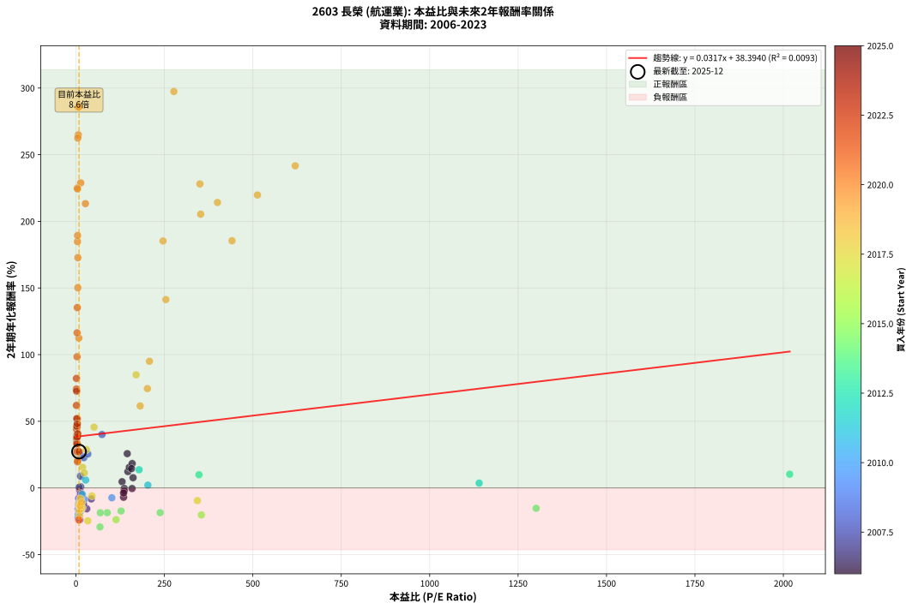
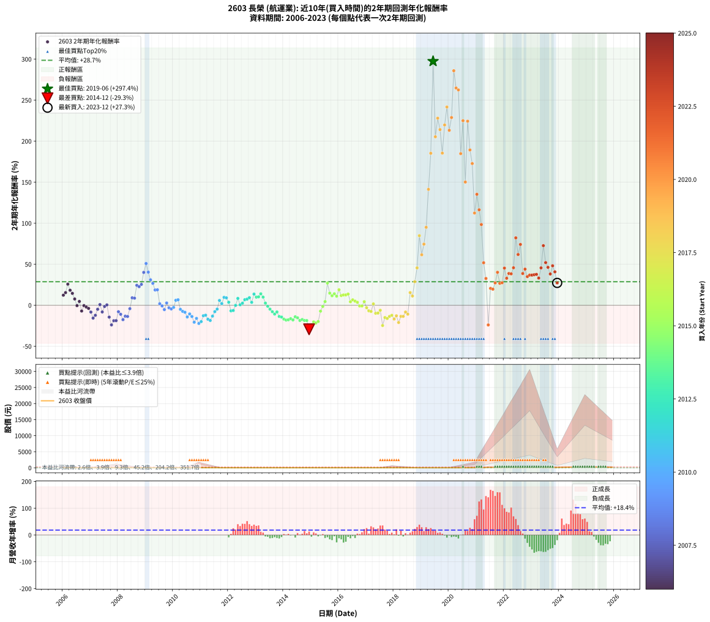

# 2603 長榮 - 本益比與未來報酬率分析

!!! info "報告資訊"
    - **股票代號**: 2603
    - **公司名稱**: 長榮
    - **產業別**: 航運業
    - **分析期間**: 2006-2023 (216 個數據點)
    - **資料來源**: Type 12 (ShowMonthlyK_ChartFlow) 月收盤價與本益比
    - **報酬率口徑**: 含現金股利 (簡化: 年度合計，假設每年7/1入帳)
    - **報告生成時間**: 2026-01-04 08:18:31 CST

## 📈 視覺化圖表

### 圖表1: 本益比 vs 未來報酬率關係

*圖表1：2603 長榮 本益比與2年期未來報酬率關係 (2006-2023)*

### 圖表2: 歷年買入時點的2年期實際報酬率

*圖表2：2603 長榮 歷年買入時點的2年期實際報酬率 (2006-2023)*

## 📍 買點訊號說明

本報告提供兩種買點提示訊號（顯示於圖表2的股價子圖中）：

### ▲ 小綠色三角形（回測驗證）
- **計算方式**: 使用全部歷史資料計算本益比第25百分位數
- **用途**: 事後驗證，顯示歷史上哪些時點確實為低估區
- **限制**: 當下無法判斷，僅供回測參考
- **特性**: 後見之明（Look-Ahead Bias）

### ▲ 小橘色三角形（即時訊號）
- **計算方式**: 使用截至當月的過去5年資料計算本益比第25百分位數
- **用途**: 實際投資決策，當時即可判斷
- **優勢**: 可操作性強，符合實務需求
- **特性**: 無後見之明，滾動窗口計算

!!! tip "如何使用兩種訊號"
    - **綠色▲** 幫助理解歷史估值機會，驗證策略有效性
    - **橘色▲** 可作為實際買進參考，但仍需搭配基本面分析
    - 兩種訊號重疊時，表示即時判斷與事後驗證一致，信心度較高
    - 僅有綠色▲時，表示當時無法判斷（需要未來資料才能確認）
    - 僅有橘色▲時，表示即時判斷為買點，但事後可能不是最佳時機

## 📊 估值分析摘要

| 指標 | 數值 |
|:---:|:---:|
| **目前本益比** (2023-12) | **8.59 倍** |
| **歷史平均本益比** | 95.23 倍 |
| **估值水準** | 🟢 相對低估 |
| **預期2年年化報酬率** | **+38.67%** |
| **歷史平均報酬率** | +28.69% |
| **相關係數 (R²)** | 0.0093 |
| **趨勢線斜率** | 0.0317 |

!!! abstract "核心洞察"
    目前本益比顯著低於歷史平均，預期未來報酬率可能較高

    根據歷史數據回測，2603 長榮 在目前本益比 **8.6倍** 的估值水準下，
    預期未來2年年化報酬率約為 **+38.7%**。

    **重要提醒**: 本分析基於歷史數據統計，實際報酬率會受到公司基本面變化、產業趨勢、
    總體經濟環境等多重因素影響。R² = 0.01 表示本益比可解釋約 0.9% 的報酬率變異。

## 📈 歷史估值統計

### 最佳買點 (最高報酬率)

| 項目 | 數值 |
|:---:|:---:|
| 起始時間 | 2019-06 |
| 當時本益比 | 276.70 倍 |
| 起始價格 | 12.4 元 |
| 2年後價格 | 197.0 元 |
| **2年年化報酬率** | **+297.41%** |

### 最差買點 (最低報酬率)

| 項目 | 數值 |
|:---:|:---:|
| 起始時間 | 2014-12 |
| 當時本益比 | 67.88 倍 |
| 起始價格 | 22.4 元 |
| 2年後價格 | 11.1 元 |
| **2年年化報酬率** | **-29.27%** |

## 🎯 投資啟示

### 本益比與報酬率關係

趨勢線方程式: **y = 0.0317x + 38.3940**

!!! info "弱相關或正相關"
    本益比與未來報酬率相關性較弱。這可能表示該股票的報酬率更多受到
    公司成長性、產業趨勢等因素影響，而非估值水準。**需綜合考量多項指標**。

### 估值區間建議

基於歷史數據分析:

- **🟢 低估區** (P/E < 76.2): 預期報酬率較高，可考慮增加持股
- **🟡 合理區** (P/E 76.2-114.3): 預期報酬率符合長期趨勢，正常持有
- **🔴 高估區** (P/E > 114.3): 預期報酬率較低，可考慮減碼或觀望

!!! danger "風險提示"
    - 過去表現不代表未來結果
    - 本分析假設公司基本面無重大結構性變化
    - 產業環境劇變可能使歷史規律失效
    - 應結合公司財報、產業趨勢、總體經濟等多重因素綜合判斷

!!! success "長期投資觀點"
    歷史數據顯示，在合理或低估的估值水準買入並長期持有，
    往往能獲得較佳的投資報酬。**耐心等待好價格**是價值投資的核心原則。

## 📊 數據品質

- **資料來源**: GoodInfo.tw Type 12 (ShowMonthlyK_ChartFlow)
- **資料頻率**: 月度收盤價與本益比
- **回測期間**: 2006-2023
- **數據點數量**: 216 個 (每個點代表一次2年期回測)

### 計算方法說明

1. **2年期年化報酬率**:
   - 對每個歷史時點，計算其後2年的實際投資報酬率
   - 期末價值(不含股利): 期末價格
   - 期末價值(含現金股利): 期末價格 + 持有期間內的現金股利合計 (簡化: 年度合計，假設每年7/1入帳)
   - 公式: 年化報酬率 = [(期末價值/期初價格)^(1/年數) - 1] × 100%

2. **本益比 (P/E Ratio)**:
   - 使用當時的月收盤價與EPS計算
   - 資料來源: Type 12 月度河流圖本益比數據

3. **趨勢線 (Linear Regression)**:
   - 使用最小平方法擬合線性趨勢線
   - R²值衡量本益比對報酬率的解釋能力

---

*本報告由 Stock Analysis System v1.9.0 自動生成*
*數據更新時間: 2026-01-04 08:18:31 CST*

## 📋 月度回測明細表

（每一列對應時間線圖中的一個買入點；可用來對照 SVG 圖上的每個點。）

| 買入月份 | 賣出月份 | 回測期限_年 | 實際持有年數 | 買入本益比_倍 | 買入收盤價_元 | 賣出收盤價_元 | 現金股利合計_元 | 總報酬率_pct | 年化報酬率_pct |
| --- | --- | --- | --- | --- | --- | --- | --- | --- | --- |
| 2006-01 | 2008-01 | 2 | 1.999 | 146.80 | 20.55 | 23.80 | 2.10 | +26.03 | +12.27 |
| 2006-02 | 2008-02 | 2 | 1.999 | 150.70 | 21.10 | 26.00 | 2.10 | +33.18 | +15.41 |
| 2006-03 | 2008-03 | 2 | 2.001 | 145.00 | 20.30 | 30.00 | 2.10 | +58.13 | +25.73 |
| 2006-04 | 2008-04 | 2 | 2.001 | 158.90 | 22.25 | 29.05 | 2.10 | +40.00 | +18.31 |
| 2006-05 | 2008-05 | 2 | 2.001 | 157.10 | 22.00 | 26.75 | 2.10 | +31.14 | +14.50 |
| 2006-06 | 2008-06 | 2 | 2.001 | 161.40 | 22.60 | 24.10 | 2.10 | +15.93 | +7.66 |
| 2006-07 | 2008-07 | 2 | 2.001 | 158.60 | 22.20 | 20.00 | 2.00 | -0.91 | -0.45 |
| 2006-08 | 2008-08 | 2 | 2.001 | 130.40 | 18.25 | 18.00 | 2.00 | +9.58 | +4.68 |
| 2006-09 | 2008-09 | 2 | 2.001 | 134.60 | 18.85 | 14.30 | 2.00 | -13.53 | -7.01 |
| 2006-10 | 2008-10 | 2 | 2.001 | 136.40 | 19.10 | 16.95 | 2.00 | -0.79 | -0.40 |
| 2006-11 | 2008-11 | 2 | 2.001 | 136.40 | 19.10 | 16.30 | 2.00 | -4.19 | -2.12 |
| 2006-12 | 2008-12 | 2 | 2.001 | 134.60 | 18.85 | 15.45 | 2.00 | -7.43 | -3.79 |
| 2007-01 | 2009-01 | 2 | 2.001 | 43.31 | 18.30 | 13.40 | 2.00 | -15.85 | -8.26 |
| 2007-02 | 2009-02 | 2 | 2.001 | 30.50 | 21.50 | 13.30 | 2.00 | -28.84 | -15.63 |
| 2007-03 | 2009-03 | 2 | 2.001 | 21.37 | 21.10 | 14.25 | 2.00 | -22.99 | -12.24 |
| 2007-04 | 2009-04 | 2 | 2.001 | 16.10 | 20.45 | 16.50 | 2.00 | -9.54 | -4.89 |
| 2007-05 | 2009-05 | 2 | 2.001 | 13.30 | 20.65 | 19.00 | 2.00 | +1.69 | +0.84 |
| 2007-06 | 2009-06 | 2 | 2.001 | 11.85 | 21.75 | 16.35 | 2.00 | -15.64 | -8.15 |
| 2007-07 | 2009-07 | 2 | 2.001 | 10.55 | 22.35 | 20.00 | 1.70 | -2.91 | -1.47 |
| 2007-08 | 2009-08 | 2 | 2.001 | 8.92 | 21.40 | 19.90 | 1.70 | +0.93 | +0.46 |
| 2007-09 | 2009-09 | 2 | 2.001 | 10.29 | 27.60 | 18.50 | 1.70 | -26.82 | -14.44 |
| 2007-10 | 2009-10 | 2 | 2.001 | 10.69 | 31.70 | 16.65 | 1.70 | -42.12 | -23.90 |
| 2007-11 | 2009-11 | 2 | 2.001 | 8.53 | 27.70 | 16.55 | 1.70 | -34.12 | -18.82 |
| 2007-12 | 2009-12 | 2 | 2.001 | 8.39 | 29.60 | 17.85 | 1.70 | -33.96 | -18.72 |
| 2008-01 | 2010-01 | 2 | 2.001 | 7.32 | 23.80 | 18.50 | 1.70 | -15.13 | -7.87 |
| 2008-02 | 2010-03 | 2 | 2.081 | 8.73 | 26.00 | 18.70 | 1.70 | -21.54 | -11.01 |
| 2008-03 | 2010-03 | 2 | 1.999 | 11.11 | 30.00 | 18.70 | 1.70 | -32.00 | -17.55 |
| 2008-04 | 2010-04 | 2 | 1.999 | 11.99 | 29.05 | 20.15 | 1.70 | -24.79 | -13.28 |
| 2008-05 | 2010-05 | 2 | 1.999 | 12.46 | 26.75 | 18.25 | 1.70 | -25.42 | -13.65 |
| 2008-06 | 2010-06 | 2 | 1.999 | 12.89 | 24.10 | 20.45 | 1.70 | -8.10 | -4.14 |
| 2008-07 | 2010-07 | 2 | 1.999 | 12.55 | 20.00 | 23.80 | 0.00 | +19.00 | +9.09 |
| 2008-08 | 2010-08 | 2 | 1.999 | 13.67 | 18.00 | 21.25 | 0.00 | +18.06 | +8.66 |
| 2008-09 | 2010-09 | 2 | 1.999 | 13.75 | 14.30 | 22.10 | 0.00 | +54.55 | +24.33 |
| 2008-10 | 2010-10 | 2 | 1.999 | 22.21 | 16.95 | 25.50 | 0.00 | +50.44 | +22.67 |
| 2008-11 | 2010-11 | 2 | 1.999 | 33.49 | 16.30 | 25.65 | 0.00 | +57.36 | +25.46 |
| 2008-12 | 2010-12 | 2 | 1.999 | 73.57 | 15.45 | 30.30 | 0.00 | +96.12 | +40.07 |
| 2009-01 | 2011-01 | 2 | 1.999 |  | 13.40 | 30.50 | 0.00 | +127.61 | +50.91 |
| 2009-02 | 2011-02 | 2 | 1.999 |  | 13.30 | 26.20 | 0.00 | +96.99 | +40.39 |
| 2009-03 | 2011-03 | 2 | 1.999 |  | 14.25 | 24.45 | 0.00 | +71.58 | +31.01 |
| 2009-04 | 2011-04 | 2 | 1.999 |  | 16.50 | 26.50 | 0.00 | +60.61 | +26.75 |
| 2009-05 | 2011-05 | 2 | 1.999 |  | 19.00 | 26.75 | 0.00 | +40.79 | +18.67 |
| 2009-06 | 2011-06 | 2 | 1.999 |  | 16.35 | 23.10 | 0.00 | +41.28 | +18.88 |
| 2009-07 | 2011-07 | 2 | 1.999 |  | 20.00 | 19.75 | 1.00 | +3.75 | +1.86 |
| 2009-08 | 2011-08 | 2 | 1.999 |  | 19.90 | 18.60 | 1.00 | -1.51 | -0.76 |
| 2009-09 | 2011-09 | 2 | 1.999 |  | 18.50 | 15.60 | 1.00 | -10.27 | -5.28 |
| 2009-10 | 2011-10 | 2 | 1.999 |  | 16.65 | 16.60 | 1.00 | +5.71 | +2.82 |
| 2009-11 | 2011-11 | 2 | 1.999 |  | 16.55 | 14.55 | 1.00 | -6.04 | -3.07 |
| 2009-12 | 2011-12 | 2 | 1.999 |  | 17.85 | 15.30 | 1.00 | -8.68 | -4.44 |
| 2010-01 | 2012-01 | 2 | 1.999 |  | 18.50 | 16.55 | 1.00 | -5.14 | -2.60 |
| 2010-02 | 2012-02 | 2 | 1.999 |  | 19.20 | 20.60 | 1.00 | +12.50 | +6.07 |
| 2010-03 | 2012-03 | 2 | 2.001 |  | 18.70 | 20.30 | 1.00 | +13.90 | +6.72 |
| 2010-04 | 2012-04 | 2 | 2.001 |  | 20.15 | 17.20 | 1.00 | -9.68 | -4.96 |
| 2010-05 | 2012-05 | 2 | 2.001 | 101.40 | 18.25 | 14.65 | 1.00 | -14.25 | -7.39 |
| 2010-06 | 2012-06 | 2 | 2.001 | 23.78 | 20.45 | 16.10 | 1.00 | -16.38 | -8.55 |
| 2010-07 | 2012-07 | 2 | 2.001 | 15.45 | 23.80 | 16.50 | 1.00 | -26.47 | -14.24 |
| 2010-08 | 2012-08 | 2 | 2.001 | 9.57 | 21.25 | 16.00 | 1.00 | -20.00 | -10.55 |
| 2010-09 | 2012-09 | 2 | 2.001 | 7.62 | 22.10 | 15.45 | 1.00 | -25.57 | -13.72 |
| 2010-10 | 2012-10 | 2 | 2.001 | 7.12 | 25.50 | 15.05 | 1.00 | -37.06 | -20.65 |
| 2010-11 | 2012-11 | 2 | 2.001 | 6.02 | 25.65 | 17.10 | 1.00 | -29.43 | -15.99 |
| 2010-12 | 2012-12 | 2 | 2.001 | 6.13 | 30.30 | 17.35 | 1.00 | -39.44 | -22.17 |
| 2011-01 | 2013-01 | 2 | 2.001 | 6.85 | 30.50 | 18.55 | 1.00 | -35.90 | -19.93 |
| 2011-02 | 2013-02 | 2 | 2.001 | 6.60 | 26.20 | 18.95 | 1.00 | -23.85 | -12.73 |
| 2011-03 | 2013-03 | 2 | 2.001 | 7.02 | 24.45 | 17.90 | 1.00 | -22.70 | -12.07 |
| 2011-04 | 2013-04 | 2 | 2.001 | 8.84 | 26.50 | 17.25 | 1.00 | -31.13 | -17.00 |
| 2011-05 | 2013-05 | 2 | 2.001 | 10.65 | 26.75 | 16.75 | 1.00 | -33.64 | -18.53 |
| 2011-06 | 2013-06 | 2 | 2.001 | 11.41 | 23.10 | 16.40 | 1.00 | -24.68 | -13.20 |
| 2011-07 | 2013-07 | 2 | 2.001 | 12.83 | 19.75 | 16.80 | 0.00 | -14.94 | -7.77 |
| 2011-08 | 2013-08 | 2 | 2.001 | 17.66 | 18.60 | 16.90 | 0.00 | -9.14 | -4.68 |
| 2011-09 | 2013-09 | 2 | 2.001 | 27.49 | 15.60 | 17.50 | 0.00 | +12.18 | +5.91 |
| 2011-10 | 2013-10 | 2 | 2.001 | 203.30 | 16.60 | 17.30 | 0.00 | +4.22 | +2.09 |
| 2011-11 | 2013-11 | 2 | 2.001 |  | 14.55 | 17.50 | 0.00 | +20.27 | +9.66 |
| 2011-12 | 2013-12 | 2 | 2.001 |  | 15.30 | 18.20 | 0.00 | +18.95 | +9.06 |
| 2012-01 | 2014-01 | 2 | 2.001 |  | 16.55 | 17.80 | 0.00 | +7.55 | +3.71 |
| 2012-02 | 2014-03 | 2 | 2.081 |  | 20.60 | 17.80 | 0.00 | -13.59 | -6.78 |
| 2012-03 | 2014-03 | 2 | 1.999 |  | 20.30 | 17.80 | 0.00 | -12.32 | -6.36 |
| 2012-04 | 2014-04 | 2 | 1.999 |  | 17.20 | 17.15 | 0.00 | -0.29 | -0.15 |
| 2012-05 | 2014-05 | 2 | 1.999 |  | 14.65 | 17.20 | 0.00 | +17.41 | +8.36 |
| 2012-06 | 2014-06 | 2 | 1.999 |  | 16.10 | 16.30 | 0.00 | +1.24 | +0.62 |
| 2012-07 | 2014-07 | 2 | 1.999 |  | 16.50 | 17.35 | 0.00 | +5.15 | +2.55 |
| 2012-08 | 2014-08 | 2 | 1.999 |  | 16.00 | 18.25 | 0.00 | +14.06 | +6.80 |
| 2012-09 | 2014-09 | 2 | 1.999 |  | 15.45 | 17.85 | 0.00 | +15.53 | +7.49 |
| 2012-10 | 2014-10 | 2 | 1.999 |  | 15.05 | 17.95 | 0.00 | +19.27 | +9.22 |
| 2012-11 | 2014-11 | 2 | 1.999 | 1140.00 | 17.10 | 18.35 | 0.00 | +7.31 | +3.59 |
| 2012-12 | 2014-12 | 2 | 1.999 | 178.40 | 17.35 | 22.40 | 0.00 | +29.11 | +13.64 |
| 2013-01 | 2015-01 | 2 | 1.999 | 347.80 | 18.55 | 22.40 | 0.00 | +20.75 | +9.90 |
| 2013-02 | 2015-02 | 2 | 1.999 | 2018.00 | 18.95 | 23.05 | 0.00 | +21.64 | +10.30 |
| 2013-03 | 2015-03 | 2 | 1.999 |  | 17.90 | 23.25 | 0.00 | +29.89 | +13.98 |
| 2013-04 | 2015-04 | 2 | 1.999 |  | 17.25 | 20.85 | 0.00 | +20.87 | +9.95 |
| 2013-05 | 2015-05 | 2 | 1.999 |  | 16.75 | 17.65 | 0.00 | +5.37 | +2.65 |
| 2013-06 | 2015-06 | 2 | 1.999 |  | 16.40 | 16.00 | 0.00 | -2.44 | -1.23 |
| 2013-07 | 2015-07 | 2 | 1.999 |  | 16.80 | 15.15 | 0.10 | -9.23 | -4.73 |
| 2013-08 | 2015-08 | 2 | 1.999 |  | 16.90 | 14.25 | 0.10 | -15.09 | -7.86 |
| 2013-09 | 2015-09 | 2 | 1.999 |  | 17.50 | 13.85 | 0.10 | -20.29 | -10.72 |
| 2013-10 | 2015-10 | 2 | 1.999 |  | 17.30 | 14.50 | 0.10 | -15.61 | -8.14 |
| 2013-11 | 2015-11 | 2 | 1.999 |  | 17.50 | 12.95 | 0.10 | -25.43 | -13.65 |
| 2013-12 | 2015-12 | 2 | 1.999 |  | 18.20 | 13.25 | 0.10 | -26.65 | -14.36 |
| 2014-01 | 2016-01 | 2 | 1.999 |  | 17.80 | 12.20 | 0.10 | -30.90 | -16.88 |
| 2014-02 | 2016-02 | 2 | 1.999 |  | 18.00 | 12.00 | 0.10 | -32.78 | -18.02 |
| 2014-03 | 2016-03 | 2 | 2.001 |  | 17.80 | 11.95 | 0.10 | -32.30 | -17.71 |
| 2014-04 | 2016-04 | 2 | 2.001 |  | 17.15 | 11.90 | 0.10 | -30.03 | -16.34 |
| 2014-05 | 2016-05 | 2 | 2.001 |  | 17.20 | 11.50 | 0.10 | -32.56 | -17.87 |
| 2014-06 | 2016-06 | 2 | 2.001 |  | 16.30 | 11.95 | 0.10 | -26.07 | -14.01 |
| 2014-07 | 2016-07 | 2 | 2.001 | 1301.00 | 17.35 | 12.35 | 0.10 | -28.24 | -15.28 |
| 2014-08 | 2016-08 | 2 | 2.001 | 238.00 | 18.25 | 12.00 | 0.10 | -33.70 | -18.56 |
| 2014-09 | 2016-09 | 2 | 2.001 | 127.50 | 17.85 | 12.10 | 0.10 | -31.65 | -17.32 |
| 2014-10 | 2016-10 | 2 | 2.001 | 88.28 | 17.95 | 11.80 | 0.10 | -33.70 | -18.57 |
| 2014-11 | 2016-11 | 2 | 2.001 | 68.81 | 18.35 | 12.05 | 0.10 | -33.79 | -18.62 |
| 2014-12 | 2016-12 | 2 | 2.001 | 67.88 | 22.40 | 11.10 | 0.10 | -50.00 | -29.27 |
| 2015-01 | 2017-01 | 2 | 2.001 | 113.40 | 22.40 | 12.90 | 0.10 | -41.96 | -23.80 |
| 2015-02 | 2017-02 | 2 | 2.001 | 354.60 | 23.05 | 14.55 | 0.10 | -36.44 | -20.26 |
| 2015-03 | 2017-03 | 2 | 2.001 |  | 23.25 | 14.20 | 0.10 | -38.49 | -21.56 |
| 2015-04 | 2017-04 | 2 | 2.001 |  | 20.85 | 13.30 | 0.10 | -35.73 | -19.82 |
| 2015-05 | 2017-05 | 2 | 2.001 |  | 17.65 | 15.10 | 0.10 | -13.88 | -7.19 |
| 2015-06 | 2017-06 | 2 | 2.001 |  | 16.00 | 15.45 | 0.10 | -2.81 | -1.42 |
| 2015-07 | 2017-07 | 2 | 2.001 |  | 15.15 | 16.55 | 0.00 | +9.24 | +4.52 |
| 2015-08 | 2017-08 | 2 | 2.001 |  | 14.25 | 23.00 | 0.00 | +61.40 | +27.02 |
| 2015-09 | 2017-09 | 2 | 2.001 |  | 13.85 | 18.25 | 0.00 | +31.77 | +14.78 |
| 2015-10 | 2017-10 | 2 | 2.001 |  | 14.50 | 18.05 | 0.00 | +24.48 | +11.56 |
| 2015-11 | 2017-11 | 2 | 2.001 |  | 12.95 | 16.85 | 0.00 | +30.12 | +14.06 |
| 2015-12 | 2017-12 | 2 | 2.001 |  | 13.25 | 16.35 | 0.00 | +23.40 | +11.08 |
| 2016-01 | 2018-01 | 2 | 2.001 |  | 12.20 | 17.25 | 0.00 | +41.39 | +18.89 |
| 2016-02 | 2018-03 | 2 | 2.081 |  | 12.00 | 15.15 | 0.00 | +26.25 | +11.85 |
| 2016-03 | 2018-03 | 2 | 1.999 |  | 11.95 | 15.15 | 0.00 | +26.78 | +12.60 |
| 2016-04 | 2018-04 | 2 | 1.999 |  | 11.90 | 15.10 | 0.00 | +26.89 | +12.65 |
| 2016-05 | 2018-05 | 2 | 1.999 |  | 11.50 | 14.85 | 0.00 | +29.13 | +13.65 |
| 2016-06 | 2018-06 | 2 | 1.999 |  | 11.95 | 13.00 | 0.00 | +8.79 | +4.30 |
| 2016-07 | 2018-07 | 2 | 1.999 |  | 12.35 | 13.85 | 0.20 | +13.77 | +6.67 |
| 2016-08 | 2018-08 | 2 | 1.999 |  | 12.00 | 13.05 | 0.20 | +10.42 | +5.08 |
| 2016-09 | 2018-09 | 2 | 1.999 |  | 12.10 | 12.80 | 0.20 | +7.44 | +3.65 |
| 2016-10 | 2018-10 | 2 | 1.999 |  | 11.80 | 11.40 | 0.20 | -1.69 | -0.85 |
| 2016-11 | 2018-11 | 2 | 1.999 |  | 12.05 | 11.65 | 0.20 | -1.66 | -0.83 |
| 2016-12 | 2018-12 | 2 | 1.999 |  | 11.10 | 11.90 | 0.20 | +9.01 | +4.41 |
| 2017-01 | 2019-01 | 2 | 1.999 |  | 12.90 | 11.95 | 0.20 | -5.81 | -2.95 |
| 2017-02 | 2019-02 | 2 | 1.999 |  | 14.55 | 12.45 | 0.20 | -13.06 | -6.76 |
| 2017-03 | 2019-03 | 2 | 1.999 |  | 14.20 | 11.95 | 0.20 | -14.44 | -7.50 |
| 2017-04 | 2019-04 | 2 | 1.999 |  | 13.30 | 13.55 | 0.20 | +3.38 | +1.68 |
| 2017-05 | 2019-05 | 2 | 1.999 |  | 15.10 | 12.10 | 0.20 | -18.54 | -9.75 |
| 2017-06 | 2019-06 | 2 | 1.999 | 343.30 | 15.45 | 12.45 | 0.20 | -18.12 | -9.52 |
| 2017-07 | 2019-07 | 2 | 1.999 | 45.24 | 16.55 | 14.40 | 0.20 | -11.78 | -6.08 |
| 2017-08 | 2019-08 | 2 | 1.999 | 33.50 | 23.00 | 12.85 | 0.20 | -43.26 | -24.69 |
| 2017-09 | 2019-09 | 2 | 1.999 | 18.11 | 18.25 | 13.00 | 0.20 | -27.67 | -14.96 |
| 2017-10 | 2019-10 | 2 | 1.999 | 13.59 | 18.05 | 12.50 | 0.20 | -29.64 | -16.13 |
| 2017-11 | 2019-11 | 2 | 1.999 | 10.22 | 16.85 | 12.40 | 0.20 | -25.22 | -13.53 |
| 2017-12 | 2019-12 | 2 | 1.999 | 8.30 | 16.35 | 12.40 | 0.20 | -22.94 | -12.22 |
| 2018-01 | 2020-01 | 2 | 1.999 | 9.52 | 17.25 | 11.75 | 0.20 | -30.72 | -16.78 |
| 2018-02 | 2020-02 | 2 | 1.999 | 9.34 | 15.45 | 11.55 | 0.20 | -23.95 | -12.80 |
| 2018-03 | 2020-03 | 2 | 2.001 | 10.13 | 15.15 | 9.25 | 0.20 | -37.62 | -21.01 |
| 2018-04 | 2020-04 | 2 | 2.001 | 11.30 | 15.10 | 11.10 | 0.20 | -25.17 | -13.48 |
| 2018-05 | 2020-05 | 2 | 2.001 | 12.60 | 14.85 | 10.90 | 0.20 | -25.25 | -13.53 |
| 2018-06 | 2020-06 | 2 | 2.001 | 12.75 | 13.00 | 10.75 | 0.20 | -15.77 | -8.22 |
| 2018-07 | 2020-07 | 2 | 2.001 | 16.07 | 13.85 | 11.00 | 0.00 | -20.58 | -10.87 |
| 2018-08 | 2020-08 | 2 | 2.001 | 18.55 | 13.05 | 17.40 | 0.00 | +33.33 | +15.46 |
| 2018-09 | 2020-09 | 2 | 2.001 | 23.49 | 12.80 | 15.85 | 0.00 | +23.83 | +11.27 |
| 2018-10 | 2020-10 | 2 | 2.001 | 29.48 | 11.40 | 18.90 | 0.00 | +65.79 | +28.74 |
| 2018-11 | 2020-11 | 2 | 2.001 | 51.02 | 11.65 | 24.70 | 0.00 | +112.02 | +45.57 |
| 2018-12 | 2020-12 | 2 | 2.001 | 170.00 | 11.90 | 40.70 | 0.00 | +242.02 | +84.86 |
| 2019-01 | 2021-01 | 2 | 2.001 | 181.50 | 11.95 | 31.20 | 0.00 | +161.09 | +61.53 |
| 2019-02 | 2021-02 | 2 | 2.001 | 201.90 | 12.45 | 37.95 | 0.00 | +204.82 | +74.52 |
| 2019-03 | 2021-03 | 2 | 2.001 | 207.80 | 11.95 | 45.50 | 0.00 | +280.75 | +95.04 |
| 2019-04 | 2021-04 | 2 | 2.001 | 254.10 | 13.55 | 79.00 | 0.00 | +483.03 | +141.31 |
| 2019-05 | 2021-05 | 2 | 2.001 | 246.10 | 12.10 | 98.60 | 0.00 | +714.88 | +185.26 |
| 2019-06 | 2021-06 | 2 | 2.001 | 276.70 | 12.45 | 197.00 | 0.00 | +1482.33 | +297.41 |
| 2019-07 | 2021-07 | 2 | 2.001 | 352.60 | 14.40 | 132.00 | 2.49 | +833.94 | +205.37 |
| 2019-08 | 2021-08 | 2 | 2.001 | 350.40 | 12.85 | 136.00 | 2.49 | +977.72 | +228.02 |
| 2019-09 | 2021-09 | 2 | 2.001 | 400.00 | 13.00 | 126.00 | 2.49 | +888.36 | +214.14 |
| 2019-10 | 2021-10 | 2 | 2.001 | 441.20 | 12.50 | 99.50 | 2.49 | +715.90 | +185.43 |
| 2019-11 | 2021-11 | 2 | 2.001 | 513.10 | 12.40 | 124.50 | 2.49 | +924.09 | +219.76 |
| 2019-12 | 2021-12 | 2 | 2.001 | 620.00 | 12.40 | 142.50 | 2.49 | +1069.25 | +241.66 |
| 2020-01 | 2022-01 | 2 | 2.001 | 26.70 | 11.75 | 113.00 | 2.49 | +882.87 | +213.26 |
| 2020-02 | 2022-03 | 2 | 2.081 | 13.43 | 11.55 | 135.00 | 2.49 | +1090.36 | +228.82 |
| 2020-03 | 2022-03 | 2 | 1.999 | 7.23 | 9.25 | 135.00 | 2.49 | +1386.35 | +285.89 |
| 2020-04 | 2022-04 | 2 | 1.999 | 6.53 | 11.10 | 145.00 | 2.49 | +1228.71 | +264.84 |
| 2020-05 | 2022-05 | 2 | 1.999 | 5.14 | 10.90 | 140.50 | 2.49 | +1211.81 | +262.51 |
| 2020-06 | 2022-06 | 2 | 1.999 | 4.23 | 10.75 | 84.60 | 2.49 | +710.11 | +184.83 |
| 2020-07 | 2022-07 | 2 | 1.999 | 3.72 | 11.00 | 95.50 | 20.49 | +954.43 | +224.98 |
| 2020-08 | 2022-08 | 2 | 1.999 | 5.15 | 17.40 | 88.30 | 20.49 | +525.21 | +150.20 |
| 2020-09 | 2022-09 | 2 | 1.999 | 4.17 | 15.85 | 146.00 | 20.49 | +950.39 | +224.36 |
| 2020-10 | 2022-10 | 2 | 1.999 | 4.48 | 18.90 | 137.50 | 20.49 | +735.91 | +189.33 |
| 2020-11 | 2022-11 | 2 | 1.999 | 5.32 | 24.70 | 163.00 | 20.49 | +642.86 | +172.74 |
| 2020-12 | 2022-12 | 2 | 1.999 | 8.04 | 40.70 | 163.00 | 20.49 | +350.83 | +112.44 |
| 2021-01 | 2023-01 | 2 | 1.999 | 3.70 | 31.20 | 152.00 | 20.49 | +452.84 | +135.26 |
| 2021-02 | 2023-02 | 2 | 1.999 | 3.21 | 37.95 | 157.00 | 20.49 | +367.69 | +116.37 |
| 2021-03 | 2023-03 | 2 | 1.999 | 3.00 | 45.50 | 158.50 | 20.49 | +293.38 | +98.43 |
| 2021-04 | 2023-04 | 2 | 1.999 | 4.26 | 79.00 | 161.50 | 20.49 | +130.36 | +51.82 |
| 2021-05 | 2023-05 | 2 | 1.999 | 4.49 | 98.60 | 153.00 | 20.49 | +75.95 | +32.67 |
| 2021-06 | 2023-06 | 2 | 1.999 | 7.78 | 197.00 | 93.50 | 20.49 | -42.14 | -23.95 |
| 2021-07 | 2023-07 | 2 | 1.999 | 4.60 | 132.00 | 104.00 | 88.00 | +45.45 | +20.62 |
| 2021-08 | 2023-08 | 2 | 1.999 | 4.24 | 136.00 | 106.50 | 88.00 | +43.01 | +19.60 |
| 2021-09 | 2023-09 | 2 | 1.999 | 3.56 | 126.00 | 116.00 | 88.00 | +61.90 | +27.26 |
| 2021-10 | 2023-10 | 2 | 1.999 | 2.56 | 99.50 | 107.50 | 88.00 | +96.48 | +40.20 |
| 2021-11 | 2023-11 | 2 | 1.999 | 2.95 | 124.50 | 112.00 | 88.00 | +60.64 | +26.77 |
| 2021-12 | 2023-12 | 2 | 1.999 | 3.13 | 142.50 | 143.50 | 88.00 | +62.46 | +27.48 |
| 2022-01 | 2024-01 | 2 | 1.999 | 2.30 | 113.00 | 150.50 | 88.00 | +111.06 | +45.32 |
| 2022-02 | 2024-02 | 2 | 1.999 | 2.73 | 143.50 | 165.50 | 88.00 | +76.66 | +32.94 |
| 2022-03 | 2024-03 | 2 | 2.001 | 2.41 | 135.00 | 172.00 | 88.00 | +92.59 | +38.75 |
| 2022-04 | 2024-04 | 2 | 2.001 | 2.44 | 145.00 | 189.50 | 88.00 | +91.38 | +38.31 |
| 2022-05 | 2024-05 | 2 | 2.001 | 2.24 | 140.50 | 210.50 | 88.00 | +112.46 | +45.72 |
| 2022-06 | 2024-06 | 2 | 2.001 | 1.28 | 84.60 | 193.00 | 88.00 | +232.15 | +82.18 |
| 2022-07 | 2024-07 | 2 | 2.001 | 1.37 | 95.50 | 170.50 | 79.97 | +162.27 | +61.89 |
| 2022-08 | 2024-08 | 2 | 2.001 | 1.21 | 88.30 | 188.00 | 79.97 | +203.47 | +74.14 |
| 2022-09 | 2024-09 | 2 | 2.001 | 1.90 | 146.00 | 201.00 | 79.97 | +92.44 | +38.69 |
| 2022-10 | 2024-10 | 2 | 2.001 | 1.72 | 137.50 | 205.50 | 79.97 | +107.61 | +44.05 |
| 2022-11 | 2024-11 | 2 | 2.001 | 1.95 | 163.00 | 217.00 | 79.97 | +82.19 | +34.95 |
| 2022-12 | 2024-12 | 2 | 2.001 | 1.87 | 163.00 | 225.00 | 79.97 | +87.10 | +36.75 |
| 2023-01 | 2025-01 | 2 | 2.001 | 1.87 | 152.00 | 204.50 | 79.97 | +87.15 | +36.77 |
| 2023-02 | 2025-02 | 2 | 2.001 | 2.08 | 157.00 | 216.00 | 79.97 | +88.51 | +37.27 |
| 2023-03 | 2025-03 | 2 | 2.001 | 2.28 | 158.50 | 220.50 | 79.97 | +89.57 | +37.65 |
| 2023-04 | 2025-04 | 2 | 2.001 | 2.54 | 161.50 | 206.50 | 79.97 | +77.38 | +33.16 |
| 2023-05 | 2025-05 | 2 | 2.001 | 2.65 | 153.00 | 244.50 | 79.97 | +112.07 | +45.59 |
| 2023-06 | 2025-06 | 2 | 2.001 | 1.80 | 93.50 | 199.00 | 79.97 | +198.36 | +72.67 |
| 2023-07 | 2025-07 | 2 | 2.001 | 2.26 | 104.00 | 198.00 | 42.47 | +131.22 | +52.01 |
| 2023-08 | 2025-08 | 2 | 2.001 | 2.65 | 106.50 | 185.50 | 42.47 | +114.05 | +46.27 |
| 2023-09 | 2025-09 | 2 | 2.001 | 3.38 | 116.00 | 179.00 | 42.47 | +90.92 | +38.14 |
| 2023-10 | 2025-10 | 2 | 2.001 | 3.78 | 107.50 | 193.50 | 42.47 | +119.50 | +48.12 |
| 2023-11 | 2025-11 | 2 | 2.001 | 4.96 | 112.00 | 179.50 | 42.47 | +98.18 | +40.74 |
| 2023-12 | 2025-12 | 2 | 2.001 | 8.59 | 143.50 | 190.00 | 42.47 | +62.00 | +27.26 |
