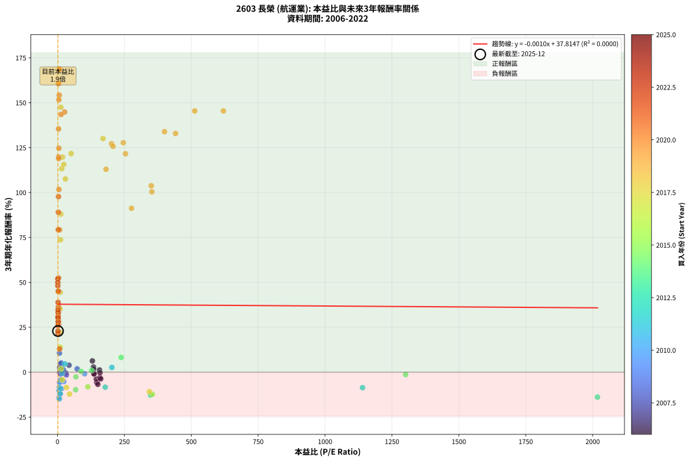
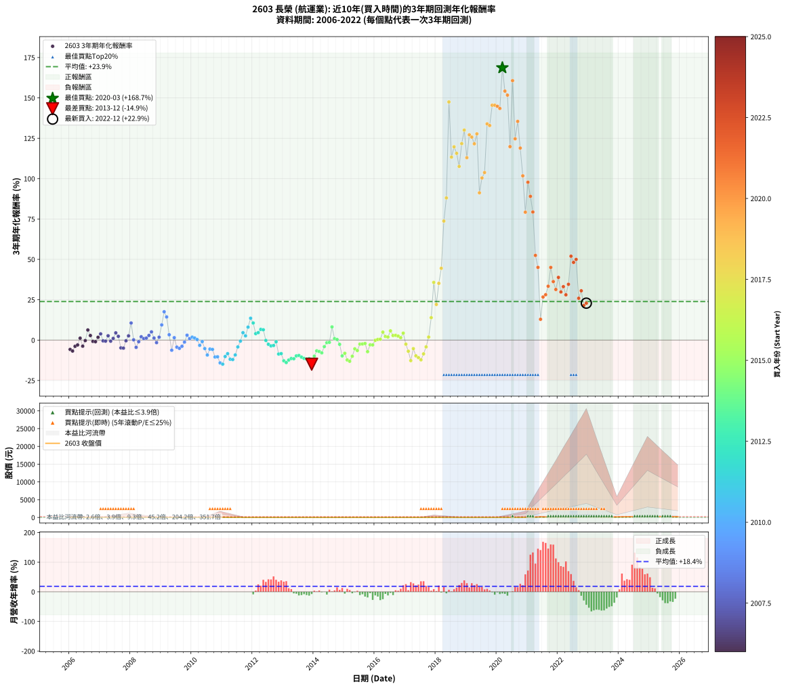

# 2603 長榮 - 本益比與未來報酬率分析

!!! info "報告資訊"
    - **股票代號**: 2603
    - **公司名稱**: 長榮
    - **產業別**: 航運業
    - **分析期間**: 2006-2022 (204 個數據點)
    - **資料來源**: Type 12 (ShowMonthlyK_ChartFlow) 月收盤價與本益比
    - **報酬率口徑**: 含現金股利 (簡化: 年度合計，假設每年7/1入帳)
    - **報告生成時間**: 2026-01-07 20:52:53 CST

## 📈 視覺化圖表

### 圖表1: 本益比 vs 未來報酬率關係

*圖表1：2603 長榮 本益比與3年期未來報酬率關係 (2006-2022)*

### 圖表2: 歷年買入時點的3年期實際報酬率

*圖表2：2603 長榮 歷年買入時點的3年期實際報酬率 (2006-2022)*

## 📍 買點訊號說明

本報告提供兩種買點提示訊號（顯示於圖表2的股價子圖中）：

### ▲ 小綠色三角形（回測驗證）
- **計算方式**: 使用全部歷史資料計算本益比第25百分位數
- **用途**: 事後驗證，顯示歷史上哪些時點確實為低估區
- **限制**: 當下無法判斷，僅供回測參考
- **特性**: 後見之明（Look-Ahead Bias）

### ▲ 小橘色三角形（即時訊號）
- **計算方式**: 使用截至當月的過去5年資料計算本益比第25百分位數
- **用途**: 實際投資決策，當時即可判斷
- **優勢**: 可操作性強，符合實務需求
- **特性**: 無後見之明，滾動窗口計算

!!! tip "如何使用兩種訊號"
    - **綠色▲** 幫助理解歷史估值機會，驗證策略有效性
    - **橘色▲** 可作為實際買進參考，但仍需搭配基本面分析
    - 兩種訊號重疊時，表示即時判斷與事後驗證一致，信心度較高
    - 僅有綠色▲時，表示當時無法判斷（需要未來資料才能確認）
    - 僅有橘色▲時，表示即時判斷為買點，但事後可能不是最佳時機

## 📊 估值分析摘要

| 指標 | 數值 |
|:---:|:---:|
| **目前本益比** (2022-12) | **1.87 倍** |
| **歷史平均本益比** | 103.52 倍 |
| **估值水準** | 🟢 相對低估 |
| **預期3年年化報酬率** | **+37.81%** |
| **歷史平均報酬率** | +23.89% |
| **相關係數 (R²)** | 0.0000 |
| **趨勢線斜率** | -0.0010 |

!!! abstract "核心洞察"
    目前本益比顯著低於歷史平均，預期未來報酬率可能較高

    根據歷史數據回測，2603 長榮 在目前本益比 **1.9倍** 的估值水準下，
    預期未來3年年化報酬率約為 **+37.8%**。

    **重要提醒**: 本分析基於歷史數據統計，實際報酬率會受到公司基本面變化、產業趨勢、
    總體經濟環境等多重因素影響。R² = 0.00 表示本益比可解釋約 0.0% 的報酬率變異。

## 📈 歷史估值統計

### 最佳買點 (最高報酬率)

| 項目 | 數值 |
|:---:|:---:|
| 起始時間 | 2020-03 |
| 當時本益比 | 7.23 倍 |
| 起始價格 | 9.2 元 |
| 3年後價格 | 158.5 元 |
| **3年年化報酬率** | **+168.65%** |

### 最差買點 (最低報酬率)

| 項目 | 數值 |
|:---:|:---:|
| 起始時間 | 2013-12 |
| 當時本益比 | nan 倍 |
| 起始價格 | 18.2 元 |
| 3年後價格 | 11.1 元 |
| **3年年化報酬率** | **-14.94%** |

## 🎯 投資啟示

### 本益比與報酬率關係

趨勢線方程式: **y = -0.0010x + 37.8147**

!!! note "負相關"
    本益比與未來報酬率呈現負相關。較低的本益比通常帶來較高的未來報酬率，
    但相關性不算非常強。**估值仍是重要參考指標之一**。

### 估值區間建議

基於歷史數據分析:

- **🟢 低估區** (P/E < 82.8): 預期報酬率較高，可考慮增加持股
- **🟡 合理區** (P/E 82.8-124.2): 預期報酬率符合長期趨勢，正常持有
- **🔴 高估區** (P/E > 124.2): 預期報酬率較低，可考慮減碼或觀望

!!! danger "風險提示"
    - 過去表現不代表未來結果
    - 本分析假設公司基本面無重大結構性變化
    - 產業環境劇變可能使歷史規律失效
    - 應結合公司財報、產業趨勢、總體經濟等多重因素綜合判斷

!!! success "長期投資觀點"
    歷史數據顯示，在合理或低估的估值水準買入並長期持有，
    往往能獲得較佳的投資報酬。**耐心等待好價格**是價值投資的核心原則。

## 📊 數據品質

- **資料來源**: GoodInfo.tw Type 12 (ShowMonthlyK_ChartFlow)
- **資料頻率**: 月度收盤價與本益比
- **回測期間**: 2006-2022
- **數據點數量**: 204 個 (每個點代表一次3年期回測)

### 計算方法說明

1. **3年期年化報酬率**:
   - 對每個歷史時點，計算其後3年的實際投資報酬率
   - 期末價值(不含股利): 期末價格
   - 期末價值(含現金股利): 期末價格 + 持有期間內的現金股利合計 (簡化: 年度合計，假設每年7/1入帳)
   - 公式: 年化報酬率 = [(期末價值/期初價格)^(1/年數) - 1] × 100%

2. **本益比 (P/E Ratio)**:
   - 使用當時的月收盤價與EPS計算
   - 資料來源: Type 12 月度河流圖本益比數據

3. **趨勢線 (Linear Regression)**:
   - 使用最小平方法擬合線性趨勢線
   - R²值衡量本益比對報酬率的解釋能力

---

*本報告由 Stock Analysis System v1.9.0 自動生成*
*數據更新時間: 2026-01-07 20:52:53 CST*

## 📋 月度回測明細表

（每一列對應時間線圖中的一個買入點；可用來對照 SVG 圖上的每個點。）

| 買入月份 | 賣出月份 | 回測期限_年 | 實際持有年數 | 買入本益比_倍 | 買入收盤價_元 | 賣出收盤價_元 | 現金股利合計_元 | 總報酬率_pct | 年化報酬率_pct |
| --- | --- | --- | --- | --- | --- | --- | --- | --- | --- |
| 2006-01 | 2009-01 | 3 | 3.001 | 146.80 | 20.55 | 13.40 | 3.80 | -16.31 | -5.76 |
| 2006-02 | 2009-02 | 3 | 3.001 | 150.70 | 21.10 | 13.30 | 3.80 | -18.96 | -6.77 |
| 2006-03 | 2009-03 | 3 | 3.001 | 145.00 | 20.30 | 14.25 | 3.80 | -11.09 | -3.84 |
| 2006-04 | 2009-04 | 3 | 3.001 | 158.90 | 22.25 | 16.50 | 3.80 | -8.77 | -3.01 |
| 2006-05 | 2009-05 | 3 | 3.001 | 157.10 | 22.00 | 19.00 | 3.80 | +3.63 | +1.20 |
| 2006-06 | 2009-06 | 3 | 3.001 | 161.40 | 22.60 | 16.35 | 3.80 | -10.85 | -3.75 |
| 2006-07 | 2009-07 | 3 | 3.001 | 158.60 | 22.20 | 20.00 | 2.00 | -0.91 | -0.30 |
| 2006-08 | 2009-08 | 3 | 3.001 | 130.40 | 18.25 | 19.90 | 2.00 | +19.99 | +6.26 |
| 2006-09 | 2009-09 | 3 | 3.001 | 134.60 | 18.85 | 18.50 | 2.00 | +8.75 | +2.83 |
| 2006-10 | 2009-10 | 3 | 3.001 | 136.40 | 19.10 | 16.65 | 2.00 | -2.36 | -0.79 |
| 2006-11 | 2009-11 | 3 | 3.001 | 136.40 | 19.10 | 16.55 | 2.00 | -2.88 | -0.97 |
| 2006-12 | 2009-12 | 3 | 3.001 | 134.60 | 18.85 | 17.85 | 2.00 | +5.30 | +1.74 |
| 2007-01 | 2010-01 | 3 | 3.001 | 43.31 | 18.30 | 18.50 | 2.00 | +12.02 | +3.85 |
| 2007-02 | 2010-02 | 3 | 3.001 | 30.50 | 21.50 | 19.20 | 2.00 | -1.40 | -0.47 |
| 2007-03 | 2010-03 | 3 | 3.001 | 21.37 | 21.10 | 18.70 | 2.00 | -1.90 | -0.64 |
| 2007-04 | 2010-04 | 3 | 3.001 | 16.10 | 20.45 | 20.15 | 2.00 | +8.31 | +2.70 |
| 2007-05 | 2010-05 | 3 | 3.001 | 13.30 | 20.65 | 18.25 | 2.00 | -1.94 | -0.65 |
| 2007-06 | 2010-06 | 3 | 3.001 | 11.85 | 21.75 | 20.45 | 2.00 | +3.21 | +1.06 |
| 2007-07 | 2010-07 | 3 | 3.001 | 10.55 | 22.35 | 23.80 | 1.70 | +14.09 | +4.49 |
| 2007-08 | 2010-08 | 3 | 3.001 | 8.92 | 21.40 | 21.25 | 1.70 | +7.24 | +2.36 |
| 2007-09 | 2010-09 | 3 | 3.001 | 10.29 | 27.60 | 22.10 | 1.70 | -13.77 | -4.82 |
| 2007-10 | 2010-10 | 3 | 3.001 | 10.69 | 31.70 | 25.50 | 1.70 | -14.20 | -4.98 |
| 2007-11 | 2010-11 | 3 | 3.001 | 8.53 | 27.70 | 25.65 | 1.70 | -1.27 | -0.42 |
| 2007-12 | 2010-12 | 3 | 3.001 | 8.39 | 29.60 | 30.30 | 1.70 | +8.10 | +2.63 |
| 2008-01 | 2011-01 | 3 | 3.001 | 7.32 | 23.80 | 30.50 | 1.70 | +35.29 | +10.60 |
| 2008-02 | 2011-03 | 3 | 3.080 | 8.73 | 26.00 | 24.45 | 1.70 | +0.57 | +0.19 |
| 2008-03 | 2011-03 | 3 | 2.998 | 11.11 | 30.00 | 24.45 | 1.70 | -12.84 | -4.48 |
| 2008-04 | 2011-04 | 3 | 2.998 | 11.99 | 29.05 | 26.50 | 1.70 | -2.93 | -0.99 |
| 2008-05 | 2011-05 | 3 | 2.998 | 12.46 | 26.75 | 26.75 | 1.70 | +6.35 | +2.08 |
| 2008-06 | 2011-06 | 3 | 2.998 | 12.89 | 24.10 | 23.10 | 1.70 | +2.90 | +0.96 |
| 2008-07 | 2011-07 | 3 | 2.998 | 12.55 | 20.00 | 19.75 | 1.00 | +3.75 | +1.24 |
| 2008-08 | 2011-08 | 3 | 2.998 | 13.67 | 18.00 | 18.60 | 1.00 | +8.89 | +2.88 |
| 2008-09 | 2011-09 | 3 | 2.998 | 13.75 | 14.30 | 15.60 | 1.00 | +16.08 | +5.10 |
| 2008-10 | 2011-10 | 3 | 2.998 | 22.21 | 16.95 | 16.60 | 1.00 | +3.83 | +1.26 |
| 2008-11 | 2011-11 | 3 | 2.998 | 33.49 | 16.30 | 14.55 | 1.00 | -4.60 | -1.56 |
| 2008-12 | 2011-12 | 3 | 2.998 | 73.57 | 15.45 | 15.30 | 1.00 | +5.50 | +1.80 |
| 2009-01 | 2012-01 | 3 | 2.998 |  | 13.40 | 16.55 | 1.00 | +30.97 | +9.42 |
| 2009-02 | 2012-02 | 3 | 2.998 |  | 13.30 | 20.60 | 1.00 | +62.41 | +17.56 |
| 2009-03 | 2012-03 | 3 | 3.001 |  | 14.25 | 20.30 | 1.00 | +49.47 | +14.33 |
| 2009-04 | 2012-04 | 3 | 3.001 |  | 16.50 | 17.20 | 1.00 | +10.30 | +3.32 |
| 2009-05 | 2012-05 | 3 | 3.001 |  | 19.00 | 14.65 | 1.00 | -17.63 | -6.26 |
| 2009-06 | 2012-06 | 3 | 3.001 |  | 16.35 | 16.10 | 1.00 | +4.59 | +1.51 |
| 2009-07 | 2012-07 | 3 | 3.001 |  | 20.00 | 16.50 | 1.00 | -12.50 | -4.35 |
| 2009-08 | 2012-08 | 3 | 3.001 |  | 19.90 | 16.00 | 1.00 | -14.57 | -5.11 |
| 2009-09 | 2012-09 | 3 | 3.001 |  | 18.50 | 15.45 | 1.00 | -11.08 | -3.84 |
| 2009-10 | 2012-10 | 3 | 3.001 |  | 16.65 | 15.05 | 1.00 | -3.60 | -1.22 |
| 2009-11 | 2012-11 | 3 | 3.001 |  | 16.55 | 17.10 | 1.00 | +9.37 | +3.03 |
| 2009-12 | 2012-12 | 3 | 3.001 |  | 17.85 | 17.35 | 1.00 | +2.80 | +0.92 |
| 2010-01 | 2013-01 | 3 | 3.001 |  | 18.50 | 18.55 | 1.00 | +5.68 | +1.86 |
| 2010-02 | 2013-02 | 3 | 3.001 |  | 19.20 | 18.95 | 1.00 | +3.91 | +1.29 |
| 2010-03 | 2013-03 | 3 | 3.001 |  | 18.70 | 17.90 | 1.00 | +1.07 | +0.36 |
| 2010-04 | 2013-04 | 3 | 3.001 |  | 20.15 | 17.25 | 1.00 | -9.43 | -3.25 |
| 2010-05 | 2013-05 | 3 | 3.001 | 101.40 | 18.25 | 16.75 | 1.00 | -2.74 | -0.92 |
| 2010-06 | 2013-06 | 3 | 3.001 | 23.78 | 20.45 | 16.40 | 1.00 | -14.91 | -5.24 |
| 2010-07 | 2013-07 | 3 | 3.001 | 15.45 | 23.80 | 16.80 | 1.00 | -25.21 | -9.23 |
| 2010-08 | 2013-08 | 3 | 3.001 | 9.57 | 21.25 | 16.90 | 1.00 | -15.76 | -5.56 |
| 2010-09 | 2013-09 | 3 | 3.001 | 7.62 | 22.10 | 17.50 | 1.00 | -16.29 | -5.75 |
| 2010-10 | 2013-10 | 3 | 3.001 | 7.12 | 25.50 | 17.30 | 1.00 | -28.24 | -10.47 |
| 2010-11 | 2013-11 | 3 | 3.001 | 6.02 | 25.65 | 17.50 | 1.00 | -27.88 | -10.32 |
| 2010-12 | 2013-12 | 3 | 3.001 | 6.13 | 30.30 | 18.20 | 1.00 | -36.63 | -14.10 |
| 2011-01 | 2014-01 | 3 | 3.001 | 6.85 | 30.50 | 17.80 | 1.00 | -38.36 | -14.89 |
| 2011-02 | 2014-02 | 3 | 3.001 | 6.60 | 26.20 | 18.00 | 1.00 | -27.48 | -10.15 |
| 2011-03 | 2014-03 | 3 | 3.001 | 7.02 | 24.45 | 17.80 | 1.00 | -23.11 | -8.38 |
| 2011-04 | 2014-04 | 3 | 3.001 | 8.84 | 26.50 | 17.15 | 1.00 | -31.51 | -11.85 |
| 2011-05 | 2014-05 | 3 | 3.001 | 10.65 | 26.75 | 17.20 | 1.00 | -31.96 | -12.04 |
| 2011-06 | 2014-06 | 3 | 3.001 | 11.41 | 23.10 | 16.30 | 1.00 | -25.11 | -9.19 |
| 2011-07 | 2014-07 | 3 | 3.001 | 12.83 | 19.75 | 17.35 | 0.00 | -12.15 | -4.23 |
| 2011-08 | 2014-08 | 3 | 3.001 | 17.66 | 18.60 | 18.25 | 0.00 | -1.88 | -0.63 |
| 2011-09 | 2014-09 | 3 | 3.001 | 27.49 | 15.60 | 17.85 | 0.00 | +14.42 | +4.59 |
| 2011-10 | 2014-10 | 3 | 3.001 | 203.30 | 16.60 | 17.95 | 0.00 | +8.13 | +2.64 |
| 2011-11 | 2014-11 | 3 | 3.001 |  | 14.55 | 18.35 | 0.00 | +26.12 | +8.04 |
| 2011-12 | 2014-12 | 3 | 3.001 |  | 15.30 | 22.40 | 0.00 | +46.41 | +13.55 |
| 2012-01 | 2015-01 | 3 | 3.001 |  | 16.55 | 22.40 | 0.00 | +35.35 | +10.61 |
| 2012-02 | 2015-03 | 3 | 3.080 |  | 20.60 | 23.25 | 0.00 | +12.86 | +4.01 |
| 2012-03 | 2015-03 | 3 | 2.998 |  | 20.30 | 23.25 | 0.00 | +14.53 | +4.63 |
| 2012-04 | 2015-04 | 3 | 2.998 |  | 17.20 | 20.85 | 0.00 | +21.22 | +6.63 |
| 2012-05 | 2015-05 | 3 | 2.998 |  | 14.65 | 17.65 | 0.00 | +20.48 | +6.41 |
| 2012-06 | 2015-06 | 3 | 2.998 |  | 16.10 | 16.00 | 0.00 | -0.62 | -0.21 |
| 2012-07 | 2015-07 | 3 | 2.998 |  | 16.50 | 15.15 | 0.10 | -7.58 | -2.59 |
| 2012-08 | 2015-08 | 3 | 2.998 |  | 16.00 | 14.25 | 0.10 | -10.31 | -3.57 |
| 2012-09 | 2015-09 | 3 | 2.998 |  | 15.45 | 13.85 | 0.10 | -9.71 | -3.35 |
| 2012-10 | 2015-10 | 3 | 2.998 |  | 15.05 | 14.50 | 0.10 | -2.99 | -1.01 |
| 2012-11 | 2015-11 | 3 | 2.998 | 1140.00 | 17.10 | 12.95 | 0.10 | -23.68 | -8.62 |
| 2012-12 | 2015-12 | 3 | 2.998 | 178.40 | 17.35 | 13.25 | 0.10 | -23.05 | -8.37 |
| 2013-01 | 2016-01 | 3 | 2.998 | 347.80 | 18.55 | 12.20 | 0.10 | -33.69 | -12.81 |
| 2013-02 | 2016-02 | 3 | 2.998 | 2018.00 | 18.95 | 12.00 | 0.10 | -36.15 | -13.90 |
| 2013-03 | 2016-03 | 3 | 3.001 |  | 17.90 | 11.95 | 0.10 | -32.68 | -12.36 |
| 2013-04 | 2016-04 | 3 | 3.001 |  | 17.25 | 11.90 | 0.10 | -30.43 | -11.39 |
| 2013-05 | 2016-05 | 3 | 3.001 |  | 16.75 | 11.50 | 0.10 | -30.75 | -11.52 |
| 2013-06 | 2016-06 | 3 | 3.001 |  | 16.40 | 11.95 | 0.10 | -26.52 | -9.76 |
| 2013-07 | 2016-07 | 3 | 3.001 |  | 16.80 | 12.35 | 0.10 | -25.89 | -9.50 |
| 2013-08 | 2016-08 | 3 | 3.001 |  | 16.90 | 12.00 | 0.10 | -28.40 | -10.54 |
| 2013-09 | 2016-09 | 3 | 3.001 |  | 17.50 | 12.10 | 0.10 | -30.29 | -11.33 |
| 2013-10 | 2016-10 | 3 | 3.001 |  | 17.30 | 11.80 | 0.10 | -31.21 | -11.72 |
| 2013-11 | 2016-11 | 3 | 3.001 |  | 17.50 | 12.05 | 0.10 | -30.57 | -11.45 |
| 2013-12 | 2016-12 | 3 | 3.001 |  | 18.20 | 11.10 | 0.10 | -38.46 | -14.94 |
| 2014-01 | 2017-01 | 3 | 3.001 |  | 17.80 | 12.90 | 0.10 | -26.97 | -9.94 |
| 2014-02 | 2017-02 | 3 | 3.001 |  | 18.00 | 14.55 | 0.10 | -18.61 | -6.63 |
| 2014-03 | 2017-03 | 3 | 3.001 |  | 17.80 | 14.20 | 0.10 | -19.66 | -7.04 |
| 2014-04 | 2017-04 | 3 | 3.001 |  | 17.15 | 13.30 | 0.10 | -21.87 | -7.89 |
| 2014-05 | 2017-05 | 3 | 3.001 |  | 17.20 | 15.10 | 0.10 | -11.63 | -4.04 |
| 2014-06 | 2017-06 | 3 | 3.001 |  | 16.30 | 15.45 | 0.10 | -4.60 | -1.56 |
| 2014-07 | 2017-07 | 3 | 3.001 | 1301.00 | 17.35 | 16.55 | 0.10 | -4.03 | -1.36 |
| 2014-08 | 2017-08 | 3 | 3.001 | 238.00 | 18.25 | 23.00 | 0.10 | +26.58 | +8.17 |
| 2014-09 | 2017-09 | 3 | 3.001 | 127.50 | 17.85 | 18.25 | 0.10 | +2.80 | +0.92 |
| 2014-10 | 2017-10 | 3 | 3.001 | 88.28 | 17.95 | 18.05 | 0.10 | +1.11 | +0.37 |
| 2014-11 | 2017-11 | 3 | 3.001 | 68.81 | 18.35 | 16.85 | 0.10 | -7.63 | -2.61 |
| 2014-12 | 2017-12 | 3 | 3.001 | 67.88 | 22.40 | 16.35 | 0.10 | -26.56 | -9.78 |
| 2015-01 | 2018-01 | 3 | 3.001 | 113.40 | 22.40 | 17.25 | 0.10 | -22.54 | -8.16 |
| 2015-02 | 2018-02 | 3 | 3.001 | 354.60 | 23.05 | 15.45 | 0.10 | -32.54 | -12.29 |
| 2015-03 | 2018-03 | 3 | 3.001 |  | 23.25 | 15.15 | 0.10 | -34.41 | -13.11 |
| 2015-04 | 2018-04 | 3 | 3.001 |  | 20.85 | 15.10 | 0.10 | -27.10 | -10.00 |
| 2015-05 | 2018-05 | 3 | 3.001 |  | 17.65 | 14.85 | 0.10 | -15.30 | -5.38 |
| 2015-06 | 2018-06 | 3 | 3.001 |  | 16.00 | 13.00 | 0.10 | -18.13 | -6.45 |
| 2015-07 | 2018-07 | 3 | 3.001 |  | 15.15 | 13.85 | 0.20 | -7.26 | -2.48 |
| 2015-08 | 2018-08 | 3 | 3.001 |  | 14.25 | 13.05 | 0.20 | -7.02 | -2.40 |
| 2015-09 | 2018-09 | 3 | 3.001 |  | 13.85 | 12.80 | 0.20 | -6.14 | -2.09 |
| 2015-10 | 2018-10 | 3 | 3.001 |  | 14.50 | 11.40 | 0.20 | -20.00 | -7.17 |
| 2015-11 | 2018-11 | 3 | 3.001 |  | 12.95 | 11.65 | 0.20 | -8.49 | -2.91 |
| 2015-12 | 2018-12 | 3 | 3.001 |  | 13.25 | 11.90 | 0.20 | -8.68 | -2.98 |
| 2016-01 | 2019-01 | 3 | 3.001 |  | 12.20 | 11.95 | 0.20 | -0.41 | -0.14 |
| 2016-02 | 2019-03 | 3 | 3.080 |  | 12.00 | 11.95 | 0.20 | +1.25 | +0.40 |
| 2016-03 | 2019-03 | 3 | 2.998 |  | 11.95 | 11.95 | 0.20 | +1.67 | +0.56 |
| 2016-04 | 2019-04 | 3 | 2.998 |  | 11.90 | 13.55 | 0.20 | +15.55 | +4.94 |
| 2016-05 | 2019-05 | 3 | 2.998 |  | 11.50 | 12.10 | 0.20 | +6.96 | +2.27 |
| 2016-06 | 2019-06 | 3 | 2.998 |  | 11.95 | 12.45 | 0.20 | +5.86 | +1.92 |
| 2016-07 | 2019-07 | 3 | 2.998 |  | 12.35 | 14.40 | 0.20 | +18.22 | +5.74 |
| 2016-08 | 2019-08 | 3 | 2.998 |  | 12.00 | 12.85 | 0.20 | +8.75 | +2.84 |
| 2016-09 | 2019-09 | 3 | 2.998 |  | 12.10 | 13.00 | 0.20 | +9.09 | +2.94 |
| 2016-10 | 2019-10 | 3 | 2.998 |  | 11.80 | 12.50 | 0.20 | +7.63 | +2.48 |
| 2016-11 | 2019-11 | 3 | 2.998 |  | 12.05 | 12.40 | 0.20 | +4.56 | +1.50 |
| 2016-12 | 2019-12 | 3 | 2.998 |  | 11.10 | 12.40 | 0.20 | +13.51 | +4.32 |
| 2017-01 | 2020-01 | 3 | 2.998 |  | 12.90 | 11.75 | 0.20 | -7.36 | -2.52 |
| 2017-02 | 2020-02 | 3 | 2.998 |  | 14.55 | 11.55 | 0.20 | -19.24 | -6.88 |
| 2017-03 | 2020-03 | 3 | 3.001 |  | 14.20 | 9.25 | 0.20 | -33.45 | -12.69 |
| 2017-04 | 2020-04 | 3 | 3.001 |  | 13.30 | 11.10 | 0.20 | -15.04 | -5.29 |
| 2017-05 | 2020-05 | 3 | 3.001 |  | 15.10 | 10.90 | 0.20 | -26.49 | -9.75 |
| 2017-06 | 2020-06 | 3 | 3.001 | 343.30 | 15.45 | 10.75 | 0.20 | -29.13 | -10.84 |
| 2017-07 | 2020-07 | 3 | 3.001 | 45.24 | 16.55 | 11.00 | 0.20 | -32.33 | -12.20 |
| 2017-08 | 2020-08 | 3 | 3.001 | 33.50 | 23.00 | 17.40 | 0.20 | -23.48 | -8.53 |
| 2017-09 | 2020-09 | 3 | 3.001 | 18.11 | 18.25 | 15.85 | 0.20 | -12.05 | -4.19 |
| 2017-10 | 2020-10 | 3 | 3.001 | 13.59 | 18.05 | 18.90 | 0.20 | +5.82 | +1.90 |
| 2017-11 | 2020-11 | 3 | 3.001 | 10.22 | 16.85 | 24.70 | 0.20 | +47.77 | +13.90 |
| 2017-12 | 2020-12 | 3 | 3.001 | 8.30 | 16.35 | 40.70 | 0.20 | +150.15 | +35.74 |
| 2018-01 | 2021-01 | 3 | 3.001 | 9.52 | 17.25 | 31.20 | 0.20 | +82.03 | +22.09 |
| 2018-02 | 2021-02 | 3 | 3.001 | 9.34 | 15.45 | 37.95 | 0.20 | +146.93 | +35.15 |
| 2018-03 | 2021-03 | 3 | 3.001 | 10.13 | 15.15 | 45.50 | 0.20 | +201.65 | +44.48 |
| 2018-04 | 2021-04 | 3 | 3.001 | 11.30 | 15.10 | 79.00 | 0.20 | +424.50 | +73.72 |
| 2018-05 | 2021-05 | 3 | 3.001 | 12.60 | 14.85 | 98.60 | 0.20 | +565.32 | +88.05 |
| 2018-06 | 2021-06 | 3 | 3.001 | 12.75 | 13.00 | 197.00 | 0.20 | +1416.92 | +147.49 |
| 2018-07 | 2021-07 | 3 | 3.001 | 16.07 | 13.85 | 132.00 | 2.49 | +871.03 | +113.31 |
| 2018-08 | 2021-08 | 3 | 3.001 | 18.55 | 13.05 | 136.00 | 2.49 | +961.20 | +119.71 |
| 2018-09 | 2021-09 | 3 | 3.001 | 23.49 | 12.80 | 126.00 | 2.49 | +903.80 | +115.68 |
| 2018-10 | 2021-10 | 3 | 3.001 | 29.48 | 11.40 | 99.50 | 2.49 | +794.62 | +107.56 |
| 2018-11 | 2021-11 | 3 | 3.001 | 51.02 | 11.65 | 124.50 | 2.49 | +990.02 | +121.68 |
| 2018-12 | 2021-12 | 3 | 3.001 | 170.00 | 11.90 | 142.50 | 2.49 | +1118.38 | +130.06 |
| 2019-01 | 2022-01 | 3 | 3.001 | 181.50 | 11.95 | 113.00 | 2.49 | +866.42 | +112.97 |
| 2019-02 | 2022-02 | 3 | 3.001 | 201.90 | 12.45 | 143.50 | 2.49 | +1072.59 | +127.14 |
| 2019-03 | 2022-03 | 3 | 3.001 | 207.80 | 11.95 | 135.00 | 2.49 | +1050.52 | +125.71 |
| 2019-04 | 2022-04 | 3 | 3.001 | 254.10 | 13.55 | 145.00 | 2.49 | +988.46 | +121.58 |
| 2019-05 | 2022-05 | 3 | 3.001 | 246.10 | 12.10 | 140.50 | 2.49 | +1081.71 | +127.73 |
| 2019-06 | 2022-06 | 3 | 3.001 | 276.70 | 12.45 | 84.60 | 2.49 | +599.49 | +91.22 |
| 2019-07 | 2022-07 | 3 | 3.001 | 352.60 | 14.40 | 95.50 | 20.49 | +705.47 | +100.42 |
| 2019-08 | 2022-08 | 3 | 3.001 | 350.40 | 12.85 | 88.30 | 20.49 | +746.59 | +103.78 |
| 2019-09 | 2022-09 | 3 | 3.001 | 400.00 | 13.00 | 146.00 | 20.49 | +1180.67 | +133.92 |
| 2019-10 | 2022-10 | 3 | 3.001 | 441.20 | 12.50 | 137.50 | 20.49 | +1163.90 | +132.89 |
| 2019-11 | 2022-11 | 3 | 3.001 | 513.10 | 12.40 | 163.00 | 20.49 | +1379.73 | +145.46 |
| 2019-12 | 2022-12 | 3 | 3.001 | 620.00 | 12.40 | 163.00 | 20.49 | +1379.73 | +145.46 |
| 2020-01 | 2023-01 | 3 | 3.001 | 26.70 | 11.75 | 152.00 | 20.49 | +1367.97 | +144.80 |
| 2020-02 | 2023-03 | 3 | 3.080 | 13.43 | 11.55 | 158.50 | 20.49 | +1449.67 | +143.46 |
| 2020-03 | 2023-03 | 3 | 2.998 | 7.23 | 9.25 | 158.50 | 20.49 | +1834.99 | +168.65 |
| 2020-04 | 2023-04 | 3 | 2.998 | 6.53 | 11.10 | 161.50 | 20.49 | +1539.52 | +154.20 |
| 2020-05 | 2023-05 | 3 | 2.998 | 5.14 | 10.90 | 153.00 | 20.49 | +1491.62 | +151.70 |
| 2020-06 | 2023-06 | 3 | 2.998 | 4.23 | 10.75 | 93.50 | 20.49 | +960.34 | +119.81 |
| 2020-07 | 2023-07 | 3 | 2.998 | 3.72 | 11.00 | 104.00 | 90.49 | +1668.06 | +160.69 |
| 2020-08 | 2023-08 | 3 | 2.998 | 5.15 | 17.40 | 106.50 | 90.49 | +1032.11 | +124.67 |
| 2020-09 | 2023-09 | 3 | 2.998 | 4.17 | 15.85 | 116.00 | 90.49 | +1202.76 | +135.44 |
| 2020-10 | 2023-10 | 3 | 2.998 | 4.48 | 18.90 | 107.50 | 90.49 | +947.55 | +118.92 |
| 2020-11 | 2023-11 | 3 | 2.998 | 5.32 | 24.70 | 112.00 | 90.49 | +719.79 | +101.73 |
| 2020-12 | 2023-12 | 3 | 2.998 | 8.04 | 40.70 | 143.50 | 90.49 | +474.91 | +79.21 |
| 2021-01 | 2024-01 | 3 | 2.998 | 3.70 | 31.20 | 150.50 | 90.49 | +672.39 | +97.76 |
| 2021-02 | 2024-02 | 3 | 2.998 | 3.21 | 37.95 | 165.50 | 90.49 | +574.54 | +89.03 |
| 2021-03 | 2024-03 | 3 | 3.001 | 3.00 | 45.50 | 172.00 | 90.49 | +476.89 | +79.33 |
| 2021-04 | 2024-04 | 3 | 3.001 | 4.26 | 79.00 | 189.50 | 90.49 | +254.41 | +52.45 |
| 2021-05 | 2024-05 | 3 | 3.001 | 4.49 | 98.60 | 210.50 | 90.49 | +205.26 | +45.05 |
| 2021-06 | 2024-06 | 3 | 3.001 | 7.78 | 197.00 | 193.00 | 90.49 | +43.90 | +12.90 |
| 2021-07 | 2024-07 | 3 | 3.001 | 4.60 | 132.00 | 170.50 | 97.97 | +103.38 | +26.69 |
| 2021-08 | 2024-08 | 3 | 3.001 | 4.24 | 136.00 | 188.00 | 97.97 | +110.27 | +28.11 |
| 2021-09 | 2024-09 | 3 | 3.001 | 3.56 | 126.00 | 201.00 | 97.97 | +137.27 | +33.37 |
| 2021-10 | 2024-10 | 3 | 3.001 | 2.56 | 99.50 | 205.50 | 97.97 | +204.99 | +45.01 |
| 2021-11 | 2024-11 | 3 | 3.001 | 2.95 | 124.50 | 217.00 | 97.97 | +152.98 | +36.25 |
| 2021-12 | 2024-12 | 3 | 3.001 | 3.13 | 142.50 | 225.00 | 97.97 | +126.64 | +31.35 |
| 2022-01 | 2025-01 | 3 | 3.001 | 2.30 | 113.00 | 204.50 | 97.97 | +167.67 | +38.84 |
| 2022-02 | 2025-02 | 3 | 3.001 | 2.73 | 143.50 | 216.00 | 97.97 | +118.79 | +29.81 |
| 2022-03 | 2025-03 | 3 | 3.001 | 2.41 | 135.00 | 220.50 | 97.97 | +135.90 | +33.11 |
| 2022-04 | 2025-04 | 3 | 3.001 | 2.44 | 145.00 | 206.50 | 97.97 | +109.98 | +28.05 |
| 2022-05 | 2025-05 | 3 | 3.001 | 2.24 | 140.50 | 244.50 | 97.97 | +143.75 | +34.57 |
| 2022-06 | 2025-06 | 3 | 3.001 | 1.28 | 84.60 | 199.00 | 97.97 | +251.02 | +51.96 |
| 2022-07 | 2025-07 | 3 | 3.001 | 1.37 | 95.50 | 198.00 | 112.47 | +225.09 | +48.13 |
| 2022-08 | 2025-08 | 3 | 3.001 | 1.21 | 88.30 | 185.50 | 112.47 | +237.45 | +49.98 |
| 2022-09 | 2025-09 | 3 | 3.001 | 1.90 | 146.00 | 179.00 | 112.47 | +99.63 | +25.91 |
| 2022-10 | 2025-10 | 3 | 3.001 | 1.72 | 137.50 | 193.50 | 112.47 | +122.52 | +30.55 |
| 2022-11 | 2025-11 | 3 | 3.001 | 1.95 | 163.00 | 179.50 | 112.47 | +79.12 | +21.44 |
| 2022-12 | 2025-12 | 3 | 3.001 | 1.87 | 163.00 | 190.00 | 112.47 | +85.56 | +22.88 |
