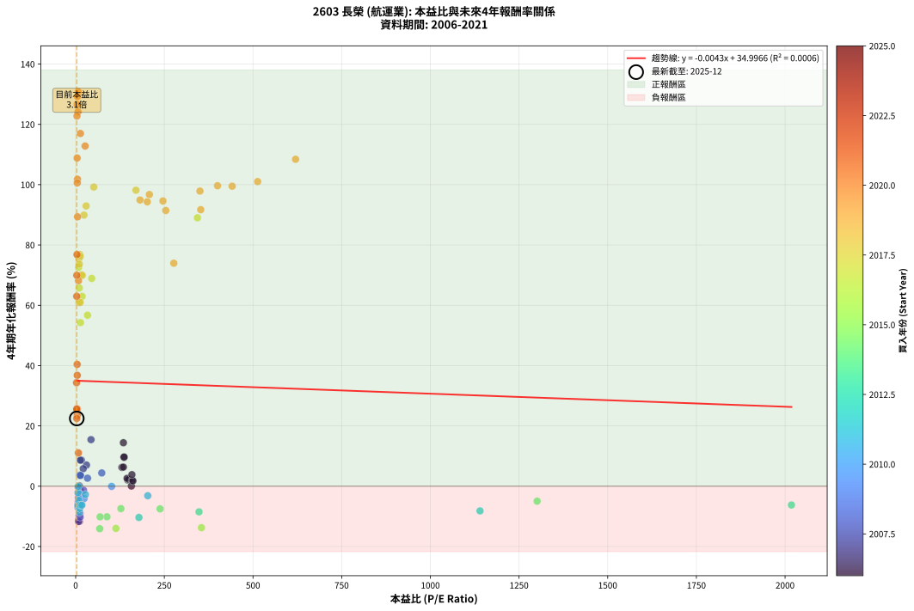
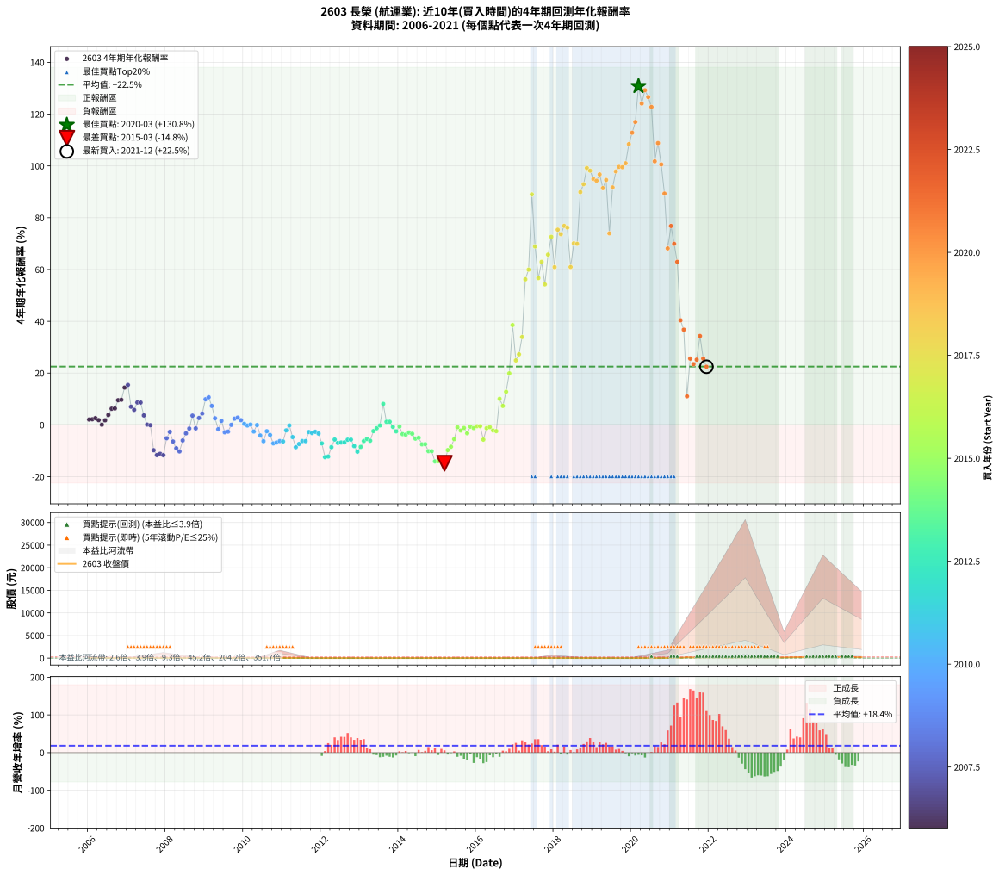

# 2603 長榮 - 本益比與未來報酬率分析

!!! info "報告資訊"
    - **股票代號**: 2603
    - **公司名稱**: 長榮
    - **產業別**: 航運業
    - **分析期間**: 2005-2021 (193 個數據點)
    - **資料來源**: Type 12 (ShowMonthlyK_ChartFlow) 月收盤價與本益比
    - **報酬率口徑**: 含現金股利 (簡化: 年度合計，假設每年7/1入帳)
    - **報告生成時間**: 2025-12-23 12:12:34 CST

## 📈 視覺化圖表

### 圖表1: 本益比 vs 未來報酬率關係

*圖表1：2603 長榮 本益比與4年期未來報酬率關係 (2005-2021)*

### 圖表2: 歷年買入時點的4年期實際報酬率

*圖表2：2603 長榮 歷年買入時點的4年期實際報酬率 (2005-2021)*

## 📍 買點訊號說明

本報告提供兩種買點提示訊號（顯示於圖表2的股價子圖中）：

### ▲ 小綠色三角形（回測驗證）
- **計算方式**: 使用全部歷史資料計算本益比第25百分位數
- **用途**: 事後驗證，顯示歷史上哪些時點確實為低估區
- **限制**: 當下無法判斷，僅供回測參考
- **特性**: 後見之明（Look-Ahead Bias）

### ▲ 小橘色三角形（即時訊號）
- **計算方式**: 使用截至當月的過去5年資料計算本益比第25百分位數
- **用途**: 實際投資決策，當時即可判斷
- **優勢**: 可操作性強，符合實務需求
- **特性**: 無後見之明，滾動窗口計算

!!! tip "如何使用兩種訊號"
    - **綠色▲** 幫助理解歷史估值機會，驗證策略有效性
    - **橘色▲** 可作為實際買進參考，但仍需搭配基本面分析
    - 兩種訊號重疊時，表示即時判斷與事後驗證一致，信心度較高
    - 僅有綠色▲時，表示當時無法判斷（需要未來資料才能確認）
    - 僅有橘色▲時，表示即時判斷為買點，但事後可能不是最佳時機

## 📊 估值分析摘要

| 指標 | 數值 |
|:---:|:---:|
| **目前本益比** (2021-12) | **3.13 倍** |
| **歷史平均本益比** | 100.60 倍 |
| **估值水準** | 🟢 相對低估 |
| **預期4年年化報酬率** | **+34.02%** |
| **歷史平均報酬率** | +22.38% |
| **相關係數 (R²)** | 0.0001 |
| **趨勢線斜率** | 0.0018 |

!!! abstract "核心洞察"
    目前本益比顯著低於歷史平均，預期未來報酬率可能較高

    根據歷史數據回測，2603 長榮 在目前本益比 **3.1倍** 的估值水準下，
    預期未來4年年化報酬率約為 **+34.0%**。

    **重要提醒**: 本分析基於歷史數據統計，實際報酬率會受到公司基本面變化、產業趨勢、
    總體經濟環境等多重因素影響。R² = 0.00 表示本益比可解釋約 0.0% 的報酬率變異。

## 📈 歷史估值統計

### 最佳買點 (最高報酬率)

| 項目 | 數值 |
|:---:|:---:|
| 起始時間 | 2020-03 |
| 當時本益比 | 7.23 倍 |
| 起始價格 | 9.2 元 |
| 4年後價格 | 172.0 元 |
| **4年年化報酬率** | **+130.80%** |

### 最差買點 (最低報酬率)

| 項目 | 數值 |
|:---:|:---:|
| 起始時間 | 2015-03 |
| 當時本益比 | nan 倍 |
| 起始價格 | 23.2 元 |
| 4年後價格 | 11.9 元 |
| **4年年化報酬率** | **-14.80%** |

## 🎯 投資啟示

### 本益比與報酬率關係

趨勢線方程式: **y = 0.0018x + 34.0134**

!!! info "弱相關或正相關"
    本益比與未來報酬率相關性較弱。這可能表示該股票的報酬率更多受到
    公司成長性、產業趨勢等因素影響，而非估值水準。**需綜合考量多項指標**。

### 估值區間建議

基於歷史數據分析:

- **🟢 低估區** (P/E < 80.5): 預期報酬率較高，可考慮增加持股
- **🟡 合理區** (P/E 80.5-120.7): 預期報酬率符合長期趨勢，正常持有
- **🔴 高估區** (P/E > 120.7): 預期報酬率較低，可考慮減碼或觀望

!!! danger "風險提示"
    - 過去表現不代表未來結果
    - 本分析假設公司基本面無重大結構性變化
    - 產業環境劇變可能使歷史規律失效
    - 應結合公司財報、產業趨勢、總體經濟等多重因素綜合判斷

!!! success "長期投資觀點"
    歷史數據顯示，在合理或低估的估值水準買入並長期持有，
    往往能獲得較佳的投資報酬。**耐心等待好價格**是價值投資的核心原則。

## 📊 數據品質

- **資料來源**: GoodInfo.tw Type 12 (ShowMonthlyK_ChartFlow)
- **資料頻率**: 月度收盤價與本益比
- **回測期間**: 2005-2021
- **數據點數量**: 193 個 (每個點代表一次4年期回測)

### 計算方法說明

1. **4年期年化報酬率**:
   - 對每個歷史時點，計算其後4年的實際投資報酬率
   - 期末價值(不含股利): 期末價格
   - 期末價值(含現金股利): 期末價格 + 持有期間內的現金股利合計 (簡化: 年度合計，假設每年7/1入帳)
   - 公式: 年化報酬率 = [(期末價值/期初價格)^(1/年數) - 1] × 100%

2. **本益比 (P/E Ratio)**:
   - 使用當時的月收盤價與EPS計算
   - 資料來源: Type 12 月度河流圖本益比數據

3. **趨勢線 (Linear Regression)**:
   - 使用最小平方法擬合線性趨勢線
   - R²值衡量本益比對報酬率的解釋能力

---

*本報告由 Stock Analysis System v1.9.0 自動生成*
*數據更新時間: 2025-12-23 12:12:34 CST*

## 📋 月度回測明細表

（每一列對應時間線圖中的一個買入點；可用來對照 SVG 圖上的每個點。）

| 買入月份 | 賣出月份 | 回測期限_年 | 實際持有年數 | 買入本益比_倍 | 買入收盤價_元 | 賣出收盤價_元 | 現金股利合計_元 | 總報酬率_pct | 年化報酬率_pct |
| --- | --- | --- | --- | --- | --- | --- | --- | --- | --- |
| 2005-12 | 2009-12 | 4 | 4.000 | 5.25 | 23.80 | 17.85 | 3.80 | -9.04 | -2.34 |
| 2006-01 | 2010-01 | 4 | 4.000 | 4.93 | 20.55 | 18.50 | 3.80 | +8.51 | +2.06 |
| 2006-02 | 2010-02 | 4 | 4.000 | 5.56 | 21.10 | 19.20 | 3.80 | +9.00 | +2.18 |
| 2006-03 | 2010-03 | 4 | 4.000 | 5.91 | 20.30 | 18.70 | 3.80 | +10.83 | +2.60 |
| 2006-04 | 2010-04 | 4 | 4.000 | 7.26 | 22.25 | 20.15 | 3.80 | +7.64 | +1.86 |
| 2006-05 | 2010-05 | 4 | 4.000 | 8.15 | 22.00 | 18.25 | 3.80 | +0.22 | +0.06 |
| 2006-06 | 2010-06 | 4 | 4.000 | 9.68 | 22.60 | 20.45 | 3.80 | +7.30 | +1.78 |
| 2006-07 | 2010-07 | 4 | 4.000 | 11.27 | 22.20 | 23.80 | 2.00 | +16.21 | +3.83 |
| 2006-08 | 2010-08 | 4 | 4.000 | 11.38 | 18.25 | 21.25 | 2.00 | +27.39 | +6.24 |
| 2006-09 | 2010-09 | 4 | 4.000 | 15.23 | 18.85 | 22.10 | 2.00 | +27.85 | +6.33 |
| 2006-10 | 2010-10 | 4 | 4.000 | 21.91 | 19.10 | 25.50 | 2.00 | +43.97 | +9.54 |
| 2006-11 | 2010-11 | 4 | 4.000 | 37.76 | 19.10 | 25.65 | 2.00 | +44.76 | +9.69 |
| 2006-12 | 2010-12 | 4 | 4.000 | 134.60 | 18.85 | 30.30 | 2.00 | +71.35 | +14.41 |
| 2007-01 | 2011-01 | 4 | 4.000 | 43.31 | 18.30 | 30.50 | 2.00 | +77.59 | +15.44 |
| 2007-02 | 2011-02 | 4 | 4.000 | 30.50 | 21.50 | 26.20 | 2.00 | +31.16 | +7.02 |
| 2007-03 | 2011-03 | 4 | 4.000 | 21.37 | 21.10 | 24.45 | 2.00 | +25.35 | +5.81 |
| 2007-04 | 2011-04 | 4 | 4.000 | 16.10 | 20.45 | 26.50 | 2.00 | +39.36 | +8.65 |
| 2007-05 | 2011-05 | 4 | 4.000 | 13.30 | 20.65 | 26.75 | 2.00 | +39.22 | +8.62 |
| 2007-06 | 2011-06 | 4 | 4.000 | 11.85 | 21.75 | 23.10 | 2.00 | +15.40 | +3.65 |
| 2007-07 | 2011-07 | 4 | 4.000 | 10.55 | 22.35 | 19.75 | 2.70 | +0.44 | +0.11 |
| 2007-08 | 2011-08 | 4 | 4.000 | 8.92 | 21.40 | 18.60 | 2.70 | -0.47 | -0.12 |
| 2007-09 | 2011-09 | 4 | 4.000 | 10.29 | 27.60 | 15.60 | 2.70 | -33.70 | -9.76 |
| 2007-10 | 2011-10 | 4 | 4.000 | 10.69 | 31.70 | 16.60 | 2.70 | -39.12 | -11.67 |
| 2007-11 | 2011-11 | 4 | 4.000 | 8.53 | 27.70 | 14.55 | 2.70 | -37.73 | -11.17 |
| 2007-12 | 2011-12 | 4 | 4.000 | 8.39 | 29.60 | 15.30 | 2.70 | -39.19 | -11.69 |
| 2008-01 | 2012-01 | 4 | 4.000 | 7.32 | 23.80 | 16.55 | 2.70 | -19.12 | -5.17 |
| 2008-02 | 2012-02 | 4 | 4.000 | 8.73 | 26.00 | 20.60 | 2.70 | -10.39 | -2.70 |
| 2008-03 | 2012-03 | 4 | 4.000 | 11.11 | 30.00 | 20.30 | 2.70 | -23.34 | -6.43 |
| 2008-04 | 2012-04 | 4 | 4.000 | 11.99 | 29.05 | 17.20 | 2.70 | -31.50 | -9.03 |
| 2008-05 | 2012-05 | 4 | 4.000 | 12.46 | 26.75 | 14.65 | 2.70 | -35.14 | -10.26 |
| 2008-06 | 2012-06 | 4 | 4.000 | 12.89 | 24.10 | 16.10 | 2.70 | -22.00 | -6.02 |
| 2008-07 | 2012-07 | 4 | 4.000 | 12.55 | 20.00 | 16.50 | 1.00 | -12.50 | -3.28 |
| 2008-08 | 2012-08 | 4 | 4.000 | 13.67 | 18.00 | 16.00 | 1.00 | -5.56 | -1.42 |
| 2008-09 | 2012-09 | 4 | 4.000 | 13.75 | 14.30 | 15.45 | 1.00 | +15.03 | +3.56 |
| 2008-10 | 2012-10 | 4 | 4.000 | 22.21 | 16.95 | 15.05 | 1.00 | -5.31 | -1.35 |
| 2008-11 | 2012-11 | 4 | 4.000 | 33.49 | 16.30 | 17.10 | 1.00 | +11.04 | +2.65 |
| 2008-12 | 2012-12 | 4 | 4.000 | 73.57 | 15.45 | 17.35 | 1.00 | +18.77 | +4.39 |
| 2009-01 | 2013-01 | 4 | 4.000 |  | 13.40 | 18.55 | 1.00 | +45.90 | +9.90 |
| 2009-02 | 2013-02 | 4 | 4.000 |  | 13.30 | 18.95 | 1.00 | +50.00 | +10.67 |
| 2009-03 | 2013-03 | 4 | 4.000 |  | 14.25 | 17.90 | 1.00 | +32.63 | +7.32 |
| 2009-04 | 2013-04 | 4 | 4.000 |  | 16.50 | 17.25 | 1.00 | +10.61 | +2.55 |
| 2009-05 | 2013-05 | 4 | 4.000 |  | 19.00 | 16.75 | 1.00 | -6.58 | -1.69 |
| 2009-06 | 2013-06 | 4 | 4.000 |  | 16.35 | 16.40 | 1.00 | +6.42 | +1.57 |
| 2009-07 | 2013-07 | 4 | 4.000 |  | 20.00 | 16.80 | 1.00 | -11.00 | -2.87 |
| 2009-08 | 2013-08 | 4 | 4.000 |  | 19.90 | 16.90 | 1.00 | -10.05 | -2.61 |
| 2009-09 | 2013-09 | 4 | 4.000 |  | 18.50 | 17.50 | 1.00 | +0.00 | +0.00 |
| 2009-10 | 2013-10 | 4 | 4.000 |  | 16.65 | 17.30 | 1.00 | +9.91 | +2.39 |
| 2009-11 | 2013-11 | 4 | 4.000 |  | 16.55 | 17.50 | 1.00 | +11.78 | +2.82 |
| 2009-12 | 2013-12 | 4 | 4.000 |  | 17.85 | 18.20 | 1.00 | +7.56 | +1.84 |
| 2010-01 | 2014-01 | 4 | 4.000 |  | 18.50 | 17.80 | 1.00 | +1.62 | +0.40 |
| 2010-02 | 2014-02 | 4 | 4.000 |  | 19.20 | 18.00 | 1.00 | -1.04 | -0.26 |
| 2010-03 | 2014-03 | 4 | 4.000 |  | 18.70 | 17.80 | 1.00 | +0.53 | +0.13 |
| 2010-04 | 2014-04 | 4 | 4.000 |  | 20.15 | 17.15 | 1.00 | -9.93 | -2.58 |
| 2010-05 | 2014-05 | 4 | 4.000 | 101.40 | 18.25 | 17.20 | 1.00 | -0.27 | -0.07 |
| 2010-06 | 2014-06 | 4 | 4.000 | 23.78 | 20.45 | 16.30 | 1.00 | -15.40 | -4.10 |
| 2010-07 | 2014-07 | 4 | 4.000 | 15.45 | 23.80 | 17.35 | 1.00 | -22.90 | -6.29 |
| 2010-08 | 2014-08 | 4 | 4.000 | 9.57 | 21.25 | 18.25 | 1.00 | -9.41 | -2.44 |
| 2010-09 | 2014-09 | 4 | 4.000 | 7.62 | 22.10 | 17.85 | 1.00 | -14.71 | -3.90 |
| 2010-10 | 2014-10 | 4 | 4.000 | 7.12 | 25.50 | 17.95 | 1.00 | -25.69 | -7.15 |
| 2010-11 | 2014-11 | 4 | 4.000 | 6.02 | 25.65 | 18.35 | 1.00 | -24.56 | -6.80 |
| 2010-12 | 2014-12 | 4 | 4.000 | 6.13 | 30.30 | 22.40 | 1.00 | -22.77 | -6.26 |
| 2011-01 | 2015-01 | 4 | 4.000 | 6.85 | 30.50 | 22.40 | 1.00 | -23.28 | -6.41 |
| 2011-02 | 2015-02 | 4 | 4.000 | 6.60 | 26.20 | 23.05 | 1.00 | -8.21 | -2.12 |
| 2011-03 | 2015-03 | 4 | 4.000 | 7.02 | 24.45 | 23.25 | 1.00 | -0.82 | -0.21 |
| 2011-04 | 2015-04 | 4 | 4.000 | 8.84 | 26.50 | 20.85 | 1.00 | -17.55 | -4.71 |
| 2011-05 | 2015-05 | 4 | 4.000 | 10.65 | 26.75 | 17.65 | 1.00 | -30.28 | -8.62 |
| 2011-06 | 2015-06 | 4 | 4.000 | 11.41 | 23.10 | 16.00 | 1.00 | -26.41 | -7.38 |
| 2011-07 | 2015-07 | 4 | 4.000 | 12.83 | 19.75 | 15.15 | 0.10 | -22.78 | -6.26 |
| 2011-08 | 2015-08 | 4 | 4.000 | 17.66 | 18.60 | 14.25 | 0.10 | -22.85 | -6.28 |
| 2011-09 | 2015-09 | 4 | 4.000 | 27.49 | 15.60 | 13.85 | 0.10 | -10.58 | -2.76 |
| 2011-10 | 2015-10 | 4 | 4.000 | 203.30 | 16.60 | 14.50 | 0.10 | -12.05 | -3.16 |
| 2011-11 | 2015-11 | 4 | 4.000 |  | 14.55 | 12.95 | 0.10 | -10.31 | -2.68 |
| 2011-12 | 2015-12 | 4 | 4.000 |  | 15.30 | 13.25 | 0.10 | -12.75 | -3.35 |
| 2012-01 | 2016-01 | 4 | 4.000 |  | 16.55 | 12.20 | 0.10 | -25.68 | -7.15 |
| 2012-02 | 2016-02 | 4 | 4.000 |  | 20.60 | 12.00 | 0.10 | -41.26 | -12.46 |
| 2012-03 | 2016-03 | 4 | 4.000 |  | 20.30 | 11.95 | 0.10 | -40.64 | -12.22 |
| 2012-04 | 2016-04 | 4 | 4.000 |  | 17.20 | 11.90 | 0.10 | -30.23 | -8.61 |
| 2012-05 | 2016-05 | 4 | 4.000 |  | 14.65 | 11.50 | 0.10 | -20.82 | -5.67 |
| 2012-06 | 2016-06 | 4 | 4.000 |  | 16.10 | 11.95 | 0.10 | -25.16 | -6.99 |
| 2012-07 | 2016-07 | 4 | 4.000 |  | 16.50 | 12.35 | 0.10 | -24.55 | -6.80 |
| 2012-08 | 2016-08 | 4 | 4.000 |  | 16.00 | 12.00 | 0.10 | -24.38 | -6.75 |
| 2012-09 | 2016-09 | 4 | 4.000 |  | 15.45 | 12.10 | 0.10 | -21.04 | -5.73 |
| 2012-10 | 2016-10 | 4 | 4.000 |  | 15.05 | 11.80 | 0.10 | -20.93 | -5.70 |
| 2012-11 | 2016-11 | 4 | 4.000 | 1140.00 | 17.10 | 12.05 | 0.10 | -28.95 | -8.19 |
| 2012-12 | 2016-12 | 4 | 4.000 | 178.40 | 17.35 | 11.10 | 0.10 | -35.45 | -10.36 |
| 2013-01 | 2017-01 | 4 | 4.000 | 347.80 | 18.55 | 12.90 | 0.10 | -29.92 | -8.50 |
| 2013-02 | 2017-02 | 4 | 4.000 | 2018.00 | 18.95 | 14.55 | 0.10 | -22.69 | -6.23 |
| 2013-03 | 2017-03 | 4 | 4.000 |  | 17.90 | 14.20 | 0.10 | -20.11 | -5.46 |
| 2013-04 | 2017-04 | 4 | 4.000 |  | 17.25 | 13.30 | 0.10 | -22.32 | -6.12 |
| 2013-05 | 2017-05 | 4 | 4.000 |  | 16.75 | 15.10 | 0.10 | -9.25 | -2.40 |
| 2013-06 | 2017-06 | 4 | 4.000 |  | 16.40 | 15.45 | 0.10 | -5.18 | -1.32 |
| 2013-07 | 2017-07 | 4 | 4.000 |  | 16.80 | 16.55 | 0.10 | -0.89 | -0.22 |
| 2013-08 | 2017-08 | 4 | 4.000 |  | 16.90 | 23.00 | 0.10 | +36.69 | +8.13 |
| 2013-09 | 2017-09 | 4 | 4.000 |  | 17.50 | 18.25 | 0.10 | +4.86 | +1.19 |
| 2013-10 | 2017-10 | 4 | 4.000 |  | 17.30 | 18.05 | 0.10 | +4.91 | +1.21 |
| 2013-11 | 2017-11 | 4 | 4.000 |  | 17.50 | 16.85 | 0.10 | -3.14 | -0.80 |
| 2013-12 | 2017-12 | 4 | 4.000 |  | 18.20 | 16.35 | 0.10 | -9.62 | -2.50 |
| 2014-01 | 2018-01 | 4 | 4.000 |  | 17.80 | 17.25 | 0.10 | -2.53 | -0.64 |
| 2014-02 | 2018-02 | 4 | 4.000 |  | 18.00 | 15.45 | 0.10 | -13.61 | -3.59 |
| 2014-03 | 2018-03 | 4 | 4.000 |  | 17.80 | 15.15 | 0.10 | -14.33 | -3.79 |
| 2014-04 | 2018-04 | 4 | 4.000 |  | 17.15 | 15.10 | 0.10 | -11.37 | -2.97 |
| 2014-05 | 2018-05 | 4 | 4.000 |  | 17.20 | 14.85 | 0.10 | -13.08 | -3.44 |
| 2014-06 | 2018-06 | 4 | 4.000 |  | 16.30 | 13.00 | 0.10 | -19.63 | -5.32 |
| 2014-07 | 2018-07 | 4 | 4.000 | 1301.00 | 17.35 | 13.85 | 0.30 | -18.44 | -4.97 |
| 2014-08 | 2018-08 | 4 | 4.000 | 238.00 | 18.25 | 13.05 | 0.30 | -26.85 | -7.52 |
| 2014-09 | 2018-09 | 4 | 4.000 | 127.50 | 17.85 | 12.80 | 0.30 | -26.61 | -7.44 |
| 2014-10 | 2018-10 | 4 | 4.000 | 88.28 | 17.95 | 11.40 | 0.30 | -34.82 | -10.15 |
| 2014-11 | 2018-11 | 4 | 4.000 | 68.81 | 18.35 | 11.65 | 0.30 | -34.88 | -10.17 |
| 2014-12 | 2018-12 | 4 | 4.000 | 67.88 | 22.40 | 11.90 | 0.30 | -45.54 | -14.09 |
| 2015-01 | 2019-01 | 4 | 4.000 | 113.40 | 22.40 | 11.95 | 0.30 | -45.31 | -14.01 |
| 2015-02 | 2019-02 | 4 | 4.000 | 354.60 | 23.05 | 12.45 | 0.30 | -44.69 | -13.76 |
| 2015-03 | 2019-03 | 4 | 4.000 |  | 23.25 | 11.95 | 0.30 | -47.31 | -14.80 |
| 2015-04 | 2019-04 | 4 | 4.000 |  | 20.85 | 13.55 | 0.30 | -33.57 | -9.72 |
| 2015-05 | 2019-05 | 4 | 4.000 |  | 17.65 | 12.10 | 0.30 | -29.75 | -8.45 |
| 2015-06 | 2019-06 | 4 | 4.000 |  | 16.00 | 12.45 | 0.30 | -20.31 | -5.52 |
| 2015-07 | 2019-07 | 4 | 4.000 |  | 15.15 | 14.40 | 0.20 | -3.63 | -0.92 |
| 2015-08 | 2019-08 | 4 | 4.000 |  | 14.25 | 12.85 | 0.20 | -8.42 | -2.18 |
| 2015-09 | 2019-09 | 4 | 4.000 |  | 13.85 | 13.00 | 0.20 | -4.69 | -1.19 |
| 2015-10 | 2019-10 | 4 | 4.000 |  | 14.50 | 12.50 | 0.20 | -12.41 | -3.26 |
| 2015-11 | 2019-11 | 4 | 4.000 |  | 12.95 | 12.40 | 0.20 | -2.70 | -0.68 |
| 2015-12 | 2019-12 | 4 | 4.000 |  | 13.25 | 12.40 | 0.20 | -4.91 | -1.25 |
| 2016-01 | 2020-01 | 4 | 4.000 |  | 12.20 | 11.75 | 0.20 | -2.05 | -0.52 |
| 2016-02 | 2020-02 | 4 | 4.000 |  | 12.00 | 11.55 | 0.20 | -2.08 | -0.52 |
| 2016-03 | 2020-03 | 4 | 4.000 |  | 11.95 | 9.25 | 0.20 | -20.92 | -5.70 |
| 2016-04 | 2020-04 | 4 | 4.000 |  | 11.90 | 11.10 | 0.20 | -5.04 | -1.29 |
| 2016-05 | 2020-05 | 4 | 4.000 |  | 11.50 | 10.90 | 0.20 | -3.48 | -0.88 |
| 2016-06 | 2020-06 | 4 | 4.000 |  | 11.95 | 10.75 | 0.20 | -8.37 | -2.16 |
| 2016-07 | 2020-07 | 4 | 4.000 |  | 12.35 | 11.00 | 0.20 | -9.31 | -2.41 |
| 2016-08 | 2020-08 | 4 | 4.000 |  | 12.00 | 17.40 | 0.20 | +46.67 | +10.05 |
| 2016-09 | 2020-09 | 4 | 4.000 |  | 12.10 | 15.85 | 0.20 | +32.64 | +7.32 |
| 2016-10 | 2020-10 | 4 | 4.000 |  | 11.80 | 18.90 | 0.20 | +61.86 | +12.79 |
| 2016-11 | 2020-11 | 4 | 4.000 |  | 12.05 | 24.70 | 0.20 | +106.64 | +19.90 |
| 2016-12 | 2020-12 | 4 | 4.000 |  | 11.10 | 40.70 | 0.20 | +268.47 | +38.55 |
| 2017-01 | 2021-01 | 4 | 4.000 |  | 12.90 | 31.20 | 0.20 | +143.41 | +24.91 |
| 2017-02 | 2021-02 | 4 | 4.000 |  | 14.55 | 37.95 | 0.20 | +162.20 | +27.25 |
| 2017-03 | 2021-03 | 4 | 4.000 |  | 14.20 | 45.50 | 0.20 | +221.83 | +33.94 |
| 2017-04 | 2021-04 | 4 | 4.000 |  | 13.30 | 79.00 | 0.20 | +495.49 | +56.21 |
| 2017-05 | 2021-05 | 4 | 4.000 |  | 15.10 | 98.60 | 0.20 | +554.30 | +59.94 |
| 2017-06 | 2021-06 | 4 | 4.000 | 343.30 | 15.45 | 197.00 | 0.20 | +1176.38 | +89.01 |
| 2017-07 | 2021-07 | 4 | 4.000 | 45.24 | 16.55 | 132.00 | 2.69 | +713.82 | +68.90 |
| 2017-08 | 2021-08 | 4 | 4.000 | 33.50 | 23.00 | 136.00 | 2.69 | +502.99 | +56.70 |
| 2017-09 | 2021-09 | 4 | 4.000 | 18.11 | 18.25 | 126.00 | 2.69 | +605.13 | +62.96 |
| 2017-10 | 2021-10 | 4 | 4.000 | 13.59 | 18.05 | 99.50 | 2.69 | +466.13 | +54.25 |
| 2017-11 | 2021-11 | 4 | 4.000 | 10.22 | 16.85 | 124.50 | 2.69 | +654.82 | +65.75 |
| 2017-12 | 2021-12 | 4 | 4.000 | 8.30 | 16.35 | 142.50 | 2.69 | +787.99 | +72.62 |
| 2018-01 | 2022-01 | 4 | 4.000 | 9.52 | 17.25 | 113.00 | 2.69 | +570.65 | +60.93 |
| 2018-02 | 2022-02 | 4 | 4.000 | 9.34 | 15.45 | 143.50 | 2.69 | +846.19 | +75.39 |
| 2018-03 | 2022-03 | 4 | 4.000 | 10.13 | 15.15 | 135.00 | 2.69 | +808.83 | +73.63 |
| 2018-04 | 2022-04 | 4 | 4.000 | 11.30 | 15.10 | 145.00 | 2.69 | +878.06 | +76.84 |
| 2018-05 | 2022-05 | 4 | 4.000 | 12.60 | 14.85 | 140.50 | 2.69 | +864.22 | +76.22 |
| 2018-06 | 2022-06 | 4 | 4.000 | 12.75 | 13.00 | 84.60 | 2.69 | +571.44 | +60.97 |
| 2018-07 | 2022-07 | 4 | 4.000 | 16.07 | 13.85 | 95.50 | 20.49 | +737.45 | +70.11 |
| 2018-08 | 2022-08 | 4 | 4.000 | 18.55 | 13.05 | 88.30 | 20.49 | +733.62 | +69.92 |
| 2018-09 | 2022-09 | 4 | 4.000 | 23.49 | 12.80 | 146.00 | 20.49 | +1200.68 | +89.91 |
| 2018-10 | 2022-10 | 4 | 4.000 | 29.48 | 11.40 | 137.50 | 20.49 | +1285.85 | +92.94 |
| 2018-11 | 2022-11 | 4 | 4.000 | 51.02 | 11.65 | 163.00 | 20.49 | +1475.00 | +99.21 |
| 2018-12 | 2022-12 | 4 | 4.000 | 170.00 | 11.90 | 163.00 | 20.49 | +1441.91 | +98.16 |
| 2019-01 | 2023-01 | 4 | 4.000 | 181.50 | 11.95 | 152.00 | 20.49 | +1343.41 | +94.92 |
| 2019-02 | 2023-02 | 4 | 4.000 | 201.90 | 12.45 | 157.00 | 20.49 | +1325.60 | +94.31 |
| 2019-03 | 2023-03 | 4 | 4.000 | 207.80 | 11.95 | 158.50 | 20.49 | +1397.80 | +96.73 |
| 2019-04 | 2023-04 | 4 | 4.000 | 254.10 | 13.55 | 161.50 | 20.49 | +1243.08 | +91.44 |
| 2019-05 | 2023-05 | 4 | 4.000 | 246.10 | 12.10 | 153.00 | 20.49 | +1333.78 | +94.59 |
| 2019-06 | 2023-06 | 4 | 4.000 | 276.70 | 12.45 | 93.50 | 20.49 | +815.56 | +73.95 |
| 2019-07 | 2023-07 | 4 | 4.000 | 352.60 | 14.40 | 104.00 | 90.49 | +1250.60 | +91.70 |
| 2019-08 | 2023-08 | 4 | 4.000 | 350.40 | 12.85 | 106.50 | 90.49 | +1432.97 | +97.87 |
| 2019-09 | 2023-09 | 4 | 4.000 | 400.00 | 13.00 | 116.00 | 90.49 | +1488.36 | +99.64 |
| 2019-10 | 2023-10 | 4 | 4.000 | 441.20 | 12.50 | 107.50 | 90.49 | +1483.90 | +99.49 |
| 2019-11 | 2023-11 | 4 | 4.000 | 513.10 | 12.40 | 112.00 | 90.49 | +1532.96 | +101.02 |
| 2019-12 | 2023-12 | 4 | 4.000 | 620.00 | 12.40 | 143.50 | 90.49 | +1786.99 | +108.42 |
| 2020-01 | 2024-01 | 4 | 4.000 | 26.70 | 11.75 | 150.50 | 90.49 | +1950.95 | +112.81 |
| 2020-02 | 2024-02 | 4 | 4.000 | 13.43 | 11.55 | 165.50 | 90.49 | +2116.34 | +116.97 |
| 2020-03 | 2024-03 | 4 | 4.000 | 7.23 | 9.25 | 172.00 | 90.49 | +2737.70 | +130.80 |
| 2020-04 | 2024-04 | 4 | 4.000 | 6.53 | 11.10 | 189.50 | 90.49 | +2422.41 | +124.11 |
| 2020-05 | 2024-05 | 4 | 4.000 | 5.14 | 10.90 | 210.50 | 90.49 | +2661.35 | +129.23 |
| 2020-06 | 2024-06 | 4 | 4.000 | 4.23 | 10.75 | 193.00 | 90.49 | +2537.09 | +126.61 |
| 2020-07 | 2024-07 | 4 | 4.000 | 3.72 | 11.00 | 170.50 | 100.45 | +2363.20 | +122.78 |
| 2020-08 | 2024-08 | 4 | 4.000 | 5.15 | 17.40 | 188.00 | 100.45 | +1557.77 | +101.78 |
| 2020-09 | 2024-09 | 4 | 4.000 | 4.17 | 15.85 | 201.00 | 100.45 | +1801.91 | +108.83 |
| 2020-10 | 2024-10 | 4 | 4.000 | 4.48 | 18.90 | 205.50 | 100.45 | +1518.79 | +100.58 |
| 2020-11 | 2024-11 | 4 | 4.000 | 5.32 | 24.70 | 217.00 | 100.45 | +1185.23 | +89.34 |
| 2020-12 | 2024-12 | 4 | 4.000 | 8.04 | 40.70 | 225.00 | 100.45 | +699.64 | +68.16 |
| 2021-01 | 2025-01 | 4 | 4.000 | 3.70 | 31.20 | 204.50 | 100.45 | +877.41 | +76.82 |
| 2021-02 | 2025-02 | 4 | 4.000 | 3.21 | 37.95 | 216.00 | 100.45 | +733.87 | +69.93 |
| 2021-03 | 2025-03 | 4 | 4.000 | 3.00 | 45.50 | 220.50 | 100.45 | +605.39 | +62.97 |
| 2021-04 | 2025-04 | 4 | 4.000 | 4.26 | 79.00 | 206.50 | 100.45 | +288.55 | +40.40 |
| 2021-05 | 2025-05 | 4 | 4.000 | 4.49 | 98.60 | 244.50 | 100.45 | +249.85 | +36.76 |
| 2021-06 | 2025-06 | 4 | 4.000 | 7.78 | 197.00 | 199.00 | 100.45 | +52.01 | +11.04 |
| 2021-07 | 2025-07 | 4 | 4.000 | 4.60 | 132.00 | 198.00 | 130.47 | +148.84 | +25.60 |
| 2021-08 | 2025-08 | 4 | 4.000 | 4.24 | 136.00 | 185.50 | 130.47 | +132.33 | +23.46 |
| 2021-09 | 2025-09 | 4 | 4.000 | 3.56 | 126.00 | 179.00 | 130.47 | +145.61 | +25.19 |
| 2021-10 | 2025-10 | 4 | 4.000 | 2.56 | 99.50 | 193.50 | 130.47 | +225.59 | +34.33 |
| 2021-11 | 2025-11 | 4 | 4.000 | 2.95 | 124.50 | 179.50 | 130.47 | +148.97 | +25.61 |
| 2021-12 | 2025-12 | 4 | 4.000 | 3.13 | 142.50 | 181.50 | 130.47 | +118.92 | +21.64 |
