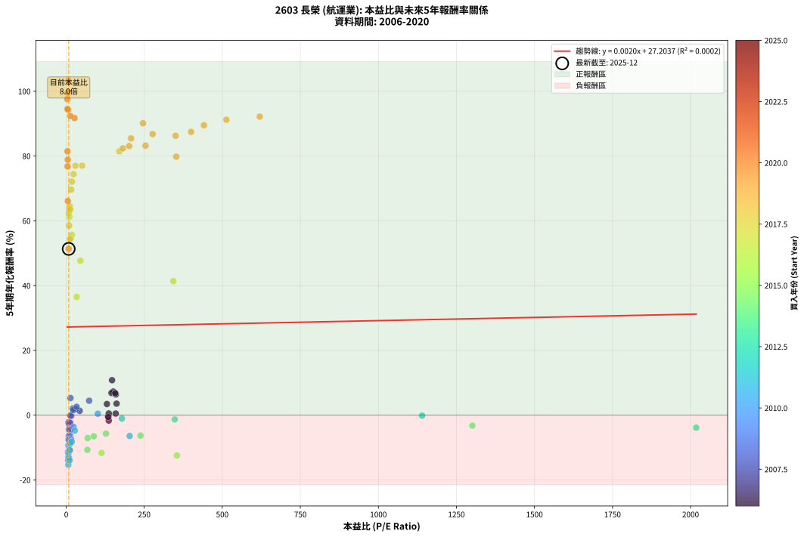
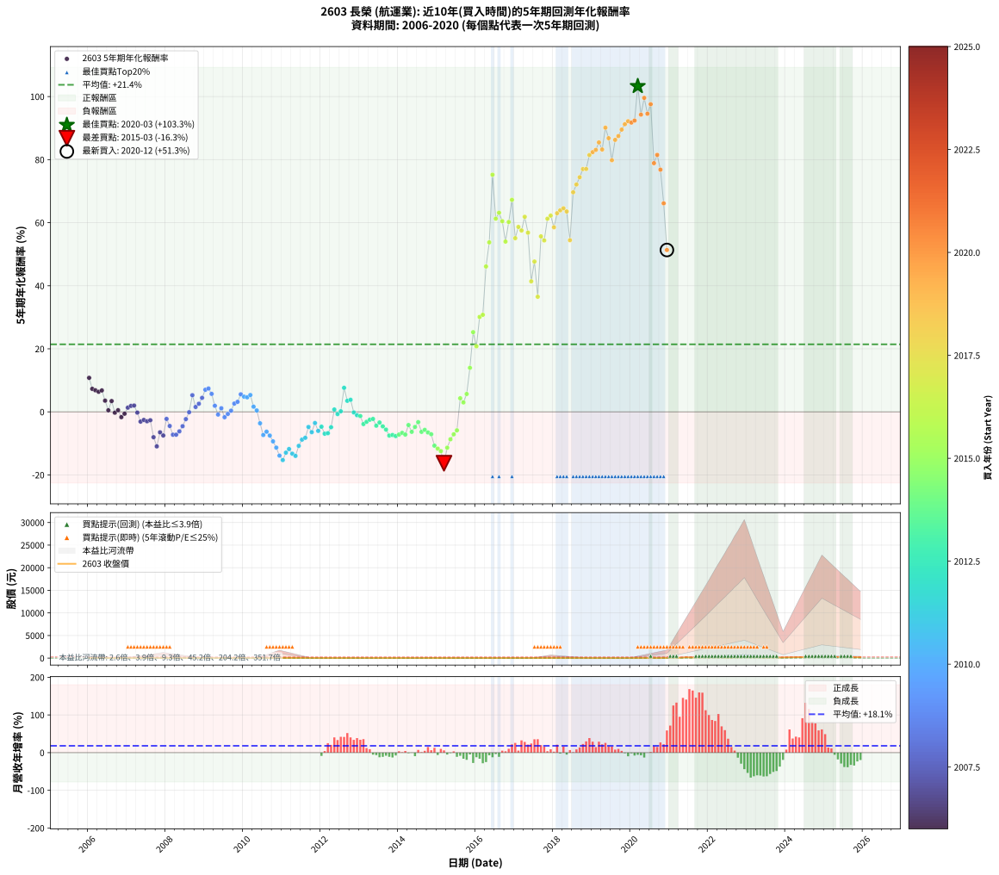

# 2603 長榮 - 本益比與未來報酬率分析

!!! info "報告資訊"
    - **股票代號**: 2603
    - **公司名稱**: 長榮
    - **產業別**: 航運業
    - **分析期間**: 2006-2020 (180 個數據點)
    - **資料來源**: Type 12 (ShowMonthlyK_ChartFlow) 月收盤價與本益比
    - **報酬率口徑**: 含現金股利 (簡化: 年度合計，假設每年7/1入帳)
    - **報告生成時間**: 2026-01-05 20:51:29 CST

## 📈 視覺化圖表

### 圖表1: 本益比 vs 未來報酬率關係

*圖表1：2603 長榮 本益比與5年期未來報酬率關係 (2006-2020)*

### 圖表2: 歷年買入時點的5年期實際報酬率

*圖表2：2603 長榮 歷年買入時點的5年期實際報酬率 (2006-2020)*

## 📍 買點訊號說明

本報告提供兩種買點提示訊號（顯示於圖表2的股價子圖中）：

### ▲ 小綠色三角形（回測驗證）
- **計算方式**: 使用全部歷史資料計算本益比第25百分位數
- **用途**: 事後驗證，顯示歷史上哪些時點確實為低估區
- **限制**: 當下無法判斷，僅供回測參考
- **特性**: 後見之明（Look-Ahead Bias）

### ▲ 小橘色三角形（即時訊號）
- **計算方式**: 使用截至當月的過去5年資料計算本益比第25百分位數
- **用途**: 實際投資決策，當時即可判斷
- **優勢**: 可操作性強，符合實務需求
- **特性**: 無後見之明，滾動窗口計算

!!! tip "如何使用兩種訊號"
    - **綠色▲** 幫助理解歷史估值機會，驗證策略有效性
    - **橘色▲** 可作為實際買進參考，但仍需搭配基本面分析
    - 兩種訊號重疊時，表示即時判斷與事後驗證一致，信心度較高
    - 僅有綠色▲時，表示當時無法判斷（需要未來資料才能確認）
    - 僅有橘色▲時，表示即時判斷為買點，但事後可能不是最佳時機

## 📊 估值分析摘要

| 指標 | 數值 |
|:---:|:---:|
| **目前本益比** (2020-12) | **8.04 倍** |
| **歷史平均本益比** | 125.67 倍 |
| **估值水準** | 🟢 相對低估 |
| **預期5年年化報酬率** | **+27.22%** |
| **歷史平均報酬率** | +21.41% |
| **相關係數 (R²)** | 0.0002 |
| **趨勢線斜率** | 0.0020 |

!!! abstract "核心洞察"
    目前本益比顯著低於歷史平均，預期未來報酬率可能較高

    根據歷史數據回測，2603 長榮 在目前本益比 **8.0倍** 的估值水準下，
    預期未來5年年化報酬率約為 **+27.2%**。

    **重要提醒**: 本分析基於歷史數據統計，實際報酬率會受到公司基本面變化、產業趨勢、
    總體經濟環境等多重因素影響。R² = 0.00 表示本益比可解釋約 0.0% 的報酬率變異。

## 📈 歷史估值統計

### 最佳買點 (最高報酬率)

| 項目 | 數值 |
|:---:|:---:|
| 起始時間 | 2020-03 |
| 當時本益比 | 7.23 倍 |
| 起始價格 | 9.2 元 |
| 5年後價格 | 220.5 元 |
| **5年年化報酬率** | **+103.28%** |

### 最差買點 (最低報酬率)

| 項目 | 數值 |
|:---:|:---:|
| 起始時間 | 2015-03 |
| 當時本益比 | nan 倍 |
| 起始價格 | 23.2 元 |
| 5年後價格 | 9.2 元 |
| **5年年化報酬率** | **-16.30%** |

## 🎯 投資啟示

### 本益比與報酬率關係

趨勢線方程式: **y = 0.0020x + 27.2037**

!!! info "弱相關或正相關"
    本益比與未來報酬率相關性較弱。這可能表示該股票的報酬率更多受到
    公司成長性、產業趨勢等因素影響，而非估值水準。**需綜合考量多項指標**。

### 估值區間建議

基於歷史數據分析:

- **🟢 低估區** (P/E < 100.5): 預期報酬率較高，可考慮增加持股
- **🟡 合理區** (P/E 100.5-150.8): 預期報酬率符合長期趨勢，正常持有
- **🔴 高估區** (P/E > 150.8): 預期報酬率較低，可考慮減碼或觀望

!!! danger "風險提示"
    - 過去表現不代表未來結果
    - 本分析假設公司基本面無重大結構性變化
    - 產業環境劇變可能使歷史規律失效
    - 應結合公司財報、產業趨勢、總體經濟等多重因素綜合判斷

!!! success "長期投資觀點"
    歷史數據顯示，在合理或低估的估值水準買入並長期持有，
    往往能獲得較佳的投資報酬。**耐心等待好價格**是價值投資的核心原則。

## 📊 數據品質

- **資料來源**: GoodInfo.tw Type 12 (ShowMonthlyK_ChartFlow)
- **資料頻率**: 月度收盤價與本益比
- **回測期間**: 2006-2020
- **數據點數量**: 180 個 (每個點代表一次5年期回測)

### 計算方法說明

1. **5年期年化報酬率**:
   - 對每個歷史時點，計算其後5年的實際投資報酬率
   - 期末價值(不含股利): 期末價格
   - 期末價值(含現金股利): 期末價格 + 持有期間內的現金股利合計 (簡化: 年度合計，假設每年7/1入帳)
   - 公式: 年化報酬率 = [(期末價值/期初價格)^(1/年數) - 1] × 100%

2. **本益比 (P/E Ratio)**:
   - 使用當時的月收盤價與EPS計算
   - 資料來源: Type 12 月度河流圖本益比數據

3. **趨勢線 (Linear Regression)**:
   - 使用最小平方法擬合線性趨勢線
   - R²值衡量本益比對報酬率的解釋能力

---

*本報告由 Stock Analysis System v1.9.0 自動生成*
*數據更新時間: 2026-01-05 20:51:29 CST*

## 📋 月度回測明細表

（每一列對應時間線圖中的一個買入點；可用來對照 SVG 圖上的每個點。）

| 買入月份 | 賣出月份 | 回測期限_年 | 實際持有年數 | 買入本益比_倍 | 買入收盤價_元 | 賣出收盤價_元 | 現金股利合計_元 | 總報酬率_pct | 年化報酬率_pct |
| --- | --- | --- | --- | --- | --- | --- | --- | --- | --- |
| 2006-01 | 2011-01 | 5 | 4.999 | 146.80 | 20.55 | 30.50 | 3.80 | +66.91 | +10.79 |
| 2006-02 | 2011-02 | 5 | 4.999 | 150.70 | 21.10 | 26.20 | 3.80 | +42.18 | +7.29 |
| 2006-03 | 2011-03 | 5 | 4.999 | 145.00 | 20.30 | 24.45 | 3.80 | +39.16 | +6.83 |
| 2006-04 | 2011-04 | 5 | 4.999 | 158.90 | 22.25 | 26.50 | 3.80 | +36.18 | +6.37 |
| 2006-05 | 2011-05 | 5 | 4.999 | 157.10 | 22.00 | 26.75 | 3.80 | +38.86 | +6.79 |
| 2006-06 | 2011-06 | 5 | 4.999 | 161.40 | 22.60 | 23.10 | 3.80 | +19.02 | +3.54 |
| 2006-07 | 2011-07 | 5 | 4.999 | 158.60 | 22.20 | 19.75 | 3.00 | +2.47 | +0.49 |
| 2006-08 | 2011-08 | 5 | 4.999 | 130.40 | 18.25 | 18.60 | 3.00 | +18.35 | +3.43 |
| 2006-09 | 2011-09 | 5 | 4.999 | 134.60 | 18.85 | 15.60 | 3.00 | -1.33 | -0.27 |
| 2006-10 | 2011-10 | 5 | 4.999 | 136.40 | 19.10 | 16.60 | 3.00 | +2.61 | +0.52 |
| 2006-11 | 2011-11 | 5 | 4.999 | 136.40 | 19.10 | 14.55 | 3.00 | -8.12 | -1.68 |
| 2006-12 | 2011-12 | 5 | 4.999 | 134.60 | 18.85 | 15.30 | 3.00 | -2.92 | -0.59 |
| 2007-01 | 2012-01 | 5 | 4.999 | 43.31 | 18.30 | 16.55 | 3.00 | +6.83 | +1.33 |
| 2007-02 | 2012-02 | 5 | 4.999 | 30.50 | 21.50 | 20.60 | 3.00 | +9.76 | +1.88 |
| 2007-03 | 2012-03 | 5 | 5.002 | 21.37 | 21.10 | 20.30 | 3.00 | +10.42 | +2.00 |
| 2007-04 | 2012-04 | 5 | 5.002 | 16.10 | 20.45 | 17.20 | 3.00 | -1.23 | -0.25 |
| 2007-05 | 2012-05 | 5 | 5.002 | 13.30 | 20.65 | 14.65 | 3.00 | -14.53 | -3.09 |
| 2007-06 | 2012-06 | 5 | 5.002 | 11.85 | 21.75 | 16.10 | 3.00 | -12.19 | -2.57 |
| 2007-07 | 2012-07 | 5 | 5.002 | 10.55 | 22.35 | 16.50 | 2.70 | -14.10 | -2.99 |
| 2007-08 | 2012-08 | 5 | 5.002 | 8.92 | 21.40 | 16.00 | 2.70 | -12.62 | -2.66 |
| 2007-09 | 2012-09 | 5 | 5.002 | 10.29 | 27.60 | 15.45 | 2.70 | -34.24 | -8.04 |
| 2007-10 | 2012-10 | 5 | 5.002 | 10.69 | 31.70 | 15.05 | 2.70 | -44.01 | -10.95 |
| 2007-11 | 2012-11 | 5 | 5.002 | 8.53 | 27.70 | 17.10 | 2.70 | -28.52 | -6.49 |
| 2007-12 | 2012-12 | 5 | 5.002 | 8.39 | 29.60 | 17.35 | 2.70 | -32.27 | -7.49 |
| 2008-01 | 2013-01 | 5 | 5.002 | 7.32 | 23.80 | 18.55 | 2.70 | -10.72 | -2.24 |
| 2008-02 | 2013-03 | 5 | 5.081 | 8.73 | 26.00 | 17.90 | 2.70 | -20.77 | -4.48 |
| 2008-03 | 2013-03 | 5 | 4.999 | 11.11 | 30.00 | 17.90 | 2.70 | -31.34 | -7.24 |
| 2008-04 | 2013-04 | 5 | 4.999 | 11.99 | 29.05 | 17.25 | 2.70 | -31.33 | -7.24 |
| 2008-05 | 2013-05 | 5 | 4.999 | 12.46 | 26.75 | 16.75 | 2.70 | -27.29 | -6.18 |
| 2008-06 | 2013-06 | 5 | 4.999 | 12.89 | 24.10 | 16.40 | 2.70 | -20.75 | -4.55 |
| 2008-07 | 2013-07 | 5 | 4.999 | 12.55 | 20.00 | 16.80 | 1.00 | -11.00 | -2.30 |
| 2008-08 | 2013-08 | 5 | 4.999 | 13.67 | 18.00 | 16.90 | 1.00 | -0.56 | -0.11 |
| 2008-09 | 2013-09 | 5 | 4.999 | 13.75 | 14.30 | 17.50 | 1.00 | +29.37 | +5.29 |
| 2008-10 | 2013-10 | 5 | 4.999 | 22.21 | 16.95 | 17.30 | 1.00 | +7.96 | +1.54 |
| 2008-11 | 2013-11 | 5 | 4.999 | 33.49 | 16.30 | 17.50 | 1.00 | +13.50 | +2.56 |
| 2008-12 | 2013-12 | 5 | 4.999 | 73.57 | 15.45 | 18.20 | 1.00 | +24.27 | +4.44 |
| 2009-01 | 2014-01 | 5 | 4.999 |  | 13.40 | 17.80 | 1.00 | +40.30 | +7.01 |
| 2009-02 | 2014-02 | 5 | 4.999 |  | 13.30 | 18.00 | 1.00 | +42.86 | +7.40 |
| 2009-03 | 2014-03 | 5 | 4.999 |  | 14.25 | 17.80 | 1.00 | +31.93 | +5.70 |
| 2009-04 | 2014-04 | 5 | 4.999 |  | 16.50 | 17.15 | 1.00 | +10.00 | +1.92 |
| 2009-05 | 2014-05 | 5 | 4.999 |  | 19.00 | 17.20 | 1.00 | -4.21 | -0.86 |
| 2009-06 | 2014-06 | 5 | 4.999 |  | 16.35 | 16.30 | 1.00 | +5.81 | +1.14 |
| 2009-07 | 2014-07 | 5 | 4.999 |  | 20.00 | 17.35 | 1.00 | -8.25 | -1.71 |
| 2009-08 | 2014-08 | 5 | 4.999 |  | 19.90 | 18.25 | 1.00 | -3.27 | -0.66 |
| 2009-09 | 2014-09 | 5 | 4.999 |  | 18.50 | 17.85 | 1.00 | +1.89 | +0.38 |
| 2009-10 | 2014-10 | 5 | 4.999 |  | 16.65 | 17.95 | 1.00 | +13.81 | +2.62 |
| 2009-11 | 2014-11 | 5 | 4.999 |  | 16.55 | 18.35 | 1.00 | +16.92 | +3.18 |
| 2009-12 | 2014-12 | 5 | 4.999 |  | 17.85 | 22.40 | 1.00 | +31.09 | +5.56 |
| 2010-01 | 2015-01 | 5 | 4.999 |  | 18.50 | 22.40 | 1.00 | +26.49 | +4.81 |
| 2010-02 | 2015-02 | 5 | 4.999 |  | 19.20 | 23.05 | 1.00 | +25.26 | +4.61 |
| 2010-03 | 2015-03 | 5 | 4.999 |  | 18.70 | 23.25 | 1.00 | +29.68 | +5.34 |
| 2010-04 | 2015-04 | 5 | 4.999 |  | 20.15 | 20.85 | 1.00 | +8.44 | +1.63 |
| 2010-05 | 2015-05 | 5 | 4.999 | 101.40 | 18.25 | 17.65 | 1.00 | +2.19 | +0.43 |
| 2010-06 | 2015-06 | 5 | 4.999 | 23.78 | 20.45 | 16.00 | 1.00 | -16.87 | -3.63 |
| 2010-07 | 2015-07 | 5 | 4.999 | 15.45 | 23.80 | 15.15 | 1.10 | -31.72 | -7.35 |
| 2010-08 | 2015-08 | 5 | 4.999 | 9.57 | 21.25 | 14.25 | 1.10 | -27.76 | -6.30 |
| 2010-09 | 2015-09 | 5 | 4.999 | 7.62 | 22.10 | 13.85 | 1.10 | -32.35 | -7.52 |
| 2010-10 | 2015-10 | 5 | 4.999 | 7.12 | 25.50 | 14.50 | 1.10 | -38.82 | -9.36 |
| 2010-11 | 2015-11 | 5 | 4.999 | 6.02 | 25.65 | 12.95 | 1.10 | -45.22 | -11.34 |
| 2010-12 | 2015-12 | 5 | 4.999 | 6.13 | 30.30 | 13.25 | 1.10 | -52.64 | -13.89 |
| 2011-01 | 2016-01 | 5 | 4.999 | 6.85 | 30.50 | 12.20 | 1.10 | -56.39 | -15.30 |
| 2011-02 | 2016-02 | 5 | 4.999 | 6.60 | 26.20 | 12.00 | 1.10 | -50.00 | -12.95 |
| 2011-03 | 2016-03 | 5 | 5.002 | 7.02 | 24.45 | 11.95 | 1.10 | -46.63 | -11.80 |
| 2011-04 | 2016-04 | 5 | 5.002 | 8.84 | 26.50 | 11.90 | 1.10 | -50.94 | -13.27 |
| 2011-05 | 2016-05 | 5 | 5.002 | 10.65 | 26.75 | 11.50 | 1.10 | -52.90 | -13.97 |
| 2011-06 | 2016-06 | 5 | 5.002 | 11.41 | 23.10 | 11.95 | 1.10 | -43.51 | -10.79 |
| 2011-07 | 2016-07 | 5 | 5.002 | 12.83 | 19.75 | 12.35 | 0.10 | -36.96 | -8.81 |
| 2011-08 | 2016-08 | 5 | 5.002 | 17.66 | 18.60 | 12.00 | 0.10 | -34.95 | -8.24 |
| 2011-09 | 2016-09 | 5 | 5.002 | 27.49 | 15.60 | 12.10 | 0.10 | -21.79 | -4.80 |
| 2011-10 | 2016-10 | 5 | 5.002 | 203.30 | 16.60 | 11.80 | 0.10 | -28.31 | -6.44 |
| 2011-11 | 2016-11 | 5 | 5.002 |  | 14.55 | 12.05 | 0.10 | -16.49 | -3.54 |
| 2011-12 | 2016-12 | 5 | 5.002 |  | 15.30 | 11.10 | 0.10 | -26.80 | -6.05 |
| 2012-01 | 2017-01 | 5 | 5.002 |  | 16.55 | 12.90 | 0.10 | -21.45 | -4.71 |
| 2012-02 | 2017-03 | 5 | 5.081 |  | 20.60 | 14.20 | 0.10 | -30.58 | -6.93 |
| 2012-03 | 2017-03 | 5 | 4.999 |  | 20.30 | 14.20 | 0.10 | -29.56 | -6.77 |
| 2012-04 | 2017-04 | 5 | 4.999 |  | 17.20 | 13.30 | 0.10 | -22.09 | -4.87 |
| 2012-05 | 2017-05 | 5 | 4.999 |  | 14.65 | 15.10 | 0.10 | +3.75 | +0.74 |
| 2012-06 | 2017-06 | 5 | 4.999 |  | 16.10 | 15.45 | 0.10 | -3.42 | -0.69 |
| 2012-07 | 2017-07 | 5 | 4.999 |  | 16.50 | 16.55 | 0.10 | +0.91 | +0.18 |
| 2012-08 | 2017-08 | 5 | 4.999 |  | 16.00 | 23.00 | 0.10 | +44.38 | +7.62 |
| 2012-09 | 2017-09 | 5 | 4.999 |  | 15.45 | 18.25 | 0.10 | +18.77 | +3.50 |
| 2012-10 | 2017-10 | 5 | 4.999 |  | 15.05 | 18.05 | 0.10 | +20.60 | +3.82 |
| 2012-11 | 2017-11 | 5 | 4.999 | 1140.00 | 17.10 | 16.85 | 0.10 | -0.88 | -0.18 |
| 2012-12 | 2017-12 | 5 | 4.999 | 178.40 | 17.35 | 16.35 | 0.10 | -5.19 | -1.06 |
| 2013-01 | 2018-01 | 5 | 4.999 | 347.80 | 18.55 | 17.25 | 0.10 | -6.47 | -1.33 |
| 2013-02 | 2018-02 | 5 | 4.999 | 2018.00 | 18.95 | 15.45 | 0.10 | -17.94 | -3.88 |
| 2013-03 | 2018-03 | 5 | 4.999 |  | 17.90 | 15.15 | 0.10 | -14.80 | -3.15 |
| 2013-04 | 2018-04 | 5 | 4.999 |  | 17.25 | 15.10 | 0.10 | -11.88 | -2.50 |
| 2013-05 | 2018-05 | 5 | 4.999 |  | 16.75 | 14.85 | 0.10 | -10.75 | -2.25 |
| 2013-06 | 2018-06 | 5 | 4.999 |  | 16.40 | 13.00 | 0.10 | -20.12 | -4.39 |
| 2013-07 | 2018-07 | 5 | 4.999 |  | 16.80 | 13.85 | 0.30 | -15.77 | -3.38 |
| 2013-08 | 2018-08 | 5 | 4.999 |  | 16.90 | 13.05 | 0.30 | -21.01 | -4.61 |
| 2013-09 | 2018-09 | 5 | 4.999 |  | 17.50 | 12.80 | 0.30 | -25.14 | -5.63 |
| 2013-10 | 2018-10 | 5 | 4.999 |  | 17.30 | 11.40 | 0.30 | -32.37 | -7.53 |
| 2013-11 | 2018-11 | 5 | 4.999 |  | 17.50 | 11.65 | 0.30 | -31.71 | -7.35 |
| 2013-12 | 2018-12 | 5 | 4.999 |  | 18.20 | 11.90 | 0.30 | -32.97 | -7.69 |
| 2014-01 | 2019-01 | 5 | 4.999 |  | 17.80 | 11.95 | 0.30 | -31.18 | -7.20 |
| 2014-02 | 2019-02 | 5 | 4.999 |  | 18.00 | 12.45 | 0.30 | -29.17 | -6.67 |
| 2014-03 | 2019-03 | 5 | 4.999 |  | 17.80 | 11.95 | 0.30 | -31.18 | -7.20 |
| 2014-04 | 2019-04 | 5 | 4.999 |  | 17.15 | 13.55 | 0.30 | -19.24 | -4.18 |
| 2014-05 | 2019-05 | 5 | 4.999 |  | 17.20 | 12.10 | 0.30 | -27.91 | -6.34 |
| 2014-06 | 2019-06 | 5 | 4.999 |  | 16.30 | 12.45 | 0.30 | -21.78 | -4.79 |
| 2014-07 | 2019-07 | 5 | 4.999 | 1301.00 | 17.35 | 14.40 | 0.30 | -15.27 | -3.26 |
| 2014-08 | 2019-08 | 5 | 4.999 | 238.00 | 18.25 | 12.85 | 0.30 | -27.95 | -6.35 |
| 2014-09 | 2019-09 | 5 | 4.999 | 127.50 | 17.85 | 13.00 | 0.30 | -25.49 | -5.72 |
| 2014-10 | 2019-10 | 5 | 4.999 | 88.28 | 17.95 | 12.50 | 0.30 | -28.69 | -6.54 |
| 2014-11 | 2019-11 | 5 | 4.999 | 68.81 | 18.35 | 12.40 | 0.30 | -30.79 | -7.10 |
| 2014-12 | 2019-12 | 5 | 4.999 | 67.88 | 22.40 | 12.40 | 0.30 | -43.30 | -10.73 |
| 2015-01 | 2020-01 | 5 | 4.999 | 113.40 | 22.40 | 11.75 | 0.30 | -46.21 | -11.66 |
| 2015-02 | 2020-02 | 5 | 4.999 | 354.60 | 23.05 | 11.55 | 0.30 | -48.59 | -12.46 |
| 2015-03 | 2020-03 | 5 | 5.002 |  | 23.25 | 9.25 | 0.30 | -58.92 | -16.30 |
| 2015-04 | 2020-04 | 5 | 5.002 |  | 20.85 | 11.10 | 0.30 | -45.32 | -11.37 |
| 2015-05 | 2020-05 | 5 | 5.002 |  | 17.65 | 10.90 | 0.30 | -36.54 | -8.69 |
| 2015-06 | 2020-06 | 5 | 5.002 |  | 16.00 | 10.75 | 0.30 | -30.94 | -7.13 |
| 2015-07 | 2020-07 | 5 | 5.002 |  | 15.15 | 11.00 | 0.20 | -26.07 | -5.86 |
| 2015-08 | 2020-08 | 5 | 5.002 |  | 14.25 | 17.40 | 0.20 | +23.51 | +4.31 |
| 2015-09 | 2020-09 | 5 | 5.002 |  | 13.85 | 15.85 | 0.20 | +15.88 | +2.99 |
| 2015-10 | 2020-10 | 5 | 5.002 |  | 14.50 | 18.90 | 0.20 | +31.72 | +5.66 |
| 2015-11 | 2020-11 | 5 | 5.002 |  | 12.95 | 24.70 | 0.20 | +92.28 | +13.96 |
| 2015-12 | 2020-12 | 5 | 5.002 |  | 13.25 | 40.70 | 0.20 | +208.68 | +25.27 |
| 2016-01 | 2021-01 | 5 | 5.002 |  | 12.20 | 31.20 | 0.20 | +157.38 | +20.80 |
| 2016-02 | 2021-03 | 5 | 5.081 |  | 12.00 | 45.50 | 0.20 | +280.83 | +30.10 |
| 2016-03 | 2021-03 | 5 | 4.999 |  | 11.95 | 45.50 | 0.20 | +282.43 | +30.78 |
| 2016-04 | 2021-04 | 5 | 4.999 |  | 11.90 | 79.00 | 0.20 | +565.55 | +46.10 |
| 2016-05 | 2021-05 | 5 | 4.999 |  | 11.50 | 98.60 | 0.20 | +759.13 | +53.76 |
| 2016-06 | 2021-06 | 5 | 4.999 |  | 11.95 | 197.00 | 0.20 | +1550.21 | +75.20 |
| 2016-07 | 2021-07 | 5 | 4.999 |  | 12.35 | 132.00 | 2.69 | +990.58 | +61.27 |
| 2016-08 | 2021-08 | 5 | 4.999 |  | 12.00 | 136.00 | 2.69 | +1055.73 | +63.15 |
| 2016-09 | 2021-09 | 5 | 4.999 |  | 12.10 | 126.00 | 2.69 | +963.53 | +60.46 |
| 2016-10 | 2021-10 | 5 | 4.999 |  | 11.80 | 99.50 | 2.69 | +765.99 | +54.00 |
| 2016-11 | 2021-11 | 5 | 4.999 |  | 12.05 | 124.50 | 2.69 | +955.49 | +60.22 |
| 2016-12 | 2021-12 | 5 | 4.999 |  | 11.10 | 142.50 | 2.69 | +1207.99 | +67.24 |
| 2017-01 | 2022-01 | 5 | 4.999 |  | 12.90 | 113.00 | 2.69 | +796.80 | +55.08 |
| 2017-02 | 2022-02 | 5 | 4.999 |  | 14.55 | 143.50 | 2.69 | +904.72 | +58.65 |
| 2017-03 | 2022-03 | 5 | 4.999 |  | 14.20 | 135.00 | 2.69 | +869.63 | +57.52 |
| 2017-04 | 2022-04 | 5 | 4.999 |  | 13.30 | 145.00 | 2.69 | +1010.43 | +61.86 |
| 2017-05 | 2022-05 | 5 | 4.999 |  | 15.10 | 140.50 | 2.69 | +848.26 | +56.82 |
| 2017-06 | 2022-06 | 5 | 4.999 | 343.30 | 15.45 | 84.60 | 2.69 | +464.96 | +41.39 |
| 2017-07 | 2022-07 | 5 | 4.999 | 45.24 | 16.55 | 95.50 | 20.69 | +602.04 | +47.67 |
| 2017-08 | 2022-08 | 5 | 4.999 | 33.50 | 23.00 | 88.30 | 20.69 | +373.86 | +36.50 |
| 2017-09 | 2022-09 | 5 | 4.999 | 18.11 | 18.25 | 146.00 | 20.69 | +813.35 | +55.65 |
| 2017-10 | 2022-10 | 5 | 4.999 | 13.59 | 18.05 | 137.50 | 20.69 | +776.38 | +54.37 |
| 2017-11 | 2022-11 | 5 | 4.999 | 10.22 | 16.85 | 163.00 | 20.69 | +990.13 | +61.26 |
| 2017-12 | 2022-12 | 5 | 4.999 | 8.30 | 16.35 | 163.00 | 20.69 | +1023.47 | +62.23 |
| 2018-01 | 2023-01 | 5 | 4.999 | 9.52 | 17.25 | 152.00 | 20.69 | +901.08 | +58.53 |
| 2018-02 | 2023-02 | 5 | 4.999 | 9.34 | 15.45 | 157.00 | 20.69 | +1050.08 | +63.00 |
| 2018-03 | 2023-03 | 5 | 4.999 | 10.13 | 15.15 | 158.50 | 20.69 | +1082.75 | +63.91 |
| 2018-04 | 2023-04 | 5 | 4.999 | 11.30 | 15.10 | 161.50 | 20.69 | +1106.54 | +64.57 |
| 2018-05 | 2023-05 | 5 | 4.999 | 12.60 | 14.85 | 153.00 | 20.69 | +1069.61 | +63.55 |
| 2018-06 | 2023-06 | 5 | 4.999 | 12.75 | 13.00 | 93.50 | 20.69 | +778.36 | +54.44 |
| 2018-07 | 2023-07 | 5 | 4.999 | 16.07 | 13.85 | 104.00 | 90.49 | +1304.24 | +69.64 |
| 2018-08 | 2023-08 | 5 | 4.999 | 18.55 | 13.05 | 106.50 | 90.49 | +1409.48 | +72.11 |
| 2018-09 | 2023-09 | 5 | 4.999 | 23.49 | 12.80 | 116.00 | 90.49 | +1513.18 | +74.41 |
| 2018-10 | 2023-10 | 5 | 4.999 | 29.48 | 11.40 | 107.50 | 90.49 | +1636.73 | +77.00 |
| 2018-11 | 2023-11 | 5 | 4.999 | 51.02 | 11.65 | 112.00 | 90.49 | +1638.09 | +77.03 |
| 2018-12 | 2023-12 | 5 | 4.999 | 170.00 | 11.90 | 143.50 | 90.49 | +1866.28 | +81.45 |
| 2019-01 | 2024-01 | 5 | 4.999 | 181.50 | 11.95 | 150.50 | 90.49 | +1916.63 | +82.37 |
| 2019-02 | 2024-02 | 5 | 4.999 | 201.90 | 12.45 | 165.50 | 90.49 | +1956.12 | +83.08 |
| 2019-03 | 2024-03 | 5 | 5.002 | 207.80 | 11.95 | 172.00 | 90.49 | +2096.54 | +85.45 |
| 2019-04 | 2024-04 | 5 | 5.002 | 254.10 | 13.55 | 189.50 | 90.49 | +1966.32 | +83.20 |
| 2019-05 | 2024-05 | 5 | 5.002 | 246.10 | 12.10 | 210.50 | 90.49 | +2387.50 | +90.12 |
| 2019-06 | 2024-06 | 5 | 5.002 | 276.70 | 12.45 | 193.00 | 90.49 | +2177.00 | +86.79 |
| 2019-07 | 2024-07 | 5 | 5.002 | 352.60 | 14.40 | 170.50 | 100.45 | +1781.61 | +79.80 |
| 2019-08 | 2024-08 | 5 | 5.002 | 350.40 | 12.85 | 188.00 | 100.45 | +2144.76 | +86.26 |
| 2019-09 | 2024-09 | 5 | 5.002 | 400.00 | 13.00 | 201.00 | 100.45 | +2218.86 | +87.47 |
| 2019-10 | 2024-10 | 5 | 5.002 | 441.20 | 12.50 | 205.50 | 100.45 | +2347.62 | +89.51 |
| 2019-11 | 2024-11 | 5 | 5.002 | 513.10 | 12.40 | 217.00 | 100.45 | +2460.10 | +91.22 |
| 2019-12 | 2024-12 | 5 | 5.002 | 620.00 | 12.40 | 225.00 | 100.45 | +2524.61 | +92.17 |
| 2020-01 | 2025-01 | 5 | 5.002 | 26.70 | 11.75 | 204.50 | 100.45 | +2495.34 | +91.74 |
| 2020-02 | 2025-03 | 5 | 5.081 | 13.43 | 11.55 | 220.50 | 100.45 | +2678.81 | +92.37 |
| 2020-03 | 2025-03 | 5 | 4.999 | 7.23 | 9.25 | 220.50 | 100.45 | +3369.75 | +103.28 |
| 2020-04 | 2025-04 | 5 | 4.999 | 6.53 | 11.10 | 206.50 | 100.45 | +2665.33 | +94.26 |
| 2020-05 | 2025-05 | 5 | 4.999 | 5.14 | 10.90 | 244.50 | 100.45 | +3064.70 | +99.58 |
| 2020-06 | 2025-06 | 5 | 4.999 | 4.23 | 10.75 | 199.00 | 100.45 | +2685.60 | +94.55 |
| 2020-07 | 2025-07 | 5 | 4.999 | 3.72 | 11.00 | 198.00 | 132.95 | +2908.65 | +97.57 |
| 2020-08 | 2025-08 | 5 | 4.999 | 5.15 | 17.40 | 185.50 | 132.95 | +1730.18 | +78.87 |
| 2020-09 | 2025-09 | 5 | 4.999 | 4.17 | 15.85 | 179.00 | 132.95 | +1868.15 | +81.49 |
| 2020-10 | 2025-10 | 5 | 4.999 | 4.48 | 18.90 | 193.50 | 132.95 | +1627.26 | +76.81 |
| 2020-11 | 2025-11 | 5 | 4.999 | 5.32 | 24.70 | 179.50 | 132.95 | +1164.99 | +66.13 |
| 2020-12 | 2025-12 | 5 | 4.999 | 8.04 | 40.70 | 190.00 | 132.95 | +693.49 | +51.33 |
