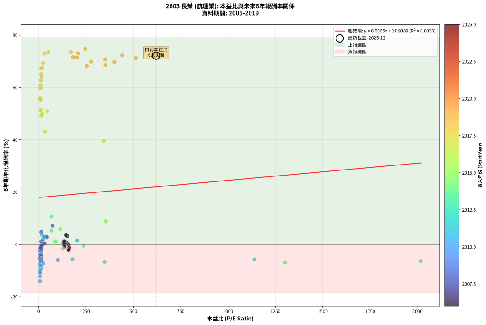
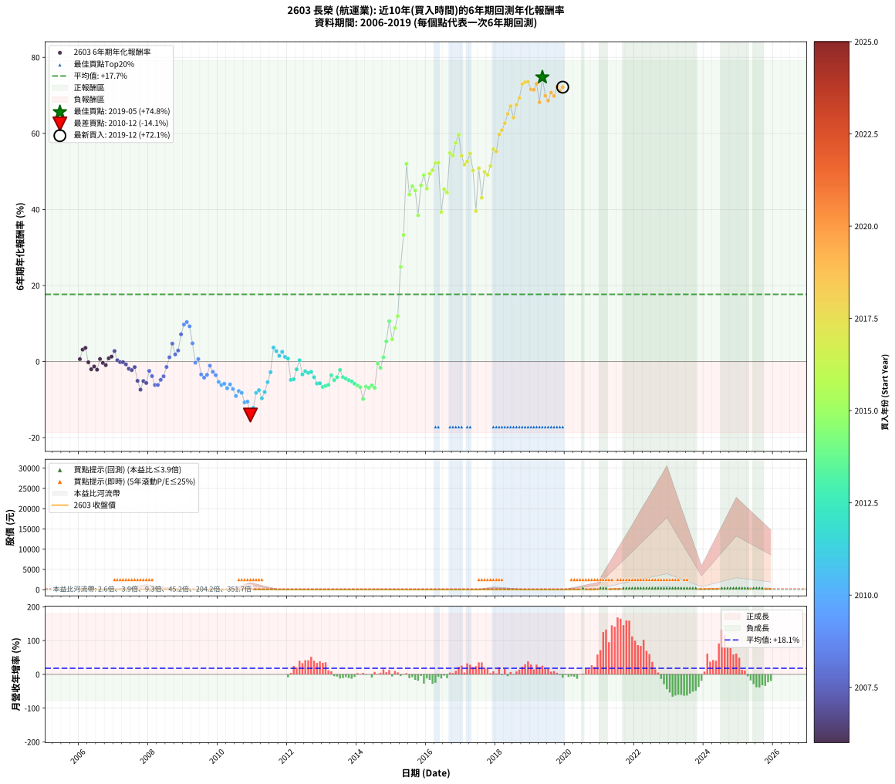

# 2603 長榮 - 本益比與未來報酬率分析

!!! info "報告資訊"
    - **股票代號**: 2603
    - **公司名稱**: 長榮
    - **產業別**: 航運業
    - **分析期間**: 2006-2019 (168 個數據點)
    - **資料來源**: Type 12 (ShowMonthlyK_ChartFlow) 月收盤價與本益比
    - **報酬率口徑**: 含現金股利 (簡化: 年度合計，假設每年7/1入帳)
    - **報告生成時間**: 2026-01-13 13:32:18 CST

## 📈 視覺化圖表

### 圖表1: 本益比 vs 未來報酬率關係

*圖表1：2603 長榮 本益比與6年期未來報酬率關係 (2006-2019)*

### 圖表2: 歷年買入時點的6年期實際報酬率

*圖表2：2603 長榮 歷年買入時點的6年期實際報酬率 (2006-2019)*

## 📍 買點訊號說明

本報告提供兩種買點提示訊號（顯示於圖表2的股價子圖中）：

### ▲ 小綠色三角形（回測驗證）
- **計算方式**: 使用全部歷史資料計算本益比第25百分位數
- **用途**: 事後驗證，顯示歷史上哪些時點確實為低估區
- **限制**: 當下無法判斷，僅供回測參考
- **特性**: 後見之明（Look-Ahead Bias）

### ▲ 小橘色三角形（即時訊號）
- **計算方式**: 使用截至當月的過去5年資料計算本益比第25百分位數
- **用途**: 實際投資決策，當時即可判斷
- **優勢**: 可操作性強，符合實務需求
- **特性**: 無後見之明，滾動窗口計算

!!! tip "如何使用兩種訊號"
    - **綠色▲** 幫助理解歷史估值機會，驗證策略有效性
    - **橘色▲** 可作為實際買進參考，但仍需搭配基本面分析
    - 兩種訊號重疊時，表示即時判斷與事後驗證一致，信心度較高
    - 僅有綠色▲時，表示當時無法判斷（需要未來資料才能確認）
    - 僅有橘色▲時，表示即時判斷為買點，但事後可能不是最佳時機

## 📊 估值分析摘要

| 指標 | 數值 |
|:---:|:---:|
| **目前本益比** (2019-12) | **620.00 倍** |
| **歷史平均本益比** | 140.24 倍 |
| **估值水準** | 🔴 相對高估 |
| **預期6年年化報酬率** | **+21.99%** |
| **歷史平均報酬率** | +17.68% |
| **相關係數 (R²)** | 0.0033 |
| **趨勢線斜率** | 0.0065 |

!!! abstract "核心洞察"
    目前本益比顯著高於歷史平均，預期未來報酬率可能較低

    根據歷史數據回測，2603 長榮 在目前本益比 **620.0倍** 的估值水準下，
    預期未來6年年化報酬率約為 **+22.0%**。

    **重要提醒**: 本分析基於歷史數據統計，實際報酬率會受到公司基本面變化、產業趨勢、
    總體經濟環境等多重因素影響。R² = 0.00 表示本益比可解釋約 0.3% 的報酬率變異。

## 📈 歷史估值統計

### 最佳買點 (最高報酬率)

| 項目 | 數值 |
|:---:|:---:|
| 起始時間 | 2019-05 |
| 當時本益比 | 246.10 倍 |
| 起始價格 | 12.1 元 |
| 6年後價格 | 244.5 元 |
| **6年年化報酬率** | **+74.76%** |

### 最差買點 (最低報酬率)

| 項目 | 數值 |
|:---:|:---:|
| 起始時間 | 2010-12 |
| 當時本益比 | 6.13 倍 |
| 起始價格 | 30.3 元 |
| 6年後價格 | 11.1 元 |
| **6年年化報酬率** | **-14.07%** |

## 🎯 投資啟示

### 本益比與報酬率關係

趨勢線方程式: **y = 0.0065x + 17.9389**

!!! info "弱相關或正相關"
    本益比與未來報酬率相關性較弱。這可能表示該股票的報酬率更多受到
    公司成長性、產業趨勢等因素影響，而非估值水準。**需綜合考量多項指標**。

### 估值區間建議

基於歷史數據分析:

- **🟢 低估區** (P/E < 112.2): 預期報酬率較高，可考慮增加持股
- **🟡 合理區** (P/E 112.2-168.3): 預期報酬率符合長期趨勢，正常持有
- **🔴 高估區** (P/E > 168.3): 預期報酬率較低，可考慮減碼或觀望

!!! danger "風險提示"
    - 過去表現不代表未來結果
    - 本分析假設公司基本面無重大結構性變化
    - 產業環境劇變可能使歷史規律失效
    - 應結合公司財報、產業趨勢、總體經濟等多重因素綜合判斷

!!! success "長期投資觀點"
    歷史數據顯示，在合理或低估的估值水準買入並長期持有，
    往往能獲得較佳的投資報酬。**耐心等待好價格**是價值投資的核心原則。

## 📊 數據品質

- **資料來源**: GoodInfo.tw Type 12 (ShowMonthlyK_ChartFlow)
- **資料頻率**: 月度收盤價與本益比
- **回測期間**: 2006-2019
- **數據點數量**: 168 個 (每個點代表一次6年期回測)

### 計算方法說明

1. **6年期年化報酬率**:
   - 對每個歷史時點，計算其後6年的實際投資報酬率
   - 期末價值(不含股利): 期末價格
   - 期末價值(含現金股利): 期末價格 + 持有期間內的現金股利合計 (簡化: 年度合計，假設每年7/1入帳)
   - 公式: 年化報酬率 = [(期末價值/期初價格)^(1/年數) - 1] × 100%

2. **本益比 (P/E Ratio)**:
   - 使用當時的月收盤價與EPS計算
   - 資料來源: Type 12 月度河流圖本益比數據

3. **趨勢線 (Linear Regression)**:
   - 使用最小平方法擬合線性趨勢線
   - R²值衡量本益比對報酬率的解釋能力

---

*本報告由 Stock Analysis System v1.9.0 自動生成*
*數據更新時間: 2026-01-13 13:32:18 CST*

## 📋 月度回測明細表

（每一列對應時間線圖中的一個買入點；可用來對照 SVG 圖上的每個點。）

| 買入月份 | 賣出月份 | 回測期限_年 | 實際持有年數 | 買入本益比_倍 | 買入收盤價_元 | 賣出收盤價_元 | 現金股利合計_元 | 總報酬率_pct | 年化報酬率_pct |
| --- | --- | --- | --- | --- | --- | --- | --- | --- | --- |
| 2006-01 | 2012-01 | 6 | 5.999 | 146.80 | 20.55 | 16.55 | 4.80 | +3.89 | +0.64 |
| 2006-02 | 2012-02 | 6 | 5.999 | 150.70 | 21.10 | 20.60 | 4.80 | +20.37 | +3.14 |
| 2006-03 | 2012-03 | 6 | 6.001 | 145.00 | 20.30 | 20.30 | 4.80 | +23.64 | +3.60 |
| 2006-04 | 2012-04 | 6 | 6.001 | 158.90 | 22.25 | 17.20 | 4.80 | -1.13 | -0.19 |
| 2006-05 | 2012-05 | 6 | 6.001 | 157.10 | 22.00 | 14.65 | 4.80 | -11.60 | -2.03 |
| 2006-06 | 2012-06 | 6 | 6.001 | 161.40 | 22.60 | 16.10 | 4.80 | -7.53 | -1.30 |
| 2006-07 | 2012-07 | 6 | 6.001 | 158.60 | 22.20 | 16.50 | 3.00 | -12.17 | -2.14 |
| 2006-08 | 2012-08 | 6 | 6.001 | 130.40 | 18.25 | 16.00 | 3.00 | +4.10 | +0.67 |
| 2006-09 | 2012-09 | 6 | 6.001 | 134.60 | 18.85 | 15.45 | 3.00 | -2.13 | -0.36 |
| 2006-10 | 2012-10 | 6 | 6.001 | 136.40 | 19.10 | 15.05 | 3.00 | -5.50 | -0.94 |
| 2006-11 | 2012-11 | 6 | 6.001 | 136.40 | 19.10 | 17.10 | 3.00 | +5.23 | +0.85 |
| 2006-12 | 2012-12 | 6 | 6.001 | 134.60 | 18.85 | 17.35 | 3.00 | +7.95 | +1.28 |
| 2007-01 | 2013-01 | 6 | 6.001 | 43.31 | 18.30 | 18.55 | 3.00 | +17.75 | +2.76 |
| 2007-02 | 2013-02 | 6 | 6.001 | 30.50 | 21.50 | 18.95 | 3.00 | +2.09 | +0.34 |
| 2007-03 | 2013-03 | 6 | 6.001 | 21.37 | 21.10 | 17.90 | 3.00 | -0.95 | -0.16 |
| 2007-04 | 2013-04 | 6 | 6.001 | 16.10 | 20.45 | 17.25 | 3.00 | -0.98 | -0.16 |
| 2007-05 | 2013-05 | 6 | 6.001 | 13.30 | 20.65 | 16.75 | 3.00 | -4.36 | -0.74 |
| 2007-06 | 2013-06 | 6 | 6.001 | 11.85 | 21.75 | 16.40 | 3.00 | -10.81 | -1.89 |
| 2007-07 | 2013-07 | 6 | 6.001 | 10.55 | 22.35 | 16.80 | 2.70 | -12.76 | -2.25 |
| 2007-08 | 2013-08 | 6 | 6.001 | 8.92 | 21.40 | 16.90 | 2.70 | -8.42 | -1.45 |
| 2007-09 | 2013-09 | 6 | 6.001 | 10.29 | 27.60 | 17.50 | 2.70 | -26.82 | -5.07 |
| 2007-10 | 2013-10 | 6 | 6.001 | 10.69 | 31.70 | 17.30 | 2.70 | -36.91 | -7.39 |
| 2007-11 | 2013-11 | 6 | 6.001 | 8.53 | 27.70 | 17.50 | 2.70 | -27.08 | -5.13 |
| 2007-12 | 2013-12 | 6 | 6.001 | 8.39 | 29.60 | 18.20 | 2.70 | -29.40 | -5.63 |
| 2008-01 | 2014-01 | 6 | 6.001 | 7.32 | 23.80 | 17.80 | 2.70 | -13.87 | -2.46 |
| 2008-02 | 2014-03 | 6 | 6.081 | 8.73 | 26.00 | 17.80 | 2.70 | -21.16 | -3.83 |
| 2008-03 | 2014-03 | 6 | 5.999 | 11.11 | 30.00 | 17.80 | 2.70 | -31.67 | -6.15 |
| 2008-04 | 2014-04 | 6 | 5.999 | 11.99 | 29.05 | 17.15 | 2.70 | -31.67 | -6.15 |
| 2008-05 | 2014-05 | 6 | 5.999 | 12.46 | 26.75 | 17.20 | 2.70 | -25.61 | -4.81 |
| 2008-06 | 2014-06 | 6 | 5.999 | 12.89 | 24.10 | 16.30 | 2.70 | -21.17 | -3.89 |
| 2008-07 | 2014-07 | 6 | 5.999 | 12.55 | 20.00 | 17.35 | 1.00 | -8.25 | -1.43 |
| 2008-08 | 2014-08 | 6 | 5.999 | 13.67 | 18.00 | 18.25 | 1.00 | +6.94 | +1.13 |
| 2008-09 | 2014-09 | 6 | 5.999 | 13.75 | 14.30 | 17.85 | 1.00 | +31.82 | +4.71 |
| 2008-10 | 2014-10 | 6 | 5.999 | 22.21 | 16.95 | 17.95 | 1.00 | +11.80 | +1.88 |
| 2008-11 | 2014-11 | 6 | 5.999 | 33.49 | 16.30 | 18.35 | 1.00 | +18.71 | +2.90 |
| 2008-12 | 2014-12 | 6 | 5.999 | 73.57 | 15.45 | 22.40 | 1.00 | +51.46 | +7.17 |
| 2009-01 | 2015-01 | 6 | 5.999 |  | 13.40 | 22.40 | 1.00 | +74.63 | +9.74 |
| 2009-02 | 2015-02 | 6 | 5.999 |  | 13.30 | 23.05 | 1.00 | +80.83 | +10.38 |
| 2009-03 | 2015-03 | 6 | 5.999 |  | 14.25 | 23.25 | 1.00 | +70.18 | +9.27 |
| 2009-04 | 2015-04 | 6 | 5.999 |  | 16.50 | 20.85 | 1.00 | +32.42 | +4.79 |
| 2009-05 | 2015-05 | 6 | 5.999 |  | 19.00 | 17.65 | 1.00 | -1.84 | -0.31 |
| 2009-06 | 2015-06 | 6 | 5.999 |  | 16.35 | 16.00 | 1.00 | +3.98 | +0.65 |
| 2009-07 | 2015-07 | 6 | 5.999 |  | 20.00 | 15.15 | 1.10 | -18.75 | -3.40 |
| 2009-08 | 2015-08 | 6 | 5.999 |  | 19.90 | 14.25 | 1.10 | -22.86 | -4.24 |
| 2009-09 | 2015-09 | 6 | 5.999 |  | 18.50 | 13.85 | 1.10 | -19.19 | -3.49 |
| 2009-10 | 2015-10 | 6 | 5.999 |  | 16.65 | 14.50 | 1.10 | -6.31 | -1.08 |
| 2009-11 | 2015-11 | 6 | 5.999 |  | 16.55 | 12.95 | 1.10 | -15.11 | -2.69 |
| 2009-12 | 2015-12 | 6 | 5.999 |  | 17.85 | 13.25 | 1.10 | -19.61 | -3.57 |
| 2010-01 | 2016-01 | 6 | 5.999 |  | 18.50 | 12.20 | 1.10 | -28.11 | -5.35 |
| 2010-02 | 2016-02 | 6 | 5.999 |  | 19.20 | 12.00 | 1.10 | -31.77 | -6.17 |
| 2010-03 | 2016-03 | 6 | 6.001 |  | 18.70 | 11.95 | 1.10 | -30.21 | -5.82 |
| 2010-04 | 2016-04 | 6 | 6.001 |  | 20.15 | 11.90 | 1.10 | -35.48 | -7.04 |
| 2010-05 | 2016-05 | 6 | 6.001 | 101.40 | 18.25 | 11.50 | 1.10 | -30.96 | -5.99 |
| 2010-06 | 2016-06 | 6 | 6.001 | 23.78 | 20.45 | 11.95 | 1.10 | -36.19 | -7.21 |
| 2010-07 | 2016-07 | 6 | 6.001 | 15.45 | 23.80 | 12.35 | 1.10 | -43.49 | -9.07 |
| 2010-08 | 2016-08 | 6 | 6.001 | 9.57 | 21.25 | 12.00 | 1.10 | -38.35 | -7.74 |
| 2010-09 | 2016-09 | 6 | 6.001 | 7.62 | 22.10 | 12.10 | 1.10 | -40.27 | -8.23 |
| 2010-10 | 2016-10 | 6 | 6.001 | 7.12 | 25.50 | 11.80 | 1.10 | -49.41 | -10.73 |
| 2010-11 | 2016-11 | 6 | 6.001 | 6.02 | 25.65 | 12.05 | 1.10 | -48.73 | -10.54 |
| 2010-12 | 2016-12 | 6 | 6.001 | 6.13 | 30.30 | 11.10 | 1.10 | -59.74 | -14.07 |
| 2011-01 | 2017-01 | 6 | 6.001 | 6.85 | 30.50 | 12.90 | 1.10 | -54.10 | -12.17 |
| 2011-02 | 2017-02 | 6 | 6.001 | 6.60 | 26.20 | 14.55 | 1.10 | -40.27 | -8.23 |
| 2011-03 | 2017-03 | 6 | 6.001 | 7.02 | 24.45 | 14.20 | 1.10 | -37.42 | -7.51 |
| 2011-04 | 2017-04 | 6 | 6.001 | 8.84 | 26.50 | 13.30 | 1.10 | -45.66 | -9.66 |
| 2011-05 | 2017-05 | 6 | 6.001 | 10.65 | 26.75 | 15.10 | 1.10 | -39.44 | -8.02 |
| 2011-06 | 2017-06 | 6 | 6.001 | 11.41 | 23.10 | 15.45 | 1.10 | -28.35 | -5.40 |
| 2011-07 | 2017-07 | 6 | 6.001 | 12.83 | 19.75 | 16.55 | 0.10 | -15.70 | -2.80 |
| 2011-08 | 2017-08 | 6 | 6.001 | 17.66 | 18.60 | 23.00 | 0.10 | +24.19 | +3.68 |
| 2011-09 | 2017-09 | 6 | 6.001 | 27.49 | 15.60 | 18.25 | 0.10 | +17.63 | +2.74 |
| 2011-10 | 2017-10 | 6 | 6.001 | 203.30 | 16.60 | 18.05 | 0.10 | +9.34 | +1.50 |
| 2011-11 | 2017-11 | 6 | 6.001 |  | 14.55 | 16.85 | 0.10 | +16.49 | +2.58 |
| 2011-12 | 2017-12 | 6 | 6.001 |  | 15.30 | 16.35 | 0.10 | +7.52 | +1.21 |
| 2012-01 | 2018-01 | 6 | 6.001 |  | 16.55 | 17.25 | 0.10 | +4.83 | +0.79 |
| 2012-02 | 2018-03 | 6 | 6.081 |  | 20.60 | 15.15 | 0.10 | -25.97 | -4.83 |
| 2012-03 | 2018-03 | 6 | 5.999 |  | 20.30 | 15.15 | 0.10 | -24.88 | -4.66 |
| 2012-04 | 2018-04 | 6 | 5.999 |  | 17.20 | 15.10 | 0.10 | -11.63 | -2.04 |
| 2012-05 | 2018-05 | 6 | 5.999 |  | 14.65 | 14.85 | 0.10 | +2.05 | +0.34 |
| 2012-06 | 2018-06 | 6 | 5.999 |  | 16.10 | 13.00 | 0.10 | -18.63 | -3.38 |
| 2012-07 | 2018-07 | 6 | 5.999 |  | 16.50 | 13.85 | 0.30 | -14.24 | -2.53 |
| 2012-08 | 2018-08 | 6 | 5.999 |  | 16.00 | 13.05 | 0.30 | -16.56 | -2.97 |
| 2012-09 | 2018-09 | 6 | 5.999 |  | 15.45 | 12.80 | 0.30 | -15.21 | -2.71 |
| 2012-10 | 2018-10 | 6 | 5.999 |  | 15.05 | 11.40 | 0.30 | -22.26 | -4.11 |
| 2012-11 | 2018-11 | 6 | 5.999 | 1140.00 | 17.10 | 11.65 | 0.30 | -30.12 | -5.80 |
| 2012-12 | 2018-12 | 6 | 5.999 | 178.40 | 17.35 | 11.90 | 0.30 | -29.68 | -5.70 |
| 2013-01 | 2019-01 | 6 | 5.999 | 347.80 | 18.55 | 11.95 | 0.30 | -33.96 | -6.68 |
| 2013-02 | 2019-02 | 6 | 5.999 | 2018.00 | 18.95 | 12.45 | 0.30 | -32.72 | -6.39 |
| 2013-03 | 2019-03 | 6 | 5.999 |  | 17.90 | 11.95 | 0.30 | -31.56 | -6.13 |
| 2013-04 | 2019-04 | 6 | 5.999 |  | 17.25 | 13.55 | 0.30 | -19.71 | -3.59 |
| 2013-05 | 2019-05 | 6 | 5.999 |  | 16.75 | 12.10 | 0.30 | -25.97 | -4.89 |
| 2013-06 | 2019-06 | 6 | 5.999 |  | 16.40 | 12.45 | 0.30 | -22.26 | -4.11 |
| 2013-07 | 2019-07 | 6 | 5.999 |  | 16.80 | 14.40 | 0.30 | -12.50 | -2.20 |
| 2013-08 | 2019-08 | 6 | 5.999 |  | 16.90 | 12.85 | 0.30 | -22.19 | -4.10 |
| 2013-09 | 2019-09 | 6 | 5.999 |  | 17.50 | 13.00 | 0.30 | -24.00 | -4.47 |
| 2013-10 | 2019-10 | 6 | 5.999 |  | 17.30 | 12.50 | 0.30 | -26.01 | -4.90 |
| 2013-11 | 2019-11 | 6 | 5.999 |  | 17.50 | 12.40 | 0.30 | -27.43 | -5.20 |
| 2013-12 | 2019-12 | 6 | 5.999 |  | 18.20 | 12.40 | 0.30 | -30.22 | -5.82 |
| 2014-01 | 2020-01 | 6 | 5.999 |  | 17.80 | 11.75 | 0.30 | -32.30 | -6.30 |
| 2014-02 | 2020-02 | 6 | 5.999 |  | 18.00 | 11.55 | 0.30 | -34.17 | -6.73 |
| 2014-03 | 2020-03 | 6 | 6.001 |  | 17.80 | 9.25 | 0.30 | -46.35 | -9.86 |
| 2014-04 | 2020-04 | 6 | 6.001 |  | 17.15 | 11.10 | 0.30 | -33.53 | -6.58 |
| 2014-05 | 2020-05 | 6 | 6.001 |  | 17.20 | 10.90 | 0.30 | -34.88 | -6.90 |
| 2014-06 | 2020-06 | 6 | 6.001 |  | 16.30 | 10.75 | 0.30 | -32.21 | -6.27 |
| 2014-07 | 2020-07 | 6 | 6.001 | 1301.00 | 17.35 | 11.00 | 0.30 | -34.87 | -6.90 |
| 2014-08 | 2020-08 | 6 | 6.001 | 238.00 | 18.25 | 17.40 | 0.30 | -3.01 | -0.51 |
| 2014-09 | 2020-09 | 6 | 6.001 | 127.50 | 17.85 | 15.85 | 0.30 | -9.52 | -1.65 |
| 2014-10 | 2020-10 | 6 | 6.001 | 88.28 | 17.95 | 18.90 | 0.30 | +6.96 | +1.13 |
| 2014-11 | 2020-11 | 6 | 6.001 | 68.81 | 18.35 | 24.70 | 0.30 | +36.24 | +5.29 |
| 2014-12 | 2020-12 | 6 | 6.001 | 67.88 | 22.40 | 40.70 | 0.30 | +83.04 | +10.60 |
| 2015-01 | 2021-01 | 6 | 6.001 | 113.40 | 22.40 | 31.20 | 0.30 | +40.63 | +5.85 |
| 2015-02 | 2021-02 | 6 | 6.001 | 354.60 | 23.05 | 37.95 | 0.30 | +65.94 | +8.81 |
| 2015-03 | 2021-03 | 6 | 6.001 |  | 23.25 | 45.50 | 0.30 | +96.99 | +11.96 |
| 2015-04 | 2021-04 | 6 | 6.001 |  | 20.85 | 79.00 | 0.30 | +280.34 | +24.93 |
| 2015-05 | 2021-05 | 6 | 6.001 |  | 17.65 | 98.60 | 0.30 | +460.34 | +33.26 |
| 2015-06 | 2021-06 | 6 | 6.001 |  | 16.00 | 197.00 | 0.30 | +1133.12 | +51.98 |
| 2015-07 | 2021-07 | 6 | 6.001 |  | 15.15 | 132.00 | 2.69 | +789.02 | +43.92 |
| 2015-08 | 2021-08 | 6 | 6.001 |  | 14.25 | 136.00 | 2.69 | +873.24 | +46.11 |
| 2015-09 | 2021-09 | 6 | 6.001 |  | 13.85 | 126.00 | 2.69 | +829.15 | +44.98 |
| 2015-10 | 2021-10 | 6 | 6.001 |  | 14.50 | 99.50 | 2.69 | +604.74 | +38.45 |
| 2015-11 | 2021-11 | 6 | 6.001 |  | 12.95 | 124.50 | 2.69 | +882.14 | +46.33 |
| 2015-12 | 2021-12 | 6 | 6.001 |  | 13.25 | 142.50 | 2.69 | +995.75 | +49.02 |
| 2016-01 | 2022-01 | 6 | 6.001 |  | 12.20 | 113.00 | 2.69 | +848.25 | +45.47 |
| 2016-02 | 2022-03 | 6 | 6.081 |  | 12.00 | 135.00 | 2.69 | +1047.39 | +49.37 |
| 2016-03 | 2022-03 | 6 | 5.999 |  | 11.95 | 135.00 | 2.69 | +1052.19 | +50.30 |
| 2016-04 | 2022-04 | 6 | 5.999 |  | 11.90 | 145.00 | 2.69 | +1141.07 | +52.17 |
| 2016-05 | 2022-05 | 6 | 5.999 |  | 11.50 | 140.50 | 2.69 | +1145.10 | +52.26 |
| 2016-06 | 2022-06 | 6 | 5.999 |  | 11.95 | 84.60 | 2.69 | +630.44 | +39.30 |
| 2016-07 | 2022-07 | 6 | 5.999 |  | 12.35 | 95.50 | 20.69 | +840.79 | +45.31 |
| 2016-08 | 2022-08 | 6 | 5.999 |  | 12.00 | 88.30 | 20.69 | +808.23 | +44.46 |
| 2016-09 | 2022-09 | 6 | 5.999 |  | 12.10 | 146.00 | 20.69 | +1277.58 | +54.84 |
| 2016-10 | 2022-10 | 6 | 5.999 |  | 11.80 | 137.50 | 20.69 | +1240.57 | +54.14 |
| 2016-11 | 2022-11 | 6 | 5.999 |  | 12.05 | 163.00 | 20.69 | +1424.37 | +57.48 |
| 2016-12 | 2022-12 | 6 | 5.999 |  | 11.10 | 163.00 | 20.69 | +1554.84 | +59.65 |
| 2017-01 | 2023-01 | 6 | 5.999 |  | 12.90 | 152.00 | 20.69 | +1238.66 | +54.11 |
| 2017-02 | 2023-02 | 6 | 5.999 |  | 14.55 | 157.00 | 20.69 | +1121.22 | +51.77 |
| 2017-03 | 2023-03 | 6 | 5.999 |  | 14.20 | 158.50 | 20.69 | +1161.88 | +52.60 |
| 2017-04 | 2023-04 | 6 | 5.999 |  | 13.30 | 161.50 | 20.69 | +1269.83 | +54.70 |
| 2017-05 | 2023-05 | 6 | 5.999 |  | 15.10 | 153.00 | 20.69 | +1050.25 | +50.26 |
| 2017-06 | 2023-06 | 6 | 5.999 | 343.30 | 15.45 | 93.50 | 20.69 | +639.07 | +39.58 |
| 2017-07 | 2023-07 | 6 | 5.999 | 45.24 | 16.55 | 104.00 | 90.69 | +1076.36 | +50.82 |
| 2017-08 | 2023-08 | 6 | 5.999 | 33.50 | 23.00 | 106.50 | 90.69 | +757.33 | +43.07 |
| 2017-09 | 2023-09 | 6 | 5.999 | 18.11 | 18.25 | 116.00 | 90.69 | +1032.53 | +49.87 |
| 2017-10 | 2023-10 | 6 | 5.999 | 13.59 | 18.05 | 107.50 | 90.69 | +997.99 | +49.10 |
| 2017-11 | 2023-11 | 6 | 5.999 | 10.22 | 16.85 | 112.00 | 90.69 | +1102.89 | +51.38 |
| 2017-12 | 2023-12 | 6 | 5.999 | 8.30 | 16.35 | 143.50 | 90.69 | +1332.34 | +55.85 |
| 2018-01 | 2024-01 | 6 | 5.999 | 9.52 | 17.25 | 150.50 | 90.69 | +1298.19 | +55.23 |
| 2018-02 | 2024-02 | 6 | 5.999 | 9.34 | 15.45 | 165.50 | 90.69 | +1558.17 | +59.70 |
| 2018-03 | 2024-03 | 6 | 6.001 | 10.13 | 15.15 | 172.00 | 90.69 | +1633.91 | +60.86 |
| 2018-04 | 2024-04 | 6 | 6.001 | 11.30 | 15.10 | 189.50 | 90.69 | +1755.54 | +62.69 |
| 2018-05 | 2024-05 | 6 | 6.001 | 12.60 | 14.85 | 210.50 | 90.69 | +1928.20 | +65.12 |
| 2018-06 | 2024-06 | 6 | 6.001 | 12.75 | 13.00 | 193.00 | 90.69 | +2082.21 | +67.15 |
| 2018-07 | 2024-07 | 6 | 6.001 | 16.07 | 13.85 | 170.50 | 100.45 | +1856.33 | +64.13 |
| 2018-08 | 2024-08 | 6 | 6.001 | 18.55 | 13.05 | 188.00 | 100.45 | +2110.36 | +67.50 |
| 2018-09 | 2024-09 | 6 | 6.001 | 23.49 | 12.80 | 201.00 | 100.45 | +2255.09 | +69.28 |
| 2018-10 | 2024-10 | 6 | 6.001 | 29.48 | 11.40 | 205.50 | 100.45 | +2583.79 | +73.01 |
| 2018-11 | 2024-11 | 6 | 6.001 | 51.02 | 11.65 | 217.00 | 100.45 | +2624.91 | +73.45 |
| 2018-12 | 2024-12 | 6 | 6.001 | 170.00 | 11.90 | 225.00 | 100.45 | +2634.89 | +73.55 |
| 2019-01 | 2025-01 | 6 | 6.001 | 181.50 | 11.95 | 204.50 | 100.45 | +2451.90 | +71.56 |
| 2019-02 | 2025-02 | 6 | 6.001 | 201.90 | 12.45 | 216.00 | 100.45 | +2441.78 | +71.45 |
| 2019-03 | 2025-03 | 6 | 6.001 | 207.80 | 11.95 | 220.50 | 100.45 | +2585.79 | +73.03 |
| 2019-04 | 2025-04 | 6 | 6.001 | 254.10 | 13.55 | 206.50 | 100.45 | +2165.33 | +68.19 |
| 2019-05 | 2025-05 | 6 | 6.001 | 246.10 | 12.10 | 244.50 | 100.45 | +2750.84 | +74.76 |
| 2019-06 | 2025-06 | 6 | 6.001 | 276.70 | 12.45 | 199.00 | 100.45 | +2305.24 | +69.88 |
| 2019-07 | 2025-07 | 6 | 6.001 | 352.60 | 14.40 | 198.00 | 132.95 | +2198.28 | +68.60 |
| 2019-08 | 2025-08 | 6 | 6.001 | 350.40 | 12.85 | 185.50 | 132.95 | +2378.23 | +70.73 |
| 2019-09 | 2025-09 | 6 | 6.001 | 400.00 | 13.00 | 179.00 | 132.95 | +2299.63 | +69.81 |
| 2019-10 | 2025-10 | 6 | 6.001 | 441.20 | 12.50 | 193.50 | 132.95 | +2511.62 | +72.23 |
| 2019-11 | 2025-11 | 6 | 6.001 | 513.10 | 12.40 | 179.50 | 132.95 | +2419.77 | +71.20 |
| 2019-12 | 2025-12 | 6 | 6.001 | 620.00 | 12.40 | 190.00 | 132.95 | +2504.45 | +72.15 |
