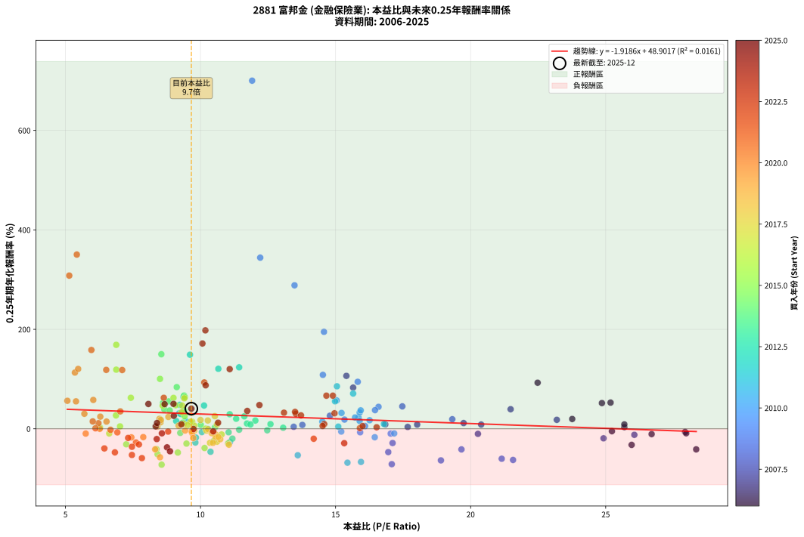
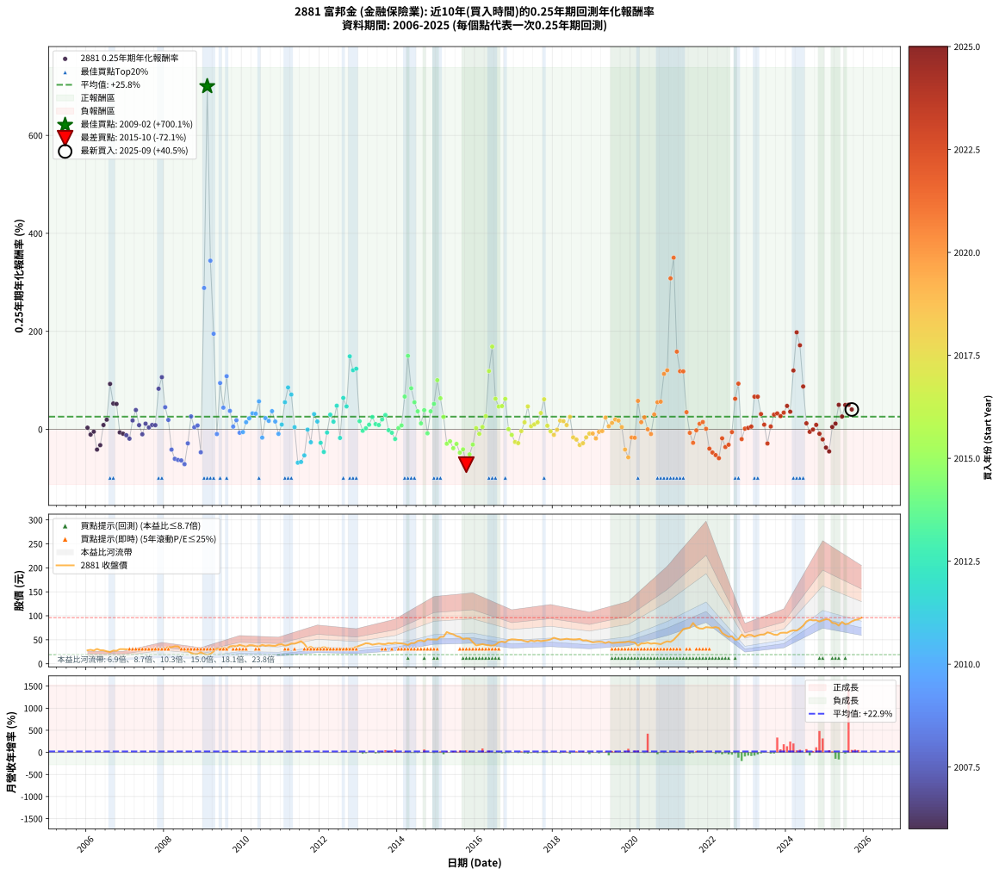

# 2881 富邦金 - 本益比與未來報酬率分析

!!! info "報告資訊"
    - **股票代號**: 2881
    - **公司名稱**: 富邦金
    - **產業別**: 金融保險業
    - **分析期間**: 2006-2025 (237 個數據點)
    - **資料來源**: Type 12 (ShowMonthlyK_ChartFlow) 月收盤價與本益比
    - **報酬率口徑**: 含現金股利 (簡化: 年度合計，假設每年7/1入帳)
    - **報告生成時間**: 2026-01-06 22:45:12 CST

## 📈 視覺化圖表

### 圖表1: 本益比 vs 未來報酬率關係

*圖表1：2881 富邦金 本益比與0.25年期未來報酬率關係 (2006-2025)*

### 圖表2: 歷年買入時點的0.25年期實際報酬率

*圖表2：2881 富邦金 歷年買入時點的0.25年期實際報酬率 (2006-2025)*

## 📍 買點訊號說明

本報告提供兩種買點提示訊號（顯示於圖表2的股價子圖中）：

### ▲ 小綠色三角形（回測驗證）
- **計算方式**: 使用全部歷史資料計算本益比第25百分位數
- **用途**: 事後驗證，顯示歷史上哪些時點確實為低估區
- **限制**: 當下無法判斷，僅供回測參考
- **特性**: 後見之明（Look-Ahead Bias）

### ▲ 小橘色三角形（即時訊號）
- **計算方式**: 使用截至當月的過去5年資料計算本益比第25百分位數
- **用途**: 實際投資決策，當時即可判斷
- **優勢**: 可操作性強，符合實務需求
- **特性**: 無後見之明，滾動窗口計算

!!! tip "如何使用兩種訊號"
    - **綠色▲** 幫助理解歷史估值機會，驗證策略有效性
    - **橘色▲** 可作為實際買進參考，但仍需搭配基本面分析
    - 兩種訊號重疊時，表示即時判斷與事後驗證一致，信心度較高
    - 僅有綠色▲時，表示當時無法判斷（需要未來資料才能確認）
    - 僅有橘色▲時，表示即時判斷為買點，但事後可能不是最佳時機

## 📊 估值分析摘要

| 指標 | 數值 |
|:---:|:---:|
| **目前本益比** (2025-09) | **9.66 倍** |
| **歷史平均本益比** | 12.04 倍 |
| **估值水準** | 🟡 合理範圍 |
| **預期0.25年年化報酬率** | **+30.37%** |
| **歷史平均報酬率** | +25.79% |
| **相關係數 (R²)** | 0.0161 |
| **趨勢線斜率** | -1.9186 |

!!! abstract "核心洞察"
    目前本益比接近歷史平均，預期報酬率符合長期趨勢

    根據歷史數據回測，2881 富邦金 在目前本益比 **9.7倍** 的估值水準下，
    預期未來0.25年年化報酬率約為 **+30.4%**。

    **重要提醒**: 本分析基於歷史數據統計，實際報酬率會受到公司基本面變化、產業趨勢、
    總體經濟環境等多重因素影響。R² = 0.02 表示本益比可解釋約 1.6% 的報酬率變異。

## 📈 歷史估值統計

### 最佳買點 (最高報酬率)

| 項目 | 數值 |
|:---:|:---:|
| 起始時間 | 2009-02 |
| 當時本益比 | 11.91 倍 |
| 起始價格 | 18.9 元 |
| 0.25年後價格 | 31.6 元 |
| **0.25年年化報酬率** | **+700.08%** |

### 最差買點 (最低報酬率)

| 項目 | 數值 |
|:---:|:---:|
| 起始時間 | 2015-10 |
| 當時本益比 | 8.56 倍 |
| 起始價格 | 52.7 元 |
| 0.25年後價格 | 38.2 元 |
| **0.25年年化報酬率** | **-72.13%** |

## 🎯 投資啟示

### 本益比與報酬率關係

趨勢線方程式: **y = -1.9186x + 48.9017**

!!! warning "強負相關"
    本益比與未來報酬率呈現強負相關。在高本益比時期買入，未來報酬率顯著較低；
    在低本益比時期買入，未來報酬率顯著較高。**估值紀律至關重要**。

### 估值區間建議

基於歷史數據分析:

- **🟢 低估區** (P/E < 9.6): 預期報酬率較高，可考慮增加持股
- **🟡 合理區** (P/E 9.6-14.5): 預期報酬率符合長期趨勢，正常持有
- **🔴 高估區** (P/E > 14.5): 預期報酬率較低，可考慮減碼或觀望

!!! danger "風險提示"
    - 過去表現不代表未來結果
    - 本分析假設公司基本面無重大結構性變化
    - 產業環境劇變可能使歷史規律失效
    - 應結合公司財報、產業趨勢、總體經濟等多重因素綜合判斷

!!! success "長期投資觀點"
    歷史數據顯示，在合理或低估的估值水準買入並長期持有，
    往往能獲得較佳的投資報酬。**耐心等待好價格**是價值投資的核心原則。

## 📊 數據品質

- **資料來源**: GoodInfo.tw Type 12 (ShowMonthlyK_ChartFlow)
- **資料頻率**: 月度收盤價與本益比
- **回測期間**: 2006-2025
- **數據點數量**: 237 個 (每個點代表一次0.25年期回測)

### 計算方法說明

1. **0.25年期年化報酬率**:
   - 對每個歷史時點，計算其後0.25年的實際投資報酬率
   - 期末價值(不含股利): 期末價格
   - 期末價值(含現金股利): 期末價格 + 持有期間內的現金股利合計 (簡化: 年度合計，假設每年7/1入帳)
   - 公式: 年化報酬率 = [(期末價值/期初價格)^(1/年數) - 1] × 100%

2. **本益比 (P/E Ratio)**:
   - 使用當時的月收盤價與EPS計算
   - 資料來源: Type 12 月度河流圖本益比數據

3. **趨勢線 (Linear Regression)**:
   - 使用最小平方法擬合線性趨勢線
   - R²值衡量本益比對報酬率的解釋能力

---

*本報告由 Stock Analysis System v1.9.0 自動生成*
*數據更新時間: 2026-01-06 22:45:12 CST*

## 📋 月度回測明細表

（每一列對應時間線圖中的一個買入點；可用來對照 SVG 圖上的每個點。）

| 買入月份 | 賣出月份 | 回測期限_年 | 實際持有年數 | 買入本益比_倍 | 買入收盤價_元 | 賣出收盤價_元 | 現金股利合計_元 | 總報酬率_pct | 年化報酬率_pct |
| --- | --- | --- | --- | --- | --- | --- | --- | --- | --- |
| 2006-01 | 2006-05 | 0.25 | 0.329 | 25.69 | 28.00 | 28.30 | 0.00 | +1.07 | +3.30 |
| 2006-02 | 2006-05 | 0.25 | 0.246 | 26.70 | 29.10 | 28.30 | 0.00 | -2.75 | -10.70 |
| 2006-03 | 2006-07 | 0.25 | 0.334 | 25.23 | 27.50 | 25.90 | 1.15 | -1.64 | -4.82 |
| 2006-04 | 2006-07 | 0.25 | 0.249 | 28.35 | 30.90 | 25.90 | 1.15 | -12.46 | -41.38 |
| 2006-05 | 2006-08 | 0.25 | 0.252 | 25.96 | 28.30 | 24.50 | 1.15 | -9.36 | -32.32 |
| 2006-06 | 2006-09 | 0.25 | 0.252 | 25.69 | 28.00 | 27.45 | 1.15 | +2.14 | +8.78 |
| 2006-07 | 2006-10 | 0.25 | 0.252 | 23.76 | 25.90 | 27.10 | 0.00 | +4.63 | +19.70 |
| 2006-08 | 2006-12 | 0.25 | 0.334 | 22.48 | 24.50 | 30.50 | 0.00 | +24.49 | +92.67 |
| 2006-09 | 2006-12 | 0.25 | 0.249 | 25.18 | 27.45 | 30.50 | 0.00 | +11.11 | +52.64 |
| 2006-10 | 2007-01 | 0.25 | 0.252 | 24.86 | 27.10 | 30.10 | 0.00 | +11.07 | +51.71 |
| 2006-11 | 2007-03 | 0.25 | 0.329 | 27.94 | 30.45 | 29.80 | 0.00 | -2.13 | -6.36 |
| 2006-12 | 2007-03 | 0.25 | 0.246 | 27.98 | 30.50 | 29.80 | 0.00 | -2.30 | -8.99 |
| 2007-01 | 2007-05 | 0.25 | 0.329 | 26.06 | 30.10 | 28.85 | 0.00 | -4.15 | -12.11 |
| 2007-02 | 2007-05 | 0.25 | 0.246 | 24.92 | 30.40 | 28.85 | 0.00 | -5.10 | -19.13 |
| 2007-03 | 2007-07 | 0.25 | 0.334 | 23.19 | 29.80 | 30.50 | 1.00 | +5.70 | +18.07 |
| 2007-04 | 2007-07 | 0.25 | 0.249 | 21.48 | 29.00 | 30.50 | 1.00 | +8.62 | +39.36 |
| 2007-05 | 2007-08 | 0.25 | 0.252 | 20.39 | 28.85 | 28.45 | 1.00 | +2.08 | +8.52 |
| 2007-06 | 2007-09 | 0.25 | 0.252 | 20.27 | 30.00 | 28.20 | 1.00 | -2.67 | -10.17 |
| 2007-07 | 2007-10 | 0.25 | 0.252 | 19.74 | 30.50 | 31.35 | 0.00 | +2.79 | +11.53 |
| 2007-08 | 2007-12 | 0.25 | 0.334 | 17.67 | 28.45 | 28.80 | 0.00 | +1.23 | +3.73 |
| 2007-09 | 2007-12 | 0.25 | 0.249 | 16.84 | 28.20 | 28.80 | 0.00 | +2.13 | +8.82 |
| 2007-10 | 2008-01 | 0.25 | 0.252 | 18.02 | 31.35 | 32.00 | 0.00 | +2.07 | +8.49 |
| 2007-11 | 2008-03 | 0.25 | 0.331 | 15.65 | 28.25 | 34.50 | 0.00 | +22.12 | +82.82 |
| 2007-12 | 2008-03 | 0.25 | 0.249 | 15.40 | 28.80 | 34.50 | 0.00 | +19.79 | +106.44 |
| 2008-01 | 2008-05 | 0.25 | 0.331 | 17.47 | 32.00 | 36.20 | 0.00 | +13.13 | +45.10 |
| 2008-02 | 2008-05 | 0.25 | 0.249 | 19.32 | 34.65 | 36.20 | 0.00 | +4.47 | +19.20 |
| 2008-03 | 2008-07 | 0.25 | 0.334 | 19.66 | 34.50 | 27.35 | 1.50 | -16.38 | -41.46 |
| 2008-04 | 2008-07 | 0.25 | 0.249 | 21.15 | 36.30 | 27.35 | 1.50 | -20.52 | -60.23 |
| 2008-05 | 2008-08 | 0.25 | 0.252 | 21.57 | 36.20 | 26.75 | 1.50 | -21.96 | -62.64 |
| 2008-06 | 2008-09 | 0.25 | 0.252 | 18.90 | 31.00 | 22.55 | 1.50 | -22.42 | -63.50 |
| 2008-07 | 2008-10 | 0.25 | 0.252 | 17.08 | 27.35 | 20.00 | 0.00 | -26.87 | -71.14 |
| 2008-08 | 2008-12 | 0.25 | 0.334 | 17.11 | 26.75 | 23.90 | 0.00 | -10.65 | -28.63 |
| 2008-09 | 2008-12 | 0.25 | 0.249 | 14.79 | 22.55 | 23.90 | 0.00 | +5.99 | +26.29 |
| 2008-10 | 2009-01 | 0.25 | 0.252 | 13.45 | 20.00 | 20.20 | 0.00 | +1.00 | +4.03 |
| 2008-11 | 2009-03 | 0.25 | 0.329 | 13.77 | 19.95 | 20.45 | 0.00 | +2.51 | +7.83 |
| 2008-12 | 2009-03 | 0.25 | 0.246 | 16.95 | 23.90 | 20.45 | 0.00 | -14.44 | -46.88 |
| 2009-01 | 2009-05 | 0.25 | 0.329 | 13.48 | 20.20 | 31.55 | 0.00 | +56.19 | +288.52 |
| 2009-02 | 2009-05 | 0.25 | 0.246 | 11.91 | 18.90 | 31.55 | 0.00 | +66.93 | +700.08 |
| 2009-03 | 2009-07 | 0.25 | 0.334 | 12.21 | 20.45 | 33.65 | 0.00 | +64.55 | +344.17 |
| 2009-04 | 2009-07 | 0.25 | 0.249 | 14.57 | 25.70 | 33.65 | 0.00 | +30.93 | +195.00 |
| 2009-05 | 2009-08 | 0.25 | 0.252 | 17.04 | 31.55 | 30.75 | 0.00 | -2.54 | -9.69 |
| 2009-06 | 2009-09 | 0.25 | 0.252 | 15.82 | 30.70 | 36.30 | 0.00 | +18.24 | +94.49 |
| 2009-07 | 2009-10 | 0.25 | 0.252 | 16.59 | 33.65 | 36.90 | 0.00 | +9.66 | +44.20 |
| 2009-08 | 2009-12 | 0.25 | 0.334 | 14.53 | 30.75 | 39.30 | 0.00 | +27.80 | +108.44 |
| 2009-09 | 2009-12 | 0.25 | 0.249 | 16.46 | 36.30 | 39.30 | 0.00 | +8.26 | +37.54 |
| 2009-10 | 2010-01 | 0.25 | 0.252 | 16.09 | 36.90 | 37.40 | 0.00 | +1.36 | +5.49 |
| 2009-11 | 2010-03 | 0.25 | 0.329 | 15.33 | 36.50 | 38.60 | 0.00 | +5.75 | +18.56 |
| 2009-12 | 2010-03 | 0.25 | 0.246 | 15.91 | 39.30 | 38.60 | 0.00 | -1.78 | -7.03 |
| 2010-01 | 2010-05 | 0.25 | 0.329 | 15.21 | 37.40 | 36.70 | 0.00 | -1.87 | -5.59 |
| 2010-02 | 2010-05 | 0.25 | 0.246 | 14.51 | 35.50 | 36.70 | 0.00 | +3.38 | +14.44 |
| 2010-03 | 2010-07 | 0.25 | 0.334 | 15.85 | 38.60 | 39.30 | 2.00 | +6.99 | +22.42 |
| 2010-04 | 2010-07 | 0.25 | 0.249 | 15.89 | 38.50 | 39.30 | 2.00 | +7.27 | +32.52 |
| 2010-05 | 2010-08 | 0.25 | 0.252 | 15.22 | 36.70 | 37.35 | 2.00 | +7.22 | +31.86 |
| 2010-06 | 2010-09 | 0.25 | 0.252 | 15.04 | 36.10 | 38.45 | 2.00 | +12.04 | +57.07 |
| 2010-07 | 2010-10 | 0.25 | 0.252 | 16.45 | 39.30 | 37.50 | 0.00 | -4.58 | -16.98 |
| 2010-08 | 2010-12 | 0.25 | 0.334 | 15.72 | 37.35 | 40.00 | 0.00 | +7.10 | +22.78 |
| 2010-09 | 2010-12 | 0.25 | 0.249 | 16.26 | 38.45 | 40.00 | 0.00 | +4.03 | +17.19 |
| 2010-10 | 2011-01 | 0.25 | 0.252 | 15.93 | 37.50 | 40.60 | 0.00 | +8.27 | +37.07 |
| 2010-11 | 2011-03 | 0.25 | 0.329 | 15.89 | 37.20 | 39.05 | 0.00 | +4.97 | +15.92 |
| 2010-12 | 2011-03 | 0.25 | 0.246 | 17.17 | 40.00 | 39.05 | 0.00 | -2.38 | -9.29 |
| 2011-01 | 2011-05 | 0.25 | 0.329 | 16.79 | 40.60 | 41.85 | 0.00 | +3.08 | +9.67 |
| 2011-02 | 2011-05 | 0.25 | 0.246 | 14.98 | 37.55 | 41.85 | 0.00 | +11.45 | +55.27 |
| 2011-03 | 2011-07 | 0.25 | 0.334 | 15.05 | 39.05 | 47.00 | 1.00 | +22.92 | +85.47 |
| 2011-04 | 2011-07 | 0.25 | 0.249 | 15.65 | 42.00 | 47.00 | 1.00 | +14.28 | +70.89 |
| 2011-05 | 2011-08 | 0.25 | 0.252 | 15.10 | 41.85 | 41.30 | 1.00 | +1.07 | +4.33 |
| 2011-06 | 2011-09 | 0.25 | 0.252 | 15.44 | 44.15 | 32.10 | 1.00 | -25.03 | -68.14 |
| 2011-07 | 2011-10 | 0.25 | 0.252 | 15.94 | 47.00 | 35.65 | 0.00 | -24.15 | -66.62 |
| 2011-08 | 2011-12 | 0.25 | 0.334 | 13.60 | 41.30 | 32.05 | 0.00 | -22.40 | -53.19 |
| 2011-09 | 2011-12 | 0.25 | 0.249 | 10.27 | 32.10 | 32.05 | 0.00 | -0.16 | -0.62 |
| 2011-10 | 2012-01 | 0.25 | 0.252 | 11.09 | 35.65 | 33.00 | 0.00 | -7.43 | -26.41 |
| 2011-11 | 2012-03 | 0.25 | 0.331 | 9.21 | 30.40 | 33.25 | 0.00 | +9.38 | +31.06 |
| 2011-12 | 2012-03 | 0.25 | 0.249 | 9.45 | 32.05 | 33.25 | 0.00 | +3.74 | +15.90 |
| 2012-01 | 2012-05 | 0.25 | 0.331 | 9.81 | 33.00 | 29.65 | 0.00 | -10.15 | -27.61 |
| 2012-02 | 2012-05 | 0.25 | 0.249 | 10.37 | 34.60 | 29.65 | 0.00 | -14.31 | -46.19 |
| 2012-03 | 2012-07 | 0.25 | 0.334 | 10.05 | 33.25 | 31.50 | 1.00 | -2.26 | -6.61 |
| 2012-04 | 2012-07 | 0.25 | 0.249 | 9.27 | 30.45 | 31.50 | 1.00 | +6.73 | +29.87 |
| 2012-05 | 2012-08 | 0.25 | 0.252 | 9.10 | 29.65 | 29.75 | 1.00 | +3.71 | +15.55 |
| 2012-06 | 2012-09 | 0.25 | 0.252 | 9.23 | 29.80 | 31.90 | 1.00 | +10.40 | +48.11 |
| 2012-07 | 2012-10 | 0.25 | 0.252 | 9.83 | 31.50 | 30.00 | 0.00 | -4.76 | -17.61 |
| 2012-08 | 2012-12 | 0.25 | 0.334 | 9.37 | 29.75 | 35.10 | 0.00 | +17.98 | +64.07 |
| 2012-09 | 2012-12 | 0.25 | 0.249 | 10.13 | 31.90 | 35.10 | 0.00 | +10.03 | +46.77 |
| 2012-10 | 2013-01 | 0.25 | 0.252 | 9.61 | 30.00 | 37.75 | 0.00 | +25.83 | +149.00 |
| 2012-11 | 2013-03 | 0.25 | 0.329 | 10.66 | 33.00 | 42.80 | 0.00 | +29.70 | +120.66 |
| 2012-12 | 2013-03 | 0.25 | 0.246 | 11.43 | 35.10 | 42.80 | 0.00 | +21.94 | +123.65 |
| 2013-01 | 2013-05 | 0.25 | 0.329 | 12.03 | 37.75 | 39.70 | 0.00 | +5.17 | +16.57 |
| 2013-02 | 2013-05 | 0.25 | 0.246 | 12.47 | 40.00 | 39.70 | 0.00 | -0.75 | -3.01 |
| 2013-03 | 2013-07 | 0.25 | 0.334 | 13.06 | 42.80 | 42.10 | 1.00 | +0.70 | +2.11 |
| 2013-04 | 2013-07 | 0.25 | 0.249 | 12.59 | 42.15 | 42.10 | 1.00 | +2.25 | +9.36 |
| 2013-05 | 2013-08 | 0.25 | 0.252 | 11.62 | 39.70 | 41.00 | 1.00 | +5.79 | +25.06 |
| 2013-06 | 2013-09 | 0.25 | 0.252 | 11.72 | 40.85 | 40.90 | 1.00 | +2.57 | +10.60 |
| 2013-07 | 2013-10 | 0.25 | 0.252 | 11.85 | 42.10 | 43.00 | 0.00 | +2.14 | +8.76 |
| 2013-08 | 2013-12 | 0.25 | 0.334 | 11.32 | 41.00 | 43.60 | 0.00 | +6.34 | +20.21 |
| 2013-09 | 2013-12 | 0.25 | 0.249 | 11.08 | 40.90 | 43.60 | 0.00 | +6.60 | +29.25 |
| 2013-10 | 2014-01 | 0.25 | 0.252 | 11.43 | 43.00 | 42.80 | 0.00 | -0.47 | -1.83 |
| 2013-11 | 2014-03 | 0.25 | 0.329 | 11.04 | 42.30 | 41.30 | 0.00 | -2.36 | -7.02 |
| 2013-12 | 2014-03 | 0.25 | 0.246 | 11.18 | 43.60 | 41.30 | 0.00 | -5.28 | -19.74 |
| 2014-01 | 2014-05 | 0.25 | 0.329 | 10.53 | 42.80 | 43.15 | 0.00 | +0.82 | +2.51 |
| 2014-02 | 2014-05 | 0.25 | 0.246 | 10.01 | 42.35 | 43.15 | 0.00 | +1.89 | +7.89 |
| 2014-03 | 2014-07 | 0.25 | 0.334 | 9.39 | 41.30 | 47.50 | 1.50 | +18.64 | +66.83 |
| 2014-04 | 2014-07 | 0.25 | 0.249 | 8.55 | 39.00 | 47.50 | 1.50 | +25.64 | +149.97 |
| 2014-05 | 2014-08 | 0.25 | 0.252 | 9.12 | 43.15 | 48.80 | 1.50 | +16.57 | +83.81 |
| 2014-06 | 2014-09 | 0.25 | 0.252 | 8.82 | 43.15 | 46.70 | 1.50 | +11.70 | +55.18 |
| 2014-07 | 2014-10 | 0.25 | 0.252 | 9.39 | 47.50 | 51.40 | 0.00 | +8.21 | +36.79 |
| 2014-08 | 2014-12 | 0.25 | 0.334 | 9.34 | 48.80 | 50.70 | 0.00 | +3.89 | +12.11 |
| 2014-09 | 2014-12 | 0.25 | 0.249 | 8.66 | 46.70 | 50.70 | 0.00 | +8.57 | +39.08 |
| 2014-10 | 2015-01 | 0.25 | 0.252 | 9.25 | 51.40 | 50.30 | 0.00 | -2.14 | -8.23 |
| 2014-11 | 2015-03 | 0.25 | 0.329 | 8.86 | 50.70 | 56.20 | 0.00 | +10.85 | +36.82 |
| 2014-12 | 2015-03 | 0.25 | 0.246 | 8.61 | 50.70 | 56.20 | 0.00 | +10.85 | +51.89 |
| 2015-01 | 2015-05 | 0.25 | 0.329 | 8.50 | 50.30 | 63.20 | 0.00 | +25.65 | +100.35 |
| 2015-02 | 2015-05 | 0.25 | 0.246 | 9.42 | 56.00 | 63.20 | 0.00 | +12.86 | +63.37 |
| 2015-03 | 2015-07 | 0.25 | 0.334 | 9.41 | 56.20 | 57.60 | 3.00 | +7.83 | +25.32 |
| 2015-04 | 2015-07 | 0.25 | 0.249 | 11.02 | 66.10 | 57.60 | 3.00 | -8.32 | -29.44 |
| 2015-05 | 2015-08 | 0.25 | 0.252 | 10.49 | 63.20 | 55.90 | 3.00 | -6.80 | -24.40 |
| 2015-06 | 2015-09 | 0.25 | 0.252 | 10.15 | 61.40 | 51.30 | 3.00 | -11.56 | -38.61 |
| 2015-07 | 2015-10 | 0.25 | 0.252 | 9.48 | 57.60 | 52.70 | 0.00 | -8.51 | -29.74 |
| 2015-08 | 2015-12 | 0.25 | 0.334 | 9.16 | 55.90 | 45.00 | 0.00 | -19.50 | -47.76 |
| 2015-09 | 2015-12 | 0.25 | 0.249 | 8.37 | 51.30 | 45.00 | 0.00 | -12.28 | -40.90 |
| 2015-10 | 2016-01 | 0.25 | 0.252 | 8.56 | 52.70 | 38.20 | 0.00 | -27.51 | -72.13 |
| 2015-11 | 2016-03 | 0.25 | 0.331 | 8.41 | 52.00 | 41.00 | 0.00 | -21.15 | -51.20 |
| 2015-12 | 2016-03 | 0.25 | 0.249 | 7.25 | 45.00 | 41.00 | 0.00 | -8.89 | -31.18 |
| 2016-01 | 2016-05 | 0.25 | 0.331 | 6.28 | 38.20 | 38.50 | 0.00 | +0.79 | +2.39 |
| 2016-02 | 2016-05 | 0.25 | 0.249 | 6.62 | 39.45 | 38.50 | 0.00 | -2.41 | -9.32 |
| 2016-03 | 2016-07 | 0.25 | 0.334 | 7.02 | 41.00 | 39.65 | 2.00 | +1.59 | +4.82 |
| 2016-04 | 2016-07 | 0.25 | 0.249 | 6.87 | 39.25 | 39.65 | 2.00 | +6.11 | +26.90 |
| 2016-05 | 2016-08 | 0.25 | 0.252 | 6.88 | 38.50 | 44.90 | 2.00 | +21.82 | +118.92 |
| 2016-06 | 2016-09 | 0.25 | 0.252 | 6.88 | 37.65 | 46.30 | 2.00 | +28.29 | +168.84 |
| 2016-07 | 2016-10 | 0.25 | 0.252 | 7.42 | 39.65 | 44.80 | 0.00 | +12.99 | +62.39 |
| 2016-08 | 2016-12 | 0.25 | 0.334 | 8.60 | 44.90 | 51.00 | 0.00 | +13.59 | +46.43 |
| 2016-09 | 2016-12 | 0.25 | 0.249 | 9.08 | 46.30 | 51.00 | 0.00 | +10.15 | +47.41 |
| 2016-10 | 2017-01 | 0.25 | 0.252 | 9.00 | 44.80 | 50.60 | 0.00 | +12.95 | +62.15 |
| 2016-11 | 2017-03 | 0.25 | 0.329 | 10.19 | 49.45 | 49.50 | 0.00 | +0.10 | +0.31 |
| 2016-12 | 2017-03 | 0.25 | 0.246 | 10.78 | 51.00 | 49.50 | 0.00 | -2.94 | -11.41 |
| 2017-01 | 2017-05 | 0.25 | 0.329 | 10.61 | 50.60 | 45.85 | 0.00 | -9.39 | -25.92 |
| 2017-02 | 2017-05 | 0.25 | 0.246 | 10.35 | 49.75 | 45.85 | 0.00 | -7.84 | -28.20 |
| 2017-03 | 2017-07 | 0.25 | 0.334 | 10.22 | 49.50 | 46.90 | 2.00 | -1.21 | -3.59 |
| 2017-04 | 2017-07 | 0.25 | 0.249 | 9.69 | 47.30 | 46.90 | 2.00 | +3.38 | +14.29 |
| 2017-05 | 2017-08 | 0.25 | 0.252 | 9.32 | 45.85 | 48.50 | 2.00 | +10.14 | +46.74 |
| 2017-06 | 2017-09 | 0.25 | 0.252 | 9.77 | 48.45 | 47.20 | 2.00 | +1.55 | +6.29 |
| 2017-07 | 2017-10 | 0.25 | 0.252 | 9.38 | 46.90 | 48.05 | 0.00 | +2.45 | +10.10 |
| 2017-08 | 2017-12 | 0.25 | 0.334 | 9.63 | 48.50 | 50.70 | 0.00 | +4.54 | +14.20 |
| 2017-09 | 2017-12 | 0.25 | 0.249 | 9.30 | 47.20 | 50.70 | 0.00 | +7.42 | +33.26 |
| 2017-10 | 2018-01 | 0.25 | 0.252 | 9.40 | 48.05 | 54.20 | 0.00 | +12.80 | +61.31 |
| 2017-11 | 2018-03 | 0.25 | 0.329 | 9.52 | 49.05 | 50.20 | 0.00 | +2.34 | +7.31 |
| 2017-12 | 2018-03 | 0.25 | 0.246 | 9.77 | 50.70 | 50.20 | 0.00 | -0.99 | -3.94 |
| 2018-01 | 2018-05 | 0.25 | 0.329 | 10.56 | 54.20 | 52.10 | 0.00 | -3.87 | -11.33 |
| 2018-02 | 2018-05 | 0.25 | 0.246 | 10.28 | 52.20 | 52.10 | 0.00 | -0.19 | -0.78 |
| 2018-03 | 2018-07 | 0.25 | 0.334 | 10.00 | 50.20 | 50.70 | 2.30 | +5.58 | +17.64 |
| 2018-04 | 2018-07 | 0.25 | 0.249 | 10.27 | 51.00 | 50.70 | 2.30 | +3.92 | +16.69 |
| 2018-05 | 2018-08 | 0.25 | 0.252 | 10.61 | 52.10 | 50.90 | 2.30 | +2.11 | +8.65 |
| 2018-06 | 2018-09 | 0.25 | 0.252 | 10.53 | 51.10 | 51.80 | 2.30 | +5.87 | +25.42 |
| 2018-07 | 2018-10 | 0.25 | 0.252 | 10.56 | 50.70 | 48.45 | 0.00 | -4.44 | -16.49 |
| 2018-08 | 2018-12 | 0.25 | 0.334 | 10.73 | 50.90 | 47.05 | 0.00 | -7.56 | -20.98 |
| 2018-09 | 2018-12 | 0.25 | 0.249 | 11.05 | 51.80 | 47.05 | 0.00 | -9.17 | -32.03 |
| 2018-10 | 2019-01 | 0.25 | 0.252 | 10.46 | 48.45 | 44.55 | 0.00 | -8.05 | -28.34 |
| 2018-11 | 2019-03 | 0.25 | 0.329 | 10.66 | 48.80 | 46.00 | 0.00 | -5.74 | -16.46 |
| 2018-12 | 2019-03 | 0.25 | 0.246 | 10.41 | 47.05 | 46.00 | 0.00 | -2.23 | -8.75 |
| 2019-01 | 2019-05 | 0.25 | 0.329 | 9.69 | 44.55 | 43.25 | 0.00 | -2.92 | -8.62 |
| 2019-02 | 2019-05 | 0.25 | 0.246 | 9.73 | 45.50 | 43.25 | 0.00 | -4.95 | -18.60 |
| 2019-03 | 2019-07 | 0.25 | 0.334 | 9.67 | 46.00 | 43.20 | 2.00 | -1.74 | -5.12 |
| 2019-04 | 2019-07 | 0.25 | 0.249 | 9.43 | 45.60 | 43.20 | 2.00 | -0.88 | -3.47 |
| 2019-05 | 2019-08 | 0.25 | 0.252 | 8.81 | 43.25 | 43.65 | 2.00 | +5.55 | +23.91 |
| 2019-06 | 2019-09 | 0.25 | 0.252 | 9.19 | 45.85 | 44.55 | 2.00 | +1.53 | +6.20 |
| 2019-07 | 2019-10 | 0.25 | 0.252 | 8.52 | 43.20 | 44.55 | 0.00 | +3.12 | +12.99 |
| 2019-08 | 2019-12 | 0.25 | 0.334 | 8.48 | 43.65 | 46.40 | 0.00 | +6.30 | +20.07 |
| 2019-09 | 2019-12 | 0.25 | 0.249 | 8.53 | 44.55 | 46.40 | 0.00 | +4.15 | +17.74 |
| 2019-10 | 2020-01 | 0.25 | 0.252 | 8.40 | 44.55 | 45.05 | 0.00 | +1.12 | +4.53 |
| 2019-11 | 2020-03 | 0.25 | 0.331 | 8.32 | 44.80 | 37.55 | 0.00 | -16.18 | -41.31 |
| 2019-12 | 2020-03 | 0.25 | 0.249 | 8.50 | 46.40 | 37.55 | 0.00 | -19.07 | -57.23 |
| 2020-01 | 2020-05 | 0.25 | 0.331 | 7.88 | 45.05 | 42.40 | 0.00 | -5.88 | -16.72 |
| 2020-02 | 2020-05 | 0.25 | 0.249 | 7.44 | 44.45 | 42.40 | 0.00 | -4.61 | -17.26 |
| 2020-03 | 2020-07 | 0.25 | 0.334 | 6.03 | 37.55 | 41.75 | 2.00 | +16.51 | +58.01 |
| 2020-04 | 2020-07 | 0.25 | 0.249 | 6.52 | 42.30 | 41.75 | 2.00 | +3.43 | +14.49 |
| 2020-05 | 2020-08 | 0.25 | 0.252 | 6.29 | 42.40 | 42.80 | 2.00 | +5.66 | +24.43 |
| 2020-06 | 2020-09 | 0.25 | 0.252 | 6.27 | 43.90 | 41.90 | 2.00 | +0.00 | +0.00 |
| 2020-07 | 2020-10 | 0.25 | 0.252 | 5.75 | 41.75 | 40.70 | 0.00 | -2.51 | -9.62 |
| 2020-08 | 2020-12 | 0.25 | 0.334 | 5.70 | 42.80 | 46.75 | 0.00 | +9.23 | +30.25 |
| 2020-09 | 2020-12 | 0.25 | 0.249 | 5.39 | 41.90 | 46.75 | 0.00 | +11.58 | +55.21 |
| 2020-10 | 2021-01 | 0.25 | 0.252 | 5.07 | 40.70 | 45.55 | 0.00 | +11.92 | +56.36 |
| 2020-11 | 2021-03 | 0.25 | 0.329 | 5.35 | 44.30 | 56.80 | 0.00 | +28.22 | +113.09 |
| 2020-12 | 2021-03 | 0.25 | 0.246 | 5.47 | 46.75 | 56.80 | 0.00 | +21.50 | +120.39 |
| 2021-01 | 2021-05 | 0.25 | 0.329 | 5.14 | 45.55 | 72.30 | 0.00 | +58.73 | +308.06 |
| 2021-02 | 2021-05 | 0.25 | 0.246 | 5.42 | 49.90 | 72.30 | 0.00 | +44.89 | +350.34 |
| 2021-03 | 2021-07 | 0.25 | 0.334 | 5.96 | 56.80 | 75.00 | 3.00 | +37.32 | +158.46 |
| 2021-04 | 2021-07 | 0.25 | 0.249 | 6.51 | 64.20 | 75.00 | 3.00 | +21.50 | +118.47 |
| 2021-05 | 2021-08 | 0.25 | 0.252 | 7.10 | 72.30 | 85.00 | 3.00 | +21.72 | +118.19 |
| 2021-06 | 2021-09 | 0.25 | 0.252 | 7.03 | 73.90 | 76.70 | 3.00 | +7.85 | +34.98 |
| 2021-07 | 2021-10 | 0.25 | 0.252 | 6.92 | 75.00 | 73.60 | 0.00 | -1.87 | -7.21 |
| 2021-08 | 2021-12 | 0.25 | 0.334 | 7.61 | 85.00 | 76.30 | 0.00 | -10.24 | -27.62 |
| 2021-09 | 2021-12 | 0.25 | 0.249 | 6.67 | 76.70 | 76.30 | 0.00 | -0.52 | -2.08 |
| 2021-10 | 2022-01 | 0.25 | 0.252 | 6.22 | 73.60 | 75.60 | 0.00 | +2.72 | +11.23 |
| 2021-11 | 2022-03 | 0.25 | 0.329 | 6.01 | 73.10 | 76.50 | 0.00 | +4.65 | +14.84 |
| 2021-12 | 2022-03 | 0.25 | 0.246 | 6.11 | 76.30 | 76.50 | 0.00 | +0.26 | +1.07 |
| 2022-01 | 2022-05 | 0.25 | 0.329 | 6.44 | 75.60 | 64.10 | 0.00 | -15.21 | -39.48 |
| 2022-02 | 2022-05 | 0.25 | 0.246 | 6.83 | 75.10 | 64.10 | 0.00 | -14.65 | -47.42 |
| 2022-03 | 2022-07 | 0.25 | 0.334 | 7.46 | 76.50 | 56.10 | 3.50 | -22.09 | -52.64 |
| 2022-04 | 2022-07 | 0.25 | 0.249 | 7.83 | 74.40 | 56.10 | 3.50 | -19.89 | -58.94 |
| 2022-05 | 2022-08 | 0.25 | 0.252 | 7.32 | 64.10 | 57.40 | 3.50 | -4.99 | -18.40 |
| 2022-06 | 2022-09 | 0.25 | 0.252 | 7.46 | 59.80 | 49.90 | 3.50 | -10.70 | -36.20 |
| 2022-07 | 2022-10 | 0.25 | 0.252 | 7.72 | 56.10 | 51.00 | 0.00 | -9.09 | -31.50 |
| 2022-08 | 2022-12 | 0.25 | 0.334 | 8.80 | 57.40 | 56.30 | 0.00 | -1.92 | -5.63 |
| 2022-09 | 2022-12 | 0.25 | 0.249 | 8.64 | 49.90 | 56.30 | 0.00 | +12.83 | +62.31 |
| 2022-10 | 2023-01 | 0.25 | 0.252 | 10.14 | 51.00 | 60.20 | 0.00 | +18.04 | +93.18 |
| 2022-11 | 2023-03 | 0.25 | 0.329 | 14.19 | 60.80 | 56.50 | 0.00 | -7.07 | -20.01 |
| 2022-12 | 2023-03 | 0.25 | 0.246 | 15.90 | 56.30 | 56.50 | 0.00 | +0.36 | +1.45 |
| 2023-01 | 2023-05 | 0.25 | 0.329 | 16.52 | 60.20 | 60.80 | 0.00 | +1.00 | +3.06 |
| 2023-02 | 2023-05 | 0.25 | 0.246 | 16.00 | 60.00 | 60.80 | 0.00 | +1.33 | +5.52 |
| 2023-03 | 2023-07 | 0.25 | 0.334 | 14.66 | 56.50 | 65.50 | 1.50 | +18.58 | +66.58 |
| 2023-04 | 2023-07 | 0.25 | 0.249 | 14.90 | 59.00 | 65.50 | 1.50 | +13.56 | +66.59 |
| 2023-05 | 2023-08 | 0.25 | 0.252 | 14.96 | 60.80 | 63.60 | 1.50 | +7.07 | +31.17 |
| 2023-06 | 2023-09 | 0.25 | 0.252 | 14.58 | 60.80 | 60.70 | 1.50 | +2.30 | +9.46 |
| 2023-07 | 2023-10 | 0.25 | 0.252 | 15.32 | 65.50 | 60.10 | 0.00 | -8.24 | -28.94 |
| 2023-08 | 2023-12 | 0.25 | 0.334 | 14.52 | 63.60 | 64.80 | 0.00 | +1.89 | +5.76 |
| 2023-09 | 2023-12 | 0.25 | 0.249 | 13.53 | 60.70 | 64.80 | 0.00 | +6.75 | +30.00 |
| 2023-10 | 2024-01 | 0.25 | 0.252 | 13.09 | 60.10 | 64.50 | 0.00 | +7.32 | +32.38 |
| 2023-11 | 2024-03 | 0.25 | 0.331 | 13.72 | 64.40 | 69.70 | 0.00 | +8.23 | +26.96 |
| 2023-12 | 2024-03 | 0.25 | 0.249 | 13.50 | 64.80 | 69.70 | 0.00 | +7.56 | +33.99 |
| 2024-01 | 2024-05 | 0.25 | 0.331 | 12.18 | 64.50 | 73.40 | 0.00 | +13.80 | +47.72 |
| 2024-02 | 2024-05 | 0.25 | 0.249 | 11.73 | 68.00 | 73.40 | 0.00 | +7.94 | +35.90 |
| 2024-03 | 2024-07 | 0.25 | 0.334 | 11.08 | 69.70 | 88.20 | 2.50 | +30.13 | +120.00 |
| 2024-04 | 2024-07 | 0.25 | 0.249 | 10.18 | 69.10 | 88.20 | 2.50 | +31.26 | +197.95 |
| 2024-05 | 2024-08 | 0.25 | 0.252 | 10.07 | 73.40 | 91.90 | 2.50 | +28.61 | +171.54 |
| 2024-06 | 2024-09 | 0.25 | 0.252 | 10.19 | 79.30 | 90.40 | 2.50 | +17.15 | +87.46 |
| 2024-07 | 2024-10 | 0.25 | 0.252 | 10.65 | 88.20 | 90.80 | 0.00 | +2.95 | +12.23 |
| 2024-08 | 2024-12 | 0.25 | 0.334 | 10.47 | 91.90 | 90.30 | 0.00 | -1.74 | -5.12 |
| 2024-09 | 2024-12 | 0.25 | 0.249 | 9.74 | 90.40 | 90.30 | 0.00 | -0.11 | -0.44 |
| 2024-10 | 2025-01 | 0.25 | 0.252 | 9.29 | 90.80 | 92.80 | 0.00 | +2.20 | +9.03 |
| 2024-11 | 2025-03 | 0.25 | 0.329 | 8.57 | 88.00 | 85.30 | 0.00 | -3.07 | -9.05 |
| 2024-12 | 2025-03 | 0.25 | 0.246 | 8.38 | 90.30 | 85.30 | 0.00 | -5.54 | -20.64 |
| 2025-01 | 2025-05 | 0.25 | 0.329 | 8.76 | 92.80 | 79.60 | 0.00 | -14.22 | -37.31 |
| 2025-02 | 2025-05 | 0.25 | 0.246 | 8.87 | 92.30 | 79.60 | 0.00 | -13.76 | -45.16 |
| 2025-03 | 2025-07 | 0.25 | 0.334 | 8.34 | 85.30 | 82.40 | 4.25 | +1.58 | +4.81 |
| 2025-04 | 2025-07 | 0.25 | 0.249 | 8.39 | 84.30 | 82.40 | 4.25 | +2.79 | +11.67 |
| 2025-05 | 2025-08 | 0.25 | 0.252 | 8.07 | 79.60 | 83.90 | 4.25 | +10.74 | +49.94 |
| 2025-06 | 2025-09 | 0.25 | 0.252 | 9.01 | 87.30 | 88.30 | 4.25 | +6.01 | +26.09 |
| 2025-07 | 2025-10 | 0.25 | 0.252 | 8.67 | 82.40 | 91.20 | 0.00 | +10.68 | +49.61 |
| 2025-08 | 2025-12 | 0.25 | 0.334 | 9.00 | 83.90 | 96.10 | 0.00 | +14.54 | +50.15 |
| 2025-09 | 2025-12 | 0.25 | 0.249 | 9.66 | 88.30 | 96.10 | 0.00 | +8.83 | +40.46 |
