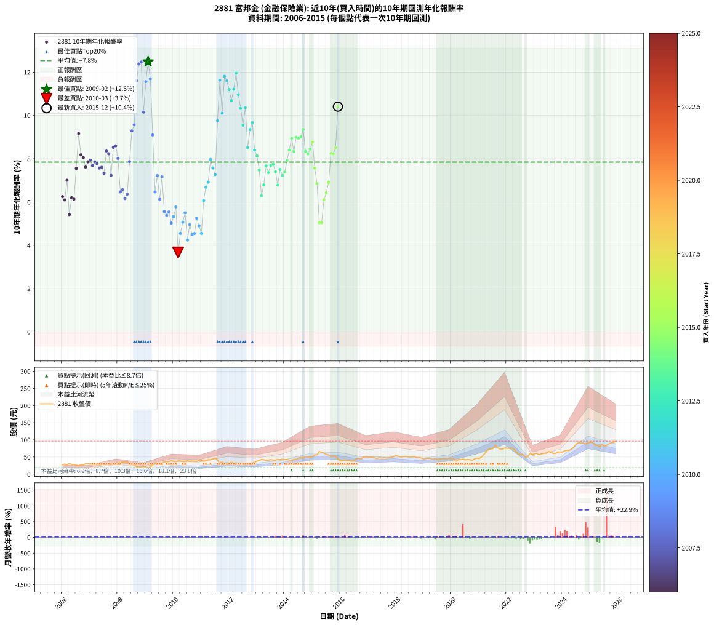

# 2881 富邦金 - 本益比與未來報酬率分析

!!! info "報告資訊"
    - **股票代號**: 2881
    - **公司名稱**: 富邦金
    - **產業別**: 金融保險業
    - **分析期間**: 2006-2015 (120 個數據點)
    - **資料來源**: Type 12 (ShowMonthlyK_ChartFlow) 月收盤價與本益比
    - **報酬率口徑**: 含現金股利 (簡化: 年度合計，假設每年7/1入帳)
    - **報告生成時間**: 2026-01-05 20:52:26 CST

## 📈 視覺化圖表

### 圖表1: 本益比 vs 未來報酬率關係

*圖表1：2881 富邦金 本益比與10年期未來報酬率關係 (2006-2015)*

### 圖表2: 歷年買入時點的10年期實際報酬率

*圖表2：2881 富邦金 歷年買入時點的10年期實際報酬率 (2006-2015)*

## 📍 買點訊號說明

本報告提供兩種買點提示訊號（顯示於圖表2的股價子圖中）：

### ▲ 小綠色三角形（回測驗證）
- **計算方式**: 使用全部歷史資料計算本益比第25百分位數
- **用途**: 事後驗證，顯示歷史上哪些時點確實為低估區
- **限制**: 當下無法判斷，僅供回測參考
- **特性**: 後見之明（Look-Ahead Bias）

### ▲ 小橘色三角形（即時訊號）
- **計算方式**: 使用截至當月的過去5年資料計算本益比第25百分位數
- **用途**: 實際投資決策，當時即可判斷
- **優勢**: 可操作性強，符合實務需求
- **特性**: 無後見之明，滾動窗口計算

!!! tip "如何使用兩種訊號"
    - **綠色▲** 幫助理解歷史估值機會，驗證策略有效性
    - **橘色▲** 可作為實際買進參考，但仍需搭配基本面分析
    - 兩種訊號重疊時，表示即時判斷與事後驗證一致，信心度較高
    - 僅有綠色▲時，表示當時無法判斷（需要未來資料才能確認）
    - 僅有橘色▲時，表示即時判斷為買點，但事後可能不是最佳時機

## 📊 估值分析摘要

| 指標 | 數值 |
|:---:|:---:|
| **目前本益比** (2015-12) | **7.25 倍** |
| **歷史平均本益比** | 14.78 倍 |
| **估值水準** | 🟢 相對低估 |
| **預期10年年化報酬率** | **+8.86%** |
| **歷史平均報酬率** | +7.85% |
| **相關係數 (R²)** | 0.1287 |
| **趨勢線斜率** | -0.1345 |

!!! abstract "核心洞察"
    目前本益比顯著低於歷史平均，預期未來報酬率可能較高

    根據歷史數據回測，2881 富邦金 在目前本益比 **7.2倍** 的估值水準下，
    預期未來10年年化報酬率約為 **+8.9%**。

    **重要提醒**: 本分析基於歷史數據統計，實際報酬率會受到公司基本面變化、產業趨勢、
    總體經濟環境等多重因素影響。R² = 0.13 表示本益比可解釋約 12.9% 的報酬率變異。

## 📈 歷史估值統計

### 最佳買點 (最高報酬率)

| 項目 | 數值 |
|:---:|:---:|
| 起始時間 | 2009-02 |
| 當時本益比 | 11.91 倍 |
| 起始價格 | 18.9 元 |
| 10年後價格 | 45.5 元 |
| **10年年化報酬率** | **+12.49%** |

### 最差買點 (最低報酬率)

| 項目 | 數值 |
|:---:|:---:|
| 起始時間 | 2010-03 |
| 當時本益比 | 15.85 倍 |
| 起始價格 | 38.6 元 |
| 10年後價格 | 37.5 元 |
| **10年年化報酬率** | **+3.67%** |

## 🎯 投資啟示

### 本益比與報酬率關係

趨勢線方程式: **y = -0.1345x + 9.8342**

!!! note "負相關"
    本益比與未來報酬率呈現負相關。較低的本益比通常帶來較高的未來報酬率，
    但相關性不算非常強。**估值仍是重要參考指標之一**。

### 估值區間建議

基於歷史數據分析:

- **🟢 低估區** (P/E < 11.8): 預期報酬率較高，可考慮增加持股
- **🟡 合理區** (P/E 11.8-17.7): 預期報酬率符合長期趨勢，正常持有
- **🔴 高估區** (P/E > 17.7): 預期報酬率較低，可考慮減碼或觀望

!!! danger "風險提示"
    - 過去表現不代表未來結果
    - 本分析假設公司基本面無重大結構性變化
    - 產業環境劇變可能使歷史規律失效
    - 應結合公司財報、產業趨勢、總體經濟等多重因素綜合判斷

!!! success "長期投資觀點"
    歷史數據顯示，在合理或低估的估值水準買入並長期持有，
    往往能獲得較佳的投資報酬。**耐心等待好價格**是價值投資的核心原則。

## 📊 數據品質

- **資料來源**: GoodInfo.tw Type 12 (ShowMonthlyK_ChartFlow)
- **資料頻率**: 月度收盤價與本益比
- **回測期間**: 2006-2015
- **數據點數量**: 120 個 (每個點代表一次10年期回測)

### 計算方法說明

1. **10年期年化報酬率**:
   - 對每個歷史時點，計算其後10年的實際投資報酬率
   - 期末價值(不含股利): 期末價格
   - 期末價值(含現金股利): 期末價格 + 持有期間內的現金股利合計 (簡化: 年度合計，假設每年7/1入帳)
   - 公式: 年化報酬率 = [(期末價值/期初價格)^(1/年數) - 1] × 100%

2. **本益比 (P/E Ratio)**:
   - 使用當時的月收盤價與EPS計算
   - 資料來源: Type 12 月度河流圖本益比數據

3. **趨勢線 (Linear Regression)**:
   - 使用最小平方法擬合線性趨勢線
   - R²值衡量本益比對報酬率的解釋能力

---

*本報告由 Stock Analysis System v1.9.0 自動生成*
*數據更新時間: 2026-01-05 20:52:26 CST*

## 📋 月度回測明細表

（每一列對應時間線圖中的一個買入點；可用來對照 SVG 圖上的每個點。）

| 買入月份 | 賣出月份 | 回測期限_年 | 實際持有年數 | 買入本益比_倍 | 買入收盤價_元 | 賣出收盤價_元 | 現金股利合計_元 | 總報酬率_pct | 年化報酬率_pct |
| --- | --- | --- | --- | --- | --- | --- | --- | --- | --- |
| 2006-01 | 2016-01 | 10 | 9.999 | 25.69 | 28.00 | 38.20 | 13.15 | +83.38 | +6.25 |
| 2006-02 | 2016-02 | 10 | 9.999 | 26.70 | 29.10 | 39.45 | 13.15 | +80.74 | +6.10 |
| 2006-03 | 2016-03 | 10 | 10.001 | 25.23 | 27.50 | 41.00 | 13.15 | +96.89 | +7.01 |
| 2006-04 | 2016-04 | 10 | 10.001 | 28.35 | 30.90 | 39.25 | 13.15 | +69.57 | +5.42 |
| 2006-05 | 2016-05 | 10 | 10.001 | 25.96 | 28.30 | 38.50 | 13.15 | +82.49 | +6.20 |
| 2006-06 | 2016-06 | 10 | 10.001 | 25.69 | 28.00 | 37.65 | 13.15 | +81.41 | +6.14 |
| 2006-07 | 2016-07 | 10 | 10.001 | 23.76 | 25.90 | 39.65 | 14.00 | +107.13 | +7.55 |
| 2006-08 | 2016-08 | 10 | 10.001 | 22.48 | 24.50 | 44.90 | 14.00 | +140.39 | +9.17 |
| 2006-09 | 2016-09 | 10 | 10.001 | 25.18 | 27.45 | 46.30 | 14.00 | +119.66 | +8.19 |
| 2006-10 | 2016-10 | 10 | 10.001 | 24.86 | 27.10 | 44.80 | 14.00 | +116.96 | +8.05 |
| 2006-11 | 2016-11 | 10 | 10.001 | 27.94 | 30.45 | 49.45 | 14.00 | +108.36 | +7.62 |
| 2006-12 | 2016-12 | 10 | 10.001 | 27.98 | 30.50 | 51.00 | 14.00 | +113.10 | +7.86 |
| 2007-01 | 2017-01 | 10 | 10.001 | 26.06 | 30.10 | 50.60 | 14.00 | +114.60 | +7.93 |
| 2007-02 | 2017-02 | 10 | 10.001 | 24.92 | 30.40 | 49.75 | 14.00 | +109.69 | +7.68 |
| 2007-03 | 2017-03 | 10 | 10.001 | 23.19 | 29.80 | 49.50 | 14.00 | +113.07 | +7.86 |
| 2007-04 | 2017-04 | 10 | 10.001 | 21.48 | 29.00 | 47.30 | 14.00 | +111.37 | +7.77 |
| 2007-05 | 2017-05 | 10 | 10.001 | 20.39 | 28.85 | 45.85 | 14.00 | +107.44 | +7.57 |
| 2007-06 | 2017-06 | 10 | 10.001 | 20.27 | 30.00 | 48.45 | 14.00 | +108.15 | +7.61 |
| 2007-07 | 2017-07 | 10 | 10.001 | 19.74 | 30.50 | 46.90 | 15.00 | +102.94 | +7.33 |
| 2007-08 | 2017-08 | 10 | 10.001 | 17.67 | 28.45 | 48.50 | 15.00 | +123.18 | +8.36 |
| 2007-09 | 2017-09 | 10 | 10.001 | 16.84 | 28.20 | 47.20 | 15.00 | +120.55 | +8.23 |
| 2007-10 | 2017-10 | 10 | 10.001 | 18.02 | 31.35 | 48.05 | 15.00 | +101.10 | +7.24 |
| 2007-11 | 2017-11 | 10 | 10.001 | 15.65 | 28.25 | 49.05 | 15.00 | +126.71 | +8.53 |
| 2007-12 | 2017-12 | 10 | 10.001 | 15.40 | 28.80 | 50.70 | 15.00 | +128.11 | +8.59 |
| 2008-01 | 2018-01 | 10 | 10.001 | 17.47 | 32.00 | 54.20 | 15.00 | +116.24 | +8.02 |
| 2008-02 | 2018-03 | 10 | 10.081 | 19.32 | 34.65 | 50.20 | 15.00 | +88.16 | +6.47 |
| 2008-03 | 2018-03 | 10 | 9.999 | 19.66 | 34.50 | 50.20 | 15.00 | +88.97 | +6.57 |
| 2008-04 | 2018-04 | 10 | 9.999 | 21.15 | 36.30 | 51.00 | 15.00 | +81.81 | +6.16 |
| 2008-05 | 2018-05 | 10 | 9.999 | 21.57 | 36.20 | 52.10 | 15.00 | +85.35 | +6.37 |
| 2008-06 | 2018-06 | 10 | 9.999 | 18.90 | 31.00 | 51.10 | 15.00 | +113.21 | +7.87 |
| 2008-07 | 2018-07 | 10 | 9.999 | 17.08 | 27.35 | 50.70 | 15.80 | +143.13 | +9.29 |
| 2008-08 | 2018-08 | 10 | 9.999 | 17.11 | 26.75 | 50.90 | 15.80 | +149.33 | +9.57 |
| 2008-09 | 2018-09 | 10 | 9.999 | 14.79 | 22.55 | 51.80 | 15.80 | +199.76 | +11.61 |
| 2008-10 | 2018-10 | 10 | 9.999 | 13.45 | 20.00 | 48.45 | 15.80 | +221.23 | +12.38 |
| 2008-11 | 2018-11 | 10 | 9.999 | 13.77 | 19.95 | 48.80 | 15.80 | +223.79 | +12.47 |
| 2008-12 | 2018-12 | 10 | 9.999 | 16.95 | 23.90 | 47.05 | 15.80 | +162.95 | +10.15 |
| 2009-01 | 2019-01 | 10 | 9.999 | 13.48 | 20.20 | 44.55 | 15.80 | +198.74 | +11.57 |
| 2009-02 | 2019-02 | 10 | 9.999 | 11.91 | 18.90 | 45.50 | 15.80 | +224.32 | +12.49 |
| 2009-03 | 2019-03 | 10 | 9.999 | 12.21 | 20.45 | 46.00 | 15.80 | +202.18 | +11.69 |
| 2009-04 | 2019-04 | 10 | 9.999 | 14.57 | 25.70 | 45.60 | 15.80 | +138.89 | +9.10 |
| 2009-05 | 2019-05 | 10 | 9.999 | 17.04 | 31.55 | 43.25 | 15.80 | +87.15 | +6.47 |
| 2009-06 | 2019-06 | 10 | 9.999 | 15.82 | 30.70 | 45.85 | 15.80 | +100.80 | +7.22 |
| 2009-07 | 2019-07 | 10 | 9.999 | 16.59 | 33.65 | 43.20 | 17.80 | +81.27 | +6.13 |
| 2009-08 | 2019-08 | 10 | 9.999 | 14.53 | 30.75 | 43.65 | 17.80 | +99.82 | +7.17 |
| 2009-09 | 2019-09 | 10 | 9.999 | 16.46 | 36.30 | 44.55 | 17.80 | +71.75 | +5.56 |
| 2009-10 | 2019-10 | 10 | 9.999 | 16.09 | 36.90 | 44.55 | 17.80 | +68.96 | +5.39 |
| 2009-11 | 2019-11 | 10 | 9.999 | 15.33 | 36.50 | 44.80 | 17.80 | +71.50 | +5.54 |
| 2009-12 | 2019-12 | 10 | 9.999 | 15.91 | 39.30 | 46.40 | 17.80 | +63.35 | +5.03 |
| 2010-01 | 2020-01 | 10 | 9.999 | 15.21 | 37.40 | 45.05 | 17.80 | +68.04 | +5.33 |
| 2010-02 | 2020-02 | 10 | 9.999 | 14.51 | 35.50 | 44.45 | 17.80 | +75.34 | +5.78 |
| 2010-03 | 2020-03 | 10 | 10.001 | 15.85 | 38.60 | 37.55 | 17.80 | +43.38 | +3.67 |
| 2010-04 | 2020-04 | 10 | 10.001 | 15.89 | 38.50 | 42.30 | 17.80 | +56.09 | +4.55 |
| 2010-05 | 2020-05 | 10 | 10.001 | 15.22 | 36.70 | 42.40 | 17.80 | +64.02 | +5.07 |
| 2010-06 | 2020-06 | 10 | 10.001 | 15.04 | 36.10 | 43.90 | 17.80 | +70.90 | +5.50 |
| 2010-07 | 2020-07 | 10 | 10.001 | 16.45 | 39.30 | 41.75 | 17.80 | +51.52 | +4.24 |
| 2010-08 | 2020-08 | 10 | 10.001 | 15.72 | 37.35 | 42.80 | 17.80 | +62.24 | +4.96 |
| 2010-09 | 2020-09 | 10 | 10.001 | 16.26 | 38.45 | 41.90 | 17.80 | +55.26 | +4.50 |
| 2010-10 | 2020-10 | 10 | 10.001 | 15.93 | 37.50 | 40.70 | 17.80 | +55.99 | +4.55 |
| 2010-11 | 2020-11 | 10 | 10.001 | 15.89 | 37.20 | 44.30 | 17.80 | +66.93 | +5.26 |
| 2010-12 | 2020-12 | 10 | 10.001 | 17.17 | 40.00 | 46.75 | 17.80 | +61.37 | +4.90 |
| 2011-01 | 2021-01 | 10 | 10.001 | 16.79 | 40.60 | 45.55 | 17.80 | +56.03 | +4.55 |
| 2011-02 | 2021-02 | 10 | 10.001 | 14.98 | 37.55 | 49.90 | 17.80 | +80.29 | +6.07 |
| 2011-03 | 2021-03 | 10 | 10.001 | 15.05 | 39.05 | 56.80 | 17.80 | +91.03 | +6.69 |
| 2011-04 | 2021-04 | 10 | 10.001 | 15.65 | 42.00 | 64.20 | 17.80 | +95.23 | +6.92 |
| 2011-05 | 2021-05 | 10 | 10.001 | 15.10 | 41.85 | 72.30 | 17.80 | +115.29 | +7.97 |
| 2011-06 | 2021-06 | 10 | 10.001 | 15.44 | 44.15 | 73.90 | 17.80 | +107.70 | +7.58 |
| 2011-07 | 2021-07 | 10 | 10.001 | 15.94 | 47.00 | 75.00 | 19.80 | +101.70 | +7.27 |
| 2011-08 | 2021-08 | 10 | 10.001 | 13.60 | 41.30 | 85.00 | 19.80 | +153.75 | +9.76 |
| 2011-09 | 2021-09 | 10 | 10.001 | 10.27 | 32.10 | 76.70 | 19.80 | +200.62 | +11.63 |
| 2011-10 | 2021-10 | 10 | 10.001 | 11.09 | 35.65 | 73.60 | 19.80 | +161.99 | +10.11 |
| 2011-11 | 2021-11 | 10 | 10.001 | 9.21 | 30.40 | 73.10 | 19.80 | +205.59 | +11.82 |
| 2011-12 | 2021-12 | 10 | 10.001 | 9.45 | 32.05 | 76.30 | 19.80 | +199.84 | +11.60 |
| 2012-01 | 2022-01 | 10 | 10.001 | 9.81 | 33.00 | 75.60 | 19.80 | +189.09 | +11.20 |
| 2012-02 | 2022-03 | 10 | 10.081 | 10.37 | 34.60 | 76.50 | 19.80 | +178.32 | +10.69 |
| 2012-03 | 2022-03 | 10 | 9.999 | 10.05 | 33.25 | 76.50 | 19.80 | +189.62 | +11.22 |
| 2012-04 | 2022-04 | 10 | 9.999 | 9.27 | 30.45 | 74.40 | 19.80 | +209.36 | +11.96 |
| 2012-05 | 2022-05 | 10 | 9.999 | 9.10 | 29.65 | 64.10 | 19.80 | +182.96 | +10.96 |
| 2012-06 | 2022-06 | 10 | 9.999 | 9.23 | 29.80 | 59.80 | 19.80 | +167.11 | +10.33 |
| 2012-07 | 2022-07 | 10 | 9.999 | 9.83 | 31.50 | 56.10 | 22.30 | +148.89 | +9.55 |
| 2012-08 | 2022-08 | 10 | 9.999 | 9.37 | 29.75 | 57.40 | 22.30 | +167.90 | +10.36 |
| 2012-09 | 2022-09 | 10 | 9.999 | 10.13 | 31.90 | 49.90 | 22.30 | +126.33 | +8.51 |
| 2012-10 | 2022-10 | 10 | 9.999 | 9.61 | 30.00 | 51.00 | 22.30 | +144.33 | +9.35 |
| 2012-11 | 2022-11 | 10 | 9.999 | 10.66 | 33.00 | 60.80 | 22.30 | +151.82 | +9.68 |
| 2012-12 | 2022-12 | 10 | 9.999 | 11.43 | 35.10 | 56.30 | 22.30 | +123.93 | +8.40 |
| 2013-01 | 2023-01 | 10 | 9.999 | 12.03 | 37.75 | 60.20 | 22.30 | +118.54 | +8.13 |
| 2013-02 | 2023-02 | 10 | 9.999 | 12.47 | 40.00 | 60.00 | 22.30 | +105.75 | +7.48 |
| 2013-03 | 2023-03 | 10 | 9.999 | 13.06 | 42.80 | 56.50 | 22.30 | +84.11 | +6.29 |
| 2013-04 | 2023-04 | 10 | 9.999 | 12.59 | 42.15 | 59.00 | 22.30 | +92.88 | +6.79 |
| 2013-05 | 2023-05 | 10 | 9.999 | 11.62 | 39.70 | 60.80 | 22.30 | +109.32 | +7.67 |
| 2013-06 | 2023-06 | 10 | 9.999 | 11.72 | 40.85 | 60.80 | 22.30 | +103.43 | +7.36 |
| 2013-07 | 2023-07 | 10 | 9.999 | 11.85 | 42.10 | 65.50 | 22.80 | +109.74 | +7.69 |
| 2013-08 | 2023-08 | 10 | 9.999 | 11.32 | 41.00 | 63.60 | 22.80 | +110.73 | +7.74 |
| 2013-09 | 2023-09 | 10 | 9.999 | 11.08 | 40.90 | 60.70 | 22.80 | +104.16 | +7.40 |
| 2013-10 | 2023-10 | 10 | 9.999 | 11.43 | 43.00 | 60.10 | 22.80 | +92.79 | +6.79 |
| 2013-11 | 2023-11 | 10 | 9.999 | 11.04 | 42.30 | 64.40 | 22.80 | +106.15 | +7.50 |
| 2013-12 | 2023-12 | 10 | 9.999 | 11.18 | 43.60 | 64.80 | 22.80 | +100.92 | +7.23 |
| 2014-01 | 2024-01 | 10 | 9.999 | 10.53 | 42.80 | 64.50 | 22.80 | +103.97 | +7.39 |
| 2014-02 | 2024-02 | 10 | 9.999 | 10.01 | 42.35 | 68.00 | 22.80 | +114.40 | +7.93 |
| 2014-03 | 2024-03 | 10 | 10.001 | 9.39 | 41.30 | 69.70 | 22.80 | +123.97 | +8.40 |
| 2014-04 | 2024-04 | 10 | 10.001 | 8.55 | 39.00 | 69.10 | 22.80 | +135.64 | +8.95 |
| 2014-05 | 2024-05 | 10 | 10.001 | 9.12 | 43.15 | 73.40 | 22.80 | +122.94 | +8.35 |
| 2014-06 | 2024-06 | 10 | 10.001 | 8.82 | 43.15 | 79.30 | 22.80 | +136.62 | +8.99 |
| 2014-07 | 2024-07 | 10 | 10.001 | 9.39 | 47.50 | 88.20 | 23.80 | +135.79 | +8.96 |
| 2014-08 | 2024-08 | 10 | 10.001 | 9.34 | 48.80 | 91.90 | 23.80 | +137.09 | +9.01 |
| 2014-09 | 2024-09 | 10 | 10.001 | 8.66 | 46.70 | 90.40 | 23.80 | +144.54 | +9.35 |
| 2014-10 | 2024-10 | 10 | 10.001 | 9.25 | 51.40 | 90.80 | 23.80 | +122.96 | +8.35 |
| 2014-11 | 2024-11 | 10 | 10.001 | 8.86 | 50.70 | 88.00 | 23.80 | +120.51 | +8.23 |
| 2014-12 | 2024-12 | 10 | 10.001 | 8.61 | 50.70 | 90.30 | 23.80 | +125.05 | +8.45 |
| 2015-01 | 2025-01 | 10 | 10.001 | 8.50 | 50.30 | 92.80 | 23.80 | +131.81 | +8.77 |
| 2015-02 | 2025-02 | 10 | 10.001 | 9.42 | 56.00 | 92.30 | 23.80 | +107.32 | +7.56 |
| 2015-03 | 2025-03 | 10 | 10.001 | 9.41 | 56.20 | 85.30 | 23.80 | +94.13 | +6.86 |
| 2015-04 | 2025-04 | 10 | 10.001 | 11.02 | 66.10 | 84.30 | 23.80 | +63.54 | +5.04 |
| 2015-05 | 2025-05 | 10 | 10.001 | 10.49 | 63.20 | 79.60 | 23.80 | +63.61 | +5.05 |
| 2015-06 | 2025-06 | 10 | 10.001 | 10.15 | 61.40 | 87.30 | 23.80 | +80.94 | +6.11 |
| 2015-07 | 2025-07 | 10 | 10.001 | 9.48 | 57.60 | 82.40 | 25.05 | +86.55 | +6.43 |
| 2015-08 | 2025-08 | 10 | 10.001 | 9.16 | 55.90 | 83.90 | 25.05 | +94.90 | +6.90 |
| 2015-09 | 2025-09 | 10 | 10.001 | 8.37 | 51.30 | 88.30 | 25.05 | +120.96 | +8.25 |
| 2015-10 | 2025-10 | 10 | 10.001 | 8.56 | 52.70 | 91.20 | 25.05 | +120.59 | +8.23 |
| 2015-11 | 2025-11 | 10 | 10.001 | 8.41 | 52.00 | 92.60 | 25.05 | +126.25 | +8.51 |
| 2015-12 | 2025-12 | 10 | 10.001 | 7.25 | 45.00 | 96.10 | 25.05 | +169.22 | +10.41 |
