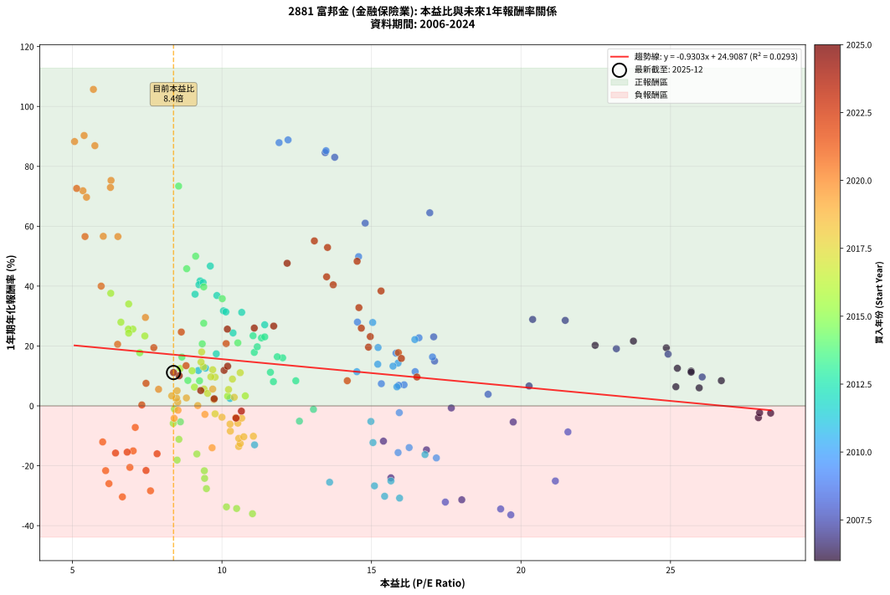
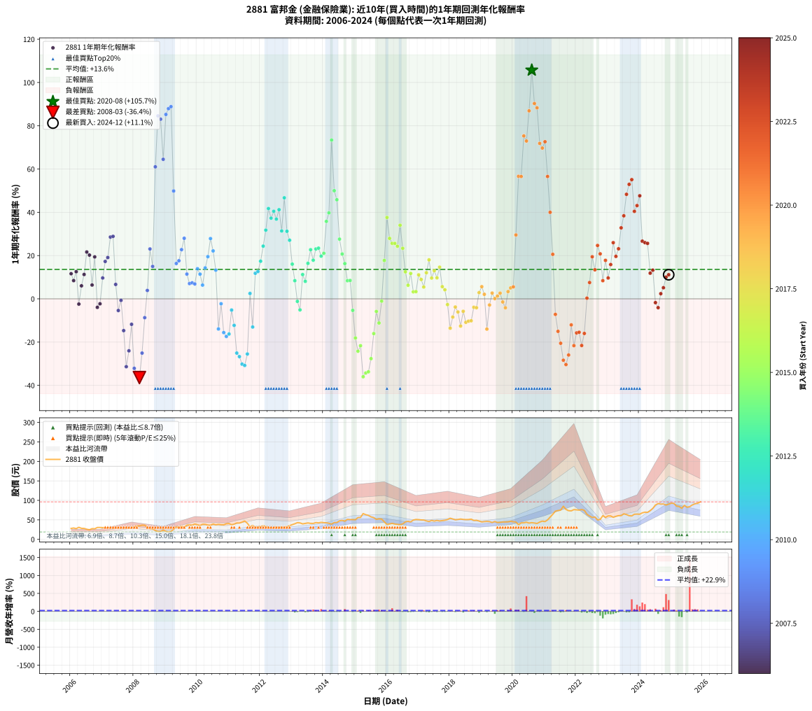

# 2881 富邦金 - 本益比與未來報酬率分析

!!! info "報告資訊"
    - **股票代號**: 2881
    - **公司名稱**: 富邦金
    - **產業別**: 金融保險業
    - **分析期間**: 2006-2024 (228 個數據點)
    - **資料來源**: Type 12 (ShowMonthlyK_ChartFlow) 月收盤價與本益比
    - **報酬率口徑**: 含現金股利 (簡化: 年度合計，假設每年7/1入帳)
    - **報告生成時間**: 2026-01-13 00:48:41 CST

## 📈 視覺化圖表

### 圖表1: 本益比 vs 未來報酬率關係

*圖表1：2881 富邦金 本益比與1年期未來報酬率關係 (2006-2024)*

### 圖表2: 歷年買入時點的1年期實際報酬率

*圖表2：2881 富邦金 歷年買入時點的1年期實際報酬率 (2006-2024)*

## 📍 買點訊號說明

本報告提供兩種買點提示訊號（顯示於圖表2的股價子圖中）：

### ▲ 小綠色三角形（回測驗證）
- **計算方式**: 使用全部歷史資料計算本益比第25百分位數
- **用途**: 事後驗證，顯示歷史上哪些時點確實為低估區
- **限制**: 當下無法判斷，僅供回測參考
- **特性**: 後見之明（Look-Ahead Bias）

### ▲ 小橘色三角形（即時訊號）
- **計算方式**: 使用截至當月的過去5年資料計算本益比第25百分位數
- **用途**: 實際投資決策，當時即可判斷
- **優勢**: 可操作性強，符合實務需求
- **特性**: 無後見之明，滾動窗口計算

!!! tip "如何使用兩種訊號"
    - **綠色▲** 幫助理解歷史估值機會，驗證策略有效性
    - **橘色▲** 可作為實際買進參考，但仍需搭配基本面分析
    - 兩種訊號重疊時，表示即時判斷與事後驗證一致，信心度較高
    - 僅有綠色▲時，表示當時無法判斷（需要未來資料才能確認）
    - 僅有橘色▲時，表示即時判斷為買點，但事後可能不是最佳時機

## 📊 估值分析摘要

| 指標 | 數值 |
|:---:|:---:|
| **目前本益比** (2024-12) | **8.38 倍** |
| **歷史平均本益比** | 12.17 倍 |
| **估值水準** | 🟢 相對低估 |
| **預期1年年化報酬率** | **+17.11%** |
| **歷史平均報酬率** | +13.58% |
| **相關係數 (R²)** | 0.0293 |
| **趨勢線斜率** | -0.9303 |

!!! abstract "核心洞察"
    目前本益比顯著低於歷史平均，預期未來報酬率可能較高

    根據歷史數據回測，2881 富邦金 在目前本益比 **8.4倍** 的估值水準下，
    預期未來1年年化報酬率約為 **+17.1%**。

    **重要提醒**: 本分析基於歷史數據統計，實際報酬率會受到公司基本面變化、產業趨勢、
    總體經濟環境等多重因素影響。R² = 0.03 表示本益比可解釋約 2.9% 的報酬率變異。

## 📈 歷史估值統計

### 最佳買點 (最高報酬率)

| 項目 | 數值 |
|:---:|:---:|
| 起始時間 | 2020-08 |
| 當時本益比 | 5.70 倍 |
| 起始價格 | 42.8 元 |
| 1年後價格 | 85.0 元 |
| **1年年化報酬率** | **+105.71%** |

### 最差買點 (最低報酬率)

| 項目 | 數值 |
|:---:|:---:|
| 起始時間 | 2008-03 |
| 當時本益比 | 19.66 倍 |
| 起始價格 | 34.5 元 |
| 1年後價格 | 20.4 元 |
| **1年年化報酬率** | **-36.40%** |

## 🎯 投資啟示

### 本益比與報酬率關係

趨勢線方程式: **y = -0.9303x + 24.9087**

!!! warning "強負相關"
    本益比與未來報酬率呈現強負相關。在高本益比時期買入，未來報酬率顯著較低；
    在低本益比時期買入，未來報酬率顯著較高。**估值紀律至關重要**。

### 估值區間建議

基於歷史數據分析:

- **🟢 低估區** (P/E < 9.7): 預期報酬率較高，可考慮增加持股
- **🟡 合理區** (P/E 9.7-14.6): 預期報酬率符合長期趨勢，正常持有
- **🔴 高估區** (P/E > 14.6): 預期報酬率較低，可考慮減碼或觀望

!!! danger "風險提示"
    - 過去表現不代表未來結果
    - 本分析假設公司基本面無重大結構性變化
    - 產業環境劇變可能使歷史規律失效
    - 應結合公司財報、產業趨勢、總體經濟等多重因素綜合判斷

!!! success "長期投資觀點"
    歷史數據顯示，在合理或低估的估值水準買入並長期持有，
    往往能獲得較佳的投資報酬。**耐心等待好價格**是價值投資的核心原則。

## 📊 數據品質

- **資料來源**: GoodInfo.tw Type 12 (ShowMonthlyK_ChartFlow)
- **資料頻率**: 月度收盤價與本益比
- **回測期間**: 2006-2024
- **數據點數量**: 228 個 (每個點代表一次1年期回測)

### 計算方法說明

1. **1年期年化報酬率**:
   - 對每個歷史時點，計算其後1年的實際投資報酬率
   - 期末價值(不含股利): 期末價格
   - 期末價值(含現金股利): 期末價格 + 持有期間內的現金股利合計 (簡化: 年度合計，假設每年7/1入帳)
   - 公式: 年化報酬率 = [(期末價值/期初價格)^(1/年數) - 1] × 100%

2. **本益比 (P/E Ratio)**:
   - 使用當時的月收盤價與EPS計算
   - 資料來源: Type 12 月度河流圖本益比數據

3. **趨勢線 (Linear Regression)**:
   - 使用最小平方法擬合線性趨勢線
   - R²值衡量本益比對報酬率的解釋能力

---

*本報告由 Stock Analysis System v1.9.0 自動生成*
*數據更新時間: 2026-01-13 00:48:41 CST*

## 📋 月度回測明細表

（每一列對應時間線圖中的一個買入點；可用來對照 SVG 圖上的每個點。）

| 買入月份 | 賣出月份 | 回測期限_年 | 實際持有年數 | 買入本益比_倍 | 買入收盤價_元 | 賣出收盤價_元 | 現金股利合計_元 | 總報酬率_pct | 年化報酬率_pct |
| --- | --- | --- | --- | --- | --- | --- | --- | --- | --- |
| 2006-01 | 2007-01 | 1 | 0.999 | 25.69 | 28.00 | 30.10 | 1.15 | +11.61 | +11.62 |
| 2006-02 | 2007-02 | 1 | 0.999 | 26.70 | 29.10 | 30.40 | 1.15 | +8.42 | +8.43 |
| 2006-03 | 2007-03 | 1 | 0.999 | 25.23 | 27.50 | 29.80 | 1.15 | +12.55 | +12.55 |
| 2006-04 | 2007-04 | 1 | 0.999 | 28.35 | 30.90 | 29.00 | 1.15 | -2.43 | -2.43 |
| 2006-05 | 2007-05 | 1 | 0.999 | 25.96 | 28.30 | 28.85 | 1.15 | +6.01 | +6.01 |
| 2006-06 | 2007-06 | 1 | 0.999 | 25.69 | 28.00 | 30.00 | 1.15 | +11.25 | +11.26 |
| 2006-07 | 2007-07 | 1 | 0.999 | 23.76 | 25.90 | 30.50 | 1.00 | +21.62 | +21.64 |
| 2006-08 | 2007-08 | 1 | 0.999 | 22.48 | 24.50 | 28.45 | 1.00 | +20.20 | +20.22 |
| 2006-09 | 2007-09 | 1 | 0.999 | 25.18 | 27.45 | 28.20 | 1.00 | +6.38 | +6.38 |
| 2006-10 | 2007-10 | 1 | 0.999 | 24.86 | 27.10 | 31.35 | 1.00 | +19.37 | +19.39 |
| 2006-11 | 2007-11 | 1 | 0.999 | 27.94 | 30.45 | 28.25 | 1.00 | -3.94 | -3.94 |
| 2006-12 | 2007-12 | 1 | 0.999 | 27.98 | 30.50 | 28.80 | 1.00 | -2.30 | -2.30 |
| 2007-01 | 2008-01 | 1 | 0.999 | 26.06 | 30.10 | 32.00 | 1.00 | +9.63 | +9.64 |
| 2007-02 | 2008-02 | 1 | 0.999 | 24.92 | 30.40 | 34.65 | 1.00 | +17.27 | +17.28 |
| 2007-03 | 2008-03 | 1 | 1.002 | 23.19 | 29.80 | 34.50 | 1.00 | +19.13 | +19.08 |
| 2007-04 | 2008-04 | 1 | 1.002 | 21.48 | 29.00 | 36.30 | 1.00 | +28.62 | +28.55 |
| 2007-05 | 2008-05 | 1 | 1.002 | 20.39 | 28.85 | 36.20 | 1.00 | +28.94 | +28.88 |
| 2007-06 | 2008-06 | 1 | 1.002 | 20.27 | 30.00 | 31.00 | 1.00 | +6.67 | +6.65 |
| 2007-07 | 2008-07 | 1 | 1.002 | 19.74 | 30.50 | 27.35 | 1.50 | -5.41 | -5.40 |
| 2007-08 | 2008-08 | 1 | 1.002 | 17.67 | 28.45 | 26.75 | 1.50 | -0.70 | -0.70 |
| 2007-09 | 2008-09 | 1 | 1.002 | 16.84 | 28.20 | 22.55 | 1.50 | -14.72 | -14.69 |
| 2007-10 | 2008-10 | 1 | 1.002 | 18.02 | 31.35 | 20.00 | 1.50 | -31.42 | -31.37 |
| 2007-11 | 2008-11 | 1 | 1.002 | 15.65 | 28.25 | 19.95 | 1.50 | -24.07 | -24.03 |
| 2007-12 | 2008-12 | 1 | 1.002 | 15.40 | 28.80 | 23.90 | 1.50 | -11.81 | -11.78 |
| 2008-01 | 2009-01 | 1 | 1.002 | 17.47 | 32.00 | 20.20 | 1.50 | -32.19 | -32.13 |
| 2008-02 | 2009-03 | 1 | 1.081 | 19.32 | 34.65 | 20.45 | 1.50 | -36.65 | -34.44 |
| 2008-03 | 2009-03 | 1 | 0.999 | 19.66 | 34.50 | 20.45 | 1.50 | -36.38 | -36.40 |
| 2008-04 | 2009-04 | 1 | 0.999 | 21.15 | 36.30 | 25.70 | 1.50 | -25.07 | -25.08 |
| 2008-05 | 2009-05 | 1 | 0.999 | 21.57 | 36.20 | 31.55 | 1.50 | -8.70 | -8.71 |
| 2008-06 | 2009-06 | 1 | 0.999 | 18.90 | 31.00 | 30.70 | 1.50 | +3.87 | +3.87 |
| 2008-07 | 2009-07 | 1 | 0.999 | 17.08 | 27.35 | 33.65 | 0.00 | +23.03 | +23.05 |
| 2008-08 | 2009-08 | 1 | 0.999 | 17.11 | 26.75 | 30.75 | 0.00 | +14.95 | +14.96 |
| 2008-09 | 2009-09 | 1 | 0.999 | 14.79 | 22.55 | 36.30 | 0.00 | +60.98 | +61.03 |
| 2008-10 | 2009-10 | 1 | 0.999 | 13.45 | 20.00 | 36.90 | 0.00 | +84.50 | +84.58 |
| 2008-11 | 2009-11 | 1 | 0.999 | 13.77 | 19.95 | 36.50 | 0.00 | +82.96 | +83.03 |
| 2008-12 | 2009-12 | 1 | 0.999 | 16.95 | 23.90 | 39.30 | 0.00 | +64.44 | +64.49 |
| 2009-01 | 2010-01 | 1 | 0.999 | 13.48 | 20.20 | 37.40 | 0.00 | +85.15 | +85.23 |
| 2009-02 | 2010-02 | 1 | 0.999 | 11.91 | 18.90 | 35.50 | 0.00 | +87.83 | +87.91 |
| 2009-03 | 2010-03 | 1 | 0.999 | 12.21 | 20.45 | 38.60 | 0.00 | +88.75 | +88.84 |
| 2009-04 | 2010-04 | 1 | 0.999 | 14.57 | 25.70 | 38.50 | 0.00 | +49.81 | +49.85 |
| 2009-05 | 2010-05 | 1 | 0.999 | 17.04 | 31.55 | 36.70 | 0.00 | +16.32 | +16.34 |
| 2009-06 | 2010-06 | 1 | 0.999 | 15.82 | 30.70 | 36.10 | 0.00 | +17.59 | +17.60 |
| 2009-07 | 2010-07 | 1 | 0.999 | 16.59 | 33.65 | 39.30 | 2.00 | +22.73 | +22.75 |
| 2009-08 | 2010-08 | 1 | 0.999 | 14.53 | 30.75 | 37.35 | 2.00 | +27.96 | +27.98 |
| 2009-09 | 2010-09 | 1 | 0.999 | 16.46 | 36.30 | 38.45 | 2.00 | +11.43 | +11.44 |
| 2009-10 | 2010-10 | 1 | 0.999 | 16.09 | 36.90 | 37.50 | 2.00 | +7.04 | +7.05 |
| 2009-11 | 2010-11 | 1 | 0.999 | 15.33 | 36.50 | 37.20 | 2.00 | +7.39 | +7.40 |
| 2009-12 | 2010-12 | 1 | 0.999 | 15.91 | 39.30 | 40.00 | 2.00 | +6.87 | +6.87 |
| 2010-01 | 2011-01 | 1 | 0.999 | 15.21 | 37.40 | 40.60 | 2.00 | +13.90 | +13.91 |
| 2010-02 | 2011-02 | 1 | 0.999 | 14.51 | 35.50 | 37.55 | 2.00 | +11.40 | +11.41 |
| 2010-03 | 2011-03 | 1 | 0.999 | 15.85 | 38.60 | 39.05 | 2.00 | +6.34 | +6.35 |
| 2010-04 | 2011-04 | 1 | 0.999 | 15.89 | 38.50 | 42.00 | 2.00 | +14.28 | +14.29 |
| 2010-05 | 2011-05 | 1 | 0.999 | 15.22 | 36.70 | 41.85 | 2.00 | +19.48 | +19.49 |
| 2010-06 | 2011-06 | 1 | 0.999 | 15.04 | 36.10 | 44.15 | 2.00 | +27.83 | +27.86 |
| 2010-07 | 2011-07 | 1 | 0.999 | 16.45 | 39.30 | 47.00 | 1.00 | +22.13 | +22.15 |
| 2010-08 | 2011-08 | 1 | 0.999 | 15.72 | 37.35 | 41.30 | 1.00 | +13.25 | +13.26 |
| 2010-09 | 2011-09 | 1 | 0.999 | 16.26 | 38.45 | 32.10 | 1.00 | -13.92 | -13.93 |
| 2010-10 | 2011-10 | 1 | 0.999 | 15.93 | 37.50 | 35.65 | 1.00 | -2.27 | -2.27 |
| 2010-11 | 2011-11 | 1 | 0.999 | 15.89 | 37.20 | 30.40 | 1.00 | -15.59 | -15.60 |
| 2010-12 | 2011-12 | 1 | 0.999 | 17.17 | 40.00 | 32.05 | 1.00 | -17.38 | -17.39 |
| 2011-01 | 2012-01 | 1 | 0.999 | 16.79 | 40.60 | 33.00 | 1.00 | -16.26 | -16.27 |
| 2011-02 | 2012-02 | 1 | 0.999 | 14.98 | 37.55 | 34.60 | 1.00 | -5.20 | -5.20 |
| 2011-03 | 2012-03 | 1 | 1.002 | 15.05 | 39.05 | 33.25 | 1.00 | -12.29 | -12.27 |
| 2011-04 | 2012-04 | 1 | 1.002 | 15.65 | 42.00 | 30.45 | 1.00 | -25.12 | -25.08 |
| 2011-05 | 2012-05 | 1 | 1.002 | 15.10 | 41.85 | 29.65 | 1.00 | -26.76 | -26.72 |
| 2011-06 | 2012-06 | 1 | 1.002 | 15.44 | 44.15 | 29.80 | 1.00 | -30.24 | -30.19 |
| 2011-07 | 2012-07 | 1 | 1.002 | 15.94 | 47.00 | 31.50 | 1.00 | -30.85 | -30.80 |
| 2011-08 | 2012-08 | 1 | 1.002 | 13.60 | 41.30 | 29.75 | 1.00 | -25.55 | -25.50 |
| 2011-09 | 2012-09 | 1 | 1.002 | 10.27 | 32.10 | 31.90 | 1.00 | +2.49 | +2.48 |
| 2011-10 | 2012-10 | 1 | 1.002 | 11.09 | 35.65 | 30.00 | 1.00 | -13.05 | -13.02 |
| 2011-11 | 2012-11 | 1 | 1.002 | 9.21 | 30.40 | 33.00 | 1.00 | +11.84 | +11.81 |
| 2011-12 | 2012-12 | 1 | 1.002 | 9.45 | 32.05 | 35.10 | 1.00 | +12.63 | +12.61 |
| 2012-01 | 2013-01 | 1 | 1.002 | 9.81 | 33.00 | 37.75 | 1.00 | +17.42 | +17.38 |
| 2012-02 | 2013-03 | 1 | 1.081 | 10.37 | 34.60 | 42.80 | 1.00 | +26.59 | +24.36 |
| 2012-03 | 2013-03 | 1 | 0.999 | 10.05 | 33.25 | 42.80 | 1.00 | +31.73 | +31.75 |
| 2012-04 | 2013-04 | 1 | 0.999 | 9.27 | 30.45 | 42.15 | 1.00 | +41.70 | +41.74 |
| 2012-05 | 2013-05 | 1 | 0.999 | 9.10 | 29.65 | 39.70 | 1.00 | +37.26 | +37.29 |
| 2012-06 | 2013-06 | 1 | 0.999 | 9.23 | 29.80 | 40.85 | 1.00 | +40.43 | +40.47 |
| 2012-07 | 2013-07 | 1 | 0.999 | 9.83 | 31.50 | 42.10 | 1.00 | +36.83 | +36.85 |
| 2012-08 | 2013-08 | 1 | 0.999 | 9.37 | 29.75 | 41.00 | 1.00 | +41.18 | +41.21 |
| 2012-09 | 2013-09 | 1 | 0.999 | 10.13 | 31.90 | 40.90 | 1.00 | +31.35 | +31.37 |
| 2012-10 | 2013-10 | 1 | 0.999 | 9.61 | 30.00 | 43.00 | 1.00 | +46.67 | +46.71 |
| 2012-11 | 2013-11 | 1 | 0.999 | 10.66 | 33.00 | 42.30 | 1.00 | +31.21 | +31.24 |
| 2012-12 | 2013-12 | 1 | 0.999 | 11.43 | 35.10 | 43.60 | 1.00 | +27.07 | +27.09 |
| 2013-01 | 2014-01 | 1 | 0.999 | 12.03 | 37.75 | 42.80 | 1.00 | +16.03 | +16.04 |
| 2013-02 | 2014-02 | 1 | 0.999 | 12.47 | 40.00 | 42.35 | 1.00 | +8.38 | +8.38 |
| 2013-03 | 2014-03 | 1 | 0.999 | 13.06 | 42.80 | 41.30 | 1.00 | -1.17 | -1.17 |
| 2013-04 | 2014-04 | 1 | 0.999 | 12.59 | 42.15 | 39.00 | 1.00 | -5.10 | -5.10 |
| 2013-05 | 2014-05 | 1 | 0.999 | 11.62 | 39.70 | 43.15 | 1.00 | +11.21 | +11.22 |
| 2013-06 | 2014-06 | 1 | 0.999 | 11.72 | 40.85 | 43.15 | 1.00 | +8.08 | +8.08 |
| 2013-07 | 2014-07 | 1 | 0.999 | 11.85 | 42.10 | 47.50 | 1.50 | +16.39 | +16.40 |
| 2013-08 | 2014-08 | 1 | 0.999 | 11.32 | 41.00 | 48.80 | 1.50 | +22.68 | +22.70 |
| 2013-09 | 2014-09 | 1 | 0.999 | 11.08 | 40.90 | 46.70 | 1.50 | +17.85 | +17.86 |
| 2013-10 | 2014-10 | 1 | 0.999 | 11.43 | 43.00 | 51.40 | 1.50 | +23.02 | +23.04 |
| 2013-11 | 2014-11 | 1 | 0.999 | 11.04 | 42.30 | 50.70 | 1.50 | +23.40 | +23.42 |
| 2013-12 | 2014-12 | 1 | 0.999 | 11.18 | 43.60 | 50.70 | 1.50 | +19.72 | +19.74 |
| 2014-01 | 2015-01 | 1 | 0.999 | 10.53 | 42.80 | 50.30 | 1.50 | +21.03 | +21.04 |
| 2014-02 | 2015-02 | 1 | 0.999 | 10.01 | 42.35 | 56.00 | 1.50 | +35.77 | +35.80 |
| 2014-03 | 2015-03 | 1 | 0.999 | 9.39 | 41.30 | 56.20 | 1.50 | +39.71 | +39.74 |
| 2014-04 | 2015-04 | 1 | 0.999 | 8.55 | 39.00 | 66.10 | 1.50 | +73.33 | +73.40 |
| 2014-05 | 2015-05 | 1 | 0.999 | 9.12 | 43.15 | 63.20 | 1.50 | +49.94 | +49.98 |
| 2014-06 | 2015-06 | 1 | 0.999 | 8.82 | 43.15 | 61.40 | 1.50 | +45.77 | +45.81 |
| 2014-07 | 2015-07 | 1 | 0.999 | 9.39 | 47.50 | 57.60 | 3.00 | +27.58 | +27.60 |
| 2014-08 | 2015-08 | 1 | 0.999 | 9.34 | 48.80 | 55.90 | 3.00 | +20.70 | +20.71 |
| 2014-09 | 2015-09 | 1 | 0.999 | 8.66 | 46.70 | 51.30 | 3.00 | +16.27 | +16.29 |
| 2014-10 | 2015-10 | 1 | 0.999 | 9.25 | 51.40 | 52.70 | 3.00 | +8.37 | +8.37 |
| 2014-11 | 2015-11 | 1 | 0.999 | 8.86 | 50.70 | 52.00 | 3.00 | +8.48 | +8.49 |
| 2014-12 | 2015-12 | 1 | 0.999 | 8.61 | 50.70 | 45.00 | 3.00 | -5.33 | -5.33 |
| 2015-01 | 2016-01 | 1 | 0.999 | 8.50 | 50.30 | 38.20 | 3.00 | -18.09 | -18.10 |
| 2015-02 | 2016-02 | 1 | 0.999 | 9.42 | 56.00 | 39.45 | 3.00 | -24.20 | -24.21 |
| 2015-03 | 2016-03 | 1 | 1.002 | 9.41 | 56.20 | 41.00 | 3.00 | -21.71 | -21.67 |
| 2015-04 | 2016-04 | 1 | 1.002 | 11.02 | 66.10 | 39.25 | 3.00 | -36.08 | -36.02 |
| 2015-05 | 2016-05 | 1 | 1.002 | 10.49 | 63.20 | 38.50 | 3.00 | -34.34 | -34.28 |
| 2015-06 | 2016-06 | 1 | 1.002 | 10.15 | 61.40 | 37.65 | 3.00 | -33.79 | -33.74 |
| 2015-07 | 2016-07 | 1 | 1.002 | 9.48 | 57.60 | 39.65 | 2.00 | -27.69 | -27.64 |
| 2015-08 | 2016-08 | 1 | 1.002 | 9.16 | 55.90 | 44.90 | 2.00 | -16.10 | -16.07 |
| 2015-09 | 2016-09 | 1 | 1.002 | 8.37 | 51.30 | 46.30 | 2.00 | -5.85 | -5.84 |
| 2015-10 | 2016-10 | 1 | 1.002 | 8.56 | 52.70 | 44.80 | 2.00 | -11.20 | -11.17 |
| 2015-11 | 2016-11 | 1 | 1.002 | 8.41 | 52.00 | 49.45 | 2.00 | -1.06 | -1.06 |
| 2015-12 | 2016-12 | 1 | 1.002 | 7.25 | 45.00 | 51.00 | 2.00 | +17.78 | +17.74 |
| 2016-01 | 2017-01 | 1 | 1.002 | 6.28 | 38.20 | 50.60 | 2.00 | +37.70 | +37.61 |
| 2016-02 | 2017-03 | 1 | 1.081 | 6.62 | 39.45 | 49.50 | 2.00 | +30.54 | +27.95 |
| 2016-03 | 2017-03 | 1 | 0.999 | 7.02 | 41.00 | 49.50 | 2.00 | +25.61 | +25.63 |
| 2016-04 | 2017-04 | 1 | 0.999 | 6.87 | 39.25 | 47.30 | 2.00 | +25.61 | +25.62 |
| 2016-05 | 2017-05 | 1 | 0.999 | 6.88 | 38.50 | 45.85 | 2.00 | +24.29 | +24.30 |
| 2016-06 | 2017-06 | 1 | 0.999 | 6.88 | 37.65 | 48.45 | 2.00 | +34.00 | +34.02 |
| 2016-07 | 2017-07 | 1 | 0.999 | 7.42 | 39.65 | 46.90 | 2.00 | +23.33 | +23.35 |
| 2016-08 | 2017-08 | 1 | 0.999 | 8.60 | 44.90 | 48.50 | 2.00 | +12.47 | +12.48 |
| 2016-09 | 2017-09 | 1 | 0.999 | 9.08 | 46.30 | 47.20 | 2.00 | +6.26 | +6.27 |
| 2016-10 | 2017-10 | 1 | 0.999 | 9.00 | 44.80 | 48.05 | 2.00 | +11.72 | +11.73 |
| 2016-11 | 2017-11 | 1 | 0.999 | 10.19 | 49.45 | 49.05 | 2.00 | +3.24 | +3.24 |
| 2016-12 | 2017-12 | 1 | 0.999 | 10.78 | 51.00 | 50.70 | 2.00 | +3.33 | +3.34 |
| 2017-01 | 2018-01 | 1 | 0.999 | 10.61 | 50.60 | 54.20 | 2.00 | +11.07 | +11.08 |
| 2017-02 | 2018-02 | 1 | 0.999 | 10.35 | 49.75 | 52.20 | 2.00 | +8.94 | +8.95 |
| 2017-03 | 2018-03 | 1 | 0.999 | 10.22 | 49.50 | 50.20 | 2.00 | +5.45 | +5.46 |
| 2017-04 | 2018-04 | 1 | 0.999 | 9.69 | 47.30 | 51.00 | 2.00 | +12.05 | +12.06 |
| 2017-05 | 2018-05 | 1 | 0.999 | 9.32 | 45.85 | 52.10 | 2.00 | +17.99 | +18.01 |
| 2017-06 | 2018-06 | 1 | 0.999 | 9.77 | 48.45 | 51.10 | 2.00 | +9.60 | +9.60 |
| 2017-07 | 2018-07 | 1 | 0.999 | 9.38 | 46.90 | 50.70 | 2.30 | +13.01 | +13.02 |
| 2017-08 | 2018-08 | 1 | 0.999 | 9.63 | 48.50 | 50.90 | 2.30 | +9.69 | +9.70 |
| 2017-09 | 2018-09 | 1 | 0.999 | 9.30 | 47.20 | 51.80 | 2.30 | +14.62 | +14.63 |
| 2017-10 | 2018-10 | 1 | 0.999 | 9.40 | 48.05 | 48.45 | 2.30 | +5.62 | +5.62 |
| 2017-11 | 2018-11 | 1 | 0.999 | 9.52 | 49.05 | 48.80 | 2.30 | +4.18 | +4.18 |
| 2017-12 | 2018-12 | 1 | 0.999 | 9.77 | 50.70 | 47.05 | 2.30 | -2.66 | -2.66 |
| 2018-01 | 2019-01 | 1 | 0.999 | 10.56 | 54.20 | 44.55 | 2.30 | -13.56 | -13.57 |
| 2018-02 | 2019-02 | 1 | 0.999 | 10.28 | 52.20 | 45.50 | 2.30 | -8.43 | -8.43 |
| 2018-03 | 2019-03 | 1 | 0.999 | 10.00 | 50.20 | 46.00 | 2.30 | -3.78 | -3.79 |
| 2018-04 | 2019-04 | 1 | 0.999 | 10.27 | 51.00 | 45.60 | 2.30 | -6.08 | -6.08 |
| 2018-05 | 2019-05 | 1 | 0.999 | 10.61 | 52.10 | 43.25 | 2.30 | -12.57 | -12.58 |
| 2018-06 | 2019-06 | 1 | 0.999 | 10.53 | 51.10 | 45.85 | 2.30 | -5.77 | -5.78 |
| 2018-07 | 2019-07 | 1 | 0.999 | 10.56 | 50.70 | 43.20 | 2.00 | -10.85 | -10.86 |
| 2018-08 | 2019-08 | 1 | 0.999 | 10.73 | 50.90 | 43.65 | 2.00 | -10.31 | -10.32 |
| 2018-09 | 2019-09 | 1 | 0.999 | 11.05 | 51.80 | 44.55 | 2.00 | -10.14 | -10.14 |
| 2018-10 | 2019-10 | 1 | 0.999 | 10.46 | 48.45 | 44.55 | 2.00 | -3.92 | -3.92 |
| 2018-11 | 2019-11 | 1 | 0.999 | 10.66 | 48.80 | 44.80 | 2.00 | -4.10 | -4.10 |
| 2018-12 | 2019-12 | 1 | 0.999 | 10.41 | 47.05 | 46.40 | 2.00 | +2.87 | +2.87 |
| 2019-01 | 2020-01 | 1 | 0.999 | 9.69 | 44.55 | 45.05 | 2.00 | +5.61 | +5.62 |
| 2019-02 | 2020-02 | 1 | 0.999 | 9.73 | 45.50 | 44.45 | 2.00 | +2.09 | +2.09 |
| 2019-03 | 2020-03 | 1 | 1.002 | 9.67 | 46.00 | 37.55 | 2.00 | -14.02 | -14.00 |
| 2019-04 | 2020-04 | 1 | 1.002 | 9.43 | 45.60 | 42.30 | 2.00 | -2.85 | -2.85 |
| 2019-05 | 2020-05 | 1 | 1.002 | 8.81 | 43.25 | 42.40 | 2.00 | +2.66 | +2.65 |
| 2019-06 | 2020-06 | 1 | 1.002 | 9.19 | 45.85 | 43.90 | 2.00 | +0.11 | +0.11 |
| 2019-07 | 2020-07 | 1 | 1.002 | 8.52 | 43.20 | 41.75 | 2.00 | +1.27 | +1.27 |
| 2019-08 | 2020-08 | 1 | 1.002 | 8.48 | 43.65 | 42.80 | 2.00 | +2.63 | +2.63 |
| 2019-09 | 2020-09 | 1 | 1.002 | 8.53 | 44.55 | 41.90 | 2.00 | -1.46 | -1.46 |
| 2019-10 | 2020-10 | 1 | 1.002 | 8.40 | 44.55 | 40.70 | 2.00 | -4.15 | -4.14 |
| 2019-11 | 2020-11 | 1 | 1.002 | 8.32 | 44.80 | 44.30 | 2.00 | +3.35 | +3.34 |
| 2019-12 | 2020-12 | 1 | 1.002 | 8.50 | 46.40 | 46.75 | 2.00 | +5.06 | +5.05 |
| 2020-01 | 2021-01 | 1 | 1.002 | 7.88 | 45.05 | 45.55 | 2.00 | +5.55 | +5.54 |
| 2020-02 | 2021-03 | 1 | 1.081 | 7.44 | 44.45 | 56.80 | 2.00 | +32.28 | +29.53 |
| 2020-03 | 2021-03 | 1 | 0.999 | 6.03 | 37.55 | 56.80 | 2.00 | +56.59 | +56.64 |
| 2020-04 | 2021-04 | 1 | 0.999 | 6.52 | 42.30 | 64.20 | 2.00 | +56.50 | +56.55 |
| 2020-05 | 2021-05 | 1 | 0.999 | 6.29 | 42.40 | 72.30 | 2.00 | +75.24 | +75.30 |
| 2020-06 | 2021-06 | 1 | 0.999 | 6.27 | 43.90 | 73.90 | 2.00 | +72.89 | +72.96 |
| 2020-07 | 2021-07 | 1 | 0.999 | 5.75 | 41.75 | 75.00 | 3.00 | +86.83 | +86.91 |
| 2020-08 | 2021-08 | 1 | 0.999 | 5.70 | 42.80 | 85.00 | 3.00 | +105.61 | +105.71 |
| 2020-09 | 2021-09 | 1 | 0.999 | 5.39 | 41.90 | 76.70 | 3.00 | +90.21 | +90.30 |
| 2020-10 | 2021-10 | 1 | 0.999 | 5.07 | 40.70 | 73.60 | 3.00 | +88.21 | +88.29 |
| 2020-11 | 2021-11 | 1 | 0.999 | 5.35 | 44.30 | 73.10 | 3.00 | +71.78 | +71.85 |
| 2020-12 | 2021-12 | 1 | 0.999 | 5.47 | 46.75 | 76.30 | 3.00 | +69.63 | +69.69 |
| 2021-01 | 2022-01 | 1 | 0.999 | 5.14 | 45.55 | 75.60 | 3.00 | +72.56 | +72.62 |
| 2021-02 | 2022-02 | 1 | 0.999 | 5.42 | 49.90 | 75.10 | 3.00 | +56.51 | +56.56 |
| 2021-03 | 2022-03 | 1 | 0.999 | 5.96 | 56.80 | 76.50 | 3.00 | +39.96 | +40.00 |
| 2021-04 | 2022-04 | 1 | 0.999 | 6.51 | 64.20 | 74.40 | 3.00 | +20.56 | +20.58 |
| 2021-05 | 2022-05 | 1 | 0.999 | 7.10 | 72.30 | 64.10 | 3.00 | -7.19 | -7.20 |
| 2021-06 | 2022-06 | 1 | 0.999 | 7.03 | 73.90 | 59.80 | 3.00 | -15.02 | -15.03 |
| 2021-07 | 2022-07 | 1 | 0.999 | 6.92 | 75.00 | 56.10 | 3.50 | -20.53 | -20.55 |
| 2021-08 | 2022-08 | 1 | 0.999 | 7.61 | 85.00 | 57.40 | 3.50 | -28.35 | -28.37 |
| 2021-09 | 2022-09 | 1 | 0.999 | 6.67 | 76.70 | 49.90 | 3.50 | -30.38 | -30.40 |
| 2021-10 | 2022-10 | 1 | 0.999 | 6.22 | 73.60 | 51.00 | 3.50 | -25.95 | -25.97 |
| 2021-11 | 2022-11 | 1 | 0.999 | 6.01 | 73.10 | 60.80 | 3.50 | -12.04 | -12.05 |
| 2021-12 | 2022-12 | 1 | 0.999 | 6.11 | 76.30 | 56.30 | 3.50 | -21.63 | -21.64 |
| 2022-01 | 2023-01 | 1 | 0.999 | 6.44 | 75.60 | 60.20 | 3.50 | -15.74 | -15.75 |
| 2022-02 | 2023-02 | 1 | 0.999 | 6.83 | 75.10 | 60.00 | 3.50 | -15.45 | -15.46 |
| 2022-03 | 2023-03 | 1 | 0.999 | 7.46 | 76.50 | 56.50 | 3.50 | -21.57 | -21.58 |
| 2022-04 | 2023-04 | 1 | 0.999 | 7.83 | 74.40 | 59.00 | 3.50 | -15.99 | -16.00 |
| 2022-05 | 2023-05 | 1 | 0.999 | 7.32 | 64.10 | 60.80 | 3.50 | +0.31 | +0.31 |
| 2022-06 | 2023-06 | 1 | 0.999 | 7.46 | 59.80 | 60.80 | 3.50 | +7.53 | +7.53 |
| 2022-07 | 2023-07 | 1 | 0.999 | 7.72 | 56.10 | 65.50 | 1.50 | +19.43 | +19.44 |
| 2022-08 | 2023-08 | 1 | 0.999 | 8.80 | 57.40 | 63.60 | 1.50 | +13.41 | +13.42 |
| 2022-09 | 2023-09 | 1 | 0.999 | 8.64 | 49.90 | 60.70 | 1.50 | +24.65 | +24.67 |
| 2022-10 | 2023-10 | 1 | 0.999 | 10.14 | 51.00 | 60.10 | 1.50 | +20.78 | +20.80 |
| 2022-11 | 2023-11 | 1 | 0.999 | 14.19 | 60.80 | 64.40 | 1.50 | +8.39 | +8.39 |
| 2022-12 | 2023-12 | 1 | 0.999 | 15.90 | 56.30 | 64.80 | 1.50 | +17.76 | +17.78 |
| 2023-01 | 2024-01 | 1 | 0.999 | 16.52 | 60.20 | 64.50 | 1.50 | +9.63 | +9.64 |
| 2023-02 | 2024-02 | 1 | 0.999 | 16.00 | 60.00 | 68.00 | 1.50 | +15.83 | +15.84 |
| 2023-03 | 2024-03 | 1 | 1.002 | 14.66 | 56.50 | 69.70 | 1.50 | +26.02 | +25.96 |
| 2023-04 | 2024-04 | 1 | 1.002 | 14.90 | 59.00 | 69.10 | 1.50 | +19.66 | +19.62 |
| 2023-05 | 2024-05 | 1 | 1.002 | 14.96 | 60.80 | 73.40 | 1.50 | +23.19 | +23.14 |
| 2023-06 | 2024-06 | 1 | 1.002 | 14.58 | 60.80 | 79.30 | 1.50 | +32.89 | +32.82 |
| 2023-07 | 2024-07 | 1 | 1.002 | 15.32 | 65.50 | 88.20 | 2.50 | +38.47 | +38.38 |
| 2023-08 | 2024-08 | 1 | 1.002 | 14.52 | 63.60 | 91.90 | 2.50 | +48.43 | +48.31 |
| 2023-09 | 2024-09 | 1 | 1.002 | 13.53 | 60.70 | 90.40 | 2.50 | +53.05 | +52.91 |
| 2023-10 | 2024-10 | 1 | 1.002 | 13.09 | 60.10 | 90.80 | 2.50 | +55.24 | +55.10 |
| 2023-11 | 2024-11 | 1 | 1.002 | 13.72 | 64.40 | 88.00 | 2.50 | +40.53 | +40.43 |
| 2023-12 | 2024-12 | 1 | 1.002 | 13.50 | 64.80 | 90.30 | 2.50 | +43.21 | +43.10 |
| 2024-01 | 2025-01 | 1 | 1.002 | 12.18 | 64.50 | 92.80 | 2.50 | +47.75 | +47.63 |
| 2024-02 | 2025-03 | 1 | 1.081 | 11.73 | 68.00 | 85.30 | 2.50 | +29.12 | +26.66 |
| 2024-03 | 2025-03 | 1 | 0.999 | 11.08 | 69.70 | 85.30 | 2.50 | +25.97 | +25.99 |
| 2024-04 | 2025-04 | 1 | 0.999 | 10.18 | 69.10 | 84.30 | 2.50 | +25.62 | +25.63 |
| 2024-05 | 2025-05 | 1 | 0.999 | 10.07 | 73.40 | 79.60 | 2.50 | +11.85 | +11.86 |
| 2024-06 | 2025-06 | 1 | 0.999 | 10.19 | 79.30 | 87.30 | 2.50 | +13.24 | +13.25 |
| 2024-07 | 2025-07 | 1 | 0.999 | 10.65 | 88.20 | 82.40 | 4.25 | -1.76 | -1.76 |
| 2024-08 | 2025-08 | 1 | 0.999 | 10.47 | 91.90 | 83.90 | 4.25 | -4.08 | -4.08 |
| 2024-09 | 2025-09 | 1 | 0.999 | 9.74 | 90.40 | 88.30 | 4.25 | +2.38 | +2.38 |
| 2024-10 | 2025-10 | 1 | 0.999 | 9.29 | 90.80 | 91.20 | 4.25 | +5.12 | +5.12 |
| 2024-11 | 2025-11 | 1 | 0.999 | 8.57 | 88.00 | 92.60 | 4.25 | +10.06 | +10.06 |
| 2024-12 | 2025-12 | 1 | 0.999 | 8.38 | 90.30 | 96.10 | 4.25 | +11.13 | +11.14 |
