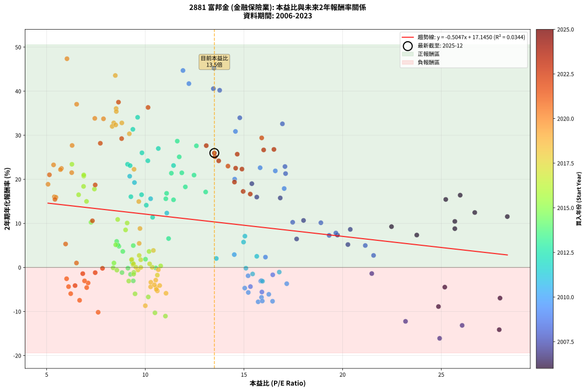
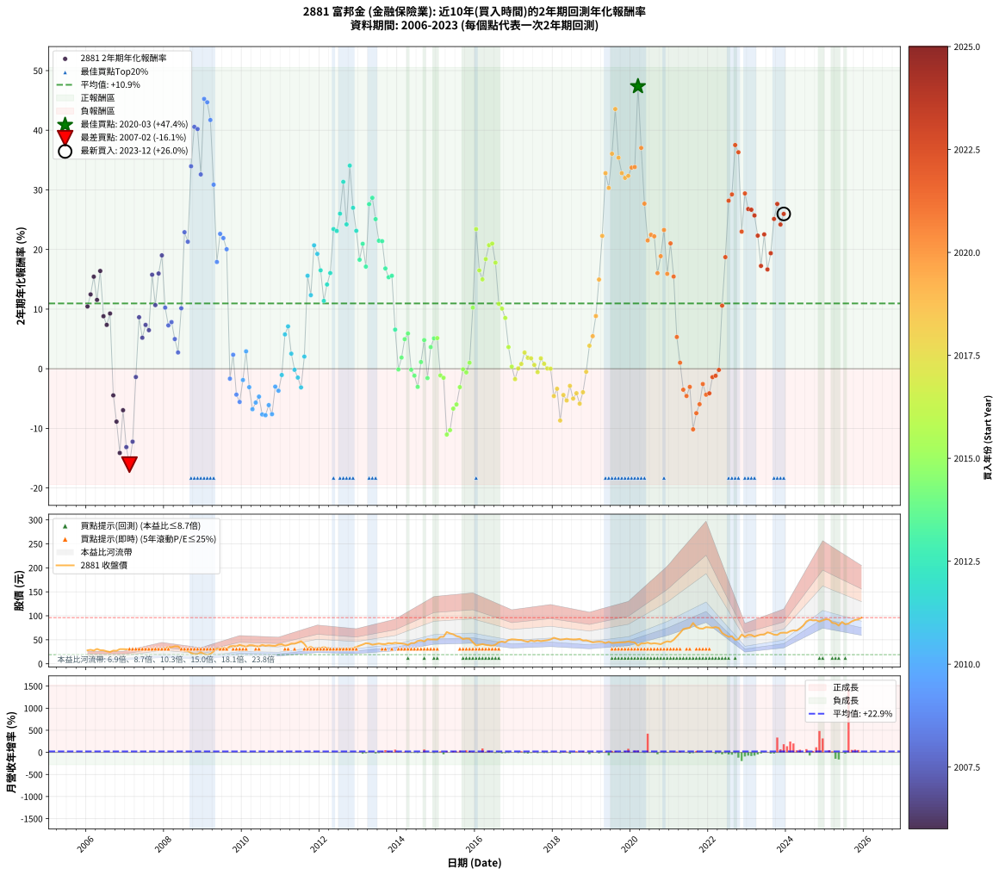

# 2881 富邦金 - 本益比與未來報酬率分析

!!! info "報告資訊"
    - **股票代號**: 2881
    - **公司名稱**: 富邦金
    - **產業別**: 金融保險業
    - **分析期間**: 2006-2023 (216 個數據點)
    - **資料來源**: Type 12 (ShowMonthlyK_ChartFlow) 月收盤價與本益比
    - **報酬率口徑**: 含現金股利 (簡化: 年度合計，假設每年7/1入帳)
    - **報告生成時間**: 2026-01-11 20:53:51 CST

## 📈 視覺化圖表

### 圖表1: 本益比 vs 未來報酬率關係

*圖表1：2881 富邦金 本益比與2年期未來報酬率關係 (2006-2023)*

### 圖表2: 歷年買入時點的2年期實際報酬率

*圖表2：2881 富邦金 歷年買入時點的2年期實際報酬率 (2006-2023)*

## 📍 買點訊號說明

本報告提供兩種買點提示訊號（顯示於圖表2的股價子圖中）：

### ▲ 小綠色三角形（回測驗證）
- **計算方式**: 使用全部歷史資料計算本益比第25百分位數
- **用途**: 事後驗證，顯示歷史上哪些時點確實為低估區
- **限制**: 當下無法判斷，僅供回測參考
- **特性**: 後見之明（Look-Ahead Bias）

### ▲ 小橘色三角形（即時訊號）
- **計算方式**: 使用截至當月的過去5年資料計算本益比第25百分位數
- **用途**: 實際投資決策，當時即可判斷
- **優勢**: 可操作性強，符合實務需求
- **特性**: 無後見之明，滾動窗口計算

!!! tip "如何使用兩種訊號"
    - **綠色▲** 幫助理解歷史估值機會，驗證策略有效性
    - **橘色▲** 可作為實際買進參考，但仍需搭配基本面分析
    - 兩種訊號重疊時，表示即時判斷與事後驗證一致，信心度較高
    - 僅有綠色▲時，表示當時無法判斷（需要未來資料才能確認）
    - 僅有橘色▲時，表示即時判斷為買點，但事後可能不是最佳時機

## 📊 估值分析摘要

| 指標 | 數值 |
|:---:|:---:|
| **目前本益比** (2023-12) | **13.50 倍** |
| **歷史平均本益比** | 12.28 倍 |
| **估值水準** | 🟡 合理範圍 |
| **預期2年年化報酬率** | **+10.33%** |
| **歷史平均報酬率** | +10.95% |
| **相關係數 (R²)** | 0.0344 |
| **趨勢線斜率** | -0.5047 |

!!! abstract "核心洞察"
    目前本益比接近歷史平均，預期報酬率符合長期趨勢

    根據歷史數據回測，2881 富邦金 在目前本益比 **13.5倍** 的估值水準下，
    預期未來2年年化報酬率約為 **+10.3%**。

    **重要提醒**: 本分析基於歷史數據統計，實際報酬率會受到公司基本面變化、產業趨勢、
    總體經濟環境等多重因素影響。R² = 0.03 表示本益比可解釋約 3.4% 的報酬率變異。

## 📈 歷史估值統計

### 最佳買點 (最高報酬率)

| 項目 | 數值 |
|:---:|:---:|
| 起始時間 | 2020-03 |
| 當時本益比 | 6.03 倍 |
| 起始價格 | 37.5 元 |
| 2年後價格 | 76.5 元 |
| **2年年化報酬率** | **+47.36%** |

### 最差買點 (最低報酬率)

| 項目 | 數值 |
|:---:|:---:|
| 起始時間 | 2007-02 |
| 當時本益比 | 24.92 倍 |
| 起始價格 | 30.4 元 |
| 2年後價格 | 18.9 元 |
| **2年年化報酬率** | **-16.09%** |

## 🎯 投資啟示

### 本益比與報酬率關係

趨勢線方程式: **y = -0.5047x + 17.1450**

!!! warning "強負相關"
    本益比與未來報酬率呈現強負相關。在高本益比時期買入，未來報酬率顯著較低；
    在低本益比時期買入，未來報酬率顯著較高。**估值紀律至關重要**。

### 估值區間建議

基於歷史數據分析:

- **🟢 低估區** (P/E < 9.8): 預期報酬率較高，可考慮增加持股
- **🟡 合理區** (P/E 9.8-14.7): 預期報酬率符合長期趨勢，正常持有
- **🔴 高估區** (P/E > 14.7): 預期報酬率較低，可考慮減碼或觀望

!!! danger "風險提示"
    - 過去表現不代表未來結果
    - 本分析假設公司基本面無重大結構性變化
    - 產業環境劇變可能使歷史規律失效
    - 應結合公司財報、產業趨勢、總體經濟等多重因素綜合判斷

!!! success "長期投資觀點"
    歷史數據顯示，在合理或低估的估值水準買入並長期持有，
    往往能獲得較佳的投資報酬。**耐心等待好價格**是價值投資的核心原則。

## 📊 數據品質

- **資料來源**: GoodInfo.tw Type 12 (ShowMonthlyK_ChartFlow)
- **資料頻率**: 月度收盤價與本益比
- **回測期間**: 2006-2023
- **數據點數量**: 216 個 (每個點代表一次2年期回測)

### 計算方法說明

1. **2年期年化報酬率**:
   - 對每個歷史時點，計算其後2年的實際投資報酬率
   - 期末價值(不含股利): 期末價格
   - 期末價值(含現金股利): 期末價格 + 持有期間內的現金股利合計 (簡化: 年度合計，假設每年7/1入帳)
   - 公式: 年化報酬率 = [(期末價值/期初價格)^(1/年數) - 1] × 100%

2. **本益比 (P/E Ratio)**:
   - 使用當時的月收盤價與EPS計算
   - 資料來源: Type 12 月度河流圖本益比數據

3. **趨勢線 (Linear Regression)**:
   - 使用最小平方法擬合線性趨勢線
   - R²值衡量本益比對報酬率的解釋能力

---

*本報告由 Stock Analysis System v1.9.0 自動生成*
*數據更新時間: 2026-01-11 20:53:51 CST*

## 📋 月度回測明細表

（每一列對應時間線圖中的一個買入點；可用來對照 SVG 圖上的每個點。）

| 買入月份 | 賣出月份 | 回測期限_年 | 實際持有年數 | 買入本益比_倍 | 買入收盤價_元 | 賣出收盤價_元 | 現金股利合計_元 | 總報酬率_pct | 年化報酬率_pct |
| --- | --- | --- | --- | --- | --- | --- | --- | --- | --- |
| 2006-01 | 2008-01 | 2 | 1.999 | 25.69 | 28.00 | 32.00 | 2.15 | +21.96 | +10.44 |
| 2006-02 | 2008-02 | 2 | 1.999 | 26.70 | 29.10 | 34.65 | 2.15 | +26.46 | +12.46 |
| 2006-03 | 2008-03 | 2 | 2.001 | 25.23 | 27.50 | 34.50 | 2.15 | +33.27 | +15.43 |
| 2006-04 | 2008-04 | 2 | 2.001 | 28.35 | 30.90 | 36.30 | 2.15 | +24.43 | +11.54 |
| 2006-05 | 2008-05 | 2 | 2.001 | 25.96 | 28.30 | 36.20 | 2.15 | +35.51 | +16.40 |
| 2006-06 | 2008-06 | 2 | 2.001 | 25.69 | 28.00 | 31.00 | 2.15 | +18.39 | +8.80 |
| 2006-07 | 2008-07 | 2 | 2.001 | 23.76 | 25.90 | 27.35 | 2.50 | +15.25 | +7.35 |
| 2006-08 | 2008-08 | 2 | 2.001 | 22.48 | 24.50 | 26.75 | 2.50 | +19.39 | +9.26 |
| 2006-09 | 2008-09 | 2 | 2.001 | 25.18 | 27.45 | 22.55 | 2.50 | -8.74 | -4.47 |
| 2006-10 | 2008-10 | 2 | 2.001 | 24.86 | 27.10 | 20.00 | 2.50 | -16.97 | -8.88 |
| 2006-11 | 2008-11 | 2 | 2.001 | 27.94 | 30.45 | 19.95 | 2.50 | -26.27 | -14.13 |
| 2006-12 | 2008-12 | 2 | 2.001 | 27.98 | 30.50 | 23.90 | 2.50 | -13.44 | -6.96 |
| 2007-01 | 2009-01 | 2 | 2.001 | 26.06 | 30.10 | 20.20 | 2.50 | -24.58 | -13.15 |
| 2007-02 | 2009-02 | 2 | 2.001 | 24.92 | 30.40 | 18.90 | 2.50 | -29.61 | -16.09 |
| 2007-03 | 2009-03 | 2 | 2.001 | 23.19 | 29.80 | 20.45 | 2.50 | -22.99 | -12.23 |
| 2007-04 | 2009-04 | 2 | 2.001 | 21.48 | 29.00 | 25.70 | 2.50 | -2.76 | -1.39 |
| 2007-05 | 2009-05 | 2 | 2.001 | 20.39 | 28.85 | 31.55 | 2.50 | +18.02 | +8.63 |
| 2007-06 | 2009-06 | 2 | 2.001 | 20.27 | 30.00 | 30.70 | 2.50 | +10.67 | +5.19 |
| 2007-07 | 2009-07 | 2 | 2.001 | 19.74 | 30.50 | 33.65 | 1.50 | +15.25 | +7.35 |
| 2007-08 | 2009-08 | 2 | 2.001 | 17.67 | 28.45 | 30.75 | 1.50 | +13.36 | +6.46 |
| 2007-09 | 2009-09 | 2 | 2.001 | 16.84 | 28.20 | 36.30 | 1.50 | +34.04 | +15.77 |
| 2007-10 | 2009-10 | 2 | 2.001 | 18.02 | 31.35 | 36.90 | 1.50 | +22.49 | +10.67 |
| 2007-11 | 2009-11 | 2 | 2.001 | 15.65 | 28.25 | 36.50 | 1.50 | +34.51 | +15.97 |
| 2007-12 | 2009-12 | 2 | 2.001 | 15.40 | 28.80 | 39.30 | 1.50 | +41.67 | +19.01 |
| 2008-01 | 2010-01 | 2 | 2.001 | 17.47 | 32.00 | 37.40 | 1.50 | +21.56 | +10.25 |
| 2008-02 | 2010-03 | 2 | 2.081 | 19.32 | 34.65 | 38.60 | 1.50 | +15.73 | +7.27 |
| 2008-03 | 2010-03 | 2 | 1.999 | 19.66 | 34.50 | 38.60 | 1.50 | +16.23 | +7.82 |
| 2008-04 | 2010-04 | 2 | 1.999 | 21.15 | 36.30 | 38.50 | 1.50 | +10.19 | +4.98 |
| 2008-05 | 2010-05 | 2 | 1.999 | 21.57 | 36.20 | 36.70 | 1.50 | +5.52 | +2.73 |
| 2008-06 | 2010-06 | 2 | 1.999 | 18.90 | 31.00 | 36.10 | 1.50 | +21.29 | +10.14 |
| 2008-07 | 2010-07 | 2 | 1.999 | 17.08 | 27.35 | 39.30 | 2.00 | +51.00 | +22.90 |
| 2008-08 | 2010-08 | 2 | 1.999 | 17.11 | 26.75 | 37.35 | 2.00 | +47.10 | +21.30 |
| 2008-09 | 2010-09 | 2 | 1.999 | 14.79 | 22.55 | 38.45 | 2.00 | +79.37 | +33.96 |
| 2008-10 | 2010-10 | 2 | 1.999 | 13.45 | 20.00 | 37.50 | 2.00 | +97.49 | +40.56 |
| 2008-11 | 2010-11 | 2 | 1.999 | 13.77 | 19.95 | 37.20 | 2.00 | +96.48 | +40.20 |
| 2008-12 | 2010-12 | 2 | 1.999 | 16.95 | 23.90 | 40.00 | 2.00 | +75.72 | +32.59 |
| 2009-01 | 2011-01 | 2 | 1.999 | 13.48 | 20.20 | 40.60 | 2.00 | +110.88 | +45.25 |
| 2009-02 | 2011-02 | 2 | 1.999 | 11.91 | 18.90 | 37.55 | 2.00 | +109.25 | +44.69 |
| 2009-03 | 2011-03 | 2 | 1.999 | 12.21 | 20.45 | 39.05 | 2.00 | +100.72 | +41.71 |
| 2009-04 | 2011-04 | 2 | 1.999 | 14.57 | 25.70 | 42.00 | 2.00 | +71.20 | +30.87 |
| 2009-05 | 2011-05 | 2 | 1.999 | 17.04 | 31.55 | 41.85 | 2.00 | +38.98 | +17.90 |
| 2009-06 | 2011-06 | 2 | 1.999 | 15.82 | 30.70 | 44.15 | 2.00 | +50.32 | +22.62 |
| 2009-07 | 2011-07 | 2 | 1.999 | 16.59 | 33.65 | 47.00 | 3.00 | +48.58 | +21.91 |
| 2009-08 | 2011-08 | 2 | 1.999 | 14.53 | 30.75 | 41.30 | 3.00 | +44.06 | +20.04 |
| 2009-09 | 2011-09 | 2 | 1.999 | 16.46 | 36.30 | 32.10 | 3.00 | -3.31 | -1.67 |
| 2009-10 | 2011-10 | 2 | 1.999 | 16.09 | 36.90 | 35.65 | 3.00 | +4.73 | +2.34 |
| 2009-11 | 2011-11 | 2 | 1.999 | 15.33 | 36.50 | 30.40 | 3.00 | -8.50 | -4.35 |
| 2009-12 | 2011-12 | 2 | 1.999 | 15.91 | 39.30 | 32.05 | 3.00 | -10.82 | -5.57 |
| 2010-01 | 2012-01 | 2 | 1.999 | 15.21 | 37.40 | 33.00 | 3.00 | -3.75 | -1.89 |
| 2010-02 | 2012-02 | 2 | 1.999 | 14.51 | 35.50 | 34.60 | 3.00 | +5.91 | +2.91 |
| 2010-03 | 2012-03 | 2 | 2.001 | 15.85 | 38.60 | 33.25 | 3.00 | -6.10 | -3.09 |
| 2010-04 | 2012-04 | 2 | 2.001 | 15.89 | 38.50 | 30.45 | 3.00 | -13.12 | -6.79 |
| 2010-05 | 2012-05 | 2 | 2.001 | 15.22 | 36.70 | 29.65 | 3.00 | -11.04 | -5.68 |
| 2010-06 | 2012-06 | 2 | 2.001 | 15.04 | 36.10 | 29.80 | 3.00 | -9.15 | -4.68 |
| 2010-07 | 2012-07 | 2 | 2.001 | 16.45 | 39.30 | 31.50 | 2.00 | -14.76 | -7.67 |
| 2010-08 | 2012-08 | 2 | 2.001 | 15.72 | 37.35 | 29.75 | 2.00 | -15.00 | -7.80 |
| 2010-09 | 2012-09 | 2 | 2.001 | 16.26 | 38.45 | 31.90 | 2.00 | -11.84 | -6.10 |
| 2010-10 | 2012-10 | 2 | 2.001 | 15.93 | 37.50 | 30.00 | 2.00 | -14.67 | -7.62 |
| 2010-11 | 2012-11 | 2 | 2.001 | 15.89 | 37.20 | 33.00 | 2.00 | -5.92 | -3.00 |
| 2010-12 | 2012-12 | 2 | 2.001 | 17.17 | 40.00 | 35.10 | 2.00 | -7.26 | -3.69 |
| 2011-01 | 2013-01 | 2 | 2.001 | 16.79 | 40.60 | 37.75 | 2.00 | -2.10 | -1.05 |
| 2011-02 | 2013-02 | 2 | 2.001 | 14.98 | 37.55 | 40.00 | 2.00 | +11.85 | +5.75 |
| 2011-03 | 2013-03 | 2 | 2.001 | 15.05 | 39.05 | 42.80 | 2.00 | +14.72 | +7.10 |
| 2011-04 | 2013-04 | 2 | 2.001 | 15.65 | 42.00 | 42.15 | 2.00 | +5.11 | +2.52 |
| 2011-05 | 2013-05 | 2 | 2.001 | 15.10 | 41.85 | 39.70 | 2.00 | -0.36 | -0.18 |
| 2011-06 | 2013-06 | 2 | 2.001 | 15.44 | 44.15 | 40.85 | 2.00 | -2.95 | -1.48 |
| 2011-07 | 2013-07 | 2 | 2.001 | 15.94 | 47.00 | 42.10 | 2.00 | -6.17 | -3.13 |
| 2011-08 | 2013-08 | 2 | 2.001 | 13.60 | 41.30 | 41.00 | 2.00 | +4.11 | +2.03 |
| 2011-09 | 2013-09 | 2 | 2.001 | 10.27 | 32.10 | 40.90 | 2.00 | +33.64 | +15.59 |
| 2011-10 | 2013-10 | 2 | 2.001 | 11.09 | 35.65 | 43.00 | 2.00 | +26.22 | +12.34 |
| 2011-11 | 2013-11 | 2 | 2.001 | 9.21 | 30.40 | 42.30 | 2.00 | +45.72 | +20.70 |
| 2011-12 | 2013-12 | 2 | 2.001 | 9.45 | 32.05 | 43.60 | 2.00 | +42.27 | +19.26 |
| 2012-01 | 2014-01 | 2 | 2.001 | 9.81 | 33.00 | 42.80 | 2.00 | +35.75 | +16.50 |
| 2012-02 | 2014-03 | 2 | 2.081 | 10.37 | 34.60 | 41.30 | 2.00 | +25.14 | +11.38 |
| 2012-03 | 2014-03 | 2 | 1.999 | 10.05 | 33.25 | 41.30 | 2.00 | +30.22 | +14.13 |
| 2012-04 | 2014-04 | 2 | 1.999 | 9.27 | 30.45 | 39.00 | 2.00 | +34.64 | +16.05 |
| 2012-05 | 2014-05 | 2 | 1.999 | 9.10 | 29.65 | 43.15 | 2.00 | +52.27 | +23.42 |
| 2012-06 | 2014-06 | 2 | 1.999 | 9.23 | 29.80 | 43.15 | 2.00 | +51.51 | +23.11 |
| 2012-07 | 2014-07 | 2 | 1.999 | 9.83 | 31.50 | 47.50 | 2.50 | +58.73 | +26.01 |
| 2012-08 | 2014-08 | 2 | 1.999 | 9.37 | 29.75 | 48.80 | 2.50 | +72.44 | +31.34 |
| 2012-09 | 2014-09 | 2 | 1.999 | 10.13 | 31.90 | 46.70 | 2.50 | +54.23 | +24.21 |
| 2012-10 | 2014-10 | 2 | 1.999 | 9.61 | 30.00 | 51.40 | 2.50 | +79.67 | +34.07 |
| 2012-11 | 2014-11 | 2 | 1.999 | 10.66 | 33.00 | 50.70 | 2.50 | +61.21 | +26.99 |
| 2012-12 | 2014-12 | 2 | 1.999 | 11.43 | 35.10 | 50.70 | 2.50 | +51.57 | +23.13 |
| 2013-01 | 2015-01 | 2 | 1.999 | 12.03 | 37.75 | 50.30 | 2.50 | +39.87 | +18.28 |
| 2013-02 | 2015-02 | 2 | 1.999 | 12.47 | 40.00 | 56.00 | 2.50 | +46.25 | +20.95 |
| 2013-03 | 2015-03 | 2 | 1.999 | 13.06 | 42.80 | 56.20 | 2.50 | +37.15 | +17.12 |
| 2013-04 | 2015-04 | 2 | 1.999 | 12.59 | 42.15 | 66.10 | 2.50 | +62.75 | +27.60 |
| 2013-05 | 2015-05 | 2 | 1.999 | 11.62 | 39.70 | 63.20 | 2.50 | +65.49 | +28.67 |
| 2013-06 | 2015-06 | 2 | 1.999 | 11.72 | 40.85 | 61.40 | 2.50 | +56.43 | +25.09 |
| 2013-07 | 2015-07 | 2 | 1.999 | 11.85 | 42.10 | 57.60 | 4.50 | +47.51 | +21.47 |
| 2013-08 | 2015-08 | 2 | 1.999 | 11.32 | 41.00 | 55.90 | 4.50 | +47.32 | +21.39 |
| 2013-09 | 2015-09 | 2 | 1.999 | 11.08 | 40.90 | 51.30 | 4.50 | +36.43 | +16.82 |
| 2013-10 | 2015-10 | 2 | 1.999 | 11.43 | 43.00 | 52.70 | 4.50 | +33.02 | +15.35 |
| 2013-11 | 2015-11 | 2 | 1.999 | 11.04 | 42.30 | 52.00 | 4.50 | +33.57 | +15.58 |
| 2013-12 | 2015-12 | 2 | 1.999 | 11.18 | 43.60 | 45.00 | 4.50 | +13.53 | +6.56 |
| 2014-01 | 2016-01 | 2 | 1.999 | 10.53 | 42.80 | 38.20 | 4.50 | -0.23 | -0.12 |
| 2014-02 | 2016-02 | 2 | 1.999 | 10.01 | 42.35 | 39.45 | 4.50 | +3.78 | +1.87 |
| 2014-03 | 2016-03 | 2 | 2.001 | 9.39 | 41.30 | 41.00 | 4.50 | +10.17 | +4.96 |
| 2014-04 | 2016-04 | 2 | 2.001 | 8.55 | 39.00 | 39.25 | 4.50 | +12.18 | +5.91 |
| 2014-05 | 2016-05 | 2 | 2.001 | 9.12 | 43.15 | 38.50 | 4.50 | -0.35 | -0.17 |
| 2014-06 | 2016-06 | 2 | 2.001 | 8.82 | 43.15 | 37.65 | 4.50 | -2.32 | -1.16 |
| 2014-07 | 2016-07 | 2 | 2.001 | 9.39 | 47.50 | 39.65 | 5.00 | -6.00 | -3.04 |
| 2014-08 | 2016-08 | 2 | 2.001 | 9.34 | 48.80 | 44.90 | 5.00 | +2.25 | +1.12 |
| 2014-09 | 2016-09 | 2 | 2.001 | 8.66 | 46.70 | 46.30 | 5.00 | +9.85 | +4.81 |
| 2014-10 | 2016-10 | 2 | 2.001 | 9.25 | 51.40 | 44.80 | 5.00 | -3.11 | -1.57 |
| 2014-11 | 2016-11 | 2 | 2.001 | 8.86 | 50.70 | 49.45 | 5.00 | +7.40 | +3.63 |
| 2014-12 | 2016-12 | 2 | 2.001 | 8.61 | 50.70 | 51.00 | 5.00 | +10.45 | +5.09 |
| 2015-01 | 2017-01 | 2 | 2.001 | 8.50 | 50.30 | 50.60 | 5.00 | +10.54 | +5.13 |
| 2015-02 | 2017-02 | 2 | 2.001 | 9.42 | 56.00 | 49.75 | 5.00 | -2.23 | -1.12 |
| 2015-03 | 2017-03 | 2 | 2.001 | 9.41 | 56.20 | 49.50 | 5.00 | -3.02 | -1.52 |
| 2015-04 | 2017-04 | 2 | 2.001 | 11.02 | 66.10 | 47.30 | 5.00 | -20.88 | -11.04 |
| 2015-05 | 2017-05 | 2 | 2.001 | 10.49 | 63.20 | 45.85 | 5.00 | -19.54 | -10.29 |
| 2015-06 | 2017-06 | 2 | 2.001 | 10.15 | 61.40 | 48.45 | 5.00 | -12.95 | -6.69 |
| 2015-07 | 2017-07 | 2 | 2.001 | 9.48 | 57.60 | 46.90 | 4.00 | -11.63 | -5.99 |
| 2015-08 | 2017-08 | 2 | 2.001 | 9.16 | 55.90 | 48.50 | 4.00 | -6.08 | -3.09 |
| 2015-09 | 2017-09 | 2 | 2.001 | 8.37 | 51.30 | 47.20 | 4.00 | -0.19 | -0.10 |
| 2015-10 | 2017-10 | 2 | 2.001 | 8.56 | 52.70 | 48.05 | 4.00 | -1.23 | -0.62 |
| 2015-11 | 2017-11 | 2 | 2.001 | 8.41 | 52.00 | 49.05 | 4.00 | +2.02 | +1.00 |
| 2015-12 | 2017-12 | 2 | 2.001 | 7.25 | 45.00 | 50.70 | 4.00 | +21.56 | +10.24 |
| 2016-01 | 2018-01 | 2 | 2.001 | 6.28 | 38.20 | 54.20 | 4.00 | +52.36 | +23.41 |
| 2016-02 | 2018-03 | 2 | 2.081 | 6.62 | 39.45 | 50.20 | 4.00 | +37.39 | +16.49 |
| 2016-03 | 2018-03 | 2 | 1.999 | 7.02 | 41.00 | 50.20 | 4.00 | +32.20 | +14.99 |
| 2016-04 | 2018-04 | 2 | 1.999 | 6.87 | 39.25 | 51.00 | 4.00 | +40.13 | +18.39 |
| 2016-05 | 2018-05 | 2 | 1.999 | 6.88 | 38.50 | 52.10 | 4.00 | +45.71 | +20.73 |
| 2016-06 | 2018-06 | 2 | 1.999 | 6.88 | 37.65 | 51.10 | 4.00 | +46.35 | +20.99 |
| 2016-07 | 2018-07 | 2 | 1.999 | 7.42 | 39.65 | 50.70 | 4.30 | +38.71 | +17.79 |
| 2016-08 | 2018-08 | 2 | 1.999 | 8.60 | 44.90 | 50.90 | 4.30 | +22.94 | +10.89 |
| 2016-09 | 2018-09 | 2 | 1.999 | 9.08 | 46.30 | 51.80 | 4.30 | +21.17 | +10.08 |
| 2016-10 | 2018-10 | 2 | 1.999 | 9.00 | 44.80 | 48.45 | 4.30 | +17.75 | +8.52 |
| 2016-11 | 2018-11 | 2 | 1.999 | 10.19 | 49.45 | 48.80 | 4.30 | +7.38 | +3.63 |
| 2016-12 | 2018-12 | 2 | 1.999 | 10.78 | 51.00 | 47.05 | 4.30 | +0.69 | +0.34 |
| 2017-01 | 2019-01 | 2 | 1.999 | 10.61 | 50.60 | 44.55 | 4.30 | -3.46 | -1.75 |
| 2017-02 | 2019-02 | 2 | 1.999 | 10.35 | 49.75 | 45.50 | 4.30 | +0.10 | +0.05 |
| 2017-03 | 2019-03 | 2 | 1.999 | 10.22 | 49.50 | 46.00 | 4.30 | +1.62 | +0.81 |
| 2017-04 | 2019-04 | 2 | 1.999 | 9.69 | 47.30 | 45.60 | 4.30 | +5.50 | +2.71 |
| 2017-05 | 2019-05 | 2 | 1.999 | 9.32 | 45.85 | 43.25 | 4.30 | +3.71 | +1.84 |
| 2017-06 | 2019-06 | 2 | 1.999 | 9.77 | 48.45 | 45.85 | 4.30 | +3.51 | +1.74 |
| 2017-07 | 2019-07 | 2 | 1.999 | 9.38 | 46.90 | 43.20 | 4.30 | +1.28 | +0.64 |
| 2017-08 | 2019-08 | 2 | 1.999 | 9.63 | 48.50 | 43.65 | 4.30 | -1.13 | -0.57 |
| 2017-09 | 2019-09 | 2 | 1.999 | 9.30 | 47.20 | 44.55 | 4.30 | +3.50 | +1.73 |
| 2017-10 | 2019-10 | 2 | 1.999 | 9.40 | 48.05 | 44.55 | 4.30 | +1.66 | +0.83 |
| 2017-11 | 2019-11 | 2 | 1.999 | 9.52 | 49.05 | 44.80 | 4.30 | +0.10 | +0.05 |
| 2017-12 | 2019-12 | 2 | 1.999 | 9.77 | 50.70 | 46.40 | 4.30 | -0.00 | -0.00 |
| 2018-01 | 2020-01 | 2 | 1.999 | 10.56 | 54.20 | 45.05 | 4.30 | -8.95 | -4.58 |
| 2018-02 | 2020-02 | 2 | 1.999 | 10.28 | 52.20 | 44.45 | 4.30 | -6.61 | -3.36 |
| 2018-03 | 2020-03 | 2 | 2.001 | 10.00 | 50.20 | 37.55 | 4.30 | -16.63 | -8.69 |
| 2018-04 | 2020-04 | 2 | 2.001 | 10.27 | 51.00 | 42.30 | 4.30 | -8.63 | -4.41 |
| 2018-05 | 2020-05 | 2 | 2.001 | 10.61 | 52.10 | 42.40 | 4.30 | -10.36 | -5.32 |
| 2018-06 | 2020-06 | 2 | 2.001 | 10.53 | 51.10 | 43.90 | 4.30 | -5.68 | -2.88 |
| 2018-07 | 2020-07 | 2 | 2.001 | 10.56 | 50.70 | 41.75 | 4.00 | -9.76 | -5.00 |
| 2018-08 | 2020-08 | 2 | 2.001 | 10.73 | 50.90 | 42.80 | 4.00 | -8.06 | -4.11 |
| 2018-09 | 2020-09 | 2 | 2.001 | 11.05 | 51.80 | 41.90 | 4.00 | -11.39 | -5.86 |
| 2018-10 | 2020-10 | 2 | 2.001 | 10.46 | 48.45 | 40.70 | 4.00 | -7.74 | -3.95 |
| 2018-11 | 2020-11 | 2 | 2.001 | 10.66 | 48.80 | 44.30 | 4.00 | -1.02 | -0.51 |
| 2018-12 | 2020-12 | 2 | 2.001 | 10.41 | 47.05 | 46.75 | 4.00 | +7.86 | +3.85 |
| 2019-01 | 2021-01 | 2 | 2.001 | 9.69 | 44.55 | 45.55 | 4.00 | +11.22 | +5.46 |
| 2019-02 | 2021-02 | 2 | 2.001 | 9.73 | 45.50 | 49.90 | 4.00 | +18.46 | +8.83 |
| 2019-03 | 2021-03 | 2 | 2.001 | 9.67 | 46.00 | 56.80 | 4.00 | +32.17 | +14.96 |
| 2019-04 | 2021-04 | 2 | 2.001 | 9.43 | 45.60 | 64.20 | 4.00 | +49.56 | +22.28 |
| 2019-05 | 2021-05 | 2 | 2.001 | 8.81 | 43.25 | 72.30 | 4.00 | +76.42 | +32.80 |
| 2019-06 | 2021-06 | 2 | 2.001 | 9.19 | 45.85 | 73.90 | 4.00 | +69.90 | +30.32 |
| 2019-07 | 2021-07 | 2 | 2.001 | 8.52 | 43.20 | 75.00 | 5.00 | +85.19 | +36.05 |
| 2019-08 | 2021-08 | 2 | 2.001 | 8.48 | 43.65 | 85.00 | 5.00 | +106.19 | +43.56 |
| 2019-09 | 2021-09 | 2 | 2.001 | 8.53 | 44.55 | 76.70 | 5.00 | +83.39 | +35.39 |
| 2019-10 | 2021-10 | 2 | 2.001 | 8.40 | 44.55 | 73.60 | 5.00 | +76.43 | +32.80 |
| 2019-11 | 2021-11 | 2 | 2.001 | 8.32 | 44.80 | 73.10 | 5.00 | +74.33 | +32.01 |
| 2019-12 | 2021-12 | 2 | 2.001 | 8.50 | 46.40 | 76.30 | 5.00 | +75.22 | +32.34 |
| 2020-01 | 2022-01 | 2 | 2.001 | 7.88 | 45.05 | 75.60 | 5.00 | +78.91 | +33.73 |
| 2020-02 | 2022-03 | 2 | 2.081 | 7.44 | 44.45 | 76.50 | 5.00 | +83.35 | +33.82 |
| 2020-03 | 2022-03 | 2 | 1.999 | 6.03 | 37.55 | 76.50 | 5.00 | +117.04 | +47.36 |
| 2020-04 | 2022-04 | 2 | 1.999 | 6.52 | 42.30 | 74.40 | 5.00 | +87.71 | +37.04 |
| 2020-05 | 2022-05 | 2 | 1.999 | 6.29 | 42.40 | 64.10 | 5.00 | +62.97 | +27.68 |
| 2020-06 | 2022-06 | 2 | 1.999 | 6.27 | 43.90 | 59.80 | 5.00 | +47.61 | +21.51 |
| 2020-07 | 2022-07 | 2 | 1.999 | 5.75 | 41.75 | 56.10 | 6.50 | +49.94 | +22.47 |
| 2020-08 | 2022-08 | 2 | 1.999 | 5.70 | 42.80 | 57.40 | 6.50 | +49.30 | +22.20 |
| 2020-09 | 2022-09 | 2 | 1.999 | 5.39 | 41.90 | 49.90 | 6.50 | +34.61 | +16.03 |
| 2020-10 | 2022-10 | 2 | 1.999 | 5.07 | 40.70 | 51.00 | 6.50 | +41.28 | +18.87 |
| 2020-11 | 2022-11 | 2 | 1.999 | 5.35 | 44.30 | 60.80 | 6.50 | +51.92 | +23.27 |
| 2020-12 | 2022-12 | 2 | 1.999 | 5.47 | 46.75 | 56.30 | 6.50 | +34.33 | +15.91 |
| 2021-01 | 2023-01 | 2 | 1.999 | 5.14 | 45.55 | 60.20 | 6.50 | +46.43 | +21.03 |
| 2021-02 | 2023-02 | 2 | 1.999 | 5.42 | 49.90 | 60.00 | 6.50 | +33.27 | +15.45 |
| 2021-03 | 2023-03 | 2 | 1.999 | 5.96 | 56.80 | 56.50 | 6.50 | +10.92 | +5.32 |
| 2021-04 | 2023-04 | 2 | 1.999 | 6.51 | 64.20 | 59.00 | 6.50 | +2.02 | +1.01 |
| 2021-05 | 2023-05 | 2 | 1.999 | 7.10 | 72.30 | 60.80 | 6.50 | -6.92 | -3.52 |
| 2021-06 | 2023-06 | 2 | 1.999 | 7.03 | 73.90 | 60.80 | 6.50 | -8.93 | -4.57 |
| 2021-07 | 2023-07 | 2 | 1.999 | 6.92 | 75.00 | 65.50 | 5.00 | -6.00 | -3.05 |
| 2021-08 | 2023-08 | 2 | 1.999 | 7.61 | 85.00 | 63.60 | 5.00 | -19.29 | -10.17 |
| 2021-09 | 2023-09 | 2 | 1.999 | 6.67 | 76.70 | 60.70 | 5.00 | -14.34 | -7.45 |
| 2021-10 | 2023-10 | 2 | 1.999 | 6.22 | 73.60 | 60.10 | 5.00 | -11.55 | -5.96 |
| 2021-11 | 2023-11 | 2 | 1.999 | 6.01 | 73.10 | 64.40 | 5.00 | -5.06 | -2.57 |
| 2021-12 | 2023-12 | 2 | 1.999 | 6.11 | 76.30 | 64.80 | 5.00 | -8.52 | -4.36 |
| 2022-01 | 2024-01 | 2 | 1.999 | 6.44 | 75.60 | 64.50 | 5.00 | -8.07 | -4.12 |
| 2022-02 | 2024-02 | 2 | 1.999 | 6.83 | 75.10 | 68.00 | 5.00 | -2.80 | -1.41 |
| 2022-03 | 2024-03 | 2 | 2.001 | 7.46 | 76.50 | 69.70 | 5.00 | -2.35 | -1.18 |
| 2022-04 | 2024-04 | 2 | 2.001 | 7.83 | 74.40 | 69.10 | 5.00 | -0.40 | -0.20 |
| 2022-05 | 2024-05 | 2 | 2.001 | 7.32 | 64.10 | 73.40 | 5.00 | +22.31 | +10.59 |
| 2022-06 | 2024-06 | 2 | 2.001 | 7.46 | 59.80 | 79.30 | 5.00 | +40.97 | +18.72 |
| 2022-07 | 2024-07 | 2 | 2.001 | 7.72 | 56.10 | 88.20 | 4.00 | +64.35 | +28.18 |
| 2022-08 | 2024-08 | 2 | 2.001 | 8.80 | 57.40 | 91.90 | 4.00 | +67.07 | +29.23 |
| 2022-09 | 2024-09 | 2 | 2.001 | 8.64 | 49.90 | 90.40 | 4.00 | +89.18 | +37.51 |
| 2022-10 | 2024-10 | 2 | 2.001 | 10.14 | 51.00 | 90.80 | 4.00 | +85.88 | +36.31 |
| 2022-11 | 2024-11 | 2 | 2.001 | 14.19 | 60.80 | 88.00 | 4.00 | +51.32 | +22.99 |
| 2022-12 | 2024-12 | 2 | 2.001 | 15.90 | 56.30 | 90.30 | 4.00 | +67.50 | +29.40 |
| 2023-01 | 2025-01 | 2 | 2.001 | 16.52 | 60.20 | 92.80 | 4.00 | +60.80 | +26.79 |
| 2023-02 | 2025-02 | 2 | 2.001 | 16.00 | 60.00 | 92.30 | 4.00 | +60.50 | +26.67 |
| 2023-03 | 2025-03 | 2 | 2.001 | 14.66 | 56.50 | 85.30 | 4.00 | +58.05 | +25.70 |
| 2023-04 | 2025-04 | 2 | 2.001 | 14.90 | 59.00 | 84.30 | 4.00 | +49.66 | +22.32 |
| 2023-05 | 2025-05 | 2 | 2.001 | 14.96 | 60.80 | 79.60 | 4.00 | +37.50 | +17.25 |
| 2023-06 | 2025-06 | 2 | 2.001 | 14.58 | 60.80 | 87.30 | 4.00 | +50.16 | +22.52 |
| 2023-07 | 2025-07 | 2 | 2.001 | 15.32 | 65.50 | 82.40 | 6.75 | +36.11 | +16.65 |
| 2023-08 | 2025-08 | 2 | 2.001 | 14.52 | 63.60 | 83.90 | 6.75 | +42.53 | +19.37 |
| 2023-09 | 2025-09 | 2 | 2.001 | 13.53 | 60.70 | 88.30 | 6.75 | +56.59 | +25.12 |
| 2023-10 | 2025-10 | 2 | 2.001 | 13.09 | 60.10 | 91.20 | 6.75 | +62.98 | +27.64 |
| 2023-11 | 2025-11 | 2 | 2.001 | 13.72 | 64.40 | 92.60 | 6.75 | +54.27 | +24.19 |
| 2023-12 | 2025-12 | 2 | 2.001 | 13.50 | 64.80 | 96.10 | 6.75 | +58.72 | +25.96 |
