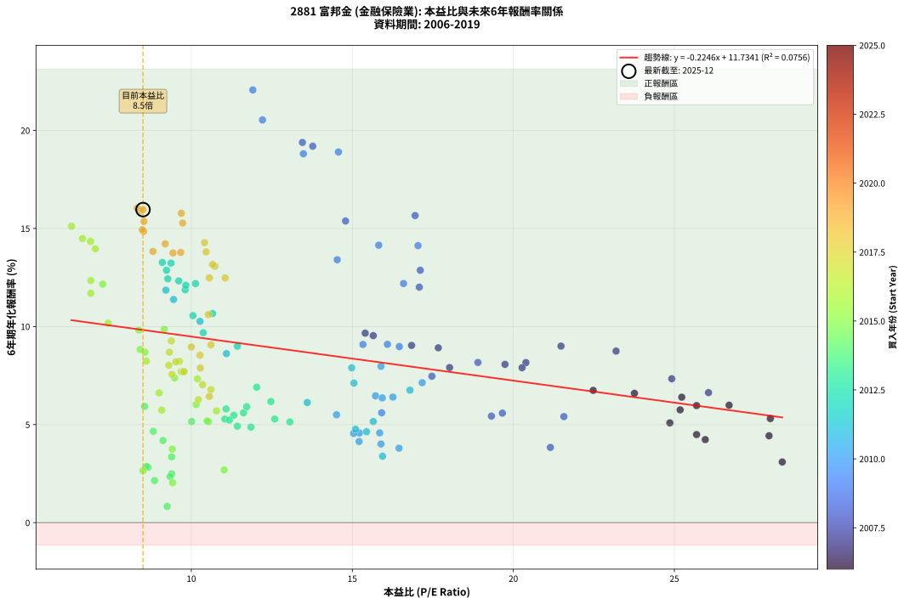

# 2881 富邦金 - 本益比與未來報酬率分析

!!! info "報告資訊"
    - **股票代號**: 2881
    - **公司名稱**: 富邦金
    - **產業別**: 金融保險業
    - **分析期間**: 2006-2019 (168 個數據點)
    - **資料來源**: Type 12 (ShowMonthlyK_ChartFlow) 月收盤價與本益比
    - **報酬率口徑**: 含現金股利 (簡化: 年度合計，假設每年7/1入帳)
    - **報告生成時間**: 2026-01-06 00:47:24 CST

## 📈 視覺化圖表

### 圖表1: 本益比 vs 未來報酬率關係

*圖表1：2881 富邦金 本益比與6年期未來報酬率關係 (2006-2019)*

### 圖表2: 歷年買入時點的6年期實際報酬率

*圖表2：2881 富邦金 歷年買入時點的6年期實際報酬率 (2006-2019)*

## 📍 買點訊號說明

本報告提供兩種買點提示訊號（顯示於圖表2的股價子圖中）：

### ▲ 小綠色三角形（回測驗證）
- **計算方式**: 使用全部歷史資料計算本益比第25百分位數
- **用途**: 事後驗證，顯示歷史上哪些時點確實為低估區
- **限制**: 當下無法判斷，僅供回測參考
- **特性**: 後見之明（Look-Ahead Bias）

### ▲ 小橘色三角形（即時訊號）
- **計算方式**: 使用截至當月的過去5年資料計算本益比第25百分位數
- **用途**: 實際投資決策，當時即可判斷
- **優勢**: 可操作性強，符合實務需求
- **特性**: 無後見之明，滾動窗口計算

!!! tip "如何使用兩種訊號"
    - **綠色▲** 幫助理解歷史估值機會，驗證策略有效性
    - **橘色▲** 可作為實際買進參考，但仍需搭配基本面分析
    - 兩種訊號重疊時，表示即時判斷與事後驗證一致，信心度較高
    - 僅有綠色▲時，表示當時無法判斷（需要未來資料才能確認）
    - 僅有橘色▲時，表示即時判斷為買點，但事後可能不是最佳時機

## 📊 估值分析摘要

| 指標 | 數值 |
|:---:|:---:|
| **目前本益比** (2019-12) | **8.50 倍** |
| **歷史平均本益比** | 13.21 倍 |
| **估值水準** | 🟢 相對低估 |
| **預期6年年化報酬率** | **+9.82%** |
| **歷史平均報酬率** | +8.77% |
| **相關係數 (R²)** | 0.0756 |
| **趨勢線斜率** | -0.2246 |

!!! abstract "核心洞察"
    目前本益比顯著低於歷史平均，預期未來報酬率可能較高

    根據歷史數據回測，2881 富邦金 在目前本益比 **8.5倍** 的估值水準下，
    預期未來6年年化報酬率約為 **+9.8%**。

    **重要提醒**: 本分析基於歷史數據統計，實際報酬率會受到公司基本面變化、產業趨勢、
    總體經濟環境等多重因素影響。R² = 0.08 表示本益比可解釋約 7.6% 的報酬率變異。

## 📈 歷史估值統計

### 最佳買點 (最高報酬率)

| 項目 | 數值 |
|:---:|:---:|
| 起始時間 | 2009-02 |
| 當時本益比 | 11.91 倍 |
| 起始價格 | 18.9 元 |
| 6年後價格 | 56.0 元 |
| **6年年化報酬率** | **+22.06%** |

### 最差買點 (最低報酬率)

| 項目 | 數值 |
|:---:|:---:|
| 起始時間 | 2014-10 |
| 當時本益比 | 9.25 倍 |
| 起始價格 | 51.4 元 |
| 6年後價格 | 40.7 元 |
| **6年年化報酬率** | **+0.83%** |

## 🎯 投資啟示

### 本益比與報酬率關係

趨勢線方程式: **y = -0.2246x + 11.7341**

!!! note "負相關"
    本益比與未來報酬率呈現負相關。較低的本益比通常帶來較高的未來報酬率，
    但相關性不算非常強。**估值仍是重要參考指標之一**。

### 估值區間建議

基於歷史數據分析:

- **🟢 低估區** (P/E < 10.6): 預期報酬率較高，可考慮增加持股
- **🟡 合理區** (P/E 10.6-15.9): 預期報酬率符合長期趨勢，正常持有
- **🔴 高估區** (P/E > 15.9): 預期報酬率較低，可考慮減碼或觀望

!!! danger "風險提示"
    - 過去表現不代表未來結果
    - 本分析假設公司基本面無重大結構性變化
    - 產業環境劇變可能使歷史規律失效
    - 應結合公司財報、產業趨勢、總體經濟等多重因素綜合判斷

!!! success "長期投資觀點"
    歷史數據顯示，在合理或低估的估值水準買入並長期持有，
    往往能獲得較佳的投資報酬。**耐心等待好價格**是價值投資的核心原則。

## 📊 數據品質

- **資料來源**: GoodInfo.tw Type 12 (ShowMonthlyK_ChartFlow)
- **資料頻率**: 月度收盤價與本益比
- **回測期間**: 2006-2019
- **數據點數量**: 168 個 (每個點代表一次6年期回測)

### 計算方法說明

1. **6年期年化報酬率**:
   - 對每個歷史時點，計算其後6年的實際投資報酬率
   - 期末價值(不含股利): 期末價格
   - 期末價值(含現金股利): 期末價格 + 持有期間內的現金股利合計 (簡化: 年度合計，假設每年7/1入帳)
   - 公式: 年化報酬率 = [(期末價值/期初價格)^(1/年數) - 1] × 100%

2. **本益比 (P/E Ratio)**:
   - 使用當時的月收盤價與EPS計算
   - 資料來源: Type 12 月度河流圖本益比數據

3. **趨勢線 (Linear Regression)**:
   - 使用最小平方法擬合線性趨勢線
   - R²值衡量本益比對報酬率的解釋能力

---

*本報告由 Stock Analysis System v1.9.0 自動生成*
*數據更新時間: 2026-01-06 00:47:24 CST*

## 📋 月度回測明細表

（每一列對應時間線圖中的一個買入點；可用來對照 SVG 圖上的每個點。）

| 買入月份 | 賣出月份 | 回測期限_年 | 實際持有年數 | 買入本益比_倍 | 買入收盤價_元 | 賣出收盤價_元 | 現金股利合計_元 | 總報酬率_pct | 年化報酬率_pct |
| --- | --- | --- | --- | --- | --- | --- | --- | --- | --- |
| 2006-01 | 2012-01 | 6 | 5.999 | 25.69 | 28.00 | 33.00 | 6.65 | +41.60 | +5.97 |
| 2006-02 | 2012-02 | 6 | 5.999 | 26.70 | 29.10 | 34.60 | 6.65 | +41.74 | +5.99 |
| 2006-03 | 2012-03 | 6 | 6.001 | 25.23 | 27.50 | 33.25 | 6.65 | +45.08 | +6.40 |
| 2006-04 | 2012-04 | 6 | 6.001 | 28.35 | 30.90 | 30.45 | 6.65 | +20.06 | +3.09 |
| 2006-05 | 2012-05 | 6 | 6.001 | 25.96 | 28.30 | 29.65 | 6.65 | +28.26 | +4.23 |
| 2006-06 | 2012-06 | 6 | 6.001 | 25.69 | 28.00 | 29.80 | 6.65 | +30.17 | +4.49 |
| 2006-07 | 2012-07 | 6 | 6.001 | 23.76 | 25.90 | 31.50 | 6.50 | +46.70 | +6.59 |
| 2006-08 | 2012-08 | 6 | 6.001 | 22.48 | 24.50 | 29.75 | 6.50 | +47.94 | +6.74 |
| 2006-09 | 2012-09 | 6 | 6.001 | 25.18 | 27.45 | 31.90 | 6.50 | +39.88 | +5.75 |
| 2006-10 | 2012-10 | 6 | 6.001 | 24.86 | 27.10 | 30.00 | 6.50 | +34.67 | +5.09 |
| 2006-11 | 2012-11 | 6 | 6.001 | 27.94 | 30.45 | 33.00 | 6.50 | +29.71 | +4.43 |
| 2006-12 | 2012-12 | 6 | 6.001 | 27.98 | 30.50 | 35.10 | 6.50 | +36.38 | +5.31 |
| 2007-01 | 2013-01 | 6 | 6.001 | 26.06 | 30.10 | 37.75 | 6.50 | +47.00 | +6.63 |
| 2007-02 | 2013-02 | 6 | 6.001 | 24.92 | 30.40 | 40.00 | 6.50 | +52.95 | +7.34 |
| 2007-03 | 2013-03 | 6 | 6.001 | 23.19 | 29.80 | 42.80 | 6.50 | +65.42 | +8.75 |
| 2007-04 | 2013-04 | 6 | 6.001 | 21.48 | 29.00 | 42.15 | 6.50 | +67.74 | +9.00 |
| 2007-05 | 2013-05 | 6 | 6.001 | 20.39 | 28.85 | 39.70 | 6.50 | +60.12 | +8.16 |
| 2007-06 | 2013-06 | 6 | 6.001 | 20.27 | 30.00 | 40.85 | 6.50 | +57.82 | +7.90 |
| 2007-07 | 2013-07 | 6 | 6.001 | 19.74 | 30.50 | 42.10 | 6.50 | +59.33 | +8.07 |
| 2007-08 | 2013-08 | 6 | 6.001 | 17.67 | 28.45 | 41.00 | 6.50 | +66.95 | +8.91 |
| 2007-09 | 2013-09 | 6 | 6.001 | 16.84 | 28.20 | 40.90 | 6.50 | +68.07 | +9.04 |
| 2007-10 | 2013-10 | 6 | 6.001 | 18.02 | 31.35 | 43.00 | 6.50 | +57.88 | +7.91 |
| 2007-11 | 2013-11 | 6 | 6.001 | 15.65 | 28.25 | 42.30 | 6.50 | +72.73 | +9.53 |
| 2007-12 | 2013-12 | 6 | 6.001 | 15.40 | 28.80 | 43.60 | 6.50 | +73.94 | +9.66 |
| 2008-01 | 2014-01 | 6 | 6.001 | 17.47 | 32.00 | 42.80 | 6.50 | +54.05 | +7.47 |
| 2008-02 | 2014-03 | 6 | 6.081 | 19.32 | 34.65 | 41.30 | 6.50 | +37.94 | +5.43 |
| 2008-03 | 2014-03 | 6 | 5.999 | 19.66 | 34.50 | 41.30 | 6.50 | +38.54 | +5.58 |
| 2008-04 | 2014-04 | 6 | 5.999 | 21.15 | 36.30 | 39.00 | 6.50 | +25.33 | +3.84 |
| 2008-05 | 2014-05 | 6 | 5.999 | 21.57 | 36.20 | 43.15 | 6.50 | +37.14 | +5.41 |
| 2008-06 | 2014-06 | 6 | 5.999 | 18.90 | 31.00 | 43.15 | 6.50 | +60.15 | +8.17 |
| 2008-07 | 2014-07 | 6 | 5.999 | 17.08 | 27.35 | 47.50 | 6.50 | +97.43 | +12.01 |
| 2008-08 | 2014-08 | 6 | 5.999 | 17.11 | 26.75 | 48.80 | 6.50 | +106.71 | +12.87 |
| 2008-09 | 2014-09 | 6 | 5.999 | 14.79 | 22.55 | 46.70 | 6.50 | +135.90 | +15.38 |
| 2008-10 | 2014-10 | 6 | 5.999 | 13.45 | 20.00 | 51.40 | 6.50 | +189.48 | +19.39 |
| 2008-11 | 2014-11 | 6 | 5.999 | 13.77 | 19.95 | 50.70 | 6.50 | +186.70 | +19.19 |
| 2008-12 | 2014-12 | 6 | 5.999 | 16.95 | 23.90 | 50.70 | 6.50 | +139.31 | +15.66 |
| 2009-01 | 2015-01 | 6 | 5.999 | 13.48 | 20.20 | 50.30 | 6.50 | +181.17 | +18.81 |
| 2009-02 | 2015-02 | 6 | 5.999 | 11.91 | 18.90 | 56.00 | 6.50 | +230.67 | +22.06 |
| 2009-03 | 2015-03 | 6 | 5.999 | 12.21 | 20.45 | 56.20 | 6.50 | +206.58 | +20.53 |
| 2009-04 | 2015-04 | 6 | 5.999 | 14.57 | 25.70 | 66.10 | 6.50 | +182.47 | +18.90 |
| 2009-05 | 2015-05 | 6 | 5.999 | 17.04 | 31.55 | 63.20 | 6.50 | +120.91 | +14.13 |
| 2009-06 | 2015-06 | 6 | 5.999 | 15.82 | 30.70 | 61.40 | 6.50 | +121.16 | +14.15 |
| 2009-07 | 2015-07 | 6 | 5.999 | 16.59 | 33.65 | 57.60 | 9.50 | +99.39 | +12.19 |
| 2009-08 | 2015-08 | 6 | 5.999 | 14.53 | 30.75 | 55.90 | 9.50 | +112.67 | +13.40 |
| 2009-09 | 2015-09 | 6 | 5.999 | 16.46 | 36.30 | 51.30 | 9.50 | +67.48 | +8.98 |
| 2009-10 | 2015-10 | 6 | 5.999 | 16.09 | 36.90 | 52.70 | 9.50 | +68.55 | +9.09 |
| 2009-11 | 2015-11 | 6 | 5.999 | 15.33 | 36.50 | 52.00 | 9.50 | +68.48 | +9.09 |
| 2009-12 | 2015-12 | 6 | 5.999 | 15.91 | 39.30 | 45.00 | 9.50 | +38.67 | +5.60 |
| 2010-01 | 2016-01 | 6 | 5.999 | 15.21 | 37.40 | 38.20 | 9.50 | +27.53 | +4.14 |
| 2010-02 | 2016-02 | 6 | 5.999 | 14.51 | 35.50 | 39.45 | 9.50 | +37.88 | +5.50 |
| 2010-03 | 2016-03 | 6 | 6.001 | 15.85 | 38.60 | 41.00 | 9.50 | +30.82 | +4.58 |
| 2010-04 | 2016-04 | 6 | 6.001 | 15.89 | 38.50 | 39.25 | 9.50 | +26.61 | +4.01 |
| 2010-05 | 2016-05 | 6 | 6.001 | 15.22 | 36.70 | 38.50 | 9.50 | +30.78 | +4.57 |
| 2010-06 | 2016-06 | 6 | 6.001 | 15.04 | 36.10 | 37.65 | 9.50 | +30.60 | +4.55 |
| 2010-07 | 2016-07 | 6 | 6.001 | 16.45 | 39.30 | 39.65 | 9.50 | +25.06 | +3.80 |
| 2010-08 | 2016-08 | 6 | 6.001 | 15.72 | 37.35 | 44.90 | 9.50 | +45.64 | +6.47 |
| 2010-09 | 2016-09 | 6 | 6.001 | 16.26 | 38.45 | 46.30 | 9.50 | +45.12 | +6.40 |
| 2010-10 | 2016-10 | 6 | 6.001 | 15.93 | 37.50 | 44.80 | 9.50 | +44.79 | +6.36 |
| 2010-11 | 2016-11 | 6 | 6.001 | 15.89 | 37.20 | 49.45 | 9.50 | +58.46 | +7.97 |
| 2010-12 | 2016-12 | 6 | 6.001 | 17.17 | 40.00 | 51.00 | 9.50 | +51.25 | +7.14 |
| 2011-01 | 2017-01 | 6 | 6.001 | 16.79 | 40.60 | 50.60 | 9.50 | +48.02 | +6.75 |
| 2011-02 | 2017-02 | 6 | 6.001 | 14.98 | 37.55 | 49.75 | 9.50 | +57.78 | +7.90 |
| 2011-03 | 2017-03 | 6 | 6.001 | 15.05 | 39.05 | 49.50 | 9.50 | +51.08 | +7.12 |
| 2011-04 | 2017-04 | 6 | 6.001 | 15.65 | 42.00 | 47.30 | 9.50 | +35.23 | +5.16 |
| 2011-05 | 2017-05 | 6 | 6.001 | 15.10 | 41.85 | 45.85 | 9.50 | +32.25 | +4.77 |
| 2011-06 | 2017-06 | 6 | 6.001 | 15.44 | 44.15 | 48.45 | 9.50 | +31.25 | +4.64 |
| 2011-07 | 2017-07 | 6 | 6.001 | 15.94 | 47.00 | 46.90 | 10.50 | +22.13 | +3.39 |
| 2011-08 | 2017-08 | 6 | 6.001 | 13.60 | 41.30 | 48.50 | 10.50 | +42.85 | +6.12 |
| 2011-09 | 2017-09 | 6 | 6.001 | 10.27 | 32.10 | 47.20 | 10.50 | +79.75 | +10.26 |
| 2011-10 | 2017-10 | 6 | 6.001 | 11.09 | 35.65 | 48.05 | 10.50 | +64.23 | +8.62 |
| 2011-11 | 2017-11 | 6 | 6.001 | 9.21 | 30.40 | 49.05 | 10.50 | +95.88 | +11.86 |
| 2011-12 | 2017-12 | 6 | 6.001 | 9.45 | 32.05 | 50.70 | 10.50 | +90.95 | +11.38 |
| 2012-01 | 2018-01 | 6 | 6.001 | 9.81 | 33.00 | 54.20 | 10.50 | +96.06 | +11.87 |
| 2012-02 | 2018-03 | 6 | 6.081 | 10.37 | 34.60 | 50.20 | 10.50 | +75.43 | +9.68 |
| 2012-03 | 2018-03 | 6 | 5.999 | 10.05 | 33.25 | 50.20 | 10.50 | +82.55 | +10.55 |
| 2012-04 | 2018-04 | 6 | 5.999 | 9.27 | 30.45 | 51.00 | 10.50 | +101.97 | +12.43 |
| 2012-05 | 2018-05 | 6 | 5.999 | 9.10 | 29.65 | 52.10 | 10.50 | +111.13 | +13.27 |
| 2012-06 | 2018-06 | 6 | 5.999 | 9.23 | 29.80 | 51.10 | 10.50 | +106.71 | +12.87 |
| 2012-07 | 2018-07 | 6 | 5.999 | 9.83 | 31.50 | 50.70 | 11.80 | +98.41 | +12.10 |
| 2012-08 | 2018-08 | 6 | 5.999 | 9.37 | 29.75 | 50.90 | 11.80 | +110.76 | +13.23 |
| 2012-09 | 2018-09 | 6 | 5.999 | 10.13 | 31.90 | 51.80 | 11.80 | +99.37 | +12.19 |
| 2012-10 | 2018-10 | 6 | 5.999 | 9.61 | 30.00 | 48.45 | 11.80 | +100.83 | +12.33 |
| 2012-11 | 2018-11 | 6 | 5.999 | 10.66 | 33.00 | 48.80 | 11.80 | +83.64 | +10.66 |
| 2012-12 | 2018-12 | 6 | 5.999 | 11.43 | 35.10 | 47.05 | 11.80 | +67.66 | +9.00 |
| 2013-01 | 2019-01 | 6 | 5.999 | 12.03 | 37.75 | 44.55 | 11.80 | +49.27 | +6.91 |
| 2013-02 | 2019-02 | 6 | 5.999 | 12.47 | 40.00 | 45.50 | 11.80 | +43.25 | +6.17 |
| 2013-03 | 2019-03 | 6 | 5.999 | 13.06 | 42.80 | 46.00 | 11.80 | +35.05 | +5.14 |
| 2013-04 | 2019-04 | 6 | 5.999 | 12.59 | 42.15 | 45.60 | 11.80 | +36.18 | +5.28 |
| 2013-05 | 2019-05 | 6 | 5.999 | 11.62 | 39.70 | 43.25 | 11.80 | +38.66 | +5.60 |
| 2013-06 | 2019-06 | 6 | 5.999 | 11.72 | 40.85 | 45.85 | 11.80 | +41.13 | +5.91 |
| 2013-07 | 2019-07 | 6 | 5.999 | 11.85 | 42.10 | 43.20 | 12.80 | +33.02 | +4.87 |
| 2013-08 | 2019-08 | 6 | 5.999 | 11.32 | 41.00 | 43.65 | 12.80 | +37.68 | +5.48 |
| 2013-09 | 2019-09 | 6 | 5.999 | 11.08 | 40.90 | 44.55 | 12.80 | +40.22 | +5.80 |
| 2013-10 | 2019-10 | 6 | 5.999 | 11.43 | 43.00 | 44.55 | 12.80 | +33.37 | +4.92 |
| 2013-11 | 2019-11 | 6 | 5.999 | 11.04 | 42.30 | 44.80 | 12.80 | +36.17 | +5.28 |
| 2013-12 | 2019-12 | 6 | 5.999 | 11.18 | 43.60 | 46.40 | 12.80 | +35.78 | +5.23 |
| 2014-01 | 2020-01 | 6 | 5.999 | 10.53 | 42.80 | 45.05 | 12.80 | +35.16 | +5.15 |
| 2014-02 | 2020-02 | 6 | 5.999 | 10.01 | 42.35 | 44.45 | 12.80 | +35.18 | +5.15 |
| 2014-03 | 2020-03 | 6 | 6.001 | 9.39 | 41.30 | 37.55 | 12.80 | +21.91 | +3.36 |
| 2014-04 | 2020-04 | 6 | 6.001 | 8.55 | 39.00 | 42.30 | 12.80 | +41.28 | +5.93 |
| 2014-05 | 2020-05 | 6 | 6.001 | 9.12 | 43.15 | 42.40 | 12.80 | +27.93 | +4.19 |
| 2014-06 | 2020-06 | 6 | 6.001 | 8.82 | 43.15 | 43.90 | 12.80 | +31.40 | +4.66 |
| 2014-07 | 2020-07 | 6 | 6.001 | 9.39 | 47.50 | 41.75 | 13.30 | +15.89 | +2.49 |
| 2014-08 | 2020-08 | 6 | 6.001 | 9.34 | 48.80 | 42.80 | 13.30 | +14.96 | +2.35 |
| 2014-09 | 2020-09 | 6 | 6.001 | 8.66 | 46.70 | 41.90 | 13.30 | +18.20 | +2.83 |
| 2014-10 | 2020-10 | 6 | 6.001 | 9.25 | 51.40 | 40.70 | 13.30 | +5.06 | +0.83 |
| 2014-11 | 2020-11 | 6 | 6.001 | 8.86 | 50.70 | 44.30 | 13.30 | +13.61 | +2.15 |
| 2014-12 | 2020-12 | 6 | 6.001 | 8.61 | 50.70 | 46.75 | 13.30 | +18.44 | +2.86 |
| 2015-01 | 2021-01 | 6 | 6.001 | 8.50 | 50.30 | 45.55 | 13.30 | +17.00 | +2.65 |
| 2015-02 | 2021-02 | 6 | 6.001 | 9.42 | 56.00 | 49.90 | 13.30 | +12.86 | +2.04 |
| 2015-03 | 2021-03 | 6 | 6.001 | 9.41 | 56.20 | 56.80 | 13.30 | +24.73 | +3.75 |
| 2015-04 | 2021-04 | 6 | 6.001 | 11.02 | 66.10 | 64.20 | 13.30 | +17.25 | +2.69 |
| 2015-05 | 2021-05 | 6 | 6.001 | 10.49 | 63.20 | 72.30 | 13.30 | +35.44 | +5.19 |
| 2015-06 | 2021-06 | 6 | 6.001 | 10.15 | 61.40 | 73.90 | 13.30 | +42.02 | +6.02 |
| 2015-07 | 2021-07 | 6 | 6.001 | 9.48 | 57.60 | 75.00 | 13.30 | +53.30 | +7.38 |
| 2015-08 | 2021-08 | 6 | 6.001 | 9.16 | 55.90 | 85.00 | 13.30 | +75.85 | +9.86 |
| 2015-09 | 2021-09 | 6 | 6.001 | 8.37 | 51.30 | 76.70 | 13.30 | +75.44 | +9.82 |
| 2015-10 | 2021-10 | 6 | 6.001 | 8.56 | 52.70 | 73.60 | 13.30 | +64.90 | +8.69 |
| 2015-11 | 2021-11 | 6 | 6.001 | 8.41 | 52.00 | 73.10 | 13.30 | +66.15 | +8.83 |
| 2015-12 | 2021-12 | 6 | 6.001 | 7.25 | 45.00 | 76.30 | 13.30 | +99.11 | +12.16 |
| 2016-01 | 2022-01 | 6 | 6.001 | 6.28 | 38.20 | 75.60 | 13.30 | +132.72 | +15.11 |
| 2016-02 | 2022-03 | 6 | 6.081 | 6.62 | 39.45 | 76.50 | 13.30 | +127.63 | +14.48 |
| 2016-03 | 2022-03 | 6 | 5.999 | 7.02 | 41.00 | 76.50 | 13.30 | +119.02 | +13.96 |
| 2016-04 | 2022-04 | 6 | 5.999 | 6.87 | 39.25 | 74.40 | 13.30 | +123.44 | +14.34 |
| 2016-05 | 2022-05 | 6 | 5.999 | 6.88 | 38.50 | 64.10 | 13.30 | +101.04 | +12.35 |
| 2016-06 | 2022-06 | 6 | 5.999 | 6.88 | 37.65 | 59.80 | 13.30 | +94.16 | +11.70 |
| 2016-07 | 2022-07 | 6 | 5.999 | 7.42 | 39.65 | 56.10 | 14.80 | +78.81 | +10.17 |
| 2016-08 | 2022-08 | 6 | 5.999 | 8.60 | 44.90 | 57.40 | 14.80 | +60.80 | +8.24 |
| 2016-09 | 2022-09 | 6 | 5.999 | 9.08 | 46.30 | 49.90 | 14.80 | +39.74 | +5.74 |
| 2016-10 | 2022-10 | 6 | 5.999 | 9.00 | 44.80 | 51.00 | 14.80 | +46.88 | +6.62 |
| 2016-11 | 2022-11 | 6 | 5.999 | 10.19 | 49.45 | 60.80 | 14.80 | +52.88 | +7.33 |
| 2016-12 | 2022-12 | 6 | 5.999 | 10.78 | 51.00 | 56.30 | 14.80 | +39.41 | +5.70 |
| 2017-01 | 2023-01 | 6 | 5.999 | 10.61 | 50.60 | 60.20 | 14.80 | +48.22 | +6.78 |
| 2017-02 | 2023-02 | 6 | 5.999 | 10.35 | 49.75 | 60.00 | 14.80 | +50.35 | +7.03 |
| 2017-03 | 2023-03 | 6 | 5.999 | 10.22 | 49.50 | 56.50 | 14.80 | +44.04 | +6.27 |
| 2017-04 | 2023-04 | 6 | 5.999 | 9.69 | 47.30 | 59.00 | 14.80 | +56.03 | +7.70 |
| 2017-05 | 2023-05 | 6 | 5.999 | 9.32 | 45.85 | 60.80 | 14.80 | +64.89 | +8.69 |
| 2017-06 | 2023-06 | 6 | 5.999 | 9.77 | 48.45 | 60.80 | 14.80 | +56.04 | +7.70 |
| 2017-07 | 2023-07 | 6 | 5.999 | 9.38 | 46.90 | 65.50 | 14.30 | +70.15 | +9.26 |
| 2017-08 | 2023-08 | 6 | 5.999 | 9.63 | 48.50 | 63.60 | 14.30 | +60.62 | +8.22 |
| 2017-09 | 2023-09 | 6 | 5.999 | 9.30 | 47.20 | 60.70 | 14.30 | +58.90 | +8.03 |
| 2017-10 | 2023-10 | 6 | 5.999 | 9.40 | 48.05 | 60.10 | 14.30 | +54.84 | +7.56 |
| 2017-11 | 2023-11 | 6 | 5.999 | 9.52 | 49.05 | 64.40 | 14.30 | +60.45 | +8.20 |
| 2017-12 | 2023-12 | 6 | 5.999 | 9.77 | 50.70 | 64.80 | 14.30 | +56.02 | +7.70 |
| 2018-01 | 2024-01 | 6 | 5.999 | 10.56 | 54.20 | 64.50 | 14.30 | +45.39 | +6.44 |
| 2018-02 | 2024-02 | 6 | 5.999 | 10.28 | 52.20 | 68.00 | 14.30 | +57.66 | +7.89 |
| 2018-03 | 2024-03 | 6 | 6.001 | 10.00 | 50.20 | 69.70 | 14.30 | +67.33 | +8.96 |
| 2018-04 | 2024-04 | 6 | 6.001 | 10.27 | 51.00 | 69.10 | 14.30 | +63.53 | +8.54 |
| 2018-05 | 2024-05 | 6 | 6.001 | 10.61 | 52.10 | 73.40 | 14.30 | +68.33 | +9.06 |
| 2018-06 | 2024-06 | 6 | 6.001 | 10.53 | 51.10 | 79.30 | 14.30 | +83.17 | +10.61 |
| 2018-07 | 2024-07 | 6 | 6.001 | 10.56 | 50.70 | 88.20 | 14.50 | +102.56 | +12.48 |
| 2018-08 | 2024-08 | 6 | 6.001 | 10.73 | 50.90 | 91.90 | 14.50 | +109.04 | +13.07 |
| 2018-09 | 2024-09 | 6 | 6.001 | 11.05 | 51.80 | 90.40 | 14.50 | +102.51 | +12.48 |
| 2018-10 | 2024-10 | 6 | 6.001 | 10.46 | 48.45 | 90.80 | 14.50 | +117.34 | +13.81 |
| 2018-11 | 2024-11 | 6 | 6.001 | 10.66 | 48.80 | 88.00 | 14.50 | +110.04 | +13.16 |
| 2018-12 | 2024-12 | 6 | 6.001 | 10.41 | 47.05 | 90.30 | 14.50 | +122.74 | +14.28 |
| 2019-01 | 2025-01 | 6 | 6.001 | 9.69 | 44.55 | 92.80 | 14.50 | +140.85 | +15.77 |
| 2019-02 | 2025-02 | 6 | 6.001 | 9.73 | 45.50 | 92.30 | 14.50 | +134.73 | +15.28 |
| 2019-03 | 2025-03 | 6 | 6.001 | 9.67 | 46.00 | 85.30 | 14.50 | +116.96 | +13.78 |
| 2019-04 | 2025-04 | 6 | 6.001 | 9.43 | 45.60 | 84.30 | 14.50 | +116.67 | +13.75 |
| 2019-05 | 2025-05 | 6 | 6.001 | 8.81 | 43.25 | 79.60 | 14.50 | +117.57 | +13.83 |
| 2019-06 | 2025-06 | 6 | 6.001 | 9.19 | 45.85 | 87.30 | 14.50 | +122.03 | +14.21 |
| 2019-07 | 2025-07 | 6 | 6.001 | 8.52 | 43.20 | 82.40 | 16.75 | +129.51 | +14.85 |
| 2019-08 | 2025-08 | 6 | 6.001 | 8.48 | 43.65 | 83.90 | 16.75 | +130.58 | +14.94 |
| 2019-09 | 2025-09 | 6 | 6.001 | 8.53 | 44.55 | 88.30 | 16.75 | +135.80 | +15.37 |
| 2019-10 | 2025-10 | 6 | 6.001 | 8.40 | 44.55 | 91.20 | 16.75 | +142.31 | +15.89 |
| 2019-11 | 2025-11 | 6 | 6.001 | 8.32 | 44.80 | 92.60 | 16.75 | +144.08 | +16.03 |
| 2019-12 | 2025-12 | 6 | 6.001 | 8.50 | 46.40 | 96.10 | 16.75 | +143.21 | +15.96 |
